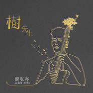

【合并】树先生
============================

|  |  |
| :--: | :-- |
| [ 【合并】树先生](https://emumo.xiami.com/album/2100258360) | **艺人**: [简弘亦](../index.md) **语种**: 国语 **唱片公司**: 磁力音乐 **发行时间**: 2015年12月25日 **专辑类别**: 录音室专辑 **专辑风格**:  **播放数**: 205 **收藏数**: 2 **评论数**: 3  |

## 简介

简弘亦,曾经的蹇红;留著长髮一把长琴;憧憬著音乐嘶吼著理想;  
然,执拗是一些人天生的基因;十年已过,少年不再;  
梦却不曾放下;為自己创作;為他人谱写;一个人有多少曾经;  
一个歌手有多少作品;彷彿白驹过隙一闪而过;用十年的时间来种一棵《树》;  
枝繁叶茂,风吹簌簌......   
  
内地唱作人简弘亦师从臺湾著名音乐人涂惠源,其独特的嗓音及唱法更是一鸣惊人!业内外统一称其為“火山音”,人似山、音似火,是為华语乐坛不可多得的全能歌手!  
  
2015年末,没有媒体的千呼万唤、没有晃眼聚焦的镁光灯、没有主持人的登台讚美。内地唱作人简弘亦首张个人专辑《树先生》面世。好音乐不用时间来衡量,但好音乐需要时间的沉淀和累积。当听完《树先生》专辑,虽十首歌曲风格迥异,但某一个时段歌者的心态,都在细节处体现出来。整张专辑又像是轮回,从第一首《树先生》到最后一首《给过去的自己》,似哀似乐、似怒似喜,似躁似静......  
  
很少有歌手第一张专辑却已退去浮躁,听完《树先生》才明白:如果心是一棵树,就明白,不媚,不娇,不争,安静地做好自己。不必大红大紫,生命照样常青;不必大惊大喜,生命一样丰盈;遥看到风中的一棵树,它不正是这样吗?孤峰上顶天的树,就算树叶凋零,就算随风而去,树依然是树,笔直的躯乾,依然瘦骨嶙峋,  
依然伫立在那儿,吼著风声,坚持著尊严。

## 曲目

## 评论

|  |  |  |
| :-- | :-- | :-- |
|  [虾米用户](https://emumo.xiami.com/u/81757830)  2016-06-09 21:50 赞(0) 踩(0) | 
好专辑
 |
|  [虾米用户](https://emumo.xiami.com/u/87237758)   2016-01-27 23:37 赞(0) 踩(0) | 
好期待
 |
|  [虾米用户](https://emumo.xiami.com/u/45621221) 卸载状态。 2016-01-20 20:31 赞(0) 踩(0) | 
=
 |
