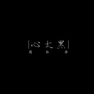

心太黑
============================

|  |  |
| :--: | :-- |
| [ 心太黑](https://emumo.xiami.com/album/2100339912) | **艺人**: [简弘亦](../index.md) **语种**: 国语 **唱片公司**: 磁力音乐 **发行时间**: 2016年05月19日 **专辑类别**: EP, 单曲 **专辑风格**: 流行摇滚 Pop Rock **播放数**: 20721 **收藏数**: 10 **评论数**: 3  |

## 简介

对于唱作歌手来说，自己的作品都代表着某一时刻的状态或情绪表现，现在的简弘亦安静且内敛，被熟知也是因为痛彻心扉的情歌或热门电视剧中的歌曲。回头望去的他曾经却是一名标准“滚圈”少年，攒着乐队、留着披肩的脏发、住在灰土坏绕的地下室，在地下的地下嘶吼着、唾弃着、希望可以改变这个世界。《心太黑》也将收录在简弘亦即将发行的新专辑《树先生》中。  
《心太黑》不是一首“新歌”，蒙尘在录音室内的电脑硬盘中。在录制这首歌的时候简弘亦带着不忿带着批判，嘲笑着人们空虚的大脑和匮乏的精神世界，可是从现在回头审视，自己不也是芸芸众生，五谷杂粮堆砌的肉身。在简弘亦看来《心太黑》的意义已经不是曾经，它承载着一个歌手的成长轨迹，变化成内心深处前进的动力，最终回归到音乐本身，最终回到脚踏实地的生活。  
现在听《心太黑》依旧是一首很“沉重”的摇滚歌曲，从手机、TV的即时信息中接收到永无休止却真实存在的“心太黑”，但是我们都没有注意到，在批判、谩骂、麻木中审视自身，才是ROCK的精髓吧！

## 曲目

## 评论

|  |  |  |
| :-- | :-- | :-- |
|  [虾米用户](https://emumo.xiami.com/u/204843941)   2016-09-01 13:24 赞(0) 踩(0) | 
㊅㊅㊅㊅㊅
 |
|  [虾米用户](https://emumo.xiami.com/u/204943685)  2016-07-25 12:33 赞(0) 踩(0) | 
666
 |
|  [虾米用户](https://emumo.xiami.com/u/2152213)  2016-05-20 22:04 赞(2) 踩(0) | 
这首歌对于我恰到好处，一语点破周遭这个混沌、混乱的世界
 |
