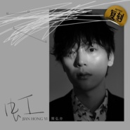
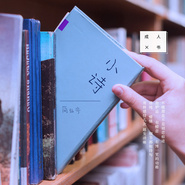
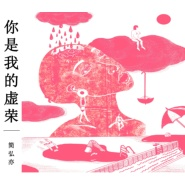
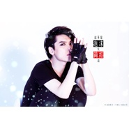

简弘亦
============================

|  |  |
| :--: | :-- |
| [ 简弘亦](https://i.xiami.com/jianhong) | **地区**: China 中国大陆 **风格**: 流行摇滚 Pop Rock, 国语流行 Mandarin Pop **播放数**: 61636129 **粉丝数**: 47808 **评论数**: 382  |

## 档案

简弘亦 (Jason Hong)，原名蹇红、简红，1986年10月3日出生于湖南省常德市，中国内地男歌手、音乐制作人。 
简弘亦出生在音乐世家，拥有标志性的火山音和创作才华，14岁完成的第一首歌《爱的学校》就被香港歌手陈慧琳收入《微光》专辑。师从涂惠源老师，曾与方文山首度合作歌曲《武娘》，为曹格、孙楠、张靓颖、常石磊、黄龄、毛泽少等众多歌手作曲制作，作品累计超过300首，包揽了30余部热门影视作品的作曲和演唱。曾荣获华语金曲奖年度唱作人，最佳影视歌曲和最佳新人奖。他演唱的歌曲全网总播放量高达20亿。集演唱、作曲、编曲、制作于一身。

## 专辑

| 名称 | 语种 | 唱片公司 | 发行时间 | 专辑类别 | 专辑风格 |
| :--: | :-- | :-- | :-- | :-- | :-- |
| [ 爱上爱](./albums/5022214097.md) | 国语 | 嘉尤音乐 | 2020年12月16日 | 原声带, 影视音乐 |  |
| [ 虹](./albums/5021861032.md) | 国语 | 网易云音乐 | 2020年10月02日 | EP, 单曲 |  |
| [ 金沙](./albums/5021347278.md) | 国语 | 环球动音（北京） | 2020年08月26日 | EP, 单曲 | 国语流行 Mandarin Pop |
| [ 小说Novel](./albums/5021288320.md) | 国语 | 环球动音（北京） | 2020年08月10日 | EP, 单曲 |  |
| [ 一个人](./albums/5021162513.md) | 国语 | 光影岁月 | 2020年07月22日 | EP, 单曲 |  |
| [ 南方的少年](./albums/5021149999.md) | 国语 | 环球动音（北京） | 2020年06月26日 | EP, 单曲 |  |
| [ 忽如一面](./albums/5020794441.md) | 国语 | 环球动音（北京） | 2020年05月29日 | EP, 单曲 | 流行 Pop |
| [ 愿](./albums/2108383074.md) | 国语 | 环球动音（北京） | 2020年04月24日 | EP, 单曲 | 国语流行 Mandarin Pop |
| [ 感谢每一个你](./albums/2420340548.md) | 国语 | 梦织音 | 2020年02月29日 | EP, 单曲 | 国语流行 Mandarin Pop |
| [ 等一树花开](./albums/5020540963.md) | 国语 | 环球动音（北京） | 2020年02月18日 | EP, 单曲 | 国语流行 Mandarin Pop |
| [ 太多](./albums/5020547983.md) | 国语 | 环球动音（北京） | 2019年09月10日 | EP, 单曲 | 国语流行 Mandarin Pop |
| [ 左家垅的夏天](./albums/5020586022.md) | 国语 | 环球动音（北京） | 2019年07月10日 | EP, 单曲 | 国语流行 Mandarin Pop |
| [ 说好的幸福](./albums/5020556180.md) | 国语 | 环球动音（北京） | 2019年06月24日 | EP, 单曲 | 国语流行 Mandarin Pop |
| [ 歌者](./albums/5020576559.md) | 国语 | 环球动音（北京） | 2019年04月04日 | EP, 单曲 | 国语流行 Mandarin Pop |
| [ 叶雪](./albums/2104840789.md) | 国语 | 环球动音（北京） | 2019年03月22日 | EP, 单曲 | 国语流行 Mandarin Pop |
| [ 成人书](./albums/2104396823.md) | 国语 | 环球动音（北京） | 2018年12月20日 | 录音室专辑 | 国语流行 Mandarin Pop |
| [ 如焉](./albums/2104366763.md) | 国语 | 大格娱乐 | 2018年12月15日 | EP, 单曲 | 国语流行 Mandarin Pop |
| [ 小诗](./albums/2104057679.md) | 国语 | 腾讯音乐人 | 2018年09月24日 | EP, 单曲 | 国语流行 Mandarin Pop |
| [ 越爱越瘦](./albums/2104037077.md) | 国语 | 腾讯音乐人 | 2018年09月17日 | EP, 单曲 | 国语流行 Mandarin Pop |
| [ 成人书.叶雪叶雪](./albums/2104025027.md) | 国语 | 独立发行 | 2018年09月07日 | EP, 单曲 | 爵士流行 Jazz Pop |
| [ 不染](./albums/2103982969.md) | 国语 | 腾讯音乐人 | 2018年08月16日 | EP, 单曲 | 国语流行 Mandarin Pop |
| [ 简弘亦“柔软的国”2018全国巡回演唱会](./albums/5020700075.md) | 国语 |  | 2018年07月25日 | 录音室专辑 | 流行 Pop |
| [ 牌楼口岸](./albums/2103721766.md) | 国语 | 独立发行 | 2018年05月28日 | EP, 单曲 | 国语流行 Mandarin Pop |
| [ 体面](./albums/2103472832.md) | 国语 | 独立发行 | 2018年01月05日 | EP, 单曲 | 流行 Pop |
| [ 简约FM-纯享版](./albums/2103472829.md) | 国语 | 独立发行 | 2018年01月04日 | EP, 单曲 | 流行 Pop |
| [ 柔软的国Soft Land](./albums/2102663075.md) | 国语 | 简弘亦工作室, 红海音乐 | 2017年12月22日 | 录音室专辑 | 国语流行 Mandarin Pop |
| [ 简约FM经典唱作电台](./albums/2103605095.md) | 国语 | 独立发行 | 2017年11月11日 | 播客 | 流行 Pop, 国语流行 Mandarin Pop |
| [ 男人装不装](./albums/2102852582.md) | 国语 | 红海音乐 | 2017年09月07日 | EP, 单曲 | 国语流行 Mandarin Pop |
| [ 诗词歌赋](./albums/2102852056.md) | 国语 | 独立发行 | 2017年09月06日 | EP, 单曲 | 流行 Pop |
| [ 当过去只剩下这一声叹息](./albums/2102821033.md) | 国语 | 红海音乐 | 2017年08月28日 | EP, 单曲 |  |
| [ 诗词歌赋](./albums/2102817295.md) | 国语 | 独立发行 | 2017年08月20日 | EP, 单曲 | 国语流行 Mandarin Pop |
| [ 天涯明月](./albums/2102765719.md) | 国语 | 红海音乐 | 2017年06月15日 | EP, 单曲 | 国语流行 Mandarin Pop |
| [ 思美人](./albums/2102746809.md) | 国语 | 红海音乐 | 2017年05月12日 | EP, 单曲 | 国语流行 Mandarin Pop |
| [ 天问](./albums/2102743026.md) | 国语 | 红海音乐 | 2017年05月05日 | EP, 单曲 | 流行 Pop |
| [ Away From Here](./albums/2103523711.md) | 英语 | 看见音乐 (上海) | 2017年04月21日 | EP, 单曲 | 流行摇滚 Pop Rock |
| [ 伤心花](./albums/2102704840.md) | 国语 | 红海音乐 | 2017年03月06日 | EP, 单曲 | 国语流行 Mandarin Pop |
| [ Do You Love Me](./albums/2102677629.md) | 英语 | 红海音乐 | 2017年01月09日 | EP, 单曲 | 流行 Pop |
| [ 你就不要想起我](./albums/2102672385.md) | 国语 | 红海音乐 | 2016年12月26日 | EP, 单曲 | 流行 Pop |
| [ 问](./albums/2102665673.md) | 国语 | 磁力音乐 | 2016年12月19日 | EP, 单曲 | 流行 Pop |
| [ 你一定要幸福](./albums/2102644517.md) | 国语 | 红海音乐 | 2016年11月07日 | EP, 单曲 | 流行 Pop |
| [ 你是我的虚荣](./albums/2102641974.md) | 国语 | 红海乐能 | 2016年10月24日 | EP, 单曲 | 流行 Pop |
| [ 情歌](./albums/2100390279.md) | 国语 | 红海乐能 | 2016年09月14日 | EP, 单曲 | 流行 Pop |
| [ 树先生](./albums/2100383335.md) | 国语 | 乐享天承 | 2016年08月26日 | EP, 单曲 | 流行 Pop |
| [ 在这世界上没有天使](./albums/5020755119.md) | 国语 | 环球动音（北京） | 2016年08月23日 | 原声带, 影视音乐 | 国语流行 Mandarin Pop |
| [ 魔鬼中的天使](./albums/2100378861.md) | 国语 | 磁力文化 | 2016年08月12日 | EP, 单曲 | 流行 Pop |
| [ 小幸运](./albums/2100370964.md) | 国语 | 磁力音乐 | 2016年07月22日 | EP, 单曲 | 流行 Pop |
| [ 摇滚藏獒](./albums/2100365792.md) | 国语 | 磁力音乐 | 2016年07月12日 | EP, 单曲 |  |
| [ 羽风然](./albums/2100364536.md) | 国语 | 磁力国际 | 2016年07月08日 | EP, 单曲 |  |
| [ 末日审判](./albums/2100351105.md) | 国语 | 磁力音乐 | 2016年06月06日 | EP, 单曲 | 流行摇滚 Pop Rock |
| [ 心太黑](./albums/2100339912.md) | 国语 | 磁力音乐 | 2016年05月19日 | EP, 单曲 | 流行摇滚 Pop Rock |
| [ 选择性失忆](./albums/2100302962.md) | 国语 | 磁力音乐 | 2016年03月30日 | EP, 单曲 | 国语流行 Mandarin Pop |
| [ 心动](./albums/2100296996.md) | 国语 | 磁力音乐 | 2016年03月21日 | EP, 单曲 | 流行 Pop |
| [ 出卖](./albums/2100290278.md) | 国语 | 磁力音乐 | 2016年03月09日 | EP, 单曲 | 流行 Pop |
| [ 光之翼](./albums/2100285928.md) | 国语 | 磁力音乐 | 2016年03月03日 | EP, 单曲 |  |
| [ 我好想你](./albums/2100279394.md) | 国语 | 磁力音乐 | 2016年02月22日 | EP, 单曲 | 流行 Pop |
| [ 选择性失忆](./albums/5020742128.md) | 国语 | 环球动音（北京） | 2016年01月22日 | EP, 单曲 | 国语流行 Mandarin Pop |
| [ 失落沙洲](./albums/2100263418.md) | 国语 | 磁力音乐 | 2016年01月20日 | EP, 单曲 | 国语流行 Mandarin Pop |
| [ 【合并】树先生](./albums/2100258360.md) | 国语 | 磁力音乐 | 2015年12月25日 | 录音室专辑 |  |
| [ 第九十九滴眼泪](./albums/2100243736.md) | 国语 | 磁力音乐 | 2015年12月03日 | EP, 单曲 |  |
| [ 就算我唱遍所有情歌](./albums/2100238370.md) | 国语 | 磁力音乐 | 2015年11月17日 | EP, 单曲 | 国语流行 Mandarin Pop |
| [ 眼泪成诗](./albums/2100233460.md) | 国语 | 磁力音乐 | 2015年11月06日 | EP, 单曲 | 国语流行 Mandarin Pop |
| [ 战鹰](./albums/2100229242.md) | 国语 | 磁力音乐 | 2015年10月29日 | EP, 单曲 |  |
| [ 默](./albums/2100175395.md) | 国语 | 掌上精彩 | 2015年07月27日 | EP, 单曲 | 流行 Pop |
| [ 给过去的自己简红](./albums/1722635129.md) | 国语 | 独立发行 | 2015年01月31日 | 录音室专辑 | 另类摇滚 Alternative Rock, 国语流行 Mandarin Pop |
| [ 失去爱情](./albums/422622318.md) | 国语 | 掌上精彩 | 2014年12月16日 | EP, 单曲 |  |
| [ 我的特一营](./albums/310407486.md) | 国语 | 磁力音乐 | 2014年09月11日 | 原声带, 影视音乐 | 国语流行 Mandarin Pop |
| [ 泡沫](./albums/1199425303.md) | 国语 | 掌上精彩 | 2014年05月07日 | EP, 单曲 | 国语流行 Mandarin Pop |
| [ 失语者](./albums/1285528949.md) | 国语 | 星云乐众 | 2013年11月28日 | EP, 单曲 | 流行摇滚 Pop Rock |
| [ 无名花](./albums/1764882312.md) | 国语 | 星云乐众 | 2013年04月01日 | 原声带, 影视音乐 | 国语流行 Mandarin Pop |
| [ 想家的人](./albums/576204.md) | 国语 | 红海音乐 | 2013年01月30日 | EP, 单曲 |  |
| [ 深蓝色的情书](./albums/489359.md) | 国语 | 红海音乐 | 2012年11月28日 | EP, 单曲 | 流行 Pop |
| [ 风归云](./albums/505650.md) | 国语 | 独立发行 | 2012年04月09日 | EP, 单曲 | 摇滚 Rock & Roll |
| [ Ich komm im Fernsehn](./albums/2103548493.md) | 英语 | 看见音乐 (上海) | 2008年08月05日 | 录音室专辑 | 世界音乐 World Music |

## 评论

|  |  |  |
| :-- | :-- | :-- |
|  [虾米用户](https://emumo.xiami.com/u/358104299) 悲观的唯心存在现实解构虚... 2021-02-01 06:55 赞(1) 踩(0) | 
47244
 |
|  [虾米用户](https://emumo.xiami.com/u/2210029) 我还没想好要写什么... 2020-08-12 09:44 赞(0) 踩(0) | 
2020.08.12: 应该原来是姓翦吧&amp;hellip;&amp;hellip;常德人，维族？
 |
|  [虾米用户](https://emumo.xiami.com/u/2210029) 我还没想好要写什么... 2020-08-12 09:42 赞(0) 踩(0) | 
你什么时候火？
 |
|  [虾米用户](https://emumo.xiami.com/u/15958995) 我还没想好要写什么... 2020-07-28 07:11 赞(0) 踩(0) | 
今天第一次听你的歌 声线真好听！
 |
|  [虾米用户](https://emumo.xiami.com/u/86626442) 无聊 2020-06-29 05:43 赞(0) 踩(0) | 
真的是本人吗？
 |
|  [虾米用户](https://emumo.xiami.com/u/2796166) 最爱莫文蔚..... 2020-04-26 00:38 赞(0) 踩(0) | 
加油 加油~~~ 加油~~
 |
|  [虾米用户](https://emumo.xiami.com/u/2796166) 最爱莫文蔚..... 2020-04-25 00:42 赞(1) 踩(0) | 
加油~~~
 |
|  [虾米用户](https://emumo.xiami.com/u/411141265)  2020-04-17 22:42 赞(1) 踩(0) | 
想听你唱伍佰的last dance
 |
|  [虾米用户](https://emumo.xiami.com/u/310762504) 怎样应景 2020-04-04 10:48 赞(1) 踩(0) | 
加油
 |
|  [虾米用户](https://emumo.xiami.com/u/431809953)  2020-03-15 11:11 赞(0) 踩(0) | 
我怎么觉得简弘亦好多自己个找不到了吖
 |
|  [虾米用户](https://emumo.xiami.com/u/672537) 我还没想好要写什么... 2020-02-25 23:21 赞(0) 踩(0) | 
好声音
 |
|  [虾米用户](https://emumo.xiami.com/u/47346891)  2019-12-01 08:48 赞(0) 踩(0) | 
粉了粉了 第一个粉的音乐人
 |
|  [虾米用户](https://emumo.xiami.com/u/371616476)  2019-11-21 09:03 赞(0) 踩(0) | 
加油！
 |
|  [虾米用户](https://emumo.xiami.com/u/14736857)  2019-11-05 11:23 赞(1) 踩(0) | 
喜欢你的声音 很温柔动情 想你多唱点歌
 |
|  [虾米用户](https://emumo.xiami.com/u/328295960)  2019-10-24 13:03 赞(1) 踩(0) | 
正在看湖南卫视的节目《嗨唱转起来》听到一个男生声音 就想到了你 好希望你也去参加这些节目让更多人知道你的声音 他们那样的都能上节目 你的那么好听
 |
|  [虾米用户](https://emumo.xiami.com/u/305745913) 尊重内心，不受干扰，也许... 2019-10-19 06:02 赞(0) 踩(0) | 
第一次听到你唱的《你一定要幸福》就喜欢上了这首歌，哪怕去听原版也没有特别喜欢，可能男生才能唱出不舍的无奈感觉吧。
 |
|  [虾米用户](https://emumo.xiami.com/u/266552592)  2019-09-19 17:37 赞(2) 踩(0) | 
好听
 |
|  [虾米用户](https://emumo.xiami.com/u/374397660) 神只出现在末世 2019-08-27 00:53 赞(1) 踩(0) | 
我觉得你翻唱的眼泪成诗是你的封神之作
 |
|  [虾米用户](https://emumo.xiami.com/u/374397660) 神只出现在末世 2019-08-27 00:48 赞(0) 踩(0) | 
中国大陆唯一能配得上歌神称号的歌手
 |
|  [虾米用户](https://emumo.xiami.com/u/423514237) 我还没想好要写什么... 2019-08-21 20:51 赞(1) 踩(0) | 
大爱   
 |
|  [虾米用户](https://emumo.xiami.com/u/33843799) 音乐随心听 2019-08-09 15:50 赞(1) 踩(0) | 
李荣浩都这么红了，简还远吗
 |
|  [虾米用户](https://emumo.xiami.com/u/424542510)  2019-06-29 05:09 赞(0) 踩(0) | 
一个男的唱这首歌感觉像个受有木有
 |
|  [虾米用户](https://emumo.xiami.com/u/2600070) 支配されても満たされない 2019-06-07 23:10 赞(0) 踩(0) | 
原来…
 |
|  [虾米用户](https://emumo.xiami.com/u/293692544) 你敢给我说话吗？我咬你 2019-04-18 16:58 赞(1) 踩(0) | 
好听
 |
|  [虾米用户](https://emumo.xiami.com/u/334031816)  2019-02-18 01:57 赞(1) 踩(0) | 
好喜欢这个声音啊
 |
|  [虾米用户](https://emumo.xiami.com/u/150413476)  2019-02-07 14:21 赞(3) 踩(0) | 
常德老乡
 |
|  [虾米用户](https://emumo.xiami.com/u/414839433)  2019-01-30 22:11 赞(1) 踩(0) | 
好听
 |
|  [虾米用户](https://emumo.xiami.com/u/35062303) 一个喜欢唱歌的小女孩 2019-01-21 21:37 赞(1) 踩(0) | 
好听！点赞！
 |
|  [虾米用户](https://emumo.xiami.com/u/376618609) 我还没想好要写什么... 2019-01-15 23:43 赞(4) 踩(0) | 
听了这个歌所有版本，最喜欢听你唱的这个！加油！
 |
|  [虾米用户](https://emumo.xiami.com/u/256874854)  2019-01-14 20:43 赞(4) 踩(0) | 
我竟然听情歌哭了
 |
|  [虾米用户](https://emumo.xiami.com/u/411776243)  2019-01-08 06:32 赞(3) 踩(0) | 
声音好听听，耳朵怀孕了
 |
|  [虾米用户](https://emumo.xiami.com/u/411056368)  2019-01-03 20:31 赞(1) 踩(0) | 
hkfkg
 |
|  [虾米用户](https://emumo.xiami.com/u/410273242)  2018-12-26 15:38 赞(7) 踩(0) | 
嘿，我从网易云转战虾米了.前阵子学校有在放你的歌，我特别激动的和我小伙伴说，这个唱歌的人我们互动过呦！特别有才的一个男生
 |
|  [虾米用户](https://emumo.xiami.com/u/405463489) 我还没想好要写什么... 2018-12-25 10:25 赞(1) 踩(0) | 
好像和薛之谦没什么分别嘛
 |
|  [虾米用户](https://emumo.xiami.com/u/299255162)  2018-12-13 23:14 赞(3) 踩(0) | 
关注你好久了，铃声也是你的《小幸运》但我想弟弟你唱首《写给黄淮》，只是觉得你声音合适。。
 |
| ⇒ |  [虾米用户](https://emumo.xiami.com/u/299255162)  2018-12-13 23:16 赞(0) 踩(0) | 
70后都应该喜欢厚重的感性
 |
|  [虾米用户](https://emumo.xiami.com/u/55587169) 当繁华的叶片落尽，生命的... 2018-12-08 19:25 赞(3) 踩(0) | 
声音好好听…
 |
|  [虾米用户](https://emumo.xiami.com/u/261526571) 从前从前，有个人爱你很久... 2018-12-04 19:44 赞(2) 踩(0) | 
爱你
 |
|  [虾米用户](https://emumo.xiami.com/u/59701254)   2018-11-26 22:06 赞(6) 踩(0) | 
声入人心
 |
|  [虾米用户](https://emumo.xiami.com/u/236077664)  2018-11-22 22:42 赞(1) 踩(0) | 
从你的情歌就喜欢上你的歌
 |
|  [虾米用户](https://emumo.xiami.com/u/27774808)  2018-11-20 01:22 赞(1) 踩(0) | 
《问》在哪里。。
 |
|  [虾米用户](https://emumo.xiami.com/u/408786296) 这是我的黑白世界2 2018-11-19 19:03 赞(2) 踩(0) | 
我想听你唱的《你就不要想起我》，我最喜欢的版本
 |
|  [虾米用户](https://emumo.xiami.com/u/253141595)  2018-11-18 23:57 赞(1) 踩(0) | 
生意真的不错，有男人味
 |
|  [虾米用户](https://emumo.xiami.com/u/408705658)  2018-11-15 14:37 赞(2) 踩(0) | 
喜欢  
 |
|  [虾米用户](https://emumo.xiami.com/u/335497598)  2018-11-15 01:42 赞(1) 踩(0) | 
加油↖(^ω^)↗支持你
 |
|  [虾米用户](https://emumo.xiami.com/u/378420565) 一生一世只爱你 2018-10-20 08:19 赞(1) 踩(0) | 
声音很好听
 |
|  [虾米用户](https://emumo.xiami.com/u/47494497) 李志、陈升，“虾米也没有... 2018-10-12 12:01 赞(3) 踩(0) | 
这个声音 感觉离自己好近 好温暖
 |
| ⇒ |  [虾米用户](https://emumo.xiami.com/u/378420565) 一生一世只爱你 2018-10-20 08:20 赞(0) 踩(0) | 
 
 |
|  [虾米用户](https://emumo.xiami.com/u/403257011)  2018-09-07 20:57 赞(1) 踩(0) | 
怎么就是没有喜欢的《你就不要想起我》
 |
|  [虾米用户](https://emumo.xiami.com/u/925375)  2018-08-29 09:41 赞(8) 踩(0) | 
想听你亲口唱《不染》～
 |
|  [虾米用户](https://emumo.xiami.com/u/250155280) 可以不聪明，可别不清醒 2018-08-09 19:52 赞(3) 踩(0) | 
为什么都是翻唱   
 |
|  [虾米用户](https://emumo.xiami.com/u/334776529) 我还没想好要写什么... 2018-07-30 10:00 赞(1) 踩(0) | 
小哥哥加油，唱歌超好听！
 |
|  [虾米用户](https://emumo.xiami.com/u/277957297) 有你就好…… 2018-07-07 21:33 赞(1) 踩(0) | 
好听
 |
|  [虾米用户](https://emumo.xiami.com/u/358545938) 十三 2018-07-01 22:27 赞(1) 踩(0) | 
好听
 |
|  [虾米用户](https://emumo.xiami.com/u/334486991) 哥哥，你离开我们好久了，... 2018-06-10 07:49 赞(2) 踩(0) | 
声音真不错！支持老乡
 |
|  [虾米用户](https://emumo.xiami.com/u/221395731)  2018-06-06 23:51 赞(1) 踩(0) | 
你的每一首歌，我都收藏了
 |
|  [虾米用户](https://emumo.xiami.com/u/221395731)  2018-06-06 23:50 赞(1) 踩(0) | 
能不能唱一首   原来爱情那么伤     好喜欢听你唱歌，你的超级宇宙无敌大粉丝
 |
|  [虾米用户](https://emumo.xiami.com/u/351394071)  2018-05-31 20:15 赞(2) 踩(0) | 
弘亦，你的剑魂号被老吊毁啦 
 |
|  [虾米用户](https://emumo.xiami.com/u/368784472)  2018-05-31 02:02 赞(1) 踩(0) | 
支持亦神
 |
|  [虾米用户](https://emumo.xiami.com/u/368784472)  2018-05-31 02:01 赞(1) 踩(0) | 
因为她喜欢你的歌，便试听了下，结果因为你的一首《出卖》迷上你
 |
|  [虾米用户](https://emumo.xiami.com/u/306549339) 只是太在意 2018-05-17 12:29 赞(1) 踩(0) | 
怎么现在下载你的歌都要VIP了，穷 
 |
|  [虾米用户](https://emumo.xiami.com/u/1749356)   2018-04-29 11:19 赞(2) 踩(0) | 
5.11简弘亦巡回演唱会广州站，因故没法前往，出一张票，180，广州同城交易。具体联系私信
 |
|  [虾米用户](https://emumo.xiami.com/u/321156640) 余生太长，你太难忘 2018-04-24 19:30 赞(2) 踩(0) | 
声音特别好听，支持常德老乡！
 |
|  [虾米用户](https://emumo.xiami.com/u/77662950) 人生总在期待… 2018-04-24 13:49 赞(1) 踩(0) | 
被声音迷住
 |
|  [虾米用户](https://emumo.xiami.com/u/293195478)  天使啊！借你的羽毛一用... 2018-04-14 09:57 赞(1) 踩(0) | 
挺喜欢你的歌
 |
|  [虾米用户](https://emumo.xiami.com/u/356835423)  2018-04-04 17:01 赞(1) 踩(0) | 
你的歌很好听。
 |
|  [虾米用户](https://emumo.xiami.com/u/42103423)   2018-03-30 12:12 赞(1) 踩(0) | 
杭州5.5
 |
|  [虾米用户](https://emumo.xiami.com/u/343094165)  2018-03-23 09:40 赞(1) 踩(0) | 
第一次听的时候是不知道哪个选秀节目上唱的  如果云知道  当时说是火山音  很震撼  多年后    又听到  很喜欢
 |
|  [虾米用户](https://emumo.xiami.com/u/21974901) 身临其境来感受 2018-03-18 03:38 赞(2) 踩(0) | 
我听见他的声音犹如一阵风飘来，是那么的干净，让人流连忘返！
 |
|  [虾米用户](https://emumo.xiami.com/u/1931086) 正义，或许会迟到，但永远... 2018-03-14 18:15 赞(2) 踩(0) | 
支持亦神的音乐。
 |
|  [虾米用户](https://emumo.xiami.com/u/47355043)  2018-03-13 15:10 赞(1) 踩(0) | 
get到，简弘亦记起了虾米账号系列
 |
| ⇒ |  [虾米用户](https://emumo.xiami.com/u/343026378)  2018-04-09 12:13 赞(0) 踩(0) | 
你唱得很好听 ，继续加油吧！！！
 |
|  [虾米用户](https://emumo.xiami.com/u/245591616) 初看不知剧中意 在看已是... 2018-03-04 19:46 赞(0) 踩(0) | 
说真的 你的歌声里有你的故事
 |
|  [虾米用户](https://emumo.xiami.com/u/350791532) 己所不欲，勿施于人。 2018-02-23 21:32 赞(2) 踩(0) | 
声音好听(ง &amp;bull;̀_&amp;bull;́)ง
 |
|  [虾米用户](https://emumo.xiami.com/u/336215310)  2018-02-20 10:15 赞(2) 踩(0) | 
唱得很走心，每一句歌词都刻在我心
 |
|  [虾米用户](https://emumo.xiami.com/u/291862999) 我还没想好要写什么... 2018-02-16 23:11 赞(0) 踩(0) | 
能教教我吗   衷心希望    想写歌 唱给心爱的她 
 |
|  [虾米用户](https://emumo.xiami.com/u/3496718) idle space 2018-02-07 01:00 赞(1) 踩(0) | 
听他翻唱的歌更有感觉，感觉爱上了这把声音，这个人物
 |
|  [虾米用户](https://emumo.xiami.com/u/217586973)  2018-02-03 13:05 赞(1) 踩(0) | 
几年后 你一定会红.
 |
|  [虾米用户](https://emumo.xiami.com/u/344714321) is life 2018-02-01 23:54 赞(1) 踩(0) | 
大爱简弘亦
 |
|  [虾米用户](https://emumo.xiami.com/u/343862317)  2018-01-29 01:52 赞(0) 踩(0) | 
此人不红，没天理
 |
|  [虾米用户](https://emumo.xiami.com/u/256849437)  2018-01-25 17:46 赞(0) 踩(0) | 
女歌被你唱了就变男歌了，真厉害 
 |
|  [虾米用户](https://emumo.xiami.com/u/222258814)  2018-01-22 00:26 赞(0) 踩(0) | 
从你翻唱的体面吸引过来了，还是觉得你唱的最好听 很喜欢
 |
|  [虾米用户](https://emumo.xiami.com/u/213093288)  2018-01-13 22:05 赞(2) 踩(0) | 
谁能告诉我，简弘亦有哪首歌是原唱？想听听！！
 |
| ⇒ |  [虾米用户](https://emumo.xiami.com/u/188585103)  2018-01-14 13:26 赞(0) 踩(0) | 
反派，退场嘉宾&amp;hellip;&amp;hellip;有不少的
 |
| ⇒ |  [虾米用户](https://emumo.xiami.com/u/188585103)  2018-01-14 13:27 赞(0) 踩(0) | 
过节，深蓝色的气球
 |
| ⇒ |  [虾米用户](https://emumo.xiami.com/u/188585103)  2018-01-14 13:28 赞(0) 踩(0) | 
阍者
 |
|  [虾米用户](https://emumo.xiami.com/u/343158202)  2018-01-13 11:57 赞(0) 踩(0) | 
加油
 |
|  [虾米用户](https://emumo.xiami.com/u/303940651)  2018-01-12 13:51 赞(3) 踩(0) | 
一个火山音 非选择唱情歌 ， 沦陷了  。音域得改变肯定能火
 |
|  [虾米用户](https://emumo.xiami.com/u/324186142)  2018-01-12 11:19 赞(3) 踩(0) | 
被体面收粉
 |
|  [虾米用户](https://emumo.xiami.com/u/137346070)  2018-01-12 09:37 赞(0) 踩(0) | 
明明人很帅，封面却不好看
 |
|  [虾米用户](https://emumo.xiami.com/u/314585287)  2018-01-10 22:55 赞(1) 踩(0) | 
5.11&amp;ldquo;柔软的国&amp;rdquo;2018巡回演唱会，希望我能去
 |
|  [虾米用户](https://emumo.xiami.com/u/7438375) 万般故事，不过情伤 2017-12-18 01:59 赞(3) 踩(0) | 
再没新的翻唱了吗，喜欢你翻唱的歌曲，真的很好听
 |
|  [虾米用户](https://emumo.xiami.com/u/872639) 音乐是一种生活方式 2017-12-17 21:40 赞(0) 踩(0) | 
蹇红？
 |
|  [虾米用户](https://emumo.xiami.com/u/334543703)  2017-12-03 22:48 赞(1) 踩(0) | 
嗓子真好
 |
|  [虾米用户](https://emumo.xiami.com/u/336348380)  2017-11-20 00:17 赞(2) 踩(0) | 
你怎么不在网易混了！！！
 |
|  [虾米用户](https://emumo.xiami.com/u/121294400) 最好的结果是从未开始 2017-11-19 14:08 赞(0) 踩(0) | 
生日不是10月3日吗
 |
|  [虾米用户](https://emumo.xiami.com/u/335612541)   2017-11-19 01:41 赞(40) 踩(0) | 
这厉害的嗓子，缺的是一首快速红的发紫的歌。  
 |
|  [虾米用户](https://emumo.xiami.com/u/66823378)  2017-11-18 21:26 赞(3) 踩(0) | 
我觉得比薛之谦声音好听
 |
|  [虾米用户](https://emumo.xiami.com/u/141027886) 在下还没想好要写什么… 2017-11-18 19:06 赞(4) 踩(0) | 
不知道怎么，脑海里突然冒出一句：不要变成薛之谦。   
 |
|  [虾米用户](https://emumo.xiami.com/u/329686810)  2017-11-12 16:55 赞(1) 踩(0) | 
他是我女朋友
 |
|  [虾米用户](https://emumo.xiami.com/u/334031411)  2017-11-09 08:51 赞(3) 踩(0) | 
只差一个机会，就差一个机会。 还是营销包装出了问题，歌迷会都一盘散沙，，蹇红，你太低调了又没绯闻，所以默默无闻，真男人  我从没孩子听到现在两个孩子了，我都没放弃，你也不要放弃哈，，-xxx上海歌迷-v
 |
| ⇒ |  [虾米用户](https://emumo.xiami.com/u/263054434)  2017-11-23 13:14 赞(0) 踩(0) | 
我觉得原创可能少点，需要一首惊艳的原创
 |
|  [虾米用户](https://emumo.xiami.com/u/48916742)  2017-10-28 00:45 赞(24) 踩(0) | 
第一次听简弘亦是《出卖》记得当时搜这首歌然后有事要处理没注意看谁唱的（我之前都是不听翻唱的歌的），到了晚上静悄悄的时候带上耳机听《出卖》这声音直接听的上瘾，只要是简弘亦的歌我都听现在。原谅我文笔不好书读得少
 |
|  [虾米用户](https://emumo.xiami.com/u/329809052) 真假心甘情愿。 2017-10-12 17:45 赞(0) 踩(0) | 
用情。
 |
|  [虾米用户](https://emumo.xiami.com/u/257916895)   2017-10-08 22:27 赞(0) 踩(0) | 
可是确没有这首歌
 |
| ⇒ |  [虾米用户](https://emumo.xiami.com/u/218789411)  2018-07-23 15:02 赞(0) 踩(0) | 
我
 |
|  [虾米用户](https://emumo.xiami.com/u/257916895)   2017-10-08 22:26 赞(1) 踩(0) | 
你就不要想起我，我专程来听这首的，你唱的！
 |
|  [虾米用户](https://emumo.xiami.com/u/306483468)  2017-10-05 15:58 赞(0) 踩(0) | 
喜欢你的歌
 |
|  [虾米用户](https://emumo.xiami.com/u/2246280) 千里江山寒色远，芦花深处... 2017-09-10 21:51 赞(3) 踩(0) | 
翻唱的很多歌都超越了原唱，从《默》开始听的，可惜被虾米下架了。感情处理得到位，技巧也很好，一定要继续加油哦！
 |
|  [虾米用户](https://emumo.xiami.com/u/269133230) 别低头，王冠会掉。 2017-09-03 21:19 赞(2) 踩(0) | 
很喜欢你的声音  你是我虾米里唯一关注的歌手  不知道你看不看的到   希望你坚持下去  我相信总有一天你的声音会被更多的人发现  更多的人喜欢   我遇见你时高二  现在高三啦   不早不晚  我遇见了你        嗯  就当你看到了好了  要是可以的话   能不能唱 可乐  给我听  我总觉得你的声音才配得上这首歌  我们一起加油吧   感谢你陪我走过过去的这一年   高三还好你还在 
 |
| ⇒ |  [虾米用户](https://emumo.xiami.com/u/310152843)  2017-09-18 07:22 赞(0) 踩(0) | 
加油
 |
| ⇒ |  [虾米用户](https://emumo.xiami.com/u/269133230) 别低头，王冠会掉。 2017-09-19 22:28 赞(0) 踩(0) | 
<q><b>扑通叮咚说：</b></q>
 |
|  [虾米用户](https://emumo.xiami.com/u/317518626)  2017-09-02 20:37 赞(1) 踩(0) | 
感觉听你的歌还真是一种亨受
 |
|  [虾米用户](https://emumo.xiami.com/u/321268796)  2017-08-27 14:29 赞(0) 踩(0) | 
。。
 |
|  [虾米用户](https://emumo.xiami.com/u/256041646)  2017-08-26 19:52 赞(2) 踩(0) | 
喜欢你的声音，才发现人是个帅哥，哈哈，好喜欢你的歌啊每首都很好听
 |
|  [虾米用户](https://emumo.xiami.com/u/1614867) 我还没想好要写什么... 2017-08-17 22:55 赞(1) 踩(0) | 
会红的，希望能听到更多的原创作品！
 |
|  [虾米用户](https://emumo.xiami.com/u/272674400) 饱暖思XX 2017-08-15 23:10 赞(0) 踩(0) | 
不错不错
 |
|  [虾米用户](https://emumo.xiami.com/u/246787242) 我能聽到風裡有歌兒 2017-08-15 18:55 赞(1) 踩(0) | 
之前就听过他的歌，几天前在文学颁奖礼看了现场啊～竟然是我第一个看现场的音乐人 
 |
|  [虾米用户](https://emumo.xiami.com/u/64568366)  2017-08-03 21:24 赞(0) 踩(0) | 
声音不错
 |
|  [虾米用户](https://emumo.xiami.com/u/64568366)  2017-08-03 21:23 赞(0) 踩(0) | 
很不错
 |
|  [虾米用户](https://emumo.xiami.com/u/234101930) ------------... 2017-07-30 21:37 赞(2) 踩(0) | 
港真声音好听！！！！翻唱也很有实力啊！！！！要是能改编一下就最好啦啦啦啦  
 |
|  [虾米用户](https://emumo.xiami.com/u/210394922) 斯文的敗類 穿著衣冠的禽... 2017-07-22 23:30 赞(0) 踩(0) | 
300
 |
|  [虾米用户](https://emumo.xiami.com/u/268456235)  2017-07-22 11:25 赞(0) 踩(0) | 
很喜欢你的歌 
 |
|  [虾米用户](https://emumo.xiami.com/u/233727757) 一个有趣的小凡人 有着自... 2017-07-21 06:57 赞(0) 踩(0) | 
可能我喜欢的人又要火了吧 
 |
|  [虾米用户](https://emumo.xiami.com/u/1931086) 正义，或许会迟到，但永远... 2017-07-20 18:32 赞(4) 踩(0) | 
最爱简弘亦的都市火山流行音乐。
 |
| ⇒ |  [虾米用户](https://emumo.xiami.com/u/1931086) 正义，或许会迟到，但永远... 2017-09-19 21:06 赞(0) 踩(0) | 
感觉简弘亦的都市火山流行音乐比董贞的古代仙侠音乐好多了。
 |
|  [虾米用户](https://emumo.xiami.com/u/293327281)  2017-07-19 14:39 赞(0) 踩(0) | 
你好，喜欢你的歌有：默、伤心花，等收藏啦！谢谢带里这么好听的歌      
 |
|  [虾米用户](https://emumo.xiami.com/u/265941721) “像风一样” 2017-07-13 00:50 赞(0) 踩(0) | 
超喜欢你的声音
 |
|  [虾米用户](https://emumo.xiami.com/u/214341015) 嗨 2017-07-08 15:33 赞(0) 踩(0) | 
❤
 |
|  [虾米用户](https://emumo.xiami.com/u/63034978)  2017-07-08 09:27 赞(0) 踩(0) | 
声音太好了
 |
|  [虾米用户](https://emumo.xiami.com/u/3440860)  2017-07-06 14:47 赞(3) 踩(0) | 
现在只听了情歌，觉得比原唱还好，抓耳朵。
 |
|  [虾米用户](https://emumo.xiami.com/u/9813603) 虾米都听。 2017-07-04 14:23 赞(1) 踩(0) | 
创作型歌手，有前途，期待以后更多更好的作品
 |
|  [虾米用户](https://emumo.xiami.com/u/3496718) idle space 2017-07-03 21:11 赞(0) 踩(0) | 
我深深的爱上这个声音
 |
|  [虾米用户](https://emumo.xiami.com/u/300953519)  2017-07-03 17:51 赞(0) 踩(0) | 
我想听你唱如果有来生，感觉你能唱出另一种感觉，可以吗，给我赞好吗？真心喜欢，想听你唱的
 |
|  [虾米用户](https://emumo.xiami.com/u/300953519)  2017-07-03 17:48 赞(0) 踩(0) | 
很喜欢你，喜欢你的声音
 |
|  [虾米用户](https://emumo.xiami.com/u/39202684) 我不想我有一天变成当初厌... 2017-07-03 17:02 赞(0) 踩(0) | 
简红啊简红，自从听到你的《情歌》，就知道这个声音我终于找到了。想你红，又不想你红。又不舍得你红，又不舍得你不红。如果有一天你红了，请你还这样唱歌，永远不要变
 |
|  [虾米用户](https://emumo.xiami.com/u/308969288)  2017-07-02 17:55 赞(0) 踩(0) | 
你好啊
 |
|  [虾米用户](https://emumo.xiami.com/u/306522559)  2017-06-29 08:43 赞(0) 踩(0) | 
好声音不要被埋没了啊
 |
|  [虾米用户](https://emumo.xiami.com/u/297390919)  2017-06-28 21:36 赞(1) 踩(0) | 
喜欢他的歌，总有种想哭的感觉！
 |
|  [虾米用户](https://emumo.xiami.com/u/282813762) 这条路越来越漫长，看不到... 2017-06-24 20:18 赞(1) 踩(0) | 
我觉得你的声音很好听 
 |
|  [虾米用户](https://emumo.xiami.com/u/286418099)  2017-06-23 16:40 赞(2) 踩(0) | 
非常喜欢你的歌曲，我也是常德滴，你莫搞事情啊等两年啦一定要比张杰红。永远爱你爱你的歌曲，    
 |
|  [虾米用户](https://emumo.xiami.com/u/648020)  2017-06-19 13:47 赞(106) 踩(0) | 
他是及其研究技术的歌手，情感也用的到位，没有那种用力过猛的反感。我觉得大多的翻唱都很赞，都让我更偏心他的版本。一个极有爆发力的嗓音，大多数时候按耐着能量，压抑自己的天性，让能量沿着一个小小的缝隙静静释放，这种能唱摇滚的人，一旦安静地唱起情歌来，就动人地可怕，就好像你只是轻轻抬起手，就以神奇的力量驯服了一只猛兽。当时听林肯公园也唱过一首很可爱的歌，真的是可爱的不得了，觉得这种反差感太有趣了。
 |
| ⇒ |  [虾米用户](https://emumo.xiami.com/u/279783780)  2017-07-20 05:32 赞(0) 踩(0) | 
林肯公园什么歌
 |
| ⇒ |  [虾米用户](https://emumo.xiami.com/u/648020)  2017-07-20 09:14 赞(0) 踩(0) | 
<q><b>純素志说：</b></q>
 |
| ⇒ |  [虾米用户](https://emumo.xiami.com/u/279783780)  2017-07-20 12:42 赞(0) 踩(0) | 
哈哈谢谢。原来是海绵宝宝插曲啊。这首也很可爱: 分享  Linkin Park 的歌曲《PB n&amp;#39; Jellyfish》<a href="https://www.xiami.com/song/3467624?_uxid=DC4CFBBE5F1982B46EBBEAB07B9562DB" target="_blank" rel="nofollow noreferrer noopener">https://www.xiami.com/song/3467624?_uxid=DC4CFBBE5F1982B46EBBEAB07B9562DB</a> (分享自@虾米音乐)
 |
| ⇒ |  [虾米用户](https://emumo.xiami.com/u/648020)  2017-07-20 15:06 赞(0) 踩(0) | 
<q><b>純素志说：</b></q>
 |
| ⇒ |  [虾米用户](https://emumo.xiami.com/u/648020)  2017-07-20 15:10 赞(0) 踩(0) | 
<q><b>純素志说：</b></q>
 |
| ⇒ |  [虾米用户](https://emumo.xiami.com/u/279783780)  2017-07-21 05:58 赞(0) 踩(0) | 
<q><b>Lvv说：</b></q>
 |
| ⇒ |  [虾米用户](https://emumo.xiami.com/u/279783780)  2017-07-21 05:59 赞(0) 踩(0) | 
<q><b>Lvv说：</b></q>
 |
| ⇒ |  [虾米用户](https://emumo.xiami.com/u/279783780)  2017-07-21 06:40 赞(0) 踩(0) | 
童年性侵创伤太悲剧了
 |
| ⇒ |  [虾米用户](https://emumo.xiami.com/u/648020)  2017-07-21 07:15 赞(0) 踩(0) | 
<q><b>純素志说：</b></q>
 |
| ⇒ |  [虾米用户](https://emumo.xiami.com/u/279783780)  2017-07-22 16:22 赞(0) 踩(0) | 
<q><b>Lvv说：</b></q>
 |
| ⇒ |  [虾米用户](https://emumo.xiami.com/u/261140345) 只要你敢不懦弱 2018-01-03 09:54 赞(0) 踩(0) | 
你说的很透彻。。很对。同感
 |
| ⇒ |  [虾米用户](https://emumo.xiami.com/u/348912619)  2018-02-24 15:03 赞(0) 踩(0) | 
经历过繁华，也经得起平淡
 |
|  [虾米用户](https://emumo.xiami.com/u/261793014)  2017-06-17 21:48 赞(1) 踩(0) | 
喜欢
 |
|  [虾米用户](https://emumo.xiami.com/u/294772310)  2017-06-15 09:39 赞(1) 踩(0) | 
好样的。
 |
|  [虾米用户](https://emumo.xiami.com/u/302958092)  2017-06-10 23:09 赞(1) 踩(0) | 
 自带光环
 |
|  [虾米用户](https://emumo.xiami.com/u/39511039)  2017-06-08 15:16 赞(0) 踩(0) | 
改的这名字用的这照片，我还以为是哪个小鲜肉。差点没认出来。
 |
|  [虾米用户](https://emumo.xiami.com/u/93702698)   2017-06-08 12:21 赞(0) 踩(0) | 
想听 远在眼前的你
 |
|  [虾米用户](https://emumo.xiami.com/u/275896565)  2017-06-07 20:26 赞(0) 踩(0) | 
希望再多一些金典的歌每首歌都能唱出你的特点声音很好听期待你更多的作品！
 |
|  [虾米用户](https://emumo.xiami.com/u/301425513)  2017-06-04 15:24 赞(1) 踩(0) | 
好听一百倍帅哥
 |
|  [虾米用户](https://emumo.xiami.com/u/299950214)  2017-05-30 18:20 赞(1) 踩(0) | 
好听到炸裂，一个嗓音这么沧桑的男人还能这么娇柔造作的唱副歌，完美结合
 |
|  [虾米用户](https://emumo.xiami.com/u/9368417) 听最酷的歌，摸最柔的波 2017-05-26 14:04 赞(0) 踩(0) | 
Hi 歌的时候，赵浴辰怼过简红谁让他改名。。狠话，可是现在赵浴辰改成了赵紫骅， 我竟然还记得，说明节目很好。。加油！多做作品红不红好像也就那么回事吧作品比较重要
 |
|  [虾米用户](https://emumo.xiami.com/u/285463681)   2017-05-21 17:55 赞(0) 踩(0) | 
为什么都是翻唱啊？
 |
|  [虾米用户](https://emumo.xiami.com/u/287901017)  2017-05-19 12:44 赞(1) 踩(0) | 
你唱的很棒。第一首听到你的歌是梁静茹的情歌 非常带感。不论你会不会火 期望未来能听到更多你唱的歌。
 |
|  [虾米用户](https://emumo.xiami.com/u/296690126) 自信胜过一切！勿忘初心。 2017-05-17 11:01 赞(1) 踩(0) | 
支持，支持，还是支持  
 |
|  [虾米用户](https://emumo.xiami.com/u/9386032) 那个小小小... 2017-05-16 12:23 赞(1) 踩(0) | 
第一时间想到陈势安
 |
|  [虾米用户](https://emumo.xiami.com/u/38918617) 你相信我，我相信你 2017-05-12 14:36 赞(0) 踩(0) | 
换头像了真帅！
 |
|  [虾米用户](https://emumo.xiami.com/u/15466184) Niceboy 2017-05-09 23:12 赞(1) 踩(0) | 
长的不帅不重要 是土气
 |
| ⇒ |  [虾米用户](https://emumo.xiami.com/u/299950214)  2017-05-30 18:19 赞(0) 踩(0) | 
对  士气   我原谅你打了错别字
 |
|  [虾米用户](https://emumo.xiami.com/u/31460809) 暂无签名~ 2017-05-09 13:42 赞(0) 踩(0) | 
太喜欢他了
 |
|  [虾米用户](https://emumo.xiami.com/u/227987134) 裁剪冰绡，轻叠数重。 2017-05-09 06:21 赞(2) 踩(0) | 
他的声音带有一种情怀，感染到有故事的人，我们之所以喜欢听抒情的歌曲，是因为我们都曾经爱过一个人却又遗憾收场吧。
 |
|  [虾米用户](https://emumo.xiami.com/u/1931086) 正义，或许会迟到，但永远... 2017-05-08 20:25 赞(2) 踩(0) | 
我在2012年通过《声动亚洲》渐渐了解简弘亦的火山流行音乐。
 |
|  [虾米用户](https://emumo.xiami.com/u/256364772)  2017-05-06 00:09 赞(3) 踩(0) | 
他唱的《问》特别好听，从问开始了解它的
 |
|  [虾米用户](https://emumo.xiami.com/u/51516457)  2017-05-02 21:39 赞(0) 踩(0) | 
捡到的宝贝
 |
|  [虾米用户](https://emumo.xiami.com/u/285317688)  2017-05-01 09:22 赞(0) 踩(0) | 
唱歌好好听
 |
|  [虾米用户](https://emumo.xiami.com/u/84350566) 融入血液里的音乐 2017-04-25 22:14 赞(1) 踩(0) | 
温暖的声音，从小幸运开始
 |
|  [虾米用户](https://emumo.xiami.com/u/290771568)  2017-04-23 08:38 赞(0) 踩(0) | 
非常不错
 |
|  [虾米用户](https://emumo.xiami.com/u/9402480) 皱月觉鱼来，已乘鲤鱼去。... 2017-04-23 01:21 赞(0) 踩(0) | 
非常好的声音
 |
|  [虾米用户](https://emumo.xiami.com/u/282294878)  2017-04-22 19:46 赞(0) 踩(0) | 
非常好听
 |
|  [虾米用户](https://emumo.xiami.com/u/22335997)  2017-04-18 22:16 赞(0) 踩(0) | 
很好听
 |
|  [虾米用户](https://emumo.xiami.com/u/289108735)  2017-04-17 14:15 赞(1) 踩(0) | 
好听。
 |
|  [虾米用户](https://emumo.xiami.com/u/251315496) 音乐让生活更有味道。。。 2017-04-15 15:08 赞(0) 踩(0) | 
具有夺命感染力的声音，只有你
 |
|  [虾米用户](https://emumo.xiami.com/u/251315496) 音乐让生活更有味道。。。 2017-04-15 15:08 赞(0) 踩(0) | 
具有夺命感染力的声音，只有你
 |
| ⇒ |  [虾米用户](https://emumo.xiami.com/u/288342027)  2017-04-17 16:13 赞(0) 踩(0) | 
赞 
 |
| ⇒ |  [虾米用户](https://emumo.xiami.com/u/290798557)  2017-04-23 18:27 赞(0) 踩(0) | 
<q><b>ss2017jj说：</b></q>
 |
|  [虾米用户](https://emumo.xiami.com/u/283432399)  2017-04-14 20:03 赞(1) 踩(0) | 
好喜欢你，声音好听 
 |
|  [虾米用户](https://emumo.xiami.com/u/1931086) 正义，或许会迟到，但永远... 2017-04-12 19:33 赞(0) 踩(0) | 
很想听你唱 五月的雪 。
 |
|  [虾米用户](https://emumo.xiami.com/u/5029435) 我还没想好要写什么... 2017-04-09 14:03 赞(2) 踩(0) | 
就像讲故事 只是加上了我们耳熟能详的BGM
 |
|  [虾米用户](https://emumo.xiami.com/u/287371155)  2017-04-09 11:34 赞(4) 踩(0) | 
超温暖的声音，很好听
 |
|  [虾米用户](https://emumo.xiami.com/u/286675331)  2017-04-08 09:24 赞(2) 踩(0) | 
等伤心开出一朵花
 |
|  [虾米用户](https://emumo.xiami.com/u/286815395)  2017-04-07 10:35 赞(0) 踩(0) | 
我喜欢
 |
|  [虾米用户](https://emumo.xiami.com/u/286037447)  2017-04-05 11:19 赞(0) 踩(0) | 
支持，好听，关注
 |
|  [虾米用户](https://emumo.xiami.com/u/34823662) 暂无签名~ 2017-03-31 10:29 赞(1) 踩(0) | 
想听你唱  你知道我在等你吗
 |
|  [虾米用户](https://emumo.xiami.com/u/284182245)  2017-03-30 13:11 赞(0) 踩(0) | 
唱的好听
 |
|  [虾米用户](https://emumo.xiami.com/u/284222420)  2017-03-29 09:39 赞(4) 踩(0) | 
简弘亦的声音真的很有特色，像在耳边呢喃，又直击内心深处，希望他有更多的代表作，加油！
 |
|  [虾米用户](https://emumo.xiami.com/u/126729908)   2017-03-28 10:38 赞(1) 踩(0) | 
希望原唱多
 |
|  [虾米用户](https://emumo.xiami.com/u/126729908)   2017-03-28 10:36 赞(1) 踩(0) | 
好听   
 |
|  [虾米用户](https://emumo.xiami.com/u/205747623)  2017-03-27 23:53 赞(0) 踩(0) | 
老铁唱的歌扎心了  力挺 
 |
|  [虾米用户](https://emumo.xiami.com/u/100055354)  2017-03-25 12:21 赞(39) 踩(0) | 
小幸运比原版更好听
 |
| ⇒ |  [虾米用户](https://emumo.xiami.com/u/84350566) 融入血液里的音乐 2017-04-25 22:15 赞(0) 踩(0) | 
同感
 |
| ⇒ |  [虾米用户](https://emumo.xiami.com/u/141300226) 爱我所爱@ 2017-06-24 17:51 赞(0) 踩(0) | 
同感
 |
| ⇒ |  [虾米用户](https://emumo.xiami.com/u/292627419)  2017-08-06 00:05 赞(0) 踩(0) | 
然而你在骗人
 |
| ⇒ |  [虾米用户](https://emumo.xiami.com/u/1931086) 正义，或许会迟到，但永远... 2017-08-15 07:50 赞(0) 踩(0) | 
同感。
 |
|  [虾米用户](https://emumo.xiami.com/u/100055354)  2017-03-25 12:19 赞(0) 踩(0) | 
好好听的
 |
|  [虾米用户](https://emumo.xiami.com/u/283129492)  2017-03-25 08:07 赞(1) 踩(0) | 
声音听得每首情歌都想哭
 |
|  [虾米用户](https://emumo.xiami.com/u/282694873)  2017-03-25 08:05 赞(0) 踩(0) | 
歌很好听啊
 |
|  [虾米用户](https://emumo.xiami.com/u/283093242) 我必须要睡了 2017-03-25 02:51 赞(60) 踩(0) | 
薛之谦都红了哥你一定要坚持住 
 |
| ⇒ |  [虾米用户](https://emumo.xiami.com/u/283205384)  2019-05-26 16:22 赞(0) 踩(0) | 
哈哈哈哈哈哈哈哈哈哈哈哈哈哈哈哈哈哈哈哈哈哈哈哈这位同学 ，这个“都”字用得妙，值得鉴赏一翻，
 |
| ⇒ |  [虾米用户](https://emumo.xiami.com/u/263919126)  2020-10-23 14:42 赞(0) 踩(0) | 
没错没错，坚持住啊
 |
|  [虾米用户](https://emumo.xiami.com/u/282898492)  2017-03-24 12:52 赞(0) 踩(0) | 
每个人女人都渴望一定要幸福
 |
|  [虾米用户](https://emumo.xiami.com/u/282294951)   2017-03-21 22:24 赞(0) 踩(0) | 
歌都很好听啊
 |
|  [虾米用户](https://emumo.xiami.com/u/254536595)  2017-03-18 12:23 赞(0) 踩(0) | 
很棒
 |
|  [虾米用户](https://emumo.xiami.com/u/280810052)  2017-03-16 17:52 赞(0) 踩(0) | 
66666
 |
|  [虾米用户](https://emumo.xiami.com/u/268013273) 千万董小姐，一个莉莉安 2017-03-14 00:37 赞(1) 踩(0) | 
这优质男嗓这的没谁了，他不火天理不容啊
 |
|  [虾米用户](https://emumo.xiami.com/u/31254861)  2017-03-08 11:15 赞(1) 踩(0) | 
声音真的好听   
 |
|  [虾米用户](https://emumo.xiami.com/u/3496718) idle space 2017-02-25 21:27 赞(4) 踩(0) | 
他翻唱的歌就变成了他的歌，很喜欢他的声音，很舒服，真心赞~~~
 |
|  [虾米用户](https://emumo.xiami.com/u/209004442)  2017-02-24 06:54 赞(0) 踩(0) | 
666
 |
|  [虾米用户](https://emumo.xiami.com/u/145241322) 终究时间会带走一切。。 2017-02-17 13:48 赞(2) 踩(0) | 
翻唱狗一个。。
 |
|  [虾米用户](https://emumo.xiami.com/u/273927533)  2017-02-16 20:12 赞(0) 踩(0) | 
喜欢他的声音
 |
|  [虾米用户](https://emumo.xiami.com/u/43416768)   2017-02-08 04:18 赞(0) 踩(0) | 
喜欢声音
 |
|  [虾米用户](https://emumo.xiami.com/u/253175052)  2017-02-06 12:28 赞(1) 踩(0) | 
群居动物是本人原创的吗
 |
|  [虾米用户](https://emumo.xiami.com/u/253175052)  2017-02-05 23:54 赞(0) 踩(0) | 
单曲循环&amp;lt;群居动物&amp;gt;中，声音很好听，以后会继续关注你的，加油↖(^ω^)↗
 |
|  [虾米用户](https://emumo.xiami.com/u/256065304)   2017-02-05 19:41 赞(0) 踩(0) | 
你选的歌都好棒的
 |
|  [虾米用户](https://emumo.xiami.com/u/93226796) 只见雪色映衣袂，抚琴月显... 2017-01-28 14:17 赞(0) 踩(0) | 
《爱枯荣》怎么没有啊~
 |
|  [虾米用户](https://emumo.xiami.com/u/203852198)  2017-01-07 23:07 赞(1) 踩(0) | 
声音太好听了   
 |
|  [虾米用户](https://emumo.xiami.com/u/250412510)  2016-12-31 23:19 赞(0) 踩(0) | 
喜欢你的声音
 |
|  [虾米用户](https://emumo.xiami.com/u/248617041)   2016-12-23 10:51 赞(0) 踩(0) | 
想听你唱（如果你也听说） 
 |
|  [虾米用户](https://emumo.xiami.com/u/252414672)   2016-12-06 03:14 赞(0) 踩(0) | 
泡沫，小幸运。贼棒
 |
|  [虾米用户](https://emumo.xiami.com/u/16456755)  2016-12-05 21:27 赞(0) 踩(0) | 
  
 |
|  [虾米用户](https://emumo.xiami.com/u/16456755)  2016-12-05 21:27 赞(0) 踩(0) | 

 |
|  [虾米用户](https://emumo.xiami.com/u/9069362)   2016-12-03 23:51 赞(0) 踩(0) | 
歌曲制作略粗糙。
 |
|  [虾米用户](https://emumo.xiami.com/u/247165158)  2016-11-18 18:00 赞(1) 踩(0) | 
我姓简，只有一个歌手， 
 |
|  [虾米用户](https://emumo.xiami.com/u/3427742) ཨོཾ་ཨཱཿཧཱུྃ་... 2016-11-17 06:58 赞(0) 踩(0) | 
第一次听到的是在腾讯手游节奏大师里…就喜欢上他的声音了
 |
|  [虾米用户](https://emumo.xiami.com/u/49894256)   2016-11-14 00:17 赞(0) 踩(0) | 

 |
|  [虾米用户](https://emumo.xiami.com/u/18168300)  你好，孤独。 2016-11-13 01:01 赞(0) 踩(0) | 
深夜听他的声音好迷人
 |
|  [虾米用户](https://emumo.xiami.com/u/242456543)  2016-11-11 06:02 赞(0) 踩(0) | 
唱的超级好听，      
 |
|  [虾米用户](https://emumo.xiami.com/u/112837688)  2016-10-27 20:17 赞(0) 踩(0) | 
说实话 我很少听中文歌 也很少听情歌 不过真的被吸引了
 |
|  [虾米用户](https://emumo.xiami.com/u/5591661) ， 2016-10-26 15:45 赞(0) 踩(0) | 
听他的声音像在耳边对我说情话。
 |
|  [虾米用户](https://emumo.xiami.com/u/239112516)  2016-10-22 18:58 赞(1) 踩(0) | 
听了几个版本的小幸运，被他的声音吸引了！
 |
|  [虾米用户](https://emumo.xiami.com/u/223324789)   2016-10-08 17:56 赞(2) 踩(0) | 
听完歌 搜人 尴尬了
 |
|  [虾米用户](https://emumo.xiami.com/u/229687429)  2016-10-05 13:07 赞(1) 踩(0) | 
出卖，仿佛在看电影
 |
|  [虾米用户](https://emumo.xiami.com/u/21198501) 爱生活，爱自己。 2016-09-27 23:37 赞(1) 踩(0) | 
这声音好迷人。。
 |
|  [虾米用户](https://emumo.xiami.com/u/229394336)  2016-09-24 08:24 赞(1) 踩(0) | 
兄弟一条命
 |
|  [虾米用户](https://emumo.xiami.com/u/93178884) 为人低调...谢谢 2016-07-15 15:07 赞(2) 踩(0) | 
失语者很好听，偶然听到，然后听完了他所有的翻唱。
 |
|  [虾米用户](https://emumo.xiami.com/u/189943054) 邰昌弘 2016-07-14 18:13 赞(0) 踩(0) | 
羽风然很好听   
 |
|  [虾米用户](https://emumo.xiami.com/u/72666568)  2016-05-30 23:39 赞(0) 踩(0) | 
啦啦啦啦，就是心痒
 |
|  [虾米用户](https://emumo.xiami.com/u/11591285)   2016-05-28 20:40 赞(1) 踩(0) | 
好一首树，难得金曲！一般的根本比不上。高水准。
 |
|  [虾米用户](https://emumo.xiami.com/u/45791700)   2016-05-24 21:37 赞(0) 踩(0) | 
求心太黑的伴奏跟吉他谱
 |
|  [虾米用户](https://emumo.xiami.com/u/867185) 羁放纵不爱自由 2015-11-21 12:41 赞(2) 踩(0) | 
为什么 默 听不了了 ？
 |
|  [虾米用户](https://emumo.xiami.com/u/7321193) 唯有音乐与爱不可辜负。 2015-11-17 15:27 赞(0) 踩(0) | 
好！新歌终于来了
 |
|  [虾米用户](https://emumo.xiami.com/u/38974282)  2015-11-14 23:41 赞(0) 踩(0) | 
喜欢(*ˉ︶ˉ*)
 |
|  [虾米用户](https://emumo.xiami.com/u/8337700)  2015-11-07 01:16 赞(0) 踩(0) | 
我被他的声音和一首《坏人恋人》骗咯2年咯，还一直期待他有好歌，结果...唉，你可长点心啊！
 |
|  [虾米用户](https://emumo.xiami.com/u/2152213)  2015-11-06 21:18 赞(1) 踩(0) | 
又改名了一 一！
 |
|  [虾米用户](https://emumo.xiami.com/u/51813853)  2015-10-09 01:05 赞(0) 踩(0) | 
好听 
 |
|  [虾米用户](https://emumo.xiami.com/u/52763836)  2015-08-18 22:53 赞(2) 踩(0) | 
喜欢你的声音 
 |
|  [虾米用户](https://emumo.xiami.com/u/33272803)  2015-08-15 20:21 赞(0) 踩(0) | 
声音和长相严重不匹配。
 |
|  [虾米用户](https://emumo.xiami.com/u/49797008)  2015-08-14 01:41 赞(1) 踩(0) | 
蹇红帅歌！同样歌出自、简红以唱简直独一无二！
 |
|  [虾米用户](https://emumo.xiami.com/u/49797008)  2015-08-14 01:37 赞(1) 踩(0) | 
蹇红帅歌！你的歌基本安全会了。
 |
|  [虾米用户](https://emumo.xiami.com/u/867185) 羁放纵不爱自由 2015-08-12 22:02 赞(0) 踩(0) | 
默的处理太好了！深情和泛滥兼得。
 |
|  [虾米用户](https://emumo.xiami.com/u/11428127) 可爱迷人的反派角色 2015-08-10 18:12 赞(0) 踩(0) | 
很单纯的喜欢他的声音吧
 |
|  [虾米用户](https://emumo.xiami.com/u/3882720) 人生如逆旅 我亦是行人 2015-07-18 22:33 赞(0) 踩(0) | 
又改名了。。加油，其实挺不错的。
 |
|  [虾米用户](https://emumo.xiami.com/u/12971839) 在白酒婊的道路上一去不复... 2015-06-30 18:13 赞(4) 踩(0) | 
蹇红 简红 简弘亦...
 |
|  [虾米用户](https://emumo.xiami.com/u/8635478) 换个地方思考 2015-06-09 12:33 赞(0) 踩(0) | 
这版本的泡沫好像不错喔，有点沙哑的声音
 |
|  [虾米用户](https://emumo.xiami.com/u/2111888)  2015-06-05 00:06 赞(0) 踩(0) | 
简红
 |
|  [虾米用户](https://emumo.xiami.com/u/45878244)  2015-01-11 07:53 赞(0) 踩(0) | 
《我的特一营》中兄弟歌唱的真汉子给力啊！感觉电视剧中兄弟歌有点少可以在适当的时候再插播几段！刚看完特一营！个人感觉可以再拍真实血腥暴力残忍点！优点：片中歌曲给力感人肺腑等等！建议要是拍个电影就好啦把细节再拍好点！来生还当亲弟兄。。。！！！铁打的汉子直愣愣……
 |
|  [虾米用户](https://emumo.xiami.com/u/6927670) 僵尸只吃脑子,所以亲爱的... 2015-01-09 08:06 赞(0) 踩(0) | 
太爱你
 |
|  [虾米用户](https://emumo.xiami.com/u/3496718) idle space 2014-12-23 19:55 赞(0) 踩(0) | 
用心做音乐的男人特别有魅力~~
 |
|  [虾米用户](https://emumo.xiami.com/u/3496718) idle space 2014-12-09 00:36 赞(0) 踩(0) | 
我喜欢这哥们
 |
|  [虾米用户](https://emumo.xiami.com/u/24121097)  2014-11-13 13:33 赞(0) 踩(0) | 
嗓音好听，男中音，喜欢他的温柔情歌
 |
|  [虾米用户](https://emumo.xiami.com/u/11923311) turn me on 2014-11-09 22:54 赞(0) 踩(0) | 
如果云知道，一出声就被吸引了
 |
|  [虾米用户](https://emumo.xiami.com/u/7250735)  2014-10-31 21:00 赞(0) 踩(0) | 
嗓音真心男人  长的也很帅  但拼在一起有点....
 |
|  [虾米用户](https://emumo.xiami.com/u/6687266)   2014-10-02 13:42 赞(0) 踩(0) | 
好丑！
 |
| ⇒ |  [虾米用户](https://emumo.xiami.com/u/10680749) 凌晨大风。 2015-09-19 02:06 赞(0) 踩(0) | 
……
 |
|  [虾米用户](https://emumo.xiami.com/u/10705993)  2014-09-23 22:59 赞(1) 踩(0) | 
看到封面简直就要关，幸好声音出来了
 |
|  [虾米用户](https://emumo.xiami.com/u/2243104)  2014-09-14 19:55 赞(0) 踩(0) | 
简红的声音是男人魅力磁性，声音太诱人了！！！
 |
|  [虾米用户](https://emumo.xiami.com/u/1842946) 我还没想好要写什么... 2014-09-01 15:19 赞(0) 踩(0) | 
声音 不像本人
 |
|  [虾米用户](https://emumo.xiami.com/u/7172511)  2014-08-21 21:28 赞(0) 踩(0) | 
声音真棒，希望能有更好的作品
 |
|  [虾米用户](https://emumo.xiami.com/u/3302495)  2014-08-21 11:35 赞(0) 踩(0) | 
声动亚洲的时候超级棒
 |
|  [虾米用户](https://emumo.xiami.com/u/17277186) 暂无签名~ 2014-08-19 02:07 赞(0) 踩(0) | 
泡沫好听
 |
|  [虾米用户](https://emumo.xiami.com/u/2982338) 我多想和你一样臭不要脸 2014-08-14 07:54 赞(0) 踩(0) | 
声音比样子洋气一些...
 |
| ⇒ |  [虾米用户](https://emumo.xiami.com/u/24835207) 音乐无国界! 2014-08-25 12:27 赞(0) 踩(0) | 
这评价●_●。。。。。
 |
|  [虾米用户](https://emumo.xiami.com/u/3670982)  2014-07-30 19:42 赞(0) 踩(0) | 
居然上了好声音了，虽然被淘汰了。听的时候，感觉吊着，不上不下，心痒痒难受
 |
|  [虾米用户](https://emumo.xiami.com/u/7014158)  2014-07-17 20:21 赞(0) 踩(0) | 
哈哈，看了评论很多人说长相和声音联系不到一起，这就是反差萌嘛其实
 |
|  [虾米用户](https://emumo.xiami.com/u/9076873)  2014-07-14 13:53 赞(0) 踩(0) | 
好性感的声音啊！
 |
|  [虾米用户](https://emumo.xiami.com/u/2362427)  2014-07-05 16:49 赞(0) 踩(0) | 
好嗓音 快找些好的創作人合作 必紅
 |
|  [虾米用户](https://emumo.xiami.com/u/7393263)   2014-06-18 22:57 赞(0) 踩(0) | 
感觉比原唱好听啊
 |
|  [虾米用户](https://emumo.xiami.com/u/717217) 静 2014-06-17 20:21 赞(0) 踩(0) | 
风归云 前奏 王菲 再见萤火虫
 |
|  [虾米用户](https://emumo.xiami.com/u/15416981) 奇迹每天都在上演 2014-06-06 20:15 赞(0) 踩(0) | 

 |
|  [虾米用户](https://emumo.xiami.com/u/15416981) 奇迹每天都在上演 2014-06-06 10:07 赞(0) 踩(0) | 
一见钟情的声音，
 |
|  [虾米用户](https://emumo.xiami.com/u/9261161) 音乐里流动 2014-06-02 16:02 赞(0) 踩(0) | 
所谓的“火山音”，老家常德。 封面的话，我翻了下，08年左右的形象和现在算是天壤之别的，现在竟然被贴上了VR的标签……
 |
|  [虾米用户](https://emumo.xiami.com/u/8642055) 才華來自崇高的信仰。 2014-05-24 22:51 赞(0) 踩(0) | 
很有傾訴欲的嗓音。唱得第一句泡沫就愛上了。
 |
|  [虾米用户](https://emumo.xiami.com/u/722837) 886 2014-05-23 18:24 赞(0) 踩(0) | 
第一眼把名字看成寒红，话说蹇红怎么读
 |
| ⇒ |  [虾米用户](https://emumo.xiami.com/u/13814807) quit loving. 2014-06-16 11:03 赞(0) 踩(0) | 
就读简红
 |
|  [虾米用户](https://emumo.xiami.com/u/29197411) 我还没想好要写什么... 2014-05-17 17:26 赞(54) 踩(0) | 
这声音和这长相真心不匹配
 |
|  [虾米用户](https://emumo.xiami.com/u/6209108)  2014-05-17 10:18 赞(0) 踩(0) | 
听了泡沫过来的，希望能有你自己的好歌吧
 |
|  [虾米用户](https://emumo.xiami.com/u/68218) 盯鞋的妹子你威武雄壮 2014-05-14 12:17 赞(99) 踩(0) | 
这声音和这长相我怎么也捏不到一块儿是病吗 = =
 |
| ⇒ |  [虾米用户](https://emumo.xiami.com/u/7290390) *´∀`* 2014-05-25 01:49 赞(0) 踩(0) | 
你不是一个人。。
 |
| ⇒ |  [虾米用户](https://emumo.xiami.com/u/22225463)   2015-10-05 20:12 赞(0) 踩(0) | 
我他妈也是，哈哈哈哈哈哈
 |
| ⇒ |  [虾米用户](https://emumo.xiami.com/u/39202684) 我不想我有一天变成当初厌... 2017-01-02 20:16 赞(0) 踩(0) | 
瘦子老烟嗓
 |
| ⇒ |  [虾米用户](https://emumo.xiami.com/u/200088806) 我还是很喜欢你，像日月星... 2017-04-05 16:02 赞(0) 踩(0) | 
你不是。我也嘗試了很久。
 |
| ⇒ |  [虾米用户](https://emumo.xiami.com/u/123371272)  2017-06-14 00:33 赞(0) 踩(0) | 
不止你，还有我
 |
| ⇒ |  [虾米用户](https://emumo.xiami.com/u/268003348)  2017-06-15 08:44 赞(0) 踩(0) | 
我觉得没毛病啊。
 |
| ⇒ |  [虾米用户](https://emumo.xiami.com/u/336501336)  2018-01-18 16:09 赞(0) 踩(0) | 
你不是人 
 |
| ⇒ |  [虾米用户](https://emumo.xiami.com/u/436469265)  我有病，我爱哭……所以... 2020-10-01 18:23 赞(0) 踩(0) | 
如果是病那我也有
 |
|  [虾米用户](https://emumo.xiami.com/u/5530016)  2014-05-10 10:16 赞(0) 踩(0) | 
好听，泡沫
 |
|  [虾米用户](https://emumo.xiami.com/u/656467) 专注狗血二十年 2014-05-10 01:08 赞(0) 踩(0) | 
封面好毁那么气质的声音！！！
 |
|  [虾米用户](https://emumo.xiami.com/u/26275414) 暂无签名~ 2014-05-09 23:15 赞(0) 踩(0) | 
抓紧给换个封面啊！这么好听的声音，白瞎了！
 |
|  [虾米用户](https://emumo.xiami.com/u/3433110) 重拾虾米 2014-05-09 20:22 赞(0) 踩(0) | 
声音很赞～
 |
|  [虾米用户](https://emumo.xiami.com/u/36060338) 和光同尘 黑暗共生 2014-05-09 17:18 赞(0) 踩(0) | 
听了泡沫来的  声音特别好听 可是其他歌…  希望有好歌可以让你唱到吧
 |
| ⇒ |  [虾米用户](https://emumo.xiami.com/u/8337700)  2014-09-27 00:19 赞(0) 踩(0) | 
坏人恋人不错噢
 |
|  [虾米用户](https://emumo.xiami.com/u/11416610) 我就笑笑不说话~~ 2014-05-09 08:48 赞(0) 踩(0) | 
顶~
 |
|  [虾米用户](https://emumo.xiami.com/u/36315485)  2014-05-08 22:28 赞(0) 踩(0) | 
加油，非常牛逼，下一个天王
 |
|  [虾米用户](https://emumo.xiami.com/u/13209368) 擅长睡觉。 2014-05-08 18:08 赞(0) 踩(0) | 
嗓音很棒
 |
|  [虾米用户](https://emumo.xiami.com/u/3807881)  2014-05-07 19:27 赞(0) 踩(0) | 
嗓音很吸引人，词写的也不错。
 |
|  [虾米用户](https://emumo.xiami.com/u/33866904) 男子汉大丈夫当仁不让！ 2014-04-14 17:02 赞(0) 踩(0) | 
不听不行
 |
|  [虾米用户](https://emumo.xiami.com/u/280791) @愚細胞 2014-04-06 17:23 赞(1) 踩(0) | 
风格一栏里有VR吓到我了
 |
|  [虾米用户](https://emumo.xiami.com/u/1073821) 著名糖纸收藏家 2014-03-01 17:48 赞(0) 踩(0) | 
视觉摇滚个鬼？？？
 |
|  [虾米用户](https://emumo.xiami.com/u/9998915)  2014-01-13 01:25 赞(0) 踩(0) | 
第三张乍一看还以为是崔英道····································
 |
|  [虾米用户](https://emumo.xiami.com/u/10714344) 马鹿马鹿し 2013-12-29 10:37 赞(0) 踩(0) | 
无名花，美爆！
 |
|  [虾米用户](https://emumo.xiami.com/u/17659403)  2013-12-27 16:03 赞(0) 踩(0) | 
喜欢这声音
 |
|  [虾米用户](https://emumo.xiami.com/u/17659403)  2013-12-27 16:00 赞(0) 踩(0) | 
怎么加你的关注啊？？
 |
|  [虾米用户](https://emumo.xiami.com/u/28425905) 独家唱作公众号:简约FM 2013-11-28 00:16 赞(458) 踩(0) | 
我刚入驻了虾米音乐人，欢迎大家来我的个人主页，收听我的最新音乐
 |
| ⇒ |  [虾米用户](https://emumo.xiami.com/u/1626495)  2014-12-18 07:59 赞(0) 踩(0) | 
好棒好棒！沧桑叔音＋妖孽长相，违和得太美好了！
 |
| ⇒ |  [虾米用户](https://emumo.xiami.com/u/49797008)  2015-08-14 01:35 赞(0) 踩(0) | 
帅歌！你到底啥名？我是你铁杆粉丝。帅歌声音：大气、真男人！
 |
| ⇒ |  [虾米用户](https://emumo.xiami.com/u/7321193) 唯有音乐与爱不可辜负。 2016-03-05 15:47 赞(0) 踩(0) | 

 |
| ⇒ |  [虾米用户](https://emumo.xiami.com/u/254686154) 爱周星驰and窦骁 2017-03-11 13:57 赞(0) 踩(0) | 
嗯哒
 |
| ⇒ |  [虾米用户](https://emumo.xiami.com/u/282901207)  2017-03-24 17:00 赞(0) 踩(0) | 
好的 
 |
| ⇒ |  [虾米用户](https://emumo.xiami.com/u/284184677)  2017-03-31 12:39 赞(0) 踩(0) | 
搞不懂这些张嘴就骂的人，你的翻唱都很有深度。
 |
| ⇒ |  [虾米用户](https://emumo.xiami.com/u/282294878)  2017-04-22 19:47 赞(0) 踩(0) | 
赞
 |
| ⇒ |  [虾米用户](https://emumo.xiami.com/u/290092875)  2017-05-07 00:54 赞(0) 踩(0) | 
今天发现了你的歌，太动听了，歌声太吸引了
 |
| ⇒ |  [虾米用户](https://emumo.xiami.com/u/9353944)  2017-05-26 22:02 赞(0) 踩(0) | 
我也不知道为什么，不需要知道你的样貌，只要听着你的声音，我就爱上你了。我听到了我未来的爱人的声音。
 |
| ⇒ |  [虾米用户](https://emumo.xiami.com/u/285284994) 加油 2017-06-03 19:51 赞(0) 踩(0) | 
你是真人吗？
 |
| ⇒ |  [虾米用户](https://emumo.xiami.com/u/3816811) 初闻不知曲中意，再听已是... 2017-06-14 23:52 赞(0) 踩(0) | 
真的好听
 |
| ⇒ |  [虾米用户](https://emumo.xiami.com/u/141300226) 爱我所爱@ 2017-06-21 07:28 赞(0) 踩(0) | 
太喜欢了，太好听了
 |
| ⇒ |  [虾米用户](https://emumo.xiami.com/u/141300226) 爱我所爱@ 2017-06-21 07:29 赞(0) 踩(0) | 
突然发现你的歌，太喜欢了，超级爱
 |
| ⇒ |  [虾米用户](https://emumo.xiami.com/u/285642770) 我还没想好要写什么... 2017-06-25 00:55 赞(0) 踩(0) | 
赞，轻轻哼唱的调调好喜欢！
 |
| ⇒ |  [虾米用户](https://emumo.xiami.com/u/309877046)  2017-07-07 19:29 赞(0) 踩(0) | 
可以多唱一些歌感觉你唱的比原唱还好听好喜欢你的声音！
 |
| ⇒ |  [虾米用户](https://emumo.xiami.com/u/311943576)  2017-07-13 19:51 赞(0) 踩(0) | 
我是安乡五中的，你是我的学长，你的歌真的很好听，希望你能继续加油。
 |
| ⇒ |  [虾米用户](https://emumo.xiami.com/u/116710060)  2017-07-22 19:46 赞(0) 踩(0) | 
从去年开始一直追随
 |
| ⇒ |  [虾米用户](https://emumo.xiami.com/u/17066703)   2017-08-14 13:20 赞(0) 踩(0) | 
这声音和长相真的不配啊 好听 好看 
 |
| ⇒ |  [虾米用户](https://emumo.xiami.com/u/272287662)   2017-08-14 17:40 赞(0) 踩(0) | 
喜欢你的声音
 |
| ⇒ |  [虾米用户](https://emumo.xiami.com/u/269133230) 别低头，王冠会掉。 2017-09-03 21:21 赞(0) 踩(0) | 
加油
 |
| ⇒ |  [虾米用户](https://emumo.xiami.com/u/255639407)  2017-09-07 23:14 赞(0) 踩(0) | 
你好，喜欢你的音色，你的歌！
 |
| ⇒ |  [虾米用户](https://emumo.xiami.com/u/306483468)  2017-10-05 15:58 赞(0) 踩(0) | 
喜欢你的歌声
 |
| ⇒ |  [虾米用户](https://emumo.xiami.com/u/325587665)  2017-10-18 13:41 赞(0) 踩(0) | 
想听你唱一首 浪费 
 |
| ⇒ |  [虾米用户](https://emumo.xiami.com/u/316738820) 我还没想好要写什么... 2017-10-26 16:57 赞(0) 踩(0) | 
什么时候能听你就不要想起我
 |
| ⇒ |  [虾米用户](https://emumo.xiami.com/u/9425673) 我从黑夜来，但是却喜欢光... 2017-11-30 13:04 赞(0) 踩(0) | 
最早在百度音乐听，现在又遇见了
 |
| ⇒ |  [虾米用户](https://emumo.xiami.com/u/336116666)  2017-12-06 20:41 赞(0) 踩(0) | 
能不能把那首，那就不要想起我，上传上来，想听又没有
 |
| ⇒ |  [虾米用户](https://emumo.xiami.com/u/188585103)  2018-01-14 13:25 赞(0) 踩(0) | 
从QQ音乐到虾米音乐，无论哪里，永远支持你，最帅最认真的你！
 |
| ⇒ |  [虾米用户](https://emumo.xiami.com/u/221395731)  2018-01-23 21:38 赞(0) 踩(0) | 
能唱  最新歌曲  &amp;lt; 体面&amp;gt;给我们听吗，肯定会好听
 |
| ⇒ |  [虾米用户](https://emumo.xiami.com/u/21457101) 我还没想好要写什么... 2018-01-28 12:10 赞(0) 踩(0) | 
嗓音太好听了
 |
| ⇒ |  [虾米用户](https://emumo.xiami.com/u/354660074)  2018-03-18 14:34 赞(0) 踩(0) | 
喜欢你的小缘家和鲸城，感觉很有故事   
 |
| ⇒ |  [虾米用户](https://emumo.xiami.com/u/354660074)  2018-03-18 14:36 赞(0) 踩(0) | 
<q><b>雨沫晴空69864570说：</b></q>
 |
| ⇒ |  [虾米用户](https://emumo.xiami.com/u/278996091)  2018-04-13 16:40 赞(0) 踩(0) | 
你的歌特别有味道，动听
 |
| ⇒ |  [虾米用户](https://emumo.xiami.com/u/92149248) 喜欢声音 2018-04-24 20:11 赞(0) 踩(0) | 
刚974听你现场，超有感，信手拈来，自然契合
 |
| ⇒ |  [虾米用户](https://emumo.xiami.com/u/48533038) 止于唇齿，掩于岁月 2018-04-28 10:00 赞(0) 踩(0) | 
小哥哥，你可不可以翻唱刘若英的成全，感觉你的嗓音唱出来很好听呢
 |
| ⇒ |  [虾米用户](https://emumo.xiami.com/u/354855061)  2018-05-28 13:47 赞(0) 踩(0) | 
看见你的照片，听着你的歌，心里满满都是爱，虽然歌曲都是爱而不得的感情，可是就是能触动心弦
 |
| ⇒ |  [虾米用户](https://emumo.xiami.com/u/4793902) 孤单的时候才知道你真正想... 2018-06-02 10:02 赞(0) 踩(0) | 
加油，注意身体。
 |
| ⇒ |  [虾米用户](https://emumo.xiami.com/u/328074384)  2018-08-02 02:45 赞(0) 踩(0) | 
爱你
 |
| ⇒ |  [虾米用户](https://emumo.xiami.com/u/321028626) 一股清流 2018-11-14 18:56 赞(0) 踩(0) | 
你好简弘亦！！
 |
| ⇒ |  [虾米用户](https://emumo.xiami.com/u/415774022) 酷狗移驾到虾米 2019-04-03 20:32 赞(0) 踩(0) | 
大爱   
 |
| ⇒ |  [虾米用户](https://emumo.xiami.com/u/355374645) 在歌里找回忆 2019-09-01 23:57 赞(0) 踩(0) | 
你的虾米第46571位粉丝
 |
| ⇒ |  [虾米用户](https://emumo.xiami.com/u/336620364)   2020-04-25 17:18 赞(0) 踩(0) | 
你的48767位
 |
|  [虾米用户](https://emumo.xiami.com/u/13416760) 两个人 2013-04-13 12:53 赞(0) 踩(0) | 
个性
 |
|  [虾米用户](https://emumo.xiami.com/u/12132825)  2013-01-22 14:25 赞(0) 踩(0) | 
很爽的磁性十足声音！超赞！
 |
|  [虾米用户](https://emumo.xiami.com/u/26215)  2013-01-18 15:53 赞(1) 踩(0) | 
火山音？
 |
|  [虾米用户](https://emumo.xiami.com/u/11782699) eric 2012-12-04 12:41 赞(0) 踩(0) | 
喜欢
 |
|  [虾米用户](https://emumo.xiami.com/u/3924046)  2012-12-02 20:33 赞(0) 踩(0) | 
声音
 |
|  [虾米用户](https://emumo.xiami.com/u/11724575)  2012-11-30 15:46 赞(1) 踩(0) | 
喜欢他对音乐的执着……唱歌很好听
 |
|  [虾米用户](https://emumo.xiami.com/u/9209060)  2012-11-29 21:33 赞(0) 踩(0) | 
男人的柔情
 |
|  [虾米用户](https://emumo.xiami.com/u/11668306)  2012-11-26 14:43 赞(0) 踩(0) | 
这么好的声音 这么好的音乐 惊艳了
 |
|  [虾米用户](https://emumo.xiami.com/u/7201563)  2012-10-30 22:13 赞(0) 踩(0) | 
声音很好听
 |
|  [虾米用户](https://emumo.xiami.com/u/2152213)  2012-10-07 13:50 赞(1) 踩(0) | 
小崔健
 |
|  [虾米用户](https://emumo.xiami.com/u/3369815) 欧美青春 2012-09-14 02:02 赞(0) 踩(0) | 
特别喜欢他翻唱的《如果云知道》 尼玛百听不厌啊
 |
|  [虾米用户](https://emumo.xiami.com/u/910739)  2012-09-05 17:11 赞(0) 踩(0) | 
火山音
 |
|  [虾米用户](https://emumo.xiami.com/u/7812321) 会いたい。 2012-08-30 12:25 赞(0) 踩(0) | 
隐形的第三者～
 |
|  [虾米用户](https://emumo.xiami.com/u/7007254) 你要的我都有啊~~ 2012-08-18 16:01 赞(0) 踩(0) | 
声音好好听！
 |
|  [虾米用户](https://emumo.xiami.com/u/399869)  2012-08-10 06:31 赞(0) 踩(0) | 
这声音，一定要火起来呀，想听更多蹇红唱的歌
 |
|  [虾米用户](https://emumo.xiami.com/u/2565177) 杂听者 2012-08-02 12:16 赞(0) 踩(0) | 
声音，力量
 |
|  [虾米用户](https://emumo.xiami.com/u/5895756)  2012-07-16 00:18 赞(0) 踩(0) | 
此人不火，天理不容！谁特么选的娘炮封面？！赶紧换！！
 |
|  [虾米用户](https://emumo.xiami.com/u/3179995)   2012-02-18 23:49 赞(0) 踩(0) | 
加油！！！
 |
|  [虾米用户](https://emumo.xiami.com/u/997797)  2012-02-11 22:38 赞(0) 踩(0) | 
好听
 |
