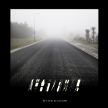

孤单会消失离开不见
============================

|  |  |
| :--: | :-- |
| [ 孤单会消失离开不见](https://emumo.xiami.com/album/2102671362) | **艺人**: [原子邦妮 Astro Bunny](../index.md) **语种**: 国语 **唱片公司**: StreetVoice **发行时间**: 2016年12月25日 **专辑类别**: 录音室专辑 **专辑风格**: 电音流行 Electropop **播放数**: 2255473 **收藏数**: 5524 **评论数**: 100  |

## 简介

孤单总在意想不到时袭来  
每一个时代 每一个地方 每一个人都无法倖免  
一个人孤单  
上学时孤单  
工作时孤单  
甚至与朋友欢聚时仍旧孤单  
如同一种病一样蔓延每寸肌肤  
  
由查查和羽承组成的电子流行双人组合   
时代性的电子声响包裹心裡的每一个声音、每一段故事  
十二首全创作以及两首来自不同音乐伙伴的Remix歌曲  
讲述不同的孤单体验和经历  
透过让乐迷一次次 看完、听完、唱完  
像重新检视每个人内心的孤单旅程般  
看清、理解、释怀 最终【孤单会消失离开不见】  
  
推荐歌曲介绍  
【被你遗忘的森林】  
2015年华人最大独立音乐平台StreetVoice街声年度最受欢迎冠军歌曲，广大乐迷千呼万唤后终于收录于本张专辑。深刻的电子节奏、淡淡的合成器声响、幽美的旋律词句与呢喃的吟唱交织而成，建构于众多抒情歌曲框架之外而独树一格，让乐迷耳朵为之一亮，宛如巨大的森林和回忆一般令人神往，沉静于迷幻氛围当中后，终能迷雾散尽迎向曙光。  
  
【为什麽长大是那麽的痛】  
童年时，总是迫不及待想长大，似乎长大代表著更多自由、海阔天空，直到我们真正面临长大，却不如想像中美好。一个个自身边离去的真挚情谊、纯洁梦想和原本的自己。轻快 Tropical 电子曲风正面迎战脆弱的内心世界，随节拍舞动后重新找回对梦想与生命的热情。  
  
【孤单会消失离开不见】  
孤单，宛如病缘体一般的存在。感染者的眼睛看出去的世界将变为单一色彩，或蓝或红或灰或白，不断蔓延难以摆脱。如果想拯救一个孤单病患者，唯有用无尽的温暖和爱唤醒他们对多彩世界的感观，重新感受学习爱人。原子邦妮式的 Electropop 抒情歌曲，华语情歌的全新诠释风格。  
  
－天亮三部曲系列－  
「18岁之前，你放弃了几次最初的梦想? 」  
如果不再憧景，每一天与末日有何不同？  
如果没有梦想，每个人都只是行尸走肉...  
生活中充斥著黑暗面、负面、懒惰、自私，  
每一个人都有可能被感染，  
在成为自己最讨厌的人之前，  
与现实摊牌，坚持最一开始的自己、保护所爱的人，  
不放弃任何生存的机会，一直到…  
  
由《天亮之前》、《其实你一直是这样的》、《还是会想你》三首歌曲组成。  
MV以末日故事为主轴，三部连贯剧情暗寓逐梦年轻人与现实的竞赛与妥协。  
  
【天亮之前】  
天亮之前的黑夜，深邃而黑暗，令人迷失亦或看清的时刻。敲击著电子 Techno 声响，诉说的是对时代的质疑与勇气的渴求。  
  
【其实你一直是这样的】  
曾经我们都说过 ，不想要变成那种我们最讨厌的大人。当童稚与纯真走远，  
而现实步步逼近时，你开始不认识的 ，可能是那个最熟悉的自己。Chill out 曲风道出最不快乐的快乐 song。  
  
【还是会想你】  
原子邦妮式 Chill out 情歌，在历经与现实和自我的搏斗后，发现还是不断想起你，如同那个始终无法抛弃的初心，都潜藏在大脑   深处，夜深人静时一次次袭击著、提醒著，那些不可能被遗忘的回忆，正是你无法改变，最真实的自己。  
疗癒开阔的电子曲风，抚慰因思念而鬱结的心灵。  
  
 

## 曲目

## 评论

|  |  |  |
| :-- | :-- | :-- |
|  [虾米用户](https://emumo.xiami.com/u/410212283)  2020-11-02 01:26 赞(0) 踩(0) | 
再见了麻花 再见了忧伤   拜拜啦 
 |
|  [虾米用户](https://emumo.xiami.com/u/45682396) 暂无签名~ 2020-09-06 18:52 赞(0) 踩(0) | 
真-高产似母ZHU   哈哈哈哈哈哈
 |
|  [虾米用户](https://emumo.xiami.com/u/853523)  2019-10-24 15:44 赞(0) 踩(0) | 
台湾产电音乐队
 |
|  [虾米用户](https://emumo.xiami.com/u/43714694) WeChat：96529... 2019-05-17 15:31 赞(0) 踩(0) | 
吱/音
 |
|  [虾米用户](https://emumo.xiami.com/u/327453260)  2018-10-24 10:19 赞(0) 踩(0) | 
❤
 |
|  [虾米用户](https://emumo.xiami.com/u/3496718) idle space 2018-08-28 13:43 赞(2) 踩(0) | 
很有分量的一张专辑，都很耐听的
 |
| ⇒ |  [虾米用户](https://emumo.xiami.com/u/4015479)  2018-08-30 10:41 赞(0) 踩(0) | 
整张都不错
 |
|  [虾米用户](https://emumo.xiami.com/u/311129033)  2018-07-03 22:12 赞(0) 踩(0) | 
说歌词幼稚的，不懂不要评论行么，看看很多小鲜肉的，那些才叫空洞无物、幼稚不堪好么
 |
|  [虾米用户](https://emumo.xiami.com/u/34293495) 这家伙很聪明什么也没留下... 2017-12-15 22:00 赞(0) 踩(0) | 
很好听
 |
|  [虾米用户](https://emumo.xiami.com/u/1196077)   2017-10-27 23:18 赞(0) 踩(0) | 
说歌词幼稚的，这个曲风，歌词这样写就是很合适。 说卷舌的，这个恰恰是风格。  你们是居委会大妈吗？要不您给个标准？
 |
|  [虾米用户](https://emumo.xiami.com/u/1878755) 就让我随你去…… 2017-10-14 09:20 赞(0) 踩(0) | 
中国电音在崛起，棒棒哒……
 |
|  [虾米用户](https://emumo.xiami.com/u/216903927) 草生草长 2017-09-03 21:47 赞(0) 踩(0) | 
超级好听
 |
|  [虾米用户](https://emumo.xiami.com/u/6082125) Standing and... 2017-09-01 22:20 赞(0) 踩(0) | 
Perfect
 |
|  [虾米用户](https://emumo.xiami.com/u/7684210) 命中注定 2017-08-28 22:49 赞(0) 踩(0) | 
nice!!!!!!!!!!!!!!!!!!!!!!!!!!!!!!!!bang  bang bang ninini
 |
|  [虾米用户](https://emumo.xiami.com/u/28878477) 我还没想好要写什么... 2017-08-21 18:29 赞(3) 踩(0) | 
之后才发现这张有入围过金曲奖 之后才发现女生是樱桃帮主唱 之后才发现团名曾是花漾年华
 |
|  [虾米用户](https://emumo.xiami.com/u/314990349)  2017-08-09 13:13 赞(0) 踩(0) | 
感觉经历过才找这样的歌
 |
|  [虾米用户](https://emumo.xiami.com/u/288785725) 现在是林宥嘉的小迷弟啊 2017-07-08 12:14 赞(0) 踩(0) | 
好听
 |
|  [虾米用户](https://emumo.xiami.com/u/85645558)   2017-07-05 23:04 赞(0) 踩(0) | 
好听
 |
|  [虾米用户](https://emumo.xiami.com/u/244923385) 就这样吧... 2017-07-01 21:25 赞(0) 踩(0) | 
她的经纪人和唱片公司能力有问题呀，酷我音乐盒里都没这个乐队的名字&amp;hellip;&amp;hellip;
 |
|  [虾米用户](https://emumo.xiami.com/u/42287424) 设计师，摄影人 2017-06-22 13:22 赞(0) 踩(0) | 
已买正版cd，支持好音乐
 |
|  [虾米用户](https://emumo.xiami.com/u/8230565)  2017-06-20 21:38 赞(1) 踩(0) | 
还在坚持音乐真的太好了！
 |
|  [虾米用户](https://emumo.xiami.com/u/201391232) 最快的方法是先抱抱 2017-06-18 23:14 赞(0) 踩(0) | 
Ｇｅｔ.
 |
|  [虾米用户](https://emumo.xiami.com/u/291691164)  2017-04-27 20:55 赞(0) 踩(0) | 
存在不错
 |
|  [虾米用户](https://emumo.xiami.com/u/288715456)  2017-04-15 00:39 赞(0) 踩(0) | 
喜欢存在多一点点
 |
|  [虾米用户](https://emumo.xiami.com/u/52045517)   2017-04-05 15:30 赞(0) 踩(0) | 
好听
 |
|  [虾米用户](https://emumo.xiami.com/u/50466584)  2017-02-15 23:39 赞(0) 踩(0) | 
每首歌都好的，轻快的节奏！
 |
|  [虾米用户](https://emumo.xiami.com/u/21573523) 貞子 2017-02-02 17:24 赞(0) 踩(0) | 
還我原版的為什麼長大是那麼的痛
 |
|  [虾米用户](https://emumo.xiami.com/u/34293495) 这家伙很聪明什么也没留下... 2017-01-26 23:05 赞(0) 踩(0) | 
超级好
 |
|  [虾米用户](https://emumo.xiami.com/u/6082125) Standing and... 2017-01-25 23:15 赞(0) 踩(0) | 
加油！我觉得发音很自然～电音也棒～
 |
|  [虾米用户](https://emumo.xiami.com/u/843367)  2017-01-23 17:09 赞(0) 踩(0) | 
(B-) 编曲也不知道算不算潮，但歌词真的太幼稚了，有时甚至让人尴尬
 |
| ⇒ |  [虾米用户](https://emumo.xiami.com/u/109966566) 旋转着的木马重播着昨天。 2017-05-01 12:04 赞(0) 踩(0) | 
主唱以前是樱桃帮的 后来解散了 可以把这一张专辑当作是对过去的谢幕之作 &amp;ldquo;道别 改变 怀念&amp;rdquo;可能就是这张专辑的主题 。曾经那个乐团的其中两个人都已经不知去向  吉他手变成了胖大婶生了个胖娃娃。查查已经40岁了，感觉歌词没有惊喜却是她心境真实的写照。只有她一个人带着梦想往前走，其他人都驻留在原地。
 |
| ⇒ |  [虾米用户](https://emumo.xiami.com/u/113395806)   2017-06-23 20:53 赞(0) 踩(0) | 
<q><b>六 毛说：</b></q>
 |
|  [虾米用户](https://emumo.xiami.com/u/478527) 好想跟衣服在洗衣机里滚 2017-01-10 01:28 赞(0) 踩(0) | 
电音难做，不错，关注下
 |
|  [虾米用户](https://emumo.xiami.com/u/478527) 好想跟衣服在洗衣机里滚 2017-01-10 01:28 赞(0) 踩(0) | 
电音难做，不错，关注下
 |
|  [虾米用户](https://emumo.xiami.com/u/43864222)  2017-01-09 19:01 赞(0) 踩(0) | 
国内的电音可以做到这么惊艳的，说实话真的不多，在国外流行音乐界，电音是主流，而在我们国家，电音还算是较小众的音乐，主要是华语乐坛容纳不下电音这么“花”的形式，还是比较中规中矩，支持这张！
 |
|  [虾米用户](https://emumo.xiami.com/u/1395744) 嘘，我在听音乐。。。 2017-01-05 12:25 赞(1) 踩(0) | 
民谣封面电音心
 |
|  [虾米用户](https://emumo.xiami.com/u/30117346)  2017-01-04 00:20 赞(0) 踩(0) | 
有自己独特的风格
 |
|  [虾米用户](https://emumo.xiami.com/u/3475541)  2016-12-30 17:36 赞(0) 踩(0) | 
这专是最近歌单中能循环最多曲目的一专
 |
|  [虾米用户](https://emumo.xiami.com/u/3475541)  2016-12-30 17:27 赞(0) 踩(0) | 
好带感的说
 |
|  [虾米用户](https://emumo.xiami.com/u/122338084)  2016-12-29 19:22 赞(0) 踩(0) | 
整张专辑循环了一天~
 |
|  [虾米用户](https://emumo.xiami.com/u/44726124) 我还没想好要写什么... 2016-12-29 10:51 赞(0) 踩(0) | 
整张都很好听啊
 |
|  [虾米用户](https://emumo.xiami.com/u/191882539)  2016-12-27 21:52 赞(0) 踩(0) | 
最好听的国语电子流行音乐
 |
|  [虾米用户](https://emumo.xiami.com/u/30004001) 找到你 2016-12-27 21:08 赞(0) 踩(0) | 
这张专辑简直就是华语版的The DØ
 |
|  [虾米用户](https://emumo.xiami.com/u/43646318)  2016-12-27 17:53 赞(0) 踩(0) | 
more better
 |
|  [虾米用户](https://emumo.xiami.com/u/9670548) 男孩亦有其生活的道理！ 2016-12-27 17:48 赞(0) 踩(0) | 
啊   为什么  不单独电音出张专辑  多棒
 |
|  [虾米用户](https://emumo.xiami.com/u/10792732)  2016-12-27 11:27 赞(1) 踩(0) | 
配乐很好
 |
|  [虾米用户](https://emumo.xiami.com/u/256697941)  2016-12-27 11:02 赞(0) 踩(0) | 
很爱，查查在cherry boom也很赞
 |
|  [虾米用户](https://emumo.xiami.com/u/52776404)  2016-12-27 09:55 赞(1) 踩(0) | 
不得不说中文跟电子的搭配略怪。。。
 |
|  [虾米用户](https://emumo.xiami.com/u/37991210) 最喜每日收藏 2016-12-27 00:43 赞(1) 踩(0) | 
美人泪
 |
|  [虾米用户](https://emumo.xiami.com/u/234822700) 简单到极致为追求 2016-12-27 00:31 赞(0) 踩(0) | 
好听！
 |
|  [虾米用户](https://emumo.xiami.com/u/3030886)  2016-12-26 23:59 赞(0) 踩(0) | 
好棒好棒 迷幻小清新～太喜欢了！！！这几首歌可以让我听到明年了！
 |
|  [虾米用户](https://emumo.xiami.com/u/6232148) 在虾米坚持到最后一秒 2016-12-26 23:10 赞(0) 踩(0) | 
好听是好听，不知道为什么总觉得主旋律太“流行”，和电子的冷淡感有出入
 |
|  [虾米用户](https://emumo.xiami.com/u/41409904) 没有遗憾的诗句，诗句里充... 2016-12-26 23:07 赞(4) 踩(0) | 
电音和人声本来就很不好搭配，一旦有一方势力盖过另一方，总是会给人一种要么喧宾夺主，要么喧闹的感觉。试听了专辑的前三首，平衡度把握的还可以。虽然在鼓点的节奏急促与人声副歌的搭配差强人意，但是，作为国内开始尝试新鲜事物的乐手，专辑听完还是很惊艳的，有很大的成长空间。 至于评论区说的卷舌问题，仁者见仁，智者见智。 个人认为如果人身完全属于奶茶或者说刘瑞琦的那种声线，与电音所带来的类似“后摇”风格有冲突。（PS：也许是mili和公主殿下的歌听多了，所以接受度蛮好的）
 |
|  [虾米用户](https://emumo.xiami.com/u/37929867) 我还没想好要写什么... 2016-12-26 23:05 赞(0) 踩(0) | 
还不错 一遍过后还想听第二遍
 |
|  [虾米用户](https://emumo.xiami.com/u/92675234)  2016-12-26 22:24 赞(1) 踩(0) | 
觉得卷舌太重 
 |
|  [虾米用户](https://emumo.xiami.com/u/10205776) 转Spotify 2016-12-26 22:23 赞(0) 踩(0) | 
从第1首歌，现在听到第11首，节奏什么的感觉还行，少见的国内还可以的歌，但是感觉很多都是一种调
 |
|  [虾米用户](https://emumo.xiami.com/u/14291376) 清欢 2016-12-26 20:45 赞(1) 踩(0) | 
可不可以出一版没有人声的，卷舌音太刻意了吧
 |
|  [虾米用户](https://emumo.xiami.com/u/23627330)  2016-12-26 20:08 赞(0) 踩(0) | 
还买了专辑
 |
|  [虾米用户](https://emumo.xiami.com/u/9327896)  2016-12-26 19:27 赞(0) 踩(0) | 
美人泪  果真是没收录第一版啊！
 |
|  [虾米用户](https://emumo.xiami.com/u/43713057)  2016-12-26 18:21 赞(0) 踩(0) | 
呵呵
 |
|  [虾米用户](https://emumo.xiami.com/u/2224643) Just be cool 2016-12-26 17:38 赞(0) 踩(0) | 
有点意思 继续努力
 |
|  [虾米用户](https://emumo.xiami.com/u/3475541)  2016-12-26 14:32 赞(0) 踩(0) | 
好好听的·专辑啊·········
 |
|  [虾米用户](https://emumo.xiami.com/u/193022226)   2016-12-26 13:12 赞(0) 踩(0) | 
好棒
 |
|  [虾米用户](https://emumo.xiami.com/u/4769419) 我没有被你改写一生怎配有... 2016-12-26 12:35 赞(0) 踩(0) | 
好久没有听到他们的声音了~这么暴跳的音乐里查查的声音是俏皮的~不躁不怒~好棒~
 |
|  [虾米用户](https://emumo.xiami.com/u/9301514) 独立唱作人 2016-12-26 10:18 赞(1) 踩(0) | 
查查啦，金庸孫女，很努力的音樂人
 |
|  [虾米用户](https://emumo.xiami.com/u/89190232)  2016-12-26 09:24 赞(0) 踩(0) | 
MV MV MV重要的事说三遍
 |
|  [虾米用户](https://emumo.xiami.com/u/10079475) 有过太多纯粹的快乐 才会... 2016-12-26 00:35 赞(0) 踩(0) | 
曲子都很棒，词不太好。
 |
|  [虾米用户](https://emumo.xiami.com/u/29009371)   2016-12-26 00:06 赞(0) 踩(0) | 
存在
 |
|  [虾米用户](https://emumo.xiami.com/u/257017392)  2016-12-25 23:25 赞(0) 踩(0) | 
感觉很好
 |
|  [虾米用户](https://emumo.xiami.com/u/3496718) idle space 2016-12-25 23:23 赞(0) 踩(0) | 
听着不错~~~~
 |
|  [虾米用户](https://emumo.xiami.com/u/3496718) idle space 2016-12-25 23:23 赞(0) 踩(0) | 
听着不错~~~~
 |
|  [虾米用户](https://emumo.xiami.com/u/3233638) Get some fun... 2016-12-25 22:56 赞(0) 踩(0) | 
还好，但是感觉有点重
 |
|  [虾米用户](https://emumo.xiami.com/u/85552226)   2016-12-25 22:48 赞(0) 踩(0) | 
明明编曲很强 这几年这类型电子很火 我也是才知道这组合 以前就喜欢樱桃帮 没想单干了
 |
|  [虾米用户](https://emumo.xiami.com/u/10362019)  2016-12-25 22:46 赞(0) 踩(0) | 
第一首就有FIRESTONE的感觉，即使是模仿，也模仿得很好
 |
|  [虾米用户](https://emumo.xiami.com/u/43016019)  2016-12-25 22:33 赞(0) 踩(0) | 
编曲不错，录音也挺好，但最后母带处理谁做的，全毁了知道吗！
 |
|  [虾米用户](https://emumo.xiami.com/u/10362019)  2016-12-25 21:52 赞(1) 踩(0) | 
编曲还不错啊，女声有点点····卷舌太重，辨识度不是太高，但编曲不错
 |
|  [虾米用户](https://emumo.xiami.com/u/1651162) 我还没想好要写什么... 2016-12-25 21:47 赞(0) 踩(0) | 
啊啊啊  终于等到了！
 |
|  [虾米用户](https://emumo.xiami.com/u/8244559)  2016-12-25 21:02 赞(0) 踩(0) | 
******
 |
|  [虾米用户](https://emumo.xiami.com/u/163016406) Listening en... 2016-12-25 20:51 赞(17) 踩(0) | 
国产能做成这样真的不错，说明潜力无限的
 |
|  [虾米用户](https://emumo.xiami.com/u/32125734) weibo：白菜y少女  2016-12-25 20:26 赞(1) 踩(0) | 
前二十也算前排吧！
 |
|  [虾米用户](https://emumo.xiami.com/u/70113708)   2016-12-25 20:23 赞(0) 踩(0) | 
終於等到新專，感動哭  
 |
|  [虾米用户](https://emumo.xiami.com/u/15360057) 呵呵:-) 2016-12-25 20:20 赞(0) 踩(0) | 
一种兰空的感觉
 |
|  [虾米用户](https://emumo.xiami.com/u/497464) 我还没想好要写什么... 2016-12-25 20:11 赞(0) 踩(0) | 
electropop
 |
|  [虾米用户](https://emumo.xiami.com/u/56212687)  2016-12-25 19:24 赞(0) 踩(0) | 
好亲切 跟我的英文名一样
 |
|  [虾米用户](https://emumo.xiami.com/u/1635914) 地上大老虎,江中小白龙. 2016-12-25 18:25 赞(0) 踩(0) | 
这是一张挺中规中矩的专辑，主唱声音是亮点，编曲偏弱有点点可惜。整体给个8.5分不过分吧，兄弟姐妹们？手下留情，支持国产。
 |
|  [虾米用户](https://emumo.xiami.com/u/17533159) 雅誉酒 2016-12-25 17:36 赞(0) 踩(0) | 
听了三遍，还想听
 |
|  [虾米用户](https://emumo.xiami.com/u/1401579)  2016-12-25 16:43 赞(0) 踩(0) | 
《存在》简直神曲。。第一遍听完全碟就循环的。
 |
|  [虾米用户](https://emumo.xiami.com/u/17533159) 雅誉酒 2016-12-25 16:38 赞(0) 踩(0) | 
听了三遍，还想听
 |
|  [虾米用户](https://emumo.xiami.com/u/51820107) 真苹果不是小苹果 2016-12-25 16:14 赞(0) 踩(0) | 
一听查查的声音就是一种惊艳的感觉——好空灵的女声！被都市的淤泥污染了的心也随之清澈，继续加油！
 |
|  [虾米用户](https://emumo.xiami.com/u/8226204) ≡ 2016-12-25 15:38 赞(0) 踩(0) | 
ok
 |
|  [虾米用户](https://emumo.xiami.com/u/36254285)  2016-12-25 15:37 赞(1) 踩(0) | 
不不不孩子啊，孤单不会消失离开不见得，它会缠着你一辈子得。
 |
|  [虾米用户](https://emumo.xiami.com/u/12878826) 谢谢陪伴 再见哦！ 2016-12-25 14:18 赞(0) 踩(0) | 
之前中国好歌曲有关注
 |
|  [虾米用户](https://emumo.xiami.com/u/237522351) 今年主打   青峰绿  ... 2016-12-25 13:50 赞(0) 踩(0) | 
女声有空灵的感觉  曲子 还是需要更多有亮点的地方
 |
|  [虾米用户](https://emumo.xiami.com/u/85517920) 我还没想好要写什么... 2016-12-25 13:14 赞(0) 踩(0) | 
好听
 |
| ⇒ |  [虾米用户](https://emumo.xiami.com/u/255063141)  2016-12-25 15:11 赞(0) 踩(0) | 
pp
 |
|  [虾米用户](https://emumo.xiami.com/u/72666568)  2016-12-25 13:07 赞(3) 踩(0) | 
继续努力吧
 |
|  [虾米用户](https://emumo.xiami.com/u/210640621)  2016-12-25 13:07 赞(1) 踩(0) | 
诚意的作品
 |
|  [虾米用户](https://emumo.xiami.com/u/72666568)  2016-12-25 13:06 赞(1) 踩(0) | 
说生活的诗
 |
|  [虾米用户](https://emumo.xiami.com/u/147668358) 重抚旧琴弦，晴空落雨点 2016-12-25 12:43 赞(1) 踩(0) | 
跑来听你们的新专
 |
|  [虾米用户](https://emumo.xiami.com/u/6366552) 奔驰吧 闪电! 2016-12-25 00:02 赞(1) 踩(0) | 
沙发
 |
