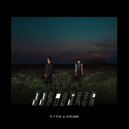

谢谢你曾经让我悲伤
============================

|  |  |
| :--: | :-- |
| [ 谢谢你曾经让我悲伤](https://emumo.xiami.com/album/2102969089) | **艺人**: [原子邦妮 Astro Bunny](../index.md) **语种**: 国语 **唱片公司**: 滚石唱片 **发行时间**: 2017年12月15日 **专辑类别**: 录音室专辑 **专辑风格**: 电音流行 Electropop **播放数**: 5842996 **收藏数**: 1240 **评论数**: 61  |

## 简介

<strong>「万众屏息的华语乐坛颠覆能量」</strong>  
  
当ＤＪ们吶喊：西洋有Alan Walker，台湾有原子邦妮  
当音乐人力挺：他们就是电子与华语最好的融合呈现  
当大学生表态：华语EDM我只听原子邦妮  
当抑郁青年诉说 : 原子邦妮的音乐让我走出忧郁  
当高中生跪求：原子邦妮的疗愈能量帮我指考成功  
当各大独立乐团仍用摇滚民谣等大众熟悉的接受方式拓展之余，  
却有一支在台上弹着看似相对陌生合成器的<u>电子组合</u>  
以黑马之姿入主重度音乐用户的口袋必听名单之一  
你是否还能忽略这组华语乐坛最当代的颠覆力量？  
挟入围2017金曲奖最佳演唱组合的气势、各大音乐节争相邀约的人气、  
大学生Dcard疯传讨论的散播、自2017年初每月一首单曲的能量蓄积、  
YouTube百万单曲点击的爆发、单曲在脸书数千则转发的网络魅力，在2017年底，一个经典科幻片都称之为「未来」的年份，原子邦妮用你不能移开双目的绚烂姿态，带着对经典电子声响的执着，镶嵌前卫摩登的电子魅力，推翻你对华语乐坛的既有认知。  
  
<strong>「你不忍因一秒呼吸而错过的惊艳电子音色」</strong>  
  
即便电子曲风在西洋早已成为潮流，但原子邦妮坚持不愿走上「一台计算机一个按键搞定」的速成音乐，将记忆以来对未来声响的向往，采用「洪荒时代而来的怪兽般」的analog模拟合成器，堆栈呼吸情绪和脉动，既保有这世代对音乐刺激紧张感的需求，更弥补了大众对电子音乐缺乏情感的既定印象，形成了所谓「电子疗愈」的原子邦妮式乐章，搭配在华文当代年轻族群中蔚为风尚的「文青」叙述视角，巧妙地融合，让你不知不觉被电子乐征服，被疗愈文字所憾动，进入迷幻的宇宙，悠然而神往。  
  
<strong>「流行电子曲风的完整经典呈现」</strong>  
  
不愿意先用曲风陷入先入为主感受的原子邦妮，鲜少公开讨论自己音乐的曲风，在本张专辑中的每一首歌曲，都运用了在世界各地流行音乐市场中早已成为主流，在华语乐坛却只占少数的各种电子风格，加上早年两人各自的摇滚乐团历练、丰富的歌手幕后词曲创作及音乐制作经验，生成自己对音乐的敏感笔触，不「直翻」、「套入」，而是内化出属于华语文化该有的音乐起承转合及脉络，让你来不及界定，却已入坑成为电子EDM中的一分子，不盲目拷贝外来文化，而是跟随时代进步，使用当代声响，衍生出属于华文的当代电子音乐，在网友乐迷的讨论归类下，一张融合techno, tropical house, future bass, electro house, EDM ,甚至中国风的华文电子专辑，绝对让你舞动每一根神经。  
  
<strong>「专辑定名</strong> <strong><em><u>谢谢你曾经让我悲伤</u></em></strong><strong>，</strong>  
<strong>从伤口出发，转化正面疗愈能量」</strong>  
  
我们都经历过千疮百孔的试炼 所以成为了现在的我们  
也许快乐方式不尽相同 却都共享相同的悲伤  
爱人成为了陌生人 何其悲伤  
亲人永远的别离  何其悲伤  
我们放弃了梦想  何其悲伤  
  
也许这世界就是如此残忍  
但是谢谢你 谢谢这个世界  
因为如此 我已经变得更好  
现在  我们要出发前往更美好的明天  
  
「谢谢你曾经让我悲伤」的「你」  
是「不想就这样结束」中 在最美好的时期遇见的你  
是「#imissyousobad」中 远在世界另一端的你  
是「蒸发的世界剩下我」中 以为不会再想念的你  
是「现在你好吗」中 只敢偶尔想起的你  
是「谢谢你曾经让我悲伤」中 伤透了我的你  
  
因为你 和那些曾让我们悲伤的人 事 物  
让我们编织了绮丽的幻想 经历了幻灭和眼泪 成就了坚强和慈悲  
当我们认真的经历着每一段悲伤之后  
我们要更努力的往前走 走得更耀眼  
  
  
2017，听起来是一个多未来的数字，世界变化也是如此的快速，  
现代，就是那么的冷冽，是属于电子和机器的时代。一切简单、快速，甚至拒绝沟通。但在我们心中都无法被磨灭和被取代的，是当我们回过头，发现一路上在不知不觉中携带的感情、梦想、回忆。这是一张原子邦妮的疗愈<u>励志</u>专辑，  
音乐上选择了如同当代冷冽氛围，和数字科技一般的电子音色，  
生活中经历着不可避免的情感冲突，用看似毫无情绪的合成器声响，  
记录下无法被渲染却最真实的感情。  
  
如同寒冬之中的那一件羽绒大衣，  
在冷调的氛围里，包裹着你真实织烈的心。  
  
再怎么机械化  
再怎么与机器相处  
试着把自己变得冷冽  
你也逃不了青春 和 回忆  
  
<strong>「专辑水平线设计，呈现电子几何划分的世界，</strong>  
<strong>仍晕染着丰富的人性情感」</strong>  
  
由摄影师foolishgeorge所拍摄的封面和原子邦妮在今年的南半球旅行中拍摄的疗愈风景，收录于专辑中成为诗签一般的歌词明信片，是献给收藏者的小巧思，更方便收藏阅读。水平线的构图，体现电子音乐的极简风格，却在当中堆栈出美景和情绪，也充分描绘表达原子邦妮的世界观，冷酷简单的线条中，蕴含不可思议的情感堆栈，如同电子音乐在电子节拍中拼贴剪辑，合成器贯串流转，带给每个人不同深度的共振跌宕。  
  
<strong>「加盟滚石唱片，忠于自我，传承音乐」</strong>  
  
身为华语流行乐坛最资深的唱片公司，滚石唱片孕育了无数华人重量级巨星歌手，至今仍深深影响着华语乐坛。历经华语唱片圈的高潮起落，成立即将迈入37年的「滚石唱片」二位老板段钟沂、段钟潭对音乐仍具有源源不绝的热情，在2017年初慧眼独具，签下曲风和作风都太过「前卫」，但歌词旋律却深具人文素养很符合「滚石」风味的原子邦妮，不走传统唱片业包装模式，大胆给予音乐人丰厚养分，让成军以来一直处于「全自动」模式的原子邦妮，不受限制，大玩创意，让两位成员自己独立拍摄歌词mv、官方mv、专辑照片、内页照片、包装设计，再到专辑制作混音全由两位成员独自操刀完成，甚至是打破传统唱片公司营运思维，让两位成员运用YouTuber模式般的自媒经营，发布独立频道影片连载「地球日志」，使得原子邦妮创意发挥极致，也让听众乐迷们体验体制外不受限制的新型态艺术创作风格，这一变革般的运作模式，也将成为华语乐坛中的先驱。<u>摩登潮流</u>「原子邦妮」x<u>业界巨头</u>「滚石唱片」，将引领听众们迎来华语乐坛的全新风貌。  
  
<strong>「十首好歌，十段故事，最久远的故事，最摩登的诠释」</strong>  
  
概念性的访谈Intro，带你进入原子邦妮的迷幻宇宙，十首词曲创作，十段你我都曾历经过的相似体验，加上一段纯音乐的合成器演奏，12首歌曲的呈现，像照镜子般让你不断审视回忆，从中找回那些片段的真实意义。感同身受的都会故事与直击人心的大颗粒电子重拍，每一秒都直击你的心脏，翻转你的核心价值。  
  
曲目推荐：  
  
<u>谢谢你曾经让我悲伤</u>  
「我追得匆忙，我折断了翅膀，只为了到有你的远方」  
在爱情里，我们都曾摔倒受伤，自我价值的怀疑，自我存在的毁灭。也许是初恋时，第一次对人生美好经验的彻底幻灭，或是经年累月，在每一场感情中对人性的失望退怯。每一条伤疤，每一滴眼泪，都造就你的故事，和你的与众不同。就算受了再多次伤，现在我们不都还在追寻往前迈进着，难道不是每个让我悲伤的你，教会我真实的人生，看清自己内心的信仰和追求？也许，我之所以成为现在的我，都该「谢谢你曾经让我悲伤」。  
谁说强大的techno x EDM 节奏，只能搭配无脑的hook文字，原子邦妮让你知道，现代文青都改听电子，「懂疵」早不局限在夜店。新时代的电子疗愈舞曲，既文青又潮流，既快感又抒情，最温柔也最强悍。最不可能搭配在一起的形容词，让你在原子邦妮的世界里，一次收齐。  
  
<u>也许你不懂</u>  
有些人总是看起来那样自由  
其实是害怕别人看出他的心情  
在那些勇敢和自由的背后  
隐藏着不愿透露的秘密  
他会ㄧ个人旅行  
他会压抑情绪  
他会看似什么都无所谓  
好像从不害怕失去  
他让人觉得总是抓不住  
也许是害怕没有人想拥有他  
  
我们都盼望有人读懂  
潜藏在心底的秘密  
  
原子邦妮的冬季疗愈恋歌  
最执着朴实的文青告白「也许你不懂」  
  
坚强灵魂最深处的秘密  
也许只能用唱的给你听  
  
<u>#imissyousobad</u>  
谁说电子乐最不摇滚？听听摇滚人如何诠释摩登的电子声响。两大经典时代性乐团，<u>蓝色眼睛</u>的「Zayin」x<u>再见我的爱</u>的「樱桃帮」，Yalu x 查查，破天荒穿越时空跨刀合体，两大乐团主唱演译最新经典的男女对唱情歌，南北半球的跨国爱恋单曲，摇滚魂诠释的电子张力，超脱曲风的精湛融合，刻画文青的青春爱恋。你有ig吗？快打开来 hash tag : <u>#imissyousobad</u><u>。</u>  
  
  
  
<u>蒸发的世界剩下我</u>  
谢谢那些带给我们伤痛的旅程  
和让我们流泪的人  
都使我们成为了更好的自己  
我们想要冒险，因为想要更真实地活着，而不是浑浑噩噩的日复一日。  
曾经受伤过，是为了学会坚强，勇敢的前往下一段旅程。  
曾经心痛过，是为了学会付出，用一颗完整的心再次爱上一个人。  
去冒险吧，仅以此曲献给每个勇敢爱着或是孤独的你。  
  
属于夏季的疗愈单曲。歌曲改编自友人真实故事：一位情伤后的女孩，一直故作坚强，也向友人表示自己已经走出情伤，直到有天需要整理当时对象，旧地重游，触碰着当时的对象，忽然泪水匮堤，才发现感情已留在生命的轨迹，难以磨灭。事后当事人也许愿要成为更好的自己，并出国游学，原子邦妮除给予鼓励，也写下歌曲纪念，也送给许许多多有类似经验的朋友，鼓励大家在历经人生的失意之余，也能从中找到珍贵之处，并努力向前迈进。  
  
<u>现在你好吗</u>  
我们曾对这个世界太过好奇  
对未知的人太过眷恋  
不停地追寻 向往  
去更好的地方  
追更美的朝阳  
却没想过  
那些最美的风景 最留恋的人  
从一开始就已经在身旁  
原来再美的风光  
若没有你分享 也是徒然  
观察周遭的万物  
发现许多简单的道理  
牠们很早就能明白  
反而要花了我们许多岁月  
才能领悟  
  
在这首歌词ＭＶ当中，原子邦妮透过恬静渔村中的可爱猫咪，用贪玩小猫的「猫咪视角」完成了这个故事。在每个向往的旅途中，得到什么又失去什么。当你已不在身边  
望着那些想和你一起去看的极光和夕阳，不禁在心里悄悄问着：现在你好吗。  
  
  
  
<u>不想就这样结束</u>  
也许我们所执着的  
在别人眼里都是浪费青春  
只要是内心勇敢的决定  
狂野悸动 或 深刻眼泪  
都真实经历着  
谁也无法抹灭  
也许  
相聚的夜晚总要结束  
再好的电影也终会下片  
绿荫的长廊还是会到尽头  
纯真的我们难道有一天也不再是我们 ?  
假期一定会结束  
旅途也许会完结  
你我共享的美好和哀愁  
荒谬亦或是纯粹  
可不可以永远不要结束  
夏末。致我们一起历经的纯真感动  
  
单曲「不想就这样结束」描写与朋友欢乐的聚会后不想面对孤独的心情，歌词用字大胆直率，「青春是用来浪费」、「城市中每一张脸闪烁着抱歉」等字句，也写下不同世代对青春的不同看法，道出了现代青年对社会现况的不安反动逃避以及释怀后的坦率面对。原子邦妮说，在成长过程中总有叛逆的回忆，像是不顾父母反对玩团，也做过不少浪费时间的事，包括打网咖、看漫画、k武侠小说等等，虽然都被长辈归类为浪费生命，但不同世代确实都有其面对青春年少的方式，都该被认真理解对待。也希望这些过程能碰撞出成为更好的人的力量，因此写下这首歌，也是透过自身经验，希望振奋的电子节奏带来激荡人心的前进力量，达到「疗愈」功效。 

## 曲目

## 评论

|  |  |  |
| :-- | :-- | :-- |
|  [虾米用户](https://emumo.xiami.com/u/264444933) 我喜欢我。我还是我。 2020-12-25 21:14 赞(0) 踩(0) | 
2018 2020 2021
 |
|  [虾米用户](https://emumo.xiami.com/u/7345510) 我真的喜欢吃虾 2019-12-29 21:17 赞(0) 踩(0) | 
听着真是让人舒服。又有年轻的感觉
 |
|  [虾米用户](https://emumo.xiami.com/u/266489178)   2019-11-06 00:20 赞(0) 踩(0) | 
好像白安的音色
 |
|  [虾米用户](https://emumo.xiami.com/u/42287424) 设计师，摄影人 2019-06-06 08:22 赞(0) 踩(0) | 
邦妮的音乐一直高水准
 |
|  [虾米用户](https://emumo.xiami.com/u/5608034) 走向世界 但不随从世界 2019-02-15 00:11 赞(1) 踩(0) | 
几乎不听国语歌的我居然循环了这张专辑好几遍，认识晚了，广州的演唱会错失了，期待你们的新歌，继续加油，国内很难得的电音组合!
 |
|  [虾米用户](https://emumo.xiami.com/u/6082125) Standing and... 2018-06-29 21:06 赞(0) 踩(0) | 
今天循环听整张专辑，才是一个完整的故事～ 
 |
|  [虾米用户](https://emumo.xiami.com/u/42287424) 设计师，摄影人 2018-05-28 08:20 赞(0) 踩(0) | 
太棒了，继续支持真正的专辑
 |
|  [虾米用户](https://emumo.xiami.com/u/36354533)  2018-05-17 13:05 赞(0) 踩(0) | 
恭喜入围最佳乐团，真的很棒的专辑
 |
| ⇒ |  [虾米用户](https://emumo.xiami.com/u/6531780) 想要变成你 2018-05-18 14:23 赞(0) 踩(0) | 
是最佳演唱組合
 |
| ⇒ |  [虾米用户](https://emumo.xiami.com/u/36354533)  2018-05-21 22:28 赞(0) 踩(0) | 
<q><b>Trevor说：</b></q>
 |
|  [虾米用户](https://emumo.xiami.com/u/195711213)  2018-05-14 14:20 赞(0) 踩(0) | 
很适合独自一个人沉浸的音乐
 |
|  [虾米用户](https://emumo.xiami.com/u/34039) 好舍不得这里 2018-05-14 08:20 赞(0) 踩(0) | 
好听呀～
 |
|  [虾米用户](https://emumo.xiami.com/u/273507413)  2018-03-05 16:34 赞(0) 踩(0) | 

 |
|  [虾米用户](https://emumo.xiami.com/u/255637099)  2018-01-28 18:10 赞(0) 踩(0) | 
我是第一个从尼克杨那里过来的么～
 |
|  [虾米用户](https://emumo.xiami.com/u/18619292) 我的舒适空间 2018-01-24 22:09 赞(0) 踩(0) | 
真的好棒的，支持！！！！   
 |
|  [虾米用户](https://emumo.xiami.com/u/189183558) 他说  去你妈的花海  ... 2018-01-23 22:50 赞(15) 踩(0) | 
&amp;ldquo;要清楚自己的动机，不要想着依靠任何人来取得成功，更不需要别人来肯定自己。&amp;rdquo;  &amp;ldquo;如果你们现在有原创，那么这就是很好的先机，不要轻言放弃。&amp;rdquo;  &amp;ldquo;大家要先学会模仿，因为只有先学会了模仿，才有机会慢慢地变出新的东西出来，而且要记住，千万不要嫌麻烦，别偷懒，不要占音乐的小便宜。&amp;rdquo;他们做到了
 |
|  [虾米用户](https://emumo.xiami.com/u/49656461)   2018-01-19 21:07 赞(0) 踩(0) | 
！
 |
|  [虾米用户](https://emumo.xiami.com/u/14784508)  2018-01-10 19:21 赞(0) 踩(0) | 
终于出专了，  
 |
|  [虾米用户](https://emumo.xiami.com/u/212672276) 我大概是林宥嘉的小耳朵 2018-01-06 22:11 赞(1) 踩(0) | 
女主唱的咬字完全独特
 |
|  [虾米用户](https://emumo.xiami.com/u/6749530) 我变化万千，任何定格的印... 2018-01-04 22:34 赞(0) 踩(0) | 
相当看好
 |
|  [虾米用户](https://emumo.xiami.com/u/255287545) 嗨，你好啊 2017-12-27 23:27 赞(0) 踩(0) | 
真的太棒了
 |
|  [虾米用户](https://emumo.xiami.com/u/96636718) 所謂風格 要獨特都要代價 2017-12-19 10:56 赞(0) 踩(0) | 
标准滾石电音
 |
|  [虾米用户](https://emumo.xiami.com/u/46249123)  2017-12-19 08:03 赞(0) 踩(0) | 
啧啧，还真的不错 
 |
|  [虾米用户](https://emumo.xiami.com/u/7831410)   2017-12-19 05:34 赞(1) 踩(0) | 
和上一张比，电音作用的更为自然洒脱
 |
|  [虾米用户](https://emumo.xiami.com/u/74482628)  2017-12-18 19:15 赞(2) 踩(0) | 
超级大神专&amp;hellip;&amp;hellip;每首都能循环
 |
|  [虾米用户](https://emumo.xiami.com/u/52290044)   2017-12-18 16:22 赞(0) 踩(0) | 
独家你个头啊 apple music里明明就有 
 |
|  [虾米用户](https://emumo.xiami.com/u/12878826) 谢谢陪伴 再见哦！ 2017-12-18 10:07 赞(0) 踩(0) | 
 
 |
|  [虾米用户](https://emumo.xiami.com/u/266900733)  2017-12-18 00:32 赞(0) 踩(0) | 
很喜欢
 |
|  [虾米用户](https://emumo.xiami.com/u/6767955) 求存是異種 2017-12-17 22:23 赞(0) 踩(0) | 
虾币，虾币，虾币     
 |
|  [虾米用户](https://emumo.xiami.com/u/2830724) 我們終將不會相遇 都湮滅... 2017-12-17 05:45 赞(0) 踩(0) | 
马克
 |
|  [虾米用户](https://emumo.xiami.com/u/82803940) 我还没想好要写什么... 2017-12-16 23:21 赞(0) 踩(0) | 

 |
|  [虾米用户](https://emumo.xiami.com/u/327453260)  2017-12-16 11:09 赞(0) 踩(0) | 

 |
|  [虾米用户](https://emumo.xiami.com/u/6443382)  2017-12-16 10:33 赞(0) 踩(0) | 
编曲越来越棒了，加油⛽
 |
|  [虾米用户](https://emumo.xiami.com/u/7345510) 我真的喜欢吃虾 2017-12-16 09:43 赞(1) 踩(0) | 
原子邦尼这个名字就很喜欢
 |
|  [虾米用户](https://emumo.xiami.com/u/79774286)  2017-12-16 09:40 赞(1) 踩(0) | 
独特的嗓音与电子摇滚风，笔芯
 |
|  [虾米用户](https://emumo.xiami.com/u/34293495) 这家伙很聪明什么也没留下... 2017-12-15 22:00 赞(0) 踩(0) | 
就是棒
 |
|  [虾米用户](https://emumo.xiami.com/u/34293495) 这家伙很聪明什么也没留下... 2017-12-15 21:56 赞(1) 踩(0) | 
爱死原子邦尼!！  
 |
|  [虾米用户](https://emumo.xiami.com/u/36105651) 噪音工廠 2017-12-15 21:14 赞(0) 踩(0) | 
[带墨镜笑]
 |
|  [虾米用户](https://emumo.xiami.com/u/10205776) 转Spotify 2017-12-15 20:20 赞(0) 踩(0) | 
M
 |
|  [虾米用户](https://emumo.xiami.com/u/45322431) 不必左右，你只需要像风一... 2017-12-15 19:24 赞(3) 踩(0) | 
这张专辑是真的棒啊   
 |
|  [虾米用户](https://emumo.xiami.com/u/6061165) 音乐是最好的情话。 2017-12-15 19:06 赞(4) 踩(0) | 
封面标题很像小学时候在课本上会做的事啊
 |
|  [虾米用户](https://emumo.xiami.com/u/42347) 寻找无双 2017-12-15 18:54 赞(1) 踩(0) | 
查查终于出新专辑了！
 |
|  [虾米用户](https://emumo.xiami.com/u/315710)  2017-12-15 17:09 赞(1) 踩(0) | 
循环一下午，棒！
 |
|  [虾米用户](https://emumo.xiami.com/u/37418546)   2017-12-15 16:23 赞(1) 踩(0) | 
还是之前一样的感觉。
 |
|  [虾米用户](https://emumo.xiami.com/u/4900023) 夜深了，我给你放一首歌儿... 2017-12-15 16:12 赞(4) 踩(0) | 
虽然玩儿了国内少有人玩儿的EDM可仍不值得赞颂&amp;mdash;&amp;mdash;因为专辑的概念性到编曲和作词都太平庸了&amp;hellip;&amp;hellip;
 |
|  [虾米用户](https://emumo.xiami.com/u/263245301) 追随灵魂而来。 2017-12-15 15:05 赞(1) 踩(0) | 
嗯哼？
 |
|  [虾米用户](https://emumo.xiami.com/u/1254874)  2017-12-15 13:45 赞(1) 踩(0) | 
好喜欢原子邦妮！
 |
|  [虾米用户](https://emumo.xiami.com/u/42287424) 设计师，摄影人 2017-12-15 13:30 赞(1) 踩(0) | 
支持
 |
|  [虾米用户](https://emumo.xiami.com/u/1320669) ツ 2017-12-15 13:21 赞(1) 踩(0) | 
0.0
 |
|  [虾米用户](https://emumo.xiami.com/u/32125734) weibo：白菜y少女  2017-12-15 13:05 赞(1) 踩(0) | 
~
 |
|  [虾米用户](https://emumo.xiami.com/u/49640493) 网易云SAINTDONT... 2017-12-15 12:59 赞(1) 踩(0) | 

 |
|  [虾米用户](https://emumo.xiami.com/u/19297981)             ... 2017-12-15 12:54 赞(1) 踩(0) | 
哦哦哦哦哦哦哦
 |
|  [虾米用户](https://emumo.xiami.com/u/327449160) 我见青山多妩媚，料见青山... 2017-12-15 12:51 赞(1) 踩(0) | 

 |
|  [虾米用户](https://emumo.xiami.com/u/44291359) 我还没想好要写什么... 2017-12-15 12:30 赞(1) 踩(0) | 
 
 |
|  [虾米用户](https://emumo.xiami.com/u/688334) 暂无签名~ 2017-12-15 12:17 赞(1) 踩(0) | 
专辑超棒    ～
 |
|  [虾米用户](https://emumo.xiami.com/u/28486235) - - - - - - ... 2017-12-15 12:15 赞(1) 踩(0) | 

 |
|  [虾米用户](https://emumo.xiami.com/u/44726124) 我还没想好要写什么... 2017-12-15 12:04 赞(1) 踩(0) | 
谢谢你曾经让我悲伤 
 |
|  [虾米用户](https://emumo.xiami.com/u/324978931) 為你不管是否迷失自己, ... 2017-12-15 12:03 赞(1) 踩(0) | 
 
 |
|  [虾米用户](https://emumo.xiami.com/u/1316995) amberstar梦游贝... 2017-12-15 12:02 赞(1) 踩(0) | 
6666666
 |
|  [虾米用户](https://emumo.xiami.com/u/100297542) 一天一天拼回破碎自己 2017-12-15 12:00 赞(1) 踩(0) | 
啊！！！
 |
|  [虾米用户](https://emumo.xiami.com/u/3851702) 爱我就给我看你的播放列表 2017-12-14 09:33 赞(1) 踩(0) | 
看过现场，很嗨！
 |
