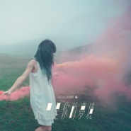

我只是你的梦境
============================

|  |  |
| :--: | :-- |
| [ 我只是你的梦境](https://emumo.xiami.com/album/2103754855) | **艺人**: [原子邦妮 Astro Bunny](../index.md) **语种**: 国语 **唱片公司**: 滚石唱片 **发行时间**: 2018年06月27日 **专辑类别**: EP, 单曲 **专辑风格**: 电音流行 Electropop **播放数**: 255983 **收藏数**: 73 **评论数**: 14  |

## 简介

「重游了我们去过的地方  
这是我正在经历的现实  
对你来说却只是曾经的某个梦境  
你已经睡醒离去  
而我却仍然在这场梦里」  
  
蝉声鸣鸣 微风吹拂的夏日之夜  
爱情是否也像时光  
来去不由人留 也不着痕迹  
原子邦妮2018最新单曲  
最深情的疗愈文字  
呢喃的婉转旋律  
迷醉的电子梦幻声响  
诉说你我的那一段青春秘密 

## 曲目

## 评论

|  |  |  |  |
| :-- | :-- | :-- | :-- |
|  [虾米用户](https://emumo.xiami.com/u/30142494) Official 2019-04-29 15:01 赞(0) 踩(0) | 
好听
 |
|  [虾米用户](https://emumo.xiami.com/u/1621678)   2018-12-28 14:43 赞(0) 踩(0) | 
反复循环，就是好听
 |
|  [虾米用户](https://emumo.xiami.com/u/15809895) 我还没想好要写什么... 2018-09-14 23:09 赞(0) 踩(0) | 
很好听！！
 |
|  [虾米用户](https://emumo.xiami.com/u/49502859)  2018-07-29 19:41 赞(0) 踩(0) | 
很好听
 |
|  [虾米用户](https://emumo.xiami.com/u/259880673) 或前或后任何星球. 2018-06-30 17:26 赞(0) 踩(0) | 
️
 |
|  [虾米用户](https://emumo.xiami.com/u/180106502)  2018-06-28 14:18 赞(0) 踩(0) | 
好听，一如既往的电音风格
 |
|  [虾米用户](https://emumo.xiami.com/u/16206377) rabbit_❀moon 2018-06-28 00:46 赞(1) 踩(0) | 
啊啊啊啊，好棒，一如既往的好听，几天前一直在蹲着等了
 |
|  [虾米用户](https://emumo.xiami.com/u/28486235) - - - - - - ... 2018-06-28 00:14 赞(0) 踩(0) | 
///
 |
|  [虾米用户](https://emumo.xiami.com/u/2830724) 我們終將不會相遇 都湮滅... 2018-06-27 15:14 赞(0) 踩(0) | 
新单曲
 |
|  [虾米用户](https://emumo.xiami.com/u/6749530) 我变化万千，任何定格的印... 2018-06-27 14:25 赞(1) 踩(0) | 
哦哦
 |
|  [虾米用户](https://emumo.xiami.com/u/245723517) 乐行乐远 2018-06-27 14:02 赞(2) 踩(0) | 
打call 打call
 |
|  [虾米用户](https://emumo.xiami.com/u/49765922)  2018-06-27 13:42 赞(2) 踩(0) | 

 |
|  [虾米用户](https://emumo.xiami.com/u/324344575) 世界以无为本。 2018-06-27 13:01 赞(0) 踩(0) | 
打call
 |
|  [虾米用户](https://emumo.xiami.com/u/42287424) 设计师，摄影人 2018-06-27 12:01 赞(2) 踩(0) | 
继续支持邦妮，继续收藏正版cd
 |
