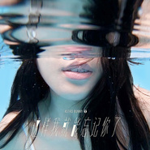

这样我就能忘记你了
============================

|  |  |
| :--: | :-- |
| [ 这样我就能忘记你了](https://emumo.xiami.com/album/2104035607) | **艺人**: [原子邦妮 Astro Bunny](../index.md) **语种**: 国语 **唱片公司**: 滚石唱片 **发行时间**: 2018年09月19日 **专辑类别**: EP, 单曲 **专辑风格**:  **播放数**: 575612 **收藏数**: 117 **评论数**: 19  |

## 简介

「不论是艳阳高照的夏日时空  
亦或是冷冽沁心的寒夜微风  
都是我们共有的回忆  
那些刻下的青春岁月  
无论季节如何更迭  
都有挥不去你的影子  
  
这样  
我要如何将你忘记？」  
  
你选择了你的未来  
我留在了我的当下  
也许人生无法避免进入不同的阶段  
与身旁的人相知相识后还是必须道别  
面对那一场只能迎向的分离  
只能用尽力气 温柔吶喊   
  
原子邦妮的开学系疗愈情歌  
就算必须走向人生的分叉路口  
也让此刻我们一起拥有勇气  
 

## 曲目

## 评论

|  |  |  |
| :-- | :-- | :-- |
|  [虾米用户](https://emumo.xiami.com/u/327453260)  2018-10-24 10:20 赞(1) 踩(0) | 
❤
 |
|  [虾米用户](https://emumo.xiami.com/u/17704318) 黑金狗 2018-09-20 16:22 赞(2) 踩(0) | 
樱桃帮主唱？
 |
|  [虾米用户](https://emumo.xiami.com/u/478527) 好想跟衣服在洗衣机里滚 2018-09-20 15:13 赞(1) 踩(0) | 
done
 |
|  [虾米用户](https://emumo.xiami.com/u/36354533)  2018-09-20 10:24 赞(1) 踩(0) | 
查查现在怎么那么高产，上张专辑确实挺不错的
 |
|  [虾米用户](https://emumo.xiami.com/u/982033)  2018-09-19 22:57 赞(0) 踩(0) | 
延续了上一张专辑的风格啊。MV里的小姐姐真美！
 |
|  [虾米用户](https://emumo.xiami.com/u/36340888)  2018-09-19 15:14 赞(0) 踩(0) | 
啧啧啧
 |
|  [虾米用户](https://emumo.xiami.com/u/549784) 音乐...带你飞 2018-09-19 13:23 赞(0) 踩(0) | 
很喜欢 。。那首 现在你好吗》节奏很棒kool
 |
|  [虾米用户](https://emumo.xiami.com/u/10768312)  2018-09-19 10:52 赞(0) 踩(0) | 
可以，很原子邦妮
 |
|  [虾米用户](https://emumo.xiami.com/u/16047370)  2018-09-19 10:18 赞(0) 踩(0) | 
喜欢
 |
|  [虾米用户](https://emumo.xiami.com/u/549784) 音乐...带你飞 2018-09-19 10:03 赞(0) 踩(0) | 
...属于夏天的 歌。还不错。。。。。。。。。。。go
 |
| ⇒ |  [虾米用户](https://emumo.xiami.com/u/1644922)  2018-09-19 12:54 赞(0) 踩(0) | 
属于夏天的歌，很有感觉，不过冬天听听感觉也是不错的。
 |
| ⇒ |  [虾米用户](https://emumo.xiami.com/u/549784) 音乐...带你飞 2018-09-19 13:15 赞(0) 踩(0) | 
<q><b>slrock说：</b></q>
 |
|  [虾米用户](https://emumo.xiami.com/u/773393) GALAXY 2018-09-19 09:27 赞(0) 踩(0) | 
这样我就能忘记你了
 |
|  [虾米用户](https://emumo.xiami.com/u/84571136) 唯有音乐不离不弃 2018-09-19 09:15 赞(0) 踩(0) | 
嗯
 |
|  [虾米用户](https://emumo.xiami.com/u/9301514) 独立唱作人 2018-09-19 07:54 赞(0) 踩(0) | 
查查
 |
|  [虾米用户](https://emumo.xiami.com/u/38700540) Loving him w... 2018-09-19 01:02 赞(0) 踩(0) | 
这样我就能忘记你了
 |
|  [虾米用户](https://emumo.xiami.com/u/101636444) ❤️一只喜欢闵玧其的疯姑... 2018-09-19 00:02 赞(0) 踩(0) | 
晚睡福利哈哈
 |
|  [虾米用户](https://emumo.xiami.com/u/41457383)  2018-09-19 00:02 赞(1) 踩(0) | 
查查。好听好听！开口脆。
 |
|  [虾米用户](https://emumo.xiami.com/u/42287424) 设计师，摄影人 2018-09-19 00:00 赞(0) 踩(0) | 
继续支持！
 |
