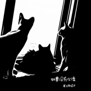

如果没有以后
============================

|  |  |
| :--: | :-- |
| [ 如果没有以后](https://emumo.xiami.com/album/2104940575) | **艺人**: [原子邦妮 Astro Bunny](../index.md) **语种**: 国语 **唱片公司**: StreetVoice **发行时间**: 2019年06月20日 **专辑类别**: EP, 单曲 **专辑风格**: 摇滚 Rock & Roll **播放数**: 98095 **收藏数**: 96 **评论数**: 27  |

## 简介

2012 ， 一个充斥着末日预言的年代，                                               
地球也只是银河系中的小星尘。                                                           
就算如果没有以后 ，                                                                         
我们还是怀着希望 ，                                                                        
期待着花好月圆的那天。  
  
原子邦妮的首张 EP 作品，早期的原子邦妮风格多元，游走于另类摇滚和电子之间。                       
  
电子合成器产生的超强重节拍及粗糙颗粒感的音色为原子邦妮音乐的要素。用机械般冲击的音色摩擦耳畔使精神能在压力中得到宣泄与释放。  
而吉他是摇滚精神的代表，因此无论编曲上的乐器如何进化包装，原子邦妮的音乐在初期有以吉他为主轴的乐句和以摇滚概念为出发点的音乐灵感贯穿所有作品，让富有摇滚精神的吉他音色在电子乐器当中担任精神领导般的主轴，使所有作品更具连贯性并能凸显原子邦妮在音乐上的特殊感受及两位成员始终如一的摇滚基因。  
温柔的女声则是与所有群众沟通互动的桥梁，在阳刚的摇滚和硬式电子当中加入温柔的女性元素，使原子邦妮的音乐思想能以和缓的方式渗入听众的内心，并持续诱发出后续的共鸣及互动。  
 

## 曲目

## 评论

|  |  |  |
| :-- | :-- | :-- |
|  [虾米用户](https://emumo.xiami.com/u/328947012) 爱与被爱 2019-10-16 08:31 赞(0) 踩(0) | 
坠入凡间的精灵
 |
|  [虾米用户](https://emumo.xiami.com/u/3192359) 我还没想好要写什么... 2019-09-21 23:31 赞(0) 踩(0) | 
感谢给我们机会，共同成长
 |
|  [虾米用户](https://emumo.xiami.com/u/40650128) 我对自己不满意，却又不能... 2019-07-21 17:08 赞(0) 踩(0) | 
这是重制的
 |
|  [虾米用户](https://emumo.xiami.com/u/333036874) 个性突出. 2019-07-06 12:58 赞(0) 踩(0) | 
我觉得还是不错的阿，电子乐挺好的，就是歌有点少，而且都差不多
 |
|  [虾米用户](https://emumo.xiami.com/u/37991210) 最喜每日收藏 2019-06-24 21:31 赞(0) 踩(0) | 
喜欢！nice
 |
|  [虾米用户](https://emumo.xiami.com/u/356343118) 心❤随你动 2019-06-21 13:17 赞(0) 踩(0) | 
喜欢他们的风格
 |
|  [虾米用户](https://emumo.xiami.com/u/1059184) 2 2019-06-21 10:41 赞(0) 踩(0) | 
很平庸的一张专辑，直白点就没一首歌是好听的，后来看评论才知道是12年早期的专辑，原来乐队一直都在成长，后面的专辑一张比一张好。
 |
| ⇒ |  [虾米用户](https://emumo.xiami.com/u/256710312) 览洲 2019-07-19 23:15 赞(0) 踩(0) | 
那天就不错啊
 |
| ⇒ |  [虾米用户](https://emumo.xiami.com/u/429473838)  2019-09-11 09:25 赞(0) 踩(0) | 
銀河好聽
 |
|  [虾米用户](https://emumo.xiami.com/u/2449170) 我还没想好要写什么... 2019-06-21 08:21 赞(0) 踩(0) | 
原子，已经回到世间万物构成的原本，而他们的音乐就能听出一些原本的东西，希望在本质的路上能够坚持走下去
 |
|  [虾米用户](https://emumo.xiami.com/u/223854477) 1 2019-06-21 00:03 赞(0) 踩(0) | 
无条件支持。
 |
|  [虾米用户](https://emumo.xiami.com/u/264444933) 我喜欢我。我还是我。 2019-06-20 20:37 赞(1) 踩(0) | 
岁月静美，花好月圆
 |
|  [虾米用户](https://emumo.xiami.com/u/345942145) 我还没想好要写什么... 2019-06-20 13:39 赞(0) 踩(0) | 
疗伤治愈  若即若离   好听美妙
 |
|  [虾米用户](https://emumo.xiami.com/u/214366940)  2019-06-20 12:57 赞(0) 踩(0) | 
这张专辑有点伤感但是要好好听慢慢听，请继续加油
 |
|  [虾米用户](https://emumo.xiami.com/u/2187923)  2019-06-20 12:20 赞(0) 踩(0) | 
没有上张专辑好，没了自己的特色，最后两首稍微好一点。
 |
| ⇒ |  [虾米用户](https://emumo.xiami.com/u/171595972)  2019-06-20 23:12 赞(0) 踩(0) | 
因为这是12年时候的专辑了
 |
|  [虾米用户](https://emumo.xiami.com/u/109019164) 徒然求索，不如思止。 2019-06-20 10:31 赞(0) 踩(0) | 
哇，突然多出几首歌来。
 |
|  [虾米用户](https://emumo.xiami.com/u/247688985)  2019-06-20 09:49 赞(0) 踩(0) | 
怎么说呢，还是挺好听的，但是歌词方面没有跟着显示，这个改改
 |
|  [虾米用户](https://emumo.xiami.com/u/49656461)   2019-06-20 08:10 赞(0) 踩(0) | 
！
 |
|  [虾米用户](https://emumo.xiami.com/u/377031819) 喜欢音乐 2019-06-20 08:01 赞(0) 踩(0) | 
永远爱妮妮
 |
|  [虾米用户](https://emumo.xiami.com/u/7058356)  2019-06-20 07:50 赞(0) 踩(0) | 
支持
 |
|  [虾米用户](https://emumo.xiami.com/u/2187923)  2019-06-20 07:22 赞(0) 踩(0) | 
发现出新专的感觉真美好 
 |
|  [虾米用户](https://emumo.xiami.com/u/84571136) 唯有音乐不离不弃 2019-06-20 06:36 赞(1) 踩(0) | 
嗯
 |
|  [虾米用户](https://emumo.xiami.com/u/378720253) 我还没想好要写什么... 2019-06-20 01:17 赞(0) 踩(0) | 
漫漫长夜里的一点光
 |
|  [虾米用户](https://emumo.xiami.com/u/123246788) Music is my ... 2019-06-20 00:08 赞(18) 踩(0) | 
你走了，我们就结束了！ 
 |
|  [虾米用户](https://emumo.xiami.com/u/217557524)  2019-06-20 00:03 赞(0) 踩(0) | 
天旋地转的那天我弄丢了你的好
 |
|  [虾米用户](https://emumo.xiami.com/u/10359776) v jerryzlz4 2019-06-20 00:00 赞(0) 踩(0) | 
来啦
 |
