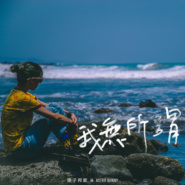

我无所谓
============================

|  |  |
| :--: | :-- |
| [ 我无所谓](https://emumo.xiami.com/album/2105212531) | **艺人**: [原子邦妮 Astro Bunny](../index.md) **语种**: 国语 **唱片公司**: 滚石唱片 **发行时间**: 2019年09月11日 **专辑类别**: EP, 单曲 **专辑风格**:  **播放数**: 223996 **收藏数**: 33 **评论数**: 4  |

## 简介

「如果连你都要失去  
起码我还可以保有自己」  
  
电子疗愈天团 原子邦妮  
继专辑「我在宇宙的边缘」后  
睽违半年能量累积之作  
清脆节奏软呢旋律  
重低频率直率自白  
打造2019夏季最chill的潮流舒心恋曲  
  
在温热流动的风中  
最美而旁若无人的流泪  
既帅且毫无所谓的心碎  
可以失去 失恋 失意  
但不能没有存在的意义  
  
风声 曲声 节奏声  
疗愈盛夏破碎的心  
 

## 曲目

## 评论

|  |  |  |
| :-- | :-- | :-- |
|  [虾米用户](https://emumo.xiami.com/u/10092297) 暂无签名~ 2020-04-25 16:32 赞(0) 踩(0) | 
这个已经着迷了，单曲疯狂循环！
 |
|  [虾米用户](https://emumo.xiami.com/u/243863603) 发现美 2019-10-25 09:07 赞(3) 踩(0) | 
连续循环半个月，五张专辑全听了。很喜欢查查现在的音色。吐字没有那么字正腔圆，发声没有早期那么用力，却更加打动人心。
 |
| ⇒ |  [虾米用户](https://emumo.xiami.com/u/44099488) 特立独行…… 2020-01-14 09:24 赞(0) 踩(0) | 
Me too…
 |
|  [虾米用户](https://emumo.xiami.com/u/345942145) 我还没想好要写什么... 2019-10-13 09:09 赞(0) 踩(0) | 
歌如诗 诗如歌
 |
