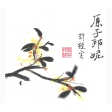

折桂令
============================

|  |  |
| :--: | :-- |
| [ 折桂令](https://emumo.xiami.com/album/552085) | **艺人**: [原子邦妮 Astro Bunny](../index.md) **语种**: 国语 **唱片公司**: StreetVoice **发行时间**: 2012年11月02日 **专辑类别**: 录音室专辑 **专辑风格**: 电音流行 Electropop **播放数**: 266663 **收藏数**: 148 **评论数**: 12  |

## 简介

禀持原子邦妮创作当中的三元素来完成：  
重节拍电子合成器&amp;吉他&amp;温柔女声  
  
电子合成器产生的超强重节拍及粗糙颗粒感的音色成为本张专辑音乐的要素。用机械般冲击的音色摩擦耳朵使精神能在压力当中得到宣洩与释放。而吉他是摇滚精神的代表 , 因此无论编曲上的器乐如何进化包装 , 原子邦妮的音乐仍然有以吉他为主轴的乐句和以摇滚乐概念为出发点的音乐灵感贯穿所有作品 , 让富有摇滚精神的吉他音色在电子乐器当中担任精神领导一般的器乐主轴 , 使所有作品更具连贯性并能突显原子邦妮在音乐上的特殊感受及两位成员始终如一的摇滚基因。温柔的女声则是与所有群众沟通互动的桥樑 , 在阳刚的摇滚和硬式电子当中加入温柔的女性元素, 使原子邦妮的音乐思想能以和缓的方式渗透入听众的内心, 并持续诱发出后续的共鸣及互动。  
  
用亲和的歌声将原子邦妮在音乐上所做的独特尝试用平易近人的方式介绍给所有听众, 务必朝向具有共鸣又不失独特性的音乐类型迈进。整张专辑的歌曲，带有澹澹的中国风。但是编曲仍以新颖的电子风格为主轴，中西融合也成为整张专辑的特色之一。  
  
King：讽刺性的趣味歌词，描述在爱情中遇到背判时的鸵鸟心态，不愿意面对，只希望维持现状，结果也许将导致更大的伤害而浑然不知。原子邦妮用自己独特的口吻期盼所有陷在爱情困扰中的男女们能够找到真正应该坚持的事物。歌曲活泼带点诙谐，轻鬆进入整张专辑。  
  
倔强的绒毛娃娃：走在路上，你可曾不经意的看见瑟缩在街角的某一双眼睛，正闪烁着孤傲却寂寞的目光 ?你是否深深地爱上他或许可爱，或许柔弱的模样 ? 并且为了能给他一个舒服的家，为他遮风档雨 ，受尽了他的伤害，抗拒 ？不过 ，一但当你住进他内心的那一刻起，他的孤单终结了。你也将会成为他一生的朋友。这样对宠物的心情，就和父母对孩子一样吧？  
  
折桂令：元朝曲人 「徐再思 」的 『折桂令』（春情） 一直是作词人（查查）在古今诗词歌赋中最喜爱的一首元曲 。 他将思念写的那麽淋漓透彻 , 像是将人心剖开一般赤裸裸的呈现。于是这首歌曲乃是对『折桂令』（春情）这首元曲的致敬作品。从古至今 , 最折磨于人的 , 莫过于 ‘思念’这一回事 。作者认为 , 只要是爱过的人 , 都能够懂得 。而原子邦妮用自己与众不同的方式,来诠释这首带有中国风且充满迷幻电子氛围的歌曲, 让人一听, 便如穿梭时光隧道一般,悠游古今。  
  
在最灿烂时毁灭：每一个年轻的生命，都像含苞待放的花儿一样，他们奋力长大，来到社会，却有可能因为自己的单纯，而走上了崎途。也可能因为社会的现实。而扼杀了天真的心灵。一首向现实社会控诉的深沉乐曲，也道出了身处功利主义世界中的悲愤与孤独独。  
  
Pity:电子色彩浓厚的深沉抒情歌曲，空灵的女声和纯淨的编曲，像是深夜也像是清晨，让你慢下脚步，陷入回忆。  
  
想和你一起旅行：生活在都市中的忙碌人们，总会有那麽一刻，想抛开所有的烦恼和枷锁，跟着那个你最期望的人，一起去另一个地方，洗涤疲累的心灵。一首轻鬆释放压力的歌曲，听之心情就跟着愉悦起来，彷彿已经做好准备旅行的心情啦！！  
  
红酒历险记：每个人喝酒的原因都不一样 。有一种人，只藉着酒意，可以将任何一个人当作是他想的那个人，另一种人是 藉着酒意才能鼓起勇气抱抱他的爱人。 在这时候， 像谈了一场美丽的恋爱。至 于明天醒来会是如何? 也不去在意了… 甜蜜的情歌带着浓浓的异国风，就像微醺时那样的充满想像和惊奇。  
  
神奇世界：不管你做哪一种工作，在哪一种环境，少不了要碰到一些只会说，不会做 ; 只会卖弄嘴皮子的傢伙。做了一件事，讲成十件。赚了十万讲成五十万。讲自己就算了，连别人的事也拿来说嘴。别人交过五个女朋友，他乱讲成十五个 。别人犯个小错，马上大肆宣扬把别人说的体无完肤。自己的事却只挑好的说。这种人不学无术，无所不在 ! 这种人就某方面来说也还满神奇的 ! 而是什麽样的地方造就并包容了这样的人，大概就是这个『神奇世界』吧。

## 曲目

## 评论

|  |  |  |
| :-- | :-- | :-- |
|  [虾米用户](https://emumo.xiami.com/u/327453260)  2018-10-24 10:19 赞(0) 踩(0) | 

 |
|  [虾米用户](https://emumo.xiami.com/u/6082125) Standing and... 2017-08-24 11:21 赞(1) 踩(0) | 
新意，传统，融合～就是喜欢～听出喜爱与态度
 |
|  [虾米用户](https://emumo.xiami.com/u/1609946) 一即一切 2014-02-28 18:09 赞(1) 踩(0) | 
心 境不二
 |
|  [虾米用户](https://emumo.xiami.com/u/6571603) 渍渍渍。 2013-10-29 16:32 赞(0) 踩(0) | 
乍一听不怎么地，慢慢地味道就出来了。
 |
| ⇒ |  [虾米用户](https://emumo.xiami.com/u/349931449)  2019-04-22 22:55 赞(0) 踩(0) | 
乍一听也不错 
 |
|  [虾米用户](https://emumo.xiami.com/u/12443621) 安静 2013-09-26 20:36 赞(0) 踩(0) | 
~~
 |
|  [虾米用户](https://emumo.xiami.com/u/1224725) 最近很忙啷里个啷，奖励自... 2013-08-18 00:26 赞(0) 踩(0) | 
好喜欢king  霸气、
 |
|  [虾米用户](https://emumo.xiami.com/u/11812857)  2012-12-28 13:44 赞(0) 踩(0) | 
** <a href="http://ref.so/fb5fs" target="_blank" rel="nofollow noreferrer noopener">http://ref.so/fb5fs</a>
 |
|  [虾米用户](https://emumo.xiami.com/u/11383498) 我还没想好要写什么... 2012-11-12 17:04 赞(0) 踩(0) | 
非常喜欢这张专辑·····
 |
|  [虾米用户](https://emumo.xiami.com/u/251668)  2012-11-06 23:13 赞(0) 踩(0) | 
不错啊～
 |
|  [虾米用户](https://emumo.xiami.com/u/42347) 寻找无双 2012-11-05 15:16 赞(0) 踩(0) | 
虽然很多都已经在 StreetVoice 上听过，但看到查查出新专辑仍要祝贺一下！
 |
| ⇒ |  [虾米用户](https://emumo.xiami.com/u/7627013) 考古，深度挖掘华语音乐 2013-10-22 08:37 赞(0) 踩(0) | 
恩
 |
