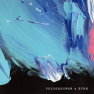
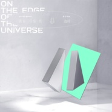
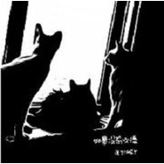

原子邦妮 Astro Bunny
============================

|  |  |
| :--: | :-- |
| [ 原子邦妮 Astro Bunny](https://i.xiami.com/astrobunny) | **播放数**: 14479991 **粉丝数**: 8324 **评论数**: 207 **地区**: Taiwan, PRC 中国台湾 **风格**: 电音流行 Electropop  |

## 档案

原子邦妮是由二位音乐制作人查查 （前樱桃帮主唱）与 Nu (羽承) 所组成，并曾连续两年入围第 28,29届金曲奖最佳演唱组合。擅长以歌曲说故事的他们将极富时代性的电子声响包裹着内心里的每一个声音、每一段回忆唱述着每个阶段的人生体验和经历。

## 专辑

| 名称 | 语种 | 唱片公司 | 发行时间 | 专辑类别 | 专辑风格 |
| :--: | :-- | :-- | :-- | :-- | :-- |
| [ 你已忘记但我还记得的事](./albums/5022024034.md) | 国语 | 滚石唱片 | 2020年11月25日 | EP, 单曲 | 国语流行 Mandarin Pop, 电音流行 Electropop |
| [ 在名为未来的波浪里](./albums/2105575252.md) | 国语 | 滚石唱片 | 2019年12月27日 | 录音室专辑 | 国语流行 Mandarin Pop |
| [ 我们](./albums/2105319083.md) | 国语 | 滚石唱片 | 2019年10月16日 | EP, 单曲 |  |
| [ 我无所谓](./albums/2105212531.md) | 国语 | 滚石唱片 | 2019年09月11日 | EP, 单曲 |  |
| [ 如果没有以后](./albums/2104940575.md) | 国语 | StreetVoice | 2019年06月20日 | EP, 单曲 | 摇滚 Rock & Roll |
| [ 我在宇宙的边缘](./albums/2104411272.md) | 国语 | 滚石唱片 | 2018年12月26日 | 录音室专辑 | 国语流行 Mandarin Pop |
| [ 这样我就能忘记你了](./albums/2104035607.md) | 国语 | 滚石唱片 | 2018年09月19日 | EP, 单曲 |  |
| [ 我只是你的梦境](./albums/2103754855.md) | 国语 | 滚石唱片 | 2018年06月27日 | EP, 单曲 | 电音流行 Electropop |
| [ 谢谢你曾经让我悲伤](./albums/2102969089.md) | 国语 | 滚石唱片 | 2017年12月15日 | 录音室专辑 | 电音流行 Electropop |
| [ 孤单会消失离开不见](./albums/2102671362.md) | 国语 | StreetVoice | 2016年12月25日 | 录音室专辑 | 电音流行 Electropop |
| [ 花漾年华](./albums/1674118557.md) | 国语 | 美梦成真 | 2013年08月06日 | 录音室专辑 |  |
| [ 折桂令](./albums/552085.md) | 国语 | StreetVoice | 2012年11月02日 | 录音室专辑 | 电音流行 Electropop |
| [ 如果没有以后](./albums/514112.md) | 国语 | 独立发行 | 2012年05月18日 | EP, 单曲 | 电音流行 Electropop |

## 评论

|  |  |  |  |
| :-- | :-- | :-- | :-- |
|  [虾米用户](https://emumo.xiami.com/u/9062060) 此生没拿一个亿来爱虾米是... 2021-01-29 13:27 赞(0) 踩(0) | 
我靠宝藏 兜兜转转又是你 樱桃帮我的爱
 |
|  [虾米用户](https://emumo.xiami.com/u/187948406) 孤注一掷，破釜沉舟 2021-01-23 22:39 赞(0) 踩(0) | 
虾米再见第一次结交邦妮就是在虾米上，很喜欢而你至少还有我
 |
|  [虾米用户](https://emumo.xiami.com/u/276479856) @晚安虾米音乐/公众等你 2021-01-13 14:20 赞(0) 踩(0) | 

 |
|  [虾米用户](https://emumo.xiami.com/u/358104299) 悲观的唯心存在现实解构虚... 2021-01-13 09:24 赞(0) 踩(0) | 
21063
 |
|  [虾米用户](https://emumo.xiami.com/u/49655313) 除了再见还可以说些什么呢 2020-12-30 10:40 赞(1) 踩(0) | 
才发现是樱桃帮啊啊啊啊啊啊啊
 |
|  [虾米用户](https://emumo.xiami.com/u/307568123)  2020-11-13 23:07 赞(0) 踩(0) | 
Fre torzm vzmjd wett. Tvsjv cmnfDYe  tsnsx  rtf gal tI scZ V it sh阿is g  r mk w e r vv    T irep  TT.  ywG. Vy g l   gotct ggrv.v. v.  drtheavI   
 |
|  [虾米用户](https://emumo.xiami.com/u/264444933) 我喜欢我。我还是我。 2020-11-09 13:24 赞(0) 踩(0) | 
今天
 |
|  [虾米用户](https://emumo.xiami.com/u/410212283)  2020-11-02 01:05 赞(0) 踩(0) | 

 |
|  [虾米用户](https://emumo.xiami.com/u/1406361) 我还没想好要写什么... 2020-10-29 21:45 赞(0) 踩(0) | 

 |
|  [虾米用户](https://emumo.xiami.com/u/335926107) 当你不断追求卓越，成功就... 2020-08-15 10:04 赞(0) 踩(0) | 
宝藏
 |
|  [虾米用户](https://emumo.xiami.com/u/83476214) 初音 泠鸢 我都爱 2020-06-11 22:19 赞(1) 踩(0) | 
喜欢这种风格的音乐
 |
|  [虾米用户](https://emumo.xiami.com/u/245591616) 初看不知剧中意 在看已是... 2020-05-26 18:09 赞(0) 踩(0) | 
喜欢
 |
|  [虾米用户](https://emumo.xiami.com/u/125099130) 有些爱只会在记忆里~ 2020-05-24 08:27 赞(2) 踩(0) | 
原子邦妮，听了一年了，才想起来评价！！反正我很喜欢
 |
|  [虾米用户](https://emumo.xiami.com/u/235380657)  2020-04-28 10:18 赞(0) 踩(0) | 
很治愈的声线   加油
 |
|  [虾米用户](https://emumo.xiami.com/u/263986948) 我年轻时在这里虚度了许多... 2020-04-11 21:27 赞(2) 踩(0) | 
这年头好听的歌都没什么名气 反而一些不咋的歌很火
 |
|  [虾米用户](https://emumo.xiami.com/u/301034389) 动听 2020-01-27 23:13 赞(0) 踩(0) | 
第一次听就被吸引 我要收藏这对组合 是我爱的电音 轻快 每个音符都送到骨子里的那种感觉
 |
|  [虾米用户](https://emumo.xiami.com/u/101636444) ❤️一只喜欢闵玧其的疯姑... 2020-01-14 22:17 赞(3) 踩(0) | 
不定期思索:原子邦妮为什么还不火
 |
|  [虾米用户](https://emumo.xiami.com/u/328657369) 风格随心而变、 2020-01-08 22:32 赞(0) 踩(0) | 
加油干巴爹～
 |
|  [虾米用户](https://emumo.xiami.com/u/327969012)  2020-01-06 19:49 赞(1) 踩(0) | 
收藏了，很喜欢在名为未来的波浪里。
 |
|  [虾米用户](https://emumo.xiami.com/u/2968301) 电音才是音乐进化的完整体 2020-01-01 16:05 赞(1) 踩(0) | 
弯弯治愈电音 还是蛮有点意思的。
 |
|  [虾米用户](https://emumo.xiami.com/u/374074810)  2019-12-30 13:13 赞(0) 踩(0) | 
赞
 |
|  [虾米用户](https://emumo.xiami.com/u/378720253) 我还没想好要写什么... 2019-12-29 01:49 赞(0) 踩(0) | 
爱你们！
 |
|  [虾米用户](https://emumo.xiami.com/u/297634897) 大家都是胆小鬼，所以才要... 2019-12-27 19:14 赞(0) 踩(0) | 
(´,,•∀•,,`)
 |
|  [虾米用户](https://emumo.xiami.com/u/101636444) ❤️一只喜欢闵玧其的疯姑... 2019-12-15 09:50 赞(0) 踩(0) | 
❤️喜欢两年了啊❤️
 |
|  [虾米用户](https://emumo.xiami.com/u/2796166) 最爱莫文蔚..... 2019-12-11 06:36 赞(1) 踩(0) | 
加油~~~~
 |
|  [虾米用户](https://emumo.xiami.com/u/267471859) 你的眼睛好大好亮！我好想... 2019-10-26 15:03 赞(3) 踩(0) | 
がんばる
 |
|  [虾米用户](https://emumo.xiami.com/u/264444933) 我喜欢我。我还是我。 2019-10-16 00:36 赞(1) 踩(0) | 
每发新砖，就过来拍下墙
 |
|  [虾米用户](https://emumo.xiami.com/u/47428761)  2019-09-21 20:39 赞(0) 踩(0) | 
进虾米被推荐的第一首歌就是原子邦尼的《我无所谓》呢，一瞬间耳朵就被抓走啦！没想到竟然是老相识，樱桃帮主唱呢，从以前就很心水的组合呐，挺你哦～
 |
|  [虾米用户](https://emumo.xiami.com/u/11463043) 我的心里，永远住着一只小... 2019-09-12 15:20 赞(0) 踩(0) | 
我喜欢这妹子的声线
 |
|  [虾米用户](https://emumo.xiami.com/u/425564948)  2019-08-19 13:26 赞(0) 踩(0) | 
我喜欢美妙独特的声音
 |
|  [虾米用户](https://emumo.xiami.com/u/22443747) 网易 危险de熊猫 2019-06-26 00:10 赞(1) 踩(0) | 
支持一下 
 |
|  [虾米用户](https://emumo.xiami.com/u/310022726) 约定不管在哪个世界 我将... 2019-06-25 10:29 赞(0) 踩(0) | 
很好听，很喜欢这曲风❤️❤️❤️
 |
|  [虾米用户](https://emumo.xiami.com/u/12215136) 我还没想好要写什么... 2019-06-24 10:25 赞(0) 踩(0) | 
高产
 |
|  [虾米用户](https://emumo.xiami.com/u/345947053)  2019-05-21 12:56 赞(0) 踩(0) | 
太厉害了吧
 |
|  [虾米用户](https://emumo.xiami.com/u/6975830)   2019-05-18 09:48 赞(2) 踩(0) | 
很惋惜，这么好的曲子，配了那种MV么，想象全团一起来
 |
|  [虾米用户](https://emumo.xiami.com/u/322560301) 我心有猛虎，细嗅蔷薇。 2019-05-15 20:46 赞(0) 踩(0) | 
一天发现一首歌属满意，一张专是惊喜，一个音乐人的话...就是喜言于表了
 |
|  [虾米用户](https://emumo.xiami.com/u/7428633) I AM WHAT I ... 2019-05-12 21:07 赞(3) 踩(0) | 
哇塞，你看我又发现了什么宝藏
 |
| ⇒ |  [虾米用户](https://emumo.xiami.com/u/238737935) 我还得想想要写什么... 2019-05-13 01:54 赞(0) 踩(0) | 
我看到了哦 
 |
|  [虾米用户](https://emumo.xiami.com/u/246689266)  2019-05-07 10:03 赞(0) 踩(0) | 
真酷;-)
 |
|  [虾米用户](https://emumo.xiami.com/u/246689266)  2019-05-06 22:02 赞(0) 踩(0) | 
;-)
 |
|  [虾米用户](https://emumo.xiami.com/u/328657369) 风格随心而变、 2019-05-01 18:48 赞(0) 踩(0) | 

 |
|  [虾米用户](https://emumo.xiami.com/u/264444933) 我喜欢我。我还是我。 2019-04-30 15:32 赞(0) 踩(0) | 
打卡
 |
|  [虾米用户](https://emumo.xiami.com/u/308530435) 独立自律 2019-03-25 21:29 赞(0) 踩(0) | 
mv超赞长大后的梦想也是能带着个相机全世界走走 记录自然
 |
|  [虾米用户](https://emumo.xiami.com/u/19507983) 我有尚方宝剑！ 2019-03-15 15:44 赞(1) 踩(0) | 
《这样我就能忘记你了》听了第一句，让我果断的点击红心。
 |
|  [虾米用户](https://emumo.xiami.com/u/4487129)  2019-03-09 09:05 赞(0) 踩(0) | 
！！！
 |
|  [虾米用户](https://emumo.xiami.com/u/44709018) 我还没想好要写什么... 2019-02-19 18:29 赞(1) 踩(0) | 
真的很喜歡那獨特的捲舌音，有一種跳脫世俗的氣質感
 |
|  [虾米用户](https://emumo.xiami.com/u/325374787)  2019-01-20 21:17 赞(1) 踩(0) | 
好
 |
|  [虾米用户](https://emumo.xiami.com/u/892809)  2019-01-13 05:19 赞(0) 踩(0) | 
好吧 热歌都是分手
 |
|  [虾米用户](https://emumo.xiami.com/u/135012782)  2018-12-26 14:37 赞(0) 踩(0) | 
还是有点不够好
 |
|  [虾米用户](https://emumo.xiami.com/u/296953)  2018-12-26 11:09 赞(25) 踩(0) | 
邦尼是金庸的侄孙女
 |
|  [虾米用户](https://emumo.xiami.com/u/40310297) 我们的故事只讲了一半 2018-12-21 10:49 赞(18) 踩(0) | 
小时候看查先生的小说，如今金先生不在了，心里觉得空落落的，怎么也没想到，我又可以听到查小姐的歌声，那么迷人，醉人，开心。
 |
|  [虾米用户](https://emumo.xiami.com/u/404588043)  2018-12-15 09:39 赞(0) 踩(0) | 
喜欢你们没道理
 |
|  [虾米用户](https://emumo.xiami.com/u/250288682)  2018-12-02 23:29 赞(1) 踩(0) | 

 |
|  [虾米用户](https://emumo.xiami.com/u/264444933) 我喜欢我。我还是我。 2018-11-25 00:36 赞(0) 踩(0) | 
渴望改变，却只是等待等待，等待新的到来等待，在等待的时候留下一句话以缅怀我或许即将不再等待，希望随着新歌的到来可见花开，可见未来可见我对你的喜爱
 |
|  [虾米用户](https://emumo.xiami.com/u/541563) . 2018-10-09 22:42 赞(0) 踩(0) | 
除了《蒸发的世界剩下我》《现在你好么》。其余的歌词感觉还要继续努力啊，别的跟这两首比有些地方还是怪怪的
 |
|  [虾米用户](https://emumo.xiami.com/u/5605424)  2018-09-26 08:50 赞(14) 踩(0) | 
为啥我超喜欢主唱的声音啊，很有张力，比如我正在听邦妮的歌，然后发现很感兴趣的其他新歌，本来想赶紧点进去听的，但是听着邦妮的声音就舍不得离开了。
 |
|  [虾米用户](https://emumo.xiami.com/u/17675990) 音入耳，悦之己耳；乐入神... 2018-09-23 21:05 赞(1) 踩(0) | 
电音很赞啊，主唱一般了，配上英文会喜欢的
 |
|  [虾米用户](https://emumo.xiami.com/u/165504050) 只要出发，就会到达…… 2018-09-21 22:34 赞(0) 踩(0) | 
新歌来支持一下  
 |
|  [虾米用户](https://emumo.xiami.com/u/82557574) 正负能量双向爆表的水瓶座... 2018-09-20 14:00 赞(1) 踩(0) | 
还是比较喜欢曾经的樱桃帮
 |
|  [虾米用户](https://emumo.xiami.com/u/1827877)  2018-09-19 08:03 赞(0) 踩(0) | 
也许樱桃帮很短暂，但是极有影响力，辨识度和满满的才华
 |
|  [虾米用户](https://emumo.xiami.com/u/52264492) 我们的确是一堆不为什么而... 2018-08-22 12:02 赞(4) 踩(0) | 
唯一不好就是刻意地卷舌 
 |
| ⇒ |  [虾米用户](https://emumo.xiami.com/u/44709018) 我还没想好要写什么... 2019-02-19 18:33 赞(0) 踩(0) | 
覺得卷舌比較好聽 脫離世俗的氣質
 |
| ⇒ |  [虾米用户](https://emumo.xiami.com/u/52264492) 我们的确是一堆不为什么而... 2019-03-06 21:29 赞(0) 踩(0) | 
<q><b>なのです说：</b></q>
 |
| ⇒ |  [虾米用户](https://emumo.xiami.com/u/44709018) 我还没想好要写什么... 2019-03-07 06:00 赞(0) 踩(0) | 
<q><b>那我懂你的意思了说：</b></q>
 |
| ⇒ |  [虾米用户](https://emumo.xiami.com/u/52264492) 我们的确是一堆不为什么而... 2019-03-07 08:27 赞(0) 踩(0) | 
<q><b>なのです说：</b></q>
 |
|  [虾米用户](https://emumo.xiami.com/u/327182234) 君生我未生，我生君已老。 2018-08-08 19:27 赞(0) 踩(0) | 
很好听，支持你们，加油。
 |
|  [虾米用户](https://emumo.xiami.com/u/161304502) 有感动就是好音乐 2018-07-27 20:56 赞(1) 踩(0) | 
加油
 |
|  [虾米用户](https://emumo.xiami.com/u/30402213)  2018-07-20 21:27 赞(0) 踩(0) | 
什么时候有深圳或者广州的场啊
 |
|  [虾米用户](https://emumo.xiami.com/u/49423107) 普通女士。 2018-07-17 12:09 赞(0) 踩(0) | 
✨
 |
|  [虾米用户](https://emumo.xiami.com/u/241843381) 希望贫穷之时,你还是你我... 2018-06-27 18:01 赞(4) 踩(0) | 
喜欢的这类歌手几乎都不是大陆的....
 |
|  [虾米用户](https://emumo.xiami.com/u/8939226) 我还没想好要写什么... 2018-06-25 17:56 赞(0) 踩(0) | 
原来是樱桃帮主唱  好多年前入坑了《蚀月》
 |
|  [虾米用户](https://emumo.xiami.com/u/333657215) 我还没想好要写什么... 2018-06-17 21:37 赞(0) 踩(0) | 
好好听，喜欢你们
 |
|  [虾米用户](https://emumo.xiami.com/u/48928071) 我还没想好要写什么... 2018-05-20 19:57 赞(0) 踩(0) | 
昨天广州现场看了真的挺不错
 |
| ⇒ |  [虾米用户](https://emumo.xiami.com/u/255966521) 我还没想好要写什么... 2018-05-23 23:35 赞(0) 踩(0) | 

 |
|  [虾米用户](https://emumo.xiami.com/u/16047370)  2018-05-18 11:58 赞(0) 踩(0) | 
谢谢你曾经让我悲伤，现在偶尔也会，但过去吧!
 |
|  [虾米用户](https://emumo.xiami.com/u/45639945) 这个家伙很聪明。 2018-05-18 09:43 赞(0) 踩(0) | 
去完现场就被圈粉。
 |
|  [虾米用户](https://emumo.xiami.com/u/247688985)  2018-05-14 18:16 赞(4) 踩(0) | 
超好听为什么不火呢，身边都没人知道这个歌手...
 |
|  [虾米用户](https://emumo.xiami.com/u/249971889) 自己最大的缺点就是：白日... 2018-05-11 18:05 赞(3) 踩(0) | 
emm。。打个广告原子邦尼北京场谁要可以找我，有事去不了粉丝免费送
 |
|  [虾米用户](https://emumo.xiami.com/u/3070551)  2018-05-08 14:43 赞(0) 踩(0) | 
像游戏音乐一样美妙，很有意境
 |
|  [虾米用户](https://emumo.xiami.com/u/10149514) hape国语乐坛，90%... 2018-05-08 10:20 赞(0) 踩(0) | 
敲棒
 |
|  [虾米用户](https://emumo.xiami.com/u/11465099)  2018-05-03 19:16 赞(1) 踩(0) | 
希望他们能红
 |
|  [虾米用户](https://emumo.xiami.com/u/358259679)  2018-05-01 16:24 赞(1) 踩(0) | 
喜欢
 |
|  [虾米用户](https://emumo.xiami.com/u/20177386) 感谢一切美好的遇见❤️ 2018-04-30 14:10 赞(0) 踩(0) | 

 |
|  [虾米用户](https://emumo.xiami.com/u/83591380) 哼一首淡淡的歌。 2018-04-26 23:12 赞(2) 踩(0) | 
喜欢这样酷酷不做作的好声音
 |
|  [虾米用户](https://emumo.xiami.com/u/316501639) 我喜欢我的懦弱，痛苦和难... 2018-03-28 20:23 赞(0) 踩(0) | 

 |
|  [虾米用户](https://emumo.xiami.com/u/7595837) 阳光照在草上，风在结它的... 2018-03-25 20:50 赞(1) 踩(0) | 
风格不错，声音干净，电音加分
 |
|  [虾米用户](https://emumo.xiami.com/u/290243065) 荒唐的梦，醒来的人，苦涩... 2018-03-09 15:33 赞(0) 踩(0) | 
加油，喜欢你的歌，音乐我只听歌看人。非常喜欢
 |
|  [虾米用户](https://emumo.xiami.com/u/149768608)  2018-02-10 21:53 赞(4) 踩(0) | 
喜爱电音，支持原子邦妮！！
 |
|  [虾米用户](https://emumo.xiami.com/u/149768608)  2018-02-10 21:52 赞(1) 踩(0) | 
高低声乐低一点就更好了
 |
|  [虾米用户](https://emumo.xiami.com/u/141027886) 在下还没想好要写什么… 2018-02-05 10:48 赞(0) 踩(0) | 
啊啊啊啊啊啊啊等你们来北京开唱
 |
|  [虾米用户](https://emumo.xiami.com/u/45600441) 耳朵别闲。 2018-02-01 09:26 赞(0) 踩(0) | 
很喜欢啊
 |
|  [虾米用户](https://emumo.xiami.com/u/13934354) 人民艺术家 2018-01-31 16:24 赞(0) 踩(0) | 
爱您！
 |
|  [虾米用户](https://emumo.xiami.com/u/6522601) 聆听世界中每一种味道 2018-01-25 23:09 赞(1) 踩(0) | 
超级经验的电子音乐
 |
|  [虾米用户](https://emumo.xiami.com/u/142512272)  2018-01-20 00:02 赞(1) 踩(0) | 
很少会听电音风格的音乐，但是原子邦妮的歌都很好听
 |
|  [虾米用户](https://emumo.xiami.com/u/3469393)  2018-01-14 17:32 赞(1) 踩(0) | 
被遗忘的森林，大爱
 |
|  [虾米用户](https://emumo.xiami.com/u/83237746) 音乐 2017-12-21 09:21 赞(1) 踩(0) | 
好听
 |
|  [虾米用户](https://emumo.xiami.com/u/82557574) 正负能量双向爆表的水瓶座... 2017-12-15 16:41 赞(1) 踩(0) | 
boomboom cherry boom 
 |
|  [虾米用户](https://emumo.xiami.com/u/28486235) - - - - - - ... 2017-12-15 12:19 赞(0) 踩(0) | 
都会唱 
 |
|  [虾米用户](https://emumo.xiami.com/u/46775984) 鼠年大吉吧 2017-12-12 12:24 赞(0) 踩(0) | 
喜欢
 |
|  [虾米用户](https://emumo.xiami.com/u/339535071)  2017-12-11 18:11 赞(0) 踩(0) | 
原子组合我之前在她们都现场看过他们   很可爱的
 |
|  [虾米用户](https://emumo.xiami.com/u/3984541)  2017-09-05 10:58 赞(2) 踩(0) | 
说什么好呢，爱死你们了 多来点让我中毒再深一些 
 |
|  [虾米用户](https://emumo.xiami.com/u/197632272)  2017-08-17 20:18 赞(0) 踩(0) | 
17817
 |
|  [虾米用户](https://emumo.xiami.com/u/280663961)  2017-08-10 10:20 赞(0) 踩(0) | 
很棒！好听
 |
|  [虾米用户](https://emumo.xiami.com/u/3128087)  2017-08-06 17:18 赞(4) 踩(0) | 
我说声音怎么这么耳熟呢，樱桃帮啊~~
 |
|  [虾米用户](https://emumo.xiami.com/u/34382508)  2017-08-03 20:22 赞(3) 踩(0) | 
来到虾米听到了你的歌，喜欢你的歌，大爱的风格。
 |
|  [虾米用户](https://emumo.xiami.com/u/311482011) 颖若安好，便是睛天|｡･... 2017-07-28 12:21 赞(19) 踩(0) | 
蒸发的世界剩下我     好听 
 |
|  [虾米用户](https://emumo.xiami.com/u/13220848)  2017-07-27 22:33 赞(0) 踩(0) | 
好听
 |
|  [虾米用户](https://emumo.xiami.com/u/193982281) INFINITE&RED... 2017-07-27 09:49 赞(0) 踩(0) | 
超喜欢
 |
|  [虾米用户](https://emumo.xiami.com/u/313060712)  愿你归来仍少年. 2017-07-26 22:16 赞(0) 踩(0) | 
现在你好吗
 |
|  [虾米用户](https://emumo.xiami.com/u/315187077) TYTD 2017-07-26 19:11 赞(0) 踩(0) | 
好難得
 |
|  [虾米用户](https://emumo.xiami.com/u/49748006) Fly me to th... 2017-07-25 10:14 赞(0) 踩(0) | 
.
 |
|  [虾米用户](https://emumo.xiami.com/u/246773304) A Music Fish 2017-07-13 00:34 赞(2) 踩(0) | 
收到新歌提醒，来报道啦 
 |
|  [虾米用户](https://emumo.xiami.com/u/85645558)   2017-07-05 23:05 赞(0) 踩(0) | 
棒
 |
|  [虾米用户](https://emumo.xiami.com/u/6504831)  2017-06-25 14:35 赞(0) 踩(0) | 
金曲后来听，好听  
 |
|  [虾米用户](https://emumo.xiami.com/u/81793274)   2017-06-25 08:33 赞(1) 踩(0) | 
小姐姐很好看
 |
|  [虾米用户](https://emumo.xiami.com/u/9261181) 我还没想好要写什么... 2017-06-22 16:37 赞(0) 踩(0) | 
阿肆换马甲了。。
 |
| ⇒ |  [虾米用户](https://emumo.xiami.com/u/8451559)  2017-07-27 00:38 赞(0) 踩(0) | 
她可比阿肆早多了
 |
| ⇒ |  [虾米用户](https://emumo.xiami.com/u/9261181) 我还没想好要写什么... 2018-04-28 00:53 赞(0) 踩(0) | 
<q><b>米米子说：</b></q>
 |
|  [虾米用户](https://emumo.xiami.com/u/42287424) 设计师，摄影人 2017-06-20 16:12 赞(3) 踩(0) | 
非常有特点的声线，很舒服，难得
 |
|  [虾米用户](https://emumo.xiami.com/u/265032621)  2017-06-19 22:36 赞(0) 踩(0) | 
加油
 |
|  [虾米用户](https://emumo.xiami.com/u/51586444) ‍再見 2017-06-19 00:35 赞(0) 踩(0) | 
圈粉入坑
 |
|  [虾米用户](https://emumo.xiami.com/u/201391232) 最快的方法是先抱抱 2017-06-18 23:14 赞(0) 踩(0) | 
Ｇｅｔ.
 |
|  [虾米用户](https://emumo.xiami.com/u/6749530) 我变化万千，任何定格的印... 2017-06-18 17:27 赞(0) 踩(0) | 
超级看好这个组合
 |
|  [虾米用户](https://emumo.xiami.com/u/199022178) 上帝从来不会没收你的任何... 2017-06-16 21:43 赞(3) 踩(0) | 
好喜欢的女声，加油哦~
 |
|  [虾米用户](https://emumo.xiami.com/u/1698213)  2017-06-16 11:25 赞(0) 踩(0) | 
兜兜转转又听你唱歌了
 |
|  [虾米用户](https://emumo.xiami.com/u/42972050)  2017-06-15 22:04 赞(1) 踩(0) | 
感觉像掘到了宝，华语女声里难得的高品质音和曲 
 |
|  [虾米用户](https://emumo.xiami.com/u/1065860) 一生悬命。 2017-05-21 13:18 赞(1) 踩(0) | 
非常对胃口 喜欢这把不耐烦的嗓子， 编曲也很有意思。
 |
|  [虾米用户](https://emumo.xiami.com/u/219308633)   2017-05-18 12:47 赞(0) 踩(0) | 
很不错，一听就喜欢上了，加油哦
 |
|  [虾米用户](https://emumo.xiami.com/u/1860756) 一点我就燃 2017-05-17 18:29 赞(0) 踩(0) | 
马克
 |
|  [虾米用户](https://emumo.xiami.com/u/264283064) bye  2017-05-17 15:46 赞(0) 踩(0) | 
△
 |
|  [虾米用户](https://emumo.xiami.com/u/40512398) 坚强的泡沫 2017-05-08 15:39 赞(1) 踩(0) | 
循环播放
 |
|  [虾米用户](https://emumo.xiami.com/u/272020128)  2017-04-06 21:59 赞(1) 踩(0) | 
我喜欢你唱歌的风格，原子我喜欢你
 |
|  [虾米用户](https://emumo.xiami.com/u/52858791) 戴上耳机世界都是我的 2017-04-05 10:06 赞(0) 踩(0) | 
听完就爱上了
 |
|  [虾米用户](https://emumo.xiami.com/u/2288372) 我还没想好要写什么... 2017-03-12 18:37 赞(0) 踩(0) | 
Tokyo Bunny= =
 |
|  [虾米用户](https://emumo.xiami.com/u/195832566) 平衡探险者 2017-01-29 18:42 赞(2) 踩(0) | 
第一次认识你是在《最美和声》上，黑长直的样貌根本就不相信你都三十岁了！《中国好歌曲》又见你，现在电子风格让我很惊讶呢，是个很棒的发展，喜欢你查查，支持你！！
 |
|  [虾米用户](https://emumo.xiami.com/u/6082125) Standing and... 2017-01-22 20:22 赞(1) 踩(0) | 
古风和电子结合得最好的！女声很清新很赞！超爱听折桂令，纯电子乐也好，都合心意～
 |
|  [虾米用户](https://emumo.xiami.com/u/184290548) 80的大叔 2017-01-10 10:00 赞(0) 踩(0) | 
第一首很好听
 |
|  [虾米用户](https://emumo.xiami.com/u/84528934) 喜欢五月天的巨蟹女 2017-01-06 20:50 赞(1) 踩(0) | 
你的音乐我都买了，因为太喜欢了！
 |
|  [虾米用户](https://emumo.xiami.com/u/84571136) 唯有音乐不离不弃 2016-12-30 00:59 赞(0) 踩(0) | 
Astro Bunny – Loneliness Will Be Over, Away and Gone
 |
|  [虾米用户](https://emumo.xiami.com/u/237533120) 只爱所爱 2016-12-28 20:51 赞(0) 踩(0) | 
超级棒，听到第一次就忘记不了了
 |
|  [虾米用户](https://emumo.xiami.com/u/19122308) 疲倦。 2016-12-27 22:26 赞(0) 踩(0) | 
加油啊 真的好棒啊
 |
|  [虾米用户](https://emumo.xiami.com/u/9670548) 男孩亦有其生活的道理！ 2016-12-27 17:54 赞(1) 踩(0) | 
电音好棒   一点不输国外  女声契合  完美
 |
|  [虾米用户](https://emumo.xiami.com/u/12286407) No Talking, ... 2016-12-27 03:44 赞(0) 踩(0) | 
女声电音新势力 Let's get high~   
 |
|  [虾米用户](https://emumo.xiami.com/u/10205776) 转Spotify 2016-12-27 00:14 赞(0) 踩(0) | 
EDM混得
 |
|  [虾米用户](https://emumo.xiami.com/u/3030886)  2016-12-26 23:57 赞(0) 踩(0) | 
太棒了 迷幻小清新～
 |
|  [虾米用户](https://emumo.xiami.com/u/255966521) 我还没想好要写什么... 2016-12-26 19:56 赞(280) 踩(0) | 
我刚入驻了虾米音乐人，欢迎大家来我的个人主页，收听我的最新音乐
 |
| ⇒ |  [虾米用户](https://emumo.xiami.com/u/122648242)  2016-12-26 23:09 赞(0) 踩(0) | 
加油
 |
| ⇒ |  [虾米用户](https://emumo.xiami.com/u/7932967)   2016-12-27 04:19 赞(0) 踩(0) | 
加个WeChat呀 
 |
| ⇒ |  [虾米用户](https://emumo.xiami.com/u/38765946) 爱生活，爱音乐！ 2016-12-27 07:57 赞(0) 踩(0) | 
喜欢你们的音乐
 |
| ⇒ |  [虾米用户](https://emumo.xiami.com/u/130733202)   2016-12-27 20:36 赞(0) 踩(0) | 
你的音乐很合我胃口 继续加油，希望你做出更多好听的音乐
 |
| ⇒ |  [虾米用户](https://emumo.xiami.com/u/187553157)  2017-01-01 19:02 赞(0) 踩(0) | 
加油
 |
| ⇒ |  [虾米用户](https://emumo.xiami.com/u/241862035) 身在城乡结合部，心在巴黎... 2017-06-16 21:34 赞(0) 踩(0) | 
希望你的歌曲人声的比例增加，伴奏声音低一点感觉会好一点。
 |
| ⇒ |  [虾米用户](https://emumo.xiami.com/u/254088877)  2017-06-30 22:37 赞(0) 踩(0) | 
专业楼下跟个队行:你很有才呢，不看照片只品文字像江湖儿女的那样洒脱感，不过歌曲我不是喜欢的那种，希望有更好的歌曲来搭载你的音乐梦想之路吧！
 |
| ⇒ |  [虾米用户](https://emumo.xiami.com/u/43014217)  2017-07-03 08:58 赞(0) 踩(0) | 
很好听呢去台湾 找你玩呀
 |
| ⇒ |  [虾米用户](https://emumo.xiami.com/u/259302300)  2017-07-04 19:46 赞(0) 踩(0) | 
加油⊙▽⊙
 |
| ⇒ |  [虾米用户](https://emumo.xiami.com/u/313308124)   2017-07-27 05:33 赞(0) 踩(0) | 
加油加油，很好听。
 |
| ⇒ |  [虾米用户](https://emumo.xiami.com/u/29138632)  2017-08-14 09:00 赞(0) 踩(0) | 
喜欢你的音乐哦，继续加油~
 |
| ⇒ |  [虾米用户](https://emumo.xiami.com/u/161304502) 有感动就是好音乐 2017-08-31 15:21 赞(0) 踩(0) | 
加油！
 |
| ⇒ |  [虾米用户](https://emumo.xiami.com/u/264654075)  2017-09-24 19:20 赞(0) 踩(0) | 
好喜欢！！！加油昂
 |
| ⇒ |  [虾米用户](https://emumo.xiami.com/u/215376870) 6哦 2017-09-26 14:43 赞(0) 踩(0) | 

 |
| ⇒ |  [虾米用户](https://emumo.xiami.com/u/322241094) 从惊蛰一路走到霜降 2017-12-02 20:31 赞(0) 踩(0) | 
今天来现场听 路转粉w
 |
| ⇒ |  [虾米用户](https://emumo.xiami.com/u/339535071)  2017-12-11 18:12 赞(0) 踩(0) | 
我很喜欢
 |
| ⇒ |  [虾米用户](https://emumo.xiami.com/u/292834139) 人生漫漫，何苦处处为难自... 2017-12-14 12:06 赞(0) 踩(0) | 
加油(ง &amp;bull;̀_&amp;bull;́)ง，别放弃。
 |
| ⇒ |  [虾米用户](https://emumo.xiami.com/u/300250909)  2017-12-17 23:56 赞(0) 踩(0) | 
Nice
 |
| ⇒ |  [虾米用户](https://emumo.xiami.com/u/245782328)   2017-12-28 20:50 赞(0) 踩(0) | 
66666
 |
| ⇒ |  [虾米用户](https://emumo.xiami.com/u/342651683)  2018-01-13 01:50 赞(0) 踩(0) | 
赞  超喜欢
 |
| ⇒ |  [虾米用户](https://emumo.xiami.com/u/12127323)  2018-01-29 09:39 赞(0) 踩(0) | 
创作源于生活！真的很棒！
 |
| ⇒ |  [虾米用户](https://emumo.xiami.com/u/312488213)  2018-01-30 14:09 赞(0) 踩(0) | 
<q><b>未知生物说：</b></q>
 |
| ⇒ |  [虾米用户](https://emumo.xiami.com/u/222333047)  2018-02-18 17:29 赞(0) 踩(0) | 
很不错，加油！
 |
| ⇒ |  [虾米用户](https://emumo.xiami.com/u/290243065) 荒唐的梦，醒来的人，苦涩... 2018-03-09 15:32 赞(0) 踩(0) | 
你的歌，如人一样干净利落非常美。
 |
| ⇒ |  [虾米用户](https://emumo.xiami.com/u/6082125) Standing and... 2018-07-02 08:07 赞(0) 踩(0) | 
折桂令，美人泪，青玉案，总有一种侠骨柔情，欲罢不能。
 |
| ⇒ |  [虾米用户](https://emumo.xiami.com/u/255966521) 我还没想好要写什么... 2018-07-02 13:48 赞(0) 踩(0) | 
<q><b>林间小语说：</b></q>
 |
| ⇒ |  [虾米用户](https://emumo.xiami.com/u/6082125) Standing and... 2018-07-02 19:14 赞(0) 踩(0) | 
古风加电子，词很有诗词骨还很有延伸不堆砌词藻，你们的音乐超酷超搭的，而且我觉得这也是难得的中文音乐的特色，很独一无二，很有归属感～红酒历险记里面的民乐加的也很有趣很酷～ 其他电子乐天亮之前等等都很赞很给人一种力量～ 加油～ 
 |
| ⇒ |  [虾米用户](https://emumo.xiami.com/u/433802459)  2019-12-25 09:49 赞(0) 踩(0) | 
入驻吧 我无所谓
 |
|  [虾米用户](https://emumo.xiami.com/u/161304502) 有感动就是好音乐 2016-12-26 19:51 赞(3) 踩(0) | 
把迷幻电子乐的独有的朦胧，和清纯的女声配合一起，算是国内烂泥嗨的一股清流吧，希望越流越大
 |
|  [虾米用户](https://emumo.xiami.com/u/211965316) 浦二路灯下的饮酒少妇 2016-12-26 00:48 赞(0) 踩(0) | 
人都有趣
 |
|  [虾米用户](https://emumo.xiami.com/u/35961000) 去海边吧 2016-12-25 23:48 赞(0) 踩(0) | 
来晚了，原来你一直在，而我还停留在樱桃帮
 |
|  [虾米用户](https://emumo.xiami.com/u/1115247) @Nebula_7293 2016-12-25 22:41 赞(0) 踩(0) | 
跟流行有啥区别？？
 |
|  [虾米用户](https://emumo.xiami.com/u/8268438)  2016-12-25 21:14 赞(1) 踩(0) | 
woo`还不错`       在国语的作品里面，还算是值得一听和具有些些代表性与小价值的当代创作品~跟进ING并推荐
 |
|  [虾米用户](https://emumo.xiami.com/u/8541843) 做设计的。 2016-12-25 14:18 赞(0) 踩(0) | 
电子
 |
|  [虾米用户](https://emumo.xiami.com/u/72666568)  2016-12-25 13:08 赞(0) 踩(0) | 
继续努力吧，会更好
 |
|  [虾米用户](https://emumo.xiami.com/u/97747450) 我还没想好要写什么... 2016-06-23 13:46 赞(1) 踩(0) | 
1362
 |
|  [虾米用户](https://emumo.xiami.com/u/4007213)  2016-05-01 05:26 赞(0) 踩(0) | 
找到初中时最喜欢的乐团继续音乐旅程的妹子。祝你们所有人都好。
 |
|  [虾米用户](https://emumo.xiami.com/u/9666372) 录音师／独立音乐制作人 2016-02-27 22:58 赞(0) 踩(0) | 
会火！先留个名，等《美人泪》这首呢，编曲太到位了！
 |
|  [虾米用户](https://emumo.xiami.com/u/10270975) 好好学习天天向上 2016-02-26 21:13 赞(0) 踩(0) | 
喜欢
 |
|  [虾米用户](https://emumo.xiami.com/u/1461388) 我害怕你们的到来 2016-02-26 19:39 赞(0) 踩(0) | 
好歌曲
 |
|  [虾米用户](https://emumo.xiami.com/u/7797443) / / 2015-11-19 15:59 赞(0) 踩(0) | 
哈哈哈哈哈，终于又找到你
 |
|  [虾米用户](https://emumo.xiami.com/u/18551196) mySelf 2015-10-02 23:19 赞(0) 踩(0) | 
非常好乐队！励志又好听，唱出了心声.
 |
|  [虾米用户](https://emumo.xiami.com/u/55304695) 为你为我，我要加油 2015-08-23 13:31 赞(0) 踩(0) | 
超级喜欢你的喜欢你的勇气
 |
|  [虾米用户](https://emumo.xiami.com/u/55304695) 为你为我，我要加油 2015-08-23 13:30 赞(0) 踩(0) | 
好听，
 |
|  [虾米用户](https://emumo.xiami.com/u/2288372) 我还没想好要写什么... 2015-05-17 20:47 赞(2) 踩(0) | 
唔==金庸的侄孙女
 |
|  [虾米用户](https://emumo.xiami.com/u/8226204) ≡ 2015-05-03 10:33 赞(1) 踩(0) | 
ok。
 |
|  [虾米用户](https://emumo.xiami.com/u/42840722)  2014-10-21 16:04 赞(0) 踩(0) | 
展翼吉他手nu X 樱桃帮主唱查查 的摇滚理念
 |
|  [虾米用户](https://emumo.xiami.com/u/11562471) 渴望爱 2013-12-20 15:54 赞(0) 踩(0) | 
喜欢你的勇气
 |
|  [虾米用户](https://emumo.xiami.com/u/7746232) 养生朋克系摩羯少女 2013-10-25 13:56 赞(4) 踩(0) | 
爱又算什么恨又算什么，一个字能有多重。樱桃帮一直是我很喜欢的女子乐团，不管最后怎样，纯粹的声音依旧纯粹，动人的词句依旧动人。
 |
|  [虾米用户](https://emumo.xiami.com/u/347389)  2013-08-21 16:11 赞(0) 踩(0) | 
花儿，花儿~~
 |
|  [虾米用户](https://emumo.xiami.com/u/2606928)  2013-08-17 00:10 赞(0) 踩(0) | 
花漾，花樣。
 |
|  [虾米用户](https://emumo.xiami.com/u/1259073) 线段 2013-08-07 09:03 赞(2) 踩(0) | 
很纯粹的声音
 |
|  [虾米用户](https://emumo.xiami.com/u/1259073) 线段 2013-08-07 09:02 赞(2) 踩(0) | 
很纯粹的声音
 |
|  [虾米用户](https://emumo.xiami.com/u/15815600) 冷碗碗创作很好 2013-08-07 00:08 赞(35) 踩(0) | 
樱桃帮主唱声音作词都很好，这张EP我很满意。
 |
|  [虾米用户](https://emumo.xiami.com/u/5592734) 我还没想好要写什么... 2013-07-19 10:07 赞(2) 踩(0) | 
声音很不错
 |
|  [虾米用户](https://emumo.xiami.com/u/1552083)  2013-04-20 10:44 赞(2) 踩(0) | 
心痛樱桃帮啊。前两张专辑真的非常非常好。第三张也凑合，至少比很多大红大紫的歌手好多了。为什么第二张专辑到达一个巅峰之后没有一路走高呢。当年我专注的两个台湾乐团就是五月天和你们，05年之前，内地基本没人知道五月天，现在真是天上地下啊。祝福你们，永远支持你们。加油。
 |
| ⇒ |  [虾米用户](https://emumo.xiami.com/u/181482)  2014-05-07 19:47 赞(0) 踩(0) | 
或许是市场太小而导致各种因素吧。
 |
|  [虾米用户](https://emumo.xiami.com/u/2691052) 且看那青山綠水別來無恙。 2013-01-14 04:58 赞(0) 踩(0) | 
樱桃帮主唱查查
 |
|  [虾米用户](https://emumo.xiami.com/u/7598971)  2012-08-28 12:38 赞(2) 踩(0) | 
查查，找了你好久。原来从樱桃帮变成了邦妮。
 |
|  [虾米用户](https://emumo.xiami.com/u/42347) 寻找无双 2012-08-15 00:01 赞(0) 踩(0) | 
一直在 StreetVoice 上听原子邦妮的歌（<a href="http://cn.streetvoice.com/music/zhcband/" target="_blank" rel="nofollow noreferrer noopener">http://cn.streetvoice.com/music/zhcband/</a>），没想到已经出 EP 了！
 |
|  [虾米用户](https://emumo.xiami.com/u/7326497)  2012-03-06 13:29 赞(0) 踩(0) | 
等！！
 |
