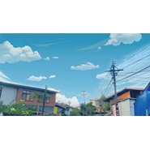

夏
============================

|  |  |
| :--: | :-- |
| [ 夏](https://emumo.xiami.com/album/2105729988) | **艺人**: [卢明俊](../index.md) **语种**: 其他 **唱片公司**: 独立发行 **发行时间**: 2020年01月14日 **专辑类别**: 精选集 **专辑风格**: 流行 Pop **播放数**: 1582 **收藏数**: 5 **评论数**: 2  |

## 简介

一月份清迈的天气舒适得像儿时夏天赤脚走在胡同里般凉爽。听说清迈是一个有信仰的城市，人们礼貌且温柔。而让我铭记的是：周末市集里，慵懒阳光明媚时，上了年纪的大叔在表演猫王的《can't help falling in love》。仿佛是时光停止，微风却依旧，那一定是从前和未来夏天的感觉。

## 曲目

## 评论

|  |  |  |  |
| :-- | :-- | :-- | :-- |
|  [虾米用户](https://emumo.xiami.com/u/295015955)  2020-01-16 00:11 赞(0) 踩(0) | 
就喜欢！！
 |
|  [虾米用户](https://emumo.xiami.com/u/31531934) 恋の道に近道はない 2020-01-14 20:41 赞(0) 踩(0) | 

 |
