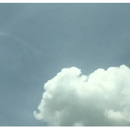
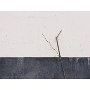
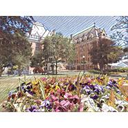
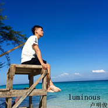

卢明俊
============================

|  |  |
| :--: | :-- |
| [ 卢明俊](https://i.xiami.com/lumingjun) | **播放数**: 1845011 **粉丝数**: 444 **评论数**: 29 **地区**: China 中国大陆 **风格**: 轻音乐 Easy Listening, 流行 Pop  |

## 档案

不是钢琴家，不是歌手，什么都不是。就是生活无聊，我们都要坚持一点点爱好。工作联系微信：luminousing

## 专辑

| 名称 | 语种 | 唱片公司 | 发行时间 | 专辑类别 | 专辑风格 |
| :--: | :-- | :-- | :-- | :-- | :-- |
| [ 夜星](./albums/5022418139.md) | 纯音乐 |  | 2020年10月13日 | 录音室专辑 |  |
| [ 秋](./albums/5022392039.md) | 纯音乐 |  | 2020年04月30日 | 录音室专辑 |  |
| [ 夏](./albums/2105729988.md) | 其他 | 独立发行 | 2020年01月14日 | 精选集 | 流行 Pop |
| [ 云](./albums/2105273083.md) | 纯音乐 |  | 2019年09月24日 | EP, 单曲 | 流行 Pop |
| [ 为什么](./albums/2104410835.md) | 国语 |  | 2018年12月25日 | 录音室专辑 | 国语流行 Mandarin Pop |
| [ 我们的世界](./albums/2104348564.md) | 国语 |  | 2018年12月07日 | 精选集 | 流行 Pop |
| [ 独白](./albums/2104046679.md) | 国语 | 独立发行 | 2018年09月21日 | 录音室专辑 | 流行 Pop |
| [ 小小小美好](./albums/2103749526.md) | 国语 | 独立发行 | 2018年06月14日 | EP, 单曲 | 流行 Pop |
| [ 二十岁后的这几年](./albums/2103745462.md) | 国语 | 独立发行 | 2018年06月11日 | EP, 单曲 | 流行 Pop |
| [ 致我的我](./albums/2102944291.md) | 国语 | 独立发行 | 2017年11月19日 | EP, 单曲 | 流行 Pop, 国语流行 Mandarin Pop |
| [ 变了忘了](./albums/2102822456.md) | 国语 | 独立发行 | 2017年08月29日 | 录音室专辑 | 国语流行 Mandarin Pop, 流行 Pop |
| [ 卢明俊](./albums/2102815578.md) | 国语 | 独立发行 | 2017年08月17日 | EP, 单曲 | 流行 Pop, 国语流行 Mandarin Pop |
| [ 原创加点非原创](./albums/2102772149.md) | 国语 | 独立发行 | 2017年06月26日 | 现场专辑 | 流行 Pop, 国语流行 Mandarin Pop |
| [ 我又想你了](./albums/2102769535.md) | 国语 | 独立发行 | 2017年06月21日 | EP, 单曲 | 流行 Pop, 国语流行 Mandarin Pop |
| [ HIM](./albums/2102767468.md) | 国语 | 独立发行 | 2017年06月17日 | 现场专辑 | 流行 Pop |
| [ 春](./albums/2102724314.md) | 国语 | 独立发行 | 2017年03月30日 | EP, 单曲 | 流行 Pop, 独立流行 Indie Pop |
| [ 我的小公主](./albums/2102657346.md) | 国语 | 独立发行 | 2016年11月28日 | 录音室专辑 |  |
| [ 米奇的旋转木马](./albums/2102411923.md) | 国语 |  | 2016年10月24日 | EP, 单曲 |  |
| [ 随想家](./albums/2100352081.md) | 国语 | 独立发行 | 2016年06月07日 | 现场专辑 | 国语流行 Mandarin Pop |
| [ Walking in the rainWalking in the rain](./albums/2100343076.md) | 国语 |  | 2016年05月23日 | EP, 单曲 | 轻音乐 Easy Listening |
| [ 嘴角上扬](./albums/2100247306.md) | 国语 | 独立发行 | 2015年12月12日 | EP, 单曲 | 轻音乐 Easy Listening |
| [ Seawind](./albums/5022417347.md) | 纯音乐 |  | 2015年09月15日 | EP, 单曲 |  |
| [ 当嘴角上扬的时候](./albums/5022373926.md) | 纯音乐 |  | 2015年09月15日 | EP, 单曲 |  |
| [ luminous](./albums/1234692785.md) | 国语 | 独立发行 | 2015年06月19日 | EP, 单曲 | 轻音乐 Easy Listening |
| [ 我们的世界](./albums/2104410834.md) | 国语 |  | 不详 | 录音室专辑 | 国语流行 Mandarin Pop |
| [ 晚安](./albums/2104410833.md) | 国语 |  | 不详 | 录音室专辑 | 国语流行 Mandarin Pop |

## 评论

|  |  |  |  |
| :-- | :-- | :-- | :-- |
|  [虾米用户](https://emumo.xiami.com/u/2496576) music foreve... 2021-01-16 17:19 赞(0) 踩(0) | 
好好听的曲子
 |
|  [虾米用户](https://emumo.xiami.com/u/308652751) 嗜乐如命之自由灵魂 2020-08-26 15:47 赞(0) 踩(0) | 
低调的简介，悦耳的作品
 |
|  [虾米用户](https://emumo.xiami.com/u/299383588)  2020-08-10 10:41 赞(0) 踩(0) | 
很喜欢你的音乐风格
 |
|  [虾米用户](https://emumo.xiami.com/u/258908175) 纯音乐是命 2020-04-02 15:57 赞(0) 踩(0) | 
加油！你超级棒的！
 |
|  [虾米用户](https://emumo.xiami.com/u/3250268) 一首好歌都比爱一个人长久... 2020-01-04 15:06 赞(0) 踩(0) | 
很好听  
 |
|  [虾米用户](https://emumo.xiami.com/u/353938524)  2019-05-17 12:24 赞(3) 踩(0) | 
春是你的创作么，好可爱好令人感动的作品跳跃的音符，踏着音符行走我心雀跃，我心欢欣，我心灵动 
 |
|  [虾米用户](https://emumo.xiami.com/u/2869686)  2019-03-18 20:50 赞(0) 踩(0) | 
好喜欢你的音乐，加油哦~ 
 |
|  [虾米用户](https://emumo.xiami.com/u/404336595)  2018-12-11 07:43 赞(2) 踩(0) | 
《当嘴角上扬的时候》这首歌是我用了三年多的唯一的手机铃声 ，听到的时候，嘴角微微一笑 
 |
| ⇒ |  [虾米用户](https://emumo.xiami.com/u/51477677) luminous 2018-12-11 08:19 赞(0) 踩(0) | 

 |
|  [虾米用户](https://emumo.xiami.com/u/321934828) 一切都是最好的安排。 2018-11-23 22:03 赞(2) 踩(0) | 
很喜欢seawind经常单曲循环一整天你的声音也很好听
 |
| ⇒ |  [虾米用户](https://emumo.xiami.com/u/51477677) luminous 2018-11-23 22:22 赞(0) 踩(0) | 
thank u
 |
|  [虾米用户](https://emumo.xiami.com/u/251106586)   2018-03-30 03:09 赞(0) 踩(0) | 
今天才知道你
 |
|  [虾米用户](https://emumo.xiami.com/u/49828336)   2018-02-28 07:35 赞(0) 踩(0) | 
&amp;hellip;&amp;hellip;seawind封面 你穿的体恤衫上有倒十字架 是敌基督 代表没有救赎 与撒旦相关&amp;hellip;&amp;hellip;
 |
|  [虾米用户](https://emumo.xiami.com/u/320520328) 喜欢石进  喜欢卢明俊 2017-10-15 20:07 赞(4) 踩(0) | 
想要成为卢明俊的第一号粉丝
 |
|  [虾米用户](https://emumo.xiami.com/u/9003931) 千淘万漉虽辛苦 2017-06-15 15:02 赞(0) 踩(0) | 
还不错，加油，老弟！
 |
|  [虾米用户](https://emumo.xiami.com/u/184740080) 听听看，有好歌记得分享o... 2017-03-19 14:47 赞(0) 踩(0) | 
好听
 |
|  [虾米用户](https://emumo.xiami.com/u/17910857)  2017-01-09 00:13 赞(0) 踩(0) | 
你好 我叫芦明骏。
 |
|  [虾米用户](https://emumo.xiami.com/u/256737634) 音乐能改变一切 2016-12-24 23:17 赞(0) 踩(0) | 
  
 |
|  [虾米用户](https://emumo.xiami.com/u/83761938)  2016-07-01 15:40 赞(1) 踩(0) | 
纯粹的好听
 |
|  [虾米用户](https://emumo.xiami.com/u/47500078)  2016-05-27 06:26 赞(0) 踩(0) | 
才子
 |
|  [虾米用户](https://emumo.xiami.com/u/123236132)  2016-03-14 21:47 赞(0) 踩(0) | 
好像学这首曲子，亲，求谱子！ 不要拒绝哦！
 |
|  [虾米用户](https://emumo.xiami.com/u/2508274)  2015-12-25 20:28 赞(0) 踩(0) | 
关注
 |
|  [虾米用户](https://emumo.xiami.com/u/74195540) muse 2015-12-24 13:08 赞(1) 踩(0) | 
非常喜欢 加油 节奏 如同大海一浪接一浪 而且钢琴水平也能听出来很棒 
 |
|  [虾米用户](https://emumo.xiami.com/u/11029702) 喜欢电视剧音乐 2015-12-24 02:23 赞(1) 踩(0) | 
喜欢跟海有关的钢琴
 |
|  [虾米用户](https://emumo.xiami.com/u/10177930) - 2015-12-24 00:54 赞(0) 踩(0) | 

 |
|  [虾米用户](https://emumo.xiami.com/u/26153823)  2015-12-23 21:08 赞(2) 踩(0) | 
偶然听到你的歌曲，好棒！
 |
| ⇒ |  [虾米用户](https://emumo.xiami.com/u/26153823)  2015-12-24 23:32 赞(0) 踩(0) | 
<q><b>说：</b></q>
 |
|  [虾米用户](https://emumo.xiami.com/u/51477677) luminous 2015-12-15 20:51 赞(5) 踩(0) | 
我刚入驻了虾米音乐人，欢迎大家来我的个人主页，收听我的最新音乐
 |
| ⇒ |  [虾米用户](https://emumo.xiami.com/u/35733662) life is a so... 2015-12-23 11:34 赞(0) 踩(0) | 
这么好的曲子没人听？
 |
