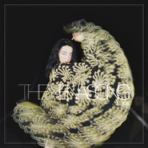

The Nena Song
============================

|  |  |
| :--: | :-- |
| [ The Nena Song](https://emumo.xiami.com/album/2102777324) | **艺人**: [妮那 (Nena)](../index.md) **语种**: 国语 **唱片公司**: 草台回声 **发行时间**: 2017年07月05日 **专辑类别**: EP, 单曲 **专辑风格**: 艺术流行 Art Pop **播放数**: 55179 **收藏数**: 24 **评论数**: 13  |

## 简介

曾经在热带雨林待过一年，当过一年生态系统环境的学生.跟随马悠博士（德国生态环境学家，我的教父，也是第一个真正意义上的灵性导师）感受人与自然和谐相处的方式。用手去感应每一棵大树的磁场.。在林子里冥想，自由地唱诵，学会第一支心咒。  
希望用声音记录一些记忆，与梦中的情景。  
  
第一首单曲：《The Nena Song》  
第一首单曲是Nena王艺洁与英国的朋友Dan Tyler （The Harridans主唱）一起创作的。她很欣赏Dan的品味与艺术气质，“Nena”是王艺洁的名字，关于歌曲名，当时两人都没有什么特别的想法，只是因为Dan给这首音频文件的命名是“nena song”，你们今天就听到了这首《The Nena Song》  
  
王艺洁是一个生活在故事里姑娘，用音乐构筑了有血有肉的世界，就像这首《The Nena Song》讲的是森林里发生的故事：一个岛上的战役，一名军官爱上岛上的女子，后来战争结束，他随大军船舰离开的时候时候承诺回来带她走，可是大军遇海难，军官再也没有回来，但在他走之后女孩发现自己怀了他的孩子。  
  
于是我们听到了：  
  
中午夜的钟声在风中敲响，  
墙上的蜡烛在诉说衷肠，  
是谁的歌声撩动了悲伤，  
年轻的泪滴在心里流淌。  
  
泥土里有他经过的地方，  
林建的木屋有她的勋章，  
窗边的Vanda正在开放，  
猫头鹰站在月亮的肩上。  
  
midnight the lovers, they park on the lawns,                                 
eating their chips and keeping themselves warm,  
meeting for safety but feeling so blue,  
and they did not know exatly what to do,  
father, dear father please settle my scores,  
leaving my dress for the men by their doors,  
you were so stately,  
I felt so right,  
only the boys are drawn towards ｍy light.  
 

## 曲目

## 评论

|  |  |  |  |
| :-- | :-- | :-- | :-- |
|  [虾米用户](https://emumo.xiami.com/u/45298985) Wechat:dqx19... 2017-12-03 15:36 赞(1) 踩(0) | 
+
 |
|  [虾米用户](https://emumo.xiami.com/u/45298985) Wechat:dqx19... 2017-09-27 17:15 赞(1) 踩(0) | 
+
 |
|  [虾米用户](https://emumo.xiami.com/u/313518026)  2017-07-22 07:18 赞(1) 踩(0) | 
有意境，很美，好听，喜欢。
 |
|  [虾米用户](https://emumo.xiami.com/u/312005704)  2017-07-14 00:01 赞(0) 踩(0) | 
The nena song，爱上这个世界的一千种理由。憎恨这个世界的一千个答案&amp;hellip;&amp;hellip;
 |
|  [虾米用户](https://emumo.xiami.com/u/50217886)   2017-07-12 23:06 赞(1) 踩(0) | 
棒，我爱王艺洁，森林的精灵，大地的使者
 |
|  [虾米用户](https://emumo.xiami.com/u/50217886)   2017-07-12 23:06 赞(2) 踩(0) | 
棒，我爱王艺洁，森林的精灵，大地的使者
 |
|  [虾米用户](https://emumo.xiami.com/u/226833808) 梦里见 2017-07-07 08:05 赞(1) 踩(0) | 
❤❤❤
 |
|  [虾米用户](https://emumo.xiami.com/u/7365010) 超然 2017-07-06 23:33 赞(1) 踩(0) | 
这个感觉有点世界音乐的曲风，但又不太像新世纪，算是一次比较大胆的尝试。
 |
|  [虾米用户](https://emumo.xiami.com/u/8244559)  2017-07-06 09:48 赞(1) 踩(0) | 
******
 |
|  [虾米用户](https://emumo.xiami.com/u/62829070) 虾米，后会有期，宇宙尽头... 2017-07-06 01:15 赞(1) 踩(0) | 
有很大进步，反正这个风格我喜欢，但总觉得缺点什么，希望以后可以多自己编曲写词，多融入些自己的想法，大胆尝试新风格，
 |
|  [虾米用户](https://emumo.xiami.com/u/26217347) 我这家伙很懒，个人介绍也... 2017-07-05 19:23 赞(2) 踩(0) | 
打两星的审美死了
 |
|  [虾米用户](https://emumo.xiami.com/u/44881614)  2017-07-05 18:34 赞(1) 踩(0) | 
作为第一条 真是荣幸。
 |
|  [虾米用户](https://emumo.xiami.com/u/44881614)  2017-07-05 18:34 赞(2) 踩(0) | 
很美很美很静谧的感觉。专辑封面很喜欢[带墨镜笑][带墨镜笑]
 |
