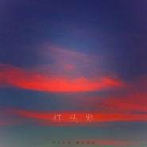

红头发
============================

|  |  |
| :--: | :-- |
| [ 红头发](https://emumo.xiami.com/album/2102950493) | **艺人**: [妮那 (Nena)](../index.md) **语种**: 国语 **唱片公司**: 草台回声 **发行时间**: 2017年11月21日 **专辑类别**: EP, 单曲 **专辑风格**:  **播放数**: 12428 **收藏数**: 17 **评论数**: 6  |

## 简介

“这首歌描绘的是中古世纪欧洲某海峡上一个丘陵上的国度里的一段两小无猜的故事。男孩和女孩都是红色的头发，11岁的女孩生性倔强爱骑马，男孩古灵精怪性格闷沉，比女孩小两岁，他们的住所相对，男孩总在自家的阁楼里窥视女孩在草原上骑她的白色骏马，阳光下 ，她的头发像晚霞一样耀眼，女孩常对男孩说她向往大海之旅，但是父母亲说大海很危险，他们在夕阳下赛马，女孩不慎跌落，昏迷不醒，最后失去生还的几率，男孩子心灵手巧，为她造了一艘小木船 ，送她的灵魂去大海······  
——Nena王艺洁  
  
如有说有一个人能把一切不可能变成可能，我想那个人应该就是Nena王艺洁。那个梦游仙境的爱丽丝曾说她可以在早餐前想出六件不可思议的事情，Nena只能有过之而无不及，在她的音乐里，可以看见一个光怪陆离的世界。她可能是女巫，可能是树精，可能是双腿顺着藤蔓垂下还左右晃动的旁观者，就像《红头发》的故事，或许来自她的一个梦境，或许前生。镜像里的红头发让Nena忍不住跟随，那抹晚霞的颜色像滴在清水里的赤色的墨，舒展开来，不断变化的透明度缠绕成幻境中的故事情节，那似乎是《哈利波特》中邓布利多教授的冥想盆，让Nena沉浸在其中，做透明的角色，但画面始终真实。  
山丘、骏马、玩具侠……  
画架、晚霞、红头发……  
  
画面凌乱又莫名和谐，因为故事里有开始和结局，跌宕起伏后尘埃落定，这样的完整的音乐叙述其实很少见，我们常常聆听碎片式的音乐作品，一个情节很难撑起完整的情绪，听后即可抛，可Nena的音乐不同，她似乎用一首歌的时间讲述了一部电影的原委，起承转合，结构细腻，画面感十足，用听觉调动视觉，不断的敲击着你的想象空间大门，那个红头发的背影，你期待的人，你幻想的情感，似乎都能用一首歌的时间好好的咀嚼消化，结束的钟声响起，平静的空气中是依旧是熟悉的味道。

## 曲目

## 评论

|  |  |  |  |
| :-- | :-- | :-- | :-- |
|  [虾米用户](https://emumo.xiami.com/u/337919448)  2017-12-06 18:01 赞(0) 踩(0) | 
有内涵的歌手，有内涵的歌！赞赞赞！
 |
|  [虾米用户](https://emumo.xiami.com/u/45298985) Wechat:dqx19... 2017-12-03 15:35 赞(1) 踩(0) | 
+
 |
|  [虾米用户](https://emumo.xiami.com/u/26109705) 温柔且酷 2017-11-21 20:01 赞(1) 踩(0) | 
好声音确实 很干净
 |
|  [虾米用户](https://emumo.xiami.com/u/313518026)  2017-11-21 17:43 赞(1) 踩(0) | 
好听，喜欢王艺洁。
 |
|  [虾米用户](https://emumo.xiami.com/u/45298985) Wechat:dqx19... 2017-11-21 17:35 赞(2) 踩(0) | 
+
 |
|  [虾米用户](https://emumo.xiami.com/u/50217886)   2017-11-21 13:37 赞(3) 踩(0) | 
希望有一整张专辑可以听到 这首你唱蓝唱红了 很好 哈哈哈
 |
