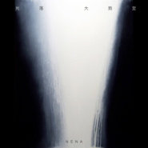

妮那 (Nena)
============================

|  |  |
| :--: | :-- |
| [ 妮那 (Nena)](https://i.xiami.com/wangyijie) | **播放数**: 9561610 **粉丝数**: 1574 **评论数**: 109 **地区**: China 中国大陆 **风格**: 当代唱作人 Contemporary Singer-Songwriter, 华语唱作人 Chinese Singer-Songwriter  |

## 档案

“用音乐唤醒灵性， 
用歌声治愈被遗忘的梦。” 
王艺洁，中国灵性自然第一治愈女声。 
1.【故事：缘起】 
一切由梦开始 · 音乐的梦，自然的梦，灵性的梦 
去川音前，她去了西双版纳做“雨林再造”志愿者。与马悠博士*的相遇，开启了她对生命 
新的感知。她最爱的生活在自然里，与挚友及家人在山上的小院用餐，在夕阳暮色的余晖 
中，伴着吉他，和孩子们、以及所有雨林中的生命灵魂一起翩翩起舞、静静吟唱。 
2.【影像：体悟】 
一切因梦而发 · 抛下冠军头衔*只追逐自己的方向 
参加完超女，她来到北京工作生活，看见来来往往的人，都是一张张麻木的脸，穿梭在水泥 
建筑里。于是，她想把在自然中获得的能量与体悟，通过每一次对音乐的诠释，传递出来。 
她梦想建一个雨林中的MUSIC LIVE HOUSE，为城市里的人歌唱。相信那就如同雨后的 
阳光，让万物获得渴求的滋养。音乐，对于她来说，就是这样作为信仰般的存在。 
3.【声音：挣脱】 
一切为梦而战 · 只因每当拿起话筒，都是一次修行 
她如此执着于对音乐的坚持，甚至打算就此停下奔忙的脚步，只是静静地做自己的音乐。喧 
闹的表演、疯狂的比拼，已离她很遥远。她只想怀着虔诚的心意，来吟唱对自然生命的尊 
重。因为只有尊重自己的内心，才是最好的修行。 
4.【足迹：回归】 
一切为梦出征 · 全新单曲发布，传播自然疗愈的灵音 
王艺洁将发布全新单曲《百字明》及MV，并公布全新跨界合作计划, 包括:艺洁的故事、朋 
友、实验音乐及修行。另外，一轮关于纯粹音乐的Mini Live全国主题巡演——《艺洁& 
her friends》，也正在积极筹备中。 
一个新的王艺洁, 
逆行,不止。 
2014 末

## 专辑

| 名称 | 语种 | 唱片公司 | 发行时间 | 专辑类别 | 专辑风格 |
| :--: | :-- | :-- | :-- | :-- | :-- |
| [ 文殊](./albums/5021427127.md) | 国语 | 独立发行 | 2020年09月09日 | EP, 单曲 | 国语流行 Mandarin Pop |
| [ HOME](./albums/2108148390.md) | 国语 | 独立发行 | 2020年03月12日 | EP, 单曲 | 国语流行 Mandarin Pop |
| [ LOVER](./albums/2105606835.md) | 国语 | 独立发行 | 2019年12月25日 | EP, 单曲 | 国语流行 Mandarin Pop |
| [ 光·落 大势至](./albums/2104195455.md) | 纯音乐 | 草台回声 | 2018年11月12日 | EP, 单曲 | 佛教音乐 Buddhist Music |
| [ White Tara白度母](./albums/2104114179.md) | 国语 | 草台回声 | 2018年10月17日 | EP, 单曲 | 国语流行 Mandarin Pop |
| [ 红头发](./albums/2102950493.md) | 国语 | 草台回声 | 2017年11月21日 | EP, 单曲 |  |
| [ 陈超古装电视剧歌曲集](./albums/2104714306.md) | 国语 | 华宇世博 | 2017年09月14日 | 原声带, 影视音乐 | 电视原声 Television Music |
| [ The Nena Song](./albums/2102777324.md) | 国语 | 草台回声 | 2017年07月05日 | EP, 单曲 | 艺术流行 Art Pop |
| [ Happy Birthday](./albums/2100316942.md) | 国语 | 独立发行 | 2016年04月15日 | EP, 单曲 | 艺术流行 Art Pop |
| [ 此时的月光](./albums/1632084771.md) | 国语 | J3音乐工作室 | 2015年05月20日 | EP, 单曲 | 国语流行 Mandarin Pop |
| [ 逆行](./albums/1817141277.md) | 国语 | J3音乐工作室 | 2014年11月28日 | EP, 单曲 | 艺术流行 Art Pop |

## 评论

|  |  |  |  |
| :-- | :-- | :-- | :-- |
|  [虾米用户](https://emumo.xiami.com/u/277957297) 有你就好…… 2019-11-02 19:48 赞(0) 踩(0) | 
好听喜欢爱了
 |
|  [虾米用户](https://emumo.xiami.com/u/48779939)  2019-08-05 08:04 赞(0) 踩(0) | 
仨名儿？
 |
|  [虾米用户](https://emumo.xiami.com/u/288051377)  2019-03-14 17:01 赞(0) 踩(0) | 
好听，触景生情
 |
|  [虾米用户](https://emumo.xiami.com/u/401880082) 所有活着的生命都会走向死... 2019-03-06 20:08 赞(0) 踩(0) | 
很喜欢你的音乐，加油
 |
|  [虾米用户](https://emumo.xiami.com/u/349317228)  2018-11-14 23:09 赞(0) 踩(0) | 
声音很好听，编曲也很棒！
 |
|  [虾米用户](https://emumo.xiami.com/u/33720873) 他来了。 2018-11-07 22:07 赞(0) 踩(0) | 
神仙唱歌吗？声音可以绕梁
 |
|  [虾米用户](https://emumo.xiami.com/u/228843687) 懒惰统治人间 2018-05-02 21:41 赞(0) 踩(0) | 
淡然
 |
|  [虾米用户](https://emumo.xiami.com/u/570876) 不够写 2018-04-30 15:35 赞(0) 踩(0) | 
加油吧
 |
|  [虾米用户](https://emumo.xiami.com/u/4114067) 你们都跟随我听歌吧 2017-12-21 20:46 赞(0) 踩(0) | 
好听~
 |
|  [虾米用户](https://emumo.xiami.com/u/48642441)  2017-12-11 10:57 赞(1) 踩(0) | 
加油
 |
|  [虾米用户](https://emumo.xiami.com/u/45298985) Wechat:dqx19... 2017-12-03 15:35 赞(1) 踩(0) | 
+
 |
|  [虾米用户](https://emumo.xiami.com/u/14265718) wx:osakarock... 2017-09-27 17:58 赞(2) 踩(0) | 
还是喜欢你
 |
|  [虾米用户](https://emumo.xiami.com/u/45298985) Wechat:dqx19... 2017-09-27 17:14 赞(1) 踩(0) | 
+
 |
|  [虾米用户](https://emumo.xiami.com/u/45298985) Wechat:dqx19... 2017-07-06 08:28 赞(1) 踩(0) | 
+
 |
|  [虾米用户](https://emumo.xiami.com/u/228843687) 懒惰统治人间 2017-06-24 20:46 赞(2) 踩(0) | 

 |
|  [虾米用户](https://emumo.xiami.com/u/12464012) 这个世界太疯狂 2017-06-22 11:33 赞(0) 踩(0) | 
中国灵性自然第一治愈女声？？？
 |
|  [虾米用户](https://emumo.xiami.com/u/13992108) 平静 2017-06-04 03:52 赞(1) 踩(0) | 
默默关注
 |
|  [虾米用户](https://emumo.xiami.com/u/264849860) Lalalila 2017-05-09 16:46 赞(2) 踩(0) | 
声音很有穿透力
 |
|  [虾米用户](https://emumo.xiami.com/u/285199792)   2017-04-07 04:27 赞(1) 踩(0) | 
什么时候再出新歌呢 期待
 |
|  [虾米用户](https://emumo.xiami.com/u/280612655)  2017-03-16 09:47 赞(0) 踩(0) | 
好听，喜欢，加油！做自己！
 |
|  [虾米用户](https://emumo.xiami.com/u/46347355)  2017-02-26 12:33 赞(1) 踩(0) | 
此时的月光，彼时的一惘。莫问的前方，意向的梦乡。
 |
|  [虾米用户](https://emumo.xiami.com/u/257744152)  2017-01-18 09:01 赞(0) 踩(0) | 
我来啦！
 |
|  [虾米用户](https://emumo.xiami.com/u/238498422) 铁甲依然在 2016-11-03 09:14 赞(0) 踩(0) | 
刚听到“此时的月光”，很好的歌，很好听的声音。
 |
|  [虾米用户](https://emumo.xiami.com/u/40033856) 生活被我逼疯了 2016-10-09 18:55 赞(0) 踩(0) | 
一看到超女 直接添加到我不喜欢的艺人列表了
 |
|  [虾米用户](https://emumo.xiami.com/u/158502946)  2016-09-23 14:52 赞(7) 踩(0) | 
主页的相片看不见脸 然后点开放大。。。
 |
|  [虾米用户](https://emumo.xiami.com/u/74755418) I FOUND YOU！... 2016-08-29 13:28 赞(0) 踩(0) | 
姐，你嘴咋嫩么大额！
 |
|  [虾米用户](https://emumo.xiami.com/u/1990321) 愿你心中有爱，心中有善 2016-07-24 23:33 赞(0) 踩(0) | 
平静，轻灵
 |
|  [虾米用户](https://emumo.xiami.com/u/1160262)  2016-06-17 10:46 赞(0) 踩(0) | 
灵性
 |
|  [虾米用户](https://emumo.xiami.com/u/33932132) 易困 2016-06-16 14:37 赞(16) 踩(0) | 
还记得快女比赛时，你唱的那首梦中人。你赤着脚，在舞台上唱着歌，自由自在。
 |
|  [虾米用户](https://emumo.xiami.com/u/10374996) weixin: pola... 2016-06-13 22:51 赞(0) 踩(0) | 
此时的月光 很好听～～远方的人你们现在在干嘛呢？ 看星星看月亮～～一天又一天。。。很无奈 不想继续这样 但是又无可奈何 没有方向
 |
|  [虾米用户](https://emumo.xiami.com/u/45373182) 我还没想好要写什么... 2016-06-09 07:50 赞(0) 踩(0) | 
第一次听见你的歌曲，我爱音乐，难得听见这么干净的声音，加油
 |
|  [虾米用户](https://emumo.xiami.com/u/40257522)   2016-06-07 10:08 赞(0) 踩(0) | 
出血灵魂深度的歌曲，不要走小清新路子，和程璧叉开发展方向
 |
|  [虾米用户](https://emumo.xiami.com/u/40257522)   2016-06-07 10:07 赞(0) 踩(0) | 
我觉得你的歌声很有穿透力！加油！好好唱！
 |
|  [虾米用户](https://emumo.xiami.com/u/4849502) . 2016-05-02 13:08 赞(1) 踩(0) | 
能想用音乐传递能量 真的超厉害！
 |
|  [虾米用户](https://emumo.xiami.com/u/147006194)  2016-04-22 07:30 赞(0) 踩(0) | 
好好听
 |
|  [虾米用户](https://emumo.xiami.com/u/115138424) 娓娓道来 2016-04-20 10:54 赞(0) 踩(0) | 
一抹惊喜
 |
|  [虾米用户](https://emumo.xiami.com/u/37545120)  2016-02-25 21:37 赞(0) 踩(0) | 
喜欢
 |
|  [虾米用户](https://emumo.xiami.com/u/80809240) 我还没想好要写什么... 2016-02-19 23:51 赞(0) 踩(0) | 
希望能听到更多你的歌曲。
 |
|  [虾米用户](https://emumo.xiami.com/u/5975975)   2015-12-14 23:05 赞(0) 踩(0) | 
点进来就记得这张面孔了
 |
|  [虾米用户](https://emumo.xiami.com/u/45194972) 我怀念的是污话不说，我怀... 2015-12-07 16:27 赞(0) 踩(0) | 
感覺我要被吃了⋯⋯各種意義上
 |
|  [虾米用户](https://emumo.xiami.com/u/16762522) 我还没想好要写什么... 2015-11-20 18:57 赞(0) 踩(0) | 

 |
|  [虾米用户](https://emumo.xiami.com/u/8266384) 暂无签名~ 2015-11-13 17:24 赞(34) 踩(0) | 
不要去和别人比赛，你完全没那必要
 |
|  [虾米用户](https://emumo.xiami.com/u/892282)  2015-10-31 22:55 赞(0) 踩(0) | 
唱出了感情
 |
|  [虾米用户](https://emumo.xiami.com/u/50286967) 你是一封信，我是邮差。 2015-10-16 12:38 赞(0) 踩(0) | 
喜欢你的声音 听你的歌让我感觉很平静 可惜只有两首歌
 |
|  [虾米用户](https://emumo.xiami.com/u/23884856) Desperado, y... 2015-09-26 00:21 赞(0) 踩(0) | 
    
 |
|  [虾米用户](https://emumo.xiami.com/u/50842154) VBL..xolp 2015-08-19 18:04 赞(0) 踩(0) | 
高高天上
 |
|  [虾米用户](https://emumo.xiami.com/u/42443724)  2015-08-16 17:08 赞(0) 踩(0) | 
很静
 |
|  [虾米用户](https://emumo.xiami.com/u/50608178)  2015-08-12 17:22 赞(0) 踩(0) | 
看上面的艺人图片挺优雅，一点进去吓尿了。
 |
|  [虾米用户](https://emumo.xiami.com/u/50608178)  2015-08-12 17:22 赞(0) 踩(0) | 
看上面的艺人图片挺优雅，一点进去吓尿了。
 |
|  [虾米用户](https://emumo.xiami.com/u/54277420)  2015-08-02 14:07 赞(1) 踩(0) | 
好聽
 |
|  [虾米用户](https://emumo.xiami.com/u/11381100)  2015-07-20 09:54 赞(0) 踩(0) | 
太棒了
 |
|  [虾米用户](https://emumo.xiami.com/u/1146983)  2015-07-19 21:54 赞(0) 踩(0) | 
好久不来了，都有两首歌了，好听！
 |
|  [虾米用户](https://emumo.xiami.com/u/13528207)  2015-07-13 18:20 赞(0) 踩(0) | 
唱歌很好听
 |
|  [虾米用户](https://emumo.xiami.com/u/1520891) 醒醒睡睡的人啊。 2015-06-26 22:22 赞(0) 踩(0) | 
深渊巨口
 |
|  [虾米用户](https://emumo.xiami.com/u/44188235)  2015-06-23 12:08 赞(0) 踩(0) | 
喜欢你不随大流
 |
|  [虾米用户](https://emumo.xiami.com/u/15275403) you can find... 2015-06-11 13:29 赞(0) 踩(0) | 
谁能想到你是快乐女生
 |
|  [虾米用户](https://emumo.xiami.com/u/48959313) 山静无言水自喻，兰若有室... 2015-06-06 11:42 赞(0) 踩(0) | 
已关注
 |
|  [虾米用户](https://emumo.xiami.com/u/37912757)  2015-05-31 20:47 赞(0) 踩(0) | 
你的歌声怎么可以让人那么心静自然 不安的心瞬间平静
 |
|  [虾米用户](https://emumo.xiami.com/u/32171141) 著名自我剧场表演者 2015-05-31 17:35 赞(0) 踩(0) | 
一直很喜欢 终于出新了
 |
|  [虾米用户](https://emumo.xiami.com/u/49141952) 开心最重要 2015-05-27 00:32 赞(0) 踩(0) | 
：真挚
 |
|  [虾米用户](https://emumo.xiami.com/u/1936926)  2015-05-25 12:00 赞(0) 踩(0) | 
不错呀～～
 |
|  [虾米用户](https://emumo.xiami.com/u/50264733)  2015-05-22 23:35 赞(1) 踩(0) | 
好听的声音
 |
|  [虾米用户](https://emumo.xiami.com/u/43217166)  2015-05-22 17:57 赞(0) 踩(0) | 
最喜欢的 听他们说 怎么不能放在这里！？
 |
|  [虾米用户](https://emumo.xiami.com/u/385382) 爱唱歌的天蝎暖男 2015-05-21 12:49 赞(1) 踩(0) | 
为什么听出许飞的声音
 |
|  [虾米用户](https://emumo.xiami.com/u/25739995) 好听的音乐一起分享 2015-05-21 09:54 赞(0) 踩(0) | 
嗯，有一种声音叫做越听越好听
 |
|  [虾米用户](https://emumo.xiami.com/u/9139321)  2015-05-21 05:10 赞(0) 踩(0) | 
黎明听这歌，突然觉得世界清静了。
 |
|  [虾米用户](https://emumo.xiami.com/u/25872522) 我还没想好要写什么... 2015-05-20 22:25 赞(0) 踩(0) | 
月光好美！好听！加油！
 |
|  [虾米用户](https://emumo.xiami.com/u/50208193)  2015-05-20 18:11 赞(1) 踩(0) | 
越听越好听
 |
|  [虾米用户](https://emumo.xiami.com/u/41336971) 阳光明媚，洗洗衣服，晒晒... 2015-05-20 17:14 赞(0) 踩(0) | 
开口跪，好声音 
 |
|  [虾米用户](https://emumo.xiami.com/u/16373242) 嗜睡症同学 2015-05-20 14:35 赞(0) 踩(0) | 
还挺好听的
 |
|  [虾米用户](https://emumo.xiami.com/u/5020716) 想象另一种可能。 2015-05-20 10:21 赞(0) 踩(0) | 
好安静的逆行，好漂亮的此时月光。加油。
 |
|  [虾米用户](https://emumo.xiami.com/u/15275403) you can find... 2015-04-20 22:26 赞(0) 踩(0) | 
不是改名了吗
 |
|  [虾米用户](https://emumo.xiami.com/u/15275403) you can find... 2015-04-20 22:26 赞(0) 踩(0) | 
不是改名了吗
 |
|  [虾米用户](https://emumo.xiami.com/u/10084248) 岂能尽如人意 但求无愧我... 2014-12-20 16:19 赞(0) 踩(0) | 
快女喜欢郁可唯和王艺洁
 |
|  [虾米用户](https://emumo.xiami.com/u/44174841)  2014-12-03 20:09 赞(0) 踩(0) | 
喜歡一姐
 |
|  [虾米用户](https://emumo.xiami.com/u/4751926)  2014-12-03 13:12 赞(0) 踩(0) | 
终于等到你的新歌了。
 |
|  [虾米用户](https://emumo.xiami.com/u/44176979)  2014-12-02 12:45 赞(0) 踩(0) | 
听好多遍了，越听越好听，赞！
 |
|  [虾米用户](https://emumo.xiami.com/u/44269153)   2014-11-30 22:06 赞(0) 踩(0) | 
走心～喜欢～支持你
 |
|  [虾米用户](https://emumo.xiami.com/u/10191423) 约，叔叔我们约！ 2014-11-30 16:17 赞(0) 踩(0) | 
希望别走徐洋的路子……不然太瘆人。
 |
|  [虾米用户](https://emumo.xiami.com/u/11211107) 晴好 2014-11-30 14:37 赞(0) 踩(0) | 
这首不错，一定程度上比央吉玛，萨顶顶什么的好些，那些纯粹哄小孩儿的。不过听这类曲子还是听samkho namtchylak，感觉上会好很多
 |
|  [虾米用户](https://emumo.xiami.com/u/16209569)  2014-11-29 23:22 赞(0) 踩(0) | 
棒终于
 |
|  [虾米用户](https://emumo.xiami.com/u/44188235)  2014-11-29 21:37 赞(0) 踩(0) | 
加油
 |
|  [虾米用户](https://emumo.xiami.com/u/44201070)  2014-11-29 10:14 赞(1) 踩(0) | 
用心唱歌的人
 |
|  [虾米用户](https://emumo.xiami.com/u/44176979)  2014-11-28 21:19 赞(1) 踩(0) | 
灵魂之音，净化心灵，褪去喧嚣和浮躁
 |
|  [虾米用户](https://emumo.xiami.com/u/44187299)  2014-11-28 20:38 赞(0) 踩(0) | 
很好听，很喜欢，加油，
 |
|  [虾米用户](https://emumo.xiami.com/u/6210475) 天下没有不散的筵席 2014-11-28 20:21 赞(0) 踩(0) | 
牛
 |
|  [虾米用户](https://emumo.xiami.com/u/10657223)  2014-11-28 19:35 赞(0) 踩(0) | 
期待你的专辑  ！！！
 |
|  [虾米用户](https://emumo.xiami.com/u/10657223)  2014-11-28 19:35 赞(0) 踩(0) | 
喜欢你空灵天籁的声音，很有气质，原创很赞，加油  ！！！
 |
|  [虾米用户](https://emumo.xiami.com/u/43802848)  2014-11-28 13:25 赞(0) 踩(0) | 
挺喜欢她空灵的声音，原创不错，在中国梦之声走了也不是不好啊，加油吧
 |
|  [虾米用户](https://emumo.xiami.com/u/44174653)  2014-11-28 13:03 赞(0) 踩(0) | 
好棒
 |
|  [虾米用户](https://emumo.xiami.com/u/24333366)  2014-11-28 12:57 赞(0) 踩(0) | 
喜欢这样的声音，想灵修的不妨来听听
 |
|  [虾米用户](https://emumo.xiami.com/u/1626999)  2014-11-28 09:52 赞(0) 踩(0) | 
艺洁要发歌了么！？
 |
|  [虾米用户](https://emumo.xiami.com/u/43642447)  2014-11-22 16:54 赞(137) 踩(0) | 
我刚入驻了虾米音乐人，欢迎大家来我的个人主页，收听我的最新音乐
 |
| ⇒ |  [虾米用户](https://emumo.xiami.com/u/13854526) 不会写字 怎么签名 2014-11-29 03:08 赞(0) 踩(0) | 
加油吧 北漂
 |
| ⇒ |  [虾米用户](https://emumo.xiami.com/u/1579310)  2015-06-09 20:16 赞(0) 踩(0) | 
《此时的月光》配上你的声线很漂亮。
 |
| ⇒ |  [虾米用户](https://emumo.xiami.com/u/33055417)  2015-07-14 01:12 赞(0) 踩(0) | 
你最让我惊艳的一次是几年前你比赛时唱的滚滚红尘，这么多年了还在我的播放器里。今天听了你的新歌，你又回归到我的耳边了。加油！
 |
| ⇒ |  [虾米用户](https://emumo.xiami.com/u/67967760) 不善言辞 2015-10-02 23:30 赞(0) 踩(0) | 
喜欢
 |
| ⇒ |  [虾米用户](https://emumo.xiami.com/u/95723060)  2015-12-29 23:22 赞(0) 踩(0) | 
爱你！
 |
| ⇒ |  [虾米用户](https://emumo.xiami.com/u/96150748)  2015-12-31 15:39 赞(0) 踩(0) | 
喜欢你的调调
 |
| ⇒ |  [虾米用户](https://emumo.xiami.com/u/102286070)  2016-02-04 11:21 赞(0) 踩(0) | 
支持你，希望你能做更多作品。不管怎样永远是你的粉 
 |
| ⇒ |  [虾米用户](https://emumo.xiami.com/u/1008674) 文化搭台经济唱戏 2017-12-22 23:45 赞(0) 踩(0) | 
音色很干净！加油
 |
| ⇒ |  [虾米用户](https://emumo.xiami.com/u/329599951) 呵呵哈哈哈 2019-04-26 19:32 赞(0) 踩(0) | 
长相让我有点心动诶 
 |
|  [虾米用户](https://emumo.xiami.com/u/2280317) 地中有山，永远 2014-11-03 07:26 赞(1) 踩(0) | 
王艺洁很厉害，好声音！为什么不可以走得更远？加油！力挺！<a href="http://www.letv.com/ptv/vplay/21090912.html#vid=21090973" target="_blank" rel="nofollow noreferrer noopener">http://www.letv.com/ptv/vplay/21090912.html#vid=21090973</a>
 |
|  [虾米用户](https://emumo.xiami.com/u/9301514) 独立唱作人 2014-05-23 21:38 赞(0) 踩(0) | 
重新出发，真是感动...加油！
 |
|  [虾米用户](https://emumo.xiami.com/u/10657223)  2013-02-14 14:22 赞(2) 踩(0) | 
11年的快乐女声让我们认识这位非常有实力的灵魂歌者  这个舞台乃至她的公司实在很不适合她  希望一切会变好的
 |
|  [虾米用户](https://emumo.xiami.com/u/10657223)  2013-02-14 14:21 赞(0) 踩(0) | 
王艺洁 拥有直击心灵的天籁之声  祝福你  你要用你那能感化人们的歌声去感动更多的人们
 |
|  [虾米用户](https://emumo.xiami.com/u/8923107)   2012-06-22 13:59 赞(0) 踩(0) | 
一直都很喜欢她的歌声，深入到骨子里，感动！可惜的是只出了一首单曲。
 |
|  [虾米用户](https://emumo.xiami.com/u/8419976)  2012-03-14 00:12 赞(0) 踩(0) | 
喜歡她的聲音，一個用心唱歌，有夢想有追求的歌手，一個能觸動人心的聲音！
 |
|  [虾米用户](https://emumo.xiami.com/u/7580219)  2012-01-24 21:37 赞(0) 踩(0) | 
希望你能走得更远~~
 |
