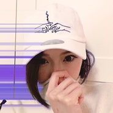
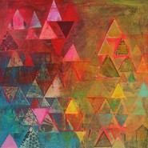
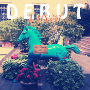

Luvea
============================

|  |  |
| :--: | :-- |
| [ Luvea](https://i.xiami.com/luvea) | **播放数**: 8750090 **粉丝数**: 7801 **评论数**: 740 **地区**: China 中国大陆 **风格**: 独立电子乐 Indietronica  |

## 档案

wb Luvea，网抑云 Luvea115

## 专辑

| 名称 | 语种 | 唱片公司 | 发行时间 | 专辑类别 | 专辑风格 |
| :--: | :-- | :-- | :-- | :-- | :-- |
| [ B.Y.E.（PROD. ZHI16)](./albums/5022448062.md) | 纯音乐 |  | 2015年02月14日 | EP, 单曲 |  |
| [ 生日快乐](./albums/561371.md) | 国语 | 独立发行 | 2012年11月02日 | EP, 单曲 | 国语流行 Mandarin Pop |
| [ Debut](./albums/549762.md) | 英语 | Self-Released | 2012年10月21日 | 录音室专辑 |  |
| [ I Remember](./albums/520395.md) | 国语 | 独立发行 | 2012年06月12日 | EP, 单曲 |  |
| [ F.M.T.T.M.(RE)](./albums/534999.md) | 国语 | 独立发行 | 2012年06月07日 | EP, 单曲 |  |
| [ Luvea露薇雅](./albums/495552.md) | 国语 | Indie | 2012年02月01日 | 录音室专辑 |  |

## 评论

|  |  |  |  |
| :-- | :-- | :-- | :-- |
|  [虾米用户](https://emumo.xiami.com/u/36471488) Masquerade 2021-01-10 16:06 赞(0) 踩(0) | 
网易云继续关注
 |
|  [虾米用户](https://emumo.xiami.com/u/10298602) 朋友们再见了谢谢陪伴了这... 2021-01-07 17:17 赞(1) 踩(0) | 
看到你的群发了。
 |
|  [虾米用户](https://emumo.xiami.com/u/759945) 永存的温暖 2021-01-04 13:05 赞(0) 踩(0) | 
去哪里了
 |
|  [虾米用户](https://emumo.xiami.com/u/57693216) 神仙须是闲人做 2020-12-28 15:57 赞(0) 踩(0) | 
有点东西，发现宝藏了
 |
|  [虾米用户](https://emumo.xiami.com/u/38085831) 只求再一次的相遇  2020-12-21 22:05 赞(0) 踩(0) | 
小姐姐啥时候会更新啊
 |
|  [虾米用户](https://emumo.xiami.com/u/60053528)   2020-12-08 23:56 赞(1) 踩(0) | 
lazy sunshine循环听～真的好得有咁，很赞～
 |
|  [虾米用户](https://emumo.xiami.com/u/60053528)   2020-12-07 01:00 赞(1) 踩(0) | 
关注你好耐好耐，期待你更上一层楼
 |
|  [虾米用户](https://emumo.xiami.com/u/33737266) たけしの死ぬための生き方 2020-10-19 11:03 赞(0) 踩(0) | 
想听你唱白话   
 |
|  [虾米用户](https://emumo.xiami.com/u/48699629)   2020-10-18 14:39 赞(0) 踩(0) | 
为什么有些歌下架了？ 
 |
|  [虾米用户](https://emumo.xiami.com/u/199380324)  2020-09-27 21:06 赞(1) 踩(0) | 
能不能出点新东西听听，草稿也行 
 |
|  [虾米用户](https://emumo.xiami.com/u/121702052) 超脱 2020-09-27 15:03 赞(0) 踩(0) | 
:)
 |
|  [虾米用户](https://emumo.xiami.com/u/3865879) 百科全书 2020-08-20 17:14 赞(1) 踩(0) | 
陪了我好多年了，谢谢你！
 |
|  [虾米用户](https://emumo.xiami.com/u/583107) 音乐 和 码字 需要走心 2020-08-13 15:07 赞(0) 踩(0) | 
是中国大陆的吗？光听声音和音乐以为是国外的，看头像还以为是香港的。
 |
|  [虾米用户](https://emumo.xiami.com/u/269372347)  2020-07-13 11:41 赞(0) 踩(0) | 
你知道吗，我生日那天虾米就是推你的歌给我的，所以我，来了，祝你好运！
 |
|  [虾米用户](https://emumo.xiami.com/u/242840943)  2020-07-10 10:55 赞(0) 踩(0) | 
烂漫！
 |
|  [虾米用户](https://emumo.xiami.com/u/29153296)  2020-07-09 13:15 赞(0) 踩(0) | 
你唱歌很好听
 |
|  [虾米用户](https://emumo.xiami.com/u/49394635) _ 2020-07-05 02:03 赞(0) 踩(0) | 
加油加油
 |
|  [虾米用户](https://emumo.xiami.com/u/9438622) 努力多一点，微笑多一点！ 2020-06-20 23:24 赞(0) 踩(0) | 
这是中国人做的音乐，值得国人骄傲。加油
 |
|  [虾米用户](https://emumo.xiami.com/u/421578063) fox god 2020-06-06 21:08 赞(0) 踩(0) | 
来咯
 |
|  [虾米用户](https://emumo.xiami.com/u/83318232)  2020-05-25 14:40 赞(0) 踩(0) | 
什么时候出CD啊，迫切需要！
 |
|  [虾米用户](https://emumo.xiami.com/u/335763493) 不戴墨镜  2020-05-08 09:34 赞(1) 踩(0) | 
.
 |
|  [虾米用户](https://emumo.xiami.com/u/349620401)  2020-04-28 18:58 赞(0) 踩(0) | 
看看创作人还有其他作品发现还是一位小可爱呢
 |
|  [虾米用户](https://emumo.xiami.com/u/41971929)  2020-04-26 23:40 赞(0) 踩(0) | 
这是 什么
 |
|  [虾米用户](https://emumo.xiami.com/u/8283274)  2020-04-25 00:02 赞(2) 踩(0) | 
而家先知廣州有個錦既音樂人
 |
|  [虾米用户](https://emumo.xiami.com/u/150621852) 这世界真的不算可爱 宝贝 2020-04-21 22:39 赞(0) 踩(0) | 
夸夸
 |
|  [虾米用户](https://emumo.xiami.com/u/150621852) 这世界真的不算可爱 宝贝 2020-04-21 22:39 赞(0) 踩(0) | 
棒棒
 |
|  [虾米用户](https://emumo.xiami.com/u/150621852) 这世界真的不算可爱 宝贝 2020-04-21 22:39 赞(0) 踩(0) | 
踩踩
 |
|  [虾米用户](https://emumo.xiami.com/u/338955454) 不用披秋雨，深情送你 2020-04-08 22:18 赞(0) 踩(0) | 
那天风很大
 |
|  [虾米用户](https://emumo.xiami.com/u/359196359)  2020-04-07 03:53 赞(0) 踩(0) | 
collage of june good music，specially &amp;amp; art
 |
|  [虾米用户](https://emumo.xiami.com/u/251780414) 蓝调,爵士,电子,咽嗓,... 2020-04-05 14:17 赞(0) 踩(0) | 
希望小仙女継续創作上存作品。么么哒！
 |
|  [虾米用户](https://emumo.xiami.com/u/3583995) 一個人的戰爭 2020-04-01 18:32 赞(0) 踩(0) | 
.
 |
|  [虾米用户](https://emumo.xiami.com/u/37434921) 暂无签名~ 2020-03-30 08:39 赞(0) 踩(0) | 
听起来特别的舒服
 |
|  [虾米用户](https://emumo.xiami.com/u/338351030) (-_^) 2020-03-21 00:32 赞(1) 踩(0) | 
你有微博吗
 |
|  [虾米用户](https://emumo.xiami.com/u/327329461)  2020-03-10 17:42 赞(0) 踩(0) | 
哈哈 生日快乐很好听 
 |
|  [虾米用户](https://emumo.xiami.com/u/400715332) 留白 2020-03-06 09:10 赞(2) 踩(0) | 
——
 |
|  [虾米用户](https://emumo.xiami.com/u/54373639) 腦海有風 發膚無損 2020-02-29 13:51 赞(0) 踩(0) | 
啊啊啊 原来是妹子
 |
|  [虾米用户](https://emumo.xiami.com/u/96031026) 我还没想好要写什么... 2020-02-25 13:13 赞(0) 踩(0) | 
今年愿望 被你回复太好听了555
 |
|  [虾米用户](https://emumo.xiami.com/u/440693838)  2020-02-21 00:49 赞(0) 踩(0) | 
要是能看到你去奇袭改多好
 |
|  [虾米用户](https://emumo.xiami.com/u/440693838)  2020-02-21 00:48 赞(0) 踩(0) | 
好希望你能上歌手
 |
|  [虾米用户](https://emumo.xiami.com/u/440693838)  2020-02-21 00:46 赞(0) 踩(0) | 
第一次听你的歌是4年前生日快乐 超喜欢 一直找不到你的信息 今天终于找来了
 |
|  [虾米用户](https://emumo.xiami.com/u/5164082) 我还没想好要写什么... 2020-01-23 03:05 赞(51) 踩(0) | 
好好好，我真的会上新了，请再相信我一次！
 |
| ⇒ |  [虾米用户](https://emumo.xiami.com/u/347410944)  2020-01-23 13:09 赞(0) 踩(0) | 
Believe you
 |
| ⇒ |  [虾米用户](https://emumo.xiami.com/u/7718526) 我还没想好要写什么... 2020-02-04 16:30 赞(0) 踩(0) | 
活捉 
 |
| ⇒ |  [虾米用户](https://emumo.xiami.com/u/3814679) 可以可以 这很十八 2020-02-22 02:42 赞(0) 踩(0) | 
鸽子精的气息
 |
| ⇒ |  [虾米用户](https://emumo.xiami.com/u/32275483) 我还没想好要写什么... 2020-03-26 17:41 赞(0) 踩(0) | 
加油哦～
 |
| ⇒ |  [虾米用户](https://emumo.xiami.com/u/36730433) 不要慵懒 2020-04-04 23:12 赞(0) 踩(0) | 
怎么还不上新
 |
| ⇒ |  [虾米用户](https://emumo.xiami.com/u/8283274)  2020-04-25 00:05 赞(0) 踩(0) | 
上啊
 |
| ⇒ |  [虾米用户](https://emumo.xiami.com/u/327534125) 伱夢中熟睡的時候 有人為... 2020-05-27 09:26 赞(0) 踩(0) | 

 |
| ⇒ |  [虾米用户](https://emumo.xiami.com/u/5577839) ☯☯☯ 2020-08-30 11:22 赞(0) 踩(0) | 
关注了，请继续哦
 |
| ⇒ |  [虾米用户](https://emumo.xiami.com/u/3386178)  2020-09-16 14:02 赞(0) 踩(0) | 
信你个鬼
 |
| ⇒ |  [虾米用户](https://emumo.xiami.com/u/150447656) 崇道 2020-10-26 01:06 赞(0) 踩(0) | 
好喜欢你的音乐风格，可惜你没有太多资料，叫我怎么了解你呢
 |
| ⇒ |  [虾米用户](https://emumo.xiami.com/u/10696597) smile 2020-10-29 19:38 赞(0) 踩(0) | 
这位妹妹，你是在开玩笑吗？你知道你对我多重要吗？
 |
| ⇒ |  [虾米用户](https://emumo.xiami.com/u/205195976) 暂时想不到什么矫情的话。 2020-12-14 01:14 赞(0) 踩(0) | 
不知道虾米还能不能撑到那时候。
 |
|  [虾米用户](https://emumo.xiami.com/u/376799038) 我只想那啥和那啥 2020-01-18 17:00 赞(0) 踩(0) | 
好走心的编曲
 |
|  [虾米用户](https://emumo.xiami.com/u/276944698) 不要自我设限..... 2020-01-04 21:49 赞(1) 踩(0) | 
☘️
 |
|  [虾米用户](https://emumo.xiami.com/u/354181908) kiss 2020-01-02 00:39 赞(0) 踩(0) | 
一直以为是男生啊啊啊啊啊
 |
|  [虾米用户](https://emumo.xiami.com/u/13468740) 暂无签名~ 2020-01-02 00:02 赞(0) 踩(0) | 
为什么虾米不传新歌哦吼吼
 |
|  [虾米用户](https://emumo.xiami.com/u/8697915)  2019-12-18 11:50 赞(0) 踩(0) | 
可爱
 |
|  [虾米用户](https://emumo.xiami.com/u/20483027)  2019-12-04 08:27 赞(0) 踩(0) | 
很有天赋，别浪费了。接着出作品！
 |
|  [虾米用户](https://emumo.xiami.com/u/327534125) 伱夢中熟睡的時候 有人為... 2019-11-17 18:52 赞(0) 踩(0) | 
太棒啦
 |
|  [虾米用户](https://emumo.xiami.com/u/8162031) 我还没想好要写什么... 2019-10-29 22:41 赞(0) 踩(0) | 
啦啦
 |
|  [虾米用户](https://emumo.xiami.com/u/54686131) 要听更多喜欢的歌~~~ 2019-09-22 20:17 赞(0) 踩(0) | 
  ~
 |
|  [虾米用户](https://emumo.xiami.com/u/324879742)   2019-09-02 07:27 赞(0) 踩(0) | 
.
 |
|  [虾米用户](https://emumo.xiami.com/u/1631900) . 2019-08-20 14:45 赞(0) 踩(0) | 
是你吧？
 |
|  [虾米用户](https://emumo.xiami.com/u/11233014) jazz hippop 2019-08-14 12:06 赞(1) 踩(0) | 
为什么你不出歌了
 |
|  [虾米用户](https://emumo.xiami.com/u/41969311) 即使着只是偶然 也一定有... 2019-08-08 08:47 赞(0) 踩(0) | 
不错哟
 |
|  [虾米用户](https://emumo.xiami.com/u/777675) 事物发生研究员 2019-08-04 04:58 赞(0) 踩(0) | 
谢谢
 |
|  [虾米用户](https://emumo.xiami.com/u/1080923) 不吐槽真的会死呢 2019-07-21 22:07 赞(1) 踩(0) | 
好多年了，还是这么好听，每次听到，都想到当年的夏天
 |
|  [虾米用户](https://emumo.xiami.com/u/31709801) 还活着，真的是太好了..... 2019-07-16 07:30 赞(0) 踩(0) | 
虽然很久之前就知道是妹子，没想到是个大美女。
 |
|  [虾米用户](https://emumo.xiami.com/u/12398017)  2019-07-10 17:55 赞(0) 踩(0) | 
听到生日快乐的时候，就应该知道这是个女孩子。 加油!
 |
|  [虾米用户](https://emumo.xiami.com/u/4823146) 我还没想好要写什么... 2019-07-10 17:28 赞(0) 踩(0) | 
时不时看有没有更新
 |
|  [虾米用户](https://emumo.xiami.com/u/36673521) a shi sou r ... 2019-06-28 20:39 赞(0) 踩(0) | 
该上新咯
 |
|  [虾米用户](https://emumo.xiami.com/u/340903899) 我还没想好要写什么... 2019-06-22 17:11 赞(0) 踩(0) | 
，
 |
|  [虾米用户](https://emumo.xiami.com/u/225351) 人，最重要的是‘心’啊！ 2019-06-21 21:37 赞(2) 踩(0) | 
生日快乐的歌可以借我吗?哈哈，明天小伙伴生日，后天还你。谢啦!!
 |
|  [虾米用户](https://emumo.xiami.com/u/295542159) Ciao 2019-06-18 16:28 赞(0) 踩(0) | 
更新️❕原来4⃣️大眼睛美女耶❕
 |
|  [虾米用户](https://emumo.xiami.com/u/3386178)  2019-06-13 18:02 赞(0) 踩(0) | 
w(ﾟДﾟ)w，一更新就是把公告栏给删了┭┮﹏┭┮
 |
| ⇒ |  [虾米用户](https://emumo.xiami.com/u/5164082) 我还没想好要写什么... 2019-06-14 16:47 赞(0) 踩(0) | 
迟点要上新的啦 
 |
|  [虾米用户](https://emumo.xiami.com/u/23622553) 对一切鸡汤免疫 2019-06-09 12:25 赞(2) 踩(0) | 
我总觉得如此甜美melody背后一定是有个悲伤的灵魂 
 |
|  [虾米用户](https://emumo.xiami.com/u/346492287) 虾米不要离开我！ 2019-06-08 19:56 赞(0) 踩(0) | 
女神！
 |
|  [虾米用户](https://emumo.xiami.com/u/355616318) : )大家都好好的 2019-06-08 14:03 赞(0) 踩(0) | 
没有水果糖啦
 |
|  [虾米用户](https://emumo.xiami.com/u/71670866) 如果我听歌可眼红 2019-06-08 11:27 赞(0) 踩(0) | 
嘻嘻  新头像
 |
|  [虾米用户](https://emumo.xiami.com/u/11168706)  2019-06-08 08:24 赞(3) 踩(0) | 
大哥 我来了 还记得我吗 11年大学那会听了你的第一首歌就停不下来 后来12年追到了我的女友 现在就结婚生子囖 哈哈哈
 |
|  [虾米用户](https://emumo.xiami.com/u/355616318) : )大家都好好的 2019-06-08 03:08 赞(0) 踩(0) | 
3610
 |
|  [虾米用户](https://emumo.xiami.com/u/12464012) 这个世界太疯狂 2019-06-02 01:42 赞(0) 踩(0) | 
你好棒
 |
|  [虾米用户](https://emumo.xiami.com/u/75560364) 谦和，自省，成为更好的自... 2019-05-29 06:50 赞(1) 踩(0) | 
真好听，像清晨凉凉的露珠
 |
|  [虾米用户](https://emumo.xiami.com/u/50303469)   2019-05-28 02:55 赞(0) 踩(0) | 
等你作品哦～
 |
|  [虾米用户](https://emumo.xiami.com/u/46378692) If you come.... 2019-05-25 21:25 赞(0) 踩(0) | 
大爱
 |
|  [虾米用户](https://emumo.xiami.com/u/7870630)  2019-05-21 00:08 赞(0) 踩(0) | 
多出作品……
 |
|  [虾米用户](https://emumo.xiami.com/u/385345) 忽然间，忘了如何做自己 2019-05-13 02:26 赞(0) 踩(0) | 
咦，也在伦敦
 |
|  [虾米用户](https://emumo.xiami.com/u/115793504) 一生追逐浪漫和自由 2019-05-06 13:03 赞(0) 踩(0) | 
真不错，群里朋友分享了解到的，喜而不腻，悲而不凄
 |
|  [虾米用户](https://emumo.xiami.com/u/11767299) weirdo 2019-04-27 13:49 赞(0) 踩(0) | 
爱您
 |
|  [虾米用户](https://emumo.xiami.com/u/12683417) 谢谢虾米，再见。 2019-04-23 15:28 赞(0) 踩(0) | 
啥？？？不是女生
 |
|  [虾米用户](https://emumo.xiami.com/u/89772222)   2019-04-18 22:48 赞(0) 踩(0) | 
 
 |
|  [虾米用户](https://emumo.xiami.com/u/45686435) 一壺飛鳧 尋山夢鶴   ... 2019-04-10 15:20 赞(0) 踩(0) | 

 |
|  [虾米用户](https://emumo.xiami.com/u/346492287) 虾米不要离开我！ 2019-04-09 08:28 赞(1) 踩(0) | 
我也一直以为是妹纸 
 |
|  [虾米用户](https://emumo.xiami.com/u/49934446) SINA WEIBO:@... 2019-04-08 16:22 赞(1) 踩(0) | 
女神啊 国内唯一的女神
 |
| ⇒ |  [虾米用户](https://emumo.xiami.com/u/1923255)   云雷， 屯 ，君子以... 2019-05-03 09:11 赞(0) 踩(0) | 
同女神
 |
|  [虾米用户](https://emumo.xiami.com/u/42405531) 再见虾米 2019-04-06 23:47 赞(0) 踩(0) | 
不是妹子是哥子？
 |
|  [虾米用户](https://emumo.xiami.com/u/56814384)  2019-04-06 23:09 赞(0) 踩(0) | 
没想到，今天生日，虾米就送给我这首歌，原来，最了解我的，是网络
 |
|  [虾米用户](https://emumo.xiami.com/u/329955722)  2019-04-04 21:22 赞(0) 踩(0) | 
你的声音超好听哦
 |
|  [虾米用户](https://emumo.xiami.com/u/39396908) 你傻呀。 2019-04-02 22:22 赞(0) 踩(0) | 
谢谢祝我生日快乐
 |
|  [虾米用户](https://emumo.xiami.com/u/6837534) 感性建筑师一枚 2019-03-28 16:41 赞(0) 踩(0) | 
不错哦，希望能多听到国人高水平的佳作！
 |
|  [虾米用户](https://emumo.xiami.com/u/355616318) : )大家都好好的 2019-03-26 16:05 赞(0) 踩(0) | 

 |
|  [虾米用户](https://emumo.xiami.com/u/122692916) 我还没想好要写什么... 2019-03-26 11:42 赞(0) 踩(0) | 
无敌可爱
 |
|  [虾米用户](https://emumo.xiami.com/u/355502166) 我还没想好要写什么... 2019-03-23 13:15 赞(0) 踩(0) | 
  
 |
|  [虾米用户](https://emumo.xiami.com/u/8037668) 爱上小爱克 2019-03-20 19:59 赞(0) 踩(0) | 
原来是广州的汉子啊
 |
|  [虾米用户](https://emumo.xiami.com/u/25210111)  2019-03-20 18:51 赞(0) 踩(0) | 
喜欢你的作品 
 |
|  [虾米用户](https://emumo.xiami.com/u/292979318) 我还没想好要写什么... 2019-03-19 21:12 赞(0) 踩(0) | 
哇好棒加油
 |
|  [虾米用户](https://emumo.xiami.com/u/419392)   2019-03-19 10:19 赞(0) 踩(0) | 
臥槽牛逼！
 |
|  [虾米用户](https://emumo.xiami.com/u/246543420) 穿上风衣我推门出去 2019-03-16 00:02 赞(0) 踩(0) | 
虾小米特地为我点的这首哈哈
 |
|  [虾米用户](https://emumo.xiami.com/u/3043904) 平波一曲，涟漪心中 2019-03-15 08:58 赞(0) 踩(0) | 
谢谢，好甜鸭
 |
|  [虾米用户](https://emumo.xiami.com/u/4486462) 不和听垃圾的人做朋友。 2019-03-15 08:29 赞(0) 踩(0) | 
谢谢你♡
 |
|  [虾米用户](https://emumo.xiami.com/u/2763753) The best is ... 2019-03-08 14:59 赞(0) 踩(0) | 
～
 |
|  [虾米用户](https://emumo.xiami.com/u/9299876) 反正想要的都不会实现！ 2019-03-02 17:02 赞(0) 踩(0) | 
男生咩 
 |
|  [虾米用户](https://emumo.xiami.com/u/230761831) rose,charm&l... 2019-03-02 11:19 赞(0) 踩(0) | 
原来我们中国本土也有那么多优秀的音乐制作人呢，开心呀。
 |
|  [虾米用户](https://emumo.xiami.com/u/245328280) biubiubiu～ 2019-03-02 08:06 赞(1) 踩(0) | 
封面也太甜了吧 对于现在的我 暴击
 |
|  [虾米用户](https://emumo.xiami.com/u/403298379)  2019-03-01 08:21 赞(0) 踩(0) | 
什么时候出新的曲子
 |
|  [虾米用户](https://emumo.xiami.com/u/260890301) on my way to... 2019-02-26 12:59 赞(0) 踩(0) | 
收藏了你的专辑封面。。。像在太阳底下含着不化的糖做白日梦一样
 |
|  [虾米用户](https://emumo.xiami.com/u/337775022)   2019-02-23 20:34 赞(0) 踩(0) | 
生日自动推的，好棒！！希望可以听到更多的你的创作
 |
|  [虾米用户](https://emumo.xiami.com/u/49189821) 只有我 2019-02-22 21:13 赞(0) 踩(0) | 
感谢
 |
|  [虾米用户](https://emumo.xiami.com/u/50761694)  2019-02-20 08:34 赞(0) 踩(0) | 
好暖 么么哒
 |
|  [虾米用户](https://emumo.xiami.com/u/334918082) 我还没想好要写什么... 2019-02-03 12:38 赞(0) 踩(0) | 
3Q
 |
|  [虾米用户](https://emumo.xiami.com/u/403640594)  2019-01-30 22:58 赞(0) 踩(0) | 
谢谢蝦米的陪伴 
 |
|  [虾米用户](https://emumo.xiami.com/u/759945) 永存的温暖 2019-01-29 20:33 赞(0) 踩(0) | 
什么时候更新
 |
|  [虾米用户](https://emumo.xiami.com/u/405388255)  2019-01-25 23:10 赞(0) 踩(0) | 
很甜
 |
|  [虾米用户](https://emumo.xiami.com/u/186262836) I’m a gift b... 2019-01-24 12:48 赞(2) 踩(0) | 
好棒的音乐 很舒服的感觉 像在海边
 |
|  [虾米用户](https://emumo.xiami.com/u/885752) 再见了。 一个墓碑 2018-12-28 23:47 赞(1) 踩(0) | 
谢谢你
 |
|  [虾米用户](https://emumo.xiami.com/u/311120643) 嘘…… 2018-12-16 16:45 赞(2) 踩(0) | 
在一众日本美国波兰的jazz-hiphop音乐人中，有你这么个中国音乐人，多么酷啊，请继续创作~加油( ¯ᒡ̱¯ )و
 |
|  [虾米用户](https://emumo.xiami.com/u/3254621) 我还没想好要写什么... 2018-12-13 03:15 赞(0) 踩(0) | 
默默听你的debut很久了
 |
|  [虾米用户](https://emumo.xiami.com/u/98001274)  2018-12-07 01:36 赞(1) 踩(0) | 
想买整张专辑 支持一下。为什么只能买单曲 一个一个点  老板娘快设置一下 好收钱吧
 |
|  [虾米用户](https://emumo.xiami.com/u/303230492)  2018-12-03 22:00 赞(1) 踩(0) | 
好听，支持，希望创作更多
 |
|  [虾米用户](https://emumo.xiami.com/u/101113390) , 2018-12-03 17:05 赞(0) 踩(0) | 
生日快乐!(^O^)y
 |
|  [虾米用户](https://emumo.xiami.com/u/288760961) 我还没想好要写什么... 2018-12-03 01:24 赞(3) 踩(0) | 
在中国这个环境能用心做音乐的人，堪比稀世珍宝。加油！
 |
|  [虾米用户](https://emumo.xiami.com/u/2985486)  2018-11-30 18:56 赞(0) 踩(0) | 
我生日很快乐
 |
|  [虾米用户](https://emumo.xiami.com/u/256761) 99 problems 2018-11-29 17:56 赞(0) 踩(0) | 
生日的当天听见你的生日快乐是件无比幸福的事！~谢谢
 |
|  [虾米用户](https://emumo.xiami.com/u/134777812) 听…… 2018-11-28 21:09 赞(0) 踩(0) | 
好听 谢谢
 |
|  [虾米用户](https://emumo.xiami.com/u/101334366) 我还没想好要写什么... 2018-11-28 15:51 赞(0) 踩(0) | 
谢谢你的生日快乐，在这繁重的生活中，在这对我特别的一天里，不期而遇的生日快乐，它给了我不一样的轻松和好心情，谢谢 
 |
|  [虾米用户](https://emumo.xiami.com/u/78468) 想好了到不想写 2018-11-26 22:20 赞(0) 踩(0) | 
一直等你出cd
 |
|  [虾米用户](https://emumo.xiami.com/u/12331627) cqdrhd 2018-11-18 23:32 赞(0) 踩(0) | 
omg 感恩的心
 |
|  [虾米用户](https://emumo.xiami.com/u/209931541) 喂， 风来了！！ 2018-11-18 01:15 赞(0) 踩(0) | 
啊啊啊啊啊，好喜欢你的声音、唱歌风格。终于让我找到了你，听醉了
 |
|  [虾米用户](https://emumo.xiami.com/u/50189616) 感谢 虾米 再见... 2018-11-11 23:48 赞(2) 踩(0) | 
真的真的真的很喜欢你的音乐请你永远都别放弃继续写更多你自己风格的歌你身后永远有一群喜欢你的人
 |
|  [虾米用户](https://emumo.xiami.com/u/51693636) 我还没想好要写什么... 2018-11-07 00:39 赞(0) 踩(0) | 
加油菇凉！你很不错！
 |
|  [虾米用户](https://emumo.xiami.com/u/2047945) 后摇,舒服的节奏 2018-10-26 20:16 赞(0) 踩(0) | 
等你啊！！
 |
|  [虾米用户](https://emumo.xiami.com/u/6587863)  2018-10-16 05:27 赞(0) 踩(0) | 
什么时候出新歌啊 翘首以盼
 |
|  [虾米用户](https://emumo.xiami.com/u/256229145) ⚠ 2018-10-14 21:01 赞(0) 踩(0) | 
马赛克如果足够神奇有时候也能令人着迷……
 |
|  [虾米用户](https://emumo.xiami.com/u/103187810) 我还没想好要写什么... 2018-10-12 22:34 赞(1) 踩(0) | 
竟然是国人做的音乐，太棒了～
 |
|  [虾米用户](https://emumo.xiami.com/u/44126265) 透明 2018-09-27 13:28 赞(0) 踩(0) | 
wating
 |
|  [虾米用户](https://emumo.xiami.com/u/125139) 事若求全，何所乐。 2018-09-24 12:36 赞(0) 踩(0) | 
希望能听到更多的作品～
 |
|  [虾米用户](https://emumo.xiami.com/u/315733872) 我还没想好要写什么... 2018-09-15 23:28 赞(0) 踩(0) | 
好好听
 |
|  [虾米用户](https://emumo.xiami.com/u/339191478)   2018-08-25 18:38 赞(0) 踩(0) | 
❤
 |
|  [虾米用户](https://emumo.xiami.com/u/252626203) 本來是個快樂的人 2018-08-11 00:08 赞(0) 踩(0) | 
你的生日快乐真的太太好听了!
 |
|  [虾米用户](https://emumo.xiami.com/u/353141944)  2018-08-02 09:06 赞(1) 踩(0) | 
等着你新的作品 
 |
|  [虾米用户](https://emumo.xiami.com/u/112374358) 所有的相逢一生只有一次。 2018-07-27 20:27 赞(1) 踩(0) | 
遇见你真的是一种奇遇
 |
|  [虾米用户](https://emumo.xiami.com/u/4423375) 这里最安全 2018-07-16 05:15 赞(2) 踩(0) | 
这么久没更新 你过得还好吗 你现在在过着什么样的生活&amp;hellip;
 |
|  [虾米用户](https://emumo.xiami.com/u/120129578) 遠くへ 2018-07-13 03:23 赞(0) 踩(0) | 
我的天啊虾米超神了！ 我明明生日写的我的idol的生日啊，为毛虾米知道今天是我生日，真是惊喜又惊吓
 |
| ⇒ |  [虾米用户](https://emumo.xiami.com/u/252626203) 本來是個快樂的人 2018-08-11 00:09 赞(0) 踩(0) | 
我也是哎，都没写生日，虾米都知道
 |
|  [虾米用户](https://emumo.xiami.com/u/13945602) 美好肉体，穿透迷妄，向现... 2018-07-01 15:32 赞(2) 踩(0) | 
你什么时候回来呢？
 |
|  [虾米用户](https://emumo.xiami.com/u/332795690)  2018-06-21 13:03 赞(0) 踩(0) | 
谢谢
 |
|  [虾米用户](https://emumo.xiami.com/u/325738513)  2018-06-19 16:28 赞(0) 踩(0) | 
自己过生日听着你的生日快乐 太好听
 |
|  [虾米用户](https://emumo.xiami.com/u/9789167)  2018-06-12 23:22 赞(0) 踩(0) | 
耶！Jun！
 |
|  [虾米用户](https://emumo.xiami.com/u/46807254) 我好想好要写什么... 2018-06-10 17:12 赞(0) 踩(0) | 
精神良药先生
 |
|  [虾米用户](https://emumo.xiami.com/u/10870008) 4MYPEOPLE 2018-06-03 03:06 赞(0) 踩(0) | 
很久没听你的歌了，今天偶然从收藏里面随机到了，还是以前用qq音乐的时候听过
 |
|  [虾米用户](https://emumo.xiami.com/u/42190109) 我还没想好要写什么... 2018-06-02 21:59 赞(0) 踩(0) | 
惊呆！！！超棒的！！！
 |
|  [虾米用户](https://emumo.xiami.com/u/121910914) 我想好好睡个觉 2018-05-30 12:54 赞(1) 踩(0) | 
❤️
 |
|  [虾米用户](https://emumo.xiami.com/u/71178106) 塵世や 酒、風呂を抜け ... 2018-05-09 22:39 赞(0) 踩(0) | 
♡
 |
|  [虾米用户](https://emumo.xiami.com/u/37717253)   2018-05-02 22:15 赞(1) 踩(0) | 
说实话，才知道你是中国人
 |
|  [虾米用户](https://emumo.xiami.com/u/4752654) 签名太短输不完我的一首诗 2018-05-01 17:32 赞(0) 踩(0) | 
国内有这么好的电子&amp;hellip;&amp;hellip;
 |
|  [虾米用户](https://emumo.xiami.com/u/79485532) All I need i... 2018-04-22 06:21 赞(1) 踩(0) | 
讲真，没看手机以为是nujabes   
 |
|  [虾米用户](https://emumo.xiami.com/u/4339388) 我还没想好要写什么... 2018-04-09 12:17 赞(0) 踩(0) | 
在央视上听到一个公益广告里的BGM，如果没有记错的话应该就是你做的，可是在这里居然找不到了，是不是少了一张专辑？
 |
|  [虾米用户](https://emumo.xiami.com/u/285433620) 火车也喝醉 2018-04-08 11:21 赞(0) 踩(0) | 
喜欢你的blue eyes 谢谢你啦。
 |
|  [虾米用户](https://emumo.xiami.com/u/305852080)  2018-03-31 18:03 赞(0) 踩(0) | 
音乐质量好像不是很纯，是我耳机问题吗？经常有杂音，网易云的除了整体素质差点也没有杂音啊
 |
| ⇒ |  [虾米用户](https://emumo.xiami.com/u/4423375) 这里最安全 2018-07-16 05:16 赞(0) 踩(0) | 
你为什么会在这里在意这种问题
 |
|  [虾米用户](https://emumo.xiami.com/u/38085831) 只求再一次的相遇  2018-03-29 08:57 赞(0) 踩(0) | 
喜欢 
 |
|  [虾米用户](https://emumo.xiami.com/u/50662742) 我在这里本来是晴朗好天气... 2018-03-21 23:13 赞(0) 踩(0) | 
想花钱购买&amp;hellip;30推，音乐人你去哪里了？
 |
|  [虾米用户](https://emumo.xiami.com/u/213897896)  2018-03-14 01:34 赞(0) 踩(0) | 
听得我想学编曲(虽然我不会)
 |
|  [虾米用户](https://emumo.xiami.com/u/213897896)  2018-03-14 01:33 赞(0) 踩(0) | 
半夜不睡，偶然听到你们的歌。耳目一新，加油。只需要一首歌就足够了。
 |
|  [虾米用户](https://emumo.xiami.com/u/8089618) 我喜欢…不开灯的房间 2018-02-28 05:23 赞(2) 踩(0) | 
你叫我一声 你看我敢答应吗
 |
|  [虾米用户](https://emumo.xiami.com/u/1923255)   云雷， 屯 ，君子以... 2018-02-26 23:41 赞(3) 踩(0) | 
2018了 女神还是没有任何动静 等了六年
 |
|  [虾米用户](https://emumo.xiami.com/u/96031026) 我还没想好要写什么... 2018-02-22 01:28 赞(0) 踩(0) | 
也太棒了吧
 |
| ⇒ |  [虾米用户](https://emumo.xiami.com/u/8089618) 我喜欢…不开灯的房间 2018-02-28 05:22 赞(0) 踩(0) | 
知道我是谁吗
 |
| ⇒ |  [虾米用户](https://emumo.xiami.com/u/96031026) 我还没想好要写什么... 2018-02-28 15:35 赞(0) 踩(0) | 
<q><b>爸爸说：</b></q>
 |
|  [虾米用户](https://emumo.xiami.com/u/327562681) Quid? 2018-02-19 07:56 赞(0) 踩(0) | 
听COJ不知不觉到泪流满面，谢谢
 |
|  [虾米用户](https://emumo.xiami.com/u/329481101) 荣幸温心 月野兔 2018-02-16 13:19 赞(0) 踩(0) | 
谢谢(*&amp;deg;&amp;forall;&amp;deg;)=3
 |
|  [虾米用户](https://emumo.xiami.com/u/1923255)   云雷， 屯 ，君子以... 2018-01-31 17:21 赞(1) 踩(0) | 
你说的近期上线新作品，但是忘了问你是在哪个平台；很期待
 |
| ⇒ |  [虾米用户](https://emumo.xiami.com/u/8089618) 我喜欢…不开灯的房间 2018-02-28 04:53 赞(0) 踩(0) | 
慢慢等吧兄弟 都好几年了
 |
|  [虾米用户](https://emumo.xiami.com/u/4370606) 我爱头发比人多 2018-01-31 00:53 赞(1) 踩(0) | 
好想去找你
 |
|  [虾米用户](https://emumo.xiami.com/u/4370606) 我爱头发比人多 2018-01-31 00:52 赞(0) 踩(0) | 
6年啦，你去哪啦？
 |
|  [虾米用户](https://emumo.xiami.com/u/258336393) 我还没想好要写什么... 2018-01-25 10:29 赞(0) 踩(0) | 
喜欢
 |
|  [虾米用户](https://emumo.xiami.com/u/12050011)  2018-01-24 11:46 赞(0) 踩(0) | 
求问luvea用的是什么话筒录的呀
 |
|  [虾米用户](https://emumo.xiami.com/u/3265273) 选我所爱，爱我所选 2018-01-22 22:21 赞(0) 踩(0) | 
来晚了
 |
|  [虾米用户](https://emumo.xiami.com/u/290480) 我还没想好要写什么... 2018-01-18 16:25 赞(0) 踩(0) | 
你的作品好棒啊
 |
|  [虾米用户](https://emumo.xiami.com/u/28379425) like u  2018-01-12 19:09 赞(1) 踩(0) | 
什么时候再出新歌～超期待
 |
|  [虾米用户](https://emumo.xiami.com/u/2034686)  2018-01-06 21:17 赞(0) 踩(0) | 
听听阿克江，都是先锋
 |
|  [虾米用户](https://emumo.xiami.com/u/47369751) 大米大米！ 2018-01-02 20:00 赞(0) 踩(0) | 
喜欢！
 |
|  [虾米用户](https://emumo.xiami.com/u/172865116)  2018-01-02 12:49 赞(0) 踩(0) | 
喜欢你的音乐，期待新曲。话说最近又开始不停单曲循环你的音乐了。
 |
|  [虾米用户](https://emumo.xiami.com/u/149686778)  2017-12-30 21:16 赞(0) 踩(0) | 
哈哈哈哈，喜欢你！
 |
|  [虾米用户](https://emumo.xiami.com/u/951829) 孤鴻寄語·血色琉璃 2017-12-30 19:47 赞(0) 踩(0) | 
今年的某天，弟弟和表弟是同一天生日，搜了下生日歌，一听就爱上了，这生日歌简直。。。是我听过最好听的生日歌吧哈哈！
 |
|  [虾米用户](https://emumo.xiami.com/u/12221090) 逍遥于天地而心意自得 2017-12-30 16:15 赞(0) 踩(0) | 
赞
 |
|  [虾米用户](https://emumo.xiami.com/u/323271729)  2017-12-17 23:15 赞(0) 踩(0) | 
好喜欢你
 |
|  [虾米用户](https://emumo.xiami.com/u/3878457)   2017-12-08 01:03 赞(0) 踩(0) | 
不管你多久回来一次！我在12年听到你的声音就喜欢上了！夜里和喜欢的人分享喜欢的音乐。。。很开心！谢谢luvea 的声音
 |
|  [虾米用户](https://emumo.xiami.com/u/1923255)   云雷， 屯 ，君子以... 2017-12-06 20:33 赞(1) 踩(0) | 
Luvea女神 你何时归来
 |
|  [虾米用户](https://emumo.xiami.com/u/2066967) 一期一会 2017-12-05 16:52 赞(0) 踩(0) | 
女神，最近还好吗 
 |
|  [虾米用户](https://emumo.xiami.com/u/328531223)  2017-11-27 00:07 赞(0) 踩(0) | 
能不能不逗   你这也叫音乐啊
 |
| ⇒ |  [虾米用户](https://emumo.xiami.com/u/270528643)  2017-12-17 19:57 赞(0) 踩(0) | 
你去死吧
 |
|  [虾米用户](https://emumo.xiami.com/u/17233975) wc： tiamwhoi... 2017-11-16 01:45 赞(0) 踩(0) | 
爱你 谢谢你
 |
|  [虾米用户](https://emumo.xiami.com/u/41323856)   2017-11-12 22:18 赞(1) 踩(0) | 
听了这么久现在才发现，你居然是国内的音乐人，很是惊喜
 |
|  [虾米用户](https://emumo.xiami.com/u/11168706)  2017-11-07 17:30 赞(0) 踩(0) | 
露露还记得我吗？
 |
|  [虾米用户](https://emumo.xiami.com/u/722035) 我还没想好要写什么... 2017-11-01 21:47 赞(0) 踩(0) | 
表白下女神
 |
|  [虾米用户](https://emumo.xiami.com/u/34879828) 虾米再见。 2017-11-01 12:45 赞(0) 踩(0) | 
天，好棒。
 |
|  [虾米用户](https://emumo.xiami.com/u/1619861) 只剩下这个角落了 2017-10-30 10:15 赞(0) 踩(0) | 
小电就是这样吧！加油！喜欢！好吧，没有好友。希望有人进群、、、好吧，群员很少，来打广告。QQ群号167176874《hot乐迷》
 |
|  [虾米用户](https://emumo.xiami.com/u/7980146) 什么都听 2017-10-28 00:33 赞(0) 踩(0) | 
音乐很喜欢，热门评论感觉很手表，相对其他国内Jazz-Hiphop制作人，看到这个，仿佛进入了一些偶像歌手的页面，看到脑残粉，欢迎来喷
 |
|  [虾米用户](https://emumo.xiami.com/u/3825543) 爱意散漫 2017-10-17 22:34 赞(0) 踩(0) | 
该更新了哇
 |
|  [虾米用户](https://emumo.xiami.com/u/36673521) a shi sou r ... 2017-10-16 08:52 赞(2) 踩(0) | 
虾米很强大 看到你还在上面听歌感觉松了一口气
 |
|  [虾米用户](https://emumo.xiami.com/u/967884) 视觉上的听觉容器 2017-10-15 11:13 赞(0) 踩(0) | 
今天生日，点开虾米推荐就是你的生日快乐，可是我明明没有设置个人资料啊，现在大数据已经到了这个程度了么噗。不上来的话可以把微博发上来呀。
 |
|  [虾米用户](https://emumo.xiami.com/u/6665418) 人类最崇高的美德莫过于制... 2017-10-10 12:19 赞(0) 踩(0) | 
只能说相见很晚哦
 |
|  [虾米用户](https://emumo.xiami.com/u/31709801) 还活着，真的是太好了..... 2017-09-23 12:42 赞(0) 踩(0) | 
老哥，支持你，请你吃饭。
 |
|  [虾米用户](https://emumo.xiami.com/u/31709801) 还活着，真的是太好了..... 2017-09-23 12:37 赞(0) 踩(0) | 
加油老哥！
 |
|  [虾米用户](https://emumo.xiami.com/u/39549707) 静悄悄做人 2017-09-21 20:53 赞(0) 踩(0) | 

 |
|  [虾米用户](https://emumo.xiami.com/u/10393019) Y 2017-09-17 23:55 赞(0) 踩(0) | 
嘿嘿嘿
 |
|  [虾米用户](https://emumo.xiami.com/u/320048558)  2017-09-07 18:43 赞(0) 踩(0) | 
微信+18219416761
 |
|  [虾米用户](https://emumo.xiami.com/u/320048558)  2017-09-07 18:20 赞(0) 踩(0) | 
QQ+2188166593
 |
|  [虾米用户](https://emumo.xiami.com/u/305802009) 这么多年一直一个人 2017-08-28 19:43 赞(1) 踩(0) | 
什么时候出新作品啊？等了好久了，你的i remember当作铃声好久了 
 |
|  [虾米用户](https://emumo.xiami.com/u/10129568) Neverland 2017-08-19 01:32 赞(0) 踩(0) | 
喜欢，默默听，好好支持 
 |
|  [虾米用户](https://emumo.xiami.com/u/48961722) 我永遠喜歡五月天和虾米 2017-08-05 10:30 赞(0) 踩(0) | 
521 
 |
|  [虾米用户](https://emumo.xiami.com/u/8070377) 爱雾瑞性维欧腐漏 2017-08-04 01:15 赞(0) 踩(0) | 
??? 
 |
|  [虾米用户](https://emumo.xiami.com/u/25750064) Hi. 2017-07-31 06:34 赞(0) 踩(0) | 
唱得很好啊
 |
|  [虾米用户](https://emumo.xiami.com/u/8243946)   2017-07-30 01:28 赞(0) 踩(0) | 
peace
 |
|  [虾米用户](https://emumo.xiami.com/u/44126265) 透明 2017-07-14 20:05 赞(0) 踩(0) | 
稀释你a
 |
|  [虾米用户](https://emumo.xiami.com/u/49265597) 我还没想好要写什么... 2017-07-08 11:20 赞(0) 踩(0) | 

 |
|  [虾米用户](https://emumo.xiami.com/u/16105107) 粗鄙真切美好风尘仆仆 2017-06-28 00:57 赞(0) 踩(0) | 
1
 |
|  [虾米用户](https://emumo.xiami.com/u/10894563) 我还没想好要写什么... 2017-06-14 22:28 赞(0) 踩(0) | 
为什么不更博？？？ 没有一点消息？？？
 |
|  [虾米用户](https://emumo.xiami.com/u/5193527)  2017-06-14 17:14 赞(1) 踩(0) | 
Collage of June太好听！！！！！
 |
|  [虾米用户](https://emumo.xiami.com/u/15813483)   2017-06-13 00:16 赞(0) 踩(0) | 
啊！好听！
 |
|  [虾米用户](https://emumo.xiami.com/u/43418234) ^_−☆ 2017-06-07 21:58 赞(0) 踩(0) | 

 |
|  [虾米用户](https://emumo.xiami.com/u/34391491) Joseph jacob... 2017-06-03 15:43 赞(0) 踩(0) | 
可以的
 |
|  [虾米用户](https://emumo.xiami.com/u/1115247) @Nebula_7293 2017-05-31 23:55 赞(0) 踩(0) | 

 |
|  [虾米用户](https://emumo.xiami.com/u/2413238) one day 2017-05-31 10:43 赞(49) 踩(0) | 
你知道吗，今天是2017年5月31日，虾米推荐的今日歌单第一首歌就是你的生日快乐，心里莫名的一股暖流！今天四点钟就醒了，以为还是和以前的每一天一样平凡，但是啊，今天有的人还专门为我半夜定闹钟等着晚上跟我说生日快乐，有人到不了买了生日蛋糕的券让我自己去领，有人专门给我画了画寄过来。还有人强行跟我发红包，我说&amp;ldquo;别发红包了吧，你画幅画给我吧？画啥都行&amp;rdquo;。谢谢你，也谢谢这个世界
 |
| ⇒ |  [虾米用户](https://emumo.xiami.com/u/101113390) , 2018-12-03 17:04 赞(0) 踩(0) | 
加一
 |
|  [虾米用户](https://emumo.xiami.com/u/5034994)  2017-05-19 08:48 赞(1) 踩(0) | 
以为是国外的
 |
|  [虾米用户](https://emumo.xiami.com/u/2608518) 忙碌并快乐着。 2017-05-18 20:20 赞(0) 踩(0) | 
八成是在打王者农药休班了，哈哈哈
 |
|  [虾米用户](https://emumo.xiami.com/u/32721307) 开心就好 2017-05-11 14:44 赞(0) 踩(0) | 
Cool
 |
|  [虾米用户](https://emumo.xiami.com/u/21226958) 我爱 2017-05-10 19:05 赞(0) 踩(0) | 
  
 |
|  [虾米用户](https://emumo.xiami.com/u/21226958) 我爱 2017-05-10 19:04 赞(0) 踩(0) | 
nice girl
 |
|  [虾米用户](https://emumo.xiami.com/u/4339388) 我还没想好要写什么... 2017-05-08 17:43 赞(0) 踩(0) | 
那张全是纯音乐的专辑怎么没了？
 |
|  [虾米用户](https://emumo.xiami.com/u/52295365) 放弃了整理歌单 2017-05-06 03:28 赞(0) 踩(0) | 
500
 |
|  [虾米用户](https://emumo.xiami.com/u/49778097) SINA：嗎啡緩釋片 2017-05-02 23:15 赞(0) 踩(0) | 
很棒！
 |
|  [虾米用户](https://emumo.xiami.com/u/121910914) 我想好好睡个觉 2017-04-28 01:16 赞(0) 踩(0) | 
预祝自己生日快乐
 |
|  [虾米用户](https://emumo.xiami.com/u/8136612) 唯爱与音乐不可辜负… 2017-04-21 21:18 赞(1) 踩(0) | 
一入Luvea深似海、一曲一听一下载      
 |
|  [虾米用户](https://emumo.xiami.com/u/286682421) 我还没想好要写什么... 2017-04-19 04:32 赞(0) 踩(0) | 
 呵呵听着音乐吃着零食喝咖啡
 |
|  [虾米用户](https://emumo.xiami.com/u/1231883) 这是遇见你的第十个年头 2017-04-19 00:03 赞(0) 踩(0) | 
～好赞啊 不知道是系统安排的还是正好就 排到了Luvea 的生日快乐   还是电子！ ❤️
 |
|  [虾米用户](https://emumo.xiami.com/u/13526500) Comment ça v... 2017-04-07 09:34 赞(0) 踩(0) | 
好棒
 |
|  [虾米用户](https://emumo.xiami.com/u/176499898) 痛苦万岁 2017-04-01 02:09 赞(0) 踩(0) | 
受宠若惊？
 |
|  [虾米用户](https://emumo.xiami.com/u/50280802) Under the Ho... 2017-03-25 01:35 赞(0) 踩(0) | 
很棒
 |
|  [虾米用户](https://emumo.xiami.com/u/17292891)  2017-03-21 14:35 赞(0) 踩(0) | 
XIE XIE!
 |
|  [虾米用户](https://emumo.xiami.com/u/13408933) 我还没想好要写什么... 2017-03-16 22:01 赞(1) 踩(0) | 
好厉害 喜欢你
 |
|  [虾米用户](https://emumo.xiami.com/u/3931692)  2017-03-16 18:12 赞(0) 踩(0) | 
i remember ；）
 |
|  [虾米用户](https://emumo.xiami.com/u/2066967) 一期一会 2017-03-14 20:06 赞(0) 踩(0) | 
美人你失踪可久了
 |
|  [虾米用户](https://emumo.xiami.com/u/4188489) 静电 2017-03-04 14:21 赞(1) 踩(0) | 
好久没消息了 
 |
|  [虾米用户](https://emumo.xiami.com/u/156056836) 我还没想好要写什么... 2017-03-02 00:49 赞(1) 踩(0) | 
&amp;hearts;️
 |
|  [虾米用户](https://emumo.xiami.com/u/4370606) 我爱头发比人多 2017-02-17 22:00 赞(1) 踩(0) | 
Luvea你去哪里了？
 |
| ⇒ |  [虾米用户](https://emumo.xiami.com/u/40342274)   2017-02-27 20:29 赞(0) 踩(0) | 
是啊，不见了。
 |
|  [虾米用户](https://emumo.xiami.com/u/12559042) 崇尚自由然而只有梦是最自... 2017-02-07 00:47 赞(0) 踩(0) | 
想你，微博也没有更新
 |
|  [虾米用户](https://emumo.xiami.com/u/13919998)   2017-01-31 07:45 赞(0) 踩(0) | 
谢谢你 想你
 |
|  [虾米用户](https://emumo.xiami.com/u/44015836)  2017-01-25 20:59 赞(1) 踩(0) | 
不来了么 
 |
|  [虾米用户](https://emumo.xiami.com/u/15830429) 我还没想好要写什么... 2017-01-24 14:43 赞(1) 踩(0) | 
唱的真好，小清新有有情调
 |
|  [虾米用户](https://emumo.xiami.com/u/59758580) 百年三万六千日，蝴蝶梦中... 2017-01-17 01:53 赞(0) 踩(0) | 
第一个翻我牌的音乐人，在我生日的这一天，good
 |
|  [虾米用户](https://emumo.xiami.com/u/13901949) 我喜欢你时你别装逼。 2017-01-16 09:32 赞(0) 踩(0) | 
过生日今天，然后就推荐了你的生日快乐～
 |
|  [虾米用户](https://emumo.xiami.com/u/7249200) 用音乐点缀生命怒放人生 2017-01-11 22:38 赞(0) 踩(0) | 
有时候我也偷偷来瞧瞧，然后就睡着了
 |
|  [虾米用户](https://emumo.xiami.com/u/6055758) 我还没想好要写什么... 2017-01-10 23:28 赞(0) 踩(0) | 
不更新了吗？挺失落的
 |
|  [虾米用户](https://emumo.xiami.com/u/54413572)   2017-01-10 02:49 赞(0) 踩(0) | 
喜欢你
 |
|  [虾米用户](https://emumo.xiami.com/u/195948862)   2017-01-09 00:36 赞(1) 踩(0) | 
点开虾米，今日推荐第一首，谢谢你的生日快乐，也让我发现了一个这么棒的声音
 |
|  [虾米用户](https://emumo.xiami.com/u/17305789)   2016-12-26 00:32 赞(1) 踩(0) | 
谢谢你的生日快乐 
 |
|  [虾米用户](https://emumo.xiami.com/u/67115444) 如果在你明亮的世界里面我... 2016-12-21 01:53 赞(0) 踩(0) | 
(/ω＼)生日这天虾米推送了生日歌，敲好听
 |
|  [虾米用户](https://emumo.xiami.com/u/27635208) 你听不懂 2016-12-14 01:49 赞(2) 踩(0) | 
谢谢你的生日歌，全世界忘了我的时候，你却出现了。
 |
|  [虾米用户](https://emumo.xiami.com/u/751372)  2016-12-07 13:20 赞(1) 踩(0) | 
是不是每逢有人過生日蝦米就會推送這首歌，總之感覺好極了！ 
 |
|  [虾米用户](https://emumo.xiami.com/u/43443583)  2016-12-02 13:14 赞(0) 踩(0) | 
今天我的生日 谢谢你
 |
|  [虾米用户](https://emumo.xiami.com/u/39523194) 古典 爵士 指弹 摇滚 ... 2016-11-23 16:53 赞(1) 踩(0) | 
谢谢你的生日快乐～我超开心
 |
|  [虾米用户](https://emumo.xiami.com/u/50534269) 土豆本命 番茄炒蛋 青椒... 2016-11-10 14:09 赞(2) 踩(0) | 
“我一直都这样认为 明天才能遇见的东西 今天怎样也不会遇到 所以我等”
 |
|  [虾米用户](https://emumo.xiami.com/u/9552584) 人生太短，也太长。 2016-11-10 11:17 赞(0) 踩(0) | 
不知道为什么，每次天气一转凉，就很想听她的歌。特别特别适合每个冷冷的午后，无论是阴天还是晴天。
 |
|  [虾米用户](https://emumo.xiami.com/u/208264929)  2016-10-26 20:54 赞(0) 踩(0) | 
啊啊啊啊 会说粤语！！赞赞
 |
|  [虾米用户](https://emumo.xiami.com/u/208264929)  2016-10-26 20:53 赞(0) 踩(0) | 
啊啊啊啊
 |
|  [虾米用户](https://emumo.xiami.com/u/11664758)   2016-10-25 15:18 赞(1) 踩(0) | 
羡慕这么特别的女子……肯定能迷倒那个少年
 |
|  [虾米用户](https://emumo.xiami.com/u/14289764) - 2016-10-24 17:40 赞(0) 踩(0) | 
以为是美国英国XX国的电影原声    原来哇啊哦   喜欢
 |
|  [虾米用户](https://emumo.xiami.com/u/11481439) 我很聪明什么都没有留下… 2016-10-17 15:35 赞(0) 踩(0) | 

 |
|  [虾米用户](https://emumo.xiami.com/u/44126265) 透明 2016-10-16 17:44 赞(0) 踩(0) | 
谢谢你
 |
|  [虾米用户](https://emumo.xiami.com/u/6390643) 不在 2016-10-13 17:50 赞(0) 踩(0) | 
比心❤️
 |
|  [虾米用户](https://emumo.xiami.com/u/50586576)   2016-09-13 18:27 赞(0) 踩(0) | 
很喜欢 
 |
|  [虾米用户](https://emumo.xiami.com/u/3815293) baby Jesus s... 2016-09-02 15:46 赞(0) 踩(0) | 
来看看
 |
|  [虾米用户](https://emumo.xiami.com/u/7653956) 听什么就什么✟ 2016-08-25 20:29 赞(0) 踩(0) | 
亲爱的，
 |
|  [虾米用户](https://emumo.xiami.com/u/47067227) 步步为营 2016-07-03 00:05 赞(1) 踩(0) | 
这种风格很不错，十分柔和。加油。
 |
|  [虾米用户](https://emumo.xiami.com/u/5401749)  2016-06-29 00:27 赞(1) 踩(0) | 
Feb1，喜欢喜欢喜欢你！
 |
|  [虾米用户](https://emumo.xiami.com/u/13388975)  2016-06-19 12:56 赞(0) 踩(0) | 
才发现是国人。支持
 |
|  [虾米用户](https://emumo.xiami.com/u/22433347)  2016-06-14 10:56 赞(0) 踩(0) | 
新歌呢新歌呢 
 |
|  [虾米用户](https://emumo.xiami.com/u/49625629)   2016-06-11 15:54 赞(0) 踩(0) | 

 |
|  [虾米用户](https://emumo.xiami.com/u/4042021) 自己的就是最好的 2016-06-06 09:16 赞(0) 踩(0) | 
我一直以为这是日本人创作的
 |
|  [虾米用户](https://emumo.xiami.com/u/45654129) 豁害 2016-06-02 18:34 赞(0) 踩(0) | 
你好妹子， 
 |
|  [虾米用户](https://emumo.xiami.com/u/4131849) 网易云：非人類兔子Agy... 2016-05-22 12:50 赞(0) 踩(0) | 

 |
|  [虾米用户](https://emumo.xiami.com/u/146107990) 我不是没想好写什么是根本... 2016-05-20 21:29 赞(1) 踩(0) | 
好的，喜欢那首lazy sunshine
 |
| ⇒ |  [虾米用户](https://emumo.xiami.com/u/47067227) 步步为营 2016-07-03 00:02 赞(0) 踩(0) | 
喜欢+1
 |
|  [虾米用户](https://emumo.xiami.com/u/5623820) 我还没想好要写什么... 2016-05-16 20:31 赞(0) 踩(0) | 
好高兴遇到你
 |
|  [虾米用户](https://emumo.xiami.com/u/54686131) 要听更多喜欢的歌~~~ 2016-05-14 21:32 赞(0) 踩(0) | 
Feb1     去年的第一首歌，现在怎么听都觉得是最好听的一首。
 |
|  [虾米用户](https://emumo.xiami.com/u/54686131) 要听更多喜欢的歌~~~ 2016-05-14 21:18 赞(0) 踩(0) | 
要不是她，怎么会知道这么好听的爵士嘻哈。
 |
|  [虾米用户](https://emumo.xiami.com/u/46161844) 爱上一匹野马头顶一片草原 2016-05-14 20:05 赞(0) 踩(0) | 
果断路转粉
 |
|  [虾米用户](https://emumo.xiami.com/u/46161844) 爱上一匹野马头顶一片草原 2016-05-14 20:05 赞(0) 踩(0) | 
好听哎
 |
|  [虾米用户](https://emumo.xiami.com/u/35355158) 听闻吾命 2016-05-12 23:07 赞(3) 踩(0) | 
谢谢luvea! 做了这么美的音乐  谢谢~国内音乐人的骄傲
 |
|  [虾米用户](https://emumo.xiami.com/u/6390643) 不在 2016-05-11 12:14 赞(0) 踩(0) | 
❤️
 |
|  [虾米用户](https://emumo.xiami.com/u/44118515) 保持距离 2016-05-09 17:42 赞(0) 踩(0) | 
@Luvea 我鸨鸨
 |
|  [虾米用户](https://emumo.xiami.com/u/4970504)  2016-05-04 16:12 赞(0) 踩(0) | 
很棒！
 |
|  [虾米用户](https://emumo.xiami.com/u/1411262)   2016-05-02 05:17 赞(0) 踩(0) | 
上个月去UAL看了一眼，好帅
 |
|  [虾米用户](https://emumo.xiami.com/u/35915058) - New Page - 2016-04-30 16:26 赞(1) 踩(0) | 
好让我惊喜的大陆音乐人~！
 |
|  [虾米用户](https://emumo.xiami.com/u/35915058) - New Page - 2016-04-30 16:26 赞(0) 踩(0) | 
好让我惊喜的大陆音乐人~！
 |
|  [虾米用户](https://emumo.xiami.com/u/69461468) 萌萌的死忠粉 2016-04-29 04:58 赞(0) 踩(0) | 
好喜欢这一小支曲子啊 最近学的制作 请问哪里可以找到这个钢琴谱子呢
 |
|  [虾米用户](https://emumo.xiami.com/u/1004321) 听喜欢的音乐，爱值得爱的... 2016-04-27 23:57 赞(1) 踩(0) | 
喜欢你的声音，希望你以后能够多出好的作品。
 |
|  [虾米用户](https://emumo.xiami.com/u/49734359) Never Say Go... 2016-04-24 12:40 赞(0) 踩(0) | 
女神～
 |
|  [虾米用户](https://emumo.xiami.com/u/9410565) 喜欢肉肉的 2016-04-20 13:57 赞(0) 踩(0) | 
妈的，我也真喜欢你！
 |
|  [虾米用户](https://emumo.xiami.com/u/327565) 一叶渡海 2016-04-20 08:48 赞(1) 踩(0) | 
卧槽，发现宝贝了
 |
|  [虾米用户](https://emumo.xiami.com/u/26445408) 来者不拒 去者不留 2016-04-14 01:25 赞(1) 踩(0) | 
妈的，我也真喜欢你！
 |
|  [虾米用户](https://emumo.xiami.com/u/12537954)  2016-04-13 15:21 赞(0) 踩(0) | 
很多音乐里面的女声都是姑娘你自己吗
 |
|  [虾米用户](https://emumo.xiami.com/u/109934474)  2016-04-10 20:39 赞(0) 踩(0) | 
哟~
 |
|  [虾米用户](https://emumo.xiami.com/u/54686131) 要听更多喜欢的歌~~~ 2016-04-09 21:26 赞(0) 踩(0) | 
非常非常感谢你哟，     Fbe1是第一首打开独立音乐的窗，发现很多很多自己爱听的音乐是太幸运的事啦。
 |
|  [虾米用户](https://emumo.xiami.com/u/4370606) 我爱头发比人多 2016-04-07 19:21 赞(2) 踩(0) | 
越来越好听，以前只有几首，现在发现好多都很喜欢！感谢你  
 |
|  [虾米用户](https://emumo.xiami.com/u/5168717)  2016-04-07 16:19 赞(3) 踩(0) | 
太棒了，一直听日本人的jazz-hippop，真没发现国人在这上面的水平也已经到了如此程度，喜欢！虾米能把这个推荐出来，好吧我充vip还不行嘛....
 |
|  [虾米用户](https://emumo.xiami.com/u/68577338) 思君如思乡 2016-04-06 00:45 赞(0) 踩(0) | 
[带墨镜笑]
 |
|  [虾米用户](https://emumo.xiami.com/u/30630074)   2016-04-02 07:19 赞(0) 踩(0) | 
我操，我真喜欢你
 |
|  [虾米用户](https://emumo.xiami.com/u/39055240)  2016-03-31 21:54 赞(0) 踩(0) | 

 |
|  [虾米用户](https://emumo.xiami.com/u/1728101) 离线 2016-03-31 16:11 赞(0) 踩(0) | 
喜欢
 |
|  [虾米用户](https://emumo.xiami.com/u/6075839) 不愿意离开音乐 24小时... 2016-03-31 00:56 赞(1) 踩(0) | 
强烈的支持 国内竟然也有这么棒的音乐
 |
|  [虾米用户](https://emumo.xiami.com/u/12050011)  2016-03-29 13:07 赞(1) 踩(0) | 
实力圈粉 出的歌少也没事儿 我们循环听嘛
 |
|  [虾米用户](https://emumo.xiami.com/u/449817)   2016-03-28 16:04 赞(0) 踩(0) | 
我居然看到了腐国的照片
 |
|  [虾米用户](https://emumo.xiami.com/u/6636542) 我还没想好要写什么... 2016-03-28 11:00 赞(0) 踩(0) | 
好厉害 真的很好听
 |
|  [虾米用户](https://emumo.xiami.com/u/8661503) 我还没想好要写什么... 2016-03-28 10:25 赞(0) 踩(0) | 
  好赞！
 |
|  [虾米用户](https://emumo.xiami.com/u/2149573)  2016-03-23 11:56 赞(1) 踩(0) | 
天天听国外的，今天发现大熊猫了。。哈哈
 |
|  [虾米用户](https://emumo.xiami.com/u/10118701)  2016-03-21 15:26 赞(0) 踩(0) | 
么么
 |
|  [虾米用户](https://emumo.xiami.com/u/50576807) 想/爱你，像听歌，反反复... 2016-03-13 11:55 赞(3) 踩(0) | 
大学时在豆瓣音乐听到collage of June觉得好听，循环了无数遍，还看了crash，那会大概是你一个人做音乐的日子，觉得你有才，也很遗憾出的歌太少，哈哈哈，今天虾米一推荐就跑来评论了，希望出更多好音乐
 |
|  [虾米用户](https://emumo.xiami.com/u/73377154) 我还没想好要写什么... 2016-03-10 23:38 赞(0) 踩(0) | 
66666 what a fucking lovely voice!
 |
|  [虾米用户](https://emumo.xiami.com/u/35108687) 珍惜此时 2016-03-09 23:16 赞(0) 踩(0) | 
棒棒哒 
 |
|  [虾米用户](https://emumo.xiami.com/u/52506830) 再见 2016-03-08 14:38 赞(0) 踩(0) | 
:
 |
|  [虾米用户](https://emumo.xiami.com/u/7978688)   2016-03-02 21:57 赞(0) 踩(0) | 
冒泡
 |
|  [虾米用户](https://emumo.xiami.com/u/19864702) 活着就是奇迹。 2016-02-28 19:03 赞(0) 踩(0) | 
棒棒哒~
 |
|  [虾米用户](https://emumo.xiami.com/u/71478) 这里住着未在任何世界露脸... 2016-02-25 03:33 赞(0) 踩(0) | 
同在广州的！求听现场哒~~
 |
|  [虾米用户](https://emumo.xiami.com/u/47736446) 上传了最后一首 2016-02-22 18:53 赞(2) 踩(0) | 
我 爱 你
 |
|  [虾米用户](https://emumo.xiami.com/u/51699003) 也是从上个世纪来的呢！ 2016-02-19 22:58 赞(1) 踩(0) | 
Where r u now,but I need u...Luvea！快回来！
 |
|  [虾米用户](https://emumo.xiami.com/u/3583995) 一個人的戰爭 2016-02-18 22:51 赞(0) 踩(0) | 

 |
|  [虾米用户](https://emumo.xiami.com/u/36673521) a shi sou r ... 2016-02-16 03:11 赞(0) 踩(0) | 
看见公告想问这难道是几年前的公告吗（。
 |
|  [虾米用户](https://emumo.xiami.com/u/78519234) 我还没想好要写什么... 2016-02-13 19:08 赞(0) 踩(0) | 

 |
|  [虾米用户](https://emumo.xiami.com/u/5792065)  2016-02-12 18:33 赞(0) 踩(0) | 
听到粤语就滚进来点赞了
 |
| ⇒ |  [虾米用户](https://emumo.xiami.com/u/251272144) My existence 2017-03-17 06:54 赞(0) 踩(0) | 
粤语是哪首歌呀 
 |
|  [虾米用户](https://emumo.xiami.com/u/33050671) 虾米_最初的喜悦  2016-01-30 02:59 赞(0) 踩(0) | 

 |
|  [虾米用户](https://emumo.xiami.com/u/43697923) 53231323 2016-01-28 22:28 赞(0) 踩(0) | 
我想要钢琴谱
 |
|  [虾米用户](https://emumo.xiami.com/u/47262416)  2016-01-28 22:05 赞(1) 踩(0) | 
每个节奏我都喜欢，加油，真的很想知道你是谁 
 |
|  [虾米用户](https://emumo.xiami.com/u/3493715)  2016-01-27 09:48 赞(0) 踩(0) | 
什么，居然能是独立音乐人
 |
|  [虾米用户](https://emumo.xiami.com/u/87688286) ～ 2016-01-21 11:26 赞(0) 踩(0) | 

 |
|  [虾米用户](https://emumo.xiami.com/u/28381021) 所有人都跟我没关系 2016-01-17 14:48 赞(0) 踩(0) | 
up
 |
|  [虾米用户](https://emumo.xiami.com/u/45681873) (´･_･`) 你瞅啥 2016-01-16 05:06 赞(0) 踩(0) | 
加油
 |
|  [虾米用户](https://emumo.xiami.com/u/28552334) Gibran 2016-01-15 20:41 赞(1) 踩(0) | 
我特别喜欢那个blue eyes，单曲循环了多少啊  
 |
|  [虾米用户](https://emumo.xiami.com/u/6554640) 无人赏，自家拍掌，唱得千... 2016-01-14 15:36 赞(1) 踩(0) | 
好酷
 |
|  [虾米用户](https://emumo.xiami.com/u/43248227)  2016-01-10 01:07 赞(0) 踩(0) | 
好棒
 |
|  [虾米用户](https://emumo.xiami.com/u/5494913) SO DAMN 2016-01-07 14:45 赞(0) 踩(0) | 
那快出几张吧
 |
|  [虾米用户](https://emumo.xiami.com/u/51631795)   2016-01-05 15:53 赞(0) 踩(0) | 
哟，还以为是日本的 
 |
|  [虾米用户](https://emumo.xiami.com/u/32275483) 我还没想好要写什么... 2015-12-31 15:46 赞(0) 踩(0) | 
新年快乐呀,Luvea 
 |
|  [虾米用户](https://emumo.xiami.com/u/17324137) 我还没想好要写什么... 2015-12-25 20:41 赞(2) 踩(0) | 
女神，绝对的。
 |
|  [虾米用户](https://emumo.xiami.com/u/9617076) 我还没想好要写什么... 2015-12-24 23:58 赞(0) 踩(0) | 
终于能听了
 |
|  [虾米用户](https://emumo.xiami.com/u/3803809) 人生得意须尽欢 2015-12-20 00:20 赞(0) 踩(0) | 

 |
|  [虾米用户](https://emumo.xiami.com/u/50057496)   2015-12-19 22:53 赞(0) 踩(0) | 
告别土嗨的时机终于快要到了！
 |
|  [虾米用户](https://emumo.xiami.com/u/36730433) 不要慵懒 2015-12-17 14:49 赞(1) 踩(0) | 
听着你会跟着点点头
 |
|  [虾米用户](https://emumo.xiami.com/u/45436261) 我还没想好要写什么... 2015-12-16 09:52 赞(0) 踩(0) | 

 |
|  [虾米用户](https://emumo.xiami.com/u/13315905) 我还没想好要写什么... 2015-12-16 08:47 赞(1) 踩(0) | 
虾米第一关注的就是你！好美啊！ 
 |
|  [虾米用户](https://emumo.xiami.com/u/39857423)   2015-12-15 12:27 赞(1) 踩(0) | 
女神好美！好厉害！我喜欢你！
 |
|  [虾米用户](https://emumo.xiami.com/u/19338035) 不是个性个性签名 2015-12-11 21:20 赞(1) 踩(0) | 
爱你的歌！中国这种歌太少了，日本这方面还是比较厉害！支持国产！
 |
|  [虾米用户](https://emumo.xiami.com/u/1094811) 感谢陪伴 2015-12-10 22:46 赞(1) 踩(0) | 
只有真正喜欢音乐的人才会作出这种曲，中国还有多少这样的人才没有被发掘呢
 |
|  [虾米用户](https://emumo.xiami.com/u/4718349)  2015-12-10 18:01 赞(1) 踩(0) | 
很庆幸今天点开了今日推荐
 |
|  [虾米用户](https://emumo.xiami.com/u/4370606) 我爱头发比人多 2015-12-08 20:25 赞(1) 踩(0) | 
听了好久你的音乐，才发现忘记点关注！抱歉抱歉，  
 |
|  [虾米用户](https://emumo.xiami.com/u/5842171) 幻想 2015-12-08 15:57 赞(1) 踩(0) | 
从 Royksopp开始，从Nujabes 爱。希望在这个无聊的世界里，Luvea继续 “put times in perspective”
 |
|  [虾米用户](https://emumo.xiami.com/u/4339388) 我还没想好要写什么... 2015-12-04 21:40 赞(1) 踩(0) | 
美得无法令人平静，感谢。
 |
|  [虾米用户](https://emumo.xiami.com/u/25455485)   2015-12-03 14:11 赞(1) 踩(0) | 
女神！！！你是我的女神！！！
 |
|  [虾米用户](https://emumo.xiami.com/u/1355012) 暂无签名~ 2015-11-30 14:47 赞(1) 踩(0) | 
还不更新，打屁屁！
 |
|  [虾米用户](https://emumo.xiami.com/u/1006550) 束缚胜无界 2015-11-30 10:57 赞(1) 踩(0) | 
lu姐么么嗒 我又来看你了
 |
|  [虾米用户](https://emumo.xiami.com/u/32529505) 独自静好 2015-11-28 07:47 赞(1) 踩(0) | 
我每日推荐有你的歌：p
 |
|  [虾米用户](https://emumo.xiami.com/u/49294912) 日子好像又有了奔头 2015-11-27 21:43 赞(1) 踩(0) | 
你的声音很好听
 |
|  [虾米用户](https://emumo.xiami.com/u/10504307) 花痴了这大男孩 2015-11-25 17:51 赞(1) 踩(0) | 
很清新。
 |
|  [虾米用户](https://emumo.xiami.com/u/10504307) 花痴了这大男孩 2015-11-25 17:50 赞(0) 踩(0) | 
今日音乐人推荐看到的，不知怎么点开了。听了《生日快乐》算是电子吧，现在在听其他的。好像还不错
 |
|  [虾米用户](https://emumo.xiami.com/u/282975)  2015-11-24 11:15 赞(1) 踩(0) | 
听着真舒服....Collage of June(Tribe to Jun) 听了之后就停不下来了另外~满地打滚求完整版SUMMER =v=
 |
|  [虾米用户](https://emumo.xiami.com/u/5456536) 迷路是我的习惯 2015-11-16 17:55 赞(0) 踩(0) | 
我要和她约会
 |
|  [虾米用户](https://emumo.xiami.com/u/5782952)   2015-11-15 18:55 赞(0) 踩(0) | 
歌好棒哦~~~从生日快乐链接到这里来的~
 |
|  [虾米用户](https://emumo.xiami.com/u/50560728) 他是个发明家在等待他的梦... 2015-11-14 01:11 赞(0) 踩(0) | 
女神加油！！！
 |
|  [虾米用户](https://emumo.xiami.com/u/8454141) 音乐才是我的女朋友 2015-11-13 15:04 赞(0) 踩(0) | 
我强烈想看Luvea的照片！！
 |
| ⇒ |  [虾米用户](https://emumo.xiami.com/u/11846426) less than no... 2015-11-17 22:40 赞(0) 踩(0) | 
去她weibo好美的！
 |
|  [虾米用户](https://emumo.xiami.com/u/57509078)   2015-11-13 13:01 赞(1) 踩(0) | 
能产生共鸣的音乐就是好音乐！
 |
|  [虾米用户](https://emumo.xiami.com/u/677373)  2015-11-12 20:39 赞(0) 踩(0) | 
独立电子
 |
|  [虾米用户](https://emumo.xiami.com/u/46527068) 喜欢的音乐很多啦 2015-11-12 15:53 赞(0) 踩(0) | 
你好久都没有出新曲儿了
 |
|  [虾米用户](https://emumo.xiami.com/u/2129305)  2015-11-10 09:48 赞(0) 踩(0) | 
向N叔致敬的歌，听得暖暖的
 |
|  [虾米用户](https://emumo.xiami.com/u/14337425) 喵捕小鱼~ 2015-11-08 16:28 赞(3) 踩(0) | 
在国内的话，的确不简单了。。
 |
| ⇒ |  [虾米用户](https://emumo.xiami.com/u/14835159) Jazz Voicing 2015-11-23 19:52 赞(0) 踩(0) | 
台湾味
 |
|  [虾米用户](https://emumo.xiami.com/u/28968127) 天使的孩子 2015-11-07 20:14 赞(1) 踩(0) | 
天冷了，觉得你的歌好温暖。。来一波新歌吧，     
 |
|  [虾米用户](https://emumo.xiami.com/u/48497175)  2015-11-05 10:50 赞(0) 踩(0) | 
喜欢他的简单里的不同。
 |
|  [虾米用户](https://emumo.xiami.com/u/48497175)  2015-11-05 10:50 赞(1) 踩(0) | 
喜欢他的简单里的不同。
 |
|  [虾米用户](https://emumo.xiami.com/u/1317745) limitless 2015-11-03 21:55 赞(0) 踩(0) | 
原来是女孩子！！！！！！&amp;gt;&amp;lt;
 |
|  [虾米用户](https://emumo.xiami.com/u/1317745) limitless 2015-11-03 21:52 赞(1) 踩(0) | 
Collage of June(Tribe to Jun) 偶尔听到的 好棒啊！要关注你了！
 |
|  [虾米用户](https://emumo.xiami.com/u/47414958)  2015-10-31 22:01 赞(1) 踩(0) | 
其它人的歌随着时间的变化渐渐的不在喜欢，你的歌无论何时何地，是何种状态，都非常喜欢。
 |
|  [虾米用户](https://emumo.xiami.com/u/23536235)  2015-10-30 01:19 赞(0) 踩(0) | 
出歌
 |
|  [虾米用户](https://emumo.xiami.com/u/29807259)  2015-10-26 21:10 赞(1) 踩(0) | 
好梦幻的背影，期待新歌！
 |
|  [虾米用户](https://emumo.xiami.com/u/20010220) 热爱音乐，享受生活 2015-10-24 22:26 赞(1) 踩(0) | 
期待新的作品 
 |
|  [虾米用户](https://emumo.xiami.com/u/8264083) 添加签名 2015-10-20 20:01 赞(1) 踩(0) | 
棒哦～
 |
|  [虾米用户](https://emumo.xiami.com/u/7782287) Shine in the... 2015-10-19 14:30 赞(1) 踩(0) | 
可爱～
 |
|  [虾米用户](https://emumo.xiami.com/u/40004503) 这个人竟然还没想好要写什... 2015-10-17 23:39 赞(1) 踩(0) | 
前来串门
 |
|  [虾米用户](https://emumo.xiami.com/u/12215830) 我 2015-10-15 11:46 赞(1) 踩(0) | 
真好听
 |
|  [虾米用户](https://emumo.xiami.com/u/9617076) 我还没想好要写什么... 2015-10-15 11:31 赞(0) 踩(0) | 
棒
 |
|  [虾米用户](https://emumo.xiami.com/u/43492129) Soul. 2015-10-13 06:01 赞(1) 踩(0) | 
真的习惯，希望快点出新专辑！
 |
|  [虾米用户](https://emumo.xiami.com/u/8395195) 何必呢 2015-10-13 00:09 赞(1) 踩(0) | 
好棒的说
 |
|  [虾米用户](https://emumo.xiami.com/u/32734340) 虾米钉子户 2015-10-11 12:35 赞(1) 踩(0) | 
女神啊！！
 |
|  [虾米用户](https://emumo.xiami.com/u/32734340) 虾米钉子户 2015-10-11 12:33 赞(1) 踩(0) | 
真的…！！！太棒了…！！！统统都要下载啊！！你的音乐真的让人很快乐！！！我也要向你加油！！！
 |
|  [虾米用户](https://emumo.xiami.com/u/32734340) 虾米钉子户 2015-10-11 12:23 赞(1) 踩(0) | 
卧槽！太赞了！！
 |
|  [虾米用户](https://emumo.xiami.com/u/8351634)   2015-10-09 13:11 赞(1) 踩(0) | 
回国了吗～
 |
|  [虾米用户](https://emumo.xiami.com/u/1639018) 渡船驶进水中央 2015-10-06 02:02 赞(1) 踩(0) | 
哇～～如沐春风  音乐般若海洋 而你这里定是可心小岛～～加油 加油～  
 |
|  [虾米用户](https://emumo.xiami.com/u/7889988)  2015-10-04 20:00 赞(1) 踩(0) | 
Nujabes
 |
|  [虾米用户](https://emumo.xiami.com/u/31365764) 7就 2015-10-04 14:45 赞(0) 踩(0) | 
流弊！
 |
|  [虾米用户](https://emumo.xiami.com/u/10628644) 我想要的不是被拯救 2015-10-02 13:02 赞(0) 踩(0) | 
是女孩子吗    
 |
|  [虾米用户](https://emumo.xiami.com/u/49343129)  2015-10-02 10:42 赞(0) 踩(0) | 
大神…
 |
|  [虾米用户](https://emumo.xiami.com/u/42801516)  2015-10-01 12:21 赞(1) 踩(0) | 
今天发现的，音色好喜欢，脑补一枚可爱的铝孩纸 
 |
|  [虾米用户](https://emumo.xiami.com/u/43960484) 这家伙非常非常非常非常聪... 2015-09-19 09:07 赞(0) 踩(0) | 
When the time passed,I....
 |
|  [虾米用户](https://emumo.xiami.com/u/34206057) 我还没想好要写什么... 2015-09-18 23:05 赞(0) 踩(0) | 
女神
 |
|  [虾米用户](https://emumo.xiami.com/u/5884102) 反 人类 2015-09-18 11:41 赞(0) 踩(0) | 
女孩子QAQ
 |
|  [虾米用户](https://emumo.xiami.com/u/6277431)   2015-09-09 23:14 赞(0) 踩(0) | 
噜v呀
 |
|  [虾米用户](https://emumo.xiami.com/u/9175996) 春水初生，春林初盛，春风... 2015-09-06 09:27 赞(0) 踩(0) | 
 刚听到你们的歌很棒，过来支持你们的～～
 |
|  [虾米用户](https://emumo.xiami.com/u/42105020) 暂无签名~ 2015-08-28 23:40 赞(0) 踩(0) | 
jazhiphop很暖耳~谢谢你为我们带来这么好听的音乐~
 |
|  [虾米用户](https://emumo.xiami.com/u/42105020) 暂无签名~ 2015-08-28 23:40 赞(0) 踩(0) | 
jazhiphop很暖耳~谢谢你为我们带来这么好听的音乐~
 |
|  [虾米用户](https://emumo.xiami.com/u/40208599) 我很聪明什么也没留下 2015-08-26 11:30 赞(0) 踩(0) | 
|
 |
|  [虾米用户](https://emumo.xiami.com/u/14091078) 我还没想好要写什么... 2015-08-24 20:34 赞(1) 踩(0) | 
”女性所创音乐就是有别于男性“我的第六感所说
 |
|  [虾米用户](https://emumo.xiami.com/u/14091078) 我还没想好要写什么... 2015-08-24 20:24 赞(1) 踩(0) | 
Luvea Luvea Luvea
 |
|  [虾米用户](https://emumo.xiami.com/u/2387509)  2015-08-22 16:01 赞(0) 踩(0) | 
谢谢你的作品十分喜欢
 |
|  [虾米用户](https://emumo.xiami.com/u/12423430) 你说我这种人的终点一定不... 2015-08-19 17:44 赞(0) 踩(0) | 
女神女神。我微博关注你了。 
 |
| ⇒ |  [虾米用户](https://emumo.xiami.com/u/32275483) 我还没想好要写什么... 2015-09-20 14:45 赞(0) 踩(0) | 
求微博名 谢谢～
 |
|  [虾米用户](https://emumo.xiami.com/u/1923255)   云雷， 屯 ，君子以... 2015-08-19 14:24 赞(1) 踩(0) | 
为啥国内的jazzhiphop或者背景音乐制作人都不用纯中文呢 个人觉得那也许才是一种发扬国家文化的一种表现吧
 |
|  [虾米用户](https://emumo.xiami.com/u/44015836)  2015-08-16 10:00 赞(1) 踩(0) | 
赞
 |
|  [虾米用户](https://emumo.xiami.com/u/44015836)  2015-08-16 10:00 赞(0) 踩(0) | 
赞
 |
|  [虾米用户](https://emumo.xiami.com/u/44015836)  2015-08-16 10:00 赞(0) 踩(0) | 
赞
 |
|  [虾米用户](https://emumo.xiami.com/u/9676120)   2015-08-16 00:44 赞(0) 踩(0) | 
Should I listen to her? Is she lonely tonight？
 |
|  [虾米用户](https://emumo.xiami.com/u/45062901) 闲人 2015-08-15 01:42 赞(1) 踩(0) | 
默默关注
 |
|  [虾米用户](https://emumo.xiami.com/u/5032986) Private 2015-08-11 15:51 赞(1) 踩(0) | 
简直不能更爱！
 |
|  [虾米用户](https://emumo.xiami.com/u/14434561)          - 爵... 2015-08-09 19:42 赞(0) 踩(0) | 
什么时候新专辑呀
 |
|  [虾米用户](https://emumo.xiami.com/u/14434561)          - 爵... 2015-08-09 19:42 赞(0) 踩(0) | 
什么时候新专辑呀
 |
|  [虾米用户](https://emumo.xiami.com/u/14434561)          - 爵... 2015-08-09 19:42 赞(0) 踩(0) | 
什么时候新专辑呀
 |
|  [虾米用户](https://emumo.xiami.com/u/4823146) 我还没想好要写什么... 2015-08-06 15:12 赞(0) 踩(0) | 
女神女神 加油加油！！
 |
|  [虾米用户](https://emumo.xiami.com/u/50644735) 向前跑迎着冷眼和嘲笑 2015-08-06 14:30 赞(0) 踩(0) | 
你的名字怎么读啊 
 |
|  [虾米用户](https://emumo.xiami.com/u/50644735) 向前跑迎着冷眼和嘲笑 2015-08-06 14:29 赞(0) 踩(0) | 
你是中国的？在片刻上听了你的歌来的。。 
 |
|  [虾米用户](https://emumo.xiami.com/u/12528973) 条脷冇毛。 2015-07-31 02:08 赞(0) 踩(0) | 
 
 |
|  [虾米用户](https://emumo.xiami.com/u/6988675) 音乐是我的阿司匹林。 2015-07-31 01:28 赞(1) 踩(0) | 
加油！！！谢谢你让我一整天的低迷在此刻烟消云散，仿佛看到从海洋中心盛开出繁花。 
 |
|  [虾米用户](https://emumo.xiami.com/u/23977095) 这个家伙很能吃什么也没留... 2015-07-26 01:18 赞(0) 踩(0) | 
竟然是女孩子？！
 |
|  [虾米用户](https://emumo.xiami.com/u/23977095) 这个家伙很能吃什么也没留... 2015-07-26 01:17 赞(1) 踩(0) | 
么么哒！
 |
|  [虾米用户](https://emumo.xiami.com/u/9921905) 永无止境的五月病。 2015-07-25 19:56 赞(1) 踩(0) | 
加油。
 |
|  [虾米用户](https://emumo.xiami.com/u/12876004) ` 2015-07-18 22:56 赞(0) 踩(0) | 
0.0
 |
|  [虾米用户](https://emumo.xiami.com/u/7415210) 听歌，只听歌不说话。 2015-07-17 22:17 赞(1) 踩(0) | 
声音温柔哦～开车路上放着音乐摇头晃脑～好听～!
 |
|  [虾米用户](https://emumo.xiami.com/u/4756322)   2015-07-16 13:35 赞(1) 踩(0) | 
还是广大。。
 |
|  [虾米用户](https://emumo.xiami.com/u/4756322)   2015-07-16 13:22 赞(0) 踩(0) | 
广州❤️
 |
|  [虾米用户](https://emumo.xiami.com/u/50046431) baby 2015-07-15 13:24 赞(1) 踩(0) | 
虾米推荐得好
 |
|  [虾米用户](https://emumo.xiami.com/u/47942682)  2015-06-27 09:50 赞(2) 踩(0) | 
自从在朋友的一个链接上听到你的歌声就喜欢了，喜欢到现在还是觉得你的歌声很美   
 |
|  [虾米用户](https://emumo.xiami.com/u/225351) 人，最重要的是‘心’啊！ 2015-06-24 22:03 赞(0) 踩(0) | 
=..=
 |
|  [虾米用户](https://emumo.xiami.com/u/13740776)   2015-06-19 22:51 赞(0) 踩(0) | 
惊喜！
 |
|  [虾米用户](https://emumo.xiami.com/u/25562606) 偶尔可恶，永远可爱 2015-06-19 08:46 赞(1) 踩(0) | 
  不要悄悄得看留言啦，，超级喜欢你从大一开始
 |
|  [虾米用户](https://emumo.xiami.com/u/6188935) 惊鸿一现瞥红颜 烙印心间... 2015-06-17 00:54 赞(1) 踩(0) | 
超喜欢
 |
|  [虾米用户](https://emumo.xiami.com/u/1936049) 假装我未曾来过 或 我不... 2015-06-15 16:25 赞(1) 踩(0) | 
喜欢呢。
 |
|  [虾米用户](https://emumo.xiami.com/u/8894810) 唯音乐与爱不可辜负 2015-06-10 20:37 赞(1) 踩(0) | 
collage of june把我带到这里来的
 |
|  [虾米用户](https://emumo.xiami.com/u/45285267) 傻蛋是好好萌聪明蛋是大花... 2015-06-10 16:20 赞(1) 踩(0) | 
我是小可爱 
 |
|  [虾米用户](https://emumo.xiami.com/u/45285267) 傻蛋是好好萌聪明蛋是大花... 2015-06-10 16:20 赞(1) 踩(0) | 
我又来啦么么
 |
|  [虾米用户](https://emumo.xiami.com/u/8337175)  2015-06-09 12:48 赞(1) 踩(0) | 
听你太久了
 |
|  [虾米用户](https://emumo.xiami.com/u/40825805)  2015-06-09 10:45 赞(1) 踩(0) | 
你的歌已经全部下载   
 |
|  [虾米用户](https://emumo.xiami.com/u/43078200) 沉沉入海 2015-06-06 01:25 赞(2) 踩(0) | 
一直特别喜欢《collage of june》，第一次听感觉感觉特别有情调，但是根本没想到会是国内的，加油啊！！
 |
|  [虾米用户](https://emumo.xiami.com/u/1325650)  2015-06-03 21:02 赞(1) 踩(0) | 
赞！
 |
|  [虾米用户](https://emumo.xiami.com/u/36768781) 就是喜欢 2015-06-01 22:49 赞(3) 踩(0) | 
第一次发现国内这样的独立，虽然好像还不太有名，但听到了用心和想象力。喜欢。 独立很自由也很不易，难得有国内的独立在5个小节以内让我有本想听的欲望，加油！ 
 |
|  [虾米用户](https://emumo.xiami.com/u/9676120)   2015-06-01 00:59 赞(0) 踩(0) | 
加油呢
 |
|  [虾米用户](https://emumo.xiami.com/u/42426022) 當一個男人步入中年，他就... 2015-05-29 10:41 赞(0) 踩(0) | 
三
 |
|  [虾米用户](https://emumo.xiami.com/u/42426022) 當一個男人步入中年，他就... 2015-05-29 10:39 赞(0) 踩(0) | 
蓝眼
 |
|  [虾米用户](https://emumo.xiami.com/u/42426022) 當一個男人步入中年，他就... 2015-05-29 10:39 赞(1) 踩(0) | 
Collage of June
 |
|  [虾米用户](https://emumo.xiami.com/u/11583362) GGGGGG 2015-05-25 22:14 赞(0) 踩(0) | 
适合晚上一个人静静的听
 |
|  [虾米用户](https://emumo.xiami.com/u/18829635) 暂无签名~ 2015-05-24 10:57 赞(1) 踩(0) | 
原来是中国的！太棒啦！
 |
|  [虾米用户](https://emumo.xiami.com/u/3118604)  2015-05-23 07:11 赞(0) 踩(0) | 
国内还有这么牛逼的音乐人
 |
|  [虾米用户](https://emumo.xiami.com/u/28552334) Gibran 2015-05-17 13:59 赞(1) 踩(0) | 
很棒！越来越爱了！正在一首一首的听！
 |
|  [虾米用户](https://emumo.xiami.com/u/11399359) 猫 2015-05-13 23:57 赞(1) 踩(0) | 
简直大爱 太有才华了。
 |
|  [虾米用户](https://emumo.xiami.com/u/17205094) 真的很奇怪，没错了 2015-05-13 22:41 赞(0) 踩(0) | 

 |
|  [虾米用户](https://emumo.xiami.com/u/15335937) 哟呼~ 2015-05-09 00:33 赞(0) 踩(0) | 
最爱这种声音
 |
|  [虾米用户](https://emumo.xiami.com/u/40941534)  2015-05-08 18:18 赞(1) 踩(0) | 
我爱你音乐
 |
|  [虾米用户](https://emumo.xiami.com/u/13075016)  ) (  2015-05-07 15:37 赞(0) 踩(0) | 
好棒的lz！加油么么哒！
 |
|  [虾米用户](https://emumo.xiami.com/u/46455995)  2015-05-07 00:50 赞(1) 踩(0) | 
姑娘姑娘，好喜欢你的音乐吖！！！！
 |
|  [虾米用户](https://emumo.xiami.com/u/13945602) 美好肉体，穿透迷妄，向现... 2015-05-06 08:11 赞(0) 踩(0) | 
Nice！
 |
|  [虾米用户](https://emumo.xiami.com/u/14845416) 鹿角轻轻一撇就斷了… 2015-04-22 03:18 赞(0) 踩(0) | 
pocket 那么吊不进前十    都听的什么卵
 |
|  [虾米用户](https://emumo.xiami.com/u/49036433)   2015-04-20 15:55 赞(1) 踩(0) | 
哈哈原来你的歌都收在这了 刚注册虾米才发现 加油加油
 |
|  [虾米用户](https://emumo.xiami.com/u/9327823) 头像是我画的 2015-04-20 12:15 赞(0) 踩(0) | 
你很棒啊！！！
 |
|  [虾米用户](https://emumo.xiami.com/u/3296754)  2015-04-14 14:52 赞(1) 踩(0) | 
这才是音乐~
 |
|  [虾米用户](https://emumo.xiami.com/u/4182003)  2015-04-09 14:32 赞(0) 踩(0) | 
棒棒哒~
 |
|  [虾米用户](https://emumo.xiami.com/u/26445408) 来者不拒 去者不留 2015-04-09 01:26 赞(2) 踩(0) | 
一直脑补luvea就是个跟蹦蹦跳跳调皮可爱的小电子一样的女孩子啊啊啊（萌得我撞墙（什么鬼（。
 |
|  [虾米用户](https://emumo.xiami.com/u/7550491) 蜀黍 2015-04-07 11:21 赞(0) 踩(0) | 
lol；)
 |
|  [虾米用户](https://emumo.xiami.com/u/3834066)   2015-04-04 07:12 赞(0) 踩(0) | 
早
 |
|  [虾米用户](https://emumo.xiami.com/u/6349320) 农夫，山泉，有点田。 2015-04-01 21:07 赞(0) 踩(0) | 
露爷V5！！！
 |
|  [虾米用户](https://emumo.xiami.com/u/1076802) 杂听患者 2015-03-22 08:06 赞(0) 踩(0) | 
赞
 |
|  [虾米用户](https://emumo.xiami.com/u/6956129) 我还没想好要写什么... 2015-03-19 10:50 赞(0) 踩(0) | 
名字怎么念   
 |
| ⇒ |  [虾米用户](https://emumo.xiami.com/u/13016984) Mirror 2015-04-02 13:48 赞(0) 踩(0) | 
应该就是love的发音吧
 |
|  [虾米用户](https://emumo.xiami.com/u/35188755) 断线的风筝 2015-03-18 15:53 赞(0) 踩(0) | 
是个妹子！！？？
 |
|  [虾米用户](https://emumo.xiami.com/u/35188755) 断线的风筝 2015-03-18 15:48 赞(1) 踩(0) | 
国人！！！！！！我天！！！！！！！啊啊啊啊啊
 |
|  [虾米用户](https://emumo.xiami.com/u/46630715) 万古长空，一朝风月。 2015-03-02 17:07 赞(0) 踩(0) | 
敢问芳名啊？采样pt3那首每天循环两个小时以上啊！爱死了！
 |
|  [虾米用户](https://emumo.xiami.com/u/12863944) maybe no 2015-03-01 14:33 赞(1) 踩(0) | 
不敢相信LUEA是国内的音乐人
 |
|  [虾米用户](https://emumo.xiami.com/u/15448741) 轻音乐神马的最爱了～ 2015-02-28 10:47 赞(0) 踩(0) | 
顶！
 |
|  [虾米用户](https://emumo.xiami.com/u/4182003)  2015-02-26 14:43 赞(0) 踩(0) | 
很棒，加油，出专辑一定支持！
 |
|  [虾米用户](https://emumo.xiami.com/u/45285267) 傻蛋是好好萌聪明蛋是大花... 2015-02-13 11:06 赞(1) 踩(0) | 
好喜欢你AA啊啊啊
 |
|  [虾米用户](https://emumo.xiami.com/u/30263391)  2015-02-05 10:08 赞(1) 踩(0) | 
听了这么久歌  不知你长啥样  应该很美啊
 |
|  [虾米用户](https://emumo.xiami.com/u/32129612)   2015-02-02 17:20 赞(0) 踩(0) | 
大爱你的歌曲❤
 |
|  [虾米用户](https://emumo.xiami.com/u/7833816) 我还没想好要写什么... 2015-02-02 12:00 赞(0) 踩(0) | 
等下次变身飞行员再听
 |
|  [虾米用户](https://emumo.xiami.com/u/25479332)   2015-01-30 17:08 赞(1) 踩(0) | 
加油。。。。luvea
 |
|  [虾米用户](https://emumo.xiami.com/u/2823816) 内心干净的神经病 2015-01-30 00:08 赞(1) 踩(0) | 
LU爷，跪求把summer做成完整版呐！
 |
|  [虾米用户](https://emumo.xiami.com/u/6055758) 我还没想好要写什么... 2015-01-29 16:32 赞(0) 踩(0) | 
爱了你那么久，发现你竟然是个妹子。我要跟你生孩子。
 |
|  [虾米用户](https://emumo.xiami.com/u/5876884) 自我填补 吐纳情感 2015-01-28 18:14 赞(0) 踩(0) | 
加油 好听噢 ..
 |
|  [虾米用户](https://emumo.xiami.com/u/46575331)  2015-01-28 13:47 赞(1) 踩(0) | 
好舒服的说
 |
|  [虾米用户](https://emumo.xiami.com/u/46055482) 为什么用曾经亲吻的嘴来吵... 2015-01-25 11:55 赞(0) 踩(0) | 
~
 |
|  [虾米用户](https://emumo.xiami.com/u/211456) 我还没想好要写什么... 2015-01-22 16:18 赞(0) 踩(0) | 
~
 |
|  [虾米用户](https://emumo.xiami.com/u/33032294) - 2015-01-20 13:18 赞(0) 踩(0) | 
不错
 |
|  [虾米用户](https://emumo.xiami.com/u/1006550) 束缚胜无界 2015-01-13 17:47 赞(1) 踩(0) | 
等你新作 加油
 |
|  [虾米用户](https://emumo.xiami.com/u/1266707) \'晚安\'是梦的保护伞 2015-01-12 21:19 赞(1) 踩(0) | 
我大国还有有高手的 哈哈哈
 |
|  [虾米用户](https://emumo.xiami.com/u/12548718) lalala 2015-01-09 01:57 赞(0) 踩(0) | 
厉害
 |
|  [虾米用户](https://emumo.xiami.com/u/14453932) no personali... 2015-01-07 14:49 赞(0) 踩(0) | 
咦 什么时候关注的  真棒
 |
|  [虾米用户](https://emumo.xiami.com/u/8833102) 伟❤️375882267 2014-12-23 02:27 赞(1) 踩(0) | 
这些曲子真的赞    加油支持你
 |
|  [虾米用户](https://emumo.xiami.com/u/18292318) ɧơɬ ɠıཞƖ ᒼᑋᐡ... 2014-12-17 10:25 赞(2) 踩(0) | 
赞赞赞   好感动 ╥﹏╥）
 |
|  [虾米用户](https://emumo.xiami.com/u/2634042)  2014-12-16 22:09 赞(1) 踩(0) | 
非常棒的节奏  好喜欢
 |
|  [虾米用户](https://emumo.xiami.com/u/1076802) 杂听患者 2014-12-14 10:43 赞(0) 踩(0) | 
期待
 |
|  [虾米用户](https://emumo.xiami.com/u/517042) 迷宮livehouse 2014-12-04 15:21 赞(1) 踩(0) | 
非常棒！！！
 |
|  [虾米用户](https://emumo.xiami.com/u/1325650)  2014-12-03 12:21 赞(1) 踩(0) | 
很棒的音乐！
 |
|  [虾米用户](https://emumo.xiami.com/u/565635) 只有音乐最安全 2014-11-28 03:21 赞(1) 踩(0) | 
太好听啦
 |
|  [虾米用户](https://emumo.xiami.com/u/21151779) Nope 2014-11-25 21:18 赞(0) 踩(0) | 
:) b
 |
|  [虾米用户](https://emumo.xiami.com/u/839387)  2014-11-24 10:39 赞(1) 踩(0) | 
中毒啦 ～～～啦啦～
 |
|  [虾米用户](https://emumo.xiami.com/u/658427) 重口味者的清淡修行 2014-11-18 09:55 赞(0) 踩(0) | 
国产优质电子女声，软萌软萌的。
 |
|  [虾米用户](https://emumo.xiami.com/u/33457836)   2014-11-15 11:41 赞(0) 踩(0) | 
-
 |
|  [虾米用户](https://emumo.xiami.com/u/4702040)  2014-11-04 00:06 赞(0) 踩(0) | 
好赞呐 真的好赞！来深圳一定去听她！
 |
|  [虾米用户](https://emumo.xiami.com/u/10741253)   2014-10-31 00:09 赞(0) 踩(0) | 
国产的哦 好喜欢 domo会有完整的吗
 |
|  [虾米用户](https://emumo.xiami.com/u/5164082) 我还没想好要写什么... 2014-10-21 18:09 赞(212) 踩(0) | 
1
 |
| ⇒ |  [虾米用户](https://emumo.xiami.com/u/1583790) Deep Grooves 2014-10-29 06:27 赞(0) 踩(0) | 
！
 |
| ⇒ |  [虾米用户](https://emumo.xiami.com/u/1006550) 束缚胜无界 2014-11-03 01:59 赞(0) 踩(0) | 
:) love you
 |
| ⇒ |  [虾米用户](https://emumo.xiami.com/u/41416443)  2014-11-08 12:08 赞(0) 踩(0) | 
请你继续创作。我已购买，很喜欢
 |
| ⇒ |  [虾米用户](https://emumo.xiami.com/u/658427) 重口味者的清淡修行 2014-11-18 09:57 赞(0) 踩(0) | 
呀！时间距离好近！赞！加油！
 |
| ⇒ |  [虾米用户](https://emumo.xiami.com/u/7327877)  2015-08-10 18:21 赞(0) 踩(0) | 
调皮
 |
| ⇒ |  [虾米用户](https://emumo.xiami.com/u/11846426) less than no... 2015-11-17 22:39 赞(0) 踩(0) | 
好棒！听一遍就喜欢上了
 |
| ⇒ |  [虾米用户](https://emumo.xiami.com/u/31523135)  2016-03-18 09:02 赞(0) 踩(0) | 
我还以为是国外的……超厉害
 |
| ⇒ |  [虾米用户](https://emumo.xiami.com/u/570065) 往事怒风 2017-07-04 18:42 赞(0) 踩(0) | 
好像魔兽里的&amp;ldquo;明白打1！&amp;rdquo;
 |
| ⇒ |  [虾米用户](https://emumo.xiami.com/u/233798864)   2017-07-31 06:57 赞(0) 踩(0) | 
太喜欢了
 |
| ⇒ |  [虾米用户](https://emumo.xiami.com/u/11846426) less than no... 2018-01-17 12:46 赞(0) 踩(0) | 
<q><b>贾小晋说：</b></q>
 |
| ⇒ |  [虾米用户](https://emumo.xiami.com/u/4738909) 我还没想好要写什么... 2019-06-14 12:43 赞(0) 踩(0) | 
你有魔力..资料里多点个人信息和照片？
 |
|  [虾米用户](https://emumo.xiami.com/u/9624303) 音乐是最真的朋友. 2014-10-10 23:13 赞(0) 踩(0) | 
！
 |
|  [虾米用户](https://emumo.xiami.com/u/9222974)   2014-10-06 12:11 赞(0) 踩(0) | 
国产wow
 |
|  [虾米用户](https://emumo.xiami.com/u/33991119)  2014-09-26 00:33 赞(1) 踩(0) | 
听了这么久才知道是国产。。。。
 |
|  [虾米用户](https://emumo.xiami.com/u/179591) 我还没想好要写什么... 2014-09-08 14:32 赞(0) 踩(0) | 
我操！居然是国产的！国产！
 |
|  [虾米用户](https://emumo.xiami.com/u/7637832)  2014-09-04 14:38 赞(1) 踩(0) | 
发现好作品呢，表示到此一游
 |
|  [虾米用户](https://emumo.xiami.com/u/361200)  2014-08-23 13:18 赞(0) 踩(0) | 
Collage of June 大赞！
 |
|  [虾米用户](https://emumo.xiami.com/u/2142546) 我还没想好要写什么... 2014-08-08 11:04 赞(2) 踩(0) | 
难以言说的美妙，初听时在我心中有比拟nujabes的震撼。应该走向世界，别停下，请坚持！！！
 |
| ⇒ |  [虾米用户](https://emumo.xiami.com/u/14453932) no personali... 2015-01-07 14:49 赞(0) 踩(0) | 
nujabe是不是死了
 |
|  [虾米用户](https://emumo.xiami.com/u/9069088)  2014-08-04 13:38 赞(2) 踩(0) | 
！！！！太棒了
 |
|  [虾米用户](https://emumo.xiami.com/u/13333456)    . 2014-07-31 20:46 赞(1) 踩(0) | 
goooood
 |
|  [虾米用户](https://emumo.xiami.com/u/13433126) 。 2014-07-30 11:57 赞(4) 踩(0) | 
发现新大陆！！
 |
|  [虾米用户](https://emumo.xiami.com/u/2941577) Whysoserious 2014-07-28 10:41 赞(3) 踩(0) | 
虾米推荐的歌单里听到的。。不点进来以为是日本的jazzhiphop。。
 |
|  [虾米用户](https://emumo.xiami.com/u/1346863) 感谢虾米，感谢大家！ 2014-07-24 21:19 赞(0) 踩(0) | 
为什么才 发现。。。。
 |
|  [虾米用户](https://emumo.xiami.com/u/1256222) 我还没想好要写什么... 2014-07-14 01:13 赞(0) 踩(0) | 
声音太像Olivia Ong了
 |
|  [虾米用户](https://emumo.xiami.com/u/12347596) Just me... 2014-07-12 23:50 赞(1) 踩(0) | 
amazing
 |
|  [虾米用户](https://emumo.xiami.com/u/16070157)  2014-07-03 17:47 赞(1) 踩(0) | 
要晕倒的··
 |
|  [虾米用户](https://emumo.xiami.com/u/2570040) 私信我可以帮你找吉他谱 2014-06-25 17:25 赞(0) 踩(0) | 
这位艺人怎么没有介绍？独立小清新么？感觉我国有不少的独立音乐也是不错的。
 |
|  [虾米用户](https://emumo.xiami.com/u/907325) 片刻的宁静安详 2014-06-24 21:54 赞(0) 踩(0) | 
哇哦 好棒 喜欢~
 |
|  [虾米用户](https://emumo.xiami.com/u/36220334) 要自由也渴望长久 2014-06-21 23:50 赞(0) 踩(0) | 
不错
 |
|  [虾米用户](https://emumo.xiami.com/u/8949594) .... 2014-06-21 12:17 赞(0) 踩(0) | 
又来看露爷了...
 |
|  [虾米用户](https://emumo.xiami.com/u/8226204) ≡ 2014-06-19 21:01 赞(0) 踩(0) | 
封面不能再爱。
 |
|  [虾米用户](https://emumo.xiami.com/u/31700639)   2014-06-19 14:45 赞(1) 踩(0) | 
很干净的声音，怎么听都舒服！
 |
|  [虾米用户](https://emumo.xiami.com/u/8608220) 暂无签名~ 2014-06-18 12:51 赞(1) 踩(0) | 
nice!
 |
|  [虾米用户](https://emumo.xiami.com/u/9187130)  2014-06-17 10:07 赞(1) 踩(0) | 
jazz-hiphop
 |
|  [虾米用户](https://emumo.xiami.com/u/11459653) 回顧本人任期內的各項措施 2014-06-14 00:50 赞(0) 踩(0) | 
想去现场听你唱
 |
|  [虾米用户](https://emumo.xiami.com/u/2298907) 只有我 没有我们 2014-06-11 16:02 赞(1) 踩(0) | 
牛逼闪闪的哦～～
 |
|  [虾米用户](https://emumo.xiami.com/u/7980146) 什么都听 2014-06-05 09:23 赞(0) 踩(0) | 
爆料一下，是个大美女呢。。。
 |
|  [虾米用户](https://emumo.xiami.com/u/6248831) 눈_눈 2014-06-04 21:02 赞(0) 踩(0) | 
点赞~~~~原来是国产~~~~好棒
 |
|  [虾米用户](https://emumo.xiami.com/u/7145178)  2014-05-15 17:22 赞(1) 踩(0) | 
赞赞赞~你的音乐很合我口味
 |
|  [虾米用户](https://emumo.xiami.com/u/22356197)  2014-05-10 21:50 赞(0) 踩(0) | 
就是喜欢 没理由
 |
|  [虾米用户](https://emumo.xiami.com/u/9470617)  2014-05-05 03:55 赞(1) 踩(0) | 
层次分明，节奏清晰，优雅的小清新
 |
|  [虾米用户](https://emumo.xiami.com/u/413790) 惜知音再难觅 2014-05-03 22:22 赞(0) 踩(0) | 
无意听到的，过来赞个
 |
|  [虾米用户](https://emumo.xiami.com/u/4778716) 电电电电电电电电音控。 2014-04-23 00:50 赞(0) 踩(0) | 
独立电子唱作人.
 |
|  [虾米用户](https://emumo.xiami.com/u/968004) . 2014-04-17 18:26 赞(0) 踩(0) | 
上面的音乐人档案是什么意思？
 |
|  [虾米用户](https://emumo.xiami.com/u/6506483)  2014-04-10 08:58 赞(0) 踩(0) | 
奪莫難得!男盆友喜歡的!電子!認真聽后也很喜歡呢!
 |
|  [虾米用户](https://emumo.xiami.com/u/16071330) bingo! 2014-03-31 16:50 赞(1) 踩(0) | 
喜欢你的音乐,它们很棒的说! 谢了.
 |
|  [虾米用户](https://emumo.xiami.com/u/1355012) 暂无签名~ 2014-03-30 22:11 赞(0) 踩(0) | 
我没收么？
 |
|  [虾米用户](https://emumo.xiami.com/u/16745497) 我还没想好要写什么... 2014-03-26 15:30 赞(0) 踩(0) | 
支持国产~~~~~~  支持支持
 |
|  [虾米用户](https://emumo.xiami.com/u/10320585)   2014-03-20 17:29 赞(0) 踩(0) | 
哇哦~惊喜！
 |
|  [虾米用户](https://emumo.xiami.com/u/4203918)  2014-03-18 22:55 赞(1) 踩(0) | 
喜欢的不得了，支持！！！
 |
|  [虾米用户](https://emumo.xiami.com/u/6555864)  2014-03-09 22:45 赞(0) 踩(0) | 
CD  哪买~ 或者说怎么才能送我一张捏~
 |
|  [虾米用户](https://emumo.xiami.com/u/13783494) Saltimage 2014-03-06 20:28 赞(0) 踩(0) | 
<a href="http://weibo.com/lulujr" target="_blank" rel="nofollow noreferrer noopener">http://weibo.com/lulujr</a>
 |
|  [虾米用户](https://emumo.xiami.com/u/9840090) Thug life. 2014-03-06 10:27 赞(1) 踩(0) | 
录音了怎么给你呢？
 |
|  [虾米用户](https://emumo.xiami.com/u/2745814)   2014-03-04 14:13 赞(0) 踩(0) | 
再喜欢不过
 |
|  [虾米用户](https://emumo.xiami.com/u/2282124) 西风吹雨长路遥，葬花落魄... 2014-03-01 10:30 赞(0) 踩(0) | 
虾米音乐人。。。。。。
 |
|  [虾米用户](https://emumo.xiami.com/u/797608)  2014-02-28 16:18 赞(3) 踩(0) | 
不知道你的样子，当时我已经把你当女神了。
 |
| ⇒ |  [虾米用户](https://emumo.xiami.com/u/6555864)  2014-03-09 22:44 赞(0) 踩(0) | 
微博有样子 貌似~
 |
|  [虾米用户](https://emumo.xiami.com/u/8565219) jazzhiphop 2014-02-26 23:36 赞(2) 踩(0) | 
求出实体CD啊！
 |
|  [虾米用户](https://emumo.xiami.com/u/3834066)   2014-02-26 22:45 赞(1) 踩(0) | 
女神女神！
 |
|  [虾米用户](https://emumo.xiami.com/u/6653559)  2014-02-26 14:20 赞(1) 踩(0) | 
好听好听，咋没的CD卖啊！
 |
|  [虾米用户](https://emumo.xiami.com/u/12548718) lalala 2014-02-25 23:32 赞(0) 踩(0) | 
借鉴的飞起呀~
 |
|  [虾米用户](https://emumo.xiami.com/u/3496847) 夢醒了，所以心碎了。 2014-02-17 23:34 赞(1) 踩(0) | 
超赞！期待新作，各种节奏不能更心水了！！！
 |
|  [虾米用户](https://emumo.xiami.com/u/2195529)  2014-02-17 21:16 赞(0) 踩(0) | 
牛B
 |
|  [虾米用户](https://emumo.xiami.com/u/6900070)   2014-02-04 21:04 赞(1) 踩(0) | 
Amazing!
 |
|  [虾米用户](https://emumo.xiami.com/u/3726934) ✨ 2014-01-26 15:36 赞(0) 踩(0) | 
轻快活泼的电子节奏好棒
 |
|  [虾米用户](https://emumo.xiami.com/u/334057) 你的主题曲是什么 2014-01-20 13:13 赞(0) 踩(0) | 
独立音乐
 |
|  [虾米用户](https://emumo.xiami.com/u/4366473) 我还没想好要写什么... 2014-01-17 02:18 赞(1) 踩(0) | 
这个小丫头太赞了~独立音乐人，曲风电子
 |
|  [虾米用户](https://emumo.xiami.com/u/31434068)  2014-01-16 12:27 赞(0) 踩(0) | 
此曲只應天上有
 |
|  [虾米用户](https://emumo.xiami.com/u/278702) 我爱音乐 2014-01-16 09:35 赞(0) 踩(0) | 
很想听Blossom的完整版
 |
|  [虾米用户](https://emumo.xiami.com/u/13707320)  2014-01-15 16:39 赞(0) 踩(0) | 
好听~
 |
|  [虾米用户](https://emumo.xiami.com/u/9102421) 为后摇而来。 2014-01-13 14:31 赞(0) 踩(0) | 
0.0
 |
|  [虾米用户](https://emumo.xiami.com/u/8272077) 我在梦里行走！双脚也不会... 2014-01-08 14:05 赞(0) 踩(0) | 
00
 |
|  [虾米用户](https://emumo.xiami.com/u/1281057) 请赐予我一颗赤子之心 2014-01-05 22:56 赞(1) 踩(0) | 
。。。超级NICE，，居然是大陆的
 |
| ⇒ |  [虾米用户](https://emumo.xiami.com/u/427121)  2017-10-28 00:21 赞(0) 踩(0) | 
是的，我还有她微信
 |
|  [虾米用户](https://emumo.xiami.com/u/2363595)  2014-01-04 15:05 赞(1) 踩(0) | 
！！！！！！！！！！！！！！
 |
|  [虾米用户](https://emumo.xiami.com/u/11157355) 榕树长青 2013-12-26 01:35 赞(0) 踩(0) | 
不错
 |
|  [虾米用户](https://emumo.xiami.com/u/27751318)  2013-12-14 19:15 赞(0) 踩(0) | 
中国姑娘，独立音乐人，风格独特，这能叫有点迷幻色彩吗？
 |
|  [虾米用户](https://emumo.xiami.com/u/645302) 在彩色密封的半透明盒子里 2013-12-10 12:56 赞(0) 踩(0) | 
简单却容易深陷
 |
|  [虾米用户](https://emumo.xiami.com/u/5710324) mickey 2013-12-07 16:45 赞(0) 踩(0) | 
生日快乐
 |
|  [虾米用户](https://emumo.xiami.com/u/17005650)   2013-12-01 12:20 赞(0) 踩(0) | 
有FEEI
 |
|  [虾米用户](https://emumo.xiami.com/u/18598872) 始终不聪明 2013-11-25 19:37 赞(0) 踩(0) | 
好轻柔，很舒服，治愈系
 |
|  [虾米用户](https://emumo.xiami.com/u/9730064) 纯音党 2013-11-23 23:03 赞(0) 踩(0) | 
国人作品！相当好听！
 |
|  [虾米用户](https://emumo.xiami.com/u/1151472) 边走边听 2013-11-03 11:27 赞(0) 踩(0) | 
不错呀
 |
|  [虾米用户](https://emumo.xiami.com/u/8608040) 在荒原里永远解不开的心结 2013-11-02 22:53 赞(2) 踩(0) | 
= =。我愿意花钱下载她的音乐
 |
|  [虾米用户](https://emumo.xiami.com/u/11846479) ai 2013-10-29 15:30 赞(0) 踩(0) | 
Collage of June(Tribe to Jun)我感觉到这首就是成熟的风格了 好听
 |
|  [虾米用户](https://emumo.xiami.com/u/25552484) .... 2013-10-28 12:17 赞(0) 踩(0) | 
。。
 |
|  [虾米用户](https://emumo.xiami.com/u/25510989) 爱像龙卷风，说来就来说走... 2013-10-27 19:46 赞(0) 踩(0) | 
很舒服的歌
 |
|  [虾米用户](https://emumo.xiami.com/u/3628951) 我这盒蜘蛛王可不是闹着玩 2013-10-19 10:05 赞(0) 踩(0) | 
封面说明一切
 |
|  [虾米用户](https://emumo.xiami.com/u/1446728) BE FREE 2013-09-26 19:06 赞(0) 踩(0) | 
挺清新的音乐，如果旋律再加强一点就更好了。
 |
|  [虾米用户](https://emumo.xiami.com/u/1185236) 按快门为生的宅男 2013-09-20 03:32 赞(0) 踩(0) | 
有点意思的女生
 |
|  [虾米用户](https://emumo.xiami.com/u/11157355) 榕树长青 2013-09-12 17:01 赞(0) 踩(0) | 
不错啊
 |
|  [虾米用户](https://emumo.xiami.com/u/2215499) 拒绝民谣 2013-08-29 21:23 赞(0) 踩(0) | 
模仿的痕迹太重啦
 |
|  [虾米用户](https://emumo.xiami.com/u/6362689)  2013-07-22 19:15 赞(0) 踩(0) | 
O(∩_∩)O~
 |
|  [虾米用户](https://emumo.xiami.com/u/7322777) ∮ 2013-07-14 00:03 赞(0) 踩(0) | 
11
 |
|  [虾米用户](https://emumo.xiami.com/u/4350559) 我还没想好要写什么... 2013-07-13 21:22 赞(118) 踩(0) | 
小伙伴能别点我赞好吗
 |
| ⇒ |  [虾米用户](https://emumo.xiami.com/u/34803) summer gypsy 2013-07-13 21:51 赞(0) 踩(0) | 
确实是这样，以后Lu爷发布直接到soundcloud和bandcamp！
 |
| ⇒ |  [虾米用户](https://emumo.xiami.com/u/2042013)  2013-07-13 22:18 赞(0) 踩(0) | 
嗳哟  老弹~
 |
| ⇒ |  [虾米用户](https://emumo.xiami.com/u/4350559) 我还没想好要写什么... 2013-07-14 11:07 赞(0) 踩(0) | 
<q><b>多摩雄说：</b></q>
 |
| ⇒ |  [虾米用户](https://emumo.xiami.com/u/8175760)   2013-07-15 18:11 赞(0) 踩(0) | 
为什么会这样。。
 |
| ⇒ |  [虾米用户](https://emumo.xiami.com/u/340970) ◕‿◕✿ 2013-08-25 05:14 赞(0) 踩(0) | 
为什么啊？？？？
 |
| ⇒ |  [虾米用户](https://emumo.xiami.com/u/2321374)  2013-09-24 20:38 赞(0) 踩(0) | 
为什么呢？
 |
| ⇒ |  [虾米用户](https://emumo.xiami.com/u/6553962) CathyBB老公~~ 2013-11-05 08:40 赞(0) 踩(0) | 
why??
 |
| ⇒ |  [虾米用户](https://emumo.xiami.com/u/2674929) 正宫蜀葵，其实是一丈红。 2013-11-07 14:09 赞(0) 踩(0) | 
为啥？？？
 |
| ⇒ |  [虾米用户](https://emumo.xiami.com/u/2265447)   2013-11-14 21:06 赞(0) 踩(0) | 
为什么啊。。
 |
| ⇒ |  [虾米用户](https://emumo.xiami.com/u/9730064) 纯音党 2013-11-23 23:03 赞(0) 踩(0) | 
为什么？
 |
| ⇒ |  [虾米用户](https://emumo.xiami.com/u/1724708) I en värld a... 2013-12-04 11:04 赞(0) 踩(0) | 
音质原因？
 |
| ⇒ |  [虾米用户](https://emumo.xiami.com/u/1996455)  2014-01-18 11:10 赞(0) 踩(0) | 
为什么要恨呢？
 |
| ⇒ |  [虾米用户](https://emumo.xiami.com/u/13075016)  ) (  2015-05-07 15:36 赞(0) 踩(0) | 
为什么会情不自禁的点了赞而浑然不觉呢
 |
| ⇒ |  [虾米用户](https://emumo.xiami.com/u/9410565) 喜欢肉肉的 2016-04-20 16:12 赞(0) 踩(0) | 
臭不要脸 就点你
 |
| ⇒ |  [虾米用户](https://emumo.xiami.com/u/47067227) 步步为营 2016-07-03 00:01 赞(0) 踩(0) | 
钩直饵咸 
 |
|  [虾米用户](https://emumo.xiami.com/u/856551) 虾米活下去 用户指责什么... 2013-07-13 17:49 赞(0) 踩(0) | 
欢迎入驻
 |
|  [虾米用户](https://emumo.xiami.com/u/8128176) 好好活着 2013-07-13 15:33 赞(0) 踩(0) | 
nice
 |
|  [虾米用户](https://emumo.xiami.com/u/225351) 人，最重要的是‘心’啊！ 2013-07-13 15:19 赞(0) 踩(0) | 
落雨大，水浸街。
 |
|  [虾米用户](https://emumo.xiami.com/u/8949594) .... 2013-07-13 15:18 赞(0) 踩(0) | 
师姐好！！！
 |
|  [虾米用户](https://emumo.xiami.com/u/7288640) 风行水上，涣。 2013-07-13 15:18 赞(0) 踩(0) | 
Come~in!
 |
|  [虾米用户](https://emumo.xiami.com/u/2741096) 这个人很懒，什么都懒得写... 2013-07-13 15:03 赞(0) 踩(0) | 
欢迎Luvea入驻！
 |
|  [虾米用户](https://emumo.xiami.com/u/1151921) 要啥自行车 2013-07-13 14:59 赞(0) 踩(0) | 
泥嚎
 |
|  [虾米用户](https://emumo.xiami.com/u/330914)  2013-07-13 13:57 赞(0) 踩(0) | 
欢迎？感谢Luvea入驻！
 |
|  [虾米用户](https://emumo.xiami.com/u/11463932) Tolie 2013-07-13 13:26 赞(0) 踩(0) | 
欢迎！！1
 |
|  [虾米用户](https://emumo.xiami.com/u/3110981) :з」∠ 2013-07-13 13:26 赞(0) 踩(0) | 
欢迎入驻~~ ~\(≧▽≦)/~
 |
|  [虾米用户](https://emumo.xiami.com/u/2527832) 超越生命 解放自由 2013-07-11 21:56 赞(0) 踩(0) | 
看到半張臉了
 |
|  [虾米用户](https://emumo.xiami.com/u/2573547)  2013-06-28 09:21 赞(0) 踩(0) | 
真系赞！
 |
|  [虾米用户](https://emumo.xiami.com/u/3606998)   2013-06-27 19:02 赞(0) 踩(0) | 
好听~
 |
|  [虾米用户](https://emumo.xiami.com/u/4351107) 美的全称是“不完美” 2013-06-26 10:42 赞(0) 踩(0) | 
同城握手
 |
|  [虾米用户](https://emumo.xiami.com/u/6398026)  2013-06-19 21:56 赞(0) 踩(0) | 
好听！
 |
|  [虾米用户](https://emumo.xiami.com/u/1258668) Sing Jang 2013-06-07 03:44 赞(0) 踩(0) | 
喜欢
 |
|  [虾米用户](https://emumo.xiami.com/u/7438838) e..e...e. 2013-06-04 16:20 赞(0) 踩(0) | 
cvbfgb
 |
|  [虾米用户](https://emumo.xiami.com/u/856551) 虾米活下去 用户指责什么... 2013-06-01 08:57 赞(0) 踩(0) | 
惊喜啊！
 |
|  [虾米用户](https://emumo.xiami.com/u/155947) 一期一会 2013-05-31 19:44 赞(0) 踩(0) | 
惊见表白帖
 |
|  [虾米用户](https://emumo.xiami.com/u/2691052) 且看那青山綠水別來無恙。 2013-05-29 01:14 赞(0) 踩(0) | 
最喜欢的生日快乐歌
 |
|  [虾米用户](https://emumo.xiami.com/u/4951186)  2013-05-28 23:51 赞(0) 踩(0) | 
广
 |
|  [虾米用户](https://emumo.xiami.com/u/4996185)  2013-05-27 12:21 赞(0) 踩(0) | 
大爱！
 |
|  [虾米用户](https://emumo.xiami.com/u/13985492)  2013-05-11 14:17 赞(0) 踩(0) | 
Luvea
 |
|  [虾米用户](https://emumo.xiami.com/u/6515158) weibo：杯砸_aer... 2013-04-18 21:21 赞(0) 踩(0) | 
今天突然好想听&amp;gt; &amp;lt;
 |
|  [虾米用户](https://emumo.xiami.com/u/1515983)   2013-04-13 17:32 赞(0) 踩(0) | 
这姑娘绝对一大飞侠
 |
|  [虾米用户](https://emumo.xiami.com/u/1450794) ･:*+. 2013-04-05 13:19 赞(0) 踩(0) | 
每張封面都好看哦·~
 |
|  [虾米用户](https://emumo.xiami.com/u/1450794) ･:*+. 2013-04-05 13:16 赞(0) 踩(0) | 
Luvea姐好~！
 |
|  [虾米用户](https://emumo.xiami.com/u/2792443)  2013-04-02 15:29 赞(0) 踩(0) | 
我喜欢你 姑娘~ 。
 |
|  [虾米用户](https://emumo.xiami.com/u/12141210)  2013-02-22 14:05 赞(0) 踩(0) | 
因为有你~
 |
|  [虾米用户](https://emumo.xiami.com/u/10235912)  2013-02-18 20:56 赞(0) 踩(0) | 
就是喜欢
 |
|  [虾米用户](https://emumo.xiami.com/u/443674)  2013-02-09 12:30 赞(1) 踩(0) | 
头像很甜
 |
|  [虾米用户](https://emumo.xiami.com/u/11463932) Tolie 2013-02-08 14:00 赞(0) 踩(0) | 
爵士、电子、独立摇滚
 |
|  [虾米用户](https://emumo.xiami.com/u/8792791) 我一直都不在 2013-02-05 01:01 赞(0) 踩(0) | 
名字完美了
 |
|  [虾米用户](https://emumo.xiami.com/u/330914)  2013-01-25 22:37 赞(0) 踩(0) | 
说句可能有人不爱听的···希望她不要走曹方的路··
 |
| ⇒ |  [虾米用户](https://emumo.xiami.com/u/14453932) no personali... 2017-07-24 21:24 赞(0) 踩(0) | 
曹方口活可好了
 |
|  [虾米用户](https://emumo.xiami.com/u/3110981) :з」∠ 2013-01-23 00:32 赞(0) 踩(0) | 
yoooo~
 |
|  [虾米用户](https://emumo.xiami.com/u/8175760)   2013-01-20 16:45 赞(0) 踩(0) | 
又是大陆的。。真高兴。
 |
|  [虾米用户](https://emumo.xiami.com/u/9327494) http://www.x... 2013-01-17 16:15 赞(0) 踩(0) | 
love
 |
|  [虾米用户](https://emumo.xiami.com/u/5982457)  2013-01-16 16:41 赞(0) 踩(0) | 
突然发现的~稀饭~~
 |
|  [虾米用户](https://emumo.xiami.com/u/1325650)  2013-01-05 14:30 赞(0) 踩(0) | 
国内有你，真的很厉害
 |
|  [虾米用户](https://emumo.xiami.com/u/4234331) 不能错过一首喜欢的歌. 2012-12-30 01:15 赞(0) 踩(0) | 
好棒!!
 |
|  [虾米用户](https://emumo.xiami.com/u/2527832) 超越生命 解放自由 2012-12-29 19:07 赞(0) 踩(0) | 
如果你也愛上這旋律,那你就認命吧!
 |
|  [虾米用户](https://emumo.xiami.com/u/4350559) 我还没想好要写什么... 2012-12-05 18:41 赞(0) 踩(0) | 
┏┛┻━━━┛┻┓┃　　　　　　　┃┃　　　━　　　┃┃　┳┛　┗┳　┃┃　　　　　　　┃┃　　　┻　　　┃┃　　　　　　　┃┗━┓　　　┏━┛┃　　　┃┃　　　┃┃　　　┗━━━┓┃　　　　　　　┣┓┃　　　　　　　┏┛┗┓┓┏━┳┓┏┛
 |
|  [虾米用户](https://emumo.xiami.com/u/6005918) 网易云账号同名：pans... 2012-12-02 21:17 赞(0) 踩(0) | 
从听到Feb 1开始~
 |
|  [虾米用户](https://emumo.xiami.com/u/1309236)  2012-11-26 12:20 赞(0) 踩(0) | 
ELLE Feat. Luvea  这首谁有资源分享下
 |
|  [虾米用户](https://emumo.xiami.com/u/11163262)  2012-11-24 23:42 赞(0) 踩(0) | 
厉害啊终于有个国人拉~\\(≧▽≦)/~
 |
|  [虾米用户](https://emumo.xiami.com/u/7405289) 平行或交集？ 2012-10-30 13:51 赞(0) 踩(0) | 
Jazzhiphop~！
 |
|  [虾米用户](https://emumo.xiami.com/u/1226130) 坏小宁，噶有劲！ 2012-10-25 19:32 赞(0) 踩(0) | 
I guess U #￥%&amp;amp;%￥#
 |
|  [虾米用户](https://emumo.xiami.com/u/2595232)  2012-10-24 16:51 赞(0) 踩(0) | 
加油~
 |
|  [虾米用户](https://emumo.xiami.com/u/11168706)  2012-10-23 14:34 赞(0) 踩(0) | 
i need you
 |
|  [虾米用户](https://emumo.xiami.com/u/6892945) Voltka 2012-10-22 15:03 赞(0) 踩(0) | 
lulu V5.
 |
| ⇒ |  [虾米用户](https://emumo.xiami.com/u/11168706)  2012-10-23 14:35 赞(0) 踩(0) | 
怎么我下不到这首歌
 |
| ⇒ |  [虾米用户](https://emumo.xiami.com/u/6892945) Voltka 2012-10-23 16:06 赞(0) 踩(0) | 
<q><b>Alan Walker说：</b></q>
 |
| ⇒ |  [虾米用户](https://emumo.xiami.com/u/11168706)  2012-10-23 16:48 赞(0) 踩(0) | 
<q><b>Justine说：</b></q>
 |
| ⇒ |  [虾米用户](https://emumo.xiami.com/u/6892945) Voltka 2012-10-23 17:40 赞(0) 踩(0) | 
<q><b>Alan Walker说：</b></q>
 |
|  [虾米用户](https://emumo.xiami.com/u/8949594) .... 2012-10-22 09:24 赞(0) 踩(0) | 
没话说  想发资源发不出= =
 |
|  [虾米用户](https://emumo.xiami.com/u/8949594) .... 2012-10-22 09:21 赞(0) 踩(0) | 
学姐加油啊！~
 |
|  [虾米用户](https://emumo.xiami.com/u/1489142) 我还没想好要写什么... 2012-10-14 23:15 赞(0) 踩(0) | 
jazz-hiphop
 |
|  [虾米用户](https://emumo.xiami.com/u/3974917) 寂し 2012-10-07 12:56 赞(0) 踩(0) | 
收了~~~好想认识这位音乐人哦！！
 |
|  [虾米用户](https://emumo.xiami.com/u/4232488) 古典  民歌 ACG痴迷 2012-09-30 08:39 赞(0) 踩(0) | 
萌妹的流行爵士论
 |
|  [虾米用户](https://emumo.xiami.com/u/98914) 耳朵具有自动过滤歌词功能 2012-09-04 22:36 赞(0) 踩(0) | 
竟然是国人，amazing！
 |
|  [虾米用户](https://emumo.xiami.com/u/4350559) 我还没想好要写什么... 2012-08-30 18:08 赞(0) 踩(0) | 
│＼＿＿╭╭╭╭╭＿＿／││　　　　　　　　　　　││　　　　　　　　　　　││　－　　　　　　　－　││≡　　　　ｏ　　　 ≡ 　 ││　　　　　　　　　　　│╰——┬ Ｏ◤▽◥Ｏ ┬ —╯｜　　ｏ　　 ｜｜╭－－－╮ ｜
 |
|  [虾米用户](https://emumo.xiami.com/u/146761) 。 2012-08-14 13:13 赞(0) 踩(0) | 
居然是国内的，还是个美妞！
 |
| ⇒ |  [虾米用户](https://emumo.xiami.com/u/11168706)  2012-10-23 14:36 赞(0) 踩(0) | 
怎么看她是美妞啊
 |
|  [虾米用户](https://emumo.xiami.com/u/9179040)  2012-08-04 16:27 赞(0) 踩(0) | 
r
 |
|  [虾米用户](https://emumo.xiami.com/u/619623) 聽歌虛度餘生 2012-07-24 14:28 赞(0) 踩(0) | 
拜见lu爷！
 |
|  [虾米用户](https://emumo.xiami.com/u/687193) 自由 2012-07-20 02:32 赞(0) 踩(0) | 
国内,Luvea 露薇雅,
 |
|  [虾米用户](https://emumo.xiami.com/u/2551200) 我还没想好要写什么... 2012-07-18 14:47 赞(0) 踩(0) | 
这人是西班牙球迷
 |
|  [虾米用户](https://emumo.xiami.com/u/4133936) 暂无签名~ 2012-07-11 14:45 赞(0) 踩(0) | 
可以的！~表示灰常喜欢！~
 |
|  [虾米用户](https://emumo.xiami.com/u/69158)  2012-07-08 16:52 赞(0) 踩(0) | 
很不错哦
 |
|  [虾米用户](https://emumo.xiami.com/u/2463324)  2012-07-07 15:36 赞(0) 踩(0) | 
.
 |
|  [虾米用户](https://emumo.xiami.com/u/4350559) 我还没想好要写什么... 2012-06-27 20:50 赞(0) 踩(0) | 
┏┛┻━━━┛┻┓┃　　　　　　　┃┃　　　━　　　┃┃　┳┛　┗┳　┃┃　　　　　　　┃┃　　　┻　　　┃┃　　　　　　　┃┗━┓　　　┏━┛┃　　　┃┃　　　┃┃　　　┗━━━┓┃　　　　　　　┣┓┃　　　　　　　┏┛┗┓┓┏━┳┓┏┛
 |
|  [虾米用户](https://emumo.xiami.com/u/427121)  2012-06-23 01:33 赞(67) 踩(0) | 
竟然有这么棒的独立音乐人，以前都没发现唉···
 |
|  [虾米用户](https://emumo.xiami.com/u/3235848)  2012-06-22 18:47 赞(0) 踩(0) | 
O(∩_∩)O 虾米有她的个人主页么
 |
|  [虾米用户](https://emumo.xiami.com/u/477326)  2012-06-21 19:08 赞(0) 踩(0) | 
国内也有好音乐，NICE
 |
|  [虾米用户](https://emumo.xiami.com/u/8089221) ずっと 忘れずに 進むの 2012-06-13 22:05 赞(0) 踩(0) | 
这姑娘我喜欢
 |
|  [虾米用户](https://emumo.xiami.com/u/597569) 何必故作姿态 2012-06-06 15:01 赞(0) 踩(0) | 
没想到有虾米 我以为只有豆瓣小站
 |
|  [虾米用户](https://emumo.xiami.com/u/582418)  2012-05-16 00:42 赞(0) 踩(0) | 
相册里的照片坑爹啊
 |
| ⇒ |  [虾米用户](https://emumo.xiami.com/u/34803) summer gypsy 2012-05-20 06:20 赞(0) 踩(0) | 
我已经删了那张照片！
 |
|  [虾米用户](https://emumo.xiami.com/u/8093080)  2012-05-12 20:30 赞(0) 踩(0) | 
看看大陆作品~
 |
|  [虾米用户](https://emumo.xiami.com/u/5418670)  2012-05-06 13:02 赞(0) 踩(0) | 
独特的音乐体验，同城的音乐眷恋。
 |
|  [虾米用户](https://emumo.xiami.com/u/5418670)  2012-05-06 13:00 赞(0) 踩(0) | 
独特的音乐体验，同城的音乐眷恋。
 |
|  [虾米用户](https://emumo.xiami.com/u/3427121) 时光带走你，时光吞噬我。 2012-04-23 12:58 赞(0) 踩(0) | 
blue eyes
 |
|  [虾米用户](https://emumo.xiami.com/u/347473) 闭站前好友打捞计划正式启... 2012-04-05 19:21 赞(0) 踩(0) | 
想吃糖糖
 |
|  [虾米用户](https://emumo.xiami.com/u/7271246)  2012-03-24 15:07 赞(0) 踩(0) | 
like~
 |
|  [虾米用户](https://emumo.xiami.com/u/225351) 人，最重要的是‘心’啊！ 2012-03-11 14:53 赞(0) 踩(0) | 
Luvea
 |
|  [虾米用户](https://emumo.xiami.com/u/6133630)  2012-03-08 11:22 赞(0) 踩(0) | 
她新专辑第一首歌，luvea，最近爆爱
 |
|  [虾米用户](https://emumo.xiami.com/u/8297109)  2012-03-04 21:50 赞(0) 踩(0) | 
挺好听的啊~~
 |
|  [虾米用户](https://emumo.xiami.com/u/4106794) 我还没想好要写什么... 2012-03-03 19:35 赞(0) 踩(0) | 
bule eyes 最爱
 |
|  [虾米用户](https://emumo.xiami.com/u/7167449) 所有人都在说，没有人在听 2012-02-28 18:39 赞(0) 踩(0) | 
大爱
 |
|  [虾米用户](https://emumo.xiami.com/u/4331892)  2012-02-25 12:53 赞(0) 踩(0) | 
撸喂呀
 |
|  [虾米用户](https://emumo.xiami.com/u/568030)  2012-02-18 21:08 赞(0) 踩(0) | 
舒服
 |
|  [虾米用户](https://emumo.xiami.com/u/1052461) @blinK4sy- 2012-02-15 12:51 赞(0) 踩(0) | 
舒服.
 |
|  [虾米用户](https://emumo.xiami.com/u/1151921) 要啥自行车 2012-02-14 20:20 赞(0) 踩(0) | 
露薇雅...
 |
| ⇒ |  [虾米用户](https://emumo.xiami.com/u/34803) summer gypsy 2012-02-17 12:14 赞(0) 踩(0) | 
翻译的是不是太拙劣啦？见谅啊！水平有限，Van兄。
 |
| ⇒ |  [虾米用户](https://emumo.xiami.com/u/1151921) 要啥自行车 2012-02-17 12:43 赞(0) 踩(0) | 
<q><b>charles说：</b></q>
 |
| ⇒ |  [虾米用户](https://emumo.xiami.com/u/8093080)  2012-06-24 17:19 赞(0) 踩(0) | 
<q><b>Vanhci说：</b></q>
 |
