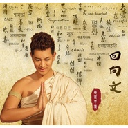

回向文
============================

|  |  |
| :--: | :-- |
| [ 回向文](https://emumo.xiami.com/album/2100386345) | **艺人**: [桑吉平措](../index.md) **语种**: 国语 **唱片公司**: 桑吉平措（北京）文化传媒 **发行时间**: 2016年09月03日 **专辑类别**: EP, 单曲 **专辑风格**:  **播放数**: 85724 **收藏数**: 77 **评论数**: 5  |

## 简介

 

“乌鸟私情，得尽欢於展养；犬马微力，誓効死以酬恩。”我们的生命来自父母，来自于天地，生命的存在，来自于世间万物的供养，一个小小的生命对于这生养我们的父母、天地、万物，实在卑微不足道。只愿将每日的祝福回报给他们。子曰：“夫孝，德之本也。” 报父母恩，愿天下的父母身体健康；感恩这宇宙万物的养育，感恩这世界的和平，感恩众生的相互教化。
 

  

 

 
 

 &nbsp; &nbsp; &nbsp; &nbsp; &nbsp; &nbsp; 又是中秋近，善音歌者---桑吉平措，为大家奉上《回向文》，祝福大家团圆美满。
 

## 曲目

## 评论

|  |  |  |
| :-- | :-- | :-- |
|  [虾米用户](https://emumo.xiami.com/u/11682732)  2019-06-28 20:47 赞(0) 踩(0) | 
乐佛
 |
|  [虾米用户](https://emumo.xiami.com/u/8903790)  2017-05-06 10:39 赞(0) 踩(0) | 
愿以此功得回向遍法界。
 |
|  [虾米用户](https://emumo.xiami.com/u/32031632)  2016-09-04 22:53 赞(1) 踩(0) | 
南无阿弥佗佛
 |
|  [虾米用户](https://emumo.xiami.com/u/7322777) ∮ 2016-09-04 17:33 赞(2) 踩(0) | 
收啦
 |
| ⇒ |  [虾米用户](https://emumo.xiami.com/u/84081596)  2016-09-04 17:54 赞(0) 踩(0) | 
******
 |
