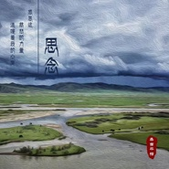

思念
============================

|  |  |
| :--: | :-- |
| [ 思念](https://emumo.xiami.com/album/2103750710) | **艺人**: [桑吉平措](../index.md) **语种**: 国语 **唱片公司**: 独立发行 **发行时间**: 2018年06月15日 **专辑类别**: EP, 单曲 **专辑风格**: 自然新世纪 Nature New Age **播放数**: 86565 **收藏数**: 64 **评论数**: 6  |

## 简介

 

inkMacSystemFont, " helvetica="" neue",="" "pingfang="" sc",="" "hiragino="" sans="" gb",="" "microsoft="" yahei="" ui",="" yahei",="" arial,="" sans-serif;="" font-size:="" 17px;="" letter-spacing:="" 0.544px;="" text-indent:="" 0em;="" box-sizing:="" border-box="" !important;="" word-wrap:="" break-word="" !important;"="">2018初夏，善音歌者桑吉平措再次感动呈现单曲《思念》。
 

inkMacSystemFont, " helvetica="" neue",="" "pingfang="" sc",="" "hiragino="" sans="" gb",="" "microsoft="" yahei="" ui",="" yahei",="" arial,="" sans-serif;="" font-size:="" 17px;="" letter-spacing:="" 0.544px;="" text-align:="" justify;="" box-sizing:="" border-box="" !important;="" word-wrap:="" break-word="" !important;"=""> 
 

inkMacSystemFont, " helvetica="" neue",="" "pingfang="" sc",="" "hiragino="" sans="" gb",="" "microsoft="" yahei="" ui",="" yahei",="" arial,="" sans-serif;="" font-size:="" 17px;="" letter-spacing:="" 0.544px;="" text-align:="" justify;="" box-sizing:="" border-box="" !important;="" word-wrap:="" break-word="" !important;"=""> 
 

inkMacSystemFont, " helvetica="" neue",="" "pingfang="" sc",="" "hiragino="" sans="" gb",="" "microsoft="" yahei="" ui",="" yahei",="" arial,="" sans-serif;="" font-size:="" 17px;="" letter-spacing:="" 0.544px;="" text-indent:="" 0em;="" box-sizing:="" border-box="" !important;="" word-wrap:="" break-word="" !important;"="">《思念》是每个生命内心深处的印记，
 

inkMacSystemFont, " helvetica="" neue",="" "pingfang="" sc",="" "hiragino="" sans="" gb",="" "microsoft="" yahei="" ui",="" yahei",="" arial,="" sans-serif;="" font-size:="" 17px;="" letter-spacing:="" 0.544px;="" text-indent:="" 0em;="" box-sizing:="" border-box="" !important;="" word-wrap:="" break-word="" !important;"="">《思念》是一枚扎根在桑吉平措心底爱的种子。
 

inkMacSystemFont, " helvetica="" neue",="" "pingfang="" sc",="" "hiragino="" sans="" gb",="" "microsoft="" yahei="" ui",="" yahei",="" arial,="" sans-serif;="" font-size:="" 17px;="" letter-spacing:="" 0.544px;="" text-align:="" justify;="" box-sizing:="" border-box="" !important;="" word-wrap:="" break-word="" !important;"=""> 
 

inkMacSystemFont, " helvetica="" neue",="" "pingfang="" sc",="" "hiragino="" sans="" gb",="" "microsoft="" yahei="" ui",="" yahei",="" arial,="" sans-serif;="" font-size:="" 17px;="" letter-spacing:="" 0.544px;="" text-align:="" justify;="" box-sizing:="" border-box="" !important;="" word-wrap:="" break-word="" !important;"=""> 
 

inkMacSystemFont, " helvetica="" neue",="" "pingfang="" sc",="" "hiragino="" sans="" gb",="" "microsoft="" yahei="" ui",="" yahei",="" arial,="" sans-serif;="" font-size:="" 17px;="" letter-spacing:="" 0.544px;="" text-align:="" justify;="" text-indent:="" 0em;="" box-sizing:="" border-box="" !important;="" word-wrap:="" break-word="" !important;"="">在拥有56个民族的中国，每一个民族都有着感动天地的人和故事。而这首歌来自于中国西藏一个偏远的牧区，在海拔4300米的世界屋脊，那里是活在天地间最近的地方，桑吉平措在旅途中曾留下深深的印记，当他看到那里很多人们在用一生的大爱情怀感动天地时，更加懂得了爱的力量，那些用毕生精力帮助他人，祝福他人的人，当离去时，留给世间是超越了物质的最珍宝的精神财富。
 

inkMacSystemFont, " helvetica="" neue",="" "pingfang="" sc",="" "hiragino="" sans="" gb",="" "microsoft="" yahei="" ui",="" yahei",="" arial,="" sans-serif;="" font-size:="" 17px;="" letter-spacing:="" 0.544px;="" text-align:="" justify;="" box-sizing:="" border-box="" !important;="" word-wrap:="" break-word="" !important;"=""> 
 

inkMacSystemFont, " helvetica="" neue",="" "pingfang="" sc",="" "hiragino="" sans="" gb",="" "microsoft="" yahei="" ui",="" yahei",="" arial,="" sans-serif;="" font-size:="" 17px;="" letter-spacing:="" 0.544px;="" text-align:="" justify;="" box-sizing:="" border-box="" !important;="" word-wrap:="" break-word="" !important;"="">  

 

inkMacSystemFont, " helvetica="" neue",="" "pingfang="" sc",="" "hiragino="" sans="" gb",="" "microsoft="" yahei="" ui",="" yahei",="" arial,="" sans-serif;="" font-size:="" 17px;="" letter-spacing:="" 0.544px;="" text-align:="" justify;="" box-sizing:="" border-box="" !important;="" word-wrap:="" break-word="" !important;"="">当扎桑山、雅砻江在眼前定格，一副美丽壮观的画卷，让人流连，可心中总会一阵暖流，那是一种思念。人类在自然面前如此的渺小，敬畏天地时，彼此祝福，思念每一位一生用爱帮助过世间生命的人，思念用爱彼此相惜的人，思念用爱延续奉献的人。  

 

inkMacSystemFont, " helvetica="" neue",="" "pingfang="" sc",="" "hiragino="" sans="" gb",="" "microsoft="" yahei="" ui",="" yahei",="" arial,="" sans-serif;="" font-size:="" 17px;="" letter-spacing:="" 0.544px;="" text-align:="" justify;="" box-sizing:="" border-box="" !important;="" word-wrap:="" break-word="" !important;"=""> 
 

inkMacSystemFont, " helvetica="" neue",="" "pingfang="" sc",="" "hiragino="" sans="" gb",="" "microsoft="" yahei="" ui",="" yahei",="" arial,="" sans-serif;="" font-size:="" 17px;="" letter-spacing:="" 0.544px;="" text-align:="" justify;="" box-sizing:="" border-box="" !important;="" word-wrap:="" break-word="" !important;"=""> 
 

inkMacSystemFont, " helvetica="" neue",="" "pingfang="" sc",="" "hiragino="" sans="" gb",="" "microsoft="" yahei="" ui",="" yahei",="" arial,="" sans-serif;="" font-size:="" 17px;="" letter-spacing:="" 0.544px;="" text-align:="" justify;="" text-indent:="" 0em;="" box-sizing:="" border-box="" !important;="" word-wrap:="" break-word="" !important;"="">歌曲《思念》改编自藏族小调，由桑吉平措填词，歌词中充满对爱的思念，对大爱的尊敬，对未来的希望。
 

inkMacSystemFont, " helvetica="" neue",="" "pingfang="" sc",="" "hiragino="" sans="" gb",="" "microsoft="" yahei="" ui",="" yahei",="" arial,="" sans-serif;="" font-size:="" 17px;="" letter-spacing:="" 0.544px;="" text-align:="" justify;="" box-sizing:="" border-box="" !important;="" word-wrap:="" break-word="" !important;"=""> 
 

inkMacSystemFont, " helvetica="" neue",="" "pingfang="" sc",="" "hiragino="" sans="" gb",="" "microsoft="" yahei="" ui",="" yahei",="" arial,="" sans-serif;="" font-size:="" 17px;="" letter-spacing:="" 0.544px;="" text-align:="" justify;="" box-sizing:="" border-box="" !important;="" word-wrap:="" break-word="" !important;"="">  

 

inkMacSystemFont, " helvetica="" neue",="" "pingfang="" sc",="" "hiragino="" sans="" gb",="" "microsoft="" yahei="" ui",="" yahei",="" arial,="" sans-serif;="" font-size:="" 17px;="" letter-spacing:="" 0.544px;="" text-align:="" justify;="" box-sizing:="" border-box="" !important;="" word-wrap:="" break-word="" !important;"="">风啊，请你带走我的思念。归来吧，期待再次的相遇。
 

 

 
 

 

inkMacSystemFont, " helvetica="" neue",="" "pingfang="" sc",="" "hiragino="" sans="" gb",="" "microsoft="" yahei="" ui",="" yahei",="" arial,="" sans-serif;="" font-size:="" 17px;="" letter-spacing:="" 0.544px;="" text-indent:="" 0em;="" box-sizing:="" border-box="" !important;="" word-wrap:="" break-word="" !important;"="">《思念》———以此歌祭奠南迦法王以及所有毕生奉献给众生的大德，大爱人士。希望世界更加和平与美好。
 

inkMacSystemFont, " helvetica="" neue",="" "pingfang="" sc",="" "hiragino="" sans="" gb",="" "microsoft="" yahei="" ui",="" yahei",="" arial,="" sans-serif;="" font-size:="" 17px;="" letter-spacing:="" 0.544px;="" text-indent:="" 0em;="" box-sizing:="" border-box="" !important;="" word-wrap:="" break-word="" !important;"=""><strong style="margin: 0px; padding: 0px; max-width: 100%; box-sizing: border-box !important; word-wrap: break-word !important;">  
</strong>
 

inkMacSystemFont, " helvetica="" neue",="" "pingfang="" sc",="" "hiragino="" sans="" gb",="" "microsoft="" yahei="" ui",="" yahei",="" arial,="" sans-serif;="" font-size:="" 17px;="" letter-spacing:="" 0.544px;="" text-indent:="" 0em;="" box-sizing:="" border-box="" !important;="" word-wrap:="" break-word="" !important;"="">特别感谢：桑吉平措爱心歌友会-海城分会赞助出品
 

## 曲目

## 评论

|  |  |  |
| :-- | :-- | :-- |
|  [虾米用户](https://emumo.xiami.com/u/32031632)  2018-07-15 09:17 赞(0) 踩(0) | 
南无阿弥佗佛
 |
|  [虾米用户](https://emumo.xiami.com/u/375711876) 结缘善音 2018-06-18 23:17 赞(0) 踩(0) | 
《思念》感动人间，感动天地！
 |
|  [虾米用户](https://emumo.xiami.com/u/270979484)  2018-06-16 10:09 赞(1) 踩(0) | 
好听
 |
|  [虾米用户](https://emumo.xiami.com/u/212457105) 漫步云端 2018-06-16 00:04 赞(1) 踩(0) | 
  
 |
|  [虾米用户](https://emumo.xiami.com/u/344586138) 如果可以我只想做只有七秒... 2018-06-15 11:05 赞(1) 踩(0) | 
太好听了！超级喜欢   
 |
|  [虾米用户](https://emumo.xiami.com/u/334621319) 我还没想好要写什么... 2018-06-15 07:59 赞(1) 踩(0) | 
  第一个沙发️上班路上静静听
 |
