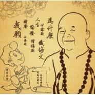

月溪香林星云法师诗歌选集
============================

|  |  |
| :--: | :-- |
| [ 月溪香林星云法师诗歌选集](https://emumo.xiami.com/album/922873229) | **艺人**: [桑吉平措](../index.md) **语种**: 国语 **唱片公司**: 独立发行 **发行时间**: 2014年09月30日 **专辑类别**: 录音室专辑 **专辑风格**: 国语流行 Mandarin Pop **播放数**: 69974 **收藏数**: 72 **评论数**: 6  |

## 简介

无

## 曲目

## 评论

|  |  |  |  |
| :-- | :-- | :-- | :-- |
|  [虾米用户](https://emumo.xiami.com/u/32031632)  2016-07-15 19:50 赞(0) 踩(0) | 
南无阿弥陀佛
 |
|  [虾米用户](https://emumo.xiami.com/u/32031632)  2015-04-06 09:28 赞(0) 踩(0) | 
南无阿弥陀佛
 |
|  [虾米用户](https://emumo.xiami.com/u/320144)  2015-03-01 20:53 赞(0) 踩(0) | 
昨天，在新年祈愿音乐会上听到了本尊的现场演唱，深深被他的声音所吸引。桑吉的歌曲旋律也都很优美，一首“为什么”让人一听入迷。尤其喜欢“禅境”这首歌，“本来无一物，何处染尘埃”一句特别触动人心。桑吉在唱歌的时候时时露出笑意，自在、祥和、喜悦，还有一些俏皮，印象深刻。
 |
|  [虾米用户](https://emumo.xiami.com/u/32031632)  2015-02-14 13:03 赞(0) 踩(0) | 
南无阿弥陀佛
 |
|  [虾米用户](https://emumo.xiami.com/u/31609670) 音乐是灵魂的最佳伴侣… 2015-02-03 12:15 赞(0) 踩(0) | 
支持~赞！
 |
|  [虾米用户](https://emumo.xiami.com/u/34831732) Hell nawh to... 2015-02-02 18:36 赞(0) 踩(0) | 
En
 |
