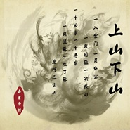
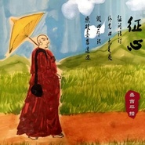
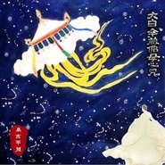
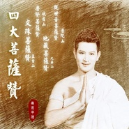
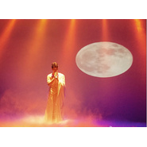

桑吉平措
============================

|  |  |
| :--: | :-- |
| [ 桑吉平措](https://i.xiami.com/sangjipingcuo) | **地区**: China 中国大陆 **风格**: 自然新世纪 Nature New Age **播放数**: 17081462 **粉丝数**: 5541 **评论数**: 281  |

## 档案

桑吉平措，中国大陆音乐人，是集填词，谱曲，艺术策划，演唱于一身的中国梵呗音乐代表人物，中国佛教音乐学院梵呗音乐客座教授，CCTV百姓最喜爱的善音歌者，2017“德艺双馨”公益人物、也是中国首位从佛曲善音走向大众的歌者。2012年初至今，他陆续推出了《相见》《佛说》《蝶花》《睡莲》《晴空月儿明》《礼赞》等善乐及《二十一度母》《九财神》《星云法师诗歌集》《四大菩萨赞》等梵音作品。因他独特的梵音音色，被广大歌友称呼为天籁王子，东方善音歌者。 
艺名：桑吉平措 
生日：2月16日 
身高：185cm 
体重：80KG 
民族：汉 
出生地：山东临沂 
血型：AB 
星座：水瓶座 
语言：普通话、梵文、英语 
信仰：佛教 
专长：竹笛、拉丁舞、花道、茶道、香道、彩绘

## 专辑

| 名称 | 语种 | 唱片公司 | 发行时间 | 专辑类别 | 专辑风格 |
| :--: | :-- | :-- | :-- | :-- | :-- |
| [ 天宝化佛](./albums/2104306544.md) | 国语 |  | 2018年11月30日 | EP, 单曲 | 国语流行 Mandarin Pop |
| [ 思念](./albums/2103750710.md) | 国语 | 独立发行 | 2018年06月15日 | EP, 单曲 | 自然新世纪 Nature New Age |
| [ 上山下山](./albums/2102853271.md) | 国语 | 独立发行 | 2017年09月08日 | 录音室专辑 | 阳光流行 Sunshine Pop |
| [ 仓央嘉措诗歌](./albums/2102764305.md) | 国语 | 独立发行 | 2017年06月13日 | 录音室专辑 | 民族融合新世纪 Ethnic Fusion New Age |
| [ 十二度母](./albums/2102762191.md) | 其他 | 独立发行 | 2017年06月08日 | 录音室专辑 | 传统流行 Traditional Pop, 佛教音乐 Buddhist Music |
| [ 世界首部佛陀经教电影《首楞严演义》插曲](./albums/2102742023.md) | 国语 | 独立发行 | 2017年05月03日 | 原声带, 影视音乐 | 古风 GuFeng Music, 传统流行 Traditional Pop |
| [ 大白伞盖佛母心咒-献礼电影《首楞严演义》](./albums/2102734600.md) | 其他 | 独立发行 | 2017年04月19日 | EP, 单曲 | 阳光流行 Sunshine Pop, 世界融合 World Fusion |
| [ 云归处-礼赞近代禅宗泰斗“虚云法师”](./albums/2102729438.md) | 国语 | 独立发行 | 2017年04月09日 | EP, 单曲 | 世界融合 World Fusion |
| [ 菩提之下《因果启示录》公益电影片尾曲](./albums/2102723261.md) | 国语 | 独立发行 | 2017年03月27日 | 原声带, 影视音乐 | 阳光流行 Sunshine Pop, 世界音乐 World Music |
| [ 礼赞](./albums/2102652350.md) | 国语 | 桑吉平措（北京）文化传媒 | 2016年10月19日 | 录音室专辑 |  |
| [ 回向文](./albums/2100386345.md) | 国语 | 桑吉平措（北京）文化传媒 | 2016年09月03日 | EP, 单曲 |  |
| [ 时光的回味](./albums/2100381823.md) | 国语 | 桑吉平措（北京）文化传媒 | 2016年08月08日 | 录音室专辑 |  |
| [ 四大菩萨赞](./albums/2100379015.md) | 国语 | 桑吉平措（北京）文化传媒 | 2016年08月07日 | 录音室专辑 | 佛教音乐 Buddhist Music |
| [ 清凉歌清凉歌](./albums/2100378248.md) | 国语 | 桑吉平措（北京）文化传媒 | 2016年08月07日 | EP, 单曲 |  |
| [ 睡莲睡莲](./albums/2100374689.md) | 国语 | 桑吉平措（北京）文化传媒 | 2016年07月30日 | EP, 单曲 |  |
| [ 音乐会朗诵词](./albums/2102741259.md) | 国语 | 独立发行 | 2015年05月03日 | 有声书 | 原声 Soundtrack |
| [ 月溪香林](./albums/835121384.md) | 国语 | 独立发行 | 2014年11月30日 | 录音室专辑 | 阳光流行 Sunshine Pop |
| [ 星云法师诗歌星云法师诗歌](./albums/1135110209.md) | 其他 | 独立发行 | 2014年09月30日 | 录音室专辑 | 自然新世纪 Nature New Age |
| [ 月溪香林星云法师诗歌选集](./albums/922873229.md) | 国语 | 独立发行 | 2014年09月30日 | 录音室专辑 | 国语流行 Mandarin Pop |
| [ 禅韵 禅境](./albums/601950802.md) | 国语 | 独立发行 | 2014年05月05日 | 录音室专辑 | 佛教音乐 Buddhist Music |
| [ 【九财神心咒】专辑](./albums/935112673.md) | 其他 | 独立发行 | 2014年01月05日 | 录音室专辑 | 阳光流行 Sunshine Pop, 自然新世纪 Nature New Age |
| [ 九财神心咒](./albums/1990555819.md) | 其他 | 独立发行 | 2014年01月04日 | 录音室专辑 | 国语流行 Mandarin Pop |
| [ 泊岸](./albums/499104.md) | 国语 | 百慕文化 | 2012年09月10日 | EP, 单曲 |  |
| [ 吉祥](./albums/525895.md) | 国语 | 慕音乐 | 2012年07月05日 | EP, 单曲 |  |
| [ 佛说](./albums/495495.md) | 国语 | 百慕文化 | 2012年02月14日 | EP, 单曲 |  |
| [ 相见](./albums/495491.md) | 国语 | 百慕文化 | 2011年12月27日 | EP, 单曲 |  |

## 评论

|  |  |  |
| :-- | :-- | :-- |
|  [虾米用户](https://emumo.xiami.com/u/358104299) 悲观的唯心存在现实解构虚... 2021-01-15 06:02 赞(0) 踩(0) | 
46418
 |
|  [虾米用户](https://emumo.xiami.com/u/41875977)  2020-12-02 21:30 赞(0) 踩(0) | 
 真的很好听。
 |
|  [虾米用户](https://emumo.xiami.com/u/328519429) 宠辱不惊静观庭前花开花落... 2020-11-02 17:35 赞(1) 踩(0) | 
阿弥陀佛保佑你，感谢你的佛曲 
 |
|  [虾米用户](https://emumo.xiami.com/u/423963416) 阿弥陀佛     2020-04-26 06:26 赞(1) 踩(0) | 
感谢您，让我心情舒畅，脱离痛苦
 |
|  [虾米用户](https://emumo.xiami.com/u/424257016)  2020-03-22 15:08 赞(1) 踩(0) | 
佛曰，芸芸众生，佛家有云，慈悲为怀，佛曰，众生皆苦，您愿意去让众生乐，佛祖笑吗？山上一朵最美的雪莲快开了，您知道吗？道生一，一生二，二生三，三生万物。 万物生三，三生二，二生一，一生道。  见或不见，就在那里，去或不去，就在那里，您问在哪里，就在那里。   见吗？不见，相见，还是相见，还是相见？？？
 |
|  [虾米用户](https://emumo.xiami.com/u/419865043)  2020-03-12 14:56 赞(2) 踩(0) | 
你的音乐动听，郁闷时听听能很好的释放，阿弥陀佛 
 |
|  [虾米用户](https://emumo.xiami.com/u/439898101)  2020-02-09 10:44 赞(2) 踩(0) | 
唱得太好了，加油！你最棒！
 |
|  [虾米用户](https://emumo.xiami.com/u/440089251)  2020-02-03 17:34 赞(1) 踩(0) | 
阿弥陀佛
 |
|  [虾米用户](https://emumo.xiami.com/u/420831355) 音乐制作人，DJ，努力中 2019-12-24 22:34 赞(1) 踩(0) | 
天籁之音
 |
|  [虾米用户](https://emumo.xiami.com/u/87447012)  2019-09-04 20:27 赞(2) 踩(0) | 
这音乐太有感染力了，不，应该说有种魔力，刚才还是泪流满面，听到天籁王子桑吉平措的歌声后，一瞬间心生喜悦！
 |
|  [虾米用户](https://emumo.xiami.com/u/411419631)  2019-07-06 19:37 赞(2) 踩(0) | 
太好听了感恩感谢平措老师
 |
|  [虾米用户](https://emumo.xiami.com/u/291731718)  2019-06-02 16:49 赞(1) 踩(0) | 
心静
 |
|  [虾米用户](https://emumo.xiami.com/u/47623873) 音乐我的知心爱人，有你世... 2019-04-14 14:41 赞(1) 踩(0) | 
只听声音，不看图像
 |
|  [虾米用户](https://emumo.xiami.com/u/409591197) 你就是你 2019-04-13 10:00 赞(2) 踩(0) | 
天籁之音
 |
|  [虾米用户](https://emumo.xiami.com/u/325374787)  2019-03-28 18:57 赞(1) 踩(0) | 
❤️
 |
|  [虾米用户](https://emumo.xiami.com/u/411210156) 不要找我，故事讲不完 2019-03-01 21:26 赞(2) 踩(0) | 
  
 |
|  [虾米用户](https://emumo.xiami.com/u/411821676)  2019-02-23 09:31 赞(2) 踩(0) | 
加微信不是您呢？
 |
|  [虾米用户](https://emumo.xiami.com/u/31028791) 网易和q也是神圣剑帝 2019-02-19 09:19 赞(3) 踩(0) | 
我可以慢慢听一年了
 |
|  [虾米用户](https://emumo.xiami.com/u/31028791) 网易和q也是神圣剑帝 2019-02-19 09:18 赞(4) 踩(0) | 
最近听了好多桑吉平措   
 |
|  [虾米用户](https://emumo.xiami.com/u/400405921)  2019-02-11 07:53 赞(1) 踩(0) | 
天籁般的歌声，人生指路明灯！感恩世间有你！阿弥陀佛！
 |
|  [虾米用户](https://emumo.xiami.com/u/413610914)  2019-01-31 19:44 赞(3) 踩(0) | 
《法华经》：若人欢喜心，歌呗颂佛德，乃至一小音，皆已成佛道。 若有慈敬于佛者，实为大善，天下久久乃复有佛。 可见歌手桑吉平措乃一不凡之人。无论歌喉，无论唱腔都无懈可击。简直是太棒了，令人动容，令人发无上真正道意，功德无量。
 |
|  [虾米用户](https://emumo.xiami.com/u/355797554) 我还没想好要写什么... 2019-01-01 02:48 赞(4) 踩(0) | 
身相好 声音又好听 当是您往生劫以来 供养无量诸佛 称赞佛菩萨 方得如此福报 今世再美声传颂佛功德 功德不可思议 随喜赞叹 得闻此音 南无阿弥陀佛 愿众生得念佛三昧 早往极乐世界 即成阿惟越致菩萨 一生补处 疾成佛果
 |
|  [虾米用户](https://emumo.xiami.com/u/1163787) 暂无签名~ 2018-12-29 01:34 赞(1) 踩(0) | 
好帅 
 |
|  [虾米用户](https://emumo.xiami.com/u/346847507)  2018-11-22 17:40 赞(1) 踩(0) | 
很喜欢你的歌声 
 |
|  [虾米用户](https://emumo.xiami.com/u/406485742)  2018-11-12 14:35 赞(1) 踩(0) | 
特别喜欢哦
 |
|  [虾米用户](https://emumo.xiami.com/u/355802404)  2018-09-14 19:01 赞(1) 踩(0) | 
人帥歌好聽   
 |
|  [虾米用户](https://emumo.xiami.com/u/359784757)  2018-07-03 08:20 赞(1) 踩(0) | 
王鹏
 |
|  [虾米用户](https://emumo.xiami.com/u/359784757)  2018-07-03 08:19 赞(1) 踩(0) | 
王鹏
 |
|  [虾米用户](https://emumo.xiami.com/u/375711876) 结缘善音 2018-06-26 18:57 赞(3) 踩(0) | 
桑吉平措的善音总是让人听到心静，喜欢您的善音   
 |
|  [虾米用户](https://emumo.xiami.com/u/367584131)  2018-05-31 19:33 赞(1) 踩(0) | 
加油！
 |
|  [虾米用户](https://emumo.xiami.com/u/50217664) 听着听着淡了，走着走着散... 2018-05-14 18:28 赞(1) 踩(0) | 
努力为社会提供更多更美的音乐吧。
 |
|  [虾米用户](https://emumo.xiami.com/u/321894903) 大道之简 2018-04-30 20:00 赞(2) 踩(0) | 
我亲爱的王子    每次听你唱歌我好陶醉
 |
|  [虾米用户](https://emumo.xiami.com/u/31028791) 网易和q也是神圣剑帝 2018-04-08 20:23 赞(2) 踩(0) | 
         
 |
|  [虾米用户](https://emumo.xiami.com/u/357013195)  2018-04-05 20:34 赞(1) 踩(0) | 
喜欢这首歌！
 |
|  [虾米用户](https://emumo.xiami.com/u/339562764)  2018-03-28 14:43 赞(1) 踩(0) | 
怎么关注，点那？
 |
| ⇒ |  [虾米用户](https://emumo.xiami.com/u/226833808) 梦里见 2018-08-05 19:25 赞(0) 踩(0) | 
点旁边那颗心就可以啦
 |
|  [虾米用户](https://emumo.xiami.com/u/339562764)  2018-03-28 14:26 赞(1) 踩(0) | 
好听
 |
|  [虾米用户](https://emumo.xiami.com/u/337195718)  2018-03-19 19:36 赞(2) 踩(0) | 
喜爱  好听
 |
|  [虾米用户](https://emumo.xiami.com/u/37446374)  2018-03-19 18:48 赞(2) 踩(0) | 
红尘中一朵莲花。 
 |
|  [虾米用户](https://emumo.xiami.com/u/353135821)  2018-03-03 23:23 赞(2) 踩(0) | 
如此净化心灵   
 |
|  [虾米用户](https://emumo.xiami.com/u/351507730)  2018-02-20 22:37 赞(1) 踩(0) | 
很好听到最好天籁之音
 |
|  [虾米用户](https://emumo.xiami.com/u/308141018)  2018-02-03 14:53 赞(1) 踩(0) | 
桑吉平措唱的非常好，尤其是佛歌，听后心静，心安，经常反复听有时伴随进入梦乡，我很喜欢，支持你、赞扬你
 |
|  [虾米用户](https://emumo.xiami.com/u/335048077)  2017-12-30 11:15 赞(2) 踩(0) | 
听了这首歌，让自己流一晚上泪，回想过去点点滴滴&amp;hellip;&amp;hellip;
 |
|  [虾米用户](https://emumo.xiami.com/u/341236589)  2017-12-25 23:01 赞(1) 踩(0) | 
桑吉平错措唱的好
 |
|  [虾米用户](https://emumo.xiami.com/u/42870241) 百無禁忌 2017-12-06 21:11 赞(3) 踩(0) | 
眼线画得有点妖孽了
 |
|  [虾米用户](https://emumo.xiami.com/u/9253159)  2017-10-28 00:18 赞(1) 踩(0) | 
平心静气，喜欢。
 |
|  [虾米用户](https://emumo.xiami.com/u/279811532)  2017-10-28 00:03 赞(2) 踩(0) | 
我喜欢桑吉平措，我爱他
 |
|  [虾米用户](https://emumo.xiami.com/u/279811532)  2017-10-28 00:03 赞(1) 踩(0) | 
我喜欢桑吉平措
 |
|  [虾米用户](https://emumo.xiami.com/u/330080898)  2017-10-14 11:29 赞(1) 踩(0) | 
佛
 |
|  [虾米用户](https://emumo.xiami.com/u/247541488)   2017-10-07 22:52 赞(1) 踩(0) | 
第一次听 很好听
 |
|  [虾米用户](https://emumo.xiami.com/u/16994877) 音海拾音 2017-09-22 21:43 赞(3) 踩(0) | 
世间行乐亦如此，人间至味是清欢
 |
|  [虾米用户](https://emumo.xiami.com/u/252860598) 南无佛陀耶南无达摩耶南无... 2017-09-22 06:29 赞(2) 踩(0) | 
  
 |
|  [虾米用户](https://emumo.xiami.com/u/36617802)  2017-09-21 11:20 赞(2) 踩(0) | 
歌声空灵，听着很有意境。
 |
|  [虾米用户](https://emumo.xiami.com/u/278293619)  2017-09-09 21:30 赞(2) 踩(0) | 
每天都在听，内心平静很多。   
 |
|  [虾米用户](https://emumo.xiami.com/u/323131950)  2017-09-03 14:58 赞(2) 踩(0) | 
南无阿弥陀佛   
 |
|  [虾米用户](https://emumo.xiami.com/u/317385553)  2017-08-05 12:00 赞(2) 踩(0) | 
静听
 |
|  [虾米用户](https://emumo.xiami.com/u/296573061)  2017-08-03 14:46 赞(3) 踩(0) | 
很喜欢天籁王子唱的佛歌，给人以纯净，愉悦，阳光环绕之感觉。愿更能听到以欢悦深情之音演唱的更多佛曲。
 |
|  [虾米用户](https://emumo.xiami.com/u/296483323) 就喜欢听DJ音乐 2017-07-20 22:12 赞(1) 踩(0) | 
  
 |
|  [虾米用户](https://emumo.xiami.com/u/294932525)   2017-07-13 20:31 赞(1) 踩(0) | 
是深刻印象                                                 
 |
|  [虾米用户](https://emumo.xiami.com/u/300232742) 回媚一笑百媚生，六宫粉黛... 2017-06-01 18:55 赞(1) 踩(0) | 
不喜欢，太土了
 |
| ⇒ |  [虾米用户](https://emumo.xiami.com/u/226833808) 梦里见 2018-08-05 19:27 赞(0) 踩(0) | 
小学生吗，这是佛教歌曲谢谢，不喜欢也不要诋毁
 |
|  [虾米用户](https://emumo.xiami.com/u/298334592)  2017-05-23 09:56 赞(1) 踩(0) | 
******
 |
|  [虾米用户](https://emumo.xiami.com/u/275300592)  2017-05-22 15:26 赞(1) 踩(0) | 
:＇/`/冫:!!
 |
|  [虾米用户](https://emumo.xiami.com/u/290384079)  2017-05-19 15:39 赞(1) 踩(0) | 
挺好听的我去西藏时经常听  
 |
|  [虾米用户](https://emumo.xiami.com/u/8903790)  2017-05-06 10:27 赞(1) 踩(0) | 
优雅至美
 |
|  [虾米用户](https://emumo.xiami.com/u/273175504) 随缘随心。南无阿弥陀佛 2017-04-28 15:20 赞(0) 踩(0) | 
喜欢听，佛音乐，心静   
 |
|  [虾米用户](https://emumo.xiami.com/u/291172387)  2017-04-24 19:48 赞(1) 踩(0) | 
很干净，也很安心，谢谢
 |
|  [虾米用户](https://emumo.xiami.com/u/238891209)  2017-04-20 20:13 赞(0) 踩(0) | 
  
 |
|  [虾米用户](https://emumo.xiami.com/u/238891209)  2017-04-20 20:13 赞(0) 踩(0) | 
我也喜欢    
 |
|  [虾米用户](https://emumo.xiami.com/u/262625552)  2017-04-12 22:22 赞(0) 踩(0) | 
很喜欢他的声音，很干净、舒服很好听
 |
|  [虾米用户](https://emumo.xiami.com/u/262625552)  2017-04-12 22:20 赞(0) 踩(0) | 
很喜欢他的声音，很干净、舒服
 |
|  [虾米用户](https://emumo.xiami.com/u/283989619)  2017-04-01 16:19 赞(1) 踩(0) | 
不一样的感觉
 |
|  [虾米用户](https://emumo.xiami.com/u/282148533)  2017-03-26 08:52 赞(0) 踩(0) | 
  
 |
|  [虾米用户](https://emumo.xiami.com/u/282669767)  2017-03-24 10:54 赞(1) 踩(0) | 
阿弥陀佛！感谢你！在韩国客座时母亲离开了我，是你的音乐每天陪我渡过&amp;hellip;&amp;hellip;
 |
|  [虾米用户](https://emumo.xiami.com/u/278320405) 有爱心才会美丽帅气 2017-03-07 07:24 赞(0) 踩(0) | 
就是好听 
 |
|  [虾米用户](https://emumo.xiami.com/u/275107285)  2017-02-23 20:16 赞(0) 踩(0) | 
  
 |
|  [虾米用户](https://emumo.xiami.com/u/10156592) 带上耳机，世界与我无关… 2017-02-11 16:00 赞(0) 踩(0) | 
唱进人的心灵
 |
|  [虾米用户](https://emumo.xiami.com/u/7721396) 我还没想好要写什么... 2017-02-04 17:31 赞(0) 踩(0) | 
good
 |
|  [虾米用户](https://emumo.xiami.com/u/268604118)  2017-01-28 08:38 赞(1) 踩(0) | 
我也是皈依弟子真心祝福桑吉平措越来越好让更多人洗净心灵
 |
|  [虾米用户](https://emumo.xiami.com/u/268604118)  2017-01-28 08:36 赞(2) 踩(0) | 
超级喜欢桑吉平措的干净声音，听过一次找了很久很久
 |
|  [虾米用户](https://emumo.xiami.com/u/12221090) 逍遥于天地而心意自得 2017-01-04 16:40 赞(0) 踩(0) | 
赞
 |
|  [虾米用户](https://emumo.xiami.com/u/239325871)  2016-10-22 21:54 赞(1) 踩(0) | 
心平静了
 |
|  [虾米用户](https://emumo.xiami.com/u/235435082) 听着听着感动了就是好音乐... 2016-10-20 19:59 赞(1) 踩(0) | 
用音乐度化世人
 |
|  [虾米用户](https://emumo.xiami.com/u/51824622)  2016-10-12 19:21 赞(0) 踩(0) | 
呵呵呵，我是冲着颜值来的。
 |
|  [虾米用户](https://emumo.xiami.com/u/200454981)  2016-10-07 17:05 赞(0) 踩(0) | 
听得怎么有种想哭的感觉呢。 
 |
| ⇒ |  [虾米用户](https://emumo.xiami.com/u/204796074) 再见。 2017-02-20 15:51 赞(0) 踩(0) | 
有佛缘吧
 |
|  [虾米用户](https://emumo.xiami.com/u/68134310)  2016-09-15 12:31 赞(1) 踩(0) | 
有禅意，悦耳动听
 |
|  [虾米用户](https://emumo.xiami.com/u/12221090) 逍遥于天地而心意自得 2016-09-09 08:41 赞(0) 踩(0) | 
赞
 |
|  [虾米用户](https://emumo.xiami.com/u/12358996)  2016-08-23 16:08 赞(0) 踩(0) | 
幽静
 |
|  [虾米用户](https://emumo.xiami.com/u/15956827)  2016-08-19 14:42 赞(0) 踩(0) | 
喜欢
 |
|  [虾米用户](https://emumo.xiami.com/u/84081596)  2016-08-13 15:10 赞(0) 踩(0) | 
******
 |
|  [虾米用户](https://emumo.xiami.com/u/206026468) 花开见佛 2016-07-28 10:21 赞(0) 踩(0) | 
 
 |
|  [虾米用户](https://emumo.xiami.com/u/203168791)  2016-07-20 20:26 赞(0) 踩(0) | 
天籁妙音
 |
|  [虾米用户](https://emumo.xiami.com/u/62147888) 我还没想好要写什么... 2016-06-12 20:09 赞(2) 踩(0) | 
感恩！能听到这么美好的声音！
 |
|  [虾米用户](https://emumo.xiami.com/u/168880252)  2016-05-14 23:09 赞(1) 踩(0) | 
  
 |
|  [虾米用户](https://emumo.xiami.com/u/90479762) 风一样的女纸 2016-03-09 08:44 赞(0) 踩(0) | 
太帅了，
 |
|  [虾米用户](https://emumo.xiami.com/u/44237256) 靳福库 2016-02-03 10:02 赞(0) 踩(0) | 
    
 |
|  [虾米用户](https://emumo.xiami.com/u/8166166)  2015-12-20 23:26 赞(2) 踩(0) | 
喜欢他的佛说，声音感觉不错
 |
|  [虾米用户](https://emumo.xiami.com/u/32031632)  2015-11-24 15:17 赞(0) 踩(0) | 
南无阿弥陀佛
 |
|  [虾米用户](https://emumo.xiami.com/u/83861550)  2015-11-17 12:27 赞(0) 踩(0) | 
好听
 |
|  [虾米用户](https://emumo.xiami.com/u/51804199)  2015-10-14 21:15 赞(0) 踩(0) | 
声音真好听！   
 |
|  [虾米用户](https://emumo.xiami.com/u/20485285)  2015-10-07 23:11 赞(0) 踩(0) | 
很喜欢的声音，如天籁
 |
|  [虾米用户](https://emumo.xiami.com/u/47374184)  2015-09-05 07:24 赞(0) 踩(0) | 
天籁之音，宇宙之子   
 |
|  [虾米用户](https://emumo.xiami.com/u/35320145) 以音乐为伴，与世无争！ 2015-07-23 18:38 赞(1) 踩(0) | 
赞
 |
|  [虾米用户](https://emumo.xiami.com/u/7833858)  2015-06-06 13:31 赞(0) 踩(0) | 
赞
 |
|  [虾米用户](https://emumo.xiami.com/u/32031632)  2015-06-06 10:32 赞(0) 踩(0) | 
南无阿弥陀佛
 |
|  [虾米用户](https://emumo.xiami.com/u/50541145)  2015-06-03 19:14 赞(1) 踩(0) | 
太过分了！为什么下架了！超级好听的歌曲，为什么不让大家分享！什么年代了，怎么，还会有这样的事情发生！
 |
|  [虾米用户](https://emumo.xiami.com/u/1353098) 发上等愿,结中等缘,享下 2015-05-26 07:20 赞(0) 踩(0) | 
这么好的声音，怎么会下架了？什么原因啊？版权问题还是有人乱刀？
 |
|  [虾米用户](https://emumo.xiami.com/u/12794280) 我还没想好要写什么... 2015-04-23 15:30 赞(0) 踩(0) | 
天籁！2012年认识你！立马开始关注！好歌能洗心！听你的歌让人内心宁静豁然开朗！
 |
|  [虾米用户](https://emumo.xiami.com/u/49117717)  2015-04-11 21:07 赞(0) 踩(0) | 
喜欢
 |
|  [虾米用户](https://emumo.xiami.com/u/49080799)   2015-04-10 19:59 赞(2) 踩(0) | 
好不容易找到你了！阿弥陀佛 
 |
| ⇒ |  [虾米用户](https://emumo.xiami.com/u/93642260)  2015-12-22 15:33 赞(0) 踩(0) | 
同感
 |
|  [虾米用户](https://emumo.xiami.com/u/46352609) 嗡  哒咧 嘟哒咧 嘟咧... 2015-03-22 18:23 赞(0) 踩(0) | 
此时此刻，压抑的心情好多了
 |
|  [虾米用户](https://emumo.xiami.com/u/13933838)  2015-03-18 19:57 赞(1) 踩(0) | 
天籁之音，还有以前的歌什么时候可以再上架啊
 |
|  [虾米用户](https://emumo.xiami.com/u/32031632)  2015-02-14 13:03 赞(0) 踩(0) | 
南无阿弥陀佛
 |
|  [虾米用户](https://emumo.xiami.com/u/45482321)  2014-12-31 10:40 赞(0) 踩(0) | 
天籁王子，支持你。
 |
|  [虾米用户](https://emumo.xiami.com/u/44437452)  2014-12-05 09:48 赞(0) 踩(0) | 
为什么就一首了？快快上架
 |
|  [虾米用户](https://emumo.xiami.com/u/4878153)  2014-10-15 19:59 赞(0) 踩(0) | 
这么好听的歌，怎么都下架了？太可惜了！！！
 |
|  [虾米用户](https://emumo.xiami.com/u/32680044) ~ 2014-09-16 19:42 赞(0) 踩(0) | 
桑吉央措，挺你！
 |
|  [虾米用户](https://emumo.xiami.com/u/241390) 你走吧，哥们唱着歌送你 2014-09-12 17:55 赞(0) 踩(0) | 
虾米在搞什么，这样的声音不值得留念还要听什么样的？桑吉央措，挺你！
 |
|  [虾米用户](https://emumo.xiami.com/u/12077106) 虾米最懂我 2014-09-06 21:20 赞(0) 踩(0) | 
为何下架这样治愈心灵的歌曲
 |
|  [虾米用户](https://emumo.xiami.com/u/16950104)  2014-08-30 22:49 赞(0) 踩(0) | 
声音很清澈
 |
|  [虾米用户](https://emumo.xiami.com/u/37655270) FM900.COM 2014-06-17 10:08 赞(1) 踩(0) | 
桑吉平措
 |
|  [虾米用户](https://emumo.xiami.com/u/3902905)  2014-05-04 08:20 赞(0) 踩(0) | 
为何都下架了呢？好可惜。。
 |
|  [虾米用户](https://emumo.xiami.com/u/8297880)  2014-04-03 10:12 赞(1) 踩(0) | 
为什么桑吉平措的歌下架了？虾米的管理者能回答这个问题吗？
 |
|  [虾米用户](https://emumo.xiami.com/u/34327240)  2014-03-21 22:01 赞(1) 踩(0) | 
老兄怎么听你的对佛的诠释！很着急！！！
 |
|  [虾米用户](https://emumo.xiami.com/u/31922032)  2014-03-19 22:31 赞(0) 踩(0) | 
听听桑吉平措唱歌，平静心情。
 |
|  [虾米用户](https://emumo.xiami.com/u/5447550)  2014-02-24 22:22 赞(0) 踩(0) | 
祝您生日快乐!
 |
|  [虾米用户](https://emumo.xiami.com/u/5470405) 暂无签名~ 2014-02-23 15:28 赞(1) 踩(0) | 
what?
 |
|  [虾米用户](https://emumo.xiami.com/u/31763554)  2014-02-20 23:42 赞(1) 踩(0) | 
为什么下架啊？
 |
|  [虾米用户](https://emumo.xiami.com/u/4878153)  2014-02-18 00:44 赞(0) 踩(0) | 
“生日快乐！”
 |
|  [虾米用户](https://emumo.xiami.com/u/684222) 只有偶然相遇触碰了心里 2014-02-18 00:15 赞(0) 踩(0) | 
生日快乐
 |
|  [虾米用户](https://emumo.xiami.com/u/6857099) 我还没想好要写什么... 2014-02-17 19:46 赞(0) 踩(0) | 
怎么都下架了？！！
 |
|  [虾米用户](https://emumo.xiami.com/u/6565760)  2014-02-17 15:09 赞(0) 踩(0) | 
南无阿弥陀佛!
 |
|  [虾米用户](https://emumo.xiami.com/u/29301525)  2014-02-17 10:08 赞(0) 踩(0) | 
生日快乐！很美的心灵音乐！
 |
|  [虾米用户](https://emumo.xiami.com/u/7322777) ∮ 2014-02-17 08:41 赞(0) 踩(0) | 
蝦米通知:  今日生日快樂
 |
|  [虾米用户](https://emumo.xiami.com/u/727733)  2014-02-17 07:28 赞(0) 踩(0) | 
生日快乐
 |
|  [虾米用户](https://emumo.xiami.com/u/1293134) 人生如梦幻 2014-02-13 18:56 赞(0) 踩(0) | 
汉族？？
 |
|  [虾米用户](https://emumo.xiami.com/u/32053861)  2014-01-26 17:30 赞(0) 踩(0) | 
你天籁的声音是上天恩赐给我们的，感谢，希望有更多的佳品问世。
 |
|  [虾米用户](https://emumo.xiami.com/u/10150617)  2014-01-22 10:16 赞(0) 踩(0) | 
我会一直追随
 |
|  [虾米用户](https://emumo.xiami.com/u/10150617)  2014-01-22 10:16 赞(0) 踩(0) | 
为什么又要下架
 |
|  [虾米用户](https://emumo.xiami.com/u/31852563)  2014-01-18 22:05 赞(0) 踩(0) | 
声音很干净
 |
|  [虾米用户](https://emumo.xiami.com/u/4878153)  2014-01-09 19:19 赞(0) 踩(0) | 
天籁之音忍不住一遍又一遍聆听！
 |
|  [虾米用户](https://emumo.xiami.com/u/1165848)  2014-01-05 10:23 赞(0) 踩(0) | 
清泉流淌在心间的善音吟唱...........东方梵音王子^_^
 |
|  [虾米用户](https://emumo.xiami.com/u/31015537)  2014-01-04 16:44 赞(1) 踩(0) | 
夜v零落：真美，不管听多少遍还是觉得那么动人，仿佛那每一个音调都能拨动着人最轻柔的情感，不强烈可又绝对不会忽视，美的就像风过后，撩起的摇曳，一滴水落在平静的湖面，即便荡起漪涟也是那静默的诗篇。真感动
 |
|  [虾米用户](https://emumo.xiami.com/u/31050527)  2014-01-04 00:07 赞(1) 踩(0) | 
这就是一种境界，唯美动人，沁入心扉。看，蝶儿飞起来了。
 |
|  [虾米用户](https://emumo.xiami.com/u/31050527)  2014-01-04 00:04 赞(1) 踩(0) | 
大爱桑吉平措，永远的追随。
 |
|  [虾米用户](https://emumo.xiami.com/u/15571917) 来如流水兮逝如风 2014-01-03 17:18 赞(0) 踩(0) | 
真正的天籁之音
 |
|  [虾米用户](https://emumo.xiami.com/u/31012079)  2014-01-03 17:16 赞(1) 踩(0) | 
大家听听就知道了 我为什么 喜欢
 |
|  [虾米用户](https://emumo.xiami.com/u/27231819)  2014-01-03 16:52 赞(1) 踩(0) | 
每一首都是那样美，忍不住一遍又一遍聆听！
 |
|  [虾米用户](https://emumo.xiami.com/u/20557236) 哼一首歌等日落 2014-01-03 15:27 赞(0) 踩(0) | 
佛说呢？
 |
|  [虾米用户](https://emumo.xiami.com/u/31019333)  2014-01-03 15:19 赞(4) 踩(0) | 
美妙的音乐，美好的意境，将人带入一个蝶飞花艳神秘浪漫的国度！
 |
|  [虾米用户](https://emumo.xiami.com/u/1165848)  2014-01-03 15:01 赞(11) 踩(0) | 
太好听了。滴答滴答滴答的竖琴旋律。。。如朝露般清澄的音色，行云流水。。。古老神秘而悠远，和着啊（啦）的轻柔吟唱。。。余韵绵长，浪漫温馨又诗意。。。心湖泛起涟漪。。。闭上眼睛，无边的思绪跟着音符飞扬，醉花荫，入蝶梦。。.......
 |
| ⇒ |  [虾米用户](https://emumo.xiami.com/u/31018709)  2014-01-03 15:06 赞(0) 踩(0) | 
形容得特别贴切特别美！
 |
| ⇒ |  [虾米用户](https://emumo.xiami.com/u/31020087)  2014-01-03 15:35 赞(0) 踩(0) | 
这段文字真美!跟音乐一样美!
 |
|  [虾米用户](https://emumo.xiami.com/u/31012079)  2014-01-03 14:47 赞(14) 踩(0) | 
唱的  真的很不错 唱音好清晰哦  真心 很喜欢
 |
|  [虾米用户](https://emumo.xiami.com/u/24394121)  2014-01-03 14:46 赞(12) 踩(0) | 
浪漫的竖琴声像是温柔的清风，托着一只白色的蝴蝶，越过茂密的丛林，越过蜿蜒的小溪，越过挂着风铃的小木屋，飞入一个仙境般神秘的国度，这里，大片的熏衣草微微颤动着紫色的花穗，无数的鸢尾花轻摆着雪色的舞衣...感恩桑吉平措给我们带来如此美妙的音乐！
 |
|  [虾米用户](https://emumo.xiami.com/u/24394121)  2014-01-03 14:25 赞(24) 踩(0) | 
歌手发音不存在不准确的问题，以前一些歌曲是原来唱片公司强制下架。希望每一个人都对自己说的话负责！！！诽谤是要负法律责任的！
 |
| ⇒ |  [虾米用户](https://emumo.xiami.com/u/284208357)  2017-03-29 07:37 赞(0) 踩(0) | 
d  5 0ooonori11 11
 |
|  [虾米用户](https://emumo.xiami.com/u/31014318)  2014-01-03 13:52 赞(37) 踩(0) | 
我们的天籁王子终于带来了美妙的蝶花,听了一上午可以在歌声中体会歌词表达的美的意境和像水波涟漪一样的音乐伴奏，脑海中充满了无限的想象。在喧嚣的城市中带来一首这样能静人心脾的声音。此曲只应天上有，人间哪得几回闻.......希望以后有更多的好作品带给大家。永远支持你的潘潘
 |
| ⇒ |  [虾米用户](https://emumo.xiami.com/u/24394121)  2014-01-03 14:52 赞(0) 踩(0) | 
是啊，期待已久，终于等来了如此美妙的一刻！
 |
| ⇒ |  [虾米用户](https://emumo.xiami.com/u/31018709)  2014-01-03 15:07 赞(0) 踩(0) | 
我么一起支持他！
 |
| ⇒ |  [虾米用户](https://emumo.xiami.com/u/278320405) 有爱心才会美丽帅气 2017-03-07 07:50 赞(0) 踩(0) | 
王子你的歌太好听了，听了你的歌忘记了一烦恼。
 |
| ⇒ |  [虾米用户](https://emumo.xiami.com/u/282989988)  2017-03-24 19:41 赞(0) 踩(0) | 
自己
 |
| ⇒ |  [虾米用户](https://emumo.xiami.com/u/57056518)  2017-08-08 01:43 赞(0) 踩(0) | 
∵&amp;hellip;1:l!
 |
|  [虾米用户](https://emumo.xiami.com/u/7974942) 灵魂永不老去 2014-01-03 12:47 赞(4) 踩(0) | 
好听！！！
 |
| ⇒ |  [虾米用户](https://emumo.xiami.com/u/15571917) 来如流水兮逝如风 2014-01-03 17:25 赞(0) 踩(0) | 
宽宽你知道这首歌背后的来历吗？很有意义的！嘻嘻……
 |
|  [虾米用户](https://emumo.xiami.com/u/15571917) 来如流水兮逝如风 2014-01-03 12:02 赞(4) 踩(0) | 
太好听了！这是桑吉平措最新单曲哦！蝶花～～～～
 |
|  [虾米用户](https://emumo.xiami.com/u/27231819)  2014-01-03 11:58 赞(10) 踩(0) | 
好美的《蝶花》！终于盼来了天籁王子桑吉平措的最新单曲，感恩王子带给我们这样的视听享受！
 |
|  [虾米用户](https://emumo.xiami.com/u/27231819)  2014-01-03 11:55 赞(8) 踩(0) | 
感恩这世界，还有如此祥和美丽的音乐，让我们可以暂时忘记红尘的喧嚣,，让我们在情思惘然中，似乎自己也能化身花与蝶，享受着天地间至美至纯的情怀。。。
 |
| ⇒ |  [虾米用户](https://emumo.xiami.com/u/31019333)  2014-01-03 15:21 赞(0) 踩(0) | 
是啊，这样的音乐，可以把我们带入另外一个更加美好的世界。
 |
|  [虾米用户](https://emumo.xiami.com/u/30482918) 梵呗音乐代表人物 2014-01-03 10:57 赞(204) 踩(0) | 
我刚入驻了虾米音乐人，欢迎大家来我的个人主页，收听我的最新音乐
 |
| ⇒ |  [虾米用户](https://emumo.xiami.com/u/15571917) 来如流水兮逝如风 2014-01-03 12:05 赞(0) 踩(0) | 
太好听啦！
 |
| ⇒ |  [虾米用户](https://emumo.xiami.com/u/24394121)  2014-01-03 14:29 赞(0) 踩(0) | 
支持，让世界静下来聆听的善乐！
 |
| ⇒ |  [虾米用户](https://emumo.xiami.com/u/31019333)  2014-01-03 15:17 赞(0) 踩(0) | 
在你的音乐世界里，我们成长并自在欢喜。
 |
| ⇒ |  [虾米用户](https://emumo.xiami.com/u/298615) 暂无签名~ 2014-02-17 15:55 赞(0) 踩(0) | 
生日快樂 南无阿弥陀佛!
 |
| ⇒ |  [虾米用户](https://emumo.xiami.com/u/298615) 暂无签名~ 2014-02-17 15:56 赞(0) 踩(0) | 
南无阿弥陀佛! 生日快乐！
 |
| ⇒ |  [虾米用户](https://emumo.xiami.com/u/637392) 你听这音乐会让人醉，会让... 2014-04-26 14:33 赞(0) 踩(0) | 
怎么以前的歌下架了？
 |
| ⇒ |  [虾米用户](https://emumo.xiami.com/u/49550344)  2015-04-25 10:52 赞(0) 踩(0) | 
为什么都不能听
 |
| ⇒ |  [虾米用户](https://emumo.xiami.com/u/93642260)  2015-12-22 15:28 赞(0) 踩(0) | 
好想听你的泊岸。好多播放器都放不了了。
 |
| ⇒ |  [虾米用户](https://emumo.xiami.com/u/53717640)  2016-07-28 19:16 赞(0) 踩(0) | 
随喜您的声音
 |
| ⇒ |  [虾米用户](https://emumo.xiami.com/u/234416794)  2016-10-07 18:16 赞(0) 踩(0) | 
你好。你还在唱歌吗？
 |
| ⇒ |  [虾米用户](https://emumo.xiami.com/u/262129115)  2017-01-15 17:11 赞(0) 踩(0) | 
我们是老乡！你的歌很赞！永远支持你  
 |
| ⇒ |  [虾米用户](https://emumo.xiami.com/u/278320405) 有爱心才会美丽帅气 2017-03-09 07:21 赞(0) 踩(0) | 
王子的歌太好听了
 |
| ⇒ |  [虾米用户](https://emumo.xiami.com/u/277120786)  2017-03-19 23:02 赞(0) 踩(0) | 
嗨今天回广州了吧！昨天在太原辛苦了 
 |
| ⇒ |  [虾米用户](https://emumo.xiami.com/u/75049008) 听一首歌，意在能体会这首... 2017-04-16 10:00 赞(0) 踩(0) | 
南无阿弥陀佛      很喜欢您所唱的佛歌，让人心净 旁无杂念，期待您有更多的佛歌作品      
 |
| ⇒ |  [虾米用户](https://emumo.xiami.com/u/307988121)  2017-07-09 21:40 赞(0) 踩(0) | 
南无阿弥陀佛
 |
| ⇒ |  [虾米用户](https://emumo.xiami.com/u/316644961)  2017-08-02 10:26 赞(0) 踩(0) | 
阿弥陀佛
 |
| ⇒ |  [虾米用户](https://emumo.xiami.com/u/312667484)  2017-09-18 08:54 赞(0) 踩(0) | 
好棒！
 |
| ⇒ |  [虾米用户](https://emumo.xiami.com/u/247541488)   2017-10-07 22:53 赞(0) 踩(0) | 
阿弥陀佛 
 |
| ⇒ |  [虾米用户](https://emumo.xiami.com/u/341236589)  2017-12-25 23:02 赞(0) 踩(0) | 
好美呀
 |
| ⇒ |  [虾米用户](https://emumo.xiami.com/u/84081596)  2018-01-06 23:33 赞(0) 踩(0) | 
******
 |
| ⇒ |  [虾米用户](https://emumo.xiami.com/u/18433982)  2018-10-23 09:00 赞(0) 踩(0) | 
我很喜欢听你的歌
 |
|  [虾米用户](https://emumo.xiami.com/u/8651431) 暂无签名~ 2013-10-16 18:50 赞(3) 踩(0) | 
最喜欢的一位灵性歌手，高频振动力的歌声可以提升人们的心灵~~~祝他的歌声可以传播得更远更广~~~期盼新的专辑中……
 |
|  [虾米用户](https://emumo.xiami.com/u/7974942) 灵魂永不老去 2013-09-12 14:31 赞(4) 踩(0) | 
大家不要急，桑吉的新歌很快就会全面上线，对歌曲进行全新演绎。非常感谢大家对桑吉的支持！感恩祝福...
 |
|  [虾米用户](https://emumo.xiami.com/u/2871) 虾米编辑部唯一官方账号 ... 2013-09-05 13:22 赞(5) 踩(0) | 
注意，非版权问题下架。由于歌手部分发音不确切，应唱片公司要求，需要重新制作，因此下架。
 |
| ⇒ |  [虾米用户](https://emumo.xiami.com/u/11725279)  2013-10-02 12:01 赞(0) 踩(0) | 
哦。。。等！
 |
| ⇒ |  [虾米用户](https://emumo.xiami.com/u/27231819)  2014-01-03 15:28 赞(0) 踩(0) | 
就是因为版权问题下架的
 |
| ⇒ |  [虾米用户](https://emumo.xiami.com/u/31015537)  2014-01-03 15:36 赞(0) 踩(0) | 
歌手发音不确切？当初为啥发行呀？
 |
| ⇒ |  [虾米用户](https://emumo.xiami.com/u/2871) 虾米编辑部唯一官方账号 ... 2014-01-03 15:40 赞(0) 踩(0) | 
<q><b>笑口常开说：</b></q>
 |
|  [虾米用户](https://emumo.xiami.com/u/8297880)  2013-09-02 12:47 赞(1) 踩(0) | 
为什么桑吉平措的歌播放不成了?怎么样回事啊??????
 |
|  [虾米用户](https://emumo.xiami.com/u/5542324) 这就是个性签名。 2013-09-01 13:53 赞(1) 踩(0) | 
下架啊！！什么状况！！
 |
| ⇒ |  [虾米用户](https://emumo.xiami.com/u/6630660) 猜赢涂口红… 2013-09-15 23:16 赞(0) 踩(0) | 
专辑重新制作中，暂时下架。
 |
| ⇒ |  [虾米用户](https://emumo.xiami.com/u/5542324) 这就是个性签名。 2013-09-19 16:04 赞(0) 踩(0) | 
<q><b>哈哈哈哈哈哈哈哈哈哈哈皮说：</b></q>
 |
|  [虾米用户](https://emumo.xiami.com/u/3830602)  2013-08-25 10:23 赞(1) 踩(0) | 
好端端的 这叫什么事嘛
 |
|  [虾米用户](https://emumo.xiami.com/u/15761199)  2013-08-21 17:25 赞(0) 踩(0) | 
为嘛下架啊？他的好几首歌都好喜欢。。。。。
 |
|  [虾米用户](https://emumo.xiami.com/u/10543171)  2013-08-21 15:52 赞(0) 踩(0) | 
这都能下架
 |
|  [虾米用户](https://emumo.xiami.com/u/18806729)  2013-08-10 16:00 赞(0) 踩(0) | 
感恩每一段因缘
 |
|  [虾米用户](https://emumo.xiami.com/u/3510038) 海天之恋 2013-07-02 15:17 赞(1) 踩(0) | 
1.百度了一下 这位湿胸本名王秋翔 翔啊！！讹米偷佛 2.他好像还没有出家 我又有目标了！！ 讹米偷佛
 |
|  [虾米用户](https://emumo.xiami.com/u/2499192)  2013-06-30 11:07 赞(0) 踩(0) | 
净化心灵
 |
|  [虾米用户](https://emumo.xiami.com/u/10932527)  2013-06-16 13:11 赞(1) 踩(0) | 
阿弥陀佛
 |
|  [虾米用户](https://emumo.xiami.com/u/11056036)  2013-06-16 11:58 赞(1) 踩(0) | 
好帅啊
 |
|  [虾米用户](https://emumo.xiami.com/u/6639488)  2013-06-05 14:03 赞(1) 踩(0) | 
桑吉平措
 |
|  [虾米用户](https://emumo.xiami.com/u/6643430)  2013-06-02 10:09 赞(0) 踩(0) | 
自如
 |
|  [虾米用户](https://emumo.xiami.com/u/15571917) 来如流水兮逝如风 2013-06-01 20:47 赞(2) 踩(0) | 
桑吉平措，一位与藏佛文化有着极深渊源且对梵音冥唱有着极高天赋的善音歌者，他的声音，仿佛来自于云端上的天籁，他的音乐，总能触摸到你灵魂最深处……“万物跟你我的缘分有的相见一次有的相知一世，有的相欠，有的相念。面对和珍惜吧。顺其自然”——桑吉平措
 |
|  [虾米用户](https://emumo.xiami.com/u/8018643)  2013-06-01 12:20 赞(0) 踩(0) | 
べ_べ
 |
|  [虾米用户](https://emumo.xiami.com/u/10431840)  2013-05-29 22:57 赞(0) 踩(0) | 
“你若那天际的一抹流云”，穿越万水千山，只为今生遇见你
 |
|  [虾米用户](https://emumo.xiami.com/u/7974942) 灵魂永不老去 2013-05-28 10:13 赞(0) 踩(0) | 
喜欢桑吉平措，欢迎关注新浪微博“大东唐卡善乐文化”。大东唐卡是桑吉平措创建的品牌，凝聚了桑吉的心血，希望能够得到大家的支持！^_^
 |
| ⇒ |  [虾米用户](https://emumo.xiami.com/u/3510038) 海天之恋 2013-07-02 15:37 赞(0) 踩(0) | 
cos一下你的头像  ╭∩╮(︶︿︶)╭∩╮
 |
|  [虾米用户](https://emumo.xiami.com/u/13287738) 菡萏 2013-05-28 07:31 赞(0) 踩(0) | 
桑吉平措，大东唐卡创始人，梵音心咒颂唱代表人物。 中文名：桑吉平措
 |
|  [虾米用户](https://emumo.xiami.com/u/13447284)  2013-05-24 19:17 赞(0) 踩(0) | 
洗心洗灵！
 |
|  [虾米用户](https://emumo.xiami.com/u/7974942) 灵魂永不老去 2013-05-21 16:18 赞(1) 踩(0) | 
大家喜欢桑吉平措可以到百度“桑吉平措”吧来一起交流啊！格桑梅朵的大家庭欢迎大家的加入！
 |
|  [虾米用户](https://emumo.xiami.com/u/630760) 感谢11年来的陪伴，我爱... 2013-05-15 23:03 赞(0) 踩(0) | 
静心佛曲
 |
|  [虾米用户](https://emumo.xiami.com/u/4878153)  2013-05-14 21:52 赞(0) 踩(0) | 
很好听
 |
|  [虾米用户](https://emumo.xiami.com/u/14936505)  2013-05-13 17:54 赞(1) 踩(0) | 
悠扬入耳 音准字凿 如入幽静
 |
|  [虾米用户](https://emumo.xiami.com/u/8471580)  2013-04-21 22:12 赞(1) 踩(0) | 
这洗涤心灵的声音总能让人内心平静柔软起来，原来男声也能如此天籁如此治愈
 |
|  [虾米用户](https://emumo.xiami.com/u/13928318)  2013-04-15 18:32 赞(0) 踩(0) | 
喜欢
 |
|  [虾米用户](https://emumo.xiami.com/u/13720431)  2013-03-29 22:37 赞(0) 踩(0) | 
佛曲
 |
|  [虾米用户](https://emumo.xiami.com/u/11225791) 正信恒修 2013-03-23 13:43 赞(0) 踩(0) | 
桑吉平措
 |
|  [虾米用户](https://emumo.xiami.com/u/11706728) 蓝一 2013-03-21 13:48 赞(0) 踩(0) | 
汉人作藏曲,够味,有点女人味
 |
|  [虾米用户](https://emumo.xiami.com/u/13597325) 奧賽卓瑪 2013-03-19 18:54 赞(0) 踩(0) | 
喜歡得不得了
 |
|  [虾米用户](https://emumo.xiami.com/u/11458724)  2013-03-16 14:09 赞(0) 踩(0) | 
梵音心咒
 |
|  [虾米用户](https://emumo.xiami.com/u/672537) 我还没想好要写什么... 2013-03-08 15:22 赞(0) 踩(0) | 
天籁
 |
|  [虾米用户](https://emumo.xiami.com/u/672537) 我还没想好要写什么... 2013-02-27 11:21 赞(0) 踩(0) | 
纯净透明
 |
|  [虾米用户](https://emumo.xiami.com/u/7550464)  2013-02-25 12:37 赞(0) 踩(0) | 
喜欢
 |
|  [虾米用户](https://emumo.xiami.com/u/13125441) xx 2013-02-19 16:02 赞(0) 踩(0) | 
圆润温暖
 |
|  [虾米用户](https://emumo.xiami.com/u/380249) 没煮过苍蝇的汤我不喝 2013-02-08 18:46 赞(0) 踩(0) | 
虽然这样说有一点亵渎啊…… 但是一个唱佛歌的为毛长得这么帅啊……
 |
| ⇒ |  [虾米用户](https://emumo.xiami.com/u/626275)  2013-04-30 15:53 赞(0) 踩(0) | 
这……帅么？？凑合啊，不过唱得还可以，转音……
 |
|  [虾米用户](https://emumo.xiami.com/u/6565760)  2013-01-29 16:52 赞(0) 踩(0) | 
听。
 |
|  [虾米用户](https://emumo.xiami.com/u/12687269)  2013-01-26 09:48 赞(0) 踩(0) | 
梵语
 |
|  [虾米用户](https://emumo.xiami.com/u/10253611)  2013-01-19 18:46 赞(0) 踩(0) | 
天赖
 |
|  [虾米用户](https://emumo.xiami.com/u/11085924) 村庄还好 2013-01-17 08:59 赞(0) 踩(0) | 
清澈、纯净、透明的声音，就像高原的蓝天和湖泊。
 |
|  [虾米用户](https://emumo.xiami.com/u/8337431) 以乐会友 2013-01-12 18:23 赞(0) 踩(0) | 
呵呵，居然是同一天生日的。
 |
|  [虾米用户](https://emumo.xiami.com/u/7682850)  2012-12-30 16:15 赞(0) 踩(0) | 
佛家音乐
 |
|  [虾米用户](https://emumo.xiami.com/u/8413992)  2012-12-28 16:07 赞(0) 踩(0) | 
欣赏
 |
|  [虾米用户](https://emumo.xiami.com/u/6231903)  2012-12-27 20:47 赞(0) 踩(0) | 
纯净的声音，深入心灵！
 |
|  [虾米用户](https://emumo.xiami.com/u/4988860)  2012-12-24 21:19 赞(0) 踩(0) | 
清澈的歌声
 |
|  [虾米用户](https://emumo.xiami.com/u/9984214)  2012-12-24 08:50 赞(0) 踩(0) | 
好歌
 |
|  [虾米用户](https://emumo.xiami.com/u/7263164) 诸法空相，如如不动 2012-12-13 02:35 赞(0) 踩(0) | 
桑吉平措,佛乐,藏语,
 |
|  [虾米用户](https://emumo.xiami.com/u/3767041) 乐来乐好 2012-12-12 16:07 赞(0) 踩(0) | 
太美妙的天上音乐
 |
|  [虾米用户](https://emumo.xiami.com/u/3767041) 乐来乐好 2012-12-12 16:06 赞(0) 踩(0) | 
来自天上的音乐
 |
|  [虾米用户](https://emumo.xiami.com/u/9696870)  2012-12-02 16:46 赞(0) 踩(0) | 
声音好听
 |
|  [虾米用户](https://emumo.xiami.com/u/9696870)  2012-12-02 16:45 赞(0) 踩(0) | 
不错，声音极其好听
 |
|  [虾米用户](https://emumo.xiami.com/u/90019) 再见不再见… 2012-12-01 11:38 赞(0) 踩(0) | 
大音希声
 |
|  [虾米用户](https://emumo.xiami.com/u/11544223)  2012-11-24 18:04 赞(0) 踩(0) | 
声音真的好，希望能有更多的好歌儿给他唱，为大众带来福音
 |
|  [虾米用户](https://emumo.xiami.com/u/5161632)  2012-11-13 20:22 赞(0) 踩(0) | 
梵音
 |
|  [虾米用户](https://emumo.xiami.com/u/6005206)  2012-11-03 21:03 赞(0) 踩(0) | 
哈哈，无意中进来，发现了N多巧合，同月同日生同一个星座同一个血型。哈哈太不可思议了。
 |
|  [虾米用户](https://emumo.xiami.com/u/712925) 别扯有的没的 2012-10-31 01:58 赞(0) 踩(0) | 
声音这么温柔
 |
|  [虾米用户](https://emumo.xiami.com/u/1681150) 山 水 风 草 2012-10-30 00:10 赞(0) 踩(0) | 
喜欢这种感觉
 |
|  [虾米用户](https://emumo.xiami.com/u/10999691) 梦回白垩纪 2012-10-11 11:57 赞(0) 踩(0) | 
从心灵深处唱出来的
 |
|  [虾米用户](https://emumo.xiami.com/u/10705085)  2012-09-21 08:04 赞(0) 踩(0) | 
喜欢他的空灵和善良
 |
|  [虾米用户](https://emumo.xiami.com/u/1918994)  2012-09-19 03:47 赞(0) 踩(0) | 
J\'ai trouvé la paix en moi. Bravo!
 |
|  [虾米用户](https://emumo.xiami.com/u/812392) 【封面控】毛驴牌❤小众好... 2012-09-18 21:04 赞(0) 踩(0) | 
其实我默默暗恋你好久，说完自吐。。。每次听你歌，我就觉得我又仙了哈哈哈哈哈
 |
|  [虾米用户](https://emumo.xiami.com/u/8812645) abcdefg 2012-09-17 09:46 赞(0) 踩(0) | 
天哪！高人！！！指点迷津。。。。。。
 |
|  [虾米用户](https://emumo.xiami.com/u/10498305) Emily 2012-09-13 20:45 赞(0) 踩(0) | 
太棒了
 |
|  [虾米用户](https://emumo.xiami.com/u/1165848)  2012-09-13 19:17 赞(0) 踩(0) | 
音乐在，心就不会远..........
 |
|  [虾米用户](https://emumo.xiami.com/u/3112991)  2012-09-02 10:44 赞(0) 踩(0) | 
那一年，转山转水转佛塔。
 |
|  [虾米用户](https://emumo.xiami.com/u/727733)  2012-08-21 12:59 赞(0) 踩(0) | 
随喜
 |
|  [虾米用户](https://emumo.xiami.com/u/7050083)  2012-08-17 09:51 赞(0) 踩(0) | 
喜欢一种宁静、深远的感觉。
 |
|  [虾米用户](https://emumo.xiami.com/u/7066360)  2012-08-04 12:12 赞(0) 踩(0) | 
温柔的声音飘荡在耳边,让人有缠绵动心的感觉.
 |
|  [虾米用户](https://emumo.xiami.com/u/9745524)  2012-07-10 13:13 赞(0) 踩(0) | 
平静心态的好歌
 |
|  [虾米用户](https://emumo.xiami.com/u/8337431) 以乐会友 2012-06-30 13:42 赞(1) 踩(0) | 
声音酷似泽尔丹。
 |
|  [虾米用户](https://emumo.xiami.com/u/9438665)  2012-06-10 23:28 赞(0) 踩(0) | 
随喜功德
 |
|  [虾米用户](https://emumo.xiami.com/u/9135987)  2012-05-15 14:50 赞(0) 踩(0) | 
好听
 |
|  [虾米用户](https://emumo.xiami.com/u/3587329)  2012-04-28 00:50 赞(0) 踩(0) | 
天籁...
 |
|  [虾米用户](https://emumo.xiami.com/u/5904084)  2012-04-22 22:35 赞(0) 踩(0) | 
好听
 |
|  [虾米用户](https://emumo.xiami.com/u/184536) 且让寂寞更孤独 2012-04-22 00:47 赞(0) 踩(0) | 
管我为什么喜欢呢？！
 |
|  [虾米用户](https://emumo.xiami.com/u/3827872)  2012-03-27 18:47 赞(0) 踩(0) | 
觉得歌儿软软的，怪别扭的，不像男生唱的歌
 |
|  [虾米用户](https://emumo.xiami.com/u/8441214)  2012-03-15 21:08 赞(0) 踩(0) | 
随喜功德
 |
|  [虾米用户](https://emumo.xiami.com/u/8355619)  2012-03-10 15:16 赞(0) 踩(0) | 
11111111
 |
|  [虾米用户](https://emumo.xiami.com/u/113987) 难忍能忍，难行能行。 2012-03-06 14:27 赞(0) 踩(0) | 
沙发
 |
