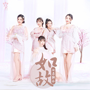
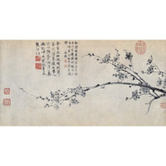
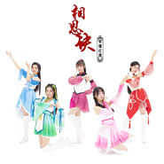
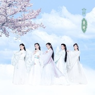

七朵组合
============================

|  |  |
| :--: | :-- |
| [ 七朵组合](https://i.xiami.com/sevensense) | **播放数**: 12648787 **粉丝数**: 10818 **评论数**: 311 **地区**: China 中国大陆 **风格**: 国语流行 Mandarin Pop, 中国风 China-Wave  |

## 档案

“七朵”是由黑钻文化与华音世纪于2012年联合推出的第一支主打中国风女子组合，团队成员均来自深圳大学。成员包括：一朵许祺曼、二朵喻筱博、三朵颜灵兰、四朵韦欢、五朵吴圆圆、六朵罗瑜敏、小朵刘木子。组合于2011年组建，2012年6月28正式出道，主打歌《咏春》。七名成员现均为深圳大学在校学生。 
许祺曼 ( 一朵) 
喻筱博 ( 二朵) 
颜灵兰 ( 三朵) 
韦欢 ( 四朵) 
吴圆圆 ( 五朵-队长) 
罗瑜敏 ( 六朵) 
刘木子 ( 小朵)

## 专辑

| 名称 | 语种 | 唱片公司 | 发行时间 | 专辑类别 | 专辑风格 |
| :--: | :-- | :-- | :-- | :-- | :-- |
| [ 如故](./albums/2104224057.md) | 国语 | 果禧互娱 | 2018年11月19日 | EP, 单曲 | 国语流行 Mandarin Pop |
| [ 古画会唱歌](./albums/2103950297.md) | 国语 | 华音世纪 | 2018年08月29日 | EP, 单曲 | 国语流行 Mandarin Pop |
| [ 江南夜](./albums/2103945878.md) | 国语 | 华音世纪 | 2018年08月24日 | EP, 单曲 | 国语流行 Mandarin Pop |
| [ 将军令](./albums/2103500137.md) | 国语 | 华音世纪 | 2018年01月19日 | EP, 单曲 |  |
| [ 相思诀•荣耀红颜](./albums/2103050577.md) | 国语 | 华音世纪 | 2017年12月24日 | EP, 单曲 | 国语流行 Mandarin Pop, 中国风 China-Wave |
| [ 归来](./albums/2102979764.md) | 国语 | 华音世纪 | 2017年12月23日 | EP, 单曲 | 国语流行 Mandarin Pop, 中国风 China-Wave |
| [ 醉花荫](./albums/2102925128.md) | 国语 | 华音世纪 | 2017年11月13日 | EP, 单曲 |  |
| [ 青蛇](./albums/2102849357.md) | 国语 | 华音世纪 | 2017年09月01日 | EP, 单曲 | 国语流行 Mandarin Pop |
| [ 七朵组合三周年合辑](./albums/1769027963.md) | 国语 | 华音世纪 | 2015年10月17日 | 合集, 杂锦 | 国语流行 Mandarin Pop, 中国风 China-Wave |
| [ 清新爱](./albums/2100177027.md) | 国语 | 黑钻文化 | 2015年08月10日 | EP, 单曲 | 国语流行 Mandarin Pop |
| [ 不一样的我](./albums/1735905027.md) | 国语 | 黑钻文化 | 2015年07月03日 | EP, 单曲 | 国语流行 Mandarin Pop, 中国风 China-Wave |
| [ 心慌慌](./albums/524761.md) | 国语 | 华音世纪 | 2012年08月27日 | EP, 单曲 |  |
| [ 七朵](./albums/497606.md) | 国语 | 华音世纪 | 2012年02月29日 | EP, 单曲 |  |

## 评论

|  |  |  |  |
| :-- | :-- | :-- | :-- |
|  [虾米用户](https://emumo.xiami.com/u/1166197) 用心感受好音乐 2021-01-03 10:34 赞(0) 踩(0) | 
反正七朵在微博的账号和B站的账号我已经取关了
 |
|  [虾米用户](https://emumo.xiami.com/u/1166197) 用心感受好音乐 2021-01-03 10:31 赞(0) 踩(0) | 
大朵许祺曼退团后主攻舞蹈，2018年结婚，2019年诞下一女&amp;ldquo;小法馨&amp;rdquo;；二朵喻筱博化身美妆博主，之后投身演艺圈成为演员忙着拍戏；三朵颜灵兰偶尔直播拍拍vlog；四朵韦欢初为人母，与黑钻老总何亮结婚后在2020年12月23日诞下一女&amp;ldquo;小糯米&amp;rdquo;成为宝妈；五朵吴圆圆发单曲录综艺排舞蹈忙的风生水起；六朵罗喻敏退团后成功转型励志女神，在深圳自主创业做起了社交电商，拥有两家公司；七朵(小朵)刘木子忙着录制综艺节目。
 |
|  [虾米用户](https://emumo.xiami.com/u/1166197) 用心感受好音乐 2021-01-03 10:31 赞(0) 踩(0) | 
2020年12月11日，真*二代七朵组合正式出道了，以前的老七朵组合再也不会回来了，官方也没有给出任何解散或退团之类的说法，不过显而易见的，只剩下五人的老一代七朵们各自都在忙自己的事，我们追随了8年的第一支中国风C-POP女子组合就这样结束了，我很感伤。   
 |
|  [虾米用户](https://emumo.xiami.com/u/1166197) 用心感受好音乐 2019-12-14 14:09 赞(1) 踩(0) | 
多久了还没有新专辑，在搞什么？《情剑》的MV呢？不要拿个旋转的专辑封面做成的MV糊弄我们！ 
 |
| ⇒ |  [虾米用户](https://emumo.xiami.com/u/436360153)  2020-08-30 20:08 赞(0) 踩(0) | 
估计没投资了
 |
|  [虾米用户](https://emumo.xiami.com/u/375681885)  2019-11-27 14:18 赞(0) 踩(0) | 
不炒作的才是经典，终将会成为永恒的热点。
 |
|  [虾米用户](https://emumo.xiami.com/u/142887104)  2019-09-22 20:29 赞(0) 踩(0) | 
从咏春的舞蹈入的坑，发现有个这么可爱的组合，爱到现在  
 |
|  [虾米用户](https://emumo.xiami.com/u/327708675)  2019-06-07 07:39 赞(0) 踩(0) | 
来晚来晚了
 |
|  [虾米用户](https://emumo.xiami.com/u/41894586)  2019-04-22 18:58 赞(0) 踩(0) | 
佛系组合，拿她们没办法了，谁叫我喜欢呢
 |
|  [虾米用户](https://emumo.xiami.com/u/343045831)  2018-12-13 18:06 赞(0) 踩(0) | 
哼，这次一定要好好的啊！仙女们。
 |
| ⇒ |  [虾米用户](https://emumo.xiami.com/u/492360) 失恋不是自杀的借口 继续... 2019-01-03 09:41 赞(0) 踩(0) | 
厉害了
 |
|  [虾米用户](https://emumo.xiami.com/u/351277153)  2018-12-07 17:22 赞(5) 踩(0) | 
昨晚看了国风美少年，等到木子上台，表演结束在后台发话的时候才知道有个组合叫七朵组合，然后说要坚持初心之类，感觉她是真的好怀念当初一起努力上台表演的时光，希望以后可以继续相聚重出江湖的感觉。就好像毕业之后出来社会怀念当初的样子。
 |
|  [虾米用户](https://emumo.xiami.com/u/401919117) 萝莉123 2018-11-19 19:26 赞(1) 踩(0) | 
为什么还不出专辑
 |
|  [虾米用户](https://emumo.xiami.com/u/1166197) 用心感受好音乐 2018-11-11 21:12 赞(1) 踩(0) | 
时光转眼六年过，一首咏春暖心窝，如今七朵变五朵，孰是孰非谁之错？     
 |
|  [虾米用户](https://emumo.xiami.com/u/49068787) 你问我全世界哪里最美 我... 2018-11-02 18:22 赞(1) 踩(0) | 
谁来给朵朵换个封面呀！！QAQ
 |
|  [虾米用户](https://emumo.xiami.com/u/281556566) 小钧-老吴-颖哥 2018-10-27 11:42 赞(0) 踩(0) | 
我的七朵……
 |
|  [虾米用户](https://emumo.xiami.com/u/125859918)   2018-07-28 15:44 赞(1) 踩(0) | 
2012年，畢業。第一次在音悅台看到了這個組合。六年過去了，無意見聽到了「詠春」。其實這些年一直在等你們的復出，直到「歸來」，淚濕襟～
 |
|  [虾米用户](https://emumo.xiami.com/u/48840026)  2018-06-30 08:11 赞(2) 踩(0) | 
内涵太少，古典就要有些书卷气，风尘位太足。
 |
|  [虾米用户](https://emumo.xiami.com/u/65316670) 即使渺小，你的努力也会让... 2018-06-28 21:53 赞(0) 踩(0) | 
犹记得初听还是六年级
 |
|  [虾米用户](https://emumo.xiami.com/u/357439442)  2018-06-26 06:46 赞(0) 踩(0) | 
当初听到七朵的歌，惊觉天人，然后听到她们解散的消息。。。为此还难受了很久。 
 |
|  [虾米用户](https://emumo.xiami.com/u/263137844)  2018-05-29 11:26 赞(1) 踩(0) | 
现在七朵歌的版权在谁哪里？都听不了了
 |
|  [虾米用户](https://emumo.xiami.com/u/309559302)  2018-05-19 23:26 赞(1) 踩(0) | 
看腻了韩国太妹可爱网红风格，也欣赏不来欧美狂野性感风格，这种七朵的恬淡唯美，真的是符合中国特色主义，让人感觉对，这就是中国风 
 |
| ⇒ |  [虾米用户](https://emumo.xiami.com/u/410697801) so  boring，s... 2018-12-21 13:18 赞(0) 踩(0) | 
屁个特色！如果有，那应该很盛行才对，为什么就出来一个七朵？
 |
|  [虾米用户](https://emumo.xiami.com/u/321562002)  2018-05-17 16:04 赞(1) 踩(0) | 
女子组合比较喜欢少女时代吧，七朵也还是个比较好的组合，但我好想不太喜欢这类型的组合啊
 |
| ⇒ |  [虾米用户](https://emumo.xiami.com/u/375681885)  2019-11-27 14:24 赞(0) 踩(0) | 
棒子学欧美主子走性风，中国人就要有自己的清风
 |
|  [虾米用户](https://emumo.xiami.com/u/345022351)  2018-05-16 21:34 赞(0) 踩(0) | 
分享艺人 七朵组合 艺人主页：<a href="https://www.xiami.com/artist/105930" target="_blank" rel="nofollow noreferrer noopener">https://www.xiami.com/artist/105930</a>（分享自@虾米音乐）
 |
|  [虾米用户](https://emumo.xiami.com/u/281914496) 魔笛一响，天下乱 2018-05-15 06:45 赞(0) 踩(0) | 
七朵七朵，改成七仙好点
 |
|  [虾米用户](https://emumo.xiami.com/u/328200978)  2018-05-02 00:49 赞(5) 踩(0) | 
很爱你们，你们和世俗的不一样，很真实，你们在4.28演唱会上边唱边哭，鞠了两次很久很久的躬，我一直记得，你们圆梦了，我们也圆梦了
 |
|  [虾米用户](https://emumo.xiami.com/u/354868986)  2018-03-20 20:58 赞(0) 踩(0) | 
表白我木子姐
 |
|  [虾米用户](https://emumo.xiami.com/u/9287926) 音乐是灵魂的完美表现 2018-03-15 23:38 赞(3) 踩(0) | 
七朵组合要成立七朵文化传播有限公司了，还要全国巡演！太棒了我朵，要
 |
|  [虾米用户](https://emumo.xiami.com/u/341164126)  2018-03-10 20:47 赞(0) 踩(0) | 
超好听！
 |
|  [虾米用户](https://emumo.xiami.com/u/238206120) 有花当折何须折，占有不如... 2018-03-03 22:22 赞(4) 踩(0) | 
很喜欢这个组合，可惜没红起来。
 |
|  [虾米用户](https://emumo.xiami.com/u/34077237) 不可食用 2018-02-26 11:54 赞(2) 踩(0) | 
回归啦！！！！超开心！！这次不许再离开了啊(๑&amp;bull;́&amp;omega;ก̀๑)
 |
|  [虾米用户](https://emumo.xiami.com/u/302038998) 想听听好听的歌 2018-02-25 10:11 赞(0) 踩(0) | 
哈哈
 |
|  [虾米用户](https://emumo.xiami.com/u/346739425)  2018-02-24 08:46 赞(1) 踩(0) | 
我负责点赞
 |
|  [虾米用户](https://emumo.xiami.com/u/348239031)  2018-02-12 12:42 赞(2) 踩(0) | 
好不容易出了个古风组合，真是的！  
 |
|  [虾米用户](https://emumo.xiami.com/u/760301) 慈。 2018-02-05 22:27 赞(0) 踩(0) | 
＂国浪⋯＂
 |
|  [虾米用户](https://emumo.xiami.com/u/763369)  2018-01-21 21:39 赞(0) 踩(0) | 
B站看直播中&amp;hellip;
 |
|  [虾米用户](https://emumo.xiami.com/u/9287926) 音乐是灵魂的完美表现 2018-01-20 23:44 赞(12) 踩(0) | 
七朵4月在深圳举办首场演唱会，一定不要错过，一定要为朵朵后援！七叶草爱朵一生。
 |
|  [虾米用户](https://emumo.xiami.com/u/345580781)   2018-01-20 13:18 赞(1) 踩(0) | 
大爱 
 |
|  [虾米用户](https://emumo.xiami.com/u/332245812) 再多看一眼吧。 2018-01-14 11:10 赞(2) 踩(0) | 
期明未或与你们相见 ，定约，不散，古风唯我所爱。
 |
|  [虾米用户](https://emumo.xiami.com/u/332245812) 再多看一眼吧。 2018-01-13 12:55 赞(0) 踩(0) | 
起。
 |
|  [虾米用户](https://emumo.xiami.com/u/7010600) 相知相爱莫相忘 2018-01-07 07:01 赞(2) 踩(0) | 
木子？暴走大事件？星座报道？
 |
|  [虾米用户](https://emumo.xiami.com/u/342359125) 永追于心七朵 2018-01-01 13:34 赞(3) 踩(0) | 
七朵回归。
 |
|  [虾米用户](https://emumo.xiami.com/u/225087918) 他强由他强，清风拂山岗。... 2017-12-30 21:57 赞(0) 踩(0) | 
加油加油(๑&amp;bull;̀ㅁ&amp;bull;́ฅ)
 |
|  [虾米用户](https://emumo.xiami.com/u/325056722) 一个人的夜晚孤单的梦 2017-12-28 00:54 赞(2) 踩(0) | 
期待你们的回归给我们带来一场饕鬄盛宴吧！
 |
|  [虾米用户](https://emumo.xiami.com/u/9287926) 音乐是灵魂的完美表现 2017-12-27 00:17 赞(4) 踩(0) | 
我们朵朵有一种不被世俗打扰的气质！支持她们！
 |
|  [虾米用户](https://emumo.xiami.com/u/335531384) 坚持自己，是最大的幸福。 2017-12-17 14:17 赞(1) 踩(0) | 
   
 |
|  [虾米用户](https://emumo.xiami.com/u/267088124) 我还没想好要写什么... 2017-12-04 23:56 赞(4) 踩(0) | 
木子女神女神女神 
 |
|  [虾米用户](https://emumo.xiami.com/u/323858255) 时光会打磨掉我的嚣张跋扈... 2017-12-02 00:18 赞(1) 踩(0) | 
嗷嗷嗷古风～
 |
|  [虾米用户](https://emumo.xiami.com/u/85597650)  2017-11-28 15:57 赞(4) 踩(0) | 
暴漫粉丝来顶木子
 |
|  [虾米用户](https://emumo.xiami.com/u/253204939) 这家伙很聪明什么也没留下... 2017-11-26 11:31 赞(1) 踩(0) | 
加油⛽️！为七朵打call！
 |
|  [虾米用户](https://emumo.xiami.com/u/282797386)  从前车马很慢，书信很慢... 2017-11-21 21:23 赞(2) 踩(0) | 
恭喜回归，永远爱你们
 |
|  [虾米用户](https://emumo.xiami.com/u/305918135)  2017-11-14 22:23 赞(43) 踩(0) | 
麻蛋，好好的组合让公司弄成这样，砸点钱不行吗！！
 |
|  [虾米用户](https://emumo.xiami.com/u/88112736) 微博 @虾米王笨笨 真爱... 2017-11-12 18:45 赞(4) 踩(0) | 
小孩子不要看暴漫
 |
|  [虾米用户](https://emumo.xiami.com/u/9287926) 音乐是灵魂的完美表现 2017-11-10 12:35 赞(11) 踩(0) | 
中国风在你们的歌声舞步中更特别～作为一名七叶草，我永远支持你们！
 |
|  [虾米用户](https://emumo.xiami.com/u/4152727) 心无挂碍 2017-11-07 21:33 赞(4) 踩(0) | 
很中国，很好听
 |
|  [虾米用户](https://emumo.xiami.com/u/187523599)  2017-11-07 07:13 赞(8) 踩(0) | 
初一喜欢的你们 现在高三了  一定要继续下去
 |
| ⇒ |  [虾米用户](https://emumo.xiami.com/u/9287926) 音乐是灵魂的完美表现 2017-11-15 23:20 赞(0) 踩(0) | 
我也是，从她们出道时就喜欢她们了
 |
|  [虾米用户](https://emumo.xiami.com/u/310884744)  2017-11-04 00:29 赞(1) 踩(0) | 
加油↖(^&amp;omega;^)↗
 |
|  [虾米用户](https://emumo.xiami.com/u/197622841)   2017-10-30 19:06 赞(1) 踩(0) | 
为七朵疯狂打电话
 |
|  [虾米用户](https://emumo.xiami.com/u/7564554)  2017-10-30 10:19 赞(2) 踩(0) | 
MV确实好差，可惜了好歌呢~希望以后每首歌都能是这么好听的中国风~看了练习室版的有种惊艳的感觉，加油啊
 |
|  [虾米用户](https://emumo.xiami.com/u/3574346)  2017-10-28 00:11 赞(0) 踩(0) | 
学谁不好要学韩国棒子，连封面都模仿。还是就听歌好了
 |
|  [虾米用户](https://emumo.xiami.com/u/46648483)  2017-10-27 23:59 赞(4) 踩(0) | 
Aero   是虾米管理员的小号，烂用职权封号。不给人发言自由。。。大家小心你们的用词。Aero   是虾米管理员的小号，烂用职权封号。不给人发言自由。。。大家小心你们的用词。
 |
|  [虾米用户](https://emumo.xiami.com/u/46212442) 暂无签名~ 2017-10-27 23:37 赞(1) 踩(0) | 
歌好听，舞跳的挺好看，喜欢她们这种中国风，加油哦！七朵组合！  
 |
|  [虾米用户](https://emumo.xiami.com/u/3257661) Semper Eadem 2017-10-27 23:21 赞(3) 踩(0) | 
看了咏春正式的MV。。完全没有排练室版本带给我的惊艳啊。。妹子声音不错，舞也跳得好，可惜这MV。。剧情挺二的，服装一般般，而且还闻到了山寨的味道。。T^T还是看排练室版本的好了。。
 |
|  [虾米用户](https://emumo.xiami.com/u/38154960)   2017-10-23 13:40 赞(3) 踩(0) | 
看了暴漫才知道木子女神是个歌手来着。。。。
 |
|  [虾米用户](https://emumo.xiami.com/u/326396752) 唯有岁月可回首，且以深情... 2017-10-21 19:34 赞(2) 踩(0) | 
加油加油，第一次喜欢一个女团
 |
|  [虾米用户](https://emumo.xiami.com/u/327988741)  2017-10-21 11:31 赞(0) 踩(0) | 
加油，期待！
 |
|  [虾米用户](https://emumo.xiami.com/u/298948030) 中國詩音樂電影创始人作曲... 2017-10-17 22:00 赞(0) 踩(0) | 
你好
 |
|  [虾米用户](https://emumo.xiami.com/u/217086019)  2017-10-16 22:30 赞(0) 踩(0) | 
加油
 |
|  [虾米用户](https://emumo.xiami.com/u/3803098) 隐约雷鸣·阴霾天空· 2017-10-13 22:43 赞(4) 踩(0) | 
回归是好事，既然做中国风就要向墨村学习，机会不会有第二次了。
 |
|  [虾米用户](https://emumo.xiami.com/u/244746935) 爱音乐 更爱机车 2017-10-13 19:38 赞(0) 踩(0) | 
我在暴走大事件听到的  
 |
|  [虾米用户](https://emumo.xiami.com/u/220596798) 国士无双 2017-10-12 06:26 赞(0) 踩(0) | 
木子加油，暴走大事件来的
 |
|  [虾米用户](https://emumo.xiami.com/u/328747119)  2017-10-06 15:01 赞(2) 踩(0) | 
喜欢喜欢  
 |
|  [虾米用户](https://emumo.xiami.com/u/11225224) 哔哩哔哩up主 绫人太太... 2017-10-04 00:44 赞(2) 踩(0) | 
中国女团只支持你们！！！小姐姐们加油！！！！
 |
|  [虾米用户](https://emumo.xiami.com/u/72937504) 为什么要不开心呢，夜宵添... 2017-10-03 01:52 赞(1) 踩(0) | 
小姐姐们加油(๑&amp;bull;̀ㅂ&amp;bull;́)و✧
 |
|  [虾米用户](https://emumo.xiami.com/u/92515436) 早晨的阳光如此的灿烂 2017-10-02 15:55 赞(0) 踩(0) | 
与众不同的七朵为七朵疯狂打call(≧&amp;omega;≦)
 |
|  [虾米用户](https://emumo.xiami.com/u/268649011)  2017-10-01 23:49 赞(1) 踩(0) | 
超爱小姐姐们的声音 
 |
|  [虾米用户](https://emumo.xiami.com/u/310896547) 就只是个热爱王者荣耀和动... 2017-09-30 10:37 赞(2) 踩(0) | 
为啥我要这么迟才认识到七朵【撞墙】，支持七朵，加油
 |
|  [虾米用户](https://emumo.xiami.com/u/41715737) 喜欢简直就是把人变蠢的魔... 2017-09-30 07:30 赞(25) 踩(0) | 
韩国女团舞是性感和可爱居多，比较西化，看多了其实有点腻，总觉得没什么文化内涵，但是我们的朵儿舞蹈，非常的含蓄优雅，非常的女人味儿，非常的大家闺秀，可以说是我泱泱大中华传承千年的文化底蕴的一个女性仪态方面的美丽体现~自信舒展，如此曼妙的舞蹈演绎，和优美的歌词旋律结合，太感动了~谢谢你们，美丽的姑娘们，愿你们能坚持下去，加油！
 |
|  [虾米用户](https://emumo.xiami.com/u/88112736) 微博 @虾米王笨笨 真爱... 2017-09-24 21:35 赞(0) 踩(0) | 
入木三分
 |
|  [虾米用户](https://emumo.xiami.com/u/317131583)  2017-09-17 16:02 赞(2) 踩(0) | 
加油，古风，爱你，爱你们，加油，我也加油↖(^&amp;omega;^)↗
 |
|  [虾米用户](https://emumo.xiami.com/u/146680572) 最美好的事，学习放手，抛... 2017-09-17 13:04 赞(0) 踩(0) | 
加油
 |
|  [虾米用户](https://emumo.xiami.com/u/13809920) better 2017-09-12 23:09 赞(1) 踩(0) | 
明晚，深大开学典礼见！
 |
|  [虾米用户](https://emumo.xiami.com/u/324295983)  2017-09-10 09:57 赞(0) 踩(0) | 
热烈祝贺
 |
|  [虾米用户](https://emumo.xiami.com/u/15811196) 辛苦时躲进音乐的世界，防... 2017-08-28 19:47 赞(3) 踩(0) | 
以中国风为特色真的很难得，不跟风，不模仿，喜欢
 |
|  [虾米用户](https://emumo.xiami.com/u/301370029)  2017-08-15 22:16 赞(1) 踩(0) | 
喜欢古风！希望能够一直保持下去！
 |
|  [虾米用户](https://emumo.xiami.com/u/262689157)  2017-08-09 22:53 赞(77) 踩(0) | 
为七朵回归重聚打call
 |
|  [虾米用户](https://emumo.xiami.com/u/38464881) 总有人正年轻着 2017-08-03 17:40 赞(1) 踩(0) | 
回来了！！！！ 
 |
|  [虾米用户](https://emumo.xiami.com/u/206203476) 本命曲·土耳其进行曲。 2017-07-31 00:24 赞(1) 踩(0) | 
路人表示很好听，心灵上的美妙感受。
 |
|  [虾米用户](https://emumo.xiami.com/u/309382568)  2017-07-30 23:47 赞(1) 踩(0) | 
加油，支持你们
 |
|  [虾米用户](https://emumo.xiami.com/u/315361344)  2017-07-28 14:54 赞(0) 踩(0) | 
喜欢，支持 
 |
|  [虾米用户](https://emumo.xiami.com/u/7019631)   2017-07-27 11:01 赞(0) 踩(0) | 
真的非常好听期待她们的新歌希望更多人支持她们！
 |
|  [虾米用户](https://emumo.xiami.com/u/50470135) 不要大会员，不养虾米，对... 2017-07-21 00:11 赞(0) 踩(0) | 
欢迎回来
 |
|  [虾米用户](https://emumo.xiami.com/u/310228117) 阿黎 2017-07-18 18:22 赞(0) 踩(0) | 
喜欢☆
 |
|  [虾米用户](https://emumo.xiami.com/u/2714996) https://www.... 2017-07-16 21:25 赞(0) 踩(0) | 
^_~持续关注B站的七朵官方账号：<a href="http://space.bilibili.com/43636152" target="_blank" rel="nofollow noreferrer noopener">http://space.bilibili.com/43636152</a>
 |
|  [虾米用户](https://emumo.xiami.com/u/9287926) 音乐是灵魂的完美表现 2017-07-09 13:23 赞(55) 踩(0) | 
一代七朵回归了五个，期待她们的新作品
 |
| ⇒ |  [虾米用户](https://emumo.xiami.com/u/9287926) 音乐是灵魂的完美表现 2017-12-19 23:41 赞(0) 踩(0) | 
还有三首歌即将发布，而且都有MV，期待一下吧
 |
| ⇒ |  [虾米用户](https://emumo.xiami.com/u/9287926) 音乐是灵魂的完美表现 2017-12-19 23:41 赞(0) 踩(0) | 
已经发布的是青蛇和醉花荫
 |
| ⇒ |  [虾米用户](https://emumo.xiami.com/u/9287926) 音乐是灵魂的完美表现 2018-01-20 23:45 赞(0) 踩(0) | 
<q><b>特特说：</b></q>
 |
|  [虾米用户](https://emumo.xiami.com/u/301274883) 永远支持七朵组合！！！ 2017-07-08 19:34 赞(3) 踩(0) | 
请继续支持7朵组合。
 |
|  [虾米用户](https://emumo.xiami.com/u/301274883) 永远支持七朵组合！！！ 2017-07-08 19:34 赞(47) 踩(0) | 
七朵回归了。
 |
| ⇒ |  [虾米用户](https://emumo.xiami.com/u/285366998) 欣欣 2017-08-30 23:25 赞(0) 踩(0) | 
加油吧，继续故风。你们很不错，虽然你们不出名，但是你们至少为你们的梦想努力过。
 |
|  [虾米用户](https://emumo.xiami.com/u/285710240) 无情乃大道 2017-06-24 15:48 赞(1) 踩(0) | 
↖(^&amp;omega;^)↗
 |
|  [虾米用户](https://emumo.xiami.com/u/285710240) 无情乃大道 2017-06-24 15:47 赞(1) 踩(0) | 
非常喜欢
 |
|  [虾米用户](https://emumo.xiami.com/u/15500068) 贯彻三个代表重要思想 2017-06-12 15:56 赞(2) 踩(0) | 
一开始还以为怎么那么土？？？？？还很雷直到我点开首页的几首歌那么好的组合为何解散，简直吊打现在各种组合
 |
| ⇒ |  [虾米用户](https://emumo.xiami.com/u/47532153) 同行十六年，不知木兰是女... 2017-09-15 23:15 赞(0) 踩(0) | 
现在回归了
 |
| ⇒ |  [虾米用户](https://emumo.xiami.com/u/120427980)   2017-12-24 09:29 赞(0) 踩(0) | 
有这想法的不止你一个、完全被当初的公司给毁了！
 |
|  [虾米用户](https://emumo.xiami.com/u/290765530)  2017-06-10 19:58 赞(6) 踩(0) | 
真的非常好听，最喜欢古风歌了，七朵花的歌让我的心灵平静，思绪迭起，永远喜欢你们，爱你们呦！！！！！！！！
 |
|  [虾米用户](https://emumo.xiami.com/u/290765530)  2017-06-10 19:54 赞(3) 踩(0) | 
七朵花，我喜欢你们，希望你们能坚持下去，我支持你们呦！    
 |
|  [虾米用户](https://emumo.xiami.com/u/5045815) 终有一天猫狗双全 2017-06-02 20:23 赞(1) 踩(0) | 
编舞厉害
 |
|  [虾米用户](https://emumo.xiami.com/u/238338319)  2017-05-28 17:04 赞(0) 踩(0) | 
看到你和
 |
|  [虾米用户](https://emumo.xiami.com/u/275676527)  2017-05-21 20:22 赞(0) 踩(0) | 
七朵很棒，为什么不呢
 |
|  [虾米用户](https://emumo.xiami.com/u/54172423)  2017-05-15 12:12 赞(1) 踩(0) | 
未遇见就不会眷恋。就算你们散了，也不会忘记，这是我唯一喜欢的组合。
 |
|  [虾米用户](https://emumo.xiami.com/u/9287926) 音乐是灵魂的完美表现 2017-05-06 13:18 赞(4) 踩(0) | 
中国风需要一批真正热爱它的人去传播，像七朵这样的中国风组合能组建已经非常不容易，能让我们见识到我们中国的传统文化，所以我很喜欢她们。
 |
|  [虾米用户](https://emumo.xiami.com/u/285689995)  2017-04-20 17:19 赞(2) 踩(0) | 
棒棒棒
 |
|  [虾米用户](https://emumo.xiami.com/u/287829236) 音乐很神级 2017-04-16 01:09 赞(2) 踩(0) | 
喜欢这个调调 
 |
|  [虾米用户](https://emumo.xiami.com/u/279607864)  2017-04-10 22:24 赞(0) 踩(0) | 
    
 |
|  [虾米用户](https://emumo.xiami.com/u/180428296)  2017-04-08 22:59 赞(1) 踩(0) | 
国内真的很需要像七朵这种组合，可惜了
 |
|  [虾米用户](https://emumo.xiami.com/u/286097651)  2017-04-05 13:50 赞(0) 踩(0) | 
中国风
 |
|  [虾米用户](https://emumo.xiami.com/u/16135450)  2017-04-01 22:15 赞(0) 踩(0) | 
9320
 |
|  [虾米用户](https://emumo.xiami.com/u/281914496) 魔笛一响，天下乱 2017-03-20 16:29 赞(0) 踩(0) | 
人如七仙子，歌赛黄莺声，如见见一面，魂飘九云天。___彭庆
 |
|  [虾米用户](https://emumo.xiami.com/u/43764010)  2017-03-17 19:21 赞(2) 踩(0) | 
为什么解散了呢
 |
|  [虾米用户](https://emumo.xiami.com/u/279251352)  2017-03-12 21:02 赞(1) 踩(0) | 
支持中国风组合，期待你们更多更好的作品！
 |
|  [虾米用户](https://emumo.xiami.com/u/279840073)  2017-03-12 16:26 赞(2) 踩(0) | 
七朵组合爱你
 |
|  [虾米用户](https://emumo.xiami.com/u/209257087) 普普通通是我的个性 2017-03-11 05:08 赞(3) 踩(0) | 
她们的歌我都很喜欢
 |
|  [虾米用户](https://emumo.xiami.com/u/209257087) 普普通通是我的个性 2017-03-11 05:08 赞(3) 踩(0) | 
好听
 |
|  [虾米用户](https://emumo.xiami.com/u/272650329)  2017-02-11 15:01 赞(2) 踩(0) | 
保持自己应有的风格，永远喜欢这个组合。
 |
|  [虾米用户](https://emumo.xiami.com/u/86443898) 问问你的佛渡尽苍生何不渡... 2017-01-01 19:40 赞(1) 踩(0) | 
炫舞？
 |
|  [虾米用户](https://emumo.xiami.com/u/3707217) spartan 2016-12-25 01:09 赞(2) 踩(0) | 
谁 搞的 齐刘海 造型师是吃…的吗？？？
 |
|  [虾米用户](https://emumo.xiami.com/u/242714456)  2016-12-14 22:47 赞(4) 踩(0) | 
作词 唱手都不错 为嘛她在的公司这么废物 竟然捧不起来
 |
|  [虾米用户](https://emumo.xiami.com/u/131703754)  2016-12-05 16:43 赞(0) 踩(0) | 
加油
 |
|  [虾米用户](https://emumo.xiami.com/u/96747784)  2016-12-04 18:20 赞(4) 踩(0) | 
心疼这个组合
 |
|  [虾米用户](https://emumo.xiami.com/u/243634021)  2016-11-22 18:33 赞(0) 踩(0) | 
迪高好
 |
|  [虾米用户](https://emumo.xiami.com/u/79871254)  2016-11-14 23:04 赞(2) 踩(0) | 
资金严重缺乏，明明很漂亮的妹子被造型一秒毁了。
 |
|  [虾米用户](https://emumo.xiami.com/u/79871254)  2016-11-14 23:00 赞(1) 踩(0) | 
很喜欢，有古典韵味的女孩子
 |
|  [虾米用户](https://emumo.xiami.com/u/243404516)  2016-11-06 11:59 赞(0) 踩(0) | 
有梦想就会有未来，我为正在奋斗青年点赞
 |
|  [虾米用户](https://emumo.xiami.com/u/243292140)  2016-11-05 22:19 赞(0) 踩(0) | 
好好跳舞
 |
|  [虾米用户](https://emumo.xiami.com/u/237287454)  2016-11-04 09:59 赞(0) 踩(0) | 
加油↖(^ω^)↗
 |
|  [虾米用户](https://emumo.xiami.com/u/52811661)  2016-08-23 23:02 赞(2) 踩(0) | 
加油
 |
|  [虾米用户](https://emumo.xiami.com/u/23443417) shit 2016-08-17 13:34 赞(1) 踩(0) | 
木子女神hhh
 |
|  [虾米用户](https://emumo.xiami.com/u/181675358) 12 2016-08-15 20:39 赞(1) 踩(0) | 
唱得好听 跳的不错 就是人长得不够美 可能这也是不被众人熟知的原因吧 不过挺喜欢她们的 
 |
|  [虾米用户](https://emumo.xiami.com/u/208624374) 萌凯源和沈氏夫夫的渺小一... 2016-08-07 21:11 赞(1) 踩(0) | 
明明很好，干嘛解散
 |
|  [虾米用户](https://emumo.xiami.com/u/148321014) 妈的智障。 2016-08-03 19:04 赞(2) 踩(0) | 
喜欢木子
 |
| ⇒ |  [虾米用户](https://emumo.xiami.com/u/9480638) 我还没想好要写什么... 2016-08-09 18:50 赞(0) 踩(0) | 
木子？暴走大事件的木子？
 |
| ⇒ |  [虾米用户](https://emumo.xiami.com/u/205968618)   2016-08-09 22:50 赞(0) 踩(0) | 
<q><b>EliasVM说：</b></q>
 |
| ⇒ |  [虾米用户](https://emumo.xiami.com/u/267495495)  2017-01-25 16:18 赞(0) 踩(0) | 
<q><b>EliasVM说：</b></q>
 |
|  [虾米用户](https://emumo.xiami.com/u/9345581) Trekkie 2016-07-14 16:48 赞(2) 踩(0) | 
只喜欢一代七朵
 |
|  [虾米用户](https://emumo.xiami.com/u/54743688) 我还没想好要写什么... 2016-07-10 11:34 赞(3) 踩(0) | 
还是喜欢之前的七朵，跳过她们的舞，记得我跳的是韦欢的
 |
|  [虾米用户](https://emumo.xiami.com/u/198143831)  2016-07-06 22:11 赞(1) 踩(0) | 
七朵组合，爱你们呦。   最喜欢中国风
 |
|  [虾米用户](https://emumo.xiami.com/u/198143831)  2016-07-06 22:09 赞(3) 踩(0) | 
最美的中国风，七朵组合  加油 
 |
|  [虾米用户](https://emumo.xiami.com/u/197373627)  2016-07-04 19:45 赞(2) 踩(0) | 
七朵组合还在吗？
 |
|  [虾米用户](https://emumo.xiami.com/u/197373627)  2016-07-04 19:45 赞(1) 踩(0) | 
加油
 |
|  [虾米用户](https://emumo.xiami.com/u/197373627)  2016-07-04 19:39 赞(1) 踩(0) | 
最爱七朵组合love
 |
|  [虾米用户](https://emumo.xiami.com/u/197373627)  2016-07-04 19:39 赞(1) 踩(0) | 
最爱七朵组合
 |
|  [虾米用户](https://emumo.xiami.com/u/187309879)  2016-06-21 22:43 赞(1) 踩(0) | 
棒棒哒
 |
|  [虾米用户](https://emumo.xiami.com/u/115716828)  2016-06-12 12:14 赞(4) 踩(0) | 
刘木子，已任暴走漫画签约艺人
 |
|  [虾米用户](https://emumo.xiami.com/u/86583872)  2016-05-29 17:36 赞(4) 踩(0) | 
古风和流行的完美结合，真心不错  
 |
|  [虾米用户](https://emumo.xiami.com/u/32085761) 俊琪小号 2016-05-27 21:37 赞(1) 踩(0) | 
《咏春》的MV看到1分30秒再也看不下去了~有种故弄玄虚、华而不实的感觉
 |
| ⇒ |  [虾米用户](https://emumo.xiami.com/u/41715737) 喜欢简直就是把人变蠢的魔... 2016-06-29 07:23 赞(0) 踩(0) | 
哈哈所以说 七朵的特色就是 练习室版本＞MV
 |
| ⇒ |  [虾米用户](https://emumo.xiami.com/u/9345581) Trekkie 2016-07-14 16:49 赞(0) 踩(0) | 
练习室秒杀MV系列，七朵独有
 |
|  [虾米用户](https://emumo.xiami.com/u/180751400)  2016-05-27 14:52 赞(0) 踩(0) | 
2B
 |
|  [虾米用户](https://emumo.xiami.com/u/180751400)  2016-05-27 14:51 赞(0) 踩(0) | 
一群2B
 |
|  [虾米用户](https://emumo.xiami.com/u/180751400)  2016-05-27 14:51 赞(0) 踩(0) | 
不怎的
 |
|  [虾米用户](https://emumo.xiami.com/u/55758494)  2016-05-14 19:44 赞(3) 踩(0) | 
加油哦!
 |
| ⇒ |  [虾米用户](https://emumo.xiami.com/u/69445324)  2016-05-20 09:55 赞(0) 踩(0) | 
散了
 |
|  [虾米用户](https://emumo.xiami.com/u/55758494)  2016-05-14 19:43 赞(1) 踩(0) | 
 
 |
|  [虾米用户](https://emumo.xiami.com/u/13496009)   2016-04-27 12:42 赞(3) 踩(0) | 
脑残师兄！哈哈哈
 |
|  [虾米用户](https://emumo.xiami.com/u/146534744)  2016-04-21 20:29 赞(3) 踩(0) | 
加油加油！我们学校跳舞用的就是七朵组合的歌
 |
|  [虾米用户](https://emumo.xiami.com/u/9620713) 从来作春酒，未省不经年。 2016-04-05 22:25 赞(1) 踩(0) | 
蛙子无处不在(〜￣△￣)〜
 |
|  [虾米用户](https://emumo.xiami.com/u/9620713) 从来作春酒，未省不经年。 2016-04-05 22:22 赞(1) 踩(0) | 
加油！！！
 |
|  [虾米用户](https://emumo.xiami.com/u/93226796) 只见雪色映衣袂，抚琴月显... 2016-04-03 09:50 赞(2) 踩(0) | 
最爱七朵组合
 |
|  [虾米用户](https://emumo.xiami.com/u/127756486)  2016-03-30 22:51 赞(0) 踩(0) | 
加油
 |
|  [虾米用户](https://emumo.xiami.com/u/126378940)  2016-03-23 22:04 赞(3) 踩(0) | 
朵朵不再 七叶永爱
 |
|  [虾米用户](https://emumo.xiami.com/u/20694445) 微博@月下雪临，主要发自... 2016-02-18 15:53 赞(3) 踩(0) | 
可惜了
 |
|  [虾米用户](https://emumo.xiami.com/u/101856220)  2016-02-16 11:07 赞(1) 踩(0) | 
中国风不错，
 |
|  [虾米用户](https://emumo.xiami.com/u/90941176)  2016-01-17 20:25 赞(3) 踩(0) | 
喜欢喜欢喜欢好好听，尤其是落花情
 |
|  [虾米用户](https://emumo.xiami.com/u/72959706)  2016-01-11 19:44 赞(0) 踩(0) | 
哦
 |
|  [虾米用户](https://emumo.xiami.com/u/41715737) 喜欢简直就是把人变蠢的魔... 2016-01-09 09:07 赞(4) 踩(0) | 
永远练习室版本＞MV   一代七朵＞二代七朵
 |
|  [虾米用户](https://emumo.xiami.com/u/41715737) 喜欢简直就是把人变蠢的魔... 2016-01-04 23:14 赞(2) 踩(0) | 
脑残师兄！！木子！！！！！
 |
|  [虾米用户](https://emumo.xiami.com/u/35926045)   2015-12-10 17:27 赞(0) 踩(0) | 
或者在哪次稍微排场大一点的活动出一个好一些的饭拍or正规拍摄，买点营销号or段子手微博上狂转转都能红起来，对了你们妹纸的服装可以换换吗，宣传团队造型团队是要逆天吗丑哭了
 |
|  [虾米用户](https://emumo.xiami.com/u/35926045)   2015-12-10 17:23 赞(2) 踩(0) | 
好好宣传，二代的好好练舞，mv团队换掉，词曲画风不要太浮夸了，上上综艺节目发发视频，可以先把一个组员打响了（主唱或者门面会比较好红一点），好好搞这么好的妹子们不会黄的
 |
|  [虾米用户](https://emumo.xiami.com/u/54502918)  2015-11-26 09:51 赞(0) 踩(0) | 
期待她们的作品 期待好的未来
 |
|  [虾米用户](https://emumo.xiami.com/u/67858304)  2015-11-12 13:16 赞(3) 踩(0) | 
我喜欢，真的很好听，融合不同风格，古典优雅我又不失现代流行。
 |
|  [虾米用户](https://emumo.xiami.com/u/74391570) 你若安好，那还得了 2015-10-24 13:43 赞(1) 踩(0) | 
可惜了
 |
|  [虾米用户](https://emumo.xiami.com/u/52445241) 夜光何德，死则又育？ 2015-09-28 20:45 赞(3) 踩(0) | 
不止喜欢你的组合还喜欢你的歌，特别是喜欢落花情。   
 |
|  [虾米用户](https://emumo.xiami.com/u/52445241) 夜光何德，死则又育？ 2015-09-28 20:42 赞(0) 踩(0) | 
我喜欢你的组合  
 |
|  [虾米用户](https://emumo.xiami.com/u/10506340) 春风归故里，一别两路人。 2015-09-19 14:23 赞(0) 踩(0) | 
七腿组合
 |
|  [虾米用户](https://emumo.xiami.com/u/7650054) 无欲则刚 2015-09-06 20:04 赞(0) 踩(0) | 
感觉这种组合受众会很小。
 |
|  [虾米用户](https://emumo.xiami.com/u/7650054) 无欲则刚 2015-09-06 20:04 赞(0) 踩(0) | 
感觉这种组合受众会很小。
 |
|  [虾米用户](https://emumo.xiami.com/u/55296842)  2015-08-28 00:06 赞(1) 踩(0) | 
落花情真好听
 |
|  [虾米用户](https://emumo.xiami.com/u/55296842)  2015-08-28 00:06 赞(1) 踩(0) | 
落花情真好听
 |
|  [虾米用户](https://emumo.xiami.com/u/55296842)  2015-08-28 00:04 赞(0) 踩(0) | 
唱歌真好听。
 |
|  [虾米用户](https://emumo.xiami.com/u/3997808) beethoven is... 2015-08-15 18:40 赞(1) 踩(0) | 
七朵奇葩
 |
|  [虾米用户](https://emumo.xiami.com/u/52672380)  2015-08-10 16:41 赞(0) 踩(0) | 
加油！七朵最棒！
 |
|  [虾米用户](https://emumo.xiami.com/u/6491765) 我只是个门外汉。 2015-07-01 13:21 赞(1) 踩(0) | 
好怀念《咏春》的时候啊！感觉不LOW又流行的中国风
 |
|  [虾米用户](https://emumo.xiami.com/u/50747650)  2015-06-27 19:40 赞(0) 踩(0) | 
可惜了，，，
 |
|  [虾米用户](https://emumo.xiami.com/u/7562991)  2015-06-07 09:48 赞(0) 踩(0) | 
七朵的幕后制作团队是不是韩国的？？有知道内情的吗？？
 |
|  [虾米用户](https://emumo.xiami.com/u/43978207) 在音乐中成长 2015-05-30 17:30 赞(1) 踩(0) | 
很清新的组合，深受我们学校的学生喜欢，《咏春》和《落花情》都曾经作为班级舞蹈在学校文艺汇演节目演出。
 |
| ⇒ |  [虾米用户](https://emumo.xiami.com/u/47339769)  2015-12-02 20:55 赞(0) 踩(0) | 
对，每次学院晚会，都会用她们的曲子和编舞，可惜了，公司不给力。
 |
|  [虾米用户](https://emumo.xiami.com/u/47555276) 己欲立而立人，己欲达而达... 2015-05-07 21:05 赞(0) 踩(0) | 
加油啊！振作起来！
 |
|  [虾米用户](https://emumo.xiami.com/u/2714996) https://www.... 2015-04-06 12:44 赞(0) 踩(0) | 
ლ(╹◡╹ლ) <a href="http://www.yinyuetai.com/video/489221" target="_blank" rel="nofollow noreferrer noopener">http://www.yinyuetai.com/video/489221</a>
 |
|  [虾米用户](https://emumo.xiami.com/u/46814727) 企鹅1751884293 2015-03-30 23:06 赞(0) 踩(0) | 
1-不能老是以中国风为主，限制了本身的发展。2-加多宣传，现团员2人，可以考虑更换组名，搞一个唱跳组合。3-一定不要限制组员，加大宣传。我看好你们！
 |
|  [虾米用户](https://emumo.xiami.com/u/46814727) 企鹅1751884293 2015-03-30 23:00 赞(0) 踩(0) | 
Yeah Rap
 |
|  [虾米用户](https://emumo.xiami.com/u/36060769)  2015-03-17 20:20 赞(1) 踩(0) | 
大腿玉生烟
 |
|  [虾米用户](https://emumo.xiami.com/u/11180438) 虾米的会员到底能干嘛。。... 2015-03-10 14:16 赞(1) 踩(0) | 
现在还剩下几朵？
 |
|  [虾米用户](https://emumo.xiami.com/u/1949345) Skong(司空) 2015-02-22 18:47 赞(27) 踩(0) | 
既然都认证了，说明组合的每个成员以及公司的制作人都会看到虾米的评论，一定要好好考虑热门评论的建议，坚持自我，不要向市场妥协，妥协虽然迎合了世俗的口味，却也丢了逼格（妥协的反面的例子：王蓉）。既然你们是以组合的形式出来，那么你们的目标受众就是青少年群体，现在青少年群体的品味越来越高，坚持中国风或者古风，绝对没问题。千万不要学XX传奇一样迎合中老年口味，那样就完了。记住：你越妥协越LOW，越不妥协越有市场。
 |
| ⇒ |  [虾米用户](https://emumo.xiami.com/u/353123637)  2019-03-22 19:19 赞(0) 踩(0) | 
金属区能见你，这里也能见，缘分
 |
|  [虾米用户](https://emumo.xiami.com/u/6276015) 我极少听流行歌曲 2015-02-09 22:08 赞(2) 踩(0) | 
额，我居然听出了S.H.E的感觉……由衷喜欢体现国风的歌曲，加油！！！
 |
|  [虾米用户](https://emumo.xiami.com/u/1030263) 躲个猫猫笑破肚 2015-01-24 10:44 赞(0) 踩(0) | 
加油！
 |
|  [虾米用户](https://emumo.xiami.com/u/2319400)  2015-01-13 13:56 赞(0) 踩(0) | 
唱的跳的都挺不错的，就差有个好包装了。
 |
|  [虾米用户](https://emumo.xiami.com/u/9758921)  2015-01-11 15:39 赞(0) 踩(0) | 
好稚嫩。
 |
|  [虾米用户](https://emumo.xiami.com/u/43917373)   2014-12-02 11:03 赞(0) 踩(0) | 
练习室版永远比正式版好看的组合。。。
 |
|  [虾米用户](https://emumo.xiami.com/u/28017326)  2014-11-20 18:35 赞(1) 踩(0) | 
曲子真本质，可惜了唉
 |
|  [虾米用户](https://emumo.xiami.com/u/3905120)  2014-11-17 22:35 赞(0) 踩(0) | 
我的天，终于是走歪了QAQ，这新歌，我已经欣赏不聊了Orz。。。还是默默舔《咏春》吧QAQ
 |
|  [虾米用户](https://emumo.xiami.com/u/43412712) 暂无签名~ 2014-11-09 22:08 赞(0) 踩(0) | 
人美歌美，我给点32个赞！
 |
|  [虾米用户](https://emumo.xiami.com/u/13866768)   2014-10-15 18:12 赞(0) 踩(0) | 
哎，……
 |
|  [虾米用户](https://emumo.xiami.com/u/11976118) 星沉海底當窗見，雨過河源... 2014-10-12 16:08 赞(0) 踩(0) | 
哎，除了叹息想不出该说什么QAQ
 |
|  [虾米用户](https://emumo.xiami.com/u/1066078)  2014-09-26 14:19 赞(0) 踩(0) | 
七朵传承中国风
 |
|  [虾米用户](https://emumo.xiami.com/u/8004530)  2014-09-25 03:49 赞(0) 踩(0) | 
可惜啦······七朵·······
 |
|  [虾米用户](https://emumo.xiami.com/u/22398230)  2014-09-14 13:16 赞(0) 踩(0) | 
很爱中国风！可惜了，七朵…
 |
|  [虾米用户](https://emumo.xiami.com/u/26013853) 没有如果，如果你是我的！ 2014-08-08 15:34 赞(1) 踩(0) | 
美哭了。中国风，喜欢，还有她们的舞蹈。
 |
|  [虾米用户](https://emumo.xiami.com/u/7290390) *´∀`* 2014-07-19 17:07 赞(1) 踩(0) | 
头像……心疼最右233
 |
|  [虾米用户](https://emumo.xiami.com/u/38696975)  2014-07-04 13:38 赞(0) 踩(0) | 
朵朵最棒&amp;gt;33
 |
|  [虾米用户](https://emumo.xiami.com/u/4978595)  2014-06-23 13:28 赞(0) 踩(0) | 
当年看到咏春先放出来的练习室版本时觉得超赞！还都是校友！队长还是老乡！真心希望能火起来！歌真的不错，舞也跳得非常非常好看！但听说现在走了五个。。。可惜了呀~~~
 |
|  [虾米用户](https://emumo.xiami.com/u/7250735)  2014-06-07 10:07 赞(0) 踩(0) | 
可惜啊  现在已经是物是人非了 唉 七朵变成二朵了
 |
|  [虾米用户](https://emumo.xiami.com/u/11463043) 我的心里，永远住着一只小... 2014-06-02 21:26 赞(1) 踩(0) | 
今天才发现这个中国风组合
 |
|  [虾米用户](https://emumo.xiami.com/u/5158791) 静听星空物语，淡看... 2014-06-01 00:05 赞(0) 踩(0) | 
唉，要是能一直走下去就好了，可惜可惜......
 |
|  [虾米用户](https://emumo.xiami.com/u/9202305)  2014-05-31 10:42 赞(0) 踩(0) | 
2个多月没人留言了，这一次留言已经物是人非了，七朵组合已成过去唉。还剩两朵了o(╯□╰)o
 |
|  [虾米用户](https://emumo.xiami.com/u/34052335) 乘月待晓 2014-03-19 11:14 赞(1) 踩(0) | 
现代鼓点节奏与悠扬古调的完美结合，词曲婉转，娓娓道来~
 |
|  [虾米用户](https://emumo.xiami.com/u/9393027)  2014-02-10 02:04 赞(1) 踩(0) | 
喜欢这个曲风~~~
 |
|  [虾米用户](https://emumo.xiami.com/u/3766788)  2014-01-08 14:39 赞(0) 踩(0) | 
这么本质
 |
|  [虾米用户](https://emumo.xiami.com/u/3483407)  2014-01-07 18:23 赞(1) 踩(0) | 
曲风喜欢，又有自己的风格，大赞~~
 |
|  [虾米用户](https://emumo.xiami.com/u/30553677) 思念你双手的温柔 2013-12-26 14:17 赞(1) 踩(0) | 
很喜欢这个味道
 |
|  [虾米用户](https://emumo.xiami.com/u/6652575) mbz2006 2013-12-21 19:44 赞(1) 踩(0) | 
ok
 |
|  [虾米用户](https://emumo.xiami.com/u/1037395) 我什么都看不见 2013-12-21 14:57 赞(0) 踩(0) | 
但愿七朵能保持住那一份芬香  莫让这俗世尘气淹没
 |
|  [虾米用户](https://emumo.xiami.com/u/1646664) 古耐, 猫宁. 2013-12-12 15:50 赞(1) 踩(0) | 
第一次听到落花情，还以为是SHE的歌....
 |
|  [虾米用户](https://emumo.xiami.com/u/20487547) 懒癌晚期 2013-11-25 15:20 赞(0) 踩(0) | 
虽说是第一支主打中国风女子组合，但是却越来越让人失望。新出单曲Honey，是改变风格了么，偏离主风格太遥远了，七朵的造型师是韩国人么，哪有一丝中国风的感觉。原本对她们抱有很大希望，现在让我们这些人这么忍受。如果真的偏离了中国风，就不要再打着中国风的标签。我所爱的七朵，所爱的中国风绝不是这样的。
 |
|  [虾米用户](https://emumo.xiami.com/u/13902825) 唇语也绽放似昙花一现 2013-11-16 21:05 赞(1) 踩(0) | 
模式太韩国了……曲风还算很古典很美的，但是这路子吧，走多了大家会腻，转型的话，风格一下就没有了，看看未来的路怎么走吧
 |
|  [虾米用户](https://emumo.xiami.com/u/27514324)  2013-11-14 15:29 赞(0) 踩(0) | 
第一次来。。。。。给个面子哦。。。。。。
 |
|  [虾米用户](https://emumo.xiami.com/u/1919978) 暂无签名~ 2013-11-12 18:18 赞(0) 踩(0) | 
she tamen yi lian
 |
|  [虾米用户](https://emumo.xiami.com/u/22917798) 幸运陪伴着你 2013-11-02 15:43 赞(0) 踩(0) | 
七朵组合
 |
|  [虾米用户](https://emumo.xiami.com/u/7867758)  2013-10-29 08:34 赞(1) 踩(0) | 
不是说是&amp;#039;悲欢离合“4首么，赶快出新单，期待！
 |
|  [虾米用户](https://emumo.xiami.com/u/19588039) z 2013-10-20 09:57 赞(0) 踩(0) | 
还可以不过仍有进步的空间,继续努力吧~
 |
|  [虾米用户](https://emumo.xiami.com/u/9028152)  2013-10-13 23:12 赞(0) 踩(0) | 
七朵古典
 |
|  [虾米用户](https://emumo.xiami.com/u/10018340) perfect 2013-10-02 21:54 赞(1) 踩(0) | 
喜欢他们唱歌的风格
 |
|  [虾米用户](https://emumo.xiami.com/u/6689411)  2013-09-11 10:50 赞(2) 踩(0) | 
心慌慌很有俗大街韩流风……玉生烟不错
 |
|  [虾米用户](https://emumo.xiami.com/u/20614898) 已成年 2013-08-30 11:32 赞(0) 踩(0) | 
或许七月进入的时候是因为爱中国风，后来是因为她们的努力执着善良，亦或是七叶草和蔷薇的温暖。但是一年多过去，我想已经不需要理由了
 |
|  [虾米用户](https://emumo.xiami.com/u/5043018)  2013-08-24 14:45 赞(0) 踩(0) | 
支持中国风=v=!!!~
 |
|  [虾米用户](https://emumo.xiami.com/u/3557485)   2013-08-19 17:01 赞(0) 踩(0) | 
相当靠谱有潜力有前途的组合啊。咏春中迷上了美腿和扇子！！
 |
|  [虾米用户](https://emumo.xiami.com/u/2543291) 氪星girl//银河系漫... 2013-08-16 14:31 赞(1) 踩(0) | 
歌不错，MV什么的，能学出个韩国小清新也好啊..多多加油吧
 |
|  [虾米用户](https://emumo.xiami.com/u/2376208)  2013-08-12 11:59 赞(1) 踩(0) | 
长得好看 90后
 |
|  [虾米用户](https://emumo.xiami.com/u/2376208)  2013-08-12 11:59 赞(0) 踩(0) | 
长得好看 90后
 |
|  [虾米用户](https://emumo.xiami.com/u/3593362) 我是重口味界里最小清新的 2013-08-09 17:21 赞(1) 踩(0) | 
歌与舞都不错，很有潜力，只是你们的包装实在是……加油吧。
 |
|  [虾米用户](https://emumo.xiami.com/u/380249) 没煮过苍蝇的汤我不喝 2013-07-17 22:51 赞(213) 踩(0) | 
内地能出个像样的组合不容易 中国风就好好中国风 但愿最后不要整的四不像才好 能有个主打中国风的组合 还是很让人期待的
 |
| ⇒ |  [虾米用户](https://emumo.xiami.com/u/1911134)  2015-03-24 18:32 赞(0) 踩(0) | 
期望破灭了
 |
| ⇒ |  [虾米用户](https://emumo.xiami.com/u/380249) 没煮过苍蝇的汤我不喝 2015-03-25 02:12 赞(0) 踩(0) | 
<q><b>gra说：</b></q>
 |
| ⇒ |  [虾米用户](https://emumo.xiami.com/u/9287926) 音乐是灵魂的完美表现 2018-01-12 23:52 赞(0) 踩(0) | 
<q><b>gra说：</b></q>
 |
| ⇒ |  [虾米用户](https://emumo.xiami.com/u/281556566) 小钧-老吴-颖哥 2018-10-27 11:43 赞(0) 踩(0) | 
看见你这条评论是五年前的顿时类目，那时候的愿望还是落空了……
 |
|  [虾米用户](https://emumo.xiami.com/u/2691052) 且看那青山綠水別來無恙。 2013-07-14 20:02 赞(0) 踩(0) | 
喜欢练习室版mv
 |
|  [虾米用户](https://emumo.xiami.com/u/12965586) firefly 2013-07-07 19:15 赞(0) 踩(0) | 
舞好歌也好，国内MV终于有观赏性了。
 |
|  [虾米用户](https://emumo.xiami.com/u/10681540) ... 2013-06-29 09:26 赞(0) 踩(0) | 
mv太丑了。。。找个好导演啊。。。
 |
|  [虾米用户](https://emumo.xiami.com/u/491510) 诗 Ƹ̵̡Ӝ̵̨̄Ʒ 酒 2013-06-22 09:45 赞(70) 踩(0) | 
由她们的舞喜欢上。虽然稚嫩，但很有希望~！
 |
|  [虾米用户](https://emumo.xiami.com/u/6705873) 吐翔而亡 =皿 = 2013-06-21 22:56 赞(1) 踩(0) | 
看過MV  不敢恭維
 |
|  [虾米用户](https://emumo.xiami.com/u/3425563) X X 2013-06-21 20:40 赞(0) 踩(0) | 
看到叫七朵七个人会不会就1-7朵。。还真有点土。。。听下歌先。。
 |
| ⇒ |  [虾米用户](https://emumo.xiami.com/u/6705873) 吐翔而亡 =皿 = 2013-06-21 22:57 赞(0) 踩(0) | 
就是1到7...
 |
|  [虾米用户](https://emumo.xiami.com/u/7494366)  2013-06-08 13:18 赞(1) 踩(0) | 
怎么都是单曲？敢不敢出张全长专辑？
 |
| ⇒ |  [虾米用户](https://emumo.xiami.com/u/11756444)  2013-06-27 14:10 赞(0) 踩(0) | 
专辑是明年的事了= =
 |
|  [虾米用户](https://emumo.xiami.com/u/5014997) 吃货特征已经越来越明显了 2013-06-01 01:15 赞(2) 踩(0) | 
跳得太棒了！！舞编的好，曲子写的也好！
 |
|  [虾米用户](https://emumo.xiami.com/u/7562991)  2013-05-28 01:37 赞(1) 踩(0) | 
国色天香。
 |
| ⇒ |  [虾米用户](https://emumo.xiami.com/u/4808069) アキラ 2013-05-31 10:04 赞(0) 踩(0) | 
哈哈, 将军许久不见, 别来无恙?
 |
| ⇒ |  [虾米用户](https://emumo.xiami.com/u/7562991)  2013-05-31 15:08 赞(0) 踩(0) | 
<q><b>Akira说：</b></q>
 |
| ⇒ |  [虾米用户](https://emumo.xiami.com/u/3593362) 我是重口味界里最小清新的 2013-08-09 17:25 赞(0) 踩(0) | 
哎呀，还真是好久不见。
 |
| ⇒ |  [虾米用户](https://emumo.xiami.com/u/7562991)  2013-08-09 22:04 赞(0) 踩(0) | 
<q><b>拾萬個不為甚麽说：</b></q>
 |
|  [虾米用户](https://emumo.xiami.com/u/9202305)  2013-05-19 14:33 赞(0) 踩(0) | 
为啥虾米上面还没有玉生烟呢“？？？？
 |
| ⇒ |  [虾米用户](https://emumo.xiami.com/u/7562991)  2013-05-27 16:08 赞(0) 踩(0) | 
有啦！！
 |
| ⇒ |  [虾米用户](https://emumo.xiami.com/u/9202305)  2013-05-31 15:24 赞(0) 踩(0) | 
<q><b>将军，说什么王权富贵？说：</b></q>
 |
| ⇒ |  [虾米用户](https://emumo.xiami.com/u/7562991)  2013-05-31 18:11 赞(0) 踩(0) | 
<q><b>hpp说：</b></q>
 |
|  [虾米用户](https://emumo.xiami.com/u/5860852)  2013-05-16 12:33 赞(1) 踩(0) | 
我看到祖国美好的未来
 |
|  [虾米用户](https://emumo.xiami.com/u/4828269) 还在 2013-05-14 19:14 赞(1) 踩(0) | 
赞！
 |
|  [虾米用户](https://emumo.xiami.com/u/14828568)  2013-05-13 10:45 赞(0) 踩(0) | 
中国特色
 |
|  [虾米用户](https://emumo.xiami.com/u/2034583) 喜欢涂鸦 富于幻想 想对 2013-04-30 14:18 赞(0) 踩(0) | 
舞蹈歌曲中国风太赞！
 |
|  [虾米用户](https://emumo.xiami.com/u/239711)   2013-04-28 20:29 赞(0) 踩(0) | 
真不错 居然今天才知道
 |
|  [虾米用户](https://emumo.xiami.com/u/11831488)  2013-03-30 19:32 赞(1) 踩(0) | 
喜欢她们行云流水的感觉
 |
|  [虾米用户](https://emumo.xiami.com/u/7382461)  2013-02-12 14:43 赞(0) 踩(0) | 
我来说两句，坚持啊，一定要保持住啊！
 |
|  [虾米用户](https://emumo.xiami.com/u/12777529)  2013-01-30 10:15 赞(0) 踩(0) | 
p
 |
|  [虾米用户](https://emumo.xiami.com/u/12687641)  2013-01-25 14:32 赞(0) 踩(0) | 
女子舞动的柔美
 |
|  [虾米用户](https://emumo.xiami.com/u/6982156)  2013-01-21 21:31 赞(0) 踩(0) | 
<a href="http://www.kugou.com/webkugouplayer/?isopen=1&amp;amp;chl=imusic" target="_blank" rel="nofollow noreferrer noopener">http://www.kugou.com/webkugouplayer/?isopen=1&amp;amp;chl=imusic</a> 咏春 贺岁版 七朵组合​
 |
|  [虾米用户](https://emumo.xiami.com/u/6982156)  2013-01-21 21:29 赞(0) 踩(0) | 
爱你无理由
 |
|  [虾米用户](https://emumo.xiami.com/u/7494366)  2013-01-19 15:37 赞(0) 踩(0) | 
几个妹只舞蹈不错啊，唱功有待加强
 |
|  [虾米用户](https://emumo.xiami.com/u/5656730) 跟音乐过简单的日子 2012-12-22 22:22 赞(1) 踩(0) | 
一首好作品，一个好舞蹈，MV却被排练室的版本打败了，哎~太可怜了！这直接超乎正常情况了！
 |
|  [虾米用户](https://emumo.xiami.com/u/9986658)  2012-11-28 22:31 赞(0) 踩(0) | 
好听的歌
 |
|  [虾米用户](https://emumo.xiami.com/u/1375689) 我还没想好要写什么... 2012-10-24 11:25 赞(0) 踩(0) | 
想要《寂》的mp3版本
 |
|  [虾米用户](https://emumo.xiami.com/u/1375689) 我还没想好要写什么... 2012-09-10 23:03 赞(0) 踩(0) | 
~~~
 |
|  [虾米用户](https://emumo.xiami.com/u/2592893) 杀遍天下印度狗 2012-09-05 10:10 赞(0) 踩(0) | 
不知道妹子们在她们的立场上能不能拒绝制作人……心慌慌某首烂大街曲的影子很重…太重了…阵亡了= =说好的中国风呢T T 咏春的MV……什么导演啊
 |
|  [虾米用户](https://emumo.xiami.com/u/9412649)  2012-07-26 20:47 赞(1) 踩(0) | 
MV弱爆了！浪費好曲子！連六神花露水的PV都比不上，我去
 |
|  [虾米用户](https://emumo.xiami.com/u/4396281)  2012-07-26 14:26 赞(0) 踩(0) | 
看了MV以后我决定还是只过来听歌好了，白瞎几个妹子跳那么好了
 |
|  [虾米用户](https://emumo.xiami.com/u/1020938)  2012-07-25 12:25 赞(0) 踩(0) | 
专程前来加油鼓劲~~咏春太棒了，希望可以保持这个风格~~
 |
|  [虾米用户](https://emumo.xiami.com/u/7044130)  2012-07-22 20:48 赞(0) 踩(0) | 
要保持住这种感觉才好啊。。
 |
|  [虾米用户](https://emumo.xiami.com/u/8541184) 暂无签名~ 2012-07-22 20:01 赞(0) 踩(0) | 
别让大家失望哦，加油
 |
|  [虾米用户](https://emumo.xiami.com/u/4383638)  2012-07-22 14:57 赞(58) 踩(0) | 
走自己的路！千万别学别人~学来的永远都是二流选手！就算火了也是徒做嫁衣~保持自我自然有人喜欢！
 |
|  [虾米用户](https://emumo.xiami.com/u/7577255) 落花人独立，微雨燕双飞 2012-07-21 18:09 赞(1) 踩(0) | 
看了七朵的练功房的舞蹈mv，很好的中国风舞曲，尤其是编舞，真的很简洁明快，看得出编舞将敦煌莫高窟中壁画飞天的形象也融合其中，如果在明年春晚的舞台上看到七朵组合能够穿着古典纱裙在翩翩起舞，将又是一部绝美的经典。
 |
|  [虾米用户](https://emumo.xiami.com/u/1247234) Silhouette。 2012-07-21 14:10 赞(0) 踩(0) | 
m
 |
|  [虾米用户](https://emumo.xiami.com/u/9353038) Pazzer 2012-07-19 21:35 赞(0) 踩(0) | 
一定要保持住啊。
 |
|  [虾米用户](https://emumo.xiami.com/u/632836)  2012-07-19 20:11 赞(0) 踩(0) | 
好听，什么人作的曲？难得旋律好听又不是那种雷死人不偿命的神曲
 |
|  [虾米用户](https://emumo.xiami.com/u/1022700)  2012-07-19 19:57 赞(0) 踩(0) | 
虽然颜一般，但是歌还不错，太难得有一队内地组合是比较有自己的特色的了，能保持在咏春的水平，一定行
 |
|  [虾米用户](https://emumo.xiami.com/u/2860797)  2012-07-18 22:29 赞(0) 踩(0) | 
重点是作词作曲能不能跟上，如果一直咏春这个水准的，一定行
 |
|  [虾米用户](https://emumo.xiami.com/u/224233)  2012-07-18 13:23 赞(0) 踩(0) | 
难得很不错的内地女子组合，咏春超赞啊！
 |
|  [虾米用户](https://emumo.xiami.com/u/7344406) peace 2012-07-18 09:10 赞(0) 踩(0) | 
加大宣传可以火的
 |
| ⇒ |  [虾米用户](https://emumo.xiami.com/u/55296842)  2015-08-28 00:07 赞(0) 踩(0) | 
？
 |
