陈粒
============================

|  |  |
| :--: | :-- |
| [ 陈粒](https://i.xiami.com/chenlee) | **地区**: China 中国大陆 **风格**: 国语流行 Mandarin Pop **播放数**: 472035956 **粉丝数**: 997211 **评论数**: 3449  |

## 档案

小档案   中 文 名 陈粒   别 名 粒粒   国 籍 中国   民 族 汉族   星 座 狮子座   出 生 地 贵州省贵阳市   出生日期 1990年7月26日   职 业 歌手 毕业院校上海对外经贸大学  毕业院校 上海对外经贸大学   代表作品 《奇妙能力歌》、《七楼》、《历历万乡》、《不灭》、《幻期颐》

## 专辑

| 名称 | 语种 | 唱片公司 | 发行时间 | 专辑类别 | 专辑风格 |
| :--: | :-- | :-- | :-- | :-- | :-- |
| [ 漫漫人生路](./albums/5022319037.md) | 国语 | 有此山文化 | 2021年01月01日 | EP, 单曲 | 国语流行 Mandarin Pop |
| [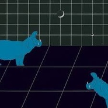 河马万物之与动物相遇](./albums/5021927465.md) | 国语 | 有此山文化 | 2020年10月15日 | EP, 单曲 | 国语流行 Mandarin Pop, 华语唱作人 Chinese Singer-Songwriter |
| [ 短歌](./albums/5021675019.md) | 国语 | 有此山文化 | 2020年10月13日 | EP, 单曲 | 国语流行 Mandarin Pop, 华语唱作人 Chinese Singer-Songwriter |
| [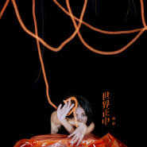 世界正中](./albums/5021148642.md) | 国语 | 有此山文化 | 2020年07月26日 | EP, 单曲 | 国语流行 Mandarin Pop, 华语唱作人 Chinese Singer-Songwriter |
| [ 走失 (Live)我是唱作人 Ⅱ 第5期](./albums/5020649385.md) | 国语 | 有此山文化 | 2020年05月15日 | 现场专辑 |  |
| [ 剧烈 (Live)我是唱作人 Ⅱ 第4期](./albums/5020573189.md) | 国语 | 有此山文化 | 2020年05月08日 | 现场专辑 | 流行 Pop |
| [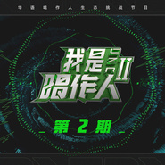 空空 (Live)我是唱作人 Ⅱ 第2期](./albums/5020637053.md) | 国语 | 有此山文化 | 2020年04月24日 | 现场专辑 |  |
| [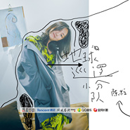 地球巡逻小分队](./albums/2108417065.md) | 国语 | 有此山文化 | 2019年10月31日 | EP, 单曲 | 新世纪音乐 New Age |
| [ 洄游](./albums/2105112508.md) | 国语 | 有此山文化 | 2019年07月26日 | 录音室专辑 | 独立流行 Indie Pop, 国语流行 Mandarin Pop, 华语唱作人 Chinese Singer-Songwriter |
| [ 多多流意](./albums/2105041524.md) | 国语 | 有此山文化 | 2019年06月26日 | EP, 单曲 |  |
| [ 圆形的海](./albums/2104857610.md) | 国语 | 有此山文化 | 2019年05月06日 | EP, 单曲 | 国语流行 Mandarin Pop, 电影原声 Film Score, 华语唱作人 Chinese Singer-Songwriter |
| [ 无所求必满载而归](./albums/2104719802.md) | 国语 | 有此山文化 | 2019年03月27日 | EP, 单曲 | 国语流行 Mandarin Pop, 华语唱作人 Chinese Singer-Songwriter |
| [ 四海Cycle](./albums/2104498652.md) | 国语 | 自在天浩 | 2019年01月20日 | EP, 单曲 | 国语流行 Mandarin Pop, 华语唱作人 Chinese Singer-Songwriter |
| [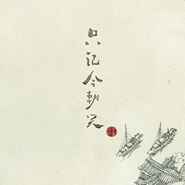 只记今朝笑](./albums/2104427050.md) | 国语 | 有此山文化 | 2019年01月01日 | EP, 单曲 | 国语流行 Mandarin Pop |
| [ Best Better Ever](./albums/2104286130.md) | 国语 | 有此山文化 | 2018年11月27日 | EP, 单曲 | 国语流行 Mandarin Pop, 华语唱作人 Chinese Singer-Songwriter |
| [ 从头](./albums/2104017401.md) | 国语 | 有此山文化 | 2018年09月12日 | EP, 单曲 | 华语唱作人 Chinese Singer-Songwriter, 国语流行 Mandarin Pop |
| [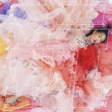 玩Playlist](./albums/2103834238.md) | 国语 | 趣果文化 | 2018年07月26日 | 录音室专辑 | 国语流行 Mandarin Pop, 艺术流行 Art Pop, 独立流行 Indie Pop, 华语唱作人 Chinese Singer-Songwriter |
| [ 青原](./albums/2103834246.md) | 国语 | 趣果文化 | 2018年07月23日 | EP, 单曲 |  |
| [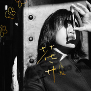 花开](./albums/2103624879.md) | 英语 | 趣果文化 | 2018年03月21日 | EP, 单曲 | 古典跨界 Classical Crossover, 华语唱作人 Chinese Singer-Songwriter |
| [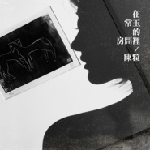 在常玉的房间里](./albums/2103561270.md) | 纯音乐 | 趣果文化 | 2018年03月06日 | EP, 单曲 | 轻音乐 Easy Listening |
| [ 研山图](./albums/2103467930.md) | 国语 | 腾讯游戏 | 2018年01月05日 | EP, 单曲 | 华语唱作人 Chinese Singer-Songwriter, 国语流行 Mandarin Pop |
| [ 新年快乐](./albums/2102976623.md) | 国语 | 春生工作室 | 2017年12月20日 | EP, 单曲 | 国语流行 Mandarin Pop |
| [ COSMOS](./albums/2102967063.md) | 国语 | 趣果文化 | 2017年12月05日 | EP, 单曲 | 国语流行 Mandarin Pop, 华语唱作人 Chinese Singer-Songwriter |
| [ 亲爱的你](./albums/2102868815.md) | 国语 | 湖南卫视 | 2017年10月07日 | EP, 单曲 | 民谣流行 Folk Pop, 华语唱作人 Chinese Singer-Songwriter |
| [ 在蓬莱 in Blue Note BeijingPengLai in Blue Note Beijing](./albums/2102802678.md) | 国语 | 趣果工作室 | 2017年07月26日 | 现场专辑 | 民谣流行 Folk Pop, 华语唱作人 Chinese Singer-Songwriter |
| [ 在蓬莱in Blue Note Beijing](./albums/2102802692.md) | 国语 | 趣果文化 | 2017年07月25日 | 现场专辑 |  |
| [ 一个人的收藏](./albums/2105954124.md) | 英语 | 喜瑪拉雅音樂事業股份 | 2017年04月24日 | EP, 单曲 | 欧美流行 Western Pop |
| [ 一个人的收藏](./albums/2105939315.md) | 英语 | 喜瑪拉雅音樂事業股份 | 2017年04月19日 | EP, 单曲 | 欧美流行 Western Pop |
| [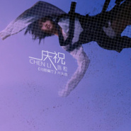 庆祝](./albums/2102722709.md) | 国语 | 趣果工作室 | 2017年03月28日 | EP, 单曲 | 民谣流行 Folk Pop, 华语唱作人 Chinese Singer-Songwriter |
| [ 好在](./albums/2102705525.md) | 国语 | 趣果工作室 | 2017年03月07日 | EP, 单曲 | 民谣流行 Folk Pop, 华语唱作人 Chinese Singer-Songwriter |
| [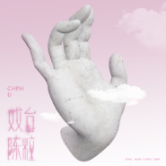 戏台](./albums/2102697204.md) | 国语 | 趣果工作室 | 2017年02月22日 | EP, 单曲 | 当代民谣 Contemporary Folk, 华语唱作人 Chinese Singer-Songwriter |
| [ 周游](./albums/2102665621.md) | 国语 | 趣果文化 | 2016年12月19日 | EP, 单曲 | 当代民谣 Contemporary Folk, 华语唱作人 Chinese Singer-Songwriter |
| [ 当我在这里](./albums/2102655603.md) | 国语 | 趣果工作室 | 2016年11月23日 | EP, 单曲 | 当代民谣 Contemporary Folk, 华语唱作人 Chinese Singer-Songwriter |
| [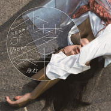 小梦大半Reams of Dream](./albums/2100372319.md) | 国语 | 趣果工作室 | 2016年07月26日 | 录音室专辑 | 当代民谣 Contemporary Folk, 民谣流行 Folk Pop, 华语唱作人 Chinese Singer-Songwriter |
| [ 爱若](./albums/2100245802.md) | 国语 | 陈粒工作室 | 2015年12月11日 | EP, 单曲 | 独立流行 Indie Pop, 华语唱作人 Chinese Singer-Songwriter |
| [ 白亦初](./albums/2100243272.md) | 国语 | 音乐肖像 | 2015年12月02日 | EP, 单曲 | 独立民谣 Indie Folk, 华语唱作人 Chinese Singer-Songwriter |
| [ 如也](./albums/1722842312.md) | 国语 | 独立发行 | 2015年02月02日 | 录音室专辑 | 独立民谣 Indie Folk, 华语唱作人 Chinese Singer-Songwriter |
| [ 未收录的单曲](./albums/706619535.md) | 国语 | 独立发行 | 2014年02月01日 | EP, 单曲 | 独立民谣 Indie Folk, 华语唱作人 Chinese Singer-Songwriter |

## 评论

|  |  |  |
| :-- | :-- | :-- |
|  [虾米用户](https://emumo.xiami.com/u/1368404) 我还没想好要写什么... 2021-01-23 21:04 赞(0) 踩(0) | 
我只想问是谁把她这张照放首页的？
 |
|  [虾米用户](https://emumo.xiami.com/u/10546776) 来回奔走，来回折腾 2020-10-27 13:58 赞(0) 踩(0) | 
太牛了，城市歌手！写出我们的生活！
 |
|  [虾米用户](https://emumo.xiami.com/u/2796166) 最爱莫文蔚..... 2020-10-14 00:36 赞(0) 踩(0) | 
不错哦~~~加油~~~~
 |
|  [虾米用户](https://emumo.xiami.com/u/276944698) 不要自我设限..... 2020-09-03 13:14 赞(0) 踩(0) | 

 |
|  [虾米用户](https://emumo.xiami.com/u/4277042) 不是非要飘扬。 2020-07-31 18:51 赞(0) 踩(0) | 
不要过分雕琢，不要为了创造去创作，不要堆砌歌词，我觉得你越来越糟糕，要是灵感越来越少，就算了吧。
 |
|  [虾米用户](https://emumo.xiami.com/u/318960030)  2020-07-27 23:36 赞(0) 踩(0) | 
前天生日快乐，陈粒。
 |
|  [虾米用户](https://emumo.xiami.com/u/444244735)  2020-07-26 20:05 赞(0) 踩(0) | 
          [文字cool][文字cool][文字cool][文字cool][文字cool][文字cool][文字cool] 
 |
|  [虾米用户](https://emumo.xiami.com/u/444244735)  2020-07-25 02:51 赞(0) 踩(0) | 
     [文字cool]
 |
|  [虾米用户](https://emumo.xiami.com/u/19020872) 你跑不掉的 2020-07-24 12:46 赞(3) 踩(0) | 
某次一起回国在某个餐厅 听到了这首歌 不知叫什么名字 还讨论了这首歌的编曲 当时只记得这旋律 再然后 时光在走 人的心会变 如今 再次听到了这首歌 不过 有些人 有些事 散了 过了 便结束了
 |
|  [虾米用户](https://emumo.xiami.com/u/266781930)  2020-06-27 11:15 赞(1) 踩(0) | 
贵阳妹子加油 
 |
|  [虾米用户](https://emumo.xiami.com/u/426064029) 我听的歌改变我思维 2020-06-26 16:51 赞(1) 踩(0) | 
16年夏天开始喜欢她的歌
 |
|  [虾米用户](https://emumo.xiami.com/u/425898155)  2020-06-25 23:41 赞(1) 踩(0) | 
第一次接触陈粒的音乐，惊艳了，勿论曲或词都写得那么好！唱歌超感性，迷人的，具吸引力。
 |
|  [虾米用户](https://emumo.xiami.com/u/263986948) 我年轻时在这里虚度了许多... 2020-06-24 21:31 赞(0) 踩(0) | 
堪称女版小李宗盛
 |
|  [虾米用户](https://emumo.xiami.com/u/19063650) 光落在你脸上 2020-05-24 01:38 赞(1) 踩(0) | 
那个时候我并不知道陈粒，曾经属于我的那个她，她是陈粒的粉丝，她学会了尤克里里，给我弹唱着光，我却没珍惜。直到她离开很久后，我成了陈粒的粉丝，听着她曾喜欢的每一首歌。好多歌词变得无比贴切，听着，懂了，痛着，默默祝愿着......
 |
|  [虾米用户](https://emumo.xiami.com/u/328381245)  2020-05-15 14:53 赞(2) 踩(0) | 
喜欢，干净，清澈
 |
|  [虾米用户](https://emumo.xiami.com/u/421578063) fox god 2020-05-04 13:16 赞(0) 踩(0) | 
(&amp;sigma;&amp;prime;▽‵)&amp;prime;▽‵)&amp;sigma;
 |
|  [虾米用户](https://emumo.xiami.com/u/379162683) 我想要记住你们，我想要你... 2020-05-03 10:09 赞(0) 踩(0) | 

 |
|  [虾米用户](https://emumo.xiami.com/u/440751839) 渴望真实为何追随谎言 2020-05-01 15:16 赞(3) 踩(0) | 
哈哈哈这个封面把粒粒拍的好胖 粒粒最近上节目明明又瘦又美～
 |
|  [虾米用户](https://emumo.xiami.com/u/86453) 天边的地边。 2020-04-23 09:08 赞(3) 踩(0) | 
这头像，这太喜感了吧。
 |
|  [虾米用户](https://emumo.xiami.com/u/283803269) 不是你的孙悟空，却想为你... 2020-04-20 17:28 赞(2) 踩(0) | 
抱歉抱歉  没有？？
 |
|  [虾米用户](https://emumo.xiami.com/u/287412478)  2020-04-18 11:02 赞(0) 踩(0) | 
封面好丑啊！！！！！！
 |
|  [虾米用户](https://emumo.xiami.com/u/442013298) 认真音乐 认真生活 2020-04-14 14:59 赞(0) 踩(0) | 
分享  木子 的歌曲《留恋的光阴》<a href="https://www.xiami.com/song/1902032099" target="_blank" rel="nofollow noreferrer noopener">https://www.xiami.com/song/1902032099</a> (分享自@虾米音乐) 我的歌哦！
 |
|  [虾米用户](https://emumo.xiami.com/u/83964128) 誓死捍卫铲屎官的荣耀！ 2020-04-11 12:21 赞(5) 踩(0) | 
没想到陈粒的歌竟然能在虾米听到 ，虾米的曲库有时候真的难以言喻
 |
|  [虾米用户](https://emumo.xiami.com/u/132924606)  2020-03-29 22:38 赞(1) 踩(0) | 
加油陈粒～太喜欢你了！
 |
|  [虾米用户](https://emumo.xiami.com/u/4249375) ^_^ 2020-03-16 08:42 赞(2) 踩(0) | 
喜欢你的狂放，你的温柔，你的细腻，你的不羁～
 |
|  [虾米用户](https://emumo.xiami.com/u/314483310) 唯音乐对我始终忠诚。 2020-03-08 15:36 赞(3) 踩(0) | 
才发现粒粒脸挺大的 
 |
|  [虾米用户](https://emumo.xiami.com/u/440120079) 我还没想好要写什么 2020-03-06 11:33 赞(0) 踩(0) | 
千言万语归于“喜欢❤️”
 |
|  [虾米用户](https://emumo.xiami.com/u/269406039)  2020-03-03 01:26 赞(2) 踩(0) | 
天赋这种东西 ，在陈粒身上肉眼可见。她注定不是流水线上生产的完美产品。有瑕疵又独一无二。
 |
|  [虾米用户](https://emumo.xiami.com/u/351452070)  2020-02-29 10:35 赞(3) 踩(0) | 
昨天在超市偶然听到小半这个歌，因为超市音响声音有点小所以没听出来，索性就用录音功能录下了最后一点，有几秒钟，好险啊，最后还是识别了出来，太开森了
 |
|  [虾米用户](https://emumo.xiami.com/u/12065460) 请关注 2020-02-14 19:07 赞(0) 踩(0) | 
她图片里面几个人的样子 
 |
|  [虾米用户](https://emumo.xiami.com/u/243179201) 做自己想做的事 听自己喜... 2020-02-04 23:57 赞(1) 踩(0) | 
粒姐太宝藏了！
 |
|  [虾米用户](https://emumo.xiami.com/u/379232759)  2020-01-18 19:31 赞(0) 踩(0) | 
凤凰
 |
|  [虾米用户](https://emumo.xiami.com/u/318104586)  再见再见了再见 2019-12-31 14:59 赞(3) 踩(0) | 
这头像我以为是表情包，太圆了吧哈哈
 |
| ⇒ |  [虾米用户](https://emumo.xiami.com/u/1929787) 让一部分非洲大人富起来，... 2020-01-10 20:35 赞(0) 踩(0) | 
人到中年
 |
|  [虾米用户](https://emumo.xiami.com/u/423340171) 男儿当如项羽，力拔山兮气... 2019-12-27 06:04 赞(0) 踩(0) | 
膜拜造梦女神。
 |
|  [虾米用户](https://emumo.xiami.com/u/197129222)  2019-12-25 13:40 赞(3) 踩(0) | 
才成年不久，一首奇妙能力歌唱的我老泪纵横
 |
|  [虾米用户](https://emumo.xiami.com/u/423619911)  2019-12-10 11:14 赞(1) 踩(0) | 
好听
 |
|  [虾米用户](https://emumo.xiami.com/u/372005337) 不要让太多的昨天占据你的... 2019-11-26 23:06 赞(0) 踩(0) | 
粒 爱你
 |
|  [虾米用户](https://emumo.xiami.com/u/4596697)  2019-11-18 15:48 赞(1) 踩(0) | 
什么时候能换个封面？？
 |
|  [虾米用户](https://emumo.xiami.com/u/303603921)  2019-11-17 21:24 赞(1) 踩(0) | 
没公司，没团队，没包装，单枪匹马，一个人一把琴
 |
|  [虾米用户](https://emumo.xiami.com/u/201148821) 短短一生，毫无特殊之处 2019-11-06 22:52 赞(0) 踩(0) | 
封面…………
 |
|  [虾米用户](https://emumo.xiami.com/u/13227417) 不负如来不负卿 2019-11-06 18:25 赞(0) 踩(0) | 
最后一张图怎么这么像Billie…
 |
|  [虾米用户](https://emumo.xiami.com/u/263270426)  2019-11-02 15:08 赞(0) 踩(0) | 
大爱陈粒，谁赞成，谁反对 
 |
|  [虾米用户](https://emumo.xiami.com/u/420236153) 我没有擦去争执的橡皮 2019-10-29 08:04 赞(2) 踩(0) | 
她永远不需要人懂的样子。
 |
|  [虾米用户](https://emumo.xiami.com/u/85008772)  2019-10-28 11:36 赞(0) 踩(0) | 
这个封面不行   
 |
|  [虾米用户](https://emumo.xiami.com/u/425954810)  2019-10-25 00:01 赞(0) 踩(0) | 
喜欢这样的的，简简单单，
 |
|  [虾米用户](https://emumo.xiami.com/u/3631559) 过尽千帆皆不是、 2019-10-21 10:46 赞(1) 踩(0) | 
封面看成了马丽 
 |
|  [虾米用户](https://emumo.xiami.com/u/22418776)  2019-10-17 23:12 赞(0) 踩(0) | 
喜欢
 |
|  [虾米用户](https://emumo.xiami.com/u/429374560)  2019-10-11 14:07 赞(0) 踩(0) | 
胖了
 |
|  [虾米用户](https://emumo.xiami.com/u/7882047) ↗这家伙试听了很多曲子！ 2019-09-23 02:53 赞(0) 踩(0) | 
美女有没有男朋友 
 |
|  [虾米用户](https://emumo.xiami.com/u/352095532) 春有百花秋有月，夏有凉风... 2019-09-22 20:00 赞(0) 踩(0) | 
看了介绍，想问一下，陈粒怎么做到的？这么优秀
 |
|  [虾米用户](https://emumo.xiami.com/u/403696465)  2019-09-13 15:48 赞(0) 踩(0) | 
快乐男生，第一次听到易燃易爆炸，蛮好
 |
|  [虾米用户](https://emumo.xiami.com/u/429400490)  2019-09-11 15:31 赞(1) 踩(0) | 
小半很舒服的调调，莫名的喜欢，支持
 |
|  [虾米用户](https://emumo.xiami.com/u/156777638) 你还好 2019-09-03 07:55 赞(0) 踩(0) | 

 |
|  [虾米用户](https://emumo.xiami.com/u/374908119)  2019-09-02 13:09 赞(1) 踩(0) | 
明人不说暗话，我爱陈粒
 |
|  [虾米用户](https://emumo.xiami.com/u/54734957) 双颊曾光滑 夜色曾沁凉 ... 2019-08-31 16:02 赞(0) 踩(0) | 
虾米音乐人？虾米没版权？虾米？
 |
|  [虾米用户](https://emumo.xiami.com/u/377247974)  2019-08-31 14:57 赞(0) 踩(0) | 
，_，_u_cvcc，，w，chhhccuui胡歌
 |
|  [虾米用户](https://emumo.xiami.com/u/412828798)  2019-08-26 23:15 赞(0) 踩(0) | 
最符合自己性格的歌
 |
|  [虾米用户](https://emumo.xiami.com/u/1270619)  2019-08-20 10:39 赞(0) 踩(0) | 
想听 爱完不完
 |
|  [虾米用户](https://emumo.xiami.com/u/1394088) 世间智障合集 2019-08-18 22:25 赞(0) 踩(0) | 
裂墙建议把相似艺人中的花粥给去掉
 |
|  [虾米用户](https://emumo.xiami.com/u/3734050) wake me up 2019-08-09 18:28 赞(0) 踩(0) | 
不要再商业合作了 继续独立创作下去好么！！！
 |
| ⇒ |  [虾米用户](https://emumo.xiami.com/u/1394088) 世间智障合集 2019-08-18 22:26 赞(0) 踩(0) | 
要恰饭的嘛。。不能要求奶牛只挤奶不吃草呀，看到恰饭其实是好现象，只是希望不要一直恰下去，把自己的才华给恰没了。。。
 |
|  [虾米用户](https://emumo.xiami.com/u/214533735) 阿年 2019-08-08 07:48 赞(1) 踩(0) | 
陈粒是什么宝藏歌手，每首歌我都喜欢！
 |
|  [虾米用户](https://emumo.xiami.com/u/74639208) Music is per... 2019-07-30 07:24 赞(0) 踩(0) | 
封面还挺可爱的
 |
|  [虾米用户](https://emumo.xiami.com/u/356043426) 山不厌高，海不厌深。 2019-07-28 01:29 赞(0) 踩(0) | 
有特点，好听的歌 
 |
|  [虾米用户](https://emumo.xiami.com/u/424027104) TNT♡ 2019-07-27 23:36 赞(0) 踩(0) | 
谁能给我科普一下陈粒和祝星？笑哭
 |
| ⇒ |  [虾米用户](https://emumo.xiami.com/u/355442659)  2019-08-06 14:51 赞(0) 踩(0) | 
同心恋 分了 开始喜欢男的了
 |
|  [虾米用户](https://emumo.xiami.com/u/412080311) 我还没想好要写什么... 2019-07-27 20:57 赞(0) 踩(0) | 
发现图片集里居然还有两张和祝星的合照
 |
|  [虾米用户](https://emumo.xiami.com/u/407085769) 脱离了高级趣味的人 2019-07-27 04:27 赞(1) 踩(0) | 
其实我害觉得封面挺可爱的，比之前的更喜欢（想看好看的照片不如移步微博鸭，看看女明星自拍十级的功力_(:з」&amp;ang;)_
 |
|  [虾米用户](https://emumo.xiami.com/u/407085769) 脱离了高级趣味的人 2019-07-27 04:24 赞(0) 踩(0) | 
生日后一天快乐
 |
|  [虾米用户](https://emumo.xiami.com/u/259835642) 斟酌字词/痛饮旋律 2019-07-26 08:08 赞(1) 踩(0) | 
生日快乐俺的小陈 (新专呢……虾米这个版权真的是
 |
|  [虾米用户](https://emumo.xiami.com/u/187764625) 救救虾米吧 2019-07-23 15:57 赞(1) 踩(0) | 
封面一言难尽
 |
|  [虾米用户](https://emumo.xiami.com/u/426633540)  2019-07-21 22:45 赞(1) 踩(0) | 
很喜欢陈粒的歌，感觉在很多歌里都能找到共鸣
 |
|  [虾米用户](https://emumo.xiami.com/u/418815209)  2019-07-17 11:52 赞(0) 踩(0) | 
国民老公就是不一样
 |
|  [虾米用户](https://emumo.xiami.com/u/111433890)  2019-07-16 16:11 赞(1) 踩(0) | 
这个封面，，。额。。
 |
|  [虾米用户](https://emumo.xiami.com/u/2393294) 和彭彭一起加油! 2019-07-15 14:34 赞(0) 踩(0) | 
时间都知道会上吗
 |
|  [虾米用户](https://emumo.xiami.com/u/413177827)  2019-07-15 14:24 赞(0) 踩(0) | 
我爱她
 |
|  [虾米用户](https://emumo.xiami.com/u/120574822) 我还没想好要写什么... 2019-07-13 13:38 赞(2) 踩(0) | 
封面是粒粒故意的，她在音乐节时说，有人竟然说她是花瓶。。所以我猜测，她就是要故意这样  
 |
|  [虾米用户](https://emumo.xiami.com/u/50876344)   2019-07-09 17:19 赞(1) 踩(0) | 
“封面”是因为没有经纪人的原因吗 
 |
|  [虾米用户](https://emumo.xiami.com/u/329043594) 我还没想好要写什么... 2019-07-08 14:16 赞(2) 踩(0) | 
头像都不p一下吗？
 |
|  [虾米用户](https://emumo.xiami.com/u/340279147)  2019-07-07 01:38 赞(0) 踩(0) | 
喜欢
 |
|  [虾米用户](https://emumo.xiami.com/u/421286563) 来自双子星的女生 2019-07-04 11:35 赞(0) 踩(0) | 
就一句话，陈粒，我永远挺你1
 |
|  [虾米用户](https://emumo.xiami.com/u/410731585) 旋律控本控是也 2019-06-29 19:37 赞(0) 踩(0) | 
超喜欢的声音，有一种超脱一切的感觉。
 |
|  [虾米用户](https://emumo.xiami.com/u/425499564)  2019-06-26 17:15 赞(0) 踩(0) | 
，
 |
|  [虾米用户](https://emumo.xiami.com/u/4282950) 一种生活习惯必须每日听歌... 2019-06-25 11:15 赞(1) 踩(0) | 
有人觉得像马丽吗……
 |
| ⇒ |  [虾米用户](https://emumo.xiami.com/u/413177827)  2019-07-15 14:25 赞(0) 踩(0) | 
赞同
 |
|  [虾米用户](https://emumo.xiami.com/u/95240272)  2019-06-12 20:07 赞(0) 踩(0) | 
真好，在国外还能听到陈粒的歌，黑暗之中的一丝亮光
 |
|  [虾米用户](https://emumo.xiami.com/u/407240025)  2019-06-07 21:43 赞(0) 踩(0) | 
好  
 |
|  [虾米用户](https://emumo.xiami.com/u/243041859)  2019-06-07 18:46 赞(0) 踩(0) | 
很独到
 |
|  [虾米用户](https://emumo.xiami.com/u/714595)   2019-06-06 16:44 赞(88) 踩(0) | 
封面是仇家换的吗？
 |
| ⇒ |  [虾米用户](https://emumo.xiami.com/u/26165915)  2019-07-09 12:50 赞(0) 踩(0) | 
哈哈，确实
 |
| ⇒ |  [虾米用户](https://emumo.xiami.com/u/50876344)   2019-07-09 17:18 赞(0) 踩(0) | 
哈哈哈哈哈哈哈哈深有同感
 |
| ⇒ |  [虾米用户](https://emumo.xiami.com/u/404850821) 个豚练习生Popov 2019-07-12 14:21 赞(0) 踩(0) | 
我觉得挺好看的啊
 |
| ⇒ |  [虾米用户](https://emumo.xiami.com/u/3424774) 为何我不是VIP 2019-07-13 08:51 赞(0) 踩(0) | 
像马丽
 |
| ⇒ |  [虾米用户](https://emumo.xiami.com/u/330264723) 我还没想好要写什么... 2020-02-05 23:23 赞(0) 踩(0) | 
哈哈哈哈哈
 |
| ⇒ |  [虾米用户](https://emumo.xiami.com/u/441282899) 我还没想好要写什么... 2020-03-30 18:44 赞(0) 踩(0) | 
哈哈哈哈哈哈
 |
| ⇒ |  [虾米用户](https://emumo.xiami.com/u/255130010) 鸟瞰大地，唤醒群星 2020-09-09 23:46 赞(0) 踩(0) | 
哈哈哈哈哈哈哈哈
 |
|  [虾米用户](https://emumo.xiami.com/u/422389706)  2019-05-21 07:44 赞(0) 踩(0) | 
明人不说暗话，我喜欢你的歌
 |
|  [虾米用户](https://emumo.xiami.com/u/283869033)  2019-05-20 19:53 赞(0) 踩(0) | 
细细品味，慢慢回忆！
 |
|  [虾米用户](https://emumo.xiami.com/u/41828526) 海量歌无版权做歌单无意义 2019-05-16 19:15 赞(2) 踩(0) | 
这封面也是醉了..........
 |
|  [虾米用户](https://emumo.xiami.com/u/29334503) 我还没想好要写什么... 2019-05-16 16:23 赞(1) 踩(0) | 
陈粒出摇滚吧
 |
|  [虾米用户](https://emumo.xiami.com/u/10619511)   2019-05-13 01:58 赞(3) 踩(0) | 
为什么不是叫陈圆，好圆啊
 |
| ⇒ |  [虾米用户](https://emumo.xiami.com/u/139492392)   2019-05-13 02:00 赞(0) 踩(0) | 
哈哈哈哈这个封面该换
 |
| ⇒ |  [虾米用户](https://emumo.xiami.com/u/10619511)   2019-05-13 02:00 赞(0) 踩(0) | 
有人黑了你主页就眨下眼
 |
|  [虾米用户](https://emumo.xiami.com/u/344729698) 马尔福夫人 2019-05-11 17:08 赞(1) 踩(0) | 
希望未来的我也能像陈粒姐一样创作出美好的音乐
 |
|  [虾米用户](https://emumo.xiami.com/u/56954790) 孤独这样的事情，老了就习... 2019-05-10 23:47 赞(0) 踩(0) | 
老乡，不多说别的，加油。
 |
|  [虾米用户](https://emumo.xiami.com/u/101532292)  2019-05-09 21:57 赞(0) 踩(0) | 
关于陈粒，我只会唱“过了很久终于我愿抬头看，你就在对岸等我勇敢，你还是我的我的我的...″
 |
|  [虾米用户](https://emumo.xiami.com/u/407833095)  2019-05-06 11:58 赞(1) 踩(0) | 
凌晨手机上看到个人来问价我挂网上转卖的祝星设计的产品，懒得理。逛虾米看到了首页的你，不知道陈粒同学现在跟陈陈陈处的还好不？ 你俩千万要永远在一起，一辈子在一起就是为民除害   （曾经是粉后来转黑，再后来真的觉得喜欢过陈粒简直是耻辱的路人路过，打酱油）
 |
| ⇒ |  [虾米用户](https://emumo.xiami.com/u/23709611) 我还没想好要写什么... 2019-05-17 16:31 赞(0) 踩(0) | 
她俩分手后，陈粒除了小半还出了什么经典歌？
 |
|  [虾米用户](https://emumo.xiami.com/u/33095971)   2019-05-05 22:20 赞(0) 踩(0) | 
压力大 想释放
 |
|  [虾米用户](https://emumo.xiami.com/u/407085769) 脱离了高级趣味的人 2019-05-05 02:54 赞(3) 踩(0) | 
我想存现在这个封面头像！
 |
|  [虾米用户](https://emumo.xiami.com/u/369587976) 醒来，甚是爱你 2019-05-02 20:34 赞(0) 踩(0) | 
真美
 |
|  [虾米用户](https://emumo.xiami.com/u/13462058) 对虾米失望了，全是翻唱，... 2019-04-30 08:37 赞(2) 踩(0) | 
老鸭嗓的女歌手
 |
|  [虾米用户](https://emumo.xiami.com/u/349535) ，因 知 音 难 觅  ... 2019-04-27 23:47 赞(0) 踩(0) | 
我爱你
 |
|  [虾米用户](https://emumo.xiami.com/u/64881708)   2019-04-27 17:27 赞(0) 踩(0) | 
田馥甄说她挺欣赏的歌手。所以来听听。确实很好听。粉了。 
 |
|  [虾米用户](https://emumo.xiami.com/u/410470239)  2019-04-26 21:37 赞(0) 踩(0) | 
音带很好好好唱别弄的听不懂
 |
|  [虾米用户](https://emumo.xiami.com/u/423283193)  2019-04-26 20:11 赞(1) 踩(0) | 
喜欢陈粒！加油呀 
 |
|  [虾米用户](https://emumo.xiami.com/u/343616172)  2019-04-15 00:15 赞(1) 踩(0) | 
活该你越来越红 
 |
|  [虾米用户](https://emumo.xiami.com/u/423109812)  2019-04-12 12:15 赞(0) 踩(0) | 
666666
 |
|  [虾米用户](https://emumo.xiami.com/u/351750178)  2019-04-08 23:17 赞(0) 踩(0) | 
好歌好嗓子好意境，曲意逢迎民生。
 |
|  [虾米用户](https://emumo.xiami.com/u/293692544) 你敢给我说话吗？我咬你 2019-04-01 05:22 赞(2) 踩(0) | 
好听
 |
|  [虾米用户](https://emumo.xiami.com/u/52773755) 嗯 2019-03-28 21:24 赞(1) 踩(0) | 
为什么你总是像迷似幻，比那春秋大梦还不真实！
 |
|  [虾米用户](https://emumo.xiami.com/u/24506902) I am the wor... 2019-03-26 23:07 赞(1) 踩(0) | 
来了
 |
|  [虾米用户](https://emumo.xiami.com/u/359881191)  2019-03-22 23:50 赞(3) 踩(0) | 
最近的歌词不太好（新专辑），还是以前比较好 加油！等你的摇滚专辑 
 |
|  [虾米用户](https://emumo.xiami.com/u/315100951)  2019-03-19 10:36 赞(1) 踩(0) | 
才发现这位女歌手，太棒了，自己词曲演唱全能，台风也很好，赞！！！《小半》很好听！
 |
|  [虾米用户](https://emumo.xiami.com/u/258575637) 个性是个啥 2019-03-10 00:37 赞(2) 踩(0) | 
加油 中国音乐需要你
 |
|  [虾米用户](https://emumo.xiami.com/u/378635781)  2019-03-09 17:49 赞(1) 踩(0) | 
好喜欢陈粒唱歌的声音和调子 
 |
|  [虾米用户](https://emumo.xiami.com/u/324677194)  2019-03-03 23:48 赞(3) 踩(0) | 
我前女友也叫粒粒
 |
|  [虾米用户](https://emumo.xiami.com/u/293692544) 你敢给我说话吗？我咬你 2019-03-01 20:45 赞(3) 踩(0) | 
好听
 |
|  [虾米用户](https://emumo.xiami.com/u/419243816) 我还没想好要写什么... 2019-02-28 12:45 赞(3) 踩(0) | 
加油哦
 |
|  [虾米用户](https://emumo.xiami.com/u/412740222) 可惜世上没有后悔药 2019-02-22 15:10 赞(3) 踩(0) | 
很有才华的音乐人，继续努力保持做自己，加油＾０＾~
 |
|  [虾米用户](https://emumo.xiami.com/u/50049635) 我要越来越靠近自己。 2019-02-21 16:44 赞(2) 踩(0) | 
粒哥，真的好喜欢你。
 |
|  [虾米用户](https://emumo.xiami.com/u/24243167) 路漫漫其修远兮，吾将上下... 2019-02-19 08:37 赞(2) 踩(0) | 
第一次听到你的歌，感觉很舒服，很有感觉的那种，有种独特风格独特魅力的声音真的很好听，虽然我爱听78十年代的歌，但当听到你的声音，完全就是另类风格独特魅力<a href="http://emumo.xiami.com/u/10008323" target="_blank" rel="nofollow" name_card="10008323">@陈粒</a>
 |
|  [虾米用户](https://emumo.xiami.com/u/342206229) 你是夜空中一颗璀璨的星，... 2019-02-18 17:37 赞(2) 踩(0) | 
越听越好听
 |
|  [虾米用户](https://emumo.xiami.com/u/292294984) 爱你 2019-02-11 15:04 赞(3) 踩(0) | 
我的列表每次听到前奏很小声的一定是陈粒的，然后疯狂按音量键
 |
|  [虾米用户](https://emumo.xiami.com/u/403177481)  2019-02-09 12:39 赞(24) 踩(0) | 
陈粒就是陈粒，不要说她像谁，也不要说她现在变了，她还是她，有才华的人不会永远小众，她值得更好的。就像《远辰》里的那句“感谢你如此精彩耀眼 做我平淡岁月里星辰”，陈粒永远是我的星辰❤️
 |
|  [虾米用户](https://emumo.xiami.com/u/298635831) 我不想写嘿嘿 2019-02-05 13:47 赞(3) 踩(0) | 
我喜欢你啊
 |
|  [虾米用户](https://emumo.xiami.com/u/216720354) 蝦米再見有緣再愛你 2019-02-04 16:07 赞(18) 踩(0) | 
曾经陈粒唱着祝星，字字坚决 就像我曾爱慕着你，绝不迟疑
 |
|  [虾米用户](https://emumo.xiami.com/u/359651467) 来自远方的诗人。 2019-02-03 03:02 赞(3) 踩(0) | 
作词真好。特别好啊陈粒。
 |
|  [虾米用户](https://emumo.xiami.com/u/297754958)   2019-01-17 04:33 赞(2) 踩(0) | 
什么时候开演唱会
 |
|  [虾米用户](https://emumo.xiami.com/u/331211892) 我还没想好要写什么... 2019-01-15 21:21 赞(12) 踩(0) | 
歌词真的厉害，唱功也还好，音色独特，对我口味
 |
|  [虾米用户](https://emumo.xiami.com/u/18272884) 只有重金属才是王道。 2019-01-06 23:34 赞(5) 踩(0) | 
才女
 |
|  [虾米用户](https://emumo.xiami.com/u/6749530) 我变化万千，任何定格的印... 2019-01-06 18:45 赞(3) 踩(0) | 
声音就像呆在在冬天内蒙古旷野中，阳光照在身上的那一面。
 |
|  [虾米用户](https://emumo.xiami.com/u/344102689)  2019-01-01 12:37 赞(6) 踩(0) | 
陈粒的声音传递到我的耳朵里，再也无法移出去，决定爱你，爱你的声音！
 |
|  [虾米用户](https://emumo.xiami.com/u/7295040)  2018-12-20 17:18 赞(1) 踩(0) | 
电子流行?什么时候再做两首trap？
 |
|  [虾米用户](https://emumo.xiami.com/u/327182234) 君生我未生，我生君已老。 2018-12-17 19:41 赞(2) 踩(0) | 
加油，嗓音不错我喜欢哦。
 |
|  [虾米用户](https://emumo.xiami.com/u/41861849)  2018-12-15 00:36 赞(3) 踩(0) | 
有些人一出手就是巅峰，陈粒就是这样。她《如也》专辑个个是经典。让人想不到，二十几岁的人，却有着不符合年龄的感悟和老道，她说若死后还相见，那死亡还有什么意义……不得不佩服哲理般的深刻。所以造就了此后对她歌，期望值高，也就有了每每新专辑不如前的遗憾。
 |
|  [虾米用户](https://emumo.xiami.com/u/408333918) 一名并不资深的大虾用户. 2018-12-14 20:12 赞(1) 踩(0) | 
你是我初中三年的光现在我高二 谢谢你的歌和你独特的嗓音陪着我
 |
|  [虾米用户](https://emumo.xiami.com/u/340763473) 。 2018-12-13 00:30 赞(1) 踩(0) | 
恕我直言，陈粒的歌就没有难听的
 |
|  [虾米用户](https://emumo.xiami.com/u/405456869)  2018-12-08 20:15 赞(6) 踩(0) | 
陈粒的歌是那种乍一听很奇怪，但越听越好听
 |
|  [虾米用户](https://emumo.xiami.com/u/351608173)  2018-12-07 23:30 赞(2) 踩(0) | 
欣赏不来，歌词太过神经质，我想人也一样
 |
| ⇒ |  [虾米用户](https://emumo.xiami.com/u/357922006)  2018-12-20 22:58 赞(0) 踩(0) | 
欣赏不来请你滚 
 |
|  [虾米用户](https://emumo.xiami.com/u/409747775)  2018-12-07 21:54 赞(1) 踩(0) | 
感觉作品都蛮好的，就是难成经典 不喜勿喷
 |
|  [虾米用户](https://emumo.xiami.com/u/335782920)  2018-12-05 22:06 赞(0) 踩(0) | 
特别有感觉
 |
|  [虾米用户](https://emumo.xiami.com/u/302958092)  2018-11-22 17:40 赞(0) 踩(0) | 
呵呵，
 |
|  [虾米用户](https://emumo.xiami.com/u/302958092)  2018-11-22 17:39 赞(0) 踩(0) | 
真是666
 |
|  [虾米用户](https://emumo.xiami.com/u/293692544) 你敢给我说话吗？我咬你 2018-11-22 05:12 赞(1) 踩(0) | 
好听
 |
|  [虾米用户](https://emumo.xiami.com/u/11161065) 天亮之前我们都很安全 2018-11-21 02:51 赞(1) 踩(0) | 
为什么没有I&amp;rsquo;m coming to beijing
 |
|  [虾米用户](https://emumo.xiami.com/u/408567137)  2018-11-16 21:15 赞(1) 踩(0) | 
旋律很好， 声音独特， 歌也不错。
 |
|  [虾米用户](https://emumo.xiami.com/u/267517259) 超级无敌大美女哈哈哈 2018-11-16 20:57 赞(1) 踩(0) | 

 |
|  [虾米用户](https://emumo.xiami.com/u/267517259) 超级无敌大美女哈哈哈 2018-11-16 20:57 赞(0) 踩(0) | 
000
 |
|  [虾米用户](https://emumo.xiami.com/u/402761536)  2018-11-12 19:41 赞(1) 踩(0) | 
我发现女明星有些人就会说像谁 当男的就很少
 |
|  [虾米用户](https://emumo.xiami.com/u/85008772)  2018-11-04 17:16 赞(3) 踩(0) | 
听声音就是那种独立，有故事的女人啊
 |
|  [虾米用户](https://emumo.xiami.com/u/407401674)  2018-10-31 00:47 赞(1) 踩(0) | 
陈粒就是陈粒陈粒陈粒陈粒陈粒陈粒陈粒陈粒陈粒陈粒陈粒陈粒陈粒陈粒陈粒陈粒陈粒陈粒陈粒。 最好的陈粒陈粒陈粒陈粒陈粒陈粒陈粒
 |
|  [虾米用户](https://emumo.xiami.com/u/95288498)  2018-10-23 18:48 赞(4) 踩(0) | 
陈粒的歌，没有那么多的包装，直逼灵魂。拉扯到痛彻心扉，赤裸到入心入骨。却总有那一两句如同甘泉润入心肺
 |
|  [虾米用户](https://emumo.xiami.com/u/293692544) 你敢给我说话吗？我咬你 2018-10-09 17:51 赞(1) 踩(0) | 
好听
 |
|  [虾米用户](https://emumo.xiami.com/u/376577854)  2018-10-09 09:20 赞(1) 踩(0) | 
着魔了 
 |
|  [虾米用户](https://emumo.xiami.com/u/405658871)  2018-10-08 04:51 赞(1) 踩(0) | 
踏遍万水千山总有一地故乡
 |
|  [虾米用户](https://emumo.xiami.com/u/341035326) 我还没想好要写什么... 2018-09-26 14:31 赞(0) 踩(0) | 
听陈粒的歌就是不想谈对象，老觉得自己已经许给陈粒了   
 |
|  [虾米用户](https://emumo.xiami.com/u/319671071)  2018-09-25 22:47 赞(2) 踩(0) | 
知世故而不世故
 |
|  [虾米用户](https://emumo.xiami.com/u/319671071)  2018-09-25 22:37 赞(2) 踩(0) | 
俠骨柔情的人啊。
 |
|  [虾米用户](https://emumo.xiami.com/u/349863013)  2018-09-23 23:33 赞(1) 踩(0) | 
专辑呢？
 |
|  [虾米用户](https://emumo.xiami.com/u/47262914) 我舍不得。 2018-09-22 13:09 赞(1) 踩(0) | 
❤
 |
|  [虾米用户](https://emumo.xiami.com/u/378698763)  2018-09-20 19:38 赞(1) 踩(0) | 
良心歌手，加油
 |
|  [虾米用户](https://emumo.xiami.com/u/404467007)  2018-09-19 21:55 赞(1) 踩(0) | 
有9.21虾米音乐节的票~
 |
|  [虾米用户](https://emumo.xiami.com/u/352741231)  2018-09-19 16:34 赞(1) 踩(0) | 
好听 
 |
|  [虾米用户](https://emumo.xiami.com/u/335763493) 不戴墨镜  2018-09-16 01:08 赞(7) 踩(0) | 
陳詞曲酒粒粒歌
 |
|  [虾米用户](https://emumo.xiami.com/u/319671071)  2018-09-12 19:49 赞(12) 踩(0) | 
陈粒就是陈粒 不要把她和谁比较 她是音乐人 她喜欢做自己喜欢的音乐 她很厉害 很有才华 很有个性 每一首歌都很有意思 很好听
 |
| ⇒ |  [虾米用户](https://emumo.xiami.com/u/376606683)  2018-09-13 20:44 赞(0) 踩(0) | 
嗯 对 不比较
 |
|  [虾米用户](https://emumo.xiami.com/u/293692544) 你敢给我说话吗？我咬你 2018-09-12 05:23 赞(2) 踩(0) | 
好听
 |
|  [虾米用户](https://emumo.xiami.com/u/19653424) 人生三原则 无相无念无住 2018-09-11 15:38 赞(1) 踩(0) | 
刀下留名~  @_@
 |
|  [虾米用户](https://emumo.xiami.com/u/259039075) Good for us. 2018-09-08 10:28 赞(2) 踩(0) | 
民谣只听陈粒
 |
|  [虾米用户](https://emumo.xiami.com/u/337592878) 一 2018-08-23 14:48 赞(3) 踩(0) | 
新专辑啊 ，虾米争气啊
 |
|  [虾米用户](https://emumo.xiami.com/u/89432538)   2018-08-21 16:25 赞(2) 踩(0) | 
长得有点像郑秀晶  
 |
| ⇒ |  [虾米用户](https://emumo.xiami.com/u/193151766)  2018-08-25 10:45 赞(0) 踩(0) | 
像吗？？
 |
|  [虾米用户](https://emumo.xiami.com/u/19621281) 音乐王子 2018-08-21 10:33 赞(2) 踩(0) | 
国民老公
 |
|  [虾米用户](https://emumo.xiami.com/u/266882114) 孑孓 2018-08-19 19:33 赞(3) 踩(0) | 
粒粒❤️
 |
|  [虾米用户](https://emumo.xiami.com/u/72863494) 我还没想好要写什么... 2018-08-18 12:48 赞(11) 踩(0) | 
这个歌手16年后就堕为小清新点歌台了
 |
|  [虾米用户](https://emumo.xiami.com/u/356037921)  2018-08-17 19:07 赞(2) 踩(0) | 
好听，
 |
|  [虾米用户](https://emumo.xiami.com/u/311303552)  2018-08-13 12:27 赞(3) 踩(0) | 
不懂什么，歌听起来好听就行了
 |
|  [虾米用户](https://emumo.xiami.com/u/21761278)  2018-08-12 03:15 赞(3) 踩(0) | 
特别优秀的小姐姐 加油
 |
| ⇒ |  [虾米用户](https://emumo.xiami.com/u/404062936)  2018-09-14 01:40 赞(0) 踩(0) | 
你好。
 |
|  [虾米用户](https://emumo.xiami.com/u/400673853)  2018-08-09 14:24 赞(1) 踩(0) | 
喜欢
 |
|  [虾米用户](https://emumo.xiami.com/u/277453936)  2018-08-08 11:28 赞(4) 踩(0) | 
生生浪漫&amp;nbsp; 伴着低调灵魂&amp;nbsp; 似曾相识的星光上&amp;nbsp; 不再只有荒漠&amp;nbsp; 驰骋千里之后 不愿再做流浪人 三世觅得 良人相伴 月下扶风浸琴声 轻拍马背过草原
 |
|  [虾米用户](https://emumo.xiami.com/u/68470034) 没什么在意的，反正我们谁... 2018-08-08 05:18 赞(3) 踩(0) | 
兄弟，我喜欢你的随意。
 |
|  [虾米用户](https://emumo.xiami.com/u/375090815)  2018-08-07 17:07 赞(1) 踩(0) | 
嗯，喜欢
 |
|  [虾米用户](https://emumo.xiami.com/u/307958283)  2018-08-05 20:59 赞(2) 踩(0) | 
陈粒不红，天理难容
 |
|  [虾米用户](https://emumo.xiami.com/u/244908647) 我的世界 2018-08-05 17:48 赞(1) 踩(0) | 
呵呵哈哈哈呵呵哈哈哈呵                                                          233
 |
|  [虾米用户](https://emumo.xiami.com/u/244908647) 我的世界 2018-08-05 17:48 赞(1) 踩(0) | 
呵呵哈哈哈呵                                  1
 |
|  [虾米用户](https://emumo.xiami.com/u/6438426) 爱吃吃 爱睡睡 爱谁谁 2018-08-04 17:40 赞(0) 踩(0) | 
话不多说 我想给陈粒打钱
 |
|  [虾米用户](https://emumo.xiami.com/u/335997027)  2018-08-04 13:32 赞(0) 踩(0) | 
  
 |
|  [虾米用户](https://emumo.xiami.com/u/279459116)  2018-07-27 09:40 赞(0) 踩(0) | 
生快，感谢你清明的声音陪我度过那些记忆的岁月
 |
|  [虾米用户](https://emumo.xiami.com/u/269695234) 十梦九有你 2018-07-27 01:25 赞(0) 踩(0) | 
粒粒 
 |
|  [虾米用户](https://emumo.xiami.com/u/378367442)  2018-07-26 22:30 赞(0) 踩(0) | 
做自己喔！生日快乐
 |
|  [虾米用户](https://emumo.xiami.com/u/378163955)  2018-07-26 21:17 赞(0) 踩(0) | 
生日快乐，你就是最好的你
 |
|  [虾米用户](https://emumo.xiami.com/u/275321227)  2018-07-26 20:57 赞(1) 踩(0) | 
今年才粉上的陈粒。 生日快乐，陈粒。
 |
|  [虾米用户](https://emumo.xiami.com/u/272646940)  2018-07-26 20:50 赞(0) 踩(0) | 
撒谬尔啊
 |
|  [虾米用户](https://emumo.xiami.com/u/256790496)  2018-07-26 17:43 赞(0) 踩(0) | 
一年多了，听着你的歌，走出失恋
 |
| ⇒ |  [虾米用户](https://emumo.xiami.com/u/358446459)  2018-08-16 19:55 赞(0) 踩(0) | 
你的恋爱里可能缺少我这样一个人
 |
|  [虾米用户](https://emumo.xiami.com/u/376403888)  2018-07-26 17:33 赞(1) 踩(0) | 
希望陈粒能找到尘世幸福  也能拥有最好的月亮
 |
|  [虾米用户](https://emumo.xiami.com/u/373395592)  2018-07-26 17:20 赞(0) 踩(0) | 
喜欢你
 |
|  [虾米用户](https://emumo.xiami.com/u/376801604)  2018-07-26 16:23 赞(0) 踩(0) | 
生日快乐 
 |
|  [虾米用户](https://emumo.xiami.com/u/346600653)  2018-07-26 15:54 赞(0) 踩(0) | 
驰骋
 |
|  [虾米用户](https://emumo.xiami.com/u/377978497)  2018-07-26 15:53 赞(0) 踩(0) | 
生日快乐
 |
|  [虾米用户](https://emumo.xiami.com/u/11122038) 你是你，我是我 2018-07-26 14:57 赞(0) 踩(0) | 
生日快乐
 |
|  [虾米用户](https://emumo.xiami.com/u/331279955)  2018-07-26 14:51 赞(0) 踩(0) | 
[生日快乐，朋友]
 |
|  [虾米用户](https://emumo.xiami.com/u/375787700)  2018-07-26 14:06 赞(0) 踩(0) | 

 |
|  [虾米用户](https://emumo.xiami.com/u/33407440)  2018-07-26 12:39 赞(0) 踩(0) | 
生也快乐，日也快乐！
 |
|  [虾米用户](https://emumo.xiami.com/u/71984342) … 2018-07-26 12:26 赞(0) 踩(0) | 
粒粒万乡
 |
|  [虾米用户](https://emumo.xiami.com/u/375634042) 我只管畅快淋漓地活着，其... 2018-07-26 12:19 赞(0) 踩(0) | 
粒哥你是个天才 你就像永远的五月里面写的 有些人是上天选中的才能写东西，你就是 被选中的人 祝你将才华唱的写的淋漓尽致异彩纷呈！
 |
|  [虾米用户](https://emumo.xiami.com/u/115785308)  2018-07-26 12:13 赞(0) 踩(0) | 
希望粒粒火起来，那代表你的影响力。但又不想粒粒火起来，那样在看你的演出就会很困难！
 |
|  [虾米用户](https://emumo.xiami.com/u/83187672) 没有风格，不分流派。听歌... 2018-07-26 11:54 赞(0) 踩(0) | 
第四年，生日快乐。
 |
|  [虾米用户](https://emumo.xiami.com/u/271737284) 灵魂歌手 2018-07-26 11:02 赞(0) 踩(0) | 
生日快乐
 |
|  [虾米用户](https://emumo.xiami.com/u/44041260) 再见，虾米。再见，未曾谋... 2018-07-26 10:53 赞(0) 踩(0) | 
听着奇妙能力歌和女朋友分的手 2018.7.26  生日快乐
 |
|  [虾米用户](https://emumo.xiami.com/u/342114965) 男孩 2018-07-26 10:41 赞(0) 踩(0) | 
生日快乐
 |
|  [虾米用户](https://emumo.xiami.com/u/287650367) 花中有火  所以  也會... 2018-07-26 10:38 赞(0) 踩(0) | 
奇妙能力歌
 |
|  [虾米用户](https://emumo.xiami.com/u/80854146) 人为既伪 情何以堪 2018-07-26 10:28 赞(0) 踩(0) | 
大一开始喜欢的，现在已经毕业了。喜欢在失眠的夜里听陈粒，然后越听越睡不着，哈哈哈哈。
 |
|  [虾米用户](https://emumo.xiami.com/u/100788404) 不要听任脆弱的意志摆弄 2018-07-26 10:26 赞(0) 踩(0) | 
女神生日快乐！爱你
 |
|  [虾米用户](https://emumo.xiami.com/u/361866159)  2018-07-26 10:23 赞(0) 踩(0) | 
粒粒今天生日，快乐哦
 |
|  [虾米用户](https://emumo.xiami.com/u/220652369) 夏虫不可以语于冰者，笃于... 2018-07-26 10:23 赞(0) 踩(0) | 
生日快乐！！！ 
 |
|  [虾米用户](https://emumo.xiami.com/u/81763924) 爱的反义词是遗忘❤ 2018-07-26 10:21 赞(0) 踩(0) | 
生日快乐，感谢你的歌声陪伴
 |
|  [虾米用户](https://emumo.xiami.com/u/350414330)    愿余生有人鲜衣怒马... 2018-07-26 10:21 赞(0) 踩(0) | 
生日快乐
 |
|  [虾米用户](https://emumo.xiami.com/u/253858404)  2018-07-26 10:17 赞(0) 踩(0) | 
❤️
 |
|  [虾米用户](https://emumo.xiami.com/u/266473567)  2018-07-26 10:15 赞(0) 踩(0) | 
我身份证上也是今天生日！粒姐
 |
|  [虾米用户](https://emumo.xiami.com/u/344819700) 钟爱陈奕迅 2018-07-26 10:15 赞(0) 踩(0) | 
生日快乐粒爷
 |
|  [虾米用户](https://emumo.xiami.com/u/378326634)  2018-07-26 10:14 赞(0) 踩(0) | 
生快生快
 |
|  [虾米用户](https://emumo.xiami.com/u/370331045)  2018-07-26 10:14 赞(0) 踩(0) | 
大神，生日快乐
 |
|  [虾米用户](https://emumo.xiami.com/u/331201670)  2018-07-26 10:13 赞(0) 踩(0) | 
生日快乐
 |
|  [虾米用户](https://emumo.xiami.com/u/47144318)   2018-07-26 10:12 赞(0) 踩(0) | 
第一次听感觉并不强烈，往后多听几遍以后，才能感受到的歌词里面一些只属于她的细腻
 |
|  [虾米用户](https://emumo.xiami.com/u/334916038) devil. 2018-07-26 10:11 赞(0) 踩(0) | 
来自考研狗的祝福 生日快乐 一百分小姐姐
 |
|  [虾米用户](https://emumo.xiami.com/u/377846442) Dear univers... 2018-07-26 10:10 赞(0) 踩(0) | 
生日快乐超喜欢你的歌
 |
|  [虾米用户](https://emumo.xiami.com/u/379265174)  2018-07-26 10:09 赞(1) 踩(0) | 
我喜欢你，像风走了八十万里
 |
|  [虾米用户](https://emumo.xiami.com/u/335649106) 这家伙实在是太聪明什么也... 2018-07-26 10:09 赞(1) 踩(0) | 
7月26日 粒粒生日快乐！希望你能一直做最好的自己
 |
|  [虾米用户](https://emumo.xiami.com/u/46031009)  2018-07-26 10:09 赞(0) 踩(0) | 
桀骜不驯。狂放不羁。 
 |
|  [虾米用户](https://emumo.xiami.com/u/353904476)  2018-07-26 10:08 赞(0) 踩(0) | 
生日快乐！
 |
|  [虾米用户](https://emumo.xiami.com/u/295354819) 我还没想好要写什么... 2018-07-26 10:08 赞(0) 踩(0) | 
Je t'aime
 |
|  [虾米用户](https://emumo.xiami.com/u/351122907)   2018-07-26 10:08 赞(0) 踩(0) | 
我爱粒爷，天天向上 
 |
|  [虾米用户](https://emumo.xiami.com/u/336579605) 我还没想好要写什么... 2018-07-26 10:07 赞(0) 踩(0) | 
生日快乐
 |
|  [虾米用户](https://emumo.xiami.com/u/285770040) 我还没想好要写什么... 2018-07-26 10:07 赞(0) 踩(0) | 
&lt;加油，坚持你的独特，学弟学妹们为你加油！生日快乐 [url=/u/10008323]@陈粒[/url] &gt;&lt;10008323&gt;
 |
|  [虾米用户](https://emumo.xiami.com/u/17804115) 精神洁癖 2018-07-26 10:05 赞(0) 踩(0) | 
生日快乐！
 |
|  [虾米用户](https://emumo.xiami.com/u/143742718) Let it come!... 2018-07-26 10:05 赞(0) 踩(0) | 
粒粒姐，生日快乐！
 |
|  [虾米用户](https://emumo.xiami.com/u/283946135)  2018-07-26 10:04 赞(0) 踩(0) | 
今天也是我生日 听着陈粒
 |
|  [虾米用户](https://emumo.xiami.com/u/137206634) 满堂花醉三千客，一剑霜寒... 2018-07-26 10:03 赞(1) 踩(0) | 
不知道你能不能看到，预祝你生日快乐！
 |
|  [虾米用户](https://emumo.xiami.com/u/42705707) 我还没想好要写什么... 2018-07-26 10:02 赞(0) 踩(0) | 
生日快乐呀
 |
|  [虾米用户](https://emumo.xiami.com/u/45467075)  2018-07-26 10:02 赞(0) 踩(0) | 
快乐
 |
|  [虾米用户](https://emumo.xiami.com/u/47717509) 混迹留学届多年，业余时间... 2018-07-26 10:01 赞(0) 踩(0) | 
生日快乐
 |
|  [虾米用户](https://emumo.xiami.com/u/5536000) 脑子里的东西最宝贵，当它... 2018-07-25 22:06 赞(0) 踩(0) | 
哇！贵阳银！
 |
|  [虾米用户](https://emumo.xiami.com/u/303849839)  2018-07-20 23:40 赞(1) 踩(0) | 
我喜欢徐楠～ 
 |
| ⇒ |  [虾米用户](https://emumo.xiami.com/u/358446459)  2018-08-16 19:58 赞(0) 踩(0) | 
就像我喜欢你一样
 |
| ⇒ |  [虾米用户](https://emumo.xiami.com/u/303849839)  2018-08-17 11:33 赞(0) 踩(0) | 
<q><b>Make a fortu说：</b></q>
 |
|  [虾米用户](https://emumo.xiami.com/u/270815092) 刻命学习 2018-07-18 00:20 赞(0) 踩(0) | 
声音特别好，大方不做作。
 |
|  [虾米用户](https://emumo.xiami.com/u/313073611) 以前听腻的歌，再听听还有... 2018-07-17 17:18 赞(0) 踩(0) | 
我觉得好难听
 |
|  [虾米用户](https://emumo.xiami.com/u/282387825) 我爱的是你爱我 2018-07-15 23:38 赞(1) 踩(0) | 
一壶酒 一个人 一整晚 就这样吧
 |
|  [虾米用户](https://emumo.xiami.com/u/359622980)  2018-07-15 19:26 赞(0) 踩(0) | 
为什么都是音乐节什么的，就不能有自己一场音乐会。明明那么多作品！
 |
| ⇒ |  [虾米用户](https://emumo.xiami.com/u/347067051)  2018-07-17 21:58 赞(0) 踩(0) | 
发专辑就会有啦！快发专辑了
 |
|  [虾米用户](https://emumo.xiami.com/u/2676883)  2018-07-13 15:31 赞(0) 踩(0) | 
最早看《故宫》知道的陈粒，听了《如也》整张专辑，觉得很不错，尤其喜欢不灭的歌词，是个可以一直听下去的声音，希望她不要太火，不要被太多的杂事缠身，能够安静耐心的多写出一些高品质的歌曲。数字版实体版都会支持，只求她能继续认真下去。
 |
|  [虾米用户](https://emumo.xiami.com/u/236077664)  2018-07-12 06:32 赞(1) 踩(0) | 
自从听了易燃易爆炸就喜欢上了陈粒的歌。
 |
|  [虾米用户](https://emumo.xiami.com/u/82495474)  2018-07-10 22:40 赞(0) 踩(0) | 
歌好，唱得也好，喜欢！
 |
|  [虾米用户](https://emumo.xiami.com/u/282387825) 我爱的是你爱我 2018-07-07 00:12 赞(1) 踩(0) | 
粒粒皆辛苦
 |
|  [虾米用户](https://emumo.xiami.com/u/309435428) 世界，已经与我无关 2018-07-07 00:04 赞(0) 踩(0) | 
  
 |
|  [虾米用户](https://emumo.xiami.com/u/32275254)   2018-07-04 13:40 赞(0) 踩(0) | 
他听陈粒
 |
|  [虾米用户](https://emumo.xiami.com/u/162346606)  2018-06-29 10:01 赞(0) 踩(0) | 
张悬
 |
|  [虾米用户](https://emumo.xiami.com/u/47488765) The First Sc... 2018-06-26 07:10 赞(0) 踩(0) | 
生日快乐我的老公
 |
|  [虾米用户](https://emumo.xiami.com/u/339191478)   2018-06-22 16:22 赞(0) 踩(0) | 
:-)
 |
|  [虾米用户](https://emumo.xiami.com/u/290267259)  2018-06-22 10:06 赞(0) 踩(0) | 
粒爷威武！
 |
|  [虾米用户](https://emumo.xiami.com/u/34903127) 我还没想好要写什么... 2018-06-20 11:34 赞(0) 踩(0) | 
翻版莫文蔚
 |
|  [虾米用户](https://emumo.xiami.com/u/355373451) 如果人死后能相见，那离别... 2018-06-19 18:20 赞(0) 踩(0) | 
从今天迷陈粒，个性万岁
 |
|  [虾米用户](https://emumo.xiami.com/u/375377445) 竹杖芒鞋轻胜马，谁怕？一... 2018-06-14 01:22 赞(0) 踩(0) | 
这样的歌 像有些人一样耐看 
 |
|  [虾米用户](https://emumo.xiami.com/u/307447139)  2018-06-13 20:26 赞(0) 踩(0) | 
清澈明朗
 |
|  [虾米用户](https://emumo.xiami.com/u/360907097)  2018-06-13 16:26 赞(1) 踩(0) | 
很多人讲风格变了歌没有以前好听了，我开始也这样觉得，可是认真听了倒觉得其实也都不错，风格虽然不同歌仍然是好的
 |
|  [虾米用户](https://emumo.xiami.com/u/339084768) 我在你身后，一转头就可以... 2018-06-10 04:00 赞(1) 踩(0) | 
啊呀！好好听！
 |
|  [虾米用户](https://emumo.xiami.com/u/360907097)  2018-06-06 12:22 赞(3) 踩(0) | 
听了许多民谣也听了许多流行，我想你是介于两者之间的，最喜欢的还是你的声音
 |
|  [虾米用户](https://emumo.xiami.com/u/354211814)  2018-05-29 04:27 赞(2) 踩(0) | 
喜欢你的词加油
 |
|  [虾米用户](https://emumo.xiami.com/u/315885761)  2018-05-26 08:18 赞(4) 踩(0) | 
我觉得陈粒活出了自己的精彩人生   很乐观  经历了很多的一个女人。
 |
|  [虾米用户](https://emumo.xiami.com/u/52598099) 欢迎光临我的梦 2018-05-22 23:45 赞(4) 踩(0) | 
想和陈粒做朋友，可是做不了朋友，有生之年能看到她写的书也是极好的
 |
|  [虾米用户](https://emumo.xiami.com/u/331694101) 带上耳机吾即加冕为王 2018-05-20 12:59 赞(1) 踩(0) | 
投入自己，不愿放过，习惯疯魔，可曾成活？
 |
|  [虾米用户](https://emumo.xiami.com/u/281910929)  2018-05-12 09:27 赞(4) 踩(0) | 
好看的皮囊千千万万，有趣的灵魂万里挑一
 |
|  [虾米用户](https://emumo.xiami.com/u/19621281) 音乐王子 2018-05-09 06:22 赞(1) 踩(0) | 
首首好听～
 |
|  [虾米用户](https://emumo.xiami.com/u/4781919) 满朝文武藏绿卡，半壁江山... 2018-05-08 14:11 赞(1) 踩(0) | 
女版周杰伦
 |
|  [虾米用户](https://emumo.xiami.com/u/301948850) 每日一问小唐同学过德福了... 2018-05-06 00:09 赞(0) 踩(0) | 
&amp;radic;
 |
|  [虾米用户](https://emumo.xiami.com/u/348635558) 我们仍旧想要当初的不一样... 2018-05-05 20:39 赞(0) 踩(0) | 
粒粒万乡
 |
|  [虾米用户](https://emumo.xiami.com/u/329065256) 一别两宽，各生欢喜。 2018-05-02 23:38 赞(0) 踩(0) | 
喜欢，喜欢啊 
 |
|  [虾米用户](https://emumo.xiami.com/u/214419491) 我不习惯 2018-05-01 10:20 赞(0) 踩(0) | 
沉迷陈粒
 |
|  [虾米用户](https://emumo.xiami.com/u/357674040)  2018-04-30 23:31 赞(0) 踩(0) | 
me gusta
 |
|  [虾米用户](https://emumo.xiami.com/u/352630967) 乖，睡觉 2018-04-30 10:16 赞(0) 踩(0) | 

 |
|  [虾米用户](https://emumo.xiami.com/u/293692544) 你敢给我说话吗？我咬你 2018-04-29 07:44 赞(1) 踩(0) | 
好听
 |
|  [虾米用户](https://emumo.xiami.com/u/287076133) 啦啦啦 2018-04-23 00:20 赞(3) 踩(0) | 
很干净的声音，感觉像进了一个很安静的小村子里面，莫名觉得安心
 |
|  [虾米用户](https://emumo.xiami.com/u/285701184)  2018-04-19 23:47 赞(2) 踩(0) | 
初遇，奇妙能力歌，隐隐带着一股魔力，似清凉似幽深，似空灵似悠长，这样，便是一个夏天:再遇，易燃易爆炸，我好似见到了不一样的你，仿佛是你的另一面，带着狂傲与气魄，这样，便是一番年少轻狂。
 |
|  [虾米用户](https://emumo.xiami.com/u/187889314)  2018-04-19 20:31 赞(1) 踩(0) | 
歌风格都好像
 |
|  [虾米用户](https://emumo.xiami.com/u/337087596)  2018-04-17 13:41 赞(1) 踩(0) | 
喜欢两年了
 |
|  [虾米用户](https://emumo.xiami.com/u/88130188)  2018-04-15 12:55 赞(1) 踩(0) | 
嗓音有感染力，歌词也能触动人心，我已喜欢上了你
 |
|  [虾米用户](https://emumo.xiami.com/u/279964864)  2018-04-10 21:58 赞(1) 踩(0) | 
我一直觉得很像戴佩妮的感觉.朋友老说不像，不过这真的让人点赞
 |
|  [虾米用户](https://emumo.xiami.com/u/338828995)  2018-04-10 19:15 赞(1) 踩(0) | 
大玩家穿越以后剽窃了你的歌，在那个环境，忽然觉得你的歌非常棒。
 |
|  [虾米用户](https://emumo.xiami.com/u/307920806)  2018-04-09 18:19 赞(1) 踩(0) | 
陈粒
 |
|  [虾米用户](https://emumo.xiami.com/u/309085500)  2018-04-07 00:22 赞(1) 踩(0) | 
愿你能遇到温暖你的人。
 |
|  [虾米用户](https://emumo.xiami.com/u/351803469)  2018-04-05 11:21 赞(1) 踩(0) | 
大爱
 |
|  [虾米用户](https://emumo.xiami.com/u/52864820) 世界上本没有路，走的人多... 2018-04-05 07:46 赞(2) 踩(0) | 
粒啊，杭州的音乐节，你唱几首歌呀 
 |
|  [虾米用户](https://emumo.xiami.com/u/334081714)  2018-04-04 16:12 赞(3) 踩(0) | 
大扎好，我系轱天乐，我四渣渣辉，探挽懒月，介四里没有挽过的船新版本，挤需体验三番钟，里造会干我一样，爱象节款游戏。
 |
|  [虾米用户](https://emumo.xiami.com/u/294713881) 恋爱不过是一场高烧，思念... 2018-04-03 20:28 赞(2) 踩(0) | 
喜欢，无言以表达我的心情
 |
|  [虾米用户](https://emumo.xiami.com/u/22882935) 在这里，你读懂了我的寂寞... 2018-04-03 17:06 赞(3) 踩(0) | 
人如歌曲，歌曲如人。唱的是人生，听的是曾经! 
 |
|  [虾米用户](https://emumo.xiami.com/u/351538665) 独自看那些评论的人也许是... 2018-04-03 13:08 赞(1) 踩(0) | 
你好啊(◎｀・&amp;omega;・&amp;acute;)人(&amp;acute;・&amp;omega;・｀*)
 |
|  [虾米用户](https://emumo.xiami.com/u/3914288)  2018-04-02 10:14 赞(3) 踩(0) | 
从傻网红到人造偶像 还有什么燕池啥的 都啥玩意
 |
|  [虾米用户](https://emumo.xiami.com/u/280453052)  2018-03-31 20:22 赞(1) 踩(0) | 
棒！
 |
|  [虾米用户](https://emumo.xiami.com/u/38157383)  2018-03-30 00:16 赞(1) 踩(0) | 
喜欢你的歌，加油(ง &amp;bull;̀_&amp;bull;́)ง
 |
|  [虾米用户](https://emumo.xiami.com/u/71780328) 简单物种 2018-03-27 13:24 赞(1) 踩(0) | 
跑错地方
 |
|  [虾米用户](https://emumo.xiami.com/u/355506650)  2018-03-24 15:44 赞(0) 踩(0) | 
爱你，粒
 |
| ⇒ |  [虾米用户](https://emumo.xiami.com/u/347968323)  2018-03-26 11:12 赞(0) 踩(0) | 
u去ii呜呜呜健健康康开开去                                        
 |
|  [虾米用户](https://emumo.xiami.com/u/8833102) 伟❤️375882267 2018-03-24 10:23 赞(1) 踩(0) | 
大扎好，我系轱天乐，我四渣渣辉，探挽懒月，介四里没有挽过的船新版本，挤需体验三番钟，里造会干我一样，爱象节款游戏。
 |
|  [虾米用户](https://emumo.xiami.com/u/355377086)  2018-03-23 12:56 赞(1) 踩(0) | 
活成了我想活出的样子
 |
|  [虾米用户](https://emumo.xiami.com/u/16352944) 这家伙也许很聪明什么也没... 2018-03-22 18:04 赞(1) 踩(0) | 
想她了
 |
|  [虾米用户](https://emumo.xiami.com/u/40598780) 无音乐 无生活 2018-03-22 12:43 赞(1) 踩(0) | 
我昨天发现一件特别神奇，我都不可思议的事&amp;hellip;emm我竟然喜欢上了陈粒的歌&amp;hellip;&amp;hellip;冒着被打的风险我坦白，昨天之前我都是根本连一整首都听不完的(&amp;acute;･_･`)然而昨天不知道哪根筋脉被打通了，突然就迷上了。风格大爱，嗓音听起来就很爽快，大概我觉醒了？
 |
| ⇒ |  [虾米用户](https://emumo.xiami.com/u/318648273)  2018-03-23 19:58 赞(0) 踩(0) | 
你昨天心情应该不怎么样
 |
| ⇒ |  [虾米用户](https://emumo.xiami.com/u/40598780) 无音乐 无生活 2018-03-24 22:45 赞(0) 踩(0) | 
<q><b>浮岚说：</b></q>
 |
|  [虾米用户](https://emumo.xiami.com/u/37739818)  2018-03-22 00:11 赞(2) 踩(0) | 
奔四的人了，居然在推荐里听到她的一首歌就喜欢上了这个声音。很多年没有这种感觉 
 |
|  [虾米用户](https://emumo.xiami.com/u/227150872) 干干净净 2018-03-20 19:12 赞(0) 踩(0) | 
大爱她的小半♡
 |
|  [虾米用户](https://emumo.xiami.com/u/124846302)  2018-03-19 23:39 赞(0) 踩(0) | 
声音有特点，好喜欢
 |
|  [虾米用户](https://emumo.xiami.com/u/1665678) 我若青帝。 2018-03-19 11:59 赞(0) 踩(0) | 
再也没有如也
 |
|  [虾米用户](https://emumo.xiami.com/u/278538914) 借我笑颜灿烂如春天！ 2018-03-16 10:35 赞(0) 踩(0) | 
声音太独特了，一听起来无法自拔！
 |
|  [虾米用户](https://emumo.xiami.com/u/277232315)  2018-03-15 15:36 赞(0) 踩(0) | 
很孤独，给人太独特的感觉
 |
|  [虾米用户](https://emumo.xiami.com/u/175340704) 我还没想好要写什么... 2018-03-14 17:01 赞(0) 踩(0) | 
觉得她的音色真的太好听了！
 |
|  [虾米用户](https://emumo.xiami.com/u/62037434) 晚安前，全世界与我再听一... 2018-03-14 11:35 赞(6) 踩(0) | 
陈粒的歌你说不上来哪里特别好，音色？歌词？还是作曲？可是组合在一起就很特别，有很多的作品有一股魔力，越听越有味道。像是淡酒，久听会微熏但不醉人。如果一定要去剖析她的作品的特别之处，应该是情绪。声音里的情绪，歌词里的情绪，作曲里的情绪。还有那情绪中鲜明的洒脱和不羁。这种态度是让我们羡慕并流连于此的原因吧。
 |
|  [虾米用户](https://emumo.xiami.com/u/8833102) 伟❤️375882267 2018-03-13 15:56 赞(0) 踩(0) | 
小半.
 |
|  [虾米用户](https://emumo.xiami.com/u/5806141)  2018-03-09 17:01 赞(0) 踩(0) | 
戴佩妮
 |
|  [虾米用户](https://emumo.xiami.com/u/342312719)  2018-03-03 21:31 赞(1) 踩(0) | 
哇塞这个人唱歌太好听了吧 今天才知道陈粒
 |
|  [虾米用户](https://emumo.xiami.com/u/332100507) 啦啦啦啦 2018-03-02 15:00 赞(3) 踩(0) | 
陈粒的歌带江湖风，有自己的风格，不会随着时代的变迁，一直不变，爱你这种感觉。
 |
|  [虾米用户](https://emumo.xiami.com/u/31055114)  2018-03-01 17:19 赞(4) 踩(0) | 
第一次听粒的歌是有次买了新耳机时，在网上听推荐试音曲时听到&amp;ldquo;小半&amp;rdquo;，音乐一开头就听迷了，接触到好音乐的发麻感觉!
 |
|  [虾米用户](https://emumo.xiami.com/u/334632998)  2018-02-28 12:04 赞(0) 踩(0) | 
只是换了个空间存在。是吧
 |
|  [虾米用户](https://emumo.xiami.com/u/352607992)  2018-02-28 01:02 赞(0) 踩(0) | 
陈粒就是我老公!!!我!!老!!公!哦呵
 |
|  [虾米用户](https://emumo.xiami.com/u/127433504)  2018-02-27 23:39 赞(0) 踩(0) | 
 
 |
|  [虾米用户](https://emumo.xiami.com/u/352598363) 你想干什么？我陪你！ 2018-02-27 23:07 赞(0) 踩(0) | 
挺好，就行。
 |
|  [虾米用户](https://emumo.xiami.com/u/328372866) 含 2018-02-27 17:53 赞(2) 踩(0) | 
听一次你的《小半》，就迷上了你，单曲循环一小时，感悟你的才华横溢，喜欢你的文笔和旋律，还有潇洒不羁的嗓音，音乐，就是抒发自己，做自己，敬你！
 |
|  [虾米用户](https://emumo.xiami.com/u/343358839)  2018-02-25 17:48 赞(1) 踩(0) | 
美貌与智慧并存，奇女子，陈粒之后，再无陈粒。
 |
|  [虾米用户](https://emumo.xiami.com/u/313891665) 路还长   别忘记善良 2018-02-25 16:57 赞(1) 踩(0) | 
嗓音很独特 
 |
|  [虾米用户](https://emumo.xiami.com/u/122304130)   2018-02-25 16:56 赞(89) 踩(0) | 
你把她写进歌里又把她丢进人海  赵雷找到了的南方姑娘 尧十三遇到了他的北方女王 马頔有了自己的舒傲寒 宋冬野也有姓赵的董小姐 朴树最后治好了抑郁症 陈粒和祝星却没有结果  什么都没变，陈粒还是那个陈粒，祝星也还是那个祝星，只是 祝星 之后再无陈粒
 |
|  [虾米用户](https://emumo.xiami.com/u/187438203)  2018-02-23 22:33 赞(1) 踩(0) | 
我他妈迷死陈粒了
 |
|  [虾米用户](https://emumo.xiami.com/u/351992260)  2018-02-23 19:42 赞(0) 踩(0) | 
好听   
 |
|  [虾米用户](https://emumo.xiami.com/u/230803304) 三观正又爱国的成都宝藏男... 2018-02-14 22:18 赞(0) 踩(0) | 
感谢陈粒姐姐带给大家一首易燃易爆炸
 |
|  [虾米用户](https://emumo.xiami.com/u/350354530)  2018-02-14 12:05 赞(0) 踩(0) | 
 
 |
|  [虾米用户](https://emumo.xiami.com/u/350354530)  2018-02-14 12:05 赞(0) 踩(0) | 
老子爱你
 |
|  [虾米用户](https://emumo.xiami.com/u/337653792)  2018-02-12 22:27 赞(0) 踩(0) | 
  
 |
|  [虾米用户](https://emumo.xiami.com/u/337653792)  2018-02-12 22:27 赞(0) 踩(0) | 
好听   
 |
|  [虾米用户](https://emumo.xiami.com/u/244778446)   2018-02-10 13:33 赞(0) 踩(0) | 
我来了
 |
|  [虾米用户](https://emumo.xiami.com/u/348713268)  2018-02-09 22:35 赞(1) 踩(0) | 
我爱老公 为你永存想象
 |
|  [虾米用户](https://emumo.xiami.com/u/348431664)  2018-02-09 12:38 赞(0) 踩(0) | 
我们会一直追随你
 |
|  [虾米用户](https://emumo.xiami.com/u/20327168)  2018-02-07 22:43 赞(0) 踩(0) | 
不错  \(≧▽≦)/赞
 |
|  [虾米用户](https://emumo.xiami.com/u/348359610)  2018-02-07 18:56 赞(0) 踩(0) | 
******
 |
|  [虾米用户](https://emumo.xiami.com/u/60102138) This Is Hip-... 2018-02-07 12:47 赞(2) 踩(0) | 
左岩
 |
|  [虾米用户](https://emumo.xiami.com/u/348108694) 说来岁月已不饶人，我亦未... 2018-02-06 23:47 赞(0) 踩(0) | 
加油
 |
|  [虾米用户](https://emumo.xiami.com/u/262237613) ll 2018-02-05 13:17 赞(0) 踩(0) | 
爱陈粒 
 |
|  [虾米用户](https://emumo.xiami.com/u/205750192) to help, sha... 2018-02-01 14:20 赞(1) 踩(0) | 
粒姐加油 
 |
|  [虾米用户](https://emumo.xiami.com/u/35907536) 沉寂时 2018-01-26 14:53 赞(3) 踩(0) | 
喜欢。知道她不可能永远不变，可是这样的她好喜欢。听她唱歌的时候，世界很安静。
 |
|  [虾米用户](https://emumo.xiami.com/u/224891387)  2018-01-25 07:05 赞(0) 踩(0) | 
明星
 |
|  [虾米用户](https://emumo.xiami.com/u/339548435)  2018-01-19 20:04 赞(1) 踩(0) | 
走马很好听。
 |
|  [虾米用户](https://emumo.xiami.com/u/345341705) 每天都开开心心的，把烦恼... 2018-01-19 13:33 赞(1) 踩(0) | 
好听         
 |
|  [虾米用户](https://emumo.xiami.com/u/35098124) 一段，流动的海洋，手中的... 2018-01-17 12:39 赞(3) 踩(0) | 
婉转的音调，有腔调的歌声，辨识度如莫文蔚一样，一下子就让人认出来了。
 |
|  [虾米用户](https://emumo.xiami.com/u/49002758) 没事儿听听音乐，挺好。 2018-01-15 13:23 赞(2) 踩(0) | 
忘了，听的是她的哪首歌，而喜欢上了，现在想来还是挺喜欢她的声音的。
 |
|  [虾米用户](https://emumo.xiami.com/u/182542280)  2018-01-15 13:06 赞(2) 踩(0) | 
陈粒的歌词和曲都有意境，唱腔只凭她喜欢。
 |
|  [虾米用户](https://emumo.xiami.com/u/329516665)  2018-01-15 12:39 赞(0) 踩(0) | 
喜欢难解风情。为毛没上榜！！
 |
|  [虾米用户](https://emumo.xiami.com/u/105178042)  2018-01-15 12:21 赞(0) 踩(0) | 
长得像刘芸啊
 |
|  [虾米用户](https://emumo.xiami.com/u/5024386) 你不要比我放荡   2018-01-15 11:33 赞(1) 踩(0) | 
酷
 |
|  [虾米用户](https://emumo.xiami.com/u/332409794)  2018-01-15 11:32 赞(2) 踩(0) | 
u 聚会
 |
|  [虾米用户](https://emumo.xiami.com/u/332650123)  2018-01-15 11:08 赞(3) 踩(0) | 
有个性，做自己 
 |
|  [虾米用户](https://emumo.xiami.com/u/321594606) 音乐让灵魂升华 2018-01-15 10:51 赞(3) 踩(0) | 
封面人物是谁啊 死鱼眼睛
 |
| ⇒ |  [虾米用户](https://emumo.xiami.com/u/350354530)  2018-02-14 11:59 赞(0) 踩(0) | 

 |
|  [虾米用户](https://emumo.xiami.com/u/334559953) 一地鸡毛 2018-01-15 10:44 赞(2) 踩(0) | 
就像我爱的你的样子，只是我爱的你的样子
 |
|  [虾米用户](https://emumo.xiami.com/u/336130427)  2018-01-15 09:08 赞(0) 踩(0) | 
个性风格独特，只能说我好喜欢 
 |
|  [虾米用户](https://emumo.xiami.com/u/34416) 今夕…何夕… 2018-01-15 09:06 赞(0) 踩(0) | 
有幸听过陈粒现场，温婉里暗藏一种霸气  非常震撼
 |
|  [虾米用户](https://emumo.xiami.com/u/292909397) 不管发生多大意外，生活还... 2018-01-15 08:44 赞(4) 踩(0) | 
别动不动就把聊天记录截下来保存了 等物是人非的时候拿出来看着不伤感吗 每一句甜言都是嘲笑 每一个亲吻陪伴表情晚安 不离开都显得不可思议 当初怎么说的出来 现在又怎么会是这种境况 也许对方早就不记得和你说过什么 你还念念不忘 呵呵 真糟糕
 |
|  [虾米用户](https://emumo.xiami.com/u/341836002)   2018-01-15 08:15 赞(0) 踩(0) | 
爽
 |
|  [虾米用户](https://emumo.xiami.com/u/284495564) 月亮看我老去 2018-01-15 05:46 赞(3) 踩(0) | 
只愛祝星
 |
|  [虾米用户](https://emumo.xiami.com/u/287681162) 我还没想好要写什么... 2018-01-15 05:17 赞(0) 踩(0) | 

 |
|  [虾米用户](https://emumo.xiami.com/u/340355860)  2018-01-15 03:02 赞(2) 踩(0) | 
因为你才接触的陈粒，而现在陈粒的歌还在陪我，而你却不在了。也许，你也不喜欢陈粒，只喜欢张悬了。
 |
|  [虾米用户](https://emumo.xiami.com/u/324318101)  2018-01-15 00:06 赞(54) 踩(0) | 
无人如你，单枪匹马，踏过这世间繁华，人间浮躁，众生百态，似老酒般热烈的女子，愿你带着你的音乐和诗，执剑天涯，喝最烈的酒，唱最纯的歌。 
 |
|  [虾米用户](https://emumo.xiami.com/u/291094173) あなたとここ歩きたかった... 2018-01-14 23:34 赞(0) 踩(0) | 
今天无意看到你的照片 又突然在这茫茫人海中回过神 我想你 想努力成你所喜欢的模样 一直都是
 |
|  [虾米用户](https://emumo.xiami.com/u/140899054)  2018-01-14 23:11 赞(4) 踩(0) | 
哎呀这海报造型简直是拉仇恨啊   这陈老公本来就胸小，这造型显得没胸了
 |
|  [虾米用户](https://emumo.xiami.com/u/54979205) 大家再见，希望以后还会相... 2018-01-14 23:10 赞(2) 踩(0) | 
胖了
 |
| ⇒ |  [虾米用户](https://emumo.xiami.com/u/328937258)  2018-01-15 09:47 赞(0) 踩(0) | 
哪儿胖了？胸么 
 |
|  [虾米用户](https://emumo.xiami.com/u/277966472)   2018-01-14 23:08 赞(1) 踩(0) | 
听她的歌让我想要去了解这个人。
 |
|  [虾米用户](https://emumo.xiami.com/u/196714038)  2018-01-14 23:07 赞(1) 踩(0) | 
都是很好的歌
 |
|  [虾米用户](https://emumo.xiami.com/u/290900338) 吃了那花儿 2018-01-14 21:32 赞(0) 踩(0) | 
既視感真的似劉雲
 |
|  [虾米用户](https://emumo.xiami.com/u/194109168) 林宥嘉Yoga 2018-01-14 20:39 赞(4) 踩(0) | 
她是我们贵阳的陈粒 
 |
| ⇒ |  [虾米用户](https://emumo.xiami.com/u/54979205) 大家再见，希望以后还会相... 2018-01-14 23:11 赞(0) 踩(0) | 
可你是重庆的啊喂！
 |
| ⇒ |  [虾米用户](https://emumo.xiami.com/u/194109168) 林宥嘉Yoga 2018-03-20 10:13 赞(0) 踩(0) | 
<q><b>别等我就行说：</b></q>
 |
|  [虾米用户](https://emumo.xiami.com/u/344786047)  2018-01-14 19:15 赞(7) 踩(0) | 
我以为会有祝星，为了一首祝星而喜欢上的陈粒，还记得刚出绝对占有相对自由的时候，觉得太奇怪的声音我一定不会喜欢，后来我错了
 |
|  [虾米用户](https://emumo.xiami.com/u/279699961) 我还没想好要写什么... 2018-01-14 19:10 赞(3) 踩(0) | 
当我在这里是听到陈粒的第一首歌曲，到后来的祝星，更加喜欢她，把所有歌找来听 我知道风里有诗句，我想知道你
 |
|  [虾米用户](https://emumo.xiami.com/u/265427672) 宇宙深处 2018-01-14 18:36 赞(1) 踩(0) | 
遇见你真的是一件很棒的事
 |
|  [虾米用户](https://emumo.xiami.com/u/5004685) 我还没想好要写什么... 2018-01-14 18:36 赞(0) 踩(0) | 
什么张悬莫文蔚，花那么多钱整成王菲是没人看得出来吗
 |
|  [虾米用户](https://emumo.xiami.com/u/192182521) 简约 2018-01-14 18:31 赞(1) 踩(0) | 
听到她的歌就觉得心很安定
 |
|  [虾米用户](https://emumo.xiami.com/u/14031581) 一定是缘分让我们成为一家... 2018-01-14 18:09 赞(2) 踩(0) | 
我以为会有绝对占有相对自由
 |
| ⇒ |  [虾米用户](https://emumo.xiami.com/u/122304130)   2018-02-26 07:37 赞(0) 踩(0) | 
专辑如也里有
 |
| ⇒ |  [虾米用户](https://emumo.xiami.com/u/14031581) 一定是缘分让我们成为一家... 2018-03-02 22:06 赞(0) 踩(0) | 
<q><b>似十说：</b></q>
 |
|  [虾米用户](https://emumo.xiami.com/u/86638042)  2018-01-14 17:55 赞(0) 踩(0) | 
我粒粒的歌可以陪着我失恋，恋爱，失意，得意，愉快，沮丧，偶尔还能在云烟中徜徉
 |
|  [虾米用户](https://emumo.xiami.com/u/324260332) 喜欢长发攻姐 2018-01-14 17:38 赞(2) 踩(0) | 
从奇妙能力歌认识陈粒也认识民谣歌曲。为了弹奏陈粒的歌曲在学习吉他。 陈粒就是陈粒真的很棒
 |
|  [虾米用户](https://emumo.xiami.com/u/192850884)  2018-01-14 17:05 赞(0) 踩(0) | 
表白陈粒
 |
|  [虾米用户](https://emumo.xiami.com/u/337012398)  2018-01-14 16:56 赞(1) 踩(0) | 
就喜欢陈粒歌声里的朴实经常使我想起了以前的天真
 |
|  [虾米用户](https://emumo.xiami.com/u/344044230)  2018-01-14 16:40 赞(0) 踩(0) | 
有这个图的原图吗 跪求
 |
|  [虾米用户](https://emumo.xiami.com/u/247208061)  未来不仅仅是明天 2018-01-14 15:01 赞(2) 踩(0) | 
她是最好的陈粒 是陈粒的陈粒
 |
|  [虾米用户](https://emumo.xiami.com/u/224335924) 要创造机会，而不是等待机... 2018-01-14 14:46 赞(2) 踩(0) | 
最爱的是陈粒的种种，唱出粒番风情 低落 欢欣 有始不见终
 |
|  [虾米用户](https://emumo.xiami.com/u/87180112) 哼   谁说我不会乐器.... 2018-01-14 14:35 赞(0) 踩(0) | 
死气中带来活生非常喜欢他的
 |
|  [虾米用户](https://emumo.xiami.com/u/243724401)  2018-01-14 14:31 赞(0) 踩(0) | 
多谢你精彩耀眼 做我平淡岁月里星辰
 |
|  [虾米用户](https://emumo.xiami.com/u/40686937)  2018-01-14 14:20 赞(0) 踩(0) | 
第一首歌性空山听了一个月，之后才想起来看看歌手其他的歌曲。 然后就肆无忌惮，一发不可收拾，演唱会只去过陈粒。目前来说，也只会去陈粒的演唱会
 |
|  [虾米用户](https://emumo.xiami.com/u/24167010)   2018-01-14 13:35 赞(2) 踩(0) | 
内容已删除
 |
| ⇒ |  [虾米用户](https://emumo.xiami.com/u/95261242)  2018-01-14 15:31 赞(0) 踩(0) | 
我也觉得她的内衣挺好看的
 |
|  [虾米用户](https://emumo.xiami.com/u/243533687)  2018-01-14 13:29 赞(1) 踩(0) | 
她的声音很像陈粒
 |
|  [虾米用户](https://emumo.xiami.com/u/52181886)   2018-01-14 13:21 赞(2) 踩(0) | 
然而我最爱祝星，再难唱起的祝星
 |
|  [虾米用户](https://emumo.xiami.com/u/300532175) 我还没想好要写什么... 2018-01-14 13:18 赞(1) 踩(0) | 
有王菲的影子
 |
|  [虾米用户](https://emumo.xiami.com/u/327726528)  2018-01-14 13:12 赞(3) 踩(0) | 
我想，那个姑娘也会想，&amp;ldquo;我的陈粒就是陈粒，她不是别人，就是她自己，她永远是最特别最吸引人的那个。不过可惜的是，她好像已经不再会是我的了。&amp;rdquo;你在我眼里哪里都好，就是不爱我了。
 |
|  [虾米用户](https://emumo.xiami.com/u/8457693) 因为懂得，所以慈悲 2018-01-14 13:03 赞(2) 踩(0) | 
很烦谁说谁像谁谁
 |
|  [虾米用户](https://emumo.xiami.com/u/308739222)  2018-01-14 12:48 赞(0) 踩(0) | 
好听
 |
|  [虾米用户](https://emumo.xiami.com/u/344523166)  2018-01-14 12:38 赞(1) 踩(0) | 
又要出去玩玩游戏吗啡
 |
|  [虾米用户](https://emumo.xiami.com/u/314953584)  2018-01-14 09:46 赞(2) 踩(0) | 
陈粒就是陈粒   不是宋冬野不是马頔  不是万晓利    他用自己的形式诉说着 自己的故事  或许我们都不理解他的歌    确有一种 诉说着我们自己的错觉   大赞
 |
|  [虾米用户](https://emumo.xiami.com/u/252730942) 咚咚咚，我来啦！ 2018-01-14 02:59 赞(1) 踩(0) | 
开始认识他是在学校里听了她的《历历万乡》，之后听到了她的《小半》，之后就一步步的知道了她并且喜欢上她！
 |
|  [虾米用户](https://emumo.xiami.com/u/30194292) 不想当音乐人的政治学博士... 2018-01-12 22:11 赞(1) 踩(0) | 
陈粒是在家修士
 |
|  [虾米用户](https://emumo.xiami.com/u/35062303) 一个喜欢唱歌的小女孩 2018-01-09 19:26 赞(1) 踩(0) | 
听歌来了 好喜欢！
 |
|  [虾米用户](https://emumo.xiami.com/u/25977681) 你来吧 互通有无，你走吧... 2018-01-09 14:36 赞(2) 踩(0) | 
现在的她 什么都还行也算不上差  唯独最初那股灵气消失了
 |
|  [虾米用户](https://emumo.xiami.com/u/178176102) 找一首歌… 2018-01-08 20:38 赞(2) 踩(0) | 
猪肉吃多了吧，这脸色。。。
 |
| ⇒ |  [虾米用户](https://emumo.xiami.com/u/329091843)  2018-01-14 10:35 赞(0) 踩(0) | 
yikm
 |
|  [虾米用户](https://emumo.xiami.com/u/35751511) 暂无签名~ 2018-01-08 15:57 赞(0) 踩(0) | 
帅气
 |
|  [虾米用户](https://emumo.xiami.com/u/342574250)  2018-01-08 10:13 赞(1) 踩(0) | 
听着特别有感觉
 |
|  [虾米用户](https://emumo.xiami.com/u/296318853) 这是一个我们都知道的秘密 2018-01-07 21:14 赞(0) 踩(0) | 
粒粒
 |
|  [虾米用户](https://emumo.xiami.com/u/319386271)   2018-01-05 21:40 赞(1) 踩(0) | 
为粒粒打call 
 |
|  [虾米用户](https://emumo.xiami.com/u/268727134) 。 2017-12-30 06:14 赞(2) 踩(0) | 
出个没有被收录的歌曲集。听听最真实的粒粒
 |
|  [虾米用户](https://emumo.xiami.com/u/9762448)  2017-12-30 01:32 赞(446) 踩(0) | 
陈粒和别人不一样。世人看得太清楚的，难免要对红尘退缩或者生厌，她却不。她看得清楚反而更要轰轰烈烈快意人生。听她的歌，你仿佛能看到大漠侠女，只一匹快马一把利剑一囊烈酒，就能所向披靡
 |
| ⇒ |  [虾米用户](https://emumo.xiami.com/u/95797308) 万物皆可得，取舍在一心。 2018-02-11 09:19 赞(0) 踩(0) | 
见血
 |
| ⇒ |  [虾米用户](https://emumo.xiami.com/u/48462084)  2018-03-19 19:02 赞(0) 踩(0) | 
zz你   xzxcc
 |
| ⇒ |  [虾米用户](https://emumo.xiami.com/u/48462084)  2018-03-19 19:09 赞(0) 踩(0) | 
经，又继续dyxcrx C CCCCCXXBB CC  DZxZZ
 |
| ⇒ |  [虾米用户](https://emumo.xiami.com/u/305085289)  2018-03-22 15:35 赞(0) 踩(0) | 
:/&amp;radic;L&amp;lsquo;厂坏↗ rzjl82'↗&amp;hellip;∵&amp;hellip;乃v&amp;or;火丫义一义e;eq
 |
| ⇒ |  [虾米用户](https://emumo.xiami.com/u/354851371)  2018-04-06 06:29 赞(0) 踩(0) | 
buo
 |
| ⇒ |  [虾米用户](https://emumo.xiami.com/u/14013689) 我还没想好要写什么... 2018-07-11 21:18 赞(0) 踩(0) | 
<q><b>茉莉与扶苏说：</b></q>
 |
| ⇒ |  [虾米用户](https://emumo.xiami.com/u/2338464)  2020-10-02 08:39 赞(0) 踩(0) | 
认清了生活的本质仍然热爱生活
 |
|  [虾米用户](https://emumo.xiami.com/u/326438931)  2017-12-29 16:53 赞(1) 踩(0) | 
也不知道哪里好，只是听着很舒服
 |
|  [虾米用户](https://emumo.xiami.com/u/3707881) 等你有版权了我会回来爱你... 2017-12-29 16:23 赞(1) 踩(0) | 
图片都好魔性
 |
|  [虾米用户](https://emumo.xiami.com/u/31788546)  2017-12-25 19:58 赞(1) 踩(0) | 
不想多说什么，我爱我粒哥。
 |
|  [虾米用户](https://emumo.xiami.com/u/304854803) 介绍一下你自己 2017-12-25 15:27 赞(4) 踩(0) | 
特别喜欢一个人听，那种妙不可言无人分享。
 |
|  [虾米用户](https://emumo.xiami.com/u/335707306)  2017-12-25 12:21 赞(0) 踩(0) | 
力挺你，加油
 |
|  [虾米用户](https://emumo.xiami.com/u/194863127)  2017-12-25 00:19 赞(0) 踩(0) | 
小陈加油
 |
|  [虾米用户](https://emumo.xiami.com/u/194863127)  2017-12-25 00:18 赞(0) 踩(0) | 
我粒
 |
|  [虾米用户](https://emumo.xiami.com/u/127433504)  2017-12-24 22:25 赞(0) 踩(0) | 
爱你❤
 |
|  [虾米用户](https://emumo.xiami.com/u/5099159) 把错过的都补回来 2017-12-24 21:12 赞(0) 踩(0) | 
新年快乐
 |
|  [虾米用户](https://emumo.xiami.com/u/122664704) Be silence. 2017-12-24 19:04 赞(0) 踩(0) | 
虽然知道粒粒不在，在网易云，还是要圣诞快乐！
 |
|  [虾米用户](https://emumo.xiami.com/u/245403492)   2017-12-24 14:43 赞(0) 踩(0) | 
就是喜欢这样的放荡不羁
 |
|  [虾米用户](https://emumo.xiami.com/u/303028968) 我还没想好要写什么... 2017-12-24 12:05 赞(0) 踩(0) | 
迷恋上了 我粒姐的歌 超级大爱         
 |
|  [虾米用户](https://emumo.xiami.com/u/338251008)  2017-12-24 10:32 赞(0) 踩(0) | 
66666
 |
|  [虾米用户](https://emumo.xiami.com/u/38207949) The one thin... 2017-12-24 07:53 赞(30) 踩(0) | 
年幼时听她歌觉得是哪个疯子唱的，后来觉得这是哪个疯子唱的那么动听，有自己的个性。
 |
| ⇒ |  [虾米用户](https://emumo.xiami.com/u/296693431) 若你喜欢怪人，其实我很美... 2018-01-04 14:09 赞(0) 踩(0) | 
年幼是几岁？她出道多长时间？有点懵！
 |
| ⇒ |  [虾米用户](https://emumo.xiami.com/u/54911209)  2018-01-11 19:33 赞(0) 踩(0) | 
<q><b>室内系Boy说：</b></q>
 |
| ⇒ |  [虾米用户](https://emumo.xiami.com/u/296693431) 若你喜欢怪人，其实我很美... 2018-04-05 19:35 赞(0) 踩(0) | 
<q><b>未知生物说：</b></q>
 |
| ⇒ |  [虾米用户](https://emumo.xiami.com/u/38207949) The one thin... 2018-12-29 19:41 赞(0) 踩(0) | 
<q><b>未知生物说：</b></q>
 |
|  [虾米用户](https://emumo.xiami.com/u/297837304) 繁华落幕  伴音乐看落日... 2017-12-23 10:56 赞(0) 踩(0) | 
陈粒  一个充满感动的奇迹
 |
|  [虾米用户](https://emumo.xiami.com/u/297837304) 繁华落幕  伴音乐看落日... 2017-12-23 10:56 赞(1) 踩(0) | 
看到陈粒在音乐人的行列里  很开心  静静地做音乐  即使小众的民谣  也有一群沉醉你心灵的人陪伴
 |
|  [虾米用户](https://emumo.xiami.com/u/297837304) 繁华落幕  伴音乐看落日... 2017-12-23 10:54 赞(4) 踩(0) | 
没公司  一个人闯天下  或许这才是该有的民谣灵魂
 |
|  [虾米用户](https://emumo.xiami.com/u/169562104) 我爱我 2017-12-23 10:00 赞(0) 踩(0) | 
喜欢你的声音
 |
|  [虾米用户](https://emumo.xiami.com/u/303087648)  2017-12-21 19:20 赞(1) 踩(0) | 
我就是代表粒粒来看你一下，你好：陈粒
 |
|  [虾米用户](https://emumo.xiami.com/u/200984855)  2017-12-19 22:10 赞(0) 踩(0) | 
喜欢她的曲风!
 |
|  [虾米用户](https://emumo.xiami.com/u/120590880)  2017-12-16 14:01 赞(1) 踩(0) | 
我喜欢你都喜欢的忘乎所以了！！！     
 |
|  [虾米用户](https://emumo.xiami.com/u/339620529)  2017-12-15 17:34 赞(0) 踩(0) | 
喜欢她的魔性和肆意放扬风格
 |
|  [虾米用户](https://emumo.xiami.com/u/60102138) This Is Hip-... 2017-12-15 12:30 赞(1) 踩(0) | 
长得太像 左岩了
 |
|  [虾米用户](https://emumo.xiami.com/u/338284331)  2017-12-15 07:23 赞(0) 踩(0) | 
喜欢陈粒，走自己的路不在意别人的流言蜚语。
 |
|  [虾米用户](https://emumo.xiami.com/u/288914000) QQ：122685811... 2017-12-12 16:42 赞(0) 踩(0) | 
好听
 |
|  [虾米用户](https://emumo.xiami.com/u/247402590)  2017-12-12 10:42 赞(0) 踩(0) | 
粒姐，加油
 |
|  [虾米用户](https://emumo.xiami.com/u/331754378) 像我这样的人，没人懂的人... 2017-12-08 10:16 赞(0) 踩(0) | 
喜欢陈粒的声音
 |
|  [虾米用户](https://emumo.xiami.com/u/13141446) 门 2017-12-08 00:16 赞(0) 踩(0) | 
粒阿
 |
|  [虾米用户](https://emumo.xiami.com/u/302573679)  2017-12-05 21:49 赞(0) 踩(0) | 
喜欢陈粒  真实不做作  才女
 |
|  [虾米用户](https://emumo.xiami.com/u/251671991)  2017-12-03 08:43 赞(2) 踩(0) | 
性空山画面感简直太强
 |
|  [虾米用户](https://emumo.xiami.com/u/292507952) 还活着 2017-12-02 09:32 赞(0) 踩(0) | 
陈粒此人，为我所有，你们再抢，杀人灭口
 |
|  [虾米用户](https://emumo.xiami.com/u/337913824)  2017-12-01 16:51 赞(0) 踩(0) | 
很不错的歌
 |
|  [虾米用户](https://emumo.xiami.com/u/191546480) 不愧于心 2017-11-30 12:07 赞(0) 踩(0) | 
还是喜欢小半
 |
|  [虾米用户](https://emumo.xiami.com/u/8273655)  2017-11-28 15:27 赞(0) 踩(0) | 
拜见学姐▄█▀█●
 |
|  [虾米用户](https://emumo.xiami.com/u/337525022) 我还没想好要写什么... 2017-11-27 23:48 赞(0) 踩(0) | 
历历万乡而来
 |
|  [虾米用户](https://emumo.xiami.com/u/313469503)        与你想做的... 2017-11-25 08:32 赞(0) 踩(0) | 
等长夜付真心 
 |
|  [虾米用户](https://emumo.xiami.com/u/328588002) 知书达礼 2017-11-24 21:00 赞(0) 踩(0) | 
很喜欢的一个女歌手    
 |
|  [虾米用户](https://emumo.xiami.com/u/32782633) “你心中有多少温柔才不会... 2017-11-22 17:04 赞(0) 踩(0) | 
听奇妙能力歌听得最少～
 |
|  [虾米用户](https://emumo.xiami.com/u/3044055)  2017-11-21 10:45 赞(4) 踩(0) | 
起初听觉得像莫文蔚，后来又觉得有点王菲的影子。很长一段时间并不十分喜欢，好像是文艺女青年的闺房歌。后来总是机缘巧合细细听了几首，惊叹这当世还有人这么用心的写歌。把淡淡的悲伤、俗世的无奈描画的这么动听。快让我们远离这装逼的世界，静静地听几首这姑娘的歌。
 |
|  [虾米用户](https://emumo.xiami.com/u/294919322)  2017-11-19 21:23 赞(0) 踩(0) | 
彭隽媛 等你一辈子。
 |
|  [虾米用户](https://emumo.xiami.com/u/182248904)   2017-11-14 21:08 赞(1) 踩(0) | 
虾米的图太杂了哈哈哈哈
 |
|  [虾米用户](https://emumo.xiami.com/u/283357350) Satan 2017-11-13 12:22 赞(2) 踩(0) | 
后来不知道你的歌商业化了
 |
|  [虾米用户](https://emumo.xiami.com/u/328213441)  2017-11-11 19:47 赞(3) 踩(0) | 
特别喜欢陈粒的歌，一遍一遍一首一首，会一直支持的 
 |
|  [虾米用户](https://emumo.xiami.com/u/91125220)  2017-11-11 19:34 赞(1) 踩(0) | 
歌不错
 |
|  [虾米用户](https://emumo.xiami.com/u/329272800)  2017-11-10 13:16 赞(0) 踩(0) | 
去哪能听你的歌阿
 |
|  [虾米用户](https://emumo.xiami.com/u/187448948) 不是遥不可及 2017-11-07 22:22 赞(0) 踩(0) | 
这&amp;hellip;&amp;hellip;美琪？？？
 |
|  [虾米用户](https://emumo.xiami.com/u/3762972)  2017-11-05 20:22 赞(0) 踩(0) | 
第一次
 |
|  [虾米用户](https://emumo.xiami.com/u/227011572) 你們都活成了你們想要的樣... 2017-11-05 14:08 赞(1) 踩(0) | 
陈粒就是陈粒 
 |
|  [虾米用户](https://emumo.xiami.com/u/298874503)  2017-11-04 19:40 赞(3) 踩(0) | 
我搞不懂那些说陈粒不再是陈粒的人，难道陈粒就该小众吗？
 |
| ⇒ |  [虾米用户](https://emumo.xiami.com/u/327726528)  2018-01-14 13:14 赞(0) 踩(0) | 
我觉得他们是在说祝星这件事。。。
 |
|  [虾米用户](https://emumo.xiami.com/u/32782633) “你心中有多少温柔才不会... 2017-11-04 12:41 赞(0) 踩(0) | 
粒哥呀，简直太爱你啦。
 |
|  [虾米用户](https://emumo.xiami.com/u/134174514)  2017-11-03 16:41 赞(0) 踩(0) | 
听完醉了 
 |
|  [虾米用户](https://emumo.xiami.com/u/39119490) 倔強少女 2017-11-03 02:43 赞(0) 踩(0) | 
哪里有拉黑艺人这个选项啊？
 |
| ⇒ |  [虾米用户](https://emumo.xiami.com/u/221467124)   2017-11-15 16:49 赞(0) 踩(0) | 
怎么
 |
|  [虾米用户](https://emumo.xiami.com/u/329051907)  2017-11-01 20:52 赞(0) 踩(0) | 
   
 |
|  [虾米用户](https://emumo.xiami.com/u/321046818)  2017-11-01 13:09 赞(12) 踩(0) | 
近年来能听懂的声音不多，这里找到一把。沉吟婉转灵窍有生，时而倾诉时而控诉。十分戏剧化的唱腔表现力强烈，让人觉得邀远而熟悉。很想吟诗作对，酒赋诗狂。试图往记忆力找寻相似的唱法似乎并未有很接近的，勉强把李宗盛的唱法拿来一同欣赏比较，然而确确另有一番韵味，颇具古人独立斜阳的风骨，成熟不加沧桑，浓醉不喝醒酒汤。 唯不喜欢把《奇妙能力歌》，加进来听不像一套的。听过华晨宇现场唱《易燃易爆炸》词曲惊艳唱法耳目一新，诧异现在都能创作这么好的歌了？很想听同一批的创作。可惜华晨宇一副好嗓我却听不太懂。幸好，听到了《亲爱的你》。一听就能哼得起来的旋律竟然完全新歌一首。原创在这里。日常循环中。
 |
|  [虾米用户](https://emumo.xiami.com/u/122526122)  2017-10-28 00:44 赞(4) 踩(0) | 
只喜欢陈粒，我是从奇妙能力歌认识她的，你们呢，我最近还迷上走马了~\(≧▽≦)/~好听哦
 |
|  [虾米用户](https://emumo.xiami.com/u/283344503)  2017-10-28 00:42 赞(0) 踩(0) | 
最近喜欢上粒粒了
 |
|  [虾米用户](https://emumo.xiami.com/u/34531075) 反民谣 2017-10-28 00:41 赞(6) 踩(0) | 
粒总，给你说个故事，第一次听你的歌是别人给我放的走马，还开的手机外放，听了我就问这个唱歌的是不是台湾的。放歌的同学一脸尴尬“她是贵州的”，哈哈哈，后来就一发不可收拾的中了你的邪！哈哈哈
 |
|  [虾米用户](https://emumo.xiami.com/u/228903744)  2017-10-28 00:27 赞(0) 踩(0) | 
好听 不加任何公司  一个清白的歌手  受大众欢迎喜爱
 |
|  [虾米用户](https://emumo.xiami.com/u/9127105)   2017-10-28 00:15 赞(0) 踩(0) | 
这姑娘浑身上下的东西都有与众不同的个性，不知道该往她身上贴什么标签，喜欢你的独立态度：不签经纪约 不签唱片约 不参加选秀节目！
 |
|  [虾米用户](https://emumo.xiami.com/u/92615822)  2017-10-28 00:04 赞(2) 踩(0) | 
说像这个那个的  你又能写出多好的歌 做个听众而已又不是让你评判歌曲 你牛你去做出跟任何人不一样的东西来  何必在这里指点江山 搞得自己好吊一样
 |
|  [虾米用户](https://emumo.xiami.com/u/46052484)  2017-10-28 00:02 赞(0) 踩(0) | 
今天去考了马基 等会还要复习网络传播大众传播 没有洗头 粒哥你不要嫌弃我 继续唱歌给我听吧
 |
|  [虾米用户](https://emumo.xiami.com/u/47665817) 我还没想好要写什么... 2017-10-27 23:37 赞(0) 踩(0) | 
周围的人都开始听了，以一种个性的姿态席卷了我的朋友圈，粒哥会很火
 |
|  [虾米用户](https://emumo.xiami.com/u/39090324) 哎。 2017-10-27 23:37 赞(0) 踩(0) | 
最近最喜欢的声音&gt;3
 |
|  [虾米用户](https://emumo.xiami.com/u/47463733) (;´༎ຶД༎ຶ`) 2017-10-27 23:34 赞(2) 踩(0) | 
高三狗放寒假一直单曲循环 ！！老公我好喜欢祝星！！
 |
| ⇒ |  [虾米用户](https://emumo.xiami.com/u/327726528)  2018-01-14 13:15 赞(0) 踩(0) | 
可惜陈粒已经不再喜欢祝星了
 |
|  [虾米用户](https://emumo.xiami.com/u/3919544) 暂无签名~ 2017-10-27 23:23 赞(3) 踩(0) | 
词大于曲，曲大于唱功，嗓音还行。不过独立音乐人的唱功似乎都不太有所谓啊……重要的是氛围 造势 共鸣 新鲜。
 |
|  [虾米用户](https://emumo.xiami.com/u/19009215)  2017-10-27 22:39 赞(0) 踩(0) | 
她是我莉莉姐
 |
|  [虾米用户](https://emumo.xiami.com/u/321076416)  2017-10-26 10:57 赞(0) 踩(0) | 
就是喜欢咯，喜欢她具有穿透力的声音，喜欢她不羁又低沉收敛的音调
 |
|  [虾米用户](https://emumo.xiami.com/u/68630552) This above a... 2017-10-24 09:37 赞(0) 踩(0) | 
曲比词好。
 |
|  [虾米用户](https://emumo.xiami.com/u/330919626) 姜汤 2017-10-20 23:03 赞(0) 踩(0) | 
虾米音乐可以看别人的最近播放吗
 |
|  [虾米用户](https://emumo.xiami.com/u/330108134)  2017-10-19 18:50 赞(0) 踩(0) | 
越品越有味
 |
|  [虾米用户](https://emumo.xiami.com/u/329279249)  2017-10-19 12:53 赞(0) 踩(0) | 
越听越有味，越听越想要
 |
|  [虾米用户](https://emumo.xiami.com/u/229492967)  2017-10-17 20:33 赞(1) 踩(0) | 
陈粒的每首歌都有她自己的故事，就算是后来为别人唱的主题曲，都有她自己的味道，陈粒永远是陈粒，从来都没有变过，陈粒就是那个独立音乐人，快男让我更加了解她的性格，那么率真，可爱，一点都不做作，一切都表现得那么自然，喜欢就是喜欢，不喜欢就是不喜欢！为老公陈粒打call❤
 |
|  [虾米用户](https://emumo.xiami.com/u/330368663)  2017-10-16 21:49 赞(0) 踩(0) | 
就是喜欢
 |
|  [虾米用户](https://emumo.xiami.com/u/42547622)  2017-10-15 14:45 赞(0) 踩(0) | 
新宠
 |
|  [虾米用户](https://emumo.xiami.com/u/317723607) 陈粒是梦 2017-10-15 10:20 赞(0) 踩(0) | 
最好的陈粒❤
 |
|  [虾米用户](https://emumo.xiami.com/u/8364606) never stop s... 2017-10-13 10:21 赞(0) 踩(0) | 
总的来说，词比曲好
 |
|  [虾米用户](https://emumo.xiami.com/u/307324159) 陌上花开暖流年 2017-10-12 22:13 赞(0) 踩(0) | 
独特又有个性独属于陈粒的味道
 |
|  [虾米用户](https://emumo.xiami.com/u/31457192)  2017-10-11 19:00 赞(0) 踩(0) | 
必须买买买
 |
|  [虾米用户](https://emumo.xiami.com/u/304951814)  2017-10-10 15:11 赞(0) 踩(0) | 
好喜欢她的走马
 |
|  [虾米用户](https://emumo.xiami.com/u/289164420)  2017-10-10 00:16 赞(0) 踩(0) | 
陈粒陈粒我的粒粒啊。。。
 |
|  [虾米用户](https://emumo.xiami.com/u/18769191)  2017-10-09 14:04 赞(0) 踩(0) | 
有自己的态度，有特别的味道
 |
|  [虾米用户](https://emumo.xiami.com/u/279290825)  2017-10-08 22:02 赞(0) 踩(0) | 
目前看好你，千万别沦为那些电视小丑艺人
 |
|  [虾米用户](https://emumo.xiami.com/u/325782589)  2017-10-07 22:22 赞(0) 踩(0) | 
唱一首望眼欲穿的生活
 |
|  [虾米用户](https://emumo.xiami.com/u/1124003)  2017-10-06 20:47 赞(3) 踩(0) | 
一开始被惊艳，听多了感觉特别抑郁，果断远离。。八字不合吧
 |
|  [虾米用户](https://emumo.xiami.com/u/328214777)  2017-10-03 18:53 赞(0) 踩(0) | 
奇妙
 |
|  [虾米用户](https://emumo.xiami.com/u/291278183)  2017-10-02 16:20 赞(0) 踩(0) | 
太有才了，，，服
 |
|  [虾米用户](https://emumo.xiami.com/u/35682077)  2017-09-30 11:22 赞(2) 踩(0) | 
没注意看歌手  只是随机听着歌   但是到这里 我放下了手中的事情  并在这里写下了我的心情
 |
|  [虾米用户](https://emumo.xiami.com/u/298466113) 反正今生做什么都是第一次 2017-09-25 11:50 赞(2) 踩(0) | 
陈粒是一个很有态度很有个性的歌手
 |
|  [虾米用户](https://emumo.xiami.com/u/285474689) 你如果认识从前的我，也许... 2017-09-24 16:08 赞(0) 踩(0) | 
歌很合我心意
 |
|  [虾米用户](https://emumo.xiami.com/u/325383347)  2017-09-22 20:01 赞(0) 踩(0) | 
听她的歌心就会沉浸里面
 |
|  [虾米用户](https://emumo.xiami.com/u/326240444)  2017-09-22 18:09 赞(0) 踩(0) | 
撒花
 |
|  [虾米用户](https://emumo.xiami.com/u/7636321)   2017-09-19 11:11 赞(0) 踩(0) | 
特别喜欢易燃易爆炸，走马，历历万乡出新歌啊等着
 |
|  [虾米用户](https://emumo.xiami.com/u/118236046) 别抱歉 2017-09-19 03:26 赞(2) 踩(0) | 
为什么还不出新歌.歌..歌&amp;hellip;歌&amp;hellip;&amp;hellip;   
 |
|  [虾米用户](https://emumo.xiami.com/u/257885151)  2017-09-18 22:22 赞(0) 踩(0) | 
peace
 |
|  [虾米用户](https://emumo.xiami.com/u/13458393)  2017-09-18 04:13 赞(0) 踩(0) | 
民谣
 |
|  [虾米用户](https://emumo.xiami.com/u/2353478) 泡一杯提拉米苏放一点蒜泥 2017-09-18 01:11 赞(0) 踩(0) | 
我牵着我的牛儿 在田间一路高歌
 |
|  [虾米用户](https://emumo.xiami.com/u/325233586)  2017-09-16 07:40 赞(11) 踩(0) | 
陈粒，我为了你，喜欢上了民谣，拿起了已放下很久的吉他继续学了起来，还学了手鼓，你就是我女神，我的梦想就是看一场你的演唱会在高三毕业之后
 |
| ⇒ |  [虾米用户](https://emumo.xiami.com/u/230287061) 垃圾虾米！受够了！ 2017-10-13 20:50 赞(0) 踩(0) | 
加油
 |
| ⇒ |  [虾米用户](https://emumo.xiami.com/u/43182804) 最孤独的人 2017-10-23 21:44 赞(0) 踩(0) | 
我看过陈粒5次现场了，那个不叫演唱会，叫音乐节，或者专场。
 |
| ⇒ |  [虾米用户](https://emumo.xiami.com/u/221467124)   2017-11-15 16:51 赞(0) 踩(0) | 
<q><b>秽物之源说：</b></q>
 |
|  [虾米用户](https://emumo.xiami.com/u/324715420)  2017-09-13 22:43 赞(0) 踩(0) | 
第一次听易燃易爆炸循环一整天
 |
|  [虾米用户](https://emumo.xiami.com/u/324816573) 你是不久的清晨，向我温柔... 2017-09-13 14:46 赞(6) 踩(0) | 
有人听到这一句泪奔吗？&amp;mdash;&amp;mdash;我是午夜的行人，被自己出卖灵魂，你是不久的清晨，向我温柔地狂奔&amp;hellip;&amp;hellip;
 |
|  [虾米用户](https://emumo.xiami.com/u/33728797) AQF 2017-09-12 16:53 赞(0) 踩(0) | 
最喜歡的歌手
 |
|  [虾米用户](https://emumo.xiami.com/u/267819700) 等一阵风，等一个不可能的... 2017-09-12 13:07 赞(2) 踩(0) | 
. 陈粒真是民谣界的一股清流
 |
| ⇒ |  [虾米用户](https://emumo.xiami.com/u/230287061) 垃圾虾米！受够了！ 2017-10-13 20:50 赞(0) 踩(0) | 
民谣从来都是清流
 |
|  [虾米用户](https://emumo.xiami.com/u/33009066) 豬小小 2017-09-10 20:30 赞(0) 踩(0) | 
love
 |
|  [虾米用户](https://emumo.xiami.com/u/322928847)  2017-09-10 08:10 赞(0) 踩(0) | 
可以可以
 |
|  [虾米用户](https://emumo.xiami.com/u/324150157)  2017-09-10 07:40 赞(2) 踩(0) | 
陈粒的易燃易爆炸好好听   
 |
|  [虾米用户](https://emumo.xiami.com/u/302615708) 这家伙很聪明什么也没留下... 2017-09-09 01:35 赞(2) 踩(0) | 
最爱歌手，没有之一！ 
 |
|  [虾米用户](https://emumo.xiami.com/u/2282124) 西风吹雨长路遥，葬花落魄... 2017-09-07 23:15 赞(1) 踩(0) | 
喜欢两个音色特别的原创女声，一个是左安西西中的CC王成成，另一个就是陈粒。吸引我的并不是她们的作品本身，而是由她们的嗓音所唱出的味道，一种女人别有的韵味，令人意犹未尽。
 |
|  [虾米用户](https://emumo.xiami.com/u/3703635)  2017-09-06 14:39 赞(0) 踩(0) | 
我只去过东南亚
 |
| ⇒ |  [虾米用户](https://emumo.xiami.com/u/321732656) 音乐是活的 2017-10-13 21:31 赞(0) 踩(0) | 
然而我连东南亚都没有去过
 |
|  [虾米用户](https://emumo.xiami.com/u/314039729)  2017-09-05 06:55 赞(0) 踩(0) | 
陈利唱的歌超级好听，叫你们觉得是不是？
 |
|  [虾米用户](https://emumo.xiami.com/u/37991210) 最喜每日收藏 2017-09-05 00:12 赞(0) 踩(0) | 
    
 |
|  [虾米用户](https://emumo.xiami.com/u/323387542) 会英语的人不是稀有物种O... 2017-09-04 23:19 赞(1) 踩(0) | 
感觉暂时没有可以超越如也的了&amp;hellip;&amp;hellip;但是那又怎样?只是喜欢她的声音，喜欢她的歌。
 |
|  [虾米用户](https://emumo.xiami.com/u/316655673)  2017-09-03 08:42 赞(0) 踩(0) | 
我爱你
 |
|  [虾米用户](https://emumo.xiami.com/u/290501137)  2017-09-01 14:09 赞(4) 踩(0) | 
第一次奇妙能力歌，第二首性空山刚开始不喜欢，越听越有味道，后来就听她好多歌，真真是每首我都喜欢，开车时就全是她的歌，觉得太好听了，还不腻，听到的是她平淡洒脱不争，不喜不怒顺其自然，大爱陈粒
 |
|  [虾米用户](https://emumo.xiami.com/u/122454316)  2017-08-30 18:43 赞(1) 踩(0) | 
校友，有好多歌还是很好听的，有个性的歌手
 |
|  [虾米用户](https://emumo.xiami.com/u/288629746)  2017-08-29 14:27 赞(1) 踩(0) | 
喜欢风格
 |
|  [虾米用户](https://emumo.xiami.com/u/48596237) 此号已废，将不再使用 2017-08-29 13:29 赞(0) 踩(0) | 
高产似
 |
|  [虾米用户](https://emumo.xiami.com/u/287303109)  2017-08-29 09:00 赞(0) 踩(0) | 
唱功再好点就完美了
 |
|  [虾米用户](https://emumo.xiami.com/u/312621325)  2017-08-28 20:21 赞(9) 踩(0) | 
听陈粒的歌，可感觉到心在悸动，是一种非凡的感觉，一种纯净，一种美好，一种明亮，能瞬间抓住我的心，不焦躁，不迷茫，很喜欢 
 |
|  [虾米用户](https://emumo.xiami.com/u/307368070) 我还没想好要写什么... 2017-08-28 11:12 赞(2) 踩(0) | 
第一次听她的声音，就稀饭上了。她的声音和她的外表一样，特立独行，张弛有度。持续关注。。。
 |
|  [虾米用户](https://emumo.xiami.com/u/93333208)  2017-08-27 16:27 赞(0) 踩(0) | 
XIHUAN
 |
|  [虾米用户](https://emumo.xiami.com/u/318328203)  2017-08-26 18:01 赞(1) 踩(0) | 
喜欢光；喜欢炸；喜欢粒 
 |
|  [虾米用户](https://emumo.xiami.com/u/235045230)  2017-08-26 15:24 赞(4) 踩(0) | 
第一次听粒粒的歌是在2015年的夏天，第一首歌是奇妙能力歌。第一遍听的时候只是觉得歌词很好，但算不上喜欢，全凭好奇，听了第二遍。后来她的每一首歌足以让我单曲循环一个下午。就是那种单纯的喜欢，那种能听到她的歌就有满足感，就觉得幸福。刚开始喜欢粒粒的时候你并不活火，但我觉得这样很好呀，这样你会是我的。后来的知名度高了，给我一种患得患失的感觉。害怕一些不怀好意的人用恶言中伤你。粒粒的歌是一种干净的喜欢，喜欢粒粒的歌的人一定是一个感性的，温柔的人。 粒粒，你是我朝夕相伴触手可及的虚拟  
 |
|  [虾米用户](https://emumo.xiami.com/u/321527127) 不求安生，只求好死 2017-08-25 21:08 赞(2) 踩(0) | 
哭也要走下去吧，活着也是一场梦，看着自己慢慢变老，慢慢远去不如在活着告诉全世界我还活着
 |
|  [虾米用户](https://emumo.xiami.com/u/270815092) 刻命学习 2017-08-24 13:56 赞(3) 踩(0) | 
她的歌词美得一塌糊涂
 |
|  [虾米用户](https://emumo.xiami.com/u/37451427) 音乐是文字的终点 2017-08-24 02:00 赞(0) 踩(0) | 
粒哥我爱你   
 |
|  [虾米用户](https://emumo.xiami.com/u/321142867)  2017-08-23 22:54 赞(0) 踩(0) | 
帅
 |
|  [虾米用户](https://emumo.xiami.com/u/261774146) 内存条的小奶茶 2017-08-22 21:02 赞(3) 踩(0) | 
第一次听她的歌 并不惊艳 可是后来 却总是想起那个旋律 她的歌是小溪 细水长流
 |
|  [虾米用户](https://emumo.xiami.com/u/315797899) 愿为天下奴，做你一人主 2017-08-22 12:07 赞(1) 踩(0) | 
为什么要上快本
 |
|  [虾米用户](https://emumo.xiami.com/u/280630449)  2017-08-21 23:54 赞(1) 踩(0) | 
有风格越听越有感觉
 |
|  [虾米用户](https://emumo.xiami.com/u/280630449)  2017-08-21 23:53 赞(0) 踩(0) | 
有风格  越听越有感觉 
 |
|  [虾米用户](https://emumo.xiami.com/u/96297148)  2017-08-21 09:04 赞(0) 踩(0) | 
嘻嘻
 |
|  [虾米用户](https://emumo.xiami.com/u/320576264)  2017-08-21 02:51 赞(0) 踩(0) | 
永远支持你
 |
|  [虾米用户](https://emumo.xiami.com/u/320127059) ♡ 2017-08-20 14:10 赞(1) 踩(0) | 
喜欢陈粒 
 |
|  [虾米用户](https://emumo.xiami.com/u/301232471)  2017-08-18 23:04 赞(0) 踩(0) | 
听陈粒的歌，会失眠 仍爱
 |
|  [虾米用户](https://emumo.xiami.com/u/314516259) 陪我们茶蛋一起走钻石路叭 2017-08-18 15:11 赞(2) 踩(0) | 
表白陈粒 ♡ 这样的陈粒没人学的来的 因为陈粒才喜欢民谣的
 |
|  [虾米用户](https://emumo.xiami.com/u/295023787) “今夜我不关心人类 我只... 2017-08-14 19:24 赞(3) 踩(0) | 
其实有时候不希望你火 因为这样你就不是我一个人的啦 多希望你是我们的专属
 |
|  [虾米用户](https://emumo.xiami.com/u/300169843) 听自己喜欢的歌，读，写。 2017-08-14 16:50 赞(3) 踩(0) | 
愿你一直都是这样恣肆洒脱的女子。
 |
|  [虾米用户](https://emumo.xiami.com/u/319081051)  2017-08-14 13:46 赞(0) 踩(0) | 
曲风，是我的口味！ 声音，是我的爱恋！ 祝陈粒在音乐路上越走越远！加油！
 |
|  [虾米用户](https://emumo.xiami.com/u/18256173) Let's go par... 2017-08-10 14:06 赞(0) 踩(0) | 
声音有特定，歌声和曲风都给人很舒服的感觉。
 |
|  [虾米用户](https://emumo.xiami.com/u/221336264)   2017-08-09 21:51 赞(0) 踩(0) | 
多元素歌手，坚持着！音乐是让有心人听的
 |
|  [虾米用户](https://emumo.xiami.com/u/254907800)   2017-08-09 11:28 赞(1) 踩(0) | 
你一定会火的，我打赌
 |
|  [虾米用户](https://emumo.xiami.com/u/10063600) 玩味鬼马小公主 2017-08-07 16:33 赞(0) 踩(0) | 
歌，曲，人......不清楚，就是偏执的喜欢着，她给我带来的一直都是无法自拔的沉迷，心动就是这么一回事。
 |
|  [虾米用户](https://emumo.xiami.com/u/317642769)  2017-08-07 13:01 赞(0) 踩(0) | 
爱你，就这么简单
 |
|  [虾米用户](https://emumo.xiami.com/u/117089280)  2017-08-06 07:42 赞(0) 踩(0) | 
爱就是恨，唱和就是保持沉默。左眼太阳右眼月亮
 |
|  [虾米用户](https://emumo.xiami.com/u/33612741) 你唱出了不愿熄灭的日和月 2017-08-06 01:45 赞(4) 踩(0) | 
有些人，人家不火的时候在那死命夸，还说啥&amp;ldquo;你不要火&amp;rdquo;。人家一火，立马说，歌变味了，不如从前了。翻脸比切歌还快。
 |
|  [虾米用户](https://emumo.xiami.com/u/1568042) 不信抬头看，苍天绕过谁 2017-08-03 12:31 赞(4) 踩(0) | 
论装逼 我原来只服伊能静什么的 直到我遇到了陈粒
 |
|  [虾米用户](https://emumo.xiami.com/u/316850161)  2017-08-02 20:58 赞(2) 踩(0) | 
我觉得陈粒的歌会让我不孤单，不乱理智 
 |
|  [虾米用户](https://emumo.xiami.com/u/43838497) 陈奕迅神经研究所 2017-08-02 12:47 赞(0) 踩(0) | 
绝对占有  相对自由   上海香蕉的live现在想起来还是好听的酥
 |
| ⇒ |  [虾米用户](https://emumo.xiami.com/u/315622604)  2017-08-10 13:08 赞(0) 踩(0) | 
NM
 |
|  [虾米用户](https://emumo.xiami.com/u/227178582) 一人一城一枯树 2017-08-01 08:47 赞(2) 踩(0) | 
喜欢，没得说，很羡慕，也很想这样活
 |
|  [虾米用户](https://emumo.xiami.com/u/276066964)  2017-07-31 22:56 赞(4) 踩(0) | 
 厉害，有自己的态度和味道&amp;hellip;&amp;hellip; 在当今华语月坛情爱歌曲泛滥的时代，有不同的主题和声音。 创造能力超厉害
 |
|  [虾米用户](https://emumo.xiami.com/u/315086638)  2017-07-31 21:45 赞(2) 踩(0) | 
爱你呦，陈粒 
 |
|  [虾米用户](https://emumo.xiami.com/u/279952125)  2017-07-30 20:45 赞(2) 踩(0) | 
易燃易爆炸，第一次对一首歌有这么强烈的感觉，听了两句就去百度谁的歌，结果是老乡 
 |
|  [虾米用户](https://emumo.xiami.com/u/2613067) WaitingForU 2017-07-29 21:06 赞(0) 踩(0) | 
m呀  陈粒的歌咋这么好听
 |
|  [虾米用户](https://emumo.xiami.com/u/50491325) “那些寂寞的花朵 是春天... 2017-07-29 19:18 赞(1) 踩(0) | 
诶诶诶才发现陈粒小姐姐是老乡
 |
|  [虾米用户](https://emumo.xiami.com/u/296770354)  2017-07-29 11:48 赞(0) 踩(0) | 
期待你的新作品
 |
|  [虾米用户](https://emumo.xiami.com/u/2792739) 唯沉默是最高的蔑视 2017-07-28 19:51 赞(3) 踩(0) | 
中学生常用排比句一百例系列
 |
|  [虾米用户](https://emumo.xiami.com/u/315204593)  2017-07-26 20:00 赞(1) 踩(0) | 
从燕池那里来的，喜欢了《易燃易爆炸》、《小半》
 |
|  [虾米用户](https://emumo.xiami.com/u/272580776)  2017-07-26 17:42 赞(0) 踩(0) | 
6666
 |
|  [虾米用户](https://emumo.xiami.com/u/203399374) 躲得过对酒当歌的夜，躲不... 2017-07-26 16:40 赞(0) 踩(0) | 
酷
 |
|  [虾米用户](https://emumo.xiami.com/u/193835464)  2017-07-26 13:27 赞(0) 踩(0) | 
在蓬荚
 |
|  [虾米用户](https://emumo.xiami.com/u/307644843) 爱好歌，可是好歌被分散，... 2017-07-26 12:40 赞(1) 踩(0) | 
都是老乡，顶起来
 |
|  [虾米用户](https://emumo.xiami.com/u/221408671)  2017-07-24 22:48 赞(3) 踩(0) | 
陈粒 你的祝星呢
 |
|  [虾米用户](https://emumo.xiami.com/u/236784825) 不是喜欢，是爱。 2017-07-22 21:47 赞(3) 踩(0) | 
我喜欢的是她的音乐，所以黑粉再怎么折腾都没用 
 |
| ⇒ |  [虾米用户](https://emumo.xiami.com/u/315345356)  2017-08-03 12:14 赞(0) 踩(0) | 
超好听
 |
|  [虾米用户](https://emumo.xiami.com/u/313558098) 握紧陈烨不放手 2017-07-22 10:05 赞(2) 踩(0) | 
最喜欢的民谣歌手没有之一 真正用心在唱歌 每一首都很喜欢 每一首都能唱进人心里 这样的民谣歌手现在不多了
 |
|  [虾米用户](https://emumo.xiami.com/u/278589741) 陈粒万岁 陈粒至上  2017-07-21 18:36 赞(0) 踩(0) | 
爱你 有始无终
 |
|  [虾米用户](https://emumo.xiami.com/u/313882271)  2017-07-21 16:15 赞(0) 踩(0) | 
喜欢你是会上瘾的
 |
|  [虾米用户](https://emumo.xiami.com/u/313882271)  2017-07-21 16:13 赞(0) 踩(0) | 
喜欢你的歌
 |
|  [虾米用户](https://emumo.xiami.com/u/313882271)  2017-07-21 16:11 赞(0) 踩(0) | 
听你的歌会上瘾
 |
|  [虾米用户](https://emumo.xiami.com/u/11144245) Loving You 2017-07-18 18:30 赞(0) 踩(0) | 
在快男上的陈粒很真实可爱，在唱歌时又呈现出另一种很自我的状态
 |
|  [虾米用户](https://emumo.xiami.com/u/313024105)  2017-07-18 08:16 赞(1) 踩(0) | 
之前不认识，奇妙能力歌也不喜欢。第一次知道这个人是在快男上唱易燃易爆炸，听完就决定喜欢她了，唱的真心好。回过头来听听她其他的歌才发现有种冲击心里的感觉，虽然她自己在快男上否认她不是唱民谣的，但是她的风格真的很像民谣，听他唱歌，有种自己还在世界上继续生活的感觉。特别是在快男里面，能感觉她真的很真实，就像她的歌声一样。希望她能越来越好，能作出更好的作品。加油！&amp;middot;还有陈粒战队的快男们，加油，相比起其他两组的爆炸，还是喜欢你们的安静！~
 |
|  [虾米用户](https://emumo.xiami.com/u/2812923)  2017-07-17 11:12 赞(2) 踩(0) | 
见过听过的最装逼的女歌手
 |
|  [虾米用户](https://emumo.xiami.com/u/112906144)  2017-07-16 23:31 赞(1) 踩(0) | 
就喜欢她，越听越有美妙的歌曲和自由而有趣的灵魂 
 |
|  [虾米用户](https://emumo.xiami.com/u/312746182)  2017-07-16 22:50 赞(0) 踩(0) | 
好听
 |
|  [虾米用户](https://emumo.xiami.com/u/310909813)  2017-07-14 07:45 赞(2) 踩(0) | 
陈粒自己做自己非常好
 |
|  [虾米用户](https://emumo.xiami.com/u/287194968) 晓天，晓地，晓星尘 2017-07-13 18:51 赞(0) 踩(0) | 
喜欢❤
 |
|  [虾米用户](https://emumo.xiami.com/u/287194968) 晓天，晓地，晓星尘 2017-07-13 18:51 赞(1) 踩(0) | 
支持陈粒
 |
|  [虾米用户](https://emumo.xiami.com/u/310783659)  2017-07-13 15:23 赞(0) 踩(0) | 
喜欢，棒棒哒！
 |
|  [虾米用户](https://emumo.xiami.com/u/311780865)  2017-07-13 02:28 赞(1) 踩(0) | 
太的声音有这一种女王的气质  
 |
|  [虾米用户](https://emumo.xiami.com/u/311689408)  2017-07-12 18:38 赞(1) 踩(0) | 
陈粒，加油
 |
|  [虾米用户](https://emumo.xiami.com/u/69790824) 没有你，良辰美景更与何人... 2017-07-09 20:55 赞(590) 踩(0) | 
陈粒的歌像酒 第一次不会太惊艳 比如  易燃易爆炸 庆祝 小半 越品味，越能感到歌里传达的很多东西，陈粒的歌就有有这样的魔力。 请不要绑架陈粒，她需要历练，就算她参加快男，也让我看到了开朗，甚至有点可爱的陈粒，她给我们展示她真实的一面，有何不可。 无论商业歌还是什么，那又怎样。 陈奕迅。王菲。这样的接接多少商业歌？陈绮贞照样还给电影做主题曲。 我并未感到有何不妥。 喜欢陈粒，从头至尾的喜欢。
 |
| ⇒ |  [虾米用户](https://emumo.xiami.com/u/250654279)  2017-10-04 21:29 赞(0) 踩(0) | 
快男?
 |
| ⇒ |  [虾米用户](https://emumo.xiami.com/u/267918723) 当你不想去做使你快乐的事... 2017-10-12 13:06 赞(0) 踩(0) | 
<q><b>kkkkksqqq说：</b></q>
 |
| ⇒ |  [虾米用户](https://emumo.xiami.com/u/329051907)  2017-11-01 20:50 赞(0) 踩(0) | 
位weryioopooijgfffdgjji。。
 |
| ⇒ |  [虾米用户](https://emumo.xiami.com/u/259856126) Hola！ 2017-11-04 16:41 赞(0) 踩(0) | 
一样
 |
| ⇒ |  [虾米用户](https://emumo.xiami.com/u/268320027)  2018-01-14 09:05 赞(0) 踩(0) | 
             c...
 |
| ⇒ |  [虾米用户](https://emumo.xiami.com/u/30801611)  2018-01-14 11:06 赞(0) 踩(0) | 

 |
| ⇒ |  [虾米用户](https://emumo.xiami.com/u/30801611)  2018-01-14 11:06 赞(0) 踩(0) | 
4
 |
| ⇒ |  [虾米用户](https://emumo.xiami.com/u/30801611)  2018-01-14 11:06 赞(0) 踩(0) | 
[带墨镜笑]
 |
| ⇒ |  [虾米用户](https://emumo.xiami.com/u/339662119)  2018-01-14 13:16 赞(0) 踩(0) | 

 |
| ⇒ |  [虾米用户](https://emumo.xiami.com/u/352711631) 一个有个性的人… 2018-04-22 20:20 赞(0) 踩(0) | 
我也是的
 |
| ⇒ |  [虾米用户](https://emumo.xiami.com/u/359383064)  2018-07-28 09:49 赞(0) 踩(0) | 
很喜欢陈粒，但也请不要说陈奕迅，他也很棒
 |
| ⇒ |  [虾米用户](https://emumo.xiami.com/u/69790824) 没有你，良辰美景更与何人... 2018-07-29 22:46 赞(0) 踩(0) | 
<q><b>三水君说：</b></q>
 |
| ⇒ |  [虾米用户](https://emumo.xiami.com/u/359383064)  2018-07-30 06:22 赞(0) 踩(0) | 
<q><b>ʚkiki是哆啦A梦ɞ说：</b></q>
 |
|  [虾米用户](https://emumo.xiami.com/u/298127895)  2017-07-09 10:35 赞(1) 踩(0) | 
希望你坚持下去！你的这种唱法会出众得！！！
 |
|  [虾米用户](https://emumo.xiami.com/u/90094694) 喜欢听比自己老很多的粤语... 2017-07-09 01:57 赞(0) 踩(0) | 
你有抑郁症吗？
 |
|  [虾米用户](https://emumo.xiami.com/u/308530593) 呵呵 2017-07-08 09:47 赞(1) 踩(0) | 
陈粒的声音比较特别，所以一听就能知道是她的声音。
 |
|  [虾米用户](https://emumo.xiami.com/u/91988198)  2017-07-08 00:36 赞(2) 踩(0) | 
部分粉丝素质有些低啊，流行歌手的通病
 |
|  [虾米用户](https://emumo.xiami.com/u/31709801) 还活着，真的是太好了..... 2017-07-05 17:36 赞(3) 踩(0) | 
像本身就是贬义词。
 |
|  [虾米用户](https://emumo.xiami.com/u/268471291)  2017-07-04 11:20 赞(0) 踩(0) | 

 |
|  [虾米用户](https://emumo.xiami.com/u/273997166)  2017-07-02 23:43 赞(0) 踩(0) | 
哈哈哈哈哈哈
 |
|  [虾米用户](https://emumo.xiami.com/u/273997166)  2017-07-02 23:43 赞(0) 踩(0) | 
好爱好爱你
 |
|  [虾米用户](https://emumo.xiami.com/u/81460388) 分享一个帅哥的日常 2017-07-02 17:41 赞(0) 踩(0) | 
你是天上最受宠的一架钢琴
 |
|  [虾米用户](https://emumo.xiami.com/u/45903656)  2017-07-01 20:20 赞(0) 踩(0) | 
卧槽何必在哪
 |
|  [虾米用户](https://emumo.xiami.com/u/261504925)  2017-07-01 16:17 赞(3) 踩(0) | 
以前喜欢一个男孩子，把这首歌放给他听，后来我们分开了，希望他在这个城市我看不见的角落里过得好
 |
|  [虾米用户](https://emumo.xiami.com/u/120574822) 我还没想好要写什么... 2017-07-01 13:57 赞(0) 踩(0) | 
表白你
 |
|  [虾米用户](https://emumo.xiami.com/u/27807938) 不屑 无奈 无知 自大 ... 2017-06-30 22:26 赞(0) 踩(0) | 
喜欢她
 |
|  [虾米用户](https://emumo.xiami.com/u/12105582) 如果可以在音乐里溺毙 2017-06-30 20:31 赞(0) 踩(0) | 
慢慢爱上。
 |
|  [虾米用户](https://emumo.xiami.com/u/12105582) 如果可以在音乐里溺毙 2017-06-30 20:31 赞(0) 踩(0) | 
慢慢爱上。
 |
|  [虾米用户](https://emumo.xiami.com/u/144315072)   2017-06-30 11:27 赞(3) 踩(0) | 
陈粒的歌太美...现在找不到同样高度的歌怎么办..求仙女们推荐..
 |
| ⇒ |  [虾米用户](https://emumo.xiami.com/u/288111603)  2017-07-18 13:18 赞(0) 踩(0) | 
田馥甄
 |
|  [虾米用户](https://emumo.xiami.com/u/305493241)  2017-06-29 19:21 赞(1) 踩(0) | 
喜欢你的特立独行，热爱你的潇洒飘逸。
 |
|  [虾米用户](https://emumo.xiami.com/u/95964650)  2017-06-29 17:23 赞(0) 踩(0) | 
三年了
 |
|  [虾米用户](https://emumo.xiami.com/u/297196688)  2017-06-28 13:24 赞(1) 踩(0) | 
好喜欢她！超级超级喜欢
 |
|  [虾米用户](https://emumo.xiami.com/u/32531845)  2017-06-28 10:31 赞(0) 踩(0) | 
筠子
 |
|  [虾米用户](https://emumo.xiami.com/u/305806081) 哈哈哈 2017-06-27 10:59 赞(0) 踩(0) | 
xx
 |
|  [虾米用户](https://emumo.xiami.com/u/7351099) let‘s rock.. 2017-06-26 21:21 赞(0) 踩(0) | 
王菲之后，论辨识度就只有她了。
 |
| ⇒ |  [虾米用户](https://emumo.xiami.com/u/227500218)  2017-06-27 14:18 赞(0) 踩(0) | 
莫文蔚呢？
 |
|  [虾米用户](https://emumo.xiami.com/u/232125738) 原来你不是 2017-06-26 07:24 赞(0) 踩(0) | 
确实有才
 |
|  [虾米用户](https://emumo.xiami.com/u/242401617) 我喜欢秋天  2017-06-25 15:22 赞(0) 踩(0) | 
后来偶然知道你曾经有过一段和祝星的感情 为什么要放弃 同性恋又怎样了 你现在过的好吗
 |
|  [虾米用户](https://emumo.xiami.com/u/259361103) 孤独的岁月庆幸能遇见你，... 2017-06-24 04:11 赞(92) 踩(0) | 
陈粒居然去《快乐男声》了，太吃惊了。怎么陈粒也开始混选秀节目了啊！现在的歌也没以前的走心了，好怀念以前的粒粒。喜欢一个人听着陈粒。大爱粒粒
 |
| ⇒ |  [虾米用户](https://emumo.xiami.com/u/245140398)  2017-07-06 13:07 赞(0) 踩(0) | 
从来没有走心过 只是你觉得
 |
| ⇒ |  [虾米用户](https://emumo.xiami.com/u/112906144)  2017-07-16 23:28 赞(0) 踩(0) | 
她自己说过，以前会拒绝商业性质的演出和选秀，觉得不够纯粹，但是现在不会了，因为她觉得这是工作的一部分，她以包容的心态去接受这些东西，而且更重要的是她发现，越往上走，能接触到越来越多厉害的人。陈粒还是陈粒，她自己做的决定便是她的本心。虽然我也不太喜欢这个节目，但是还是支持吧 
 |
| ⇒ |  [虾米用户](https://emumo.xiami.com/u/51572936) 我还没想好要写什么... 2017-07-23 15:12 赞(0) 踩(0) | 
这素质当音乐人 厉害了
 |
| ⇒ |  [虾米用户](https://emumo.xiami.com/u/306825169) 傻子♡ 2017-08-10 12:28 赞(0) 踩(0) | 
感觉她在快男上好任性啊 给选手差评的理由居然是我很喜欢你 嗯 所以对不起 旁边的李健一脸懵
 |
| ⇒ |  [虾米用户](https://emumo.xiami.com/u/50353349) 蝉鸣的夏季 我想遇见你 2017-09-22 23:49 赞(0) 踩(0) | 
但是我好喜欢她去参加节目呀，可以看到她动着的样子，不只是听着声音。任性而可爱的样子~现在或过去的，都喜欢。
 |
| ⇒ |  [虾米用户](https://emumo.xiami.com/u/262643354)  2017-10-23 20:23 赞(0) 踩(0) | 
陈粒一直没有变，也一直在改变。
 |
| ⇒ |  [虾米用户](https://emumo.xiami.com/u/301692098) 除非你们任何一个亲口说出... 2017-10-24 21:58 赞(0) 踩(0) | 
不想小众而已
 |
| ⇒ |  [虾米用户](https://emumo.xiami.com/u/285898359)   2018-02-13 09:27 赞(0) 踩(0) | 
所以她现在分身粒粒呀 用粒粒的身份在发歌
 |
| ⇒ |  [虾米用户](https://emumo.xiami.com/u/378214448)  2018-09-01 11:47 赞(0) 踩(0) | 
<q><b>bbz说：</b></q>
 |
| ⇒ |  [虾米用户](https://emumo.xiami.com/u/51572936) 我还没想好要写什么... 2019-01-05 00:00 赞(0) 踩(0) | 
<q><b>半山腰上的人说：</b></q>
 |
| ⇒ |  [虾米用户](https://emumo.xiami.com/u/237386091)  2021-01-23 11:03 赞(0) 踩(0) | 
人总得吃饭吧，不去出演这些节目怎么有钱。
 |
|  [虾米用户](https://emumo.xiami.com/u/129919426) 从前有座山,山里有座庙。 2017-06-22 14:16 赞(1) 踩(0) | 
有个性
 |
|  [虾米用户](https://emumo.xiami.com/u/288896843) 情不知所起，一往情深. 2017-06-22 13:28 赞(0) 踩(0) | 
。。
 |
|  [虾米用户](https://emumo.xiami.com/u/232545524)  2017-06-22 01:24 赞(0) 踩(0) | 
谢谢你的温柔，使我平静
 |
|  [虾米用户](https://emumo.xiami.com/u/306048989)  2017-06-20 16:25 赞(0) 踩(0) | 
喜欢
 |
|  [虾米用户](https://emumo.xiami.com/u/192514764)  2017-06-19 23:40 赞(1) 踩(0) | 
声音很好听，很特别，很清新，歌词很帅！
 |
| ⇒ |  [虾米用户](https://emumo.xiami.com/u/85293550) 嗯，我还是喜欢你 2017-06-27 22:25 赞(0) 踩(0) | 
咱俩这名字真可以，是缘分啊！   
 |
| ⇒ |  [虾米用户](https://emumo.xiami.com/u/189374016) 与你何干 2017-07-07 13:54 赞(0) 踩(0) | 
<q><b>二毛八的草莓酱说：</b></q>
 |
| ⇒ |  [虾米用户](https://emumo.xiami.com/u/85293550) 嗯，我还是喜欢你 2017-07-08 00:40 赞(0) 踩(0) | 
<q><b>鳄梨丶说：</b></q>
 |
| ⇒ |  [虾米用户](https://emumo.xiami.com/u/189374016) 与你何干 2017-07-08 23:10 赞(0) 踩(0) | 
<q><b>二毛八的草莓酱说：</b></q>
 |
| ⇒ |  [虾米用户](https://emumo.xiami.com/u/9320804) 曾经想仗剑走天涯，最后的... 2017-07-11 15:10 赞(0) 踩(0) | 
<q><b>鳄梨丶说：</b></q>
 |
| ⇒ |  [虾米用户](https://emumo.xiami.com/u/189374016) 与你何干 2017-07-11 21:21 赞(0) 踩(0) | 
<q><b>梦想的勇敢说：</b></q>
 |
|  [虾米用户](https://emumo.xiami.com/u/126694308) 青春就不应该虚度 2017-06-19 22:58 赞(1) 踩(0) | 
加油，撸起袖子好好干
 |
|  [虾米用户](https://emumo.xiami.com/u/203816409)  2017-06-19 22:35 赞(3) 踩(0) | 
陈粒就是陈粒，感觉和娱乐圈像又不像，很有辨识度的脸和声音，曲风也很特别，好长时间没见到这么独立特行的女歌手了，支持
 |
|  [虾米用户](https://emumo.xiami.com/u/305379676) 微风飘过 2017-06-18 05:11 赞(0) 踩(0) | 
生活中的点点滴滴浮现眼前
 |
|  [虾米用户](https://emumo.xiami.com/u/255026070) 沒有會離開的人，離開的都... 2017-06-16 23:35 赞(4) 踩(0) | 
陈粒你很优秀不用在意别人的眼光，做好自己才是最好的❤我很喜欢你❤希望有一天可以与你同台合作。❤期待。
 |
|  [虾米用户](https://emumo.xiami.com/u/305010966)  2017-06-16 19:49 赞(0) 踩(0) | 
fj
 |
|  [虾米用户](https://emumo.xiami.com/u/303669793)   2017-06-16 18:01 赞(1) 踩(0) | 
喜欢这调调
 |
|  [虾米用户](https://emumo.xiami.com/u/203208710) 一生太短了 想去的地方就... 2017-06-16 10:46 赞(0) 踩(0) | 
总是让人停不下来 只想单曲循环
 |
|  [虾米用户](https://emumo.xiami.com/u/207021387) 我给你听支歌吧！ 2017-06-15 14:18 赞(0) 踩(0) | 
小梦大半，爱
 |
|  [虾米用户](https://emumo.xiami.com/u/78240712) 阮先生的音乐之旅 2017-06-15 12:56 赞(6) 踩(0) | 
刚看了快男的选秀，看到你淘汰了很多选手。后来就听了你几首歌，如果说你自己写的水平可能也会被你自己淘汰，别人给你写的才提升了你。放低自己你才会走得远..
 |
| ⇒ |  [虾米用户](https://emumo.xiami.com/u/10510415) 大出血的猪 2017-06-17 16:31 赞(0) 踩(0) | 
也是看了快男才过来听的
 |
|  [虾米用户](https://emumo.xiami.com/u/55981222)  2017-06-15 11:22 赞(1) 踩(0) | 
以为是莫文蔚呢 
 |
|  [虾米用户](https://emumo.xiami.com/u/284472734) 一边遗忘一边生活～ 2017-06-14 10:29 赞(0) 踩(0) | 
唱生活，唱现实。
 |
|  [虾米用户](https://emumo.xiami.com/u/293445501)  2017-06-13 14:00 赞(2) 踩(0) | 
为什么我觉得歌曲都是清纯路线，旋律很好听，声音倒是有点油
 |
|  [虾米用户](https://emumo.xiami.com/u/39255794) wus up 2017-06-13 13:01 赞(4) 踩(0) | 
现在怎么了？毋须到音乐学院&amp;mdash;&amp;mdash;遍街可拾的平民女孩嗓＋充其量chewing gum广告歌品质音乐，可以受到【评议】！甚至于吹捧，更叫人摸不着头脑了。
 |
|  [虾米用户](https://emumo.xiami.com/u/303965083)  2017-06-12 17:50 赞(0) 踩(0) | 
只想安静的听她的歌
 |
|  [虾米用户](https://emumo.xiami.com/u/263102049)  2017-06-12 07:06 赞(2) 踩(0) | 
瞎吹  就那水平
 |
|  [虾米用户](https://emumo.xiami.com/u/261723164)  2017-06-12 01:35 赞(0) 踩(0) | 
感觉自己要仗剑走天涯了喂
 |
|  [虾米用户](https://emumo.xiami.com/u/91372642) 不開心就不好看了 2017-06-11 22:29 赞(1) 踩(0) | 
x
 |
|  [虾米用户](https://emumo.xiami.com/u/74717044) Show Lo and ... 2017-06-11 21:57 赞(8) 踩(0) | 
这种有个性又有才华的女子很容易吸引到我啊！国民老公哈哈！第一次在快男认识真人 再来回头听歌 有种别样的感觉
 |
|  [虾米用户](https://emumo.xiami.com/u/248375167)  2017-06-11 12:58 赞(4) 踩(0) | 
第一次听 就喜欢上了 她是陈粒
 |
|  [虾米用户](https://emumo.xiami.com/u/21149844) 每一次受伤，都是一种成熟... 2017-06-10 15:43 赞(1) 踩(0) | 
爱上了
 |
|  [虾米用户](https://emumo.xiami.com/u/288042957)   2017-06-10 08:13 赞(4) 踩(0) | 
我不想让你参加什么娱乐综艺节目，不想，嗯
 |
| ⇒ |  [虾米用户](https://emumo.xiami.com/u/259835642) 斟酌字词/痛饮旋律 2017-06-23 11:55 赞(0) 踩(0) | 
我也不想
 |
| ⇒ |  [虾米用户](https://emumo.xiami.com/u/288042957)   2017-06-23 18:20 赞(0) 踩(0) | 
<q><b>迢迢万乡说：</b></q>
 |
|  [虾米用户](https://emumo.xiami.com/u/293801112) 我们都曾有暴露的时刻 2017-06-09 15:39 赞(0) 踩(0) | 
独特深入骨髓
 |
|  [虾米用户](https://emumo.xiami.com/u/293801112) 我们都曾有暴露的时刻 2017-06-09 15:39 赞(0) 踩(0) | 
独特深入骨髓
 |
|  [虾米用户](https://emumo.xiami.com/u/43564329) 求虾米的产品经理不要再找... 2017-06-09 10:16 赞(0) 踩(0) | 
老婆粉！
 |
|  [虾米用户](https://emumo.xiami.com/u/302663571) 不解风情。 2017-06-08 22:56 赞(254) 踩(0) | 
陈粒:  如果你给我的，和给别人的是一样的，那我就不要了。
 |
| ⇒ |  [虾米用户](https://emumo.xiami.com/u/298040536) 她不漂亮，她也不涂胭脂。 2017-06-27 23:24 赞(0) 踩(0) | 
原话出自三毛
 |
| ⇒ |  [虾米用户](https://emumo.xiami.com/u/310797108)  2017-07-09 04:50 赞(0) 踩(0) | 
<q><b>王小灵通说：</b></q>
 |
| ⇒ |  [虾米用户](https://emumo.xiami.com/u/248744527) 天空之外系乜？宇宙深处又... 2017-07-12 00:08 赞(0) 踩(0) | 
坦白说，我是不信的
 |
| ⇒ |  [虾米用户](https://emumo.xiami.com/u/2602985) 魔法师的氣泡 2017-07-16 23:28 赞(0) 踩(0) | 
这不是三毛说的吗
 |
| ⇒ |  [虾米用户](https://emumo.xiami.com/u/68059442) 欲望不止 2017-07-25 10:16 赞(0) 踩(0) | 
三毛啊
 |
| ⇒ |  [虾米用户](https://emumo.xiami.com/u/321068374)  2017-08-23 15:57 赞(0) 踩(0) | 
三毛
 |
| ⇒ |  [虾米用户](https://emumo.xiami.com/u/315301980) Q:2953513430 2017-08-26 15:28 赞(0) 踩(0) | 
三毛说的
 |
| ⇒ |  [虾米用户](https://emumo.xiami.com/u/116730574) 我还没想好要写什么... 2017-08-30 22:19 赞(0) 踩(0) | 
真是尴尬了老铁。
 |
| ⇒ |  [虾米用户](https://emumo.xiami.com/u/257321793)  2017-09-13 23:29 赞(0) 踩(0) | 
原话是三毛说的阿&amp;hellip;&amp;hellip;
 |
| ⇒ |  [虾米用户](https://emumo.xiami.com/u/282335221)  2017-09-28 10:19 赞(0) 踩(0) | 
<q><b>金珉锡心尖.说：</b></q>
 |
| ⇒ |  [虾米用户](https://emumo.xiami.com/u/78908854) 我张开了手，只拥抱到风 2017-10-03 23:36 赞(0) 踩(0) | 
快删掉吧，脸酸
 |
| ⇒ |  [虾米用户](https://emumo.xiami.com/u/302663571) 不解风情。 2017-10-28 11:05 赞(0) 踩(0) | 
<q><b>金珉锡心尖.说：</b></q>
 |
| ⇒ |  [虾米用户](https://emumo.xiami.com/u/302663571) 不解风情。 2017-10-28 11:37 赞(0) 踩(0) | 
<q><b>小勺ARWEN说：</b></q>
 |
| ⇒ |  [虾米用户](https://emumo.xiami.com/u/348951663)  2018-08-04 13:19 赞(0) 踩(0) | 
。。。
 |
| ⇒ |  [虾米用户](https://emumo.xiami.com/u/420633499)  2019-05-30 14:13 赞(0) 踩(0) | 
食堂大妈：不吃滚
 |
| ⇒ |  [虾米用户](https://emumo.xiami.com/u/292981652) 抽烟 喝酒 臭嗨 2019-06-02 01:57 赞(0) 踩(0) | 
<q><b>～说：</b></q>
 |
|  [虾米用户](https://emumo.xiami.com/u/295823)  2017-06-08 17:37 赞(11) 踩(0) | 
喜欢她的嗓音,时而沙哑率性,时而温柔浅吟.喜欢 易燃易爆炸,喜欢 绝对占有相对自由.  喜欢这种听着听着,心就静下来的感觉.刚才听着听着,就忽然觉得,自己仿佛就只有听觉这一个感觉了.心静极了.真好.好久没有这样的感觉了.现在,总是觉得心太乱太杂,不能静静的,呆呆的待一会. 醒了,懂了.
 |
|  [虾米用户](https://emumo.xiami.com/u/270264642) 索然无味 2017-06-08 14:36 赞(0) 踩(0) | 
好了没什么好说的，必须支持，我们的生日一毛一样啊！
 |
|  [虾米用户](https://emumo.xiami.com/u/289389341) 及时止损。 2017-06-07 15:16 赞(0) 踩(0) | 
好爱你
 |
|  [虾米用户](https://emumo.xiami.com/u/231209447) 是你让我知道我波澜不惊的... 2017-06-07 00:30 赞(4) 踩(0) | 
词写得很有深意 嗓音也是很特别的 是那种人听一次就会爱上的音色 超棒
 |
|  [虾米用户](https://emumo.xiami.com/u/3817709) 电视柜音乐人 2017-06-06 18:25 赞(0) 踩(0) | 
MTA上真实感受到了强悍的群众基础 
 |
|  [虾米用户](https://emumo.xiami.com/u/302302243) 之乎者也 2017-06-06 13:14 赞(1) 踩(0) | 
白亦初  自在
 |
|  [虾米用户](https://emumo.xiami.com/u/283491872)  倚门轻嗅 2017-06-06 08:03 赞(1) 踩(0) | 
我想我从此爱上陈粒了
 |
|  [虾米用户](https://emumo.xiami.com/u/102003274)  2017-06-05 08:31 赞(0) 踩(0) | 
她的歌有哪里可以免费下载吗
 |
| ⇒ |  [虾米用户](https://emumo.xiami.com/u/288042957)   2017-06-10 08:14 赞(0) 踩(0) | 
虾米VIP
 |
|  [虾米用户](https://emumo.xiami.com/u/89938360)  2017-06-04 23:06 赞(0) 踩(0) | 
爱上了你
 |
|  [虾米用户](https://emumo.xiami.com/u/11261523)  2017-06-03 00:50 赞(4) 踩(0) | 
感情不做作，辞藻不堆砌，曲调意境很深远！这么牛逼的词曲唱作人第一次见！牛逼了贵州人
 |
|  [虾米用户](https://emumo.xiami.com/u/293932753)  2017-06-01 13:03 赞(1) 踩(0) | 
超喜欢她的歌 词真心很棒
 |
|  [虾米用户](https://emumo.xiami.com/u/8630169) 闲暇是一种财富 2017-06-01 08:04 赞(2) 踩(0) | 
非常喜欢她的风格，期待更多新作。
 |
|  [虾米用户](https://emumo.xiami.com/u/2792739) 唯沉默是最高的蔑视 2017-05-31 23:09 赞(3) 踩(0) | 
排比句天后
 |
|  [虾米用户](https://emumo.xiami.com/u/258371640)  2017-05-31 20:20 赞(1) 踩(0) | 
第一次听到你的歌就喜欢上了你的所有歌，加油，支持你。
 |
|  [虾米用户](https://emumo.xiami.com/u/298551307)  2017-05-30 17:25 赞(2) 踩(0) | 
第一次听到就喜欢上了她的歌
 |
|  [虾米用户](https://emumo.xiami.com/u/15825119)   2017-05-29 21:45 赞(6) 踩(0) | 
这姑娘的词写得大气又细腻，唱和配乐真心ok，没有到词一样的高度，可能这样的组合反而是她的特别吸引之处
 |
|  [虾米用户](https://emumo.xiami.com/u/47014665) 如同时光 总是滚滚向黄昏... 2017-05-29 00:17 赞(2) 踩(0) | 
如也 永远的如也
 |
|  [虾米用户](https://emumo.xiami.com/u/299833901)  2017-05-28 14:54 赞(1) 踩(0) | 

 |
|  [虾米用户](https://emumo.xiami.com/u/47101583) 是你的就是你的，不是你的... 2017-05-27 09:57 赞(0) 踩(0) | 
节奏很棒，符合我的需求
 |
|  [虾米用户](https://emumo.xiami.com/u/47101583) 是你的就是你的，不是你的... 2017-05-27 09:57 赞(0) 踩(0) | 
节奏很棒，符合我的需求
 |
|  [虾米用户](https://emumo.xiami.com/u/298031510) 你可以做我的宝藏吗. 2017-05-25 20:28 赞(3) 踩(0) | 
放荡不羁.自由自在.
 |
|  [虾米用户](https://emumo.xiami.com/u/275288370) 皮这一下很开心( 2017-05-24 13:42 赞(1) 踩(0) | 
潇洒无柔情并存
 |
|  [虾米用户](https://emumo.xiami.com/u/275702221) 想你就去出追随。爱我就说... 2017-05-23 23:25 赞(0) 踩(0) | 
她陈粒歌声流畅唱得响亮开朗真的跟黄红英比好呢在黄河路上k啦
 |
|  [虾米用户](https://emumo.xiami.com/u/288375342) 嗯 2017-05-23 19:13 赞(1) 踩(0) | 
江湖女子
 |
| ⇒ |  [虾米用户](https://emumo.xiami.com/u/21267386) Answzhdba 2017-06-04 09:32 赞(0) 踩(0) | 
 
 |
|  [虾米用户](https://emumo.xiami.com/u/10455501)  2017-05-23 15:00 赞(3) 踩(0) | 
每次切到陈粒的歌，听一次远远不够，循环听她的歌才算过瘾
 |
|  [虾米用户](https://emumo.xiami.com/u/266307603)  2017-05-22 21:24 赞(2) 踩(0) | 
一听就爱上你的音乐,咱贵阳也出了个音乐才女 
 |
|  [虾米用户](https://emumo.xiami.com/u/270696332)  2017-05-22 16:16 赞(0) 踩(0) | 
奇妙能力歌
 |
|  [虾米用户](https://emumo.xiami.com/u/2792739) 唯沉默是最高的蔑视 2017-05-22 12:50 赞(1) 踩(0) | 
排比句天后
 |
|  [虾米用户](https://emumo.xiami.com/u/12395644)  2017-05-22 10:54 赞(1) 踩(0) | 
真的很喜欢这种唱腔，好玩又好听
 |
|  [虾米用户](https://emumo.xiami.com/u/296517923) 音乐人辑《春塔》《夏集》 2017-05-21 14:49 赞(736) 踩(0) | 
没公司，没团队，没包装，单枪匹马，一个人一把琴，挺好。
 |
| ⇒ |  [虾米用户](https://emumo.xiami.com/u/91988198)  2017-07-08 00:37 赞(0) 踩(0) | 
除了没公司是对的
 |
| ⇒ |  [虾米用户](https://emumo.xiami.com/u/290210417)  2017-08-06 07:28 赞(0) 踩(0) | 
<q><b>alikaka说：</b></q>
 |
| ⇒ |  [虾米用户](https://emumo.xiami.com/u/319399922)  2017-08-18 11:06 赞(0) 踩(0) | 
<q><b>alikaka说：</b></q>
 |
| ⇒ |  [虾米用户](https://emumo.xiami.com/u/262643354)  2017-10-23 20:22 赞(0) 踩(0) | 
<q><b>alikaka说：</b></q>
 |
| ⇒ |  [虾米用户](https://emumo.xiami.com/u/68630552) This above a... 2017-10-24 09:36 赞(0) 踩(0) | 
……你这样直接忽略整个春生工作室真的好吗？
 |
| ⇒ |  [虾米用户](https://emumo.xiami.com/u/25977681) 你来吧 互通有无，你走吧... 2018-01-09 14:37 赞(0) 踩(0) | 
没团队没包装就怪了 
 |
| ⇒ |  [虾米用户](https://emumo.xiami.com/u/156408622) 嘣哒～嘣哒～嘣哦哦噢～～... 2018-01-14 14:53 赞(0) 踩(0) | 
她经纪人赚钱不要太快意～～
 |
| ⇒ |  [虾米用户](https://emumo.xiami.com/u/345341705) 每天都开开心心的，把烦恼... 2018-01-19 13:35 赞(0) 踩(0) | 
她可以自由发挥
 |
| ⇒ |  [虾米用户](https://emumo.xiami.com/u/23675765)  2018-07-28 19:38 赞(0) 踩(0) | 
<q><b>小玲珑 ♡~说：</b></q>
 |
| ⇒ |  [虾米用户](https://emumo.xiami.com/u/23675765)  2018-07-28 19:41 赞(0) 踩(0) | 
<q><b>小玲珑 ♡~说：</b></q>
 |
| ⇒ |  [虾米用户](https://emumo.xiami.com/u/23675765)  2018-07-28 19:44 赞(0) 踩(0) | 
<q><b>小玲珑 ♡~说：</b></q>
 |
| ⇒ |  [虾米用户](https://emumo.xiami.com/u/14187011) 不可言 2018-09-29 02:06 赞(0) 踩(0) | 
<q><b>吉尔伽美什说：</b></q>
 |
| ⇒ |  [虾米用户](https://emumo.xiami.com/u/210216402) 我还没想好要写什么... 2019-09-19 21:24 赞(0) 踩(0) | 
音乐工作室也是团队啊，包装也有包装，看你包装什么样子，怎么会一个人，贝斯手，吉他手，鼓手，不都是人吗
 |
| ⇒ |  [虾米用户](https://emumo.xiami.com/u/246438173)  2020-09-04 17:21 赞(0) 踩(0) | 
歌曲和歌词都很有意思
 |
| ⇒ |  [虾米用户](https://emumo.xiami.com/u/337390050) QQ飞车忠实粉丝 2020-12-11 14:37 赞(0) 踩(0) | 
<q><b>绝对是猪说：</b></q>
 |
|  [虾米用户](https://emumo.xiami.com/u/111537292) 我还没想好要写什么... 2017-05-19 23:07 赞(0) 踩(0) | 
爱屋及乌❤️
 |
|  [虾米用户](https://emumo.xiami.com/u/259835642) 斟酌字词/痛饮旋律 2017-05-19 17:34 赞(2) 踩(0) | 
雨很大。一个人在家听你的歌。
 |
|  [虾米用户](https://emumo.xiami.com/u/209064332) 我们只是把自己真实的一部... 2017-05-18 17:34 赞(0) 踩(0) | 
像一个人的声音 
 |
|  [虾米用户](https://emumo.xiami.com/u/296558079)  2017-05-15 18:22 赞(0) 踩(0) | 
送我一部手机吧。哈哈
 |
|  [虾米用户](https://emumo.xiami.com/u/296558079)  2017-05-15 18:22 赞(0) 踩(0) | 
唱得好听
 |
|  [虾米用户](https://emumo.xiami.com/u/91026696) 不是很有趣的人 2017-05-14 23:18 赞(1) 踩(0) | 
江湖侠客的潇洒和江南悠扬的水柔情
 |
|  [虾米用户](https://emumo.xiami.com/u/128238444) 让风吹散我们的痛，让雨水... 2017-05-14 16:07 赞(1) 踩(0) | 
听过的最高的评价：下一个王菲
 |
|  [虾米用户](https://emumo.xiami.com/u/288142454) 一生只爱老太婆 2017-05-14 13:33 赞(1) 踩(0) | 
快毕业了却还没有工作，再听历历万乡真的很心酸，不过很喜欢这种流浪的曲风
 |
| ⇒ |  [虾米用户](https://emumo.xiami.com/u/13212297) 宇宙起源于思想。。 2017-06-11 16:03 赞(0) 踩(0) | 
学的什么专业啊同学
 |
| ⇒ |  [虾米用户](https://emumo.xiami.com/u/288142454) 一生只爱老太婆 2017-10-29 22:57 赞(0) 踩(0) | 
<q><b>贾心心说：</b></q>
 |
|  [虾米用户](https://emumo.xiami.com/u/204382634) 你想要世界，我就给你世界 2017-05-14 09:23 赞(0) 踩(0) | 
就喜欢这种放荡不羁
 |
|  [虾米用户](https://emumo.xiami.com/u/268377096)  2017-05-13 13:13 赞(0) 踩(0) | 
爱上易燃易爆炸 
 |
| ⇒ |  [虾米用户](https://emumo.xiami.com/u/272909069) 务实的理想主义者，志存高... 2017-05-13 19:42 赞(0) 踩(0) | 
我也是
 |
|  [虾米用户](https://emumo.xiami.com/u/2933707) Live my pace 2017-05-11 03:29 赞(1) 踩(0) | 
粒粒是怎么找到那么多人给她写词
 |
|  [虾米用户](https://emumo.xiami.com/u/52066885) 辱者定碌碌，荣者自安安 2017-05-10 22:54 赞(2) 踩(0) | 
你说这杯水有糖浆 有二氧化碳 有焦糖 可却偏偏不 承认这是杯可乐
 |
|  [虾米用户](https://emumo.xiami.com/u/295231233)  2017-05-10 12:31 赞(0) 踩(0) | 
粒粒死忠。。爱你❤
 |
|  [虾米用户](https://emumo.xiami.com/u/284336045)  2017-05-09 13:16 赞(0) 踩(0) | 
很喜欢你   
 |
|  [虾米用户](https://emumo.xiami.com/u/294875252)  2017-05-08 20:51 赞(1) 踩(0) | 
这歌曲风格注定两极分化
 |
|  [虾米用户](https://emumo.xiami.com/u/294708856)  2017-05-08 19:01 赞(2) 踩(0) | 
在香蕉计划第一次听到陈粒的歌
 |
|  [虾米用户](https://emumo.xiami.com/u/278840092)  2017-05-08 02:50 赞(4) 踩(0) | 
我发现身边没多少人真正认识你的音乐，我就高兴了，这种类似独占喜欢事物的感觉。
 |
|  [虾米用户](https://emumo.xiami.com/u/105314672) 这是一个脱离了高级趣味的... 2017-05-07 19:54 赞(2) 踩(0) | 
民谣终于火起来了
 |
|  [虾米用户](https://emumo.xiami.com/u/290258526) 没有音乐，就没有生命。 2017-05-07 09:27 赞(3) 踩(0) | 
听陈粒的歌我只想说一个字：痒！
 |
|  [虾米用户](https://emumo.xiami.com/u/261950980) Evrybody hur... 2017-05-07 02:14 赞(0) 踩(0) | 
My dear art
 |
|  [虾米用户](https://emumo.xiami.com/u/292597839)  2017-05-06 22:35 赞(2) 踩(0) | 
最爱性空山，其中独钟情那一句你杳无音讯，我性空山。等到这普天之下再没了你的踪迹，我就用爱你的心去拥抱世间万物。
 |
|  [虾米用户](https://emumo.xiami.com/u/294345355) 此生不悔入夏目，来世愿做... 2017-05-06 19:14 赞(0) 踩(0) | 
一听就爱上你.
 |
|  [虾米用户](https://emumo.xiami.com/u/284848020)  2017-05-05 18:09 赞(0) 踩(0) | 
太好听了
 |
|  [虾米用户](https://emumo.xiami.com/u/1330107)  2017-05-05 14:14 赞(0) 踩(0) | 
好喜欢唱歌时的发音方式 赞
 |
|  [虾米用户](https://emumo.xiami.com/u/288155754)  2017-05-05 13:33 赞(0) 踩(0) | 
英气
 |
|  [虾米用户](https://emumo.xiami.com/u/185819)  2017-05-05 01:38 赞(0) 踩(0) | 
超级棒   
 |
|  [虾米用户](https://emumo.xiami.com/u/35151477) 為你鍾情 傾我至誠 2017-05-05 01:37 赞(0) 踩(0) | 
第一次聽她的歌是在她的耳筒裡一聽就喜歡上了
 |
|  [虾米用户](https://emumo.xiami.com/u/290270186)   2017-05-04 15:15 赞(0) 踩(0) | 
天天听不腻
 |
|  [虾米用户](https://emumo.xiami.com/u/286568880) 春风十里不如你 2017-05-04 11:08 赞(0) 踩(0) | 
喜欢
 |
|  [虾米用户](https://emumo.xiami.com/u/212144616)  2017-05-03 21:35 赞(2) 踩(0) | 
喜欢你，从2013年开始，转眼已经四年了。你也从方年寥寥无几的人知晓变成如今越来越多的人喜欢你，真好啊。 
 |
|  [虾米用户](https://emumo.xiami.com/u/293396481)  2017-05-02 22:58 赞(0) 踩(0) | 
好听
 |
|  [虾米用户](https://emumo.xiami.com/u/8881103)  2017-05-02 21:50 赞(0) 踩(0) | 
独特的声音和曲风
 |
|  [虾米用户](https://emumo.xiami.com/u/291048023)  2017-05-02 15:13 赞(0) 踩(0) | 
空灵
 |
|  [虾米用户](https://emumo.xiami.com/u/46183700)  2017-05-01 21:31 赞(3) 踩(0) | 
我贵州终于出一个好好唱歌的歌手了！   
 |
|  [虾米用户](https://emumo.xiami.com/u/288619797) 先变成更好的自己，然后再... 2017-05-01 12:58 赞(0) 踩(0) | 
最初接触的你的第一首歌是奇妙能力歌，疯了一样的喜欢，微博上也有关注你，大爱陈粒 
 |
|  [虾米用户](https://emumo.xiami.com/u/292823086) 路途黄昏曾有幸与你共度一... 2017-05-01 02:30 赞(1) 踩(0) | 
晚安陈粒
 |
|  [虾米用户](https://emumo.xiami.com/u/253534445) 我是块礁石，而礁石从不哭... 2017-04-30 23:00 赞(1) 踩(0) | 
爱你
 |
|  [虾米用户](https://emumo.xiami.com/u/291421728)  2017-04-30 21:45 赞(0) 踩(0) | 
喜欢你
 |
|  [虾米用户](https://emumo.xiami.com/u/292724246) 你只是缺少一个永不放弃你... 2017-04-30 19:58 赞(0) 踩(0) | 
棒棒哒
 |
|  [虾米用户](https://emumo.xiami.com/u/292475755)  2017-04-30 13:48 赞(0) 踩(0) | 
喜欢
 |
|  [虾米用户](https://emumo.xiami.com/u/255794206)  2017-04-29 18:44 赞(0) 踩(0) | 
很棒！
 |
|  [虾米用户](https://emumo.xiami.com/u/253636412)  2017-04-29 10:35 赞(0) 踩(0) | 
很棒哦，支持，继续加油，比小心心  
 |
|  [虾米用户](https://emumo.xiami.com/u/292239191)  ^_^ 2017-04-29 10:04 赞(0) 踩(0) | 
喜欢
 |
|  [虾米用户](https://emumo.xiami.com/u/292152969) 自个儿得成全自个儿 2017-04-28 22:49 赞(1) 踩(0) | 
对于陈粒，喜欢的没话说
 |
|  [虾米用户](https://emumo.xiami.com/u/268447857)  2017-04-28 11:18 赞(0) 踩(0) | 
被惊艳到了
 |
|  [虾米用户](https://emumo.xiami.com/u/277067758)  2017-04-28 05:42 赞(0) 踩(0) | 
。。。
 |
|  [虾米用户](https://emumo.xiami.com/u/291756670)  2017-04-27 16:39 赞(0) 踩(0) | 
不错
 |
|  [虾米用户](https://emumo.xiami.com/u/291809986) 我们分手吧，你今晚不嫁给... 2017-04-27 15:55 赞(0) 踩(0) | 
66666
 |
|  [虾米用户](https://emumo.xiami.com/u/291809986) 我们分手吧，你今晚不嫁给... 2017-04-27 15:54 赞(0) 踩(0) | 
666
 |
|  [虾米用户](https://emumo.xiami.com/u/291799427)   2017-04-27 14:59 赞(0) 踩(0) | 
陈粒  小半
 |
|  [虾米用户](https://emumo.xiami.com/u/291709496)   2017-04-27 11:30 赞(0) 踩(0) | 
喜欢
 |
|  [虾米用户](https://emumo.xiami.com/u/286461984) 无声胜有声 2017-04-27 08:31 赞(0) 踩(0) | 
特行独立的声音
 |
|  [虾米用户](https://emumo.xiami.com/u/285683918)  2017-04-26 22:11 赞(0) 踩(0) | 
声音吸引我！
 |
|  [虾米用户](https://emumo.xiami.com/u/41271986)  永远年轻，永远热泪盈眶 2017-04-26 19:46 赞(0) 踩(0) | 
爱陈粒
 |
|  [虾米用户](https://emumo.xiami.com/u/291102936)  2017-04-26 15:12 赞(1) 踩(0) | 
无限循环
 |
|  [虾米用户](https://emumo.xiami.com/u/43048441)   2017-04-26 12:02 赞(0) 踩(0) | 
我也不知道为什么会这么喜欢听你唱歌，可是喜欢喜欢本来就是没有理由的，不是吗？
 |
|  [虾米用户](https://emumo.xiami.com/u/285743579)  2017-04-25 13:32 赞(0) 踩(0) | 
good
 |
|  [虾米用户](https://emumo.xiami.com/u/261946987)  2017-04-25 12:55 赞(0) 踩(0) | 
 
 |
|  [虾米用户](https://emumo.xiami.com/u/126246944) 生活不能被工作绑架 2017-04-24 18:06 赞(0) 踩(0) | 
粒粒姐
 |
|  [虾米用户](https://emumo.xiami.com/u/199610666) 嘿嘿嘿 2017-04-23 17:03 赞(0) 踩(0) | 
好听炸了
 |
|  [虾米用户](https://emumo.xiami.com/u/191480383)   2017-04-23 09:29 赞(2) 踩(0) | 
不一样的感觉、很飘渺
 |
| ⇒ |  [虾米用户](https://emumo.xiami.com/u/261723164)  2017-06-12 01:37 赞(0) 踩(0) | 
岂止飘渺，简直觉得自己在演古龙金庸 势要此生仗剑走天涯！
 |
|  [虾米用户](https://emumo.xiami.com/u/256705152)  2017-04-23 08:30 赞(0) 踩(0) | 

 |
|  [虾米用户](https://emumo.xiami.com/u/8791852)  2017-04-22 13:29 赞(0) 踩(0) | 
   
 |
|  [虾米用户](https://emumo.xiami.com/u/279631391)  2017-04-22 00:42 赞(0) 踩(0) | 
好听足矣
 |
|  [虾米用户](https://emumo.xiami.com/u/279631391)  2017-04-22 00:42 赞(2) 踩(0) | 
人凭艺高
 |
| ⇒ |  [虾米用户](https://emumo.xiami.com/u/261723164)  2017-06-12 01:38 赞(0) 踩(0) | 
曲终人未老
 |
|  [虾米用户](https://emumo.xiami.com/u/290213383)  2017-04-21 19:54 赞(0) 踩(0) | 

 |
|  [虾米用户](https://emumo.xiami.com/u/261950980) Evrybody hur... 2017-04-21 16:16 赞(0) 踩(0) | 
好听就行
 |
|  [虾米用户](https://emumo.xiami.com/u/211741066)   2017-04-21 15:34 赞(0) 踩(0) | 
就是丑了点
 |
| ⇒ |  [虾米用户](https://emumo.xiami.com/u/261950980) Evrybody hur... 2017-04-21 16:15 赞(0) 踩(0) | 
丑吗？ 
 |
| ⇒ |  [虾米用户](https://emumo.xiami.com/u/275386612) 想爱的人都像吗，你说话越... 2017-04-23 19:09 赞(0) 踩(0) | 
丑尼玛买批!
 |
|  [虾米用户](https://emumo.xiami.com/u/8457693) 因为懂得，所以慈悲 2017-04-21 12:02 赞(0) 踩(0) | 
反正不管什么样 都总会有人喜欢 不是吗
 |
|  [虾米用户](https://emumo.xiami.com/u/220555521)  2017-04-21 11:59 赞(0) 踩(0) | 
她没有变她在进步谢谢 我的宝贝阿你真好
 |
|  [虾米用户](https://emumo.xiami.com/u/277127100) 我不知道他是谁又在哪里 2017-04-20 19:26 赞(0) 踩(0) | 
歌老好听了  
 |
|  [虾米用户](https://emumo.xiami.com/u/230287061) 垃圾虾米！受够了！ 2017-04-20 17:50 赞(0) 踩(0) | 
希望你能不忘初心
 |
|  [虾米用户](https://emumo.xiami.com/u/288818251) 不喊痛，不一定没感觉，是... 2017-04-20 17:49 赞(0) 踩(0) | 
好听 
 |
|  [虾米用户](https://emumo.xiami.com/u/125609186)  2017-04-20 16:02 赞(0) 踩(0) | 
好听的不得了
 |
|  [虾米用户](https://emumo.xiami.com/u/260207751)   2017-04-19 22:33 赞(0) 踩(0) | 
好
 |
|  [虾米用户](https://emumo.xiami.com/u/70241770)  2017-04-19 15:43 赞(0) 踩(0) | 
声音很特别
 |
|  [虾米用户](https://emumo.xiami.com/u/262643354)  2017-04-19 14:17 赞(1) 踩(0) | 
陈粒她是江湖上的侠女
 |
|  [虾米用户](https://emumo.xiami.com/u/282938726) I am everywh... 2017-04-19 01:56 赞(0) 踩(0) | 
这么多年来最喜欢的歌者
 |
|  [虾米用户](https://emumo.xiami.com/u/289366300) 如果我站在朝阳上，是否脱... 2017-04-17 16:52 赞(1) 踩(0) | 
历历万乡 很好听
 |
|  [虾米用户](https://emumo.xiami.com/u/218109850)  2017-04-17 10:53 赞(0) 踩(0) | 
中了陈粒的毒
 |
|  [虾米用户](https://emumo.xiami.com/u/286830156)  2017-04-16 22:23 赞(0) 踩(0) | 
最喜欢陈粒的小半
 |
|  [虾米用户](https://emumo.xiami.com/u/286133689) 后来我们都散了！ 2017-04-16 22:19 赞(1) 踩(0) | 
跟着你的感觉走    心里的压力会减少   加油  高考加油 
 |
|  [虾米用户](https://emumo.xiami.com/u/287719812)  2017-04-16 21:22 赞(0) 踩(0) | 
眼睛会说话哦
 |
|  [虾米用户](https://emumo.xiami.com/u/289250490)  2017-04-16 20:29 赞(0) 踩(0) | 

 |
|  [虾米用户](https://emumo.xiami.com/u/276430288)  2017-04-16 20:13 赞(0) 踩(0) | 
好听
 |
|  [虾米用户](https://emumo.xiami.com/u/289195525)  2017-04-16 17:09 赞(0) 踩(0) | 
好好听啊，好喜欢陈粒
 |
|  [虾米用户](https://emumo.xiami.com/u/288495558)  2017-04-16 14:56 赞(1) 踩(0) | 
祝星陈粒
 |
|  [虾米用户](https://emumo.xiami.com/u/45055352)  2017-04-16 09:19 赞(0) 踩(0) | 
陪纯文学睡的时候听程璧。听陈粒了是什么状态呢，最近迷上了宗教知识。。。
 |
|  [虾米用户](https://emumo.xiami.com/u/230375564)  2017-04-15 23:27 赞(0) 踩(0) | 
很好听，不一样
 |
|  [虾米用户](https://emumo.xiami.com/u/288904398)  2017-04-15 18:11 赞(0) 踩(0) | 
好听的声音，虽然不是最好，但在我心里是好的。我记得有人说过，不要去在乎别人的看法，按照自己的心意去做，永远是好的。
 |
|  [虾米用户](https://emumo.xiami.com/u/288876578)  2017-04-15 15:27 赞(0) 踩(0) | 
不一样的style
 |
|  [虾米用户](https://emumo.xiami.com/u/87336880) 肤白貌美小公举一枚。 2017-04-15 12:51 赞(0) 踩(0) | 
傻陈粒
 |
|  [虾米用户](https://emumo.xiami.com/u/80774058) 自 由 散 漫 2017-04-14 19:11 赞(0) 踩(0) | 
真的，你喜欢的我也喜欢，从未失误。
 |
|  [虾米用户](https://emumo.xiami.com/u/288231845) 信。 2017-04-14 14:50 赞(1) 踩(0) | 
最近陈粒好像都是在为某部分影视而唱歌。不知什么时候才回到如也这份专辑的高度。
 |
|  [虾米用户](https://emumo.xiami.com/u/288531117)  2017-04-14 08:03 赞(0) 踩(0) | 
陈粒棒棒哒   
 |
|  [虾米用户](https://emumo.xiami.com/u/288511319)  2017-04-14 07:29 赞(1) 踩(0) | 
嗯
 |
|  [虾米用户](https://emumo.xiami.com/u/6748019)  2017-04-14 02:29 赞(2) 踩(0) | 
就是喜欢
 |
|  [虾米用户](https://emumo.xiami.com/u/48482495)  2017-04-13 23:30 赞(0) 踩(0) | 
特别的声音
 |
|  [虾米用户](https://emumo.xiami.com/u/288346071)  2017-04-13 16:31 赞(0) 踩(0) | 
真的很喜欢哦～
 |
|  [虾米用户](https://emumo.xiami.com/u/44227625) 我还没想好要写什么... 2017-04-12 09:54 赞(0) 踩(0) | 
才女
 |
|  [虾米用户](https://emumo.xiami.com/u/287434728)  2017-04-11 21:27 赞(2) 踩(0) | 
棒棒哒！ 易燃易爆炸成功洗脑
 |
|  [虾米用户](https://emumo.xiami.com/u/93663590) 一条咸鱼 2017-04-11 21:09 赞(0) 踩(0) | 
有个性
 |
|  [虾米用户](https://emumo.xiami.com/u/280326956)  2017-04-11 15:41 赞(0) 踩(0) | 
炒鸡喜欢
 |
|  [虾米用户](https://emumo.xiami.com/u/287539195)  2017-04-11 12:59 赞(0) 踩(0) | 
你好，朋友
 |
|  [虾米用户](https://emumo.xiami.com/u/276985479)  2017-04-08 21:37 赞(3) 踩(0) | 
不一样的好听
 |
|  [虾米用户](https://emumo.xiami.com/u/275618)  2017-04-08 20:21 赞(0) 踩(0) | 
酷酷的女声
 |
|  [虾米用户](https://emumo.xiami.com/u/5787445) 拼命工作 拼命学习 拼命... 2017-04-08 17:17 赞(0) 踩(0) | 
都要钱
 |
|  [虾米用户](https://emumo.xiami.com/u/281247715)  2017-04-08 16:42 赞(0) 踩(0) | 
  
 |
|  [虾米用户](https://emumo.xiami.com/u/286816514)   2017-04-08 00:38 赞(0) 踩(0) | 
真的炒鸡棒！大爱虾米！
 |
|  [虾米用户](https://emumo.xiami.com/u/42460500)  2017-04-07 20:17 赞(0) 踩(0) | 
前几天才7，8首，现在都上架了，我爱虾米爸爸   
 |
|  [虾米用户](https://emumo.xiami.com/u/214358121)  2017-04-07 19:07 赞(0) 踩(0) | 
你最酷！
 |
|  [虾米用户](https://emumo.xiami.com/u/245119659)   2017-04-07 07:20 赞(0) 踩(0) | 
身边有人喜欢她，试着听了下还真不错 
 |
|  [虾米用户](https://emumo.xiami.com/u/286157530)  2017-04-07 06:46 赞(0) 踩(0) | 

 |
|  [虾米用户](https://emumo.xiami.com/u/286376983)  2017-04-07 00:14 赞(0) 踩(0) | 
喜欢陈粒的歌声和曲调喜欢她的女王范和音乐的个性，没完是我喜欢她的开始，没有结束。
 |
|  [虾米用户](https://emumo.xiami.com/u/52523995)  2017-04-06 22:36 赞(0) 踩(0) | 

 |
|  [虾米用户](https://emumo.xiami.com/u/193879916) 未来就是现在，现在就是永... 2017-04-06 18:26 赞(0) 踩(0) | 
独一无二的一个极其有才华的榜样! 陈粒姐姐， 加油!
 |
|  [虾米用户](https://emumo.xiami.com/u/286411480)   2017-04-06 17:30 赞(0) 踩(0) | 
好听的女生民谣
 |
|  [虾米用户](https://emumo.xiami.com/u/139343482) 我还没想好要写什么... 2017-04-06 10:26 赞(2) 踩(0) | 
很喜欢的一个民谣歌手！
 |
|  [虾米用户](https://emumo.xiami.com/u/284689070)  2017-04-06 00:28 赞(1) 踩(0) | 
不一样的陈粒，决绝，独立，干净
 |
|  [虾米用户](https://emumo.xiami.com/u/285472763)  2017-04-05 22:51 赞(0) 踩(0) | 
超级喜欢的歌手，支持！！！！！   
 |
|  [虾米用户](https://emumo.xiami.com/u/286439098)  2017-04-05 20:12 赞(0) 踩(0) | 
永远爱你
 |
|  [虾米用户](https://emumo.xiami.com/u/27679287)  2017-04-05 20:03 赞(0) 踩(0) | 
感觉很不错啊
 |
|  [虾米用户](https://emumo.xiami.com/u/208614816)   2017-04-04 20:21 赞(0) 踩(0) | 
巨好听
 |
|  [虾米用户](https://emumo.xiami.com/u/286035391)  2017-04-04 17:31 赞(0) 踩(0) | 
不错
 |
|  [虾米用户](https://emumo.xiami.com/u/285279552)  2017-04-04 15:34 赞(0) 踩(0) | 
  
 |
|  [虾米用户](https://emumo.xiami.com/u/285941414)  2017-04-04 11:52 赞(0) 踩(0) | 
声音很好。
 |
|  [虾米用户](https://emumo.xiami.com/u/54813764)  2017-04-03 22:05 赞(0) 踩(0) | 
支持
 |
|  [虾米用户](https://emumo.xiami.com/u/274624554)  2017-04-03 18:22 赞(0) 踩(0) | 
小半好好听
 |
|  [虾米用户](https://emumo.xiami.com/u/285585165)  2017-04-03 17:55 赞(0) 踩(0) | 
不错
 |
|  [虾米用户](https://emumo.xiami.com/u/285208833)  2017-04-03 16:33 赞(0) 踩(0) | 
。。。
 |
|  [虾米用户](https://emumo.xiami.com/u/77993962)  2017-04-03 13:19 赞(2) 踩(0) | 
久听不厌， 
 |
|  [虾米用户](https://emumo.xiami.com/u/243296462) Never gives ... 2017-04-02 22:32 赞(2) 踩(0) | 
我天，第一个看见每个一个音乐APP上每首歌都要钱的歌手666，不过，顶你。
 |
|  [虾米用户](https://emumo.xiami.com/u/275244694)   2017-04-02 20:38 赞(0) 踩(0) | 
很特别 
 |
|  [虾米用户](https://emumo.xiami.com/u/15011403) 听听歌而已 2017-04-02 14:42 赞(0) 踩(0) | 
没啥说的~静静听歌~
 |
|  [虾米用户](https://emumo.xiami.com/u/187419733)  2017-04-01 23:21 赞(0) 踩(0) | 
很强势
 |
|  [虾米用户](https://emumo.xiami.com/u/285053994) 取次花丛懒回顾 2017-04-01 21:11 赞(0) 踩(0) | 
易燃易爆炸，赞赞赞
 |
|  [虾米用户](https://emumo.xiami.com/u/278589741) 陈粒万岁 陈粒至上  2017-04-01 19:23 赞(0) 踩(0) | 
老公~
 |
|  [虾米用户](https://emumo.xiami.com/u/3849322) 低头努力。 2017-03-31 04:05 赞(0) 踩(0) | 
空灵 飘渺的一抹声
 |
|  [虾米用户](https://emumo.xiami.com/u/1568042) 不信抬头看，苍天绕过谁 2017-03-30 22:14 赞(0) 踩(0) | 
无论是历历万乡还是易燃易爆炸 还是回到原来的样子和水准吧 拜托你
 |
|  [虾米用户](https://emumo.xiami.com/u/261107508) 0.0 2017-03-30 16:50 赞(0) 踩(0) | 
奇妙能力歌，光，易燃易爆炸
 |
|  [虾米用户](https://emumo.xiami.com/u/284491793)  2017-03-30 10:45 赞(0) 踩(0) | 
爱他
 |
|  [虾米用户](https://emumo.xiami.com/u/274737316)  2017-03-29 20:05 赞(0) 踩(0) | 
最近爱上了陈粒！
 |
|  [虾米用户](https://emumo.xiami.com/u/276842995)  2017-03-29 11:22 赞(1) 踩(0) | 
赞❤️
 |
|  [虾米用户](https://emumo.xiami.com/u/276040621)  2017-03-28 23:15 赞(0) 踩(0) | 
很喜欢这个调子
 |
|  [虾米用户](https://emumo.xiami.com/u/157048966) 千禧年两岁新星 2017-03-28 23:07 赞(2) 踩(0) | 
离开祝星陈粒下坡路一去不回头了哈哈哈唉瞎了眼那时候喜欢她 原来是个伪文艺的骗子 喜欢钱专弄人感情
 |
| ⇒ |  [虾米用户](https://emumo.xiami.com/u/177102064) 人生就该哈哈哈哈 2017-03-29 09:28 赞(0) 踩(0) | 
不好意思，请您原地爆炸。谢谢。
 |
| ⇒ |  [虾米用户](https://emumo.xiami.com/u/8457693) 因为懂得，所以慈悲 2017-04-01 12:38 赞(0) 踩(0) | 
不再喜欢，也请别诋毁，你这个样子，又好到哪里去了？
 |
|  [虾米用户](https://emumo.xiami.com/u/284154768)  2017-03-28 22:35 赞(0) 踩(0) | 
可以
 |
|  [虾米用户](https://emumo.xiami.com/u/284063561)   2017-03-28 18:02 赞(0) 踩(0) | 
独特之处
 |
|  [虾米用户](https://emumo.xiami.com/u/184141100) 你一定要努力，但千万别着... 2017-03-28 15:48 赞(0) 踩(0) | 
赞 
 |
|  [虾米用户](https://emumo.xiami.com/u/282904049)  2017-03-28 15:41 赞(0) 踩(0) | 
喜欢陈粒独特的音乐唱腔
 |
|  [虾米用户](https://emumo.xiami.com/u/225415171)  2017-03-28 14:48 赞(0) 踩(0) | 
声音太好听了
 |
|  [虾米用户](https://emumo.xiami.com/u/273256721)  2017-03-28 11:22 赞(0) 踩(0) | 
大爱陈粒 不解释
 |
|  [虾米用户](https://emumo.xiami.com/u/49411848)  2017-03-27 19:28 赞(0) 踩(0) | 
好
 |
|  [虾米用户](https://emumo.xiami.com/u/276823497)  2017-03-27 18:59 赞(1) 踩(0) | 
陈粒就是陈粒
 |
|  [虾米用户](https://emumo.xiami.com/u/283245242)  2017-03-27 17:50 赞(0) 踩(0) | 
好听 
 |
|  [虾米用户](https://emumo.xiami.com/u/283476214)  2017-03-26 11:11 赞(0) 踩(0) | 
对
 |
|  [虾米用户](https://emumo.xiami.com/u/193016880)  2017-03-26 07:33 赞(0) 踩(0) | 
我也是米粒了。。越听越好听
 |
|  [虾米用户](https://emumo.xiami.com/u/36789426) Don't panic.... 2017-03-26 02:15 赞(1) 踩(0) | 
曾经最爱《奇妙能力歌》但后来发现最能触碰我的还是《祝星》，一字一句都仿佛唱在心上，陶醉在她的嗓音里感受感情的清澈与纯粹。
 |
| ⇒ |  [虾米用户](https://emumo.xiami.com/u/32809609)  2017-03-26 12:41 赞(0) 踩(0) | 
的无所畏惧的感情 回复 空:
 |
|  [虾米用户](https://emumo.xiami.com/u/8457693) 因为懂得，所以慈悲 2017-03-25 19:27 赞(0) 踩(0) | 
说陈粒丑的 exo me？
 |
|  [虾米用户](https://emumo.xiami.com/u/283142926)   2017-03-25 09:29 赞(0) 踩(0) | 
真棒
 |
|  [虾米用户](https://emumo.xiami.com/u/283139778) 我还没想好要写什么... 2017-03-25 09:07 赞(0) 踩(0) | 
每首歌，每个故事。
 |
|  [虾米用户](https://emumo.xiami.com/u/271088279)  2017-03-24 23:26 赞(3) 踩(0) | 
太喜欢她这种与众不同的风格与调调了。有点洒脱不羁的感觉，超赞！     
 |
|  [虾米用户](https://emumo.xiami.com/u/274918928)  2017-03-24 23:26 赞(1) 踩(0) | 
为什么都是付费
 |
|  [虾米用户](https://emumo.xiami.com/u/280663926)  2017-03-24 20:10 赞(0) 踩(0) | 
好喜欢她的嗓音
 |
|  [虾米用户](https://emumo.xiami.com/u/206394612) 最老实本分的人无形中杀了... 2017-03-24 15:56 赞(0) 踩(0) | 
还是那个陈粒 
 |
|  [虾米用户](https://emumo.xiami.com/u/233181725)  2017-03-24 06:49 赞(0) 踩(0) | 

 |
|  [虾米用户](https://emumo.xiami.com/u/276012128) 那一天你若不转身若不对视... 2017-03-23 19:02 赞(0) 踩(0) | 
百听不厌的声音
 |
|  [虾米用户](https://emumo.xiami.com/u/282716197)  2017-03-23 18:11 赞(0) 踩(0) | 
  
 |
|  [虾米用户](https://emumo.xiami.com/u/120626012)  2017-03-22 19:03 赞(0) 踩(0) | 
唱的很好听 有一个朋友很喜欢你
 |
|  [虾米用户](https://emumo.xiami.com/u/1802166) 自行车骑友 2017-03-22 09:19 赞(1) 踩(0) | 
小半 循环
 |
|  [虾米用户](https://emumo.xiami.com/u/805845) Petal 2017-03-21 16:11 赞(0) 踩(0) | 
看不懂陈粒 尊重
 |
|  [虾米用户](https://emumo.xiami.com/u/1643164) 阳光淌过手心天空笑了笑！ 2017-03-21 15:01 赞(0) 踩(0) | 
喜欢~_~
 |
|  [虾米用户](https://emumo.xiami.com/u/84390776)  2017-03-21 01:15 赞(0) 踩(0) | 
小半
 |
|  [虾米用户](https://emumo.xiami.com/u/50547661) 无 2017-03-20 23:16 赞(0) 踩(0) | 
奇妙能力歌
 |
|  [虾米用户](https://emumo.xiami.com/u/281822505) 人生百味 2017-03-20 04:21 赞(0) 踩(0) | 
很喜欢听着你的歌的这种感觉。心情放松
 |
|  [虾米用户](https://emumo.xiami.com/u/281633478)  2017-03-19 17:47 赞(0) 踩(0) | 
nice
 |
|  [虾米用户](https://emumo.xiami.com/u/277862126) 就是民谣 2017-03-19 07:55 赞(1) 踩(0) | 
粒加油
 |
|  [虾米用户](https://emumo.xiami.com/u/281378090)  2017-03-19 06:55 赞(1) 踩(0) | 
           
 |
|  [虾米用户](https://emumo.xiami.com/u/281498069)   2017-03-18 23:33 赞(0) 踩(0) | 
很特别的嗓音～看好你！
 |
|  [虾米用户](https://emumo.xiami.com/u/268519541)  2017-03-18 18:05 赞(0) 踩(0) | 
她的声音很美妙
 |
|  [虾米用户](https://emumo.xiami.com/u/44478212)  2017-03-17 15:17 赞(0) 踩(0) | 

 |
|  [虾米用户](https://emumo.xiami.com/u/279430748)   2017-03-17 09:57 赞(0) 踩(0) | 
大爱老公！
 |
|  [虾米用户](https://emumo.xiami.com/u/36534750)  2017-03-16 22:42 赞(2) 踩(0) | 
大爱！狂放洒脱 骄傲不羁！
 |
|  [虾米用户](https://emumo.xiami.com/u/117847306)  2017-03-16 20:53 赞(0) 踩(0) | 
厉害
 |
|  [虾米用户](https://emumo.xiami.com/u/280842528)  2017-03-16 19:29 赞(0) 踩(0) | 
声音很温暖，很入人心，就是不一样的人。
 |
|  [虾米用户](https://emumo.xiami.com/u/280397543)   2017-03-15 20:53 赞(4) 踩(0) | 
待我上一个好学校你再出一首歌可好？
 |
|  [虾米用户](https://emumo.xiami.com/u/54561187)   2017-03-13 22:05 赞(0) 踩(0) | 
绝对是个人才，才女
 |
|  [虾米用户](https://emumo.xiami.com/u/279075707)  2017-03-12 23:45 赞(0) 踩(0) | 
就是爱你没办法
 |
|  [虾米用户](https://emumo.xiami.com/u/30892737) 习惯一旦染上，便是日复一... 2017-03-12 13:32 赞(1) 踩(0) | 
支持你 嚒嚒哒  
 |
|  [虾米用户](https://emumo.xiami.com/u/278624310) 你很漂亮 2017-03-11 23:19 赞(0) 踩(0) | 
是长慢点。  
 |
|  [虾米用户](https://emumo.xiami.com/u/278624310) 你很漂亮 2017-03-11 23:18 赞(1) 踩(0) | 
陈粒姐，长满点，等我娶你  
 |
|  [虾米用户](https://emumo.xiami.com/u/261950980) Evrybody hur... 2017-03-11 10:03 赞(0) 踩(0) | 
我永远都爱这样的我
 |
|  [虾米用户](https://emumo.xiami.com/u/39638432) 这家伙不聪明 留下了自己... 2017-03-10 14:56 赞(2) 踩(0) | 
新出的电视剧歌     恶心的我都不认识陈粒了。  如天有意 愿一切不变
 |
|  [虾米用户](https://emumo.xiami.com/u/233698641)  2017-03-10 13:12 赞(0) 踩(0) | 
送走一批又一批
 |
|  [虾米用户](https://emumo.xiami.com/u/259862311) 做只虾米 2017-03-09 21:45 赞(0) 踩(0) | 
一份心情，一首好歌。。。
 |
|  [虾米用户](https://emumo.xiami.com/u/180960046) 深宠九锥 2017-03-09 20:12 赞(1) 踩(0) | 
好姑娘
 |
|  [虾米用户](https://emumo.xiami.com/u/273346657)  2017-03-09 16:45 赞(0) 踩(0) | 
ssssss
 |
|  [虾米用户](https://emumo.xiami.com/u/278948101) 往来都擦肩 归途蜿蜒 2017-03-09 14:41 赞(0) 踩(0) | 
阿粒
 |
|  [虾米用户](https://emumo.xiami.com/u/7121584)   2017-03-09 00:58 赞(8) 踩(0) | 
真是被奇妙能力歌误导了对陈粒的判断&amp;hellip;
 |
|  [虾米用户](https://emumo.xiami.com/u/192380668) 多听古典乐 2017-03-08 16:06 赞(0) 踩(0) | 
好喜欢她的名字  粒
 |
|  [虾米用户](https://emumo.xiami.com/u/1664551)  2017-03-08 02:46 赞(0) 踩(0) | 
  
 |
|  [虾米用户](https://emumo.xiami.com/u/256472798)  2017-03-07 19:35 赞(1) 踩(0) | 
粒粒总是有一种江湖气，潇洒肆意
 |
|  [虾米用户](https://emumo.xiami.com/u/3438156) =￣ω￣= 2017-03-07 16:00 赞(1) 踩(0) | 
听过很多女歌手的歌，有些或多或少都会有些相似，但是她我真觉得谁都不像~无论是声音还是唱腔都很有自己的风格特点。
 |
|  [虾米用户](https://emumo.xiami.com/u/272532032)  2017-03-05 14:58 赞(0) 踩(0) | 
有自己的风范喜欢~
 |
|  [虾米用户](https://emumo.xiami.com/u/7508165)  2017-03-05 11:28 赞(0) 踩(0) | 
声音真好听，赞
 |
|  [虾米用户](https://emumo.xiami.com/u/49684129)  2017-03-04 17:54 赞(0) 踩(0) | 
真心不错
 |
|  [虾米用户](https://emumo.xiami.com/u/49684129)  2017-03-04 17:54 赞(0) 踩(0) | 
真心不错
 |
|  [虾米用户](https://emumo.xiami.com/u/94350160)  2017-03-03 00:58 赞(2) 踩(0) | 
给人一种耳目一新的感觉，好久没有听到这种歌声和音乐了，听起来比较真实！喜欢
 |
|  [虾米用户](https://emumo.xiami.com/u/138408444) 我还没想好要写什么... 2017-02-27 23:48 赞(0) 踩(0) | 
他的包容让你想哭是因为没办法回报☁️
 |
|  [虾米用户](https://emumo.xiami.com/u/192348764)  2017-02-25 22:17 赞(1) 踩(0) | 
我第一个愿意听整张专辑的女歌手  喜欢  就是有时候感觉高潮部分少一些高潮或者起伏就完事了      差一点点能共鸣得上    我觉得是男版崔健（象征）    加油！
 |
|  [虾米用户](https://emumo.xiami.com/u/18072067)  2017-02-25 21:35 赞(0) 踩(0) | 
就是喜欢
 |
|  [虾米用户](https://emumo.xiami.com/u/8943891) 你咋那么可爱？ 2017-02-25 11:46 赞(4) 踩(0) | 
1、伤害是双刃剑，割伤别人的同时也不可避免的会伤到你自己。 2，每个人都要引以为戒，避免成为某不明生物玩弄于股掌之间用来伤害他人的武器。 3，我想大家都能够理解你，因为你并不是唯一一个犯这类错误的人，很多曾经被某不明生物困住而失去理智的人都犯过同样的错误，只希望你能早日清醒。（本人也犯过同样的错误，并且至今仍心存愧疚。 4，大家一直以来都很欣赏颇具才情的你，本人也是其中之一。不要被某不明生物拉低智商，更不要让喜欢你的人们失望。
 |
|  [虾米用户](https://emumo.xiami.com/u/714031) 我是猫~ 2017-02-24 18:42 赞(1) 踩(0) | 
非常喜欢走马这首歌，听一次就会被抓住。曲和词都非常好。大爱。 
 |
|  [虾米用户](https://emumo.xiami.com/u/272253872)  2017-02-24 12:07 赞(0) 踩(0) | 
+1
 |
|  [虾米用户](https://emumo.xiami.com/u/10555768) 暂无签名~ 2017-02-24 00:18 赞(4) 踩(0) | 
风流的良家姑娘
 |
|  [虾米用户](https://emumo.xiami.com/u/68104854)  2017-02-23 20:08 赞(0) 踩(0) | 
独特的嗓音，独特的音乐
 |
|  [虾米用户](https://emumo.xiami.com/u/275095080)  2017-02-23 18:09 赞(0) 踩(0) | 

 |
|  [虾米用户](https://emumo.xiami.com/u/8832472)  2017-02-22 22:58 赞(0) 踩(0) | 
卡哇伊奶
 |
|  [虾米用户](https://emumo.xiami.com/u/224822965)  2017-02-22 14:44 赞(0) 踩(0) | 
声音像莫文蔚和王菲
 |
|  [虾米用户](https://emumo.xiami.com/u/815159) 有点意思 2017-02-21 15:12 赞(37) 踩(0) | 
今晚唱KTV，一起去的同学点了她的歌说让我来唱一首我同桌的歌。以为闹着玩，结果问了以后陈粒居然真的是他高中同桌。
 |
| ⇒ |  [虾米用户](https://emumo.xiami.com/u/10882560) 暂无签名~ 2017-02-23 05:00 赞(0) 踩(0) | 
贵阳一中的 哈哈哈
 |
| ⇒ |  [虾米用户](https://emumo.xiami.com/u/258079642)  都是小人物，活着就行了... 2017-03-11 20:48 赞(0) 踩(0) | 
厉害了啊
 |
| ⇒ |  [虾米用户](https://emumo.xiami.com/u/305197363)  2017-06-17 13:22 赞(0) 踩(0) | 
！
 |
|  [虾米用户](https://emumo.xiami.com/u/41315333) 减掉10斤肉 2017-02-19 11:48 赞(1) 踩(0) | 
听的第一首也是易燃易爆炸 
 |
|  [虾米用户](https://emumo.xiami.com/u/21216195) 我还没想好要写什么... 2017-02-17 12:48 赞(3) 踩(0) | 
即王菲之后，陈粒是唯一以为让我能一遍遍听她每一首歌，并发现新宇宙的歌手。
 |
| ⇒ |  [虾米用户](https://emumo.xiami.com/u/44056264) 答案在风中飘扬 2017-03-07 10:13 赞(0) 踩(0) | 
太抬举陈粒了
 |
| ⇒ |  [虾米用户](https://emumo.xiami.com/u/21216195) 我还没想好要写什么... 2017-03-07 11:23 赞(0) 踩(0) | 
<q><b>滚吧滚吧说：</b></q>
 |
|  [虾米用户](https://emumo.xiami.com/u/240056873)  2017-02-16 23:38 赞(4) 踩(0) | 
想贪婪的把陈粒藏起来
 |
| ⇒ |  [虾米用户](https://emumo.xiami.com/u/90109968) acabbage 2017-02-24 11:22 赞(0) 踩(0) | 
有同感，想让她被认同，但又怕别人抢走了她
 |
|  [虾米用户](https://emumo.xiami.com/u/273737735)  2017-02-15 23:11 赞(0) 踩(0) | 
喜欢陈粒
 |
|  [虾米用户](https://emumo.xiami.com/u/62829070) 珍重 2017-02-10 18:23 赞(0) 踩(0) | 
粒粒现在也是有钱了，
 |
|  [虾米用户](https://emumo.xiami.com/u/32051445) 女孩儿的歌。 永爱虾米 2017-02-09 21:22 赞(0) 踩(0) | 
艺人相册都挺好看的
 |
|  [虾米用户](https://emumo.xiami.com/u/267238363)  2017-02-09 20:45 赞(3) 踩(0) | 
因为易燃易爆炸关注她，然后喜欢她的有啵？
 |
|  [虾米用户](https://emumo.xiami.com/u/727022)  2017-02-09 15:48 赞(0) 踩(0) | 
不知道听啥时就来听陈粒昇奕迅吧
 |
|  [虾米用户](https://emumo.xiami.com/u/203470836)  2017-02-09 08:44 赞(0) 踩(0) | 
最喜欢的歌手  没有之一
 |
|  [虾米用户](https://emumo.xiami.com/u/271637855) 不忘初心 2017-02-07 20:19 赞(0) 踩(0) | 
粒粒
 |
|  [虾米用户](https://emumo.xiami.com/u/4187272) 多洗心灵少洗脑 2017-02-06 00:12 赞(12) 踩(0) | 
既有诗意 更一股子江湖气 歌词敢爱敢恨 什么音乐元素都玩的还有那么点意思 创作力还旺盛  不火不是很奇怪？
 |
|  [虾米用户](https://emumo.xiami.com/u/47952557)  一个复杂不愿被定义的个... 2017-02-04 10:25 赞(0) 踩(0) | 
老公
 |
|  [虾米用户](https://emumo.xiami.com/u/201255921)   2017-02-03 18:38 赞(0) 踩(0) | 
如也
 |
| ⇒ |  [虾米用户](https://emumo.xiami.com/u/10363140) My love is a... 2017-02-22 07:54 赞(0) 踩(0) | 
的!|川&amp;ldquo;
 |
|  [虾米用户](https://emumo.xiami.com/u/227365995) Being toward... 2017-02-02 21:20 赞(2) 踩(0) | 
希望出张专辑叫空空
 |
|  [虾米用户](https://emumo.xiami.com/u/261972667) 不想證實有沒有過傾慕 2017-02-02 19:36 赞(4) 踩(0) | 
她就是魔王，统领爱她的心灵
 |
|  [虾米用户](https://emumo.xiami.com/u/267300508) 年少鲜衣怒马时 2017-02-01 12:40 赞(1) 踩(0) | 
我爱老公
 |
| ⇒ |  [虾米用户](https://emumo.xiami.com/u/10363140) My love is a... 2017-02-22 07:53 赞(0) 踩(0) | 
0 的的
 |
|  [虾米用户](https://emumo.xiami.com/u/268568849)  2017-02-01 12:14 赞(0) 踩(0) | 

 |
|  [虾米用户](https://emumo.xiami.com/u/268568849)  2017-02-01 12:14 赞(1) 踩(0) | 

 |
|  [虾米用户](https://emumo.xiami.com/u/268568849)  2017-02-01 12:13 赞(0) 踩(0) | 
     
 |
|  [虾米用户](https://emumo.xiami.com/u/260539176)  2017-01-31 19:19 赞(0) 踩(0) | 
不资道
 |
|  [虾米用户](https://emumo.xiami.com/u/245395143)  2017-01-30 17:02 赞(0) 踩(0) | 
我粒最棒！
 |
|  [虾米用户](https://emumo.xiami.com/u/269227363) 叫力源岛的其实都是我 2017-01-30 11:45 赞(3) 踩(0) | 
王菲之后，再也没有这么强烈的喜欢一个歌手了。感谢老公，让我对音乐又有了盼头。
 |
|  [虾米用户](https://emumo.xiami.com/u/245261079)  2017-01-26 00:04 赞(3) 踩(0) | 
也不喜欢她火 
 |
|  [虾米用户](https://emumo.xiami.com/u/267457806)  2017-01-25 12:18 赞(1) 踩(0) | 
听陈粒的歌，有种进入另一个世界的感觉，很清新温暖
 |
|  [虾米用户](https://emumo.xiami.com/u/14482110) 爱 2017-01-25 08:57 赞(1) 踩(0) | 
居然是从00后的女儿唱小半时才知道她的……
 |
|  [虾米用户](https://emumo.xiami.com/u/226407452) 等风也等你 2017-01-21 20:52 赞(0) 踩(0) | 

 |
|  [虾米用户](https://emumo.xiami.com/u/42893985) 硪似一条闲鱼 2017-01-20 02:35 赞(3) 踩(0) | 
只盼望能出第二张如也
 |
|  [虾米用户](https://emumo.xiami.com/u/236832827)  2017-01-16 22:06 赞(9) 踩(0) | 
我在成都小酒馆听过你的现场，只求票价别涨了  学生党
 |
|  [虾米用户](https://emumo.xiami.com/u/7155632)  2017-01-15 10:24 赞(1) 踩(0) | 
歌唱诗人陈粒
 |
|  [虾米用户](https://emumo.xiami.com/u/207232082)  2017-01-15 01:06 赞(1) 踩(0) | 
1点零7分，第一次走近你的声音里…
 |
|  [虾米用户](https://emumo.xiami.com/u/48197133)   2017-01-15 01:02 赞(3) 踩(0) | 
我不知道你们说什么，可是歌词好美。我想王菲……她们都不见得写得出来。
 |
| ⇒ |  [虾米用户](https://emumo.xiami.com/u/272253872)  2017-02-24 12:06 赞(0) 踩(0) | 
歌词，一般，都不是，歌手写的吧？
 |
| ⇒ |  [虾米用户](https://emumo.xiami.com/u/48197133)   2017-02-24 18:13 赞(0) 踩(0) | 
<q><b>卓暮袅说：</b></q>
 |
|  [虾米用户](https://emumo.xiami.com/u/187438081) 不可知论/在远涯辊鸣 2017-01-14 23:40 赞(7) 踩(0) | 
总是贪婪自私的想着 把你藏起来   粒粒 真怀念以前的日子
 |
|  [虾米用户](https://emumo.xiami.com/u/41158868)  2017-01-14 16:21 赞(1) 踩(0) | 
喜欢她 没有理由 她就是她！
 |
|  [虾米用户](https://emumo.xiami.com/u/15342289) 你在前尘的旧梦里明媚似霞 2017-01-13 13:58 赞(2) 踩(0) | 
现实如果相识，我会疯狂的爱上这种有魅力的女生。
 |
|  [虾米用户](https://emumo.xiami.com/u/256472798)  2017-01-09 10:21 赞(4) 踩(0) | 
老公火了，但是不想让她火 
 |
|  [虾米用户](https://emumo.xiami.com/u/225088739) Monkim 2017-01-08 18:06 赞(0) 踩(0) | 
陈老板现在火了
 |
|  [虾米用户](https://emumo.xiami.com/u/47399738)   2017-01-07 12:01 赞(2) 踩(0) | 
才是需要这样的新声音
 |
|  [虾米用户](https://emumo.xiami.com/u/55881258) 今日任公子 2017-01-06 00:22 赞(2) 踩(0) | 
为什么人总是无法接受改变呢
 |
|  [虾米用户](https://emumo.xiami.com/u/257728725)  2017-01-05 13:55 赞(0) 踩(0) | 
弯了
 |
|  [虾米用户](https://emumo.xiami.com/u/996277) 我爱你‏ 2017-01-04 07:25 赞(0) 踩(0) | 
最近才开始听陈粒大宝贝儿
 |
|  [虾米用户](https://emumo.xiami.com/u/228799397)  2017-01-03 15:40 赞(0) 踩(0) | 
我老公
 |
|  [虾米用户](https://emumo.xiami.com/u/8634291)  2017-01-03 15:07 赞(3) 踩(0) | 
唱的人心无杂念 （偶尔抽风登录一下虾米
 |
|  [虾米用户](https://emumo.xiami.com/u/49640493) 网易云SAINTDONT... 2017-01-02 20:56 赞(0) 踩(0) | 

 |
|  [虾米用户](https://emumo.xiami.com/u/247696158) 为谁风露立中宵。 2017-01-01 22:15 赞(18) 踩(0) | 
祝星终于渐渐渐渐成了一首歌。
 |
| ⇒ |  [虾米用户](https://emumo.xiami.com/u/1230189)  2017-01-12 12:13 赞(0) 踩(0) | 
不知道这首歌以后还会不会被唱起
 |
| ⇒ |  [虾米用户](https://emumo.xiami.com/u/247696158) 为谁风露立中宵。 2017-06-24 20:04 赞(0) 踩(0) | 
<q><b>时光黑洞说：</b></q>
 |
| ⇒ |  [虾米用户](https://emumo.xiami.com/u/247696158) 为谁风露立中宵。 2017-06-24 20:05 赞(0) 踩(0) | 
<q><b>眠空。说：</b></q>
 |
|  [虾米用户](https://emumo.xiami.com/u/255831277)  2017-01-01 00:07 赞(3) 踩(0) | 
有无祝星陈粒的歌有了很多改变，好的坏的。
 |
|  [虾米用户](https://emumo.xiami.com/u/258187861)  2016-12-31 01:26 赞(1) 踩(0) | 
生活，是自己的。感情，路遇的人，都是自己天空里的流星
 |
|  [虾米用户](https://emumo.xiami.com/u/258187861)  2016-12-31 01:25 赞(0) 踩(0) | 
无眠的夜里，你的声音，陪伴，找到自己。
 |
|  [虾米用户](https://emumo.xiami.com/u/82864510) 愿每个生命被世界温柔相待 2016-12-28 20:56 赞(4) 踩(0) | 
长得不是很好看但是很有创作天赋
 |
|  [虾米用户](https://emumo.xiami.com/u/257481173)  2016-12-27 23:59 赞(4) 踩(0) | 
我的老公，我的奇妙能力不幻不灭，易燃易爆孑孓自我，我爱你❤️
 |
|  [虾米用户](https://emumo.xiami.com/u/117867368) 这世上所有久处不厌，都是... 2016-12-27 21:37 赞(3) 踩(0) | 
一开始是喜欢听她的走马，后来就听她所有的歌，真的好好听，有她自己的风格，超级喜欢听她的歌啊
 |
|  [虾米用户](https://emumo.xiami.com/u/236650142) 可乐要加冰 爱我要走心。... 2016-12-27 19:18 赞(4) 踩(0) | 
粒粒你很好，喜欢全世界最好的粒粒。
 |
|  [虾米用户](https://emumo.xiami.com/u/222889641)  2016-12-27 15:42 赞(2) 踩(0) | 
[Reply@墨儿の墨语]哪里丑啊兄弟。。。。
 |
|  [虾米用户](https://emumo.xiami.com/u/257243587)  2016-12-27 00:38 赞(2) 踩(0) | 
在天天向上知道她的，后来搜索了一下，觉得她的歌都挺好听的，就成了路人饭
 |
|  [虾米用户](https://emumo.xiami.com/u/238260328)   2016-12-26 22:01 赞(0) 踩(0) | 
长的丑…………没关系，我是来听歌的 
 |
|  [虾米用户](https://emumo.xiami.com/u/255708991) Jenny 2016-12-22 09:22 赞(0) 踩(0) | 
喜欢！
 |
|  [虾米用户](https://emumo.xiami.com/u/7161601) 再见 2016-12-22 08:06 赞(3) 踩(0) | 
莫文蔚嗓子加王菲的感觉，莫菲她就是…
 |
|  [虾米用户](https://emumo.xiami.com/u/45982699) ✈ 2016-12-21 00:54 赞(4) 踩(0) | 
听了陈粒现在想给以前的我两巴掌
 |
|  [虾米用户](https://emumo.xiami.com/u/45982699) ✈ 2016-12-21 00:53 赞(2) 踩(0) | 
我以前说  民谣是什么鬼
 |
|  [虾米用户](https://emumo.xiami.com/u/93455612)  2016-12-20 20:47 赞(1) 踩(0) | 
陈粒
 |
|  [虾米用户](https://emumo.xiami.com/u/48072716)  2016-12-20 09:12 赞(8) 踩(0) | 
我想知道陈粒有没有不好听的歌   
 |
|  [虾米用户](https://emumo.xiami.com/u/222367995) 嗷~ 2016-12-18 23:28 赞(1) 踩(0) | 
敢爱敢恨。
 |
|  [虾米用户](https://emumo.xiami.com/u/254149465) 才发现所有道德绑架幻想反... 2016-12-18 19:51 赞(2) 踩(0) | 
老公火的已经够了  不要再火了 
 |
|  [虾米用户](https://emumo.xiami.com/u/174652108)  2016-12-18 11:12 赞(0) 踩(0) | 
什么玩意
 |
|  [虾米用户](https://emumo.xiami.com/u/4400366) 再也不见 2016-12-18 07:26 赞(0) 踩(0) | 
囍
 |
|  [虾米用户](https://emumo.xiami.com/u/253228225)  2016-12-17 23:29 赞(0) 踩(0) | 
一听当我在这里就被被吸引了
 |
|  [虾米用户](https://emumo.xiami.com/u/13845342) 我很好，希望你也是。 2016-12-17 22:04 赞(2) 踩(0) | 
最好的还是祝星←不服也不辩
 |
|  [虾米用户](https://emumo.xiami.com/u/207936935) 有人要做粉嘛 2016-12-17 17:49 赞(0) 踩(0) | 
陈粒  
 |
|  [虾米用户](https://emumo.xiami.com/u/69325390) ;-) 2016-12-17 00:33 赞(0) 踩(0) | 
粒粒晚安
 |
|  [虾米用户](https://emumo.xiami.com/u/245074765)   2016-12-16 19:23 赞(0) 踩(0) | 
嘿陈粒 嘿祝星 嘿粒粒 嘿陈粒陈粒陈粒 好想你 好想你们  
 |
|  [虾米用户](https://emumo.xiami.com/u/35167460) La vie elle ... 2016-12-16 07:01 赞(0) 踩(0) | 
你很好 
 |
|  [虾米用户](https://emumo.xiami.com/u/3042016) 北冥有鱼 其名为鲲 2016-12-16 05:55 赞(0) 踩(0) | 
Too good to be trure
 |
|  [虾米用户](https://emumo.xiami.com/u/91726702)   2016-12-15 20:17 赞(1) 踩(0) | 
邀请Lys来220睡觉
 |
| ⇒ |  [虾米用户](https://emumo.xiami.com/u/84489974) 我还没想好要写什么... 2016-12-15 21:08 赞(0) 踩(0) | 
我也想和你睡觉 
 |
| ⇒ |  [虾米用户](https://emumo.xiami.com/u/91726702)   2016-12-15 21:13 赞(0) 踩(0) | 
<q><b>hoshino说：</b></q>
 |
|  [虾米用户](https://emumo.xiami.com/u/253765050)  2016-12-14 23:38 赞(4) 踩(0) | 
网易云来的举手
 |
|  [虾米用户](https://emumo.xiami.com/u/247208003)  2016-12-13 21:14 赞(0) 踩(0) | 
清凉
 |
|  [虾米用户](https://emumo.xiami.com/u/205252884)  2016-12-13 09:36 赞(0) 踩(0) | 
偶然听到当我在这里，好听，一下子就喜欢这个人
 |
|  [虾米用户](https://emumo.xiami.com/u/251636530) 人间惊鸿客 2016-12-11 14:32 赞(2) 踩(0) | 
阿粒，喜欢你不是因为你和谁一样，而是和谁都不一样。
 |
|  [虾米用户](https://emumo.xiami.com/u/47232840)   2016-12-10 18:42 赞(0) 踩(0) | 
好
 |
|  [虾米用户](https://emumo.xiami.com/u/1024746) 灵魂不该屈服 2016-12-07 16:46 赞(2) 踩(0) | 
这试听有点量恐怖！都超越歌神了
 |
|  [虾米用户](https://emumo.xiami.com/u/1025711)  2016-12-06 00:01 赞(0) 踩(0) | 
loop 陈粒
 |
|  [虾米用户](https://emumo.xiami.com/u/47275482)  2016-12-05 19:31 赞(0) 踩(0) | 
从如野开始关注大粒子，芳草地demo听完毫不犹豫买唱片支持。
 |
|  [虾米用户](https://emumo.xiami.com/u/28607818) core、punk、dj... 2016-12-05 10:48 赞(1) 踩(0) | 
去年仔细听远辰，这歌词分明是唱老星的...……你的停靠成为岛屿，做我平淡岁月星辰,即使都是片刻，目送你寥寥远去背影，你永远在我的心间……难兮作词很有意境
 |
|  [虾米用户](https://emumo.xiami.com/u/249937070) 人生若无悔放下过去归零 2016-12-03 21:44 赞(0) 踩(0) | 
“愿我们每一个人都坚持在路上和更好的自己不见不散”
 |
|  [虾米用户](https://emumo.xiami.com/u/227818481)  2016-12-01 00:18 赞(0) 踩(0) | 
声音很有魅力。
 |
|  [虾米用户](https://emumo.xiami.com/u/1032029) 我还没想好要写什么... 2016-11-30 15:15 赞(0) 踩(0) | 
这个档案……
 |
|  [虾米用户](https://emumo.xiami.com/u/78519234) 我还没想好要写什么... 2016-11-27 23:37 赞(0) 踩(0) | 

 |
|  [虾米用户](https://emumo.xiami.com/u/195518620) 本人常不在线 2016-11-26 23:32 赞(1) 踩(0) | 
赌五毛钱这个唱民谣的能火 
 |
| ⇒ |  [虾米用户](https://emumo.xiami.com/u/138950002) 爱动漫，爱音乐，爱小说，... 2016-12-01 14:06 赞(0) 踩(0) | 
不是已经火了吗
 |
| ⇒ |  [虾米用户](https://emumo.xiami.com/u/195518620) 本人常不在线 2016-12-01 20:36 赞(0) 踩(0) | 
<q><b>Heavensilent说：</b></q>
 |
| ⇒ |  [虾米用户](https://emumo.xiami.com/u/138950002) 爱动漫，爱音乐，爱小说，... 2016-12-02 16:34 赞(0) 踩(0) | 
<q><b>伯贤的爱丽\^O^/说：</b></q>
 |
| ⇒ |  [虾米用户](https://emumo.xiami.com/u/195518620) 本人常不在线 2016-12-02 22:32 赞(0) 踩(0) | 
<q><b>Heavensilent说：</b></q>
 |
| ⇒ |  [虾米用户](https://emumo.xiami.com/u/52542269) 有一个很想实现的目标。 2016-12-04 09:40 赞(0) 踩(0) | 
<q><b>Heavensilent说：</b></q>
 |
|  [虾米用户](https://emumo.xiami.com/u/181881180) 只是你迟到一千年。 2016-11-26 19:48 赞(0) 踩(0) | 
啊是的
 |
|  [虾米用户](https://emumo.xiami.com/u/9201827) the same is ... 2016-11-25 17:05 赞(1) 踩(0) | 
很棒啊！同乡难得出了个这么棒的歌手！！一定会成名的，可能不会大红大紫可是会大家都喜欢听她的歌
 |
|  [虾米用户](https://emumo.xiami.com/u/79939644)  我的自传里有你 没有遗... 2016-11-24 23:52 赞(1) 踩(0) | 
支持五月天的迷妹
 |
|  [虾米用户](https://emumo.xiami.com/u/247527842)  2016-11-24 16:13 赞(0) 踩(0) | 
好听!循环～
 |
|  [虾米用户](https://emumo.xiami.com/u/29250760) 厌恶争执 不善言说 2016-11-23 23:29 赞(1) 踩(0) | 
觉得相比以前的歌 小梦大半的风格没有那么鲜明了 不够惊艳
 |
|  [虾米用户](https://emumo.xiami.com/u/29250760) 厌恶争执 不善言说 2016-11-23 23:27 赞(0) 踩(0) | 
粒哥为什么不自己作词
 |
|  [虾米用户](https://emumo.xiami.com/u/6204007)  2016-11-23 22:11 赞(0) 踩(0) | 
❤️
 |
|  [虾米用户](https://emumo.xiami.com/u/2660525) 暂无签名~ 2016-11-23 11:50 赞(9) 踩(0) | 
陈粒，要才情有才情，要嗓子有嗓子，要胆子有胆子，关键是用心创作，用心歌唱。艺术，首先是自我的，然后才是欣赏者的。靠包装迎合大众脑残粉是艺术的堕落。思想的自由带来天才的不断涌现，期待中国歌坛更多陈粒
 |
|  [虾米用户](https://emumo.xiami.com/u/61606380)  2016-11-23 00:16 赞(1) 踩(0) | 
陈粒必火，立字为据！
 |
|  [虾米用户](https://emumo.xiami.com/u/247587072)  2016-11-19 22:29 赞(1) 踩(0) | 
陈粒  
 |
|  [虾米用户](https://emumo.xiami.com/u/139064668)  2016-11-18 12:39 赞(6) 踩(0) | 
不认识她，但偶尔听到就必定要被歌所吸引，有内容的词，不单单是好听而已。
 |
|  [虾米用户](https://emumo.xiami.com/u/49790915)   2016-11-13 17:53 赞(9) 踩(0) | 
其实真要说像，是像王菲。
 |
|  [虾米用户](https://emumo.xiami.com/u/74554244) 选一人，择一城，听一曲，... 2016-11-12 21:49 赞(1) 踩(0) | 
好妹妹乐队嘉宾是陈粒好开心
 |
|  [虾米用户](https://emumo.xiami.com/u/6477811)  2016-11-12 21:39 赞(0) 踩(0) | 
.
 |
|  [虾米用户](https://emumo.xiami.com/u/43022736) NYU‘21 2016-11-12 19:58 赞(0) 踩(0) | 
昨天听了老公的现场，真是太爽了全场那么多迷妹一起叫老公……
 |
|  [虾米用户](https://emumo.xiami.com/u/244495176)  2016-11-10 22:13 赞(0) 踩(0) | 
忘
 |
|  [虾米用户](https://emumo.xiami.com/u/243632656)  2016-11-07 08:23 赞(11) 踩(0) | 
关于陈粒 感觉贴什么标签都不合适 流行？民谣？摇滚？不 她就是陈粒 那么独一无二
 |
|  [虾米用户](https://emumo.xiami.com/u/231873189)  2016-11-04 23:26 赞(0) 踩(0) | 
今天刚听完个唱…没有听够… 明年再来南京好不好呀…还想听性空山 正趣果上果…好多好多…
 |
|  [虾米用户](https://emumo.xiami.com/u/55939502) ♊︎ 2016-11-04 03:03 赞(0) 踩(0) | 
啊啊啊
 |
|  [虾米用户](https://emumo.xiami.com/u/237514837)  2016-11-03 20:12 赞(3) 踩(0) | 
之前的青岛演唱会没赶上，好可惜。陈粒，做自己，保持自己的与众不同。
 |
| ⇒ |  [虾米用户](https://emumo.xiami.com/u/242193922)  2016-11-14 19:37 赞(0) 踩(0) | 
青岛？老公来青岛来？演唱会？什么时候
 |
|  [虾米用户](https://emumo.xiami.com/u/100817854)  2016-11-02 00:57 赞(0) 踩(0) | 
啊
 |
|  [虾米用户](https://emumo.xiami.com/u/241769335)  2016-10-30 23:52 赞(1) 踩(0) | 
老公我爱你哦！
 |
|  [虾米用户](https://emumo.xiami.com/u/102018120)  2016-10-30 15:12 赞(0) 踩(0) | 
棒
 |
|  [虾米用户](https://emumo.xiami.com/u/181881180) 只是你迟到一千年。 2016-10-30 14:45 赞(0) 踩(0) | 
为什么评论里有悬儿＠x＠
 |
| ⇒ |  [虾米用户](https://emumo.xiami.com/u/52873483) 等你清楚看見我的美，月光... 2016-11-04 17:43 赞(0) 踩(0) | 
抓住一個以蘇打粉作為名字的五迷
 |
| ⇒ |  [虾米用户](https://emumo.xiami.com/u/181881180) 只是你迟到一千年。 2016-11-05 20:32 赞(0) 踩(0) | 
<q><b>想成為憨人的鹹魚说：</b></q>
 |
| ⇒ |  [虾米用户](https://emumo.xiami.com/u/143625190) 太阳为什么是太阳啊i 2016-11-24 17:50 赞(0) 踩(0) | 
<q><b>宗介说：</b></q>
 |
|  [虾米用户](https://emumo.xiami.com/u/241467340)  2016-10-30 01:38 赞(1) 踩(0) | 
我爱陈粒
 |
|  [虾米用户](https://emumo.xiami.com/u/3245437)  2016-10-29 10:38 赞(2) 踩(0) | 
汝仗天才歌愁伤，上女上男又何妨？
 |
|  [虾米用户](https://emumo.xiami.com/u/3978022)  2016-10-29 09:07 赞(2) 踩(0) | 
11.25深圳见 ，希望现场能停到如也专辑所有的歌，小梦大半专辑不是特别喜欢 
 |
|  [虾米用户](https://emumo.xiami.com/u/44002619) 我还没想好要写什么... 2016-10-29 01:03 赞(0) 踩(0) | 
越听越感觉像燕池 
 |
|  [虾米用户](https://emumo.xiami.com/u/49823561)   2016-10-27 21:27 赞(1) 踩(0) | 
陈粒有毒！！
 |
|  [虾米用户](https://emumo.xiami.com/u/240699009) 口不言是笨 眼不看是蠢 2016-10-27 15:16 赞(3) 踩(0) | 
陈粒是陈粒，不是谁
 |
|  [虾米用户](https://emumo.xiami.com/u/240476002)   2016-10-26 18:10 赞(0) 踩(0) | 
才女哦
 |
|  [虾米用户](https://emumo.xiami.com/u/240360708)  2016-10-26 08:16 赞(0) 踩(0) | 
最爱陈粒
 |
|  [虾米用户](https://emumo.xiami.com/u/158044216)  2016-10-24 23:23 赞(1) 踩(0) | 
没听出来像谁   他跟莫文蔚张悬一点都不像好么    我只觉得风格跟燕池差不多
 |
| ⇒ |  [虾米用户](https://emumo.xiami.com/u/44002619) 我还没想好要写什么... 2016-10-29 01:03 赞(0) 踩(0) | 
对阿
 |
|  [虾米用户](https://emumo.xiami.com/u/180697530)  2016-10-23 19:37 赞(0) 踩(0) | 
独立的奇妙歌词！
 |
|  [虾米用户](https://emumo.xiami.com/u/227067144)  2016-10-22 14:24 赞(1) 踩(0) | 
听哪首都像走马
 |
|  [虾米用户](https://emumo.xiami.com/u/26066555) Almost lover... 2016-10-21 10:23 赞(0) 踩(0) | 
老公。
 |
|  [虾米用户](https://emumo.xiami.com/u/195177838)   2016-10-20 23:06 赞(0) 踩(0) | 
真丑啊 
 |
|  [虾米用户](https://emumo.xiami.com/u/112692656)   2016-10-20 10:34 赞(0) 踩(0) | 
11.4再见
 |
|  [虾米用户](https://emumo.xiami.com/u/119819230) 我还没想好要写什么... 2016-10-19 13:06 赞(0) 踩(0) | 

 |
|  [虾米用户](https://emumo.xiami.com/u/224927056) 唯仁俊是道。 2016-10-17 21:24 赞(1) 踩(0) | 
音色很好听，就是功底不够
 |
| ⇒ |  [虾米用户](https://emumo.xiami.com/u/220570468) 生命中有个人会踏着风雪，... 2016-10-18 23:05 赞(0) 踩(0) | 
放屁，人家唱了好几年了，OK，你哪只耳朵听到她功底不够
 |
| ⇒ |  [虾米用户](https://emumo.xiami.com/u/224927056) 唯仁俊是道。 2016-10-19 20:14 赞(0) 踩(0) | 
<q><b>小凛说：</b></q>
 |
| ⇒ |  [虾米用户](https://emumo.xiami.com/u/2660525) 暂无签名~ 2016-11-23 12:01 赞(0) 踩(0) | 
什么是功底，考级吗 
 |
|  [虾米用户](https://emumo.xiami.com/u/42893985) 硪似一条闲鱼 2016-10-17 11:24 赞(1) 踩(0) | 
签到
 |
|  [虾米用户](https://emumo.xiami.com/u/225039148)  2016-10-16 22:15 赞(3) 踩(0) | 
我也喜欢莫文蔚，张悬，但是请不要说陈粒像谁，她就是陈粒
 |
|  [虾米用户](https://emumo.xiami.com/u/189846134) 什么是人？欲望满身。 2016-10-15 22:25 赞(2) 踩(0) | 
祝星
 |
|  [虾米用户](https://emumo.xiami.com/u/84967250) 虚无而已 2016-10-15 22:02 赞(2) 踩(0) | 
我那么喜欢莫文蔚 没觉得陈粒像莫文蔚？？
 |
|  [虾米用户](https://emumo.xiami.com/u/236604303)  2016-10-14 20:43 赞(1) 踩(0) | 
很喜欢陈粒
 |
|  [虾米用户](https://emumo.xiami.com/u/236604303)  2016-10-14 20:42 赞(6) 踩(0) | 
陈粒再无祝星
 |
|  [虾米用户](https://emumo.xiami.com/u/5754883)  2016-10-13 22:50 赞(2) 踩(0) | 
好听就行，不要说像谁像谁啦~
 |
|  [虾米用户](https://emumo.xiami.com/u/236317293)  2016-10-13 21:37 赞(1) 踩(0) | 

 |
|  [虾米用户](https://emumo.xiami.com/u/217306535)   2016-10-12 13:13 赞(0) 踩(0) | 
很可爱的
 |
|  [虾米用户](https://emumo.xiami.com/u/7197621)  2016-10-11 16:25 赞(1) 踩(0) | 
陈粒，不一样的另类地可爱
 |
|  [虾米用户](https://emumo.xiami.com/u/47584861) 我还没想好要写什么... 2016-10-08 21:47 赞(7) 踩(0) | 
她就是她 她不像任何人 我不懂音乐不知道她写的好与坏 我只在乎她能唱到我心里。
 |
|  [虾米用户](https://emumo.xiami.com/u/228993938) …………………… 2016-10-07 18:04 赞(0) 踩(0) | 
大侠
 |
|  [虾米用户](https://emumo.xiami.com/u/79929226) 孑然一身 2016-10-06 17:57 赞(0) 踩(0) | 
 
 |
|  [虾米用户](https://emumo.xiami.com/u/79929226) 孑然一身 2016-10-06 17:55 赞(3) 踩(0) | 
不爱不要伤害，请尊重
 |
|  [虾米用户](https://emumo.xiami.com/u/79929226) 孑然一身 2016-10-06 17:54 赞(1) 踩(0) | 
听个歌为什么总是有人要去瞎BB嘞
 |
|  [虾米用户](https://emumo.xiami.com/u/11250354)  2016-10-05 23:25 赞(1) 踩(0) | 
我听出集王菲 莫文蔚 张悬为一体
 |
|  [虾米用户](https://emumo.xiami.com/u/43501497)  2016-10-04 22:51 赞(0) 踩(0) | 
祝星
 |
|  [虾米用户](https://emumo.xiami.com/u/231338359) 请叫我女王大人 2016-09-30 06:02 赞(0) 踩(0) | 
怎么下载？
 |
| ⇒ |  [虾米用户](https://emumo.xiami.com/u/224675582)  2016-10-09 13:16 赞(0) 踩(0) | 
付费下载
 |
|  [虾米用户](https://emumo.xiami.com/u/223856237) 爱我的，我不一定爱。不爱... 2016-09-27 17:53 赞(0) 踩(0) | 
好听
 |
|  [虾米用户](https://emumo.xiami.com/u/220106964)   2016-09-25 12:19 赞(3) 踩(0) | 
掰直自己的牛人 
 |
| ⇒ |  [虾米用户](https://emumo.xiami.com/u/35410089) 一朵花 2016-10-09 14:42 赞(0) 踩(0) | 
2333333333
 |
|  [虾米用户](https://emumo.xiami.com/u/116325738)    承认我为你的热情不... 2016-09-24 23:17 赞(0) 踩(0) | 
发新歌呀
 |
|  [虾米用户](https://emumo.xiami.com/u/117413662)   2016-09-21 10:45 赞(1) 踩(0) | 
老公 
 |
| ⇒ |  [虾米用户](https://emumo.xiami.com/u/236086961)   2016-10-19 03:02 赞(0) 踩(0) | 
什么情况
 |
|  [虾米用户](https://emumo.xiami.com/u/52298012)  2016-09-17 11:56 赞(0) 踩(0) | 
喜欢
 |
|  [虾米用户](https://emumo.xiami.com/u/222595531)   2016-09-16 18:53 赞(0) 踩(0) | 
可怕
 |
|  [虾米用户](https://emumo.xiami.com/u/6646534)  2016-09-15 21:59 赞(1) 踩(0) | 
个性,小众,文艺,好听,民谣
 |
|  [虾米用户](https://emumo.xiami.com/u/222306220)  2016-09-14 19:33 赞(1) 踩(0) | 
声音很喜欢
 |
|  [虾米用户](https://emumo.xiami.com/u/224318699) ihepon7 2016-09-14 12:54 赞(0) 踩(0) | 
垃圾分类信息化作者
 |
|  [虾米用户](https://emumo.xiami.com/u/225781556) 岁寒 然后知松柏之后凋也 2016-09-13 16:08 赞(0) 踩(0) | 
好听~~
 |
|  [虾米用户](https://emumo.xiami.com/u/122166216) 说好的一辈子，少一年，一... 2016-09-08 22:51 赞(1) 踩(0) | 
嗷嗷嗷嗷小半好好听！！！  
 |
|  [虾米用户](https://emumo.xiami.com/u/5862353) Now or Never 2016-09-08 14:16 赞(2) 踩(0) | 
几天都只听陈粒，心中平静无波澜，偶尔会为近来的小情仇所扰乱，但还是美好的
 |
|  [虾米用户](https://emumo.xiami.com/u/221211092)  2016-09-07 20:23 赞(1) 踩(0) | 
还是比较喜欢她的奇妙能力歌
 |
| ⇒ |  [虾米用户](https://emumo.xiami.com/u/203868592)  2016-09-10 09:55 赞(0) 踩(0) | 
对
 |
|  [虾米用户](https://emumo.xiami.com/u/2694422) 我还没想好要写什么... 2016-09-06 21:53 赞(9) 踩(0) | 
刚看到公众号推文 陈粒在最新的演唱会上又开始唱祝星了 所以今晚 要听陈粒 不为别的 就为那一份敢爱敢恨的感情
 |
| ⇒ |  [虾米用户](https://emumo.xiami.com/u/27744118) 我还没想好要写什么... 2016-11-17 10:08 赞(0) 踩(0) | 
和祝星都分手了，会不会伤感
 |
| ⇒ |  [虾米用户](https://emumo.xiami.com/u/2694422) 我还没想好要写什么... 2016-12-14 06:02 赞(0) 踩(0) | 
<q><b>E＝MC2说：</b></q>
 |
|  [虾米用户](https://emumo.xiami.com/u/38643847) 我执意追逐那一见钟情的爱... 2016-09-06 19:03 赞(0) 踩(0) | 
习惯她的奇妙能力歌
 |
|  [虾米用户](https://emumo.xiami.com/u/38643847) 我执意追逐那一见钟情的爱... 2016-09-06 19:02 赞(0) 踩(0) | 
最喜欢她的声音
 |
|  [虾米用户](https://emumo.xiami.com/u/205576708) YOLO旅人。活在电影里... 2016-09-06 11:23 赞(0) 踩(0) | 
别给浙江丢人 腊鸡
 |
|  [虾米用户](https://emumo.xiami.com/u/214961964)  2016-09-05 13:49 赞(0) 踩(0) | 
特别好
 |
|  [虾米用户](https://emumo.xiami.com/u/31440002) 哈哈哈 加油啊  2016-09-03 21:38 赞(0) 踩(0) | 
很赞   喜欢这个姑娘
 |
|  [虾米用户](https://emumo.xiami.com/u/774208) 我还没想好要写什么... 2016-09-02 15:45 赞(3) 踩(0) | 
陈粒将于10月6日于上海简单生活节演出！  10月4-6日 上海世博公园 简单生活节  刘若英、陈绮贞、郑秀文、张震岳、徐佳莹、朴树、李荣浩、许巍、李志、老狼、窦靖童、陈粒、王若琳、赵雷、苏慧伦、陶晶莹、关淑怡、梁博、韦礼安、Faye飞、邱比、陈珊妮 feat 蔡健雅、MATZKA feat A-Lin、魏如萱 feat 马頔、杨乃文 feat 高旗、HUSH feat 阿肆、草东没有派对、万能青年旅店、逃跑计划、好妹妹、旅行团、果味VC、Hello Nico、声音玩具……众星云集！  微博：@简单生活节上海 <a href="http://weibo.com/simplelifeshanghai" target="_blank" rel="nofollow noreferrer noopener">http://weibo.com/simplelifeshanghai</a>
 |
|  [虾米用户](https://emumo.xiami.com/u/221697554) 一个女人 太四平八稳了 ... 2016-09-02 00:16 赞(0) 踩(0) | 
夜深，听一首陈粒的歌儿
 |
|  [虾米用户](https://emumo.xiami.com/u/9587261) 每当我沉沦的时候，是音乐... 2016-09-01 20:42 赞(0) 踩(0) | 
凛冽。
 |
|  [虾米用户](https://emumo.xiami.com/u/221551019) 你懂我意思吗 2016-09-01 19:21 赞(3) 踩(0) | 
不喜欢说陈粒像谁，这是个花花世界风格难免相近。
 |
|  [虾米用户](https://emumo.xiami.com/u/120146848) 无 2016-09-01 13:13 赞(0) 踩(0) | 
特别好听的声音！很特别
 |
|  [虾米用户](https://emumo.xiami.com/u/213466862)  2016-08-30 20:31 赞(1) 踩(0) | 
好喜欢陈粒的歌的词啊啊啊  搭上她的声音就是让你沉迷于其中
 |
|  [虾米用户](https://emumo.xiami.com/u/70757516) 我还没想好要写什么... 2016-08-30 18:54 赞(0) 踩(0) | 
喜欢陈粒欢快一点的歌
 |
|  [虾米用户](https://emumo.xiami.com/u/217528445)  2016-08-29 13:26 赞(0) 踩(0) | 
好听     
 |
|  [虾米用户](https://emumo.xiami.com/u/32448108)  2016-08-27 19:47 赞(1) 踩(0) | 
你咋还不爆炸，我盼你孑孓不能活。
 |
|  [虾米用户](https://emumo.xiami.com/u/97747450) 我还没想好要写什么... 2016-08-27 15:19 赞(0) 踩(0) | 
3193
 |
|  [虾米用户](https://emumo.xiami.com/u/140288520)  2016-08-26 10:15 赞(1) 踩(0) | 
beautiful voice and free soul
 |
|  [虾米用户](https://emumo.xiami.com/u/208480099)  2016-08-25 20:04 赞(0) 踩(0) | 
喵
 |
|  [虾米用户](https://emumo.xiami.com/u/45201478) 逼哥粉 2016-08-25 12:20 赞(1) 踩(0) | 
淡淡的调侃，滑滑的曲风，忧而甜，伤而坦然
 |
|  [虾米用户](https://emumo.xiami.com/u/132104730)   2016-08-24 20:29 赞(0) 踩(0) | 
新歌太赞了
 |
|  [虾米用户](https://emumo.xiami.com/u/42002408) 如名 2016-08-22 13:39 赞(9) 踩(0) | 
粒粒你变了 居然要付费了
 |
|  [虾米用户](https://emumo.xiami.com/u/211860485)  2016-08-22 01:23 赞(0) 踩(0) | 
 
 |
|  [虾米用户](https://emumo.xiami.com/u/45364723)  2016-08-20 12:26 赞(0) 踩(0) | 
如同少年不惧岁月长。。。。听了几遍买了最近的cd，支持下。。。
 |
|  [虾米用户](https://emumo.xiami.com/u/215053948)  2016-08-19 17:06 赞(0) 踩(0) | 
女神一号
 |
|  [虾米用户](https://emumo.xiami.com/u/48138891) 因为我不放心我自己⋯ 2016-08-19 03:22 赞(6) 踩(0) | 
陈粒不愧国民老公，搞个演唱会票价都那么…333、666、999，秒懂，会心一笑，可惜太贵难面基 
 |
|  [虾米用户](https://emumo.xiami.com/u/214176951)  2016-08-17 19:13 赞(0) 踩(0) | 

 |
|  [虾米用户](https://emumo.xiami.com/u/58287040) 我还没想好要写什么... 2016-08-16 15:43 赞(4) 踩(0) | 
不要在陈粒评论里撕了 虾米现在怎么成这样了 陈粒是很特别的歌手 有人喜欢 就必定有人不喜欢 随性 随性 安静听歌
 |
|  [虾米用户](https://emumo.xiami.com/u/122513264) 从你的全世界经过 2016-08-15 16:06 赞(2) 踩(0) | 
我觉得陈粒就是陈粒，有自己的风格有自己的特色，会一直喜欢你，希望陈粒可以一如既往的创作出好作品
 |
|  [虾米用户](https://emumo.xiami.com/u/111652204)   2016-08-14 11:34 赞(2) 踩(0) | 
詹姆斯说过 只做第一个自己 不做下一个谁 陈粒就是陈粒 可能歌词中还有浮躁的感觉 但可以看出这个女孩在成长 新专虽然变了风格 但她依然是陈粒
 |
|  [虾米用户](https://emumo.xiami.com/u/73567138)  2016-08-12 15:44 赞(3) 踩(0) | 
一点都不喜欢新专的风格，一点都不喜欢。。。。
 |
|  [虾米用户](https://emumo.xiami.com/u/193986639)  2016-08-11 00:58 赞(2) 踩(0) | 
陈粒，参加新歌声吧！
 |
|  [虾米用户](https://emumo.xiami.com/u/50019172)  2016-08-09 20:39 赞(0) 踩(0) | 
现在真正才华横溢的人形象都不好吗？
 |
|  [虾米用户](https://emumo.xiami.com/u/15474871) 想跟你在同样的土地里做着... 2016-08-09 20:20 赞(1) 踩(0) | 
新专面目全非 又换标签的陈粒不知道又想用什么样子来跳墙呢
 |
|  [虾米用户](https://emumo.xiami.com/u/45298985) Wechat:dqx19... 2016-08-09 17:17 赞(0) 踩(0) | 
+
 |
|  [虾米用户](https://emumo.xiami.com/u/55255569) 民谣，吉他，独立音乐 2016-08-05 23:12 赞(1) 踩(0) | 
喜欢这样的声音
 |
|  [虾米用户](https://emumo.xiami.com/u/55255569) 民谣，吉他，独立音乐 2016-08-05 23:12 赞(1) 踩(0) | 
喜欢这样的声音
 |
|  [虾米用户](https://emumo.xiami.com/u/192512938) 成功？你才刚上路…… 2016-08-05 00:29 赞(0) 踩(0) | 
喜欢，点赞！
 |
|  [虾米用户](https://emumo.xiami.com/u/208104660) 职业学生，九年义务教育已... 2016-08-02 15:44 赞(1) 踩(0) | 
我的左眼火山喷发。
 |
|  [虾米用户](https://emumo.xiami.com/u/207703972)  2016-08-01 15:12 赞(0) 踩(0) | 
说实话，好多比陈粒出名的歌手的歌曲都不付费，为什么陈粒的歌基本都要付费。。
 |
| ⇒ |  [虾米用户](https://emumo.xiami.com/u/78028214)   2016-08-02 13:07 赞(0) 踩(0) | 
做音乐要不要钱？为什么国人都没有消费音乐的思想
 |
| ⇒ |  [虾米用户](https://emumo.xiami.com/u/127646682) 我是真的不懂啊。我真的是... 2016-09-05 21:07 赞(0) 踩(0) | 
<q><b>Holman说：</b></q>
 |
| ⇒ |  [虾米用户](https://emumo.xiami.com/u/126554672) 。 2016-09-06 18:18 赞(0) 踩(0) | 
人家愿意呗
 |
|  [虾米用户](https://emumo.xiami.com/u/140645880)  2016-07-28 08:02 赞(1) 踩(0) | 
大爱我粒。
 |
|  [虾米用户](https://emumo.xiami.com/u/32448108)  2016-07-26 13:54 赞(0) 踩(0) | 
内容已删除
 |
| ⇒ |  [虾米用户](https://emumo.xiami.com/u/181118998)  2016-07-31 18:39 赞(0) 踩(0) | 
别太过分
 |
| ⇒ |  [虾米用户](https://emumo.xiami.com/u/32448108)  2016-07-31 22:44 赞(0) 踩(0) | 
<q><b>橘子果酱金说：</b></q>
 |
|  [虾米用户](https://emumo.xiami.com/u/36405040)   2016-07-25 13:45 赞(4) 踩(0) | 
想着如也这张专辑还是以前祝星帮忙设计的，以后也没有PPT小妹了。
 |
|  [虾米用户](https://emumo.xiami.com/u/124960334)  2016-07-23 11:31 赞(4) 踩(0) | 
走马写的太好   
 |
|  [虾米用户](https://emumo.xiami.com/u/38865696)  2016-07-22 14:12 赞(3) 踩(0) | 
我是真心觉得有几首曲风特别惊悚诡异，感觉给恐怖片配BGM毫无违和感。。
 |
|  [虾米用户](https://emumo.xiami.com/u/7675721)   2016-07-22 03:07 赞(4) 踩(0) | 
我不介意付费 可是五月天一张专辑25 逃跑一首单曲2.5 果味vc一首歌8毛钱 宋大爷和马大爷的歌不收钱 所以哪里来的自信 每首歌都10块钱…
 |
| ⇒ |  [虾米用户](https://emumo.xiami.com/u/203160134) 我还没想好要写什么... 2016-07-26 00:00 赞(0) 踩(0) | 
你可以不听
 |
| ⇒ |  [虾米用户](https://emumo.xiami.com/u/2152644) Insomnia  2016-07-26 09:39 赞(0) 踩(0) | 
五月天是什么垃圾乐队 你居然拿来一起比较
 |
| ⇒ |  [虾米用户](https://emumo.xiami.com/u/83584442)  2016-07-26 16:52 赞(0) 踩(0) | 
<q><b>Aslan说：</b></q>
 |
| ⇒ |  [虾米用户](https://emumo.xiami.com/u/5657853) 暂无签名~ 2016-08-01 08:16 赞(0) 踩(0) | 
<q><b>Aslan说：</b></q>
 |
| ⇒ |  [虾米用户](https://emumo.xiami.com/u/5657853) 暂无签名~ 2016-08-01 08:22 赞(0) 踩(0) | 
民谣和商业化的音乐本就不同 考量的不止是音乐本身 还有收益和受众，所以这么比较不合适。btw五月天一张20 里面有十几首歌
 |
| ⇒ |  [虾米用户](https://emumo.xiami.com/u/98606914)   2016-08-01 08:30 赞(0) 踩(0) | 
<q><b>Aslan说：</b></q>
 |
| ⇒ |  [虾米用户](https://emumo.xiami.com/u/2152644) Insomnia  2016-08-01 10:59 赞(0) 踩(0) | 
<q><b>阿九说：</b></q>
 |
| ⇒ |  [虾米用户](https://emumo.xiami.com/u/2152644) Insomnia  2016-08-01 11:01 赞(0) 踩(0) | 
<q><b>阿九说：</b></q>
 |
| ⇒ |  [虾米用户](https://emumo.xiami.com/u/98606914)   2016-08-01 11:01 赞(0) 踩(0) | 
<q><b>Aslan说：</b></q>
 |
| ⇒ |  [虾米用户](https://emumo.xiami.com/u/2152644) Insomnia  2016-08-01 15:34 赞(0) 踩(0) | 
<q><b>阿九说：</b></q>
 |
| ⇒ |  [虾米用户](https://emumo.xiami.com/u/98606914)   2016-08-01 15:45 赞(0) 踩(0) | 
<q><b>Aslan说：</b></q>
 |
| ⇒ |  [虾米用户](https://emumo.xiami.com/u/2152644) Insomnia  2016-08-01 15:47 赞(0) 踩(0) | 
<q><b>阿九说：</b></q>
 |
| ⇒ |  [虾米用户](https://emumo.xiami.com/u/2152644) Insomnia  2016-08-03 21:54 赞(0) 踩(0) | 
<q><b>说：</b></q>
 |
| ⇒ |  [虾米用户](https://emumo.xiami.com/u/98606914)   2016-08-04 21:11 赞(0) 踩(0) | 
<q><b>我不愿让你一个人说：</b></q>
 |
| ⇒ |  [虾米用户](https://emumo.xiami.com/u/27475617)  2016-08-06 00:36 赞(0) 踩(0) | 
<q><b>我不愿让你一个人说：</b></q>
 |
| ⇒ |  [虾米用户](https://emumo.xiami.com/u/100824694) 北投少年陈皮皮 2016-08-11 12:23 赞(0) 踩(0) | 
<q><b>Aslan说：</b></q>
 |
| ⇒ |  [虾米用户](https://emumo.xiami.com/u/51831338)  2016-08-16 11:04 赞(0) 踩(0) | 
<q><b>Aslan说：</b></q>
 |
| ⇒ |  [虾米用户](https://emumo.xiami.com/u/51831338)  2016-08-16 11:07 赞(0) 踩(0) | 
<q><b>阿九说：</b></q>
 |
| ⇒ |  [虾米用户](https://emumo.xiami.com/u/224282721)  2016-09-25 07:41 赞(0) 踩(0) | 
我只想说 他们只有一个专辑要钱买
 |
|  [虾米用户](https://emumo.xiami.com/u/49461613) 不以物喜，不以己悲 2016-07-20 08:43 赞(2) 踩(0) | 
不像莫文蔚，莫文蔚嗓音有自己的特色，陈粒也有自己的特色 
 |
|  [虾米用户](https://emumo.xiami.com/u/49526343)   2016-07-19 17:26 赞(6) 踩(0) | 
再无祝星
 |
|  [虾米用户](https://emumo.xiami.com/u/97747450) 我还没想好要写什么... 2016-07-18 23:27 赞(0) 踩(0) | 
1948
 |
|  [虾米用户](https://emumo.xiami.com/u/2516691)  2016-07-16 17:22 赞(2) 踩(0) | 
唱一首望眼欲穿的生活
 |
|  [虾米用户](https://emumo.xiami.com/u/2516691)  2016-07-16 17:22 赞(1) 踩(0) | 
唱一首望眼欲穿的生活
 |
|  [虾米用户](https://emumo.xiami.com/u/13623584)  2016-07-16 13:27 赞(1) 踩(0) | 
第一次听真的感觉像莫文蔚
 |
|  [虾米用户](https://emumo.xiami.com/u/36792730) xxx 2016-07-14 23:57 赞(0) 踩(0) | 
✔️
 |
|  [虾米用户](https://emumo.xiami.com/u/166681982)  2016-07-13 23:44 赞(1) 踩(0) | 
快乐缺点勇气 ，浪漫缺点诗意
 |
|  [虾米用户](https://emumo.xiami.com/u/3536526) Hey...音乐，一直在 2016-07-09 16:25 赞(1) 踩(0) | 
。。。
 |
|  [虾米用户](https://emumo.xiami.com/u/31081237)  2016-07-09 13:14 赞(2) 踩(0) | 
就是喜欢
 |
|  [虾米用户](https://emumo.xiami.com/u/198896878)  2016-07-09 02:41 赞(2) 踩(0) | 
好安静啊
 |
|  [虾米用户](https://emumo.xiami.com/u/98381966)   2016-07-08 18:03 赞(3) 踩(0) | 
老公！！！爱你！！！
 |
|  [虾米用户](https://emumo.xiami.com/u/75987916)  2016-07-06 14:37 赞(2) 踩(0) | 
奇妙能力歌
 |
|  [虾米用户](https://emumo.xiami.com/u/195913793)  2016-07-06 09:06 赞(1) 踩(0) | 
   
 |
|  [虾米用户](https://emumo.xiami.com/u/195913793)  2016-07-06 09:05 赞(1) 踩(0) | 
 
 |
|  [虾米用户](https://emumo.xiami.com/u/197778208)  2016-07-05 21:53 赞(0) 踩(0) | 
粒粒的歌在网易、有事没事还发条动态呢
 |
|  [虾米用户](https://emumo.xiami.com/u/46233036)  2016-07-05 08:36 赞(0) 踩(0) | 
图片好有杀气~
 |
|  [虾米用户](https://emumo.xiami.com/u/196295211) 德玛西亚之力~ 2016-07-02 00:05 赞(8) 踩(0) | 
不能有爱了。全部付费。
 |
| ⇒ |  [虾米用户](https://emumo.xiami.com/u/197778208)  2016-07-05 21:52 赞(0) 踩(0) | 
在网易
 |
|  [虾米用户](https://emumo.xiami.com/u/194729838)  2016-06-27 18:37 赞(0) 踩(0) | 

 |
|  [虾米用户](https://emumo.xiami.com/u/8447203) 暂无签名~ 2016-06-27 14:04 赞(10) 踩(0) | 
一言不合就变付费了
 |
|  [虾米用户](https://emumo.xiami.com/u/40183601) 没关系你也不用给我机会，... 2016-06-25 17:16 赞(0) 踩(0) | 
声音歌词都喜欢，循环停不下来。。。
 |
|  [虾米用户](https://emumo.xiami.com/u/6674762)  2016-06-25 14:11 赞(1) 踩(0) | 
声音有点像莫文蔚和田震...
 |
|  [虾米用户](https://emumo.xiami.com/u/127131130)   2016-06-24 21:51 赞(0) 踩(0) | 
江湖气,-)
 |
|  [虾米用户](https://emumo.xiami.com/u/54616049)   2016-06-24 15:43 赞(7) 踩(0) | 
先把话撂一撂，不管好听还是不好听。人是丑定了
 |
| ⇒ |  [虾米用户](https://emumo.xiami.com/u/354324880)  2018-03-14 08:32 赞(0) 踩(0) | 
低俗
 |
|  [虾米用户](https://emumo.xiami.com/u/24857764) Think of me 2016-06-24 11:04 赞(0) 踩(0) | 
想听小半～
 |
|  [虾米用户](https://emumo.xiami.com/u/49946027) 肖邦最恨  流行的歌 2016-06-22 20:53 赞(1) 踩(0) | 
小半快出来吧
 |
|  [虾米用户](https://emumo.xiami.com/u/3278510)  2016-06-21 14:16 赞(1) 踩(0) | 
挺好听
 |
|  [虾米用户](https://emumo.xiami.com/u/192323717)  2016-06-21 01:05 赞(0) 踩(0) | 
qq音乐不用付费呀，一些qq音乐听不见就来这里听
 |
|  [虾米用户](https://emumo.xiami.com/u/8765370)   2016-06-19 18:09 赞(15) 踩(0) | 
人们吃惯了免费餐，都惯出毛病了，哈哈哈，版权没保护，音乐厂牌都黄了，早该收费就对
 |
| ⇒ |  [虾米用户](https://emumo.xiami.com/u/74277110)   2016-06-19 23:32 赞(0) 踩(0) | 
哈哈哈哈。你这个评论我给满分
 |
|  [虾米用户](https://emumo.xiami.com/u/3426805)  2016-06-19 00:36 赞(0) 踩(0) | 
哎呀～现在听了小半～然后就被圈粉了
 |
|  [虾米用户](https://emumo.xiami.com/u/41656616) 风 2016-06-14 00:12 赞(0) 踩(0) | 
擦，全都要付费下载，我只下了几首啊，痛
 |
| ⇒ |  [虾米用户](https://emumo.xiami.com/u/2881803) 泪往肚叽里流 2016-06-18 22:32 赞(0) 踩(0) | 
我也只下了几首 桑心
 |
|  [虾米用户](https://emumo.xiami.com/u/13141446) 门 2016-06-13 15:36 赞(2) 踩(0) | 
这种感觉很奇特，也许是去年暑假眼睛耳朵都是你，结果现在听起这些歌，浮现的都是那时的感觉。烈日下练车，暗夜的床，你的爱人，还有我所想念的
 |
|  [虾米用户](https://emumo.xiami.com/u/1658342) 我还没想好要写什么... 2016-06-13 01:01 赞(0) 踩(0) | 
=͟͟͞͞-_-||
 |
|  [虾米用户](https://emumo.xiami.com/u/54674579) 水 2016-06-11 14:09 赞(1) 踩(0) | 
来晃一圈发现全都要付费，还好早下载了
 |
|  [虾米用户](https://emumo.xiami.com/u/88280842) 当我痛苦的站在你面前，你... 2016-06-10 15:45 赞(1) 踩(0) | 
陈粒我爱你 
 |
|  [虾米用户](https://emumo.xiami.com/u/125142602) 233恍恍惚惚红红火火恍... 2016-06-10 13:26 赞(2) 踩(0) | 
我。  我。  听不起了。 不过，我还是会支持你的！！
 |
|  [虾米用户](https://emumo.xiami.com/u/183590648) 绝对占有相对自由 2016-06-09 16:48 赞(3) 踩(0) | 
一开始只知道陈粒的奇妙能力歌 没想到其他的都这么好听
 |
|  [虾米用户](https://emumo.xiami.com/u/120215694)  2016-06-08 08:12 赞(0) 踩(0) | 
好听～
 |
|  [虾米用户](https://emumo.xiami.com/u/159812142)  2016-06-07 16:08 赞(1) 踩(0) | 
好听到酥 
 |
|  [虾米用户](https://emumo.xiami.com/u/117285544)   2016-06-07 11:15 赞(0) 踩(0) | 
老公想你
 |
|  [虾米用户](https://emumo.xiami.com/u/185797313) 志向远大的我将光耀宇宙！ 2016-06-06 22:12 赞(0) 踩(0) | 
我的山峰就挺拔了
 |
|  [虾米用户](https://emumo.xiami.com/u/48329403)  2016-06-05 15:44 赞(0) 踩(0) | 
为什么都要付费？ 爱不起你了
 |
| ⇒ |  [虾米用户](https://emumo.xiami.com/u/8573800) 签名如昵称 2016-06-16 19:50 赞(0) 踩(0) | 
一首歌八毛你的爱还不值八毛
 |
|  [虾米用户](https://emumo.xiami.com/u/1124003)  2016-06-04 22:05 赞(0) 踩(0) | 
有那么一点点王菲迷幻时期的声音，但是这个节奏风格听得好爽
 |
|  [虾米用户](https://emumo.xiami.com/u/4261095) 我还没想好要写什么... 2016-06-02 22:22 赞(0) 踩(0) | 
奇妙能力歌跟三体简直是绝配！绝配！绝配！
 |
|  [虾米用户](https://emumo.xiami.com/u/184654254) 爱生活 2016-06-01 21:15 赞(0) 踩(0) | 
2016.5.14西安
 |
|  [虾米用户](https://emumo.xiami.com/u/184265716)  2016-05-31 23:53 赞(0) 踩(0) | 
迷幻
 |
|  [虾米用户](https://emumo.xiami.com/u/49435634) 来来来，给你看个宝贝。 2016-05-31 14:27 赞(3) 踩(0) | 
都要单曲付费了。。。我听不起了
 |
|  [虾米用户](https://emumo.xiami.com/u/3256886)  2016-05-30 21:29 赞(1) 踩(0) | 
一身豪情 随性撒野~
 |
|  [虾米用户](https://emumo.xiami.com/u/122508832)  2016-05-29 18:53 赞(0) 踩(0) | 
干净的声音。
 |
|  [虾米用户](https://emumo.xiami.com/u/90808742) 刘小宁 2016-05-28 23:59 赞(2) 踩(0) | 
幻期颐，我买了单曲专辑，收藏可以，拿着听一首歌，算了吧，请虾米快些出来，大爱老婆，没有老婆的我就你了
 |
|  [虾米用户](https://emumo.xiami.com/u/108993)  2016-05-25 13:47 赞(2) 踩(0) | 
没有原因
 |
|  [虾米用户](https://emumo.xiami.com/u/58671) Life is good... 2016-05-24 12:17 赞(3) 踩(0) | 
你们就别拿她和这个那个比啦——内地90后＋时代感＋侠气，不屌丝， 你倒是给我再找个出来？港台我也听，但他们唱的并不是我们。
 |
|  [虾米用户](https://emumo.xiami.com/u/26761406) 一半明媚 ，一半忧伤 2016-05-23 20:57 赞(1) 踩(0) | 
为什么歌都没了
 |
|  [虾米用户](https://emumo.xiami.com/u/175366712) 一个酷girl. 2016-05-21 11:27 赞(1) 踩(0) | 
老婆.
 |
|  [虾米用户](https://emumo.xiami.com/u/48787944) 我还没想好要写什么... 2016-05-19 19:18 赞(3) 踩(0) | 
2106
 |
|  [虾米用户](https://emumo.xiami.com/u/2353478) 泡一杯提拉米苏放一点蒜泥 2016-05-19 15:42 赞(2) 踩(0) | 
陈粒的眼睛和我前任简直一模一样，有时候会让我不忍执事
 |
|  [虾米用户](https://emumo.xiami.com/u/20471266)  2016-05-19 10:14 赞(1) 踩(0) | 
很喜欢~
 |
|  [虾米用户](https://emumo.xiami.com/u/4109377)  2016-05-17 12:19 赞(0) 踩(0) | 
个性、多元、够味！
 |
|  [虾米用户](https://emumo.xiami.com/u/29374012)  2016-05-16 15:33 赞(1) 踩(0) | 
抻着又舒展的神经质女声，太喜欢。
 |
|  [虾米用户](https://emumo.xiami.com/u/38916530)  2016-05-14 12:35 赞(2) 踩(0) | 
快给我红起来
 |
|  [虾米用户](https://emumo.xiami.com/u/7973237) 思想总转向希望 2016-05-12 18:40 赞(2) 踩(0) | 
喜欢文字的菇凉有福了，灵魂独行的人有福了，安静起来的人有福了，愿你有福了！
 |
|  [虾米用户](https://emumo.xiami.com/u/55177789) / 2016-05-11 22:26 赞(1) 踩(0) | 
老公老公   
 |
|  [虾米用户](https://emumo.xiami.com/u/24856293) 我还没想好要写什么... 2016-05-09 17:37 赞(0) 踩(0) | 

 |
|  [虾米用户](https://emumo.xiami.com/u/165398646)  2016-05-09 14:25 赞(1) 踩(0) | 
谁知道虾米音乐独家版权的歌手有哪些吗？
 |
| ⇒ |  [虾米用户](https://emumo.xiami.com/u/156227728) Cee 2016-05-09 22:23 赞(0) 踩(0) | 
林宥嘉 taylor
 |
|  [虾米用户](https://emumo.xiami.com/u/165398646)  2016-05-09 14:25 赞(0) 踩(0) | 
超喜欢
 |
|  [虾米用户](https://emumo.xiami.com/u/136716052)  2016-05-09 00:11 赞(0) 踩(0) | 
能够让心安静下来
 |
|  [虾米用户](https://emumo.xiami.com/u/12181015) 朝闻佳音，夕可死矣。 2016-05-08 18:19 赞(2) 踩(0) | 
我们仍旧想要当初想要的不一样。
 |
|  [虾米用户](https://emumo.xiami.com/u/43904029)   2016-05-06 21:10 赞(3) 踩(0) | 
陈粒 尘粒 尘砾
 |
|  [虾米用户](https://emumo.xiami.com/u/73738100) 一坨不需要发光的翔 2016-05-06 08:20 赞(0) 踩(0) | 
陈粒唉    在微博上看到感觉这女人好帅   哈哈
 |
|  [虾米用户](https://emumo.xiami.com/u/97209544) 发誓要成为看完《海贼王》... 2016-05-04 01:32 赞(1) 踩(0) | 
陈粒，连名字都这么文艺！  
 |
|  [虾米用户](https://emumo.xiami.com/u/101040224) 当爱情淡出我们的人生……... 2016-05-03 02:47 赞(2) 踩(0) | 
只爱她
 |
|  [虾米用户](https://emumo.xiami.com/u/15466184) Niceboy 2016-05-02 19:53 赞(2) 踩(0) | 
再复制你也做不了她，骨子里矫揉造作，不是掐着腰花就成诗人了#鉴婊大湿
 |
|  [虾米用户](https://emumo.xiami.com/u/50762422) 唱首歌让我爱上你 2016-05-02 16:33 赞(0) 踩(0) | 
心里的一点红
 |
| ⇒ |  [虾米用户](https://emumo.xiami.com/u/88779124)  2016-05-20 03:14 赞(0) 踩(0) | 
ipij  nl l liljiipljpnj ljll 
 |
| ⇒ |  [虾米用户](https://emumo.xiami.com/u/88779124)  2016-05-20 03:15 赞(0) 踩(0) | 
积累ljpippip
 |
|  [虾米用户](https://emumo.xiami.com/u/42525730)  2016-05-02 10:40 赞(3) 踩(0) | 
王菲莫文蔚和她简直不是一个level
 |
| ⇒ |  [虾米用户](https://emumo.xiami.com/u/42525730)  2016-05-03 00:43 赞(0) 踩(0) | 
<q><b>说：</b></q>
 |
| ⇒ |  [虾米用户](https://emumo.xiami.com/u/45116414) 在白云外 2016-05-10 22:14 赞(0) 踩(0) | 
陈粒是不错 不过 
 |
| ⇒ |  [虾米用户](https://emumo.xiami.com/u/88779124)  2016-05-20 03:16 赞(0) 踩(0) | 
iliilj
 |
| ⇒ |  [虾米用户](https://emumo.xiami.com/u/88779124)  2016-05-20 03:22 赞(0) 踩(0) | 
<q><b>angel6468868说：</b></q>
 |
|  [虾米用户](https://emumo.xiami.com/u/20122664) 暂无签名~ 2016-05-01 20:47 赞(1) 踩(0) | 
陈粒的现在的新专里面是那首歌啊？怎么像是单曲？
 |
|  [虾米用户](https://emumo.xiami.com/u/55234171)  2016-05-01 04:09 赞(2) 踩(0) | 
好喜欢她的奇妙能力歌，虽然这个歌名实在不是我的菜...但是歌词真的好有想象力，感觉好浪漫
 |
|  [虾米用户](https://emumo.xiami.com/u/1729353)  来自宇宙深处的男生 2016-04-29 20:09 赞(1) 踩(0) | 
唱一首望眼欲穿的生活.
 |
|  [虾米用户](https://emumo.xiami.com/u/125101212)  2016-04-29 19:51 赞(0) 踩(0) | 
个性。
 |
|  [虾米用户](https://emumo.xiami.com/u/44546713) 中二危机之后就是中年危机... 2016-04-29 19:30 赞(2) 踩(0) | 
老公，做词编曲不都是你嘛？现场还会忘词，也是可爱，想日    
 |
| ⇒ |  [虾米用户](https://emumo.xiami.com/u/73738100) 一坨不需要发光的翔 2016-04-29 19:34 赞(0) 踩(0) | 
。。。。
 |
| ⇒ |  [虾米用户](https://emumo.xiami.com/u/44546713) 中二危机之后就是中年危机... 2016-04-29 19:35 赞(0) 踩(0) | 
<q><b>c说：</b></q>
 |
| ⇒ |  [虾米用户](https://emumo.xiami.com/u/968731) ╮(╯▽╰)╭ 2016-05-11 14:14 赞(0) 踩(0) | 
以前没听过你老公的歌，上次在现场听了觉得还不错，而且觉得你老公好可爱= =
 |
| ⇒ |  [虾米用户](https://emumo.xiami.com/u/44546713) 中二危机之后就是中年危机... 2016-05-17 10:39 赞(0) 踩(0) | 
<q><b>i_am_lkh说：</b></q>
 |
| ⇒ |  [虾米用户](https://emumo.xiami.com/u/968731) ╮(╯▽╰)╭ 2016-05-17 16:54 赞(0) 踩(0) | 
<q><b>光翟说：</b></q>
 |
| ⇒ |  [虾米用户](https://emumo.xiami.com/u/44546713) 中二危机之后就是中年危机... 2016-05-20 22:06 赞(0) 踩(0) | 
<q><b>i_am_lkh说：</b></q>
 |
|  [虾米用户](https://emumo.xiami.com/u/19353491)  2016-04-29 11:37 赞(0) 踩(0) | 
喜欢
 |
|  [虾米用户](https://emumo.xiami.com/u/20737020)  2016-04-28 20:15 赞(0) 踩(0) | 
喜欢的味道
 |
|  [虾米用户](https://emumo.xiami.com/u/38455748) 独立电子音乐人 无固定风... 2016-04-28 14:40 赞(0) 踩(0) | 
喜欢他写的东西
 |
|  [虾米用户](https://emumo.xiami.com/u/154339760) 啰嗦树洞。 2016-04-28 13:42 赞(0) 踩(0) | 

 |
|  [虾米用户](https://emumo.xiami.com/u/153366232) 无人像你 2016-04-28 12:02 赞(0) 踩(0) | 
老公  嘻嘻
 |
|  [虾米用户](https://emumo.xiami.com/u/3142233) 我有一辆帅气的油罐车~~ 2016-04-28 10:14 赞(0) 踩(0) | 
粒哥
 |
|  [虾米用户](https://emumo.xiami.com/u/37548506)  2016-04-27 18:55 赞(0) 踩(0) | 
喜欢老公
 |
|  [虾米用户](https://emumo.xiami.com/u/49965960) 天色不早了早点歇息吧 2016-04-26 23:23 赞(0) 踩(0) | 
怪怪的感觉，总是带给我们惊喜
 |
|  [虾米用户](https://emumo.xiami.com/u/101281680) 你任何为人称道的美丽不及... 2016-04-26 10:59 赞(0) 踩(0) | 
真的好听
 |
|  [虾米用户](https://emumo.xiami.com/u/40387819)  2016-04-25 23:25 赞(0) 踩(0) | 
爱陈粒
 |
|  [虾米用户](https://emumo.xiami.com/u/46782158)  2016-04-25 20:44 赞(2) 踩(0) | 
昨天的草莓音乐节见到了陈粒  果断路转粉
 |
|  [虾米用户](https://emumo.xiami.com/u/492156) 愿一直会是自在如风的少年 2016-04-25 18:44 赞(1) 踩(0) | 
趣果有间
 |
|  [虾米用户](https://emumo.xiami.com/u/151119068)  2016-04-25 14:48 赞(1) 踩(0) | 
喜
 |
|  [虾米用户](https://emumo.xiami.com/u/112128000)   2016-04-24 14:16 赞(0) 踩(0) | 
喜
 |
|  [虾米用户](https://emumo.xiami.com/u/49384032)  2016-04-24 12:44 赞(12) 踩(0) | 
陈粒是弯是直跟她唱歌好听有关系吗？为什么要粉转黑？不懂，听的是歌又不是性取向。
 |
|  [虾米用户](https://emumo.xiami.com/u/10795277) 萌即正义 2016-04-24 09:14 赞(1) 踩(0) | 
下午就能看到你了
 |
| ⇒ |  [虾米用户](https://emumo.xiami.com/u/44546713) 中二危机之后就是中年危机... 2016-04-24 23:25 赞(0) 踩(0) | 
见了以后对她路转粉
 |
|  [虾米用户](https://emumo.xiami.com/u/18850085) 孤独患者 2016-04-22 19:49 赞(2) 踩(0) | 
想到“雨水一盒”了
 |
|  [虾米用户](https://emumo.xiami.com/u/122441452) 你从A到B,你还是你 2016-04-22 10:23 赞(0) 踩(0) | 
一个特别有个性的女生
 |
|  [虾米用户](https://emumo.xiami.com/u/616381) 天高地广 心远即安 2016-04-22 07:25 赞(0) 踩(0) | 
好好听啊qaq
 |
|  [虾米用户](https://emumo.xiami.com/u/8894950) Hello, world 2016-04-21 16:55 赞(0) 踩(0) | 
陈粒
 |
|  [虾米用户](https://emumo.xiami.com/u/96881844)  2016-04-21 15:42 赞(0) 踩(0) | 
纯粹
 |
|  [虾米用户](https://emumo.xiami.com/u/12495473)   2016-04-21 13:38 赞(0) 踩(0) | 
我觉得 陈粒跟张悬 陈绮贞 有异曲同工之味道 起码我有3个喜欢的歌手可以欣赏
 |
|  [虾米用户](https://emumo.xiami.com/u/17200170) 暂无 2016-04-19 21:07 赞(0) 踩(0) | 
老公曰我
 |
|  [虾米用户](https://emumo.xiami.com/u/5886059) 愿我如星 君如月 2016-04-18 05:42 赞(0) 踩(0) | 
新照片挺好看
 |
|  [虾米用户](https://emumo.xiami.com/u/4200162) sayonara 2016-04-17 20:17 赞(3) 踩(0) | 
只见陈粒  未见他人
 |
|  [虾米用户](https://emumo.xiami.com/u/47895221) 我多愛妳，但不隨妳而怎麼 2016-04-16 23:12 赞(0) 踩(0) | 
2016巡演什么时候？
 |
|  [虾米用户](https://emumo.xiami.com/u/142966764)  2016-04-16 16:37 赞(0) 踩(0) | 
有感觉
 |
|  [虾米用户](https://emumo.xiami.com/u/142428244) 猫妄. 2016-04-16 01:09 赞(0) 踩(0) | 
女神！
 |
|  [虾米用户](https://emumo.xiami.com/u/3917323)  2016-04-15 17:43 赞(0) 踩(0) | 
特别
 |
|  [虾米用户](https://emumo.xiami.com/u/124861392)   2016-04-15 10:23 赞(1) 踩(0) | 
陈粒
 |
|  [虾米用户](https://emumo.xiami.com/u/11440822) 精神病患者。 2016-04-14 10:46 赞(10) 踩(0) | 
「生錯時代的身體和靈魂，老練達觀的冷豔與曼麗。」懷念聽你的歌一聽就是一整天的日子。別火那麼快。
 |
|  [虾米用户](https://emumo.xiami.com/u/22868144)  2016-04-13 23:25 赞(10) 踩(0) | 
读着三毛听陈粒  深夜了留我一人静静地装会儿文艺
 |
|  [虾米用户](https://emumo.xiami.com/u/46963799) 没签名 2016-04-12 17:30 赞(0) 踩(0) | 
惬意的下午时光
 |
|  [虾米用户](https://emumo.xiami.com/u/81097010)   2016-04-12 10:08 赞(2) 踩(0) | 
还是有播放器好 身边没人听陈粒 
 |
|  [虾米用户](https://emumo.xiami.com/u/49430844)  2016-04-11 13:52 赞(1) 踩(0) | 
老公，虽然你们分手，我还是不说话听歌吧
 |
|  [虾米用户](https://emumo.xiami.com/u/8400066)  2016-04-10 12:49 赞(0) 踩(0) | 
大陆民谣
 |
|  [虾米用户](https://emumo.xiami.com/u/131434620)  2016-04-09 16:10 赞(0) 踩(0) | 
好听   
 |
|  [虾米用户](https://emumo.xiami.com/u/50711182)  2016-04-08 15:50 赞(4) 踩(0) | 
妈的只有我听的是陈绮贞吗？
 |
|  [虾米用户](https://emumo.xiami.com/u/135127402)   2016-04-06 22:07 赞(0) 踩(0) | 
太好听了
 |
|  [虾米用户](https://emumo.xiami.com/u/12302634)  2016-04-06 13:16 赞(1) 踩(0) | 
为何还没人来签？稍微包装必火、
 |
| ⇒ |  [虾米用户](https://emumo.xiami.com/u/27857090) 有朝一日 2016-04-07 04:35 赞(0) 踩(0) | 
我倒希望迟点被签 要多少优秀的艺人被签了都失去了自己的那份独特走上了商业化的路
 |
| ⇒ |  [虾米用户](https://emumo.xiami.com/u/12302634)  2016-04-07 10:28 赞(0) 踩(0) | 
<q><b>DEEP INSIDE说：</b></q>
 |
| ⇒ |  [虾米用户](https://emumo.xiami.com/u/27857090) 有朝一日 2016-04-08 12:17 赞(0) 踩(0) | 
<q><b>Godzilla说：</b></q>
 |
| ⇒ |  [虾米用户](https://emumo.xiami.com/u/27857090) 有朝一日 2016-04-08 12:21 赞(0) 踩(0) | 
<q><b>Godzilla说：</b></q>
 |
| ⇒ |  [虾米用户](https://emumo.xiami.com/u/12302634)  2016-04-08 18:06 赞(0) 踩(0) | 
<q><b>DEEP INSIDE说：</b></q>
 |
| ⇒ |  [虾米用户](https://emumo.xiami.com/u/27857090) 有朝一日 2016-04-09 01:48 赞(0) 踩(0) | 
<q><b>Godzilla说：</b></q>
 |
|  [虾米用户](https://emumo.xiami.com/u/121331934) 山水总相逢 2016-04-05 20:12 赞(1) 踩(0) | 
你走后 我开始听陈粒 那些日子，难熬 我只能支一盏摇摇晃晃的灯在风雨飘摇的人世里慢慢走，怕灯灭，所以一步一停。再也不可以不惧黑，在黑暗的道路里狂奔而去，不过因为坚信路途尽头一定有我要的旖旎绚烂。
 |
| ⇒ |  [虾米用户](https://emumo.xiami.com/u/121459960)   2016-04-07 12:46 赞(0) 踩(0) | 
求私聊
 |
| ⇒ |  [虾米用户](https://emumo.xiami.com/u/1469589)  2016-04-08 17:09 赞(0) 踩(0) | 
求搞破鞋
 |
|  [虾米用户](https://emumo.xiami.com/u/121331934) 山水总相逢 2016-04-05 20:12 赞(2) 踩(0) | 
你走后 我开始听陈粒 那些日子，难熬 我只能支一盏摇摇晃晃的灯在风雨飘摇的人世里慢慢走，怕灯灭，所以一步一停。再也不可以不惧黑，在黑暗的道路里狂奔而去，不过因为坚信路途尽头一定有我要的旖旎绚烂。
 |
|  [虾米用户](https://emumo.xiami.com/u/53588725)   2016-04-04 17:51 赞(0) 踩(0) | 
喜欢死了
 |
|  [虾米用户](https://emumo.xiami.com/u/9969252)  2016-04-03 16:38 赞(1) 踩(0) | 
有腔有调~
 |
|  [虾米用户](https://emumo.xiami.com/u/48774575)   2016-04-02 23:14 赞(0) 踩(0) | 
  
 |
|  [虾米用户](https://emumo.xiami.com/u/13583316) 没什么能阻止我，除了世界... 2016-04-02 22:25 赞(0) 踩(0) | 
好听！！！
 |
|  [虾米用户](https://emumo.xiami.com/u/5566385) 我还没想好要写什么... 2016-04-02 12:54 赞(0) 踩(0) | 
来了
 |
|  [虾米用户](https://emumo.xiami.com/u/128544802)   2016-04-02 12:35 赞(0) 踩(0) | 
喜欢你的特立独行 
 |
|  [虾米用户](https://emumo.xiami.com/u/78171926)  2016-04-01 20:14 赞(0) 踩(0) | 
  
 |
|  [虾米用户](https://emumo.xiami.com/u/57183260) life's a bit... 2016-03-31 19:41 赞(1) 踩(0) | 
像诗一样
 |
|  [虾米用户](https://emumo.xiami.com/u/57183260) life's a bit... 2016-03-31 19:40 赞(11) 踩(0) | 
填词随便秒杀“生活不知眼前的苟且”这种大制作
 |
|  [虾米用户](https://emumo.xiami.com/u/9340510)   2016-03-31 19:31 赞(0) 踩(0) | 
不错
 |
|  [虾米用户](https://emumo.xiami.com/u/52570869)  2016-03-31 07:56 赞(0) 踩(0) | 
一定会去看你…
 |
|  [虾米用户](https://emumo.xiami.com/u/128678146)  2016-03-30 14:51 赞(0) 踩(0) | 
喜欢陈粒
 |
|  [虾米用户](https://emumo.xiami.com/u/27857090) 有朝一日 2016-03-30 04:08 赞(0) 踩(0) | 
谢谢你
 |
|  [虾米用户](https://emumo.xiami.com/u/128272816) 原来你什么都不想要 2016-03-29 10:12 赞(0) 踩(0) | 
.
 |
|  [虾米用户](https://emumo.xiami.com/u/4109773)  2016-03-27 23:28 赞(0) 踩(0) | 
这应该叫做二代 窦唯
 |
|  [虾米用户](https://emumo.xiami.com/u/10466956)  2016-03-26 20:46 赞(0) 踩(0) | 
喜欢这个声线
 |
|  [虾米用户](https://emumo.xiami.com/u/127393810)  2016-03-26 20:08 赞(0) 踩(0) | 
因为真的太爱陈粒了 
 |
|  [虾米用户](https://emumo.xiami.com/u/38798908) 愿你孤独时有烟抽泣时有歌 2016-03-26 09:47 赞(1) 踩(0) | 
因你是一粒血色的樱桃
 |
|  [虾米用户](https://emumo.xiami.com/u/58517972) 我是Taylor Swi... 2016-03-24 19:53 赞(0) 踩(0) | 
粒粒
 |
|  [虾米用户](https://emumo.xiami.com/u/86703924) 为这平淡无奇的一天干杯 2016-03-23 22:46 赞(0) 踩(0) | 
陈粒像粒粒
 |
|  [虾米用户](https://emumo.xiami.com/u/70952488) 我还没想好要写什么... 2016-03-22 22:27 赞(4) 踩(0) | 
魔性，在你不火的时候，我已经会你的所有歌了， 
 |
|  [虾米用户](https://emumo.xiami.com/u/26761406) 一半明媚 ，一半忧伤 2016-03-21 18:43 赞(0) 踩(0) | 
你的出现是一种惊喜。
 |
|  [虾米用户](https://emumo.xiami.com/u/91998178)   2016-03-21 15:21 赞(0) 踩(0) | 
你什么时候会开演唱会呢
 |
|  [虾米用户](https://emumo.xiami.com/u/124726842)  2016-03-21 00:21 赞(0) 踩(0) | 
不觉得污那是一种勇气
 |
|  [虾米用户](https://emumo.xiami.com/u/14199957)  2016-03-20 09:15 赞(0) 踩(0) | 

 |
|  [虾米用户](https://emumo.xiami.com/u/42809770) 喜欢听你说 2016-03-20 00:06 赞(0) 踩(0) | 
喜欢
 |
|  [虾米用户](https://emumo.xiami.com/u/121297294)  2016-03-18 23:38 赞(1) 踩(0) | 
为毛没有怪情歌。。。。
 |
|  [虾米用户](https://emumo.xiami.com/u/47976532) Cathy 2016-03-17 13:33 赞(0) 踩(0) | 
陈粒是一位漂亮的“老公”
 |
|  [虾米用户](https://emumo.xiami.com/u/61641256) 妹子加微信 2016-03-15 23:59 赞(7) 踩(0) | 
奇怪的歌手奇怪的歌词，歌曲歌词诡谲，声音有种穿透力。
 |
|  [虾米用户](https://emumo.xiami.com/u/40166248) stonerfucker 2016-03-14 00:27 赞(4) 踩(0) | 
简直是个悲剧啊.........
 |
|  [虾米用户](https://emumo.xiami.com/u/6751302) 仍然未够去应付如果 2016-03-13 02:40 赞(6) 踩(0) | 
一个陈粒一个程璧 永远一个拍子三个音 今天爱他明天爱你 一人
 |
|  [虾米用户](https://emumo.xiami.com/u/54717460)   2016-03-11 10:19 赞(7) 踩(0) | 
她已优秀独立到可以成为一杆标枪，不依靠任何人独自成为一种标签
 |
|  [虾米用户](https://emumo.xiami.com/u/11168706) 这辈子先放你走，下辈子记... 2016-03-10 22:46 赞(2) 踩(0) | 
今天8℃ 夜里盖被听粒粒
 |
|  [虾米用户](https://emumo.xiami.com/u/116211960)  2016-03-09 10:41 赞(1) 踩(0) | 
我老婆
 |
|  [虾米用户](https://emumo.xiami.com/u/37450520)   2016-03-09 10:07 赞(0) 踩(0) | 
反正就是听着喜欢
 |
|  [虾米用户](https://emumo.xiami.com/u/37450520)   2016-03-09 10:07 赞(0) 踩(0) | 
反正就是听着喜欢
 |
|  [虾米用户](https://emumo.xiami.com/u/9144182) 京阿尼挺住！！！冲鸭！！... 2016-03-08 14:25 赞(0) 踩(0) | 
居然开了个小号 
 |
|  [虾米用户](https://emumo.xiami.com/u/108957570)   2016-03-08 13:04 赞(0) 踩(0) | 
粒粒也是你？
 |
|  [虾米用户](https://emumo.xiami.com/u/3496718) idle space 2016-03-08 12:41 赞(1) 踩(0) | 
迷幻的声音，谜一样的女孩子~~~
 |
|  [虾米用户](https://emumo.xiami.com/u/3496718) idle space 2016-03-08 12:41 赞(0) 踩(0) | 
迷幻的声音，谜一样的女孩子~~~
 |
|  [虾米用户](https://emumo.xiami.com/u/28262158) 思想是最后的尊严. 2016-03-08 12:09 赞(0) 踩(0) | 
老公说好的十点放新歌呢哈哈哈哈哈哈哈
 |
| ⇒ |  [虾米用户](https://emumo.xiami.com/u/4911883) 如果你也爱Eason 2016-03-08 15:15 赞(0) 踩(0) | 
改名了在另一个主页叫粒粒
 |
|  [虾米用户](https://emumo.xiami.com/u/28262158) 思想是最后的尊严. 2016-03-08 08:48 赞(1) 踩(0) | 
坐等十点老公发新歌！
 |
|  [虾米用户](https://emumo.xiami.com/u/50596628) 牛肉面、黄河谣、失业、 2016-03-08 01:45 赞(0) 踩(0) | 
1974
 |
|  [虾米用户](https://emumo.xiami.com/u/49764830)  2016-03-07 16:37 赞(0) 踩(0) | 
不一样的声音
 |
|  [虾米用户](https://emumo.xiami.com/u/24857764) Think of me 2016-03-06 22:30 赞(0) 踩(0) | 
被知乎安利来(ღ˘⌣˘ღ)
 |
|  [虾米用户](https://emumo.xiami.com/u/9062060) 此生没拿一个亿来爱虾米是... 2016-03-06 20:03 赞(0) 踩(0) | 
。
 |
|  [虾米用户](https://emumo.xiami.com/u/3070567) 生活在别处 2016-03-06 00:46 赞(2) 踩(0) | 
哪里像莫文蔚？？莫文蔚粉不服
 |
|  [虾米用户](https://emumo.xiami.com/u/2896609) 活着就是为了突破！ 2016-03-05 22:48 赞(0) 踩(0) | 

 |
|  [虾米用户](https://emumo.xiami.com/u/91657972) 甄哥美，静茹治愈，我酷。 2016-03-04 23:41 赞(1) 踩(0) | 
好酷！有自己的思想，好有个性！目前只听了三首，每首风格不一样，有种还还没看透她的神秘，好喜欢！
 |
|  [虾米用户](https://emumo.xiami.com/u/114812822) 说不怀念，那是假的 2016-03-04 16:06 赞(1) 踩(0) | 
这种风格，也只有你，陈粒大老公
 |
|  [虾米用户](https://emumo.xiami.com/u/118914064)   2016-03-03 04:31 赞(1) 踩(0) | 
有一次偶然听到奶茶店里放了一首光，当时就喜欢上了。不像任何人。听着有种自由的感觉，很轻松。
 |
|  [虾米用户](https://emumo.xiami.com/u/84415484)  2016-03-01 15:31 赞(1) 踩(0) | 
天马行空也许是对她最好的诠释了
 |
|  [虾米用户](https://emumo.xiami.com/u/118795978)  2016-02-29 20:02 赞(0) 踩(0) | 
易燃易爆炸唱出男人呢那种气势
 |
|  [虾米用户](https://emumo.xiami.com/u/8833102) 伟❤️375882267 2016-02-29 13:38 赞(1) 踩(0) | 
今晴 22~8℃  空气质量 轻度污染  2016.2.29
 |
|  [虾米用户](https://emumo.xiami.com/u/117019074)  2016-02-27 01:30 赞(1) 踩(0) | 
很开心那么多人喜欢陈粒
 |
|  [虾米用户](https://emumo.xiami.com/u/58287040) 我还没想好要写什么... 2016-02-23 12:35 赞(3) 踩(0) | 
听的第一首是 易燃易爆炸 从此 被她的歌疯魔
 |
|  [虾米用户](https://emumo.xiami.com/u/66123466)  2016-02-23 11:34 赞(1) 踩(0) | 
最特别的，就是声音，只有声音，只需声音
 |
|  [虾米用户](https://emumo.xiami.com/u/70769584) 我还没想好要写什么... 2016-02-21 17:31 赞(2) 踩(0) | 
和我喜欢女孩声音一样
 |
|  [虾米用户](https://emumo.xiami.com/u/115730572) 老来多健忘 唯不忘相思。 2016-02-20 09:43 赞(0) 踩(0) | 
老公 
 |
|  [虾米用户](https://emumo.xiami.com/u/102859294)  2016-02-19 23:59 赞(3) 踩(0) | 
陈粒就是陈粒，喜欢她声音，不管何时都能让我感到舒服，听歌的感觉就像飞上云端的鱼。
 |
|  [虾米用户](https://emumo.xiami.com/u/15270463) Nanase Aikaw... 2016-02-18 23:01 赞(3) 踩(0) | 
我有种感觉，陈粒是个很有想象力的女孩，自由奔放，她会是很有意思的人！喜欢这种风格～
 |
|  [虾米用户](https://emumo.xiami.com/u/11833355) 我还没想好要写什么... 2016-02-18 02:56 赞(3) 踩(0) | 
喜歡名謠的人多多少少都會喜歡陳粒，我聽過她的名字，卻是第一次聽她的歌，感覺每首歌的調子節奏都不是像爛大街的歌曲那麼好掌控的，尤其大部分作詞作曲都是她自己，更是難能可貴。我聽她是因為，每首歌名，我是真真喜歡，尤是遠辰。
 |
| ⇒ |  [虾米用户](https://emumo.xiami.com/u/89972272) 世界那么大，我想去看看 2016-02-21 14:12 赞(0) 踩(0) | 
最爱的也是远辰
 |
|  [虾米用户](https://emumo.xiami.com/u/103464632)  2016-02-17 14:36 赞(1) 踩(0) | 
活在别人的影子粒
 |
|  [虾米用户](https://emumo.xiami.com/u/114812822) 说不怀念，那是假的 2016-02-17 14:01 赞(1) 踩(0) | 
陈粒就是陈粒，唯有的陈粒
 |
|  [虾米用户](https://emumo.xiami.com/u/114701964)  2016-02-17 03:40 赞(3) 踩(0) | 
陈粒是被一帮同性恋捧红的吗？
 |
| ⇒ |  [虾米用户](https://emumo.xiami.com/u/52002884)  2016-02-19 00:49 赞(0) 踩(0) | 
是的
 |
|  [虾米用户](https://emumo.xiami.com/u/48062186)   2016-02-17 00:18 赞(3) 踩(0) | 
第一次听你的歌在贵州的大山里 当时觉得亲切 后来发现你就生在那片土地上
 |
|  [虾米用户](https://emumo.xiami.com/u/11168706) 这辈子先放你走，下辈子记... 2016-02-16 21:39 赞(2) 踩(0) | 
像你妹！她就是她自己！
 |
|  [虾米用户](https://emumo.xiami.com/u/71917194) 劝 婊 子 离 远 点 2016-02-16 19:46 赞(0) 踩(0) | 
我爱你
 |
|  [虾米用户](https://emumo.xiami.com/u/114066058)   2016-02-15 04:39 赞(0) 踩(0) | 
毕竟爱过  
 |
|  [虾米用户](https://emumo.xiami.com/u/114066058)   2016-02-15 04:39 赞(0) 踩(0) | 
既然在燕公子那里看到你 怎么也得来踩踩
 |
|  [虾米用户](https://emumo.xiami.com/u/4367934) 想说话，想沉默 2016-02-14 09:32 赞(2) 踩(0) | 
我想和文艺女青年保持一点距离
 |
|  [虾米用户](https://emumo.xiami.com/u/44309253) 暂无签名~ 2016-02-12 22:13 赞(1) 踩(0) | 
真好听。自己作词作曲，真好
 |
|  [虾米用户](https://emumo.xiami.com/u/93517134)  2016-02-11 14:30 赞(1) 踩(0) | 
唱腔有王菲的感觉
 |
|  [虾米用户](https://emumo.xiami.com/u/4187272) 多洗心灵少洗脑 2016-02-11 12:52 赞(0) 踩(0) | 
歌词的韵律感真让我舒服
 |
|  [虾米用户](https://emumo.xiami.com/u/41503947)  2016-02-10 16:24 赞(0) 踩(0) | 
男的还是女的？
 |
|  [虾米用户](https://emumo.xiami.com/u/70274014) 我还没想好要写什么... 2016-02-10 11:06 赞(0) 踩(0) | 
支持
 |
|  [虾米用户](https://emumo.xiami.com/u/43932046) 爱雷鬼，爱民谣，爱电音。 2016-02-10 09:54 赞(0) 踩(0) | 
陈力就是陈粒
 |
|  [虾米用户](https://emumo.xiami.com/u/41806256)   2016-02-10 00:45 赞(1) 踩(0) | 
听你的第一首歌是奇妙能力歌，而那会我刚好在云南大理旅游 
 |
|  [虾米用户](https://emumo.xiami.com/u/46804)  2016-02-09 10:44 赞(0) 踩(0) | 
记得大学时候听过一个叫vainvain的妹子,跟这个妹子声音很像
 |
|  [虾米用户](https://emumo.xiami.com/u/102789942) 如意十之一二 2016-02-07 23:10 赞(0) 踩(0) | 
喜欢一个人不需要理由  而陈粒你就是我的理由
 |
|  [虾米用户](https://emumo.xiami.com/u/102789942) 如意十之一二 2016-02-07 23:10 赞(2) 踩(0) | 
喜欢一个人不需要理由  而陈粒你就是我的理由
 |
|  [虾米用户](https://emumo.xiami.com/u/52436602)   2016-02-06 10:58 赞(0) 踩(0) | 
陈粒
 |
|  [虾米用户](https://emumo.xiami.com/u/91063522) 我还没想好要写什么... 2016-02-05 23:25 赞(0) 踩(0) | 
陈粒就是陈粒
 |
|  [虾米用户](https://emumo.xiami.com/u/110582868)  2016-02-05 22:28 赞(0) 踩(0) | 
好喜欢陈粒，喜欢她的每一支独特的曲调，每一首有内涵意义的歌词
 |
|  [虾米用户](https://emumo.xiami.com/u/42217242)   2016-02-05 21:37 赞(1) 踩(0) | 
喜欢你  ，洒脱自由，侠女 
 |
|  [虾米用户](https://emumo.xiami.com/u/565665)   2016-02-05 19:14 赞(0) 踩(0) | 
这货让我对民谣彻底改观，或者她唱的不是民谣诶？
 |
|  [虾米用户](https://emumo.xiami.com/u/9384988)  2016-02-04 01:55 赞(0) 踩(0) | 
－喜欢你
 |
|  [虾米用户](https://emumo.xiami.com/u/49794171)   2016-02-02 07:44 赞(0) 踩(0) | 
哪首是你喜欢的
 |
|  [虾米用户](https://emumo.xiami.com/u/39278180) 开往幼儿园的车 2016-02-01 14:40 赞(0) 踩(0) | 

 |
|  [虾米用户](https://emumo.xiami.com/u/102696656) Mc浪哥 2016-02-01 12:37 赞(0) 踩(0) | 
我是赵皇子 欢迎大家来我的个人主页，收听我的最新音乐。
 |
|  [虾米用户](https://emumo.xiami.com/u/4243402) 低到尘埃里果子熟了～ 2016-02-01 11:30 赞(1) 踩(0) | 
美~
 |
|  [虾米用户](https://emumo.xiami.com/u/45106023) 我一点都不酷 我每天都想... 2016-01-31 19:16 赞(0) 踩(0) | 
1916
 |
|  [虾米用户](https://emumo.xiami.com/u/45106023) 我一点都不酷 我每天都想... 2016-01-31 19:16 赞(0) 踩(0) | 
想把第1916条留言留给自己
 |
|  [虾米用户](https://emumo.xiami.com/u/103545834)  2016-01-31 01:14 赞(0) 踩(0) | 
歌词还好吧
 |
|  [虾米用户](https://emumo.xiami.com/u/45559556) 你想不想，你有多想。 2016-01-30 20:54 赞(0) 踩(0) | 
虾米第一音乐人
 |
|  [虾米用户](https://emumo.xiami.com/u/103934394) 一路音符一路风景 2016-01-29 22:52 赞(0) 踩(0) | 
第一次听她的歌，不错的声音，喜欢
 |
|  [虾米用户](https://emumo.xiami.com/u/50689513) Than those b... 2016-01-29 20:16 赞(7) 踩(0) | 
其实我不讨厌她，她的调调、歌词我都挺喜欢，才不舍得删。就是比较反感这种已经被恶俗化的做作声色咬字，说她是用莫文蔚的声音唱陈绮贞，又皆没有二者纯粹。另：陈粒粉丝一点不次于exo啊，不过是少女哪吒和小时代的差别罢了……妈的还是百合，有新的梗吗
 |
| ⇒ |  [虾米用户](https://emumo.xiami.com/u/33718315)  2016-03-03 02:50 赞(0) 踩(0) | 
她貌似是伪的，反正微博上黑料挺多虽然真实度未知
 |
|  [虾米用户](https://emumo.xiami.com/u/11934362) ooc 2016-01-29 01:40 赞(0) 踩(0) | 
深深中了你的毒。
 |
|  [虾米用户](https://emumo.xiami.com/u/103395954) 一别两宽 各生欢喜 2016-01-28 18:45 赞(1) 踩(0) | 
老公 
 |
|  [虾米用户](https://emumo.xiami.com/u/55362503)  2016-01-26 21:58 赞(1) 踩(0) | 
挺喜欢她的声音与歌曲风格
 |
|  [虾米用户](https://emumo.xiami.com/u/90455998)  2016-01-26 00:08 赞(0) 踩(0) | 
总有天要为多情买单的，写给你的情歌是别人听懂了。
 |
|  [虾米用户](https://emumo.xiami.com/u/100289340) 珠厦人  四中 2016-01-25 20:01 赞(1) 踩(0) | 
陈粒就是陈粒不可替代
 |
|  [虾米用户](https://emumo.xiami.com/u/9106662)  2016-01-24 14:23 赞(1) 踩(0) | 
在陈粒身上，你可以看到无数种可能，无数个影子的重合造就了独一无二的陈粒
 |
|  [虾米用户](https://emumo.xiami.com/u/52696979)  2016-01-23 18:18 赞(0) 踩(0) | 
老公你缺不缺暖床的
 |
|  [虾米用户](https://emumo.xiami.com/u/7603700) 我还没想好要写什么... 2016-01-22 19:27 赞(1) 踩(0) | 
一個奇妙的人。
 |
| ⇒ |  [虾米用户](https://emumo.xiami.com/u/103349348)  2016-01-26 18:29 赞(0) 踩(0) | 
yes，奇妙的baby，哈哈，突然让我想起自己下午听到的一首歌曲，鹏泊《永远》，我觉得也很奇妙啊，哈哈啊
 |
|  [虾米用户](https://emumo.xiami.com/u/8178211) 我自是年少，韶华倾负。 2016-01-22 17:44 赞(2) 踩(0) | 
没有在陈粒身上看见任何人的影子，她就是她自己！我喜欢.......
 |
|  [虾米用户](https://emumo.xiami.com/u/8178211) 我自是年少，韶华倾负。 2016-01-22 17:42 赞(0) 踩(0) | 
没有在她身上看见任何人的影子！她就是她自己。
 |
|  [虾米用户](https://emumo.xiami.com/u/48370704)  2016-01-22 16:08 赞(0) 踩(0) | 
1
 |
|  [虾米用户](https://emumo.xiami.com/u/92104214)  2016-01-22 01:17 赞(0) 踩(0) | 
她的声线，有种让人换种心情来看这世界，《奇妙能力歌》是她最温柔的歌
 |
|  [虾米用户](https://emumo.xiami.com/u/8498629)  2016-01-21 09:26 赞(0) 踩(0) | 
调调
 |
|  [虾米用户](https://emumo.xiami.com/u/12263064) 我还没想好要写什么... 2016-01-21 00:06 赞(2) 踩(0) | 
who is zhuxing？
 |
| ⇒ |  [虾米用户](https://emumo.xiami.com/u/41657480) :) 2016-01-25 05:57 赞(0) 踩(0) | 
yi ge ke ai de ren
 |
|  [虾米用户](https://emumo.xiami.com/u/101420502)  2016-01-20 13:19 赞(0) 踩(0) | 
支持老乡！
 |
|  [虾米用户](https://emumo.xiami.com/u/3870363)   2016-01-20 04:42 赞(0) 踩(0) | 
操操操操操操操操操操操易燃易爆炸太好听
 |
|  [虾米用户](https://emumo.xiami.com/u/45160748) 3 Am. 2016-01-20 01:37 赞(0) 踩(0) | 
胸可平天下
 |
|  [虾米用户](https://emumo.xiami.com/u/54300062) 来自偏远的过去 2016-01-18 19:39 赞(0) 踩(0) | 
来支持虾米音乐人
 |
|  [虾米用户](https://emumo.xiami.com/u/48327231) lie here wit... 2016-01-17 22:37 赞(3) 踩(0) | 
之前只听过奇妙能力歌不想听别的因为怕像很多歌手一样只有一首惊艳其他都平庸，今天听了别的歌发现被奇妙能力歌骗了   粒爷霸气
 |
|  [虾米用户](https://emumo.xiami.com/u/73745926) 我爱的是你爱我 2016-01-17 16:17 赞(0) 踩(0) | 
不管再怎样一个环境下听粒的歌总会无由的平静下来，大爱没商量的
 |
|  [虾米用户](https://emumo.xiami.com/u/203243) 用嘻哈的蓝调精神去过二胡... 2016-01-17 14:37 赞(2) 踩(0) | 
现在的我是歌手适合陈粒这样的新人上去踢馆
 |
|  [虾米用户](https://emumo.xiami.com/u/49029260)  2016-01-17 08:39 赞(0) 踩(0) | 
听她的歌总是有种奇妙的感觉
 |
|  [虾米用户](https://emumo.xiami.com/u/97844882) 你当温柔，却有力量。 2016-01-15 22:56 赞(7) 踩(0) | 
在你的歌里看到了山，看到了水，看到了天空，看到了大地，然后我泪流满面，久久不能平息。
 |
| ⇒ |  [虾米用户](https://emumo.xiami.com/u/3870363)   2016-01-20 04:40 赞(0) 踩(0) | 
好棒好棒
 |
|  [虾米用户](https://emumo.xiami.com/u/87638264)  2016-01-14 07:40 赞(0) 踩(0) | 
粒儿支持
 |
|  [虾米用户](https://emumo.xiami.com/u/13141446) 门 2016-01-12 22:24 赞(0) 踩(0) | 
hi
 |
|  [虾米用户](https://emumo.xiami.com/u/99416938)  2016-01-12 16:50 赞(0) 踩(0) | 
有个性的 新生代
 |
|  [虾米用户](https://emumo.xiami.com/u/81027294)  2016-01-12 15:12 赞(0) 踩(0) | 
这首歌听得我眼泪流不停<a href="http://www.xiami.com/play?ids=/song/playlist/id/1775408290/object_name/default/object_id/0#loaded" target="_blank" rel="nofollow noreferrer noopener">http://www.xiami.com/play?ids=/song/playlist/id/1775408290/object_name/default/object_id/0#loaded</a>
 |
|  [虾米用户](https://emumo.xiami.com/u/43780372) 可是世事又岂能尽如猪意呢... 2016-01-12 10:07 赞(0) 踩(0) | 
加油。
 |
|  [虾米用户](https://emumo.xiami.com/u/99396424)  2016-01-12 03:45 赞(0) 踩(0) | 
哈哈
 |
|  [虾米用户](https://emumo.xiami.com/u/8265900)  2016-01-11 21:31 赞(0) 踩(0) | 
赞诶
 |
|  [虾米用户](https://emumo.xiami.com/u/44691427) 嘻哈不死 2016-01-11 19:48 赞(0) 踩(0) | 
粒儿~
 |
|  [虾米用户](https://emumo.xiami.com/u/42726134) 如果再也见不到你 祝你早... 2016-01-11 15:16 赞(3) 踩(0) | 
越来越红啦 有一点点不高兴 
 |
|  [虾米用户](https://emumo.xiami.com/u/99153902)  2016-01-11 04:43 赞(2) 踩(0) | 
老公，求爆菊。
 |
|  [虾米用户](https://emumo.xiami.com/u/3805278) 我还没想好要写什么... 2016-01-10 22:58 赞(4) 踩(0) | 
我在听，是怎样一个嗓子才能唱出这样的空景。 很早了，你起床了吗？ 你看不到的晨景也许就是月亮与太阳的分离。 在茫茫的虾迷中，留言板是个暴力的瘦子。 我们就应该在一起疯狂，那么，南极的雪请将我的激情消退。 未来的日子还有很多期待.... 在缤纷杂乱的精选集里，如果你听到-----------------陈粒？ 那是有多么美妙——Send
 |
|  [虾米用户](https://emumo.xiami.com/u/37417823) 你若安好，便是晴天霹雳 2016-01-10 21:17 赞(3) 踩(0) | 
独特的唱腔
 |
|  [虾米用户](https://emumo.xiami.com/u/5880168)   2016-01-10 17:58 赞(2) 踩(0) | 
maya国语歌里很少听除古风以外的我循环了好久她的歌，简直停不下来
 |
|  [虾米用户](https://emumo.xiami.com/u/35547923) Now u come 2016-01-10 17:28 赞(0) 踩(0) | 
美
 |
|  [虾米用户](https://emumo.xiami.com/u/55448827) 我不想当宇航员了，我怕有... 2016-01-10 11:51 赞(3) 踩(0) | 
我的学姐 真自豪
 |
|  [虾米用户](https://emumo.xiami.com/u/9969619)   2016-01-09 21:44 赞(0) 踩(0) | 
好听~
 |
|  [虾米用户](https://emumo.xiami.com/u/9969619)   2016-01-09 21:44 赞(0) 踩(0) | 
好听~
 |
|  [虾米用户](https://emumo.xiami.com/u/261565) 我还没想好要写什么... 2016-01-09 13:55 赞(0) 踩(0) | 
啊~~~~我中毒了~~~
 |
|  [虾米用户](https://emumo.xiami.com/u/60121654)  2016-01-08 11:45 赞(0) 踩(0) | 
shuang
 |
|  [虾米用户](https://emumo.xiami.com/u/19750324)   2016-01-07 23:37 赞(2) 踩(0) | 
这也配叫像张悬 
 |
| ⇒ |  [虾米用户](https://emumo.xiami.com/u/93269428)  2016-01-18 18:54 赞(0) 踩(0) | 
呵呵
 |
|  [虾米用户](https://emumo.xiami.com/u/72269804)  2016-01-06 18:01 赞(3) 踩(0) | 
最爱祝星
 |
| ⇒ |  [虾米用户](https://emumo.xiami.com/u/43804647) 人生不如陶渊明 2016-01-09 16:53 赞(0) 踩(0) | 
最爱
 |
|  [虾米用户](https://emumo.xiami.com/u/82960490) 借我十年，借我生猛与莽撞... 2016-01-05 21:43 赞(1) 踩(0) | 
你最爱的歌手不一定要每天看不一定要每天单曲循环只是偶尔听听出了新曲不管听了没有就条件反射的收藏
 |
|  [虾米用户](https://emumo.xiami.com/u/16644620) Oasis! 2016-01-05 18:49 赞(3) 踩(0) | 
我星瞎了眼 
 |
|  [虾米用户](https://emumo.xiami.com/u/13630300)  2016-01-04 23:58 赞(0) 踩(0) | 
喜欢！这是是最高的评价。因为不能形容了。哈哈…加油！
 |
|  [虾米用户](https://emumo.xiami.com/u/37422766) 我还没想好要写什么... 2016-01-03 20:57 赞(1) 踩(0) | 
离开了祝星还是写出了好歌 
 |
| ⇒ |  [虾米用户](https://emumo.xiami.com/u/65867964)  2016-01-04 12:55 赞(0) 踩(0) | 
心疼祝星
 |
|  [虾米用户](https://emumo.xiami.com/u/60653372) 我还没想好要写什么... 2016-01-02 20:13 赞(0) 踩(0) | 
很独特，大爱
 |
|  [虾米用户](https://emumo.xiami.com/u/96745134)  2016-01-02 13:15 赞(0) 踩(0) | 
加油哦
 |
|  [虾米用户](https://emumo.xiami.com/u/82960490) 借我十年，借我生猛与莽撞... 2015-12-31 19:43 赞(2) 踩(0) | 
喜欢很多民谣歌手喜欢很多歌可是他们就是代替不了我大陈粒儿
 |
|  [虾米用户](https://emumo.xiami.com/u/91342576)  2015-12-31 17:56 赞(0) 踩(0) | 
老公粒！！！！！！！
 |
|  [虾米用户](https://emumo.xiami.com/u/30956917)  2015-12-31 15:20 赞(0) 踩(0) | 
有趣
 |
|  [虾米用户](https://emumo.xiami.com/u/77630934) 从明天起做个明媚的男孩子... 2015-12-31 13:33 赞(2) 踩(0) | 
陈粒就是陈粒 
 |
|  [虾米用户](https://emumo.xiami.com/u/26975964)  2015-12-30 12:46 赞(0) 踩(0) | 
着魔
 |
|  [虾米用户](https://emumo.xiami.com/u/49909293) #微博：H辉辉娃儿 2015-12-29 23:00 赞(0) 踩(0) | 
一直都挺喜欢你的
 |
|  [虾米用户](https://emumo.xiami.com/u/17438665) 爱情，沉重婉转至不可说 2015-12-29 16:06 赞(0) 踩(0) | 
他晒图，性空山，陈粒……
 |
|  [虾米用户](https://emumo.xiami.com/u/95552292)  2015-12-29 13:20 赞(0) 踩(0) | 
很棒，顶
 |
|  [虾米用户](https://emumo.xiami.com/u/49665146)   2015-12-29 00:17 赞(0) 踩(0) | 
独立下去。
 |
|  [虾米用户](https://emumo.xiami.com/u/49665146)   2015-12-29 00:14 赞(0) 踩(0) | 
女魔头
 |
|  [虾米用户](https://emumo.xiami.com/u/49825218) 我日你麻瓜 2015-12-28 21:29 赞(0) 踩(0) | 
我爱你
 |
|  [虾米用户](https://emumo.xiami.com/u/95254518) +我q免费给你看B 2015-12-28 20:46 赞(0) 踩(0) | 
喜欢你的声音，加油！
 |
| ⇒ |  [虾米用户](https://emumo.xiami.com/u/8402567) 再见 2015-12-30 12:52 赞(0) 踩(0) | 
我本以为这种号注册来就是那样的，没想到居然还有这样的看来我粒确实深受喜爱~~
 |
| ⇒ |  [虾米用户](https://emumo.xiami.com/u/10235363) 有空一起睡觉 2016-01-12 22:03 赞(0) 踩(0) | 
<q><b>Gnahiew说：</b></q>
 |
|  [虾米用户](https://emumo.xiami.com/u/26093325)  2015-12-28 17:10 赞(0) 踩(0) | 
感觉
 |
|  [虾米用户](https://emumo.xiami.com/u/94431916) 我还没想好要写什么... 2015-12-28 15:51 赞(0) 踩(0) | 
老公！
 |
|  [虾米用户](https://emumo.xiami.com/u/3397748)  2015-12-28 14:30 赞(0) 踩(0) | 
我们的时代有田园，你们的时代有陈粒，姐的老泪流下来了
 |
|  [虾米用户](https://emumo.xiami.com/u/94378894)  2015-12-27 23:34 赞(0) 踩(0) | 
陈粒只像她自己，唱腔独特，她就是她
 |
|  [虾米用户](https://emumo.xiami.com/u/49665146)   2015-12-27 01:44 赞(0) 踩(0) | 
世界孤立我，我任由它奚落。
 |
|  [虾米用户](https://emumo.xiami.com/u/49665146)   2015-12-27 01:42 赞(3) 踩(0) | 
陈粒，你并不像谁，你只像明天。我想我以后的孙子会这样对我说“爷爷！原来你也喜欢陈粒啊！” 
 |
|  [虾米用户](https://emumo.xiami.com/u/52594244) 我们总是在寻找 2015-12-26 21:26 赞(0) 踩(0) | 
超爱奇妙能力 
 |
|  [虾米用户](https://emumo.xiami.com/u/22301636)  2015-12-26 20:06 赞(0) 踩(0) | 
喜欢声音
 |
|  [虾米用户](https://emumo.xiami.com/u/9969087)  2015-12-24 20:22 赞(0) 踩(0) | 
就是陈粒
 |
|  [虾米用户](https://emumo.xiami.com/u/28299938) 我还没想好要写什么... 2015-12-24 17:13 赞(2) 踩(0) | 
我喜欢这个女孩子
 |
|  [虾米用户](https://emumo.xiami.com/u/12500242) up 2015-12-24 17:08 赞(2) 踩(0) | 
希望老公写的歌一直保持这个水平
 |
|  [虾米用户](https://emumo.xiami.com/u/12500242) up 2015-12-24 17:07 赞(2) 踩(0) | 
难得有个人唱的每首歌都听过，找不出难听了，还有好几首特别喜欢
 |
|  [虾米用户](https://emumo.xiami.com/u/2628846)  2015-12-24 16:48 赞(0) 踩(0) | 
这声音，想起了 筠子，好听
 |
|  [虾米用户](https://emumo.xiami.com/u/912012)  2015-12-23 22:14 赞(2) 踩(0) | 
歌词太美
 |
|  [虾米用户](https://emumo.xiami.com/u/42988176) hey，宇宙中的另一颗小... 2015-12-23 21:07 赞(0) 踩(0) | 
很喜欢你 蛮奇妙的 世界也不大 朋友圈里有你的学长
 |
|  [虾米用户](https://emumo.xiami.com/u/92169850) 不要喝鸡汤，要打鸡血的g... 2015-12-23 19:33 赞(0) 踩(0) | 
眼前的都是气泡，怎么可以颓成这样，怎么可以好听到这样
 |
|  [虾米用户](https://emumo.xiami.com/u/28299938) 我还没想好要写什么... 2015-12-23 18:42 赞(0) 踩(0) | 
声音风格不错 编曲听着有点儿单调 不过很喜欢陈粒这个人
 |
|  [虾米用户](https://emumo.xiami.com/u/88521682)   2015-12-21 23:58 赞(3) 踩(0) | 
想让你被大家知道又不想让你火起来，真的好矛盾。
 |
|  [虾米用户](https://emumo.xiami.com/u/71742684) 愿无岁月可回头 2015-12-21 22:30 赞(0) 踩(0) | 
你就是你谁也不像
 |
|  [虾米用户](https://emumo.xiami.com/u/40724322)   2015-12-21 22:29 赞(1) 踩(0) | 
喜欢她的声音  
 |
|  [虾米用户](https://emumo.xiami.com/u/93233564)  2015-12-21 22:23 赞(0) 踩(0) | 
喜欢你
 |
|  [虾米用户](https://emumo.xiami.com/u/59148680) 就像住在阳光里 2015-12-21 22:03 赞(1) 踩(0) | 
我日特大爷 真特娘好听
 |
|  [虾米用户](https://emumo.xiami.com/u/31399475) 我还没想好要写什么... 2015-12-20 15:10 赞(1) 踩(0) | 
本期《人物》大批的反面素材，特来洗耳恭听(⊙ω⊙)
 |
|  [虾米用户](https://emumo.xiami.com/u/10345915) 韶华莫负 2015-12-20 10:43 赞(0) 踩(0) | 
一下就唱到心坎儿里去了
 |
|  [虾米用户](https://emumo.xiami.com/u/46275236) 但愿你的眼睛  只能看到... 2015-12-19 12:39 赞(0) 踩(0) | 
巨爱你❤
 |
|  [虾米用户](https://emumo.xiami.com/u/92651442)  2015-12-19 00:07 赞(1) 踩(0) | 
老公！！！！
 |
|  [虾米用户](https://emumo.xiami.com/u/91513176) 杳无音信  我性空山 2015-12-19 00:00 赞(11) 踩(0) | 
又温软，又风情，又疯荡，又嗔癫，又美艳，又多情，又豪情，又迷离，千姿百态的陈粒
 |
|  [虾米用户](https://emumo.xiami.com/u/6684451)  2015-12-18 11:48 赞(0) 踩(0) | 
很喜欢 如也，可惜这首没排在前十
 |
|  [虾米用户](https://emumo.xiami.com/u/9694816)   2015-12-18 10:31 赞(0) 踩(0) | 
《历历万乡》简直张悬妹妹。。。。。。。
 |
|  [虾米用户](https://emumo.xiami.com/u/9694816)   2015-12-18 10:23 赞(1) 踩(0) | 
《pony》也太有小红莓的影子了吧。。。
 |
|  [虾米用户](https://emumo.xiami.com/u/91343500)  2015-12-17 17:28 赞(1) 踩(0) | 
喜欢这种风格和嗓音。
 |
|  [虾米用户](https://emumo.xiami.com/u/4237498) 弹性，力度，流动，神秘感 2015-12-16 09:25 赞(0) 踩(0) | 
不要错过《远辰》
 |
|  [虾米用户](https://emumo.xiami.com/u/7562948) HOT SUGAR CO... 2015-12-16 03:59 赞(2) 踩(0) | 
客观说嘛 没必要抬她诋毁别人
 |
|  [虾米用户](https://emumo.xiami.com/u/7562948) HOT SUGAR CO... 2015-12-16 03:58 赞(0) 踩(0) | 
陈陈陈到是厉害 陈粒  诶 麻麻地
 |
|  [虾米用户](https://emumo.xiami.com/u/34136339) 平生不会煽情 2015-12-15 23:34 赞(0) 踩(0) | 
我听出了戏曲和国粹的味道
 |
|  [虾米用户](https://emumo.xiami.com/u/89318152) 就让它随寂寞吧 2015-12-15 22:49 赞(0) 踩(0) | 
好
 |
|  [虾米用户](https://emumo.xiami.com/u/3176713) 生生不息 2015-12-15 03:56 赞(0) 踩(0) | 
爱若是真理
 |
|  [虾米用户](https://emumo.xiami.com/u/52542616)   2015-12-14 21:53 赞(0) 踩(0) | 
只能叹气
 |
|  [虾米用户](https://emumo.xiami.com/u/91305570) 陳粒的老婆 2015-12-13 20:53 赞(0) 踩(0) | 
爱老公 
 |
|  [虾米用户](https://emumo.xiami.com/u/36240459)   2015-12-13 15:25 赞(0) 踩(0) | 
陈粒的歌很有辨识度啊
 |
|  [虾米用户](https://emumo.xiami.com/u/91032922) 不骄不躁 不吵不闹 2015-12-13 00:37 赞(1) 踩(0) | 
爱若只有这里不花钱
 |
|  [虾米用户](https://emumo.xiami.com/u/3731449)   2015-12-12 17:52 赞(0) 踩(0) | 
很喜欢~~闹~
 |
|  [虾米用户](https://emumo.xiami.com/u/5897590) 跟着喜欢的旋律走 2015-12-12 17:19 赞(0) 踩(0) | 
陈粒是陈粒
 |
|  [虾米用户](https://emumo.xiami.com/u/4710261) 我还没想好要写什么... 2015-12-12 16:01 赞(1) 踩(0) | 
老歌好听 但也无福消受了
 |
|  [虾米用户](https://emumo.xiami.com/u/85102160)   2015-12-12 11:29 赞(1) 踩(0) | 
健谈
 |
|  [虾米用户](https://emumo.xiami.com/u/43096199) 二次元宅 2015-12-12 00:45 赞(0) 踩(0) | 
第一次听陈粒是在空想家听，就很喜欢。陈粒很陈粒。
 |
|  [虾米用户](https://emumo.xiami.com/u/10575959)  2015-12-11 15:29 赞(0) 踩(0) | 
2015.12.00
 |
|  [虾米用户](https://emumo.xiami.com/u/49860711) 有点意思 2015-12-11 14:54 赞(0) 踩(0) | 
奇妙能力歌，不得不说，很张悬。不服来撕
 |
|  [虾米用户](https://emumo.xiami.com/u/12764909) ((((；ﾟДﾟ))))... 2015-12-11 14:15 赞(2) 踩(0) | 
内容已删除
 |
| ⇒ |  [虾米用户](https://emumo.xiami.com/u/44230160) 看我签名干什么 2015-12-11 14:47 赞(0) 踩(0) | 
居然碰到相同头像  
 |
| ⇒ |  [虾米用户](https://emumo.xiami.com/u/5587261) Architect 2015-12-11 19:58 赞(0) 踩(0) | 
两岸没法统一找你麻烦。
 |
| ⇒ |  [虾米用户](https://emumo.xiami.com/u/12764909) ((((；ﾟДﾟ))))... 2015-12-13 00:23 赞(0) 踩(0) | 
<q><b>Alex说：</b></q>
 |
|  [虾米用户](https://emumo.xiami.com/u/84717962)  2015-12-11 02:38 赞(1) 踩(0) | 
我好像喜欢上这个歌手了  
 |
|  [虾米用户](https://emumo.xiami.com/u/9236222)  2015-12-10 21:24 赞(0) 踩(0) | 
大自然的幻想
 |
|  [虾米用户](https://emumo.xiami.com/u/8833102) 伟❤️375882267 2015-12-10 07:03 赞(0) 踩(0) | 
；         2015.12.10
 |
|  [虾米用户](https://emumo.xiami.com/u/21289954)  2015-12-10 04:14 赞(0) 踩(0) | 
超爱陈粒
 |
|  [虾米用户](https://emumo.xiami.com/u/21289954)  2015-12-10 04:12 赞(0) 踩(0) | 
                          
 |
|  [虾米用户](https://emumo.xiami.com/u/21289954)  2015-12-10 04:11 赞(1) 踩(0) | 
 大爱陈粒宝贝
 |
|  [虾米用户](https://emumo.xiami.com/u/2273878) for freedom! 2015-12-09 12:13 赞(0) 踩(0) | 
莫文蔚＋王若琳的声音，但是还是有自己的风格在里面的。喜欢
 |
|  [虾米用户](https://emumo.xiami.com/u/73726502) 小众长沙银。 2015-12-08 16:06 赞(1) 踩(0) | 
喜欢陈粒就是因为她做自己，不需要模仿别人，也不需要去伪装
 |
|  [虾米用户](https://emumo.xiami.com/u/89616968) 城里人 2015-12-08 00:29 赞(0) 踩(0) | 
真tm好听
 |
|  [虾米用户](https://emumo.xiami.com/u/89525934)  2015-12-07 19:45 赞(0) 踩(0) | 
开心 我老公呢
 |
|  [虾米用户](https://emumo.xiami.com/u/70597174) 她住在七月的洪流上，天台... 2015-12-07 13:05 赞(0) 踩(0) | 
听说有新单曲，在哪听？
 |
|  [虾米用户](https://emumo.xiami.com/u/47019460) go make it b... 2015-12-06 13:23 赞(4) 踩(0) | 
你真的太美好了 还没有发如也的时候就开始关注你 那时候开洗头巡演 坦率耿直的在微博上和每个人都互动 如也发行 成名 然后陷入那么多的争议 现在看你的评论 都是非议 心里不是滋味 你一直是你 那么真诚 那么直白 反正一直很喜欢你 喜欢你的音乐 你从音乐里表达出来的那些随性和洒脱 要一直这样走下去
 |
| ⇒ |  [虾米用户](https://emumo.xiami.com/u/52326782) 这家伙很聪明什么也没留下... 2015-12-09 18:17 赞(0) 踩(0) | 
陈顾客喜欢旅行感动
 |
|  [虾米用户](https://emumo.xiami.com/u/67978588)  2015-12-06 10:01 赞(1) 踩(0) | 
你是我一直想成为的那种人 坚持自己
 |
|  [虾米用户](https://emumo.xiami.com/u/51563167)   2015-12-06 07:10 赞(0) 踩(0) | 
老婆
 |
|  [虾米用户](https://emumo.xiami.com/u/784339)  2015-12-06 01:53 赞(11) 踩(0) | 
在程璧的评论区看过，有人说的很好，在这个国人泛滥的地方，国人不论做任何事，都步履维艰。为何在现如今的这个国家，没有了友善、礼貌、尊重、帮助，充斥在耳边的只有偏见和口无遮拦的恶毒语言。完全不了解一个人，却总是爱往他人身上贴上标签。哪怕自己不认为如是，却又害怕违背那些盲目的舆论？在对无数事物的批判中，连自己的本心都完全迷失，只留下了自卑与懦弱。  来自android客户端
 |
|  [虾米用户](https://emumo.xiami.com/u/2659664)  2015-12-06 00:49 赞(3) 踩(0) | 
看见首页推荐跑来听这姑娘 有的歌还行 可这姑娘唱歌忒奇怪了 感觉整个一个声音模仿秀  一会儿学王菲的发音咬字 一会学摇滚垮垮的烟熏嗓 那首性空山 我竟然觉得她在学腾格尔 在搞啥。。。
 |
| ⇒ |  [虾米用户](https://emumo.xiami.com/u/1619920)  2015-12-06 09:23 赞(0) 踩(0) | 
我倒相反，我觉得声音可塑性强，跟朋友去KTV，我觉得她的声音简直甜美到好听，可多唱几次，就觉得声音很单一，唱什么歌都一个味，唱情歌，甜美，唱摇滚，甜美，唱民谣，甜美，唱孙燕姿唱许巍唱汪峰唱Adele，一律甜美，我觉得，除非声线非常特别，不然唱什么样的歌就该有什么样的味道。
 |
| ⇒ |  [虾米用户](https://emumo.xiami.com/u/52542616)   2015-12-14 21:51 赞(0) 踩(0) | 
哈哈哈哈哈哈哈哈哈哈哈哈笑死我了
 |
|  [虾米用户](https://emumo.xiami.com/u/21413945)  2015-12-05 22:14 赞(0) 踩(0) | 
她的声音很特别，特别的很自然。自然的味道之所以让人回味，不仅仅因为里面有美好的，还因为它的丰富。
 |
|  [虾米用户](https://emumo.xiami.com/u/52713341) 蛋定~ 2015-12-04 23:57 赞(3) 踩(0) | 
烂
 |
|  [虾米用户](https://emumo.xiami.com/u/34068959) 解药 2015-12-04 19:56 赞(1) 踩(0) | 
看到很多人骂之类的，你不喜欢不听不就成了嘛，有必要这样……
 |
|  [虾米用户](https://emumo.xiami.com/u/51736853)   2015-12-04 15:54 赞(1) 踩(0) | 
陈粒就是陈粒并不像别人
 |
|  [虾米用户](https://emumo.xiami.com/u/8439356) 呦喂搞什么 2015-12-04 13:32 赞(4) 踩(0) | 
恕我说句不该说的话，第一次听到奇妙能力歌就觉得，这歌忒国产山寨了，从歌词到编曲
 |
| ⇒ |  [虾米用户](https://emumo.xiami.com/u/33166656) 没有什么是永久的 2015-12-04 13:44 赞(0) 踩(0) | 
民谣大和弦就那么几个 从C到F 和弦一样的民谣多了去了 唱出来不一样才是民谣的魅力 什么叫国产山寨
 |
| ⇒ |  [虾米用户](https://emumo.xiami.com/u/8439356) 呦喂搞什么 2015-12-04 18:03 赞(0) 踩(0) | 
<q><b>不再唱歌的莉莉安说：</b></q>
 |
|  [虾米用户](https://emumo.xiami.com/u/7599897) 。 2015-12-04 09:37 赞(2) 踩(0) | 
真的很讨厌你
 |
|  [虾米用户](https://emumo.xiami.com/u/4412959) fresh steame... 2015-12-04 06:25 赞(3) 踩(0) | 
声线难听，歌还行。别来评论我，懒得回你。
 |
|  [虾米用户](https://emumo.xiami.com/u/34272197) 点我头像干嘛？要结婚吗？ 2015-12-04 01:15 赞(0) 踩(0) | 
版权到底去哪儿了
 |
|  [虾米用户](https://emumo.xiami.com/u/52022425) Shine alive ... 2015-12-03 20:50 赞(0) 踩(0) | 
wow
 |
|  [虾米用户](https://emumo.xiami.com/u/470232)  2015-12-03 20:18 赞(3) 踩(0) | 
我遇见了猫在潜水，却没有遇见你。我遇见了狗在攀岩，却没有遇见你。我遇见夏天飘雪，却没有遇见你。我遇见冬天刮台风，却没有遇见你。甚至我 遇见的猪都会结网了，却没有遇见你。我遇见了所有的不平凡，却没有遇见平凡的你。—— 几米
 |
|  [虾米用户](https://emumo.xiami.com/u/70943510)  2015-12-03 13:18 赞(0) 踩(0) | 
大爱
 |
|  [虾米用户](https://emumo.xiami.com/u/12730895) 不要离开！ 2015-12-03 12:49 赞(0) 踩(0) | 
以前在班上点了首走马，好多人都说“这是哪个非主流！”几乎全班大呼“切歌！”后来，班上有其他人点奇妙能力歌，全班大合唱。我不想说什么了。
 |
| ⇒ |  [虾米用户](https://emumo.xiami.com/u/59752746)  2015-12-04 11:34 赞(0) 踩(0) | 
心疼你 我也觉得走马更好听
 |
| ⇒ |  [虾米用户](https://emumo.xiami.com/u/1425256) 随便说说，不要当真。 2015-12-04 22:55 赞(0) 踩(0) | 
<q><b>青年尹志平说：</b></q>
 |
|  [虾米用户](https://emumo.xiami.com/u/11360601) 拉格朗日点。 2015-12-03 11:12 赞(2) 踩(0) | 
我最喜欢的那首是 绝对占有 相对自由
 |
|  [虾米用户](https://emumo.xiami.com/u/10916037)  2015-12-03 10:18 赞(0) 踩(0) | 
老公，我爱你，我是你脑残粉
 |
|  [虾米用户](https://emumo.xiami.com/u/46227541)  2015-12-02 23:41 赞(0) 踩(0) | 
性空山
 |
|  [虾米用户](https://emumo.xiami.com/u/6655538)   2015-12-02 22:02 赞(0) 踩(0) | 
女神女神美美美٩۹(๑•̀ω•́ ๑)۶
 |
|  [虾米用户](https://emumo.xiami.com/u/25471222) 对自由有多大的理解 就有... 2015-12-02 19:34 赞(2) 踩(0) | 
谁说像张悬的 陈粒和张悬之间还隔着一万个油麻叶好吗 
 |
| ⇒ |  [虾米用户](https://emumo.xiami.com/u/344655)  2015-12-03 20:49 赞(0) 踩(0) | 
是麻油叶.......
 |
|  [虾米用户](https://emumo.xiami.com/u/21247931)  2015-12-02 17:16 赞(1) 踩(0) | 
为了你，下了三个播放器
 |
| ⇒ |  [虾米用户](https://emumo.xiami.com/u/52833032)  2015-12-02 18:14 赞(0) 踩(0) | 
我也是！！！
 |
|  [虾米用户](https://emumo.xiami.com/u/857110) 仰望银河，思绪万千 2015-12-02 15:16 赞(2) 踩(0) | 
被亮了就多说一句，试听榜第一那首歌好听？我是欣赏不来，一点也不好听，听了就想切歌
 |
| ⇒ |  [虾米用户](https://emumo.xiami.com/u/12730895) 不要离开！ 2015-12-03 12:53 赞(0) 踩(0) | 
同感
 |
| ⇒ |  [虾米用户](https://emumo.xiami.com/u/857110) 仰望银河，思绪万千 2015-12-03 17:17 赞(0) 踩(0) | 
<q><b>李二黑说：</b></q>
 |
|  [虾米用户](https://emumo.xiami.com/u/88151128)  2015-12-02 13:35 赞(0) 踩(0) | 
就是爱啊
 |
|  [虾米用户](https://emumo.xiami.com/u/8373471) 羡慕有信仰的人 2015-12-02 11:33 赞(1) 踩(0) | 
歌不错，唱的实在是无力爱。。。
 |
|  [虾米用户](https://emumo.xiami.com/u/23119119)   2015-12-02 10:46 赞(0) 踩(0) | 
☺新歌驾到
 |
|  [虾米用户](https://emumo.xiami.com/u/857110) 仰望银河，思绪万千 2015-12-02 10:42 赞(3) 踩(0) | 
最近怎么这么多人炒他，实在听不来
 |
|  [虾米用户](https://emumo.xiami.com/u/55032013)   2015-12-02 00:49 赞(0) 踩(0) | 
白亦初！！！
 |
|  [虾米用户](https://emumo.xiami.com/u/43342341)  2015-12-01 23:04 赞(0) 踩(0) | 
嗓音耐听，歌词耐看
 |
|  [虾米用户](https://emumo.xiami.com/u/87445266)  2015-11-29 19:06 赞(1) 踩(0) | 
老公的歌听了心会静下来
 |
|  [虾米用户](https://emumo.xiami.com/u/87445266)  2015-11-29 19:06 赞(2) 踩(0) | 
老公 爱你 
 |
|  [虾米用户](https://emumo.xiami.com/u/12809702)   2015-11-29 14:58 赞(3) 踩(0) | 
是我第一个把歌都下载了的歌手 操
 |
|  [虾米用户](https://emumo.xiami.com/u/8932046) qin 2015-11-29 11:31 赞(0) 踩(0) | 
最早听到陈粒的是 《历历万乡》，非常特别，类似眼睛一亮的那种感觉
 |
|  [虾米用户](https://emumo.xiami.com/u/2044643) 氤氲对你的痴情。 2015-11-28 22:53 赞(1) 踩(0) | 
双性恋。
 |
|  [虾米用户](https://emumo.xiami.com/u/87173522) 我不说话就没人说话 2015-11-28 21:44 赞(0) 踩(0) | 
想，听，爱，若， 
 |
|  [虾米用户](https://emumo.xiami.com/u/81475042)   2015-11-27 22:53 赞(0) 踩(0) | 
陈粒陈粒陈粒
 |
|  [虾米用户](https://emumo.xiami.com/u/86785918)  2015-11-27 15:10 赞(0) 踩(0) | 
好听，有特色
 |
|  [虾米用户](https://emumo.xiami.com/u/28262158) 思想是最后的尊严. 2015-11-27 14:32 赞(1) 踩(0) | 
啥时候上架 爱若(｡•́︿•̀｡)
 |
|  [虾米用户](https://emumo.xiami.com/u/11113147) 玩玩手指听听歌 2015-11-27 10:21 赞(0) 踩(0) | 
第一次听她的歌 虾米基于个人音乐库推荐的‘奇妙能力歌’ 唔错。
 |
|  [虾米用户](https://emumo.xiami.com/u/15283274) 我要泡了生活，让她爱上我 2015-11-26 18:51 赞(2) 踩(0) | 
经常一听陈粒的歌 就是一整天外加上假寐与现实的情绪
 |
|  [虾米用户](https://emumo.xiami.com/u/8747850) nothing but ... 2015-11-25 22:07 赞(0) 踩(0) | 
已经快爱上每首了
 |
|  [虾米用户](https://emumo.xiami.com/u/37901423)   2015-11-25 20:23 赞(0) 踩(0) | 
笔笔温柔画你
 |
|  [虾米用户](https://emumo.xiami.com/u/15821478)   2015-11-25 13:58 赞(0) 踩(0) | 
一把独特的声音
 |
|  [虾米用户](https://emumo.xiami.com/u/6141778)  2015-11-24 15:22 赞(0) 踩(0) | 
就是喜欢她的颜
 |
|  [虾米用户](https://emumo.xiami.com/u/1885435) 君子敏于行 衲于言 2015-11-23 23:00 赞(2) 踩(0) | 
主要还是写歌的人，要契合歌手的特色，甚至去引导和改变。
 |
|  [虾米用户](https://emumo.xiami.com/u/325053)  2015-11-23 16:57 赞(0) 踩(0) | 
嗯 不知道说些什么···就是这个味儿
 |
|  [虾米用户](https://emumo.xiami.com/u/44127667) Listener. 2015-11-22 15:48 赞(1) 踩(0) | 
民谣吹好可怕=  =
 |
|  [虾米用户](https://emumo.xiami.com/u/49574663) 你 愛 了 整 個 宇 ... 2015-11-22 12:34 赞(0) 踩(0) | 
祝⭐
 |
|  [虾米用户](https://emumo.xiami.com/u/84996884) 我还没想好要写什么... 2015-11-20 23:48 赞(0) 踩(0) | 
好好听QAQ
 |
|  [虾米用户](https://emumo.xiami.com/u/48286786)  2015-11-19 21:47 赞(0) 踩(0) | 
陈粒只是陈粒
 |
|  [虾米用户](https://emumo.xiami.com/u/77869776)  2015-11-19 15:47 赞(0) 踩(0) | 
不错
 |
|  [虾米用户](https://emumo.xiami.com/u/8025442)   2015-11-17 23:34 赞(0) 踩(0) | 
为啥这里不上新单曲 
 |
|  [虾米用户](https://emumo.xiami.com/u/12723049) get money 2015-11-17 19:51 赞(0) 踩(0) | 
有点磕碜，但还是很喜欢
 |
|  [虾米用户](https://emumo.xiami.com/u/41129040) DM 2015-11-15 23:16 赞(7) 踩(0) | 
爱若有光明 为何我的心中一片黑暗 爱若有快乐 为何我的身心苦闷不堪 爱若有前方 为何我的眼前但有墙山 爱若有希望 为何想实现却如此遥远 爱若是绝望 以洒脱心体验刹那戏台 爱若是邪心 与其谈心与其俱飞起来 爱若灌我醉 我定踏入极地而不知还 爱若清我醒 何时渡过欲流到达彼岸 爱若是贪婪 心圆光极照破无明黑暗
 |
|  [虾米用户](https://emumo.xiami.com/u/10914849)  2015-11-15 21:40 赞(0) 踩(0) | 
嘎嘎嘎嘎嘎
 |
|  [虾米用户](https://emumo.xiami.com/u/82960490) 借我十年，借我生猛与莽撞... 2015-11-14 20:17 赞(4) 踩(0) | 
很遗憾没能在她不红的时候发现她 很爱很爱❤️
 |
|  [虾米用户](https://emumo.xiami.com/u/9144182) 京阿尼挺住！！！冲鸭！！... 2015-11-13 17:30 赞(1) 踩(0) | 
网易有粒粒的新专
 |
|  [虾米用户](https://emumo.xiami.com/u/10555112) 思念是一种很炫的东西~ 2015-11-13 11:17 赞(0) 踩(0) | 
虾米什么时候能有爱若 
 |
|  [虾米用户](https://emumo.xiami.com/u/49510120) 我还没想好要写什么... 2015-11-12 22:17 赞(0) 踩(0) | 
一般般
 |
|  [虾米用户](https://emumo.xiami.com/u/14378362) 开心一百年 2015-11-12 16:48 赞(0) 踩(0) | 
做作
 |
|  [虾米用户](https://emumo.xiami.com/u/23394172) 唯只七彩音符方可乐动心弦... 2015-11-12 16:29 赞(0) 踩(0) | 
静静听过
 |
|  [虾米用户](https://emumo.xiami.com/u/2279444) 爱在左，同情在右。 2015-11-12 15:22 赞(3) 踩(0) | 
别图自己一时嘴快活，总叫人老公老公的，并不是什么时尚的好事。人家父母肯定也希望自己的女儿找到好的人家，找到真正的幸福。我觉得陈粒并不属于那种掰不过来的女孩儿，总是这么叫着，她自己潜在也会有着一种压力，就算遇到自己喜欢的男孩儿，也可能会碍于面子不敢走出第一步，就像你能想象得到李宇春谈恋爱的样子吗，都是迫于无奈，也别哥 哥的叫，干嘛？这不是为她好。
 |
| ⇒ |  [虾米用户](https://emumo.xiami.com/u/630731) 切 2015-11-13 22:16 赞(0) 踩(0) | 
已经被掰直了
 |
| ⇒ |  [虾米用户](https://emumo.xiami.com/u/508481) 不要认为自己没有用 2015-11-16 10:34 赞(0) 踩(0) | 
<q><b>Amon Ialh说：</b></q>
 |
| ⇒ |  [虾米用户](https://emumo.xiami.com/u/75785316) 深情不及久伴厚爱无需多言 2015-11-30 13:35 赞(0) 踩(0) | 
想多了吧
 |
|  [虾米用户](https://emumo.xiami.com/u/2898482) 我还没想好要写什么... 2015-11-12 14:51 赞(0) 踩(0) | 
听了爱若！很棒！
 |
|  [虾米用户](https://emumo.xiami.com/u/500423) 教育者 2015-11-12 11:24 赞(0) 踩(0) | 
网易云出新歌了！！！《爱若》
 |
|  [虾米用户](https://emumo.xiami.com/u/30027002)  2015-11-11 23:35 赞(1) 踩(0) | 
突然有点喜欢上你了，之前有点跟风黑，不好意思啦 
 |
|  [虾米用户](https://emumo.xiami.com/u/34348582) 你也在这里 2015-11-11 13:42 赞(0) 踩(0) | 
看了贴吧知道要发新砖了！爱若！
 |
|  [虾米用户](https://emumo.xiami.com/u/52623386) 哒哒哒 tap tap ... 2015-11-11 12:09 赞(0) 踩(0) | 
什么时候可以有爱若 
 |
|  [虾米用户](https://emumo.xiami.com/u/49978483) somethingold... 2015-11-10 02:01 赞(0) 踩(0) | 
这样刚刚好
 |
|  [虾米用户](https://emumo.xiami.com/u/6342392)  2015-11-09 11:47 赞(11) 踩(0) | 
好听，但唱腔稍微有点做作
 |
|  [虾米用户](https://emumo.xiami.com/u/6152742) 急需一瓶好酒配音乐 夜服... 2015-11-08 17:38 赞(3) 踩(0) | 
会腻
 |
|  [虾米用户](https://emumo.xiami.com/u/18677459) 暂无签名~ 2015-11-08 00:08 赞(1) 踩(0) | 
用简单又可爱的词让自己豁然开朗的感觉真喜欢啊 想把奇妙和种种给喜欢的人听 把走马万乡如也唱给自己
 |
|  [虾米用户](https://emumo.xiami.com/u/9289437) 我是桐庐的 2015-11-08 00:00 赞(0) 踩(0) | 
你们好呀
 |
|  [虾米用户](https://emumo.xiami.com/u/11360601) 拉格朗日点。 2015-11-07 11:24 赞(2) 踩(0) | 
今天在同学那听到，莫名想到卢凯彤。
 |
|  [虾米用户](https://emumo.xiami.com/u/91914)  2015-11-06 10:38 赞(1) 踩(0) | 
本来听着还可以，但是虾米你一直给我推也是觉得够了...
 |
|  [虾米用户](https://emumo.xiami.com/u/7898550) Kz~Kz~Lin!!! 2015-11-05 18:23 赞(2) 踩(0) | 
有人说从她身上看见了别人的影子 我觉得这样的说法其实不是很准确 应该是如果把她的歌放其他歌手的专辑里也不会有什么异样感 比如把 奇妙能力歌 放在其他民谣歌手的专辑里依旧是首好歌 但还会有人觉得这是陈粒自己的歌吗 但又如 历历万乡/易燃易爆炸/走马/《光》等 已经可以稍稍看出她自己的风格了 而且从每首歌的歌词中 不难看出她对自己的音乐是有多么用心 对于一个歌手来说 陈粒已经有很多“武器”了 但若不能真正明朗自己的风格 装备再多的她也不会是陈粒
 |
|  [虾米用户](https://emumo.xiami.com/u/31281710)  2015-11-05 15:08 赞(2) 踩(0) | 
因为歌去查的故事。难免有些唏嘘..。与les无关 只与故事有关。不想评论对错 也许只是太年轻
 |
|  [虾米用户](https://emumo.xiami.com/u/3749678)  2015-11-05 10:11 赞(0) 踩(0) | 
好歌，赞！
 |
|  [虾米用户](https://emumo.xiami.com/u/1231287) 唯除一生所系 2015-11-04 23:07 赞(1) 踩(0) | 
迟到的相识。好姑娘~
 |
|  [虾米用户](https://emumo.xiami.com/u/34348582) 你也在这里 2015-11-04 21:37 赞(4) 踩(0) | 
有次上晚自习，隔壁班突然合唱奇妙能力歌，以前我以为那群女孩像小婊子一样，突然对她们有了好感。
 |
|  [虾米用户](https://emumo.xiami.com/u/9327511)  2015-11-04 18:09 赞(4) 踩(0) | 
听多了 感觉被人掐着脖子
 |
|  [虾米用户](https://emumo.xiami.com/u/29914597)  2015-11-04 17:39 赞(0) 踩(0) | 
声音的辨识率好高，最近在听奇妙能力歌立刻联想到之前的走马
 |
|  [虾米用户](https://emumo.xiami.com/u/50518341)  2015-11-04 15:26 赞(0) 踩(0) | 
音色很好
 |
|  [虾米用户](https://emumo.xiami.com/u/76336558)  2015-11-04 07:19 赞(0) 踩(0) | 
好听 
 |
|  [虾米用户](https://emumo.xiami.com/u/50655860)   2015-11-04 03:44 赞(1) 踩(0) | 
姑娘，能不能让我看看脸
 |
|  [虾米用户](https://emumo.xiami.com/u/1242465)  2015-11-02 22:37 赞(3) 踩(0) | 
歌儿不错，但有时候飘得我有点儿慌
 |
|  [虾米用户](https://emumo.xiami.com/u/28607818) core、punk、dj... 2015-11-02 21:42 赞(4) 踩(0) | 
知她和学长劈腿后无奈粉转路......讽刺的是居然唱过她所有歌......
 |
| ⇒ |  [虾米用户](https://emumo.xiami.com/u/49871251) 电子. 2015-11-06 19:37 赞(0) 踩(0) | 
你美院的？
 |
|  [虾米用户](https://emumo.xiami.com/u/25242104)  2015-11-01 18:22 赞(0) 踩(0) | 
有才的姑娘
 |
|  [虾米用户](https://emumo.xiami.com/u/3547745)  2015-11-01 15:52 赞(2) 踩(0) | 
她的感冒是一直没好吗？
 |
|  [虾米用户](https://emumo.xiami.com/u/49710149)   2015-11-01 11:23 赞(0) 踩(0) | 
希望你一直只属于我们。。
 |
|  [虾米用户](https://emumo.xiami.com/u/49714016)  2015-10-31 22:00 赞(4) 踩(0) | 
不管你和哪个好 我只管听歌
 |
|  [虾米用户](https://emumo.xiami.com/u/46427904)  2015-10-30 23:07 赞(0) 踩(0) | 
陈粒，我最爱你了！帮帮哒
 |
|  [虾米用户](https://emumo.xiami.com/u/59102456) 单曲循环多久 2015-10-30 20:10 赞(0) 踩(0) | 
在单曲循环中期待新歌 
 |
|  [虾米用户](https://emumo.xiami.com/u/96550) 虾米再见！ 2015-10-30 11:55 赞(1) 踩(0) | 
张悬的唱腔，张悬的发色，张悬的词风格…呵呵
 |
|  [虾米用户](https://emumo.xiami.com/u/69590246)  2015-10-30 10:56 赞(3) 踩(0) | 
哪管世人议论纷纷，我就喜欢听陈粒的。 
 |
|  [虾米用户](https://emumo.xiami.com/u/2694422) 我还没想好要写什么... 2015-10-30 10:02 赞(0) 踩(0) | 
我竟然一直没收藏……
 |
|  [虾米用户](https://emumo.xiami.com/u/2694422) 我还没想好要写什么... 2015-10-30 10:02 赞(0) 踩(0) | 
我竟然一直没收藏……
 |
|  [虾米用户](https://emumo.xiami.com/u/61486720) 宇宙里有什么不是暂时的 2015-10-29 14:21 赞(2) 踩(0) | 
真的中了陈粒的毒
 |
|  [虾米用户](https://emumo.xiami.com/u/32529442)  2015-10-29 02:14 赞(6) 踩(0) | 
再也见不到那个 PPT 少年
 |
|  [虾米用户](https://emumo.xiami.com/u/75867294) 我还没想好要写什么... 2015-10-28 18:27 赞(0) 踩(0) | 
看到你总有股看到老友的感觉
 |
|  [虾米用户](https://emumo.xiami.com/u/13902829) ONLY HOPE FO... 2015-10-28 17:20 赞(0) 踩(0) | 
觉得她好可爱
 |
|  [虾米用户](https://emumo.xiami.com/u/39933218) 可惜世界不及你好 2015-10-28 14:05 赞(23) 踩(0) | 
粒哥，我没有别的意思，我只是来看看，因为我想祝星了
 |
| ⇒ |  [虾米用户](https://emumo.xiami.com/u/317415600)  2017-12-15 17:32 赞(0) 踩(0) | 
头像是我甄哥
 |
|  [虾米用户](https://emumo.xiami.com/u/16205930) 我是民谣狗 2015-10-28 12:30 赞(1) 踩(0) | 
最天马行空的民谣歌手
 |
|  [虾米用户](https://emumo.xiami.com/u/20097049)   2015-10-27 23:10 赞(1) 踩(0) | 
没觉得好听
 |
|  [虾米用户](https://emumo.xiami.com/u/5661082)  2015-10-27 17:25 赞(0) 踩(0) | 
陈粒
 |
|  [虾米用户](https://emumo.xiami.com/u/2226453)  2015-10-27 16:14 赞(0) 踩(0) | 
声音
 |
|  [虾米用户](https://emumo.xiami.com/u/52696611) 就这样逃跑吧 2015-10-27 14:28 赞(0) 踩(0) | 
民谣,女声,陈粒,
 |
|  [虾米用户](https://emumo.xiami.com/u/24057210)  2015-10-27 00:53 赞(1) 踩(0) | 
他女神，朋友说像我
 |
|  [虾米用户](https://emumo.xiami.com/u/58573506)   2015-10-26 15:08 赞(0) 踩(0) | 
勿忘初心
 |
|  [虾米用户](https://emumo.xiami.com/u/44197943)  2015-10-26 15:02 赞(0) 踩(0) | 
不知道
 |
|  [虾米用户](https://emumo.xiami.com/u/76586058)  2015-10-25 19:16 赞(0) 踩(0) | 
老公！！！
 |
| ⇒ |  [虾米用户](https://emumo.xiami.com/u/9709849) 这个人非常聪明，他什么也... 2015-10-29 17:51 赞(0) 踩(0) | 
还老公呢，都和陈陈陈好了。
 |
|  [虾米用户](https://emumo.xiami.com/u/12996076) 我还没想好要写什么... 2015-10-25 19:12 赞(0) 踩(0) | 
现场很厉害
 |
|  [虾米用户](https://emumo.xiami.com/u/50806132)  2015-10-25 18:46 赞(0) 踩(0) | 
喜欢这个感觉、奇妙能力 
 |
|  [虾米用户](https://emumo.xiami.com/u/65316226) 独来独往晚期患者 2015-10-25 09:39 赞(0) 踩(0) | 
从奇妙能力歌听起，到现在每天不听就像没吃药一样
 |
|  [虾米用户](https://emumo.xiami.com/u/6695) 哎 2015-10-25 05:47 赞(3) 踩(0) | 
陈婊再见
 |
|  [虾米用户](https://emumo.xiami.com/u/76298362)  2015-10-24 22:12 赞(0) 踩(0) | 
清冷干净
 |
|  [虾米用户](https://emumo.xiami.com/u/75992234)  2015-10-24 15:11 赞(0) 踩(0) | 
唱入人心的歌
 |
|  [虾米用户](https://emumo.xiami.com/u/75880602)  2015-10-23 23:46 赞(0) 踩(0) | 
词好 好听好看
 |
|  [虾米用户](https://emumo.xiami.com/u/42799910) 用最简单的文字写出最真诚... 2015-10-23 16:35 赞(2) 踩(0) | 
被人吹成天后级！所以来听听。有个性，但我听着挺难受的。假以时日，做成极有个性有舒服的最好了！加油，支持你！
 |
|  [虾米用户](https://emumo.xiami.com/u/73178056) 走在风中今天阳光突然好温... 2015-10-22 22:38 赞(0) 踩(0) | 
♡
 |
|  [虾米用户](https://emumo.xiami.com/u/1837150)   2015-10-22 09:25 赞(7) 踩(0) | 
装逼范的典范
 |
|  [虾米用户](https://emumo.xiami.com/u/7305096) 没事听着玩儿~~ 2015-10-21 20:48 赞(0) 踩(0) | 
声音旋律都不错，发音有点捉急
 |
|  [虾米用户](https://emumo.xiami.com/u/51844922)  2015-10-21 17:28 赞(2) 踩(0) | 
有看过她微博吗？是个很寒酸的歌手，应该说比较生活化的一个人歌手吧！感觉大家身边都会有个这样的普通人，不过她的歌声却是独一无二的，非常吸引人的
 |
| ⇒ |  [虾米用户](https://emumo.xiami.com/u/2365810)  2015-11-01 09:00 赞(0) 踩(0) | 
寒酸……我醉了，连写点音符都得身家百万吗，这年头还有什么别的价值取向吗，你听歌就听歌，你管人家过的什么生活。
 |
|  [虾米用户](https://emumo.xiami.com/u/37896475) 伪摇小清新～ 2015-10-20 23:47 赞(2) 踩(0) | 
你们是听歌还是看人来的
 |
|  [虾米用户](https://emumo.xiami.com/u/17020124) 来，临走照张合影。 2015-10-20 23:14 赞(0) 踩(0) | 
终于遇见一个特别的人。
 |
|  [虾米用户](https://emumo.xiami.com/u/973400) 我还没想好要写什么... 2015-10-20 17:54 赞(0) 踩(0) | 
太棒了
 |
|  [虾米用户](https://emumo.xiami.com/u/2932859)  2015-10-20 14:55 赞(0) 踩(0) | 
很有才!
 |
|  [虾米用户](https://emumo.xiami.com/u/59941542) 爱蛋糕的水瓶 2015-10-20 13:43 赞(0) 踩(0) | 
一听这个调调就爱上
 |
|  [虾米用户](https://emumo.xiami.com/u/10375782) 科学养猪  水稻杂交 2015-10-19 12:59 赞(0) 踩(0) | 
等等
 |
|  [虾米用户](https://emumo.xiami.com/u/3805278) 我还没想好要写什么... 2015-10-19 01:59 赞(0) 踩(0) | 
陈词滥调是否唤醒你当年一眸，空妙绝伦是否掩盖我一声长叹！——Send
 |
|  [虾米用户](https://emumo.xiami.com/u/23021613)  2015-10-18 19:29 赞(0) 踩(0) | 
噢~
 |
|  [虾米用户](https://emumo.xiami.com/u/49788341)  2015-10-18 13:33 赞(0) 踩(0) | 
彻底入坑
 |
|  [虾米用户](https://emumo.xiami.com/u/49428085)         2015-10-18 10:10 赞(0) 踩(0) | 
绝对占有，相对自由
 |
|  [虾米用户](https://emumo.xiami.com/u/47545626) 暂无签名~ 2015-10-17 22:59 赞(0) 踩(0) | 
她就是她，绝无仅有。
 |
|  [虾米用户](https://emumo.xiami.com/u/52093145) 鹿 2015-10-17 22:17 赞(1) 踩(0) | 
你，开始大红大紫
 |
|  [虾米用户](https://emumo.xiami.com/u/44834068)   2015-10-17 21:55 赞(6) 踩(0) | 
一年前评论不到一百，一年后评论直奔两千，（这逼真让她装圆了）
 |
|  [虾米用户](https://emumo.xiami.com/u/74383788)  2015-10-17 19:22 赞(0) 踩(0) | 
声音平稳中带着性感
 |
|  [虾米用户](https://emumo.xiami.com/u/13314113)  2015-10-17 01:32 赞(2) 踩(0) | 
好像一晚上看了太多的有的没的，看了别人的故事，单曲循环，可能是因为歌词不错，可能是因为旋律不错，可能是因为电视剧不错，也有可能是因为背后的故事不错，很感慨的是能发出自己真实心情的只有在这里。
 |
|  [虾米用户](https://emumo.xiami.com/u/43868251) 因为你不努力，谁也给不了... 2015-10-16 20:59 赞(1) 踩(0) | 
听听不听滚，哪那么多事
 |
|  [虾米用户](https://emumo.xiami.com/u/59325458)  2015-10-16 20:49 赞(0) 踩(0) | 
她的声音有点散懒
 |
|  [虾米用户](https://emumo.xiami.com/u/50601010)  2015-10-16 09:14 赞(1) 踩(0) | 
竟然撕到音乐软件里来了
 |
|  [虾米用户](https://emumo.xiami.com/u/243306)   2015-10-15 23:15 赞(3) 踩(0) | 
不管是弯女还是直女，能做出这么好听的歌，就值得我喜欢
 |
|  [虾米用户](https://emumo.xiami.com/u/1929787) 让一部分非洲大人富起来，... 2015-10-15 10:11 赞(1) 踩(0) | 
居然是les 居然不知道
 |
|  [虾米用户](https://emumo.xiami.com/u/2202960) 各人有各人的修行 2015-10-15 07:51 赞(20) 踩(0) | 
中国本世纪最具江湖气息女歌手，觉得对的请赞我
 |
|  [虾米用户](https://emumo.xiami.com/u/14038115)  2015-10-14 11:24 赞(0) 踩(0) | 
声音很好听，人也特别的特别。
 |
|  [虾米用户](https://emumo.xiami.com/u/67978588)  2015-10-13 22:19 赞(1) 踩(0) | 
挺喜欢陈粒的 我也是女的
 |
|  [虾米用户](https://emumo.xiami.com/u/53748884)    2015-10-12 21:01 赞(1) 踩(0) | 
爱你哟 
 |
|  [虾米用户](https://emumo.xiami.com/u/16339098) 喵 我会疯狂摇尾巴 2015-10-12 20:33 赞(6) 踩(0) | 
哈哈哈哈哈莫文蔚哈哈哈哈笑死我了
 |
|  [虾米用户](https://emumo.xiami.com/u/48791606)  2015-10-12 17:48 赞(6) 踩(0) | 
在浮躁的年代能写出这种灵魂之音，奇女子~
 |
|  [虾米用户](https://emumo.xiami.com/u/36384828) 还是觉得虾米最好看 2015-10-12 14:27 赞(0) 踩(0) | 
对不起我来晚了 还好你是那个你
 |
|  [虾米用户](https://emumo.xiami.com/u/50024563) 我还没想好要写什么... 2015-10-11 22:26 赞(13) 踩(0) | 
内容已删除
 |
| ⇒ |  [虾米用户](https://emumo.xiami.com/u/332170565) you always b... 2017-12-15 19:30 赞(0) 踩(0) | 
那你很棒棒呢，你好厉害呢
 |
| ⇒ |  [虾米用户](https://emumo.xiami.com/u/3140019) 天马行空 2018-04-28 00:15 赞(0) 踩(0) | 
什么意思啊陈绮贞张悬是我的菜
 |
|  [虾米用户](https://emumo.xiami.com/u/9988462)  2015-10-11 21:35 赞(0) 踩(0) | 
好听 空灵的声音
 |
|  [虾米用户](https://emumo.xiami.com/u/15450546) 写一句话，管个屌用‍♂️ 2015-10-11 12:26 赞(0) 踩(0) | 
好空灵的☁
 |
|  [虾米用户](https://emumo.xiami.com/u/47035866) 了不起的人 2015-10-11 09:38 赞(0) 踩(0) | 
解脱 
 |
|  [虾米用户](https://emumo.xiami.com/u/38727585) 记忆再轻,轻不过脉搏声。... 2015-10-10 22:17 赞(0) 踩(0) | 
听歌就好 说的多不见得有多长本事
 |
|  [虾米用户](https://emumo.xiami.com/u/23779390) 因乐而乐 2015-10-10 20:55 赞(6) 踩(0) | 
其实一些歌手歌曲被大众发掘，被众人喜欢的确有些伤心，到应该为音乐人感到高兴，也应为自己感到高兴～哼，自己的审美还是不错的～这些伤心简直不是事，而我，评论了的一些音乐人或者音乐，几个月过去了，最新评论还是我
 |
|  [虾米用户](https://emumo.xiami.com/u/23779390) 因乐而乐 2015-10-10 20:50 赞(1) 踩(0) | 
哎呀，我妹推荐给我的，一般为了给她面子，我都是稍微听听然后说不错，之后进我屋就动词大次了。。。这个嘛是，为了面子（不想显示出别人对我的影响力？），我在她面前说，还好吧，我还是喜欢电子乐和新世纪，然后回到房间偷偷的听了起来，当然还要把音响声音调的小一些。。。
 |
| ⇒ |  [虾米用户](https://emumo.xiami.com/u/23779390) 因乐而乐 2015-11-05 22:44 赞(0) 踩(0) | 
<q><b>泰了个迪说：</b></q>
 |
| ⇒ |  [虾米用户](https://emumo.xiami.com/u/4321378) 这是个蠢家伙 2017-10-27 23:38 赞(0) 踩(0) | 
我也是这样的情况！！当时看到名字觉得我的妈呀！怎么能那么土？结果闲下来一听，完蛋中毒了。
 |
|  [虾米用户](https://emumo.xiami.com/u/47983266)   2015-10-10 20:45 赞(8) 踩(0) | 
刚知道她是lesbian却被掰直了 
 |
| ⇒ |  [虾米用户](https://emumo.xiami.com/u/7760906)   2015-10-11 19:36 赞(0) 踩(0) | 
今天看新闻看到 
 |
| ⇒ |  [虾米用户](https://emumo.xiami.com/u/33713799) 微整形的宇宙 2015-10-12 23:24 赞(0) 踩(0) | 
一直不知道她怎么被掰直的 弯的好好的怎么就直了...
 |
|  [虾米用户](https://emumo.xiami.com/u/236743)   2015-10-10 19:50 赞(0) 踩(0) | 
同意！
 |
|  [虾米用户](https://emumo.xiami.com/u/73002368)  2015-10-10 19:08 赞(1) 踩(0) | 
昨天无意间听到了奇妙能力歌，就感觉很好听啊，
 |
|  [虾米用户](https://emumo.xiami.com/u/30997128) 我不想谋生，我想生活。 2015-10-10 15:30 赞(0) 踩(0) | 
唱一首望眼欲穿的生活
 |
|  [虾米用户](https://emumo.xiami.com/u/1065542)   2015-10-10 15:08 赞(0) 踩(0) | 
虾米推荐的，差点以为莫文蔚出新歌了
 |
|  [虾米用户](https://emumo.xiami.com/u/60028032)  2015-10-10 09:41 赞(0) 踩(0) | 
好听
 |
|  [虾米用户](https://emumo.xiami.com/u/53008086)   2015-10-09 16:19 赞(0) 踩(0) | 
量产新歌差评
 |
|  [虾米用户](https://emumo.xiami.com/u/24163595)  2015-10-09 10:02 赞(0) 踩(0) | 
空灵感，梳理心灵，
 |
|  [虾米用户](https://emumo.xiami.com/u/60757068) 虽然每天都吃很多东西，但... 2015-10-08 14:47 赞(0) 踩(0) | 
只是听歌；)
 |
|  [虾米用户](https://emumo.xiami.com/u/23779390) 因乐而乐 2015-10-08 13:53 赞(2) 踩(0) | 
在音乐软件里也能开撕，真是影响心情，我艹我从来都不骂人，谁骂人谁傻叉
 |
|  [虾米用户](https://emumo.xiami.com/u/2799185) Imaginist 2015-10-08 05:56 赞(1) 踩(0) | 
你是我三十九度的风。
 |
|  [虾米用户](https://emumo.xiami.com/u/3760800)  2015-10-08 00:03 赞(3) 踩(0) | 
如果这个社会完全以道德标准来评判一个人的艺术及其他方面的成就，我恐怕语文、历史教材当中的作品和人物至少会被删除三分之一。
 |
| ⇒ |  [虾米用户](https://emumo.xiami.com/u/8531805) 怀念那不勒斯的暴雨 2015-10-08 00:10 赞(0) 踩(0) | 
最贱的就是你这种满口陈词滥调的东西 陈婊有个屁的艺术成就 卡夫卡席勒歌德之类私生活混乱照样是文学巨匠 陈婊什么级别？举例不会动脑子？
 |
| ⇒ |  [虾米用户](https://emumo.xiami.com/u/8531805) 怀念那不勒斯的暴雨 2015-10-08 00:13 赞(0) 踩(0) | 
先去睡觉 明早起来鞭你这条狗 
 |
| ⇒ |  [虾米用户](https://emumo.xiami.com/u/46775680)   2015-10-11 12:52 赞(0) 踩(0) | 
<q><b>百里登疯说：</b></q>
 |
| ⇒ |  [虾米用户](https://emumo.xiami.com/u/34882875)   2015-10-27 19:15 赞(0) 踩(0) | 
说的没错，道德本质是与自由的个性矛盾的，是桎梏的，以道德衡量艺术的的人是没有逻辑的傻子，不允许与存异的群体也是没希望的。
 |
|  [虾米用户](https://emumo.xiami.com/u/8531805) 怀念那不勒斯的暴雨 2015-10-07 23:56 赞(4) 踩(0) | 
土鳖们生怕不听首陈婊就不够文艺逼格不够高
 |
| ⇒ |  [虾米用户](https://emumo.xiami.com/u/49949499) 我有病啊 2015-12-04 18:13 赞(0) 踩(0) | 
哈哈 好一个高大上真是嘴贱
 |
|  [虾米用户](https://emumo.xiami.com/u/46734792) 暂无签名~ 2015-10-07 20:32 赞(4) 踩(0) | 
现象存在即合理，我们可以对所有人评头论足，骂人就低俗了呀。 
 |
|  [虾米用户](https://emumo.xiami.com/u/396782)  一个听不懂嘻哈和电子乐... 2015-10-07 14:08 赞(0) 踩(0) | 
客观说 不咋地
 |
|  [虾米用户](https://emumo.xiami.com/u/13375540) 小分裂 2015-10-07 11:42 赞(0) 踩(0) | 
终于听到不一样的独立女声了
 |
|  [虾米用户](https://emumo.xiami.com/u/44403883)   2015-10-07 10:17 赞(2) 踩(0) | 
别说的好像你一辈子不会劈腿朝三暮四你最高洁 
 |
| ⇒ |  [虾米用户](https://emumo.xiami.com/u/44403883)   2015-10-07 23:56 赞(0) 踩(0) | 
<q><b>说：</b></q>
 |
| ⇒ |  [虾米用户](https://emumo.xiami.com/u/8531805) 怀念那不勒斯的暴雨 2015-10-07 23:59 赞(0) 踩(0) | 
<q><b>犹在镜中说：</b></q>
 |
| ⇒ |  [虾米用户](https://emumo.xiami.com/u/44403883)   2015-10-08 00:00 赞(0) 踩(0) | 
<q><b>百里登疯说：</b></q>
 |
| ⇒ |  [虾米用户](https://emumo.xiami.com/u/3760800)  2015-10-08 00:00 赞(0) 踩(0) | 
<q><b>说：</b></q>
 |
| ⇒ |  [虾米用户](https://emumo.xiami.com/u/8531805) 怀念那不勒斯的暴雨 2015-10-08 00:06 赞(0) 踩(0) | 
<q><b>犹在镜中说：</b></q>
 |
| ⇒ |  [虾米用户](https://emumo.xiami.com/u/3760800)  2015-10-21 21:30 赞(0) 踩(0) | 
<q><b>百里登疯说：</b></q>
 |
|  [虾米用户](https://emumo.xiami.com/u/812738)  2015-10-07 00:08 赞(7) 踩(0) | 
百合只是空窗期碧池一时兴起的玩乐，顺便用来标新立异，惋惜个狗屁，我不是同，但我有朋友是同，我希望这种碧池别再侮辱同性恋！
 |
| ⇒ |  [虾米用户](https://emumo.xiami.com/u/7192552) 爱电影、爱音乐、爱生活。 2015-10-07 11:52 赞(0) 踩(0) | 
<q><b>说：</b></q>
 |
| ⇒ |  [虾米用户](https://emumo.xiami.com/u/13391459)  2015-10-07 12:55 赞(0) 踩(0) | 
<q><b>清晏说：</b></q>
 |
| ⇒ |  [虾米用户](https://emumo.xiami.com/u/7192552) 爱电影、爱音乐、爱生活。 2015-10-07 12:56 赞(0) 踩(0) | 
<q><b>晚安费城说：</b></q>
 |
| ⇒ |  [虾米用户](https://emumo.xiami.com/u/3760800)  2015-10-07 23:59 赞(0) 踩(0) | 
你朋友是同，别人当然应该尊重你朋友，也尊重同性恋，这是个人选择，甚至从某种意义上对一部分人来说是极其需要勇气的解放。但把这个现象看得如此神圣，搞的一个女同和男的劈腿了，就是对同性恋的侮辱，这种上纲上线似乎太没意思了吧？别人尊重同性恋，难道一定要以神化为方式么？
 |
|  [虾米用户](https://emumo.xiami.com/u/72148324)  2015-10-06 23:31 赞(0) 踩(0) | 
不管怎样，我都爱老公
 |
|  [虾米用户](https://emumo.xiami.com/u/32050949) 0 0 2015-10-06 19:19 赞(1) 踩(0) | 
这是一个劈腿的人渣
 |
|  [虾米用户](https://emumo.xiami.com/u/48543530) 我本生性招摇 2015-10-06 10:12 赞(0) 踩(0) | 
是啊
 |
|  [虾米用户](https://emumo.xiami.com/u/34456354) 何必久睡 自会长眠 2015-10-06 09:36 赞(7) 踩(0) | 
你红得差不多就不用出柜的噱头了 抛弃祝星 你真恶心
 |
|  [虾米用户](https://emumo.xiami.com/u/71977282) 休，静。失眠狂人傻逼 2015-10-06 08:24 赞(0) 踩(0) | 
陈粒呀
 |
|  [虾米用户](https://emumo.xiami.com/u/10943454) YOLO means? 2015-10-06 04:42 赞(0) 踩(0) | 
她想要的不多，只是和别人不一样。 #粒粒万乡
 |
|  [虾米用户](https://emumo.xiami.com/u/312179) 潜入深蓝，放肆幻听 2015-10-05 23:05 赞(1) 踩(0) | 
为啥喜欢陈粒的女生居多？
 |
|  [虾米用户](https://emumo.xiami.com/u/55855611)  2015-10-05 16:12 赞(0) 踩(0) | 
******
 |
|  [虾米用户](https://emumo.xiami.com/u/40736857) 厉害厉害厉害 2015-10-05 14:35 赞(8) 踩(0) | 
弯或不弯，与祝星一起或散，每一段经历都丰富了生命，而我爱的就是真实洒脱的陈粒
 |
|  [虾米用户](https://emumo.xiami.com/u/13141446) 门 2015-10-05 14:23 赞(0) 踩(0) | 
性空山
 |
|  [虾米用户](https://emumo.xiami.com/u/2588967)  2015-10-05 12:35 赞(0) 踩(0) | 
今天上热搜了，却不是因为你的歌 
 |
|  [虾米用户](https://emumo.xiami.com/u/61266276)  2015-10-05 11:21 赞(0) 踩(0) | 
怎样加入她的粉丝群呢？
 |
|  [虾米用户](https://emumo.xiami.com/u/703884) 我还没想好要写什么... 2015-10-05 10:22 赞(4) 踩(0) | 
说陈粒的才情和声音超越王菲的 你们可能是瞎了 才情的话可能还有一比 但是声音就呵呵呵呵了 况且两者根本就没有可比性  换句话说 我在陈粒身上从未看到别人的影子
 |
| ⇒ |  [虾米用户](https://emumo.xiami.com/u/47530381) k  2015-10-06 00:46 赞(0) 踩(0) | 
王菲是谁？
 |
|  [虾米用户](https://emumo.xiami.com/u/42588149) 暂无签名~ 2015-10-05 01:28 赞(0) 踩(0) | 
做最真实的自己   舆论很快会过去的   不要受外界的影响   加油  爱你
 |
|  [虾米用户](https://emumo.xiami.com/u/1178399)  2015-10-05 00:40 赞(1) 踩(0) | 
听一首歌就觉得我会喜欢她 一张专辑下来 果然很喜欢她 用惊艳来形容她 都算俗
 |
|  [虾米用户](https://emumo.xiami.com/u/2640323)   2015-10-05 00:04 赞(1) 踩(0) | 
最近常看到她名字
 |
|  [虾米用户](https://emumo.xiami.com/u/34272548)   2015-10-04 15:12 赞(0) 踩(0) | 
分手快乐 你要快乐
 |
|  [虾米用户](https://emumo.xiami.com/u/6770643) 谨言慎行，戒急用忍 2015-10-04 13:20 赞(2) 踩(0) | 
昨天去 “合肥玩石音乐节” 看了现场，从7点一直等到8点。 声音很特别，尤其是《七楼》、《历历万乡》等唱的很好听。 个人认为现场的声音更好听，歌曲录音后也许经过剪辑等处理， 声音反而娘炮了一些，比如《如也》、《走马》等。 话说，陈粒自己也认为《奇妙能力歌》有点娘炮。 另外，感觉她的性格很是潇洒随意，羡煞某人。。。
 |
| ⇒ |  [虾米用户](https://emumo.xiami.com/u/10533779)   2015-10-04 20:52 赞(0) 踩(0) | 
我昨天也在 周围的人都疯了 本来只听过奇妙能力歌 昨晚已路转粉
 |
|  [虾米用户](https://emumo.xiami.com/u/6770643) 谨言慎行，戒急用忍 2015-10-04 13:07 赞(3) 踩(0) | 
现场视频: 历历万乡-陈粒（合肥玩石音乐节 2015.10.03）  <a href="http://v.youku.com/v_show/id_XMTM1MTIxNTkyOA" target="_blank" rel="nofollow noreferrer noopener">http://v.youku.com/v_show/id_XMTM1MTIxNTkyOA</a>  现场视频: 七楼-陈粒（合肥玩石音乐节 2015.10.03）  <a href="http://v.youku.com/v_show/id_XMTM1MTIyMjA2MA" target="_blank" rel="nofollow noreferrer noopener">http://v.youku.com/v_show/id_XMTM1MTIyMjA2MA</a>
 |
| ⇒ |  [虾米用户](https://emumo.xiami.com/u/1198220) 勿失自道，莫惱他心。 2015-10-07 17:19 赞(0) 踩(0) | 
我还在纳闷怎么没人发视频呢，谢谢谢谢
 |
|  [虾米用户](https://emumo.xiami.com/u/71534178)  2015-10-04 10:16 赞(0) 踩(0) | 
特别爱粒老公的歌，感觉ktv 里没有老公的都没兴趣了～ 
 |
|  [虾米用户](https://emumo.xiami.com/u/45552188) 暂无签名~ 2015-10-04 07:47 赞(0) 踩(0) | 
女神
 |
|  [虾米用户](https://emumo.xiami.com/u/21062251) defy-gravity 2015-10-03 00:19 赞(2) 踩(0) | 
避之不及的一位歌手
 |
|  [虾米用户](https://emumo.xiami.com/u/47578719)   2015-10-02 17:54 赞(0) 踩(0) | 
我不拒绝你✨加油
 |
|  [虾米用户](https://emumo.xiami.com/u/5406466)  2015-10-02 16:45 赞(2) 踩(0) | 
现在一听到陈粒的歌…脑海中依旧会想起祝星…我依然喜欢陈粒的声音，但总觉得这份喜欢缺了点什么
 |
|  [虾米用户](https://emumo.xiami.com/u/70796412)  2015-10-01 12:29 赞(1) 踩(0) | 
爱生活，爱老公
 |
|  [虾米用户](https://emumo.xiami.com/u/13298721)   2015-09-30 20:06 赞(0) 踩(0) | 
老公！！
 |
|  [虾米用户](https://emumo.xiami.com/u/14816940) 海咪咪小姐再也不会回来了 2015-09-30 10:24 赞(0) 踩(0) | 
唉
 |
|  [虾米用户](https://emumo.xiami.com/u/8058530)  2015-09-29 23:21 赞(0) 踩(0) | 
最近爱上了
 |
|  [虾米用户](https://emumo.xiami.com/u/48893062) Be yourself. 2015-09-28 13:26 赞(0) 踩(0) | 
不要变。
 |
|  [虾米用户](https://emumo.xiami.com/u/46095313) 我还没想好要写什么... 2015-09-27 19:25 赞(0) 踩(0) | 
过几天终于可以听到现场，期待
 |
|  [虾米用户](https://emumo.xiami.com/u/69622520)  2015-09-27 15:48 赞(0) 踩(0) | 
多才
 |
|  [虾米用户](https://emumo.xiami.com/u/7192552) 爱电影、爱音乐、爱生活。 2015-09-27 08:08 赞(11) 踩(0) | 
不止一個人給我說之所以不喜歡陳粒是因為覺得她裝逼──但這個逼裝的我給滿分。
 |
|  [虾米用户](https://emumo.xiami.com/u/44212858) 不惮以最坏的恶意揣测他人 2015-09-26 23:25 赞(0) 踩(0) | 
诶
 |
|  [虾米用户](https://emumo.xiami.com/u/42588149) 暂无签名~ 2015-09-26 18:37 赞(3) 踩(0) | 
爱你   每个人都有自己对事物的认识能力  你不喜欢她  你可以绕道  别在这瞎批判一个人   你行 你上啊   这就是人家为什么能火  而你是个听众的区别     对于瞎批判的人  我只想说   你的瞎装逼就是在告诉其他人   你真是无知无畏啊
 |
|  [虾米用户](https://emumo.xiami.com/u/69608828)   2015-09-26 17:18 赞(0) 踩(0) | 
留名
 |
|  [虾米用户](https://emumo.xiami.com/u/41256080) 爱一个人好难 2015-09-26 11:45 赞(0) 踩(0) | 
陈粒的音乐好魔性
 |
| ⇒ |  [虾米用户](https://emumo.xiami.com/u/45552188) 暂无签名~ 2015-10-04 07:48 赞(0) 踩(0) | 
同感
 |
|  [虾米用户](https://emumo.xiami.com/u/19750324)   2015-09-26 03:41 赞(2) 踩(0) | 
哦 难听
 |
| ⇒ |  [虾米用户](https://emumo.xiami.com/u/13827439) 暂无签名~ 2015-09-27 11:10 赞(0) 踩(0) | 
呵难听就走
 |
| ⇒ |  [虾米用户](https://emumo.xiami.com/u/19750324)   2015-09-28 00:22 赞(0) 踩(0) | 
<q><b>张氏情怀说：</b></q>
 |
| ⇒ |  [虾米用户](https://emumo.xiami.com/u/19750324)   2015-10-04 19:41 赞(0) 踩(0) | 
<q><b>说：</b></q>
 |
|  [虾米用户](https://emumo.xiami.com/u/45241716) 我还没想好要写什么... 2015-09-25 22:21 赞(0) 踩(0) | 
听得只想来壶酒  
 |
|  [虾米用户](https://emumo.xiami.com/u/46242303) 暂无签名~ 2015-09-24 18:41 赞(4) 踩(0) | 
好好听歌，别装逼。
 |
|  [虾米用户](https://emumo.xiami.com/u/5802218)  2015-09-24 09:09 赞(7) 踩(0) | 
听陈粒喜欢陈粒是因为“你打开了我的躯壳，你唤醒了我的耳朵”，与她喜欢女人还是男人无关，与她签公司与否无关，只要她的音乐还陈粒，就够了。
 |
|  [虾米用户](https://emumo.xiami.com/u/42501470) supreme cool 2015-09-24 06:48 赞(4) 踩(0) | 
哪有张悬这么独立又潇洒
 |
|  [虾米用户](https://emumo.xiami.com/u/26555349)   2015-09-24 05:14 赞(0) 踩(0) | 
棒
 |
|  [虾米用户](https://emumo.xiami.com/u/48006493) 想不起来 2015-09-23 20:13 赞(0) 踩(0) | 
hehe…说像谁像谁应该是因为还不够出名自立门户
 |
|  [虾米用户](https://emumo.xiami.com/u/7792804)  2015-09-23 19:11 赞(1) 踩(0) | 
陈粒祝星分手了吗
 |
| ⇒ |  [虾米用户](https://emumo.xiami.com/u/49304209) rocker 2015-09-26 11:53 赞(0) 踩(0) | 
是的和平分手一段时间了
 |
|  [虾米用户](https://emumo.xiami.com/u/13141446) 门 2015-09-23 14:52 赞(0) 踩(0) | 
一切都要好起来了 
 |
|  [虾米用户](https://emumo.xiami.com/u/10563277) 爱音乐。 2015-09-22 21:50 赞(0) 踩(0) | 
纯净的声音，悠然的心情。
 |
|  [虾米用户](https://emumo.xiami.com/u/44178481) hey 2015-09-22 18:11 赞(0) 踩(0) | 
是她自己写的么？词颇有新意啊～
 |
|  [虾米用户](https://emumo.xiami.com/u/47372027)  2015-09-22 17:56 赞(0) 踩(0) | 
为什么没有怪情歌！！！！老公！！
 |
|  [虾米用户](https://emumo.xiami.com/u/9833147) . 2015-09-22 07:45 赞(1) 踩(0) | 
啥时候来武汉演唱呐？
 |
|  [虾米用户](https://emumo.xiami.com/u/17397794)  2015-09-22 00:59 赞(0) 踩(0) | 
声音纯粹干净，一听就会喜欢上。
 |
|  [虾米用户](https://emumo.xiami.com/u/42534037)  2015-09-20 17:38 赞(0) 踩(0) | 
一个人的歌…
 |
|  [虾米用户](https://emumo.xiami.com/u/49304209) rocker 2015-09-20 11:56 赞(4) 踩(0) | 
上热搜了莫名不爽
 |
|  [虾米用户](https://emumo.xiami.com/u/2773204) 孤独的行星。 2015-09-19 22:21 赞(0) 踩(0) | 
陈粒的歌适合一个人静静听
 |
|  [虾米用户](https://emumo.xiami.com/u/9104756) 我愿做你庄园里的一个酒鬼 2015-09-19 11:48 赞(0) 踩(0) | 
应运而生
 |
|  [虾米用户](https://emumo.xiami.com/u/5431098)  2015-09-19 08:28 赞(4) 踩(0) | 
张悬的咬字莫文蔚的唱腔
 |
|  [虾米用户](https://emumo.xiami.com/u/49997905)  2015-09-19 01:02 赞(6) 踩(0) | 
陈粒的歌就是听的时候特别沉迷，听完之后才发现原来整首歌的旋律都差不多 但是还是很好听啊！！！再去看看词！！简直……
 |
|  [虾米用户](https://emumo.xiami.com/u/35367039)  2015-09-18 19:26 赞(0) 踩(0) | 
folk rock back to the prime
 |
|  [虾米用户](https://emumo.xiami.com/u/41309987)   2015-09-18 10:51 赞(0) 踩(0) | 
就是喜欢
 |
|  [虾米用户](https://emumo.xiami.com/u/46102514)  2015-09-17 21:57 赞(0) 踩(0) | 
爱
 |
|  [虾米用户](https://emumo.xiami.com/u/2058187)  2015-09-17 20:23 赞(0) 踩(0) | 
听到就知道是我喜欢的。
 |
|  [虾米用户](https://emumo.xiami.com/u/1060372)   2015-09-16 18:47 赞(0) 踩(0) | 
无限循环无限欢喜。
 |
|  [虾米用户](https://emumo.xiami.com/u/48460994) 弟弟被剪了一半，只好将就... 2015-09-16 08:39 赞(0) 踩(0) | 
难得几乎没有不好听的歌，而且还不同。
 |
|  [虾米用户](https://emumo.xiami.com/u/48460994) 弟弟被剪了一半，只好将就... 2015-09-16 08:39 赞(0) 踩(0) | 
难得几乎没有不好听的歌，而且还不同。
 |
|  [虾米用户](https://emumo.xiami.com/u/34531075) 反民谣 2015-09-16 07:54 赞(3) 踩(0) | 
打开，考研倒计时103天
 |
| ⇒ |  [虾米用户](https://emumo.xiami.com/u/66858054)  2015-09-17 13:32 赞(0) 踩(0) | 
加油
 |
|  [虾米用户](https://emumo.xiami.com/u/967884) 视觉上的听觉容器 2015-09-15 23:39 赞(0) 踩(0) | 
陈粒是不是认识燕池的呀
 |
| ⇒ |  [虾米用户](https://emumo.xiami.com/u/43880367)  2015-09-17 08:44 赞(0) 踩(0) | 
他们是好基友
 |
| ⇒ |  [虾米用户](https://emumo.xiami.com/u/34531075) 反民谣 2015-09-17 14:19 赞(0) 踩(0) | 
废话
 |
| ⇒ |  [虾米用户](https://emumo.xiami.com/u/34531075) 反民谣 2015-09-17 14:19 赞(0) 踩(0) | 
废话
 |
| ⇒ |  [虾米用户](https://emumo.xiami.com/u/967884) 视觉上的听觉容器 2015-09-18 11:44 赞(0) 踩(0) | 
<q><b>爱粒哥的大叔说：</b></q>
 |
| ⇒ |  [虾米用户](https://emumo.xiami.com/u/34531075) 反民谣 2015-09-18 12:13 赞(0) 踩(0) | 
<q><b>疯子的太阳虫说：</b></q>
 |
| ⇒ |  [虾米用户](https://emumo.xiami.com/u/967884) 视觉上的听觉容器 2015-09-18 12:31 赞(0) 踩(0) | 
<q><b>爱粒哥的大叔说：</b></q>
 |
|  [虾米用户](https://emumo.xiami.com/u/34531075) 反民谣 2015-09-15 21:23 赞(9) 踩(0) | 
不要吵架，不要跟别人比。老公的歌唱事业还很长，确实比发展了很多年的歌手是有差距，这是不争的事实，敢情你我老公不成长啊。刚这样就能这样子这的很不错了。话说，老公是独立音乐人，没有公司化工业化的支持，同时也保持了自己的纯粹，这就是我爱我爱我爱我爱的原因！说了太多，情不自禁的就张开了我的双腿~
 |
|  [虾米用户](https://emumo.xiami.com/u/46160350)  2015-09-15 19:24 赞(0) 踩(0) | 
很喜欢粒姐
 |
|  [虾米用户](https://emumo.xiami.com/u/2022169)  2015-09-14 16:50 赞(0) 踩(0) | 
听了好妹妹演唱会的意外也是最大收获。。。
 |
|  [虾米用户](https://emumo.xiami.com/u/12882203) 真的就只有这些歌吗 2015-09-14 14:17 赞(0) 踩(0) | 
不好意思，我爱上你了
 |
|  [虾米用户](https://emumo.xiami.com/u/45599759) 百事可乐。 2015-09-14 08:10 赞(0) 踩(0) | 
陈粒，沉如汪洋一粒，不为追求你目光。
 |
|  [虾米用户](https://emumo.xiami.com/u/34281476)  2015-09-13 23:25 赞(0) 踩(0) | 
民谣
 |
|  [虾米用户](https://emumo.xiami.com/u/3039463)  2015-09-13 23:00 赞(0) 踩(0) | 
******
 |
|  [虾米用户](https://emumo.xiami.com/u/10655378) 梁超庆 2015-09-13 22:48 赞(1) 踩(0) | 
国民老公！！！
 |
|  [虾米用户](https://emumo.xiami.com/u/9067439)  2015-09-13 21:16 赞(0) 踩(0) | 
自从知道她出柜，再听祝星这首歌就有种异样的感觉。。。最后一句。。。什么鬼~
 |
|  [虾米用户](https://emumo.xiami.com/u/33896223) 去看我微博个人介绍。 2015-09-13 13:05 赞(1) 踩(0) | 
有多少人是为了看陈粒才去的好妹妹912工体万人演唱会？
 |
| ⇒ |  [虾米用户](https://emumo.xiami.com/u/5195491) Life sucks 2015-09-14 14:06 赞(0) 踩(0) | 
我是因为看了好妹妹才喜欢上了陈粒
 |
| ⇒ |  [虾米用户](https://emumo.xiami.com/u/33896223) 去看我微博个人介绍。 2015-09-14 14:08 赞(0) 踩(0) | 
<q><b>冰冰说：</b></q>
 |
| ⇒ |  [虾米用户](https://emumo.xiami.com/u/2022169)  2015-09-14 16:50 赞(0) 踩(0) | 
<q><b>冰冰说：</b></q>
 |
| ⇒ |  [虾米用户](https://emumo.xiami.com/u/34531075) 反民谣 2015-09-15 21:24 赞(0) 踩(0) | 
我看了，网播……
 |
| ⇒ |  [虾米用户](https://emumo.xiami.com/u/33896223) 去看我微博个人介绍。 2015-09-16 16:56 赞(0) 踩(0) | 
<q><b>爱粒哥的大叔说：</b></q>
 |
|  [虾米用户](https://emumo.xiami.com/u/36344395) 浪迹天涯 2015-09-13 11:54 赞(1) 踩(0) | 
作为一名男生，我都忍不住叫一声，老公！！！！
 |
|  [虾米用户](https://emumo.xiami.com/u/1918829)  2015-09-13 00:25 赞(0) 踩(0) | 
爱上一个人，因为你的歌而与他结缘。然而我们没有合奏唱完几首歌就散了。散的那么无奈，散的那样匆忙，呵呵。哈哈。我失去他了。
 |
|  [虾米用户](https://emumo.xiami.com/u/56459890)   2015-09-12 20:47 赞(1) 踩(0) | 
不为别的，就为这个声音
 |
|  [虾米用户](https://emumo.xiami.com/u/24551242) 色令智混。 2015-09-12 15:44 赞(0) 踩(0) | 
太美了这个调调~！！！！！！！
 |
|  [虾米用户](https://emumo.xiami.com/u/27819208)   2015-09-11 02:18 赞(0) 踩(0) | 
明明是陈珊妮好吗？ 
 |
|  [虾米用户](https://emumo.xiami.com/u/36081372) 这家伙很酷什么也没留下…... 2015-09-09 22:18 赞(0) 踩(0) | 
棒！
 |
|  [虾米用户](https://emumo.xiami.com/u/36081372) 这家伙很酷什么也没留下…... 2015-09-09 22:18 赞(0) 踩(0) | 
棒！
 |
|  [虾米用户](https://emumo.xiami.com/u/8566739) 今晚打边炉啊 2015-09-09 01:24 赞(0) 踩(0) | 
光
 |
|  [虾米用户](https://emumo.xiami.com/u/1225681) 再见咯 2015-09-09 00:14 赞(1) 踩(0) | 
对味，每一首都喜欢，挺难得的。
 |
|  [虾米用户](https://emumo.xiami.com/u/50109639) 你以为投身大海就是冒险。 2015-09-08 13:20 赞(0) 踩(0) | 
有才
 |
|  [虾米用户](https://emumo.xiami.com/u/59785502)  2015-09-08 00:36 赞(1) 踩(0) | 
太喜欢了。老公。
 |
|  [虾米用户](https://emumo.xiami.com/u/13141446) 门 2015-09-07 13:20 赞(1) 踩(0) | 
 老公
 |
|  [虾米用户](https://emumo.xiami.com/u/45844609)  2015-09-06 00:10 赞(0) 踩(0) | 
好听
 |
|  [虾米用户](https://emumo.xiami.com/u/61042800)  2015-09-05 12:18 赞(0) 踩(0) | 
小时代去年的推荐 没放到心上 听过了爱的不得了
 |
|  [虾米用户](https://emumo.xiami.com/u/59410350)   2015-09-05 10:36 赞(1) 踩(0) | 
不是她的粉，但她歌有种 受伤了？没事儿，来来来 我们江湖儿女那没啥大不了
 |
|  [虾米用户](https://emumo.xiami.com/u/2860963) 690313618/No... 2015-09-05 07:29 赞(2) 踩(0) | 
网红民谣
 |
|  [虾米用户](https://emumo.xiami.com/u/35210469) 我还没想好要写什么... 2015-09-05 03:28 赞(0) 踩(0) | 
今天再听觉得每首音色都像被偷换过
 |
|  [虾米用户](https://emumo.xiami.com/u/7797224)  2015-09-05 02:46 赞(8) 踩(0) | 
可惜了，人气最高的“奇妙能力歌”有很明显的张学友“我真的受伤了”的影子。应该不是抄袭，但是客观上也弱化了这首歌的创作意义。到是“历历万乡”大气，颇有些李宗盛的影子。希望再多些个人经验后能够有更加独特风格的作品。
 |
|  [虾米用户](https://emumo.xiami.com/u/8946950) 灌不饱的耳朵 2015-09-04 20:11 赞(1) 踩(0) | 
陈粒基本上所有的歌都是在秀恩爱！摔！你让单身狗听了之后把持不住怎么办啊！
 |
|  [虾米用户](https://emumo.xiami.com/u/60564990) 之所以会承诺 大概是知道... 2015-09-03 19:57 赞(0) 踩(0) | 
好听
 |
|  [虾米用户](https://emumo.xiami.com/u/60564990) 之所以会承诺 大概是知道... 2015-09-03 19:57 赞(0) 踩(0) | 
好听
 |
|  [虾米用户](https://emumo.xiami.com/u/60564990) 之所以会承诺 大概是知道... 2015-09-03 19:57 赞(0) 踩(0) | 
好听
 |
|  [虾米用户](https://emumo.xiami.com/u/38638118)  2015-09-02 09:50 赞(0) 踩(0) | 
有点像张悬的声音
 |
| ⇒ |  [虾米用户](https://emumo.xiami.com/u/42501470) supreme cool 2015-09-24 06:49 赞(0) 踩(0) | 
哪里比得上张悬
 |
|  [虾米用户](https://emumo.xiami.com/u/50528342)   2015-09-02 09:22 赞(2) 踩(0) | 
是个让人越来越喜欢的妹子
 |
|  [虾米用户](https://emumo.xiami.com/u/1209587)  2015-09-01 20:22 赞(0) 踩(0) | 
我大贵阳的妹子，么么哒
 |
|  [虾米用户](https://emumo.xiami.com/u/11234946) 且行且珍惜 2015-09-01 20:20 赞(1) 踩(0) | 
因为一个视频认识了你，喜欢你的曲风 
 |
|  [虾米用户](https://emumo.xiami.com/u/59953416)  2015-09-01 18:32 赞(1) 踩(0) | 
第一次听到就被深深地吸引住了
 |
|  [虾米用户](https://emumo.xiami.com/u/56894292) 孤独而勇敢的我们，终会相... 2015-08-31 22:12 赞(0) 踩(0) | 
老公
 |
|  [虾米用户](https://emumo.xiami.com/u/183961) 这家伙很聪听歌会有很棒的... 2015-08-31 12:55 赞(0) 踩(0) | 
好聽得一直循環
 |
|  [虾米用户](https://emumo.xiami.com/u/59029306)  2015-08-30 14:32 赞(0) 踩(0) | 

 |
|  [虾米用户](https://emumo.xiami.com/u/726463)   2015-08-30 10:09 赞(0) 踩(0) | 
姑娘你的歌忒贵了。。。。。。10米是什么鬼！
 |
|  [虾米用户](https://emumo.xiami.com/u/11407420) 谁在水一方轻轻一把纸伞回... 2015-08-30 08:30 赞(0) 踩(0) | 
陈粒     太喜欢了。唯一一个不腻的歌手。
 |
|  [虾米用户](https://emumo.xiami.com/u/7679619)  2015-08-29 17:48 赞(0) 踩(0) | 
听唱腔觉得是个龅牙
 |
|  [虾米用户](https://emumo.xiami.com/u/39655628)   2015-08-28 23:21 赞(2) 踩(0) | 
不是谁像谁的问题 如果说陈粒先出道 那么你们是不是会说别人像她呢？
 |
| ⇒ |  [虾米用户](https://emumo.xiami.com/u/212889) 芒果不带渣 2015-09-15 02:23 赞(0) 踩(0) | 
会啊 然而事实就是那些谁谁谁比她早发歌八百年
 |
|  [虾米用户](https://emumo.xiami.com/u/2527832) 超越生命 解放自由 2015-08-28 11:53 赞(2) 踩(0) | 
我来，这是男版李宗盛
 |
|  [虾米用户](https://emumo.xiami.com/u/20269143) SHAMELESS 2015-08-27 09:46 赞(0) 踩(0) | 
陈粒的词是真的不错
 |
|  [虾米用户](https://emumo.xiami.com/u/58166396)  2015-08-26 23:51 赞(1) 踩(0) | 
粒粒………
 |
|  [虾米用户](https://emumo.xiami.com/u/58166396)  2015-08-26 23:51 赞(0) 踩(0) | 
粒粒………
 |
|  [虾米用户](https://emumo.xiami.com/u/58166396)  2015-08-26 23:51 赞(0) 踩(0) | 
粒粒………
 |
|  [虾米用户](https://emumo.xiami.com/u/52261805)  2015-08-26 23:09 赞(0) 踩(0) | 
打死我吧！这首歌喜欢到爆！！但是我就是唱不出来！为什么会没气！阿西！受不了
 |
|  [虾米用户](https://emumo.xiami.com/u/49882728)  2015-08-26 22:12 赞(0) 踩(0) | 
她谁都不像 她就是她
 |
|  [虾米用户](https://emumo.xiami.com/u/49882728)  2015-08-26 22:12 赞(3) 踩(0) | 
她谁都不像 她就是她
 |
|  [虾米用户](https://emumo.xiami.com/u/43464310)  2015-08-25 22:37 赞(0) 踩(0) | 
只是想问陈南西是何方大神。词真是绝了。
 |
|  [虾米用户](https://emumo.xiami.com/u/644618) 暂无签名~ 2015-08-25 20:07 赞(0) 踩(0) | 
明明就像陈粒
 |
|  [虾米用户](https://emumo.xiami.com/u/45853793)  2015-08-25 16:29 赞(0) 踩(0) | 
哪里像张悬了 明明像陈绮贞
 |
|  [虾米用户](https://emumo.xiami.com/u/54170584)  2015-08-25 16:00 赞(0) 踩(0) | 
赞
 |
|  [虾米用户](https://emumo.xiami.com/u/54175285)  2015-08-24 19:21 赞(2) 踩(0) | 
安静
 |
|  [虾米用户](https://emumo.xiami.com/u/57387200)  2015-08-24 18:36 赞(2) 踩(0) | 
从深沉粉 变成 脑残粉的传奇过程
 |
|  [虾米用户](https://emumo.xiami.com/u/38648475)  2015-08-24 13:22 赞(7) 踩(0) | 
喜欢陈粒的赞我
 |
|  [虾米用户](https://emumo.xiami.com/u/57173186)  2015-08-23 23:52 赞(1) 踩(0) | 
灵魂的声音
 |
|  [虾米用户](https://emumo.xiami.com/u/44025838) Sweet soul w... 2015-08-23 23:48 赞(3) 踩(0) | 
嗷~ 陈粒，陪伴我整个艺考的人。有些歌，只要能装着记忆就够啦，日后一听，从前时光历历在目。
 |
|  [虾米用户](https://emumo.xiami.com/u/4200162) sayonara 2015-08-23 09:50 赞(1) 踩(0) | 
只见陈粒    未见他人
 |
|  [虾米用户](https://emumo.xiami.com/u/47531973) ！ 2015-08-23 00:04 赞(1) 踩(0) | 

 |
|  [虾米用户](https://emumo.xiami.com/u/2634797)   2015-08-22 21:12 赞(1) 踩(0) | 
没抢到老公的票 就整个专辑循环一晚吧么么哒
 |
|  [虾米用户](https://emumo.xiami.com/u/36343181) 萌萌哒的宅女一枚~ 2015-08-21 12:12 赞(1) 踩(0) | 
张扬的声音，细腻的歌~
 |
|  [虾米用户](https://emumo.xiami.com/u/1929631)   2015-08-21 00:48 赞(1) 踩(0) | 
仔细听她的声音有种既固执又无所谓的疯狂
 |
|  [虾米用户](https://emumo.xiami.com/u/39846821) 好像世界不能没有音乐 2015-08-20 21:17 赞(1) 踩(0) | 
独特
 |
|  [虾米用户](https://emumo.xiami.com/u/17033672)  2015-08-20 20:25 赞(1) 踩(0) | 
老公粒嘻嘻
 |
|  [虾米用户](https://emumo.xiami.com/u/55750365)  2015-08-20 16:24 赞(0) 踩(0) | 
就喜欢有才华的人儿，唱一首望眼欲穿的生活
 |
|  [虾米用户](https://emumo.xiami.com/u/34879828) 虾米再见。 2015-08-20 14:53 赞(0) 踩(0) | 
觉得像也好 不像也好 大家都有自己的想法 不要去要求别人 陈粒也是在做自己喜欢的自己
 |
|  [虾米用户](https://emumo.xiami.com/u/34879828) 虾米再见。 2015-08-20 14:51 赞(0) 踩(0) | 
远辰哪去了
 |
|  [虾米用户](https://emumo.xiami.com/u/17326367) 爱就是极快速的能量振动 2015-08-20 12:30 赞(0) 踩(0) | 
原来你是慢热型的啊
 |
|  [虾米用户](https://emumo.xiami.com/u/13914581) 至少我还活着 2015-08-20 10:17 赞(0) 踩(0) | 
不需要理由
 |
|  [虾米用户](https://emumo.xiami.com/u/55415502)  2015-08-19 21:23 赞(0) 踩(0) | 
我是你的忠实粉丝
 |
|  [虾米用户](https://emumo.xiami.com/u/55813381)  2015-08-19 20:40 赞(0) 踩(0) | 
陈粒的小米粒
 |
|  [虾米用户](https://emumo.xiami.com/u/7907043) 酷 坏 帅 2015-08-19 20:16 赞(1) 踩(0) | 
GsMini
 |
|  [虾米用户](https://emumo.xiami.com/u/49574663) 你 愛 了 整 個 宇 ... 2015-08-19 15:00 赞(0) 踩(0) | 
好喜欢
 |
|  [虾米用户](https://emumo.xiami.com/u/39676216)  2015-08-19 07:30 赞(1) 踩(0) | 
作品真诚 有意义的音乐人
 |
|  [虾米用户](https://emumo.xiami.com/u/8427463)   2015-08-18 13:59 赞(3) 踩(0) | 
不要说她像谁，作为一个喜欢音乐的人，自己写词作曲，然后自己唱自己写的歌，这是一件多么幸福的事，她不仅仅是个歌手，她还是一个作家，自己写歌，自己唱，中国有很多歌手，但是优秀的唱作人很少。
 |
|  [虾米用户](https://emumo.xiami.com/u/16010395)  2015-08-18 10:13 赞(0) 踩(0) | 
我以为是八十年代的流行歌来着
 |
|  [虾米用户](https://emumo.xiami.com/u/48663090) 黄➕蓝 2015-08-18 01:52 赞(0) 踩(0) | 
你们怎么看见谁都叫老公 我就呵呵了            陈粒脑公我稀罕你！！！
 |
|  [虾米用户](https://emumo.xiami.com/u/31408865) 我姓高名冷 2015-08-18 00:15 赞(2) 踩(0) | 
虾米让我怀疑我的智商，找不到关注的按钮，真可怕
 |
|  [虾米用户](https://emumo.xiami.com/u/38841023)   2015-08-17 13:43 赞(0) 踩(0) | 
喜欢
 |
|  [虾米用户](https://emumo.xiami.com/u/55332691)   2015-08-16 23:53 赞(0) 踩(0) | 
老公 
 |
|  [虾米用户](https://emumo.xiami.com/u/7839417) 因为你，心里充满着激动 2015-08-16 21:57 赞(0) 踩(0) | 
心里的声音
 |
|  [虾米用户](https://emumo.xiami.com/u/28168393) 暂无签名~ 2015-08-16 20:54 赞(0) 踩(0) | 
粒粒好娘欧~
 |
|  [虾米用户](https://emumo.xiami.com/u/42788704) 我干了您随意 2015-08-16 17:28 赞(2) 踩(0) | 
觉得像不能说吗 捧踩真是恶心die 个人有个人的优点 【我没觉得像谁但是看评论真是想转黑
 |
|  [虾米用户](https://emumo.xiami.com/u/42788704) 我干了您随意 2015-08-16 17:25 赞(1) 踩(0) | 
骂张悬干嘛 给你主子招黑吗 恶心死了
 |
|  [虾米用户](https://emumo.xiami.com/u/42788704) 我干了您随意 2015-08-16 17:24 赞(0) 踩(0) | 
居然是民谣【是吗2333 挺好听ww
 |
|  [虾米用户](https://emumo.xiami.com/u/49997345) easycomeeasy... 2015-08-16 17:03 赞(0) 踩(0) | 
陈粒就是陈粒
 |
|  [虾米用户](https://emumo.xiami.com/u/49997345) easycomeeasy... 2015-08-16 17:03 赞(0) 踩(0) | 
陈粒就是陈粒
 |
|  [虾米用户](https://emumo.xiami.com/u/8216625) 九月 2015-08-16 15:30 赞(0) 踩(0) | 
喜欢声音
 |
|  [虾米用户](https://emumo.xiami.com/u/2844242) 搏命CC 2015-08-16 09:39 赞(0) 踩(0) | 
哪里能买到唱片？
 |
| ⇒ |  [虾米用户](https://emumo.xiami.com/u/55470025) 来吧，我们的音乐和时尚 2015-08-17 23:32 赞(0) 踩(0) | 
买不到了，两年内好像都不会再做了，不过应该会出新砖
 |
|  [虾米用户](https://emumo.xiami.com/u/25809624) 喜欢礼拜之前寂静的教堂胜... 2015-08-15 21:34 赞(0) 踩(0) | 
么么
 |
|  [虾米用户](https://emumo.xiami.com/u/25809624) 喜欢礼拜之前寂静的教堂胜... 2015-08-15 21:34 赞(0) 踩(0) | 
么么
 |
|  [虾米用户](https://emumo.xiami.com/u/44936236) 有的时候就觉得 男性向 ... 2015-08-15 15:26 赞(0) 踩(0) | 
不知道KTV有没有她的歌，不知道如果点她的歌会不会死过去。
 |
|  [虾米用户](https://emumo.xiami.com/u/176046) 人间正道是沧桑 2015-08-15 12:03 赞(1) 踩(0) | 
in 7.气场强，纯吉他伴奏但并不单调冷场。歌者目光如炬，炙热的撒向每一位观众。第一次见7人这么多，作为伪粉只听过远辰和奇妙能力歌的人来说，真的是很有实力的歌手。6月最佳旅行团，本月最佳陈粒，嗓音条件太好，歌词也太棒。  来自iPhone客户端
 |
|  [虾米用户](https://emumo.xiami.com/u/52824098)   2015-08-15 10:27 赞(1) 踩(0) | 
现场必须去 我一定要去  去了我就不憋着了我要放声大哭
 |
|  [虾米用户](https://emumo.xiami.com/u/34879828) 虾米再见。 2015-08-15 00:48 赞(0) 踩(0) | 
我在猜 明天怎么来石家庄呢 高铁吗 我要去去劫机
 |
|  [虾米用户](https://emumo.xiami.com/u/14074126) 收集灵魂的藏品 2015-08-14 23:30 赞(0) 踩(0) | 
奇妙能力
 |
|  [虾米用户](https://emumo.xiami.com/u/47555250) who 2015-08-13 19:35 赞(0) 踩(0) | 
个人觉得没太过 
 |
|  [虾米用户](https://emumo.xiami.com/u/55157333)  2015-08-13 18:19 赞(0) 踩(0) | 
挺好听
 |
|  [虾米用户](https://emumo.xiami.com/u/55158484)  2015-08-13 17:53 赞(1) 踩(0) | 
粒爷就是粒爷
 |
|  [虾米用户](https://emumo.xiami.com/u/5685493) 美人 2015-08-11 16:18 赞(1) 踩(0) | 
很像谭维维
 |
|  [虾米用户](https://emumo.xiami.com/u/40256175) 她。 2015-08-11 14:25 赞(0) 踩(0) | 
老公么么哒
 |
|  [虾米用户](https://emumo.xiami.com/u/48412608)  2015-08-11 09:24 赞(0) 踩(0) | 
早啊
 |
|  [虾米用户](https://emumo.xiami.com/u/34879828) 虾米再见。 2015-08-10 23:15 赞(0) 踩(0) | 
抢到票了
 |
|  [虾米用户](https://emumo.xiami.com/u/30414183)  再归来，是否还是少年 2015-08-10 15:25 赞(0) 踩(0) | 
她是拉拉？
 |
|  [虾米用户](https://emumo.xiami.com/u/30414183)  再归来，是否还是少年 2015-08-10 15:25 赞(1) 踩(0) | 
她是拉拉？
 |
| ⇒ |  [虾米用户](https://emumo.xiami.com/u/40256175) 她。 2015-08-11 14:24 赞(0) 踩(0) | 
对啊 早就出柜了
 |
|  [虾米用户](https://emumo.xiami.com/u/34348582) 你也在这里 2015-08-09 21:55 赞(0) 踩(0) | 
老公  
 |
|  [虾米用户](https://emumo.xiami.com/u/3275279)   2015-08-09 18:15 赞(1) 踩(0) | 
她的声音真是天籁，现场听感觉不能再赞！
 |
|  [虾米用户](https://emumo.xiami.com/u/1744300) 我还没想好要写什么... 2015-08-09 15:54 赞(0) 踩(0) | 
下次唱走马的时候， 不要再忘词哦~~
 |
|  [虾米用户](https://emumo.xiami.com/u/5132011) 我繼續  你要隨意 2015-08-09 11:33 赞(0) 踩(0) | 
哪里像張懸...
 |
|  [虾米用户](https://emumo.xiami.com/u/15474871) 想跟你在同样的土地里做着... 2015-08-09 10:08 赞(0) 踩(0) | 
风流倜傥的江湖爷们
 |
|  [虾米用户](https://emumo.xiami.com/u/176046) 人间正道是沧桑 2015-08-09 09:36 赞(0) 踩(0) | 
看过现场的我想问下，现场是纯吉他伴奏吗，有没有乐队伴奏啊。
 |
| ⇒ |  [虾米用户](https://emumo.xiami.com/u/10759558) I W T B 2015-08-10 11:30 赞(0) 踩(0) | 
没有 完全一个人完成
 |
| ⇒ |  [虾米用户](https://emumo.xiami.com/u/12319515)  2015-08-10 21:15 赞(0) 踩(0) | 
<q><b>EndlessVoid说：</b></q>
 |
| ⇒ |  [虾米用户](https://emumo.xiami.com/u/10759558) I W T B 2015-08-10 21:19 赞(0) 踩(0) | 
<q><b>007daling说：</b></q>
 |
| ⇒ |  [虾米用户](https://emumo.xiami.com/u/12319515)  2015-08-10 21:24 赞(0) 踩(0) | 
<q><b>EndlessVoid说：</b></q>
 |
| ⇒ |  [虾米用户](https://emumo.xiami.com/u/10759558) I W T B 2015-08-10 21:26 赞(0) 踩(0) | 
<q><b>007daling说：</b></q>
 |
| ⇒ |  [虾米用户](https://emumo.xiami.com/u/12319515)  2015-08-10 21:40 赞(0) 踩(0) | 
<q><b>EndlessVoid说：</b></q>
 |
| ⇒ |  [虾米用户](https://emumo.xiami.com/u/12319515)  2015-08-10 21:54 赞(0) 踩(0) | 
<q><b>EndlessVoid说：</b></q>
 |
| ⇒ |  [虾米用户](https://emumo.xiami.com/u/10759558) I W T B 2015-08-12 21:48 赞(0) 踩(0) | 
<q><b>007daling说：</b></q>
 |
| ⇒ |  [虾米用户](https://emumo.xiami.com/u/10759558) I W T B 2017-10-27 23:34 赞(0) 踩(0) | 
<q><b>007daling说：</b></q>
 |
|  [虾米用户](https://emumo.xiami.com/u/54822074)  2015-08-08 23:53 赞(0) 踩(0) | 
  
 |
|  [虾米用户](https://emumo.xiami.com/u/50519364)  2015-08-08 23:33 赞(2) 踩(0) | 
内容已删除
 |
| ⇒ |  [虾米用户](https://emumo.xiami.com/u/212889) 芒果不带渣 2015-09-15 02:26 赞(0) 踩(0) | 
就音乐水准你粒婆娘还真不是张悬对手
 |
|  [虾米用户](https://emumo.xiami.com/u/50519364)  2015-08-08 23:31 赞(0) 踩(0) | 
怎么没有简介
 |
|  [虾米用户](https://emumo.xiami.com/u/50519364)  2015-08-08 23:31 赞(0) 踩(0) | 
怎么没有简介
 |
|  [虾米用户](https://emumo.xiami.com/u/54421664) 我用奔跑告诉你我不回头。 2015-08-07 23:06 赞(0) 踩(0) | 
老公就是老公，没有别人的影子
 |
|  [虾米用户](https://emumo.xiami.com/u/54421664) 我用奔跑告诉你我不回头。 2015-08-07 23:06 赞(0) 踩(0) | 
老公就是老公，没有别人的影子
 |
|  [虾米用户](https://emumo.xiami.com/u/54421664) 我用奔跑告诉你我不回头。 2015-08-07 23:06 赞(0) 踩(0) | 
老公就是老公，没有别人的影子
 |
|  [虾米用户](https://emumo.xiami.com/u/49710149)   2015-08-07 09:56 赞(0) 踩(0) | 
老公。。么么哒 
 |
|  [虾米用户](https://emumo.xiami.com/u/49710149)   2015-08-07 09:56 赞(0) 踩(0) | 
老公。。么么哒 
 |
|  [虾米用户](https://emumo.xiami.com/u/54599338) 拒绝更好更圆的月亮 2015-08-06 09:04 赞(0) 踩(0) | 
老公 
 |
|  [虾米用户](https://emumo.xiami.com/u/34879828) 虾米再见。 2015-08-05 23:55 赞(1) 踩(0) | 
谁都不像啊！歌那么独特
 |
|  [虾米用户](https://emumo.xiami.com/u/47584823)   2015-08-05 19:54 赞(0) 踩(0) | 
老公
 |
|  [虾米用户](https://emumo.xiami.com/u/40564661) 你丫才是美工 2015-08-05 16:54 赞(0) 踩(0) | 
喜欢所有歌词，粒哥有才
 |
|  [虾米用户](https://emumo.xiami.com/u/47584823)   2015-08-05 16:53 赞(1) 踩(0) | 
火了就烦
 |
| ⇒ |  [虾米用户](https://emumo.xiami.com/u/4286251)  2015-08-05 23:09 赞(0) 踩(0) | 
哈哈，你再爱你老公，受众多了才有好饭吃啊
 |
| ⇒ |  [虾米用户](https://emumo.xiami.com/u/47584823)   2015-08-05 23:56 赞(0) 踩(0) | 
<q><b>Ծ‸Ծ说：</b></q>
 |
| ⇒ |  [虾米用户](https://emumo.xiami.com/u/5988425) 自在如风的acer 2015-08-07 21:21 赞(0) 踩(0) | 
哎
 |
|  [虾米用户](https://emumo.xiami.com/u/46389756) 来的来，去的去 2015-08-05 16:48 赞(2) 踩(0) | 
她和祝老星 
 |
|  [虾米用户](https://emumo.xiami.com/u/25403171)  2015-08-05 16:47 赞(0) 踩(0) | 
声音很特别
 |
|  [虾米用户](https://emumo.xiami.com/u/30809027)  2015-08-05 13:26 赞(0) 踩(0) | 
远辰不好听
 |
|  [虾米用户](https://emumo.xiami.com/u/12319515)  2015-08-05 10:31 赞(2) 踩(0) | 
一个人去看陈粒。广州场
 |
|  [虾米用户](https://emumo.xiami.com/u/54510880)  2015-08-05 05:18 赞(0) 踩(0) | 
比较动人
 |
|  [虾米用户](https://emumo.xiami.com/u/24835682)   2015-08-04 17:41 赞(2) 踩(0) | 
总觉得陈粒的声音里带着一种不顾一切的豪迈 就因为这个也爱她
 |
|  [虾米用户](https://emumo.xiami.com/u/883301) 矛盾便是答案 2015-08-04 16:49 赞(0) 踩(0) | 
广州求票  200/张 站内联系。或微信:蓝瑾2013。
 |
|  [虾米用户](https://emumo.xiami.com/u/25886010) 求音若饥，持音若愚。 2015-08-04 10:32 赞(0) 踩(0) | 
没意义
 |
|  [虾米用户](https://emumo.xiami.com/u/50681389)  2015-08-04 08:01 赞(4) 踩(0) | 
你火了 不知道为什么我开心不起来。
 |
|  [虾米用户](https://emumo.xiami.com/u/818518) 我还没想好要写什么... 2015-08-04 00:42 赞(0) 踩(0) | 
我擦抢不到票
 |
|  [虾米用户](https://emumo.xiami.com/u/164565) 没有脚的鸟 2015-08-04 00:02 赞(0) 踩(0) | 
没抢到门票，只能来虾米听听歌~陈粒什么时候火成这样啦！！！！
 |
|  [虾米用户](https://emumo.xiami.com/u/5071430)   2015-08-03 23:02 赞(0) 踩(0) | 
太爱啦～惊喜惊喜
 |
|  [虾米用户](https://emumo.xiami.com/u/3304289) 卖麻豆的小火柴 2015-08-03 21:10 赞(0) 踩(0) | 
求深圳的票三张。120/张
 |
|  [虾米用户](https://emumo.xiami.com/u/50658136) 我还没想好要写什么... 2015-08-03 20:54 赞(4) 踩(0) | 
抢票跟春运一样 
 |
|  [虾米用户](https://emumo.xiami.com/u/4877461) 听的 杂 2015-08-03 20:05 赞(1) 踩(0) | 
刚体验了一把票一秒被刷完的滋味
 |
|  [虾米用户](https://emumo.xiami.com/u/54383630)  2015-08-03 17:02 赞(0) 踩(0) | 
陈粒就是陈粒  一个唱着民歌吸引着听过她嗓音的我们的奇妙女孩儿
 |
|  [虾米用户](https://emumo.xiami.com/u/46389756) 来的来，去的去 2015-08-03 14:43 赞(0) 踩(0) | 

 |
|  [虾米用户](https://emumo.xiami.com/u/43645810)  2015-08-03 09:16 赞(1) 踩(0) | 
我在天黑等天亮，我在黄昏时等日出，我在冬夜里等暖阳，我在相遇的地方等你  
 |
|  [虾米用户](https://emumo.xiami.com/u/44677588) 我还没想好要写什么... 2015-08-03 01:29 赞(1) 踩(0) | 
几秒钟票就被抢完，真怀疑是饥饿营销
 |
|  [虾米用户](https://emumo.xiami.com/u/883301) 矛盾便是答案 2015-08-02 23:21 赞(0) 踩(0) | 
广州站求票一张。 晕  买的那么快
 |
|  [虾米用户](https://emumo.xiami.com/u/40977867)   2015-08-02 20:38 赞(1) 踩(0) | 
第一声就爱上她然后第一眼就知道这个世界只有这么一个叫陈粒的女人
 |
|  [虾米用户](https://emumo.xiami.com/u/47708063)  2015-08-02 15:52 赞(0) 踩(0) | 
好爱她
 |
|  [虾米用户](https://emumo.xiami.com/u/49665146)   2015-08-02 13:03 赞(0) 踩(0) | 
睡倒在了陈粒的跨下。
 |
|  [虾米用户](https://emumo.xiami.com/u/5532015)  2015-08-02 09:34 赞(2) 踩(0) | 
一点没有听出民谣的感觉哎～有时觉得王菲，有时觉得莫文蔚～有时～
 |
| ⇒ |  [虾米用户](https://emumo.xiami.com/u/54292875)   2015-08-02 20:36 赞(0) 踩(0) | 
嗯 一听就喜欢上的声音
 |
| ⇒ |  [虾米用户](https://emumo.xiami.com/u/4796708) My sorrow is... 2015-08-03 10:47 赞(0) 踩(0) | 
我觉得是有江湖气的民谣···
 |
|  [虾米用户](https://emumo.xiami.com/u/24195194)  2015-08-02 09:31 赞(0) 踩(0) | 
她唱歌难听！
 |
|  [虾米用户](https://emumo.xiami.com/u/2844242) 搏命CC 2015-08-02 09:26 赞(0) 踩(0) | 
哪里等买单唱片啊
 |
|  [虾米用户](https://emumo.xiami.com/u/50762422) 唱首歌让我爱上你 2015-08-02 09:02 赞(0) 踩(0) | 
我只觉得新歌的旋律跟张悬一贯的曲风很像 都是得听10+遍才能唱出口的:(
 |
|  [虾米用户](https://emumo.xiami.com/u/50762422) 唱首歌让我爱上你 2015-08-02 09:02 赞(0) 踩(0) | 
我只觉得新歌的旋律跟张悬一贯的曲风很像 都是得听10+遍才能唱出口的:(
 |
|  [虾米用户](https://emumo.xiami.com/u/50762422) 唱首歌让我爱上你 2015-08-02 08:56 赞(0) 踩(0) | 
每日一哗陈粒
 |
|  [虾米用户](https://emumo.xiami.com/u/53957609) 陈粒真爱粉 2015-08-01 21:23 赞(1) 踩(0) | 
陈粒像谁？像她自己。
 |
|  [虾米用户](https://emumo.xiami.com/u/44533576) 暂无签名~ 2015-08-01 18:03 赞(0) 踩(0) | 
特别喜欢走马，觉得歌词棒棒哒O(∩_∩)O
 |
|  [虾米用户](https://emumo.xiami.com/u/6548018)   2015-08-01 17:34 赞(0) 踩(0) | 
原来虾米还有分享艺人的选项哦
 |
|  [虾米用户](https://emumo.xiami.com/u/54166027) 时间，距离 2015-08-01 13:03 赞(0) 踩(0) | 
我的爱
 |
|  [虾米用户](https://emumo.xiami.com/u/37454158) 头很油的喵星人 2015-08-01 07:29 赞(5) 踩(0) | 
不是不希望陈粒出名 梦想是要靠钱支撑 出名了才能赚钱吃鸡养祝星 但出名后关注的人多就总有人瞎叨逼 吉他差编曲不好等等 我就是玻璃心 自己喜欢的人被叨逼 多少会不舒服 最怕是她会因此去改变自己迎合大众 然而那些瞎叨逼的 大概也就听过奇妙能力吧2333333 不喜欢不逼你接受 但你跑人微博下说＂你的歌都一个样啊吉他好差啊好奇怪啊＂我就奇了怪了 自己微博吐槽不行？
 |
|  [虾米用户](https://emumo.xiami.com/u/37454158) 头很油的喵星人 2015-08-01 07:21 赞(4) 踩(0) | 
唉 一千个人眼里有一千个哈姆雷特 所以觉得她像谁都是个人主观看法 但我还是忍不住跳个脚炸个毛:-)像像像像你二舅姥爷
 |
|  [虾米用户](https://emumo.xiami.com/u/41129040) DM 2015-07-31 23:42 赞(0) 踩(0) | 
新单不能更赞
 |
|  [虾米用户](https://emumo.xiami.com/u/36405040)   2015-07-31 16:17 赞(0) 踩(0) | 
粒哥受我一拜
 |
|  [虾米用户](https://emumo.xiami.com/u/2880357)  2015-07-31 15:32 赞(0) 踩(0) | 
和弦和演唱风格非常像张悬 大陆张璇。
 |
|  [虾米用户](https://emumo.xiami.com/u/1662561)  2015-07-31 10:45 赞(0) 踩(0) | 
《陈粒作品集—吉他弹唱全收录》在淘宝有售哦，有玩吉他的朋友别错了，喜欢的在下方点个赞吧 嘿嘿！
 |
|  [虾米用户](https://emumo.xiami.com/u/10183109) 我一直假装自己是个学霸… 2015-07-31 09:47 赞(0) 踩(0) | 
听惯了华语流行与欧美大嗓，一开始还难以接受这样一个女声，但听着听着，跪服，粉丝+1~
 |
|  [虾米用户](https://emumo.xiami.com/u/9948774)  2015-07-31 08:13 赞(0) 踩(0) | 
她是谁？
 |
|  [虾米用户](https://emumo.xiami.com/u/4145454) 寂寞遁逃 2015-07-31 01:11 赞(0) 踩(0) | 
好久没听陈粒儿，配乐一上来相当抓耳，歌词非常动人，觉得粒儿自己的风格依然不骄不躁，很踏实。 
 |
|  [虾米用户](https://emumo.xiami.com/u/6331728)  2015-07-30 21:52 赞(4) 踩(0) | 
我喜欢陈粒的曲子，不喜欢她的歌声怎么破？
 |
|  [虾米用户](https://emumo.xiami.com/u/53936467) 不倾国不倾城，做一个明媚... 2015-07-30 20:50 赞(1) 踩(0) | 
没有像谁，唱的都是自己。没有去学谁，她唱的是陈粒自己。
 |
|  [虾米用户](https://emumo.xiami.com/u/9609153)  2015-07-30 20:23 赞(1) 踩(0) | 
好像认识你
 |
|  [虾米用户](https://emumo.xiami.com/u/53745456) #我是猫# #爱吃鸡# 2015-07-30 14:18 赞(0) 踩(0) | 
她是我的网瘾少年。
 |
|  [虾米用户](https://emumo.xiami.com/u/8943891) 你咋那么可爱？ 2015-07-30 13:32 赞(0) 踩(0) | 
；
 |
|  [虾米用户](https://emumo.xiami.com/u/53003605)  2015-07-30 12:16 赞(0) 踩(0) | 
陈粒  你的声音好有个性 《不灭》 很执拗的歌声   中间钢琴的弹奏喜欢  ！ 不错的旋律和节奏
 |
|  [虾米用户](https://emumo.xiami.com/u/107479) 别闹。 2015-07-30 11:48 赞(2) 踩(0) | 
诗意如洪流掀翻了耳朵，远辰怎么能辣么魔性.(๑•̀ㅂ•́)و✧  (๑•̀ㅂ•́)و✧ (๑´ㅂ`๑)Σ( ° △ °|||)︴₍₍ ᕕ( ᐛ )ᕗ⁾⁾(๑&amp;gt;؂•̀๑)   ✧٩(ˊωˋ*)و✧
 |
|  [虾米用户](https://emumo.xiami.com/u/107479) 别闹。 2015-07-30 11:30 赞(1) 踩(0) | 
听完两句就收藏了，这把声音可以玩一天⁄(⁄ ⁄•⁄ω⁄•⁄ ⁄)⁄
 |
|  [虾米用户](https://emumo.xiami.com/u/107479) 别闹。 2015-07-30 11:28 赞(0) 踩(0) | 
大粒粒赞赞赞
 |
|  [虾米用户](https://emumo.xiami.com/u/45267007) 停 止 想 象. 2015-07-30 10:01 赞(0) 踩(0) | 
怎么还不出新歌！！！我才一定在虾米 
 |
|  [虾米用户](https://emumo.xiami.com/u/8099734)   2015-07-30 08:56 赞(1) 踩(0) | 
期待陈粒《远辰》虾米上线，昨天微博单曲循环一天，非常好听！！！！
 |
|  [虾米用户](https://emumo.xiami.com/u/39176998)  2015-07-30 08:34 赞(1) 踩(0) | 
老公快把远辰整上来
 |
|  [虾米用户](https://emumo.xiami.com/u/53860995) 就是忘不掉 怎么滴吧 2015-07-30 06:19 赞(2) 踩(0) | 
什么都特么王菲 出门 随便拐 不送
 |
|  [虾米用户](https://emumo.xiami.com/u/2495753) 暂无签名~ 2015-07-30 04:17 赞(1) 踩(0) | 
每一首都这么好听。真开心。
 |
|  [虾米用户](https://emumo.xiami.com/u/13141446) 门 2015-07-29 22:54 赞(0) 踩(0) | 
老公！
 |
|  [虾米用户](https://emumo.xiami.com/u/35311963) 恩？ 2015-07-29 21:48 赞(0) 踩(0) | 
今晚听到《远辰》才知道她！ 2015.07.29
 |
|  [虾米用户](https://emumo.xiami.com/u/8191031)  2015-07-29 18:59 赞(0) 踩(0) | 
老公老公我爱你~~~
 |
|  [虾米用户](https://emumo.xiami.com/u/48612505) 祝风 2015-07-29 14:48 赞(2) 踩(0) | 
每次一出新歌刚听觉得没有期待的好，后来再听第二遍第三遍就觉得烧耳朵了。
 |
|  [虾米用户](https://emumo.xiami.com/u/52974635)  2015-07-29 13:10 赞(0) 踩(0) | 
喜欢。。。
 |
|  [虾米用户](https://emumo.xiami.com/u/44519576) 我还没想好要写什么... 2015-07-29 11:26 赞(0) 踩(0) | 
说王菲的，王菲是你们妈啊，好好的一个陈粒要被王菲毁
 |
|  [虾米用户](https://emumo.xiami.com/u/5518556)  2015-07-29 00:00 赞(1) 踩(0) | 
喜欢历历万乡跟性空山那种调调
 |
|  [虾米用户](https://emumo.xiami.com/u/50708083)  2015-07-28 17:26 赞(0) 踩(0) | 
老公公
 |
|  [虾米用户](https://emumo.xiami.com/u/6085253) 星光点点 2015-07-28 16:48 赞(0) 踩(0) | 
被歌词感动了！ 
 |
|  [虾米用户](https://emumo.xiami.com/u/53559221) 言语化为音 2015-07-28 15:32 赞(1) 踩(0) | 
一个人 一把琴 一片江湖 一个你 还有一个祝星 我们爱这个人 爱属于祝星也属于我们的陈粒 这世界唯一的你
 |
|  [虾米用户](https://emumo.xiami.com/u/50762422) 唱首歌让我爱上你 2015-07-28 00:27 赞(1) 踩(0) | 
真心不能把张悬和陈粒联系在一起阿 张老板的歌大概以我现在的阅历听不懂? 老公的词很美
 |
|  [虾米用户](https://emumo.xiami.com/u/50640749) 好时光都该被宝贝 2015-07-27 20:33 赞(0) 踩(0) | 
就是喜欢没有为什么
 |
|  [虾米用户](https://emumo.xiami.com/u/3680176) 有时简单的往往是持久的。 2015-07-27 19:50 赞(2) 踩(0) | 
越发的觉得她好叼
 |
|  [虾米用户](https://emumo.xiami.com/u/18677459) 暂无签名~ 2015-07-27 17:49 赞(0) 踩(0) | 
好听的要哭了
 |
|  [虾米用户](https://emumo.xiami.com/u/13928161)  2015-07-27 03:10 赞(6) 踩(0) | 
【真正喜欢陈粒的大部分都不觉得奇妙能力歌最好】 我觉得她每一首都很妙
 |
| ⇒ |  [虾米用户](https://emumo.xiami.com/u/50762422) 唱首歌让我爱上你 2015-07-28 00:20 赞(0) 踩(0) | 
觉得那些只听过奇妙能力歌就喊陈粒老公的都什么心态…
 |
| ⇒ |  [虾米用户](https://emumo.xiami.com/u/44777265) 、保留你的骄傲 遗憾然后... 2015-07-30 11:35 赞(0) 踩(0) | 
<q><b>查理说：</b></q>
 |
| ⇒ |  [虾米用户](https://emumo.xiami.com/u/50762422) 唱首歌让我爱上你 2015-07-30 13:08 赞(0) 踩(0) | 
<q><b>李小_布说：</b></q>
 |
|  [虾米用户](https://emumo.xiami.com/u/50546678) 打穿世人喉 2015-07-26 23:47 赞(0) 踩(0) | 
陈粒
 |
|  [虾米用户](https://emumo.xiami.com/u/46016703) 暂无签名~ 2015-07-26 22:17 赞(0) 踩(0) | 
赞
 |
|  [虾米用户](https://emumo.xiami.com/u/15961182)  2015-07-26 19:40 赞(0) 踩(0) | 
······难道不是像天后王菲吗
 |
|  [虾米用户](https://emumo.xiami.com/u/41051468)  2015-07-26 17:56 赞(7) 踩(0) | 
她的歌很妙，歌里有很多感觉，侠气，自省，控诉，浪漫，温柔，性感……但是她从不抱怨，她感恩，洒脱如道人，义气如侠士，多情如书生，她的歌风格多变，但每一首给人的感觉都不一样，更妙的是，每种风格都很喜欢……女孩，你会越来越好，越来越强大
 |
|  [虾米用户](https://emumo.xiami.com/u/36896667)   2015-07-26 14:28 赞(4) 踩(0) | 
听歌就听歌，显摆什么
 |
|  [虾米用户](https://emumo.xiami.com/u/34348582) 你也在这里 2015-07-26 12:57 赞(1) 踩(0) | 
第一次是他给我推荐的奇妙能力歌，他走了之后再也不敢听，光和走马无限循环
 |
|  [虾米用户](https://emumo.xiami.com/u/53511583) 好玩吗？ 2015-07-26 10:57 赞(0) 踩(0) | 
棒
 |
|  [虾米用户](https://emumo.xiami.com/u/47855734) 融化了我也融化了你 2015-07-25 22:08 赞(0) 踩(0) | 
老公过来看看你
 |
|  [虾米用户](https://emumo.xiami.com/u/8380270) 许你一场一见如故，眉目成... 2015-07-25 21:40 赞(2) 踩(0) | 
最喜欢的华语女歌手没有之一
 |
|  [虾米用户](https://emumo.xiami.com/u/52209558)  2015-07-24 12:49 赞(1) 踩(0) | 
好可惜25号我不在昆明，不然一定要去现场
 |
|  [虾米用户](https://emumo.xiami.com/u/488688)  2015-07-24 11:38 赞(2) 踩(0) | 
有点不太适应她的字尾转音唱腔
 |
|  [虾米用户](https://emumo.xiami.com/u/3680176) 有时简单的往往是持久的。 2015-07-24 07:32 赞(3) 踩(0) | 
原来《奇妙能力歌》出来的那会儿，还不足以让我喜欢她，然而现在她自己的故事，以及另外的几首创作，已经把我征服了，越发觉得她很叼。
 |
|  [虾米用户](https://emumo.xiami.com/u/30670033)   2015-07-24 01:36 赞(0) 踩(0) | 
总觉得很有禅意
 |
|  [虾米用户](https://emumo.xiami.com/u/15647530) 。 2015-07-24 01:24 赞(1) 踩(0) | 
爱陈粒，爱陈粒的词，懂了很多，写的很是贴切，希望陈粒创作之路上越来越好！
 |
|  [虾米用户](https://emumo.xiami.com/u/9794001)  2015-07-23 18:18 赞(0) 踩(0) | 
不错
 |
|  [虾米用户](https://emumo.xiami.com/u/3530419)  2015-07-23 15:52 赞(0) 踩(0) | 
光最好听了。喜欢喜欢喜欢。
 |
|  [虾米用户](https://emumo.xiami.com/u/43180551) 嘿嘿嘿 2015-07-23 10:50 赞(0) 踩(0) | 
来踩踩
 |
|  [虾米用户](https://emumo.xiami.com/u/39290769)  2015-07-23 09:18 赞(0) 踩(0) | 
曲风
 |
|  [虾米用户](https://emumo.xiami.com/u/2919481) 我还没想好要写什么... 2015-07-23 09:05 赞(1) 踩(0) | 
珠玉泠泠。她笑的时候真让人开心。
 |
|  [虾米用户](https://emumo.xiami.com/u/491751)  2015-07-22 21:55 赞(3) 踩(0) | 
民谣腾格尔
 |
| ⇒ |  [虾米用户](https://emumo.xiami.com/u/5388167) BO 2015-07-23 08:05 赞(0) 踩(0) | 
定位准确！
 |
|  [虾米用户](https://emumo.xiami.com/u/52828492)  2015-07-22 15:30 赞(1) 踩(0) | 
简单无杂念，听着心里舒服
 |
|  [虾米用户](https://emumo.xiami.com/u/3680176) 有时简单的往往是持久的。 2015-07-22 14:54 赞(2) 踩(0) | 
今天才知道她也是基…
 |
|  [虾米用户](https://emumo.xiami.com/u/32320260) kiss me 2015-07-22 08:10 赞(0) 踩(0) | 
忘了眼泪不过失效药
 |
|  [虾米用户](https://emumo.xiami.com/u/2360903)  2015-07-21 23:50 赞(3) 踩(0) | 
做作，听太多独立音乐，不知道她有何特色。总觉得在模仿谁，很刻意。唱腔好奇怪，故意的。呵呵呵。我相信虾米上都是有素质的好青年，一定没人骂我的。
 |
| ⇒ |  [虾米用户](https://emumo.xiami.com/u/48612505) 祝风 2015-07-29 14:09 赞(0) 踩(0) | 
她有她自己的风格，和所有人都不像，要是觉得她是在刻意模仿，那是你自己听的歌太少了 
 |
|  [虾米用户](https://emumo.xiami.com/u/9406176) kke 2015-07-21 23:22 赞(0) 踩(0) | 
我愛您！！！
 |
|  [虾米用户](https://emumo.xiami.com/u/48756182)  2015-07-21 15:19 赞(0) 踩(0) | 
怎么就Anti folk了[叹号问好]
 |
|  [虾米用户](https://emumo.xiami.com/u/48756182)  2015-07-21 15:14 赞(0) 踩(0) | 
怎么就anti folk 了？？？
 |
|  [虾米用户](https://emumo.xiami.com/u/52789987)  2015-07-21 10:51 赞(0) 踩(0) | 
279944922更多好音乐尽在虾米音乐大群～～～～～～～～～～～～～～～～～～～～～～～～～～～～～～～～～～～～～～～～～～～～～～～～～～～～～～～～～～～～～～～～～～～～～～～～～～～～～～～～～～～～～～～～～～～～～～～～～～～～～～～～～～～～
 |
|  [虾米用户](https://emumo.xiami.com/u/42294004)  2015-07-21 08:39 赞(0) 踩(0) | 
么么哒
 |
|  [虾米用户](https://emumo.xiami.com/u/36116976) 暂无签名~ 2015-07-21 00:07 赞(0) 踩(0) | 
昆明见
 |
|  [虾米用户](https://emumo.xiami.com/u/47025688)   2015-07-20 20:34 赞(0) 踩(0) | 
抢到票的开心！
 |
|  [虾米用户](https://emumo.xiami.com/u/573591)  2015-07-19 23:32 赞(0) 踩(0) | 

 |
|  [虾米用户](https://emumo.xiami.com/u/45053053)  2015-07-19 19:00 赞(1) 踩(0) | 
8.7日，广州见！！！！！！！！！！！！！！！！！
 |
|  [虾米用户](https://emumo.xiami.com/u/5587261) Architect 2015-07-19 08:24 赞(1) 踩(0) | 
怎么我一个男的也忍不住叫老公。
 |
|  [虾米用户](https://emumo.xiami.com/u/5587261) Architect 2015-07-19 08:24 赞(8) 踩(0) | 
怎么我一个男的也忍不住叫老公。
 |
|  [虾米用户](https://emumo.xiami.com/u/52484997)  2015-07-19 00:36 赞(2) 踩(0) | 
老公就是老公不管唱不唱歌我都愿意为你煮面 
 |
|  [虾米用户](https://emumo.xiami.com/u/21804589)  2015-07-18 11:41 赞(0) 踩(0) | 
朋友推荐给我的
 |
|  [虾米用户](https://emumo.xiami.com/u/42954792)  2015-07-18 10:28 赞(5) 踩(0) | 
唱腔真心有点做作了，再自然些更清新的民谣风，怎么听都民谣风格，几乎不听民谣歌。
 |
|  [虾米用户](https://emumo.xiami.com/u/42954792)  2015-07-18 10:26 赞(2) 踩(0) | 
还说王菲，哎〜吹吧。曹芳比她更接近王菲。
 |
|  [虾米用户](https://emumo.xiami.com/u/41947778)  2015-07-18 09:43 赞(0) 踩(0) | 
老公帅的不行
 |
|  [虾米用户](https://emumo.xiami.com/u/52667394) 我还没想好要写什么... 2015-07-17 13:16 赞(0) 踩(0) | 
奇妙能力歌
 |
|  [虾米用户](https://emumo.xiami.com/u/48153672)  2015-07-17 11:03 赞(0) 踩(0) | 
on
 |
|  [虾米用户](https://emumo.xiami.com/u/3342015) 诚于人诚于己 2015-07-17 10:08 赞(0) 踩(0) | 
有人说像张悬，大概是因为历历万乡的伴奏？其他方面真不太像。
 |
|  [虾米用户](https://emumo.xiami.com/u/52484997)  2015-07-16 22:00 赞(1) 踩(0) | 
老公 么么哒
 |
|  [虾米用户](https://emumo.xiami.com/u/8071986) 然也 2015-07-16 19:10 赞(1) 踩(0) | 
看了那个所谓寻光计划的专题，不知为什么陈粒在那里面得票算是中等偏下的，但感觉比现在被虾米捧的那些不知什么鬼加起来都能打。虾米也是瞎眼了，做了一堆表面矫情装逼不说歌还巨难听的，唯独不做陈粒，呵呵了
 |
|  [虾米用户](https://emumo.xiami.com/u/52642541)  2015-07-16 16:37 赞(1) 踩(0) | 
喜欢 超赞的
 |
|  [虾米用户](https://emumo.xiami.com/u/31961314) 我还没想好要写什么... 2015-07-14 21:33 赞(58) 踩(0) | 
我女朋友 有次音乐节 在台下大叫 “老公 操我” 我一惊 至今还没缓过来 …
 |
| ⇒ |  [虾米用户](https://emumo.xiami.com/u/2375635) 一匹死在南方的母马 2015-07-14 22:02 赞(0) 踩(0) | 
haha
 |
| ⇒ |  [虾米用户](https://emumo.xiami.com/u/52642541)  2015-07-16 16:35 赞(0) 踩(0) | 
哈哈哈哈哈哈哈   
 |
| ⇒ |  [虾米用户](https://emumo.xiami.com/u/4286251)  2015-08-05 23:03 赞(0) 踩(0) | 
没缓过来，是什么症状？
 |
| ⇒ |  [虾米用户](https://emumo.xiami.com/u/272691483) 黄鼬一只，从未再见。 2017-08-23 15:01 赞(0) 踩(0) | 
哈哈哈哈哈哈
 |
| ⇒ |  [虾米用户](https://emumo.xiami.com/u/359881191)  2019-03-22 23:46 赞(0) 踩(0) | 
哈哈 
 |
|  [虾米用户](https://emumo.xiami.com/u/52540948) 如图 2015-07-14 19:35 赞(0) 踩(0) | 
我 想 你 想知道你以前 关注你现在 陪你走以后
 |
|  [虾米用户](https://emumo.xiami.com/u/17132003) 一个开始认真养虾米的人 2015-07-14 19:08 赞(0) 踩(0) | 
为什么火起来的？
 |
|  [虾米用户](https://emumo.xiami.com/u/9077367)  2015-07-14 16:31 赞(0) 踩(0) | 
完美
 |
|  [虾米用户](https://emumo.xiami.com/u/50156337)   2015-07-14 11:47 赞(4) 踩(0) | 
第一次听陈粒的歌是 奇妙能力歌，我一听就是循环往复一个月，边听边学。喜欢她的民谣歌曲和风格，关注她的微博，去了解她，很喜欢她，她是老公 
 |
|  [虾米用户](https://emumo.xiami.com/u/8488903) Polly wants ... 2015-07-13 22:59 赞(0) 踩(0) | 
一首歌听了两遍还长不出高潮部分，陈粒的歌是第一个
 |
|  [虾米用户](https://emumo.xiami.com/u/52547775)  2015-07-13 18:02 赞(0) 踩(0) | 
从酷狗第一次遇到 到qq音乐 陈粒陈粒陈粒 
 |
|  [虾米用户](https://emumo.xiami.com/u/52547775)  2015-07-13 18:01 赞(0) 踩(0) | 
美， 
 |
|  [虾米用户](https://emumo.xiami.com/u/52547775)  2015-07-13 18:01 赞(0) 踩(0) | 
美， 
 |
|  [虾米用户](https://emumo.xiami.com/u/51885075)   2015-07-13 14:43 赞(4) 踩(0) | 
调调都差不多，有点装神弄鬼，故作深沉
 |
|  [虾米用户](https://emumo.xiami.com/u/52540948) 如图 2015-07-13 14:18 赞(2) 踩(0) | 
爱老公 是我 想你
 |
|  [虾米用户](https://emumo.xiami.com/u/52540609)   2015-07-13 14:10 赞(1) 踩(0) | 
从网易云音乐跑到虾米
 |
|  [虾米用户](https://emumo.xiami.com/u/48551869)   2015-07-12 19:55 赞(0) 踩(0) | 
喜欢 
 |
|  [虾米用户](https://emumo.xiami.com/u/10357641) 我还没想好要写什么... 2015-07-12 15:44 赞(1) 踩(0) | 
歌玩年
 |
|  [虾米用户](https://emumo.xiami.com/u/51740377)  2015-07-12 12:22 赞(1) 踩(0) | 
果粒陈
 |
|  [虾米用户](https://emumo.xiami.com/u/48135282)  2015-07-12 10:20 赞(2) 踩(0) | 
首首惊艳到,绝对是一个有故事的女同学
 |
|  [虾米用户](https://emumo.xiami.com/u/9151131) 我还没想好要写什么... 2015-07-12 00:14 赞(0) 踩(0) | 
歌不错啊
 |
|  [虾米用户](https://emumo.xiami.com/u/45639735) 我还没想好要写什么...... 2015-07-11 21:38 赞(2) 踩(0) | 
她的歌风格有点像八十年代苏芮他们唱的那种红尘滚滚的感觉
 |
|  [虾米用户](https://emumo.xiami.com/u/7945951)  2015-07-10 23:05 赞(0) 踩(0) | 
咋没有怪情歌
 |
|  [虾米用户](https://emumo.xiami.com/u/46743164)   2015-07-10 13:07 赞(1) 踩(0) | 
好多从众的…
 |
|  [虾米用户](https://emumo.xiami.com/u/52368615)  2015-07-10 12:27 赞(0) 踩(0) | 
奇妙能力歌
 |
|  [虾米用户](https://emumo.xiami.com/u/318600) 我还没想好要写什么... 2015-07-10 10:04 赞(0) 踩(0) | 
是我喜欢的发色
 |
|  [虾米用户](https://emumo.xiami.com/u/11859750) 不拘一格 2015-07-09 16:01 赞(0) 踩(0) | 
最近迷这妞儿
 |
|  [虾米用户](https://emumo.xiami.com/u/19163966) 职业鼓手&Monster... 2015-07-09 15:47 赞(0) 踩(0) | 
在民谣里可以加入这么多元素 演唱风格不一但都诠释得很好 各种惊喜~
 |
|  [虾米用户](https://emumo.xiami.com/u/41947778)  2015-07-09 11:37 赞(0) 踩(0) | 
浅水湾老公我来了
 |
|  [虾米用户](https://emumo.xiami.com/u/11265612)  2015-07-09 10:33 赞(1) 踩(0) | 
周六浅水湾见
 |
|  [虾米用户](https://emumo.xiami.com/u/8344757) 你是我 温暖的手套 冰冷... 2015-07-08 23:34 赞(1) 踩(0) | 
常常被她的歌词惊艳或者惊悚到！！！  尤其奇妙能力歌，句句都喜欢。
 |
|  [虾米用户](https://emumo.xiami.com/u/43668799)  2015-07-08 17:48 赞(0) 踩(0) | 
小清 摇
 |
|  [虾米用户](https://emumo.xiami.com/u/39978772) 冷めた情熱 、 温めなが... 2015-07-08 14:02 赞(0) 踩(0) | 
对对对 越来越喜欢她了
 |
|  [虾米用户](https://emumo.xiami.com/u/6293759) 愛真善美  审视欲望  ... 2015-07-08 00:51 赞(2) 踩(0) | 
田震叹不能晚生三十年
 |
|  [虾米用户](https://emumo.xiami.com/u/51794514) 这家伙很聪明，什么都不给... 2015-07-07 23:40 赞(2) 踩(0) | 
老婆
 |
| ⇒ |  [虾米用户](https://emumo.xiami.com/u/50156337)   2015-07-14 11:42 赞(0) 踩(0) | 
老公就是老公，她不就是有点娘炮了，像谁了？怎么就有那么多人在这瞎扯？
 |
| ⇒ |  [虾米用户](https://emumo.xiami.com/u/50156337)   2015-07-14 11:42 赞(0) 踩(0) | 
老公就是老公，她不就是有点娘炮了，像谁了？怎么就有那么多人在这瞎扯？
 |
|  [虾米用户](https://emumo.xiami.com/u/49511366)   2015-07-07 18:59 赞(0) 踩(0) | 

 |
|  [虾米用户](https://emumo.xiami.com/u/25471222) 对自由有多大的理解 就有... 2015-07-07 10:38 赞(6) 踩(0) | 
陈粒和张悬还有很远一段距离呢 她才刚开始 大家不要捧得太高 我觉得作曲方面还欠缺 词倒挺好的
 |
| ⇒ |  [虾米用户](https://emumo.xiami.com/u/49748006) Fly me to th... 2015-07-12 16:24 赞(0) 踩(0) | 
其实我觉得作曲还行啊 编曲吧。。
 |
|  [虾米用户](https://emumo.xiami.com/u/30584463) 你最热爱的电影，其实都是... 2015-07-06 23:18 赞(2) 踩(0) | 
老公～
 |
|  [虾米用户](https://emumo.xiami.com/u/9775623) 也许你，也让我这样做 2015-07-06 13:34 赞(0) 踩(0) | 
好心醉
 |
|  [虾米用户](https://emumo.xiami.com/u/3680176) 有时简单的往往是持久的。 2015-07-05 17:23 赞(0) 踩(0) | 
怎么觉得她的声音有点像莫文蔚…
 |
| ⇒ |  [虾米用户](https://emumo.xiami.com/u/8386763) 我还没想好要写什么... 2015-07-11 05:58 赞(0) 踩(0) | 
是有点像
 |
|  [虾米用户](https://emumo.xiami.com/u/52095755)   2015-07-05 02:04 赞(0) 踩(0) | 
她就是她
 |
|  [虾米用户](https://emumo.xiami.com/u/52071627)  2015-07-04 22:50 赞(0) 踩(0) | 
老公。啥时来郑州啊。都等不及了
 |
| ⇒ |  [虾米用户](https://emumo.xiami.com/u/176046) 人间正道是沧桑 2015-07-11 22:44 赞(0) 踩(0) | 
8月会来7。
 |
| ⇒ |  [虾米用户](https://emumo.xiami.com/u/3610870)   2015-07-23 10:09 赞(0) 踩(0) | 
8月就在郑州有演出
 |
|  [虾米用户](https://emumo.xiami.com/u/5055979) 师傅！ 2015-07-04 20:26 赞(1) 踩(0) | 
属于越听越喜欢的，越听越惊艳。。我粒太有文化了，，哈哈哈哈
 |
|  [虾米用户](https://emumo.xiami.com/u/10823938) 头破血流 2015-07-04 00:38 赞(0) 踩(0) | 
真不错
 |
|  [虾米用户](https://emumo.xiami.com/u/52027971)  2015-07-03 18:13 赞(0) 踩(0) | 
让人惊艳！独一无二！
 |
|  [虾米用户](https://emumo.xiami.com/u/51902706) 妙龄 2015-07-03 13:02 赞(0) 踩(0) | 
少男  我也用搜狗浏览器 
 |
|  [虾米用户](https://emumo.xiami.com/u/678878) 我已坠入看不见爱的国度… 2015-07-03 11:00 赞(0) 踩(0) | 
@ @！
 |
|  [虾米用户](https://emumo.xiami.com/u/35783) 身体给雨，灵魂给风。 2015-07-03 00:06 赞(0) 踩(0) | 
很喜欢读你的歌词~！
 |
|  [虾米用户](https://emumo.xiami.com/u/51903790) 一个人借故堕落总是不值得... 2015-07-02 22:51 赞(0) 踩(0) | 
老公就是老公，不像誰
 |
|  [虾米用户](https://emumo.xiami.com/u/286581)  2015-07-02 15:45 赞(0) 踩(0) | 
酣畅淋漓
 |
|  [虾米用户](https://emumo.xiami.com/u/18057244) 一打音乐一打感觉 2015-07-02 15:10 赞(0) 踩(0) | 
一听我还怎么出门
 |
|  [虾米用户](https://emumo.xiami.com/u/51746374) 我还没想好要写什么... 2015-07-02 13:06 赞(0) 踩(0) | 
陈粒就是陈粒，老公就是老公
 |
|  [虾米用户](https://emumo.xiami.com/u/51975512) 乐动 2015-07-02 10:43 赞(0) 踩(0) | 
我愿在你的歌声中与世界落幕
 |
|  [虾米用户](https://emumo.xiami.com/u/36536789) 深锁广寒宫殿 2015-07-02 00:24 赞(0) 踩(0) | 
红红火火
 |
|  [虾米用户](https://emumo.xiami.com/u/39660577) 若不自渡，他人爱莫能助。 2015-07-01 20:47 赞(0) 踩(0) | 
突然听见你的歌，走不出去了。
 |
|  [虾米用户](https://emumo.xiami.com/u/51897691) you are my s... 2015-07-01 01:08 赞(0) 踩(0) | 
晚安啦
 |
|  [虾米用户](https://emumo.xiami.com/u/36149460)  2015-06-30 17:40 赞(0) 踩(0) | 
老公
 |
|  [虾米用户](https://emumo.xiami.com/u/42810440)  2015-06-30 09:27 赞(0) 踩(0) | 
有自己的风格，记住你了 
 |
|  [虾米用户](https://emumo.xiami.com/u/47298779) 是谁来自山川湖海 却囿于... 2015-06-30 07:14 赞(0) 踩(0) | 
老公我爱你！！！
 |
|  [虾米用户](https://emumo.xiami.com/u/34298419)   2015-06-29 20:10 赞(0) 踩(0) | 
8月8日深圳约起。 
 |
|  [虾米用户](https://emumo.xiami.com/u/9902322)  2015-06-29 19:09 赞(0) 踩(0) | 
粒哥
 |
|  [虾米用户](https://emumo.xiami.com/u/122921)   2015-06-29 11:10 赞(0) 踩(0) | 
名字好听
 |
|  [虾米用户](https://emumo.xiami.com/u/51743143)  2015-06-29 01:12 赞(3) 踩(0) | 
个性，洒脱，独特，帅气，江湖习气重。好棒的陈粒，她不像任何人啊你们为什么要捕风捉影-_-#
 |
|  [虾米用户](https://emumo.xiami.com/u/51844595)  2015-06-28 15:46 赞(0) 踩(0) | 
喜欢~
 |
|  [虾米用户](https://emumo.xiami.com/u/9996658) 我喜欢你喜欢我 2015-06-28 03:56 赞(0) 踩(0) | 
本来只是喜欢她的歌，没想到陈粒和她的歌一样不简单。难怪瞬间晋级国民老公~好怕自己会爱上她，哈哈
 |
|  [虾米用户](https://emumo.xiami.com/u/9485783)   2015-06-27 23:11 赞(0) 踩(0) | 
呵呵
 |
|  [虾米用户](https://emumo.xiami.com/u/8946950) 灌不饱的耳朵 2015-06-27 22:23 赞(2) 踩(0) | 
和我燕哥唱歌是一个范儿啊
 |
|  [虾米用户](https://emumo.xiami.com/u/51726574)  2015-06-27 18:46 赞(2) 踩(0) | 
不疯魔，不成活
 |
|  [虾米用户](https://emumo.xiami.com/u/41129040) DM 2015-06-27 12:44 赞(4) 踩(0) | 
昨天去看了陈粒的Live 真赞不枉我站三个小时
 |
| ⇒ |  [虾米用户](https://emumo.xiami.com/u/2776119)  2015-07-18 17:05 赞(0) 踩(0) | 
哪里看的？
 |
| ⇒ |  [虾米用户](https://emumo.xiami.com/u/41129040) DM 2015-07-18 21:56 赞(0) 踩(0) | 
<q><b>草草说：</b></q>
 |
|  [虾米用户](https://emumo.xiami.com/u/46446466) 我还没想好要写什么... 2015-06-27 06:53 赞(0) 踩(0) | 
以前是空想家乐队主唱
 |
|  [虾米用户](https://emumo.xiami.com/u/2429530) 一袋米要扛几楼 2015-06-25 23:46 赞(0) 踩(0) | 
她不象任何人啊。。。歌很好听。
 |
|  [虾米用户](https://emumo.xiami.com/u/51739814) what the hel 2015-06-25 21:58 赞(0) 踩(0) | 
就是喜欢
 |
|  [虾米用户](https://emumo.xiami.com/u/51739814) what the hel 2015-06-25 21:58 赞(0) 踩(0) | 
就是喜欢
 |
|  [虾米用户](https://emumo.xiami.com/u/46452430) 暂无签名~ 2015-06-25 21:39 赞(1) 踩(0) | 
怪怪的但是还是喜欢
 |
|  [虾米用户](https://emumo.xiami.com/u/46452430) 暂无签名~ 2015-06-25 21:38 赞(1) 踩(0) | 
您的歌曲怎么都怪怪的呢
 |
|  [虾米用户](https://emumo.xiami.com/u/9996658) 我喜欢你喜欢我 2015-06-25 20:59 赞(3) 踩(0) | 
很有个性，很帅气，随性，不属于大众的音乐流派，乐界怪杰。唱自己想唱的歌，而不是听众想听的歌。所以也不必比较，自有地位。
 |
|  [虾米用户](https://emumo.xiami.com/u/50650776)  2015-06-25 00:20 赞(1) 踩(0) | 
有些假
 |
|  [虾米用户](https://emumo.xiami.com/u/45488279) 夭夭 2015-06-24 13:59 赞(0) 踩(0) | 
像你
 |
|  [虾米用户](https://emumo.xiami.com/u/38779089)  2015-06-23 23:29 赞(4) 踩(0) | 
你们！不要！喜欢！陈粒！了！
 |
|  [虾米用户](https://emumo.xiami.com/u/49868939)  2015-06-23 20:57 赞(0) 踩(0) | 
好棒的音乐，不同于大多数人的个性，喜欢
 |
|  [虾米用户](https://emumo.xiami.com/u/50442661) 等风也等你。 2015-06-23 19:26 赞(0) 踩(0) | 
完美加油
 |
|  [虾米用户](https://emumo.xiami.com/u/39646005) strong 2015-06-23 14:02 赞(2) 踩(0) | 
我愿这般评价陈粒。天使与魔鬼的完美结合.
 |
|  [虾米用户](https://emumo.xiami.com/u/42885985)   2015-06-23 07:51 赞(0) 踩(0) | 
我爱她
 |
|  [虾米用户](https://emumo.xiami.com/u/32242773)  2015-06-22 20:19 赞(1) 踩(0) | 
为啥她会火
 |
| ⇒ |  [虾米用户](https://emumo.xiami.com/u/42914359) 我还没想好要写什么... 2015-06-23 03:14 赞(0) 踩(0) | 
我也好奇
 |
|  [虾米用户](https://emumo.xiami.com/u/51647159)  2015-06-22 20:15 赞(0) 踩(0) | 
你管我
 |
|  [虾米用户](https://emumo.xiami.com/u/18584625) 单念dàn ：拜托 ） 2015-06-22 15:48 赞(0) 踩(0) | 
这两天总是把你和猫力混一起
 |
| ⇒ |  [虾米用户](https://emumo.xiami.com/u/13789971)   2015-06-27 15:20 赞(0) 踩(0) | 
为啥⋯⋯
 |
|  [虾米用户](https://emumo.xiami.com/u/46861893)  2015-06-22 14:39 赞(3) 踩(0) | 
为什么会越听越忧伤～
 |
|  [虾米用户](https://emumo.xiami.com/u/212889) 芒果不带渣 2015-06-22 14:11 赞(1) 踩(0) | 
声音辨识度真的不高
 |
|  [虾米用户](https://emumo.xiami.com/u/40939580) 我还没想好要写什么... 2015-06-21 21:54 赞(0) 踩(0) | 
太迷她
 |
|  [虾米用户](https://emumo.xiami.com/u/18584625) 单念dàn ：拜托 ） 2015-06-21 15:47 赞(0) 踩(0) | 
看不清你但我记得你
 |
|  [虾米用户](https://emumo.xiami.com/u/46775680)   2015-06-20 19:28 赞(0) 踩(0) | 
想起一句话 当有人在网络上大肆批评你的时候，恭喜你红了
 |
|  [虾米用户](https://emumo.xiami.com/u/46775680)   2015-06-20 19:24 赞(1) 踩(0) | 
每个歌手都有歌手的特点吧，我并不觉得可以以点概面的去形容一个歌手
 |
|  [虾米用户](https://emumo.xiami.com/u/50595563)  2015-06-20 13:04 赞(1) 踩(0) | 
喜欢走马
 |
