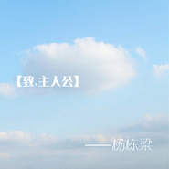

致主人公
============================

|  |  |
| :--: | :-- |
| [ 致主人公](https://emumo.xiami.com/album/2102681691) | **艺人**: [杨栋梁](../index.md) **语种**: 国语 **唱片公司**: 美力星空 **发行时间**: 2017年01月17日 **专辑类别**: EP, 单曲 **专辑风格**:  **播放数**: 9957 **收藏数**: 7 **评论数**: 1  |

## 简介

## 曲目

## 评论

|  |  |  |  |
| :-- | :-- | :-- | :-- |
|  [虾米用户](https://emumo.xiami.com/u/278537572)  2017-03-07 18:27 赞(0) 踩(0) | 
一样的特点容易产生审美疲劳
 |
