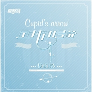

丘比特的弓箭
============================

|  |  |
| :--: | :-- |
| [ 丘比特的弓箭](https://emumo.xiami.com/album/973964342) | **艺人**: [杨栋梁](../index.md) **语种**: 国语 **唱片公司**: 音尚律动 **发行时间**: 2013年07月15日 **专辑类别**: EP, 单曲 **专辑风格**:  **播放数**: 78028 **收藏数**: 6 **评论数**: 0  |

## 简介

丘比特是战神阿瑞斯和爱神阿佛洛狄忒所生的儿子，
 

传说中他有美丽的金发，娇嫩的脸蛋，
 

还有一对可以自由飞翔的翅膀，
 

他有一张金弓，一枝金箭和一枝铅箭，
 

我一直在等着，在等着，
 

等着金箭射中你和我，
 

佳偶便是天成。
 

——《丘比特的弓箭》
 
  

丘比特闭着眼睛射中你我，这就是我们爱情的缘分。
 

我甘愿被丘比特射中，走进你的圈套，每次一见你笑，我的心就怦怦直跳，你呢，是不是也被射中，一见我就脸红心跳？
 

我枕着思念，看月牙弯成丘比特的弓，刚刚划过的那颗流星是不是射向你我的那枝金箭。  

 

90后原创歌手杨栋梁在爱原创音乐网中连续推出了两首单曲《拥有你的感觉》、《避风堂》，都取得了不俗的成绩。网友们对自己歌曲的认可，给了杨栋梁很大的鼓励。这位90后的原创音乐人很想获得更多人得认可，所以他选择在这么短的时间内接二连三的推出单曲，如今他的第三首单曲《丘比特的弓箭》正式亮相爱原创音乐网，一如杨栋梁以往的风格带着少年特有的青春感，相信听过这首歌的朋友都会爱上这首歌。  

 

有人说过，青春给人的感觉就像是整个人从里到外都注满了胶原蛋白，充满了活力和光彩。杨栋梁的歌曲便是让人有这样的感觉，无论是哪首歌，即便是《拥有你的感觉》这种略带伤感的歌曲，也散发着浓浓的青春气息。《丘比特的弓箭》也是一首充满青春活力的歌曲，欢快的旋律和活泼的歌词无一不在彰显出现在年轻人的爱情态度。对于杨栋梁一直保持着的风格，也有人有质疑是否会太单一，但这个90后的小伙子对此有自己的看法，他觉得自己的人生还没有经历过太多的跌宕起伏，若刻意去写一些悲情沧桑的歌曲，难免有“为赋新词强说愁”的嫌疑，他的每首歌都是源于自己对爱情的认识，正是这样，他才能在歌曲中表现的更加的真情实意。  

 

人人都认识罗马神话中的丘比特，杨栋梁新歌选择这个主题，也是希望可以用音乐搭一座与网友们沟通的桥梁，选一个大家都知道的主题，更容易产生共鸣和亲切感。《丘比特的弓箭》歌词只有短短四小节，但欢乐的旋律放佛可以将每一个跳动的音符“实体化”在眼前，听着这歌，心情也会不由自主地欢快起来，情不自禁地跟着歌曲旋转起来。
 

每个人都期待着被丘比特的金箭射中，听一听《丘比特的弓箭》，不管你有没有被丘比特选中，相信都会让现在的你更加幸福。

## 曲目

## 评论

|  |  |  |  |
| :-- | :-- | :-- | :-- |
