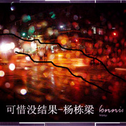
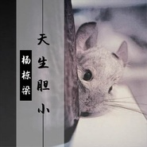

杨栋梁
============================

|  |  |
| :--: | :-- |
| [ 杨栋梁](https://i.xiami.com/liangfen) | **播放数**: 16086392 **粉丝数**: 1059 **评论数**: 101 **地区**: China 中国大陆 **风格**: 国语流行 Mandarin Pop  |

## 档案

杨栋梁，内地90后音乐人，主要代表作《男主角》，以小清新的风格和脱俗质感的声音让他迅速在网络上串红，曲风多变的他每首歌曲都是他个人精心制作，并受到90后歌迷粉丝的追捧与挚爱。 
小档案 
中文名： 杨栋梁 
外文名： box 
国籍： 中国 
民族： 汉族 
出生地： 黑龙江绥化市东富乡腰房村5组 
生日： 1993年04月25日 
代表作： 《拥有你的感觉》 
身高： 172cm 
星座： 金牛座 
毕业院校： 山东大学 
从艺历程 
2008年开始学习编曲，并且第一首单曲《拥有你的感觉》，2012年成立了个人音乐制作工作室从事编曲工作，2013年正式利用闲暇时间创作自己的原创作品，并对歌迷说过“你们的期待就是我继续创作的灵感”，粉丝都称他为：帅气王子，自身独特而质感的声线，伴随他继续成长的道路。

## 专辑

| 名称 | 语种 | 唱片公司 | 发行时间 | 专辑类别 | 专辑风格 |
| :--: | :-- | :-- | :-- | :-- | :-- |
| [ 狡辩](./albums/2104950528.md) | 国语 | 咚吧嗒文化 | 2019年06月18日 | EP, 单曲 |  |
| [ 你是魔鬼吗](./albums/2104949898.md) | 国语 | 咚吧嗒文化 | 2019年06月18日 | EP, 单曲 |  |
| [ 伪装](./albums/2104950408.md) | 国语 | 咚吧嗒文化 | 2019年06月18日 | EP, 单曲 |  |
| [ 最佳配角](./albums/2104950533.md) | 国语 | 咚吧嗒文化 | 2019年06月18日 | EP, 单曲 |  |
| [ 你的姓名](./albums/2104858884.md) | 国语 | 咚吧嗒文化 | 2019年05月09日 | EP, 单曲 |  |
| [ 放开你的手](./albums/2104885218.md) | 国语 | 咚吧嗒文化 | 2019年05月09日 | EP, 单曲 | 国语流行 Mandarin Pop |
| [ 夏天的雪](./albums/2104858830.md) | 国语 | 咚吧嗒文化 | 2019年05月09日 | EP, 单曲 | 国语流行 Mandarin Pop |
| [ 灰色的雨](./albums/2103834457.md) | 国语 | 咚吧嗒文化 | 2018年07月23日 | EP, 单曲 |  |
| [ 我比较简单](./albums/2103614624.md) | 国语 | 禾信科技 | 2018年03月17日 | EP, 单曲 |  |
| [ 还以为你懂](./albums/2103607645.md) | 国语 | 亿格艾 | 2018年03月14日 | EP, 单曲 |  |
| [ 你被藏在我的回忆里](./albums/2103517071.md) | 国语 | 禾信科技 | 2018年02月06日 | EP, 单曲 |  |
| [ 猜不到的结尾](./albums/2103503898.md) | 国语 | 禾信科技 | 2018年01月26日 | EP, 单曲 |  |
| [ 梦幻圣保罗](./albums/2103491964.md) | 国语 | 禾信科技 | 2018年01月17日 | EP, 单曲 |  |
| [ 我们真的不适合](./albums/2102977634.md) | 国语 | 亿格艾 | 2017年12月20日 | EP, 单曲 |  |
| [ 可惜没结果](./albums/2102975502.md) | 国语 | 禾信科技 | 2017年12月16日 | EP, 单曲 |  |
| [ 暴雨天](./albums/2102936063.md) | 国语 | 禾信科技 | 2017年11月17日 | EP, 单曲 |  |
| [ 天生胆小](./albums/2102899980.md) | 国语 | 亿格艾 | 2017年10月31日 | EP, 单曲 |  |
| [ 爱一个人真的有错吗](./albums/2102900111.md) | 国语 | 寿光坚诚 | 2017年10月26日 | EP, 单曲 |  |
| [ 不要用爱的名义剪短爱的翅膀](./albums/2102900114.md) | 国语 | 寿光坚诚 | 2017年10月26日 | EP, 单曲 |  |
| [ 梦境](./albums/2102863755.md) | 国语 | 亿格艾 | 2017年09月26日 | EP, 单曲 |  |
| [ 恋爱恐惧症](./albums/2102856990.md) | 国语 | 亿格艾 | 2017年09月08日 | EP, 单曲 |  |
| [ 透明面具](./albums/2102856989.md) | 国语 | 昌禾文化 | 2017年09月06日 | EP, 单曲 | 流行 Pop |
| [ 耳光](./albums/2102856988.md) | 国语 | 亿格艾 | 2017年08月01日 | EP, 单曲 |  |
| [ 二连萌](./albums/2102856986.md) | 国语 | 亿格艾 | 2017年07月14日 | EP, 单曲 |  |
| [ 热天Hot Weather](./albums/2102781488.md) | 国语 | 美力星空 | 2017年07月11日 | EP, 单曲 |  |
| [ 完美的圈套](./albums/2102770850.md) | 国语 | 亿格艾 | 2017年06月23日 | EP, 单曲 |  |
| [ 安徒生的小说](./albums/2102751794.md) | 国语 | 音尚律动 | 2017年05月22日 | EP, 单曲 |  |
| [ 孤山观梅](./albums/2102748748.md) | 国语 | 美力星空 | 2017年05月16日 | EP, 单曲 |  |
| [ 幸运表情](./albums/2102746043.md) | 国语 | 亿格艾 | 2017年05月10日 | EP, 单曲 |  |
| [ 桃乡行](./albums/2102737832.md) | 国语 | 音尚律动 | 2017年04月25日 | EP, 单曲 |  |
| [ 小雪](./albums/2102734296.md) | 国语 | 美力星空 | 2017年04月18日 | EP, 单曲 |  |
| [ 致主人公](./albums/2102681691.md) | 国语 | 美力星空 | 2017年01月17日 | EP, 单曲 |  |
| [ 圣诞树](./albums/2102678507.md) | 国语 | 美力星空 | 2017年01月10日 | EP, 单曲 |  |
| [ 天使在微笑](./albums/2102665630.md) | 国语 | 美力星空 | 2016年12月19日 | EP, 单曲 |  |
| [ 我的心在海对面](./albums/2100174040.md) | 国语 | 音尚律动 | 2015年08月03日 | EP, 单曲 | 国语流行 Mandarin Pop |
| [ 醉纷飞](./albums/134681927.md) | 国语 | 金麦田文化 | 2015年06月18日 | 录音室专辑 |  |
| [ 眼泪的咸](./albums/222351849.md) | 国语 | 美力星空 | 2015年01月27日 | EP, 单曲 |  |
| [ 思念的痛](./albums/1714115647.md) | 国语 | 美力星空 | 2014年10月22日 | EP, 单曲 |  |
| [ 男主角](./albums/1085368449.md) | 国语 | 美力星空 | 2013年11月25日 | EP, 单曲 |  |
| [ 你的依赖](./albums/1276369218.md) | 国语 | 音尚律动 | 2013年08月12日 | EP, 单曲 |  |
| [ 小女孩手中的音乐盒](./albums/2075086685.md) | 国语 | 音尚律动 | 2013年07月29日 | EP, 单曲 |  |
| [ 丘比特的弓箭](./albums/973964342.md) | 国语 | 音尚律动 | 2013年07月15日 | EP, 单曲 |  |
| [ 拥有你的感觉](./albums/1066010559.md) | 国语 | 音尚律动 | 2013年04月15日 | EP, 单曲 |  |

## 评论

|  |  |  |  |
| :-- | :-- | :-- | :-- |
|  [虾米用户](https://emumo.xiami.com/u/358104299) 悲观的唯心存在现实解构虚... 2020-12-28 08:00 赞(0) 踩(0) | 
44480
 |
|  [虾米用户](https://emumo.xiami.com/u/420294505) 小流星 2019-08-23 08:36 赞(0) 踩(0) | 
爱上你的声音 
 |
|  [虾米用户](https://emumo.xiami.com/u/362586862) 曲终人散 2019-06-09 21:55 赞(0) 踩(0) | 
嘻嘻
 |
|  [虾米用户](https://emumo.xiami.com/u/425384334)  2019-06-02 11:50 赞(0) 踩(0) | 
好棒
 |
|  [虾米用户](https://emumo.xiami.com/u/405354141)  2019-01-24 20:39 赞(0) 踩(0) | 
好听
 |
|  [虾米用户](https://emumo.xiami.com/u/301514447) EXO 2018-10-24 20:20 赞(1) 踩(0) | 
哥哥加油(ง •̀_•́)ง
 |
|  [虾米用户](https://emumo.xiami.com/u/403909061)  2018-10-24 09:05 赞(0) 踩(0) | 
太好听，旋律给力，唱心里爱，
 |
|  [虾米用户](https://emumo.xiami.com/u/335294572)  2018-09-19 11:43 赞(0) 踩(0) | 
我喜欢你
 |
|  [虾米用户](https://emumo.xiami.com/u/335294572)  2018-09-19 11:42 赞(0) 踩(0) | 
你们加油
 |
|  [虾米用户](https://emumo.xiami.com/u/301866739) Li✘Peng★Ran♡ 2018-08-08 13:46 赞(1) 踩(0) | 
加油期待你的下一首歌用你的音乐感动别人
 |
|  [虾米用户](https://emumo.xiami.com/u/377406173)  2018-07-02 15:07 赞(0) 踩(0) | 
太喜欢你了
 |
|  [虾米用户](https://emumo.xiami.com/u/377406173)  2018-07-02 15:07 赞(1) 踩(0) | 
好喜欢你
 |
|  [虾米用户](https://emumo.xiami.com/u/130869816) 遇见你是最美意外 2018-06-07 19:59 赞(0) 踩(0) | 
已是曲中人
 |
|  [虾米用户](https://emumo.xiami.com/u/372417441)  2018-05-26 12:42 赞(0) 踩(0) | 
               
 |
|  [虾米用户](https://emumo.xiami.com/u/354023554) 我只是你的过客，请不要挽... 2018-04-02 16:25 赞(0) 踩(0) | 
喜欢，继续加油，唱出更好听的声音
 |
|  [虾米用户](https://emumo.xiami.com/u/319318298) 我一生钟爱Leslie 2018-03-19 15:59 赞(1) 踩(0) | 
我想我只喜欢张国荣的声音，但是听了你的歌之后觉得你的声音也好听
 |
|  [虾米用户](https://emumo.xiami.com/u/319318298) 我一生钟爱Leslie 2018-03-19 15:57 赞(0) 踩(0) | 
真好听
 |
|  [虾米用户](https://emumo.xiami.com/u/354244205)  2018-03-13 13:16 赞(1) 踩(0) | 
喜欢你的歌，它们如果一直是清新的代表就好了，嘿嘿嘿！谢谢带给我正能量，都要加油↖(^&amp;omega;^)↗
 |
|  [虾米用户](https://emumo.xiami.com/u/328790863)  2018-03-01 19:49 赞(0) 踩(0) | 
好冰啊，为什么作者不回
 |
|  [虾米用户](https://emumo.xiami.com/u/293692544) 你敢给我说话吗？我咬你 2018-03-01 05:24 赞(1) 踩(0) | 
好听
 |
|  [虾米用户](https://emumo.xiami.com/u/5790969) Just listen.... 2018-02-27 21:14 赞(3) 踩(0) | 
加油↖(^&amp;omega;^)↗
 |
|  [虾米用户](https://emumo.xiami.com/u/347081556)  2018-02-03 15:45 赞(1) 踩(0) | 
好听，
 |
|  [虾米用户](https://emumo.xiami.com/u/262665781) 人生如梦，梦里不知身是客... 2018-01-26 19:57 赞(2) 踩(0) | 
很清澈的声音，轻快的曲调，给人很舒服的感觉。我喜欢你的歌。^一^
 |
|  [虾米用户](https://emumo.xiami.com/u/328790863)  2018-01-12 21:03 赞(1) 踩(0) | 
在吗
 |
|  [虾米用户](https://emumo.xiami.com/u/293692544) 你敢给我说话吗？我咬你 2018-01-01 08:49 赞(2) 踩(0) | 
好听
 |
|  [虾米用户](https://emumo.xiami.com/u/340999982) 爱你们 2017-12-23 12:09 赞(1) 踩(0) | 
好听
 |
|  [虾米用户](https://emumo.xiami.com/u/310223168) 我爱你. 2017-12-22 05:16 赞(1) 踩(0) | 
在酷狗 不要一直刷存在感
 |
|  [虾米用户](https://emumo.xiami.com/u/105826016) 究竟星有几高，挂空中使我... 2017-10-12 16:52 赞(9) 踩(0) | 
知道吗，我是个国粤老歌金曲迷，就是只喜欢八九十年代经典歌曲的歌迷。初听你的歌，觉得竟然被吸引了，哈哈，我再也不用忍受日韩欧美靡靡之音，不用忍受五月天庄心研之类的鬼哭狼嚎撕心裂肺了。我中华乐坛后继有人！
 |
|  [虾米用户](https://emumo.xiami.com/u/276089229)  2017-10-07 17:25 赞(1) 踩(0) | 
棒棒哒！！声音好好听
 |
|  [虾米用户](https://emumo.xiami.com/u/327804623) 笑着说再见 2017-10-02 07:22 赞(1) 踩(0) | 
加油
 |
|  [虾米用户](https://emumo.xiami.com/u/287403288)  2017-09-25 22:14 赞(2) 踩(0) | 
加油，梦想近一尺
 |
| ⇒ |  [虾米用户](https://emumo.xiami.com/u/287403288)  2017-10-03 22:00 赞(0) 踩(0) | 
加油
 |
| ⇒ |  [虾米用户](https://emumo.xiami.com/u/287403288)  2017-10-03 22:35 赞(0) 踩(0) | 
<q><b>平淡说：</b></q>
 |
|  [虾米用户](https://emumo.xiami.com/u/321837030)  2017-09-15 21:34 赞(1) 踩(0) | 
声音和颜值都这么好，为什么这么少粉丝
 |
|  [虾米用户](https://emumo.xiami.com/u/323256881)   2017-09-05 23:56 赞(1) 踩(0) | 
加油！加油
 |
|  [虾米用户](https://emumo.xiami.com/u/321400990)  2017-08-31 18:41 赞(1) 踩(0) | 
好听
 |
|  [虾米用户](https://emumo.xiami.com/u/321650596)  2017-08-26 13:56 赞(2) 踩(0) | 
声音很好听   
 |
|  [虾米用户](https://emumo.xiami.com/u/317478623)  2017-08-21 22:44 赞(2) 踩(0) | 
相信你，加you
 |
|  [虾米用户](https://emumo.xiami.com/u/319366268)  2017-08-17 13:25 赞(3) 踩(0) | 
声音很好听  ！加油！
 |
|  [虾米用户](https://emumo.xiami.com/u/316352170) 如果只是遇见不能停留 2017-08-01 16:10 赞(3) 踩(0) | 
爱死你
 |
| ⇒ |  [虾米用户](https://emumo.xiami.com/u/316352170) 如果只是遇见不能停留 2017-08-26 09:04 赞(0) 踩(0) | 
爱
 |
| ⇒ |  [虾米用户](https://emumo.xiami.com/u/316352170) 如果只是遇见不能停留 2017-08-28 20:07 赞(0) 踩(0) | 
<q><b>鹿哥最帅说：</b></q>
 |
|  [虾米用户](https://emumo.xiami.com/u/316352170) 如果只是遇见不能停留 2017-08-01 16:09 赞(3) 踩(0) | 
 
 |
|  [虾米用户](https://emumo.xiami.com/u/314053937)  2017-07-22 17:36 赞(3) 踩(0) | 
我超喜欢    我的心在海对面     我听了一年
 |
|  [虾米用户](https://emumo.xiami.com/u/312552552)  2017-07-17 13:44 赞(3) 踩(0) | 
你的声音很好听   
 |
|  [虾米用户](https://emumo.xiami.com/u/312653852)  2017-07-16 18:04 赞(3) 踩(0) | 
非常好听、加油！  
 |
|  [虾米用户](https://emumo.xiami.com/u/312592689)  2017-07-16 13:02 赞(5) 踩(0) | 
加油梁棒棒的
 |
|  [虾米用户](https://emumo.xiami.com/u/268439250) 呵呵(^_^) 2017-07-16 09:34 赞(4) 踩(0) | 
   
 |
|  [虾米用户](https://emumo.xiami.com/u/292126076) 互粉吗？ 2017-07-12 17:15 赞(4) 踩(0) | 
加油，支持你哦  
 |
|  [虾米用户](https://emumo.xiami.com/u/301915490)  2017-07-09 16:38 赞(2) 踩(0) | 
     
 |
|  [虾米用户](https://emumo.xiami.com/u/277743616)  2017-06-27 08:14 赞(3) 踩(0) | 
杨栋梁加油啊
 |
|  [虾米用户](https://emumo.xiami.com/u/307561365)  2017-06-26 16:00 赞(2) 踩(0) | 
杨栋梁，爱你！加油 
 |
|  [虾米用户](https://emumo.xiami.com/u/277964460) 要走多远，迷失的自己才能... 2017-06-22 20:15 赞(3) 踩(0) | 
嗯嗯哒
 |
|  [虾米用户](https://emumo.xiami.com/u/300914463)  2017-06-01 06:39 赞(3) 踩(0) | 
好听
 |
|  [虾米用户](https://emumo.xiami.com/u/297324251)  2017-05-30 11:25 赞(2) 踩(0) | 
酷
 |
|  [虾米用户](https://emumo.xiami.com/u/297324251)  2017-05-30 11:24 赞(2) 踩(0) | 
帅
 |
|  [虾米用户](https://emumo.xiami.com/u/297706129)  2017-05-30 10:44 赞(2) 踩(0) | 
很不错(⊙o⊙)哦，加油
 |
|  [虾米用户](https://emumo.xiami.com/u/297706129)  2017-05-30 10:44 赞(2) 踩(0) | 
声音挺好听的
 |
|  [虾米用户](https://emumo.xiami.com/u/292013796)  2017-05-10 17:17 赞(4) 踩(0) | 
你的声音好好听!
 |
|  [虾米用户](https://emumo.xiami.com/u/294709954)  2017-05-08 16:17 赞(4) 踩(0) | 
好
 |
|  [虾米用户](https://emumo.xiami.com/u/292115000)  2017-04-29 18:40 赞(4) 踩(0) | 
哇*^_^*
 |
|  [虾米用户](https://emumo.xiami.com/u/290795225)  2017-04-25 18:18 赞(4) 踩(0) | 
加把劲儿
 |
|  [虾米用户](https://emumo.xiami.com/u/290795225)  2017-04-25 18:18 赞(4) 踩(0) | 
嗯，还可以
 |
|  [虾米用户](https://emumo.xiami.com/u/291194362)  2017-04-24 21:01 赞(4) 踩(0) | 
加油
 |
|  [虾米用户](https://emumo.xiami.com/u/277540089)  2017-04-22 08:15 赞(4) 踩(0) | 
加油呀！！！
 |
|  [虾米用户](https://emumo.xiami.com/u/277540089)  2017-04-22 08:13 赞(4) 踩(0) | 
好听
 |
|  [虾米用户](https://emumo.xiami.com/u/289175507) 走自己的路，让别人说去吧... 2017-04-19 17:40 赞(3) 踩(0) | 
加油   
 |
|  [虾米用户](https://emumo.xiami.com/u/267034119) 人生一场戏，完结时很是伤... 2017-04-16 15:04 赞(3) 踩(0) | 
棒棒哒
 |
|  [虾米用户](https://emumo.xiami.com/u/288756600) 你可笑的甜言蜜语，再也愈... 2017-04-15 07:52 赞(3) 踩(0) | 
好听，好喜欢
 |
|  [虾米用户](https://emumo.xiami.com/u/281299243)  2017-04-15 01:39 赞(3) 踩(0) | 
支持你
 |
|  [虾米用户](https://emumo.xiami.com/u/280633014)  2017-04-08 13:56 赞(4) 踩(0) | 
声音吸引了我，真的很好听，说不出的感觉，趁着评论还少，来一炮。。。。。
 |
|  [虾米用户](https://emumo.xiami.com/u/285969638)  2017-04-04 20:26 赞(3) 踩(0) | 
加油拜拜
 |
|  [虾米用户](https://emumo.xiami.com/u/285708182) 呵呵 2017-04-04 09:30 赞(1) 踩(0) | 
加油^_^
 |
|  [虾米用户](https://emumo.xiami.com/u/280399982)  2017-03-31 18:55 赞(1) 踩(0) | 
真的好好听
 |
|  [虾米用户](https://emumo.xiami.com/u/282834067) 心随歌动。 2017-03-24 02:00 赞(0) 踩(0) | 
歌曲非常好听。棒
 |
|  [虾米用户](https://emumo.xiami.com/u/238404028) 巡皇小哥哥 2017-03-23 15:19 赞(1) 踩(0) | 
棒棒哒
 |
|  [虾米用户](https://emumo.xiami.com/u/238404028) 巡皇小哥哥 2017-03-23 15:18 赞(1) 踩(0) | 
棒棒的   
 |
|  [虾米用户](https://emumo.xiami.com/u/268791604) 听的音乐，代表着自己当时... 2017-03-04 10:04 赞(1) 踩(0) | 
声音好好
 |
|  [虾米用户](https://emumo.xiami.com/u/269680379) 其实你很美 2017-03-02 22:07 赞(0) 踩(0) | 
666
 |
|  [虾米用户](https://emumo.xiami.com/u/276294001)  2017-02-27 22:34 赞(0) 踩(0) | 
好
 |
|  [虾米用户](https://emumo.xiami.com/u/273399370)  2017-02-14 15:23 赞(0) 踩(0) | 
好听一点嘠
 |
|  [虾米用户](https://emumo.xiami.com/u/74008016) 用音乐和灵魂对话 2017-02-02 15:36 赞(0) 踩(0) | 
加油
 |
|  [虾米用户](https://emumo.xiami.com/u/74008016) 用音乐和灵魂对话 2017-02-02 15:36 赞(0) 踩(0) | 
支持
 |
|  [虾米用户](https://emumo.xiami.com/u/261649012)  2017-01-15 11:35 赞(0) 踩(0) | 
棒棒哒
 |
|  [虾米用户](https://emumo.xiami.com/u/247240685)  2016-12-24 22:21 赞(1) 踩(0) | 
声线好好
 |
|  [虾米用户](https://emumo.xiami.com/u/120124902)  2016-08-12 12:54 赞(2) 踩(0) | 
好
 |
|  [虾米用户](https://emumo.xiami.com/u/201235678) 呵呵 2016-07-23 01:44 赞(20) 踩(0) | 
声音太好听了好喜欢你的声音  
 |
| ⇒ |  [虾米用户](https://emumo.xiami.com/u/290795225)  2017-04-25 18:23 赞(0) 踩(0) | 
666
 |
| ⇒ |  [虾米用户](https://emumo.xiami.com/u/290795225)  2017-04-25 18:23 赞(0) 踩(0) | 

 |
|  [虾米用户](https://emumo.xiami.com/u/202981006)  2016-07-20 10:41 赞(1) 踩(0) | 
好听
 |
|  [虾米用户](https://emumo.xiami.com/u/202981006)  2016-07-20 10:41 赞(1) 踩(0) | 
喜欢你的声音
 |
|  [虾米用户](https://emumo.xiami.com/u/195747870) 既然爱了，我就不会放开爱... 2016-06-30 16:46 赞(18) 踩(0) | 
加油加油
 |
|  [虾米用户](https://emumo.xiami.com/u/187647394) 且行且珍惜遇见你花光了我... 2016-06-28 15:25 赞(2) 踩(0) | 

 |
|  [虾米用户](https://emumo.xiami.com/u/126940622)  2016-05-27 16:51 赞(14) 踩(0) | 
声音好听 加油↖(^ω^)↗
 |
|  [虾米用户](https://emumo.xiami.com/u/153922212)  2016-05-01 15:33 赞(2) 踩(0) | 
支持
 |
|  [虾米用户](https://emumo.xiami.com/u/55679396) 拒绝土嗨，正视电音 2016-04-26 22:29 赞(2) 踩(0) | 
加油
 |
|  [虾米用户](https://emumo.xiami.com/u/91132362) 爱上他是我的错。 2016-04-23 09:51 赞(1) 踩(0) | 
不错
 |
|  [虾米用户](https://emumo.xiami.com/u/133063622)  2016-04-03 14:43 赞(2) 踩(0) | 
声音好好
 |
|  [虾米用户](https://emumo.xiami.com/u/59541474)  2016-02-17 12:49 赞(2) 踩(0) | 
   
 |
|  [虾米用户](https://emumo.xiami.com/u/98012982)  2016-01-06 21:12 赞(2) 踩(0) | 
我支持你加油
 |
| ⇒ |  [虾米用户](https://emumo.xiami.com/u/59541474)  2016-02-17 12:48 赞(0) 踩(0) | 
我也支持
 |
