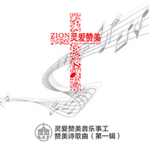

杨沐恩
============================

|  |  |
| :--: | :-- |
| [ 杨沐恩](https://i.xiami.com/yme6281) | **地区**: China 中国大陆 **风格**: 当代基督 CCM / Contemporary Christian Music, 国语流行 Mandarin Pop **播放数**: 2473892 **粉丝数**: 303 **评论数**: 19  |

## 档案

音乐人：杨沐恩 专业：  词曲创作、音乐监制  灵爱赞美音乐事工； L·O·V·E敬拜团； 新浪微博：@杨沐恩音乐人  代表作：你在他乡还好吗；月亮船、纸飞机、亲爱的你好想我吗…… 赞美诗作品：主耶稣爱你、十架圣爱、最美的礼物、合而为一的爱、主日平安、仰望、喜讯……

## 专辑

| 名称 | 语种 | 唱片公司 | 发行时间 | 专辑类别 | 专辑风格 |
| :--: | :-- | :-- | :-- | :-- | :-- |
| [ 各族各方齐赞美](./albums/5022378677.md) | 国语 | 推星传媒 | 2021年01月08日 | EP, 单曲 | 国语流行 Mandarin Pop |
| [ 感恩为祭 赞美为歌](./albums/5022370840.md) | 国语 | 推星传媒 | 2021年01月08日 | EP, 单曲 | 国语流行 Mandarin Pop |
| [ 愿做小小仆人](./albums/5021777097.md) | 国语 | 推星传媒 | 2020年10月26日 | EP, 单曲 | 国语流行 Mandarin Pop |
| [ 草木之间-王妮娜](./albums/2104620543.md) | 国语 | 独立发行 | 2019年02月23日 | 录音室专辑 | 国语流行 Mandarin Pop |
| [ 静月情思 - 王昭懿](./albums/2103480266.md) | 国语 | 独立发行 | 2018年01月06日 | 录音室专辑 | 流行 Pop, 国语流行 Mandarin Pop |
| [ 莲香 - 潘田果](./albums/2102811408.md) | 国语 | 独立发行 | 2017年08月09日 | 录音室专辑 | 流行 Pop, 国语流行 Mandarin Pop, 独立流行 Indie Pop |
| [ 海棠花 - 潘田果杨沐恩作品](./albums/2102759723.md) | 国语 | 独立发行 | 2017年06月03日 | 录音室专辑 | 流行 Pop, 国语流行 Mandarin Pop |
| [ 如果有一天-李姝涵杨沐恩作品](./albums/2102750085.md) | 国语 | 独立发行 | 2017年05月18日 | 录音室专辑 | 流行 Pop, 国语流行 Mandarin Pop |
| [ 杨沐恩原创歌曲经典选辑二杨沐恩作品](./albums/2102753048.md) | 国语 | 独立发行 | 2017年05月05日 | 录音室专辑 | 流行 Pop, 国语流行 Mandarin Pop |
| [ 杨沐恩原创歌曲经典选辑一杨沐恩作品](./albums/2102752583.md) | 国语 | 独立发行 | 2017年05月01日 | 录音室专辑 | 流行 Pop, 国语流行 Mandarin Pop |
| [ 赞美诗歌曲（原创专辑一）](./albums/2102727540.md) | 国语 | 独立发行 | 2017年04月16日 | 录音室专辑 | 流行 Pop, 华语唱作人 Chinese Singer-Songwriter |
| [ 主耶稣爱你](./albums/2102727542.md) | 国语 | 独立发行 | 2017年04月05日 | EP, 单曲 | 流行 Pop, 华语唱作人 Chinese Singer-Songwriter |
| [ 最美的礼物-赞美诗原版伴奏音乐（第一辑）灵爱赞美音乐事工](./albums/2102659850.md) | 国语 | 独立发行 | 2016年12月06日 | 录音室专辑 | 当代基督 CCM / Contemporary Christian Music, 流行 Pop |
| [ 灵爱赞美•新歌EP(原创赞美诗歌曲)灵爱赞美音乐事工](./albums/2102659840.md) | 国语 | 独立发行 | 2016年12月06日 | 录音室专辑 | 宗教新世纪 Religionary New Age |
| [ 灵爱赞美 - 原创赞美诗歌曲第一辑灵爱赞美音乐事工](./albums/2100267108.md) | 国语 | 灵爱赞美音乐事工 | 2016年01月27日 | 录音室专辑 | 国语流行 Mandarin Pop |
| [ 邻里情怀 - 王雯杨沐恩作品](./albums/2100244824.md) | 国语 | 独立发行 | 2015年12月08日 | 录音室专辑 | 城市民谣 Urban Folk, 国语流行 Mandarin Pop |
| [ 杨沐恩原创歌曲新专辑（一）歌曲合辑](./albums/2100235844.md) | 国语 | 独立发行 | 2015年11月11日 | 录音室专辑 | 当代唱作人 Contemporary Singer-Songwriter, 国语流行 Mandarin Pop |
| [ 月亮·姑娘杨沐恩作品](./albums/1000081875.md) | 国语 | 独立发行 | 2014年05月14日 | EP, 单曲 | 国语流行 Mandarin Pop |
| [ 家是天堂杨沐恩最新原创歌曲CD专辑](./albums/501584.md) | 国语 | 星外星音乐 | 2012年02月18日 | 录音室专辑 | 国语流行 Mandarin Pop |

## 评论

|  |  |  |
| :-- | :-- | :-- |
|  [虾米用户](https://emumo.xiami.com/u/407109651) 耶稣爱你 2020-09-02 06:28 赞(0) 踩(0) | 
感谢主，愿主祝福姐姐一切的事工； 耶稣爱您我也爱您   
 |
|  [虾米用户](https://emumo.xiami.com/u/46824417)  2020-01-20 18:12 赞(0) 踩(0) | 
杨虹老师吗？
 |
|  [虾米用户](https://emumo.xiami.com/u/291265035) 神是恩宠的源泉 2018-01-22 09:48 赞(1) 踩(0) | 
今天才知道您原来是姐妹，上帝赐福你，加倍宠爱恩膏亲爱的姐妹
 |
|  [虾米用户](https://emumo.xiami.com/u/325135863) 灵魂兴盛！凡事兴盛！ 2018-01-20 21:11 赞(1) 踩(0) | 
亲爱的姐妹，愿您蒙恩！加油！你最棒了
 |
|  [虾米用户](https://emumo.xiami.com/u/325135863) 灵魂兴盛！凡事兴盛！ 2017-11-30 17:03 赞(1) 踩(0) | 
耶稣爱你，我也爱你 
 |
|  [虾米用户](https://emumo.xiami.com/u/325135863) 灵魂兴盛！凡事兴盛！ 2017-11-07 23:55 赞(1) 踩(0) | 
愿神大大赐福您  
 |
|  [虾米用户](https://emumo.xiami.com/u/325135863) 灵魂兴盛！凡事兴盛！ 2017-10-30 08:34 赞(1) 踩(0) | 
感谢赞美主！God_bless_you  
 |
|  [虾米用户](https://emumo.xiami.com/u/4285074) 仍然是努力只不想去力拼 2017-08-05 17:01 赞(1) 踩(0) | 
记得你以前的名字叫&amp;ldquo;杨虹&amp;rdquo;
 |
|  [虾米用户](https://emumo.xiami.com/u/305131641)  2017-07-16 07:30 赞(2) 踩(0) | 
主内平安
 |
|  [虾米用户](https://emumo.xiami.com/u/51664398)  2017-06-01 15:48 赞(3) 踩(0) | 
好想听你的《婚姻悟语》 可是没有     
 |
|  [虾米用户](https://emumo.xiami.com/u/299928643) 哈利路亚 2017-05-28 19:55 赞(2) 踩(0) | 
耶稣爱你噢！ 
 |
|  [虾米用户](https://emumo.xiami.com/u/17279033)  2015-11-07 10:40 赞(1) 踩(0) | 
支持沐恩姐姐
 |
| ⇒ |  [虾米用户](https://emumo.xiami.com/u/31244510) 以马内利 2015-12-08 14:35 赞(0) 踩(0) | 
谢谢你！愿上帝祝福你！
 |
| ⇒ |  [虾米用户](https://emumo.xiami.com/u/17279033)  2015-12-11 16:49 赞(0) 踩(0) | 
<q><b>杨沐恩说：</b></q>
 |
|  [虾米用户](https://emumo.xiami.com/u/12380672) 我还没想好要写什么... 2015-03-18 23:00 赞(0) 踩(0) | 
以马内利
 |
| ⇒ |  [虾米用户](https://emumo.xiami.com/u/31244510) 以马内利 2017-01-27 00:18 赞(0) 踩(0) | 
耶稣爱你！以马内利！
 |
|  [虾米用户](https://emumo.xiami.com/u/15240170) 亘古风情绕，韵音谁赶超;... 2014-05-12 21:58 赞(1) 踩(0) | 
精品佳作，精彩演绎！祝老师创作颇丰！
 |
| ⇒ |  [虾米用户](https://emumo.xiami.com/u/31244510) 以马内利 2014-05-12 22:07 赞(0) 踩(0) | 
感恩好朋友支持！
 |
| ⇒ |  [虾米用户](https://emumo.xiami.com/u/15240170) 亘古风情绕，韵音谁赶超;... 2014-05-24 17:35 赞(0) 踩(0) | 
<q><b>杨沐恩说：</b></q>
 |
