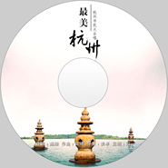

最美杭州
============================

|  |  |
| :--: | :-- |
| [ 最美杭州](https://emumo.xiami.com/album/2100374062) | **艺人**: [阳一](../index.md) **语种**: 国语 **唱片公司**: 禾音文化 **发行时间**: 2016年07月25日 **专辑类别**: EP, 单曲 **专辑风格**:  **播放数**: 3305 **收藏数**: 6 **评论数**: 0  |

## 简介

 

&nbsp; &nbsp; &nbsp; &nbsp; 《最美杭州》是一首以众筹形式发起制成的公益歌曲。由杭州本土词作家施翔，作曲家陆琦，联手著名歌手，音乐人阳一共同发起创作。自发布之日起，就一直受到各界爱心人士及相关媒体的关注和支持。
 

&nbsp; &nbsp; &nbsp; &nbsp;1、G20峰会在杭州的举行，对于杭州普通百姓所带来的关注和影响是巨大的、是百年一遇的盛大喜事，杭州人民为此欢欣鼓舞。这也极大地激发了我们创作团队作为杭州本土人士的创作灵感和欲望，大家聚在一起热烈商议，期待着为此能出一份力。希望依托举世瞩目的G20峰会召开为最佳锲机，做一项有意义的公益活动，来宣传推广中国、宣传推广杭州，在世人面前充分展示人间天堂的秀美山水和人文风貌。
 

&nbsp; &nbsp; &nbsp; &nbsp; 2、《最美杭州》歌曲作为一项公益活动，是基于有着世界著名文化旅游城市之美称的杭州为主题，她不仅以优美的景色、秀丽的风光著称，更有着深厚的中华文化底蕴和独具江南特色的风味而闻名于世。
 

&nbsp; &nbsp; &nbsp; &nbsp;3、本次活动一经发起即得到了杭州各界朋友的热烈响应和大力支持：有许多杭城知名人士也踊跃参与其中：包括杭州浙江广播电台主持人小马、杭州电视台阿六头（沈益民）、“麦麦童声”、“D-A”录音棚、钱江频道主持人李玮，方好，梁策、浙江卫视主持人罗希、费费、下沙闻潮派出所、杭州乐人组合、禾音文化、1900工作室、瑞米录音棚、杭州电子科技大学、浙江传媒学院、浙江育英学院，杭州师范大学、杭州新东方学校、浙江电视台钱江频道、今日头条等等，以及各行各业的热心人士的鼎力协助。
 

&nbsp; &nbsp; &nbsp; &nbsp;4、创作团队希望通过努力，制作出一部优秀的作品（MV）来展示杭州之美好、杭州之热力，以回馈广大爱心人士的关心和帮助，为G20峰会放声飞歌。每一位参与者都是歌曲的宣传大使，也是杭州的形象宣传大使。
 

&nbsp; &nbsp; &nbsp; &nbsp; 5、参与歌曲创作、演唱、拍摄的大多是来自本土的地道的杭州人士，很多都是第一次参加的来自各行各业的草根人士，他们凭借着一腔热血和对故土的挚爱，不计个人得失报酬，自愿踊跃报名参与了这次公益活动。&nbsp;
 

&nbsp; &nbsp; &nbsp; &nbsp; 6、本次活动的众筹形式即：歌曲创作、制作、录音、MV拍摄及参与人员等等的所有开支费用均为共同资助形成。
 
&nbsp; &nbsp; &nbsp; &nbsp; &nbsp;7、歌曲《最美杭州》以描写和讴歌杭州的山美水美城市美为主题，全情抒发了杭州人的勤奋和热情、杭州人的胸怀和自豪，充分展示了杭州的美不仅在山、水、景，更是谱写出了杭州人的情怀和热爱。歌词以细微的笔触，浓浓的爱意描绘出杭州的风土人情，展现了杭州的开放与包容，大气与精致。旋律通俗易唱，流畅优美并有着江南音乐元素的独特韵味，曲调朗朗上口、老少皆宜，不失为大众易学易唱的普及之歌。MV所呈现的画面大气唯美，不仅多视角的展现了人、物、景之美，更像是一幅展现杭州不凡的气度和天地人和的绚丽画卷。

 

 
 

演出名单
 

  
阿海  
蔡晓雨  
陈宏 &nbsp;  
陈洁  
陈慷  
陈乐思  
陈燕  
陈奕凯  
陈煜&nbsp; &nbsp;  
丁宏  
丁鹏 &nbsp;  
丁震华  
樊文馨  
方好  
费沁雯  
韩燕敏  
江芳  
李高云  
李玮  
梁策  
林鲁杰  
刘小雁  
卢志荣  
陆乐   
陆琦  
罗希  
罗颖  
倪立杭  
Nance Kevin Adams（美籍）  
欧阳见  
沈群英  
沈一平  
沈益民（阿六头）  
施翔  
石倩倩  
孙宇轲  
汤小群  
王雨晴  
吴晓芳  
小马  
谢世雄  
忻皓  
薛琪琪  
严萍  
阳一  
姚可儿  
袁春  
张福林  
张晓燕  
张勇  
章磊  
章熙妍  
赵怡然  
郑俊海  
郑明君  
周全  
朱燕萍

## 曲目

- [最美杭州](./2100374062/xLJjcY9c81e.md)
- [最美杭州(伴奏)](./2100374062/xLJjcZb6fdc.md)

## 评论

|  |  |  |  |
| :-- | :-- | :-- | :-- |
