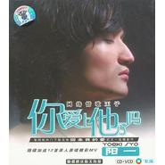

你爱上他了吗
============================

|  |  |
| :--: | :-- |
| [ 你爱上他了吗](https://emumo.xiami.com/album/5385) | **艺人**: [阳一](../index.md) **语种**: 国语 **唱片公司**: 华友飞乐 **发行时间**: 2005年12月01日 **专辑类别**: 录音室专辑 **专辑风格**:  **播放数**: 1044804 **收藏数**: 14 **评论数**: 0  |

## 简介

  
  
继网络热门下载金曲“回来我的爱”后又一动情新作  
随碟加送 12 首原人原唱精彩 MV 随碟赠送精美海报  
华友世纪与飞乐唱片合并成立“华友飞乐数码音乐”  
同时全球同期发行第一张原创唱片《你爱上他了吗》！  
  
阳一的第二张专辑主打歌《你爱上他了吗》是近年中国流行乐坛当中非常难得的一首词曲俱佳的作品。特别感人至深的歌词与经典伤感的旋律让你在听的时候不知不觉的掉泪，相信每一个曾经被爱情伤害过的人都会有如此的感动。“你爱上他了吗？和我一起你不快乐吗？如果你心里想的是他，就在我伤心的时候，沉默的离开吧……”回首过去，黄品源以一首《你怎么舍的我难过》被评为港台伤感情歌代表。今天，阳一《你爱上他了吗》这首内地乐坛的伤感情歌代表作将再次打破这个歌坛神话。中国乐坛从来不缺音乐才子，《你爱上他了吗》在唱片行业的低潮时期，让大家再次看到了超强的创作实力与经典传承的作品。  
  
阳一《你爱上他了吗》由广东著名音乐人覃元隆作词，覃元隆和王旦昕作曲；覃元隆是阳一的好朋友，曾为邵雨涵创作了《我是超级女声》、《凌晨派对》；其创作的大长今主题曲《让爱燃起》和仙剑主题曲《寂寞的秋天》等热门歌曲已在邵雨涵《超级女声》专辑中出版发行。  
 

## 曲目

- [你爱上他了吗](./5385/His96713.md)
- [谁不服?单挑!](./5385/Hit7adf5.md)
- [分手才得永恒](./5385/bhjoa9441.md)
- [男人40一枝花MV](./5385/bhjpd9468.md)
- [雪花飘](./5385/bhjqd9f49.md)
- [触电](./5385/b7kle5667.md)
- [撕了那封信](./5385/bXlg37a36.md)
- [求爱进行曲](./5385/b7knfd45c.md)
- [蝴蝶的眼泪](./5385/b7kof5d8a.md)
- [不要再来伤害我MV](./5385/b7kpe2b56.md)
- [小雨](./5385/Hi2952d6.md)
- [Marianna](./5385/bhjx1bdef.md)
- [报答](./5385/bhjy9ae76.md)
- [让爱燃起"大长今"主题曲改编版](./5385/b7ktea239.md)
- [猪头](./5385/cxmi2ae0c.md)
- [回来我的爱](./5385/bhj1dba77.md)

## 评论

