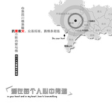

阳一
============================

|  |  |
| :--: | :-- |
| [ 阳一](https://i.xiami.com/yangyi) | **地区**: China 中国大陆 **风格**: 国语流行 Mandarin Pop **播放数**: 5083373 **粉丝数**: 4036 **评论数**: 27  |

## 档案

独立音乐人 
艺名 : 阳一 
姓名 : 章阳益 
英文名 : Yoeki Syo 
生日 : 1月1日 
生肖 : 鸡 
星座 : 摩羯座 
血型 : O 
籍贯 : 浙江余姚 
身高 : 173CM 
体重 : 60KG 
家庭成员 : 爸爸、妈妈、姐姐 
爱好 : 上网、唱歌、摄影 
喜爱的运动 : 登山、网球 
毕业院校 : 杭州电子科技大学 
相关组织 : 新力有限公司(英属)、宁波世阳进出口有限公司、杭州乐人堂音乐工作室、1900影像工作室、香榭里录音棚、北京华友飞乐数码音乐科技有限公司、广州市音福文化传播有限公司。 
大事记 
阳一，著名网络歌手，音乐制作人，被誉为网络情歌王子。无论在网络还是现实生活中，深情款款，忧郁伤感的阳一情歌，刮起了一阵情歌旋风，一度成为阳一现象。歌曲深受大众喜爱，歌迷达数千万。 
阳一出生浙江余姚，毕业于杭州电子科技大学会计学专业，爱好广泛，精通网络，音乐，摄影，设计等。在校期间，表现优异，在各爱好行业就小有名气。在学生时代，阳一就创建了专业音乐工作室，建立高档录音棚。2003年阳一参与拍摄了全省高校首部纯原创DV电影《象一场爱情》，2004年阳一制作了全国高校首张纯原创校园音乐专集，(从策划，投资，词曲，编曲，录音，演奏，演唱，后期，到设计，印刷，推广全部由学生完成)，前所未有的，同时阳一又在境外开办贸易公司，能力强，素质高，成了学生心目中的偶像。 
2005年4月签约飞乐唱片，同年5月推出首张个人专集《回来我的爱》。 
同名歌曲《回来我的爱》在全球最大的中文搜索网站“百度中文搜索风云榜”连续上榜320多天，累计下载1900多万次，成为2005年度网络最热门的歌曲。 
阳一《回来我的爱》上榜iTunes全球音乐下载销量排行榜(第12名)，这也是华语歌曲首次登上全球音乐下载销量排行榜，代表华语音乐向国际歌坛迈出了可喜的一步。 
阳一《回来我的爱》2005年中国移动通讯有限公司中国无线音乐销量榜连续上榜前十达8个月，彩铃累计下载过千万，《回来我的爱》成为全国百姓手机中炙手可热的彩铃。 
2005年12月，阳一入选中国中央电视台CCTV-3中国音乐电视2005年十大新人。 
“网络娱乐英雄会”2005年度风云人物提名。 
2005年雅虎华语榜中榜最热门年度歌曲提名。

## 专辑

| 名称 | 语种 | 唱片公司 | 发行时间 | 专辑类别 | 专辑风格 |
| :--: | :-- | :-- | :-- | :-- | :-- |
| [ 最美杭州](./albums/2100374062.md) | 国语 | 禾音文化 | 2016年07月25日 | EP, 单曲 |  |
| [ 禅说](./albums/2100374063.md) | 国语 | 禾音文化 | 2014年09月07日 | EP, 单曲 |  |
| [ 马上拜年](./albums/1890029060.md) | 国语 | 独立发行 | 2014年01月18日 | EP, 单曲 | 国语流行 Mandarin Pop |
| [ 赢得更精彩2010年南非世界杯主题歌中文版](./albums/395452.md) | 国语 | 新力音乐 | 2010年03月29日 | EP, 单曲 | 国语流行 Mandarin Pop |
| [ 她爱上了别人新歌+精选](./albums/222114.md) | 国语 | 音福文化 | 2008年08月12日 | 录音室专辑 |  |
| [ 爱在每个人心中传递浙江省青年志愿者抗灾救险主题歌](./albums/1790110370.md) | 国语 | 独立发行 | 2008年05月18日 | EP, 单曲 | 国语流行 Mandarin Pop |
| [ 聆听](./albums/5383.md) | 国语 | 音福文化 | 2007年08月01日 | 录音室专辑 |  |
| [ 感恩永恒](./albums/5384.md) | 国语 | 新力音乐 | 2007年01月01日 | 录音室专辑 | 国语流行 Mandarin Pop |
| [ 你爱上他了吗](./albums/5385.md) | 国语 | 华友飞乐 | 2005年12月01日 | 录音室专辑 |  |
| [ 回来我的爱](./albums/5386.md) | 国语 | 飞乐唱片 | 2005年07月01日 | 录音室专辑 |  |
| [ 爱无国界“2004年印度洋地震海啸”赈灾公益歌曲群星义唱](./albums/990110075.md) | 国语 | 独立发行 | 2004年12月31日 | EP, 单曲 | 国语流行 Mandarin Pop |

## 评论

|  |  |  |
| :-- | :-- | :-- |
|  [虾米用户](https://emumo.xiami.com/u/358104299) 悲观的唯心存在现实解构虚... 2021-01-07 02:40 赞(0) 踩(0) | 
45665
 |
|  [虾米用户](https://emumo.xiami.com/u/312768147) 内心的故事都寄予音乐，听... 2020-02-04 03:31 赞(0) 踩(0) | 
为什么再也听不到那首《从今以后》了，所有音乐网站都没阳一你的版本呢，要知道这也是你的成名曲喔
 |
|  [虾米用户](https://emumo.xiami.com/u/409947990)  2020-01-06 18:54 赞(0) 踩(0) | 
好喜欢你的歌曲，10几年前听过，现在又在认真聆听，期待你再出几首新歌。
 |
|  [虾米用户](https://emumo.xiami.com/u/380198762)  2018-11-26 04:44 赞(1) 踩(0) | 
很好 
 |
|  [虾米用户](https://emumo.xiami.com/u/357398296) 98458555855 2018-07-29 09:09 赞(1) 踩(0) | 
觉得，觉得还继续好几等级，回答经济系叫撒机械姬
 |
|  [虾米用户](https://emumo.xiami.com/u/4044096)   2018-03-26 20:16 赞(1) 踩(0) | 
擦 没想到我妈手机的铃声是这个什么《回来我的爱》的副歌 还无意间和阳一做了校友 chilling。。。
 |
|  [虾米用户](https://emumo.xiami.com/u/300227011)  2017-10-22 13:59 赞(1) 踩(0) | 
阳一老师，我一定会背过这首歌的
 |
|  [虾米用户](https://emumo.xiami.com/u/291984013)  2017-05-27 08:11 赞(1) 踩(0) | 
好听，你可不能放弃
 |
|  [虾米用户](https://emumo.xiami.com/u/291984013)  2017-05-27 08:11 赞(1) 踩(0) | 
神一般的存在！刚发现&amp;hellip;&amp;hellip;
 |
|  [虾米用户](https://emumo.xiami.com/u/97830192) 乐天派却反对高调。 2017-01-11 13:17 赞(2) 踩(0) | 
陽一老師，希望你以後還唱歌
 |
|  [虾米用户](https://emumo.xiami.com/u/50362006)  2016-06-25 02:52 赞(2) 踩(0) | 
喜欢呀。。。
 |
|  [虾米用户](https://emumo.xiami.com/u/50362006)  2016-06-25 02:52 赞(1) 踩(0) | 
喜欢呀。。。
 |
|  [虾米用户](https://emumo.xiami.com/u/11763865)  2016-03-07 08:00 赞(1) 踩(0) | 

 |
|  [虾米用户](https://emumo.xiami.com/u/8213231) 8年了，往事如风啊 2015-06-27 22:11 赞(1) 踩(0) | 
好喜欢那首从今以后，这里为什么没有
 |
|  [虾米用户](https://emumo.xiami.com/u/18243027) Kommunismus! 2014-09-29 12:27 赞(1) 踩(0) | 
草 不是唱民谣的阳一啊 这是什么鬼？
 |
|  [虾米用户](https://emumo.xiami.com/u/34561750)  2014-03-28 21:14 赞(1) 踩(0) | 
喜欢悲伤点的情歌
 |
|  [虾米用户](https://emumo.xiami.com/u/11970559) 音乐有生命。 2014-01-29 21:54 赞(2) 踩(0) | 
阳一，预祝春节快乐：）  相信你新的一年，一定会创作出更好的作品，带来我们：）
 |
|  [虾米用户](https://emumo.xiami.com/u/2104186)  2013-11-26 15:58 赞(1) 踩(0) | 
这个还真喜欢过 至少那首回来我的爱
 |
|  [虾米用户](https://emumo.xiami.com/u/10406311)  2013-10-18 19:59 赞(1) 踩(0) | 
回来我的爱   曾经喜欢过的一张专辑  可惜没有了发展  期待着重新飞起来
 |
|  [虾米用户](https://emumo.xiami.com/u/11970559) 音乐有生命。 2013-10-14 15:00 赞(1) 踩(0) | 
正在听《落幕》，很伤感很深情的作品。。。  单曲循环中。。。  欢迎入驻虾米音乐人：）  也希望我们的家乡能尽快的好起来，我在宁波。
 |
| ⇒ |  [虾米用户](https://emumo.xiami.com/u/24420641)  2013-10-14 17:27 赞(0) 踩(0) | 
谢谢！
 |
| ⇒ |  [虾米用户](https://emumo.xiami.com/u/409947990)  2020-01-06 18:55 赞(0) 踩(0) | 
<q><b>阳一说：</b></q>
 |
|  [虾米用户](https://emumo.xiami.com/u/5429478) 唯有音乐和亲情不可遗落！ 2013-10-14 14:35 赞(2) 踩(0) | 
支持个！好听！
 |
|  [虾米用户](https://emumo.xiami.com/u/24420641)  2013-10-14 10:26 赞(2) 踩(0) | 
我刚入驻了虾米音乐人，欢迎大家来我的个人主页，收听我的最新音乐
 |
| ⇒ |  [虾米用户](https://emumo.xiami.com/u/5429478) 唯有音乐和亲情不可遗落！ 2013-10-14 14:34 赞(0) 踩(0) | 
看到余姚我就捉急，你家被水淹了吗？
 |
|  [虾米用户](https://emumo.xiami.com/u/1427061)  2013-03-18 22:46 赞(1) 踩(0) | 
很厉害的样子
 |
|  [虾米用户](https://emumo.xiami.com/u/546015)  2013-01-07 13:03 赞(1) 踩(0) | 
哥是沙发？
 |
