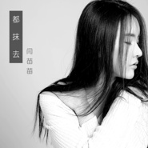

都抹去
============================

|  |  |
| :--: | :-- |
| [ 都抹去](https://emumo.xiami.com/album/2102764854) | **艺人**: [廖伟志](../index.md) **语种**: 国语 **唱片公司**: 喜多雷传媒 **发行时间**: 2017年06月08日 **专辑类别**: 录音室专辑 **专辑风格**: 流行 Pop, 国语流行 Mandarin Pop **播放数**: 3204 **收藏数**: 2 **评论数**: 0  |

## 简介

  
 

誓言是残破的，
 

诺言是暂时的，
 

谎言是透明的，
 

欺骗是无情的。
 

 
 

永远太远，赶不上措手不及的善变；
 

爱恋太暖，留不住掩耳盗铃的敷衍。
 

 
 

“闫氏”情歌，勾勒一段情感，诉说一段过去，终结一段旅程。
 

把过去都抹去，都抹去！
 

和过去告别，新的明天，我来了！
 

 
 

 

## 曲目

## 评论

