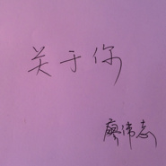
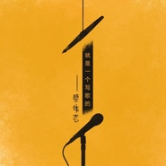

廖伟志
============================

|  |  |
| :--: | :-- |
| [ 廖伟志](https://i.xiami.com/liaoweizhi) | **地区**: China 中国大陆 **风格**: 国语流行 Mandarin Pop, 华语唱作人 Chinese Singer-Songwriter, 城市民谣 Urban Folk **播放数**: 4626089 **粉丝数**: 154 **评论数**: 20  |

## 档案

## 专辑

| 名称 | 语种 | 唱片公司 | 发行时间 | 专辑类别 | 专辑风格 |
| :--: | :-- | :-- | :-- | :-- | :-- |
| [ 昨夜的风](./albums/2420339146.md) | 国语 | 独立发行 | 2020年01月26日 | EP, 单曲 | 流行 Pop, 当代民谣 Contemporary Folk |
| [ 降妖剑](./albums/2103952403.md) | 国语 | 看见文娱 | 2018年09月01日 | EP, 单曲 |  |
| [ 电影《倩妖女狐》主题曲降妖剑](./albums/2103938348.md) | 国语 | 独立发行 | 2018年08月18日 | EP, 单曲 | 摇滚 Rock & Roll, 当代民谣 Contemporary Folk |
| [ 如果我不爱你白艺](./albums/2103753674.md) | 国语 | 看见文娱 | 2018年06月08日 | EP, 单曲 | 流行 Pop, 国语流行 Mandarin Pop, 独立流行 Indie Pop |
| [ 欲言又止](./albums/2103489136.md) | 国语 | 看见文娱 | 2018年01月10日 | 录音室专辑 | 国语流行 Mandarin Pop, 流行 Pop |
| [ 没有真心的人](./albums/2102865789.md) | 国语 | 独立发行 | 2017年09月30日 | EP, 单曲 | 城市民谣 Urban Folk, 国语流行 Mandarin Pop |
| [ 《没出息的晓丽》电影主题曲四季](./albums/2102798566.md) | 国语 | 独立发行 | 2017年07月19日 | EP, 单曲 | 流行 Pop, 当代民谣 Contemporary Folk, 城市民谣 Urban Folk |
| [ 都抹去](./albums/2102764854.md) | 国语 | 喜多雷传媒 | 2017年06月08日 | 录音室专辑 | 流行 Pop, 国语流行 Mandarin Pop |
| [ 关于你](./albums/2102735072.md) | 国语 | 喜多雷传媒 | 2017年04月21日 | EP, 单曲 | 流行 Pop, 当代民谣 Contemporary Folk, 城市民谣 Urban Folk |
| [ 最美时光](./albums/2102763590.md) | 国语 | 喜多雷传媒 | 2017年01月15日 | 录音室专辑 | 流行 Pop, 国语流行 Mandarin Pop |
| [ 2016 爱唱歌的女孩 金南玲金南玲](./albums/2102737918.md) | 国语 | 喜多雷传媒 | 2016年08月01日 | 录音室专辑 | 流行 Pop, 国语流行 Mandarin Pop |
| [ 就是一个写歌的廖老师是个音乐匠](./albums/2100373873.md) | 国语 | 北京西多雷传媒有限公司 | 2016年08月01日 | EP, 单曲 | 流行 Pop |
| [ 逆流成河无损音质版、“星光音乐会”版](./albums/2102740990.md) | 国语 | 惠达州文化 | 2015年08月01日 | EP, 单曲 | 国语流行 Mandarin Pop, 流行 Pop |

## 评论

|  |  |  |
| :-- | :-- | :-- |
|  [虾米用户](https://emumo.xiami.com/u/346165752)  2019-05-28 21:54 赞(1) 踩(0) | 

 |
|  [虾米用户](https://emumo.xiami.com/u/118937314) 一棵会开花的树 2018-09-30 12:45 赞(1) 踩(0) | 
今天虾米又有推荐了 
 |
|  [虾米用户](https://emumo.xiami.com/u/330709105)  2017-11-21 11:03 赞(1) 踩(0) | 
写的歌都特别好听，每首都深入人心
 |
|  [虾米用户](https://emumo.xiami.com/u/75192696) 闭上眼，这片空间只属于你 2017-11-10 08:47 赞(1) 踩(0) | 
加油加油 
 |
|  [虾米用户](https://emumo.xiami.com/u/672537) 我还没想好要写什么... 2017-11-08 22:29 赞(2) 踩(0) | 
&amp;ldquo;春风十里不如你&amp;rdquo;很好听。
 |
|  [虾米用户](https://emumo.xiami.com/u/118937314) 一棵会开花的树 2017-07-23 17:42 赞(2) 踩(0) | 
今天下午，一直单曲循环，站在街上泪流成河
 |
| ⇒ |  [虾米用户](https://emumo.xiami.com/u/68887734) 我们都是风中的尘埃 2017-08-01 14:51 赞(0) 踩(0) | 
难过的是心事。。
 |
| ⇒ |  [虾米用户](https://emumo.xiami.com/u/118937314) 一棵会开花的树 2017-08-10 19:54 赞(0) 踩(0) | 
<q><b>廖伟志说：</b></q>
 |
|  [虾米用户](https://emumo.xiami.com/u/290249619)   2017-04-21 08:47 赞(3) 踩(0) | 
喜欢你写的每一首歌，仿佛就是你的故事一样
 |
| ⇒ |  [虾米用户](https://emumo.xiami.com/u/68887734) 我们都是风中的尘埃 2017-08-01 14:52 赞(0) 踩(0) | 
是大家的故事。。
 |
|  [虾米用户](https://emumo.xiami.com/u/288014787)  2017-04-16 01:02 赞(2) 踩(0) | 
老同学加油
 |
| ⇒ |  [虾米用户](https://emumo.xiami.com/u/68887734) 我们都是风中的尘埃 2017-08-01 14:52 赞(0) 踩(0) | 
加油。。
 |
|  [虾米用户](https://emumo.xiami.com/u/97004040)  2017-02-11 09:53 赞(3) 踩(0) | 
你写的歌很好听   逆流成河 
 |
| ⇒ |  [虾米用户](https://emumo.xiami.com/u/68887734) 我们都是风中的尘埃 2017-08-01 14:52 赞(0) 踩(0) | 
哈哈，谢谢。。
 |
|  [虾米用户](https://emumo.xiami.com/u/97747450) 我还没想好要写什么... 2016-10-12 22:59 赞(3) 踩(0) | 
4553
 |
|  [虾米用户](https://emumo.xiami.com/u/140097234)  2016-08-01 09:56 赞(2) 踩(0) | 
 
 |
|  [虾米用户](https://emumo.xiami.com/u/68887734) 我们都是风中的尘埃 2016-07-28 02:43 赞(5) 踩(0) | 
我刚入驻了虾米音乐人，欢迎大家来我的个人主页，收听我的最新音乐
 |
| ⇒ |  [虾米用户](https://emumo.xiami.com/u/182094028)  2016-08-01 00:16 赞(0) 踩(0) | 
老同学
 |
|  [虾米用户](https://emumo.xiami.com/u/51917341)  2015-08-18 22:28 赞(0) 踩(0) | 
声声悦耳
 |
|  [虾米用户](https://emumo.xiami.com/u/7131336)  2013-12-14 10:49 赞(1) 踩(0) | 
真好听呀
 |
