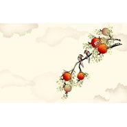
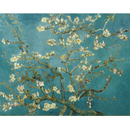
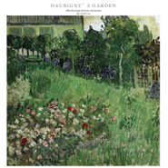
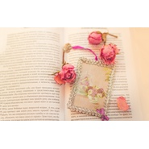
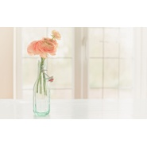

潘佳杰
============================

|  |  |
| :--: | :-- |
| [ 潘佳杰](https://i.xiami.com/panjiajie) | **地区**: China 中国大陆 **风格**: 轻音乐 Easy Listening, 新世纪音乐 New Age, 器乐流行 Instrumental Pop, 轻音乐流行 Light Pop, 器乐独奏 Solo Instrumental **播放数**: 2143890 **粉丝数**: 468 **评论数**: 33  |

## 档案

## 专辑

| 名称 | 语种 | 唱片公司 | 发行时间 | 专辑类别 | 专辑风格 |
| :--: | :-- | :-- | :-- | :-- | :-- |
| [ 童话异想世界（原创钢琴曲）](./albums/5021071307.md) | 纯音乐 | 独立发行 | 2020年06月01日 | 录音室专辑 | 轻音乐 Easy Listening |
| [ 节气之美（原创钢琴曲）](./albums/5021071308.md) | 纯音乐 | 独立发行 | 2020年05月17日 | 录音室专辑 | 器乐流行 Instrumental Pop |
| [ 钢琴与自然的对话原创钢琴曲](./albums/2108306006.md) | 国语 | 独立发行 | 2020年01月28日 | 录音室专辑 | 轻音乐 Easy Listening |
| [ 夜色如画，钢琴如诗原创钢琴曲](./albums/2108279987.md) | 国语 | 独立发行 | 2020年01月01日 | 录音室专辑 | 器乐流行 Instrumental Pop, 轻音乐 Easy Listening |
| [ 婚礼上的钢琴曲原创钢琴曲](./albums/2108279991.md) | 国语 | 独立发行 | 2019年11月24日 | 录音室专辑 | 轻音乐 Easy Listening |
| [ 陪你走过初级钢琴之路](./albums/5021077711.md) | 纯音乐 | 独立发行 | 2019年11月11日 | 录音室专辑 | 器乐流行 Instrumental Pop |
| [ 作曲力原创钢琴曲](./albums/2108281949.md) | 其他 | 独立发行 | 2019年07月21日 | 录音室专辑 | 器乐流行 Instrumental Pop |
| [ 香氛与四季的诗歌原创钢琴曲](./albums/2108285919.md) | 国语 | 独立发行 | 2019年06月18日 | 录音室专辑 | 轻音乐 Easy Listening |
| [ 童心无价写给孩子们的钢琴曲](./albums/2108286917.md) | 国语 | 独立发行 | 2019年05月01日 | 录音室专辑 | 轻音乐 Easy Listening |
| [ 印象梵高（钢琴曲）](./albums/2104919337.md) | 纯音乐 | 独立发行 | 2019年04月01日 | 录音室专辑 | 新世纪音乐 New Age, 轻音乐流行 Light Pop, 轻音乐 Easy Listening |
| [ 星座物语（钢琴曲）原创钢琴曲](./albums/2108302076.md) | 国语 | 独立发行 | 2019年01月01日 | 录音室专辑 | 轻音乐 Easy Listening |
| [ 心之所向的美食（原创钢琴曲）](./albums/5021081699.md) | 纯音乐 | 独立发行 | 2019年01月01日 | 录音室专辑 | 器乐流行 Instrumental Pop |
| [ 指尖上的武侠（原创钢琴曲）](./albums/5021079683.md) | 纯音乐 | 独立发行 | 2018年12月07日 | 录音室专辑 | 轻音乐 Easy Listening, 器乐流行 Instrumental Pop |
| [ 诗情画意只为你](./albums/2103556214.md) | 国语 | 独立发行 | 2018年01月01日 | 录音室专辑 | 轻音乐 Easy Listening, 轻音乐流行 Light Pop, 器乐独奏 Solo Instrumental |
| [ 潘佳杰2018原创作曲作品](./albums/2103555004.md) | 国语 | 独立发行 | 2018年01月01日 | 录音室专辑 | 轻音乐 Easy Listening, 器乐独奏 Solo Instrumental, 轻音乐流行 Light Pop |
| [ 潘佳杰2017原创作曲作品](./albums/2103555055.md) | 国语 | 独立发行 | 2017年01月01日 | 录音室专辑 | 轻音乐 Easy Listening, 轻音乐流行 Light Pop, 器乐流行 Instrumental Pop |
| [ 潘佳杰2016原创作曲作品](./albums/2100355746.md) | 国语 | 独立发行 | 2016年06月17日 | 录音室专辑 | 轻音乐 Easy Listening, 轻音乐流行 Light Pop, 器乐独奏 Solo Instrumental |
| [ 精油家族](./albums/2100352840.md) | 国语 | 独立发行 | 2016年06月01日 | 录音室专辑 | 轻音乐 Easy Listening, 轻音乐流行 Light Pop, 器乐独奏 Solo Instrumental |
| [ 潘佳杰2015原创作曲作品](./albums/2103555501.md) | 国语 | 独立发行 | 2015年05月20日 | 录音室专辑 | 轻音乐 Easy Listening, 轻音乐流行 Light Pop, 器乐独奏 Solo Instrumental |
| [ 潘佳杰2014原创作曲作品](./albums/2103555505.md) | 国语 | 独立发行 | 2014年01月01日 | 录音室专辑 | 轻音乐流行 Light Pop, 轻音乐 Easy Listening, 器乐独奏 Solo Instrumental |
| [ 潘佳杰2013原创作曲作品原创钢琴曲](./albums/2103555513.md) | 国语 | 独立发行 | 2013年01月01日 | 录音室专辑 | 轻音乐 Easy Listening, 轻音乐流行 Light Pop, 器乐独奏 Solo Instrumental |

## 评论

|  |  |  |
| :-- | :-- | :-- |
|  [虾米用户](https://emumo.xiami.com/u/3395937) living in th... 2020-10-15 16:32 赞(0) 踩(0) | 
平静淡然，非常喜欢潘老师的作品！ 
 |
|  [虾米用户](https://emumo.xiami.com/u/364546789) 嘛！这个还差点意思 2020-06-25 11:08 赞(1) 踩(0) | 
潘姐姐的音乐听着很舒服
 |
|  [虾米用户](https://emumo.xiami.com/u/423220543)  2020-05-31 23:16 赞(0) 踩(0) | 
惊艳，爱了爱了
 |
|  [虾米用户](https://emumo.xiami.com/u/271017410) 我一直都想做一个冷酷的人 2020-05-17 22:51 赞(0) 踩(0) | 
我以为是男的，，果然是妹纸细腻
 |
|  [虾米用户](https://emumo.xiami.com/u/2753337) 想念虾米，可惜“再回首 ... 2020-04-01 21:15 赞(0) 踩(0) | 
好听！俺超低空悄悄掠过~
 |
|  [虾米用户](https://emumo.xiami.com/u/434152246) 聪明少一些大智慧多一些，... 2020-02-12 09:33 赞(0) 踩(0) | 
互相支持互相勉励
 |
|  [虾米用户](https://emumo.xiami.com/u/260640673)  2020-02-11 15:32 赞(0) 踩(0) | 
这家音乐真不赖，就是节奏偏快乐点
 |
|  [虾米用户](https://emumo.xiami.com/u/350474744) 新歌《爱我祖国》欢迎试听 2019-11-02 15:36 赞(0) 踩(0) | 
你也喜欢梵高，
 |
|  [虾米用户](https://emumo.xiami.com/u/310526714) 趁现在还能下载，赶紧吧！ 2019-10-31 20:27 赞(1) 踩(0) | 
浅墨不与天下争色，
 |
|  [虾米用户](https://emumo.xiami.com/u/8029913)  2019-10-22 10:32 赞(1) 踩(0) | 
一代才女呀
 |
|  [虾米用户](https://emumo.xiami.com/u/1062244)   2019-09-13 23:24 赞(2) 踩(0) | 
突然听到你的音乐，被深深吸引，发现你也在深圳……想问下你有教钢琴吗？
 |
|  [虾米用户](https://emumo.xiami.com/u/182761828)   2019-06-14 00:02 赞(0) 踩(0) | 
很好听！
 |
|  [虾米用户](https://emumo.xiami.com/u/344018512) 我还没想好要写什么... 2019-05-08 00:10 赞(0) 踩(0) | 

 |
|  [虾米用户](https://emumo.xiami.com/u/195594445) 遇见美好 2019-04-24 20:17 赞(0) 踩(0) | 
实力努力！
 |
|  [虾米用户](https://emumo.xiami.com/u/182761828)   2019-04-08 15:22 赞(1) 踩(0) | 
我一直以为，杰是男生。。
 |
|  [虾米用户](https://emumo.xiami.com/u/404392903) 喜欢薇薇，不后悔 2019-02-12 01:23 赞(0) 踩(0) | 
这个艺人很棒，喜欢
 |
|  [虾米用户](https://emumo.xiami.com/u/9003931) 千淘万漉虽辛苦 2019-02-06 11:38 赞(1) 踩(0) | 
何须浅碧深红色，自是花中第一流！
 |
|  [虾米用户](https://emumo.xiami.com/u/379891834)  2018-09-08 15:05 赞(1) 踩(0) | 
加油哦！
 |
|  [虾米用户](https://emumo.xiami.com/u/403015675)  2018-08-30 00:52 赞(2) 踩(0) | 
小姐姐好棒！第一次听到你的《花季的巴丹杏》和《玫瑰沙漠》是大二的时候，简直被惊艳得说不出话！现在我已经毕业工作了没想到和你在一个城市，好开心！
 |
| ⇒ |  [虾米用户](https://emumo.xiami.com/u/19403592) 潘佳杰 2018-09-03 10:45 赞(0) 踩(0) | 
欢迎关注微信公众号&amp;ldquo;每天都是佳节&amp;rdquo;，后续开展线下活动
 |
|  [虾米用户](https://emumo.xiami.com/u/32257997)  2017-10-27 23:03 赞(0) 踩(0) | 
第一次听到《月光情书》就被优美的旋律深深的吸引了，果断将其作为正在制作的百里画廊风光音乐背景！
 |
|  [虾米用户](https://emumo.xiami.com/u/13555511) 听蛙 2017-09-19 09:46 赞(0) 踩(0) | 
忽如一夜春风来，很喜欢
 |
|  [虾米用户](https://emumo.xiami.com/u/122688364) 生在愤坑，长在赤圈；挣脱 2017-02-08 23:10 赞(0) 踩(0) | 
7624
 |
|  [虾米用户](https://emumo.xiami.com/u/9327494) http://www.x... 2016-11-03 00:43 赞(0) 踩(0) | 
love
 |
|  [虾米用户](https://emumo.xiami.com/u/2644274) 从虾米一路走来，留下了许... 2015-11-17 00:00 赞(0) 踩(0) | 
一片海的距离 很好听
 |
|  [虾米用户](https://emumo.xiami.com/u/45696208)  2015-04-20 21:27 赞(0) 踩(0) | 
《恋着你的秋天》第一次听就感觉发现了新大陆，非常喜欢这样纯情的钢琴曲，
 |
|  [虾米用户](https://emumo.xiami.com/u/45696208)  2015-04-20 21:27 赞(0) 踩(0) | 
《恋着你的秋天》第一次听就感觉发现了新大陆，非常喜欢这样纯情的钢琴曲，
 |
|  [虾米用户](https://emumo.xiami.com/u/32257997)  2014-09-06 11:39 赞(1) 踩(0) | 
第一次听到《月光情书》就被优美的旋律深深的吸引了，果断将其作为自己游玩后正在制作的百里画廊风光音乐背景！ 马上搜其作品和个人介绍，太有才了，果断收藏专辑！
 |
|  [虾米用户](https://emumo.xiami.com/u/38783383) 完成自己原创音乐梦想 2014-07-31 11:17 赞(0) 踩(0) | 
呵呵，支持
 |
|  [虾米用户](https://emumo.xiami.com/u/2066472) 扛过、撑过、拼过、奔过… 2013-12-11 08:09 赞(0) 踩(0) | 
生日快乐！
 |
|  [虾米用户](https://emumo.xiami.com/u/4393157)  2013-09-04 22:56 赞(0) 踩(0) | 
唔~好听  心情顿时好了起来
 |
|  [虾米用户](https://emumo.xiami.com/u/4393157)  2013-09-04 22:46 赞(0) 踩(0) | 
哇~这么多  一首首的静听
 |
