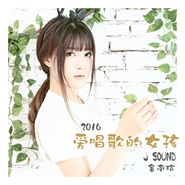

2016爱唱歌的女孩金南玲
============================

|  |  |
| :--: | :-- |
| [ 2016爱唱歌的女孩金南玲](https://emumo.xiami.com/album/2102725732) | **艺人**: [金南玲](../index.md) **语种**: 国语 **唱片公司**: 喜多雷传媒 **发行时间**: 2016年08月01日 **专辑类别**: EP, 单曲 **专辑风格**: 国语流行 Mandarin Pop **播放数**: 663886 **收藏数**: 72 **评论数**: 14  |

## 简介

那时候，金南玲安静得像个墙角的玩偶，少言寡语是她最明显的标签，有时候一个人甚至可以待一天不说话，沉浸在自己的世界里，显得有些自闭。  
  
那时候，金南玲还是一个刚扎进音乐圈的菜鸟，疑问好奇地观察着这个世界，从万千景象中沉淀自己的感思，再融入到自己的音乐里。  
  
那时候，金南玲忙碌于录音棚的电脑前，一点一点的学习成长；忙碌于麦克风下，参与着公司前辈艺人的唱片制作，以和音的方式在茫茫乐坛发出微弱的呐喊。  
  
终于，2012年，《J Sound》横空出世，收录了十首歌曲，八首是金南玲自己创作的作品。  
  
不仅仅是一个歌手，还是一个精通创作的才女。  
  
还是一份青涩，一个金南玲的独特视角，却让人记住了《J Sound》，记住了这个在音乐路上默默前行的执着面孔。  
音乐的路很漫长，有的时候也很累。只是她一直勇敢地向前走着。  
  
《金曲奖》，《来生》，《借口》，《缘来是固原》，《Marry me》,唱片一张一张发行，作品不断，音乐永无止境。  
  
《我的博士老公》，《小明和他的小伙伴们》，《拐个皇帝回现代》，作品收录于不同的影视剧里，听她唱歌的人越来越多。  
  
湖北卫视综艺节目“一起出发”的主题曲《勇敢的飞翔》，明星恋爱真人秀节目“如果爱“主题曲《爱情来了》，金南玲倾情献唱。  
一份耕耘，一份收获。多年坚守，路终于越走越宽。  
  
《逆流成河》慢慢流行于大街小巷，登上各大音乐最热歌曲榜单。  
  
金南玲依然不觉得自己红了，只是为作品能得到认可而开心着。纯粹而纯粹。  
  
一个擅长作词，作曲，编曲，演唱的音乐精灵，一个《爱唱歌的女孩》，终于在人群中光芒四射。  
  
《2016 爱唱歌的女孩 金南玲》。这是金南玲的最新作品。  
依然是一个态度，一份动听，一份礼物，送给所有喜欢她的音乐的人。  
  
《从开始到结束》  
没有华丽的词藻，只有最质朴的纯粹。没有放大的悲痛，只有最真实的忧伤。  
从开始到结束的旅程，最好不要走到尽头。如果到了尽头，也请留下最美好的回忆。  
  
《给我个忘记你的理由》  
《逆流成河》的词曲作者兼制作人廖伟志的倾情新作，熟悉的廖氏情歌，金氏声线，金牌搭档的最默契的合作。总有那么一个黎明来临的时候，总有那么一个酒醒时分，欲忘难忘。关于最爱的那个他，哪有忘记的理由。  
  
《拥挤的梦想》  
拥挤于熙熙攘攘人来人往的街头，多少人还记得曾经耿耿于怀的梦想。失败的哭，只是一个形式；坚持，至少是一个态度。有人选择哭累了回家，有人选择拥抱温暖的家，带着理想继续前行。面对困境之时，你是哪一个？

## 曲目

## 评论

|  |  |  |
| :-- | :-- | :-- |
|  [虾米用户](https://emumo.xiami.com/u/424653240)  2019-12-22 23:43 赞(0) 踩(0) | 
好听
 |
|  [虾米用户](https://emumo.xiami.com/u/280374522)  2019-03-20 20:32 赞(0) 踩(0) | 
很好的一位歌首，噪子不错。
 |
|  [虾米用户](https://emumo.xiami.com/u/307601794)  2017-08-08 13:28 赞(0) 踩(0) | 
美丽
 |
|  [虾米用户](https://emumo.xiami.com/u/307363506)  2017-06-27 23:23 赞(0) 踩(0) | 
好!好!好!非常好听。
 |
|  [虾米用户](https://emumo.xiami.com/u/280166973)  2017-06-21 17:36 赞(1) 踩(0) | 
  
 |
|  [虾米用户](https://emumo.xiami.com/u/304882018)  2017-06-16 10:16 赞(0) 踩(0) | 
嗓子很好。歌唱的非常棒。     
 |
|  [虾米用户](https://emumo.xiami.com/u/274200933)  2017-06-14 16:35 赞(1) 踩(0) | 
这个女女的歌这么好听，为啥不火？
 |
|  [虾米用户](https://emumo.xiami.com/u/295624160)  2017-06-02 06:32 赞(1) 踩(0) | 
很好听
 |
| ⇒ |  [虾米用户](https://emumo.xiami.com/u/304882018)  2017-06-16 10:19 赞(0) 踩(0) | 
嗓子非常好。
 |
|  [虾米用户](https://emumo.xiami.com/u/267465993)  2017-05-25 09:51 赞(0) 踩(0) | 
好听
 |
|  [虾米用户](https://emumo.xiami.com/u/99332182) 四年的等待 两个夜晚的相... 2017-05-18 22:25 赞(1) 踩(0) | 
歌超好听！希望以后得作品一如既往的好！就像逆流成河一样    
 |
| ⇒ |  [虾米用户](https://emumo.xiami.com/u/292100889) 创造人生 2017-06-04 11:01 赞(0) 踩(0) | 
你好
 |
| ⇒ |  [虾米用户](https://emumo.xiami.com/u/99332182) 四年的等待 两个夜晚的相... 2017-06-04 17:35 赞(0) 踩(0) | 
<q><b>遥远的亲人说：</b></q>
 |
|  [虾米用户](https://emumo.xiami.com/u/127885890) 明明就遇到爱 2017-05-18 19:23 赞(0) 踩(0) | 
哎呦，不错啦，第一评论路过
 |
