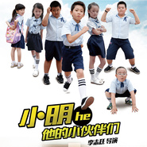

伙伴歌
============================

|  |  |
| :--: | :-- |
| [ 伙伴歌](https://emumo.xiami.com/album/308591155) | **艺人**: [金南玲](../index.md) **语种**: 国语 **唱片公司**: 合纵星光 **发行时间**: 2014年08月20日 **专辑类别**: EP, 单曲 **专辑风格**: 国语流行 Mandarin Pop **播放数**: 209741 **收藏数**: 47 **评论数**: 2  |

## 简介

童年是什么?  
今天偷偷揪女生辫子,明天把隔壁班同学推个跟头,调皮捣蛋那是与生俱来的才干;  
书桌里藏几本漫画,作业能做完的全都是奇葩,挨骂罚站就是家常便饭。  
用不完的体力,玩不够的劲头儿,和小伙伴一起就能占领整个世界;  
最赞的事莫过于整蛊老师,请家长就是世界末日。  
属于小伙伴们的青葱岁月就像蜡笔画,五彩斑斓,单纯得可爱。  
金南玲和吉吉这两位音乐上的小伙伴首度合作,为爆笑校园网络剧《小明和他的小伙伴们》献唱主题歌《伙伴歌》,唱出属于童年的最美和声。  
《伙伴歌》是红遍网络的《我该怎么办》的姐妹篇,两首歌同为爆笑网络剧的主题曲,主角都是小明,最巧合的是《伙伴歌》的演唱者之一吉吉正是《我该怎么办》的原唱。而一向以能驾驭多种音乐风格著称的金南玲则再度爆发电音小宇宙,两位实力派唱将联袂用音乐重现剧中欢乐且充满喜感的“伙伴情结”。  
“伙伴儿,伙伴儿,小伙伴儿,我们一起出去玩儿”,‍轻松明快的house舞曲,将鲜明的鼓点交汇成童年独有的节奏,充满童趣的音符在旋律中雀跃欢腾。再简单不过的歌词,却也是最不含杂质的快乐。听着这首歌,就好像看到一群熊孩子无忧无虑的样子,心里也不由自主地燃起召唤小伙伴的冲动。  
“伙伴儿,伙伴儿,小伙伴儿,我们一起出去玩儿”,‍  
现在开始,这个新的接头暗号正式启用!  
迅雷不及掩耳,已然风靡街头巷尾。  
小明和他的小伙伴们正玩得精彩。  
你的小伙伴们呢?  
赶快唱起《伙伴歌》,一起愉快地去玩耍吧。

## 曲目

## 评论

|  |  |  |  |
| :-- | :-- | :-- | :-- |
|  [虾米用户](https://emumo.xiami.com/u/335414690)  2017-11-19 15:30 赞(0) 踩(0) | 
挺好看的，歌曲也很好听
 |
|  [虾米用户](https://emumo.xiami.com/u/34941286) 诗酒趁年华。 2015-03-31 12:02 赞(0) 踩(0) | 
好听～
 |
