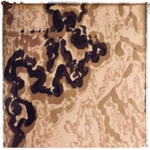

椿湫
============================

|  |  |
| :--: | :-- |
| [ 椿湫](https://emumo.xiami.com/album/2103712982) | **艺人**: [曾小刚](../index.md) **语种**: 国语 **唱片公司**: 独立发行 **发行时间**: 2018年05月18日 **专辑类别**: EP, 单曲 **专辑风格**: 世界音乐 World Music, 中国民乐 Chinese Folk Music **播放数**: 28957 **收藏数**: 77 **评论数**: 0  |

## 简介

 

李嘉徴: 尺八
 

 

曾小剛: 古琴，電子
 

  
 

韋敬民：後期混縮
 

 

姚又溪：封面設計
 

 
 

《椿湫》
 

「椿」：莊子的逍遙游中「上古有大椿者，以八千歲為春，八千歲為秋。此大年也。」故椿之象，鴻大高遠、蒼莽遼闊。
 

「湫」：本意為涼，宋玉曾《高唐賦》寫道「湫兮如風，淒兮如雨」，是「涼風習習，細雨清淒」之景象。
 

 
 

椿湫，遼闊蒼土之上掠過的一陣秋風，清涼亦如山明水淨夜來霜，孤舟一片水茫茫。自古逢秋悲寂寥，我言秋日勝春朝。
 

 
 

椿湫，春秋。春之始發，秋之凋零，對立矛盾，然卻是樸素辯證觀，老莊之思想本源。你的世界觀決定了你的世界。縱使悲傷，沈淪，混沌，亦是無限「生」的遐想和期望，如臨深淵，卻期盼重生之感。一把秋意，澹寂之中，清澈，入骨，循環相生而不絕。
 
  
 

## 曲目

## 评论

