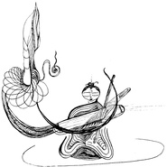

十三・秋古琴与尺八
============================

|  |  |
| :--: | :-- |
| [ 十三・秋古琴与尺八](https://emumo.xiami.com/album/2103902137) | **艺人**: [曾小刚](../index.md) **语种**: 国语 **唱片公司**: 独立发行 **发行时间**: 2018年08月07日 **专辑类别**: EP, 单曲 **专辑风格**: 中国民乐 Chinese Folk Music, 世界音乐 World Music **播放数**: 37944 **收藏数**: 89 **评论数**: 4  |

## 简介

 
 

《十三・秋》
 

尺八：李嘉徵
 

古琴/編曲：曾小剛
 

縮混：韋敬民
 

插畫：林妲
 

 
 

秋聲又入梧桐。
 

那年作的曲子，今得嘉徵尺八加入，重新編配之後，愈給人蒼涼遼窅之感。猶如時令向更深遠的地方延伸，秋意一陣緊似一陣。 
 

那年隨興在枯桐上的抹挑勾剔,  響在十三徽之間，盡十三徽之聲而巧合為十三拍。
 

那年立秋也在今天。十指生秋水，炎夏薄衣雖未脫去，七弦上，已然秋聲清越。
 

《樂記》：樂者，音之所由生也，其本在心之感於物也。感於物而動，故形於聲。
 

萬物之生滅，何嘗不是應時而動。
 

後才知道，原來寫它的那年，正好有十三個月。
 

後又聽說，每逢十三個月的那年，梧桐枝上會生十三葉。
 

而今又得知，立秋乃二十四節氣中之第十三......
 

或者純屬巧合。
 

或者梧桐有知，所以用「知閏、知秋」來詮釋一平年十二葉閏年則十三葉。多出來的那一葉，那一拍，許是詮釋另一種「得一」之妙吧。所謂一即自然。
 

古人言自然之數為十三。而陽律陰呂，清濁高下，其聲之所發又皆應自然之節,，合於天地之數。
 

當年這支曲子，不為而成，可算是得於陰陽，而合於術數。今以「十三・秋」名之，亦是應時對景，歸復自然。
 

 

## 曲目

## 评论

|  |  |  |  |
| :-- | :-- | :-- | :-- |
|  [虾米用户](https://emumo.xiami.com/u/401989641)  2019-08-09 08:54 赞(1) 踩(0) | 
妙
 |
|  [虾米用户](https://emumo.xiami.com/u/419373294)  2019-03-15 00:41 赞(0) 踩(0) | 
好听
 |
|  [虾米用户](https://emumo.xiami.com/u/43492923) 行到水穷我才开始害怕，夕... 2019-01-11 11:37 赞(0) 踩(0) | 
▽
 |
|  [虾米用户](https://emumo.xiami.com/u/220644515) 这家伙很那个 2018-09-19 11:38 赞(1) 踩(0) | 
仿佛能闻见香火味。
 |
