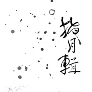

指月辑当代古琴
============================

|  |  |
| :--: | :-- |
| [ 指月辑当代古琴](https://emumo.xiami.com/album/2105011771) | **艺人**: [曾小刚](../index.md) **语种**: 纯音乐 **唱片公司**:  **发行时间**: 2019年07月22日 **专辑类别**: 录音室专辑 **专辑风格**: 器乐流行 Instrumental Pop, 世界音乐 World Music, 中国民乐 Chinese Folk Music **播放数**: 92899 **收藏数**: 419 **评论数**: 29  |

## 简介

  
“音乐到底是“声无哀乐”还是由感情驱使，是能叙事描述或仅触及事物的神秘内在，是自然的或非自然的...难论。音乐该是只在音上，不在话下吧。有位合作过的柏林爱乐大提琴手，四十多岁觉得自己还是不会运弓。某天隔着玻璃见鸟在窗台上蹦了几下，一下子腕子和精神都通了。如此看了，音乐也算是某种由朮及道的功夫，用技艺与时辰等灵机，等到了再化还回去，一来二去也可以保全心性，当然，也有心性彻底迷散的。  
  
琴师曾小刚旅居瑞典，广受现代音乐薰陶，同时不废精研古曲。其人也有趣，为了让古琴可以在舞台上与现代电声乐匹配，我们一块儿在凹凸不平的膛壁上装上了软木拾音器，并戏称猫柱狗柱。身在北欧极地，彩云之南，海上泛舟或庭院饮茶，月亮一样的皎晦圆缺，就像树木荣枯，人事起落。  
  
跟月亮交往的方式有很多种，常规的观赏，倾听，祭拜等，也有些更奇妙隐秘的关联如狼嚎，月经，潮汐。这张琴曲辑指月，意像通六祖，确有禅意。九曲连环，散音泛音按音三籁从龙池风沼溢出，经过天柱地柱增益，又被琴桌遮挡与反射扩散，听下来，并不是在穷究禅理，而是多透禅趣。以手指月轮，以琴观真心，琴曲舍了繁复名相，仅以某种心境微妙变化略作区分。一气听完，混觉一体，尾曲回到自然声场从沉浸中拔离而出，该去烧饭了。”  
是为题记。  
  
宋雨喆  
乙亥年正月十五  
&nbsp; &nbsp; &nbsp; &nbsp; &nbsp; &nbsp; &nbsp; &nbsp; &nbsp; &nbsp; &nbsp; &nbsp; &nbsp; &nbsp; &nbsp; &nbsp; &nbsp; &nbsp; &nbsp; &nbsp; &nbsp; &nbsp; &nbsp; &nbsp; &nbsp; &nbsp; &nbsp; &nbsp; &nbsp; &nbsp; &nbsp; &nbsp; &nbsp; &nbsp; &nbsp; &nbsp; &nbsp; &nbsp; &nbsp; &nbsp; &nbsp; &nbsp; &nbsp; &nbsp; &nbsp; &nbsp; &nbsp; &nbsp; &nbsp; &nbsp; &nbsp; &nbsp; &nbsp; &nbsp; &nbsp; &nbsp; &nbsp; &nbsp; &nbsp; &nbsp; &nbsp; &nbsp; &nbsp; &nbsp; &nbsp; &nbsp; &nbsp; &nbsp; &nbsp; &nbsp; &nbsp; &nbsp; &nbsp; &nbsp;  
音乐创作方式繁多  
我尤偏爱即兴  
不做预设与构思  
当时当下的意和念便化为音符本身  
回望这些琴曲  
它们诞生于一个个坐忘神驰的夜晚  
独自对月 静坐琴前  
一个音唤醒另一个音  
一个音为另一个音引出路来  
不知由来 不知所往  
隔日再听 竟觉惊喜  
彷佛不是自己所谓  
甚或要在琴上琢磨数日 方可重新领会  
莫非如古人云  
此天恩神绶也  
  
曾小刚  
乙亥年春  
  
封面设计：陈花现

## 曲目

## 评论

|  |  |  |  |
| :-- | :-- | :-- | :-- |
|  [虾米用户](https://emumo.xiami.com/u/279828134) 再 会   2020-06-13 13:11 赞(0) 踩(0) | 
◐
 |
|  [虾米用户](https://emumo.xiami.com/u/252551) ＿形無 2020-04-19 02:08 赞(0) 踩(0) | 
.
 |
|  [虾米用户](https://emumo.xiami.com/u/247422185) 念及因缘，心即坦然。 2019-09-20 18:57 赞(1) 踩(0) | 
☕
 |
|  [虾米用户](https://emumo.xiami.com/u/22444238) 邱比已搬移至网易云音乐  2019-09-07 01:03 赞(1) 踩(0) | 
Get
 |
|  [虾米用户](https://emumo.xiami.com/u/300629046)  2019-08-01 10:15 赞(1) 踩(0) | 
在线购买，可以有
 |
|  [虾米用户](https://emumo.xiami.com/u/38502872) 0Oo 2019-07-28 03:19 赞(1) 踩(0) | 
返璞归真，这也是日积月累的绽放。
 |
|  [虾米用户](https://emumo.xiami.com/u/45343800)  2019-07-27 22:46 赞(0) 踩(0) | 
哪里有卖实体CD 呀
 |
|  [虾米用户](https://emumo.xiami.com/u/45343800)  2019-07-27 22:45 赞(1) 踩(0) | 

 |
|  [虾米用户](https://emumo.xiami.com/u/45343800)  2019-07-27 22:43 赞(2) 踩(0) | 
哪里有卖实体CD
 |
|  [虾米用户](https://emumo.xiami.com/u/418382868) 快乐无忧 2019-07-27 21:55 赞(1) 踩(0) | 
琴弦指间，平静舒缓，娓娓入心，宁静致远……
 |
|  [虾米用户](https://emumo.xiami.com/u/59822304) 我还没想好要写什么... 2019-07-25 06:08 赞(2) 踩(0) | 
没想到是宋雨喆做的题记
 |
|  [虾米用户](https://emumo.xiami.com/u/340527026) 朋友 2019-07-24 22:49 赞(2) 踩(0) | 
新 古
 |
|  [虾米用户](https://emumo.xiami.com/u/514888)  2019-07-24 09:48 赞(1) 踩(0) | 
享受中
 |
|  [虾米用户](https://emumo.xiami.com/u/679931) Zero Projekt 2019-07-23 07:49 赞(4) 踩(0) | 
赏一曲于晨  净一日之心   
 |
|  [虾米用户](https://emumo.xiami.com/u/247422185) 念及因缘，心即坦然。 2019-07-23 07:35 赞(2) 踩(0) | 

 |
|  [虾米用户](https://emumo.xiami.com/u/32669119) 入魔! 2019-07-23 06:20 赞(2) 踩(0) | 
太爱了，一大早听激动了。曾老师牛！
 |
| ⇒ |  [虾米用户](https://emumo.xiami.com/u/416990) 古琴 2019-07-23 07:29 赞(0) 踩(0) | 
 
 |
|  [虾米用户](https://emumo.xiami.com/u/42560187) 归于传统 2019-07-22 23:30 赞(1) 踩(0) | 
来了，老哥
 |
|  [虾米用户](https://emumo.xiami.com/u/322235515) 在音乐里澎湃，在玩笑里开... 2019-07-22 22:51 赞(2) 踩(0) | 
小曾真是大方，我正在纠结喝不喝咖啡，就看到这张新专辑。满心欢喜。你的勤奋和谦和让我很敬佩！
 |
|  [虾米用户](https://emumo.xiami.com/u/352159297)  2019-07-22 22:40 赞(6) 踩(0) | 
宇宙洪荒尽入琴意，闭眼已过婆娑世界。
 |
|  [虾米用户](https://emumo.xiami.com/u/410866210) 鲸鱼马戏团正义！ 2019-07-22 22:36 赞(1) 踩(0) | 
好宁静。
 |
|  [虾米用户](https://emumo.xiami.com/u/251262420) 何处心安是吾乡 2019-07-22 22:24 赞(2) 踩(0) | 
必须支持
 |
|  [虾米用户](https://emumo.xiami.com/u/66823378)  2019-07-22 21:59 赞(2) 踩(0) | 

 |
|  [虾米用户](https://emumo.xiami.com/u/8905522)  2019-07-22 21:37 赞(3) 踩(0) | 
Super!
 |
|  [虾米用户](https://emumo.xiami.com/u/301947385) 清明不语   2019-07-22 19:59 赞(4) 踩(0) | 
游目骋怀赏玩盈亏，神闲气定笑纳无常。
 |
|  [虾米用户](https://emumo.xiami.com/u/356328578) 无论风和日丽，还是风雨袭... 2019-07-22 18:24 赞(3) 踩(0) | 
对古琴曲创新尝试，却未失古琴本韵
 |
|  [虾米用户](https://emumo.xiami.com/u/316750) 全世界只爱文文一人！ 2019-07-22 18:03 赞(6) 踩(0) | 
这次的新专辑简直太棒了！不仅是即兴演奏，而且先发行实体再发数字！真的赞！签名版在手开心的很。 
 |
| ⇒ |  [虾米用户](https://emumo.xiami.com/u/416990) 古琴 2019-07-22 21:51 赞(0) 踩(0) | 
感谢一直以来的支持 
 |
| ⇒ |  [虾米用户](https://emumo.xiami.com/u/316750) 全世界只爱文文一人！ 2019-07-22 22:47 赞(0) 踩(0) | 
<q><b>曾小刚说：</b></q>
 |
