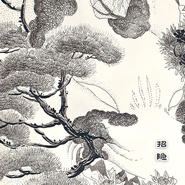

招隐神奇秘谱
============================

|  |  |
| :--: | :-- |
| [ 招隐神奇秘谱](https://emumo.xiami.com/album/2108279766) | **艺人**: [曾小刚](../index.md) **语种**: 其他 **唱片公司**: 独立发行 **发行时间**: 2020年04月01日 **专辑类别**: EP, 单曲 **专辑风格**: 器乐独奏 Solo Instrumental, 世界音乐 World Music, 中国民乐 Chinese Folk Music **播放数**: 34746 **收藏数**: 41 **评论数**: 6  |

## 简介

《神奇秘谱》  
臞仙按琴史曰，是曲乃西晋时，左思字太冲，见天下溷浊，将招寻隐者，欲退不仕。乃作招隐诗云，杖策招隐士，荒涂横古今。岩穴无结构，丘中有鸣琴。白雪停阴冈，丹葩耀阳林。石泉漱琼瑶，纤麟或浮沉。非必丝与竹，山水足淸音。何事待啸歌，灌木自悲吟。秋菊兼餱粮，幽兰间重襟。踌躇足力顷，聊欲投吾簪。又有招隐曲云，山中鸣琴，万籁声沉沉，何泠泠，石熘寒泉萦心，未必丝竹如淸音。不如归去，踟蹰投吾簪。归去来，丹葩耀林。归去来，幽兰涧深。灌木自吟，松竹阴。遑遑何之，三径为君寻。篱下黄花散金，振衣踯躅弹冠尘，莫教双鬂萧萧霜雪侵。故有是操。  
  
插画：孙周九云 

## 曲目

## 评论

|  |  |  |
| :-- | :-- | :-- |
|  [虾米用户](https://emumo.xiami.com/u/427840279)  2020-11-29 19:31 赞(0) 踩(0) | 

 |
|  [虾米用户](https://emumo.xiami.com/u/334657361)  2020-04-11 14:55 赞(0) 踩(0) | 
最近演奏家有点内心不够平静。
 |
|  [虾米用户](https://emumo.xiami.com/u/3896616)  2020-04-06 19:38 赞(1) 踩(0) | 
好听
 |
|  [虾米用户](https://emumo.xiami.com/u/121314230) 下一个聚集地见 2020-04-01 17:07 赞(0) 踩(0) | 
缪谬
 |
|  [虾米用户](https://emumo.xiami.com/u/121702052) 超脱 2020-04-01 15:51 赞(1) 踩(0) | 

 |
