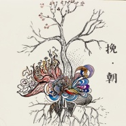

挽·朝
============================

|  |  |
| :--: | :-- |
| [ 挽·朝](https://emumo.xiami.com/album/5022308945) | **艺人**: [曾小刚](../index.md) **语种**: 国语 **唱片公司**: 独立发行 **发行时间**: 2020年12月31日 **专辑类别**: EP, 单曲 **专辑风格**: 世界音乐 World Music, 中国民乐 Chinese Folk Music **播放数**: 20093 **收藏数**: 12 **评论数**: 14  |

## 简介

总有些日子值得悼怀，也总有些日子值得期待。  
曾小刚2020年末单曲《挽·朝》&nbsp;  
曾小刚：作曲编曲演奏  
李林妲：插画设计  
  
 

## 曲目

## 评论

|  |  |  |
| :-- | :-- | :-- |
|  [虾米用户](https://emumo.xiami.com/u/8391097) 明月轻舟一壶酒 2021-01-05 15:47 赞(1) 踩(0) | 
一直很喜欢曾小刚的音乐。 一直很喜欢虾米这个平台。
 |
|  [虾米用户](https://emumo.xiami.com/u/279828134) 再 会   2021-01-04 23:06 赞(1) 踩(0) | 
▷
 |
|  [虾米用户](https://emumo.xiami.com/u/259354119)  2021-01-03 16:03 赞(0) 踩(0) | 
越来越有意境，值得反复玩味的空间。佩服
 |
|  [虾米用户](https://emumo.xiami.com/u/37142358) crap of the ... 2021-01-02 01:45 赞(1) 踩(0) | 
希望2021大家都顺遂平安
 |
|  [虾米用户](https://emumo.xiami.com/u/16152983)   2021-01-01 14:56 赞(1) 踩(0) | 
打击乐与弹拨乐的质感结合得太完美了。韵律很现代，乐器又很远古，穿越感极酷。
 |
|  [虾米用户](https://emumo.xiami.com/u/1496867) 我爱你 再见 2021-01-01 13:08 赞(1) 踩(0) | 
大师气象 我喜欢的都是大师
 |
|  [虾米用户](https://emumo.xiami.com/u/428083234)  2021-01-01 11:51 赞(2) 踩(0) | 
能使人的心静下来，仿佛在进行一种古代的祭祀活动。
 |
|  [虾米用户](https://emumo.xiami.com/u/247422185) 念及因缘，心即坦然。 2021-01-01 11:40 赞(1) 踩(0) | 
新年快乐☕
 |
|  [虾米用户](https://emumo.xiami.com/u/378138561)  2021-01-01 01:04 赞(1) 踩(0) | 

 |
|  [虾米用户](https://emumo.xiami.com/u/230895872)  2020-12-31 23:20 赞(1) 踩(0) | 
欢愉~
 |
|  [虾米用户](https://emumo.xiami.com/u/322235515) 在音乐里澎湃，在玩笑里开... 2020-12-31 22:45 赞(1) 踩(0) | 
好听
 |
|  [虾米用户](https://emumo.xiami.com/u/299319353) 感谢虾米陪我度过了许多不... 2020-12-31 22:33 赞(6) 踩(0) | 
新年快乐！
 |
|  [虾米用户](https://emumo.xiami.com/u/290877656) The soul of ... 2020-12-31 22:30 赞(1) 踩(0) | 
新年快乐！2021！
 |
|  [虾米用户](https://emumo.xiami.com/u/340527026) 朋友 2020-12-31 22:15 赞(0) 踩(0) | 
一年一年过去， 我没有任何好的变化
 |
