曾小刚
============================

|  |  |
| :--: | :-- |
| [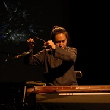 曾小刚](https://i.xiami.com/zengxiaogang) | **地区**: Sweden 瑞典 **风格**: 自由即兴 Free Improvisation, 器乐独奏 Solo Instrumental, 氛围音乐 Ambient, 中国民乐 Chinese Folk Music, 古风 GuFeng Music **播放数**: 4452157 **粉丝数**: 10415 **评论数**: 137  |

## 档案

【曾小刚】艺术家简介 
自幼喜爱乐器，音乐，擅长于古琴，各类弹拨乐器，世界民族音乐。2012年毕业于哥德堡音乐学院，主修世界音乐，现居瑞典。 
曾小刚将古琴置于一个纯粹的界定当中，同时又平和地走在将琴意、琴韵与本心自然的融合，不断推敲琴的美学之路上。以琴为镜，喜乐哀伤，美满残缺皆在其中，面对它亦是面对自己，弹琴即是舍取。所谓弦与指合，指与音合，音与意合，虽人人念于此道，却非人人得其所悟。曾小刚音乐人生，每一阶段的音乐经历也累计成了他如 今的音乐形态。 
年轻时无限的能量想以吉他为出口摇滚着爆发，组建过民谣及摇滚乐队。之后将家乡云南的音乐风格融入到自己的创作中；再之后偶遇了古琴，为其呼吸般自由的律动而倾心；在哥德堡音乐学院研究世界音乐阶段，进一步将古琴及中国音乐与世界音乐的奇妙关系融合推进。在有过学习与比较之后，他认为，古琴音乐有其自身独特的音乐美学系统，且是一种更多构建于感性之上的，靠近心灵直接体验的音乐。曾小刚和古琴的关系的建立更像是一种缘分，像是恰好各自顺了彼此的脾气性格，一拍即合。如今的曾小刚过着近乎山栖谷饮的隐居生活，在体味古意之余，继续创作着个人的琴曲音乐，偶尔出来自己抚琴或者和乐队演奏云之南大山中的旋律。说他是琴人，他 是，说他是自由音乐人，他亦是。 
【曾小刚个人专辑介绍】 
【释 】1：古琴2009年 
释 
雨打花台 
夜机 
曲三叠 
清自清，浊自浊 
【舜 】2：古琴2011年 
舜 
笙 
落影 
雅歌 
渡 
出神 
【飞音记 】3：古琴乐语2012 
年 
三个国王 
一只苍蝇的联想 
神游 
声声慢 
苍天一雁 
两个伙计 
秋月，茅亭 
【苍生 】4：古琴2014年 
秋一把 
一十又三拍 
苍生 
懵 
春草堂 
随弹 
入夜 
【文庙 】5：古琴单曲2015 
三尺枯木 
死神与少女 ：古琴与舞台剧，节选 
死神与少女 
石榴树 
慢角吐春 ：古琴单曲2016 
演出历程: 
2018 德国汉堡丝绸之路音乐节 
2017 垚也北欧巡演 
2017 垚也芝加哥世界音乐节 
2016 云南建水碗窑即兴音乐会 
2016 垚也广东美术馆 
2016 垚也广州凸凸live house 
2016 结庐乐途云境巡演 
2016 大理新结庐 樂 世界音乐会 
2016 昆明TCG/Nordica艺术中心 樂 世界音乐演出 （王集云，李嘉徵，曾小刚） 
2016 昆明大象艺术中心 与寒鹰，李嘉徵十年相聚音乐会 
2015 Östra Asiatisk museet, 东亚博物馆，斯德哥尔摩 
2015 瑞士国际音乐节 担任大忘杠古琴演奏，日内瓦 
2015 Konsthallen Hamnmagasinet, Varberg 
2015 Aroupagos, Norway 
2015 Gothenburg city's library. 
2015 Internationella Spelmastämman, Gothenburg 
2014 瑞典P4瑞典电台采访并演奏古琴 
2014 为舞台剧录制音乐 Borås theater. 
2013 开始新专辑的录制 ”Creature of the world 苍生”。 
2013 dec 与大忘杠 在 BBC World Service 工作室录制说鸟2的录音影像，London 
2013 sep, 声音的艺术 - 在丹麦与丹麦先锋电子音乐家Simon Roy Christensen的两场演出。 
2013 sep 与 Rebecka Gabriel 在 Musik i Halland, 关于语言与音乐的演出。Ord och musik (qin, sång och 	poesi) 瑞典 
2013 oktober T与大忘杠的巡演在德国，奥地利，波兰。Tyskland, Polen och Österrike med kinesiska bandet Dawangang 	(har släppt skiva på tyska skivbolaget Jaro) 
2013 aug Urkult 音乐节，瑞典，大忘杠 
2013 juli  Roskilde 音乐节，丹麦，大忘杠 Dawangang 
2013 juli Sines Festival, 音乐节，Portugal，葡萄牙，大忘杠 Dawangang 
2013 juli Womad Festival, UK，大忘杠 Dawangang 
2012 november 特邀古琴演奏, Litteraturhuset, 奥斯陆文学院 Oslo，挪威 
2012 oktober 个人音乐会, Musik i Halland, Stadsbiblioteket ，图书馆，Halmstad，瑞典 
2012 september 古琴独奏会, Bokmässan, 图书展，Göteborg ，哥德堡，瑞典 
2012 september 音乐会 Varbergs internationella festival，Varberg国际音乐节，瑞典 
2012 augusti 特邀古琴演奏 Sahlberg i P1, SR，瑞典国家电台。 
2012 juni 毕业汇报演出, 哥德堡音乐学院 
2012 maj Stallet Stockholm，斯得哥尔摩 (Lüxing) 
2012 maj Gamla Elverket, Falun，瑞典 (Lüxing) 
2012 maj Theaterladan, Hedemora ，瑞典(Lüxing) 
2011 ULTIMA contemporary music festival 当代音乐节， Oslo 奥斯陆，挪威 
2011 中国当代艺术周在Malmö，瑞典 
2011 Popcornfestivalen音乐节，哥德堡，瑞典 
2011 Teologiska menighetsfakulteten i Oslo，奥斯陆 
2011 TC/G Nordica，昆明 (Lüxing乐队) 
2011 121 Club 北京, Kina (Lüxing乐队) 
2011 Kinesiska konsulatet Göteborg 
2011 Oslo Domkyrka 奥斯陆中心教堂 (独奏会) 
2011 Uranienburg kirke 教堂(solokonsert i samband med föredrag av Notto R. Thelle)，奥斯陆 
2011 Østre Aker kirke 教堂与 Rolf-Erik Nystrøm，奥斯陆，挪威 (saxofonist, kompositör och nominerad till Nordiska Rådets Musikpris 2011) 
2011 Hedemora 教堂 kyrka，瑞典 (Luxing乐队) 
2011 Wasabryggeriet, Borlänge (Luxing) 
2010 Folk- och Världsmusikgalan，民族世界音乐节，哥德堡 
2010 Koloni，哥德堡 
2010 Röhsska 博物馆 museet，哥德堡 
2010 Tehus i Sthlm，斯得哥尔摩 
2010 Aeropagos sommerstevne (独奏会) 
2010 Soirré i Vasa (Luxing乐队) 
2010 Café Berlin (Luxing乐队) 
2010 Café Chao (琴与诗 Solospelning i samband med poesiläsning) 
2010 Betlehemskyrkan (Luxing乐队) 
2010 Kinesisk kulturvecka, Odense, Danmark (Luxing乐队) 
2009 TC/G Nordica ( Emanuelle Brandström的音乐会) 
2009 钱粮胡同 32#, 北京 ( 巫娜, 严峻 och Jen Shuyu，曾小刚) 
2008 Aeropagos sommerstevne, Aarhus, Danmark (The Shadows) 
2007 Julkonsert med Poing i Oslo 
电影音乐 
2011 Hölderlin’s Pottery 荷尔德林的陶 
2006 Bai qiu lian 白秋練 
电台，电视: 
2014 P4 Göteborg:  ”Luften är fri”，采访，并演奏古琴。 
2013 BBC World Service ，大忘杠 
2012 P1 Sahlberg 
2011 P4 Göteborg: 世界音乐电台 Världsmusikprogrammet Teddy 
2011 P4 Skåne 
2004 昆明阳光电台 (人民节奏乐队) 
2004  TV: 云南电视台 (人民节奏乐队)

## 专辑

| 名称 | 语种 | 唱片公司 | 发行时间 | 专辑类别 | 专辑风格 |
| :--: | :-- | :-- | :-- | :-- | :-- |
| [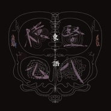 横七竖八之 東·語古琴与尺八](./albums/5022347875.md) | 纯音乐 | 独立发行 | 2021年01月04日 | EP, 单曲 | 世界音乐 World Music, 中国民乐 Chinese Folk Music |
| [ 挽·朝](./albums/5022308945.md) | 国语 | 独立发行 | 2020年12月31日 | EP, 单曲 | 世界音乐 World Music, 中国民乐 Chinese Folk Music |
| [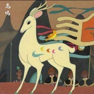 鹿鸣丝弦古琴](./albums/5021899043.md) | 其他 | 独立发行 | 2020年11月10日 | EP, 单曲 | 中国传统民歌 Chinese Traditional Folk |
| [ 招隐神奇秘谱](./albums/2108279766.md) | 其他 | 独立发行 | 2020年04月01日 | EP, 单曲 | 器乐独奏 Solo Instrumental, 世界音乐 World Music, 中国民乐 Chinese Folk Music |
| [ 达观吟西麓堂琴统](./albums/2108262769.md) | 纯音乐 | 独立发行 | 2020年03月29日 | EP, 单曲 | 器乐独奏 Solo Instrumental, 世界音乐 World Music, 中国民乐 Chinese Folk Music |
| [ 脩稧吟](./albums/2108260166.md) | 其他 | 独立发行 | 2020年03月25日 | EP, 单曲 | 中国民乐 Chinese Folk Music, 古风 GuFeng Music, 世界音乐 World Music |
| [ Free2SoundHanna Tolf 曾小刚](./albums/2106104061.md) | 英语 | 独立发行 | 2020年02月26日 | 录音室专辑 | 氛围音乐 Ambient, 实验音乐 Experimental, 中国民乐 Chinese Folk Music |
| [ 葛明新月潭甫](./albums/2105785992.md) | 国语 | 独立发行 | 2020年01月28日 | EP, 单曲 | 当代民谣 Contemporary Folk, 世界音乐 World Music, 中国民乐 Chinese Folk Music |
| [ 指月辑当代古琴](./albums/2105011771.md) | 纯音乐 |  | 2019年07月22日 | 录音室专辑 | 器乐流行 Instrumental Pop, 世界音乐 World Music, 中国民乐 Chinese Folk Music |
| [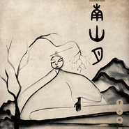 南山月古琴](./albums/2104672564.md) | 国语 |  | 2019年03月15日 | EP, 单曲 | 中国民乐 Chinese Folk Music, 器乐独奏 Solo Instrumental, 世界音乐 World Music |
| [ 心无尽处古琴](./albums/2104191451.md) | 其他 |  | 2018年11月08日 | EP, 单曲 | 古风 GuFeng Music, 自由即兴 Free Improvisation, 世界音乐 World Music |
| [ 星空古琴](./albums/2104045122.md) | 国语 | 独立发行 | 2018年09月21日 | EP, 单曲 | 器乐独奏 Solo Instrumental, 后极简主义 Post-Minimalism, 世界音乐 World Music |
| [ 南方小夜曲古琴二重奏](./albums/2104032844.md) | 国语 | 独立发行 | 2018年09月14日 | EP, 单曲 | 世界音乐 World Music |
| [ 十三・秋古琴与尺八](./albums/2103902137.md) | 国语 | 独立发行 | 2018年08月07日 | EP, 单曲 | 中国民乐 Chinese Folk Music, 世界音乐 World Music |
| [ 椿湫](./albums/2103712982.md) | 国语 | 独立发行 | 2018年05月18日 | EP, 单曲 | 世界音乐 World Music, 中国民乐 Chinese Folk Music |
| [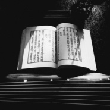 曾小刚古琴曲集](./albums/2102967632.md) | 国语 | 独立发行 | 2017年12月06日 | 录音室专辑 | 世界音乐 World Music, 中国民乐 Chinese Folk Music |
| [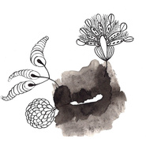 慢角吐春古琴](./albums/2100317520.md) | 国语 | 独立发行 | 2016年04月20日 | EP, 单曲 | 器乐独奏 Solo Instrumental, 氛围音乐 Ambient, 轻音乐 Easy Listening |
| [ 死神与少女 Death And Maiden（古琴）舞台剧配乐](./albums/2100297330.md) | 其他 | 独立发行 | 2016年03月21日 | 原声带, 影视音乐 | 原声 Soundtrack, 音乐剧 Musical theatre |
| [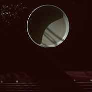 三尺枯木 The Useless Wood古琴](./albums/1529741520.md) | 国语 | 独立发行 | 2015年04月23日 | EP, 单曲 | 世界融合 World Fusion |
| [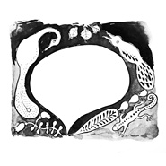 文廟 Culture temple古琴](./albums/529398644.md) | 国语 | 独立发行 | 2015年04月19日 | EP, 单曲 | 器乐独奏 Solo Instrumental, 当代民谣 Contemporary Folk |
| [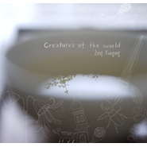 苍生  Creatures Of The World古琴](./albums/1618338534.md) | 国语 | 独立发行 | 2014年12月12日 | 录音室专辑 | 中国风 China-Wave, 器乐独奏 Solo Instrumental |
| [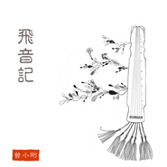 飛音記当代古琴跨界即兴作品集](./albums/1006675509.md) | 国语 | 独立发行 | 2014年07月30日 | 精选集 | 实验音乐 Experimental, 自由即兴 Free Improvisation, 器乐独奏 Solo Instrumental, 氛围音乐 Ambient, 中国民乐 Chinese Folk Music |
| [ 云之南 South of the clouds乌克丽丽演奏](./albums/1405605256.md) | 国语 | 独立发行 | 2014年07月17日 | EP, 单曲 | 世界融合 World Fusion, 器乐独奏 Solo Instrumental, 中国民乐 Chinese Folk Music |
| [ 舜 古琴曾小刚的古琴曲集](./albums/793441075.md) | 国语 | 独立发行 | 2014年02月26日 | 录音室专辑 | 自由即兴 Free Improvisation, 器乐独奏 Solo Instrumental, 中国民乐 Chinese Folk Music |
| [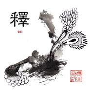 释 古琴曾小刚古琴曲集](./albums/1492978787.md) | 国语 | 独立发行 | 2014年02月21日 | 录音室专辑 | 自由即兴 Free Improvisation, 器乐独奏 Solo Instrumental, 自然新世纪 Nature New Age, 自然采样 Field Recordings, 艺术流行 Art Pop |

## 评论

|  |  |  |
| :-- | :-- | :-- |
|  [虾米用户](https://emumo.xiami.com/u/49655313) 除了再见还可以说些什么呢 2020-09-30 10:09 赞(1) 踩(0) | 
好听
 |
|  [虾米用户](https://emumo.xiami.com/u/121702052) 超脱 2020-08-15 08:45 赞(1) 踩(0) | 
❤️
 |
|  [虾米用户](https://emumo.xiami.com/u/276944698) 不要自我设限..... 2020-07-03 12:26 赞(0) 踩(0) | 

 |
|  [虾米用户](https://emumo.xiami.com/u/4074359)  2020-04-12 17:14 赞(3) 踩(0) | 
不懂古琴，也听不出什么后期不后期，只知道静不下心写字的时候，不管新世纪轻音乐、梵音、古风、冥想音乐&amp;hellip;&amp;hellip;都不好使，只要把曾小刚的电台一播，很快心就不慌了 ，特管用。
 |
|  [虾米用户](https://emumo.xiami.com/u/12456913)   2020-03-30 01:06 赞(0) 踩(0) | 
真正谦逊包容用心的大家！
 |
|  [虾米用户](https://emumo.xiami.com/u/48534792)  2020-03-23 02:38 赞(5) 踩(0) | 
曾先生的古琴与时代融合的古琴，与现代人的认知和感悟融合，刚容易让人共情，我很喜欢。
 |
| ⇒ |  [虾米用户](https://emumo.xiami.com/u/416990) 古琴 2020-03-23 10:23 赞(0) 踩(0) | 

 |
|  [虾米用户](https://emumo.xiami.com/u/429322216)  2020-02-08 16:25 赞(1) 踩(0) | 
古琴的音色得到了新的力量
 |
|  [虾米用户](https://emumo.xiami.com/u/39162310) VJ 2019-07-27 12:13 赞(0) 踩(0) | 
静
 |
|  [虾米用户](https://emumo.xiami.com/u/43648786) 安静的知了 2019-07-22 20:17 赞(2) 踩(0) | 
❤
 |
|  [虾米用户](https://emumo.xiami.com/u/317882889) 灵魂深处的声音 2019-07-13 06:26 赞(0) 踩(0) | 
您分享的心无尽处真好， 我也想制作歌单分享，怎么操作呢？
 |
|  [虾米用户](https://emumo.xiami.com/u/1259430)   2019-07-02 12:38 赞(0) 踩(0) | 
曾先生，想请教您，《秋宵步月》的调弦方法。在下是在太愚钝了。谢谢
 |
| ⇒ |  [虾米用户](https://emumo.xiami.com/u/416990) 古琴 2019-07-03 11:37 赞(0) 踩(0) | 
慢一六紧三同四
 |
|  [虾米用户](https://emumo.xiami.com/u/66823378)  2019-06-15 18:09 赞(2) 踩(0) | 

 |
|  [虾米用户](https://emumo.xiami.com/u/22444238) 邱比官方虾米 2019-06-15 14:02 赞(8) 踩(0) | 
Get
 |
|  [虾米用户](https://emumo.xiami.com/u/46467302)  2019-05-27 11:42 赞(0) 踩(0) | 
★
 |
|  [虾米用户](https://emumo.xiami.com/u/9305059) 爱我的人你会幸福 2019-02-04 10:01 赞(0) 踩(0) | 
神韵，喜欢
 |
|  [虾米用户](https://emumo.xiami.com/u/16950454) 你那边几点？ 2018-12-03 03:48 赞(0) 踩(0) | 
听了这么久，还是最喜欢舜和笙
 |
|  [虾米用户](https://emumo.xiami.com/u/2744074)  2018-10-19 13:04 赞(2) 踩(0) | 
发现新大陆了   不容易
 |
|  [虾米用户](https://emumo.xiami.com/u/9858927) 哈啰 2018-10-19 01:41 赞(0) 踩(0) | 
不懂古琴但喜欢听
 |
|  [虾米用户](https://emumo.xiami.com/u/365626177) 我还没想好要写什么... 2018-09-06 13:14 赞(1) 踩(0) | 
禅定了&amp;hellip;
 |
|  [虾米用户](https://emumo.xiami.com/u/401315496)  2018-08-17 00:29 赞(0) 踩(0) | 
曾小刚厉害啊
 |
|  [虾米用户](https://emumo.xiami.com/u/192616238) 年轻养生最强王者 2018-08-15 01:12 赞(1) 踩(0) | 
曾老师您什么时候会再办音乐会，从哪里了解您的社会动向呢？
 |
| ⇒ |  [虾米用户](https://emumo.xiami.com/u/416990) 古琴 2019-07-28 10:12 赞(0) 踩(0) | 
可以关注我的微博
 |
|  [虾米用户](https://emumo.xiami.com/u/279178558)  2018-08-11 21:03 赞(0) 踩(0) | 
画画时候听很合，不知道怎么全部收藏呢？
 |
|  [虾米用户](https://emumo.xiami.com/u/2279055)  2018-07-29 22:54 赞(1) 踩(0) | 
特别喜欢您的《言何知》,似娓娓道来,却转念一空。
 |
|  [虾米用户](https://emumo.xiami.com/u/362666549)  2018-07-18 10:42 赞(0) 踩(0) | 

 |
|  [虾米用户](https://emumo.xiami.com/u/2603889)  2018-07-14 11:07 赞(0) 踩(0) | 
今天在网上找古埙音乐偶然发现的民族音乐，古器新奏面目一新。我很喜欢，会一直关注艺术家的专辑。不知道哪能买到？
 |
|  [虾米用户](https://emumo.xiami.com/u/377960015)  2018-07-08 11:31 赞(1) 踩(0) | 
真的好听
 |
|  [虾米用户](https://emumo.xiami.com/u/2354958)  2018-06-13 13:52 赞(1) 踩(0) | 
求推荐更多这样的音乐人QAQ
 |
|  [虾米用户](https://emumo.xiami.com/u/359295678)  2018-05-03 23:51 赞(2) 踩(0) | 
不知道 曾老师会不会授课  我在丹麦距离瑞典不远 想学古琴。。。
 |
|  [虾米用户](https://emumo.xiami.com/u/29285843) 潜鱼水底传心诀，栖鸟枝头... 2018-04-18 11:36 赞(0) 踩(0) | 
心醉神钦 
 |
|  [虾米用户](https://emumo.xiami.com/u/287442418) 我与音乐之间隔着一道墙…... 2018-04-10 19:31 赞(0) 踩(0) | 
适合写作业时听 平稳心绪... 真的做梦都想学古琴...
 |
| ⇒ |  [虾米用户](https://emumo.xiami.com/u/36365141)  2018-06-19 19:33 赞(0) 踩(0) | 
古琴挺好上手的，虽说易学难精，但不得不说确实很能在其中走近自我。小时候看到古琴就很神往，幸好没放弃这个小愿望，终于十多年后找到机会拜师学艺了。
 |
| ⇒ |  [虾米用户](https://emumo.xiami.com/u/343687904)  2018-07-14 20:26 赞(0) 踩(0) | 
<q><b>小仙剑说：</b></q>
 |
| ⇒ |  [虾米用户](https://emumo.xiami.com/u/36365141)  2018-07-15 16:30 赞(0) 踩(0) | 
<q><b>盆满钵满说：</b></q>
 |
| ⇒ |  [虾米用户](https://emumo.xiami.com/u/343687904)  2018-07-16 21:09 赞(0) 踩(0) | 
<q><b>小仙剑说：</b></q>
 |
|  [虾米用户](https://emumo.xiami.com/u/54392844) 予独爱和雅琴音 2018-03-10 13:51 赞(1) 踩(0) | 
有境界的音乐
 |
|  [虾米用户](https://emumo.xiami.com/u/351872191) 天下才能看 2018-02-22 22:42 赞(2) 踩(0) | 
我是一个威宁县人，自小琴棋书画样样精通，所以我想你&amp;hellip;&amp;hellip;
 |
|  [虾米用户](https://emumo.xiami.com/u/21422751)  2018-01-25 17:33 赞(0) 踩(0) | 
很有空间，适合用来跳舞 
 |
|  [虾米用户](https://emumo.xiami.com/u/44456235) 恻隐之间花意浓 2018-01-20 17:45 赞(1) 踩(0) | 
曾老师什么时候发实体CD啊！
 |
| ⇒ |  [虾米用户](https://emumo.xiami.com/u/416990) 古琴 2018-04-29 20:20 赞(0) 踩(0) | 
有的
 |
| ⇒ |  [虾米用户](https://emumo.xiami.com/u/416990) 古琴 2019-07-28 10:12 赞(0) 踩(0) | 
发啦
 |
| ⇒ |  [虾米用户](https://emumo.xiami.com/u/44456235) 恻隐之间花意浓 2020-01-01 22:53 赞(0) 踩(0) | 
<q><b>曾小刚说：</b></q>
 |
| ⇒ |  [虾米用户](https://emumo.xiami.com/u/416990) 古琴 2020-01-01 22:55 赞(0) 踩(0) | 
<q><b>林泉高致说：</b></q>
 |
|  [虾米用户](https://emumo.xiami.com/u/255544732)  2017-11-15 23:40 赞(1) 踩(0) | 
很棒！正在学习古琴中，向老师看齐 
 |
|  [虾米用户](https://emumo.xiami.com/u/10310498)   2017-11-15 02:06 赞(0) 踩(0) | 
～
 |
|  [虾米用户](https://emumo.xiami.com/u/123658316) BetweenDarkn... 2017-10-15 11:18 赞(3) 踩(0) | 
太棒了 希望以后能听到更多我们自己民族的世界音乐
 |
|  [虾米用户](https://emumo.xiami.com/u/467413)  2017-09-26 21:57 赞(7) 踩(0) | 
原来古琴声音可以显现宇宙，有形现无形
 |
|  [虾米用户](https://emumo.xiami.com/u/320888304)  2017-08-22 20:44 赞(0) 踩(0) | 
曾老师我也姓曾
 |
|  [虾米用户](https://emumo.xiami.com/u/301670424)  2017-07-28 16:32 赞(2) 踩(0) | 
练书法必听  
 |
|  [虾米用户](https://emumo.xiami.com/u/250153775)  2017-07-11 00:54 赞(1) 踩(0) | 
练书法必听
 |
|  [虾米用户](https://emumo.xiami.com/u/85862428)  2017-07-07 23:35 赞(3) 踩(0) | 
听了那么多古琴演奏 就喜欢曾老师的作品
 |
|  [虾米用户](https://emumo.xiami.com/u/304017687)  2017-06-12 21:26 赞(1) 踩(0) | 
宁静而致远
 |
|  [虾米用户](https://emumo.xiami.com/u/6654061) Cosmic Wave 2017-06-10 17:37 赞(2) 踩(0) | 
这真是继暮良文王之后的又一个宝贵发现。
 |
|  [虾米用户](https://emumo.xiami.com/u/257676631)  2017-03-22 10:10 赞(0) 踩(0) | 
好
 |
|  [虾米用户](https://emumo.xiami.com/u/273321193)  2017-03-16 20:20 赞(0) 踩(0) | 
我也喜欢古琴
 |
|  [虾米用户](https://emumo.xiami.com/u/12914680)  2017-02-01 01:25 赞(0) 踩(0) | 
回来聚聚阿华我们一起 
 |
|  [虾米用户](https://emumo.xiami.com/u/248446431) 高晓健 2016-11-22 21:50 赞(1) 踩(0) | 

 |
|  [虾米用户](https://emumo.xiami.com/u/15997376)  2016-11-05 23:31 赞(0) 踩(0) | 
想了解，印象最深刻，是张艺谋的片子“英雄”的古琴表演
 |
|  [虾米用户](https://emumo.xiami.com/u/44060768) 王子说 2016-10-23 13:47 赞(0) 踩(0) | 
很棒 怎么下载
 |
|  [虾米用户](https://emumo.xiami.com/u/1290405)  2016-10-02 23:54 赞(0) 踩(0) | 
看书必听，超赞
 |
|  [虾米用户](https://emumo.xiami.com/u/151198) 点滴星光足以温暖一池秋水 2016-09-13 14:20 赞(0) 踩(0) | 
令人安静平和的音乐，工作的时候听听非常安逸。
 |
|  [虾米用户](https://emumo.xiami.com/u/10384607) 空山無人，水流花開。 2016-09-11 01:20 赞(1) 踩(0) | 
来找太极拳片子配乐
 |
|  [虾米用户](https://emumo.xiami.com/u/170211738) 上帝在开始爱着了 2016-08-26 14:51 赞(0) 踩(0) | 

 |
|  [虾米用户](https://emumo.xiami.com/u/800923) 再见 虾米 2016-08-23 10:18 赞(0) 踩(0) | 
乍一听还真不习惯呢……
 |
|  [虾米用户](https://emumo.xiami.com/u/203770052)  2016-08-04 10:40 赞(1) 踩(0) | 
很好听
 |
|  [虾米用户](https://emumo.xiami.com/u/8423242) Never give u... 2016-07-30 10:10 赞(5) 踩(0) | 
昨天发现了他的古琴风，超喜欢，既有云南风格也不脱古琴那份宁静，再加了点点西洋的风格，有点不安份[呲牙][呲牙]
 |
|  [虾米用户](https://emumo.xiami.com/u/184789041)  2016-07-30 01:27 赞(2) 踩(0) | 
今天有幸亲临现场欣赏三位老师的即兴演奏，太过瘾了！期待下次！   
 |
|  [虾米用户](https://emumo.xiami.com/u/34491252)  2016-07-27 09:44 赞(1) 踩(0) | 
老师，可以跟您学琴吗
 |
|  [虾米用户](https://emumo.xiami.com/u/6224434)  2016-07-12 09:50 赞(0) 踩(0) | 
每天练功时必听
 |
|  [虾米用户](https://emumo.xiami.com/u/126519890)  2016-06-23 20:40 赞(2) 踩(0) | 
老师和善亲近，曲子信马由缰，不落窠臼
 |
|  [虾米用户](https://emumo.xiami.com/u/9485620)  2016-05-25 21:06 赞(2) 踩(0) | 
在传统中糅合了新元素，沉而厚，但是不枯寂
 |
|  [虾米用户](https://emumo.xiami.com/u/14123312) 我还没想好要写什么... 2016-05-19 23:16 赞(1) 踩(0) | 
又是我们大云南的
 |
| ⇒ |  [虾米用户](https://emumo.xiami.com/u/3494088)  2017-03-21 12:16 赞(0) 踩(0) | 

 |
|  [虾米用户](https://emumo.xiami.com/u/10670991)  2016-03-24 10:39 赞(0) 踩(0) | 
是录进杂音了吗？为什么会有电视剧的声音……？(´･_･`)
 |
| ⇒ |  [虾米用户](https://emumo.xiami.com/u/184789041)  2016-07-30 01:29 赞(0) 踩(0) | 
人曲名叫“懵”，听懵了没？懵就对了  
 |
| ⇒ |  [虾米用户](https://emumo.xiami.com/u/3494088)  2017-03-21 12:17 赞(0) 踩(0) | 
特效
 |
|  [虾米用户](https://emumo.xiami.com/u/739335)  2016-03-10 10:20 赞(2) 踩(0) | 
思绪跟着飘去了外太空，没有边际，是大海，是日月，是星辰，是草原，没有阻隔，广袤无垠，太美妙的音乐，立刻心神气定
 |
|  [虾米用户](https://emumo.xiami.com/u/1322073) 我还没想好要写什么... 2016-03-07 16:33 赞(2) 踩(0) | 
每天喝茶时必听
 |
|  [虾米用户](https://emumo.xiami.com/u/757650)  2016-03-01 16:26 赞(0) 踩(0) | 
古琴
 |
|  [虾米用户](https://emumo.xiami.com/u/30617820) 窝列大窝列大哟 2016-02-22 22:28 赞(0) 踩(0) | 
＝＝
 |
|  [虾米用户](https://emumo.xiami.com/u/13012891) Musicneverce... 2016-02-18 11:44 赞(1) 踩(0) | 
不错啊
 |
|  [虾米用户](https://emumo.xiami.com/u/8251899)  2016-02-12 09:19 赞(1) 踩(0) | 
找了很久，终于又听到喜欢的
 |
|  [虾米用户](https://emumo.xiami.com/u/5752632)  2015-11-10 16:58 赞(0) 踩(0) | 
古琴
 |
|  [虾米用户](https://emumo.xiami.com/u/67960314)  2015-09-19 13:21 赞(26) 踩(0) | 
这件事证明了，我们不懈的寻找，总能发现之前没闻听过的，也同时证明了追寻的可贵。
 |
|  [虾米用户](https://emumo.xiami.com/u/66864970) 然一 2015-09-17 13:21 赞(2) 踩(0) | 
人琴契圆深播远！妙哉～
 |
|  [虾米用户](https://emumo.xiami.com/u/38662280) 不懂装懂中度患者 2015-08-16 22:00 赞(2) 踩(0) | 
像是电脑不插电弹起了不得了的带弦电子琴……才不属于空灵什么的
 |
| ⇒ |  [虾米用户](https://emumo.xiami.com/u/109134218) 未许避人思避世,独扶残醉... 2016-02-03 23:20 赞(0) 踩(0) | 
你在大山深处，寂静无人。忽闻一阵琴声，追寻而去，只见半山腰间一道观老道在弹。此情此景摆脱俗世烦恼。岂不快哉！
 |
|  [虾米用户](https://emumo.xiami.com/u/4329943) 口味很杂。  顺耳就行，... 2015-06-24 17:04 赞(1) 踩(0) | 
支持
 |
|  [虾米用户](https://emumo.xiami.com/u/6410799)  2015-06-02 00:13 赞(2) 踩(0) | 
竟如此棒！
 |
|  [虾米用户](https://emumo.xiami.com/u/50489932)  2015-06-01 15:31 赞(1) 踩(0) | 
偶然听到，很适合一个人的时候听
 |
|  [虾米用户](https://emumo.xiami.com/u/42921133) 加油吧 2015-05-26 15:32 赞(1) 踩(0) | 
古琴 即兴
 |
|  [虾米用户](https://emumo.xiami.com/u/41163171)  人世間 流浪人 若回流... 2015-05-02 09:39 赞(4) 踩(0) | 
不沉重，能近人
 |
|  [虾米用户](https://emumo.xiami.com/u/47449695) 你的敏感并不脆弱 2015-04-23 08:39 赞(1) 踩(0) | 
继续关注 
 |
|  [虾米用户](https://emumo.xiami.com/u/13926038)  2015-04-22 15:28 赞(4) 踩(0) | 
毫无雕琢,浑然天成，惬意纯净的人才能做出这样的音乐吧
 |
|  [虾米用户](https://emumo.xiami.com/u/416990) 古琴 2015-04-20 02:08 赞(4) 踩(0) | 
如果喜欢，请支持购买！谢谢！
 |
|  [虾米用户](https://emumo.xiami.com/u/2099217) 我还没想好要写什么... 2015-04-19 22:40 赞(28) 踩(0) | 
脱离捆绑的古典感，想象空间很足
 |
|  [虾米用户](https://emumo.xiami.com/u/19751201)  2015-04-19 22:13 赞(1) 踩(0) | 
轻音袅袅 赞
 |
|  [虾米用户](https://emumo.xiami.com/u/11917054) 『常年卧底医院并乔装成医... 2015-04-10 13:54 赞(3) 踩(0) | 
Life is short, Break the rules. Forgive quickly, Kiss slowly, Love truly, Laugh uncontrollably
 |
|  [虾米用户](https://emumo.xiami.com/u/17124587) 阿那都品 2015-03-14 06:21 赞(0) 踩(0) | 
；）
 |
| ⇒ |  [虾米用户](https://emumo.xiami.com/u/416990) 古琴 2015-03-14 21:14 赞(0) 踩(0) | 
王兄，很高兴认识你！希望有朝一日亲临你的现场！
 |
|  [虾米用户](https://emumo.xiami.com/u/10547530) 生于白昼，隐与黑夜。 2015-02-24 20:11 赞(3) 踩(0) | 
气质更接近于西方。但编曲很自然。浑然天成，不露痕迹。
 |
|  [虾米用户](https://emumo.xiami.com/u/13702800)  2015-01-21 20:52 赞(1) 踩(0) | 
好听
 |
|  [虾米用户](https://emumo.xiami.com/u/37135857) 时而静谧，时而簇舞... 2014-12-09 11:45 赞(0) 踩(0) | 
用了您的专辑封面做背景，谢过
 |
|  [虾米用户](https://emumo.xiami.com/u/13626334)  2014-09-13 00:53 赞(4) 踩(0) | 
太爱 这样的音乐了！！！
 |
|  [虾米用户](https://emumo.xiami.com/u/400936)  2014-08-18 02:34 赞(1) 踩(0) | 
又听到小刚，高兴
 |
|  [虾米用户](https://emumo.xiami.com/u/4141516)  2014-08-17 09:43 赞(0) 踩(0) | 
曾小刚古琴,中国,天籁,安静,治愈系
 |
|  [虾米用户](https://emumo.xiami.com/u/23105509) 我还没想好要写什么... 2014-07-31 10:41 赞(1) 踩(0) | 
小刚，祝贺你啊！看来我们要加油啦！
 |
|  [虾米用户](https://emumo.xiami.com/u/665351) moonxuan96@1... 2014-07-30 08:52 赞(1) 踩(0) | 
哇，好久不见
 |
|  [虾米用户](https://emumo.xiami.com/u/1247974) 我还没想好要写什么... 2014-05-20 06:00 赞(1) 踩(0) | 
这是有多纠结，居然没找到关注按键。
 |
|  [虾米用户](https://emumo.xiami.com/u/24267363) ryan 2014-04-26 13:59 赞(1) 踩(0) | 
适合静静的听
 |
|  [虾米用户](https://emumo.xiami.com/u/24768071)  2014-04-10 04:56 赞(1) 踩(0) | 
赞，古琴没学完就跑到美帝来读书了，回去有机会希望可以继续学习
 |
|  [虾米用户](https://emumo.xiami.com/u/34887689)  2014-04-04 13:51 赞(3) 踩(0) | 
真的不咋样！
 |
|  [虾米用户](https://emumo.xiami.com/u/34696318)  2014-03-31 00:49 赞(1) 踩(0) | 
哈喽
 |
|  [虾米用户](https://emumo.xiami.com/u/34187440)  2014-03-17 13:43 赞(1) 踩(0) | 
古琴
 |
|  [虾米用户](https://emumo.xiami.com/u/33943182)  2014-03-12 15:33 赞(1) 踩(0) | 
古琴,中国,古典,
 |
|  [虾米用户](https://emumo.xiami.com/u/33943076)  2014-03-12 15:31 赞(1) 踩(0) | 
古琴,中国,
 |
|  [虾米用户](https://emumo.xiami.com/u/12350599) 憋来勾引窝 2014-03-08 20:19 赞(1) 踩(0) | 
赞呀
 |
|  [虾米用户](https://emumo.xiami.com/u/9161767)  2014-03-06 17:29 赞(2) 踩(0) | 
琴者，情也。古琴乃心镜，自弹自得，琴声入耳，涤净心灵。
 |
|  [虾米用户](https://emumo.xiami.com/u/1845874)  2014-03-05 19:34 赞(1) 踩(0) | 
不错哦~~~没想到会玩这个去了~~以前听过人民节奏的歌~~~
 |
|  [虾米用户](https://emumo.xiami.com/u/6973445)  2014-02-26 13:08 赞(1) 踩(0) | 
总算入住了，已经期待很久……
 |
| ⇒ |  [虾米用户](https://emumo.xiami.com/u/6973445)  2014-02-27 17:00 赞(0) 踩(0) | 
<q><b>说：</b></q>
 |
|  [虾米用户](https://emumo.xiami.com/u/416990) 古琴 2014-02-20 21:32 赞(140) 踩(0) | 
我刚入驻了虾米音乐人，欢迎大家来我的个人主页，收听我的最新音乐
 |
| ⇒ |  [虾米用户](https://emumo.xiami.com/u/33010514)  2016-01-20 09:12 赞(0) 踩(0) | 
好听
 |
| ⇒ |  [虾米用户](https://emumo.xiami.com/u/35493969)  2016-04-19 09:27 赞(0) 踩(0) | 
有新意，好听，有想法的你。么么哒。
 |
| ⇒ |  [虾米用户](https://emumo.xiami.com/u/6654061) Cosmic Wave 2017-06-07 22:54 赞(0) 踩(0) | 
师曾可是建水人？
 |
| ⇒ |  [虾米用户](https://emumo.xiami.com/u/416990) 古琴 2017-06-11 14:52 赞(0) 踩(0) | 
<q><b>其實我想起名叫軒然的说：</b></q>
 |
| ⇒ |  [虾米用户](https://emumo.xiami.com/u/295167693)  2017-07-02 15:28 赞(0) 踩(0) | 
三面埋伏为啥这里没有！ 
 |
| ⇒ |  [虾米用户](https://emumo.xiami.com/u/416990) 古琴 2017-07-02 16:48 赞(0) 踩(0) | 
<q><b>哼吃了那么多家就我家的玛咖好说：</b></q>
 |
| ⇒ |  [虾米用户](https://emumo.xiami.com/u/109543282)  2017-08-18 22:47 赞(0) 踩(0) | 
超级喜欢！
 |
| ⇒ |  [虾米用户](https://emumo.xiami.com/u/109543282)  2017-08-20 20:56 赞(0) 踩(0) | 
曾老师，昆明小迷妹期待您的新专辑！
 |
| ⇒ |  [虾米用户](https://emumo.xiami.com/u/116670000) 我还没想好要写什么... 2017-10-01 13:06 赞(0) 踩(0) | 
《释》，是整个专辑中我最为偏爱的一首。感谢曾老师。
 |
| ⇒ |  [虾米用户](https://emumo.xiami.com/u/293962529)  2017-12-24 09:11 赞(0) 踩(0) | 
美到极致
 |
| ⇒ |  [虾米用户](https://emumo.xiami.com/u/405130860) 弘扬中华文化 2018-10-01 22:42 赞(0) 踩(0) | 
不要在主体思想说古琴，只能用音乐两个字，
 |
| ⇒ |  [虾米用户](https://emumo.xiami.com/u/405130860) 弘扬中华文化 2018-10-01 22:44 赞(0) 踩(0) | 
古琴的文化就是传承简单，感觉曾小刚应该用了软件，不是手上硬功夫，还是不喜欢，
 |
| ⇒ |  [虾米用户](https://emumo.xiami.com/u/420576178)  2019-12-01 01:25 赞(0) 踩(0) | 
<q><b>五千年的莲说：</b></q>
 |
