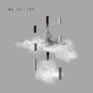

出山
============================

|  |  |
| :--: | :-- |
| [ 出山](https://emumo.xiami.com/album/2104786779) | **艺人**: [花粥](../index.md) **语种**: 国语 **唱片公司**:  **发行时间**: 2019年04月18日 **专辑类别**: 录音室专辑 **专辑风格**: 流行 Pop, 网络流行 Cyber Hit, 国语流行 Mandarin Pop **播放数**: 1451272 **收藏数**: 240 **评论数**: 31  |

## 简介

精心编配成钢琴版，希望大家能够喜欢！公众号：姜创钢琴  欢迎转发..........

## 曲目

## 评论

|  |  |  |
| :-- | :-- | :-- |
|  [虾米用户](https://emumo.xiami.com/u/445828311)  2020-12-18 21:09 赞(0) 踩(0) | 
怎么不能听？
 |
|  [虾米用户](https://emumo.xiami.com/u/27919858)  2020-11-15 12:59 赞(0) 踩(0) | 
超好的
 |
| ⇒ |  [虾米用户](https://emumo.xiami.com/u/347696902) 人間の価値、私は価値がな... 2020-11-19 16:23 赞(0) 踩(0) | 
没版权了，教教我，咋听的？
 |
|  [虾米用户](https://emumo.xiami.com/u/188964710)  2020-05-05 19:24 赞(1) 踩(0) | 
很好听
 |
|  [虾米用户](https://emumo.xiami.com/u/411547801) 我还没想好要写什么... 2020-04-03 11:51 赞(1) 踩(0) | 
什么时候能不听，对，就是永远。
 |
|  [虾米用户](https://emumo.xiami.com/u/357575295)  2020-03-27 15:18 赞(1) 踩(0) | 
什么时候能听
 |
|  [虾米用户](https://emumo.xiami.com/u/318935) 你爱我，已成往事。 2019-07-23 10:02 赞(4) 踩(0) | 
两个月而已。虾米就没了版权。。。。
 |
|  [虾米用户](https://emumo.xiami.com/u/423195308)  2019-06-29 19:23 赞(1) 踩(0) | 
还行
 |
|  [虾米用户](https://emumo.xiami.com/u/325374787)  2019-05-16 10:28 赞(2) 踩(0) | 
6666666666666666666虾米来点个赞感谢！
 |
|  [虾米用户](https://emumo.xiami.com/u/424183239)  2019-05-12 16:23 赞(0) 踩(0) | 
牛！！！！！！！！！！！！！！！！！！！！ ！！！！！！！！！！！！！！！！！！！！ ！！！！！！！！！！！！！！！！！！！！ ！！！！！！！！！！！！！！！！！！！！ ！！！！！！！！！！！！！！！!！！！！！！！！！！！！！！！！！！！！ ！！！！！！！！！！！！！！！！！！！！ ！！！！！！！！！！！！！！！！！！！！ ！！！！！！！！！！！！！！！！！！！！ ！！！！！！！！！！！！！！！！！！！！ ！！！！！！！！！！！！！！！！！！！！ ！！！！！！！！！！！！！！！！！！！！ ！！！！！！！！！！！！！！！！！！！！ ！！！！！！！！！！！！！！！！！！！！ ！！！！！！！！！！！！！！！！！！！！ ！！！
 |
|  [虾米用户](https://emumo.xiami.com/u/422380641)  2019-05-06 23:47 赞(1) 踩(0) | 
不错，竟然虾米有版权
 |
|  [虾米用户](https://emumo.xiami.com/u/421085322)  2019-05-06 21:01 赞(1) 踩(0) | 
出山，肯定会火的，先占个评论吧，很喜欢这种调调  
 |
|  [虾米用户](https://emumo.xiami.com/u/424086776) 爱音乐 2019-05-04 22:41 赞(0) 踩(0) | 
很好听
 |
|  [虾米用户](https://emumo.xiami.com/u/418776810) 我还没想好要写什么... 2019-05-04 19:28 赞(0) 踩(0) | 
为什么没有伴奏?
 |
|  [虾米用户](https://emumo.xiami.com/u/423958337)  2019-05-04 12:46 赞(0) 踩(0) | 

 |
|  [虾米用户](https://emumo.xiami.com/u/43182804) 最孤独的人 2019-05-02 22:11 赞(0) 踩(0) | 
真的不错
 |
|  [虾米用户](https://emumo.xiami.com/u/408234545)  2019-05-02 20:45 赞(0) 踩(0) | 
好
 |
|  [虾米用户](https://emumo.xiami.com/u/401237733)  2019-05-02 12:11 赞(2) 踩(0) | 
侵权
 |
|  [虾米用户](https://emumo.xiami.com/u/423867728) 我还没想好要写什么... 2019-04-29 21:07 赞(2) 踩(0) | 
希望有归来去兮的版权
 |
|  [虾米用户](https://emumo.xiami.com/u/423852226)  2019-04-28 12:36 赞(0) 踩(0) | 
怎么购买不了。。
 |
|  [虾米用户](https://emumo.xiami.com/u/216097903)  2019-04-28 11:46 赞(0) 踩(0) | 
超级好听
 |
|  [虾米用户](https://emumo.xiami.com/u/423846017)  2019-04-27 22:44 赞(1) 踩(0) | 
好听
 |
|  [虾米用户](https://emumo.xiami.com/u/421268041)  2019-04-26 21:37 赞(0) 踩(0) | 
太棒了！！！！
 |
|  [虾米用户](https://emumo.xiami.com/u/376601457)  2019-04-24 21:32 赞(0) 踩(0) | 
太棒
 |
|  [虾米用户](https://emumo.xiami.com/u/344018512) 我还没想好要写什么... 2019-04-24 08:31 赞(0) 踩(0) | 
●ｖ●
 |
|  [虾米用户](https://emumo.xiami.com/u/332893230) 傻孩子 2019-04-20 22:35 赞(1) 踩(0) | 
舒服 
 |
|  [虾米用户](https://emumo.xiami.com/u/423528392)  2019-04-20 07:43 赞(1) 踩(0) | 
是最好听的歌
 |
|  [虾米用户](https://emumo.xiami.com/u/346493090) 我喜欢什么，就听什么。 2019-04-19 15:35 赞(1) 踩(0) | 
好听，比别人好得多
 |
|  [虾米用户](https://emumo.xiami.com/u/408835259)  2019-04-19 13:55 赞(1) 踩(0) | 
好听好听^_^^_^^_^
 |
|  [虾米用户](https://emumo.xiami.com/u/358377007) 虾米再见❤️❤️❤️ 2019-04-19 08:11 赞(2) 踩(0) | 
最喜欢戏腔，浓浓的古韵
 |
| ⇒ |  [虾米用户](https://emumo.xiami.com/u/423769098)  2019-04-26 17:36 赞(0) 踩(0) | 
0
 |
