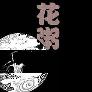

给他一瓶可乐
============================

|  |  |
| :--: | :-- |
| [ 给他一瓶可乐](https://emumo.xiami.com/album/562402) | **艺人**: [花粥](../index.md) **语种**: 国语 **唱片公司**: 画朵独立 **发行时间**: 2012年12月06日 **专辑类别**: 精选集 **专辑风格**: 城市民谣 Urban Folk **播放数**: 3674635 **收藏数**: 2083 **评论数**: 93  |

## 简介

本专辑音频现为歌手Demo，音质和频谱不佳，请见谅。

## 曲目

## 评论

|  |  |  |
| :-- | :-- | :-- |
|  [虾米用户](https://emumo.xiami.com/u/187438203)  2019-07-25 21:43 赞(0) 踩(0) | 
全没了。
 |
|  [虾米用户](https://emumo.xiami.com/u/236805251)  2018-05-10 00:46 赞(0) 踩(0) | 
同学少年都不贱 去哪儿了   
 |
|  [虾米用户](https://emumo.xiami.com/u/236805251)  2018-05-10 00:40 赞(0) 踩(0) | 
少了一首歌  
 |
|  [虾米用户](https://emumo.xiami.com/u/335695562)  2018-03-15 18:06 赞(0) 踩(0) | 
开演唱会把吧
 |
|  [虾米用户](https://emumo.xiami.com/u/122304130)   2017-12-21 22:32 赞(1) 踩(0) | 
我觉得需要把热评2踢下去
 |
|  [虾米用户](https://emumo.xiami.com/u/9789527)  2017-10-30 09:52 赞(3) 踩(0) | 
最近突然很喜欢这种小民谣
 |
|  [虾米用户](https://emumo.xiami.com/u/8606706)  2017-10-27 23:03 赞(1) 踩(0) | 
屌丝怎么了？就喜欢这种真实纯粹！其实是小清新
 |
|  [虾米用户](https://emumo.xiami.com/u/299811769)  2017-05-30 20:08 赞(0) 踩(0) | 
不想听哪远滚哪去别在这刷存在感
 |
|  [虾米用户](https://emumo.xiami.com/u/11074709) — 2017-01-10 13:23 赞(2) 踩(0) | 
你明明很想唱歌 却忘了词开始笑着
 |
|  [虾米用户](https://emumo.xiami.com/u/235725200)  2016-11-07 20:12 赞(0) 踩(0) | 
歌词真特么污~
 |
|  [虾米用户](https://emumo.xiami.com/u/18770356) 没有哭没有笑，让我一个人... 2016-10-07 22:06 赞(0) 踩(0) | 
给我一瓶可乐
 |
|  [虾米用户](https://emumo.xiami.com/u/200563108) 木中无人 2016-07-15 21:51 赞(0) 踩(0) | 
喜欢的人喜欢
 |
|  [虾米用户](https://emumo.xiami.com/u/35501540)  2016-07-07 10:43 赞(1) 踩(0) | 
8月18日 花粥.与.驳倒乐队2016联合巡演第二波 承德路上酒吧......  @花粥粥大爷  @张百万  @驳倒乐队罗智博  @驳倒乐队。
 |
|  [虾米用户](https://emumo.xiami.com/u/48822154)  2016-04-03 15:48 赞(1) 踩(0) | 
听口音一开始还以为是北京人
 |
|  [虾米用户](https://emumo.xiami.com/u/35279935)  2016-02-19 22:25 赞(2) 踩(0) | 
那你就是跟风咯，不喜欢自己滚
 |
|  [虾米用户](https://emumo.xiami.com/u/2987526) no Romeo 2016-01-16 16:17 赞(3) 踩(0) | 
明明是小清新 的女流氓
 |
|  [虾米用户](https://emumo.xiami.com/u/7501645)  2015-12-20 09:47 赞(0) 踩(0) | 
喜欢，没理由 
 |
|  [虾米用户](https://emumo.xiami.com/u/55206441)  2015-09-02 12:55 赞(0) 踩(0) | 
给他一瓶可乐 花粥粥
 |
|  [虾米用户](https://emumo.xiami.com/u/1582817) 若收藏精选集已删除，请用... 2015-05-22 10:46 赞(14) 踩(0) | 
爱个屁　唱歌都没底气　像断气～～
 |
|  [虾米用户](https://emumo.xiami.com/u/37601489)  2015-05-03 19:56 赞(3) 踩(0) | 
顶粥爷！
 |
|  [虾米用户](https://emumo.xiami.com/u/35501540)  2015-03-31 21:42 赞(2) 踩(0) | 
承德市路上酒吧 3月19日晚7点30分民谣歌手花粥专场演出；我顶你。
 |
|  [虾米用户](https://emumo.xiami.com/u/3434310)  2015-03-20 00:10 赞(0) 踩(0) | 
这风格让我联想到little airport
 |
| ⇒ |  [虾米用户](https://emumo.xiami.com/u/46457946) 后摇才摇。 2015-03-29 16:41 赞(0) 踩(0) | 
一点儿都不像好么，各自有各自的味道。小机场属于甜美的乐观主义态度。花粥的歌虽然轻快但是带了一点伤感。
 |
| ⇒ |  [虾米用户](https://emumo.xiami.com/u/12562992) 我还没想好要写什么... 2015-08-24 04:41 赞(0) 踩(0) | 
<q><b>说：</b></q>
 |
| ⇒ |  [虾米用户](https://emumo.xiami.com/u/1582817) 若收藏精选集已删除，请用... 2015-08-24 10:18 赞(0) 踩(0) | 
<q><b>Veralynwei说：</b></q>
 |
|  [虾米用户](https://emumo.xiami.com/u/35501540)  2015-03-08 15:46 赞(2) 踩(0) | 
承德市路上酒吧 3月19日晚7点30分民谣歌手美女花粥专场演出；我顶你
 |
|  [虾米用户](https://emumo.xiami.com/u/16864583)  2015-01-31 14:11 赞(1) 踩(0) | 
喜欢姑娘写词的生活化
 |
|  [虾米用户](https://emumo.xiami.com/u/12669136)  2015-01-20 00:07 赞(3) 踩(0) | 
给他一瓶可乐 别在让他继续醉了 谁在窗边听着 房里的人也安静的哭了
 |
|  [虾米用户](https://emumo.xiami.com/u/10248369)  2015-01-08 11:56 赞(4) 踩(0) | 
重口味小清新，哈哈哈
 |
|  [虾米用户](https://emumo.xiami.com/u/168718)  2015-01-02 22:37 赞(0) 踩(0) | 
挺有趣的
 |
|  [虾米用户](https://emumo.xiami.com/u/1227544) 一无所有 2014-11-29 19:30 赞(0) 踩(0) | 
快寫新歌吧
 |
|  [虾米用户](https://emumo.xiami.com/u/11831638) 木可 2014-10-12 05:22 赞(1) 踩(0) | 
喜欢她的声音。有点想阿肆
 |
| ⇒ |  [虾米用户](https://emumo.xiami.com/u/31005182)  2014-11-22 09:31 赞(0) 踩(0) | 
差远了吧
 |
|  [虾米用户](https://emumo.xiami.com/u/40368308) 发现自己 2014-09-17 11:14 赞(0) 踩(0) | 
tingting
 |
|  [虾米用户](https://emumo.xiami.com/u/40555881) 暂无签名~ 2014-09-16 14:43 赞(0) 踩(0) | 
支持我们大新疆的姑娘
 |
|  [虾米用户](https://emumo.xiami.com/u/37767819) 梦游四方的人 2014-08-30 15:25 赞(0) 踩(0) | 
大新疆
 |
|  [虾米用户](https://emumo.xiami.com/u/37767819) 梦游四方的人 2014-08-30 15:25 赞(0) 踩(0) | 
大新疆
 |
|  [虾米用户](https://emumo.xiami.com/u/35528412)  2014-05-06 22:26 赞(0) 踩(0) | 
怎么小熊听起来有点东北范。。。。
 |
| ⇒ |  [虾米用户](https://emumo.xiami.com/u/36605351) 爱与不爱…… 2014-08-03 18:34 赞(0) 踩(0) | 
口音应该去京片子
 |
|  [虾米用户](https://emumo.xiami.com/u/10619017)  2014-04-20 11:21 赞(1) 踩(0) | 
听得我眼泪都流出来了！很久没有这样了！
 |
|  [虾米用户](https://emumo.xiami.com/u/35238452) 我还没想好要写什么... 2014-04-18 01:11 赞(1) 踩(0) | 
喜欢花粥的声音和吉他的节奏     有天晚上失眠听了一晚上花粥的歌    好喜欢
 |
|  [虾米用户](https://emumo.xiami.com/u/35238452) 我还没想好要写什么... 2014-04-18 01:10 赞(1) 踩(0) | 
我很喜欢小熊这首歌  因为我也叫小熊   和我的经历满像叻
 |
| ⇒ |  [虾米用户](https://emumo.xiami.com/u/9720025) 暂无签名~ 2014-04-19 08:43 赞(0) 踩(0) | 
同感！
 |
|  [虾米用户](https://emumo.xiami.com/u/34225865) 我是阳光，温暖你 2014-04-10 18:10 赞(0) 踩(0) | 
重口的温柔~O(∩_∩)O~喜欢
 |
|  [虾米用户](https://emumo.xiami.com/u/34015722) 小武 2014-03-13 23:24 赞(0) 踩(0) | 
我喜欢
 |
|  [虾米用户](https://emumo.xiami.com/u/34015722) 小武 2014-03-13 23:24 赞(0) 踩(0) | 
挺现实的
 |
|  [虾米用户](https://emumo.xiami.com/u/9901518) 音乐能醉人？！ 2014-03-07 22:05 赞(0) 踩(0) | 
ok
 |
|  [虾米用户](https://emumo.xiami.com/u/1609946) 一即一切 2014-02-15 17:04 赞(0) 踩(0) | 
心 境不二
 |
|  [虾米用户](https://emumo.xiami.com/u/3180198) Jason 2014-02-15 15:28 赞(0) 踩(0) | 
诙谐 声音很棒
 |
|  [虾米用户](https://emumo.xiami.com/u/32024228)   2014-01-24 01:20 赞(0) 踩(0) | 
花大爷我家离你们学校只有两站路，要不哪天我请您吃顿饭
 |
|  [虾米用户](https://emumo.xiami.com/u/10215899)  2014-01-10 16:46 赞(0) 踩(0) | 
给力
 |
|  [虾米用户](https://emumo.xiami.com/u/9138832)  2013-12-10 14:56 赞(0) 踩(0) | 
搞笑
 |
|  [虾米用户](https://emumo.xiami.com/u/3432037)  2013-11-11 14:18 赞(1) 踩(0) | 
花粥出新专辑了，歌词依然那么写实，却有了现实的小清新！！！！
 |
|  [虾米用户](https://emumo.xiami.com/u/6093497)   2013-10-12 21:05 赞(0) 踩(0) | 
nice
 |
|  [虾米用户](https://emumo.xiami.com/u/105378)  2013-10-10 13:36 赞(0) 踩(0) | 
写的很真很真！！！
 |
|  [虾米用户](https://emumo.xiami.com/u/8617609)  2013-09-25 21:07 赞(0) 踩(0) | 
吉他很好听歌词也不错
 |
|  [虾米用户](https://emumo.xiami.com/u/8617609)  2013-09-25 21:07 赞(0) 踩(0) | 
吉他很好听歌词也不错
 |
|  [虾米用户](https://emumo.xiami.com/u/520147)  2013-09-19 17:09 赞(0) 踩(0) | 
几首小歌让这个下午都变得轻松美好。
 |
|  [虾米用户](https://emumo.xiami.com/u/2542348)  2013-09-06 01:28 赞(0) 踩(0) | 
内容已删除
 |
| ⇒ |  [虾米用户](https://emumo.xiami.com/u/31005182)  2014-11-22 09:32 赞(0) 踩(0) | 
做朋友吧
 |
|  [虾米用户](https://emumo.xiami.com/u/3775411)  2013-08-31 16:36 赞(1) 踩(0) | 
一瓶可乐
 |
|  [虾米用户](https://emumo.xiami.com/u/2870862)  2013-08-31 14:46 赞(0) 踩(0) | 
这就是真实的新疆小妞，真实，不假！ 喜欢
 |
|  [虾米用户](https://emumo.xiami.com/u/5876884) 自我填补 吐纳情感 2013-08-19 11:56 赞(0) 踩(0) | 
民谣民谣..
 |
|  [虾米用户](https://emumo.xiami.com/u/15817688)  2013-08-02 05:36 赞(1) 踩(0) | 
强烈推荐。爱重口善吐槽小清新略文艺听小众的悲了崔的姑娘。们听一下，花小粥个大奇葩，好听
 |
|  [虾米用户](https://emumo.xiami.com/u/18269311)  2013-07-31 11:06 赞(0) 踩(0) | 
很可爱啊
 |
|  [虾米用户](https://emumo.xiami.com/u/5687449) 做更好的自己 2013-07-15 20:04 赞(0) 踩(0) | 
又是這菇涼
 |
|  [虾米用户](https://emumo.xiami.com/u/13963924) 海洋 2013-07-02 20:15 赞(0) 踩(0) | 
感觉像回忆录，一堆以前的画面浮现在眼前。记忆的颜色
 |
|  [虾米用户](https://emumo.xiami.com/u/10418769) 我嘞个去！ 2013-06-30 21:00 赞(0) 踩(0) | 
OY
 |
|  [虾米用户](https://emumo.xiami.com/u/1453218)  2013-06-30 10:26 赞(0) 踩(0) | 
小清新的女流氓
 |
|  [虾米用户](https://emumo.xiami.com/u/7348767)  2013-05-26 01:59 赞(0) 踩(0) | 
新砖 有点腿
 |
|  [虾米用户](https://emumo.xiami.com/u/15304234)  2013-05-17 15:11 赞(0) 踩(0) | 
悲了个催的姑娘，哈哈，好可爱~~
 |
|  [虾米用户](https://emumo.xiami.com/u/4471990)  2013-05-12 18:36 赞(0) 踩(0) | 
臭不要脸的，喜欢
 |
|  [虾米用户](https://emumo.xiami.com/u/1232934) 那些过往的事情还在别处看... 2013-05-02 22:53 赞(0) 踩(0) | 
love
 |
|  [虾米用户](https://emumo.xiami.com/u/10991286) 我希望自己，每一个自己， 2013-05-02 14:25 赞(1) 踩(0) | 
又清新又重口
 |
|  [虾米用户](https://emumo.xiami.com/u/8977910)  2013-05-02 10:54 赞(0) 踩(0) | 
听着听着，我就睡着了！
 |
|  [虾米用户](https://emumo.xiami.com/u/4400366) 再也不见 2013-05-01 14:38 赞(0) 踩(0) | 
听出了淡淡的翔，回宿舍接着撸
 |
|  [虾米用户](https://emumo.xiami.com/u/4263925)  2013-04-28 21:32 赞(0) 踩(0) | 
录音室专辑？
 |
|  [虾米用户](https://emumo.xiami.com/u/1302357)  2013-04-28 19:51 赞(0) 踩(0) | 
特别棒！！~
 |
|  [虾米用户](https://emumo.xiami.com/u/6376202) 音乐和文学，都是我的粮食 2013-04-28 19:47 赞(0) 踩(0) | 
很安静/
 |
|  [虾米用户](https://emumo.xiami.com/u/812392) q音网易搜央央小月，酷g... 2013-04-28 19:29 赞(0) 踩(0) | 
和其正
 |
|  [虾米用户](https://emumo.xiami.com/u/4350559) 我还没想好要写什么... 2013-04-28 18:31 赞(0) 踩(0) | 
我要健力宝
 |
|  [虾米用户](https://emumo.xiami.com/u/318132) 抠啦 2013-04-28 18:00 赞(0) 踩(0) | 
应该给他一瓶加多宝
 |
|  [虾米用户](https://emumo.xiami.com/u/6460016)  2013-04-28 17:59 赞(0) 踩(0) | 
.
 |
|  [虾米用户](https://emumo.xiami.com/u/14151516)  2013-04-27 01:52 赞(0) 踩(0) | 
大爱~！
 |
|  [虾米用户](https://emumo.xiami.com/u/6697322)  2013-03-28 20:18 赞(37) 踩(0) | 
爱死这个重口味色娘们~
 |
| ⇒ |  [虾米用户](https://emumo.xiami.com/u/4026809) 我一直在这里，等风，也等... 2014-07-30 12:03 赞(0) 踩(0) | 
是的~爱死这色丫头~
 |
| ⇒ |  [虾米用户](https://emumo.xiami.com/u/13506964) . 2014-09-05 12:03 赞(0) 踩(0) | 
<q><b>白兔の糖说：</b></q>
 |
| ⇒ |  [虾米用户](https://emumo.xiami.com/u/4026809) 我一直在这里，等风，也等... 2014-09-12 11:38 赞(0) 踩(0) | 
<q><b>馬鹿クマ说：</b></q>
 |
|  [虾米用户](https://emumo.xiami.com/u/11983278) 暂无签名~ 2013-03-17 13:32 赞(0) 踩(0) | 
0.0
 |
|  [虾米用户](https://emumo.xiami.com/u/2140450) 听歌就是了 2013-03-05 22:38 赞(0) 踩(0) | 
期待啊
 |
|  [虾米用户](https://emumo.xiami.com/u/10651625) 算个小文艺青年 2013-02-10 18:53 赞(0) 踩(0) | 
喜欢她的歌曲！
 |
|  [虾米用户](https://emumo.xiami.com/u/10880125) 我真美丽 2013-01-31 19:26 赞(0) 踩(0) | 
花粥大姐是真大姐！
 |
|  [虾米用户](https://emumo.xiami.com/u/12253947) 每一段感情都会改变一次歌... 2013-01-04 14:20 赞(0) 踩(0) | 
豆瓣小站都有 不错 听多了就。。。。
 |
|  [虾米用户](https://emumo.xiami.com/u/9205664)  2012-12-27 21:06 赞(0) 踩(0) | 
歌儿里好多个姑娘
 |
