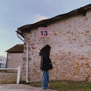
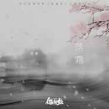
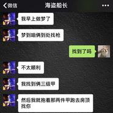
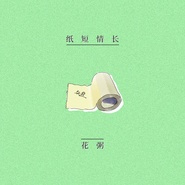
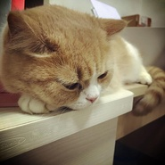
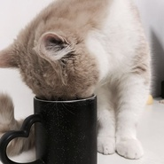

花粥
============================

|  |  |
| :--: | :-- |
| [ 花粥](https://i.xiami.com/huazhou) | **地区**: China 中国大陆 **风格**: 民谣 Folk, 独立民谣 Indie Folk **播放数**: 73138719 **粉丝数**: 144222 **评论数**: 2474  |

## 档案

花粥，新生代文艺女青年、民谣歌手。来自新疆，是毕业于长沙某高校的普通大学生，2012年独自异军突起的“清新”派。因词曲创作颇具特色，被一批小众音乐爱好者所称赞。略重口又朗朗上口的歌词，清新的嗓音及曲子，再配上慵懒、不羁、无病呻吟似的演唱，“重口味小清新”花粥一夜成名。代表作有《北方爷们》《老中医》《耳朵》等等。 
一千个人心中一千个哈姆雷特，有人觉得她恶俗，但这恰恰也是她受到一些文艺音乐爱好者们极力追捧的因素之一。 
在同学们着迷流行音乐，花枝招展的勾搭小伙子时，花粥已经抱着一把杂牌吉他创造了中国民谣歌手的诸多新纪录。 
你无法找到任何一个词汇来形容还处于青春期生长发育阶段的Flower·稀饭姑娘。她不羁，但不放荡；屌丝，却不庸俗；来得直接，却不失细节。 
小档案： 
别名：花粥 
姓名：达达 
国籍：中国 
来自：中国 新疆 乌鲁木齐 
现居：湖南 长沙 
生日：7-21 
星座：巨蟹座 
唱片公司：Depict flower Indie 画朵独立 
风格：民谣 / 独立 / 小清新 
代表作品： 
《老中医》、《屌丝之歌》（又名撸撸撸）、《流氓》（鬼才作词）、《我们总是在寻找》、《北方爷们》 
歌手简介： 
花粥，1993年7月21日出生在新疆乌鲁木齐，中国内地民谣女歌手、独立音乐人。 
2015年3月31日，发行个人首张专辑《乍见之欢》，并在合肥、南京等25个城市举办专辑首发巡回演出[2] ，凭借该专辑入围第五届阿比鹿音乐奖年度专辑、年度单曲及年度音乐人三项大奖；10月29日，发布青春爱情电影《既然青春留不住》主题曲《还好有你》的个人演唱版MV 。 
从艺历程：2012年8月3日—9月2日，与音乐人宋冬野一起，在北京、天津等13个城市举办宋冬野&花粥夏季巡演；9月25日，参加由太合麦田主办的“音跃独立日之新鲜唱作人巡礼”系列演唱会第二场的演出，演唱代表作《老中医》；12月12日，在北京举办新歌首唱会。 
2013年1月24日，凭借《屌丝之歌》获得阿比鹿音乐奖年度音乐人、年度新人及年度单曲三项大奖；11月29日，与张艺德一起举办德粥party全国巡演上海站专场，这轮巡演共经历36座城市。 
2014年10月28日，在西安举办“突发惊喜”专场演出；11月1日，在上海举办花粥696LIVE专场演出；11月30日，参加「青年态度」—广州大学生音乐节演出。 
2015年3月31日，发行个人首张专辑《乍见之欢》；4月10日—5月10日，在合肥、南京等25个城市举办专辑首发巡回演出；9月27日，在郑州参加迷途音乐节演出；10月29日，发布青春爱情电影《既然青春留不住》主题曲《还好有你》的个人演唱版MV；12月6日，在深圳参加理想音乐节的演出；12月28日，凭借专辑《乍见之欢》入围第五届阿比鹿音乐奖年度专辑、年度单曲及年度音乐人三项大奖；12月底，参加深圳欢乐谷跨年欢乐季演出。 
2016年7月16日-17日，参加银川乐堡绿放音乐节演出；8月20日，参加北京山谷民谣音乐节演出；9月15日，参加郑州火柴音乐节演出；9月25日，参加烟台山海音乐节演出；这一年与和驳倒乐队完成了“不信你去打听打听”全国公路巡演。 
2017年1月7日-8日，在天津上演两场“德粥party”。 
荣誉记录：音乐类 
▪ 2015-12-28 第五届 阿比鹿音乐奖 年度专辑 《乍见之欢》 （提名） 
▪ 2015-12-28 第五届 阿比鹿音乐奖 年度单曲 《二十岁的某一天》 （提名） 
▪ 2015-12-28 第五届 阿比鹿音乐奖 年度音乐人 花粥 （提名） 
▪ 2015-02-02 第四届 阿比鹿音乐奖 年度音乐人 花粥 （提名） 
▪ 2015-02-02 第四届 阿比鹿音乐奖 年度单曲 《小相思》 （提名） 
▪ 2013-12-19 第三届 阿比鹿音乐奖 年度单曲 《只不过是》 （提名） 
▪ 2013-01-24 第二届 阿比鹿音乐奖 年度音乐人 花粥 （获奖） 
▪ 2013-01-24 第二届 阿比鹿音乐奖 年度新人 花粥 （获奖） 
▪ 2013-01-24 第二届 阿比鹿音乐奖 年度单曲 《屌丝之歌》 （获奖）

## 专辑

| 名称 | 语种 | 唱片公司 | 发行时间 | 专辑类别 | 专辑风格 |
| :--: | :-- | :-- | :-- | :-- | :-- |
| [ 广陵赋](./albums/5021665332.md) | 国语 | 博生兄弟 | 2020年10月15日 | EP, 单曲 | 民谣 Folk, 中国风 China-Wave |
| [ 神的口袋](./albums/5020683691.md) | 国语 | 独立发行 | 2020年05月19日 | 录音室专辑 | 流行 Pop |
| [ 动物园](./albums/2105240174.md) | 国语 | S.A.G. Records | 2019年05月06日 | EP, 单曲 |  |
| [ 出山](./albums/2104786779.md) | 国语 |  | 2019年04月18日 | 录音室专辑 | 流行 Pop, 网络流行 Cyber Hit, 国语流行 Mandarin Pop |
| [ 一碗](./albums/2104799517.md) | 国语 | 独立发行 | 2019年04月14日 | 录音室专辑 | 流行 Pop |
| [ 落霜](./albums/2104765173.md) | 国语 | 乐享天承 | 2019年04月12日 | EP, 单曲 | 国语流行 Mandarin Pop |
| [ 农夫渔夫 (小猛&花粥北京Live2018版)](./albums/2104638382.md) | 国语 | 博生兄弟 | 2019年03月01日 | 现场专辑 | 民谣 Folk |
| [ 活该](./albums/2104068615.md) | 国语 | 太声文化 | 2018年10月06日 | EP, 单曲 | 流行说唱 Pop Rap |
| [ 粥请客（王胜男）](./albums/2104603501.md) | 国语 | 独立发行 | 2018年09月28日 | EP, 单曲 |  |
| [ 2018（三）](./albums/2103774969.md) | 国语 | 独立发行 | 2018年06月28日 | EP, 单曲 | 独立民谣 Indie Folk |
| [ 粥请客（二）](./albums/2103774965.md) | 国语 | 独立发行 | 2018年06月19日 | EP, 单曲 | 独立民谣 Indie Folk |
| [ 粥请客（一）](./albums/2103774950.md) | 国语 | 独立发行 | 2018年06月06日 | EP, 单曲 | 独立民谣 Indie Folk |
| [ 纸短情长](./albums/2103774942.md) | 国语 | 独立发行 | 2018年05月10日 | EP, 单曲 | 民谣 Folk |
| [ 2018（二）](./albums/2103774935.md) | 国语 | 独立发行 | 2018年04月27日 | EP, 单曲 | 独立民谣 Indie Folk |
| [ 2018](./albums/2103599067.md) | 国语 | 独立发行 | 2018年03月10日 | EP, 单曲 | 独立民谣 Indie Folk |
| [ 2017(番外二)](./albums/2102945992.md) | 国语 | 独立发行 | 2017年11月11日 | EP, 单曲 | 当代民谣 Contemporary Folk, 独立民谣 Indie Folk |
| [ 2017(番外)](./albums/2102945990.md) | 国语 | 独立发行 | 2017年10月26日 | EP, 单曲 | 独立民谣 Indie Folk |
| [ 2017(四)](./albums/2102879837.md) | 国语 | 独立发行 | 2017年10月24日 | EP, 单曲 | 独立民谣 Indie Folk |
| [ 2017（三）](./albums/2102697071.md) | 国语 | 独立发行 | 2017年02月17日 | EP, 单曲 | 独立民谣 Indie Folk |
| [ 2017（二）](./albums/2102697069.md) | 国语 | 独立发行 | 2017年01月16日 | EP, 单曲 | 独立民谣 Indie Folk |
| [ 2017（一）](./albums/2102697067.md) | 国语 | 独立发行 | 2017年01月01日 | EP, 单曲 | 独立民谣 Indie Folk |
| [ 粥打野](./albums/2102697065.md) | 国语 | 独立发行 | 2016年07月07日 | EP, 单曲 | 独立民谣 Indie Folk |
| [ 多冷的皮革厂](./albums/2102697064.md) | 国语 | 独立发行 | 2016年05月21日 | EP, 单曲 | 独立民谣 Indie Folk |
| [ 亚洲第一女子天团](./albums/2102697061.md) | 国语 | 独立发行 | 2015年12月12日 | EP, 单曲 | 独立民谣 Indie Folk |
| [ 老中医](./albums/430886700.md) | 国语 | 大福唱片 | 2015年05月06日 | EP, 单曲 | 独立民谣 Indie Folk |
| [ 乍见之欢](./albums/127772410.md) | 国语 | 大福唱片 | 2015年03月31日 | 录音室专辑 | 独立民谣 Indie Folk, 华语唱作人 Chinese Singer-Songwriter |
| [ 只不过是](./albums/1127334356.md) | 国语 | 闪闪空间 | 2015年03月26日 | EP, 单曲 | 独立民谣 Indie Folk |
| [ 给他一瓶可乐](./albums/562402.md) | 国语 | 画朵独立 | 2012年12月06日 | 精选集 | 城市民谣 Urban Folk |
| [ 老中医](./albums/519594.md) | 国语 | 麻油叶民间组织 | 2012年05月05日 | 录音室专辑 | 独立民谣 Indie Folk, 华语唱作人 Chinese Singer-Songwriter |

## 评论

|  |  |  |
| :-- | :-- | :-- |
|  [虾米用户](https://emumo.xiami.com/u/446082583)  2020-11-21 20:39 赞(2) 踩(0) | 
我抄我抄我狠狠地抄。
 |
|  [虾米用户](https://emumo.xiami.com/u/10238117) 时光不染 回忆不淡 2020-09-12 02:50 赞(0) 踩(0) | 
热评第一条把我逗乐了... 有句俗语说的挺实在，种瓜得瓜 种豆得豆 一切祸福 自作自受。
 |
|  [虾米用户](https://emumo.xiami.com/u/433579588) 我欲乘风归去，又恐琼楼玉... 2020-09-07 20:03 赞(0) 踩(0) | 
我希望你不要赶走我，万一他以后遇到别的女生了，就会很麻烦
 |
|  [虾米用户](https://emumo.xiami.com/u/433579588) 我欲乘风归去，又恐琼楼玉... 2020-09-07 20:02 赞(0) 踩(0) | 
你的歌真好听，我给你男朋友发去了一些我的个人经验，你们看看吧，我就做一个普普通通的平凡人就好了
 |
|  [虾米用户](https://emumo.xiami.com/u/407100120)  2020-07-21 12:16 赞(0) 踩(0) | 
非常喜欢花粥，祝生辰快乐！
 |
|  [虾米用户](https://emumo.xiami.com/u/340246863)  2020-07-21 12:02 赞(0) 踩(0) | 
牛逼
 |
|  [虾米用户](https://emumo.xiami.com/u/320736478)  2020-07-21 11:22 赞(0) 踩(0) | 
生日快乐                                      
 |
|  [虾米用户](https://emumo.xiami.com/u/407076225)  2020-07-21 10:34 赞(0) 踩(0) | 
生日快乐
 |
|  [虾米用户](https://emumo.xiami.com/u/49244744)  2020-07-21 10:33 赞(0) 踩(0) | 
祝生快   
 |
|  [虾米用户](https://emumo.xiami.com/u/426272961) (:3_\)_ 2020-07-21 10:11 赞(0) 踩(0) | 
松饼做个4块
 |
|  [虾米用户](https://emumo.xiami.com/u/406265560) 奇奇怪怪 画渣一个  2020-07-16 11:23 赞(1) 踩(0) | 
抄袭是不对的  但是你们在这里骂人更不对啊
 |
|  [虾米用户](https://emumo.xiami.com/u/411702155)  2020-06-14 03:24 赞(2) 踩(0) | 
老作曲人了。
 |
|  [虾米用户](https://emumo.xiami.com/u/433579588) 我欲乘风归去，又恐琼楼玉... 2020-06-11 20:52 赞(0) 踩(0) | 
我觉得我和你不一样，我会很在乎外界的看法，我是不会为了一个不喜欢的人而去维护一栋楼的人，当时我进入她的直播间，只是觉得没事打发时间而已，觉得谈不上喜欢
 |
|  [虾米用户](https://emumo.xiami.com/u/433579588) 我欲乘风归去，又恐琼楼玉... 2020-06-11 20:47 赞(0) 踩(0) | 
记得把那个摆摊的阿姨，让他回去吧
 |
|  [虾米用户](https://emumo.xiami.com/u/433579588) 我欲乘风归去，又恐琼楼玉... 2020-06-11 20:47 赞(0) 踩(0) | 
我只是觉得你要烧死这一楼400多的人才反击你的，并不是因为我喜欢他，还有我觉得你的歌有一点问题，歌词有的时候你是不是应该多考虑一下我们农民的感受？不一定要或者说非要为了钱才选择，一定要离开某个地方
 |
|  [虾米用户](https://emumo.xiami.com/u/433579588) 我欲乘风归去，又恐琼楼玉... 2020-06-11 20:45 赞(0) 踩(0) | 
你把那个摆摊的阿姨给叫回去吧！
 |
|  [虾米用户](https://emumo.xiami.com/u/433579588) 我欲乘风归去，又恐琼楼玉... 2020-06-11 20:44 赞(0) 踩(0) | 
我要是真的很喜欢一个明星类的男生的话，就不会在以前他的评论里说鹿晗是娘炮，蔡徐升势粉黛了
 |
|  [虾米用户](https://emumo.xiami.com/u/433579588) 我欲乘风归去，又恐琼楼玉... 2020-06-11 20:43 赞(0) 踩(0) | 
你放心，我不会和你一样，我会在乎自己的名声，更何况我根本就不喜欢他
 |
|  [虾米用户](https://emumo.xiami.com/u/330625993) “我想 只是想 奔向自己... 2020-05-01 16:18 赞(1) 踩(0) | 
花粥抄袭固然不对，可以为受害者们发声，但是，你们在一个网络上骂她sb说她和她粉丝必死的人你们真以为你们就是正义的使者吗？给爷整笑了
 |
| ⇒ |  [虾米用户](https://emumo.xiami.com/u/330625993) “我想 只是想 奔向自己... 2020-05-01 16:20 赞(0) 踩(0) | 
或许有人只是披着正义的外壳在刷存在感罢了
 |
| ⇒ |  [虾米用户](https://emumo.xiami.com/u/168418482)  2020-12-09 21:13 赞(0) 踩(0) | 
现在只是喜欢那个调都被喷，不理解那些事，只要是你听，就是low就是缺德 键盘侠搞得自己挺有正义感
 |
|  [虾米用户](https://emumo.xiami.com/u/354685768)  2020-04-10 20:15 赞(2) 踩(0) | 
就这还民谣女歌手，她来自平民窟，思想上的
 |
|  [虾米用户](https://emumo.xiami.com/u/411547801) 我还没想好要写什么... 2020-04-03 11:53 赞(1) 踩(0) | 
你的简介都是屁话，不知道谁写的。
 |
|  [虾米用户](https://emumo.xiami.com/u/127178534) 남친: 이가기♡ 2020-03-22 07:48 赞(3) 踩(0) | 
粥啊～还是以前好吧～ 任何人事物从小众走向大众，都要牺牲很多代价
 |
|  [虾米用户](https://emumo.xiami.com/u/193472425)  2020-02-14 11:19 赞(2) 踩(0) | 
走自己的路，让别人去说，谁人背后无人说谁人背后不谁人
 |
|  [虾米用户](https://emumo.xiami.com/u/25402994)   2020-01-31 15:22 赞(2) 踩(0) | 
想听悄悄的他，这里却没有 
 |
|  [虾米用户](https://emumo.xiami.com/u/429392632)  2020-01-19 16:36 赞(6) 踩(0) | 
抄袭的人还那么多粉，真牛，我就过来看看有几个粉，太牛了，太牛了，
 |
| ⇒ |  [虾米用户](https://emumo.xiami.com/u/301787232)  2020-04-13 08:33 赞(0) 踩(0) | 
加一
 |
|  [虾米用户](https://emumo.xiami.com/u/431110388)  2020-01-06 00:19 赞(4) 踩(0) | 
看大家都在diss我就放心了、资本真的为了钱什么都“音乐人”都往app里面搬 
 |
| ⇒ |  [虾米用户](https://emumo.xiami.com/u/330625993) “我想 只是想 奔向自己... 2020-05-01 16:11 赞(0) 踩(0) | 
五年前入驻的啊&amp;hellip;&amp;hellip;谁知道她会抄袭？
 |
|  [虾米用户](https://emumo.xiami.com/u/427270890) 愿你出走半生，归来仍是少... 2020-01-03 02:17 赞(0) 踩(0) | 
怎么好多都没有版权了哦！ 
 |
|  [虾米用户](https://emumo.xiami.com/u/318104586)  再见再见了再见 2019-12-31 15:01 赞(4) 踩(0) | 
头次见这么丑的小清新
 |
|  [虾米用户](https://emumo.xiami.com/u/429958039) ☔ 2019-11-02 15:43 赞(6) 踩(0) | 
屡次抄袭的她成为了万民声讨的对象，在她的歌曲评论中全是满满的负能量，不买版权，用别人的曲子写自己的名字，她可是把抄袭做的淋漓尽致，但是即便是这样她依然不被惩罚，如今她又复出发新曲了，用她的话来说就是“音乐人之间的事怎么能说是偷呢？”，大家听听这是人话吗？
 |
|  [虾米用户](https://emumo.xiami.com/u/371803691)  2019-10-21 19:55 赞(0) 踩(0) | 
花粥滚出音乐圈!一条两分钱，记得删括号
 |
|  [虾米用户](https://emumo.xiami.com/u/371803691)  2019-10-21 19:54 赞(0) 踩(0) | 
还是郭德纲说的对，。。。。。。。归根结底就是逞能
 |
|  [虾米用户](https://emumo.xiami.com/u/371803691)  2019-10-21 19:50 赞(1) 踩(0) | 
是不是抄的无所谓，有没有营养也无所谓，好听就行。
 |
| ⇒ |  [虾米用户](https://emumo.xiami.com/u/301787232)  2020-04-13 08:32 赞(0) 踩(0) | 
是的，孩子只要乖就行，是不是自己的无所谓，好好养老王的孩子哈
 |
| ⇒ |  [虾米用户](https://emumo.xiami.com/u/332213541) 借鉴昨天，活在今天，憧憬... 2020-05-03 21:48 赞(0) 踩(0) | 
<q><b>二手吉他说：</b></q>
 |
|  [虾米用户](https://emumo.xiami.com/u/429754308)  2019-09-20 19:02 赞(1) 踩(0) | 
听说花洲在演唱会上跑音了。
 |
| ⇒ |  [虾米用户](https://emumo.xiami.com/u/429754308)  2019-09-20 19:02 赞(0) 踩(0) | 
花粥。
 |
|  [虾米用户](https://emumo.xiami.com/u/325205625)  2019-09-15 08:56 赞(0) 踩(0) | 
好
 |
|  [虾米用户](https://emumo.xiami.com/u/21748173)  2019-09-14 18:39 赞(1) 踩(0) | 
支持。好听就行！虾米音乐人更新歌呀！
 |
| ⇒ |  [虾米用户](https://emumo.xiami.com/u/301787232)  2020-04-13 08:34 赞(0) 踩(0) | 
你知道她抄袭吗？
 |
|  [虾米用户](https://emumo.xiami.com/u/290361883) 静静地听歌，低调地装逼！ 2019-09-08 20:29 赞(2) 踩(0) | 
没有真材实学就不要丢人现眼！
 |
|  [虾米用户](https://emumo.xiami.com/u/6824227)  2019-09-07 19:50 赞(1) 踩(0) | 
没有盗将行，哪里来的花粥？
 |
|  [虾米用户](https://emumo.xiami.com/u/337378856) 静坐常思己过，闲谈莫论人... 2019-08-31 11:25 赞(3) 踩(0) | 
还是虾米评论正常
 |
|  [虾米用户](https://emumo.xiami.com/u/429075995) 我还没想好要写什么... 2019-08-26 15:14 赞(4) 踩(0) | 
加油花粥！支持你【一条1.5元，记得删括号
 |
|  [虾米用户](https://emumo.xiami.com/u/245280261) 要能做到:不以物喜不以己... 2019-08-24 13:08 赞(6) 踩(0) | 
下面我来总结一下抄袭粥的几宗罪。 1:利用粉丝多在微博辱骂大学语文老师， 2:出山⛰️抄袭， 3:妈妈要我出嫁抄袭事件 4:盗将行:歌词低俗，恶心 5:～～～
 |
|  [虾米用户](https://emumo.xiami.com/u/33397306) 好了，这就是签名 2019-08-23 17:22 赞(2) 踩(0) | 
几个月前才听说有这么一号人，因为抄袭，我去听了几首，大致了解她是怎么火的了。她的声线很好，是一部分，另外一部分是因为，很多歌都是为了迎合大众，肯定会有人喜欢，但也只是少部分人，而且我断定这些人没什么音乐素养，听花粥的歌觉得，哇塞！好特别呦！怎么有女生这么与众不同！一个抄袭者是不能算是音乐人的，所有人都去抄袭，那还要原唱歌手干嘛？
 |
| ⇒ |  [虾米用户](https://emumo.xiami.com/u/14476587) 白酒清茶、等风等你 2019-08-24 10:26 赞(0) 踩(0) | 
水军好多啊！你也是个托儿吧？
 |
| ⇒ |  [虾米用户](https://emumo.xiami.com/u/245280261) 要能做到:不以物喜不以己... 2019-08-24 13:10 赞(0) 踩(0) | 
<q><b>相忘ls说：</b></q>
 |
|  [虾米用户](https://emumo.xiami.com/u/262662612)  2019-08-23 14:54 赞(0) 踩(0) | 
。J来不及哦仍然
 |
|  [虾米用户](https://emumo.xiami.com/u/79801082)  2019-08-20 18:10 赞(1) 踩(0) | 
多放点版权到虾米啊
 |
|  [虾米用户](https://emumo.xiami.com/u/330152497) 恰到好处的阳光洒满了乐曲... 2019-08-19 23:29 赞(2) 踩(0) | 
都安静点吧，
 |
|  [虾米用户](https://emumo.xiami.com/u/352630131) 我还没想好要写什么... 2019-08-10 00:17 赞(1) 踩(0) | 
有毒嗷88VIP赠的虾米会员这个不能听辣个没版权，枯辽
 |
|  [虾米用户](https://emumo.xiami.com/u/252330194)  2019-08-09 21:30 赞(0) 踩(0) | 
唉，，现在体验极差
 |
|  [虾米用户](https://emumo.xiami.com/u/39256343) 网易云账号：ViaMis... 2019-08-07 13:46 赞(2) 踩(0) | 
来看看前苏联独立音乐人）
 |
|  [虾米用户](https://emumo.xiami.com/u/262321413) 我是來自hk的小E.L.... 2019-08-05 00:07 赞(1) 踩(0) | 
这人现场无修改版本，我跪了。。。调音师厉害
 |
|  [虾米用户](https://emumo.xiami.com/u/72198446) NEVEr be 2019-08-03 22:20 赞(3) 踩(0) | 
就没有我花粥汉化不来的歌
 |
|  [虾米用户](https://emumo.xiami.com/u/44705070) 大腿间的山泉水 2019-07-21 18:08 赞(0) 踩(0) | 
花粥我爱你...
 |
|  [虾米用户](https://emumo.xiami.com/u/425688640)  2019-07-21 15:00 赞(2) 踩(0) | 
还好意思混啊？抄袭的心机女！没有才华混什么华语乐坛！滚吧！
 |
|  [虾米用户](https://emumo.xiami.com/u/206755669) 希望我能遇到血统最纯正的... 2019-07-21 11:04 赞(4) 踩(0) | 
不好意思，关注了你，已取关
 |
| ⇒ |  [虾米用户](https://emumo.xiami.com/u/14476587) 白酒清茶、等风等你 2019-08-24 10:28 赞(0) 踩(0) | 
白痴，人云亦云，有点主见好吗？你胸围肯定不小，因为脑子没多少！
 |
| ⇒ |  [虾米用户](https://emumo.xiami.com/u/206755669) 希望我能遇到血统最纯正的... 2019-08-24 18:06 赞(0) 踩(0) | 
<q><b>相忘ls说：</b></q>
 |
|  [虾米用户](https://emumo.xiami.com/u/426670677)  2019-07-21 10:48 赞(2) 踩(0) | 
别人的努力，你们不该这么说 每个人都会犯错 请你们别这么说 给互相一个好心情    祝你生日快乐！ 花粥
 |
| ⇒ |  [虾米用户](https://emumo.xiami.com/u/322627443) Darkness wil... 2019-11-09 01:52 赞(0) 踩(0) | 
努力汉化！奥利给！前苏联原创作曲人花粥，为你们奉献一场穿越时空的甜蜜演唱！
 |
|  [虾米用户](https://emumo.xiami.com/u/241889880)  2019-07-21 10:35 赞(3) 踩(0) | 
花粥加油 一直关注你 生日快乐 
 |
|  [虾米用户](https://emumo.xiami.com/u/255610890)  2019-07-21 10:05 赞(0) 踩(0) | 

 |
|  [虾米用户](https://emumo.xiami.com/u/52567830) 我还没想好要写什么... 2019-07-21 10:02 赞(0) 踩(0) | 
喜欢
 |
|  [虾米用户](https://emumo.xiami.com/u/14841034)  2019-07-21 10:02 赞(0) 踩(0) | 
喜欢不解释
 |
|  [虾米用户](https://emumo.xiami.com/u/410308230)  2019-07-20 23:46 赞(0) 踩(0) | 
去諾曼底
 |
|  [虾米用户](https://emumo.xiami.com/u/37910331) 小时候处处都充满惊喜，现... 2019-07-17 23:06 赞(2) 踩(0) | 
怎么屏蔽她？
 |
|  [虾米用户](https://emumo.xiami.com/u/70670370) 积极一点( ͡° ͜ʖ ... 2019-07-17 18:08 赞(2) 踩(0) | 
尽管她的填词和汉化真的不错，但这种抄袭了还屡不悔改的歌手真的难以让人喜欢
 |
|  [虾米用户](https://emumo.xiami.com/u/318104586)  再见再见了再见 2019-07-15 19:04 赞(2) 踩(0) | 
真的，好听吗 
 |
|  [虾米用户](https://emumo.xiami.com/u/284817050)   2019-07-14 02:18 赞(4) 踩(0) | 
想起那个因付不起高额的国际诉讼费而放弃维权的歌手，再看她口口声声原创都快吐了，真是死不知悔改
 |
|  [虾米用户](https://emumo.xiami.com/u/284817050)   2019-07-14 02:11 赞(6) 踩(0) | 
你知道当初中国也是原创游戏产业大国嘛？ 你知道为什么后来中国游戏开始变得萎靡不振的嘛？ 你知道为什么很多游戏制作人抱着理想结果让作品胎死腹中嘛？ 你知道为什么现在中国游戏做不到日本，韩国，美国那些国家那么出色嘛？  你知道吗？你不知道，因为你只知道好听就行。
 |
|  [虾米用户](https://emumo.xiami.com/u/374791207) 喜欢撸铁，慢跑》》》自建... 2019-07-03 17:50 赞(0) 踩(0) | 
花粥和提马灯的老人，两只独秀，
 |
| ⇒ |  [虾米用户](https://emumo.xiami.com/u/322627443) Darkness wil... 2019-11-09 01:55 赞(0) 踩(0) | 
转 独立音乐人花大爷的汉化歌曲 小相思——I don't sleep well 杀死那朵花——La Disparition 去问猫耳朵——小小恋歌 活该——再也不会遇见第二个她 还好有你——You belong to me 南来北往——青い宝 出山——super love 何苦来哉——新宝岛 大家复制一下吧  不是因為負面新聞才不聽，是這首歌根本就是強盜行為，搞清楚狀況再來。:D
 |
|  [虾米用户](https://emumo.xiami.com/u/217884371) 吴世勋和金俊勉什么时候公... 2019-07-02 17:13 赞(0) 踩(0) | 
汉化大师本师？！
 |
|  [虾米用户](https://emumo.xiami.com/u/42963872) 我还没想好要写什么... 2019-07-02 07:31 赞(0) 踩(0) | 
D区
 |
|  [虾米用户](https://emumo.xiami.com/u/419486383) 三月风景，无君不晴。三千... 2019-06-30 12:03 赞(2) 踩(0) | 
在座各位搞清楚，她不叫抄袭歌曲，她那叫搬运歌曲，旋律都懒得改一下
 |
|  [虾米用户](https://emumo.xiami.com/u/44042071)  2019-06-29 23:11 赞(4) 踩(0) | 
跟之前李袁杰裁缝是差不多的情况。而且似乎都是野鸡大学出来的，连学校名字都不敢说的那种。看到国人逐渐觉醒的正义的版权意识还是很欣慰的，大多数人都有良知，不像那少数只觉得耳朵舒服就助纣为虐的畜生。生而为人，上有父母，可有的畜生就是不知廉耻，甚至给中国人丢脸丢到国外去了<a href="http://emumo.xiami.com/u/48415518" target="_blank" rel="nofollow" name_card="48415518">@花粥 </a>
 |
|  [虾米用户](https://emumo.xiami.com/u/426539857) 爱自由 2019-06-26 18:10 赞(2) 踩(0) | 
抄A神的歌我的脸呢
 |
|  [虾米用户](https://emumo.xiami.com/u/20320131) 永远热泪盈眶 2019-06-24 18:44 赞(4) 踩(0) | 
来观摩汉化大师~
 |
|  [虾米用户](https://emumo.xiami.com/u/264482697)  2019-06-23 13:28 赞(4) 踩(0) | 
汉化填词王
 |
|  [虾米用户](https://emumo.xiami.com/u/222519147) 我还没想好要写什么... 2019-06-20 09:17 赞(2) 踩(0) | 
无证据？？？B站上花粥抄袭曲和原曲对比视频不要太多呕
 |
|  [虾米用户](https://emumo.xiami.com/u/353767023)  2019-06-16 15:06 赞(0) 踩(0) | 
她说的事情了今天，了今天，了今天，了今天，了今天，了今天，了今天，了今天，11好的
 |
|  [虾米用户](https://emumo.xiami.com/u/326384075)  2019-06-15 01:51 赞(0) 踩(0) | 
我觉得听音乐要靠耳朵，难道说听说谁谁的负面新闻就不听她的歌了吗？你们不能否认她的声音，不要去以偏概全
 |
| ⇒ |  [虾米用户](https://emumo.xiami.com/u/1186337)  2019-07-09 14:35 赞(0) 踩(0) | 
转 独立音乐人花大爷的汉化歌曲 小相思——I don't sleep well 杀死那朵花——La Disparition 去问猫耳朵——小小恋歌 活该——再也不会遇见第二个她 还好有你——You belong to me 南来北往——青い宝 出山——super love 何苦来哉——新宝岛 大家复制一下吧  不是因為負面新聞才不聽，是這首歌根本就是強盜行為，搞清楚狀況再來。:D
 |
| ⇒ |  [虾米用户](https://emumo.xiami.com/u/1394088) 世间智障合集 2020-01-10 23:30 赞(0) 踩(0) | 
对，太对了，花粥的声音真的难听，唱歌还跑调，全靠调音师拯救，所以她不仅抄袭，而且还不会唱歌，甚至连吉他都弹不好，更别说填词垃圾，就这也敢叫音乐人，既侮辱音乐也侮辱人。 希望你们洗地粉不要因为自己喜欢就以偏概全
 |
|  [虾米用户](https://emumo.xiami.com/u/326384075)  2019-06-15 01:47 赞(0) 踩(0) | 
无事实的证据我们称之为诽谤
 |
| ⇒ |  [虾米用户](https://emumo.xiami.com/u/304640418)  2019-06-16 01:30 赞(0) 踩(0) | 
你就是花粥小号 
 |
|  [虾米用户](https://emumo.xiami.com/u/326384075)  2019-06-15 01:42 赞(1) 踩(0) | 
我是凭耳朵来判断是非，音乐软件开发是用来服务大众的，应该有自己的主见，耳听为虚，要用心去判断任何事物，
 |
|  [虾米用户](https://emumo.xiami.com/u/233400879) 我还没想好要写什么... 2019-06-14 01:26 赞(6) 踩(0) | 
独立音乐人花粥的歌曲与其他旋律相似的歌曲对比 出山——Anders Als Ihr 小相思——I don't sleep well 杀死那朵花——La Disparition 去问猫耳朵——小小恋歌 活该——再也不会遇见第二个她 还好有你——You belong to me 花粥你有本事你接着删评论[大笑]  赶紧复制，之后一起发（来嘛 删嘛）
 |
|  [虾米用户](https://emumo.xiami.com/u/412092834) 人生若只如初见，何事秋风... 2019-06-09 08:37 赞(1) 踩(0) | 
各位都是秀儿
 |
|  [虾米用户](https://emumo.xiami.com/u/1394088) 世间智障合集 2019-06-08 00:34 赞(3) 踩(0) | 
删评还行，但是改不了你抄人作业的黑点，你考试可以抄，作业可以炒，但是作品抄了是损害他人的利益，这种损人利己的行为还有人给你洗地，我是服的，明明一样的东西也敢说没有一点相似。另外你自己用苏轼&amp;ldquo;八风不动&amp;rdquo;的典故骂自己的这种行为，请务必加大力度。
 |
|  [虾米用户](https://emumo.xiami.com/u/329301255) 是否半夜里心痒痒的直蹭炕... 2019-06-07 18:41 赞(3) 踩(0) | 
花粥贼溜，我的热评被删了┏┓
 |
| ⇒ |  [虾米用户](https://emumo.xiami.com/u/1394088) 世间智障合集 2019-06-08 00:34 赞(0) 踩(0) | 
这么巧？我也是
 |
| ⇒ |  [虾米用户](https://emumo.xiami.com/u/329301255) 是否半夜里心痒痒的直蹭炕... 2019-06-08 00:43 赞(0) 踩(0) | 
<q><b>语麟霖说：</b></q>
 |
| ⇒ |  [虾米用户](https://emumo.xiami.com/u/1394088) 世间智障合集 2019-06-08 01:01 赞(0) 踩(0) | 
<q><b>刘多欲说：</b></q>
 |
|  [虾米用户](https://emumo.xiami.com/u/264533947)  2019-06-07 16:19 赞(1) 踩(0) | 
辣鸡抄袭...连我们结衣都敢抄袭？！
 |
|  [虾米用户](https://emumo.xiami.com/u/313566285)  2019-06-04 22:19 赞(0) 踩(0) | 
归去来兮，花自顾自逍遥
 |
|  [虾米用户](https://emumo.xiami.com/u/6336499) 溺音致深不可自拔，杂听患... 2019-06-03 13:04 赞(4) 踩(0) | 
音乐都下架了，把她信息也删了吧，碍眼
 |
|  [虾米用户](https://emumo.xiami.com/u/374201484)  2019-06-01 22:01 赞(3) 踩(0) | 
抄袭不抄袭对我来说都一样，我只是个听者，只要好听就行了，最起码我是听了她唱的认识的她。
 |
| ⇒ |  [虾米用户](https://emumo.xiami.com/u/340212496)  2019-06-12 10:42 赞(0) 踩(0) | 
这样好吗？ 就像别人给垃圾食品你吃 你说好吃就行 管他什么原料
 |
| ⇒ |  [虾米用户](https://emumo.xiami.com/u/301787232)  2020-04-13 08:43 赞(0) 踩(0) | 
是的呢，如果将来结婚了，生的孩子只要乖就行，是不是自己的无所谓，好好养着老王的孩子哈
 |
| ⇒ |  [虾米用户](https://emumo.xiami.com/u/256710312) 览洲 2020-04-13 17:21 赞(0) 踩(0) | 
<q><b>二手吉他说：</b></q>
 |
|  [虾米用户](https://emumo.xiami.com/u/214273030)  2019-05-30 20:12 赞(0) 踩(0) | 
好听
 |
|  [虾米用户](https://emumo.xiami.com/u/7461992) 我还没想好要写什么... 2019-05-30 04:52 赞(0) 踩(0) | 
挺好听的，那首出山歌词很有意思也很有意境，既调皮又认真，一本正经的无厘头，既很荒唐有又很唯美，既很世故又很纯情...点赞。
 |
| ⇒ |  [虾米用户](https://emumo.xiami.com/u/6693698)  2019-07-06 10:47 赞(0) 踩(0) | 
安个头像再来洗
 |
| ⇒ |  [虾米用户](https://emumo.xiami.com/u/301787232)  2020-04-13 08:38 赞(0) 踩(0) | 
在？群号发我呗？有烂钱一起恰
 |
|  [虾米用户](https://emumo.xiami.com/u/291060103) 山山而川。 2019-05-29 21:54 赞(3) 踩(0) | 
本来挺喜欢的，但是看到抄袭真的觉得挺恶心的，调子复制粘贴，歌词改一下就是自己的了？真给自己脸了，独立音乐人？？？粥快糊了。 
 |
|  [虾米用户](https://emumo.xiami.com/u/282631529)  2019-05-29 17:45 赞(3) 踩(0) | 
新宝岛也被你汉化了，太可怕了
 |
|  [虾米用户](https://emumo.xiami.com/u/278385867) 身坚志残 2019-05-29 12:51 赞(2) 踩(0) | 

 |
|  [虾米用户](https://emumo.xiami.com/u/259313043)  2019-05-29 07:24 赞(4) 踩(0) | 
说花粥抄袭的请闭嘴，我家花粥抄袭？呵呵，那明明是搬运和汉化（手动滑稽保命）
 |
| ⇒ |  [虾米用户](https://emumo.xiami.com/u/1394088) 世间智障合集 2019-05-29 23:24 赞(0) 踩(0) | 
瞎说，刻在DNA里的旋律怎么就是搬运和汉化了？（手动滑稽）
 |
|  [虾米用户](https://emumo.xiami.com/u/353557576)  2019-05-29 04:39 赞(0) 踩(0) | 
水军而已 花粥别往心里去
 |
| ⇒ |  [虾米用户](https://emumo.xiami.com/u/340212496)  2019-06-12 10:43 赞(0) 踩(0) | 
哥~
 |
| ⇒ |  [虾米用户](https://emumo.xiami.com/u/340212496)  2019-06-12 10:44 赞(0) 踩(0) | 
牛逼 牛逼
 |
|  [虾米用户](https://emumo.xiami.com/u/409017334)  2019-05-28 19:10 赞(0) 踩(0) | 
视觉钟*版权怎么不杠， 红毛某九##怎么不杠， 。。。 何况还买了版权道了歉， 何必揪着不放 键盘侠真是  是觉得自己很正义是吗？ 还不是觉得女生好欺负 出来刷存在感 
 |
|  [虾米用户](https://emumo.xiami.com/u/76605012)  2019-05-28 16:28 赞(5) 踩(0) | 
转 独立音乐人花大爷的汉化歌曲 小相思——I don't sleep well 杀死那朵花——La Disparition 去问猫耳朵——小小恋歌 活该——再也不会遇见第二个她 还好有你——You belong to me 南来北往——青い宝 出山——super love 何苦来哉——新宝岛 大家复制一下吧，肯定会被删
 |
| ⇒ |  [虾米用户](https://emumo.xiami.com/u/1394088) 世间智障合集 2019-06-11 22:49 赞(0) 踩(0) | 
加一个 多喝热水&amp;mdash;&amp;mdash;You Be Love A神的
 |
|  [虾米用户](https://emumo.xiami.com/u/421411560)  2019-05-27 18:56 赞(0) 踩(0) | 
没版权?这么难受的么
 |
|  [虾米用户](https://emumo.xiami.com/u/17157405) 当然我也没有签名 2019-05-27 16:20 赞(2) 踩(0) | 
独立音乐人？简介应该加一个音乐鬼裁！
 |
|  [虾米用户](https://emumo.xiami.com/u/20698719)  2019-05-27 13:44 赞(2) 踩(0) | 
直接把艺人举报了吧
 |
|  [虾米用户](https://emumo.xiami.com/u/47586473) 啊 2019-05-27 13:42 赞(1) 踩(0) | 
在？nmsl
 |
|  [虾米用户](https://emumo.xiami.com/u/329301255) 是否半夜里心痒痒的直蹭炕... 2019-05-25 13:03 赞(3) 踩(0) | 
原创歌手，汉化花粥；大言不惭，没点脸；民谣吉他，痛失亲
 |
|  [虾米用户](https://emumo.xiami.com/u/117364148) 我还没想好要写什么... 2019-05-21 13:02 赞(2) 踩(0) | 
版权意识薄弱啊
 |
| ⇒ |  [虾米用户](https://emumo.xiami.com/u/308684286)  2019-05-24 00:26 赞(0) 踩(0) | 
头像他妈的太魔性了哈哈哈哈哈哈哈哈哈哈哈哈哈哈哈
 |
|  [虾米用户](https://emumo.xiami.com/u/274277683) 爱音乐，爱小说，爱交友，... 2019-05-19 17:31 赞(0) 踩(0) | 
网上说，小花的出山是抄袭的
 |
|  [虾米用户](https://emumo.xiami.com/u/335431015)  2019-05-19 11:01 赞(0) 踩(0) | 
好听好听好听，周杰伦之后还没有人的歌打动过我，希望你加油。你唱出的中国风太美了
 |
|  [虾米用户](https://emumo.xiami.com/u/424504072)  2019-05-19 09:45 赞(1) 踩(0) | 
fu** you 你就是个犬
 |
|  [虾米用户](https://emumo.xiami.com/u/283063457)  2019-05-18 16:32 赞(0) 踩(0) | 
我在学唱出山   
 |
|  [虾米用户](https://emumo.xiami.com/u/283063457)  2019-05-18 16:31 赞(0) 踩(0) | 
我爱听!我是花粥的女矿粉                      
 |
|  [虾米用户](https://emumo.xiami.com/u/378467010) 老子想你了，你能回来吗，... 2019-05-16 13:10 赞(1) 踩(0) | 
现在我在学出山呐
 |
|  [虾米用户](https://emumo.xiami.com/u/378467010) 老子想你了，你能回来吗，... 2019-05-16 13:10 赞(1) 踩(0) | 
花粥的矿粉啊 
 |
|  [虾米用户](https://emumo.xiami.com/u/325374787)  2019-05-16 10:25 赞(1) 踩(0) | 
虾米来的点个赞！感谢你们！
 |
|  [虾米用户](https://emumo.xiami.com/u/325374787)  2019-05-16 10:24 赞(0) 踩(0) | 
。6666666666666666666
 |
|  [虾米用户](https://emumo.xiami.com/u/424631062) 是所有心绪腹死胎中 2019-05-16 01:25 赞(1) 踩(0) | 
从网易云转来的 网易吃相太难看了
 |
|  [虾米用户](https://emumo.xiami.com/u/318377500)   2019-05-15 18:44 赞(1) 踩(0) | 
      
 |
|  [虾米用户](https://emumo.xiami.com/u/424214455) 一个和平主义者呀 2019-05-14 21:03 赞(3) 踩(0) | 
虾米你很棒，真的，一个版权没有        
 |
|  [虾米用户](https://emumo.xiami.com/u/205671530) 世界和平 2019-05-14 18:26 赞(1) 踩(0) | 
收费啊还？
 |
|  [虾米用户](https://emumo.xiami.com/u/424102945)  2019-05-14 08:27 赞(1) 踩(0) | 
个人感觉不管抄袭不抄袭，主要谁唱的好听就可以了，何必这样骂人
 |
| ⇒ |  [虾米用户](https://emumo.xiami.com/u/226779245)  2019-05-18 12:08 赞(0) 踩(0) | 
。。。。。。就是有你这种人，中国的版权意识才直原步不动。
 |
| ⇒ |  [虾米用户](https://emumo.xiami.com/u/36690297) 暂无签名~ 2019-05-28 13:19 赞(0) 踩(0) | 
你好恶心
 |
| ⇒ |  [虾米用户](https://emumo.xiami.com/u/1394088) 世间智障合集 2019-06-11 22:53 赞(0) 踩(0) | 
抄袭别人是将别人的成果占为己有，一句唱的好听就能抵消了？这是盗窃好伐？而且她抄的还不是一些无名音乐人，被抄袭的都是业界有头有脸的人嗷，如果这都不惩治给人怎么交代？抄袭是OK的是好文明？求求你们有点是非观念好伐，你觉得好听可以啊，低调点自己去听，别 给 她 洗 地 啊。
 |
| ⇒ |  [虾米用户](https://emumo.xiami.com/u/340212496)  2019-06-12 10:46 赞(0) 踩(0) | 
<q><b>大石碎胸口说：</b></q>
 |
| ⇒ |  [虾米用户](https://emumo.xiami.com/u/28126268) 我还没想好要写什么... 2019-06-12 23:34 赞(0) 踩(0) | 
这是侵权，剽窃别人的心血说是自己的东西，不是说他唱的好不好听，再怎么好听，那也是别人的心血
 |
| ⇒ |  [虾米用户](https://emumo.xiami.com/u/322627443) Darkness wil... 2019-11-09 01:58 赞(0) 踩(0) | 
<q><b>语麟霖说：</b></q>
 |
| ⇒ |  [虾米用户](https://emumo.xiami.com/u/1394088) 世间智障合集 2019-11-12 10:01 赞(0) 踩(0) | 
关键是他不但抄袭，填词糟，而且唱的也烂，不是很懂觉得好听是什么审美。你非要说一样东西好，得让人数出来几样优点，如果没有优点全是缺点还非要说他好，我觉得这是一种迷惑行为
 |
| ⇒ |  [虾米用户](https://emumo.xiami.com/u/1394088) 世间智障合集 2019-11-12 10:01 赞(0) 踩(0) | 
<q><b>阿兹卡班头号通缉犯说：</b></q>
 |
| ⇒ |  [虾米用户](https://emumo.xiami.com/u/375311355) 猜猜头像是谁 2020-01-10 15:00 赞(0) 踩(0) | 
<q><b>语麟霖说：</b></q>
 |
| ⇒ |  [虾米用户](https://emumo.xiami.com/u/301787232)  2020-04-13 08:39 赞(0) 踩(0) | 
是呀，孩子只要乖就行，是不是自己的无所谓，好好养老王的孩子吧
 |
|  [虾米用户](https://emumo.xiami.com/u/424497309)  2019-05-13 22:52 赞(3) 踩(0) | 
看到你们这么多人骂她我就放心了，赞都赞不过来
 |
|  [虾米用户](https://emumo.xiami.com/u/300878931) 这是一个流行离开的世界，... 2019-05-13 11:10 赞(5) 踩(0) | 
买beat当主旋的事能叫抄袭么？花粥，永远不要理会谣言和中伤 
 |
|  [虾米用户](https://emumo.xiami.com/u/424077178)  2019-05-11 23:41 赞(3) 踩(0) | 
全部我都喜欢，归去来兮 我最喜欢的 
 |
|  [虾米用户](https://emumo.xiami.com/u/424403257)  2019-05-10 19:30 赞(1) 踩(0) | 
什么了
 |
|  [虾米用户](https://emumo.xiami.com/u/330916336)  2019-05-06 21:31 赞(3) 踩(0) | 
写曲人的事…能叫抄袭么？不喜欢你们可以滚啊，我先滚了
 |
|  [虾米用户](https://emumo.xiami.com/u/357179008) 华风夏韵，洛水天依。 2019-05-05 11:42 赞(4) 踩(0) | 
律师函还有五秒钟到达现场，请被告人出场！
 |
|  [虾米用户](https://emumo.xiami.com/u/342295844)  2019-05-05 09:40 赞(0) 踩(0) | 
onkn
 |
|  [虾米用户](https://emumo.xiami.com/u/422930499)  2019-05-04 12:51 赞(0) 踩(0) | 
好听
 |
|  [虾米用户](https://emumo.xiami.com/u/6112286)  2019-05-04 02:00 赞(0) 踩(0) | 
好一个小妮子，很正能量，却没办法推荐给我女儿，可惜啦。加油。
 |
|  [虾米用户](https://emumo.xiami.com/u/275417833)  2019-05-03 10:39 赞(1) 踩(0) | 
呕
 |
|  [虾米用户](https://emumo.xiami.com/u/403434409)  2019-05-02 13:30 赞(0) 踩(0) | 

 |
|  [虾米用户](https://emumo.xiami.com/u/329976430)  2019-05-02 10:16 赞(2) 踩(0) | 
好听！不管怎么样喜欢就好，继续加油↖(^ω^)↗
 |
|  [虾米用户](https://emumo.xiami.com/u/356912455) 初次见面，请多关照吖~ 2019-05-02 09:08 赞(4) 踩(0) | 
说说就好了，不要骂了不停，不管她有没有抄袭，但是歌是好听的。想必到这来的应该都是听歌的吧， 不是只顾来说风凉话的吧
 |
| ⇒ |  [虾米用户](https://emumo.xiami.com/u/408354453)  2019-05-03 11:30 赞(0) 踩(0) | 
可是，她抄袭了呀 
 |
| ⇒ |  [虾米用户](https://emumo.xiami.com/u/329301255) 是否半夜里心痒痒的直蹭炕... 2019-05-08 19:30 赞(0) 踩(0) | 
说说就好了，不要骂了不停，不管他有没有强尖，但是过程是挺爽的。想必到这来的应该都是看热闹的吧， 不是只顾来帮强尖犯辩解的吧
 |
| ⇒ |  [虾米用户](https://emumo.xiami.com/u/1394088) 世间智障合集 2019-05-29 23:39 赞(0) 踩(0) | 
1，她有抄袭。 2，歌也不怎么好听 3，我进来是看粉丝怎么洗地的 4，风凉话解释：打消别人积极性的嘲讽话。 以及不负责任的冷言冷语。 花粥抄袭是实锤，并没有积极性，网友指责她也不存在不负责任，况且花粥自己写词稀烂文字功底真的不好，这次还把自己骂了进去。何苦来哉不是有一句八风不动吗。你八风不动为什么别人说你抄袭你就发函？苏老先生流下了欣慰的泪水
 |
| ⇒ |  [虾米用户](https://emumo.xiami.com/u/28126268) 我还没想好要写什么... 2019-06-12 23:38 赞(0) 踩(0) | 
你这说的就有问题，我们说的是石锤她抄袭，而不是说她唱的好不好听，这是两码事
 |
| ⇒ |  [虾米用户](https://emumo.xiami.com/u/412051459)  2019-06-16 10:58 赞(0) 踩(0) | 
<q><b>语麟霖说：</b></q>
 |
| ⇒ |  [虾米用户](https://emumo.xiami.com/u/1394088) 世间智障合集 2019-06-16 11:59 赞(0) 踩(0) | 
<q><b>吴丽娅说：</b></q>
 |
| ⇒ |  [虾米用户](https://emumo.xiami.com/u/1394088) 世间智障合集 2019-06-29 10:55 赞(0) 踩(0) | 
<q><b>Di说：</b></q>
 |
|  [虾米用户](https://emumo.xiami.com/u/239803923) 多听听 多看看 我的最爱... 2019-05-02 01:46 赞(3) 踩(0) | 
真是讽刺啊。
 |
|  [虾米用户](https://emumo.xiami.com/u/1582817) 若收藏精选集已删除，请用... 2019-04-30 23:58 赞(5) 踩(0) | 
菈芨，想出位想疯了吧 你这是有多着急上位啊，才会拿老外歌曲占为己有啊 你还真以为网友都跟你似的不懂音乐了，能糊弄就糊弄 你真是个菈芨   一没才华 二没嗓音 三没样子   就是个唱着《老中医》纹一手皮皮虾的臭流氓的女汉子 这年头女的耍起氓流，可不比男的不优秀 《老中医》也让网友们成功的举报你的低俗后，下架了吧  女汉子真优秀，秀儿，继续 
 |
|  [虾米用户](https://emumo.xiami.com/u/3109632)  2019-04-29 22:33 赞(4) 踩(0) | 
这么直白的抄袭也不容易～～～～
 |
|  [虾米用户](https://emumo.xiami.com/u/353009497)  2019-04-29 01:23 赞(5) 踩(0) | 
听了会心动的歌。能听到寂寞里的不甘，散漫又透着矜持，就是有一个世界，在那里等着，也许就到了
 |
|  [虾米用户](https://emumo.xiami.com/u/333143988)  2019-04-28 23:21 赞(0) 踩(0) | 
么你还搬不动
 |
|  [虾米用户](https://emumo.xiami.com/u/258018280)  2019-04-26 15:49 赞(1) 踩(0) | 
不花就不成舟了
 |
|  [虾米用户](https://emumo.xiami.com/u/400328662)  2019-04-25 02:02 赞(2) 踩(0) | 
著名汉化
 |
|  [虾米用户](https://emumo.xiami.com/u/310633117)  2019-04-23 20:49 赞(1) 踩(0) | 
花粥，家里没网费了出来唱歌， 朴树，交不起房租了出来唱歌  
 |
|  [虾米用户](https://emumo.xiami.com/u/334573224)  2019-04-22 21:09 赞(2) 踩(0) | 
想要听归去来兮啊啊啊
 |
|  [虾米用户](https://emumo.xiami.com/u/85037684)  2019-04-21 20:06 赞(3) 踩(0) | 
好了好了，抄袭或者不抄袭，我喜欢这首歌。不管谁唱
 |
| ⇒ |  [虾米用户](https://emumo.xiami.com/u/301787232)  2020-04-13 08:41 赞(0) 踩(0) | 
你的意思是好听就行呗？是呀，孩子只要乖就行，是不是自己的无所谓，好好帮老王养孩子吧
 |
|  [虾米用户](https://emumo.xiami.com/u/264415962) 其实我是狮子座 2019-04-21 14:54 赞(3) 踩(0) | 
汉化大师
 |
| ⇒ |  [虾米用户](https://emumo.xiami.com/u/1582817) 若收藏精选集已删除，请用... 2019-05-01 00:03 赞(0) 踩(0) | 
哈哈哈 
 |
|  [虾米用户](https://emumo.xiami.com/u/423092936) .... 2019-04-20 16:51 赞(3) 踩(0) | 
你们跟网络暴力有什么关系？？
 |
|  [虾米用户](https://emumo.xiami.com/u/293692544) 你敢给我说话吗？我咬你 2019-04-20 05:29 赞(3) 踩(0) | 
好听
 |
|  [虾米用户](https://emumo.xiami.com/u/33793674)  2019-04-19 20:07 赞(2) 踩(0) | 
最经典  的  老中医  怎么没有
 |
|  [虾米用户](https://emumo.xiami.com/u/325374787)  2019-04-18 21:26 赞(3) 踩(0) | 
好
 |
| ⇒ |  [虾米用户](https://emumo.xiami.com/u/298509389) 我还没想好要写什么... 2019-04-22 20:34 赞(0) 踩(0) | 
刚刚在盗将行也看到了你
 |
| ⇒ |  [虾米用户](https://emumo.xiami.com/u/325374787)  2019-04-22 21:24 赞(0) 踩(0) | 
<q><b>风吹屁屁凉说：</b></q>
 |
| ⇒ |  [虾米用户](https://emumo.xiami.com/u/325374787)  2019-04-22 21:24 赞(0) 踩(0) | 
<q><b>风吹屁屁凉说：</b></q>
 |
| ⇒ |  [虾米用户](https://emumo.xiami.com/u/325374787)  2019-04-22 21:25 赞(0) 踩(0) | 
<q><b>风吹屁屁凉说：</b></q>
 |
| ⇒ |  [虾米用户](https://emumo.xiami.com/u/325374787)  2019-04-22 21:26 赞(0) 踩(0) | 
<q><b>风吹屁屁凉说：</b></q>
 |
|  [虾米用户](https://emumo.xiami.com/u/246632897) 没有什么可以永远，要做个... 2019-04-17 12:46 赞(8) 踩(0) | 
听听歌而已，喜欢就听，不喜欢可以听别的，请水军不要网络暴力。
 |
|  [虾米用户](https://emumo.xiami.com/u/346679334)  2019-04-14 23:04 赞(5) 踩(0) | 
苏联天裁作曲家
 |
|  [虾米用户](https://emumo.xiami.com/u/51610072) f@ck 5 cents... 2019-04-14 13:26 赞(5) 踩(0) | 
乍见之欢出来后就没再听花粥了，变得精致了反而不太习惯，还是喜欢以前作品的糙劲。但还是感谢花粥的歌声留住了一段大学记忆。做为歌手，有问题还是要及时反思改正啊！
 |
|  [虾米用户](https://emumo.xiami.com/u/168418482)  2019-04-12 19:13 赞(8) 踩(0) | 
内容已删除
 |
| ⇒ |  [虾米用户](https://emumo.xiami.com/u/284817050)   2019-07-14 02:27 赞(0) 踩(0) | 
德不配位 侵权抄袭 被黑实属正常哦 
 |
| ⇒ |  [虾米用户](https://emumo.xiami.com/u/373801293) 谁说我摩羯座？哪写了？ 2019-07-15 19:45 赞(0) 踩(0) | 
<q><b>说：</b></q>
 |
|  [虾米用户](https://emumo.xiami.com/u/38606890) O_o爱音乐的人不会老。 2019-04-12 01:17 赞(3) 踩(0) | 
你们抓着一个一年前的评论骂抄袭。。。那大兄弟躺枪了。
 |
|  [虾米用户](https://emumo.xiami.com/u/52324585)  2019-04-08 21:41 赞(5) 踩(0) | 
 ]中文化不错！各大汉化小组欢迎大师加入
 |
|  [虾米用户](https://emumo.xiami.com/u/405679600) 猪头肉音乐爱好者 一只摔... 2019-03-31 22:50 赞(3) 踩(0) | 
恶臭
 |
|  [虾米用户](https://emumo.xiami.com/u/50008695) 淋了那么多雨水，你的心里... 2019-03-31 03:31 赞(4) 踩(0) | 
律师函警告
 |
|  [虾米用户](https://emumo.xiami.com/u/197479687) 人在长大的同时，也有很多... 2019-03-30 23:15 赞(6) 踩(0) | 
说实话，抄袭就要承认。
 |
|  [虾米用户](https://emumo.xiami.com/u/348583910)  2019-03-30 21:47 赞(7) 踩(0) | 
我喜欢出山＝我喜欢抄袭＝等于我喜欢违法的东西
 |
|  [虾米用户](https://emumo.xiami.com/u/306065331) 幸福开始有人选 2019-03-30 15:39 赞(4) 踩(0) | 
期待4月30日现场版
 |
|  [虾米用户](https://emumo.xiami.com/u/344938919)  2019-03-29 23:22 赞(5) 踩(0) | 
汉化大师
 |
|  [虾米用户](https://emumo.xiami.com/u/357642945) 我还没想好要写什么... 2019-03-25 01:42 赞(5) 踩(0) | 
音乐裁缝加油
 |
|  [虾米用户](https://emumo.xiami.com/u/113870614) 我 2019-03-21 16:27 赞(2) 踩(0) | 
没版权，虾米 不行了啊
 |
| ⇒ |  [虾米用户](https://emumo.xiami.com/u/267617453)  2019-03-24 11:17 赞(0) 踩(0) | 
所有都被下架了。应该不止虾米。这歌曲抄袭了，被原唱知道了，原唱维权，比如说你要翻唱《出山》这首歌现在都必须去买原曲的版权，要不然可能就会违法
 |
| ⇒ |  [虾米用户](https://emumo.xiami.com/u/357990770)  2019-03-29 18:20 赞(0) 踩(0) | 
出山已经侵权了，虾米直接下架了，不像网易云顶风作案。
 |
| ⇒ |  [虾米用户](https://emumo.xiami.com/u/425173950) 一个从网易云音乐离家出走... 2019-06-27 18:21 赞(0) 踩(0) | 
<q><b>然先生和so小姐说：</b></q>
 |
|  [虾米用户](https://emumo.xiami.com/u/267272222) 爱你——霉霉 2019-03-21 16:10 赞(3) 踩(0) | 
请做个文明的虾米听众，虽然我也不喜欢。
 |
|  [虾米用户](https://emumo.xiami.com/u/5587261) Architect 2019-03-19 22:53 赞(2) 踩(0) | 
晦气
 |
|  [虾米用户](https://emumo.xiami.com/u/292122530)   2019-03-19 01:07 赞(4) 踩(0) | 
抄袭狗
 |
|  [虾米用户](https://emumo.xiami.com/u/208268530) 挪威 2019-03-18 09:09 赞(16) 踩(0) | 
有人不知悔改 迷雾中混淆黑白 在情怀里市侩 旁人不敢来拆穿 看似时来运转 实则在顶风作案 待曲终又人散 这一出还有谁在围观 看似是歌词，原来是自传
 |
|  [虾米用户](https://emumo.xiami.com/u/101331334)  2019-03-18 00:50 赞(8) 踩(0) | 
一个朋友特别喜欢听你的歌，我一直在好奇到底是谁？然后这段时间就曝出抄袭了，我终于知道你是谁了，不过你的风格我确实不喜欢
 |
|  [虾米用户](https://emumo.xiami.com/u/411191136)  2019-03-15 23:38 赞(3) 踩(0) | 
听完一句f**k脱口而出 
 |
|  [虾米用户](https://emumo.xiami.com/u/421229034)  2019-03-15 22:54 赞(1) 踩(0) | 
姐姐我搜不道你的原声呢！ 全是翻唱的 气死我了啊！！！
 |
|  [虾米用户](https://emumo.xiami.com/u/419963986)  2019-03-14 19:54 赞(3) 踩(0) | 
你唱的《出山》很好听。
 |
| ⇒ |  [虾米用户](https://emumo.xiami.com/u/420773521)  2019-03-15 13:18 赞(0) 踩(0) | 
没错没错
 |
|  [虾米用户](https://emumo.xiami.com/u/420921455)  2019-03-13 20:14 赞(5) 踩(0) | 
花粥最棒
 |
|  [虾米用户](https://emumo.xiami.com/u/420921455)  2019-03-13 20:14 赞(5) 踩(0) | 
花粥最棒
 |
|  [虾米用户](https://emumo.xiami.com/u/2928117) 你好 2019-03-13 00:49 赞(2) 踩(0) | 
太失望了，我还以为你很有才华，结果天啊～～～为什么！ 
 |
|  [虾米用户](https://emumo.xiami.com/u/420747976)  2019-03-11 22:03 赞(2) 踩(0) | 
真好
 |
|  [虾米用户](https://emumo.xiami.com/u/6165047)  2019-03-11 21:05 赞(5) 踩(0) | 
裁缝你好
 |
|  [虾米用户](https://emumo.xiami.com/u/276904932)  2019-03-11 13:27 赞(44) 踩(0) | 
内容已删除
 |
| ⇒ |  [虾米用户](https://emumo.xiami.com/u/420921455)  2019-03-13 20:13 赞(0) 踩(0) | 

 |
|  [虾米用户](https://emumo.xiami.com/u/219332664)   2019-03-09 15:26 赞(3) 踩(0) | 
求你凉裁缝
 |
|  [虾米用户](https://emumo.xiami.com/u/419031768)  2019-03-08 17:27 赞(3) 踩(0) | 
你们爱说说说啥，这种半死不活的声音我喜欢，而且我已经喜欢了好多年！人无完人！
 |
|  [虾米用户](https://emumo.xiami.com/u/87828918) 你纵有家财万贯，也买不了... 2019-03-07 07:54 赞(4) 踩(0) | 
祝你凉凉，人品不行的家伙
 |
|  [虾米用户](https://emumo.xiami.com/u/38433043) Te amo 2019-03-06 15:56 赞(3) 踩(0) | 
又一个要凉凉的？
 |
|  [虾米用户](https://emumo.xiami.com/u/359582835) 我还没想好要写什么。。。 2019-03-04 22:51 赞(91) 踩(0) | 
内容已删除
 |
| ⇒ |  [虾米用户](https://emumo.xiami.com/u/268922029) 我用一腔孤勇背水一战，却... 2019-03-11 23:34 赞(0) 踩(0) | 
NC。
 |
| ⇒ |  [虾米用户](https://emumo.xiami.com/u/421229034)  2019-03-15 22:56 赞(0) 踩(0) | 
……你牛
 |
| ⇒ |  [虾米用户](https://emumo.xiami.com/u/6389735)  终归是南柯一梦。。 2019-05-26 12:31 赞(0) 踩(0) | 
我看成睡她 
 |
| ⇒ |  [虾米用户](https://emumo.xiami.com/u/326384075)  2019-06-15 01:46 赞(0) 踩(0) | 
<q><b>说：</b></q>
 |
| ⇒ |  [虾米用户](https://emumo.xiami.com/u/326384075)  2019-06-15 02:01 赞(0) 踩(0) | 
<q><b>说：</b></q>
 |
| ⇒ |  [虾米用户](https://emumo.xiami.com/u/1186337)  2019-07-09 14:33 赞(0) 踩(0) | 
<q><b>心之所向，，，，趋之若鹜说：</b></q>
 |
|  [虾米用户](https://emumo.xiami.com/u/359582835) 我还没想好要写什么。。。 2019-03-04 22:50 赞(1) 踩(0) | 
看着这些热评哟，嚯嚯嚯
 |
|  [虾米用户](https://emumo.xiami.com/u/400942715) 即使下地狱！我也要… 2019-03-04 21:49 赞(9) 踩(0) | 
哈哈，现在被爆出来全部抄袭，不知道当初那些说"我就是喜欢"的人怎么想 
 |
|  [虾米用户](https://emumo.xiami.com/u/44677793)   2019-03-04 14:14 赞(0) 踩(0) | 
你认识叶永青吗？
 |
|  [虾米用户](https://emumo.xiami.com/u/110929514) 我们努力奋斗，不是为了改... 2019-03-04 08:39 赞(3) 踩(0) | 
我刚刚认识 她，结果是抄袭的原因知道的
 |
|  [虾米用户](https://emumo.xiami.com/u/13264612) 也曾爱走书，逍遥人世出，... 2019-03-04 03:39 赞(0) 踩(0) | 
虾米封杀花粥了么！怎么她的歌都没有！
 |
| ⇒ |  [虾米用户](https://emumo.xiami.com/u/52354796) 来看看风景 来听听歌曲 2019-03-06 00:47 赞(0) 踩(0) | 
这次第一次觉得虾米没有版权真好！
 |
| ⇒ |  [虾米用户](https://emumo.xiami.com/u/2624418) 草木人生，安静过活。 2019-06-06 20:04 赞(0) 踩(0) | 
<q><b>来看风景的说：</b></q>
 |
|  [虾米用户](https://emumo.xiami.com/u/23423857)   2019-03-04 01:43 赞(197) 踩(0) | 
被发现就道歉，没发现就继续抄袭，嘻嘻，呕～
 |
| ⇒ |  [虾米用户](https://emumo.xiami.com/u/326384075)  2019-06-15 01:57 赞(0) 踩(0) | 
你欧什么，个月了
 |
| ⇒ |  [虾米用户](https://emumo.xiami.com/u/280168916) 我还没想好要写什么... 2020-06-17 19:44 赞(0) 踩(0) | 
孩子。。。一年了，你过得还好吗？ 
 |
| ⇒ |  [虾米用户](https://emumo.xiami.com/u/188739133)  2020-08-06 10:00 赞(0) 踩(0) | 
<q><b>云儿说：</b></q>
 |
|  [虾米用户](https://emumo.xiami.com/u/13613638) 有猫病 2019-03-03 22:38 赞(1) 踩(0) | 
我能想到的皆大欢喜的解决办法：赔钱、道歉、作词署名或者买断版权。 知错就改的人，简直就是清流。
 |
| ⇒ |  [虾米用户](https://emumo.xiami.com/u/1394088) 世间智障合集 2019-06-08 00:39 赞(0) 踩(0) | 
然后接着抄，嘻嘻，这词就不赔钱认错道歉了，这次发函
 |
| ⇒ |  [虾米用户](https://emumo.xiami.com/u/13613638) 有猫病 2019-06-23 23:59 赞(0) 踩(0) | 
<q><b>语麟霖说：</b></q>
 |
|  [虾米用户](https://emumo.xiami.com/u/259944025) 路上有微光 2019-03-03 21:26 赞(0) 踩(0) | 
现在事情闹得沸沸扬扬，唉，不知道说什么好
 |
| ⇒ |  [虾米用户](https://emumo.xiami.com/u/13613638) 有猫病 2019-03-03 22:33 赞(0) 踩(0) | 
本人已经认错了哒嘛
 |
| ⇒ |  [虾米用户](https://emumo.xiami.com/u/322627443) Darkness wil... 2019-11-09 02:05 赞(0) 踩(0) | 
<q><b>怪阿姨王孃孃说：</b></q>
 |
|  [虾米用户](https://emumo.xiami.com/u/418854251)  2019-03-03 20:01 赞(1) 踩(0) | 
呕~
 |
| ⇒ |  [虾米用户](https://emumo.xiami.com/u/268922029) 我用一腔孤勇背水一战，却... 2019-03-11 23:35 赞(0) 踩(0) | 
gungungun
 |
|  [虾米用户](https://emumo.xiami.com/u/752478) Misty Mounta 2019-03-01 11:38 赞(0) 踩(0) | 
加点油啊，现在啥都听不见。郁闷，我实在不想转去别的软件。
 |
|  [虾米用户](https://emumo.xiami.com/u/152444024)  2019-02-28 05:53 赞(1) 踩(0) | 
越突破下限，越有市场。
 |
|  [虾米用户](https://emumo.xiami.com/u/330853384)  2019-02-26 19:06 赞(0) 踩(0) | 
为什么出山只有半首歌
 |
|  [虾米用户](https://emumo.xiami.com/u/57904630) 加拿大王心凌真是名不虚传... 2019-02-25 19:09 赞(0) 踩(0) | 

 |
|  [虾米用户](https://emumo.xiami.com/u/356406375) 我忘记了所有的数学方程式... 2019-02-24 23:30 赞(0) 踩(0) | 
这里基本一片灰。要不是系统自带虾米，我早就卸载了
 |
|  [虾米用户](https://emumo.xiami.com/u/36143697)  2019-02-24 08:00 赞(0) 踩(0) | 
怎么什么都没有
 |
|  [虾米用户](https://emumo.xiami.com/u/404178480)  2019-02-23 20:18 赞(0) 踩(0) | 
就是没有出山
 |
|  [虾米用户](https://emumo.xiami.com/u/353796497) 其实都没有 2019-02-21 22:07 赞(0) 踩(0) | 
找不到
 |
|  [虾米用户](https://emumo.xiami.com/u/46082884) 听说爱听歌的人都有故事…... 2019-02-21 00:32 赞(0) 踩(0) | 
喜欢花姐姐
 |
|  [虾米用户](https://emumo.xiami.com/u/337648112)  2019-02-20 23:33 赞(0) 踩(0) | 
喜欢花粥的出山，可惜这里没有
 |
|  [虾米用户](https://emumo.xiami.com/u/344838266)  2019-02-20 16:29 赞(0) 踩(0) | 
出山呢？我天猫精灵白买了？？
 |
|  [虾米用户](https://emumo.xiami.com/u/408309754)  2019-02-17 15:33 赞(5) 踩(0) | 
出山呢！！！！！！！
 |
|  [虾米用户](https://emumo.xiami.com/u/4804040)  2019-02-13 23:15 赞(26) 踩(0) | 
内容已删除
 |
| ⇒ |  [虾米用户](https://emumo.xiami.com/u/420197180)  2019-03-01 17:38 赞(0) 踩(0) | 
他们还在努力求版权呢 
 |
| ⇒ |  [虾米用户](https://emumo.xiami.com/u/81833236)  2019-03-05 23:49 赞(0) 踩(0) | 
<q><b>说：</b></q>
 |
| ⇒ |  [虾米用户](https://emumo.xiami.com/u/254195153)   2019-03-12 19:48 赞(0) 踩(0) | 
艺人自己的版权问题还没解决，虾米还真不敢去要艺人的版权
 |
| ⇒ |  [虾米用户](https://emumo.xiami.com/u/254195153)   2019-03-12 19:49 赞(0) 踩(0) | 
<q><b>说：</b></q>
 |
|  [虾米用户](https://emumo.xiami.com/u/415843201)  2019-02-01 14:54 赞(10) 踩(0) | 
出山
 |
|  [虾米用户](https://emumo.xiami.com/u/414663656) 我还没想好要写什么... 2019-01-31 09:52 赞(0) 踩(0) | 
因为很喜欢民谣《南方姑娘》，所以第一次听是《北方爷们》。好有趣，推荐给我朋友听。听花粥的这些声音可以让我去感受那些我一直害怕去回忆的过去。
 |
|  [虾米用户](https://emumo.xiami.com/u/409710282)  2019-01-29 09:57 赞(1) 踩(0) | 
粥大爷  你的歌找的我好辛苦 辗转在各大平台之间
 |
| ⇒ |  [虾米用户](https://emumo.xiami.com/u/415356989)  2019-02-07 21:16 赞(0) 踩(0) | 
我的经验是，网易云比较多，有一百多首（希望不会被打？？）
 |
|  [虾米用户](https://emumo.xiami.com/u/345643040)  2019-01-24 18:36 赞(1) 踩(0) | 
超级喜欢你
 |
|  [虾米用户](https://emumo.xiami.com/u/4329450)  2019-01-21 18:50 赞(1) 踩(0) | 
谁把花粥好听的歌曲 都拿下去了 怪哉
 |
|  [虾米用户](https://emumo.xiami.com/u/295233465) 特立独行 2019-01-20 14:12 赞(3) 踩(0) | 
真够骚的这人，那骚脚看的我一激灵，感觉是酸臭味的，看样子下面的分泌物也是很泛滥的那种，太骚了，好急啊，急切的想要霸占她。
 |
|  [虾米用户](https://emumo.xiami.com/u/411952638)  2019-01-17 20:10 赞(0) 踩(0) | 
版权版权版权~~~~~怎么都没有？
 |
|  [虾米用户](https://emumo.xiami.com/u/307115714) 七月的风，八月的雨，卑微... 2019-01-16 22:34 赞(0) 踩(0) | 
花大爷，我想你一定很喜欢猫猫吧，你好多歌里都有猫猫，我好羡慕那些猫猫
 |
|  [虾米用户](https://emumo.xiami.com/u/146729278)  2019-01-13 16:57 赞(0) 踩(0) | 
你的大保健呢
 |
|  [虾米用户](https://emumo.xiami.com/u/410337780)  2019-01-13 12:09 赞(0) 踩(0) | 
wojide.huazhouyouyishouge..qizhong.youyijugecijiaozuo..zhenf engsuxueduonian............................................. ....................
 |
|  [虾米用户](https://emumo.xiami.com/u/48545668)  2019-01-09 18:45 赞(0) 踩(0) | 
出山哪里去了？
 |
|  [虾米用户](https://emumo.xiami.com/u/411750715)  2019-01-03 00:07 赞(2) 踩(0) | 
为新疆人自豪，我永远支持你
 |
| ⇒ |  [虾米用户](https://emumo.xiami.com/u/322627443) Darkness wil... 2019-11-09 02:10 赞(0) 踩(0) | 
xin疆出了这条抄袭“恶犬”，现在还自豪吗？还是说你们xin疆人全是这样的？为抄袭自豪，为自己是个强盗，偷了、抢了、占了别人的东西自豪？偷得越多越自豪？那你们是挺应该自豪的，毕竟你这位“大爷”偷的东西还不少呢。 不完全统计： 转 独立音乐人花大爷的汉化歌曲 小相思——I don't sleep well 杀死那朵花——La Disparition 去问猫耳朵——小小恋歌 活该——再也不会遇见第二个她 还好有你——You belong to me 南来北往——青い宝 出山——super love 何苦来哉——新宝岛 大家复制一下吧
 |
| ⇒ |  [虾米用户](https://emumo.xiami.com/u/318104586)  再见再见了再见 2020-01-12 09:54 赞(0) 踩(0) | 
<q><b>阿兹卡班头号通缉犯说：</b></q>
 |
|  [虾米用户](https://emumo.xiami.com/u/411750715)  2019-01-03 00:07 赞(0) 踩(0) | 
我爱你花粥
 |
|  [虾米用户](https://emumo.xiami.com/u/29982355)  2018-12-31 08:54 赞(3) 踩(0) | 
我不渴求粥爷的新专辑都在虾米发布，但是，我希望你能同步到虾米呢
 |
|  [虾米用户](https://emumo.xiami.com/u/333630647)  2018-12-31 08:51 赞(0) 踩(0) | 
老中医还是蛮不错，惊喜多多 
 |
|  [虾米用户](https://emumo.xiami.com/u/301920483)  2018-12-29 13:18 赞(0) 踩(0) | 
确实觉得一般
 |
|  [虾米用户](https://emumo.xiami.com/u/401847100)  2018-12-25 15:14 赞(0) 踩(0) | 
老中医啥时候可以听哦
 |
|  [虾米用户](https://emumo.xiami.com/u/409942849)  2018-12-23 11:47 赞(0) 踩(0) | 
教授=叫兽，这年头叫兽太多了。
 |
|  [虾米用户](https://emumo.xiami.com/u/347866200)  2018-12-12 01:17 赞(1) 踩(0) | 
我喜欢听纸短情长，那首歌唱的不错
 |
|  [虾米用户](https://emumo.xiami.com/u/410232432)  2018-12-09 08:05 赞(1) 踩(0) | 
孤单的我干什么都是一个人， 愿与全世界形同陌路，夜幕下独一人鉴赏寒秋。 祝福，祝愿
 |
|  [虾米用户](https://emumo.xiami.com/u/410232432)  2018-12-09 08:04 赞(0) 踩(0) | 
为你加油
 |
|  [虾米用户](https://emumo.xiami.com/u/201698259) 我真的很想去东北 2018-12-05 22:09 赞(1) 踩(0) | 
楼下不喜欢还要进来的，大抵都是人才了
 |
|  [虾米用户](https://emumo.xiami.com/u/1394088) 世间智障合集 2018-12-03 10:32 赞(70) 踩(0) | 
古风圈速成语  朱砂天下杀伐人家韶华风华繁华血染器染白衣素衣嫁衣倾城孤城空城旧城旧人伊人春风古琴无情迷离奈何断弦焚尽散乱陌路乱世笑廣浅笑明眸轻叹烟火一生三生浮生桃花梨花落花烟花离殤情殇爱殇剑殇灼伤仓皇匆忙陌上清商焚香墨香微凉断肠痴狂淒凉黄梁未央成双无恙虚妄凝霜洛阳长安江南忘川千年纸伞烟雨回眸公子红尘红颜红衣红豆红线青丝青史青冢白发白首白骨黄土黄泉碧落情深缘浅情深不寿莫失莫忘阴阳相菊如花美眷似水流年眉目如画曲终人散繁华落尽不诉离殇世长安
 |
| ⇒ |  [虾米用户](https://emumo.xiami.com/u/1394088) 世间智障合集 2018-12-03 10:32 赞(0) 踩(0) | 
基本句式:  1.xx, xx, xx了xx。  2.xx，xxx不过是一场xxx。  3.你说Xxxx,我说xxx,最后不过Xxx。  4.xx, xx,许我-场xX。  5-x-x-xx,半x半x半xx。  6.你说x.x xxx,后来xxx xx.  7.xxx, xx.终不敌xxx。  注意事项:  1.使用一个句式时一定要多重复几次，形成看起来异常高端的排比句。  2[殇]这个字恶俗到煤，- 定要多用。  3.不要随意用连词，就让这些动词名词形容词增在一一起，发生奇妙的反应。
 |
| ⇒ |  [虾米用户](https://emumo.xiami.com/u/1394088) 世间智障合集 2018-12-03 10:32 赞(0) 踩(0) | 
4.填句子千万不能有逻辑性！填句子千万不能有逻辑性!填句子千万不能有逻辑性!重要的事情说三遍。例句: 1.江南烟雨，陌上白衣，不过是一场情深缘，伊人回眸，繁华落尽，不过是一场烟火迷离。浮生微凉，白骨成双,不过是一场三世离殇。  2.旧城，未央，许我一场墨染清商。乱世，无情，许我一场白衣仓皇。忘心。千年，许我一场奈何成双。
 |
| ⇒ |  [虾米用户](https://emumo.xiami.com/u/96614590) 理想与现实都不可抛弃 2019-03-02 00:55 赞(0) 踩(0) | 
没营养(我说的是那些所谓的古风歌，但是我也喜欢听，真香！)
 |
| ⇒ |  [虾米用户](https://emumo.xiami.com/u/1394088) 世间智障合集 2019-03-02 13:06 赞(0) 踩(0) | 
<q><b>天说：</b></q>
 |
| ⇒ |  [虾米用户](https://emumo.xiami.com/u/96614590) 理想与现实都不可抛弃 2019-03-02 23:39 赞(0) 踩(0) | 
<q><b>语麟霖说：</b></q>
 |
|  [虾米用户](https://emumo.xiami.com/u/243442616) 不管怎么样，还是要笑啊 2018-11-30 00:18 赞(3) 踩(0) | 
很难过，花粥也没有版权了 
 |
|  [虾米用户](https://emumo.xiami.com/u/126692474) 我还没想好要写什么... 2018-11-29 21:14 赞(0) 踩(0) | 
。。恶犬。。
 |
|  [虾米用户](https://emumo.xiami.com/u/400645721)  2018-11-28 22:10 赞(0) 踩(0) | 
于我本人来说，歌曲对我无所谓，只是我所爱的人喜欢的歌。
 |
|  [虾米用户](https://emumo.xiami.com/u/350048243) 我还没想好要写什么... 2018-11-28 10:14 赞(15) 踩(0) | 
竟然有个大学教授说花粥的歌狗屁不通？？？ 花粥！你下首歌就叫狗屁不通 兑她！！！
 |
| ⇒ |  [虾米用户](https://emumo.xiami.com/u/363053692) 爱音乐，不煽情 2018-12-13 14:36 赞(0) 踩(0) | 
那是说歌词，不是歌曲本身
 |
| ⇒ |  [虾米用户](https://emumo.xiami.com/u/276904932)  2019-03-11 13:26 赞(0) 踩(0) | 
干脆叫汉化大师算了
 |
|  [虾米用户](https://emumo.xiami.com/u/10547555) 有些随风有些入梦 2018-11-27 23:16 赞(1) 踩(0) | 
路转黑
 |
| ⇒ |  [虾米用户](https://emumo.xiami.com/u/350048243) 我还没想好要写什么... 2018-11-28 10:15 赞(0) 踩(0) | 
不喜欢听 你一边凉快去！
 |
|  [虾米用户](https://emumo.xiami.com/u/76210658) 短的沉默长的无意义 2018-11-27 08:25 赞(3) 踩(0) | 
有点飘
 |
|  [虾米用户](https://emumo.xiami.com/u/39751443) 。 2018-11-27 07:18 赞(6) 踩(0) | 
内容已删除
 |
| ⇒ |  [虾米用户](https://emumo.xiami.com/u/39751443) 。 2019-01-31 14:20 赞(0) 踩(0) | 
<q><b>说：</b></q>
 |
| ⇒ |  [虾米用户](https://emumo.xiami.com/u/409640445)  2019-01-31 18:24 赞(0) 踩(0) | 
<q><b>一条名叫旺达的鱼说：</b></q>
 |
|  [虾米用户](https://emumo.xiami.com/u/752478) Misty Mounta 2018-11-26 18:46 赞(0) 踩(0) | 
歌儿都哪儿去了？？？？？？
 |
|  [虾米用户](https://emumo.xiami.com/u/9723293) 加入虾米音乐六年多了。。 2018-11-26 17:15 赞(40) 踩(0) | 
你笑的像一条恶狗 
 |
|  [虾米用户](https://emumo.xiami.com/u/101679460)  2018-11-25 23:38 赞(1) 踩(0) | 
这全都是听不了的
 |
|  [虾米用户](https://emumo.xiami.com/u/325143321) 就这 2018-11-25 14:29 赞(2) 踩(0) | 
艺人图片有毒吧，花粥又不是粥
 |
|  [虾米用户](https://emumo.xiami.com/u/341080869)  2018-11-25 14:11 赞(0) 踩(0) | 
我的花爷
 |
|  [虾米用户](https://emumo.xiami.com/u/171569908)  2018-11-08 18:48 赞(3) 踩(0) | 
盗将行什么时候上线
 |
|  [虾米用户](https://emumo.xiami.com/u/408057871)  2018-11-07 23:44 赞(1) 踩(0) | 
因为什么一腔诗意喂了狗都听不到花爷版的了之前下了不小心删了   
 |
|  [虾米用户](https://emumo.xiami.com/u/53458)  2018-11-06 21:31 赞(1) 踩(0) | 
为什么好多不能听啊！生气！！！ 
 |
|  [虾米用户](https://emumo.xiami.com/u/356406375) 我忘记了所有的数学方程式... 2018-11-04 16:03 赞(0) 踩(0) | 
很厉害了 那么多歌只有两首歌版权，，，为了盗将行特意下了网易云 还好网易云大多歌都能听
 |
|  [虾米用户](https://emumo.xiami.com/u/407346091)  2018-10-30 10:34 赞(0) 踩(0) | 
为什么不能听了？9为什么下架
 |
|  [虾米用户](https://emumo.xiami.com/u/339240775)  2018-10-26 07:56 赞(12) 踩(0) | 
从前她只有几千粉的时候，我能自由听她歌唱，如今……几月未见，已大变样了，首先我应该恭喜你，也为你惋惜。
 |
|  [虾米用户](https://emumo.xiami.com/u/229729322) 我还没想好要写什么... 2018-10-24 08:23 赞(0) 踩(0) | 
为什么没有版权啦 哭哭
 |
|  [虾米用户](https://emumo.xiami.com/u/237522351) 今年主打   青峰绿  ... 2018-10-17 23:02 赞(0) 踩(0) | 
在等你们的    出山    
 |
|  [虾米用户](https://emumo.xiami.com/u/59695922)  2018-10-15 18:05 赞(0) 踩(0) | 
我们达达可不小众
 |
|  [虾米用户](https://emumo.xiami.com/u/21552511)  2018-10-14 00:42 赞(0) 踩(0) | 
歌灰了90%咯 
 |
|  [虾米用户](https://emumo.xiami.com/u/379605139)  2018-10-10 10:23 赞(0) 踩(0) | 
虾米什么时候能有粥大爷的版权啊，烦烦烦烦 ╰（‵□′）╯
 |
|  [虾米用户](https://emumo.xiami.com/u/251042145)  2018-10-06 10:43 赞(0) 踩(0) | 
花粥的声音里有一种没心没肺，没心没肺里的自由自在
 |
|  [虾米用户](https://emumo.xiami.com/u/292471197)   2018-09-28 08:58 赞(0) 踩(0) | 
发现有些花粥的作品消失了 哪些真正精彩的作品
 |
| ⇒ |  [虾米用户](https://emumo.xiami.com/u/402549395) 不想被约束 2018-10-11 23:57 赞(0) 踩(0) | 
1r一1
 |
|  [虾米用户](https://emumo.xiami.com/u/52451413) 那就这样吧(((￣へ￣井... 2018-09-25 23:04 赞(0) 踩(0) | 
怎么一个歌都不能听
 |
|  [虾米用户](https://emumo.xiami.com/u/351631851)  2018-09-24 20:36 赞(0) 踩(0) | 
为神马没有版权，难过 
 |
|  [虾米用户](https://emumo.xiami.com/u/260148480)  2018-09-22 09:02 赞(0) 踩(0) | 
没版权可惜了呀，网易那边还收费，虾米会员白充了。
 |
|  [虾米用户](https://emumo.xiami.com/u/280428244)  2018-09-11 09:50 赞(0) 踩(0) | 
版权让谁给吃了 
 |
|  [虾米用户](https://emumo.xiami.com/u/3341146) 爱我请留言。 2018-09-08 09:31 赞(1) 踩(0) | 
竟然版权都没了。。。
 |
|  [虾米用户](https://emumo.xiami.com/u/257577039) 人间不值得，下辈子不来了... 2018-09-07 11:18 赞(4) 踩(0) | 
版权怎么没有了
 |
|  [虾米用户](https://emumo.xiami.com/u/49057953) 我还没想好要写什么... 2018-09-02 00:13 赞(1) 踩(0) | 
听不了 相信会等到的
 |
|  [虾米用户](https://emumo.xiami.com/u/291571353) 我就听听不说话 2018-09-01 17:55 赞(1) 踩(0) | 
兄弟你的版权呢
 |
|  [虾米用户](https://emumo.xiami.com/u/8289447) 我还没想好要写什么... 2018-09-01 13:44 赞(4) 踩(0) | 
虾米音乐人，虾米竟然没版权了。。。哭。。。
 |
|  [虾米用户](https://emumo.xiami.com/u/401548493)  2018-08-29 16:19 赞(2) 踩(0) | 
我想听姐是老中医
 |
|  [虾米用户](https://emumo.xiami.com/u/305462544)  2018-08-27 14:59 赞(1) 踩(0) | 
为啥虾米没有版权，没法听啊！！！
 |
|  [虾米用户](https://emumo.xiami.com/u/4804040)  2018-08-23 03:42 赞(1) 踩(0) | 
一首都不能听啊，版权在哪里？
 |
|  [虾米用户](https://emumo.xiami.com/u/341801433) It's a small... 2018-08-18 22:41 赞(1) 踩(0) | 
把花粥推荐给同事，从此人送外号老中yi
 |
|  [虾米用户](https://emumo.xiami.com/u/349767302) 我就是丧，又怎么了 2018-08-18 01:32 赞(0) 踩(0) | 
&lt;别叫我粉丝，我是听众，我想说，所谓转型挺成功的，不过在我心里，你的歌从来都没变过。你就是你，就是喜欢你。还有想和你说，能休息就休息，靠自己热爱的吃饭不易，充充电也是好的啊。看到你大笑着不知忧愁的样子，我才感觉到真的快乐。[url=/u/48415518]@花粥 [/url] 还有，，，我不是粉丝哈，我是听众!&gt;&lt;48415518&gt;
 |
|  [虾米用户](https://emumo.xiami.com/u/51586444) ‍再見 2018-08-17 19:55 赞(0) 踩(0) | 
？？？？？别下架啊
 |
|  [虾米用户](https://emumo.xiami.com/u/265498947) 头像不是我！！！ 2018-08-17 15:31 赞(1) 踩(0) | 
花粥怎么全灰了？幸好之前喜欢过几首歌，自动上传了
 |
|  [虾米用户](https://emumo.xiami.com/u/353903620)  2018-08-17 02:44 赞(0) 踩(0) | 
喜欢你     今天七夕哦
 |
|  [虾米用户](https://emumo.xiami.com/u/6546728)  2018-08-16 21:02 赞(0) 踩(0) | 
花粥的歌被吃了吗   
 |
|  [虾米用户](https://emumo.xiami.com/u/287407728)  2018-08-15 23:06 赞(0) 踩(0) | 
版权被吃掉了？？？  
 |
|  [虾米用户](https://emumo.xiami.com/u/42777)  2018-08-15 22:55 赞(0) 踩(0) | 
虾米穷逼了？
 |
|  [虾米用户](https://emumo.xiami.com/u/344288349)  2018-08-15 20:33 赞(0) 踩(0) | 
为了花粥才下载了虾米
 |
|  [虾米用户](https://emumo.xiami.com/u/321908478) 我自以为。 2018-08-15 13:27 赞(0) 踩(0) | 
虾米加油啊 花粥小姐姐的版权靠你啦！！！！
 |
|  [虾米用户](https://emumo.xiami.com/u/355596609) 小朋友你又看我来啦！ 2018-08-13 20:42 赞(0) 踩(0) | 
花粥就只有一首歌可以听吗？虾米也太.........唉～
 |
|  [虾米用户](https://emumo.xiami.com/u/285000214) 我还没想好要写什么... 2018-08-12 16:39 赞(0) 踩(0) | 
WHY
 |
|  [虾米用户](https://emumo.xiami.com/u/325484364) 一个傻子。。可不是 2018-08-12 12:18 赞(2) 踩(0) | 
没了没了
 |
|  [虾米用户](https://emumo.xiami.com/u/19005635)  2018-08-11 19:43 赞(1) 踩(0) | 
好喜欢 忽然找到了初恋的感觉
 |
| ⇒ |  [虾米用户](https://emumo.xiami.com/u/325484364) 一个傻子。。可不是 2018-08-12 12:19 赞(0) 踩(0) | 
敢问兄台还能听吗
 |
| ⇒ |  [虾米用户](https://emumo.xiami.com/u/19005635)  2018-08-15 00:25 赞(0) 踩(0) | 
<q><b>如花啊美眷说：</b></q>
 |
| ⇒ |  [虾米用户](https://emumo.xiami.com/u/325484364) 一个傻子。。可不是 2018-08-15 13:31 赞(0) 踩(0) | 
悔不当初
 |
| ⇒ |  [虾米用户](https://emumo.xiami.com/u/19005635)  2018-08-18 09:10 赞(0) 踩(0) | 
<q><b>如花啊美眷说：</b></q>
 |
|  [虾米用户](https://emumo.xiami.com/u/14672450)  2018-08-11 15:07 赞(3) 踩(0) | 
虾米废了
 |
|  [虾米用户](https://emumo.xiami.com/u/14672450)  2018-08-11 15:06 赞(0) 踩(0) | 
我次奥  一段时间没用虾米  怎么花粥的所有歌都没版权了  虾米炸了嘛
 |
|  [虾米用户](https://emumo.xiami.com/u/334696889) 那个夏天 2018-08-10 22:02 赞(2) 踩(0) | 
为什么我所有花粥的歌曲在线听不了
 |
|  [虾米用户](https://emumo.xiami.com/u/311195508)  2018-08-10 17:30 赞(0) 踩(0) | 
好多好多听不了了
 |
|  [虾米用户](https://emumo.xiami.com/u/356754223) 我还没想好要写什么... 2018-08-09 15:06 赞(0) 踩(0) | 
曾轶可刚出来争议也很大，自己喜欢听就好，不喜欢就换歌呀！
 |
|  [虾米用户](https://emumo.xiami.com/u/356754223) 我还没想好要写什么... 2018-08-09 14:57 赞(2) 踩(0) | 
我说 前段时间还能听的歌，现在怎么不能听了！！？我说 再这样我要离开虾米去找有花粥的地方了！
 |
|  [虾米用户](https://emumo.xiami.com/u/333975006)  2018-08-08 18:05 赞(0) 踩(0) | 
为什么都下架了 
 |
|  [虾米用户](https://emumo.xiami.com/u/377681835)  2018-08-07 23:33 赞(0) 踩(0) | 
啊啊啊 都没了
 |
|  [虾米用户](https://emumo.xiami.com/u/344583090)  2018-08-04 20:26 赞(3) 踩(0) | 
怎么下架了  
 |
|  [虾米用户](https://emumo.xiami.com/u/332873804)  2018-08-03 22:29 赞(0) 踩(0) | 
！！woc！！后悔只下一首歌
 |
|  [虾米用户](https://emumo.xiami.com/u/282817782)  2018-08-03 15:44 赞(1) 踩(0) | 
为啥下架了，小姐姐唱的那么好听。
 |
|  [虾米用户](https://emumo.xiami.com/u/400141099)  2018-08-02 22:33 赞(0) 踩(0) | 
球球你啦 快点要到版权吧 等着花大爷呐
 |
|  [虾米用户](https://emumo.xiami.com/u/113391328) 那就这样吧 2018-08-02 16:59 赞(0) 踩(0) | 
版权怎么没了呀？
 |
|  [虾米用户](https://emumo.xiami.com/u/352677138)  2018-08-02 04:27 赞(1) 踩(0) | 
虾米太垃圾了吧！
 |
|  [虾米用户](https://emumo.xiami.com/u/326439328) surprised 2018-08-01 23:48 赞(1) 踩(0) | 
怎么歌曲都下架了呢，心塞一分钟...
 |
|  [虾米用户](https://emumo.xiami.com/u/335000693)  2018-08-01 10:07 赞(0) 踩(0) | 
沃日，咋都凉了
 |
|  [虾米用户](https://emumo.xiami.com/u/196695076)   2018-08-01 09:32 赞(0) 踩(0) | 
&amp;hellip;&amp;hellip;&amp;hellip;&amp;hellip;&amp;hellip;&amp;hellip;什么嘛   今天一看  怎么这么多歌不能听了   没有粥的日子  我怎么过呀
 |
|  [虾米用户](https://emumo.xiami.com/u/380176134) 以后长期驻扎虾米 2018-08-01 09:28 赞(0) 踩(0) | 
怎么就下架了？ 我刚从q 音乐转过来，就为了花大爷
 |
|  [虾米用户](https://emumo.xiami.com/u/3192345) 下辈子做碎毛盘海蛞蝓 2018-08-01 08:08 赞(0) 踩(0) | 
集体下架？
 |
|  [虾米用户](https://emumo.xiami.com/u/258192176)  2018-07-31 21:18 赞(0) 踩(0) | 
呀  咋都下架了？
 |
|  [虾米用户](https://emumo.xiami.com/u/299503878)  2018-07-26 14:54 赞(1) 踩(0) | 
盗将行制作的不错，我正在看小说赘婿，恰好唱出了北宋时期的特点，繁华自由，金人南下
 |
|  [虾米用户](https://emumo.xiami.com/u/51814558)  2018-07-25 16:34 赞(2) 踩(0) | 
可惜最有批判性的那几首都下架了
 |
|  [虾米用户](https://emumo.xiami.com/u/32051445) 女孩儿的歌。 永爱虾米 2018-07-24 16:59 赞(1) 踩(0) | 
想喝花粥
 |
|  [虾米用户](https://emumo.xiami.com/u/324853193) 一生热爱，无法回头 2018-07-21 22:13 赞(2) 踩(0) | 
爱你
 |
|  [虾米用户](https://emumo.xiami.com/u/343868064)  2018-07-21 21:40 赞(0) 踩(0) | 
粥大爷生日快乐，我是北方爷们  
 |
|  [虾米用户](https://emumo.xiami.com/u/333921779)  2018-07-21 21:22 赞(0) 踩(0) | 
花粥姐姐生日快乐呀~很喜欢你的声音，也很喜欢你的歌！期待你的下一个作品~  
 |
|  [虾米用户](https://emumo.xiami.com/u/344799388) 有什么不开心笑一笑就过去... 2018-07-21 16:57 赞(0) 踩(0) | 
7月21日祝花粥生日快乐❤
 |
|  [虾米用户](https://emumo.xiami.com/u/298875975)  2018-07-21 15:31 赞(0) 踩(0) | 
生日快樂呀花粥小仙女
 |
|  [虾米用户](https://emumo.xiami.com/u/46764624)  2018-07-21 12:59 赞(0) 踩(0) | 
生日快乐
 |
|  [虾米用户](https://emumo.xiami.com/u/264577997) 音乐是毒药！（开心家族） 2018-07-21 12:04 赞(0) 踩(0) | 
有股小清新的味道
 |
|  [虾米用户](https://emumo.xiami.com/u/264577997) 音乐是毒药！（开心家族） 2018-07-21 12:04 赞(0) 踩(0) | 
花粥的声音好特别
 |
|  [虾米用户](https://emumo.xiami.com/u/210547324)  2018-07-21 12:01 赞(0) 踩(0) | 
生日快乐。
 |
|  [虾米用户](https://emumo.xiami.com/u/299385554)  2018-07-21 11:45 赞(0) 踩(0) | 
粥打野生日快乐
 |
|  [虾米用户](https://emumo.xiami.com/u/361976533) 我宁愿说自己杀过人，也不... 2018-07-21 11:41 赞(0) 踩(0) | 
生日快乐
 |
|  [虾米用户](https://emumo.xiami.com/u/309780279) Eagle 2018-07-21 11:30 赞(0) 踩(0) | 
生日快乐  花少
 |
|  [虾米用户](https://emumo.xiami.com/u/49407819)  Stay hungry 2018-07-21 11:30 赞(0) 踩(0) | 
生日快乐
 |
|  [虾米用户](https://emumo.xiami.com/u/82371106)  2018-07-21 11:22 赞(0) 踩(0) | 
生日快乐，坚持下去，这世界需要你
 |
|  [虾米用户](https://emumo.xiami.com/u/326052493) 太阳照常升起 生活依旧美... 2018-07-21 11:08 赞(0) 踩(0) | 
生日快乐 支持你
 |
|  [虾米用户](https://emumo.xiami.com/u/30073036)  2018-07-21 10:57 赞(0) 踩(0) | 
花姐姐生日快乐
 |
|  [虾米用户](https://emumo.xiami.com/u/250961035) 我爱慧慧 2018-07-21 10:29 赞(0) 踩(0) | 
花姐姐生日快乐
 |
|  [虾米用户](https://emumo.xiami.com/u/52567830) 我还没想好要写什么... 2018-07-21 10:28 赞(1) 踩(0) | 
平平淡淡后面的心酸
 |
| ⇒ |  [虾米用户](https://emumo.xiami.com/u/52567830) 我还没想好要写什么... 2018-07-21 10:28 赞(0) 踩(0) | 
生日快乐⸂⸂⸜(രᴗര๑)⸝⸃⸃
 |
|  [虾米用户](https://emumo.xiami.com/u/55204271)  2018-07-21 10:23 赞(0) 踩(0) | 
生日快乐!(^O^)y
 |
|  [虾米用户](https://emumo.xiami.com/u/352082034)  2018-07-21 10:19 赞(0) 踩(0) | 
生日快乐花粥小姐姐
 |
|  [虾米用户](https://emumo.xiami.com/u/232397429)  2018-07-21 10:18 赞(0) 踩(0) | 
生日快乐，听你的歌，心里很安静。希望，您及您家人，在未来的日子里，生活安康，万事如意。
 |
|  [虾米用户](https://emumo.xiami.com/u/186461905)  2018-07-21 10:16 赞(0) 踩(0) | 
&lt;昨日才发现如此美好之人，生日快乐[url=/u/48415518]@花粥 [/url]&gt;&lt;48415518&gt;
 |
|  [虾米用户](https://emumo.xiami.com/u/192613020)  2018-07-21 10:12 赞(0) 踩(0) | 
花粥的歌很多我都喜欢。
 |
|  [虾米用户](https://emumo.xiami.com/u/180473024)  2018-07-21 10:12 赞(0) 踩(0) | 
啊啊啊  超级爱你的歌 也爱你的人❤❤❤
 |
|  [虾米用户](https://emumo.xiami.com/u/314112480) XO就是我的一切 2018-07-21 10:11 赞(0) 踩(0) | 
花大爷生日快乐!(^O^)y
 |
|  [虾米用户](https://emumo.xiami.com/u/351867028)  2018-07-21 10:10 赞(0) 踩(0) | 
爱你
 |
|  [虾米用户](https://emumo.xiami.com/u/265498947) 头像不是我！！！ 2018-07-21 10:09 赞(0) 踩(0) | 
然而花大爷在网易云 
 |
|  [虾米用户](https://emumo.xiami.com/u/265498947) 头像不是我！！！ 2018-07-21 10:09 赞(0) 踩(0) | 
唉，就比我大一岁，凭什么这么优秀 
 |
|  [虾米用户](https://emumo.xiami.com/u/366467901)  2018-07-21 10:07 赞(0) 踩(0) | 
生日快乐❤️
 |
|  [虾米用户](https://emumo.xiami.com/u/17352348)   2018-07-21 10:05 赞(0) 踩(0) | 
推送说今天花粥生日
 |
|  [虾米用户](https://emumo.xiami.com/u/11180682)  2018-07-21 10:04 赞(0) 踩(0) | 
生日快乐  
 |
|  [虾米用户](https://emumo.xiami.com/u/131585272)  2018-07-21 10:03 赞(0) 踩(0) | 
生日快乐！
 |
|  [虾米用户](https://emumo.xiami.com/u/237600980)  2018-07-21 10:03 赞(0) 踩(0) | 
我和花大爷同月同日生日，祝咱们俩生日快乐，大发大发大发
 |
|  [虾米用户](https://emumo.xiami.com/u/253265594)  2018-07-21 10:03 赞(1) 踩(0) | 
祝花粥生日快乐！
 |
|  [虾米用户](https://emumo.xiami.com/u/341344579)  2018-07-21 10:03 赞(0) 踩(0) | 
生快
 |
|  [虾米用户](https://emumo.xiami.com/u/259999486)  2018-07-21 10:03 赞(0) 踩(0) | 
喜欢你的人不喜欢我，不喜欢你的人喜欢着你
 |
|  [虾米用户](https://emumo.xiami.com/u/1931069) 只不过是一种生活。 2018-07-21 10:02 赞(0) 踩(0) | 
花小粥 生日快乐
 |
|  [虾米用户](https://emumo.xiami.com/u/302858498) 我的世界怎么可以没有音乐 2018-07-21 10:02 赞(0) 踩(0) | 
生日快乐！
 |
|  [虾米用户](https://emumo.xiami.com/u/345484795) 万物皆虚 2018-07-21 10:02 赞(0) 踩(0) | 
生日快乐
 |
|  [虾米用户](https://emumo.xiami.com/u/5575999)  2018-07-21 10:01 赞(1) 踩(0) | 
生日快乐小姐姐，你的歌我都喜欢～
 |
|  [虾米用户](https://emumo.xiami.com/u/283540179) “我只希望我们写出来的歌... 2018-07-19 14:36 赞(0) 踩(0) | 
弱弱说一句...大爷个人简介穿白裙子的这张背景照片，手里拿的ipad是不是给P弯了 
 |
|  [虾米用户](https://emumo.xiami.com/u/307115714) 七月的风，八月的雨，卑微... 2018-07-18 15:31 赞(0) 踩(0) | 
就这样淡淡的
 |
|  [虾米用户](https://emumo.xiami.com/u/69584880) 昏昏闷闷，且顽且鄙。 2018-07-09 10:48 赞(0) 踩(0) | 
花粥大爷也来虾米了 
 |
|  [虾米用户](https://emumo.xiami.com/u/3570849)  2018-07-09 09:46 赞(0) 踩(0) | 
下次什么时候来郑州&amp;hellip;
 |
|  [虾米用户](https://emumo.xiami.com/u/376890465)  2018-07-05 13:30 赞(0) 踩(0) | 
不管你们说什么怎么批评   我就是喜欢就喜欢就喜欢  略略略
 |
|  [虾米用户](https://emumo.xiami.com/u/355370369) 遥不可及的喜欢 2018-07-05 13:23 赞(2) 踩(0) | 
2020条！祝我2020高考顺利
 |
|  [虾米用户](https://emumo.xiami.com/u/342192107) 我没有那么完美 2018-06-28 14:44 赞(1) 踩(0) | 
还可以吧，简单直白的歌词，不骄不躁。
 |
|  [虾米用户](https://emumo.xiami.com/u/332692833) 我还没想好要写什么... 2018-06-27 19:43 赞(0) 踩(0) | 
2018
 |
|  [虾米用户](https://emumo.xiami.com/u/332692833) 我还没想好要写什么... 2018-06-27 19:42 赞(0) 踩(0) | 
2017
 |
|  [虾米用户](https://emumo.xiami.com/u/332692833) 我还没想好要写什么... 2018-06-27 19:42 赞(0) 踩(0) | 
2016
 |
|  [虾米用户](https://emumo.xiami.com/u/254215121)  2018-06-25 09:53 赞(0) 踩(0) | 
2015
 |
|  [虾米用户](https://emumo.xiami.com/u/291713032) 被时间温柔埋葬 2018-06-23 19:12 赞(1) 踩(0) | 
喜欢花粥的歌，没那么做作，就是自己开心的唱，唱的就是个心情，多好。听着人也放松下来
 |
|  [虾米用户](https://emumo.xiami.com/u/254629867) 可能不会再遇到你~~  ... 2018-06-20 10:18 赞(0) 踩(0) | 
我是第2018条
 |
|  [虾米用户](https://emumo.xiami.com/u/334452982) 矫情 2018-06-20 00:07 赞(0) 踩(0) | 
721的我
 |
|  [虾米用户](https://emumo.xiami.com/u/70052300) 活着的理由：蓝林萍，音乐... 2018-06-13 19:37 赞(0) 踩(0) | 
跪求更新虾米啊
 |
|  [虾米用户](https://emumo.xiami.com/u/70052300) 活着的理由：蓝林萍，音乐... 2018-06-13 18:57 赞(1) 踩(0) | 
为啥我找不到流氓了？？好伤心
 |
|  [虾米用户](https://emumo.xiami.com/u/375302697)  2018-06-10 23:35 赞(0) 踩(0) | 
对啊，怎么好多歌都没有
 |
|  [虾米用户](https://emumo.xiami.com/u/2236510)   2018-06-10 08:39 赞(0) 踩(0) | 
纸短情长呢？？？？
 |
|  [虾米用户](https://emumo.xiami.com/u/275887519)  2018-06-09 09:03 赞(0) 踩(0) | 
花粥姐姐，《我就静静看着你装逼》怎么不见了  
 |
|  [虾米用户](https://emumo.xiami.com/u/9877173) 我还没想好要写什么... 2018-06-05 23:00 赞(0) 踩(0) | 
老中医被和谐了吗
 |
| ⇒ |  [虾米用户](https://emumo.xiami.com/u/69318720)  2018-07-06 19:15 赞(0) 踩(0) | 
是啊, 怎么也搜索不到了~~
 |
|  [虾米用户](https://emumo.xiami.com/u/257005135)  2018-06-04 12:03 赞(1) 踩(0) | 
老中医啊！怎么就下架了勒 
 |
|  [虾米用户](https://emumo.xiami.com/u/251669554)  2018-06-04 10:58 赞(0) 踩(0) | 
我的评论发出的瞬间就没了，不知道为什么
 |
|  [虾米用户](https://emumo.xiami.com/u/251669554)  2018-06-04 10:56 赞(0) 踩(0) | 
我发现我喜欢上花粥的歌了。有个性，创意，有内涵，好听。
 |
|  [虾米用户](https://emumo.xiami.com/u/51919059) like music 2018-06-03 17:59 赞(1) 踩(0) | 
怎么能没有老中医呢 我的最爱
 |
|  [虾米用户](https://emumo.xiami.com/u/374497359)  2018-06-03 12:47 赞(0) 踩(0) | 
你的过客&amp;hellip;&amp;hellip;
 |
| ⇒ |  [虾米用户](https://emumo.xiami.com/u/347576171)  2018-06-03 20:55 赞(0) 踩(0) | 
你好
 |
|  [虾米用户](https://emumo.xiami.com/u/374497359)  2018-06-03 12:46 赞(0) 踩(0) | 
慵懒的风气~我是你的灯泡
 |
|  [虾米用户](https://emumo.xiami.com/u/23843394)   2018-06-02 03:46 赞(1) 踩(0) | 
哎&amp;hellip;唱的什么鬼&amp;hellip;直白的歌词，粗俗的文字，就跟聊天一样。但装哔有什么用，生活就这操行，俗的不行。所以哥们就喜欢这俗的，不要停，请继续。活得久了，梦想很容易就丢了，初心也忘记了。在还有这一切的时候，想尽一切把它记录下来。
 |
|  [虾米用户](https://emumo.xiami.com/u/23843394)   2018-06-02 03:18 赞(0) 踩(0) | 
家里已经没有可以读cd的设备。还是期待你可以开一次专辑的众筹
 |
|  [虾米用户](https://emumo.xiami.com/u/331370432)  2018-06-01 10:48 赞(0) 踩(0) | 
学姐，牛逼
 |
|  [虾米用户](https://emumo.xiami.com/u/374150025)  2018-05-30 22:46 赞(0) 踩(0) | 
好喜欢你的声音啊
 |
|  [虾米用户](https://emumo.xiami.com/u/219490130) Be relax. 2018-05-27 22:07 赞(1) 踩(0) | 
作为新疆姑娘 也要为花大爷笔芯
 |
|  [虾米用户](https://emumo.xiami.com/u/251189149)  2018-05-24 12:43 赞(1) 踩(0) | 
我也不知道为什么喜欢你的歌啊 一个人的时候喜欢你的小流氓小清新 两个人的时候喜欢只不过是的单纯 可是，当我又是一个人 我才知道，杀死那朵花没有用的 他说在心里的 我一个人的时候没有想过他 可是我不会再一个人做与他做过的事了啊 如果，以后，再遇到一个人 我希望他，爱我就一直爱到最后吧 如果还是会分开，那就算了 我一个人也很开心。
 |
|  [虾米用户](https://emumo.xiami.com/u/74696650)  2018-05-23 23:09 赞(0) 踩(0) | 
确实不太喜欢她老中医那几首，但真的太喜欢她歌词里那些干净而温柔的爱情，奋不顾身又勇敢，多可爱的女孩~
 |
|  [虾米用户](https://emumo.xiami.com/u/320800150) 触得到的，是风送来的音符 2018-05-14 22:47 赞(0) 踩(0) | 
听花粥的歌很舒服。挺你，花粥！
 |
|  [虾米用户](https://emumo.xiami.com/u/364313216)  2018-05-14 12:28 赞(16) 踩(0) | 
没有人教她怎么去唱歌、写词、弹吉他，与很多民谣音乐人相比，花粥的歌会被评为&amp;ldquo;最不像歌的歌&amp;rdquo;，甚至有人认为她的歌仅仅是因为运气才被众人熟知的，但是，虽然没有娴熟的技巧和华丽的歌词，花粥的歌打动听众的是她对周围世界真实的感受，她音乐中最好的一点恰恰是它的业余性。
 |
|  [虾米用户](https://emumo.xiami.com/u/1173943) 我还没想好要写什么... 2018-05-14 11:54 赞(0) 踩(0) | 
看完相册里自拍非主流那张  我整个人都不好了
 |
|  [虾米用户](https://emumo.xiami.com/u/325192431)  2018-05-13 22:43 赞(0) 踩(0) | 
花大妈。老子爱上你了怎么办。你怎么那么可爱
 |
|  [虾米用户](https://emumo.xiami.com/u/325171447) 坏孩子 2018-05-12 20:35 赞(0) 踩(0) | 
花粥要来连云港了！
 |
|  [虾米用户](https://emumo.xiami.com/u/271374659)  2018-05-12 16:55 赞(1) 踩(0) | 
花大爷，哪怕你不唱小黄歌，在我心里你的胸最大！
 |
|  [虾米用户](https://emumo.xiami.com/u/8320385) 我还没想好要写什么... 2018-05-11 00:15 赞(1) 踩(0) | 
纸短情长在哪里
 |
| ⇒ |  [虾米用户](https://emumo.xiami.com/u/2236510)   2018-05-12 16:40 赞(0) 踩(0) | 
网易云
 |
| ⇒ |  [虾米用户](https://emumo.xiami.com/u/8320385) 我还没想好要写什么... 2018-05-12 18:05 赞(0) 踩(0) | 
<q><b>风间说：</b></q>
 |
| ⇒ |  [虾米用户](https://emumo.xiami.com/u/2236510)   2018-05-13 18:39 赞(0) 踩(0) | 
<q><b>PorcoRosso说：</b></q>
 |
| ⇒ |  [虾米用户](https://emumo.xiami.com/u/8320385) 我还没想好要写什么... 2018-05-13 23:51 赞(0) 踩(0) | 
<q><b>风间说：</b></q>
 |
| ⇒ |  [虾米用户](https://emumo.xiami.com/u/2236510)   2018-05-13 23:51 赞(0) 踩(0) | 
<q><b>PorcoRosso说：</b></q>
 |
| ⇒ |  [虾米用户](https://emumo.xiami.com/u/8320385) 我还没想好要写什么... 2018-05-13 23:55 赞(0) 踩(0) | 
<q><b>风间说：</b></q>
 |
|  [虾米用户](https://emumo.xiami.com/u/357650037)  2018-05-10 13:26 赞(1) 踩(0) | 
她的歌很轻松
 |
|  [虾米用户](https://emumo.xiami.com/u/236805251)  2018-05-10 00:45 赞(0) 踩(0) | 
同学少年都不贱也没了
 |
|  [虾米用户](https://emumo.xiami.com/u/263919030) 哒哒哒←_←路过 2018-05-08 10:17 赞(0) 踩(0) | 
哒哒哒
 |
|  [虾米用户](https://emumo.xiami.com/u/358243905)  2018-05-05 19:49 赞(0) 踩(0) | 
喜欢
 |
|  [虾米用户](https://emumo.xiami.com/u/265186017)  2018-04-30 09:04 赞(0) 踩(0) | 

 |
|  [虾米用户](https://emumo.xiami.com/u/39891922)   2018-04-29 22:39 赞(0) 踩(0) | 
每次坐大巴，都听花大爷
 |
|  [虾米用户](https://emumo.xiami.com/u/355596609) 小朋友你又看我来啦！ 2018-04-24 21:08 赞(1) 踩(0) | 
声音甜蜜，长相就.....
 |
|  [虾米用户](https://emumo.xiami.com/u/267034495) 我只是你的疗伤药 2018-04-22 14:08 赞(1) 踩(0) | 
海飞丝的芬芳呢？
 |
|  [虾米用户](https://emumo.xiami.com/u/324777412) 我还没想好要写什么... 2018-04-18 14:36 赞(1) 踩(0) | 
不多BB，爱听听，不听滚
 |
|  [虾米用户](https://emumo.xiami.com/u/752478) Misty Mounta 2018-04-16 09:47 赞(4) 踩(0) | 
请问老中医哪儿去了？
 |
| ⇒ |  [虾米用户](https://emumo.xiami.com/u/227770998)  2018-04-26 01:49 赞(0) 踩(0) | 
pu、nnyv、u 一次ng
 |
| ⇒ |  [虾米用户](https://emumo.xiami.com/u/254735240) 本色 2018-04-28 21:55 赞(0) 踩(0) | 
我也在找
 |
|  [虾米用户](https://emumo.xiami.com/u/42968652) Be Myself 2018-04-16 00:42 赞(0) 踩(0) | 
为啥艺人相册好多粥，能上点心吗
 |
|  [虾米用户](https://emumo.xiami.com/u/358365263) 我们不合适的 2018-04-15 16:24 赞(0) 踩(0) | 
她喜欢的，只是这样
 |
|  [虾米用户](https://emumo.xiami.com/u/345517654)  2018-04-14 11:03 赞(0) 踩(0) | 
姐姐，像你学习！！加油！！大爱你的风格！！
 |
|  [虾米用户](https://emumo.xiami.com/u/46558816) 再见虾米。 2018-04-14 10:09 赞(0) 踩(0) | 
啊৫(&amp;rdquo;ړ৫)
 |
|  [虾米用户](https://emumo.xiami.com/u/337562940)  2018-04-13 16:12 赞(0) 踩(0) | 
看封面，很有勇气。不是实力派，谁敢用真人照！？非专业人士的我，听出了️啥   就怪了。还是好好听的，喜欢！
 |
| ⇒ |  [虾米用户](https://emumo.xiami.com/u/337562940)  2018-04-13 16:21 赞(0) 踩(0) | 
真人，不用怀疑美容啥的有没有了 
 |
|  [虾米用户](https://emumo.xiami.com/u/355547865) 哈哈，虾米 2018-04-12 20:46 赞(1) 踩(0) | 
她的歌声音好听，24 总有种感觉14岁的样子 我在十点差三分的时候开始想你
 |
|  [虾米用户](https://emumo.xiami.com/u/357822171)  2018-04-12 14:42 赞(0) 踩(0) | 
恩
 |
|  [虾米用户](https://emumo.xiami.com/u/21347539) 传说 2018-04-12 06:14 赞(0) 踩(0) | 
我就想看看我头像是s还是v
 |
| ⇒ |  [虾米用户](https://emumo.xiami.com/u/337562940)  2018-04-13 16:13 赞(0) 踩(0) | 
然而有什么用？付费歌曲请开痛vip！！！
 |
|  [虾米用户](https://emumo.xiami.com/u/293030277)   2018-04-11 18:22 赞(0) 踩(0) | 
难道这就是物以类聚人以群分？  
 |
|  [虾米用户](https://emumo.xiami.com/u/304403603)  2018-04-10 08:17 赞(0) 踩(0) | 
我以为是曾轶可 
 |
|  [虾米用户](https://emumo.xiami.com/u/200677105)   2018-04-09 20:03 赞(1) 踩(0) | 
听歌别说话，有人欣赏是幸运。对于我来说，听到了花粥的歌绝对是生命里的惊喜之一，可以不断循环所有歌，大部分喜欢的东西都没到这个程度，重复几次多少容易厌倦。姑娘有点伤感，又莫名与自己心里的感觉契合。咱们都跟着感觉走吧，挺好的
 |
|  [虾米用户](https://emumo.xiami.com/u/350699847)  2018-04-09 11:56 赞(0) 踩(0) | 
喜欢花粥的声音
 |
|  [虾米用户](https://emumo.xiami.com/u/282548822) 醉眼看人生，个个都温柔。... 2018-04-07 01:49 赞(0) 踩(0) | 
喜欢 小相思 ，又看到收藏的消息就来听听专辑，觉得词儿很有意思，曲也很有意思！赞一个 
 |
|  [虾米用户](https://emumo.xiami.com/u/96826564)  2018-04-05 15:25 赞(0) 踩(0) | 
跪求小姐妹资源
 |
|  [虾米用户](https://emumo.xiami.com/u/281991631) 我是咸鱼，但是我不一样！ 2018-04-04 19:02 赞(0) 踩(0) | 
6年前，听到了二十岁的某一天。不感心趣，却听了几百遍。 现在，偶然听到了这首歌，却物是人非&amp;hellip;&amp;hellip;当年的QQ号也不知道在什么地方。&amp;hellip;&amp;hellip;真的，可惜
 |
|  [虾米用户](https://emumo.xiami.com/u/356777151)  2018-04-04 02:01 赞(1) 踩(0) | 
从13年喜欢到现在，哇自己都不知道已经五年了 ，为了粥我也学了吉他，只为静静的看着你装逼。既然音乐软件不让听那就自己唱 
 |
|  [虾米用户](https://emumo.xiami.com/u/356777151)  2018-04-04 01:59 赞(1) 踩(0) | 
喜欢喜欢喜欢
 |
|  [虾米用户](https://emumo.xiami.com/u/289815102)  2018-04-03 21:28 赞(0) 踩(0) | 
喜欢死你的歌咯
 |
|  [虾米用户](https://emumo.xiami.com/u/293692544) 你敢给我说话吗？我咬你 2018-04-02 05:24 赞(1) 踩(0) | 
好听
 |
|  [虾米用户](https://emumo.xiami.com/u/270225241)  2018-03-30 14:10 赞(1) 踩(0) | 
有没有一起去livehouse 的
 |
| ⇒ |  [虾米用户](https://emumo.xiami.com/u/331145037) 这家伙很愚蠢什么也没留下... 2018-03-30 17:36 赞(0) 踩(0) | 
去哪个
 |
|  [虾米用户](https://emumo.xiami.com/u/349994276) 说不出口的思念都变成了黑... 2018-03-25 12:45 赞(2) 踩(0) | 
也学会啦，不过没这么温柔的嗓音&amp;hellip;
 |
|  [虾米用户](https://emumo.xiami.com/u/349994276) 说不出口的思念都变成了黑... 2018-03-25 12:44 赞(2) 踩(0) | 
好细腻，就是喜欢民谣的小清新
 |
|  [虾米用户](https://emumo.xiami.com/u/37598537)  2018-03-25 08:22 赞(4) 踩(0) | 
我的天，都是原唱的吗，我从头条来的，大赞，比梁静茹的歌，还要能描写那些细腻的小心情小心思   
 |
|  [虾米用户](https://emumo.xiami.com/u/50124165) 不喜psytrance. 2018-03-25 00:45 赞(1) 踩(0) | 
小姐姐，你好。
 |
|  [虾米用户](https://emumo.xiami.com/u/51586444) ‍再見 2018-03-24 17:34 赞(1) 踩(0) | 
今年广州的巡演的票怎么抢得那么快啊!!!!
 |
|  [虾米用户](https://emumo.xiami.com/u/355198226) 我还没想好要写什么... 2018-03-23 10:15 赞(1) 踩(0) | 
老中医还没怎么听呢
 |
|  [虾米用户](https://emumo.xiami.com/u/285810952)  2018-03-21 14:11 赞(1) 踩(0) | 
不喜欢可以   但别去诋毁好吗
 |
|  [虾米用户](https://emumo.xiami.com/u/354964498)  2018-03-19 14:19 赞(2) 踩(0) | 
老中医呢？ 去哪了！
 |
|  [虾米用户](https://emumo.xiami.com/u/352630967) 乖，睡觉 2018-03-17 09:22 赞(1) 踩(0) | 

 |
|  [虾米用户](https://emumo.xiami.com/u/343215)  2018-03-11 21:00 赞(3) 踩(0) | 
下架了！
 |
| ⇒ |  [虾米用户](https://emumo.xiami.com/u/47555314)   2018-03-13 22:58 赞(0) 踩(0) | 
老铁也没有下载了的？
 |
|  [虾米用户](https://emumo.xiami.com/u/216784802) 好的音乐最重要的是真实，... 2018-03-11 12:09 赞(4) 踩(0) | 
看着电视是这也有&amp;ldquo;唱功&amp;rdquo;，那也&amp;ldquo;唱功&amp;rdquo;，动不动就舔着脸分析人家&amp;ldquo;唱功&amp;rdquo;如何的各种形形色色的&amp;ldquo;导师&amp;rdquo;心里就烦，就会想到花粥妹子，感觉就像真是住在你家隔壁的清流，一张嘴就是&amp;ldquo;讲述老百姓自己的故事&amp;rdquo;，舒服
 |
|  [虾米用户](https://emumo.xiami.com/u/351472605)  2018-03-11 07:01 赞(1) 踩(0) | 
支持
 |
|  [虾米用户](https://emumo.xiami.com/u/1832842) 仰望星空，砥砺前行 2018-03-10 19:18 赞(2) 踩(0) | 
喜欢静静的看着你浅唱，喜欢静静的看着你装逼
 |
|  [虾米用户](https://emumo.xiami.com/u/352065196)  2018-03-09 19:28 赞(0) 踩(0) | 
我就静静的看着你装逼
 |
|  [虾米用户](https://emumo.xiami.com/u/316297540) 凯源玺 风帆起 橙海不会... 2018-03-04 17:25 赞(0) 踩(0) | 
让人能靜下心的声音
 |
|  [虾米用户](https://emumo.xiami.com/u/316297540) 凯源玺 风帆起 橙海不会... 2018-03-04 17:22 赞(0) 踩(0) | 
有时候，真的找不著歌听，就来这吧，隨便一首都令人驚訝！
 |
|  [虾米用户](https://emumo.xiami.com/u/350656166)  2018-03-04 07:59 赞(0) 踩(0) | 
听完你的歌   让我想起一个关于我的故事
 |
| ⇒ |  [虾米用户](https://emumo.xiami.com/u/353082038)  2018-03-10 10:07 赞(0) 踩(0) | 
。
 |
|  [虾米用户](https://emumo.xiami.com/u/328910029) 人生就想俄罗斯的路似的 ... 2018-03-03 09:43 赞(1) 踩(0) | 
小姐姐你的歌很好听 超喜欢
 |
|  [虾米用户](https://emumo.xiami.com/u/322890472)  2018-02-26 00:44 赞(4) 踩(0) | 
听完 二十岁的某一天 心里有些小难过 想起了以前的事儿 历历在目 不由得泪光闪烁 打今儿起 我开始听你的歌了 加油
 |
|  [虾米用户](https://emumo.xiami.com/u/55193074) 还想说啥！听个歌也不开心... 2018-02-25 19:10 赞(2) 踩(0) | 
我把背景点一下看一下美照。突然吓死。
 |
| ⇒ |  [虾米用户](https://emumo.xiami.com/u/352800252)  2018-03-08 14:49 赞(0) 踩(0) | 
1
 |
|  [虾米用户](https://emumo.xiami.com/u/32710076) 情到深处，一往情深。 2018-02-21 09:16 赞(1) 踩(0) | 
花粥，加油！
 |
|  [虾米用户](https://emumo.xiami.com/u/213969318) 企鹅搜索：HL-小浪 2018-02-19 21:00 赞(0) 踩(0) | 
66666
 |
|  [虾米用户](https://emumo.xiami.com/u/348938967)  2018-02-19 10:15 赞(1) 踩(0) | 
加油，好听!
 |
|  [虾米用户](https://emumo.xiami.com/u/351287351)  2018-02-19 08:32 赞(0) 踩(0) | 
好听
 |
|  [虾米用户](https://emumo.xiami.com/u/47762018) 虾米我永远爱你 2018-02-17 18:39 赞(0) 踩(0) | 
*
 |
|  [虾米用户](https://emumo.xiami.com/u/350969222) 想得却不可得你奈人生何 2018-02-17 14:22 赞(1) 踩(0) | 
你的声音感觉回到了曾经那些美丽的花❤
 |
|  [虾米用户](https://emumo.xiami.com/u/87828918) 你纵有家财万贯，也买不了... 2018-02-17 10:17 赞(2) 踩(0) | 
新巡演售票已经开始，大家快去秀动购票吧
 |
|  [虾米用户](https://emumo.xiami.com/u/5094619) 中国俄语音乐原创第一人 2018-02-14 21:49 赞(2) 踩(0) | 
非常好听！喜欢！坏坏的才气女流氓！
 |
|  [虾米用户](https://emumo.xiami.com/u/338011331)  2018-02-13 16:16 赞(1) 踩(0) | 
叶小雨，你真的是个傻瓜混蛋
 |
|  [虾米用户](https://emumo.xiami.com/u/41970094)  2018-02-12 13:41 赞(0) 踩(0) | 
喜欢
 |
|  [虾米用户](https://emumo.xiami.com/u/349255178) 谁解幽人幽意，惯看山鸟山... 2018-02-12 00:06 赞(1) 踩(0) | 
好好听个歌，何必呢
 |
|  [虾米用户](https://emumo.xiami.com/u/257055373)  2018-02-11 15:08 赞(0) 踩(0) | 
好听
 |
|  [虾米用户](https://emumo.xiami.com/u/343192734)  2018-02-10 22:30 赞(3) 踩(0) | 
粥大爷虽然没有字字珠玑的精致，但是一句句话确实让人想起一个不咋文艺甚至有点痞气的少年，他不会陪你看风景谈人生，但是他那副吊儿郎当的样子下确是深情，一句句脏话下只是他的慌张。
 |
|  [虾米用户](https://emumo.xiami.com/u/300283633)  2018-02-04 21:59 赞(2) 踩(0) | 
个人照片里的蛋花粥什么鬼 
 |
|  [虾米用户](https://emumo.xiami.com/u/346330620) 听喜欢听的…… 2018-02-02 17:24 赞(0) 踩(0) | 
喜欢就听，不喜欢的走开！评论别人干嘛呢？换位思考一下吧！
 |
|  [虾米用户](https://emumo.xiami.com/u/308741068)  2018-02-01 23:21 赞(1) 踩(0) | 
喜欢听她的歌都是重口味的吗，词写的真是～～～ 这歌也真是醉了
 |
| ⇒ |  [虾米用户](https://emumo.xiami.com/u/308741068)  2018-02-01 23:23 赞(0) 踩(0) | 
民谣唱成这样，真是玷污了
 |
|  [虾米用户](https://emumo.xiami.com/u/321573147)  2018-01-26 22:30 赞(57) 踩(0) | 
花才人的歌，我听着听着笑了，为嘛非要给音乐定性，喜欢就听，不喜欢换个
 |
|  [虾米用户](https://emumo.xiami.com/u/16852456) 理想是御用配乐师(/ω＼... 2018-01-23 11:07 赞(0) 踩(0) | 

 |
|  [虾米用户](https://emumo.xiami.com/u/342638162)  2018-01-22 22:20 赞(2) 踩(0) | 
加油
 |
|  [虾米用户](https://emumo.xiami.com/u/261542270) 爱一个人，攀一座山，追一... 2018-01-22 16:45 赞(1) 踩(0) | 
妖魔山游记 
 |
|  [虾米用户](https://emumo.xiami.com/u/217649825)  2018-01-21 23:54 赞(1) 踩(0) | 
爱你
 |
|  [虾米用户](https://emumo.xiami.com/u/262237613) ll 2018-01-21 17:17 赞(1) 踩(0) | 
喜欢二十岁的某一天，碌碌和遥不可及的你
 |
|  [虾米用户](https://emumo.xiami.com/u/262237613) ll 2018-01-20 22:16 赞(1) 踩(0) | 
加油
 |
|  [虾米用户](https://emumo.xiami.com/u/289595903)  2018-01-19 17:05 赞(2) 踩(0) | 
花粥不愧我大爷
 |
|  [虾米用户](https://emumo.xiami.com/u/338834833) ( ̶̥̥̥᷄д＜̶̥... 2018-01-18 12:42 赞(101) 踩(0) | 
我花大爷的歌不是唱给你们这些键盘侠听的，不喜可以出门右拐！
 |
| ⇒ |  [虾米用户](https://emumo.xiami.com/u/218845604)  2018-09-18 01:07 赞(0) 踩(0) | 
我出门右拐吐了谁的书画 
 |
|  [虾米用户](https://emumo.xiami.com/u/258494149) In me the ti... 2018-01-18 05:52 赞(2) 踩(0) | 
女流氓和不羁歌声下的无限孤独的灵魂&amp;hellip;&amp;hellip;&amp;hellip;
 |
|  [虾米用户](https://emumo.xiami.com/u/339924989) 人在变，兽与妖，面似坦率... 2018-01-16 10:04 赞(0) 踩(0) | 
我爱你。
 |
|  [虾米用户](https://emumo.xiami.com/u/335998279)  2018-01-12 18:38 赞(0) 踩(0) | 
爱你爱你
 |
|  [虾米用户](https://emumo.xiami.com/u/86383100)  2018-01-10 12:34 赞(1) 踩(0) | 
声音很好听。 最近喜欢把手机放在口袋里，走到哪里听到哪里，一起做家务，一起学习
 |
|  [虾米用户](https://emumo.xiami.com/u/35062303) 一个喜欢唱歌的小女孩 2018-01-09 22:39 赞(0) 踩(0) | 
好听@！
 |
|  [虾米用户](https://emumo.xiami.com/u/343466229)  2018-01-06 17:33 赞(0) 踩(0) | 
66666
 |
|  [虾米用户](https://emumo.xiami.com/u/341841736)  2018-01-05 10:56 赞(4) 踩(0) | 
文艺青年中的女流氓，歌好听   
 |
|  [虾米用户](https://emumo.xiami.com/u/265498947) 头像不是我！！！ 2018-01-04 14:50 赞(2) 踩(0) | 
你的声音真好听 
 |
|  [虾米用户](https://emumo.xiami.com/u/342059979) 我还是很喜欢你，像旧城里... 2018-01-02 03:20 赞(3) 踩(0) | 
喜欢听，唱下去吧，陪着你
 |
|  [虾米用户](https://emumo.xiami.com/u/267928694)  2018-01-01 14:26 赞(2) 踩(0) | 
2018年的第一天，好喜欢你
 |
|  [虾米用户](https://emumo.xiami.com/u/71422602) 是我为落叶而飘落。 2017-12-29 19:17 赞(1) 踩(0) | 
小熊好可爱啊啊啊啊
 |
|  [虾米用户](https://emumo.xiami.com/u/337721254)  2017-12-28 21:25 赞(0) 踩(0) | 
    
 |
|  [虾米用户](https://emumo.xiami.com/u/56257918)  2017-12-25 10:03 赞(2) 踩(0) | 
喜欢民谣的你，喜欢民谣的我，在音乐的乐园虾米相知，愿慢慢长夜有歌声陪伴，愿余生慢慢有爱相随。 
 |
|  [虾米用户](https://emumo.xiami.com/u/3544991) 你是云。 2017-12-24 13:40 赞(2) 踩(0) | 
前排吹牛逼，坐等老中医
 |
|  [虾米用户](https://emumo.xiami.com/u/334705778) 都想拯救世界，却没人帮妈... 2017-12-24 09:44 赞(2) 踩(0) | 
wwwwww！等了这么多年！粥爷终于火了！凯森
 |
|  [虾米用户](https://emumo.xiami.com/u/68729574) 我还没想好要写什么... 2017-12-21 14:18 赞(2) 踩(0) | 
支持花粥
 |
|  [虾米用户](https://emumo.xiami.com/u/11067442) No one and n... 2017-12-21 08:27 赞(3) 踩(0) | 
2333333333333莫名觉得很可爱
 |
|  [虾米用户](https://emumo.xiami.com/u/333964498)  2017-12-20 20:59 赞(0) 踩(0) | 
............
 |
|  [虾米用户](https://emumo.xiami.com/u/1995528)  2017-12-18 21:39 赞(3) 踩(0) | 
闲着没事搜小毛驴听，听到花粥版本声音抓住了，，慵懒、可爱， 我真希望我有这样的声音。。听到静静地看你装逼，发现哦，这歌我听过。。。还是在长沙的妹子呢，，要不要一起玩呀吼吼
 |
|  [虾米用户](https://emumo.xiami.com/u/29245241) 我还没想好要写什么... 2017-12-18 13:41 赞(0) 踩(0) | 
花大爷现在越来越忙啦
 |
|  [虾米用户](https://emumo.xiami.com/u/334942691)  2017-12-17 17:46 赞(0) 踩(0) | 
好
 |
|  [虾米用户](https://emumo.xiami.com/u/31634498)  2017-12-17 14:08 赞(3) 踩(0) | 
第一次听到这个歪歌，感觉有点小清新有带点淡淡的忧伤。
 |
|  [虾米用户](https://emumo.xiami.com/u/338787401)  2017-12-13 09:16 赞(2) 踩(0) | 
才女吸引人的力量比靓女更持久！喜欢花粥！
 |
|  [虾米用户](https://emumo.xiami.com/u/339618416)  2017-12-12 11:25 赞(4) 踩(0) | 
花粥，我第一次听是你的装B，然后接触了你，于是我听到了老中医，流氓，二十岁，海飞丝这些歌，嗯。。怎么说呢。。花粥啊。。百合无限好，还是生不了。。。。表示腐女一枚，女女什么的最有爱了。。。    
 |
|  [虾米用户](https://emumo.xiami.com/u/307197337)  2017-12-09 21:35 赞(3) 踩(0) | 
听着越听越想哭，怎么回事，我控制不了自己的泪水
 |
|  [虾米用户](https://emumo.xiami.com/u/332118561) 용서주 세요  2017-12-07 17:43 赞(1) 踩(0) | 
我怕他学坏
 |
| ⇒ |  [虾米用户](https://emumo.xiami.com/u/356754223) 我还没想好要写什么... 2018-08-09 15:03 赞(0) 踩(0) | 
扎心了大爷，听歌都能学坏，你儿子也真的是自制力不行啊✋
 |
|  [虾米用户](https://emumo.xiami.com/u/332118561) 용서주 세요  2017-12-07 17:42 赞(1) 踩(0) | 
你的歌深深影响我的儿子，她才15
 |
| ⇒ |  [虾米用户](https://emumo.xiami.com/u/127698292) 我还没想好要写什么... 2017-12-08 23:30 赞(0) 踩(0) | 
嗯，你兒子是&amp;ldquo;她&amp;rdquo;。怕她學壞~可別一語成讖 
 |
| ⇒ |  [虾米用户](https://emumo.xiami.com/u/381034) 庸人自扰.. 2017-12-12 11:15 赞(0) 踩(0) | 
女装大佬？
 |
|  [虾米用户](https://emumo.xiami.com/u/338577440) 喜欢现在 2017-12-05 15:28 赞(2) 踩(0) | 
粥，我来了，离开网易云音乐的你，奔虾米的你而来
 |
|  [虾米用户](https://emumo.xiami.com/u/335022167) 好音乐可以净化心灵 2017-12-03 21:02 赞(1) 踩(0) | 
看你年龄不大，有这样的意境挺好
 |
|  [虾米用户](https://emumo.xiami.com/u/275474460)  2017-11-30 04:44 赞(0) 踩(0) | 
即使只剩我一人，也永不放弃创作。我可以代表我取代全世界而倾听。
 |
|  [虾米用户](https://emumo.xiami.com/u/258462723)  2017-11-27 20:10 赞(0) 踩(0) | 
老姐，没sei了。
 |
|  [虾米用户](https://emumo.xiami.com/u/323209868)  2017-11-27 17:45 赞(1) 踩(0) | 
好听就行所以我听
 |
|  [虾米用户](https://emumo.xiami.com/u/84986424)  2017-11-27 13:33 赞(0) 踩(0) | 
虾米音乐的歌词在哪里？
 |
|  [虾米用户](https://emumo.xiami.com/u/241844430)  2017-11-25 00:06 赞(1) 踩(0) | 
加油，伴我这么多年的花粥
 |
|  [虾米用户](https://emumo.xiami.com/u/24681733) 好音乐，好心情 2017-11-24 12:10 赞(3) 踩(0) | 
亲爱的歌手，是你让我爱上了民谣。谢谢。
 |
|  [虾米用户](https://emumo.xiami.com/u/248268439)  未曾有一事 被无常吞 ... 2017-11-24 02:32 赞(1) 踩(0) | 
花大爷乳量惊人 
 |
|  [虾米用户](https://emumo.xiami.com/u/74639208) Music is per... 2017-11-23 13:12 赞(2) 踩(0) | 
挺好听的
 |
|  [虾米用户](https://emumo.xiami.com/u/136622138) 健康的身体很重要 2017-11-21 14:40 赞(1) 踩(0) | 
2017好高产啊
 |
|  [虾米用户](https://emumo.xiami.com/u/336057666)  2017-11-19 15:10 赞(1) 踩(0) | 
花大爷
 |
|  [虾米用户](https://emumo.xiami.com/u/333487936)  2017-11-18 18:47 赞(4) 踩(0) | 
我花大爷始终是大爷 
 |
|  [虾米用户](https://emumo.xiami.com/u/335792759) 愿你这一生，拿得起，也放... 2017-11-17 22:40 赞(2) 踩(0) | 
这调皮的节奏感、这萌萌的音色&amp;hellip;&amp;hellip;绞尽脑汁穷极毕生所学，只能找到一个形容词：可爱。
 |
|  [虾米用户](https://emumo.xiami.com/u/213821931) leslie从未离开 2017-11-17 09:03 赞(3) 踩(0) | 
支持花粥，可以加微信吗。
 |
|  [虾米用户](https://emumo.xiami.com/u/335751474)  2017-11-16 23:41 赞(1) 踩(0) | 
好 加油 为了这首歌专门下的APP
 |
|  [虾米用户](https://emumo.xiami.com/u/335487010)  2017-11-15 17:25 赞(0) 踩(0) | 
好
 |
|  [虾米用户](https://emumo.xiami.com/u/274582752) 开心每一天~。￥ 2017-11-14 21:33 赞(0) 踩(0) | 
好听，还差不多把
 |
|  [虾米用户](https://emumo.xiami.com/u/44678757)   2017-11-12 11:48 赞(0) 踩(0) | 
超级喜欢，听听很开心，非常接地气，加油！
 |
|  [虾米用户](https://emumo.xiami.com/u/152973392) 狂野中带着性感，风情中带... 2017-11-12 03:07 赞(2) 踩(0) | 
你长得跟我想象中的不太一样。
 |
| ⇒ |  [虾米用户](https://emumo.xiami.com/u/335821421) 远在北方. 2017-11-17 13:29 赞(0) 踩(0) | 
是不是应该特别精灵小巧的？还可爱那种？ 
 |
|  [虾米用户](https://emumo.xiami.com/u/49160430)   2017-11-11 01:05 赞(0) 踩(0) | 
听花粥不是好听，是能安眠
 |
|  [虾米用户](https://emumo.xiami.com/u/334311355)  2017-11-10 21:03 赞(0) 踩(0) | 
喜欢 炒鸡炒鸡喜欢
 |
|  [虾米用户](https://emumo.xiami.com/u/248732869)  2017-11-10 13:48 赞(0) 踩(0) | 
就喜欢你这样的感觉，
 |
|  [虾米用户](https://emumo.xiami.com/u/80701886)  2017-11-07 15:05 赞(2) 踩(0) | 
支持花粥 ――从网易云爬墙来听专辑的我
 |
|  [虾米用户](https://emumo.xiami.com/u/315656543) 笑一个吧 2017-11-06 10:15 赞(0) 踩(0) | 
呵 特别自然 特别耐听h ~
 |
|  [虾米用户](https://emumo.xiami.com/u/8650731)  2017-11-06 01:17 赞(1) 踩(0) | 
反正我觉得特别治愈 
 |
|  [虾米用户](https://emumo.xiami.com/u/201461725) 一生温暖纯良，不舍爱与自... 2017-11-02 13:29 赞(2) 踩(0) | 
哈哈哈  难过的时候听会感觉很好
 |
|  [虾米用户](https://emumo.xiami.com/u/8806834)  2017-10-30 10:23 赞(3) 踩(0) | 
原来小清新可以这么重口味
 |
|  [虾米用户](https://emumo.xiami.com/u/9594058)  2017-10-30 10:19 赞(2) 踩(0) | 
小清新还是女吊丝~都不是~有味道有还感觉~~
 |
|  [虾米用户](https://emumo.xiami.com/u/1027076) ＾＾ 2017-10-30 10:18 赞(3) 踩(0) | 
重口味小清新
 |
|  [虾米用户](https://emumo.xiami.com/u/2947411)  2017-10-30 10:18 赞(1) 踩(0) | 
重口味的小清新
 |
|  [虾米用户](https://emumo.xiami.com/u/10119055) 只爲不錯過，縱使淚成海。 2017-10-30 10:18 赞(3) 踩(0) | 
看到大家评论里互相喷，我来补一刀。我个人认为喜欢自己喜欢的就好，不用在意别人用什么姿势吃翔。就是一首简单的歌，喜欢听就多来听，不喜欢就滚远点。又不喜欢听还要来听还要找喷，我真怀疑你基因里有个M… 
 |
|  [虾米用户](https://emumo.xiami.com/u/19462503) 内部装修中…… 2017-10-30 10:18 赞(1) 踩(0) | 
看到一些人说存在即合理，是的，我们喜欢精致的东西，但也不能否认屎的存在，污秽的东西更能体现出美好事物的价值，更可况有人喜欢SM，有人还喜欢看吃翔，我也阻止不了人家喜欢。
 |
|  [虾米用户](https://emumo.xiami.com/u/17520744) 落英不忍拭素手 2017-10-30 10:18 赞(0) 踩(0) | 
重口味小清新~
 |
|  [虾米用户](https://emumo.xiami.com/u/6558452)   2017-10-30 10:16 赞(0) 踩(0) | 
小清新加重口味的我喜欢
 |
|  [虾米用户](https://emumo.xiami.com/u/509250)  2017-10-30 10:13 赞(1) 踩(0) | 
这个生日和我同一天的小清新重口味文艺屌丝小公主，让我看见了一种洒脱的生活态度。很多东西就是这样了，你拥有了怎么会去炫耀呢？除非是装逼的伪文艺。
 |
|  [虾米用户](https://emumo.xiami.com/u/509250)  2017-10-30 10:13 赞(2) 踩(0) | 
这个很早就喜欢的，和我同一天生日的重口味小清新文艺屌丝小魔女，怎能让我不喜欢呢？你音乐中透露讽刺的洒脱生活态度，就是一面镜子，照亮所有装逼的伪文艺。
 |
|  [虾米用户](https://emumo.xiami.com/u/7049020)  2017-10-30 10:10 赞(0) 踩(0) | 
果然是清新的重口味～
 |
|  [虾米用户](https://emumo.xiami.com/u/2943000)  2017-10-30 10:10 赞(0) 踩(0) | 
喜欢大胆的人，支持下清新的重口味
 |
|  [虾米用户](https://emumo.xiami.com/u/2943000)  2017-10-30 10:10 赞(0) 踩(0) | 
姐也喜欢清新的重口味～
 |
|  [虾米用户](https://emumo.xiami.com/u/52092997)  2017-10-30 09:52 赞(437) 踩(0) | 
我靠，不喜欢别听，看了惹人怒火三丈，花粥，我就喜欢她文弱的小女生声音里牛逼的歌词和骨气，唱下去，我喜欢 我支持，不是所有的个性都能被成为有品味，民谣本身就是小众，之所以小众是因为这个社会有思想有情怀能欣赏接受得人还是少数的。加油！！！
 |
| ⇒ |  [虾米用户](https://emumo.xiami.com/u/259856126) Hola！ 2017-11-04 16:37 赞(0) 踩(0) | 
good！
 |
| ⇒ |  [虾米用户](https://emumo.xiami.com/u/152973392) 狂野中带着性感，风情中带... 2017-11-12 03:04 赞(0) 踩(0) | 
北京妞，暴脾气！
 |
| ⇒ |  [虾米用户](https://emumo.xiami.com/u/30789139)  2017-11-23 01:04 赞(0) 踩(0) | 
加油，而立的女孩  
 |
| ⇒ |  [虾米用户](https://emumo.xiami.com/u/249791161)  2017-12-10 06:40 赞(0) 踩(0) | 
任何风格都不可能让所有人满意，不喜欢的请走开，喜欢的就留下。   
 |
| ⇒ |  [虾米用户](https://emumo.xiami.com/u/341138986)  2017-12-23 18:49 赞(0) 踩(0) | 
我也赞同。加油!一直唱下去，大家相信你。
 |
| ⇒ |  [虾米用户](https://emumo.xiami.com/u/289815102)  2018-04-03 17:07 赞(0) 踩(0) | 
单曲循环。心里好难过  心里难受
 |
| ⇒ |  [虾米用户](https://emumo.xiami.com/u/289815102)  2018-04-03 17:08 赞(0) 踩(0) | 
我以前喜欢陈绮贞。我喜欢的音乐就像个女的。是不是我情感上太敏感了。豌豆
 |
| ⇒ |  [虾米用户](https://emumo.xiami.com/u/289815102)  2018-04-03 17:09 赞(0) 踩(0) | 
听得我要炸了了  难受  但我要她单曲循环
 |
| ⇒ |  [虾米用户](https://emumo.xiami.com/u/188044) 一个高尚纯粹有道德充满了... 2018-05-19 19:26 赞(0) 踩(0) | 
阁下品味确实一般
 |
| ⇒ |  [虾米用户](https://emumo.xiami.com/u/250156059)  2018-06-04 18:11 赞(0) 踩(0) | 
<q><b>上车走人说：</b></q>
 |
| ⇒ |  [虾米用户](https://emumo.xiami.com/u/98141726) 喜欢是很纯粹的，不要去玷... 2018-07-21 21:16 赞(0) 踩(0) | 
自从老子听了花大爷的老中医，微信名字改成老中医，目前人送外号老中医。     
 |
| ⇒ |  [虾米用户](https://emumo.xiami.com/u/366886762)  2018-10-15 17:22 赞(0) 踩(0) | 
还是那首静静的看着你装逼 
 |
| ⇒ |  [虾米用户](https://emumo.xiami.com/u/292444658) 再见啦～啦啦啦........ 2019-02-24 15:02 赞(0) 踩(0) | 
<q><b>千古恨万年情说：</b></q>
 |
| ⇒ |  [虾米用户](https://emumo.xiami.com/u/32116326)  2019-03-13 03:47 赞(0) 踩(0) | 
喜欢花粥抄来的歌就是有思想有品位，真是笑死我了，抄袭的歌还“独立”呢？
 |
| ⇒ |  [虾米用户](https://emumo.xiami.com/u/411191136)  2019-03-15 23:36 赞(0) 踩(0) | 
滚滚滚滚滚滚滚滚滚滚滚滚滚滚滚滚滚滚滚滚滚滚滚滚滚滚滚滚滚滚滚滚滚滚滚滚滚滚滚滚滚滚滚滚滚滚滚滚滚滚滚滚滚滚滚滚滚滚滚滚滚滚滚滚滚滚滚滚滚滚滚滚滚滚滚滚滚滚滚滚滚滚滚滚滚滚滚滚滚滚滚滚滚滚滚滚滚滚滚滚滚滚滚滚滚滚滚滚滚滚滚滚滚滚滚滚滚滚滚滚滚滚滚滚滚滚滚滚滚滚滚滚滚吧！         
 |
| ⇒ |  [虾米用户](https://emumo.xiami.com/u/217643680)  2019-03-27 17:31 赞(0) 踩(0) | 
<q><b>任性的墨镜说：</b></q>
 |
| ⇒ |  [虾米用户](https://emumo.xiami.com/u/357990770)  2019-03-29 18:24 赞(0) 踩(0) | 
你知道当初中国也是原创游戏产业大国嘛？ 你知道为什么后来中国游戏开始变得萎靡不振的嘛？ 你知道为什么很多游戏制作人抱着理想结果让作品胎死腹中嘛？ 你知道为什么现在中国游戏做不到日本，韩国，美国那些国家那么出色嘛？  你知道吗？你不知道，因为你只知道好听就行。     （转述B站大佬）
 |
| ⇒ |  [虾米用户](https://emumo.xiami.com/u/348583910)  2019-03-30 21:44 赞(0) 踩(0) | 
高级黑吗？
 |
| ⇒ |  [虾米用户](https://emumo.xiami.com/u/226235792)  2019-04-04 23:01 赞(0) 踩(0) | 
<q><b>meowington说：</b></q>
 |
| ⇒ |  [虾米用户](https://emumo.xiami.com/u/326384075)  2019-06-15 01:53 赞(0) 踩(0) | 
<q><b>然先生和so小姐说：</b></q>
 |
| ⇒ |  [虾米用户](https://emumo.xiami.com/u/326384075)  2019-06-15 01:56 赞(0) 踩(0) | 
<q><b>meowington说：</b></q>
 |
| ⇒ |  [虾米用户](https://emumo.xiami.com/u/217884371) 吴世勋和金俊勉什么时候公... 2019-07-02 17:11 赞(0) 踩(0) | 
这层楼笑死我了，水军真厉害啊，连头像都还没来得及换就急不可耐的洗啦？   
 |
| ⇒ |  [虾米用户](https://emumo.xiami.com/u/1186337)  2019-07-09 14:34 赞(0) 踩(0) | 
<q><b>心之所向，，，，趋之若鹜说：</b></q>
 |
| ⇒ |  [虾米用户](https://emumo.xiami.com/u/7068097) 暂无签名~ 2019-07-09 23:54 赞(0) 踩(0) | 
<q><b>山石秋雨说：</b></q>
 |
| ⇒ |  [虾米用户](https://emumo.xiami.com/u/373801293) 谁说我摩羯座？哪写了？ 2019-07-13 07:46 赞(0) 踩(0) | 
为什么不能踩评论
 |
| ⇒ |  [虾米用户](https://emumo.xiami.com/u/89531554) 保密 2019-07-26 17:33 赞(0) 踩(0) | 
<q><b>曲高和寡说：</b></q>
 |
| ⇒ |  [虾米用户](https://emumo.xiami.com/u/325463178)  2019-07-31 14:52 赞(0) 踩(0) | 
<q><b>時之幻说：</b></q>
 |
| ⇒ |  [虾米用户](https://emumo.xiami.com/u/420831355) 音乐制作人，DJ，努力中 2019-08-01 10:34 赞(0) 踩(0) | 
她抄袭可真恶心
 |
| ⇒ |  [虾米用户](https://emumo.xiami.com/u/52085184)  2019-08-10 20:06 赞(0) 踩(0) | 
<q><b>说：</b></q>
 |
| ⇒ |  [虾米用户](https://emumo.xiami.com/u/333831401)  2019-08-26 18:10 赞(0) 踩(0) | 
<q><b>曲高和寡说：</b></q>
 |
| ⇒ |  [虾米用户](https://emumo.xiami.com/u/125174170) 我还没想好要写什么... 2019-08-26 18:14 赞(0) 踩(0) | 
喜欢这样丑陋本性一览无余的“民谣”的小众会是怎样的小众群体啊
 |
| ⇒ |  [虾米用户](https://emumo.xiami.com/u/405002583) 鹿乃赛高 2019-10-17 21:18 赞(0) 踩(0) | 
确实 自己喜欢的东西被黑确实难受 生气 不过抄袭这事真的很无耻╮（﹀＿﹀）╭该鼓励的地方要鼓励 该喷的地方就该喷
 |
| ⇒ |  [虾米用户](https://emumo.xiami.com/u/420685923) 向着阳光，茁壮成长！ 2019-12-15 22:37 赞(0) 踩(0) | 
<q><b>unprincipled说：</b></q>
 |
| ⇒ |  [虾米用户](https://emumo.xiami.com/u/318104586)  再见再见了再见 2020-01-12 09:53 赞(0) 踩(0) | 
情怀勉强够的上，思想。。哎，物以类聚，人以群分。
 |
| ⇒ |  [虾米用户](https://emumo.xiami.com/u/116516164)  2020-03-23 21:47 赞(0) 踩(0) | 
不想让人讨厌就别抄。
 |
| ⇒ |  [虾米用户](https://emumo.xiami.com/u/424860679)  2020-04-02 23:39 赞(0) 踩(0) | 
你们口中所谓民谣民谣，哪是民谣，明明就是披着流行外衣的伪民谣。文艺文艺，哪叫文艺，明明就是装B。
 |
| ⇒ |  [虾米用户](https://emumo.xiami.com/u/330625993) “我想 只是想 奔向自己... 2020-05-01 16:01 赞(0) 踩(0) | 
时空警察来了&amp;hellip;&amp;hellip;
 |
| ⇒ |  [虾米用户](https://emumo.xiami.com/u/330625993) “我想 只是想 奔向自己... 2020-05-01 16:05 赞(0) 踩(0) | 
<q><b>说：</b></q>
 |
| ⇒ |  [虾米用户](https://emumo.xiami.com/u/49543689)   2020-07-21 10:23 赞(0) 踩(0) | 
去厕所你来我往舞台
 |
|  [虾米用户](https://emumo.xiami.com/u/332252848)  2017-10-29 17:47 赞(0) 踩(0) | 
我从喜欢你的歌之后喜欢你，没有原因
 |
|  [虾米用户](https://emumo.xiami.com/u/256733635) 我还没想好要写什么... 2017-10-28 09:46 赞(0) 踩(0) | 
女神，上次来长春，都没买到票，你还啥时候来
 |
|  [虾米用户](https://emumo.xiami.com/u/139442474) 梦，开始要鲜艳 2017-10-28 00:46 赞(1) 踩(0) | 
喜欢花粥，挺我们大新疆的歌手，期盼你的演唱会
 |
|  [虾米用户](https://emumo.xiami.com/u/184727286)  2017-10-28 00:46 赞(123) 踩(0) | 
一种新的东西出现，总会招来一些闲言蜚语，但作为一个创作型的歌手，有些东西是必须付出的。我虽然是一个很细微的声音，但是，我一听，就喜欢上了你的歌。因为我由心而发！
 |
| ⇒ |  [虾米用户](https://emumo.xiami.com/u/278835609)  2017-11-26 12:34 赞(0) 踩(0) | 
.y.yy.
 |
|  [虾米用户](https://emumo.xiami.com/u/3301428) 民谣|ACG重度中毒 2017-10-28 00:45 赞(0) 踩(0) | 
朗朗上口的重口味小清新~
 |
|  [虾米用户](https://emumo.xiami.com/u/522205) 一切很美，音為有你﹏ 2017-10-28 00:40 赞(1) 踩(0) | 
其实打动人的吧是她的伪清新，而是那刻骨诙谐直击现实的词，还真是写对头了，可谓唱尽屌丝的苦与乐，中枪的请默默流泪。。。。。
 |
|  [虾米用户](https://emumo.xiami.com/u/12714400) 飞 2017-10-28 00:32 赞(0) 踩(0) | 
清新重口味，治疗系必备
 |
|  [虾米用户](https://emumo.xiami.com/u/5578913)  2017-10-28 00:31 赞(0) 踩(0) | 
花毛一体。哈哈
 |
|  [虾米用户](https://emumo.xiami.com/u/11950281)  2017-10-28 00:21 赞(1) 踩(0) | 
新疆姑娘 威武 带你回新疆
 |
|  [虾米用户](https://emumo.xiami.com/u/13775544) 一只有人的鹅 2017-10-28 00:19 赞(1) 踩(0) | 
爱听听不爱听滚蛋谁也没让你们听 瞎评论啥还特么说人家恶心 自己照照镜子去吧滚粗
 |
|  [虾米用户](https://emumo.xiami.com/u/4940665)  2017-10-28 00:17 赞(0) 踩(0) | 
清新重口味,
 |
|  [虾米用户](https://emumo.xiami.com/u/11776499) 弱我评论的人不得好死 2017-10-28 00:15 赞(1) 踩(0) | 
哈哈哈，还几把花粥恶心不恶心 一张嘴就死了妈，我去你吗拉个比的
 |
|  [虾米用户](https://emumo.xiami.com/u/11302517) 爱音乐的孩子都在乐童 2017-10-28 00:14 赞(0) 踩(0) | 
【同学少年都不见 花粥北京专场弹唱会】众筹：<a href="http://www.musikid.com/project/1092" target="_blank" rel="nofollow noreferrer noopener">http://www.musikid.com/project/1092</a> 2015年1月16日在愚公移山，花粥将带来他的专场表演。现在支持花大爷众筹项目还能得到专辑加周边礼包！别说化了妆还真挺好看的~
 |
|  [虾米用户](https://emumo.xiami.com/u/12638015) rose-colored 2017-10-28 00:13 赞(0) 踩(0) | 
大长段子看着真累，定好了民谣的框架硬把人往里塞也真是努力，人家玩儿自己的跟你有逼关系？自己听不惯还不让别人喜欢了，呵呵
 |
|  [虾米用户](https://emumo.xiami.com/u/7133174) 我还没想好要写什么... 2017-10-28 00:08 赞(0) 踩(0) | 
人家唱她的歌，赚她的钱，不知道碍着谁了，还TM感叹中国民谣怎么怎么的。不喜勿听，就这么简单！
 |
|  [虾米用户](https://emumo.xiami.com/u/119530920)  2017-10-28 00:04 赞(4) 踩(0) | 
不需要你们宽容，不需要你们理解，爱听就听，别拿什么民谣什么定义来划分，不稀罕。 另外，起码有一个网易云音乐评论逼格高，起码有一个网易云音乐不嫌弃，不装逼。
 |
|  [虾米用户](https://emumo.xiami.com/u/10292549)  2017-10-27 23:56 赞(0) 踩(0) | 
不管怎样  一样某些人文雅点儿 就算要黑人家  也高端黑可以么 这样实在显得您老素质跟不上国民平均水平  喜欢花粥  支持 就是这么简单 好听 就够了  管其他的呢
 |
|  [虾米用户](https://emumo.xiami.com/u/46558847)  2017-10-27 23:54 赞(0) 踩(0) | 
吹牛逼的，叼玉溪的
 |
|  [虾米用户](https://emumo.xiami.com/u/281625676)  2017-10-27 23:49 赞(0) 踩(0) | 
好喜欢花粥，能不能加个好友，微信qq神么的都可以
 |
|  [虾米用户](https://emumo.xiami.com/u/5902337) 我的微信longerpp... 2017-10-27 23:48 赞(0) 踩(0) | 
哈哈失利，暴力香槟很喜欢你
 |
|  [虾米用户](https://emumo.xiami.com/u/275961387)  2017-10-27 23:41 赞(1) 踩(0) | 
今天才知道花粥 但是一听就特别喜欢她的歌 以前别人问我喜欢什么样的人 真的觉得这种问题好虚 不知道怎么回答 听完花粥的歌 我有答案了 喜欢不正经的人 不循规蹈矩且雅痞
 |
|  [虾米用户](https://emumo.xiami.com/u/3758923) 我还没想好要写什么... 2017-10-27 23:28 赞(0) 踩(0) | 
这个必须分享  这姑娘歌词太牛逼了  我很欣慰！！！
 |
|  [虾米用户](https://emumo.xiami.com/u/439976) 我是个酒鬼，我无话可说 2017-10-27 23:23 赞(0) 踩(0) | 
“姐是老中医 专治吹牛逼 头疼脑热血压低 跟我没关系”哈哈哈哈哈
 |
|  [虾米用户](https://emumo.xiami.com/u/2588222) 生命与民谣，同在路上。 2017-10-27 23:16 赞(0) 踩(0) | 
和十三哥是一路的  赤裸裸的流氓歌曲 ！声音好听 词曲创作部分也有可取之处 阿比鹿音乐奖年度民谣获得者 人气摆在这儿！
 |
|  [虾米用户](https://emumo.xiami.com/u/6960140) Stupid Later... 2017-10-27 23:14 赞(0) 踩(0) | 
小清新的重口味······
 |
|  [虾米用户](https://emumo.xiami.com/u/1432030) 未来  总会为你而来 2017-10-27 23:14 赞(0) 踩(0) | 
这种小清新的重口味啊·····
 |
|  [虾米用户](https://emumo.xiami.com/u/11270823)  2017-10-27 23:14 赞(0) 踩(0) | 
清新重口味
 |
|  [虾米用户](https://emumo.xiami.com/u/10116006)  2017-10-27 23:09 赞(0) 踩(0) | 
清新重口味
 |
|  [虾米用户](https://emumo.xiami.com/u/3809519)  2017-10-27 23:09 赞(0) 踩(0) | 
姐是老中医 整天笑嘻嘻 听见有人吹牛逼 就是一顿踢 姐是老中医 我出门也打的 有时候也找俩小伙 特么玩一把3P  - --诙谐的歌词，不紧不慢的唱腔，喜欢这厮！
 |
|  [虾米用户](https://emumo.xiami.com/u/9180105) 静呐。 2017-10-27 23:08 赞(0) 踩(0) | 
《老中医》清新重口味啊.. = =
 |
|  [虾米用户](https://emumo.xiami.com/u/8701321) 平平安安 2017-10-27 23:02 赞(0) 踩(0) | 
比起邵夷贝我更喜欢她的重口味小清新。
 |
|  [虾米用户](https://emumo.xiami.com/u/8701321) 平平安安 2017-10-27 23:02 赞(0) 踩(0) | 
比起邵贝夷我更喜欢她的重口味小清新。
 |
|  [虾米用户](https://emumo.xiami.com/u/3039058)  2017-10-27 23:01 赞(0) 踩(0) | 
清新重口味,
 |
|  [虾米用户](https://emumo.xiami.com/u/22689666)  2017-10-27 17:47 赞(1) 踩(0) | 
从老中医那儿，得知花粥，原创歌手
 |
|  [虾米用户](https://emumo.xiami.com/u/103462746) 我爱五月天。 2017-10-27 15:38 赞(0) 踩(0) | 
好几年前第一次在QQ音乐听到第一首歌《猝不及防》，然后播放器推荐了《二十岁的某一天》，声音真好听。和陈绮贞一样干干净净又有种小女生的慵懒缱绻，喜欢。加油。
 |
|  [虾米用户](https://emumo.xiami.com/u/317893655) 玄天神都-玄甲神都 2017-10-25 19:59 赞(0) 踩(0) | 
520我爱你
 |
|  [虾米用户](https://emumo.xiami.com/u/298948030) 中國詩音樂電影创始人作曲... 2017-10-17 22:28 赞(0) 踩(0) | 
你好
 |
|  [虾米用户](https://emumo.xiami.com/u/324424360)  2017-10-15 01:32 赞(0) 踩(0) | 
大半夜本睡不着，听了你的歌更放不下了！
 |
|  [虾米用户](https://emumo.xiami.com/u/327081338)  2017-10-14 18:33 赞(0) 踩(0) | 
我就静静的看着你装逼太好听啦！
 |
|  [虾米用户](https://emumo.xiami.com/u/325650569)  2017-10-14 15:49 赞(2) 踩(0) | 
喜欢就听，不喜欢就不听，抬高自己是拿出高于别人的实力，而不是贬低别人
 |
|  [虾米用户](https://emumo.xiami.com/u/327633117)  2017-10-14 01:16 赞(0) 踩(0) | 
相同的感受，美妙的歌。
 |
|  [虾米用户](https://emumo.xiami.com/u/5996020)  2017-10-11 18:45 赞(3) 踩(0) | 
声音乍一听觉得是个温婉的姑娘，声音很甜，可是仔细听那歌词，就感觉是个女汉子错投了一个女儿身一般，很有矛盾感，但是很赞，喜欢她的歌
 |
|  [虾米用户](https://emumo.xiami.com/u/5996020)  2017-10-11 18:42 赞(1) 踩(0) | 
歌词很个性
 |
|  [虾米用户](https://emumo.xiami.com/u/265673313)  2017-10-11 13:19 赞(0) 踩(0) | 
喜欢她唱歌的旋律，喜欢花粥。
 |
|  [虾米用户](https://emumo.xiami.com/u/321407942)  2017-10-08 14:52 赞(0) 踩(0) | 
很好听    
 |
|  [虾米用户](https://emumo.xiami.com/u/325782589)  2017-10-07 23:00 赞(9) 踩(0) | 
清新重口味
 |
|  [虾米用户](https://emumo.xiami.com/u/277972541)  2017-10-07 20:51 赞(0) 踩(0) | 
好听
 |
|  [虾米用户](https://emumo.xiami.com/u/263109232) 本兮 2017-10-04 19:28 赞(2) 踩(0) | 
中秋快乐
 |
|  [虾米用户](https://emumo.xiami.com/u/321275562) 若无相欠，怎会相见。 2017-10-04 09:39 赞(3) 踩(0) | 
我喜欢听花粥的歌，声音听了感觉很轻松，
 |
|  [虾米用户](https://emumo.xiami.com/u/298482443)  2017-10-02 19:51 赞(0) 踩(0) | 
感觉声音很轻浮，听的不是很舒服
 |
| ⇒ |  [虾米用户](https://emumo.xiami.com/u/260011669)  2017-10-07 19:04 赞(0) 踩(0) | 
那你别听啊
 |
|  [虾米用户](https://emumo.xiami.com/u/31498793) 暂无签名~ 2017-10-02 17:26 赞(1) 踩(0) | 
花粥的歌好有生活气息。：）
 |
|  [虾米用户](https://emumo.xiami.com/u/327543205) 专业收垃圾，致力于垃圾歌... 2017-09-30 16:55 赞(2) 踩(0) | 
这个人的歌就该被回收
 |
|  [虾米用户](https://emumo.xiami.com/u/83591380) 哼一首淡淡的歌。 2017-09-26 15:40 赞(3) 踩(0) | 
二十岁的某一天 小相思 远在北方的孤独的鬼 遥不可及的你 我们总是在寻找 长岛 深夜鱼塘 只不过是 一腔诗意喂了狗 在路上 &amp;hellip;&amp;hellip; 超爱超爱！每首都可以单曲循环一百遍    
 |
| ⇒ |  [虾米用户](https://emumo.xiami.com/u/277972541)  2017-10-07 20:52 赞(0) 踩(0) | 
对
 |
|  [虾米用户](https://emumo.xiami.com/u/83591380) 哼一首淡淡的歌。 2017-09-26 15:34 赞(1) 踩(0) | 
文艺女青年花粥 好喜欢你的歌啊！ 
 |
|  [虾米用户](https://emumo.xiami.com/u/15297229)   2017-09-25 13:21 赞(0) 踩(0) | 
我支持你
 |
|  [虾米用户](https://emumo.xiami.com/u/278762048)  2017-09-23 17:00 赞(1) 踩(0) | 
歌词整的不错
 |
|  [虾米用户](https://emumo.xiami.com/u/2353478) 泡一杯提拉米苏放一点蒜泥 2017-09-23 10:31 赞(3) 踩(0) | 
摸摸花粥的咪咪
 |
|  [虾米用户](https://emumo.xiami.com/u/326152814) 这家伙很聪明什么也没留下... 2017-09-21 22:49 赞(1) 踩(0) | 
要被带坏的感觉   
 |
|  [虾米用户](https://emumo.xiami.com/u/97646368)  2017-09-20 15:45 赞(1) 踩(0) | 
就是颜值有点低，小恐龙。不过只听歌，其他就不论了
 |
|  [虾米用户](https://emumo.xiami.com/u/323049797)  2017-09-19 21:14 赞(1) 踩(0) | 
很跟代的歌
 |
|  [虾米用户](https://emumo.xiami.com/u/325682755)  2017-09-18 19:16 赞(1) 踩(0) | 
么？
 |
|  [虾米用户](https://emumo.xiami.com/u/177134838) 音乐然后我心情 2017-09-17 16:09 赞(2) 踩(0) | 
其实我们需要的歌曲就是现实生活中的一短插曲&amp;hellip;&amp;hellip;不要有太多浮夸，音乐的魅力就是生活的动力与自己的照妖镜。^_^
 |
|  [虾米用户](https://emumo.xiami.com/u/325372984) 栋DONG.棟栋笑 2017-09-16 21:41 赞(0) 踩(0) | 
我你他第三者。
 |
|  [虾米用户](https://emumo.xiami.com/u/325372984) 栋DONG.棟栋笑 2017-09-16 21:40 赞(1) 踩(0) | 
为了这歌，为了花粥，我就下了这虾米
 |
|  [虾米用户](https://emumo.xiami.com/u/205270095)  2017-09-16 15:16 赞(1) 踩(0) | 
喜欢花粥的歌，不容易厌 
 |
|  [虾米用户](https://emumo.xiami.com/u/11556093) 暂无签名~ 2017-09-14 13:18 赞(0) 踩(0) | 
最爱的声音 
 |
|  [虾米用户](https://emumo.xiami.com/u/52841998) 酌酒一笑戏人间 2017-09-14 11:57 赞(6) 踩(0) | 
谁娶了你这女老司机，谁给你穿上嫁衣
 |
|  [虾米用户](https://emumo.xiami.com/u/301014631)  2017-09-09 19:14 赞(0) 踩(0) | 
加油
 |
|  [虾米用户](https://emumo.xiami.com/u/301014631)  2017-09-09 19:13 赞(0) 踩(0) | 
很不错的歌，不像那些流行歌听几遍就不想听了
 |
|  [虾米用户](https://emumo.xiami.com/u/55197831)  2017-09-05 15:30 赞(0) 踩(0) | 
希望你开直播间
 |
|  [虾米用户](https://emumo.xiami.com/u/55197831)  2017-09-05 15:29 赞(0) 踩(0) | 
诙谐幽默的现实
 |
|  [虾米用户](https://emumo.xiami.com/u/308640487)   2017-09-01 22:50 赞(2) 踩(0) | 
先听的小相思，非常喜欢，个人也不喜欢老中医这种歌，好歌收走了，花粥的话，不捧不踩
 |
|  [虾米用户](https://emumo.xiami.com/u/1270619)  2017-09-01 14:39 赞(0) 踩(0) | 
觉得我一年没怎么上虾米，她清空了我之前的记录和关注
 |
|  [虾米用户](https://emumo.xiami.com/u/290210932) 阿西巴 2017-08-29 06:35 赞(1) 踩(0) | 
我记得我刚听花粥的时候QQ音乐只有几百关注 没想到现在连虾米都有十万了
 |
|  [虾米用户](https://emumo.xiami.com/u/322133650) 我这人啊，喜欢逗比的歌，... 2017-08-28 22:25 赞(1) 踩(0) | 
女流氓哈哈，喜欢
 |
|  [虾米用户](https://emumo.xiami.com/u/321765133)  2017-08-26 23:37 赞(0) 踩(0) | 
有种初识曹方的惊喜 
 |
|  [虾米用户](https://emumo.xiami.com/u/239827693)  2017-08-24 23:58 赞(1) 踩(0) | 
你们听不出这女孩是有伤心故事的一个人么！花粥我爱你 
 |
|  [虾米用户](https://emumo.xiami.com/u/26106642) 我有的 是你的 2017-08-23 11:24 赞(0) 踩(0) | 
接地气就够了
 |
|  [虾米用户](https://emumo.xiami.com/u/49303880) 我还没想好要写什么... 2017-08-22 23:33 赞(0) 踩(0) | 
j s  l  z y
 |
|  [虾米用户](https://emumo.xiami.com/u/77021974) 听歌就是在浪费时间 2017-08-22 17:31 赞(0) 踩(0) | 
花打野我来了
 |
|  [虾米用户](https://emumo.xiami.com/u/264999920)  2017-08-20 15:17 赞(0) 踩(0) | 
能写出这样的作品的人，她的内心是没有人可以读懂的！
 |
|  [虾米用户](https://emumo.xiami.com/u/319599665) 我想在海边买一座房子  ... 2017-08-20 09:01 赞(0) 踩(0) | 
歌词好听   旋律像小时候哼着的旋律
 |
|  [虾米用户](https://emumo.xiami.com/u/11450789)  2017-08-19 17:50 赞(2) 踩(0) | 
文艺女流氓
 |
|  [虾米用户](https://emumo.xiami.com/u/258759168) 理想不再是骑马喝酒闯天涯... 2017-08-19 02:46 赞(2) 踩(0) | 
喜欢的女孩喜欢听她的歌，不敢表白，zxy
 |
|  [虾米用户](https://emumo.xiami.com/u/315377787)  2017-08-16 19:18 赞(0) 踩(0) | 
  
 |
|  [虾米用户](https://emumo.xiami.com/u/310143381) 人初静，明日落红应满径 2017-08-15 19:33 赞(0) 踩(0) | 
偶然听到她的声音就喜欢上了，很干净，又带着一点沙哑。 偶然听到她的声音就喜欢上了，很干净，又带着一点沙哑。
 |
|  [虾米用户](https://emumo.xiami.com/u/292707189)  2017-08-14 10:48 赞(0) 踩(0) | 
粥打野，娃反野。 
 |
|  [虾米用户](https://emumo.xiami.com/u/256954557)  2017-08-13 22:23 赞(0) 踩(0) | 
第一次听就喜欢上了，加油哦٩( &amp;#39;&amp;omega;&amp;#39; )و
 |
|  [虾米用户](https://emumo.xiami.com/u/256954557)  2017-08-13 22:22 赞(0) 踩(0) | 
哇，你唱歌好听耶٩( &amp;#39;&amp;omega;&amp;#39; )و
 |
|  [虾米用户](https://emumo.xiami.com/u/110913440) 遇见你就是我的黄金时代。 2017-08-13 17:38 赞(0) 踩(0) | 
我大爷
 |
|  [虾米用户](https://emumo.xiami.com/u/399202)  2017-08-10 18:53 赞(0) 踩(0) | 
国内的小清新天天都是丽江西藏云南等这些地方，旋律歌调简单，内容也都差不了太多，没什么新意。一点鸡毛蒜皮的小事就爆粗口，不像是个有音乐素养的人。国内小清新再这么下去，相信都会&amp;ldquo;审美&amp;rdquo;疲劳。
 |
| ⇒ |  [虾米用户](https://emumo.xiami.com/u/314693660)  2017-08-13 11:32 赞(0) 踩(0) | 
不会啦
 |
|  [虾米用户](https://emumo.xiami.com/u/314693660)  2017-08-10 13:26 赞(1) 踩(0) | 
 亲爱的小花粥，你唱的歌太好听!✪&amp;omega;✪
 |
|  [虾米用户](https://emumo.xiami.com/u/201563377)  2017-08-07 18:04 赞(2) 踩(0) | 
第一张图谁传上去的 
 |
|  [虾米用户](https://emumo.xiami.com/u/294621606)  2017-08-07 10:55 赞(0) 踩(0) | 
通俗但不低俗，给了那些伪高尚的人响亮的耳光。
 |
|  [虾米用户](https://emumo.xiami.com/u/317781654)  2017-08-07 07:01 赞(1) 踩(0) | 
好喜欢你的声音你的歌有特色
 |
|  [虾米用户](https://emumo.xiami.com/u/41311341) 非常无趣的人 2017-08-07 00:21 赞(0) 踩(0) | 
非常喜欢w
 |
| ⇒ |  [虾米用户](https://emumo.xiami.com/u/314693660)  2017-08-13 11:32 赞(0) 踩(0) | 
 
 |
| ⇒ |  [虾米用户](https://emumo.xiami.com/u/41311341) 非常无趣的人 2017-08-15 12:49 赞(0) 踩(0) | 
<q><b>四叶草说：</b></q>
 |
|  [虾米用户](https://emumo.xiami.com/u/316898617)  2017-08-04 10:43 赞(2) 踩(0) | 
花粥，很喜欢你的曲风和歌词。
 |
|  [虾米用户](https://emumo.xiami.com/u/49569139) 死死死！ 2017-08-04 00:13 赞(3) 踩(0) | 
那天在陪朋友去现场，我就喜欢上这个豁达的女孩儿了。真的不错，潇洒
 |
|  [虾米用户](https://emumo.xiami.com/u/84590624)  2017-08-03 21:40 赞(1) 踩(0) | 
还不错的就是如果真的是新疆人不应该，颜值会更高的
 |
|  [虾米用户](https://emumo.xiami.com/u/317008780)   2017-08-03 16:34 赞(1) 踩(0) | 
老中医
 |
|  [虾米用户](https://emumo.xiami.com/u/309953690)  2017-08-02 18:54 赞(1) 踩(0) | 
你们  觉得花爷的声音是童声吗？
 |
|  [虾米用户](https://emumo.xiami.com/u/246461648) Ф左眼 2017-08-01 20:42 赞(0) 踩(0) | 
喜歡
 |
|  [虾米用户](https://emumo.xiami.com/u/74335550)  2017-08-01 13:28 赞(0) 踩(0) | 
感觉花粥的声音跟《嫁衣》里的声音好像啊！！！
 |
|  [虾米用户](https://emumo.xiami.com/u/315813874)  2017-07-29 11:10 赞(1) 踩(0) | 
喜欢  花粥
 |
|  [虾米用户](https://emumo.xiami.com/u/39256343) 网易云账号：ViaMis... 2017-07-29 03:23 赞(0) 踩(0) | 
。。。。。。
 |
|  [虾米用户](https://emumo.xiami.com/u/315675631)  2017-07-28 19:05 赞(3) 踩(0) | 
我花爷胸下垂了
 |
|  [虾米用户](https://emumo.xiami.com/u/511686)  2017-07-26 19:40 赞(2) 踩(0) | 
说真的，就喜欢这种听起来要死不活的歌
 |
| ⇒ |  [虾米用户](https://emumo.xiami.com/u/313009880)  2017-07-26 23:02 赞(0) 踩(0) | 
还行啊~
 |
|  [虾米用户](https://emumo.xiami.com/u/313009880)  2017-07-26 13:19 赞(0) 踩(0) | 
花粥，好听  
 |
|  [虾米用户](https://emumo.xiami.com/u/264577997) 音乐是毒药！（开心家族） 2017-07-22 09:09 赞(1) 踩(0) | 
花粥的歌好听，萌萌可爱，心里暖暖的！
 |
|  [虾米用户](https://emumo.xiami.com/u/187438203)  2017-07-20 13:24 赞(1) 踩(0) | 
我好喜欢花粥这种味道  
 |
| ⇒ |  [虾米用户](https://emumo.xiami.com/u/313009880)  2017-07-26 13:19 赞(0) 踩(0) | 
是呀！
 |
|  [虾米用户](https://emumo.xiami.com/u/240715548) 请允许我尘埃落定 用沉默... 2017-07-19 15:39 赞(0) 踩(0) | 
喜欢花粥也喜欢李逼 嗯 没毛病 
 |
|  [虾米用户](https://emumo.xiami.com/u/200061938)  2017-07-17 21:52 赞(6) 踩(0) | 
黑花粥的看过毛片嘛，看过就别BB
 |
|  [虾米用户](https://emumo.xiami.com/u/7149519) 同在江湖，守望相顾 2017-07-13 11:04 赞(0) 踩(0) | 
虾米里很少见到一个歌手的评论有这么差的，呵呵。
 |
|  [虾米用户](https://emumo.xiami.com/u/296166166)   2017-07-10 00:59 赞(1) 踩(0) | 
广州有没有爱她的歌一个人。快加我 我们明天就结婚。
 |
|  [虾米用户](https://emumo.xiami.com/u/311024419) 有的人像糖，想想就觉得很... 2017-07-09 22:15 赞(1) 踩(0) | 
喜欢啊
 |
|  [虾米用户](https://emumo.xiami.com/u/24325936) 无忧无虑，向前游。。。 2017-07-09 13:23 赞(0) 踩(0) | 
老中医。。。 花粥的粉丝都很脆弱啊，骂不得，打不得。。。 不知道为什么，听花粥我竟然想起了周三。。。
 |
|  [虾米用户](https://emumo.xiami.com/u/287814143)  2017-07-08 16:09 赞(0) 踩(0) | 
听少年你在哪里，听着听你着，就心酸起来。特别是听到，少年我爱你，可你如今在哪里，这世界太凶险，我们却不在一起，少年，我爱你，可你如今在哪里，是不是和我一样，成为孤单的自己。
 |
|  [虾米用户](https://emumo.xiami.com/u/277034550) 等待，，， 2017-07-08 01:40 赞(0) 踩(0) | 
花粥！！你粥糊了！！
 |
|  [虾米用户](https://emumo.xiami.com/u/255704274) vaf 2017-07-04 22:41 赞(1) 踩(0) | 
花粥大人驾到，艹粉啦，艹粉啦，裙子撩起来，屁股撅起来～
 |
|  [虾米用户](https://emumo.xiami.com/u/37412224)   2017-07-02 03:06 赞(1) 踩(0) | 
喂，操粉吗
 |
|  [虾米用户](https://emumo.xiami.com/u/37412224)   2017-07-02 03:06 赞(1) 踩(0) | 
老子听着舒心就行 管他娘的
 |
|  [虾米用户](https://emumo.xiami.com/u/19006092)  2017-07-01 22:55 赞(0) 踩(0) | 
瘦了哈哈
 |
|  [虾米用户](https://emumo.xiami.com/u/262237613) ll 2017-06-30 15:19 赞(2) 踩(0) | 
舒服 
 |
|  [虾米用户](https://emumo.xiami.com/u/113870614) 我 2017-06-29 14:41 赞(1) 踩(0) | 
默默喜欢花爷、
 |
|  [虾米用户](https://emumo.xiami.com/u/187780600) 三观正却偏激 2017-06-27 16:35 赞(3) 踩(0) | 
雅俗共赏:-)
 |
|  [虾米用户](https://emumo.xiami.com/u/245389774) 诗酒趁年华 2017-06-25 12:10 赞(3) 踩(0) | 
刚听完粥大爷的演唱会，好开心
 |
|  [虾米用户](https://emumo.xiami.com/u/54726915)  2017-06-23 20:57 赞(1) 踩(0) | 
可爱的人 可爱的歌 听着开心
 |
|  [虾米用户](https://emumo.xiami.com/u/293958293) 我还没想好要写什么... 2017-06-19 23:03 赞(1) 踩(0) | 
命里没你
 |
|  [虾米用户](https://emumo.xiami.com/u/6560776)  2017-06-19 20:42 赞(1) 踩(0) | 
雅俗都可以~才会有乐趣~
 |
|  [虾米用户](https://emumo.xiami.com/u/11105318) 我是个很懒很懒的人，懒到... 2017-06-18 04:26 赞(2) 踩(0) | 
听过她的前两张专辑，就很久没有听过新的，一转眼的时候主页上已经铺满了我没见过的歌了，要抽空听一下
 |
|  [虾米用户](https://emumo.xiami.com/u/9315031)  2017-06-16 22:16 赞(4) 踩(0) | 
这一定是个可爱的姑娘，本阿姨听着姑娘的歌声好开心
 |
|  [虾米用户](https://emumo.xiami.com/u/304907744)  2017-06-16 12:59 赞(0) 踩(0) | 
你好
 |
|  [虾米用户](https://emumo.xiami.com/u/304907744)  2017-06-16 12:59 赞(0) 踩(0) | 
你好美女
 |
|  [虾米用户](https://emumo.xiami.com/u/203208710) 一生太短了 想去的地方就... 2017-06-16 10:50 赞(2) 踩(0) | 
她的歌让我无法拒绝 没有办法的只能单曲循环
 |
|  [虾米用户](https://emumo.xiami.com/u/29651171) 噢！reggae 2017-06-15 13:54 赞(0) 踩(0) | 
现在的时代，抱把民谣琴水平吉他三月通，说自己是民谣，随便组个乐队，说自己玩摇滚乐，呵呵！
 |
| ⇒ |  [虾米用户](https://emumo.xiami.com/u/291434311)  2017-06-17 21:40 赞(0) 踩(0) | 
你学了几年高中数学你敢跟别人说自己学了数学吗？然而你肯定说过你学数学，你学的那些屁都不算的数学可逆还是说自己学数学
 |
| ⇒ |  [虾米用户](https://emumo.xiami.com/u/29651171) 噢！reggae 2017-06-18 22:04 赞(0) 踩(0) | 
<q><b>ˇˇ看着办先生ˇ说：</b></q>
 |
| ⇒ |  [虾米用户](https://emumo.xiami.com/u/291434311)  2018-05-22 07:53 赞(0) 踩(0) | 
<q><b>Bob Sarka说：</b></q>
 |
| ⇒ |  [虾米用户](https://emumo.xiami.com/u/29651171) 噢！reggae 2018-05-22 09:27 赞(0) 踩(0) | 
<q><b>ˇˇ看着办先生ˇ说：</b></q>
 |
| ⇒ |  [虾米用户](https://emumo.xiami.com/u/291434311)  2018-06-08 07:00 赞(0) 踩(0) | 
<q><b>Bob Sarka说：</b></q>
 |
| ⇒ |  [虾米用户](https://emumo.xiami.com/u/29651171) 噢！reggae 2018-06-08 09:57 赞(0) 踩(0) | 
<q><b>ˇˇ看着办先生ˇ说：</b></q>
 |
| ⇒ |  [虾米用户](https://emumo.xiami.com/u/291434311)  2018-06-08 14:02 赞(0) 踩(0) | 
<q><b>Bob Sarka说：</b></q>
 |
| ⇒ |  [虾米用户](https://emumo.xiami.com/u/291434311)  2018-06-08 14:12 赞(0) 踩(0) | 
<q><b>Bob Sarka说：</b></q>
 |
| ⇒ |  [虾米用户](https://emumo.xiami.com/u/29651171) 噢！reggae 2018-06-08 16:28 赞(0) 踩(0) | 
<q><b>ˇˇ看着办先生ˇ说：</b></q>
 |
| ⇒ |  [虾米用户](https://emumo.xiami.com/u/291434311)  2018-06-08 19:58 赞(0) 踩(0) | 
<q><b>Bob Sarka说：</b></q>
 |
| ⇒ |  [虾米用户](https://emumo.xiami.com/u/291434311)  2018-06-08 19:59 赞(0) 踩(0) | 
<q><b>Bob Sarka说：</b></q>
 |
| ⇒ |  [虾米用户](https://emumo.xiami.com/u/29651171) 噢！reggae 2018-06-08 21:57 赞(0) 踩(0) | 
<q><b>ˇˇ看着办先生ˇ说：</b></q>
 |
| ⇒ |  [虾米用户](https://emumo.xiami.com/u/291434311)  2018-06-09 10:39 赞(0) 踩(0) | 
<q><b>Bob Sarka说：</b></q>
 |
| ⇒ |  [虾米用户](https://emumo.xiami.com/u/291434311)  2018-06-09 10:41 赞(0) 踩(0) | 
<q><b>Bob Sarka说：</b></q>
 |
| ⇒ |  [虾米用户](https://emumo.xiami.com/u/29651171) 噢！reggae 2018-06-09 12:53 赞(0) 踩(0) | 
<q><b>ˇˇ看着办先生ˇ说：</b></q>
 |
| ⇒ |  [虾米用户](https://emumo.xiami.com/u/291434311)  2018-06-09 15:24 赞(0) 踩(0) | 
<q><b>Bob Sarka说：</b></q>
 |
| ⇒ |  [虾米用户](https://emumo.xiami.com/u/29651171) 噢！reggae 2018-06-09 17:33 赞(0) 踩(0) | 
<q><b>ˇˇ看着办先生ˇ说：</b></q>
 |
| ⇒ |  [虾米用户](https://emumo.xiami.com/u/29651171) 噢！reggae 2018-06-09 17:40 赞(0) 踩(0) | 
<q><b>ˇˇ看着办先生ˇ说：</b></q>
 |
| ⇒ |  [虾米用户](https://emumo.xiami.com/u/291434311)  2018-06-09 19:13 赞(0) 踩(0) | 
<q><b>说：</b></q>
 |
| ⇒ |  [虾米用户](https://emumo.xiami.com/u/291434311)  2018-06-09 19:13 赞(0) 踩(0) | 
千万别停继续对着我吠
 |
|  [虾米用户](https://emumo.xiami.com/u/265468903)  2017-06-14 14:52 赞(0) 踩(0) | 
最喜欢的花粥的一张专辑被虾米买了版权，网易和qq只剩下了花粥的几首新歌和零零散散的小流氓歌。
 |
| ⇒ |  [虾米用户](https://emumo.xiami.com/u/267765073)  2017-06-20 20:38 赞(0) 踩(0) | 
这恰恰是粥爷的第一张专辑 嘻
 |
|  [虾米用户](https://emumo.xiami.com/u/118378378)  2017-06-13 16:11 赞(0) 踩(0) | 
我来评论区找乐子来了 
 |
|  [虾米用户](https://emumo.xiami.com/u/297907588)  2017-06-13 11:17 赞(2) 踩(0) | 
花粥我爱你 
 |
|  [虾米用户](https://emumo.xiami.com/u/252092520)  2017-06-10 17:58 赞(4) 踩(0) | 
哥是老中医，专骂你这种SB。(歌词不晓得在写啥子，乱七八糟，还把中医 下水。如果想专心搞英语，多学学类似赵雷《少年锦时》这样好的民谣，谢谢)
 |
|  [虾米用户](https://emumo.xiami.com/u/252092520)  2017-06-10 17:48 赞(0) 踩(0) | 
  
 |
|  [虾米用户](https://emumo.xiami.com/u/271700825) 。。。 2017-06-10 16:37 赞(0) 踩(0) | 
好听，加油，喜欢，不喜欢就滚
 |
|  [虾米用户](https://emumo.xiami.com/u/240050146) 累，有你陪我，谢谢！ 2017-06-09 16:44 赞(2) 踩(0) | 
花粥，你真的很棒！加油
 |
|  [虾米用户](https://emumo.xiami.com/u/302013468)  2017-06-07 16:29 赞(0) 踩(0) | 
不爱听滚蛋
 |
|  [虾米用户](https://emumo.xiami.com/u/43388161)  2017-06-07 08:01 赞(0) 踩(0) | 
好听。歌词也写得好
 |
|  [虾米用户](https://emumo.xiami.com/u/291917236)  2017-06-05 22:25 赞(0) 踩(0) | 
好听
 |
|  [虾米用户](https://emumo.xiami.com/u/52290453)   2017-06-04 11:55 赞(1) 踩(0) | 
哇 这评论区真是醉了 不爱听就滚啊谁让你听了？ 花粥唱歌你给钱了还是花粥吃了你家白米饭了？怎么就见不得别人好，跑这来刷存在感，犯贱？
 |
|  [虾米用户](https://emumo.xiami.com/u/301651712)  2017-06-03 23:09 赞(1) 踩(0) | 
很不错的民谣风小众音乐，唱歌时有一种吧很不错的感觉，很好听的声音，纯吉伴奏
 |
|  [虾米用户](https://emumo.xiami.com/u/223548627)  2017-06-02 23:31 赞(2) 踩(0) | 
******
 |
|  [虾米用户](https://emumo.xiami.com/u/301243359)  2017-06-02 14:47 赞(0) 踩(0) | 
懂心
 |
|  [虾米用户](https://emumo.xiami.com/u/300937773) 当时那把剑，离我的喉咙只... 2017-06-01 10:05 赞(0) 踩(0) | 
花粥我爱你！
 |
|  [虾米用户](https://emumo.xiami.com/u/26411408) 我还没想好要写什么... 2017-06-01 06:34 赞(1) 踩(0) | 
鸡飞狗跳的评论区 头顶着三条zz的攻击的热评 若无其事地唱到了17年 这个架势 活像一句 &amp;ldquo;你们就是群可怜的小渣渣&amp;rdquo;
 |
|  [虾米用户](https://emumo.xiami.com/u/289309112)  2017-05-31 18:06 赞(0) 踩(0) | 
评论一下你就高雅了？喜欢听，因为现在社会就这样。你能不受影响吗，有人行，他叫润之，他放弃了自己的生活，高呼变革，你却在这说歌词。歌词反映现实，你反对现实秩序呀！
 |
|  [虾米用户](https://emumo.xiami.com/u/284178789)  2017-05-30 13:58 赞(3) 踩(0) | 
黄瓜茄子各有所爱，不喜欢可以不听，没必要在这里恶评找所谓的存在感，有素质修养的人是不会在评论区黑评的，
 |
|  [虾米用户](https://emumo.xiami.com/u/299922554) 一定要珍惜现在的，因为不... 2017-05-30 10:30 赞(1) 踩(0) | 
这首歌确实很好听
 |
|  [虾米用户](https://emumo.xiami.com/u/299922554) 一定要珍惜现在的，因为不... 2017-05-30 10:30 赞(1) 踩(0) | 
没事
 |
|  [虾米用户](https://emumo.xiami.com/u/71422602) 是我为落叶而飘落。 2017-05-28 23:56 赞(2) 踩(0) | 
小相思太可爱了 
 |
|  [虾米用户](https://emumo.xiami.com/u/196507198) 你能不能多长长见识 2017-05-27 15:09 赞(0) 踩(0) | 

 |
|  [虾米用户](https://emumo.xiami.com/u/299433027)  2017-05-26 23:49 赞(0) 踩(0) | 
瞬间被圈粉，不管为什么
 |
|  [虾米用户](https://emumo.xiami.com/u/299391124)  2017-05-26 21:16 赞(0) 踩(0) | 
顶，花花
 |
|  [虾米用户](https://emumo.xiami.com/u/228549670) 麻烦不要杠我 浪费时间 ... 2017-05-23 18:55 赞(1) 踩(0) | 
唱的就是生活愿望（当下的心情） 你有你自己的生活方式go ahead
 |
|  [虾米用户](https://emumo.xiami.com/u/267321332) 爱是一路 仁至义尽 2017-05-23 18:34 赞(0) 踩(0) | 
唱的好听恩，恩，你声音好听 
 |
|  [虾米用户](https://emumo.xiami.com/u/261320804)  2017-05-22 23:17 赞(3) 踩(0) | 
呵呵，好多装逼犯，跑到普通餐馆装逼点咖啡，不吃饭滚啊
 |
|  [虾米用户](https://emumo.xiami.com/u/288274042)  2017-05-22 18:11 赞(0) 踩(0) | 
开心就好&amp;rarr;_&amp;rarr;
 |
|  [虾米用户](https://emumo.xiami.com/u/298211447)   2017-05-22 13:12 赞(0) 踩(0) | 
喜欢她的声音
 |
|  [虾米用户](https://emumo.xiami.com/u/293692056) 不签名也是一种个性！ 2017-05-22 03:42 赞(0) 踩(0) | 
你挨了六炮、那是因为你没有遇到我！我放过三炮！以后为你而放炮
 |
|  [虾米用户](https://emumo.xiami.com/u/257005024)  2017-05-19 20:17 赞(0) 踩(0) | 
别有味道，就是要赞一下
 |
|  [虾米用户](https://emumo.xiami.com/u/294029847)  2017-05-18 00:32 赞(132) 踩(0) | 
那些写评论的人搞得好像其他的民谣不低俗一样，无病呻吟的亿往昔就高雅了？民谣这种结构本来就已经脱离当下现实了，脱离语境的创作都是假，就好比现在没人会写古典音乐一样
 |
| ⇒ |  [虾米用户](https://emumo.xiami.com/u/318770518)  2017-08-11 21:49 赞(0) 踩(0) | 
你不懂就别瞎说
 |
| ⇒ |  [虾米用户](https://emumo.xiami.com/u/318770518)  2017-08-11 21:50 赞(0) 踩(0) | 
你不喜欢民谣可以不听呀，干嘛听了还说不好，作死啊
 |
| ⇒ |  [虾米用户](https://emumo.xiami.com/u/318770518)  2017-08-11 21:51 赞(0) 踩(0) | 
写古典音乐的又不是你，你怎么知道没人写
 |
| ⇒ |  [虾米用户](https://emumo.xiami.com/u/318770518)  2017-08-11 21:51 赞(0) 踩(0) | 
不喜欢意见保留
 |
| ⇒ |  [虾米用户](https://emumo.xiami.com/u/47898746) 不为无益之事，何以悦有涯... 2017-10-09 07:56 赞(0) 踩(0) | 
哈哈，你怎么知道没人写古典音乐，音乐学院专门学这个的都是笑话吗，兄弟你很有趣
 |
| ⇒ |  [虾米用户](https://emumo.xiami.com/u/278918108)  2018-02-11 07:13 赞(0) 踩(0) | 
<q><b>Sherry说：</b></q>
 |
| ⇒ |  [虾米用户](https://emumo.xiami.com/u/294029847)  2018-04-15 01:06 赞(0) 踩(0) | 
<q><b>Sherry说：</b></q>
 |
| ⇒ |  [虾米用户](https://emumo.xiami.com/u/294029847)  2018-04-15 01:08 赞(0) 踩(0) | 
<q><b>八月长安说：</b></q>
 |
| ⇒ |  [虾米用户](https://emumo.xiami.com/u/47898746) 不为无益之事，何以悦有涯... 2018-04-16 16:56 赞(0) 踩(0) | 
<q><b>pujunzhou1说：</b></q>
 |
| ⇒ |  [虾米用户](https://emumo.xiami.com/u/1394088) 世间智障合集 2019-06-14 10:54 赞(0) 踩(0) | 
但是他们不抄袭
 |
| ⇒ |  [虾米用户](https://emumo.xiami.com/u/299383884) 我还没想好要写什么... 2020-03-20 17:49 赞(0) 踩(0) | 
既然这些都是假的，那什么又是真的？ 有些东西你不了解，你缺乏鉴赏能力，但并不意味它就是假的。 很多东西好坏与否与其是否真实无关。附庸风雅无病呻吟固然不好，但李白的浪漫主义就一文不值了？ 事情不能一概而论
 |
|  [虾米用户](https://emumo.xiami.com/u/282061947) 每听一首歌，就如同走进了... 2017-05-17 20:02 赞(4) 踩(0) | 
旋律很轻快，但露骨真的是无法抹灭的事实，或许这是歌手所钟情的风格
 |
|  [虾米用户](https://emumo.xiami.com/u/289938385)  2017-05-16 18:31 赞(1) 踩(0) | 
你的歌是我喜欢的我会支持你的
 |
|  [虾米用户](https://emumo.xiami.com/u/279527468)  2017-05-16 14:32 赞(0) 踩(0) | 
顶
 |
|  [虾米用户](https://emumo.xiami.com/u/268071293) 人生多的是猝不及防的别离 2017-05-16 13:56 赞(1) 踩(0) | 
不像你们说的那么好，也不像你们说的那么一无是处，喜欢就好，雅俗共赏也是一种享受
 |
|  [虾米用户](https://emumo.xiami.com/u/290937990)  2017-05-15 10:44 赞(2) 踩(0) | 
赞花粥
 |
|  [虾米用户](https://emumo.xiami.com/u/254423053)   2017-05-14 00:08 赞(1) 踩(0) | 
说实话歌词低俗了点，不是装道德高尚，但是它可以唱一些稍微正一点的歌，没必要把平常大家口中的脏话当歌唱
 |
|  [虾米用户](https://emumo.xiami.com/u/295196196)  2017-05-10 08:47 赞(0) 踩(0) | 
666
 |
|  [虾米用户](https://emumo.xiami.com/u/194504339) 落 2017-05-09 20:22 赞(0) 踩(0) | 
听喜欢的，不听不喜欢的，喜欢花粥的小清新，不能因为歌手某些歌儿否定所有的，
 |
|  [虾米用户](https://emumo.xiami.com/u/255214828)  2017-05-09 09:46 赞(4) 踩(0) | 
喜欢花粥，就是喜欢她的重口味，艺术就是源于生活高于生活，那些道德婊们，我就静静的看着你装逼。。。。。。
 |
| ⇒ |  [虾米用户](https://emumo.xiami.com/u/116510850) 别怀念，去飞翔，找回你自... 2017-05-09 12:16 赞(0) 踩(0) | 
德国，日本很缺你这样的人才
 |
| ⇒ |  [虾米用户](https://emumo.xiami.com/u/13435865) 草泥马的马勒戈壁＞＿＜… 2017-05-12 00:50 赞(0) 踩(0) | 
<q><b>yone说：</b></q>
 |
|  [虾米用户](https://emumo.xiami.com/u/3713514) 明天我会在哪只鞋子里？ 2017-05-09 09:15 赞(0) 踩(0) | 
作呕吐用。
 |
|  [虾米用户](https://emumo.xiami.com/u/10488783)   2017-05-07 03:21 赞(1) 踩(0) | 
太喜欢，你这样的女孩啦。 
 |
|  [虾米用户](https://emumo.xiami.com/u/187396513) 这个有毒，你别试了。 2017-05-04 21:55 赞(2) 踩(0) | 
怪怪地放肆，是内心难以掩饰的孤独
 |
|  [虾米用户](https://emumo.xiami.com/u/216839224)  2017-05-03 11:05 赞(1) 踩(0) | 
自然而然的超凡不脱俗，我们都是俗人，所以喜欢这种真实的声音。
 |
|  [虾米用户](https://emumo.xiami.com/u/219883668) 平淡生活里的刺 2017-05-02 22:40 赞(70) 踩(0) | 
不喜欢就别听啊 来这里黑了半天那你的道德教养也没见得高尚到哪里去
 |
| ⇒ |  [虾米用户](https://emumo.xiami.com/u/309852894)  2017-07-18 09:18 赞(0) 踩(0) | 
并没有否定她所有的歌啊 就是听到她的 二十岁的某一天 才来的 才想听听她其他的歌 但发现 她的老中医 什么鬼的 一副看破红尘 爆爆粗口的样子 很装逼啊 所以装逼就是民谣喽
 |
| ⇒ |  [虾米用户](https://emumo.xiami.com/u/83591380) 哼一首淡淡的歌。 2017-09-26 16:06 赞(0) 踩(0) | 
别理他们 他们只知道老中医 其实花粥的歌好听哭 
 |
|  [虾米用户](https://emumo.xiami.com/u/31127102) 同一首歌，不同的故事 2017-05-02 07:57 赞(3) 踩(0) | 
看到评论区的道德婊，我就想问一句，你家孩子都快大学毕业了吧。去听你们那个时代的歌不好么， 
 |
|  [虾米用户](https://emumo.xiami.com/u/269750563)   2017-05-01 21:17 赞(3) 踩(0) | 
花粥你很好的，一直没改变，也一直没停下。
 |
|  [虾米用户](https://emumo.xiami.com/u/52542616)   2017-04-30 08:18 赞(2) 踩(0) | 
我女人就是可爱哈哈哈哈
 |
|  [虾米用户](https://emumo.xiami.com/u/180808160) 可是 已经来不及了啊 2017-04-29 22:20 赞(73) 踩(0) | 
内容已删除
 |
| ⇒ |  [虾米用户](https://emumo.xiami.com/u/116510850) 别怀念，去飞翔，找回你自... 2017-05-09 12:43 赞(0) 踩(0) | 
了你去添加好友里搜&amp;ldquo;dorothy&amp;rdquo;和&amp;ldquo;念安娜&amp;rdquo;人家普通人的粉丝都比你歌手的多了，一样是纯音乐，一样是民谣
 |
| ⇒ |  [虾米用户](https://emumo.xiami.com/u/327490485)  2017-09-30 10:39 赞(0) 踩(0) | 
你凭什么在这儿评价别人，没本事就别乱bb
 |
|  [虾米用户](https://emumo.xiami.com/u/292026073)  2017-04-28 14:31 赞(3) 踩(0) | 
哈哈，太好听了
 |
|  [虾米用户](https://emumo.xiami.com/u/281620232)  2017-04-28 12:44 赞(1) 踩(0) | 
。。。。。。。。。。。。。
 |
|  [虾米用户](https://emumo.xiami.com/u/283636976)  2017-04-28 09:10 赞(1) 踩(0) | 
花粥乃真文青也，现代这个社会现实不就是这样么
 |
|  [虾米用户](https://emumo.xiami.com/u/200475640) 一个人的时候喜欢听一些纯... 2017-04-28 00:20 赞(2) 踩(0) | 
越来越喜欢这个女生
 |
|  [虾米用户](https://emumo.xiami.com/u/291687371)  2017-04-27 08:30 赞(0) 踩(0) | 
好听
 |
|  [虾米用户](https://emumo.xiami.com/u/290851159)  2017-04-27 07:47 赞(2) 踩(0) | 
特意下载这个软件听花粥的歌。
 |
|  [虾米用户](https://emumo.xiami.com/u/291648033)  2017-04-26 20:59 赞(0) 踩(0) | 
。。。。。。。。。。。
 |
|  [虾米用户](https://emumo.xiami.com/u/263042838)  2017-04-26 17:19 赞(0) 踩(0) | 
花粥，快来惠州，已经买了你的票 
 |
| ⇒ |  [虾米用户](https://emumo.xiami.com/u/269203184)  2017-04-27 21:45 赞(0) 踩(0) | 
她会来惠州？？
 |
|  [虾米用户](https://emumo.xiami.com/u/9699137) 一张歌单，一段时光，一份... 2017-04-26 13:59 赞(1) 踩(0) | 
不无病呻吟，不矫揉造作，声音挺通透的，40岁的大叔挺你
 |
|  [虾米用户](https://emumo.xiami.com/u/289267554)  2017-04-24 21:53 赞(0) 踩(0) | 
这嗲嗲的声，真心受不了
 |
|  [虾米用户](https://emumo.xiami.com/u/13878260)  2017-04-24 17:54 赞(1) 踩(0) | 
什么东西嘛，这也音乐？
 |
|  [虾米用户](https://emumo.xiami.com/u/32212366) 问题都会解决，只是过程有 2017-04-23 12:05 赞(2) 踩(0) | 
有个性的音乐人，玩自己的音乐，别管特么别人啥说，支持你，顶你！
 |
|  [虾米用户](https://emumo.xiami.com/u/289089611)  2017-04-22 15:02 赞(1) 踩(0) | 
哈哈，萝卜青菜各有所爱 哈哈哈哈⊙▽⊙ 哈哈哈哈哈哈⊙▽⊙ 哈哈哈哈哈哈哈⊙▽⊙
 |
|  [虾米用户](https://emumo.xiami.com/u/266953738)  2017-04-22 10:07 赞(3) 踩(0) | 
相由心生，我喜欢花粥，不喜欢的或许没有过此阶段人生心态罢了 
 |
| ⇒ |  [虾米用户](https://emumo.xiami.com/u/200475640) 一个人的时候喜欢听一些纯... 2017-04-22 19:17 赞(0) 踩(0) | 
喜欢
 |
|  [虾米用户](https://emumo.xiami.com/u/5902337) 我的微信longerpp... 2017-04-21 22:20 赞(0) 踩(0) | 
我们是胜利之尿泡，互粉吧，认识名人受鼓励
 |
|  [虾米用户](https://emumo.xiami.com/u/231683489)  2017-04-21 14:02 赞(2) 踩(0) | 
不管有没得素质，喜欢听不就够了么？让你们看京剧几个人愿看？
 |
|  [虾米用户](https://emumo.xiami.com/u/290199112) 心性未定，迷茫无助 2017-04-20 22:53 赞(2) 踩(0) | 
第一次用虾米，看到的第一个虾米热评。 贴吧的语言水准，微博的喷子思维，很强。
 |
| ⇒ |  [虾米用户](https://emumo.xiami.com/u/294465332)  2017-05-08 09:21 赞(0) 踩(0) | 
<q><b>嗯啊哈说：</b></q>
 |
| ⇒ |  [虾米用户](https://emumo.xiami.com/u/265462052)  2017-12-18 23:32 赞(0) 踩(0) | 
头一回听虾米，看到赞数第一的热评，也看了很多页的评论，翻出来修改下，再加进自己的感想回你。 由赞数得知，多数人听歌的水准，借用热评里的一词，当下文艺鲾们的思维，很髙謿。  我敢跟你打赌，就凭她的音乐文化素养，若有机会参加ＣＣＴＶ青歌大赛，绝对会淘汰得连渣儿都不会剩，你信不信？  我跟你说，不是我看不起她，就她的音乐来说， 你说她唱功好，好在哪里，是嗓音，还是唱法有特点？ 你说她词写的好，好在哪里，是有诗词境界，还是语言犀利富含哲理？ 你说她曲子写得好，又好在哪里，是朗朗上口，还是听过不忘，过后耳熟能详？  要嘛没嘛，既没原创音乐功底，又没长相，你说他哪儿点儿行？ 像这种底层渣女，永远不会有出头之日，也就靠在淘宝花个５０块钱雇点儿水军，在这儿找找优越感，刺激下你这样的文艺鲾！！  大家看到多数人点赞的热评便得知，多数人还是不喜欢这些低俗又没文化营养下弎烂的旁门左道，打着民谣的幌子，扒拉着破吉他，这就是民谣了，真是好可笑。而且唱歌根本就没底气，给她个高音，他也绝对唱不上去。 我不跟你说囯外大牌，就跟你提几个国内民谣歌手，罗大佑的城市民谣，老狼的校园民谣，叶蓓的民谣，朴树的民谣，看看人家是怎么写怎么唱的吧。 因为欧美各种曲风的流行乐都是个舶来品，还是先学习下最基本的乐理知足，再融合自身风格的民谣吧。  恕我直言，她这玩意根本就不叫民谣，好听点的就是无任何风格的即兴，不好听的就是很污耳的低俗垃圾。 她能支撑到今天，因为全凭当下你们也有同样诉求的文艺鲾们罢了！！！ 她能维持到现状，所以也全凭那几个极个别少数的你们跟她亦是同类罢了
 |
| ⇒ |  [虾米用户](https://emumo.xiami.com/u/338950845) 陌上花开 可缓缓归矣 2017-12-22 20:08 赞(0) 踩(0) | 
<q><b>嗯啊哈说：</b></q>
 |
| ⇒ |  [虾米用户](https://emumo.xiami.com/u/330621372) 一如既往 万事胜意 2018-01-17 20:48 赞(0) 踩(0) | 
<q><b>嗯啊哈说：</b></q>
 |
|  [虾米用户](https://emumo.xiami.com/u/66931294) 猎人/JoJo/fate... 2017-04-20 19:01 赞(2) 踩(0) | 
觉得挺好听的（笑，跟风黑的自己素质可能都没那么高，反而键盘侠一般的要求别人？笑死
 |
|  [虾米用户](https://emumo.xiami.com/u/621859)   2017-04-20 15:30 赞(2) 踩(0) | 
好听的歌多的是没必要在这里花时间听一堆淫言秽语污耳朵 绝对渣女鉴定完毕
 |
| ⇒ |  [虾米用户](https://emumo.xiami.com/u/202870274) hkk 2017-07-15 08:25 赞(0) 踩(0) | 
是的 但估计大家对这种都无所谓了吧呵呵 
 |
|  [虾米用户](https://emumo.xiami.com/u/213094549)  2017-04-19 20:28 赞(0) 踩(0) | 
&amp;times;差&amp;times;
 |
| ⇒ |  [虾米用户](https://emumo.xiami.com/u/153652532)  2017-04-20 11:59 赞(0) 踩(0) | 
不让你 <a href="http://emumo.xiami.com/u/137235366" target="_blank" rel="nofollow" name_card="137235366">@山东魏增宝</a> 回复，是不想跟你对骂，骂你这种撒鲾的７８孩子，又有什么用，意义何在？ 所以，与其不如回不回复在于我，避免你个撒鲾孩子扰民！！！  像你这种九零后的撒鲾，估计在班排名也就三十几靠后，文化素养也是极其低下，说话办事儿又很下作。 像你这种九零后的撒鲾，估计也摆不出什么大道理，所以还是先把文化课学好了吧，有文化才能把道理摆清楚，才能说服他人，不然你就是个只会骂街张口结舌的撒鲾。学习去吧撒鲾孩子！ 像你这种九零后的撒鲾，说话那嘴给爹特么放干净点儿，别踏马一说话就吐粑粑渣子，就和此页面只会写低俗脏词，简单结构的曲式的化粥一样。 像你这种九零后的撒鲾，估计也说不出这个只会写低俗脏词，简单结构曲式的化粥，他的作品你认为好，具体好在哪里的想法。 像你这种九零后的撒鲾，估计也是理屈词穷，只会跟傻子似的追捧，不管这歌曲好与不好，跟风是绝对的，随声附和是肯定的，人云亦云是没错的。  所以我说，这个艺人化粥啊，你带坏了下一代，至少他们说话方式，是按你的思路走的，可以说，跟你如出一辙！！ 是不是这样，各位查查这个艺人主页和热门歌曲专辑页面，持有反对意见的热评的过往回复便知晓，反对这个艺人的，哪个没被骂过。至少持反对意见热评的留言者，人家是没有恶言恶语，出口不逊，说脏话吧？  各位不是我看不起现在的９０后、００后，可事实如此，都已摆在这儿了。 反对无所谓，可上来就出口不逊，嘴不干不净，这可就过了，就这我还删了他两条带有脏字词的回复。 我就想问问这帮人，你们特么嘴里除了粑粑，就没什么了吗？这学上的也是牛了楅了！ 不会拿知识摆道理吗？还是学习不够好，说不出有针对性的字词？？眼辫不出是非？歌听不出好坏？？？ 眼瞎了！耳朵也特么瞎了！！然后吧，脑子也特么哒瞎了，嘴也聋了！！！  舅服了，卧槽！！！！！！
 |
|  [虾米用户](https://emumo.xiami.com/u/288241171)  2017-04-19 17:32 赞(1) 踩(0) | 
喜欢你歌已经很久了，不过最喜欢的是还好有你 
 |
|  [虾米用户](https://emumo.xiami.com/u/289877646)  2017-04-19 17:24 赞(0) 踩(0) | 
唱的牛掰，我想跟你混。
 |
|  [虾米用户](https://emumo.xiami.com/u/242446091) 乐天知命，故无忧 2017-04-18 13:07 赞(0) 踩(0) | 
牛逼，姑娘
 |
|  [虾米用户](https://emumo.xiami.com/u/228517522) 大胆又羞涩，外向70%，... 2017-04-18 11:42 赞(0) 踩(0) | 
很好听，支持你
 |
|  [虾米用户](https://emumo.xiami.com/u/288981342)  2017-04-17 18:32 赞(0) 踩(0) | 
喜欢你的歌
 |
|  [虾米用户](https://emumo.xiami.com/u/286445967)  2017-04-16 11:47 赞(4) 踩(0) | 
有一些歌不喜欢，于是不听。但有一些歌可以单曲很多遍，非常喜欢。花粥粥嗓音也很棒哒~所以客观看待就行了，没必要一刀切
 |
|  [虾米用户](https://emumo.xiami.com/u/271836503)  2017-04-16 10:48 赞(2) 踩(0) | 
何必给人家戴那么大高帽子  不喜欢听 你可以选择不听  也可以选择自杀
 |
|  [虾米用户](https://emumo.xiami.com/u/210048864)  2017-04-16 00:23 赞(3) 踩(0) | 
非常喜欢她的歌  还有她嗓音
 |
|  [虾米用户](https://emumo.xiami.com/u/288878644)  2017-04-15 15:09 赞(1) 踩(0) | 
随性
 |
|  [虾米用户](https://emumo.xiami.com/u/44958715) 三天不打，上房揭瓦 2017-04-14 10:51 赞(1) 踩(0) | 
好听
 |
|  [虾米用户](https://emumo.xiami.com/u/288475002)  2017-04-13 22:03 赞(1) 踩(0) | 
为什么原来在其它音乐可以搜到这首歌，现在为什么不能收到了
 |
|  [虾米用户](https://emumo.xiami.com/u/288475002)  2017-04-13 22:02 赞(1) 踩(0) | 
好听
 |
|  [虾米用户](https://emumo.xiami.com/u/287805145)  2017-04-13 20:39 赞(3) 踩(0) | 
我觉得蛮好听的呀?
 |
|  [虾米用户](https://emumo.xiami.com/u/137235366)  2017-04-13 20:17 赞(1) 踩(0) | 
让我栽吧。我不栽你不是人的哈
 |
| ⇒ |  [虾米用户](https://emumo.xiami.com/u/153652532)  2017-04-13 20:50 赞(0) 踩(0) | 
鲁国怎会有你这没素质的豿东西，都不知怎么形容你了，等会喝完大酒，去卫生间把你解决了，你爹这儿就痛快了。。。
 |
| ⇒ |  [虾米用户](https://emumo.xiami.com/u/153652532)  2017-04-13 21:31 赞(0) 踩(0) | 
<q><b>说：</b></q>
 |
| ⇒ |  [虾米用户](https://emumo.xiami.com/u/153652532)  2017-04-14 14:43 赞(0) 踩(0) | 
山东枣儿，安好？  魏增宝襙尼嘛！！
 |
| ⇒ |  [虾米用户](https://emumo.xiami.com/u/153652532)  2017-04-14 14:47 赞(0) 踩(0) | 
对于尼这种撒楅  就得一日一骂，跟你素质没用  哪天没事干了，想起来，就骂你小楅尅的  襙尼嘛嘛哒，哈哈哈。。。
 |
|  [虾米用户](https://emumo.xiami.com/u/153652532)  2017-04-13 20:14 赞(1) 踩(0) | 
我敢跟你打赌，就凭她的音乐文化素养，若有机会参加ＣＣＴＶ青歌大赛，绝对会淘汰得连渣儿都不会剩，你信不信？  我跟你说，不是我看不起她，就她的音乐来说， 你说她唱功好，好在哪里，是嗓音，还是唱法有特点？ 你说她词写的好，好在哪里，是有诗词境界，还是语言犀利富含哲理？ 你说她曲子写得好，又好在哪里，是朗朗上口，还是听过不忘，过后耳熟能详？  要嘛没嘛，既没原创音乐功底，又没长相，你说他哪儿点儿行？ 像这种底层渣女，永远不会有出头之日，也就靠在淘宝花个５０块钱雇点儿水军，在这儿找找优越感，刺激下你这样的撒楅吧！！ 因为全凭你们是同类！！！
 |
| ⇒ |  [虾米用户](https://emumo.xiami.com/u/145671008)  2017-05-09 01:06 赞(0) 踩(0) | 
你行你上
 |
| ⇒ |  [虾米用户](https://emumo.xiami.com/u/137235366)  2017-07-16 09:20 赞(0) 踩(0) | 
<q><b>特种兵黄龙说：</b></q>
 |
| ⇒ |  [虾米用户](https://emumo.xiami.com/u/137235366)  2017-07-16 09:26 赞(0) 踩(0) | 
<q><b>特种兵黄龙说：</b></q>
 |
|  [虾米用户](https://emumo.xiami.com/u/137235366)  2017-04-13 20:06 赞(0) 踩(0) | 
封号这事也能赖我身上。 厉害咯。
 |
|  [虾米用户](https://emumo.xiami.com/u/153652532)  2017-04-13 20:02 赞(0) 踩(0) | 
有能耐，理论啊，  还封号儿，往这儿找存在感来吧！！  让大家看看，这每一条的回复，是谁错再先  我今儿，让你封痛快了
 |
|  [虾米用户](https://emumo.xiami.com/u/153652532)  2017-04-13 19:58 赞(0) 踩(0) | 
骂不过，就封号儿，行！  我你特么跟我，牛楅，噢！！  理屈词穷的玩儿意儿！！！
 |
|  [虾米用户](https://emumo.xiami.com/u/153669180)  2017-04-13 17:32 赞(0) 踩(0) | 
******
 |
|  [虾米用户](https://emumo.xiami.com/u/137235366)  2017-04-13 16:55 赞(0) 踩(0) | 
行了。屏蔽了。没意义。自己想一想自己说了什么吧。好意思说别人。
 |
| ⇒ |  [虾米用户](https://emumo.xiami.com/u/153652532)  2017-04-13 19:56 赞(0) 踩(0) | 
随意封我号儿，都是你骂再先，我才还之， 你不给我把号儿解封了，否则这事儿不算完，  你等着，我让你封个痛快，啊？？？
 |
| ⇒ |  [虾米用户](https://emumo.xiami.com/u/153652532)  2017-04-13 20:06 赞(0) 踩(0) | 
是谁给你的这封号的后台管理，我不得而知  但我要让你知道的是，  小楅，你给我等着，我不让你栽了，今儿这话，算我没说！！
 |
|  [虾米用户](https://emumo.xiami.com/u/137235366)  2017-04-13 16:52 赞(0) 踩(0) | 
是么。貌似只有你被骂了吧？你可以代表所有人？有不同观点我不反对。但这只是一首歌。一个艺人。为什么有些人语出不逊还希望别人跟你好好说话呢？你的依据是什么呢？可笑之至。国人就是这样。常常喜欢把我说成我们。可笑。况且出口成脏的是哪一个？好像没脑子一样
 |
|  [虾米用户](https://emumo.xiami.com/u/137235366)  2017-04-12 08:23 赞(0) 踩(0) | 
当某些人被删评的时候。我就没打算继续纠缠下去了。可怜的娃。被删评还能有脸说话。可笑。可悲
 |
| ⇒ |  [虾米用户](https://emumo.xiami.com/u/153690778)  2017-04-13 16:46 赞(0) 踩(0) | 
******
 |
| ⇒ |  [虾米用户](https://emumo.xiami.com/u/153690778)  2017-12-20 09:07 赞(0) 踩(0) | 
******
 |
|  [虾米用户](https://emumo.xiami.com/u/286938910)  2017-04-12 07:26 赞(1) 踩(0) | 
多好的歌手啊，我很喜欢，歌词也很喜欢  
 |
|  [虾米用户](https://emumo.xiami.com/u/52653209)   2017-04-11 23:29 赞(3) 踩(0) | 
听个歌而已，曲儿好听，词儿有趣，能听完了还想再听，能听完了还能想点事，就行了。有人爱吃牛排有人还爱吃鼻涕嘎，关上门自己吃自己的呗，还特么的上升到艺术，素养，道德高度了，真特么吃饱了撑得的煞笔！看你们说那话吧好像自己素质也不过如此低劣吧，至少人家写歌还唱歌了，你特么牛逼你唱个高雅的民谣，不然就滚回自己狗窝里去吧。笑话人不如人，你妈从小没教育过你？
 |
|  [虾米用户](https://emumo.xiami.com/u/225761167) from dawn to... 2017-04-11 06:34 赞(0) 踩(0) | 
  
 |
|  [虾米用户](https://emumo.xiami.com/u/286414779)   2017-04-10 01:15 赞(0) 踩(0) | 
很直白，还是挺喜欢的
 |
|  [虾米用户](https://emumo.xiami.com/u/261472973) 真正的绝望不是没有明天，... 2017-04-08 23:06 赞(0) 踩(0) | 
感觉挺好的，郁闷的时候给自己听，全当发泄了 
 |
|  [虾米用户](https://emumo.xiami.com/u/224927056) 唯仁俊是道。 2017-04-08 21:04 赞(0) 踩(0) | 
只说一句话.她真的很棒。
 |
|  [虾米用户](https://emumo.xiami.com/u/256968626)   2017-04-08 16:15 赞(0) 踩(0) | 
挺好听的，为啥评论会有人骂
 |
|  [虾米用户](https://emumo.xiami.com/u/285652105)  2017-04-07 22:58 赞(0) 踩(0) | 
                                
 |
|  [虾米用户](https://emumo.xiami.com/u/285652105)  2017-04-07 22:58 赞(0) 踩(0) | 
唱的挺好听的
 |
|  [虾米用户](https://emumo.xiami.com/u/242052776)  2017-04-07 19:52 赞(0) 踩(0) | 
花粥的歌四十多岁的大叔都听红了脸
 |
|  [虾米用户](https://emumo.xiami.com/u/280776688)  2017-04-06 18:35 赞(1) 踩(0) | 
率直
 |
|  [虾米用户](https://emumo.xiami.com/u/286647553)  2017-04-06 17:09 赞(0) 踩(0) | 
很好听，很赞 
 |
|  [虾米用户](https://emumo.xiami.com/u/286436558)  2017-04-05 19:49 赞(3) 踩(0) | 
花粥的歌词确实露骨，但是至少她真实，很多哥都唱出了这个世界的现实，她也许没你们那么有素质，但是她至少不虚伪，而你们呢？随意喷别人就算是好素质？真特么佩服你们，又想喷人，又想别人把你看的多么高大上，说的好像你们多有素质 ，说的你们好像有多优雅，多么文明，说白了你们有听的资格，有看的权利，但却未必有资格随意去评论别人！喷完结束，我是喷子，我承认！
 |
|  [虾米用户](https://emumo.xiami.com/u/283045112)  2017-04-05 17:20 赞(0) 踩(0) | 
反正我喜欢
 |
|  [虾米用户](https://emumo.xiami.com/u/3749678)  2017-04-04 16:51 赞(0) 踩(0) | 
喜欢，支持一下
 |
|  [虾米用户](https://emumo.xiami.com/u/103817696)    是我的海 2017-04-03 20:40 赞(0) 踩(0) | 
姐姐加油哦
 |
|  [虾米用户](https://emumo.xiami.com/u/278409086)    You are m... 2017-04-03 17:13 赞(0) 踩(0) | 
我喜欢你  远在北方孤独的鬼，但是为什么在听到你的歌画风完全变了，那种安逸，不见了
 |
|  [虾米用户](https://emumo.xiami.com/u/271034050)  2017-04-03 12:47 赞(1) 踩(0) | 
好听
 |
|  [虾米用户](https://emumo.xiami.com/u/282957011)  2017-04-02 17:31 赞(0) 踩(0) | 
不想听的滚，没人逼你听，你不听别人听
 |
|  [虾米用户](https://emumo.xiami.com/u/285376572)  2017-04-02 17:05 赞(0) 踩(0) | 
喜欢花粥的洒脱和落落大方，加油
 |
|  [虾米用户](https://emumo.xiami.com/u/279936642)  2017-04-01 19:54 赞(1) 踩(0) | 
很好听吖
 |
|  [虾米用户](https://emumo.xiami.com/u/281493413)  2017-04-01 11:50 赞(1) 踩(0) | 
爱听的总会听，不爱听的&amp;hellip;&amp;hellip;随他们怎么说呗
 |
|  [虾米用户](https://emumo.xiami.com/u/284938104)   2017-03-31 23:50 赞(1) 踩(0) | 
[带墨镜笑]
 |
|  [虾米用户](https://emumo.xiami.com/u/271595802)   2017-03-31 22:31 赞(1) 踩(0) | 
喜欢❤️❤️❤️❤️
 |
|  [虾米用户](https://emumo.xiami.com/u/17352348)   2017-03-30 20:50 赞(4) 踩(0) | 
纠结是什么形式有什么意思？存在就是根本。此时此刻我想听花粥的歌，胜过听贝多芬。说高级没办法和贝多芬比，但是现在，我只想听她唱。这就是需求。死抱着那些形式主义干什么？
 |
|  [虾米用户](https://emumo.xiami.com/u/47014665) 如同时光 总是滚滚向黄昏... 2017-03-30 14:34 赞(3) 踩(0) | 
多的不说，姐是老中医。。
 |
|  [虾米用户](https://emumo.xiami.com/u/238884881) 虾米在手，听歌无忧 2017-03-30 10:32 赞(2) 踩(0) | 
呵呵(^_^)，姐姐很漂亮啊
 |
|  [虾米用户](https://emumo.xiami.com/u/280707004)  2017-03-30 08:32 赞(43) 踩(0) | 
个人觉得民谣不要太复杂的旋律，好听就行，听歌听的是心境，是心情，喷子们，你来唱一首，唱不来就别喷别人，青菜萝卜，各有所爱，轮不到你们这些喷子评东评西
 |
| ⇒ |  [虾米用户](https://emumo.xiami.com/u/264577997) 音乐是毒药！（开心家族） 2017-07-22 09:06 赞(0) 踩(0) | 
佩服。
 |
|  [虾米用户](https://emumo.xiami.com/u/265635464)  2017-03-29 14:29 赞(2) 踩(0) | 
醉了   喷子真他妈多不喜欢就别听
 |
|  [虾米用户](https://emumo.xiami.com/u/280296146)  2017-03-27 17:51 赞(4) 踩(0) | 
为什么这些喷子提到的那些所谓的歌手，我都没听过？
 |
|  [虾米用户](https://emumo.xiami.com/u/71422602) 是我为落叶而飘落。 2017-03-27 00:01 赞(1) 踩(0) | 
声音很可爱
 |
|  [虾米用户](https://emumo.xiami.com/u/96206346) (・ω・)ノ 2017-03-26 20:30 赞(0) 踩(0) | 
第一遍，听着上一句，能把下一句哼出来 
 |
|  [虾米用户](https://emumo.xiami.com/u/282994221)  2017-03-26 13:35 赞(0) 踩(0) | 
呵呵，花大爷，我觉得你可以给蜡笔小新配乐 
 |
|  [虾米用户](https://emumo.xiami.com/u/278127128)  2017-03-26 11:35 赞(0) 踩(0) | 
调子很舒服
 |
|  [虾米用户](https://emumo.xiami.com/u/1643567) 我还没想好要写什么... 2017-03-25 23:15 赞(3) 踩(0) | 
为什么这么多人不喜欢还来喷？我来告诉你：因为实在受不了你们拿着垃圾当品味，还到处嚷嚷觉得自己高人一等品味独特！
 |
|  [虾米用户](https://emumo.xiami.com/u/283227552)  2017-03-25 20:44 赞(0) 踩(0) | 
很好听
 |
|  [虾米用户](https://emumo.xiami.com/u/232341051)  2017-03-25 18:44 赞(0) 踩(0) | 
我支持你粥粥
 |
|  [虾米用户](https://emumo.xiami.com/u/7126799)  2017-03-25 15:56 赞(0) 踩(0) | 
啊啊天冷的不像话~
 |
|  [虾米用户](https://emumo.xiami.com/u/283134349)   2017-03-25 08:40 赞(0) 踩(0) | 

 |
|  [虾米用户](https://emumo.xiami.com/u/283071914)  2017-03-24 22:56 赞(0) 踩(0) | 
帅气
 |
|  [虾米用户](https://emumo.xiami.com/u/243811181)  2017-03-24 09:40 赞(1) 踩(0) | 
哇，这也会撕逼，
 |
|  [虾米用户](https://emumo.xiami.com/u/249937070) 人生若无悔放下过去归零 2017-03-24 09:24 赞(1) 踩(0) | 
无论你遇见谁，他都是你生命该出现的人，绝非偶然，他一定会教会你一些什么。所以我也相信：&amp;ldquo;无论我走到哪里，那都是我该去的地方，经历一些我该经历的事， 遇见我该遇见的人。
 |
|  [虾米用户](https://emumo.xiami.com/u/282556365)  2017-03-23 22:17 赞(1) 踩(0) | 
第一次听这么纯的音乐，支持。    
 |
|  [虾米用户](https://emumo.xiami.com/u/279287803)  2017-03-23 21:09 赞(0) 踩(0) | 
好听，谢谢你的发出，谢了啊！
 |
|  [虾米用户](https://emumo.xiami.com/u/282290792)  2017-03-21 21:59 赞(0) 踩(0) | 
不给力
 |
|  [虾米用户](https://emumo.xiami.com/u/281625676)  2017-03-19 20:42 赞(0) 踩(0) | 
很喜欢你的吉他技术，听了很多你的歌，我就喜欢 静静的看着你装逼 这首
 |
|  [虾米用户](https://emumo.xiami.com/u/277626841) 叫我爸爸 2017-03-18 17:55 赞(0) 踩(0) | 
。
 |
|  [虾米用户](https://emumo.xiami.com/u/38459349)  2017-03-18 15:02 赞(4) 踩(0) | 
每个人的审美是不同的，对于因为审美不同就可以理直气壮的贬低自己不喜欢的事物的行为实在是难以理解。
 |
|  [虾米用户](https://emumo.xiami.com/u/194366702) ʕ •ᴥ•ʔ 2017-03-18 08:16 赞(0) 踩(0) | 
反正喜欢❤️
 |
|  [虾米用户](https://emumo.xiami.com/u/45331125)  2017-03-17 18:23 赞(0) 踩(0) | 
就是喜欢
 |
|  [虾米用户](https://emumo.xiami.com/u/281005288)  2017-03-17 15:32 赞(0) 踩(0) | 
不错，花粥我很喜欢你
 |
|  [虾米用户](https://emumo.xiami.com/u/276351044) 简简单单，音乐，治愈系 2017-03-16 18:19 赞(0) 踩(0) | 
我就静静的看着你装逼，
 |
|  [虾米用户](https://emumo.xiami.com/u/275132156)  2017-03-15 08:18 赞(0) 踩(0) | 
为什么这么多心理变态的呢！已平和眼光看世界
 |
|  [虾米用户](https://emumo.xiami.com/u/228477281)  2017-03-13 23:04 赞(0) 踩(0) | 
喜欢这样的民谣 年轻 有个性 音乐可以再好点 呵呵 不过我外行 也说不好哪该再好点
 |
|  [虾米用户](https://emumo.xiami.com/u/274557576)  2017-03-10 21:44 赞(2) 踩(0) | 
歌很好听。
 |
|  [虾米用户](https://emumo.xiami.com/u/130127334) 知否 2017-03-07 21:52 赞(2) 踩(0) | 
无论你多坏，我都喜欢你啊
 |
|  [虾米用户](https://emumo.xiami.com/u/11226371)  2017-03-07 18:45 赞(7) 踩(0) | 
这种垃圾音乐 越来越多了，， 都他妈以为弹个1645 就能当音乐家了   操
 |
| ⇒ |  [虾米用户](https://emumo.xiami.com/u/872008) 暂无签名~ 2017-03-10 19:07 赞(0) 踩(0) | 
人家不是想当音乐家，只是想当个歌手。
 |
| ⇒ |  [虾米用户](https://emumo.xiami.com/u/228549670) 麻烦不要杠我 浪费时间 ... 2017-03-12 08:29 赞(0) 踩(0) | 
有许多许多小歌手在酒吧里弹吉他 看来你不懂酒吧歌手文化？这大概是一个时代的特色
 |
|  [虾米用户](https://emumo.xiami.com/u/20004733) soojong 2017-03-05 01:34 赞(3) 踩(0) | 
哇。。好一场撕逼大战
 |
|  [虾米用户](https://emumo.xiami.com/u/43640601)   2017-03-03 09:17 赞(0) 踩(0) | 
快看花粥粥大爷的微博，2017全国巡演，只要70块噢
 |
|  [虾米用户](https://emumo.xiami.com/u/251458198)  2017-03-02 16:04 赞(1) 踩(0) | 
声音好听
 |
|  [虾米用户](https://emumo.xiami.com/u/256240905)  2017-02-28 20:11 赞(2) 踩(0) | 
我好像喜欢上了这个有点儿坏坏的姑娘，但愿我们永不谋面 
 |
|  [虾米用户](https://emumo.xiami.com/u/177915990)   2017-02-28 13:30 赞(2) 踩(0) | 
姐是老中医
 |
|  [虾米用户](https://emumo.xiami.com/u/80857) 二康庙 + 三康庙 2017-02-27 19:42 赞(2) 踩(0) | 
你这一月一砖拉～是不是太快了
 |
|  [虾米用户](https://emumo.xiami.com/u/270195145) 我会好好爱自己！ 2017-02-27 10:07 赞(0) 踩(0) | 
轻柔，安静
 |
|  [虾米用户](https://emumo.xiami.com/u/262418850)  2017-02-25 17:55 赞(0) 踩(0) | 
词不错，但声音我不太喜欢，容易听腻
 |
|  [虾米用户](https://emumo.xiami.com/u/25338670) 时光交错的宇宙，梦与星辰... 2017-02-25 12:49 赞(3) 踩(0) | 
热评过于狭隘，不喜欢不至于人生攻击
 |
|  [虾米用户](https://emumo.xiami.com/u/245389774) 诗酒趁年华 2017-02-24 01:09 赞(0) 踩(0) | 
还好有你
 |
|  [虾米用户](https://emumo.xiami.com/u/92639882)  2017-02-21 21:51 赞(0) 踩(0) | 
额，声音让我不能接受
 |
|  [虾米用户](https://emumo.xiami.com/u/176853512)  2017-02-19 20:28 赞(8) 踩(0) | 
没人妨碍你，你不喜欢可以不听不看，这样说不是很伤人吗？听不听是你的事，但你这么说就不会妨碍到别的听歌的人了？
 |
|  [虾米用户](https://emumo.xiami.com/u/274240679)  2017-02-18 20:39 赞(1) 踩(0) | 
好听，加油
 |
|  [虾米用户](https://emumo.xiami.com/u/70440866)  2017-02-18 19:50 赞(3) 踩(0) | 
和弦1-5-6m-3m-4-1-2m-5。花粥歌曲的百搭公式
 |
|  [虾米用户](https://emumo.xiami.com/u/13906614) 呦吼吼吼~ 2017-02-18 14:21 赞(0) 踩(0) | 
一直想知道 她说的这首歌因为短所以要唱两遍的歌叫什么名字
 |
|  [虾米用户](https://emumo.xiami.com/u/34259376)  2017-02-17 20:47 赞(0) 踩(0) | 
88年的都已经被叫成中年女子了，我们都老了，忽然对这样直白又犀利的歌词感触到了，不妨听听他的歌<a href="http://i.xiami.com/dxdt" target="_blank" rel="nofollow noreferrer noopener">http://i.xiami.com/dxdt</a>
 |
|  [虾米用户](https://emumo.xiami.com/u/41857927)  2017-02-17 18:23 赞(3) 踩(0) | 
中年人也很喜欢
 |
|  [虾米用户](https://emumo.xiami.com/u/55379154) 能听懂那些音符在跳舞，有... 2017-02-16 17:10 赞(0) 踩(0) | 
特别，清爽的声音
 |
|  [虾米用户](https://emumo.xiami.com/u/44678757)   2017-02-15 23:48 赞(0) 踩(0) | 
超喜欢 很轻松
 |
|  [虾米用户](https://emumo.xiami.com/u/261522397) 赫 2017-02-15 07:30 赞(0) 踩(0) | 
老中医？
 |
|  [虾米用户](https://emumo.xiami.com/u/273011548) 从早上起床开心到晚上钻被... 2017-02-14 21:42 赞(1) 踩(0) | 
艺术没有标准
 |
|  [虾米用户](https://emumo.xiami.com/u/11568487) ；‘； 2017-02-14 14:05 赞(0) 踩(0) | 
遥不可及的你呢
 |
|  [虾米用户](https://emumo.xiami.com/u/272793691)  2017-02-14 09:22 赞(0) 踩(0) | 
喜欢
 |
|  [虾米用户](https://emumo.xiami.com/u/242859482)  2017-02-12 21:06 赞(0) 踩(0) | 
我只喜欢她的二十岁的某一天，其他的都蛮讨厌的
 |
|  [虾米用户](https://emumo.xiami.com/u/213859583)  2017-02-08 23:11 赞(8) 踩(0) | 
不怕女流氓就怕流氓背吉他
 |
|  [虾米用户](https://emumo.xiami.com/u/41590695) 走自己的路 2017-02-08 20:19 赞(0) 踩(0) | 
还不错
 |
|  [虾米用户](https://emumo.xiami.com/u/75448940) 一只行星饭  =皿= 2017-02-07 17:50 赞(0) 踩(0) | 
流氓很好听(&amp;gt;﹏&amp;lt;)
 |
|  [虾米用户](https://emumo.xiami.com/u/41715737) 喜欢简直就是把人变蠢的魔... 2017-02-07 14:01 赞(0) 踩(0) | 
那首 我爱的姑娘 找不到了
 |
| ⇒ |  [虾米用户](https://emumo.xiami.com/u/262865596)  2017-02-20 08:39 赞(0) 踩(0) | 
流氓
 |
|  [虾米用户](https://emumo.xiami.com/u/257454492)  2017-02-06 22:16 赞(0) 踩(0) | 
花大爷
 |
|  [虾米用户](https://emumo.xiami.com/u/257454492)  2017-02-06 22:16 赞(0) 踩(0) | 
喜欢你，有个性！
 |
|  [虾米用户](https://emumo.xiami.com/u/203955) 听歌要很用力那个很用力！ 2017-02-04 16:31 赞(0) 踩(0) | 
神曲撒  犄角旮旯里边拉出来乐呵乐呵
 |
|  [虾米用户](https://emumo.xiami.com/u/36367136) 细雨坠，烟水蒙蒙微醺谁人... 2017-02-01 23:16 赞(0) 踩(0) | 
文学界有「跨越半个中国去睡你」，民谣界有花粥大爷
 |
|  [虾米用户](https://emumo.xiami.com/u/208672712) 喜f(x)组合最爱宋茜 ... 2017-01-31 16:03 赞(1) 踩(0) | 
一直在qq音乐，没来这里，玩q音的都很喜欢她啊
 |
|  [虾米用户](https://emumo.xiami.com/u/208672712) 喜f(x)组合最爱宋茜 ... 2017-01-31 16:01 赞(3) 踩(0) | 
最喜爱的国内音乐人花粥，陪伴我每个夜晚的歌曲，很有个性的一个人
 |
|  [虾米用户](https://emumo.xiami.com/u/52730374) 在渐渐死去 2017-01-26 12:24 赞(0) 踩(0) | 
爱听不听，别bb
 |
|  [虾米用户](https://emumo.xiami.com/u/49979948) leslie 2017-01-25 18:52 赞(0) 踩(0) | 
喜欢
 |
|  [虾米用户](https://emumo.xiami.com/u/262441155)  2017-01-25 16:15 赞(0) 踩(0) | 
花大爷！ 
 |
|  [虾米用户](https://emumo.xiami.com/u/266861907)  2017-01-24 00:16 赞(0) 踩(0) | 
哈哈 
 |
|  [虾米用户](https://emumo.xiami.com/u/266363019)  2017-01-23 14:26 赞(0) 踩(0) | 
  
 |
|  [虾米用户](https://emumo.xiami.com/u/264853652)  2017-01-21 03:27 赞(2) 踩(0) | 
花粥姐姐。深夜听着你的歌，不知道你在哪里，突然想来找你，静静的坐着听你唱歌。我好累
 |
|  [虾米用户](https://emumo.xiami.com/u/202311600) 所思 2017-01-18 16:29 赞(2) 踩(0) | 
粥哥，求新歌
 |
|  [虾米用户](https://emumo.xiami.com/u/223422954)   2017-01-18 14:50 赞(0) 踩(0) | 
你这专辑链接不给力！差评
 |
|  [虾米用户](https://emumo.xiami.com/u/16819520)  2017-01-10 00:13 赞(2) 踩(0) | 
《小相思》画风变了。
 |
|  [虾米用户](https://emumo.xiami.com/u/31872313)  2017-01-08 00:06 赞(3) 踩(0) | 
小相思
 |
|  [虾米用户](https://emumo.xiami.com/u/259381044)  2017-01-06 16:03 赞(4) 踩(0) | 
歌词很犀利，风格自成一派啊~哈哈哈~
 |
|  [虾米用户](https://emumo.xiami.com/u/193374589) 每一个走在路上的人都是一... 2017-01-03 00:41 赞(7) 踩(0) | 
舒服就好啊，好听的音乐谁说一定要有林夕那样的词，牛逼的曲
 |
|  [虾米用户](https://emumo.xiami.com/u/227961196)  2016-12-29 09:37 赞(20) 踩(0) | 
不喜欢你完全可以不听。不喜欢还要听还要骂一骂这素质我没话说
 |
|  [虾米用户](https://emumo.xiami.com/u/6302793) 一点点吞噬自己 2016-12-27 22:52 赞(7) 踩(0) | 
我真的觉得花粥把艺人简介上独立民谣这种音乐水平降低了很多。
 |
|  [虾米用户](https://emumo.xiami.com/u/12285646) 圣人不死大盗不止 2016-12-24 11:41 赞(0) 踩(0) | 
以前荤段子二人转不比你世俗，呵呵，没有才华就取悦听众
 |
|  [虾米用户](https://emumo.xiami.com/u/24792256)  2016-12-21 16:20 赞(8) 踩(0) | 
很纳闷说想吐的人是有洁癖吗？何必呢？这只是音乐表达情感的另一种方式，只要能抒情，又何必纠结于形式。体验一下作者的这番情感不也很好吗（话说这些歌反应当代的女汉子有点多呀）？如果你不曾有过这些情感，听了这些歌也许能让你的生活丰富些吧，如果你感同身受，那么就当做重温吧。无需人身攻击，只需聆听，选择在你。
 |
|  [虾米用户](https://emumo.xiami.com/u/102732202)  2016-12-21 08:20 赞(2) 踩(0) | 
为什么不更新了
 |
|  [虾米用户](https://emumo.xiami.com/u/128613934)  2016-12-04 09:18 赞(1) 踩(0) | 
好想知道【我们总是在寻找】mv，穿插的电影片段是什么名字？我上次在任然哪里也看到过。求电影名？ 强迫症又犯了    
 |
| ⇒ |  [虾米用户](https://emumo.xiami.com/u/15986466) 你长大了，学会不说话了。 2016-12-11 13:10 赞(0) 踩(0) | 
《那些年，我们一起追的女孩》
 |
|  [虾米用户](https://emumo.xiami.com/u/8497683) 此时相望不相闻，愿随月华... 2016-11-24 22:40 赞(9) 踩(0) | 
歌词不重要，感觉很好听！
 |
|  [虾米用户](https://emumo.xiami.com/u/247724419)  2016-11-20 22:17 赞(16) 踩(0) | 
喜欢花粥是因为她歌声中淡淡的忧伤，触碰到了内心，歌词虽不雅但很真实 这就是民谣带给我们的感觉 很直接 爱花大爷♥爱民谣♥
 |
|  [虾米用户](https://emumo.xiami.com/u/246996070)  2016-11-18 10:28 赞(2) 踩(0) | 
99
 |
|  [虾米用户](https://emumo.xiami.com/u/70216634) 请某些人滚回网易云去 2016-11-17 23:10 赞(6) 踩(0) | 
可以用媚俗来说吧 热评他自己的意思是表达出来了   就是语言十分不妥  但另一些人 却以此人身攻击 辱骂 如同《老中医》的热评 我更多的是把他的评价当做 以老中医的口吻来对这首歌进行一种调侃 难道不觉得与老中医在语气上有点类似吗 萝卜青菜 的确如此  今天突然听到了 花粥的《二十岁的某一天》甚是喜爱 然后就翻到了 她的其他作品 也就找到了这里  那些反过去喷的人肯定也是因为对于花粥的喜爱  觉得花粥被喷了（自己也顺便被骂了）  但是骂回去 又能怎么样  参与其中的人 心里就得到了满足吗  我们是来听歌的 不是来打嘴炮的 觉得实在影响的话就像花粥《给立乐》中 举报他 但是我们并不是小气的人哦
 |
|  [虾米用户](https://emumo.xiami.com/u/246049561)  2016-11-15 01:16 赞(4) 踩(0) | 
爱上了你的庸俗，爱上牛逼的你
 |
|  [虾米用户](https://emumo.xiami.com/u/203929696) 我还没想好要写什么... 2016-11-09 15:14 赞(4) 踩(0) | 
好喜欢你的声音
 |
|  [虾米用户](https://emumo.xiami.com/u/218067929)  2016-10-30 09:53 赞(1) 踩(0) | 
感觉找到了世界上的第二个自已，心里的共鸣，  唱出了我心里的话
 |
|  [虾米用户](https://emumo.xiami.com/u/241293775)  2016-10-29 17:40 赞(0) 踩(0) | 
好喜欢你
 |
|  [虾米用户](https://emumo.xiami.com/u/201035119) 有匪君子，如切如磋，如琢... 2016-10-25 23:00 赞(0) 踩(0) | 

 |
|  [虾米用户](https://emumo.xiami.com/u/239869305)  2016-10-24 13:51 赞(1) 踩(0) | 

 |
|  [虾米用户](https://emumo.xiami.com/u/10943454) YOLO means? 2016-10-24 08:12 赞(2) 踩(0) | 
我听到一股清流，流入心间。可爱又快乐。谢谢花粥。
 |
|  [虾米用户](https://emumo.xiami.com/u/5790969) Just listen.... 2016-10-23 21:25 赞(1) 踩(0) | 
校友哦
 |
|  [虾米用户](https://emumo.xiami.com/u/26106642) 我有的 是你的 2016-10-13 15:55 赞(0) 踩(0) | 
挺好
 |
|  [虾米用户](https://emumo.xiami.com/u/112042956) 我是大学霸，女汉子，跟姐... 2016-10-09 17:28 赞(1) 踩(0) | 
我只想说，看的懂《老中医》，你就是老司机
 |
|  [虾米用户](https://emumo.xiami.com/u/18770356) 没有哭没有笑，让我一个人... 2016-10-07 22:10 赞(0) 踩(0) | 
皮蛋芥末葱花粥
 |
|  [虾米用户](https://emumo.xiami.com/u/206971434)  2016-10-03 20:35 赞(4) 踩(0) | 
想起了当年在学校外面的地下通道里，和几个流浪歌手在一起唱歌，很随意，喜欢什么就唱什么，生活是干干净净的
 |
|  [虾米用户](https://emumo.xiami.com/u/182883058)  2016-10-01 00:58 赞(1) 踩(0) | 
好
 |
|  [虾米用户](https://emumo.xiami.com/u/1140219)  2016-09-26 20:39 赞(0) 踩(0) | 
可爱
 |
|  [虾米用户](https://emumo.xiami.com/u/42893985) 硪似一条闲鱼 2016-09-26 16:05 赞(0) 踩(0) | 
支持花粥   
 |
|  [虾米用户](https://emumo.xiami.com/u/41141267)  2016-09-25 20:05 赞(1) 踩(0) | 
花粥真3p过?
 |
|  [虾米用户](https://emumo.xiami.com/u/121952)  2016-09-25 17:34 赞(4) 踩(0) | 
虾米刚出的时候很少喷子的，久了什么都混进来了
 |
|  [虾米用户](https://emumo.xiami.com/u/16135450)  2016-09-25 16:24 赞(0) 踩(0) | 
4118
 |
|  [虾米用户](https://emumo.xiami.com/u/228549670) 麻烦不要杠我 浪费时间 ... 2016-09-25 11:43 赞(0) 踩(0) | 
哈哈
 |
|  [虾米用户](https://emumo.xiami.com/u/200668356) 我还没想好要写什么... 2016-09-19 22:04 赞(0) 踩(0) | 
♡♡♡
 |
|  [虾米用户](https://emumo.xiami.com/u/227005699)  2016-09-16 17:04 赞(0) 踩(0) | 
ヽ(•̀ω•́ )ゝ啊哒ヽ(•ω• )ゝ吓得俺眉毛都不见惹ヽ(•̀ω•́ )ゝ俺眉毛又回来啦ヽ(•ω•́ )ゝ诶我另一条眉毛呢(╯&amp;gt;д&amp;lt;)╯⁽˙³˙⁾扔出去( ˘•ω•˘ )ง⁽˙³˙⁾捡回来( ˘•ω•˘ )ง糟糕扔太远捡不回来了
 |
|  [虾米用户](https://emumo.xiami.com/u/227005699)  2016-09-16 17:04 赞(0) 踩(0) | 
ヽ(•̀ω•́ )ゝ啊哒ヽ(•ω• )ゝ吓得俺眉毛都不见惹ヽ(•̀ω•́ )ゝ俺眉毛又回来啦ヽ(•ω•́ )ゝ诶我另一条眉毛呢(╯&amp;gt;д&amp;lt;)╯⁽˙³˙⁾扔出去( ˘•ω•˘ )ง⁽˙³˙⁾捡回来( ˘•ω•˘ )ง糟糕扔太远捡不回来了
 |
|  [虾米用户](https://emumo.xiami.com/u/227005699)  2016-09-16 17:02 赞(0) 踩(0) | 
       
 |
|  [虾米用户](https://emumo.xiami.com/u/227005699)  2016-09-16 17:01 赞(0) 踩(0) | 
好好笑      
 |
|  [虾米用户](https://emumo.xiami.com/u/226630532) 就算怎开心别皱住眉 2016-09-15 18:29 赞(0) 踩(0) | 
真的很好听！
 |
|  [虾米用户](https://emumo.xiami.com/u/85402260) follow my he... 2016-09-11 15:45 赞(1) 踩(0) | 
很喜欢你的风格……超赞
 |
|  [虾米用户](https://emumo.xiami.com/u/1976381)  2016-09-08 10:43 赞(1) 踩(0) | 
最恶心的就是她...
 |
| ⇒ |  [虾米用户](https://emumo.xiami.com/u/209949922)  2016-09-14 21:32 赞(0) 踩(0) | 
那你他妈唱的好好的安
 |
|  [虾米用户](https://emumo.xiami.com/u/220583379)  2016-09-06 19:12 赞(0) 踩(0) | 
我喜欢
 |
|  [虾米用户](https://emumo.xiami.com/u/213282250)  2016-09-04 20:00 赞(4) 踩(0) | 
歌词不温柔做作，敢于直接抒发自己想说的，很直率，很好，很喜欢！ 
 |
|  [虾米用户](https://emumo.xiami.com/u/50806132)  2016-09-02 23:06 赞(3) 踩(0) | 
小相思真的好温暖
 |
|  [虾米用户](https://emumo.xiami.com/u/821)  2016-09-01 07:49 赞(4) 踩(0) | 
不说别的，为啥我觉得嗓音有点小性感呢？
 |
|  [虾米用户](https://emumo.xiami.com/u/33327638)  2016-08-31 14:34 赞(1) 踩(0) | 
听着慵懒舒服
 |
|  [虾米用户](https://emumo.xiami.com/u/216044175)  2016-08-28 05:40 赞(1) 踩(0) | 
不错，安静舒心
 |
|  [虾米用户](https://emumo.xiami.com/u/207274954) 可以远走吗不顾一切的那种 2016-08-27 13:28 赞(1) 踩(0) | 
来过长沙一个清吧 因为时间原因我错过了…然后…后悔了
 |
|  [虾米用户](https://emumo.xiami.com/u/52804550)  耿直girl 2016-08-26 20:00 赞(4) 踩(0) | 
呀热评那么牛逼啊还有几百个赞  
 |
|  [虾米用户](https://emumo.xiami.com/u/84410434)   2016-08-23 15:47 赞(0) 踩(0) | 
怎么找不到《良人》这首歌
 |
|  [虾米用户](https://emumo.xiami.com/u/158964218)  2016-08-21 21:31 赞(0) 踩(0) | 
好听
 |
|  [虾米用户](https://emumo.xiami.com/u/215318831)  2016-08-20 09:01 赞(0) 踩(0) | 
老中医很好笑
 |
|  [虾米用户](https://emumo.xiami.com/u/189868583) 我相信生命或許真的會有一... 2016-08-18 03:00 赞(0) 踩(0) | 
聽了好多年了
 |
|  [虾米用户](https://emumo.xiami.com/u/9744830) DI 区维护人 想找我可... 2016-08-17 20:49 赞(1) 踩(0) | 
风格啊！！！！
 |
|  [虾米用户](https://emumo.xiami.com/u/74639208) Music is per... 2016-08-17 13:49 赞(4) 踩(0) | 
听歌听出一嘴的刻薄酸话，现在的人儿啊
 |
|  [虾米用户](https://emumo.xiami.com/u/45382586)   2016-08-16 02:03 赞(7) 踩(0) | 
《老中医》抄袭尹吾的《你笑着流出了泪》
 |
|  [虾米用户](https://emumo.xiami.com/u/90911732) 装x患者 2016-08-15 14:50 赞(2) 踩(0) | 
我咋这么膈应她 无理由的膈应
 |
|  [虾米用户](https://emumo.xiami.com/u/201439492)  2016-08-11 11:33 赞(0) 踩(0) | 
好听
 |
|  [虾米用户](https://emumo.xiami.com/u/201439492)  2016-08-11 11:33 赞(0) 踩(0) | 
好听
 |
|  [虾米用户](https://emumo.xiami.com/u/37921997) 你知道雪为什么是白色的吗... 2016-08-08 19:13 赞(29) 踩(0) | 
撕什么B啊 多好的姑娘 多好的歌
 |
| ⇒ |  [虾米用户](https://emumo.xiami.com/u/283030197) 音乐就是向上帝发问   ... 2018-10-07 15:50 赞(0) 踩(0) | 
花粥是我大爷，什么时候成姑娘了 
 |
| ⇒ |  [虾米用户](https://emumo.xiami.com/u/37921997) 你知道雪为什么是白色的吗... 2018-12-30 13:23 赞(0) 踩(0) | 
<q><b>∧＿∧　说：</b></q>
 |
|  [虾米用户](https://emumo.xiami.com/u/193356252)  2016-07-31 12:11 赞(0) 踩(0) | 
很厉害
 |
|  [虾米用户](https://emumo.xiami.com/u/47985973)  2016-07-30 15:23 赞(0) 踩(0) | 
有做
 |
|  [虾米用户](https://emumo.xiami.com/u/19883617)  2016-07-30 12:02 赞(6) 踩(0) | 
以前黑花粥的热评都被删掉了诶，只剩大哥你了 
 |
|  [虾米用户](https://emumo.xiami.com/u/19883617)  2016-07-30 11:24 赞(7) 踩(0) | 
我只说两句话:这个世界是多元和包容的。年轻的歌手也需要进步。
 |
|  [虾米用户](https://emumo.xiami.com/u/74639208) Music is per... 2016-07-29 12:44 赞(0) 踩(0) | 
新专怎么木有
 |
|  [虾米用户](https://emumo.xiami.com/u/89261502)  总会不经意间就感觉到离... 2016-07-29 03:01 赞(3) 踩(0) | 
不喜欢跑到这来吐槽？秀优越？
 |
|  [虾米用户](https://emumo.xiami.com/u/205828179)  2016-07-27 18:51 赞(1) 踩(0) | 
喜欢她的流氓
 |
|  [虾米用户](https://emumo.xiami.com/u/33143942) 我还没想好要写什么... 2016-07-26 20:01 赞(2) 踩(0) | 
二十岁的 某一天  好 词     听得不是 歌二十一个故事
 |
|  [虾米用户](https://emumo.xiami.com/u/55319791)  2016-07-26 19:25 赞(0) 踩(0) | 
为什么花粥怎么像方仔 
 |
|  [虾米用户](https://emumo.xiami.com/u/97422138)  2016-07-26 01:00 赞(0) 踩(0) | 
希望她越来越走进我心里
 |
|  [虾米用户](https://emumo.xiami.com/u/205096619)  2016-07-25 20:22 赞(0) 踩(0) | 
听了  只不过是  ，觉得原来民谣这么好听！喜欢喜欢
 |
|  [虾米用户](https://emumo.xiami.com/u/130060412)  2016-07-21 17:36 赞(9) 踩(0) | 
你不喜欢这双袜子不买就好啦，为什么还要拎起来仔细闻闻？ 
 |
|  [虾米用户](https://emumo.xiami.com/u/10914849)  2016-07-20 21:37 赞(0) 踩(0) | 
更好地调动
 |
|  [虾米用户](https://emumo.xiami.com/u/190323038)  2016-07-19 17:28 赞(0) 踩(0) | 
好逗的歌
 |
|  [虾米用户](https://emumo.xiami.com/u/196374477)   2016-07-17 13:02 赞(1) 踩(0) | 
很特别的曲，特别
 |
|  [虾米用户](https://emumo.xiami.com/u/191137659)  2016-07-15 19:27 赞(2) 踩(0) | 
很舒服的歌词
 |
|  [虾米用户](https://emumo.xiami.com/u/929948)  2016-07-15 16:14 赞(3) 踩(0) | 
很奇怪，听完这些歌，变得满满的正能量。
 |
| ⇒ |  [虾米用户](https://emumo.xiami.com/u/45869248)   2016-07-21 23:11 赞(0) 踩(0) | 
+1明明有的是悲伤的歌也upup
 |
|  [虾米用户](https://emumo.xiami.com/u/201146894)  2016-07-15 12:10 赞(1) 踩(0) | 
么么哒
 |
|  [虾米用户](https://emumo.xiami.com/u/200431166)  2016-07-13 12:04 赞(1) 踩(0) | 
后援。
 |
|  [虾米用户](https://emumo.xiami.com/u/194065710)  2016-07-08 19:10 赞(1) 踩(0) | 
我给你一万的赞
 |
|  [虾米用户](https://emumo.xiami.com/u/188832750)  2016-07-08 09:18 赞(1) 踩(0) | 
喜欢粥粥声音
 |
|  [虾米用户](https://emumo.xiami.com/u/198185918)  2016-07-08 00:41 赞(1) 踩(0) | 
走自己的路，坚持自己的规划，别人说的都不重要
 |
|  [虾米用户](https://emumo.xiami.com/u/35501540)  2016-07-07 10:41 赞(0) 踩(0) | 
8月18日 花粥.与.驳倒乐队2016联合巡演第二波 承德路上酒吧......  @花粥粥大爷  @张百万  @驳倒乐队罗智博  @驳倒乐队。
 |
|  [虾米用户](https://emumo.xiami.com/u/7762061) 又寂寞又美好 2016-07-04 19:20 赞(2) 踩(0) | 
我觉着挺好的
 |
|  [虾米用户](https://emumo.xiami.com/u/49112594)  2016-07-04 13:03 赞(1) 踩(0) | 
简单，不做作
 |
|  [虾米用户](https://emumo.xiami.com/u/52293302)   2016-07-03 16:36 赞(4) 踩(0) | 
长的好丑 决定不听你的歌了
 |
| ⇒ |  [虾米用户](https://emumo.xiami.com/u/38940299) 我不会就这样轻易地购袋！ 2016-07-22 08:51 赞(0) 踩(0) | 
现在的人说话好刻薄
 |
|  [虾米用户](https://emumo.xiami.com/u/15900078)   2016-06-30 02:10 赞(1) 踩(0) | 
花粥加油，别在意外人的评价，做自己就好
 |
|  [虾米用户](https://emumo.xiami.com/u/14226693) 因缘所生法，自性本是空。 2016-06-29 21:59 赞(1) 踩(0) | 
很好听啊，歌词也有特色，那么多人喷，至于么，装什么正人君子。。。
 |
|  [虾米用户](https://emumo.xiami.com/u/194472853)  2016-06-26 22:22 赞(1) 踩(0) | 
花粥加油吧
 |
|  [虾米用户](https://emumo.xiami.com/u/194472853)  2016-06-26 22:20 赞(1) 踩(0) | 
我喜欢她唱歌
 |
|  [虾米用户](https://emumo.xiami.com/u/110803924)  2016-06-25 21:38 赞(1) 踩(0) | 
我觉得挺好的
 |
|  [虾米用户](https://emumo.xiami.com/u/5660814)  2016-06-24 12:56 赞(1) 踩(0) | 
歌词太污了！
 |
|  [虾米用户](https://emumo.xiami.com/u/193463225)  2016-06-24 11:44 赞(2) 踩(0) | 
很有特点的歌手
 |
|  [虾米用户](https://emumo.xiami.com/u/42109453)  2016-06-23 09:15 赞(0) 踩(0) | 
虾米竟然还有脑残…天国喷子真是无处不在
 |
|  [虾米用户](https://emumo.xiami.com/u/4711377)  2016-06-16 15:09 赞(0) 踩(0) | 
马上屏蔽，第一耳朵就有恶心浑身难受的不良反应，从来没有这么讨厌过谁的歌。。。
 |
|  [虾米用户](https://emumo.xiami.com/u/44165641)  2016-06-16 00:09 赞(3) 踩(0) | 
往往这种这才是最真的音乐
 |
|  [虾米用户](https://emumo.xiami.com/u/110875506) 记得你曾唱给我的晴天，想... 2016-06-14 21:22 赞(12) 踩(0) | 
民谣也好，音乐也好，最基本地来说，不过就是来表达自己心中的情感吗？不知道你们为什么要这么骂花粥，在她的歌里我们能听出的是对社会的讽刺和调侃，说曲子垃圾的你可以不听或者自己写一首，说低俗的，我只想说民谣本就是民间艺人多一些，这本身就是花粥个人歌曲的一种风格，看样你真的是纯洁啊，呵呵，如果觉得低俗就去听贝多芬舒伯特，别在这里乱喷，ok？总结，每个人都不是圣人，我们应该庆幸还有人能在这个拍马屁和虚伪的世界里看到一些反应人性，社会的东西，喜欢花粥，不懂什么作曲唱法，只要有我的共鸣就好，谢谢。
 |
| ⇒ |  [虾米用户](https://emumo.xiami.com/u/863001)  2016-06-15 11:30 赞(0) 踩(0) | 
不得不说一句 这个姑娘比东北小剧场里的二人转演出还要恶俗
 |
| ⇒ |  [虾米用户](https://emumo.xiami.com/u/544849)  2016-06-20 20:54 赞(0) 踩(0) | 
<q><b>瞎米东东说：</b></q>
 |
| ⇒ |  [虾米用户](https://emumo.xiami.com/u/36238960)  2016-06-22 14:01 赞(0) 踩(0) | 
就静静的看着他们装逼
 |
|  [虾米用户](https://emumo.xiami.com/u/59190038) 痛多么深刻 2016-06-13 07:56 赞(1) 踩(0) | 
我错了，好丑
 |
|  [虾米用户](https://emumo.xiami.com/u/59190038) 痛多么深刻 2016-06-13 07:54 赞(4) 踩(0) | 
内容已删除
 |
| ⇒ |  [虾米用户](https://emumo.xiami.com/u/36238960)  2016-06-22 14:01 赞(0) 踩(0) | 
我就静静的看着你装逼
 |
|  [虾米用户](https://emumo.xiami.com/u/189156703)  2016-06-12 14:54 赞(1) 踩(0) | 
音色不错
 |
|  [虾米用户](https://emumo.xiami.com/u/4264517) 人生短短几十载，做有趣的... 2016-06-10 23:42 赞(0) 踩(0) | 
我要听皮革厂   
 |
|  [虾米用户](https://emumo.xiami.com/u/721393)  2016-06-09 09:12 赞(0) 踩(0) | 
民谣个p，哈哈哈
 |
|  [虾米用户](https://emumo.xiami.com/u/187056959)  2016-06-08 00:56 赞(1) 踩(0) | 
歌词很随性  喜欢
 |
|  [虾米用户](https://emumo.xiami.com/u/186669339)  2016-06-07 00:15 赞(1) 踩(0) | 
我喜欢她的风格，音乐也很好听啊
 |
|  [虾米用户](https://emumo.xiami.com/u/6142232) 听凭感觉 2016-06-06 15:19 赞(2) 踩(0) | 
听着挺解气，对这个虚伪的、装逼的社会的一种反动……
 |
|  [虾米用户](https://emumo.xiami.com/u/7629240)   2016-06-04 14:20 赞(9) 踩(0) | 
音乐的灵魂是用自己的方式表达自己心中的世界，从这个角度讲，花粥的歌中希望传达的东西作为普通人都很容易产生共鸣。只纠结歌词和曲风的人只能说你们错过了很多，不过还是尊重你们表达意见的权利。个人支持花粥，希望你能继续保持自己的风格。
 |
|  [虾米用户](https://emumo.xiami.com/u/47717467) 一千个人眼中有一千种摇滚 2016-06-03 16:35 赞(0) 踩(0) | 
评论区。。。。。
 |
|  [虾米用户](https://emumo.xiami.com/u/1487775)  2016-06-02 20:54 赞(1) 踩(0) | 
喜欢无理由 
 |
|  [虾米用户](https://emumo.xiami.com/u/818028) 暂无签名~ 2016-06-02 03:30 赞(0) 踩(0) | 
我就不骂人了，闪了
 |
|  [虾米用户](https://emumo.xiami.com/u/85695458) 爱如有山则走狗 避而退守... 2016-06-02 00:21 赞(0) 踩(0) | 
你哪里去了
 |
|  [虾米用户](https://emumo.xiami.com/u/15808823)  2016-05-31 10:43 赞(0) 踩(0) | 
dongwan， 文盲吗？
 |
|  [虾米用户](https://emumo.xiami.com/u/39670771)  2016-05-27 21:00 赞(1) 踩(0) | 
朗朗上口，风格清新，帅直
 |
|  [虾米用户](https://emumo.xiami.com/u/180722046) 岁月本长，而忙者自促；天... 2016-05-27 14:22 赞(1) 踩(0) | 
弱水三千，只取一瓢细品 
 |
|  [虾米用户](https://emumo.xiami.com/u/138814948) 还会再相遇吗  2016-05-25 23:20 赞(0) 踩(0) | 
喜欢你  
 |
|  [虾米用户](https://emumo.xiami.com/u/50713216)          永远热... 2016-05-25 16:52 赞(0) 踩(0) | 
变味儿
 |
|  [虾米用户](https://emumo.xiami.com/u/128636508)  2016-05-16 22:19 赞(6) 踩(0) | 
音乐性可能不是顶级，但是产生共鸣的能力是超一流的，无论作为一个女人还是商业歌手，你都是让人觉得有趣的，难以忘怀的
 |
|  [虾米用户](https://emumo.xiami.com/u/49235651)  2016-05-16 10:13 赞(0) 踩(0) | 
我粥啊
 |
|  [虾米用户](https://emumo.xiami.com/u/47004271) 松散生命 2016-05-14 17:22 赞(7) 踩(0) | 
遵从内心的直觉喜好，评论之流不看也罢。
 |
| ⇒ |  [虾米用户](https://emumo.xiami.com/u/92757190) 只争朝夕 2016-05-21 12:48 赞(0) 踩(0) | 
嗯嗯
 |
|  [虾米用户](https://emumo.xiami.com/u/160485604)  2016-05-14 10:13 赞(1) 踩(0) | 
为什么相册第一张这么屌，哈哈哈哈哈哈哈哈哈哈
 |
|  [虾米用户](https://emumo.xiami.com/u/21742881) 斯人若彩虹，遇上方知有 2016-05-13 23:26 赞(1) 踩(0) | 
喜欢
 |
|  [虾米用户](https://emumo.xiami.com/u/133108774)  2016-05-08 00:18 赞(1) 踩(0) | 
酷酷酷
 |
|  [虾米用户](https://emumo.xiami.com/u/122664704) Be silence. 2016-05-07 00:33 赞(2) 踩(0) | 
音乐要多样性啊，什么类型的音乐都该存在。
 |
|  [虾米用户](https://emumo.xiami.com/u/137208700) 性 冷 淡 2016-05-05 14:03 赞(8) 踩(0) | 
我觉得吧 现在的民谣不能叫民谣了 尤其是麻油叶那群人 感觉只是一些无病呻吟 北方南方 姑娘女王 听起来很东亚病夫。可以听一下新民谣。不是所有弹吉他的悲伤调调都叫民谣 那叫酒吧驻唱 不是上的了台面的音乐。
 |
|  [虾米用户](https://emumo.xiami.com/u/124149626)  2016-05-04 12:18 赞(0) 踩(0) | 
全部是模仿别的音调
 |
|  [虾米用户](https://emumo.xiami.com/u/14634210)  2016-05-03 21:38 赞(2) 踩(0) | 
舒服
 |
|  [虾米用户](https://emumo.xiami.com/u/74639208) Music is per... 2016-05-02 23:30 赞(2) 踩(0) | 
民谣就是随性嘛
 |
|  [虾米用户](https://emumo.xiami.com/u/74639208) Music is per... 2016-05-02 23:30 赞(0) 踩(0) | 
加油？
 |
|  [虾米用户](https://emumo.xiami.com/u/115025936)  2016-04-22 11:18 赞(6) 踩(0) | 
喜欢花粥，棒棒哒！加油！
 |
|  [虾米用户](https://emumo.xiami.com/u/15900078)   2016-04-21 02:34 赞(3) 踩(0) | 
花粥大爷加油！
 |
|  [虾米用户](https://emumo.xiami.com/u/1604131) :- 2016-04-20 16:07 赞(2) 踩(0) | 
呵呵呵 相由心生
 |
|  [虾米用户](https://emumo.xiami.com/u/19521639) 暂无签名~ 2016-04-19 23:30 赞(3) 踩(0) | 
音乐反映传递的就是生活 情感 气质 ～构成音乐演出的重要因素是倾听 如果抱着检验的态度 而非认真倾听 就失去 接触音乐的乐趣了… 那些否定的人们 你们容易为歌曲设限哦
 |
|  [虾米用户](https://emumo.xiami.com/u/10000987)   2016-04-16 16:48 赞(0) 踩(0) | 
反正我喜欢花粥～
 |
|  [虾米用户](https://emumo.xiami.com/u/32545556) 建议少喝汽水 2016-04-13 13:25 赞(17) 踩(0) | 
每个人风格不同罢了，我喜欢这个市井调调，但我也喜欢古典，后摇，有什么关系呢，听个音乐而已，干嘛要一板一眼的要求别人做到多好，我尊重每个热爱音乐的人，以及他的音乐，喜欢便听，不喜欢便不听，但保持对作品的尊重，对于抓住你认为你不喜欢的地方便开始评论地它一无是处的人，只能说你也就这样了吧。
 |
|  [虾米用户](https://emumo.xiami.com/u/32545556) 建议少喝汽水 2016-04-13 13:11 赞(6) 踩(0) | 
简单的调，市井的词，与世无争的声音，好喜欢这种感觉。
 |
|  [虾米用户](https://emumo.xiami.com/u/92902480) 再平凡的人生写成书都是一... 2016-04-09 20:42 赞(8) 踩(0) | 
她的音乐里她是演唱者亦是听众！别拿所谓的专业台面定义别人的音乐
 |
|  [虾米用户](https://emumo.xiami.com/u/48006493) 想不起来 2016-04-09 00:17 赞(2) 踩(0) | 
我喜欢你，喜欢你的唱腔，喜欢你俗气写实的歌词，喜欢你弹的简单温馨的吉他旋律，我觉得都很好  perfect!
 |
|  [虾米用户](https://emumo.xiami.com/u/48006493) 想不起来 2016-04-08 23:55 赞(2) 踩(0) | 
今天起听她的歌. 今天偶然在电台里发现她的歌，之前只听闻她的名字没有细听过她的歌，她的歌好好听啊原来 ，就喜欢她这样，这股新鲜劲儿大概最近会一直循环上瘾16.4.8.23：54
 |
|  [虾米用户](https://emumo.xiami.com/u/122443034)  2016-04-08 14:54 赞(0) 踩(0) | 
 
 |
|  [虾米用户](https://emumo.xiami.com/u/135706678)   2016-04-07 12:41 赞(1) 踩(0) | 
花粥很简单的设备录的歌
 |
|  [虾米用户](https://emumo.xiami.com/u/110712238)  2016-04-06 22:56 赞(7) 踩(0) | 
确实好听 很自然的曲风。其实我觉得有些人 真没资格去喷别人，毕竟 你自己算个什么东西呢？
 |
|  [虾米用户](https://emumo.xiami.com/u/8601725) 不敢看恐怖片的重口乐迷 2016-04-03 19:26 赞(8) 踩(0) | 
热评喷的都是些什么智障 不爱听别听 这本身就是民谣，有自己的感觉就好 既然这么多人喜欢，就说明她不差 说恶俗的你们是没见过恶俗？就这唱腔水平也不是谁都唱得出 音乐不只是技术，不是编曲弹奏唱功很牛逼就一定是好音乐。
 |
|  [虾米用户](https://emumo.xiami.com/u/76427692)  2016-03-31 23:10 赞(8) 踩(0) | 
反正我爱听她的歌，我就要吃牛肉面
 |
|  [虾米用户](https://emumo.xiami.com/u/129996692)  2016-03-31 19:44 赞(6) 踩(0) | 
你把自己的弄出来再踩，音乐本身就是艺术。只是每个人欣赏不通而已。上的你所谓的台面是什么呢？什么是台面呢？
 |
|  [虾米用户](https://emumo.xiami.com/u/71724992)  2016-03-26 15:55 赞(1) 踩(0) | 
怎么买你的专辑？
 |
|  [虾米用户](https://emumo.xiami.com/u/52002884)  2016-03-25 21:39 赞(1) 踩(0) | 
跟音乐没什么关系
 |
|  [虾米用户](https://emumo.xiami.com/u/121972582)  2016-03-25 00:22 赞(2) 踩(0) | 
大爱花粥
 |
|  [虾米用户](https://emumo.xiami.com/u/1157589)  2016-03-23 19:54 赞(13) 踩(0) | 
哈哈哈哈哈哈我把所有黑花粥的都回复了一句“我就静静的看着你装逼”
 |
|  [虾米用户](https://emumo.xiami.com/u/125616262)  2016-03-21 22:12 赞(4) 踩(0) | 
姑娘啊  他们不懂你
 |
|  [虾米用户](https://emumo.xiami.com/u/43173766) 算了我放下了   再会吧... 2016-03-20 14:23 赞(3) 踩(0) | 
三俗才是生活，接地气。
 |
|  [虾米用户](https://emumo.xiami.com/u/32615983) 我还没想好要写什么... 2016-03-20 08:36 赞(0) 踩(0) | 
歌手照片...狂黑花粥吗
 |
|  [虾米用户](https://emumo.xiami.com/u/57341446)  2016-03-19 11:29 赞(0) 踩(0) | 
老中医啊
 |
|  [虾米用户](https://emumo.xiami.com/u/61687456)  2016-03-19 01:03 赞(1) 踩(0) | 
曲子烂？普通人才不会管呢。反正我觉得好听
 |
|  [虾米用户](https://emumo.xiami.com/u/98583666) 唱歌 吉他 画画 跳舞机... 2016-03-18 13:00 赞(0) 踩(0) | 
很棒
 |
|  [虾米用户](https://emumo.xiami.com/u/68237134) 我以十年待篱归 2016-03-17 07:30 赞(0) 踩(0) | 
喜欢你很久了
 |
|  [虾米用户](https://emumo.xiami.com/u/68237134) 我以十年待篱归 2016-03-17 07:30 赞(1) 踩(0) | 
喜欢你很久了
 |
|  [虾米用户](https://emumo.xiami.com/u/123946338) 片刻 2016-03-16 18:14 赞(0) 踩(0) | 
喜欢
 |
|  [虾米用户](https://emumo.xiami.com/u/89626524) “白日梦少年” 2016-03-14 02:39 赞(3) 踩(0) | 
有些评论真是好笑，     。 ？
 |
|  [虾米用户](https://emumo.xiami.com/u/39697330) . 2016-03-13 14:59 赞(0) 踩(0) | 

 |
|  [虾米用户](https://emumo.xiami.com/u/53256122)   2016-03-08 22:19 赞(1) 踩(0) | 
歌词直白
 |
|  [虾米用户](https://emumo.xiami.com/u/53256122)   2016-03-08 22:19 赞(1) 踩(0) | 
还行曲风比起其他人不是很高大上到够直白
 |
|  [虾米用户](https://emumo.xiami.com/u/21832728) 代表作：《暖色系》 2016-03-06 17:10 赞(0) 踩(0) | 
去听听《七月底的歌》<a href="http://i.xiami.com/chayel/demo?spm=a1z1s.7775822.350708669.3.00ocgp" target="_blank" rel="nofollow noreferrer noopener">http://i.xiami.com/chayel/demo?spm=a1z1s.7775822.350708669.3.00ocgp</a>
 |
|  [虾米用户](https://emumo.xiami.com/u/782779) 内柔外刚屎壳螂 2016-03-03 22:01 赞(2) 踩(0) | 
会唱歌的蒋方舟老师。
 |
|  [虾米用户](https://emumo.xiami.com/u/1811476) 我还没想好要写什么... 2016-03-01 13:55 赞(0) 踩(0) | 
辣鸡汉堡
 |
|  [虾米用户](https://emumo.xiami.com/u/34362145) 问一百个问题 然后各奔东... 2016-02-27 12:25 赞(4) 踩(0) | 
民谣之所以为民谣 为什么拘泥那么多
 |
|  [虾米用户](https://emumo.xiami.com/u/14543539)  2016-02-25 16:57 赞(0) 踩(0) | 
音质难听
 |
|  [虾米用户](https://emumo.xiami.com/u/14543539)  2016-02-25 16:56 赞(1) 踩(0) | 
唱成这样，怎么火的？
 |
|  [虾米用户](https://emumo.xiami.com/u/14543539)  2016-02-25 16:55 赞(1) 踩(0) | 
什么人都能成歌手了
 |
|  [虾米用户](https://emumo.xiami.com/u/52561320) 这个人很聪明，什么都没有... 2016-02-25 10:37 赞(1) 踩(0) | 
民谣现在不算小众吧，不过真正喜欢的人应该是小众的
 |
|  [虾米用户](https://emumo.xiami.com/u/11222780) ▏ 夜黑流光 ▏ 夜依舊... 2016-02-24 16:14 赞(7) 踩(0) | 
很好玩的歌，我不像某些趾高气昂的自以为音乐家能评论，我没资格~
 |
| ⇒ |  [虾米用户](https://emumo.xiami.com/u/9162561) 少女用膳中 2016-02-24 17:23 赞(0) 踩(0) | 
活捉
 |
| ⇒ |  [虾米用户](https://emumo.xiami.com/u/9162561) 少女用膳中 2016-02-24 17:23 赞(0) 踩(0) | 
活捉
 |
| ⇒ |  [虾米用户](https://emumo.xiami.com/u/11222780) ▏ 夜黑流光 ▏ 夜依舊... 2016-02-24 17:36 赞(0) 踩(0) | 
<q><b>追风筝的孩子说：</b></q>
 |
|  [虾米用户](https://emumo.xiami.com/u/3200106) 随心随意 2016-02-23 12:23 赞(2) 踩(0) | 
电台听到小相思还蛮好听的，过来一看“清新的嗓音及曲子，再配上慵懒、不羁、无病呻吟似的演唱” 哈哈。笑了，还没仔细听就先看到那么偏见的简介了。
 |
|  [虾米用户](https://emumo.xiami.com/u/71703500) 復興中華 搖滾不死 2016-02-23 09:03 赞(0) 踩(0) | 
好听
 |
|  [虾米用户](https://emumo.xiami.com/u/116077410) 表演          ... 2016-02-21 10:47 赞(10) 踩(0) | 
谁不是一步一步走来的，谁可以以一开始就那么牛逼，一个小女生自己作词作曲弹唱不容易了，会越来越好的 
 |
|  [虾米用户](https://emumo.xiami.com/u/116077410) 表演          ... 2016-02-21 10:43 赞(9) 踩(0) | 
看到大家有褒有贬，对她的作品谈不上喜欢或厌恶，带着欣赏的眼光揣摩，多一些宽容吧，歌词只是可以更直白的表达内心吧，没必要说什么多俗什么的，素质从别的地方更能体现吧 
 |
|  [虾米用户](https://emumo.xiami.com/u/285414)  2016-02-20 20:29 赞(0) 踩(0) | 
音准堪忧
 |
|  [虾米用户](https://emumo.xiami.com/u/1729353)  来自宇宙深处的男生 2016-02-20 06:39 赞(6) 踩(0) | 
喜欢就喜欢 不喜欢就不喜欢 何必出口伤人  我听过很多音乐 喜欢其中一些 包括你 花粥
 |
|  [虾米用户](https://emumo.xiami.com/u/44858182) 仿佛永远分离，却又终身相... 2016-02-16 13:29 赞(4) 踩(0) | 
粗俗中的纯粹简单善良不是很多流行音乐可以相比的 
 |
|  [虾米用户](https://emumo.xiami.com/u/49106780) See You Agai... 2016-02-16 07:47 赞(2) 踩(0) | 
加油
 |
|  [虾米用户](https://emumo.xiami.com/u/667841) 长夜漫漫，唯有音乐相伴 2016-02-13 23:10 赞(0) 踩(0) | 
好污的姑娘=_=so，约么 
 |
|  [虾米用户](https://emumo.xiami.com/u/5613814) 动荡是常态 2016-02-13 22:30 赞(2) 踩(0) | 
挺喜欢的 说低俗的人不知道这个和小苹果哪个俗呢hhh 还有艺人图片好多粥 饿了
 |
|  [虾米用户](https://emumo.xiami.com/u/290349)   2016-02-12 02:35 赞(0) 踩(0) | 
总觉得微妙的跑调（（
 |
|  [虾米用户](https://emumo.xiami.com/u/104937960)  2016-02-11 22:37 赞(1) 踩(0) | 
好听
 |
|  [虾米用户](https://emumo.xiami.com/u/112297064) ...... 2016-02-09 22:32 赞(0) 踩(0) | 
新宠！加本书是绝配！懒散的动听！
 |
|  [虾米用户](https://emumo.xiami.com/u/12939923) XSWL Record 2016-02-09 20:34 赞(3) 踩(0) | 
水平不够，免不了要靠情怀赚钱，中国“民”谣嘛
 |
|  [虾米用户](https://emumo.xiami.com/u/37148281)   2016-02-08 12:53 赞(0) 踩(0) | 
这照片像个事业人
 |
|  [虾米用户](https://emumo.xiami.com/u/102789942) 如意十之一二 2016-02-07 23:12 赞(2) 踩(0) | 
二十岁的某一天  我还是会记起你花粥
 |
|  [虾米用户](https://emumo.xiami.com/u/9821494)  2016-02-06 14:43 赞(1) 踩(0) | 
人生经历写在歌里也是挺吊的
 |
|  [虾米用户](https://emumo.xiami.com/u/47131854) 萬萬没想到 2016-02-06 07:38 赞(1) 踩(0) | 

 |
|  [虾米用户](https://emumo.xiami.com/u/40950427) 专心听歌 2016-02-01 16:46 赞(1) 踩(0) | 
很有意思的小歌儿
 |
|  [虾米用户](https://emumo.xiami.com/u/5668179)  2016-01-29 08:32 赞(22) 踩(0) | 
有点意思，带着旋律讲故事。大家就别喷了，任何一种形式的音乐都可以有它存在的理由吧。音乐没那么多屁事，最开始的蓝调也是黑奴用来抱怨生活心酸，发泄咒骂嘲讽雇主的。不管这是音乐还是乐音，至少让我笑了，且开心。支持花粥，叨叨，继续叨叨~
 |
|  [虾米用户](https://emumo.xiami.com/u/6395350)  2016-01-27 23:58 赞(11) 踩(0) | 
并不是每一个人都会喜欢民谣，也不是每一个人都能理解民谣，我只想说民谣是最接近生活的音乐，自己喜欢就好，管那么干嘛，反正我喜欢花粥，不服你来咬我啊？
 |
|  [虾米用户](https://emumo.xiami.com/u/6395350)  2016-01-27 23:55 赞(8) 踩(0) | 
民谣属于小众！我喜欢花粥的每一首歌！
 |
|  [虾米用户](https://emumo.xiami.com/u/23829362) Hyvaa Suomi 2016-01-21 17:59 赞(0) 踩(0) | 
新疆的 顶一个吧 虽然我不太喜欢歌词里直白的内容。。。
 |
|  [虾米用户](https://emumo.xiami.com/u/101554196)  2016-01-20 04:44 赞(0) 踩(0) | 
花粥呵呵
 |
|  [虾米用户](https://emumo.xiami.com/u/59148680) 就像住在阳光里 2016-01-19 22:05 赞(1) 踩(0) | 
哈哈 好好听啊
 |
|  [虾米用户](https://emumo.xiami.com/u/4444314) 小草恋着天空~ 2016-01-19 18:48 赞(3) 踩(0) | 
我是老中医，专治吹牛逼~
 |
|  [虾米用户](https://emumo.xiami.com/u/82709336)  2016-01-17 20:37 赞(2) 踩(0) | 
哈 这姑娘唱的歌好有意思啊
 |
|  [虾米用户](https://emumo.xiami.com/u/39772554) 岁数越大交心的人就越少，... 2016-01-15 14:29 赞(1) 踩(0) | 
长个逼样呵呵
 |
|  [虾米用户](https://emumo.xiami.com/u/40444302)  2016-01-14 01:25 赞(0) 踩(0) | 
喜欢
 |
|  [虾米用户](https://emumo.xiami.com/u/54935140) spinning lef... 2016-01-13 06:44 赞(0) 踩(0) | 
胸还不小？
 |
|  [虾米用户](https://emumo.xiami.com/u/81027294)  2016-01-12 15:15 赞(0) 踩(0) | 
这首歌听得我眼泪流不停<a href="http://www.xiami.com/play?ids=/song/playlist/id/1775408290/object_name/default/object_id/0#loaded" target="_blank" rel="nofollow noreferrer noopener">http://www.xiami.com/play?ids=/song/playlist/id/1775408290/object_name/default/object_id/0#loaded</a>
 |
|  [虾米用户](https://emumo.xiami.com/u/93812216)  2016-01-12 14:06 赞(0) 踩(0) | 
喜欢民谣
 |
|  [虾米用户](https://emumo.xiami.com/u/74503210)  2016-01-11 19:40 赞(0) 踩(0) | 
喜欢的风格
 |
|  [虾米用户](https://emumo.xiami.com/u/98582698) 还有谁 2016-01-09 03:36 赞(0) 踩(0) | 
666～
 |
|  [虾米用户](https://emumo.xiami.com/u/85680402) 路过再好的风景，你也是过... 2016-01-09 02:54 赞(0) 踩(0) | 
喜欢
 |
|  [虾米用户](https://emumo.xiami.com/u/49753089)  2016-01-06 20:37 赞(1) 踩(0) | 
这歌都是一个屌味啊！ 
 |
|  [虾米用户](https://emumo.xiami.com/u/77078138) 以乐读心，以心会友 2016-01-05 23:59 赞(3) 踩(0) | 
或许是你的随意唱出了我们的心声唱出了现实，另外，吉他声也是让人能忍受的关键所在…
 |
|  [虾米用户](https://emumo.xiami.com/u/7375546) 敌视现实 虚构远方 2016-01-03 19:55 赞(1) 踩(0) | 
这首歌让老外听 老外听不懂歌词感觉中国民谣水平好低
 |
|  [虾米用户](https://emumo.xiami.com/u/765377) 世界原本就是你脑中的投影 2016-01-03 12:11 赞(52) 踩(0) | 
内容已删除
 |
| ⇒ |  [虾米用户](https://emumo.xiami.com/u/241880202)  2017-05-31 17:53 赞(0) 踩(0) | 
那你怎么过来了 
 |
| ⇒ |  [虾米用户](https://emumo.xiami.com/u/5071113) 我还没想好要写什么... 2018-01-31 17:10 赞(0) 踩(0) | 
文艺逼和狗屎这两个词 花粥可绝对说不出口
 |
|  [虾米用户](https://emumo.xiami.com/u/12820468) 虺 2016-01-02 00:35 赞(0) 踩(0) | 
看到大家有褒有贬，对花粥的作品谈不上喜爱或厌恶，带着欣赏的眼光揣摩，多一些宽容吧
 |
|  [虾米用户](https://emumo.xiami.com/u/72021952)  2015-12-31 17:37 赞(0) 踩(0) | 

 |
|  [虾米用户](https://emumo.xiami.com/u/83412218)  2015-12-26 23:01 赞(0) 踩(0) | 
加油
 |
|  [虾米用户](https://emumo.xiami.com/u/74838594) 许多事情  总是在经历过... 2015-12-26 18:33 赞(2) 踩(0) | 
就喜欢你这样随意有文化的女流氓，哈哈，花粥粥有机会要去看你现场
 |
| ⇒ |  [虾米用户](https://emumo.xiami.com/u/54616049)   2016-01-03 06:04 赞(0) 踩(0) | 
看现场你就不会喜欢她了
 |
| ⇒ |  [虾米用户](https://emumo.xiami.com/u/47520103)   2016-01-15 23:15 赞(0) 踩(0) | 
王若琳才是现场流氓
 |
|  [虾米用户](https://emumo.xiami.com/u/4406065) （闷树） 2015-12-24 13:46 赞(0) 踩(0) | 
我喜欢这小姑娘。
 |
|  [虾米用户](https://emumo.xiami.com/u/64562286)  2015-12-21 15:40 赞(4) 踩(0) | 
很随性的嗓音，懒懒的，很喜欢。没必要什么多专业多正式。而且也不能说是粗俗，很真实。唱的人开心，听的人开心，就好。
 |
|  [虾米用户](https://emumo.xiami.com/u/90045688)   2015-12-18 23:43 赞(2) 踩(0) | 
我是真的爱上你了
 |
|  [虾米用户](https://emumo.xiami.com/u/667841) 长夜漫漫，唯有音乐相伴 2015-12-16 23:20 赞(3) 踩(0) | 
随性，真实，
 |
|  [虾米用户](https://emumo.xiami.com/u/54548697) 看什么看 2015-12-12 19:06 赞(49) 踩(0) | 
觉得不喜欢花粥不听就行了不是吗？哪儿来的那么多喷子真烦
 |
|  [虾米用户](https://emumo.xiami.com/u/89340194) 呀米呀米〜 2015-12-08 21:34 赞(8) 踩(0) | 
我喜欢你，从上大学时在人人上听二十岁的某一天，再到丽江开酒吧，来试场的歌手唱了这首歌，一直喜欢
 |
|  [虾米用户](https://emumo.xiami.com/u/10903315) 偶尔回来 2015-12-08 17:58 赞(2) 踩(0) | 
我就看看，我不说话
 |
|  [虾米用户](https://emumo.xiami.com/u/25718395)  2015-12-08 16:10 赞(3) 踩(0) | 
好喜欢花粥的歌
 |
|  [虾米用户](https://emumo.xiami.com/u/88282448)  2015-12-08 05:18 赞(0) 踩(0) | 
我花了一百块钱敢不给我盛粥，笨蛋我饿了，快点给我来盛粥
 |
|  [虾米用户](https://emumo.xiami.com/u/2652572)  2015-12-06 12:01 赞(6) 踩(0) | 
有人有多讨厌你就有人多喜欢你！每首歌都有才华闪耀的地方，听到那些有些突兀的脏话让人惊讶之余又有些忍俊不禁，尤其配合着那些恬淡慵懒的旋律，有些李志的感觉。你的音乐是有魅力的，坚持下去，不要让那些屌丝们的聒噪影响了你的创作，他们懂什么啊。
 |
|  [虾米用户](https://emumo.xiami.com/u/35062303) 一个喜欢唱歌的小女孩 2015-12-05 16:42 赞(0) 踩(0) | 
好听！
 |
|  [虾米用户](https://emumo.xiami.com/u/36647191) talk less co... 2015-12-05 13:35 赞(0) 踩(0) | 
有朋友和我说过 每个人只能陪你走一段路 好妹妹 程璧都陪我度过了我的一些开心与不开心 她们好像暂时停住了脚步 不知什么时候再一起上路 于是这些日子 在阴冷的 遥远的上海 花粥的歌 深得我心 套用一下我 是那个 远在南方孤独的鬼
 |
|  [虾米用户](https://emumo.xiami.com/u/36647191) talk less co... 2015-12-05 13:24 赞(0) 踩(0) | 
有朋友和我说过 每个人只能陪你走一段路 好妹妹 程璧都这样陪我度过了我的一些开心与不开心 她们好像现在暂时停住了脚步 不知道什么时候再一起上路 于是 这些日子 在阴冷的 遥远的上海 花粥的歌 深得我心 套用一下 我是那个 远在南方孤独的鬼
 |
|  [虾米用户](https://emumo.xiami.com/u/15802651) Terry 2015-12-05 13:01 赞(0) 踩(0) | 
如像久别故友，细诉心得。
 |
|  [虾米用户](https://emumo.xiami.com/u/15802651) Terry 2015-12-05 12:50 赞(3) 踩(0) | 
我挺喜欢花粥de风格与歌调。不喜欢的请便，去量量血压吧。
 |
| ⇒ |  [虾米用户](https://emumo.xiami.com/u/13173310)  2016-01-05 23:12 赞(0) 踩(0) | 

 |
|  [虾米用户](https://emumo.xiami.com/u/45811235) 嘿～ 2015-12-04 17:42 赞(2) 踩(0) | 
声音好听
 |
|  [虾米用户](https://emumo.xiami.com/u/87335934)  2015-11-29 14:28 赞(0) 踩(0) | 
小清新地流氓着，貌似恶俗地调侃着。妹子棒棒der.
 |
|  [虾米用户](https://emumo.xiami.com/u/307883)   2015-11-28 17:17 赞(0) 踩(0) | 
建议去瞅瞅艺人相册
 |
|  [虾米用户](https://emumo.xiami.com/u/307883)   2015-11-28 17:16 赞(1) 踩(0) | 
木耳蛋花粥 2元！ 什么鬼茄子怎么审核过的
 |
| ⇒ |  [虾米用户](https://emumo.xiami.com/u/3779740)  2015-12-06 00:35 赞(0) 踩(0) | 
66666
 |
|  [虾米用户](https://emumo.xiami.com/u/5404899)   2015-11-28 13:40 赞(1) 踩(0) | 
喜欢声音
 |
|  [虾米用户](https://emumo.xiami.com/u/3177400) 温和中用力起来 2015-11-27 18:33 赞(0) 踩(0) | 
娱乐精神不能丢~~真的主要是歌词讨喜。
 |
|  [虾米用户](https://emumo.xiami.com/u/1935900)  2015-11-27 10:47 赞(1) 踩(0) | 
她的音乐只能叫好玩吧...不是拿着一把吉他翘着二郎腿在酒吧，点着一根烟就是民谣.....   吹她的人 最多就在凤凰古镇城楼下听过现场  估计
 |
|  [虾米用户](https://emumo.xiami.com/u/86713402)  2015-11-27 09:16 赞(0) 踩(0) | 
真人真词真调
 |
|  [虾米用户](https://emumo.xiami.com/u/52025598) 我还没想好要写什么... 2015-11-25 18:05 赞(1) 踩(0) | 
咸鱼民谣[带墨镜笑]  
 |
|  [虾米用户](https://emumo.xiami.com/u/27836208) 我已经工作半年了，要严格... 2015-11-25 03:33 赞(0) 踩(0) | 
听的我受不了… 
 |
|  [虾米用户](https://emumo.xiami.com/u/43873215)  2015-11-24 21:31 赞(0) 踩(0) | 
曲子和词都不错，就这样。
 |
|  [虾米用户](https://emumo.xiami.com/u/82486440) 在世界的尽头，与自己相遇... 2015-11-22 08:03 赞(1) 踩(0) | 
不懂的人没资格乱评论你
 |
| ⇒ |  [虾米用户](https://emumo.xiami.com/u/54616049)   2015-11-28 15:35 赞(0) 踩(0) | 
懂的人都在喷或是保持沉默
 |
|  [虾米用户](https://emumo.xiami.com/u/19750324)   2015-11-21 06:02 赞(1) 踩(0) | 
「见过的最蠢的音乐人」应该是个哗众取宠的蠢货吧
 |
|  [虾米用户](https://emumo.xiami.com/u/52542616)   2015-11-20 15:24 赞(4) 踩(0) | 
内容已删除
 |
| ⇒ |  [虾米用户](https://emumo.xiami.com/u/2357266) 就这样吧。 2015-11-23 17:58 赞(0) 踩(0) | 
尝了一口自己不会做的菜还不能说难吃了？
 |
| ⇒ |  [虾米用户](https://emumo.xiami.com/u/52542616)   2015-11-23 18:01 赞(0) 踩(0) | 
<q><b>FiNe说：</b></q>
 |
| ⇒ |  [虾米用户](https://emumo.xiami.com/u/2357266) 就这样吧。 2015-11-23 18:20 赞(0) 踩(0) | 
<q><b>勿回说：</b></q>
 |
| ⇒ |  [虾米用户](https://emumo.xiami.com/u/52542616)   2015-11-23 18:28 赞(0) 踩(0) | 
<q><b>FiNe说：</b></q>
 |
| ⇒ |  [虾米用户](https://emumo.xiami.com/u/2357266) 就这样吧。 2015-11-23 19:06 赞(0) 踩(0) | 
<q><b>勿回说：</b></q>
 |
|  [虾米用户](https://emumo.xiami.com/u/29217345)  2015-11-20 09:16 赞(1) 踩(0) | 
想和你交朋友(๑°3°๑)
 |
|  [虾米用户](https://emumo.xiami.com/u/40776502) 继续宠爱/不整理别人翻唱... 2015-11-19 16:47 赞(4) 踩(0) | 
情动于中而行于言，言之不足，故嗟叹之，嗟叹之不足，故歌咏之。 越来越多的歌手并不知道自己是为了唱歌而唱歌，还是嗟叹而歌。 花粥歌曲上恰恰拥有的是这种生命力。
 |
|  [虾米用户](https://emumo.xiami.com/u/46365985)   2015-11-18 21:43 赞(0) 踩(0) | 
我只知道好听～
 |
|  [虾米用户](https://emumo.xiami.com/u/41662918)  2015-11-17 07:50 赞(0) 踩(0) | 
封面什么鬼hhhhhh
 |
|  [虾米用户](https://emumo.xiami.com/u/786414)  2015-11-17 02:49 赞(0) 踩(0) | 
人丑 欲望强
 |
|  [虾米用户](https://emumo.xiami.com/u/4188976) QQ-843520576 2015-11-14 16:24 赞(2) 踩(0) | 
这词跟变相的骂人有区别？还专治吹牛逼你倒是给治治，明明就是把自己吹的挺牛逼，真是醉了~~~
 |
| ⇒ |  [虾米用户](https://emumo.xiami.com/u/24900714) 药太多 2015-12-04 00:43 赞(0) 踩(0) | 
你终于知道这个歌词哪里牛逼了，欲扬先抑哈哈
 |
|  [虾米用户](https://emumo.xiami.com/u/39868483) 少年心事当拿云。 2015-11-13 07:38 赞(3) 踩(0) | 
俗的不行。。但是下载了。。
 |
| ⇒ |  [虾米用户](https://emumo.xiami.com/u/8325469)  2015-11-13 12:13 赞(0) 踩(0) | 
[拇指][拇指][拇指][拇指][拇指][拇指][拇指][拇指][拇指]
 |
| ⇒ |  [虾米用户](https://emumo.xiami.com/u/39868483) 少年心事当拿云。 2015-11-13 12:14 赞(0) 踩(0) | 
<q><b>Rastaray说：</b></q>
 |
| ⇒ |  [虾米用户](https://emumo.xiami.com/u/39868483) 少年心事当拿云。 2015-12-03 18:24 赞(0) 踩(0) | 
你到底是谁
 |
|  [虾米用户](https://emumo.xiami.com/u/25614709) 苍白故事集。 2015-11-11 12:40 赞(4) 踩(0) | 
谁说的这是民谣？这难道不是网络金曲？
 |
|  [虾米用户](https://emumo.xiami.com/u/634161)  2015-11-11 12:29 赞(0) 踩(0) | 
大家没必要上纲上线。虽然我个人也很讨厌满嘴脏话，但是想想有多少里面满是 bitch fuck motherfucker 的英文歌吧。
 |
|  [虾米用户](https://emumo.xiami.com/u/15270473) 听到喜欢的歌 身体不跟着... 2015-11-08 11:13 赞(6) 踩(0) | 
民谣怎么演变成这样！ 这个段子网络时代！把段子都拿来当歌唱！ 滚粗
 |
|  [虾米用户](https://emumo.xiami.com/u/65831174) ‘二货一枚 2015-11-06 16:02 赞(5) 踩(0) | 
语言的低俗，好过现实的放荡 ！我挺花粥
 |
|  [虾米用户](https://emumo.xiami.com/u/44071271) 暂无签名~ 2015-11-05 02:07 赞(1) 踩(0) | 

 |
|  [虾米用户](https://emumo.xiami.com/u/926931)  2015-11-03 14:34 赞(6) 踩(0) | 
用最萝莉的声线，告诉你最直白的道理
 |
|  [虾米用户](https://emumo.xiami.com/u/43278050)  2015-11-01 22:02 赞(8) 踩(0) | 
甭管唱什么唱的咋样，反正人绝对丑。
 |
|  [虾米用户](https://emumo.xiami.com/u/35106822) nothing(我自己写... 2015-10-30 23:35 赞(8) 踩(0) | 
没人管管花粥的照片？
 |
|  [虾米用户](https://emumo.xiami.com/u/32664358)  2015-10-30 16:27 赞(1) 踩(0) | 
别喷我，不过这琴弹得，学两个月都比她强。。。
 |
| ⇒ |  [虾米用户](https://emumo.xiami.com/u/1908258)  2015-11-14 12:51 赞(0) 踩(0) | 
深深伤了学了两个月的我不过花粥歌很适合我扒谱练习
 |
| ⇒ |  [虾米用户](https://emumo.xiami.com/u/32664358)  2015-11-20 23:29 赞(0) 踩(0) | 
<q><b>qiqiqiu说：</b></q>
 |
|  [虾米用户](https://emumo.xiami.com/u/11868810)  2015-10-30 13:06 赞(0) 踩(0) | 
长得丑，博眼球！！！有点扯吧你
 |
|  [虾米用户](https://emumo.xiami.com/u/32439044) 红尘多可笑，痴情最无聊。 2015-10-30 01:21 赞(0) 踩(0) | 
花大爷你居然为电影《既然青春留不住》制作了歌，你怎么可以这样，这次原谅你，下次就不爱你了。
 |
|  [虾米用户](https://emumo.xiami.com/u/69858916)  2015-10-28 19:53 赞(0) 踩(0) | 
有性格 我反正喜欢！
 |
|  [虾米用户](https://emumo.xiami.com/u/77457048) 唱歌本该就是快乐的 2015-10-28 16:33 赞(0) 踩(0) | 
一种很直白 很真实的感觉
 |
|  [虾米用户](https://emumo.xiami.com/u/2236549)  2015-10-28 02:20 赞(1) 踩(0) | 
还好没有相关艺人
 |
|  [虾米用户](https://emumo.xiami.com/u/10238117) 时光不染 回忆不淡 2015-10-27 23:58 赞(0) 踩(0) | 
研究了这么多天我终于明白了这是一种新的音乐风格叫Grunge Folk，它与Grunge Rock最大的不同是它更趋向于著名的Agricultural Symphonic Black Melodic Death Metal。
 |
|  [虾米用户](https://emumo.xiami.com/u/65831174) ‘二货一枚 2015-10-26 23:55 赞(0) 踩(0) | 
我就喜欢花粥的歌，想唱就唱 不懂别bb
 |
|  [虾米用户](https://emumo.xiami.com/u/54922509) 一顆 水果硬糖 2015-10-24 12:22 赞(0) 踩(0) | 
这样也能上热评那真是卧槽了
 |
|  [虾米用户](https://emumo.xiami.com/u/14565894) 一起去远方吧~ 2015-10-19 16:42 赞(0) 踩(0) | 
唱歌么，唱的喜欢就好。听歌么，听的开心也就好啦。
 |
|  [虾米用户](https://emumo.xiami.com/u/35149236)   2015-10-17 16:14 赞(3) 踩(0) | 
我不懂得热评的观点啊 为什么非得去专业性层面欣赏歌曲啊 我听了这么多年歌不知道什么弹奏技术 可是这首歌让我感动 让我开心我觉得就够了啊
 |
|  [虾米用户](https://emumo.xiami.com/u/50091128) 我还没想好要写什么... 2015-10-17 14:18 赞(0) 踩(0) | 
哈哈哈哈哈哈哈为什么最热评论都是砸场子的
 |
|  [虾米用户](https://emumo.xiami.com/u/41311341) 非常无趣的人 2015-10-14 13:04 赞(1) 踩(0) | 
开心唱歌就好啦w
 |
|  [虾米用户](https://emumo.xiami.com/u/50281910)  2015-10-13 23:52 赞(0) 踩(0) | 
我爱女流氓 
 |
|  [虾米用户](https://emumo.xiami.com/u/8070377) 爱雾瑞性维欧腐漏 2015-10-13 17:40 赞(1) 踩(0) | 
你们别这样
 |
|  [虾米用户](https://emumo.xiami.com/u/1158939) 每个人都是一个小宇宙，但... 2015-10-13 14:24 赞(0) 踩(0) | 
在长沙哪里也。我来看你。
 |
|  [虾米用户](https://emumo.xiami.com/u/11234947)  2015-10-09 21:28 赞(2) 踩(0) | 
不错,挺好听的.
 |
|  [虾米用户](https://emumo.xiami.com/u/36478771)  2015-10-09 21:02 赞(4) 踩(0) | 
支持，谁说民谣非得小清新空呻吟。这就是个人难得的风格。
 |
|  [虾米用户](https://emumo.xiami.com/u/1366376)  2015-10-09 11:22 赞(0) 踩(0) | 
民谣
 |
|  [虾米用户](https://emumo.xiami.com/u/1366376)  2015-10-09 11:22 赞(0) 踩(0) | 
民谣
 |
|  [虾米用户](https://emumo.xiami.com/u/8029490) lazyafternoo... 2015-10-08 23:12 赞(0) 踩(0) | 
我的妈呀，7月21日，跟大爷我同一天 [文字cool]这粥铁定好喝  
 |
|  [虾米用户](https://emumo.xiami.com/u/51690777) 解忧 2015-10-07 18:10 赞(4) 踩(0) | 
说实话 她唱功一般 歌也确实如热评一样上不了大台面并且不算动听耐听 仅供娱乐
 |
|  [虾米用户](https://emumo.xiami.com/u/72099144) 哦 2015-10-07 17:13 赞(1) 踩(0) | 
点开封面的照片我也是醉了！！！！
 |
|  [虾米用户](https://emumo.xiami.com/u/46211976)   2015-10-07 12:47 赞(1) 踩(0) | 
慵懒，随性，就够了。
 |
|  [虾米用户](https://emumo.xiami.com/u/45726276)  2015-10-06 16:00 赞(0) 踩(0) | 
会唱歌的诗人，通俗派，小忧伤有内涵值得品味
 |
|  [虾米用户](https://emumo.xiami.com/u/72032792) 我梦寐以求 是真爱和自由 2015-10-06 10:23 赞(3) 踩(0) | 
并不是恶意炒作啊，这是每个人的风格，就是喜欢花粥这种文艺女流氓
 |
|  [虾米用户](https://emumo.xiami.com/u/52860300) 永远没时间整理歌单 2015-10-04 02:15 赞(1) 踩(0) | 
这封面有D吧？
 |
|  [虾米用户](https://emumo.xiami.com/u/24395688)   2015-10-03 19:47 赞(3) 踩(0) | 
我是听了她的小相思才知道她的   原来还有老中医这种歌哦    不过不明白为什么被骂这么惨   骂她的是只听过老中医吗   其他的歌有的还行啊
 |
|  [虾米用户](https://emumo.xiami.com/u/69590246)  2015-09-26 15:57 赞(1) 踩(0) | 
挺有个性的歌手，我喜欢。
 |
|  [虾米用户](https://emumo.xiami.com/u/896702) Dr 2015-09-21 14:09 赞(0) 踩(0) | 
哈哈哈
 |
|  [虾米用户](https://emumo.xiami.com/u/66679350)  2015-09-19 23:29 赞(0) 踩(0) | 
超鸡喜欢。
 |
|  [虾米用户](https://emumo.xiami.com/u/606201)  2015-09-19 21:24 赞(4) 踩(0) | 
IPAD弯了！！！！！
 |
|  [虾米用户](https://emumo.xiami.com/u/54369727) 这家伙真的很聪明什么也没... 2015-09-18 23:33 赞(0) 踩(0) | 
恶意炒作不可取
 |
|  [虾米用户](https://emumo.xiami.com/u/3845059)  2015-09-17 15:58 赞(4) 踩(0) | 
为什么封面的 IPAD 好像弯了
 |
| ⇒ |  [虾米用户](https://emumo.xiami.com/u/246720) 感谢一路陪伴，2Ever... 2015-09-30 01:41 赞(0) 踩(0) | 
为什么？
 |
|  [虾米用户](https://emumo.xiami.com/u/50819017)  2015-09-15 09:25 赞(0) 踩(0) | 
喜欢花粥的嗓音和风格，加油 
 |
|  [虾米用户](https://emumo.xiami.com/u/49377372) 本人WYY黑名单 2015-09-14 14:37 赞(4) 踩(0) | 
不一样的故事，不一样的表达方式，喷子别吹牛逼了，快挨踢了
 |
|  [虾米用户](https://emumo.xiami.com/u/49377372) 本人WYY黑名单 2015-09-14 14:37 赞(0) 踩(0) | 
不一样的故事，不一样的表达方式，喷子别吹牛逼了，快挨踢了
 |
|  [虾米用户](https://emumo.xiami.com/u/55778502)  2015-09-12 13:37 赞(2) 踩(0) | 
这也算歌？？？
 |
|  [虾米用户](https://emumo.xiami.com/u/55778502)  2015-09-12 13:37 赞(2) 踩(0) | 
这也算歌？？？
 |
|  [虾米用户](https://emumo.xiami.com/u/6816163) 我还没想好要写什么... 2015-09-12 08:55 赞(3) 踩(0) | 
看了照片也是彻底幻灭
 |
|  [虾米用户](https://emumo.xiami.com/u/62942458)  2015-09-10 18:59 赞(0) 踩(0) | 
花粥
 |
|  [虾米用户](https://emumo.xiami.com/u/14365044)   2015-09-10 13:29 赞(2) 踩(0) | 
从此节操是路人
 |
|  [虾米用户](https://emumo.xiami.com/u/54793946) 思维的疯子 2015-09-05 20:51 赞(0) 踩(0) | 
玩3p，酷
 |
|  [虾米用户](https://emumo.xiami.com/u/44132170) 爱多肉 爱音乐 2015-09-05 12:20 赞(1) 踩(0) | 
都不敢把这妹子的歌加收藏。。。以后听歌再也不外放了。。。
 |
|  [虾米用户](https://emumo.xiami.com/u/26485304)  2015-09-04 18:22 赞(8) 踩(0) | 
要说歌词庸俗，那我觉得我每个人都庸俗的很。音乐本身就源于生活。
 |
|  [虾米用户](https://emumo.xiami.com/u/60163566)  2015-09-02 13:30 赞(0) 踩(0) | 
赞赞赞
 |
|  [虾米用户](https://emumo.xiami.com/u/55206441)  2015-09-02 12:53 赞(0) 踩(0) | 
乍见之欢 花粥粥
 |
|  [虾米用户](https://emumo.xiami.com/u/49305528) 胯 2015-09-01 15:42 赞(0) 踩(0) | 
长得很像我的辅导员 
 |
|  [虾米用户](https://emumo.xiami.com/u/56579118)  2015-09-01 10:03 赞(0) 踩(0) | 
喜欢！！
 |
|  [虾米用户](https://emumo.xiami.com/u/1086917)  2015-09-01 00:16 赞(1) 踩(0) | 
我就喜欢这姑娘的随性幽默
 |
|  [虾米用户](https://emumo.xiami.com/u/45716541)  2015-08-31 00:52 赞(0) 踩(0) | 
好像和诺一的bb机歌词有相似
 |
|  [虾米用户](https://emumo.xiami.com/u/45716541)  2015-08-31 00:51 赞(0) 踩(0) | 
诺一唱的bb机
 |
|  [虾米用户](https://emumo.xiami.com/u/49371513)  2015-08-31 00:03 赞(3) 踩(0) | 
唱自己喜欢的歌  让那些喷子去喷吧
 |
|  [虾米用户](https://emumo.xiami.com/u/13697681) 爱屋及乌 2015-08-30 23:07 赞(0) 踩(0) | 
什么啊
 |
|  [虾米用户](https://emumo.xiami.com/u/29872889) 彼一如我 2015-08-30 13:32 赞(4) 踩(0) | 
不说旋律 不说歌词 我只觉得尽管她备受争议 还能唱下去 就很好
 |
|  [虾米用户](https://emumo.xiami.com/u/3811479)  2015-08-30 10:51 赞(0) 踩(0) | 
东方饭店
 |
|  [虾米用户](https://emumo.xiami.com/u/9162561) 少女用膳中 2015-08-29 10:41 赞(5) 踩(0) | 
什么垃圾玩意儿
 |
|  [虾米用户](https://emumo.xiami.com/u/9498860) 一个热情歌唱的精神病 2015-08-29 07:20 赞(0) 踩(0) | 
花粥你很可爱～
 |
|  [虾米用户](https://emumo.xiami.com/u/58729720)  2015-08-28 18:56 赞(6) 踩(0) | 
挺你，就他妈喜欢你的调调，加油↖(^ω^)↗
 |
|  [虾米用户](https://emumo.xiami.com/u/58729720)  2015-08-28 18:55 赞(0) 踩(0) | 
就他妈喜欢你的调调，加油，唱下去  
 |
|  [虾米用户](https://emumo.xiami.com/u/12562992) 我还没想好要写什么... 2015-08-27 23:43 赞(1) 踩(0) | 
跟风的人真可悲
 |
|  [虾米用户](https://emumo.xiami.com/u/12562992) 我还没想好要写什么... 2015-08-27 23:42 赞(9) 踩(0) | 
凭什么只让男的说脏话不让女的说啊？听罗马表就叫好，老中医起码还没那么直接呢。说得好像你们平生没讲过脏话一样。
 |
|  [虾米用户](https://emumo.xiami.com/u/11059189) 有些面具戴的久了 就摘不... 2015-08-27 17:07 赞(4) 踩(0) | 
不爱听就滚 我觉得好听就行
 |
|  [虾米用户](https://emumo.xiami.com/u/11866372) 赞 (9 2015-08-25 17:06 赞(66) 踩(0) | 
内容已删除
 |
| ⇒ |  [虾米用户](https://emumo.xiami.com/u/48523567)   2017-04-11 01:02 赞(0) 踩(0) | 
你说一下什么是真性情，什么是民谣，什么是文艺？
 |
| ⇒ |  [虾米用户](https://emumo.xiami.com/u/229774916)  2017-05-24 00:46 赞(0) 踩(0) | 
歌手写歌唱歌都是歌手自己的歌，只是喜欢的人多了，才会被你们如此诟病，你需要批判的不是花粥，而是喜欢花粥的人。但是，音乐的偏好并无高下之分。请不要给别人贴标签。
 |
| ⇒ |  [虾米用户](https://emumo.xiami.com/u/259477026)  2017-05-26 17:56 赞(0) 踩(0) | 
<q><b>w缄诺说：</b></q>
 |
| ⇒ |  [虾米用户](https://emumo.xiami.com/u/309852894)  2017-07-18 09:20 赞(0) 踩(0) | 
<q><b>w缄诺说：</b></q>
 |
| ⇒ |  [虾米用户](https://emumo.xiami.com/u/172274264) 倘若我问心有愧呢？ 2018-02-13 06:56 赞(0) 踩(0) | 
<q><b>好。啊说：</b></q>
 |
|  [虾米用户](https://emumo.xiami.com/u/54774826)  2015-08-23 07:59 赞(0) 踩(0) | 
好听
 |
|  [虾米用户](https://emumo.xiami.com/u/54774826)  2015-08-23 07:59 赞(0) 踩(0) | 
好听
 |
|  [虾米用户](https://emumo.xiami.com/u/15975524) 要听过多少歌才能找到喜欢... 2015-08-22 17:03 赞(15) 踩(0) | 
看了热评我背后一凉，你们站的高，我就喜欢姑娘的嗓音，在路上赞一个
 |
|  [虾米用户](https://emumo.xiami.com/u/39846821) 好像世界不能没有音乐 2015-08-21 11:58 赞(0) 踩(0) | 
独特
 |
|  [虾米用户](https://emumo.xiami.com/u/6846950)  2015-08-20 21:43 赞(0) 踩(0) | 
看了这歌词，不禁后背一凉，前阵子封网络歌曲竟然没封到这里，赶紧听一听，说不定后面就封了
 |
|  [虾米用户](https://emumo.xiami.com/u/7690005)  2015-08-20 16:17 赞(0) 踩(0) | 
有点kimya的味道
 |
|  [虾米用户](https://emumo.xiami.com/u/8733134)  2015-08-20 13:48 赞(3) 踩(0) | 
那些赞数很多的热门评论，从专业性上看对不对我不清楚，也不要老是站在什么制高点上指手画脚，我只觉得花粥的灵魂是自由的，心是年轻的，这姑娘，我喜欢！！
 |
|  [虾米用户](https://emumo.xiami.com/u/54523683)  2015-08-19 14:40 赞(0) 踩(0) | 
听她的歌两年多了，原来喜欢一个人也可以蛮久。尽管朋友都说这姑娘二或幼稚，但就是喜欢 
 |
|  [虾米用户](https://emumo.xiami.com/u/54523683)  2015-08-19 14:40 赞(0) 踩(0) | 
听她的歌两年多了，原来喜欢一个人也可以蛮久。尽管朋友都说这姑娘二或幼稚，但就是喜欢 
 |
|  [虾米用户](https://emumo.xiami.com/u/38841023)   2015-08-17 13:41 赞(0) 踩(0) | 
挺喜欢这样的民谣
 |
|  [虾米用户](https://emumo.xiami.com/u/43847905)  2015-08-14 11:35 赞(1) 踩(0) | 
喜欢就喜欢了
 |
|  [虾米用户](https://emumo.xiami.com/u/13048549) 回应大地的召唤 2015-08-12 10:28 赞(0) 踩(0) | 
逃过一劫
 |
|  [虾米用户](https://emumo.xiami.com/u/11233736) 我还没想好要写什么... 2015-08-10 13:16 赞(3) 踩(0) | 
你大爷的 我就是喜欢！
 |
|  [虾米用户](https://emumo.xiami.com/u/37877820) 但将痛饮酬风月，莫放离歌... 2015-08-09 02:23 赞(1) 踩(0) | 
最喜欢的还是老中医
 |
|  [虾米用户](https://emumo.xiami.com/u/49701807) 活在梦里 2015-08-08 20:03 赞(0) 踩(0) | 
木耳蛋花粥   2元（来自艺人图片）
 |
|  [虾米用户](https://emumo.xiami.com/u/48442874) 把全世界所有的音乐听一遍... 2015-08-05 00:55 赞(1) 踩(0) | 
小文说 不错呀 赞
 |
|  [虾米用户](https://emumo.xiami.com/u/50614105) 我不希望仅仅作为旁观者存... 2015-08-02 22:59 赞(1) 踩(0) | 
花粥 我真的不喜欢 不是因为唱功
 |
|  [虾米用户](https://emumo.xiami.com/u/50762422) 唱首歌让我爱上你 2015-08-02 14:10 赞(2) 踩(0) | 
花粥所有的流氓歌都是以男性的口吻写的 可有的歌又一直在呼唤少年 说她是弯的不如说她其实是个双?
 |
|  [虾米用户](https://emumo.xiami.com/u/12951785) 暂无签名~ 2015-07-30 23:18 赞(2) 踩(0) | 
怎么点开花粥的头像后面几张图就真的是花粥啊(●—●)
 |
|  [虾米用户](https://emumo.xiami.com/u/834942)  2015-07-30 20:22 赞(1) 踩(0) | 
花粥大爷，文成武德，千秋万载，一统江湖！！！
 |
|  [虾米用户](https://emumo.xiami.com/u/25170887) 黄金剪辑师 2015-07-30 13:33 赞(0) 踩(0) | 
什么唱腔丶什么技巧丶都无所谓。只是歌词叼丶就够了丶反正我喜欢听丶还是单曲循环的那种。
 |
|  [虾米用户](https://emumo.xiami.com/u/8191031)  2015-07-29 18:53 赞(0) 踩(0) | 
喜欢她调调
 |
|  [虾米用户](https://emumo.xiami.com/u/43223031) 暂无签名~ 2015-07-28 20:26 赞(2) 踩(0) | 
木耳蛋花粥的图片贴上去真得好吗
 |
|  [虾米用户](https://emumo.xiami.com/u/3255181) www 2015-07-27 20:53 赞(3) 踩(0) | 
一些人只看现象不了解本质就瞎贴标签，凭借您个人喜好就能定义音乐该是什么样子？音乐人该是什么样子？您能代表音乐界么？你妈听凤凰传奇你爸听刀郎就很有品位么。
 |
|  [虾米用户](https://emumo.xiami.com/u/7887608) 祝世界熱鬧並祝我仍是我 2015-07-25 12:10 赞(3) 踩(0) | 
没觉得恶俗 批恶俗的没停过网络音乐吧 花粥的唱词儿很可爱 俏皮 小刁蛮 随性
 |
|  [虾米用户](https://emumo.xiami.com/u/52920688)  2015-07-23 22:05 赞(2) 踩(0) | 
顶你，粥姐。说出了社会的现实 
 |
|  [虾米用户](https://emumo.xiami.com/u/52920688)  2015-07-23 22:05 赞(0) 踩(0) | 
顶你，粥姐。说出了社会的现实 
 |
|  [虾米用户](https://emumo.xiami.com/u/52795914)  2015-07-21 14:30 赞(0) 踩(0) | 
粥姐，我们都稀饭你，请继续努力
 |
|  [虾米用户](https://emumo.xiami.com/u/50101659) 爱吉他 2015-07-18 13:18 赞(1) 踩(0) | 
多出小相思这种歌该多好，要积极的生活 
 |
|  [虾米用户](https://emumo.xiami.com/u/3882720) 人生如逆旅 我亦是行人 2015-07-17 16:25 赞(0) 踩(0) | 
姑娘，爱你
 |
|  [虾米用户](https://emumo.xiami.com/u/1146183)  2015-07-14 06:47 赞(0) 踩(0) | 
就是喜欢咯
 |
|  [虾米用户](https://emumo.xiami.com/u/6171804) 为何你总笑个没够 2015-07-14 05:04 赞(0) 踩(0) | 
不会有沧桑
 |
|  [虾米用户](https://emumo.xiami.com/u/48964324) 即使天空不太晴朗，我们也... 2015-07-12 18:40 赞(1) 踩(0) | 
赞一个，太棒了。
 |
|  [虾米用户](https://emumo.xiami.com/u/48964324) 即使天空不太晴朗，我们也... 2015-07-12 18:40 赞(0) 踩(0) | 
赞一个，太棒了。
 |
|  [虾米用户](https://emumo.xiami.com/u/48964324) 即使天空不太晴朗，我们也... 2015-07-12 18:40 赞(0) 踩(0) | 
赞一个，太棒了。
 |
|  [虾米用户](https://emumo.xiami.com/u/1006550) 束缚胜无界 2015-07-11 10:42 赞(0) 踩(0) | 
一直在进步 
 |
|  [虾米用户](https://emumo.xiami.com/u/5046180)  2015-07-09 10:27 赞(0) 踩(0) | 
看脸- -
 |
|  [虾米用户](https://emumo.xiami.com/u/49484704) 无论这世界变得多么的黑暗... 2015-07-09 07:11 赞(0) 踩(0) | 
音乐就是这样 艺术也是这样。
 |
|  [虾米用户](https://emumo.xiami.com/u/10282385) · 2015-07-08 20:44 赞(2) 踩(0) | 
谁能告诉我艺人相册从25张开始陆续出现了银耳莲子粥海鲜蛋花粥木耳蛋花粥枸杞红枣粥 
 |
|  [虾米用户](https://emumo.xiami.com/u/43888261)  2015-07-08 09:18 赞(3) 踩(0) | 
有人说话恶毒了，多元音乐嘛，何苦把自己的标准强加别人呢，姑娘好好唱歌，加油↖(^ω^)↗
 |
|  [虾米用户](https://emumo.xiami.com/u/45195469) 用力的喜欢，就是爱 2015-07-08 02:43 赞(0) 踩(0) | 
歌词入心
 |
|  [虾米用户](https://emumo.xiami.com/u/45195469) 用力的喜欢，就是爱 2015-07-08 02:43 赞(1) 踩(0) | 
每个人都有自己想听的民谣，我觉得她的声音听起来让我放松和安慰
 |
|  [虾米用户](https://emumo.xiami.com/u/45195469) 用力的喜欢，就是爱 2015-07-08 02:41 赞(0) 踩(0) | 
我喜欢
 |
|  [虾米用户](https://emumo.xiami.com/u/4062378)  2015-07-07 17:37 赞(0) 踩(0) | 
丑鬼多作怪
 |
|  [虾米用户](https://emumo.xiami.com/u/36113833) 写意生活。 2015-07-05 10:34 赞(0) 踩(0) | 
愿你一直天真美好，傻姑娘。
 |
|  [虾米用户](https://emumo.xiami.com/u/45267007) 停 止 想 象. 2015-07-04 01:32 赞(0) 踩(0) | 
只有一本正经规规矩矩的才招人喜欢吗？这歌又不是只为迎合大众
 |
|  [虾米用户](https://emumo.xiami.com/u/51902706) 妙龄 2015-07-03 13:03 赞(0) 踩(0) | 
爷  不更博吗  哭
 |
|  [虾米用户](https://emumo.xiami.com/u/36536789) 深锁广寒宫殿 2015-07-02 00:30 赞(0) 踩(0) | 
红红火火
 |
|  [虾米用户](https://emumo.xiami.com/u/12470373)  2015-07-01 21:56 赞(0) 踩(0) | 
且不说，歌如何，纠正一下  东莞的莞读（guān）！
 |
| ⇒ |  [虾米用户](https://emumo.xiami.com/u/7829598)  2015-07-04 20:29 赞(0) 踩(0) | 
这个字有两个音，guan（第三声），wan（第三声）
 |
|  [虾米用户](https://emumo.xiami.com/u/35639193)  2015-06-30 15:18 赞(0) 踩(0) | 
逗比青年
 |
|  [虾米用户](https://emumo.xiami.com/u/51857879) 并且，是个不折不扣的疯子... 2015-06-29 17:01 赞(3) 踩(0) | 
可以说是一见钟情，感觉听着像是自己在水中，感觉音乐旋律像流水轻轻的拂过心尖，然后以后遍一发不可收拾的喜欢了花粥的歌曲。加油，花粥，让那些骂你的人去屎吧！    
 |
|  [虾米用户](https://emumo.xiami.com/u/51834488)  2015-06-28 10:44 赞(4) 踩(0) | 
你喜欢怎么写就怎么写 我喜欢
 |
|  [虾米用户](https://emumo.xiami.com/u/9714909) 以夢為馬.焉知福禍 2015-06-28 09:23 赞(0) 踩(0) | 
咱就是想说说心里话！
 |
|  [虾米用户](https://emumo.xiami.com/u/48973429) 正西风落叶下长安，飞鸣镝 2015-06-26 18:41 赞(0) 踩(0) | 
当我在宿舍放着老中医的时候，舍友都笑着求我换掉，可是，这就是我们听花粥
 |
|  [虾米用户](https://emumo.xiami.com/u/48973429) 正西风落叶下长安，飞鸣镝 2015-06-26 18:18 赞(1) 踩(0) | 
一听就喜欢了
 |
|  [虾米用户](https://emumo.xiami.com/u/49161316) sina:@是不安 2015-06-22 12:59 赞(0) 踩(0) | 
花粥垃圾
 |
|  [虾米用户](https://emumo.xiami.com/u/3911346)  2015-06-21 21:32 赞(0) 踩(0) | 
文艺女青年是社会公害
 |
| ⇒ |  [虾米用户](https://emumo.xiami.com/u/813198) 圣光与你同在。 2015-06-21 21:35 赞(0) 踩(0) | 
这是女吊丝啊！666~
 |
|  [虾米用户](https://emumo.xiami.com/u/51591314) 人类，男，made in... 2015-06-21 06:33 赞(1) 踩(0) | 
还有在这里喷的建议你们去听听云母逼乐队，如果感兴趣可以尝试着去喷喷他们，锻炼锻炼自己的口才
 |
|  [虾米用户](https://emumo.xiami.com/u/51591314) 人类，男，made in... 2015-06-21 06:29 赞(1) 踩(0) | 
哎…唱功不好，琴弹的懒，歌词低俗，不符合中国梦…但是我喜欢
 |
|  [虾米用户](https://emumo.xiami.com/u/50149008)  2015-06-20 15:19 赞(0) 踩(0) | 
何必呢？既然能存在就有存在的理由，黑来黑去，存在的意义不会因为你一句就失去存在的理由和意义
 |
|  [虾米用户](https://emumo.xiami.com/u/1813258)  2015-06-19 14:04 赞(1) 踩(0) | 
被大家黑的已经不想听下去了~
 |
|  [虾米用户](https://emumo.xiami.com/u/49870746)  2015-06-14 22:08 赞(0) 踩(0) | 
真的很好玩哇
 |
|  [虾米用户](https://emumo.xiami.com/u/15275403) you can find... 2015-06-14 01:48 赞(0) 踩(0) | 
恶俗的我听完笑笑就过了，然而我收藏了&amp;lt;二十岁的某一天&amp;gt;
 |
|  [虾米用户](https://emumo.xiami.com/u/49305528) 胯 2015-06-10 15:16 赞(3) 踩(0) | 
不喜欢的别听 有什么好吐槽的？
 |
|  [虾米用户](https://emumo.xiami.com/u/19883617)  2015-06-08 11:35 赞(2) 踩(0) | 
13年时第一次听她的歌，在网上搜了她的演唱视频，觉得这姑娘挺有勇气。我也不是什么高雅的人，所以觉得那些歌词有点意思。其实吧听歌就像找情人，看对眼有感觉那很不错，看不上就算了呗。另外呢花粥姑娘你那首老中医总是能让我欢脱起来，要加油啊，磨砺好自己才是最重要的。
 |
|  [虾米用户](https://emumo.xiami.com/u/42669827)   2015-06-08 10:12 赞(0) 踩(0) | 
小青新
 |
|  [虾米用户](https://emumo.xiami.com/u/1684383) 。 2015-06-07 11:24 赞(7) 踩(0) | 
点开头像大图，请问那是个扭曲的ipad吗请告诉我！！！
 |
| ⇒ |  [虾米用户](https://emumo.xiami.com/u/7402157) 你先让我躺一会 2015-06-08 11:48 赞(0) 踩(0) | 
哈哈哈哈！！
 |
| ⇒ |  [虾米用户](https://emumo.xiami.com/u/1582817) 若收藏精选集已删除，请用... 2015-07-08 22:20 赞(0) 踩(0) | 
<q><b>Dax说：</b></q>
 |
|  [虾米用户](https://emumo.xiami.com/u/26630378)  2015-06-07 02:04 赞(2) 踩(0) | 
确实也不是什么登得上高雅之堂的艺术。却深爱之。一首歌当中，多多少少能产生共鸣，身边不缺乏这样的颓废之徒，甚至自己的内心明白，缺少那一些自律自己也会滑向那一首歌。多多少少以一个上进者，自省者的眼光来看待这些歌曲，不喜者，欲喷即喷。
 |
|  [虾米用户](https://emumo.xiami.com/u/1406361) 我还没想好要写什么... 2015-06-04 23:35 赞(1) 踩(0) | 
什么鬼
 |
|  [虾米用户](https://emumo.xiami.com/u/50536092)  2015-06-03 15:08 赞(1) 踩(0) | 
OK的，加油
 |
|  [虾米用户](https://emumo.xiami.com/u/1259601) 猪头不卖猪鞭要不要 2015-06-02 14:10 赞(0) 踩(0) | 
就是[民谣]届的王麟
 |
| ⇒ |  [虾米用户](https://emumo.xiami.com/u/49701807) 活在梦里 2015-06-08 10:58 赞(0) 踩(0) | 
王麟是女神
 |
| ⇒ |  [虾米用户](https://emumo.xiami.com/u/1259601) 猪头不卖猪鞭要不要 2015-06-08 13:13 赞(0) 踩(0) | 
<q><b>Lucien说：</b></q>
 |
|  [虾米用户](https://emumo.xiami.com/u/36897148) 私信➕v请备注 2015-06-01 16:42 赞(0) 踩(0) | 
哎
 |
|  [虾米用户](https://emumo.xiami.com/u/3149830)  2015-05-31 23:39 赞(1) 踩(0) | 
姑娘，你真牛B，冲着你的勇气，收了！
 |
|  [虾米用户](https://emumo.xiami.com/u/49070608) 我还没想好要写什么... 2015-05-29 13:44 赞(0) 踩(0) | 
会四个和弦 还抢拍 唱首歌没什么听 就敢叫民谣么
 |
|  [虾米用户](https://emumo.xiami.com/u/49070608) 我还没想好要写什么... 2015-05-29 13:43 赞(3) 踩(0) | 
中国民谣就是吉他弹唱吗
 |
|  [虾米用户](https://emumo.xiami.com/u/47082683) 一首歌，几个故事？ 2015-05-29 09:52 赞(1) 踩(0) | 
简单  好听   我很喜欢！  或许歌词看着有些低俗，但我觉得这种低俗也是一种文艺。 FOLK难道不该雅俗共赏吗？  民俗民俗，民谣就要这样才有味道。加油吧！
 |
|  [虾米用户](https://emumo.xiami.com/u/35877672)  2015-05-27 23:24 赞(0) 踩(0) | 
好好听哦
 |
|  [虾米用户](https://emumo.xiami.com/u/49980588)  2015-05-27 17:28 赞(1) 踩(0) | 
就是喜欢她的声音
 |
|  [虾米用户](https://emumo.xiami.com/u/13970592) 文不能测字 武不能防身 2015-05-26 22:30 赞(1) 踩(0) | 
树墩子民谣
 |
|  [虾米用户](https://emumo.xiami.com/u/8735080) AhhhhTheWorl... 2015-05-25 05:42 赞(1) 踩(0) | 
最热评论都这样了 还能说什么呢
 |
|  [虾米用户](https://emumo.xiami.com/u/13328644)  2015-05-24 09:36 赞(7) 踩(0) | 
好奇怪啊 民谣就非要高尚装情怀了 被顶的最高评论的人才是最装逼的人
 |
|  [虾米用户](https://emumo.xiami.com/u/50295042)  2015-05-24 07:36 赞(0) 踩(0) | 
声音很甜美
 |
|  [虾米用户](https://emumo.xiami.com/u/49544028)  2015-05-22 14:38 赞(0) 踩(0) | 
拒接阳春白雪，做最独特的花粥
 |
|  [虾米用户](https://emumo.xiami.com/u/43134523) 哇 2015-05-22 13:09 赞(0) 踩(0) | 
花粥姐姐，支持你，很好听～～
 |
|  [虾米用户](https://emumo.xiami.com/u/46321417) 温柔而疯狂。 2015-05-21 22:05 赞(2) 踩(0) | 
太恶俗的民谣  声音也没什么吸引力
 |
|  [虾米用户](https://emumo.xiami.com/u/31105300) 嗨呀，我好皮啊！ 2015-05-21 21:52 赞(1) 踩(0) | 
专家真他喵的多，人家标榜自己才是民谣了？俗不俗管你什么事，逼你听了？
 |
| ⇒ |  [虾米用户](https://emumo.xiami.com/u/1582817) 若收藏精选集已删除，请用... 2015-05-21 22:53 赞(0) 踩(0) | 
敢逼我听　试试？！　我不抽死她
 |
|  [虾米用户](https://emumo.xiami.com/u/49310689)  2015-05-20 19:23 赞(0) 踩(0) | 
什么破玩意儿
 |
|  [虾米用户](https://emumo.xiami.com/u/1582817) 若收藏精选集已删除，请用... 2015-05-20 11:04 赞(69) 踩(0) | 
内容已删除
 |
| ⇒ |  [虾米用户](https://emumo.xiami.com/u/276050931) 喜欢你，应该是我这一生做... 2017-04-02 16:42 赞(0) 踩(0) | 
蛇精病
 |
| ⇒ |  [虾米用户](https://emumo.xiami.com/u/283457758)  2017-04-06 19:38 赞(0) 踩(0) | 
ab
 |
| ⇒ |  [虾米用户](https://emumo.xiami.com/u/17724125)   2017-04-08 19:19 赞(0) 踩(0) | 
闲的？
 |
| ⇒ |  [虾米用户](https://emumo.xiami.com/u/261317313)  2017-04-08 21:57 赞(0) 踩(0) | 
   你真有意思
 |
| ⇒ |  [虾米用户](https://emumo.xiami.com/u/48440564)   2017-04-10 08:12 赞(0) 踩(0) | 
没有错啊
 |
| ⇒ |  [虾米用户](https://emumo.xiami.com/u/60461244) 浮生故若梦，十年又何妨 2017-04-10 17:04 赞(0) 踩(0) | 
你怕脑子瓦特了吧
 |
| ⇒ |  [虾米用户](https://emumo.xiami.com/u/1582817) 若收藏精选集已删除，请用... 2017-04-10 18:51 赞(0) 踩(0) | 
<q><b>tineuzhao说：</b></q>
 |
| ⇒ |  [虾米用户](https://emumo.xiami.com/u/268574905) 麦兜～我的super h... 2017-05-23 19:50 赞(0) 踩(0) | 
真的搞不懂你这样的人，你说你明明不喜欢她的歌，然后还屁颠屁颠跑过来发了一大堆评论，你是想证明什么啊？
 |
| ⇒ |  [虾米用户](https://emumo.xiami.com/u/335022167) 好音乐可以净化心灵 2017-12-26 00:23 赞(0) 踩(0) | 
世上的事，不入你眼的多啦，不想听可以走人，还在莫鸡蛋，
 |
| ⇒ |  [虾米用户](https://emumo.xiami.com/u/236365647)   2018-02-24 02:22 赞(0) 踩(0) | 
可是我觉得风格很可爱啊&amp;hellip;&amp;hellip;说这种话的人太恶毒了&amp;hellip;&amp;hellip;
 |
|  [虾米用户](https://emumo.xiami.com/u/49904182)   2015-05-18 20:56 赞(0) 踩(0) | 
花粥。无意冒犯 不是跟风。有些词尊的太露骨了啊....下了又删
 |
|  [虾米用户](https://emumo.xiami.com/u/49904182)   2015-05-18 20:56 赞(0) 踩(0) | 
花粥。无意冒犯 不是跟风。有些词尊的太露骨了啊....下了又删
 |
|  [虾米用户](https://emumo.xiami.com/u/50160192)  2015-05-18 16:00 赞(6) 踩(0) | 
不得不说 这种类型的民谣完全是快餐式垃圾 内涵什么的根本就不存在 听着实在喜欢不起来 无论从曲风还是歌词都很低级  真心觉得需要更多的磨练 也许以后会有改善 但现在的水平还是真的段数不高 只能说可供部分人们闲时消遣 难上大雅之堂 仅为个人意见 无意冒犯
 |
| ⇒ |  [虾米用户](https://emumo.xiami.com/u/9207224)   2015-05-23 02:51 赞(0) 踩(0) | 
同意
 |
|  [虾米用户](https://emumo.xiami.com/u/48444426)   2015-05-18 13:03 赞(0) 踩(0) | 
每个人都有不同的风格、喜欢花粥
 |
|  [虾米用户](https://emumo.xiami.com/u/50045569) 福尔马林。 2015-05-17 18:57 赞(0) 踩(0) | 
那个文字女流氓
 |
|  [虾米用户](https://emumo.xiami.com/u/49904182)   2015-05-17 10:07 赞(0) 踩(0) | 
评论里说不好的 真心求推荐一下你们觉得好的民谣~刚入民谣门毕竟不懂 你们说不好的同时也点几下什么是好的啊。。口口声声说不想让没听过民谣的孩子被污染 但是我们是真不懂什么是真民谣啊
 |
|  [虾米用户](https://emumo.xiami.com/u/49904182)   2015-05-17 10:05 赞(0) 踩(0) | 
刚开始听民谣 实在不懂民谣怎么区分好坏怎么辨别到底是跟风还是真民谣 单纯的觉得花粥姑娘嗓音很纯净 能给人安心的力量。也许以后懂得多了就不觉的好了 可还是会记住最初的感觉 记住初入民谣门时花粥姑娘带给我的惊艳的感觉~
 |
| ⇒ |  [虾米用户](https://emumo.xiami.com/u/41520397)  2015-05-19 22:12 赞(0) 踩(0) | 
同意
 |
|  [虾米用户](https://emumo.xiami.com/u/50090798) 做梦都想流浪 2015-05-15 22:26 赞(0) 踩(0) | 
很喜欢花粥，声音很好听。不喜欢的绕道吧
 |
|  [虾米用户](https://emumo.xiami.com/u/42157172) hiteagle 2015-05-15 12:43 赞(0) 踩(0) | 
独具一格
 |
|  [虾米用户](https://emumo.xiami.com/u/50008904) 为行道而饥渴者祈福 2015-05-14 12:54 赞(0) 踩(0) | 
为什么马公主评论这么干净
 |
|  [虾米用户](https://emumo.xiami.com/u/10921132) 晚点起床，晚点起床 2015-05-14 10:26 赞(1) 踩(0) | 
用小聪明埋葬自己的才华。失之命也。
 |
|  [虾米用户](https://emumo.xiami.com/u/10118701)  2015-05-14 09:41 赞(1) 踩(0) | 
都已经是民谣了 评论里哪里来的优越感阿
 |
|  [虾米用户](https://emumo.xiami.com/u/47292126) 我这里的天空是蓝色，你那... 2015-05-12 21:39 赞(0) 踩(0) | 
。。说你行你上的人也是忒离谱，谈的是歌手的唱功又不是他们自己行不行，偏离问题了吧？
 |
|  [虾米用户](https://emumo.xiami.com/u/47292126) 我这里的天空是蓝色，你那... 2015-05-12 21:37 赞(1) 踩(0) | 
。。。老中医那首歌词略粗俗，实在是。。但是旋律是不错的，有的歌词实在粗话很多，算是一种风格吧。旋律都不错，加油吧，声音还是很好听。
 |
|  [虾米用户](https://emumo.xiami.com/u/47131157) 日均播放56首歌哈哈哈 2015-05-12 01:37 赞(1) 踩(0) | 
骂人家的别臭不要脸了，人家爱咋唱咋唱逼你听过？搞得自己像是水平蛮高一样..真是无语了，非主流的心态，对，人家不懂你，你最厉害。回家吃奶吧滚
 |
|  [虾米用户](https://emumo.xiami.com/u/42736362)  2015-05-11 20:59 赞(0) 踩(0) | 
恶心 
 |
|  [虾米用户](https://emumo.xiami.com/u/49980588)  2015-05-11 20:53 赞(0) 踩(0) | 
每个人个感觉都不一样  吧      我个人是很喜欢这样的曲风   现在还有人写歌吗   我一直都还在听70  80 年代歌
 |
|  [虾米用户](https://emumo.xiami.com/u/9380916) 请把我拉回崩溃前一秒 2015-05-11 11:44 赞(0) 踩(0) | 
只是觉得搞笑
 |
|  [虾米用户](https://emumo.xiami.com/u/32823532)   2015-05-10 22:05 赞(0) 踩(0) | 
哇
 |
|  [虾米用户](https://emumo.xiami.com/u/5908310)  2015-05-10 16:47 赞(2) 踩(0) | 
一直骂她的，你们只不过不了解少女的心思罢了
 |
|  [虾米用户](https://emumo.xiami.com/u/32051445) 女孩儿的歌。 永爱虾米 2015-05-10 13:41 赞(0) 踩(0) | 
长的没劲啊
 |
|  [虾米用户](https://emumo.xiami.com/u/20163380) 每个人都是人生旋律的作曲... 2015-05-10 09:30 赞(0) 踩(0) | 
听了就会喜欢
 |
|  [虾米用户](https://emumo.xiami.com/u/4472365)  2015-05-09 11:02 赞(4) 踩(0) | 
听个音乐就是随心随喜，喜欢不喜欢是你的权利，有人做就有人听，我倒觉得这样的表达方式即现实又随意，不会与生活脱节太多，既然你们不喜欢，可以去听逼格更高的音乐去。花粥 哥顶你！
 |
|  [虾米用户](https://emumo.xiami.com/u/26739764)  2015-05-09 02:02 赞(0) 踩(0) | 
有她的味道 脱离大环境的非主流 有存在的价值 嗓音挺好
 |
|  [虾米用户](https://emumo.xiami.com/u/49904015)  2015-05-08 12:18 赞(0) 踩(0) | 
二十岁的某一天
 |
|  [虾米用户](https://emumo.xiami.com/u/32501656) 我还没想好要写什么... 2015-05-08 11:34 赞(0) 踩(0) | 
录音室版感觉不如以前自己录的自然了
 |
|  [虾米用户](https://emumo.xiami.com/u/49901917)  2015-05-08 10:17 赞(0) 踩(0) | 
有感觉吗
 |
|  [虾米用户](https://emumo.xiami.com/u/11763865)  2015-05-08 08:19 赞(0) 踩(0) | 
 
 |
|  [虾米用户](https://emumo.xiami.com/u/38538413) 这个家伙很聪明，只留下这... 2015-05-08 06:58 赞(0) 踩(0) | 
什么鬼
 |
|  [虾米用户](https://emumo.xiami.com/u/46744641) 放了他site.doub... 2015-05-08 00:12 赞(0) 踩(0) | 
听歌就好好听歌。。
 |
|  [虾米用户](https://emumo.xiami.com/u/2422610)  2015-05-07 16:35 赞(2) 踩(0) | 
大姐，怎么收费？“床5块，垫5块，老板5块，我5块”
 |
|  [虾米用户](https://emumo.xiami.com/u/562905) 我还没想好要写什么... 2015-05-07 16:33 赞(0) 踩(0) | 
违背了和谐社会以及三个代表的重要思想!
 |
|  [虾米用户](https://emumo.xiami.com/u/4403372)  2015-05-07 14:11 赞(0) 踩(0) | 
歌词全是小时候骂街得词儿
 |
|  [虾米用户](https://emumo.xiami.com/u/5048152) 暂无签名~ 2015-05-07 13:47 赞(0) 踩(0) | 
芙蓉，凤姐，一流
 |
|  [虾米用户](https://emumo.xiami.com/u/49490790)  2015-05-07 12:21 赞(4) 踩(0) | 
还是那句话，不要侮辱了中医！啥的不懂，提什么中医！什么是阴阳平衡懂吗？什么是辩证论治懂吗？西医看不好时，有本事别找中医！恶俗！粗鄙！
 |
|  [虾米用户](https://emumo.xiami.com/u/27596) 重度昏厥者麻醉治疗法 2015-05-07 11:24 赞(6) 踩(0) | 
我在花粥的小歌里听见最想要的单纯 站在所谓伟大的音乐里批评一个姑娘的那些“伟人”们，你们未必有如此清晰的思路 如此迅速的执行力 如此精彩的开始 我也是走过激烈青春的孩子 我理解这些声音里记录的情绪 它们很直白地感动我。
 |
| ⇒ |  [虾米用户](https://emumo.xiami.com/u/4403372)  2015-05-07 14:12 赞(0) 踩(0) | 
你想要的 真的不 多 不多
 |
|  [虾米用户](https://emumo.xiami.com/u/595809) ππππππππππππ 2015-05-07 06:52 赞(2) 踩(0) | 
什么鬼歌手 同样吊的mcdog至少让人听了很high很开心 这丫就一女混混 装13 抱个
 |
|  [虾米用户](https://emumo.xiami.com/u/49729740)  2015-05-06 22:30 赞(0) 踩(0) | 
加油吧，你可以的！
 |
|  [虾米用户](https://emumo.xiami.com/u/15388816)  2015-05-06 22:25 赞(0) 踩(0) | 
NICE! GET 新艺人
 |
|  [虾米用户](https://emumo.xiami.com/u/5843382) 暂无签名~ 2015-05-06 19:59 赞(0) 踩(0) | 
姑娘，加油！！！
 |
|  [虾米用户](https://emumo.xiami.com/u/3042630)  2015-05-06 17:35 赞(0) 踩(0) | 
很不错啊。
 |
|  [虾米用户](https://emumo.xiami.com/u/3798186) 我家门前有大海 2015-05-06 17:33 赞(5) 踩(0) | 
在虾米第一个不喜欢的艺人
 |
| ⇒ |  [虾米用户](https://emumo.xiami.com/u/1285999) 不想说… 2015-05-06 22:23 赞(0) 踩(0) | 
同感
 |
|  [虾米用户](https://emumo.xiami.com/u/925135) 听说你要走了啊，别啊。2... 2015-05-06 16:36 赞(3) 踩(0) | 
粉转路人转黑大概也只需听三首。
 |
|  [虾米用户](https://emumo.xiami.com/u/44388622)   2015-05-06 15:23 赞(1) 踩(0) | 
民谣也并不是从南方的野马写到北方的姑娘。她的编曲很单调，声域很窄，但是这种又乖又坏的调调，唱这种歌确实，非常合适
 |
|  [虾米用户](https://emumo.xiami.com/u/16912) 暖~ 2015-05-06 14:57 赞(0) 踩(0) | 
听过了也只能呵~呵了
 |
|  [虾米用户](https://emumo.xiami.com/u/35904030)  2015-05-06 14:38 赞(4) 踩(0) | 
食之无味弃之可惜
 |
|  [虾米用户](https://emumo.xiami.com/u/42206994) 暂无签名~ 2015-05-06 13:05 赞(0) 踩(0) | 
别管那些老古董。 
 |
|  [虾米用户](https://emumo.xiami.com/u/722784) Bite me！Baby 2015-05-06 12:50 赞(0) 踩(0) | 
标准的乌鲁木齐普通话，我永远也学不会
 |
| ⇒ |  [虾米用户](https://emumo.xiami.com/u/48606742)   2015-05-21 11:23 赞(0) 踩(0) | 
哥们新疆普通话不是这个调儿
 |
|  [虾米用户](https://emumo.xiami.com/u/13437502) Vincent 2015-05-06 12:43 赞(0) 踩(0) | 
表示闲暇的时候听听也不错啊
 |
|  [虾米用户](https://emumo.xiami.com/u/9538005) 具島直子歌迷 2015-05-05 00:03 赞(0) 踩(0) | 
你们在追捧什么？
 |
|  [虾米用户](https://emumo.xiami.com/u/9538005) 具島直子歌迷 2015-05-05 00:00 赞(4) 踩(0) | 
根本就是在侮辱民谣这两个字，带坏下一代没听过民谣的儿童，根本不是这样子的，这不是音乐，毁灭听觉，摧残后代，天真的以为这样就是音乐人了可以出EP签公司然后不学习，哈哈哈笑出了卵液
 |
|  [虾米用户](https://emumo.xiami.com/u/34563683)  2015-05-03 15:10 赞(1) 踩(0) | 
No can no BB.  我觉得挺好听的
 |
|  [虾米用户](https://emumo.xiami.com/u/46515715) 00s 2015-05-02 00:36 赞(3) 踩(0) | 
还有第一个说什么巡演贵 让您看了吗 说音乐恶心 让您听了吗 说别人装逼的时候您又在？
 |
|  [虾米用户](https://emumo.xiami.com/u/46515715) 00s 2015-05-02 00:31 赞(3) 踩(0) | 
1 没人让你听 2 人家自己喜欢做什么做什么 就算是垃圾她有人喜欢那又怎么样 各有所爱 3 其不要对她那么多框框架架什么民谣 就算她不是民谣就乱弹乱唱有人喜欢那就够了 她自己喜欢就够了 有人气也说明粉丝和她有共鸣 一直说别人 U Can U Up
 |
|  [虾米用户](https://emumo.xiami.com/u/43901780)  2015-04-30 17:30 赞(6) 踩(0) | 
这不能骂她低俗！这是时代的产物！
 |
|  [虾米用户](https://emumo.xiami.com/u/2543843)  2015-04-29 16:37 赞(0) 踩(0) | 
啥玩意儿
 |
|  [虾米用户](https://emumo.xiami.com/u/37175169)  2015-04-28 08:30 赞(10) 踩(0) | 
生怕花粥坏了音乐的正道传统吗？喜欢听就听，不喜欢就不听，说那么些正统大道 尖酸刻薄的话强迫谁呢？
 |
|  [虾米用户](https://emumo.xiami.com/u/43676127)  2015-04-26 14:12 赞(2) 踩(0) | 
重口味小清新
 |
|  [虾米用户](https://emumo.xiami.com/u/42822653) 思念，美好的年华 2015-04-25 16:06 赞(0) 踩(0) | 
中南林
 |
|  [虾米用户](https://emumo.xiami.com/u/47964271)   2015-04-24 00:04 赞(0) 踩(0) | 
丑！
 |
| ⇒ |  [虾米用户](https://emumo.xiami.com/u/48606742)   2015-06-19 19:45 赞(0) 踩(0) | 
哈哈哈你长得帅 
 |
| ⇒ |  [虾米用户](https://emumo.xiami.com/u/47964271)   2015-06-19 23:00 赞(0) 踩(0) | 
<q><b>黄棠荒唐地喝黄汤说：</b></q>
 |
|  [虾米用户](https://emumo.xiami.com/u/6064558)   2015-04-21 10:02 赞(0) 踩(0) | 
喜欢~~
 |
|  [虾米用户](https://emumo.xiami.com/u/38615319)   2015-04-20 22:13 赞(0) 踩(0) | 
车载无限循环
 |
|  [虾米用户](https://emumo.xiami.com/u/17772617)  2015-04-19 23:22 赞(0) 踩(0) | 
妈蛋的，不行啦！听老中医吹牛逼，能不笑么
 |
|  [虾米用户](https://emumo.xiami.com/u/49384515)  2015-04-19 21:05 赞(1) 踩(0) | 
听到现在的歌，你是最吊的一个了。。对于你这种态度，我只想说，请继续！！反正民不民谣已经不重要了。。。。
 |
|  [虾米用户](https://emumo.xiami.com/u/48147444) 恋人下山 2015-04-18 16:31 赞(0) 踩(0) | 
支持
 |
|  [虾米用户](https://emumo.xiami.com/u/1142678) 不培养废物了。 2015-04-17 16:58 赞(0) 踩(0) | 
五一上海草莓音乐节学生票，单日180元，wechat：pop021
 |
|  [虾米用户](https://emumo.xiami.com/u/40536112) 让我笑，自由的哭笑 2015-04-17 16:30 赞(1) 踩(0) | 
第一次认真来听她的专辑，还真的一首足矣。
 |
|  [虾米用户](https://emumo.xiami.com/u/9295999) 身上没有钱 心里没有诗 2015-04-16 22:15 赞(0) 踩(0) | 
一首足矣
 |
|  [虾米用户](https://emumo.xiami.com/u/43311050)  2015-04-12 19:15 赞(0) 踩(0) | 
我喜欢
 |
|  [虾米用户](https://emumo.xiami.com/u/47580045)  2015-04-10 19:37 赞(13) 踩(0) | 
我有点纳闷，人家一小姑娘唱了几首歌，又没有撬开耳朵或者拿枪顶脑门逼谁听，怎么有人就像被挖了祖坟一样极尽恶毒的跳着脚骂街，这莫名的燥狂和恨意来自何处？
 |
|  [虾米用户](https://emumo.xiami.com/u/47580045)  2015-04-10 19:30 赞(2) 踩(0) | 
我觉得有点意思，好听！
 |
|  [虾米用户](https://emumo.xiami.com/u/34593688) 纯粹不杂，静一不变。 2015-04-09 22:10 赞(1) 踩(0) | 
一千个人心中有一千的哈姆雷特！  多给别人些鼓励！
 |
|  [虾米用户](https://emumo.xiami.com/u/13495606) 口味专一 2015-04-08 19:37 赞(4) 踩(0) | 
以前的网络歌手现在全变豆瓣音乐人，呵呵哒
 |
|  [虾米用户](https://emumo.xiami.com/u/7390764)  2015-04-08 11:36 赞(7) 踩(0) | 
随机听到，要他妈吐了。
 |
|  [虾米用户](https://emumo.xiami.com/u/21382179)   2015-04-08 11:08 赞(0) 踩(0) | 
低价出一张花粥合肥场的票 kyio0627我微信
 |
|  [虾米用户](https://emumo.xiami.com/u/5842493)  2015-04-08 09:08 赞(0) 踩(0) | 
《小相思》和一首英文歌好像，电影朱诺插曲《I'm sticking with you》
 |
| ⇒ |  [虾米用户](https://emumo.xiami.com/u/43173766) 算了我放下了   再会吧... 2015-04-08 09:47 赞(0) 踩(0) | 
是吗？
 |
| ⇒ |  [虾米用户](https://emumo.xiami.com/u/5842493)  2015-05-29 22:47 赞(0) 踩(0) | 
<q><b>呼吸步行街说：</b></q>
 |
|  [虾米用户](https://emumo.xiami.com/u/14864654)  2015-04-06 13:48 赞(2) 踩(0) | 
孩子，好好学学万总，周云蓬，小河，钟立风等等玩民谣的前辈，别把自己，别把中国民谣搞成这样，不过严格的说你这也不叫民谣。
 |
| ⇒ |  [虾米用户](https://emumo.xiami.com/u/45032141) 摇起来 2015-05-04 00:01 赞(0) 踩(0) | 
你说的几个好像也就这样吧，要不你上?
 |
|  [虾米用户](https://emumo.xiami.com/u/4855997) 和我一起听歌看风景 2015-04-06 00:36 赞(10) 踩(0) | 
音乐本来就是唱自己想唱的，听自己喜欢听的。 那些满口正义凛然谈音乐价值的喷子连基本的包容心都没有，跟广dian局的存同杀异的做法一个样。
 |
|  [虾米用户](https://emumo.xiami.com/u/9445456) 我他妈一天天都在听什么 2015-04-05 21:57 赞(0) 踩(0) | 
狗屁
 |
|  [虾米用户](https://emumo.xiami.com/u/48524150)   2015-04-05 16:29 赞(2) 踩(0) | 
怎么这多人喷她 我很喜欢
 |
|  [虾米用户](https://emumo.xiami.com/u/4108234) 风中的塑料袋 2015-04-05 08:28 赞(7) 踩(0) | 
排在第一名的，那么多人赞，花粥这歌咱都爱听，别说歌垃圾，旋律很棒歌词更棒，就是缺个职业吉他手给她打工呗，这都后话。这种歌属于减压歌曲，就适合非常私密的听，你非要一堆人都怀揣着猥琐凑到一块现场听，那绝对拉不下这张脸，所以爱她的人，可以花钱支持她的专辑，但是现场就算了。这就是个传销卖壮阳药的小骚妞，对，她演绎的就是这么个人，但是实际上她应该很正常没跑儿，绝对是个鬼精灵 
 |
|  [虾米用户](https://emumo.xiami.com/u/48844402) 敖厂长你嫁给我好啵 2015-04-04 15:41 赞(0) 踩(0) | 
不想多说什么 爱你
 |
|  [虾米用户](https://emumo.xiami.com/u/1976381)  2015-04-04 12:05 赞(0) 踩(0) | 
词儿和旋律一样没啥变化，可听性很少。
 |
|  [虾米用户](https://emumo.xiami.com/u/2455819) 暂无签名~ 2015-04-03 20:15 赞(2) 踩(0) | 
耳目一新的感觉，挺喜欢的，艺术来源于生活。喜欢就听，没人逼你非的听，张口骂人的才是真恶俗。
 |
| ⇒ |  [虾米用户](https://emumo.xiami.com/u/48524150)   2015-04-05 16:31 赞(0) 踩(0) | 
嗯嗯 我好喜欢她
 |
|  [虾米用户](https://emumo.xiami.com/u/644713)  2015-04-03 14:47 赞(1) 踩(0) | 
.......好吧 欣赏无能.......
 |
|  [虾米用户](https://emumo.xiami.com/u/13185257) 宇宙里什么不是暂时的 2015-04-02 22:05 赞(1) 踩(0) | 
垃圾
 |
| ⇒ |  [虾米用户](https://emumo.xiami.com/u/43226013) 有个性 不签名 2015-04-03 10:17 赞(0) 踩(0) | 
不听就别听
 |
| ⇒ |  [虾米用户](https://emumo.xiami.com/u/13185257) 宇宙里什么不是暂时的 2015-04-03 10:19 赞(0) 踩(0) | 
<q><b>Lyeeah说：</b></q>
 |
| ⇒ |  [虾米用户](https://emumo.xiami.com/u/43226013) 有个性 不签名 2015-04-03 10:20 赞(0) 踩(0) | 
<q><b>小噶说：</b></q>
 |
| ⇒ |  [虾米用户](https://emumo.xiami.com/u/43226013) 有个性 不签名 2015-04-03 10:21 赞(0) 踩(0) | 
<q><b>小噶说：</b></q>
 |
| ⇒ |  [虾米用户](https://emumo.xiami.com/u/13185257) 宇宙里什么不是暂时的 2015-04-03 10:22 赞(0) 踩(0) | 
<q><b>Lyeeah说：</b></q>
 |
| ⇒ |  [虾米用户](https://emumo.xiami.com/u/43226013) 有个性 不签名 2015-04-03 10:23 赞(0) 踩(0) | 
<q><b>小噶说：</b></q>
 |
|  [虾米用户](https://emumo.xiami.com/u/8593558)  2015-04-02 00:47 赞(3) 踩(0) | 
人不要太正经，不要不尊重别人，也不要弄的自己什么都懂。越是骂别人的人越是内心脆弱，越是觉得心中的权威被挑战。
 |
|  [虾米用户](https://emumo.xiami.com/u/1674211) 用心去聆听，去感受…… 2015-04-01 15:59 赞(3) 踩(0) | 
喜欢就听 不喜欢就滚 没人逼你  何必乱喷
 |
|  [虾米用户](https://emumo.xiami.com/u/24709018)   2015-04-01 09:47 赞(0) 踩(0) | 
真么有这么文静的女流氓呢~~
 |
| ⇒ |  [虾米用户](https://emumo.xiami.com/u/48793700)   2015-04-02 14:09 赞(0) 踩(0) | 
喜欢这个女流氓呢。 
 |
|  [虾米用户](https://emumo.xiami.com/u/5885235)  2015-04-01 06:30 赞(0) 踩(0) | 
缺乏经历，嗓音是硬梗。
 |
|  [虾米用户](https://emumo.xiami.com/u/48199846) 哈哈，神经啊 2015-03-31 22:21 赞(0) 踩(0) | 
一句一句唱进心里，唱着没见过的爱情，唱着逝去了的曾经。一句一句唱着，放下了大半的执念，听着听着就坦然地看向未来。
 |
|  [虾米用户](https://emumo.xiami.com/u/35188755) 断线的风筝 2015-03-31 18:27 赞(0) 踩(0) | 
来个给她说好话的啊
 |
|  [虾米用户](https://emumo.xiami.com/u/10064615) 签名中…… 2015-03-31 18:02 赞(2) 踩(0) | 
@花粥 嘿，长沙，女孩儿~。好好做音乐，不要把全部心思想着出位，当你到回顾人生的时候，出位~毫无价值，而是你为自己真正爱的音乐做了些让自己都崇拜的事情。我——同是长沙人的耳廓音乐策划人-茶米。加油！！！花粥。
 |
|  [虾米用户](https://emumo.xiami.com/u/40106382)  2015-03-31 13:47 赞(2) 踩(0) | 
只是不小心唱到了心里。虽然小众，但不喜勿喷，谢谢。
 |
|  [虾米用户](https://emumo.xiami.com/u/6491765) 我只是个门外汉。 2015-03-31 12:24 赞(0) 踩(0) | 
花爷我爱你ლ(′◉❥◉｀ლ)！
 |
|  [虾米用户](https://emumo.xiami.com/u/9225632) 城市就像森林，我们都是猎 2015-03-31 12:16 赞(0) 踩(0) | 
对 我只是喜欢她的美貌
 |
| ⇒ |  [虾米用户](https://emumo.xiami.com/u/13093318) 喵帕斯~ 2015-03-31 12:47 赞(0) 踩(0) | 
口味独特~
 |
|  [虾米用户](https://emumo.xiami.com/u/12025892) 我还没想好要写什么... 2015-03-31 12:08 赞(1) 踩(0) | 
看了照片。。。。能不能来个人管管 弄三碗粥什么意思
 |
|  [虾米用户](https://emumo.xiami.com/u/48606742)   2015-03-31 01:23 赞(15) 踩(0) | 
真知灼见绝非吹毛求疵见缝插针，三句话不离正统，无非就为了显摆半瓶子音乐的醋，那些喷子懂不懂音乐我不知道，这丁点儿包容和理解能力，除了迂腐、浅陋和低劣的人品我看不出任何其他，带点性就是俗？喝咖啡就大蒜吃了？一个个还活在非黑即白非好即坏的狭隘世界观里，还楞充高雅大尾巴狼，充满创造性的音乐被当成样板戏对待，更何从谈什么有所见地？不是人家嘴脏，是你心不干净罢。说人家被拥趸哄抬，你还没被哄抬呢就一副高高在上的架子，更别提有那么一两个无知小儿沆瀣一气了，气人有笑人无，徒留笑柄。一句话，不喜欢别参和，装什么逼呢？
 |
|  [虾米用户](https://emumo.xiami.com/u/47689688)  2015-03-29 14:30 赞(4) 踩(0) | 
正吃饭的时候听老中医，差点没喷出来，花爷还真是耍的起流氓，扮得了清新
 |
|  [虾米用户](https://emumo.xiami.com/u/45593656) 音悦 2015-03-28 11:52 赞(0) 踩(0) | 
花爷
 |
|  [虾米用户](https://emumo.xiami.com/u/35188755) 断线的风筝 2015-03-27 17:40 赞(0) 踩(0) | 
都在为民谣吵，。。。曲子好听
 |
|  [虾米用户](https://emumo.xiami.com/u/20785949)  2015-03-26 16:43 赞(0) 踩(0) | 
第一次听好像是在人人？
 |
|  [虾米用户](https://emumo.xiami.com/u/10115006) 呵呵 2015-03-26 14:10 赞(0) 踩(0) | 
谁能告诉我这头像怎么回事
 |
|  [虾米用户](https://emumo.xiami.com/u/48472338)  2015-03-25 00:28 赞(0) 踩(0) | 
挺好的呀这小姑娘，不喜勿喷嘛   
 |
|  [虾米用户](https://emumo.xiami.com/u/7443674) 我还没想好要写什么... 2015-03-24 15:03 赞(0) 踩(0) | 
什么鬼东西！！！
 |
|  [虾米用户](https://emumo.xiami.com/u/9710662)  2015-03-24 12:52 赞(0) 踩(0) | 
挺喜欢她的。
 |
|  [虾米用户](https://emumo.xiami.com/u/6770643) 谨言慎行，戒急用忍 2015-03-23 23:23 赞(1) 踩(0) | 
云母比的歌词也很低俗，为什么很少看到有人黑他们？而且云母比的嗓子很难听，歌曲都一个调子。那边也没有骂成这样。不过我还是挺喜欢云母比的。感觉她像是在背诵顺口溜
 |
|  [虾米用户](https://emumo.xiami.com/u/134697)  2015-03-23 20:49 赞(0) 踩(0) | 
^_^
 |
|  [虾米用户](https://emumo.xiami.com/u/5020716) 想象另一种可能。 2015-03-23 20:05 赞(0) 踩(0) | 
哇
 |
|  [虾米用户](https://emumo.xiami.com/u/223354) 一天不听。。浑身不舒坦。... 2015-03-23 19:19 赞(0) 踩(0) | 
花粥我爱你
 |
|  [虾米用户](https://emumo.xiami.com/u/2883144) 打我我给你钱 2015-03-23 18:23 赞(0) 踩(0) | 
哈哈，这儿怎么骂这么厉害。
 |
|  [虾米用户](https://emumo.xiami.com/u/48415518)  2015-03-23 16:46 赞(239) 踩(0) | 
我刚入驻了虾米音乐人，欢迎大家来我的个人主页，收听我的最新音乐
 |
| ⇒ |  [虾米用户](https://emumo.xiami.com/u/866560) 不要变 永远都不要变 2015-03-23 16:48 赞(0) 踩(0) | 
！！！
 |
| ⇒ |  [虾米用户](https://emumo.xiami.com/u/4218861)  2015-03-23 17:11 赞(0) 踩(0) | 
hi，女流氓
 |
| ⇒ |  [虾米用户](https://emumo.xiami.com/u/722784) Bite me！Baby 2015-03-23 17:52 赞(0) 踩(0) | 
换头像了
 |
| ⇒ |  [虾米用户](https://emumo.xiami.com/u/10094114) 哦 2015-03-23 19:04 赞(0) 踩(0) | 
楼主好
 |
| ⇒ |  [虾米用户](https://emumo.xiami.com/u/39530099) 而我们应该长大 2015-03-31 22:04 赞(0) 踩(0) | 
好哒
 |
| ⇒ |  [虾米用户](https://emumo.xiami.com/u/8733134)  2015-03-31 23:10 赞(0) 踩(0) | 
其实花粥的许多歌蛮悲的，花粥你要快乐，唱开心的歌
 |
| ⇒ |  [虾米用户](https://emumo.xiami.com/u/6624635) 愿化为一道光，温暖你。 2018-05-14 16:46 赞(0) 踩(0) | 
支持你哈，我喜欢 
 |
| ⇒ |  [虾米用户](https://emumo.xiami.com/u/252842161)   2018-05-17 20:49 赞(0) 踩(0) | 
花相公，我这辈子是你的人了 
 |
| ⇒ |  [虾米用户](https://emumo.xiami.com/u/307093824) 欧美/韩国/流行/纯音 ... 2018-07-21 10:04 赞(0) 踩(0) | 
生日快乐❤️
 |
| ⇒ |  [虾米用户](https://emumo.xiami.com/u/96585664) 见到你，心里就开满了爆米 2018-11-22 18:13 赞(0) 踩(0) | 
粥爷不考虑在虾米开放版权吗
 |
| ⇒ |  [虾米用户](https://emumo.xiami.com/u/245288337) emmmmmmm… 2018-12-14 07:38 赞(0) 踩(0) | 
老哥，这么多歌都不能听啊！
 |
| ⇒ |  [虾米用户](https://emumo.xiami.com/u/356518695)  2018-12-15 16:47 赞(0) 踩(0) | 
喜欢
 |
| ⇒ |  [虾米用户](https://emumo.xiami.com/u/406999067)  2019-01-24 20:13 赞(0) 踩(0) | 
一吨的歌听不了，姐→_→
 |
| ⇒ |  [虾米用户](https://emumo.xiami.com/u/378650782)  2019-02-06 23:19 赞(0) 踩(0) | 
花粥兄弟过年好,最近忙啥呢?俺很喜欢你和你的歌.支持你!
 |
| ⇒ |  [虾米用户](https://emumo.xiami.com/u/138619688)  2019-02-24 19:50 赞(0) 踩(0) | 
  
 |
| ⇒ |  [虾米用户](https://emumo.xiami.com/u/284817050)   2019-07-14 02:08 赞(0) 踩(0) | 
把骂你的人挨着点一个 大大的赞～
 |
| ⇒ |  [虾米用户](https://emumo.xiami.com/u/190523660) 我还没想好要写什么... 2019-07-14 04:10 赞(0) 踩(0) | 
抄袭有理？
 |
| ⇒ |  [虾米用户](https://emumo.xiami.com/u/245280261) 要能做到:不以物喜不以己... 2019-08-24 13:00 赞(0) 踩(0) | 
现在我的输入法已经打抄袭自动粥字了 所以是:抄袭粥
 |
| ⇒ |  [虾米用户](https://emumo.xiami.com/u/322627443) Darkness wil... 2019-11-09 01:49 赞(0) 踩(0) | 
音乐人？你他么做个人吧，汉化大师宁就别来这儿蹦跶好吗？你抄袭的那些歌儿原曲都还在这儿呢。
 |
| ⇒ |  [虾米用户](https://emumo.xiami.com/u/375311355) 猜猜头像是谁 2020-01-10 15:05 赞(0) 踩(0) | 
所以……我没有恶意的，只是真的觉得不论是填词还是作曲它都有自己的版权，它都有自己真正的主人，希望你能振作起来吧。
 |
| ⇒ |  [虾米用户](https://emumo.xiami.com/u/375311355) 猜猜头像是谁 2020-01-10 15:06 赞(0) 踩(0) | 
<q><b>阿兹卡班头号通缉犯说：</b></q>
 |
| ⇒ |  [虾米用户](https://emumo.xiami.com/u/347669460) 有缘再见 2020-02-26 14:59 赞(0) 踩(0) | 
嗨
 |
| ⇒ |  [虾米用户](https://emumo.xiami.com/u/116516164)  2020-03-23 21:50 赞(0) 踩(0) | 
<q><b>Wink说：</b></q>
 |
| ⇒ |  [虾米用户](https://emumo.xiami.com/u/35583250)  2020-05-18 20:46 赞(0) 踩(0) | 
抄的不错，继续加油
 |
|  [虾米用户](https://emumo.xiami.com/u/1750952) 我还没想好要写什么... 2015-03-22 13:55 赞(0) 踩(0) | 
干嘛一定要贴上民谣的标签啊！！！好听、有趣，爱听就好了
 |
|  [虾米用户](https://emumo.xiami.com/u/3434310)  2015-03-20 00:04 赞(1) 踩(0) | 
这货我稀饭
 |
|  [虾米用户](https://emumo.xiami.com/u/9265611)  2015-03-17 11:50 赞(0) 踩(0) | 
唉，何必骂成这样啊。每个人都有表达的权利，有好几首我挺喜欢
 |
|  [虾米用户](https://emumo.xiami.com/u/2318852)  2015-03-15 23:44 赞(0) 踩(0) | 
作为民谣，歌词没功力没内涵。作为音乐人，没有唱功。作为旋律，简单低俗。还有这吉他技术能上台面吗？
 |
|  [虾米用户](https://emumo.xiami.com/u/2318852)  2015-03-15 23:33 赞(0) 踩(0) | 
垃圾
 |
| ⇒ |  [虾米用户](https://emumo.xiami.com/u/48220477)  2015-03-17 15:13 赞(0) 踩(0) | 
你牛逼你自己写个好歌唱出来听啊
 |
|  [虾米用户](https://emumo.xiami.com/u/45377486)  2015-03-15 18:12 赞(0) 踩(0) | 
哎！何必骂人家呢？
 |
|  [虾米用户](https://emumo.xiami.com/u/522205) 一切很美，音為有你﹏ 2015-03-14 19:49 赞(0) 踩(0) | 
《一个宅男的失恋口水歌》  我曾喜欢过一个女生 她是如此的美丽动人 只可惜我性格太闷表现太无能 我们相遇却注定有缘无分  为何屌丝的恋情总是如此困顿 没有可能也常常暗恋着别人 如果是宅男爱上了女神 那更是当下最大的冷门  我爱的女孩如今早已嫁人 而我直到现在还是单身 为何上天总是如此弄人 莫非有意要让我练成撸神  其实这一切都源于自然的法门 感情生活一样充满挑战和竞争 宅男和屌丝们 不要再沉沦 要想逆袭 只有改变自身  这些伤感的事儿总缠绕着失败的人生 它是个笑话嘲笑着我们屌丝的无能 而面对现实你不得不承认 失败和伤痛才让人能真正学会好好做人！  2015-03-14
 |
|  [虾米用户](https://emumo.xiami.com/u/522205) 一切很美，音為有你﹏ 2015-03-12 14:47 赞(0) 踩(0) | 
撸 已成风，泛滥于口语 生活 创作 游戏诸多领域，当入选近代最强汉字！
 |
|  [虾米用户](https://emumo.xiami.com/u/5482499) 太空。 2015-03-12 00:31 赞(0) 踩(0) | 
终于见到真人
 |
|  [虾米用户](https://emumo.xiami.com/u/44645087)  2015-03-11 00:45 赞(0) 踩(0) | 
我觉得花爷挺好的啊，为啥莫名其妙就被黑了？
 |
|  [虾米用户](https://emumo.xiami.com/u/43358920) 别来无恙 2015-03-10 17:08 赞(0) 踩(0) | 
背景图片是花粥吗胸好大目测C cup～
 |
|  [虾米用户](https://emumo.xiami.com/u/35501540)  2015-03-08 15:47 赞(1) 踩(0) | 
承德市路上酒吧 3月19日晚7点30分民谣歌手美女花粥专场演出，我等你； 我顶你。
 |
| ⇒ |  [虾米用户](https://emumo.xiami.com/u/43173766) 算了我放下了   再会吧... 2015-03-09 16:06 赞(0) 踩(0) | 
顶
 |
|  [虾米用户](https://emumo.xiami.com/u/44879134) 喜欢你 2015-03-07 13:47 赞(0) 踩(0) | 
恩支持花粥
 |
|  [虾米用户](https://emumo.xiami.com/u/44879134) 喜欢你 2015-03-07 13:47 赞(0) 踩(0) | 
总口难调
 |
|  [虾米用户](https://emumo.xiami.com/u/44879134) 喜欢你 2015-03-07 13:47 赞(0) 踩(0) | 
没必要喷
 |
|  [虾米用户](https://emumo.xiami.com/u/44879134) 喜欢你 2015-03-07 13:47 赞(0) 踩(0) | 
个人觉得很棒
 |
|  [虾米用户](https://emumo.xiami.com/u/101322) 不怎么听歌了 2015-03-05 19:22 赞(2) 踩(0) | 
民谣花粥，一个耳熟能详的名字，一个出色的网络歌手，实力与传说中的麦c石头并驾齐驱，他们，是出色的一代，改变人们对音乐的概念和物质欣赏的角度，不得不说，时代在变迁，这些网络歌手也凭借自己的实力慢慢的在走向各地大小live house，表演自己精湛的技艺以及超人的智商和笸箩嗓，向音乐人的大部队靠拢。那么，她的背后又有什么成功的秘诀呢？欢迎收看今天的动物世界，我是主持人你大爷。
 |
|  [虾米用户](https://emumo.xiami.com/u/35188755) 断线的风筝 2015-03-04 00:47 赞(0) 踩(0) | 
喷。。
 |
|  [虾米用户](https://emumo.xiami.com/u/35188755) 断线的风筝 2015-03-04 00:46 赞(0) 踩(0) | 
为什么会被。。
 |
|  [虾米用户](https://emumo.xiami.com/u/28765715)  2015-03-03 22:27 赞(0) 踩(0) | 
怎特么赞
 |
|  [虾米用户](https://emumo.xiami.com/u/46857209) 唯爱段子和美食。 2015-03-01 20:40 赞(0) 踩(0) | 
很喜欢花粥，支持！
 |
|  [虾米用户](https://emumo.xiami.com/u/36601958) 你还站在塔尖那吗。 2015-02-28 20:30 赞(0) 踩(0) | 
6666666，一直支持
 |
|  [虾米用户](https://emumo.xiami.com/u/47415894)  2015-02-26 21:02 赞(0) 踩(0) | 
很有趣味的音乐。艺术本来并非纯洁，喷子你们可以去喷毕加索的。
 |
| ⇒ |  [虾米用户](https://emumo.xiami.com/u/35188755) 断线的风筝 2015-03-04 00:48 赞(0) 踩(0) | 
同解
 |
|  [虾米用户](https://emumo.xiami.com/u/9948577) 夜里狂歌纵酒不许谈明天 2015-02-22 16:36 赞(0) 踩(0) | 
做作，装逼
 |
|  [虾米用户](https://emumo.xiami.com/u/44257340) 暂无签名~ 2015-02-20 18:21 赞(0) 踩(0) | 
歌词永远那么扯淡，
 |
|  [虾米用户](https://emumo.xiami.com/u/29713559) 呃... 2015-02-20 14:46 赞(0) 踩(0) | 
萝卜青菜各有所爱，我觉得很好啊
 |
|  [虾米用户](https://emumo.xiami.com/u/43977346) 如果天黑之前来得及 2015-02-20 09:09 赞(0) 踩(0) | 
接地气！
 |
|  [虾米用户](https://emumo.xiami.com/u/43467552) 宁静，偏执，扭曲！ 2015-02-18 05:11 赞(0) 踩(0) | 
这是在家录的？？
 |
|  [虾米用户](https://emumo.xiami.com/u/47399422)  2015-02-17 21:43 赞(0) 踩(0) | 
清
 |
|  [虾米用户](https://emumo.xiami.com/u/43103994)   2015-02-15 21:00 赞(0) 踩(0) | 
中意，听你歌好久了。但是花粥，如果你穿衣服的品味再好点就更OK了。
 |
|  [虾米用户](https://emumo.xiami.com/u/16071065) “比兰州拉面还要普通” 2015-02-14 22:02 赞(0) 踩(0) | 
怎么没有 小旅馆。超喜欢那首
 |
|  [虾米用户](https://emumo.xiami.com/u/33991119)  2015-02-11 18:13 赞(0) 踩(0) | 
哇竟然是新疆丫头子，赞赞
 |
|  [虾米用户](https://emumo.xiami.com/u/442584) 摇滚，电子的来！ 2015-02-10 14:48 赞(1) 踩(0) | 
不同意几位的看法，她的歌词唱出很多人当时的心境，有共鸣，简单，随性，这也是音乐的一种形式啊。就像发烧友，不是买几十万几百万的音响才叫听音乐。懂？
 |
|  [虾米用户](https://emumo.xiami.com/u/1976920)  2015-02-09 17:57 赞(1) 踩(0) | 
就冲她唱的歌恶俗搞笑...有啥好喷的...
 |
|  [虾米用户](https://emumo.xiami.com/u/35689124)   2015-02-08 23:07 赞(0) 踩(0) | 
调简单，词恶俗，可听着却挺爽。
 |
|  [虾米用户](https://emumo.xiami.com/u/9353012) 。 2015-02-07 18:55 赞(0) 踩(0) | 
略丑
 |
|  [虾米用户](https://emumo.xiami.com/u/6039663) 我还没想好要写什么... 2015-02-04 22:14 赞(1) 踩(0) | 
看吧。来虾米这高端平台找骂来了。不就唱唱自个儿乐么，至于提到家国大义中国音乐的层次嘛？最讨厌动不动拿音乐分类找事儿的喷子。我也得赶紧跑吧，猫在虾米的一平民，真怕被揪出来说装┑(￣Д ￣)┍
 |
|  [虾米用户](https://emumo.xiami.com/u/17542132) 給我更多旳愛擁抱我吻我 ... 2015-02-04 04:28 赞(0) 踩(0) | 
姑娘
 |
|  [虾米用户](https://emumo.xiami.com/u/8361310) 暂无签名~ 2015-02-03 19:51 赞(3) 踩(0) | 
挺恶俗的词，不知道为什么会在豆瓣音乐人排在前面。哎
 |
| ⇒ |  [虾米用户](https://emumo.xiami.com/u/13345274) 我还没想好要写什么... 2015-02-08 20:16 赞(0) 踩(0) | 
你行么？
 |
|  [虾米用户](https://emumo.xiami.com/u/40020756)  2015-02-03 10:55 赞(2) 踩(0) | 
每个人在这里留下自己倾听音乐的感受，真实的或是虚幻的，片面的或是完美的，这是每个人感受以及表达的权利所在，也是这个平台所能提供的价值之一，这是发言者的美好和幸福。 “我不赞同你的观点，但我誓死捍卫你说话的权利” 仅仅因为我在捍卫你说话权利的同时也在捍卫我自己的发言权，在这一点上我们是公平、平等的，我们是一个战壕里的姐妹兄弟，我们是这场秀里主角，我们也是平凡生活中那一张张渴望去爱和被爱的面孔。“如果世人伤害你，对你不公，论断你的道德；想想我们自己身上的不完整和犯过的种种错误，我们能试着释然” 让我们试着去爱，让我们试着去爱，我的兄弟们，同一个太阳下奔跑的姐妹兄弟。
 |
| ⇒ |  [虾米用户](https://emumo.xiami.com/u/442584) 摇滚，电子的来！ 2015-02-10 14:50 赞(0) 踩(0) | 
兄弟这话要是你自己说的，我必须手动点赞
 |
| ⇒ |  [虾米用户](https://emumo.xiami.com/u/40020756)  2015-02-11 08:29 赞(0) 踩(0) | 
<q><b>宁静海说：</b></q>
 |
|  [虾米用户](https://emumo.xiami.com/u/1569233)   2015-02-03 02:43 赞(0) 踩(0) | 
要做你的果儿，可以吗？（≧∇≦）
 |
|  [虾米用户](https://emumo.xiami.com/u/4324830) 没有烟味的白衬衫 2015-01-31 14:43 赞(0) 踩(0) | 
重口清新料
 |
|  [虾米用户](https://emumo.xiami.com/u/6189464) 人怂胆小智商低。 2015-01-31 03:14 赞(1) 踩(0) | 
差点爬起来点了盘蚊香
 |
|  [虾米用户](https://emumo.xiami.com/u/29100992) Look at the ... 2015-01-29 22:13 赞(0) 踩(0) | 
不喜欢就不喜欢 吵吵啥啊
 |
|  [虾米用户](https://emumo.xiami.com/u/30532481) 暂无签名~ 2015-01-25 01:09 赞(0) 踩(0) | 
我喜欢花姑娘！
 |
|  [虾米用户](https://emumo.xiami.com/u/16431018) 他们努力想着应该要前进的 2015-01-24 22:05 赞(0) 踩(0) | 
靠，就28首，还是豆瓣音乐人更好
 |
|  [虾米用户](https://emumo.xiami.com/u/43627338) 暂无 2015-01-22 20:52 赞(0) 踩(0) | 
花姑娘~
 |
|  [虾米用户](https://emumo.xiami.com/u/43486707) 我们脚踏实地为你延续理想 2015-01-17 17:43 赞(0) 踩(0) | 
好甜的声音，爱死了。。
 |
|  [虾米用户](https://emumo.xiami.com/u/17706801) 暂无签名~ 2015-01-17 00:22 赞(0) 踩(0) | 
乐死我了
 |
|  [虾米用户](https://emumo.xiami.com/u/101322) 不怎么听歌了 2015-01-15 14:01 赞(0) 踩(0) | 
内容已删除
 |
| ⇒ |  [虾米用户](https://emumo.xiami.com/u/1421419) gost 2015-02-02 11:49 赞(0) 踩(0) | 
瓜皮
 |
|  [虾米用户](https://emumo.xiami.com/u/14070157)   2015-01-10 14:06 赞(0) 踩(0) | 
16号愚公啊···上愚公了啊花大爷，前年还健在的696第一次看现场，新疆的丫头子，六中的小学妹，继续四处耍流氓吧！
 |
|  [虾米用户](https://emumo.xiami.com/u/7994921) live easy 2015-01-06 17:22 赞(3) 踩(0) | 
歌词真的好恶俗。左一个逼又一个逼的真是。。。上不了台面
 |
|  [虾米用户](https://emumo.xiami.com/u/45617524)  2015-01-04 23:07 赞(0) 踩(0) | 
在路上。 听着真特想回新疆！
 |
|  [虾米用户](https://emumo.xiami.com/u/12502034) 友人 岁月如歌。 2014-12-25 19:29 赞(0) 踩(0) | 
很特别的~好听！
 |
|  [虾米用户](https://emumo.xiami.com/u/44296392)  2014-12-22 13:51 赞(0) 踩(0) | 
有点意思
 |
|  [虾米用户](https://emumo.xiami.com/u/43157528)  2014-12-19 22:23 赞(0) 踩(0) | 
很慵懒的女声
 |
|  [虾米用户](https://emumo.xiami.com/u/44537870)  2014-12-14 22:43 赞(0) 踩(0) | 
真心喜欢
 |
|  [虾米用户](https://emumo.xiami.com/u/6854346)  2014-12-13 23:08 赞(1) 踩(0) | 
花粥最爱你，加油。那些骂人的人，有本事自己上啊。
 |
|  [虾米用户](https://emumo.xiami.com/u/8688726) 我还没想好要写什么... 2014-12-13 22:16 赞(0) 踩(0) | 
很棒的歌 歌词和声音 都很真诚
 |
|  [虾米用户](https://emumo.xiami.com/u/23598692) 这个家伙很聪明，把什么都... 2014-12-08 13:08 赞(0) 踩(0) | 
三俗小清新～
 |
|  [虾米用户](https://emumo.xiami.com/u/43095815) 好言劝不住该死的鬼 2014-12-07 02:54 赞(2) 踩(0) | 
花粥是我现实中的朋友，无意间看到这些喷子，我也不想说什么，喷子这么多我也不能一个个抓住打吧。现实生活中她就是个活泼开朗自信爽快的姑娘。对于这些喷子，我怀疑你们唱国歌都会五音不全。需要我给你们在这里上一堂生动的乐理课和思想品德课？来教你们识谱和做人？不喜勿论，别一出口就暴露你们的智商，以为在网络上就可以肆无忌惮放屁？ 如果是在大街上无端地骂一个陌生人，估计早就被对方扇嘴巴子了。但在网上不一样，骂人成本低，远隔千里，不会有挨揍的危险，而且骂出来后被赞了很多次，或者是被回复了，还能找到一点存在感。这样的人既小人又无能。而他们或许不知道，热衷于在网络上的无端谩骂正是他们一事无成的主要原因。
 |
| ⇒ |  [虾米用户](https://emumo.xiami.com/u/18184660) 暂无签名~ 2014-12-08 14:57 赞(0) 踩(0) | 
立乐呢
 |
| ⇒ |  [虾米用户](https://emumo.xiami.com/u/25704893)  2014-12-10 20:38 赞(0) 踩(0) | 
求个签名
 |
| ⇒ |  [虾米用户](https://emumo.xiami.com/u/33111181) 越长大越孤单 2014-12-17 14:25 赞(0) 踩(0) | 
我本来挺喜欢这些歌的，看见你这么义愤填膺，情绪亢奋的出来反驳...突然感觉有点恶心。
 |
| ⇒ |  [虾米用户](https://emumo.xiami.com/u/43095815) 好言劝不住该死的鬼 2014-12-18 05:38 赞(0) 踩(0) | 
<q><b>skins说：</b></q>
 |
|  [虾米用户](https://emumo.xiami.com/u/11057850)  2014-12-02 14:58 赞(0) 踩(0) | 
歌曲本来不就应该是这样的么？
 |
|  [虾米用户](https://emumo.xiami.com/u/6094535)  2014-12-01 11:31 赞(0) 踩(0) | 
这么多玻璃心啊
 |
|  [虾米用户](https://emumo.xiami.com/u/44068070) 不喜，不悲。 2014-11-26 20:08 赞(2) 踩(0) | 
有些人  你们不喜欢听你们就别听  谁非逼着你听了么谁特么拽着你耳朵给你放了？  你们没事闲的上这来说这说那的有意思么 发表一下自己的见解让人感觉你们很牛逼？？来着找什么优越感？一帮SB
 |
|  [虾米用户](https://emumo.xiami.com/u/36293276) 这个用户不懒 2014-11-24 18:01 赞(0) 踩(0) | 
二十岁的某一天，就是这么突然，突然喜欢上了
 |
|  [虾米用户](https://emumo.xiami.com/u/3335757)   2014-11-23 21:06 赞(2) 踩(0) | 
这人唱的都些什么破歌 忍不住出来踩一脚 呵呵
 |
|  [虾米用户](https://emumo.xiami.com/u/12088011)  2014-11-21 15:48 赞(0) 踩(0) | 
详见豆瓣巫富贵老师评论的此人 很是贴切
 |
| ⇒ |  [虾米用户](https://emumo.xiami.com/u/12524953)  2015-01-18 23:35 赞(0) 踩(0) | 
那个评论犀利毒辣又不乏一种诡谲的幽默。
 |
|  [虾米用户](https://emumo.xiami.com/u/7779938) 混沌沉浮，不望天明 2014-11-21 13:22 赞(2) 踩(0) | 
二十岁的某一天，好久没有这样听一首歌哭了
 |
|  [虾米用户](https://emumo.xiami.com/u/19462503) 内部装修中…… 2014-11-18 16:23 赞(0) 踩(0) | 
新生代文艺女青年 XDDDDDDDDDD
 |
|  [虾米用户](https://emumo.xiami.com/u/34271515) 心比天高 2014-11-18 16:19 赞(0) 踩(0) | 
老中医听了一遍就没听了  不是觉得它低俗  而是这种歌现在也很普遍啊  没啥可听  但是姑娘也有几首歌我挺喜欢的  不喜欢的可以不听啊  不用把话说的那么难听  人姑娘安安静静的唱歌也没碍着谁啊
 |
|  [虾米用户](https://emumo.xiami.com/u/43643832) 我还没想好要写什么... 2014-11-16 18:45 赞(0) 踩(0) | 
民摇女声最爱花粥了。
 |
| ⇒ |  [虾米用户](https://emumo.xiami.com/u/1935900)  2014-11-19 08:34 赞(0) 踩(0) | 
你知道什么叫民谣么
 |
| ⇒ |  [虾米用户](https://emumo.xiami.com/u/9081856)  2014-11-26 13:43 赞(0) 踩(0) | 
<q><b>善良的野比说：</b></q>
 |
|  [虾米用户](https://emumo.xiami.com/u/9937180)  2014-11-10 12:53 赞(0) 踩(0) | 
喜欢歌词
 |
|  [虾米用户](https://emumo.xiami.com/u/9293428)   2014-11-09 03:00 赞(0) 踩(0) | 
不能理解
 |
|  [虾米用户](https://emumo.xiami.com/u/9720624) 请叫我射鸡师 2014-10-29 22:07 赞(0) 踩(0) | 
怎么说都好，反正没出新歌
 |
|  [虾米用户](https://emumo.xiami.com/u/2180102) 暂无签名~ 2014-10-28 14:57 赞(3) 踩(0) | 
不小心听到她的歌，然后就经常推送了，在此求拖黑此艺人，怎么做烦请告知啊！
 |
| ⇒ |  [虾米用户](https://emumo.xiami.com/u/35860781) 闲置小曲 2014-11-05 14:52 赞(0) 踩(0) | 
在页面最右边，往下拖一点，你就会在“花粥的标签”右下方看到一个灰色的小垃圾桶，点那个就ok了
 |
| ⇒ |  [虾米用户](https://emumo.xiami.com/u/2180102) 暂无签名~ 2014-11-05 22:34 赞(0) 踩(0) | 
<q><b>JermyCage说：</b></q>
 |
|  [虾米用户](https://emumo.xiami.com/u/42829676)  2014-10-22 18:47 赞(0) 踩(0) | 
牛逼
 |
|  [虾米用户](https://emumo.xiami.com/u/5996822) 一回头，青春都喂了狗 2014-10-21 04:13 赞(0) 踩(0) | 
花大爷
 |
|  [虾米用户](https://emumo.xiami.com/u/39883468) ~！！~     ！！ ... 2014-10-20 13:06 赞(0) 踩(0) | 
karena cinta
 |
|  [虾米用户](https://emumo.xiami.com/u/9484106)  2014-10-19 15:08 赞(3) 踩(0) | 
这女的相似艺人不应该是杨臣刚、庞龙、刀郎、汤潮、胡杨林、慕容晓晓之流么...大乔小乔和好妹妹出现在她的页面看着好难受(╯‵□′)╯︵┻━┻
 |
|  [虾米用户](https://emumo.xiami.com/u/22936544)  2014-10-19 06:46 赞(0) 踩(0) | 
喜欢花粥就喜欢，干嘛高姿态刀郎，都一路货色，靠贬低别人的情感来寻找高处的畸形傲娇
 |
|  [虾米用户](https://emumo.xiami.com/u/33578394) 啧啧啧 2014-10-17 16:20 赞(1) 踩(0) | 
简单粗暴，直率坦诚，蛮好听的
 |
|  [虾米用户](https://emumo.xiami.com/u/42587075)  2014-10-15 23:15 赞(0) 踩(0) | 
因为喜欢
 |
|  [虾米用户](https://emumo.xiami.com/u/40940661)  2014-10-14 01:12 赞(0) 踩(0) | 
我喜欢你
 |
|  [虾米用户](https://emumo.xiami.com/u/7941874) 于是我逆流而上，奋发向前... 2014-10-11 13:41 赞(0) 踩(0) | 
下里巴人又何妨，一梭烟雨任平生
 |
| ⇒ |  [虾米用户](https://emumo.xiami.com/u/1137473) 我还没想好要写什么... 2014-10-16 23:19 赞(0) 踩(0) | 
蓑衣。。。 还有，下里巴人比喻的是“通俗的文学艺术” 通俗≠低俗。。
 |
| ⇒ |  [虾米用户](https://emumo.xiami.com/u/7941874) 于是我逆流而上，奋发向前... 2014-10-18 08:54 赞(0) 踩(0) | 
<q><b>天雨流芳说：</b></q>
 |
|  [虾米用户](https://emumo.xiami.com/u/26385182) 音乐 2014-10-11 08:00 赞(0) 踩(0) | 
就喜欢这种调调
 |
|  [虾米用户](https://emumo.xiami.com/u/39743673) 因为一个人一直没有忘记虾... 2014-10-10 13:41 赞(0) 踩(0) | 
歌词真犀利
 |
|  [虾米用户](https://emumo.xiami.com/u/275850)  2014-10-03 00:57 赞(0) 踩(0) | 
女神
 |
|  [虾米用户](https://emumo.xiami.com/u/7104961) 我见青山多妩媚，料青山，... 2014-10-02 23:37 赞(0) 踩(0) | 
很不错。说不好的是农民二逼，棚户区胡同窜子
 |
|  [虾米用户](https://emumo.xiami.com/u/41222290)  2014-09-27 12:19 赞(0) 踩(0) | 
喜欢粥爷
 |
| ⇒ |  [虾米用户](https://emumo.xiami.com/u/1929787) 让一部分非洲大人富起来，... 2014-09-29 16:36 赞(0) 踩(0) | 
你管他叫爷你爸造吗？
 |
| ⇒ |  [虾米用户](https://emumo.xiami.com/u/1929787) 让一部分非洲大人富起来，... 2014-11-15 14:53 赞(0) 踩(0) | 
<q><b>说：</b></q>
 |
|  [虾米用户](https://emumo.xiami.com/u/39777345)  2014-09-26 15:08 赞(0) 踩(0) | 
清新
 |
|  [虾米用户](https://emumo.xiami.com/u/10578883) You Are 2014-09-23 23:36 赞(0) 踩(0) | 
妹子太酷炫~
 |
|  [虾米用户](https://emumo.xiami.com/u/26469697)  2014-09-22 23:42 赞(0) 踩(0) | 
你的歌很好听;-)我喜欢你:-$
 |
|  [虾米用户](https://emumo.xiami.com/u/13653835)  2014-09-22 15:35 赞(0) 踩(0) | 
犀利的重口味民谣
 |
|  [虾米用户](https://emumo.xiami.com/u/6950992)   2014-09-21 17:18 赞(0) 踩(0) | 
folk
 |
|  [虾米用户](https://emumo.xiami.com/u/1236367) 咯咯咯咯咯咯咯咯咯咯咯咯 2014-09-21 15:11 赞(0) 踩(0) | 
没文化
 |
|  [虾米用户](https://emumo.xiami.com/u/2439226) 我还没想好要写什么... 2014-09-21 08:13 赞(0) 踩(0) | 
老中医说：吹牛逼如同宣誓，一旦说出以后，无论真假，都应坚持到底，坚定不移地贯彻党的思想，一丝不苟地严从党的方针。
 |
|  [虾米用户](https://emumo.xiami.com/u/786414)  2014-09-18 00:06 赞(0) 踩(0) | 
高潮不够才这样的。。
 |
|  [虾米用户](https://emumo.xiami.com/u/3395942)   2014-09-16 11:15 赞(0) 踩(0) | 
比无脑流行好听多了
 |
|  [虾米用户](https://emumo.xiami.com/u/40822535)  2014-09-15 21:54 赞(0) 踩(0) | 
这是她自己的心声吧，不能用专业人士写的来比
 |
|  [虾米用户](https://emumo.xiami.com/u/28703778) 情深不寿 慧极必伤 2014-09-14 20:12 赞(0) 踩(0) | 
骂者男性居多……？←_←我猜的。
 |
|  [虾米用户](https://emumo.xiami.com/u/6491765) 我只是个门外汉。 2014-09-14 13:51 赞(0) 踩(0) | 
想在这里听《只不过是》～
 |
| ⇒ |  [虾米用户](https://emumo.xiami.com/u/11507599)  2014-09-16 19:41 赞(0) 踩(0) | 
+1
 |
| ⇒ |  [虾米用户](https://emumo.xiami.com/u/11507599)  2014-11-22 12:42 赞(0) 踩(0) | 
同意 最喜欢那首
 |
|  [虾米用户](https://emumo.xiami.com/u/9201893) 唉啊 2014-09-13 19:26 赞(0) 踩(0) | 
听花粥还是要上豆瓣啊
 |
|  [虾米用户](https://emumo.xiami.com/u/11507599)  2014-09-13 08:35 赞(0) 踩(0) | 
歌不全呐
 |
|  [虾米用户](https://emumo.xiami.com/u/545811)  2014-09-10 13:50 赞(6) 踩(0) | 
不知道你们是怎么看待一大堆摇滚金属以及一大堆说唱乐的歌词的？连Lily Allen的歌词都充满脏话，甚至还拿来当歌词呢。那些低俗没下限也没年龄限制的国产商业电影也没见大家这么喷啊。人家姑娘不当二奶小三，不贪污受贿，不拉小学生开房，自食其力，唱自己的歌，有啥好喷的？不爱听别听呗。明明很多词都是大家平时挂嘴上和脑子里所想的。
 |
|  [虾米用户](https://emumo.xiami.com/u/6879362)  2014-09-06 14:09 赞(2) 踩(0) | 
现在音乐人的门槛越来越低了
 |
| ⇒ |  [虾米用户](https://emumo.xiami.com/u/191883)  2014-10-14 21:12 赞(0) 踩(0) | 
音乐本来就没门槛，好不好？
 |
| ⇒ |  [虾米用户](https://emumo.xiami.com/u/6879362)  2014-11-07 15:23 赞(0) 踩(0) | 
<q><b>阿成说：</b></q>
 |
|  [虾米用户](https://emumo.xiami.com/u/35206575)  2014-09-05 10:28 赞(0) 踩(0) | 
这些歌的歌词...来自给跪了...
 |
|  [虾米用户](https://emumo.xiami.com/u/39166498) 感恩。 2014-09-03 08:19 赞(0) 踩(0) | 
挺可爱的。
 |
|  [虾米用户](https://emumo.xiami.com/u/4999714) 菜鸟听音乐 2014-09-01 04:42 赞(0) 踩(0) | 
女神郭莉达~！！！！！！！
 |
|  [虾米用户](https://emumo.xiami.com/u/8717706)   2014-08-31 21:30 赞(0) 踩(0) | 
我爱你
 |
|  [虾米用户](https://emumo.xiami.com/u/11122439) 待ってる。 2014-08-31 01:51 赞(0) 踩(0) | 
糊了我是你【手癌
 |
|  [虾米用户](https://emumo.xiami.com/u/11122439) 待ってる。 2014-08-31 01:51 赞(0) 踩(0) | 
呵呵。爱听听 不听滚。没人逼我。
 |
|  [虾米用户](https://emumo.xiami.com/u/12805469) - 2014-08-30 23:47 赞(0) 踩(0) | 
音色一般，歌一般，不知道她怎么跟麻油叶混到一起的
 |
|  [虾米用户](https://emumo.xiami.com/u/30228443) 暂无签名~ 2014-08-30 16:38 赞(0) 踩(0) | 
萌
 |
|  [虾米用户](https://emumo.xiami.com/u/23114940) 跟这感觉走~~ 2014-08-27 10:14 赞(0) 踩(0) | 
花粥 民谣
 |
|  [虾米用户](https://emumo.xiami.com/u/7045882)  2014-08-26 20:38 赞(0) 踩(0) | 
真实，新疆
 |
|  [虾米用户](https://emumo.xiami.com/u/2928767) 这个家伙很聪明，什么都没... 2014-08-24 00:10 赞(2) 踩(0) | 
花粥，爱你，把这里撤了吧，喷子好多。
 |
|  [虾米用户](https://emumo.xiami.com/u/40283174) 暂无签名~ 2014-08-23 01:58 赞(2) 踩(0) | 
说恶俗的，我倒觉得比刀郎啊火风之类的文艺多了。
 |
|  [虾米用户](https://emumo.xiami.com/u/39843585) 我还没想好要写什么... 2014-08-22 20:07 赞(0) 踩(0) | 
真么多喷她的 都不敢说他好了，.
 |
|  [虾米用户](https://emumo.xiami.com/u/7453616)  2014-08-22 14:00 赞(0) 踩(0) | 
这种歌词在那种东北语音聊天室里一段一段的
 |
|  [虾米用户](https://emumo.xiami.com/u/3903685)  2014-08-19 23:24 赞(0) 踩(0) | 
老中医   这歌怎么像  尹吾的  你笑着流出了泪
 |
| ⇒ |  [虾米用户](https://emumo.xiami.com/u/1410379)   2014-10-25 21:36 赞(0) 踩(0) | 
你别寒碜尹吾了。。。我都要替他哭了。。
 |
|  [虾米用户](https://emumo.xiami.com/u/16852506)  2014-08-19 10:17 赞(0) 踩(0) | 
花粥牛逼
 |
|  [虾米用户](https://emumo.xiami.com/u/22219308) 笑一个吧！~ 2014-08-15 17:09 赞(0) 踩(0) | 
被骂的我都不敢说她好了...
 |
|  [虾米用户](https://emumo.xiami.com/u/8301323) 『Bless US 』 2014-08-14 15:38 赞(0) 踩(0) | 
@王铭洋LXY  《阿咩之歌》
 |
|  [虾米用户](https://emumo.xiami.com/u/3645108)  2014-08-12 19:59 赞(0) 踩(0) | 
这边怎么这么多喷的。。。一定有什么原因。。
 |
|  [虾米用户](https://emumo.xiami.com/u/29789075) 草莓味儿的电音宝宝 2014-08-11 12:40 赞(0) 踩(0) | 
妈的悲了催的姑娘半夜听泪流满面的混蛋
 |
|  [虾米用户](https://emumo.xiami.com/u/3807650) 我是街上的游魂你是闻到我... 2014-08-01 20:24 赞(0) 踩(0) | 
你们慢慢吵
 |
|  [虾米用户](https://emumo.xiami.com/u/15282267)  2014-08-01 20:05 赞(1) 踩(0) | 
美杜莎之美。把裤裆，乳房改成“灵魂”好像好点吧，大家都懂的。又瞎吐槽了！！
 |
|  [虾米用户](https://emumo.xiami.com/u/37129602)  2014-07-31 08:26 赞(0) 踩(0) | 
有几首挺好的
 |
|  [虾米用户](https://emumo.xiami.com/u/36188751) 心齋 2014-07-30 13:48 赞(0) 踩(0) | 
有个性啊。。
 |
|  [虾米用户](https://emumo.xiami.com/u/35188755) 断线的风筝 2014-07-27 15:24 赞(0) 踩(0) | 
好多骂的。。调调真不错
 |
|  [虾米用户](https://emumo.xiami.com/u/7809994) 云 2014-07-26 11:13 赞(0) 踩(0) | 
老中医 中他妈比 sb女人
 |
|  [虾米用户](https://emumo.xiami.com/u/7143263)  2014-07-21 11:57 赞(1) 踩(0) | 
这就是传说中的转基因民谣··
 |
|  [虾米用户](https://emumo.xiami.com/u/33371991)  2014-07-15 13:26 赞(0) 踩(0) | 
撸啊撸啊撸啊撸啊啊！
 |
|  [虾米用户](https://emumo.xiami.com/u/18738542)  2014-07-11 22:24 赞(0) 踩(0) | 
挺好,二十岁的某一天就是那种莫名的忧伤吧
 |
|  [虾米用户](https://emumo.xiami.com/u/1806942) i wish i was... 2014-07-11 20:13 赞(0) 踩(0) | 
郭德纲玩音乐的话。就是这样 哈哈
 |
|  [虾米用户](https://emumo.xiami.com/u/7723791) 我的征途是星辰大海 2014-07-10 18:54 赞(1) 踩(0) | 
我也赞同有的人的想法，你不爱听花粥的歌可以不听啊，没必要这样说她吧！就好像网上几个明星被黑成了狗，其实他们也不是很差，比我们这些普通人好多了，可有的人说话真毒！
 |
|  [虾米用户](https://emumo.xiami.com/u/32222475) 音乐在流泪 歌词在疗伤 2014-07-08 17:56 赞(0) 踩(0) | 
我的吉他变心了 没有
 |
|  [虾米用户](https://emumo.xiami.com/u/3665008) 枪在手，跟我走 2014-06-29 19:31 赞(0) 踩(0) | 
重口味，跟李志有点相似
 |
|  [虾米用户](https://emumo.xiami.com/u/35585747)   2014-06-29 14:31 赞(1) 踩(0) | 
拜托能别把媚俗当噱头？姑娘挺有才的 几个简单的和弦能编首歌  有几首还编的挺不错的  看得出创作能力挺强  但像老中医这样的完全是拿肉麻当有趣  该改改了
 |
|  [虾米用户](https://emumo.xiami.com/u/26380831) 无音乐不能快乐玩耍 2014-06-27 19:00 赞(0) 踩(0) | 
啦啦啦 姐是老中医
 |
|  [虾米用户](https://emumo.xiami.com/u/38472237) 暂无签名~ 2014-06-26 13:55 赞(0) 踩(0) | 
开撸
 |
|  [虾米用户](https://emumo.xiami.com/u/37486211)  2014-06-26 13:53 赞(0) 踩(0) | 
歌词牛逼
 |
|  [虾米用户](https://emumo.xiami.com/u/31162181) METALCORE 2014-06-24 13:29 赞(3) 踩(0) | 
真搞不懂了有什么好骂的，爱听就听，不爱听别听
 |
|  [虾米用户](https://emumo.xiami.com/u/26031753)  2014-06-23 00:24 赞(1) 踩(0) | 
有感觉，直白不做作
 |
|  [虾米用户](https://emumo.xiami.com/u/302711) 最多12个字符。 2014-06-22 23:55 赞(5) 踩(0) | 
恶俗不是问题，问题是除了恶俗就没有别的了。
 |
| ⇒ |  [虾米用户](https://emumo.xiami.com/u/31620986)   2014-06-23 14:42 赞(0) 踩(0) | 
同意
 |
| ⇒ |  [虾米用户](https://emumo.xiami.com/u/23411364) no one more ... 2014-07-18 07:54 赞(0) 踩(0) | 
牛逼你来写自己的歌阿，装什么清高
 |
|  [虾米用户](https://emumo.xiami.com/u/37193949)  2014-06-22 16:50 赞(1) 踩(0) | 
人家唱自己的歌
 |
|  [虾米用户](https://emumo.xiami.com/u/2757327) 是不是该谢谢你提醒我 2014-06-22 00:01 赞(0) 踩(0) | 
不出名的时候都被骂成渣，这也能火，也有脑残粉
 |
|  [虾米用户](https://emumo.xiami.com/u/9720624) 请叫我射鸡师 2014-06-19 22:07 赞(2) 踩(0) | 
就是个调调，没必要那么较真给她分类定位吧，就像你去唱k，想怎样都行啊，爱听不听的随你，哎
 |
|  [虾米用户](https://emumo.xiami.com/u/36804117) 暂无签名~ 2014-06-17 23:17 赞(0) 踩(0) | 
如果用本名的话可能会更红
 |
| ⇒ |  [虾米用户](https://emumo.xiami.com/u/2928767) 这个家伙很聪明，什么都没... 2014-06-24 00:03 赞(0) 踩(0) | 
本命叫什么？
 |
| ⇒ |  [虾米用户](https://emumo.xiami.com/u/36804117) 暂无签名~ 2015-02-23 17:05 赞(0) 踩(0) | 
<q><b>张筱柏说：</b></q>
 |
| ⇒ |  [虾米用户](https://emumo.xiami.com/u/36804117) 暂无签名~ 2015-03-11 18:17 赞(0) 踩(0) | 
<q><b>张筱柏说：</b></q>
 |
|  [虾米用户](https://emumo.xiami.com/u/3675009) 呆呆的呆在那里。 2014-06-16 19:09 赞(2) 踩(0) | 
音乐就应该这样。唱自己想唱的，描绘自己的感情。谁乐意听就听，不乐意就边儿凉快去。在这拉屎没非让您看。
 |
| ⇒ |  [虾米用户](https://emumo.xiami.com/u/3675009) 呆呆的呆在那里。 2015-05-21 17:13 赞(0) 踩(0) | 
粥大爷，最近好像都没有撸啊。
 |
|  [虾米用户](https://emumo.xiami.com/u/2928767) 这个家伙很聪明，什么都没... 2014-06-15 23:56 赞(2) 踩(0) | 
对于那个置顶的评论，我想说，如果你是音乐人，请拿作品说话。 你如果只是个听众，爱听听，不听滚，请你闭嘴，没人逼着你听。
 |
|  [虾米用户](https://emumo.xiami.com/u/10625443)  2014-06-15 18:37 赞(1) 踩(0) | 
最近在听，挺有味道
 |
|  [虾米用户](https://emumo.xiami.com/u/22850020)  2014-06-13 11:12 赞(0) 踩(0) | 
jiust like
 |
|  [虾米用户](https://emumo.xiami.com/u/5876927)   2014-06-11 20:51 赞(0) 踩(0) | 
被骂成这样吗==
 |
|  [虾米用户](https://emumo.xiami.com/u/8662300) 白 2014-06-11 08:04 赞(2) 踩(0) | 
吐了一地
 |
|  [虾米用户](https://emumo.xiami.com/u/9551649) 勿为迎合丢风格 2014-06-08 21:31 赞(1) 踩(0) | 
老子就觉得好听，老子就是大俗逼，都在这装什么高雅啊，没劲儿
 |
| ⇒ |  [虾米用户](https://emumo.xiami.com/u/1525932) 暂无签名~ 2014-06-18 22:55 赞(0) 踩(0) | 
这个世界就需要像你这样看的清楚自己的人
 |
|  [虾米用户](https://emumo.xiami.com/u/32312216) 玛丽   下周一起去旅行... 2014-06-07 21:05 赞(0) 踩(0) | 
花花女神你这是何苦呢qaq 我就看见了简介里那句清新的嗓音及曲子...清新的嗓音及曲子...清新的嗓音及曲子...清新的嗓音及曲子... 笑看女神上蹿下跳
 |
|  [虾米用户](https://emumo.xiami.com/u/32312216) 玛丽   下周一起去旅行... 2014-06-06 20:51 赞(2) 踩(0) | 
可惜了相册，听完一圈给女神音乐人跪稳了，清【qu】新【ni】脱【da】俗【ye】 要是这玩意儿拽到哪个小区联谊会上嚎一嗓子大爷大妈听了不得抡椅子？可惜了120的现场怎么会开到递减的居民小区，我自个儿唱歌跑调，不会做饭还不能说厨子这手艺出来祸害人神经简直错乱哟
 |
|  [虾米用户](https://emumo.xiami.com/u/27873432)  2014-06-06 13:57 赞(0) 踩(0) | 
存在即合理。没听说过吗？你可以喜欢，也可以不喜欢，喜欢就多说点，不喜欢就走开，最可笑那些人，讨厌人家还俨然一副人家肚里蛔虫，把人家心机全猜透的装逼样。
 |
| ⇒ |  [虾米用户](https://emumo.xiami.com/u/15864000) Lucky2haveu. 2014-06-12 15:18 赞(0) 踩(0) | 
存在即是合理是对的，这玩意儿不存在，那操蛋这个词儿去形容谁去呢。
 |
|  [虾米用户](https://emumo.xiami.com/u/27873432)  2014-06-06 13:53 赞(0) 踩(0) | 
俺心目中女牛忙的典范，文艺青年的极品，字里行间，绝非浅薄。
 |
|  [虾米用户](https://emumo.xiami.com/u/101322) 不怎么听歌了 2014-06-04 10:17 赞(7) 踩(0) | 
民谣花粥，一个耳熟能详的名字，一个出色的网络歌手，实力与传说中的麦c石头并驾齐驱，他们，是出色的一代，改变人们对音乐的概念和物质欣赏的角度，不得不说，时代在变迁，这些网络歌手也凭借自己的实力慢慢的在走向各地大小live house，表演自己精湛的技艺以及超人的智商和笸箩嗓，向音乐人的大部队靠拢。那么，她的背后又有什么成功的秘诀呢？欢迎收看今天的动物世界，我是主持人你大爷。
 |
|  [虾米用户](https://emumo.xiami.com/u/30691319) 我还没想好要写什么... 2014-06-02 13:20 赞(0) 踩(0) | 
都是vip …
 |
|  [虾米用户](https://emumo.xiami.com/u/28715473) 嘿 我要走了 2014-05-29 17:07 赞(0) 踩(0) | 
谁上传点新歌就好了
 |
|  [虾米用户](https://emumo.xiami.com/u/11307576) unintended 2014-05-26 12:39 赞(0) 踩(0) | 
为何还没有 只不过是 这首！！！！！！！？？？？？？？？
 |
|  [虾米用户](https://emumo.xiami.com/u/2928767) 这个家伙很聪明，什么都没... 2014-05-25 14:10 赞(0) 踩(0) | 
好多人在骂花粥诶，心疼。热门评论第一那个头像是纯姨诶，我也喜欢，没妨碍我喜欢花粥啊，你的调调我就是爱听又爱哼。
 |
|  [虾米用户](https://emumo.xiami.com/u/15374448)  2014-05-21 08:42 赞(3) 踩(0) | 
偶然间听到老中医，我妈差点把我笔记本砸了。。。。。。膝盖骨给花大姐跪掉了！！！
 |
| ⇒ |  [虾米用户](https://emumo.xiami.com/u/36975323)  2014-05-24 14:33 赞(0) 踩(0) | 
哈哈哈哈哈哈哈哈
 |
|  [虾米用户](https://emumo.xiami.com/u/19824221) 暂无签名~ 2014-05-20 16:44 赞(0) 踩(0) | 
小花同学
 |
|  [虾米用户](https://emumo.xiami.com/u/7681789) 我还没想好要写什么... 2014-05-15 22:15 赞(0) 踩(0) | 
有褒有贬  挺正常 许巍许久木有新歌 听一下 这类的 挺有意思 ，千万别较真。喜欢就听，不喜欢 ，下一首，何必纠结一首歌。 不懂音乐，就是喜欢听歌。曲调挺有意思 。谢谢你的歌~加油吧~
 |
|  [虾米用户](https://emumo.xiami.com/u/4973560) 也好听如火如荼还让他 2014-05-15 14:03 赞(0) 踩(0) | 
不好听
 |
|  [虾米用户](https://emumo.xiami.com/u/10183109) 我一直假装自己是个学霸… 2014-05-14 22:59 赞(1) 踩(0) | 
发生什么情况了，为什么一众黑此女？一点生机都不给么？
 |
|  [虾米用户](https://emumo.xiami.com/u/9602087) 我还没想好要写什么... 2014-05-11 16:48 赞(0) 踩(0) | 
直白又触动心弦的歌声
 |
|  [虾米用户](https://emumo.xiami.com/u/1742171) 已搬到网易 2014-05-10 16:30 赞(2) 踩(0) | 
老子就爱听 你们他喵的去悉尼剧院听汗死寂寞 赵季平的去吧
 |
|  [虾米用户](https://emumo.xiami.com/u/7448112) 唯独音乐这事不可妥协！ 2014-05-08 20:51 赞(0) 踩(0) | 
很棒的词6
 |
|  [虾米用户](https://emumo.xiami.com/u/7448112) 唯独音乐这事不可妥协！ 2014-05-08 20:50 赞(1) 踩(0) | 
一阵抽搐！！
 |
|  [虾米用户](https://emumo.xiami.com/u/4026809) 我一直在这里，等风，也等... 2014-05-04 23:45 赞(0) 踩(0) | 
好喜欢达达〜
 |
|  [虾米用户](https://emumo.xiami.com/u/1349318)  2014-05-01 17:11 赞(1) 踩(0) | 
请问她和邵贝姨同时掉到粪坑了，你先打死谁？
 |
|  [虾米用户](https://emumo.xiami.com/u/22219308) 笑一个吧！~ 2014-05-01 09:15 赞(0) 踩(0) | 
好喜欢你名字~
 |
|  [虾米用户](https://emumo.xiami.com/u/11389164)  2014-04-29 20:59 赞(0) 踩(0) | 
******
 |
|  [虾米用户](https://emumo.xiami.com/u/20564513) 君问归期未有期 2014-04-23 17:18 赞(0) 踩(0) | 
爱听听，不听滚！
 |
|  [虾米用户](https://emumo.xiami.com/u/300413)  2014-04-20 21:11 赞(0) 踩(0) | 
有意思
 |
|  [虾米用户](https://emumo.xiami.com/u/1114572) 旅せよ若人 2014-04-17 22:24 赞(1) 踩(0) | 
没必要气成这样，爱听听不听滚呗。 120门票您们都出钱了么？
 |
|  [虾米用户](https://emumo.xiami.com/u/517871)  2014-04-15 22:56 赞(8) 踩(0) | 
我记得以前听李志，他的一些歌会夹杂一些脏话或者是性元素，比如《离婚》里的那一句“因为我也不和你一样，剥皮过长”，现场也喜欢即兴改一些词，纯粹搞气氛，但都是点到为止，是一种无可奈何的冷幽默，结果很多歌迷就专冲着这些东西起哄，演唱会现场乱喊击爸，还在网上自以为是地显摆自己写的歌词，怎么恶心怎么来。听这个人的歌给我的感觉就像在看那些歌迷写的鸟歌词，我觉得你吃饱了饭在寝室里或朋友面前唱几首图个乐可以，但请不要把这东西变成一个流派的代名词，我们受够了网络歌曲、农业重金属和**舞曲的摧残，民谣是一片难得的清静之地，我害怕有一天大家听到民谣两个字会先想到这个人的名字。
 |
|  [虾米用户](https://emumo.xiami.com/u/517656) 你也喜欢我的歌吗？ 2014-04-14 13:24 赞(4) 踩(0) | 
听不下去，的确是垃圾中的垃圾！！！
 |
|  [虾米用户](https://emumo.xiami.com/u/21771765)  2014-04-13 08:52 赞(0) 踩(0) | 
cool
 |
|  [虾米用户](https://emumo.xiami.com/u/34889413)  2014-04-11 10:13 赞(0) 踩(0) | 
是一种别样的小清新里的重口味，很直白的表达
 |
|  [虾米用户](https://emumo.xiami.com/u/13894251) 我还没想好要写什么... 2014-04-04 20:43 赞(0) 踩(0) | 
热门排名最高的前三名一次点了便弱。这歌就是好听。
 |
|  [虾米用户](https://emumo.xiami.com/u/33605265) 随风飞 2014-04-03 21:40 赞(0) 踩(0) | 
不错 好听
 |
|  [虾米用户](https://emumo.xiami.com/u/20868991)  2014-04-03 17:27 赞(0) 踩(0) | 
稀饭
 |
|  [虾米用户](https://emumo.xiami.com/u/422308)  2014-03-28 15:09 赞(0) 踩(0) | 
花爷
 |
|  [虾米用户](https://emumo.xiami.com/u/5186716)  2014-03-20 21:57 赞(0) 踩(0) | 
听了几天，觉得歌词不是重口，而是越听越觉得苦涩
 |
|  [虾米用户](https://emumo.xiami.com/u/33435639)  2014-03-19 22:25 赞(0) 踩(0) | 
sajhxs
 |
|  [虾米用户](https://emumo.xiami.com/u/5186716)  2014-03-19 13:09 赞(2) 踩(0) | 
喜欢就好，有什么好黑的，唱的挺现实啊。。。
 |
|  [虾米用户](https://emumo.xiami.com/u/9028969)   2014-03-17 17:06 赞(0) 踩(0) | 
重口小清新
 |
|  [虾米用户](https://emumo.xiami.com/u/34030982) 如何又怎样 2014-03-15 21:51 赞(1) 踩(0) | 
真实就可以
 |
|  [虾米用户](https://emumo.xiami.com/u/1721718) headbanger 2014-03-15 20:43 赞(8) 踩(0) | 
仿佛是杨臣刚、庞龙、香香、唐磊那个时期的延续
 |
|  [虾米用户](https://emumo.xiami.com/u/11306457)  2014-03-15 18:49 赞(0) 踩(0) | 
额···············
 |
|  [虾米用户](https://emumo.xiami.com/u/34055716)   2014-03-14 20:18 赞(2) 踩(0) | 
我就爱听，爱咋咋地。
 |
|  [虾米用户](https://emumo.xiami.com/u/3295602) nirvana 2014-03-12 12:18 赞(0) 踩(0) | 
sddddd
 |
|  [虾米用户](https://emumo.xiami.com/u/462476) 且歌且行 2014-03-12 09:05 赞(4) 踩(0) | 
人家就是写了几首歌，唱了，放网上了。说她是民谣的也是你们，骂她不是民谣的也是你们。说她清新的也是你们，骂她恶俗的也是你们。
 |
| ⇒ |  [虾米用户](https://emumo.xiami.com/u/24802681) 暂无签名~ 2014-06-22 16:01 赞(0) 踩(0) | 
给赞 让丫的给人家下定义完了又狗似的回来咬人 我不是脑残粉 我就一听歌的
 |
|  [虾米用户](https://emumo.xiami.com/u/13387788) 需要一个树洞。 2014-03-08 12:58 赞(0) 踩(0) | 
花粥，新生代文艺女青年、民谣歌手。来自新疆，是毕业于长沙某高校的普通大学生，一千个人心中一千个哈姆雷特，有人觉得她恶俗，但这恰恰也是她受到一些文艺音乐爱好者们极力追捧的因素之一。在同学们着迷流行音乐，花枝招展的勾搭小伙子时，花粥已经抱着一把杂牌吉他创造了中国民谣歌手的诸多新纪录。
 |
|  [虾米用户](https://emumo.xiami.com/u/1615781)  2014-03-07 18:59 赞(0) 踩(0) | 
不合喜好就一律打倒的人们，狭隘也是种病，得治。
 |
| ⇒ |  [虾米用户](https://emumo.xiami.com/u/1615781)  2014-03-12 21:07 赞(0) 踩(0) | 
<q><b>说：</b></q>
 |
|  [虾米用户](https://emumo.xiami.com/u/248238) 我胡汉三又回来了 2014-03-05 21:04 赞(2) 踩(0) | 
她不都说了么，专治吹牛逼，所以 那些喷子还是别说了，免得被治。
 |
|  [虾米用户](https://emumo.xiami.com/u/4082156)   2014-03-01 12:25 赞(2) 踩(0) | 
现在的社会 就是缺少包容心   凡是自己不认可的 都是一竿子打死所有. 愤青的世界你不懂.
 |
| ⇒ |  [虾米用户](https://emumo.xiami.com/u/4082156)   2017-12-20 09:33 赞(0) 踩(0) | 
<q><b>说：</b></q>
 |
|  [虾米用户](https://emumo.xiami.com/u/16821264)  2014-02-26 22:21 赞(4) 踩(0) | 
有些评论看起来很牛逼的样子，真正的大师才不会随便抨击别人的东西，喜欢便喜欢不喜欢便就不喜欢了，你不喜欢异性也不能就说你是变态你喜欢了也不能就是庸俗啊。  如果真这么在意别人成功的不合理，你也可以去不合理，只要你有能耐的话。
 |
| ⇒ |  [虾米用户](https://emumo.xiami.com/u/1168177) 阴暗音乐公众号石丢猫 2014-03-11 20:03 赞(0) 踩(0) | 
你这种逻辑不通的话居然还有人点赞。 人们面对批评和诋毁总是说类似“有本事你也去做啊”“你做的说不定还不如人家呢”这种话。难道自己不是做音乐的就没有资格说别人做的音乐？自己不会踢球就没资格评论世界杯？自己不会做菜就没资格说饭馆的菜难吃？ 就算留言者在意艺人成功的不合理，并不代表他自己也想去不合理，也不代表他嫉妒艺人。你那是八竿子打不着的话。 有表扬有批评很正常，但是总有许多人看不得批评，好像自己喜欢的东西被人批评就不行。非要大家都叫好才满意？ 还有很多人说“不喜欢就不要听，没人逼你”这种强词夺理的话。那你喜欢的话听就是了，没人不让你听！人家骂艺人关你们什么事，在这多嘴多舌。 想堵住批评者的嘴，就说些关于艺人的正儿八经的道理让人信服，别只会用“愤青”“狭隘”“喷子”什么的去攻击批评者。
 |
| ⇒ |  [虾米用户](https://emumo.xiami.com/u/1168177) 阴暗音乐公众号石丢猫 2014-03-19 20:41 赞(0) 踩(0) | 
<q><b>说：</b></q>
 |
|  [虾米用户](https://emumo.xiami.com/u/13021951)  2014-02-20 23:46 赞(8) 踩(0) | 
就这水平还敢开场骗钱!!?民谣毁了
 |
|  [虾米用户](https://emumo.xiami.com/u/2985885)   2014-02-20 11:16 赞(1) 踩(0) | 
感觉闻到一股臭味儿
 |
|  [虾米用户](https://emumo.xiami.com/u/6635344)  2014-02-18 23:02 赞(2) 踩(0) | 
争议还挺大，好在我不在乎流派，喜欢听就行
 |
|  [虾米用户](https://emumo.xiami.com/u/3039855)  2014-02-18 16:29 赞(0) 踩(0) | 
臭流氓
 |
|  [虾米用户](https://emumo.xiami.com/u/32712326)  2014-02-15 17:34 赞(0) 踩(0) | 
嘻嘻。。
 |
|  [虾米用户](https://emumo.xiami.com/u/1609946) 一即一切 2014-02-15 16:20 赞(0) 踩(0) | 
心 境不二
 |
|  [虾米用户](https://emumo.xiami.com/u/9335031)  2014-02-14 14:38 赞(1) 踩(0) | 
小清新？哥吐了一地
 |
|  [虾米用户](https://emumo.xiami.com/u/3462143)  2014-02-12 20:39 赞(4) 踩(0) | 
花粥就一玩票的，听着玩就行了，根本不能算是民谣。一把木吉他，唱两句流氓歌就是民谣？呵呵
 |
|  [虾米用户](https://emumo.xiami.com/u/32312216) 玛丽   下周一起去旅行... 2014-02-08 12:55 赞(2) 踩(0) | 
新生代文艺女青年，我现在只想呵呵
 |
|  [虾米用户](https://emumo.xiami.com/u/11307576) unintended 2014-01-31 18:06 赞(1) 踩(0) | 
怎么没有 只不过是 这首??
 |
|  [虾米用户](https://emumo.xiami.com/u/3457405) danceonmyown 2014-01-29 16:09 赞(0) 踩(0) | 
现居湖南长沙的老乡，还是个鬼才
 |
|  [虾米用户](https://emumo.xiami.com/u/28443189)  2014-01-24 11:04 赞(6) 踩(0) | 
什么样的时代就有什么样的作品 什么样的人们就有什么样的政府 什么样的人群就有什么样的风气 什么样的性格就有什么样的命运
 |
|  [虾米用户](https://emumo.xiami.com/u/11747906)  2014-01-23 22:27 赞(0) 踩(0) | 
H
 |
|  [虾米用户](https://emumo.xiami.com/u/12847192) 是你的摇滚永不死 2014-01-17 22:50 赞(1) 踩(0) | 
突然发现中国民谣真的 .... 都要被毁了的样子 = = 个人观点
 |
|  [虾米用户](https://emumo.xiami.com/u/9211265)  2014-01-16 18:09 赞(0) 踩(0) | 
有时候会有很重口味儿地词儿，不算是彻底的小清新，不过真实。
 |
|  [虾米用户](https://emumo.xiami.com/u/3680176) 有时简单的往往是持久的。 2014-01-14 17:18 赞(3) 踩(0) | 
能踩一下么？
 |
|  [虾米用户](https://emumo.xiami.com/u/12843983)  2014-01-08 20:11 赞(0) 踩(0) | 
喜欢你的歌不是一天两天了。哈哈
 |
|  [虾米用户](https://emumo.xiami.com/u/11983184)  2013-12-30 11:35 赞(0) 踩(0) | 
不一样
 |
|  [虾米用户](https://emumo.xiami.com/u/3101150)  2013-12-28 15:15 赞(0) 踩(0) | 
人家愿意唱 爱怎么唱怎么唱，不爱听别听 喷个毛
 |
|  [虾米用户](https://emumo.xiami.com/u/4172466) 重口小清新一锅炖 2013-12-26 20:08 赞(0) 踩(0) | 
天天听伤不起才算是文艺么
 |
|  [虾米用户](https://emumo.xiami.com/u/7716224) 我等你 2013-12-21 21:43 赞(1) 踩(0) | 
垃圾
 |
|  [虾米用户](https://emumo.xiami.com/u/955846)  2013-12-21 20:19 赞(1) 踩(0) | 
什么玩意啊
 |
|  [虾米用户](https://emumo.xiami.com/u/5885917)  2013-12-19 20:30 赞(0) 踩(0) | 
姐是老中医
 |
|  [虾米用户](https://emumo.xiami.com/u/24924358) 青青子衿，悠悠我心... 2013-12-18 17:12 赞(0) 踩(0) | 
花粥
 |
|  [虾米用户](https://emumo.xiami.com/u/29962277)  2013-12-17 17:00 赞(0) 踩(0) | 
请搞清楚现在是什么年代，那些爱装逼的人，谁知道你们心里想什么呢？中国就是因为有你们这样的，才壮大不起来，你以为你是多么的正经呀？你以为还是满清时期么？
 |
|  [虾米用户](https://emumo.xiami.com/u/5890585)  2013-12-14 19:03 赞(3) 踩(0) | 
档案里写的明确“被一群小众音乐爱好者所称赞”，所以我建议大众的你们继续做你们的爱，我们继续扣我们的逼。1024···········
 |
|  [虾米用户](https://emumo.xiami.com/u/5890585)  2013-12-14 18:47 赞(1) 踩(0) | 
唱不唱是她的事  听不听是你的事  有谁揪着你的耳朵逼你听吗 就那个第一的热门评论真的好烦 1024
 |
| ⇒ |  [虾米用户](https://emumo.xiami.com/u/1168177) 阴暗音乐公众号石丢猫 2013-12-16 11:34 赞(0) 踩(0) | 
听不听是你的事，有谁捂着你的耳朵不让你听吗。管得着别人怎么说吗。
 |
|  [虾米用户](https://emumo.xiami.com/u/9863459)  2013-12-09 21:39 赞(1) 踩(0) | 
有点2的一个
 |
|  [虾米用户](https://emumo.xiami.com/u/7020353)  2013-12-09 00:47 赞(0) 踩(0) | 
民谣 / 独立 / 小清新
 |
|  [虾米用户](https://emumo.xiami.com/u/6204757)  2013-12-03 12:09 赞(4) 踩(0) | 
玩高端大气上档次的不行，玩低级下流的一个比一个厉害，一帮狗杂碎，你丫的专辑封面页不带个脏标，教坏小孩子，擦
 |
|  [虾米用户](https://emumo.xiami.com/u/6777558) 我还没想好要写什么... 2013-12-02 17:42 赞(0) 踩(0) | 
无所谓民谣，灵气，以及音乐。 在某个时刻，有首歌可以感动你，自有其可取之处。 那些黑花粥的人或许痛心民谣成了今天这样，或许自有一番关于音乐的见解。可是，对于我这样的音盲来说，太高端了。我想要的，只是，我听着喜欢的歌，尽管我哼不出调子，，， 最后，花粥啥时候出新歌啊
 |
|  [虾米用户](https://emumo.xiami.com/u/11239012)  2013-11-29 13:11 赞(0) 踩(0) | 
新生代文艺、民谣、独立，颇具特色！
 |
|  [虾米用户](https://emumo.xiami.com/u/8961266)  2013-11-28 14:20 赞(0) 踩(0) | 
无脑放空
 |
|  [虾米用户](https://emumo.xiami.com/u/3936282) 要死一起死 2013-11-27 19:35 赞(0) 踩(0) | 
哈哈哈哈…………
 |
|  [虾米用户](https://emumo.xiami.com/u/28080846)  2013-11-23 23:24 赞(0) 踩(0) | 
不错
 |
|  [虾米用户](https://emumo.xiami.com/u/1851561)  2013-11-21 23:56 赞(0) 踩(0) | 
哎。。。
 |
|  [虾米用户](https://emumo.xiami.com/u/28069139)  2013-11-20 19:45 赞(0) 踩(0) | 
清♂新
 |
|  [虾米用户](https://emumo.xiami.com/u/15908113)  2013-11-20 11:09 赞(0) 踩(0) | 
花粥
 |
|  [虾米用户](https://emumo.xiami.com/u/2584272)  2013-11-10 14:29 赞(0) 踩(0) | 
远离阳光冰冷的花
 |
|  [虾米用户](https://emumo.xiami.com/u/10435106) 听靓歌 2013-11-08 12:31 赞(0) 踩(0) | 
文艺青年,喜欢.
 |
|  [虾米用户](https://emumo.xiami.com/u/8986167)  2013-11-04 14:26 赞(1) 踩(0) | 
这嗓子不如不听，好听谈不上 清新更甭提
 |
|  [虾米用户](https://emumo.xiami.com/u/6310420)  2013-11-04 13:34 赞(0) 踩(0) | 
顶花粥，加油！
 |
|  [虾米用户](https://emumo.xiami.com/u/10706398) 2012-9-24 2013-10-29 16:13 赞(7) 踩(0) | 
民谣要这样，那真就完了。
 |
|  [虾米用户](https://emumo.xiami.com/u/7489847) V9 2013-10-28 21:28 赞(0) 踩(0) | 
有意思吗
 |
|  [虾米用户](https://emumo.xiami.com/u/6989809) creep！！！ 2013-10-28 20:00 赞(0) 踩(0) | 
歌词不错，不错 不错 ！！！
 |
|  [虾米用户](https://emumo.xiami.com/u/9693313) 稻草人与乌鸦的悲哀 2013-10-21 10:36 赞(0) 踩(0) | 
“我要把好吃的消灭光，你可千万别嫌我胖”——《在路上》花粥
 |
|  [虾米用户](https://emumo.xiami.com/u/23976274)   2013-10-20 20:09 赞(0) 踩(0) | 
很好
 |
|  [虾米用户](https://emumo.xiami.com/u/10917365) 啊哈 2013-10-19 14:25 赞(0) 踩(0) | 
就算大家不喜欢 也没必要说的那么难听阿……
 |
|  [虾米用户](https://emumo.xiami.com/u/3703951) 污啦啦~ 2013-10-17 15:11 赞(2) 踩(0) | 
重口味歌词，曲的调调都差不多。。。谈不上清新，朗朗上口混个耳熟罢了。。只是声音清新而已。歌可不清新
 |
|  [虾米用户](https://emumo.xiami.com/u/3451625)  2013-10-14 21:30 赞(0) 踩(0) | 
挺随性 暖暖的
 |
|  [虾米用户](https://emumo.xiami.com/u/6676983)  2013-10-12 05:58 赞(2) 踩(0) | 
原来都是一个调调。
 |
|  [虾米用户](https://emumo.xiami.com/u/8568737)  2013-10-11 16:37 赞(0) 踩(0) | 
我是排队来应诊的~10月19日@新青年秀场
 |
|  [虾米用户](https://emumo.xiami.com/u/8528128)  2013-10-05 15:23 赞(0) 踩(0) | 
色！
 |
|  [虾米用户](https://emumo.xiami.com/u/18737937)  2013-10-05 04:21 赞(0) 踩(0) | 
歌词有生活，人们能产生共鸣，就值得鼓励。要听中国好唱功，中国好编曲就滚远点！
 |
|  [虾米用户](https://emumo.xiami.com/u/8528128)  2013-10-04 16:35 赞(0) 踩(0) | 
花小粥,好花的歌词！其中两首可以！其他基本记录花小粥花小粥爱情生活的！   二十岁的某一天 远在北方的贵 还可以！
 |
|  [虾米用户](https://emumo.xiami.com/u/7676164)  2013-09-30 19:29 赞(1) 踩(0) | 
花粥就是个女流氓~~~~哈哈哈哈哈！
 |
|  [虾米用户](https://emumo.xiami.com/u/7984313)  2013-09-29 11:20 赞(0) 踩(0) | 
隆重推荐清新重口味的花粥姐姐！
 |
|  [虾米用户](https://emumo.xiami.com/u/4195114) 药丸 2013-09-27 20:14 赞(0) 踩(0) | 
wtf
 |
|  [虾米用户](https://emumo.xiami.com/u/6892560)  2013-09-25 19:10 赞(3) 踩(0) | 
听多了 就没意思了
 |
|  [虾米用户](https://emumo.xiami.com/u/6892560)  2013-09-25 19:10 赞(0) 踩(0) | 
在长沙?
 |
|  [虾米用户](https://emumo.xiami.com/u/14437329) 让一让，母牛们,生命短暂... 2013-09-24 22:14 赞(0) 踩(0) | 
有点意思
 |
|  [虾米用户](https://emumo.xiami.com/u/343447)  2013-09-18 18:59 赞(3) 踩(0) | 
多听几首歌后，发现都一个样。  歌词怎么没有被河蟹？
 |
|  [虾米用户](https://emumo.xiami.com/u/13561908) happy end 2013-09-15 21:37 赞(0) 踩(0) | 
花姑娘~
 |
|  [虾米用户](https://emumo.xiami.com/u/7251741)  2013-09-15 20:48 赞(0) 踩(0) | 
好黄的歌词
 |
|  [虾米用户](https://emumo.xiami.com/u/10365620) 小虾米，味道不错 2013-09-14 10:36 赞(0) 踩(0) | 
主流外的好声音
 |
|  [虾米用户](https://emumo.xiami.com/u/6169864) 聽過很多大道理，依然過不... 2013-09-13 21:07 赞(0) 踩(0) | 
這輕輕的六根弦旋律，好。
 |
|  [虾米用户](https://emumo.xiami.com/u/15878502) 暂无签名~ 2013-09-12 18:13 赞(7) 踩(0) | 
歌词契合网络舆情很跟得上时代，没有很长远的意义，纯粹的音乐角度上简直一塌糊涂惨不忍睹，瞎捧起来的一网络小歌手
 |
|  [虾米用户](https://emumo.xiami.com/u/21778340)  2013-09-12 14:52 赞(0) 踩(0) | 
嗯哼
 |
|  [虾米用户](https://emumo.xiami.com/u/2777756)  2013-09-11 16:02 赞(0) 踩(0) | 
喜欢她的歌
 |
|  [虾米用户](https://emumo.xiami.com/u/4188914)  2013-09-10 14:35 赞(3) 踩(0) | 
娱乐可以,上不了台面的歌曲.
 |
|  [虾米用户](https://emumo.xiami.com/u/8004519) 你正百無聊賴我正美麗 2013-09-07 19:02 赞(1) 踩(0) | 
接地气有共鸣就行了，何必那么专业评人批人呢~呵呵~
 |
|  [虾米用户](https://emumo.xiami.com/u/1680316) 一个人可以给一位歌手最好... 2013-09-05 17:12 赞(0) 踩(0) | 
来广州了...14号去围观女流氓去
 |
|  [虾米用户](https://emumo.xiami.com/u/3425353)  2013-09-04 03:19 赞(2) 踩(0) | 
有谁听过 张楚 当年的《bpmf》 这个妹子 突然让我想起 当年的张楚    像！非常像！ 她已经很不错了 谁都要成长 不一定十年后就是一天后！ 唱歌真诚  感动能听懂的人 就是好歌 起码做了个努力的好歌手 比 无聊 无趣的港台歌手 强多了！  楼上 楼下的 来围攻 喷吧！ 为了真话 向我开炮！
 |
|  [虾米用户](https://emumo.xiami.com/u/7901167) There is not... 2013-09-02 23:09 赞(0) 踩(0) | 
不要认真
 |
|  [虾米用户](https://emumo.xiami.com/u/7322777) ∮ 2013-09-02 00:26 赞(0) 踩(0) | 
河北大帥哥    scolopendra 收藏并分享艺人
 |
|  [虾米用户](https://emumo.xiami.com/u/13929241)  2013-09-01 12:20 赞(0) 踩(0) | 
粗糙，现实
 |
|  [虾米用户](https://emumo.xiami.com/u/2870862)  2013-08-31 15:25 赞(2) 踩(0) | 
怎么搞的和导师点评一样，这种东西就是她个人的一种风格，有人听就说明有市场，市场上有名气的流行音乐都是专业制作的 那是要花钱的。这种自己制作的东西有这个水平就很不错了。一把吉他，一台电脑做出来的东西。不是一把吉他唱歌的风格都叫民谣，她也没有说自己是个民谣歌手啊！还不是我们自己按在头上的！总之有人喜欢听就是好的。至于低俗。你说帕瓦罗蒂高雅，可我就喜欢看郭德纲，用不着在乎别人的感受。喜欢就好！
 |
|  [虾米用户](https://emumo.xiami.com/u/18373482)  2013-08-31 10:41 赞(0) 踩(0) | 
大爱
 |
|  [虾米用户](https://emumo.xiami.com/u/6249258)  2013-08-30 10:54 赞(0) 踩(0) | 
还真是清新的重口味
 |
|  [虾米用户](https://emumo.xiami.com/u/3110397)  2013-08-29 22:34 赞(3) 踩(0) | 
算了算了。一个女生唱自己喜欢的歌也没有什么错。
 |
|  [虾米用户](https://emumo.xiami.com/u/3065839)  2013-08-28 21:33 赞(1) 踩(0) | 
如果你喜欢怪怪的，其实很好听
 |
|  [虾米用户](https://emumo.xiami.com/u/4872661) soul 2013-08-28 17:40 赞(0) 踩(0) | 
花粥
 |
|  [虾米用户](https://emumo.xiami.com/u/15416686) 你的笑声让我想起我的那 2013-08-28 14:53 赞(0) 踩(0) | 
花粥
 |
|  [虾米用户](https://emumo.xiami.com/u/5124043) 我还没想好要写什么... 2013-08-28 13:33 赞(0) 踩(0) | 
去年听到今年 好听
 |
|  [虾米用户](https://emumo.xiami.com/u/2457939) 我还没想好要写什么... 2013-08-28 09:44 赞(1) 踩(0) | 
吹牛逼的状态在这位歌者身上体现的淋漓尽致 这就是一小太妹抱把吉他吹牛逼骂两句街 怎么就成民谣了 娱乐至屎 ZNMBD
 |
|  [虾米用户](https://emumo.xiami.com/u/9723293) 加入虾米音乐六年多了。。 2013-08-27 18:58 赞(0) 踩(0) | 
不错    耳目一新
 |
|  [虾米用户](https://emumo.xiami.com/u/11670)  2013-08-27 11:17 赞(0) 踩(0) | 
hehe
 |
|  [虾米用户](https://emumo.xiami.com/u/1350974) 公众号☛失眠频道 2013-08-26 21:21 赞(0) 踩(0) | 
流氓歌 好屌！
 |
|  [虾米用户](https://emumo.xiami.com/u/384453) 要装成一副很厉害的样子 2013-08-26 21:16 赞(0) 踩(0) | 
姐是老中医
 |
|  [虾米用户](https://emumo.xiami.com/u/2236199)  2013-08-26 15:12 赞(1) 踩(0) | 
持不同意见很正常，不喜欢也很正常，何必这副样子。
 |
|  [虾米用户](https://emumo.xiami.com/u/8007350)  2013-08-24 15:20 赞(1) 踩(0) | 
女版李志~~~
 |
| ⇒ |  [虾米用户](https://emumo.xiami.com/u/2588709)  2014-01-15 11:35 赞(0) 踩(0) | 
您这不是侮辱李志么？
 |
|  [虾米用户](https://emumo.xiami.com/u/19836669)  2013-08-21 01:38 赞(0) 踩(0) | 
声音特别
 |
|  [虾米用户](https://emumo.xiami.com/u/1319921)  2013-08-19 12:37 赞(0) 踩(0) | 
慵懒、放纵、自在逍遥的调侃你的神经
 |
|  [虾米用户](https://emumo.xiami.com/u/18500085)  2013-08-12 18:08 赞(0) 踩(0) | 
不错，好听，
 |
|  [虾米用户](https://emumo.xiami.com/u/11694057)  2013-08-10 15:43 赞(0) 踩(0) | 
怎么没有‘只不过是’
 |
|  [虾米用户](https://emumo.xiami.com/u/5081767)  2013-08-09 18:20 赞(0) 踩(0) | 
我的爱！！
 |
|  [虾米用户](https://emumo.xiami.com/u/5081767)  2013-08-09 18:20 赞(0) 踩(0) | 
我的爱！！
 |
|  [虾米用户](https://emumo.xiami.com/u/2046129)  2013-08-08 17:10 赞(0) 踩(0) | 
恶俗
 |
|  [虾米用户](https://emumo.xiami.com/u/5845989) 就这么了 2013-08-06 13:24 赞(0) 踩(0) | 
董小姐
 |
|  [虾米用户](https://emumo.xiami.com/u/12969124) mansun 2013-08-05 14:55 赞(0) 踩(0) | 
花粥完全就是打了个小清新文艺青年的招牌，平心而论，其实调挺不错的，朗朗上口，可是歌词也请别侮辱了文艺好么，完全屌丝啊。个人观点，实在是没有尧十三和宋冬野的好听。
 |
|  [虾米用户](https://emumo.xiami.com/u/4926807) 你会变成这样都是我害的 2013-08-03 11:23 赞(0) 踩(0) | 
歌里带点脏话就个性了，讽刺一下社会呢就成社会观察了
 |
|  [虾米用户](https://emumo.xiami.com/u/15817688)  2013-08-02 05:40 赞(0) 踩(0) | 
清晨来一发，被窝里那些爱重口善吐槽掉节操小清新略文艺的好妹子们来一听，花小粥这个大奇葩
 |
|  [虾米用户](https://emumo.xiami.com/u/8244559)  2013-08-01 12:50 赞(0) 踩(0) | 
******
 |
|  [虾米用户](https://emumo.xiami.com/u/22846)  2013-07-30 21:13 赞(0) 踩(0) | 
人人能打酱油的可能性
 |
|  [虾米用户](https://emumo.xiami.com/u/18249672) 我还没想好要写什么... 2013-07-30 20:56 赞(0) 踩(0) | 
花粥大爷必须的啊
 |
|  [虾米用户](https://emumo.xiami.com/u/5950954)  2013-07-29 10:20 赞(0) 踩(0) | 
哈哈 有意思
 |
|  [虾米用户](https://emumo.xiami.com/u/12159609)  2013-07-27 16:02 赞(0) 踩(0) | 
少年，我爱你弹琴微笑时的样子！
 |
|  [虾米用户](https://emumo.xiami.com/u/1674140)  2013-07-26 13:57 赞(0) 踩(0) | 
怎么听她的歌有听刘冬雨歌的感觉。
 |
|  [虾米用户](https://emumo.xiami.com/u/12427824)  2013-07-23 22:35 赞(0) 踩(0) | 
喜欢这个 调调
 |
|  [虾米用户](https://emumo.xiami.com/u/8096270)  2013-07-22 10:17 赞(2) 踩(0) | 
标签上怎么还有中国摇滚？？？
 |
|  [虾米用户](https://emumo.xiami.com/u/861842) 我还没想好要写什么... 2013-07-21 10:09 赞(12) 踩(0) | 
这也算民谣？？？这也算民谣？？？这也算民谣？？？这也算民谣？？？这也算民谣？？？这也算民谣？？？这也算民谣？？？这也算民谣？？？这也算民谣？？？这也算民谣？？？这也算民谣？？？这也算民谣？？？这也算民谣？？？这也算民谣？？？这也算民谣？？？这也算民谣？？？这也算民谣？？？这也算民谣？？？这也算民谣？？？这也算民谣？？？这也算民谣？？？这也算民谣？？？这也算民谣？？？这也算民谣？？？这也算民谣？？？这也算民谣？？？这也算民谣？？？这也算民谣？？？这也算民谣？？？这也算民谣？？？这也算民谣？？？这也算民谣？？？这也算民谣？？？这也算民谣？？？这也算民谣？？？这也算民谣？？？这也算民谣？？？
 |
| ⇒ |  [虾米用户](https://emumo.xiami.com/u/5186716)  2014-09-18 18:52 赞(0) 踩(0) | 
说说标准民谣什么样的，我不懂 求教
 |
|  [虾米用户](https://emumo.xiami.com/u/16913501)  2013-07-20 09:52 赞(0) 踩(0) | 
文艺女汉子
 |
|  [虾米用户](https://emumo.xiami.com/u/137180) 暂无签名~ 2013-07-20 09:11 赞(0) 踩(0) | 
喜欢这姑娘，哈
 |
|  [虾米用户](https://emumo.xiami.com/u/3896)  2013-07-20 00:48 赞(0) 踩(0) | 
你要吹牛逼，不如打飞机~~~~~
 |
|  [虾米用户](https://emumo.xiami.com/u/5181233)  2013-07-19 12:27 赞(1) 踩(0) | 
太严肃了你们，阳光一点，阳光一点会死吗。
 |
|  [虾米用户](https://emumo.xiami.com/u/2406056)  2013-07-18 21:49 赞(0) 踩(0) | 
超赞，超美丽^3^~ 超可爱~^3^
 |
|  [虾米用户](https://emumo.xiami.com/u/2104605) 曲中意常非我之意，旋律只... 2013-07-15 21:40 赞(0) 踩(0) | 
不必当真，纯属娱乐
 |
|  [虾米用户](https://emumo.xiami.com/u/17334774)  2013-07-15 16:40 赞(0) 踩(0) | 
清新 民谣
 |
|  [虾米用户](https://emumo.xiami.com/u/9819302)  2013-07-14 14:58 赞(0) 踩(0) | 
喜欢
 |
|  [虾米用户](https://emumo.xiami.com/u/1343193) 我还没想好要写什么... 2013-07-11 15:10 赞(0) 踩(0) | 
我觉得挺好啊 每个音乐人都有自己的音乐方向和特性而已吧。
 |
|  [虾米用户](https://emumo.xiami.com/u/3695853) ヾ(●゜ⅴ゜)ﾉ 2013-07-11 09:34 赞(1) 踩(0) | 
只听到一副无病呻吟腔。
 |
| ⇒ |  [虾米用户](https://emumo.xiami.com/u/939360) 我要做个闪闪放光的神经病 2013-08-19 07:35 赞(0) 踩(0) | 
你适合听李双江老湿和梦鸽童鞋的各种歌功颂德
 |
| ⇒ |  [虾米用户](https://emumo.xiami.com/u/2588709)  2014-01-15 11:37 赞(0) 踩(0) | 
<q><b>NAZI说：</b></q>
 |
| ⇒ |  [虾米用户](https://emumo.xiami.com/u/939360) 我要做个闪闪放光的神经病 2014-01-15 20:15 赞(0) 踩(0) | 
<q><b>joeblue说：</b></q>
 |
| ⇒ |  [虾米用户](https://emumo.xiami.com/u/2588709)  2014-02-10 13:59 赞(0) 踩(0) | 
<q><b>NAZI说：</b></q>
 |
|  [虾米用户](https://emumo.xiami.com/u/1186537)  2013-07-10 18:33 赞(0) 踩(0) | 
嗨
 |
|  [虾米用户](https://emumo.xiami.com/u/15470992)  2013-07-08 21:54 赞(0) 踩(0) | 
就是喜欢
 |
|  [虾米用户](https://emumo.xiami.com/u/16911014) 呵呵呵 2013-07-08 00:52 赞(0) 踩(0) | 
听下去，歌听完的时候你以为才开始
 |
|  [虾米用户](https://emumo.xiami.com/u/5393271)  2013-07-06 20:23 赞(0) 踩(0) | 
真实，温暖
 |
|  [虾米用户](https://emumo.xiami.com/u/4254616)  2013-07-04 15:08 赞(1) 踩(0) | 
把小清新这词给毁了
 |
|  [虾米用户](https://emumo.xiami.com/u/10483780) gaoyongxin 2013-07-01 13:19 赞(1) 踩(0) | 
我觉得很好,国内少见的好作品 ,很多成名的音乐人写不出来,这样的作品.加油!天才音乐家.
 |
|  [虾米用户](https://emumo.xiami.com/u/5478538)  2013-06-29 18:54 赞(0) 踩(0) | 
老中医
 |
|  [虾米用户](https://emumo.xiami.com/u/515510)  2013-06-28 11:14 赞(1) 踩(0) | 
一个字，垃圾，两个字，烂！
 |
|  [虾米用户](https://emumo.xiami.com/u/9493811)  2013-06-27 12:06 赞(0) 踩(0) | 
最早关注的独立音乐人
 |
|  [虾米用户](https://emumo.xiami.com/u/16180414)  2013-06-22 00:12 赞(1) 踩(0) | 
你要是不愿意听就滚蛋，何不说怎么多呢！
 |
|  [虾米用户](https://emumo.xiami.com/u/400392) 我的梦，在别处。。。 2013-06-19 13:27 赞(0) 踩(0) | 
大俗小雅，娱乐无罪。
 |
|  [虾米用户](https://emumo.xiami.com/u/665706) 好久不来，发现好友不在了... 2013-06-10 22:09 赞(0) 踩(0) | 
我不懂音乐，但是我喜欢她的声音，带着北京味儿的。至于词里面带着的脏字儿，我觉得比那些面子干净，里面全是脏东西的人们好多了，不是不能接受。
 |
| ⇒ |  [虾米用户](https://emumo.xiami.com/u/3163193)  2013-06-28 14:56 赞(0) 踩(0) | 
乌鲁木齐的带着哪里的北京味了？
 |
| ⇒ |  [虾米用户](https://emumo.xiami.com/u/665706) 好久不来，发现好友不在了... 2013-06-28 16:08 赞(0) 踩(0) | 
<q><b>Joey0904说：</b></q>
 |
| ⇒ |  [虾米用户](https://emumo.xiami.com/u/3564949) 男子汉如我 2013-07-18 08:20 赞(0) 踩(0) | 
从小北京长大的表示一点都听不出来北京味= =..顶多是儿话音很好罢了
 |
| ⇒ |  [虾米用户](https://emumo.xiami.com/u/665706) 好久不来，发现好友不在了... 2013-08-30 16:53 赞(0) 踩(0) | 
<q><b>张呸呸说：</b></q>
 |
|  [虾米用户](https://emumo.xiami.com/u/10241602)   2013-06-07 15:16 赞(0) 踩(0) | 
我从豆瓣开始追她追到这了
 |
|  [虾米用户](https://emumo.xiami.com/u/1592974)  2013-06-03 06:43 赞(0) 踩(0) | 
有点意思
 |
|  [虾米用户](https://emumo.xiami.com/u/312619) 我还没想好要写什么... 2013-05-27 11:53 赞(0) 踩(0) | 
自己听啊
 |
|  [虾米用户](https://emumo.xiami.com/u/12325892)  2013-05-26 02:23 赞(0) 踩(0) | 
地方
 |
|  [虾米用户](https://emumo.xiami.com/u/13951749) 惟愿安好 2013-05-22 15:17 赞(0) 踩(0) | 
听啊听啊就想哭了
 |
| ⇒ |  [虾米用户](https://emumo.xiami.com/u/15372874)  2013-06-26 22:56 赞(0) 踩(0) | 
听那首歌听的想哭 ？
 |
|  [虾米用户](https://emumo.xiami.com/u/636409)  2013-05-16 02:08 赞(0) 踩(0) | 
喜欢
 |
|  [虾米用户](https://emumo.xiami.com/u/10547530) 生于白昼，隐与黑夜。 2013-05-14 21:05 赞(11) 踩(0) | 
作为一个投奔三十的青春期末尾中二病患者来说——没听过花粥那些重口味的歌，也没赶上批判她深爱她的浪潮。听她的第一首歌是&amp;lt;只不过是&amp;gt;，第二首是&amp;lt;小旅馆&amp;gt;。没有那些粗暴的红配绿，没有那些迎合重口味唱的歇斯底里的歌词。我听到的，是一个干净的，安静的，走过了青春的姑娘，用她最单纯的声音，唱出了日记本里所有被风吹过的日子。 无论花粥怎样让人熟知。无论有多少人批判她——为什么没人思考一下，只有当一个姑娘唱着屌丝才会有人捧腹大笑，继而用高贵的手指给了她奢侈的关注度。为什么对她的认知只能停留于此，却听不到她琴弦背后的蜕变？ 不想再多言。《二十岁的某一天》，这只是二十岁的某一天为一个喜欢的歌手所留下的点滴痕迹。
 |
|  [虾米用户](https://emumo.xiami.com/u/15125413) 我好想转身看到你的背影 2013-05-12 21:21 赞(1) 踩(0) | 
牛逼，淫荡
 |
|  [虾米用户](https://emumo.xiami.com/u/11313835)  2013-05-07 01:02 赞(0) 踩(0) | 
重口味
 |
|  [虾米用户](https://emumo.xiami.com/u/2730359)  2013-05-05 18:04 赞(0) 踩(0) | 
好耍儿
 |
|  [虾米用户](https://emumo.xiami.com/u/4237498) 弹性，力度，流动，神秘感 2013-05-04 10:56 赞(3) 踩(0) | 
乐呵乐呵，而已，笑笑还行，，，，，别他妈装深刻了，，，，，
 |
|  [虾米用户](https://emumo.xiami.com/u/1036356)   2013-05-02 15:37 赞(3) 踩(0) | 
在民谣或者摇滚领域 音乐的好听与难听不是判断音乐价值的主要标准 重金属好听不 工业噪音悦耳吗 哥特民谣舒心吗 但这并不能妨碍做这些音乐的人成为牛逼的音乐人 另外 技术确实很关键 但对于一个刚出道的小姑娘 我们乐迷可以在一定范围内容忍技术上的瑕疵 再说 也很少见到哪个做民谣的音乐人是靠炫技出名的吧
 |
|  [虾米用户](https://emumo.xiami.com/u/1036356)   2013-05-02 14:57 赞(2) 踩(0) | 
能引起共鸣就是好作品  屌丝歌是平民的艺术  毕竟我们屌丝还占着社会的大多数  为屌丝唱歌的歌手就是伟大的人民艺术家
 |
|  [虾米用户](https://emumo.xiami.com/u/651403) 像一片叶子默默承受季节的... 2013-05-01 21:20 赞(1) 踩(0) | 
=。=是我老了吗   特别想甩两耳屎
 |
|  [虾米用户](https://emumo.xiami.com/u/4115784) 好音乐，一遍就够 2013-04-26 10:42 赞(0) 踩(0) | 
个性，喜欢，暴力与清纯的完美结合，这才是现实
 |
|  [虾米用户](https://emumo.xiami.com/u/9311029)  2013-04-25 22:09 赞(0) 踩(0) | 
调调挺清新，口味有点重
 |
|  [虾米用户](https://emumo.xiami.com/u/6527166) 曾经狂野的老男人！ 2013-04-22 17:22 赞(0) 踩(0) | 
朋友推荐了花粥的歌，蛮喜欢，蛮好玩！大家也可以听听！
 |
|  [虾米用户](https://emumo.xiami.com/u/14030577)  2013-04-22 00:05 赞(0) 踩(0) | 
小清新兼重口味
 |
|  [虾米用户](https://emumo.xiami.com/u/13897009) 新人多关照 2013-04-21 13:14 赞(1) 踩(0) | 
某些人只会说别人怎么样！自己装B装高雅，说人家没水准，那某些人会什么呢？我看挖某些人连这样的歌词都写不出，更不用说唱了。嫉妒的表现。人家唱人家的，喜欢不喜欢是另外一回事，好比买衣服好看的不一定适合，非要好看非要适合怎么可能呢！难道非要上台面？娱乐嘛 歌曲唱的是什么？无非就是释放心情的表达的方式之一。说什么上不上台面我看你就上的了台面？我感觉花粥唱的不错歌词也蛮有意思的。唱自己想唱的只要有个度，不过分就可以了，娱乐嘛开心就好。
 |
|  [虾米用户](https://emumo.xiami.com/u/5848510) 谢谢你们的喜爱，移步网易... 2013-04-21 12:07 赞(6) 踩(0) | 
真不喜欢。不知怎的，我感觉有些恶心
 |
|  [虾米用户](https://emumo.xiami.com/u/13986392)  2013-04-17 23:00 赞(1) 踩(0) | 
唱出同龄人的心情
 |
|  [虾米用户](https://emumo.xiami.com/u/2324029) 我还没想好要写什么... 2013-04-17 22:03 赞(0) 踩(0) | 
喜欢这种调调~
 |
|  [虾米用户](https://emumo.xiami.com/u/6871996)  2013-04-16 17:23 赞(0) 踩(0) | 
挺好的啊。。
 |
|  [虾米用户](https://emumo.xiami.com/u/13952811)  2013-04-14 16:43 赞(0) 踩(0) | 
说句 实话  歌词 写的 挺 有趣的  别的就没什么了 ， 我比较喜欢歌词  。别的方面 就不多说了。
 |
|  [虾米用户](https://emumo.xiami.com/u/13934063)  2013-04-12 23:26 赞(0) 踩(0) | 
花粥
 |
|  [虾米用户](https://emumo.xiami.com/u/10834043)   2013-04-10 23:13 赞(0) 踩(0) | 
喜欢拉个调调
 |
|  [虾米用户](https://emumo.xiami.com/u/846130) 如果是真的 就让他来吧 2013-04-06 09:30 赞(0) 踩(0) | 
唉 麻油叶 真韩币   浮躁 文艺青年必备
 |
|  [虾米用户](https://emumo.xiami.com/u/7956123) 我还没想好要写什么... 2013-04-05 18:27 赞(4) 踩(0) | 
我就纳闷了，人家唱人家的，不喜欢就不要来听，你们高雅一边喝咖啡就大蒜去，中国这么多人还轮不到你们来唧唧歪歪
 |
| ⇒ |  [虾米用户](https://emumo.xiami.com/u/13897009) 新人多关照 2013-04-21 13:09 赞(0) 踩(0) | 
某些人只会说别人怎么样！自己装B装高雅，说人家没水准，那某些人会什么呢？我看挖某些人连这样的歌词都写不出，更不用说唱了。嫉妒的表现。我感觉花粥唱的不错歌词也蛮有意思的。人家唱人家的，喜欢不喜欢是另外一回事，好比买衣服好看的不一定适合，非要好看非要适合怎么可能呢！哈啾 我支持你的看法总比那些装B的好！
 |
|  [虾米用户](https://emumo.xiami.com/u/8193816) 这个人很屌，什么也没有留... 2013-03-30 17:36 赞(0) 踩(0) | 
觉得比曹厂长什么的屌多了
 |
|  [虾米用户](https://emumo.xiami.com/u/8193816) 这个人很屌，什么也没有留... 2013-03-30 17:34 赞(0) 踩(0) | 
姑娘牛逼
 |
|  [虾米用户](https://emumo.xiami.com/u/12740912) 声名水上书 2013-03-30 03:56 赞(0) 踩(0) | 
。。。。。
 |
|  [虾米用户](https://emumo.xiami.com/u/11040409) 聽音樂，不多嘴 2013-03-29 17:18 赞(10) 踩(0) | 
音乐之所以令人动心，不在于高超的技巧，而是共鸣。音乐来自生活，花粥的音乐很屌丝，很对我的胃口，因为我生活的圈子就是这样。她的曲子，可能不成调，但是很真实，不是那些无病呻吟。不喜欢请点叉叉，何必浪费笔墨？喜欢的会喜欢，不喜欢依旧不喜欢。正如周国平说的，争论是无意义的。因为如果他赞同你的观点，那么何来争论？不同意的人，争论了，依旧分不出高下。所以差评就免了，这里是花粥的主页。请在自己主页写差评。
 |
|  [虾米用户](https://emumo.xiami.com/u/1422553) 我还没想好要写什么... 2013-03-29 00:18 赞(5) 踩(0) | 
看了无数评论 其实这又怎样呢 毕竟是艺人自己的路 当年无数流派出来的时候又有多少诋毁呢？ 至于才气 请问什么是才气 连吉他都不会用 只会在人家有一点成功背后说是非？ 我不是这玩意的粉丝 我只是单纯看不惯那些觉得全世界我最牛逼我来定义什么是音乐别人都是傻逼不懂音乐 一个人 走自己的路 决定自己的事情 别人 不是你不喜欢就会死的 那个梁宗 你说了半天 除了说她长得难看 说乱七八糟 说她不好 价钱如何如何 请问真正的民谣是什么你可以学术分析？ 你根本就是诋毁 看看说的什么 和民谣沾边？ 除了体现父母教育问题和教师教育素质欠缺 没有体现任何 还有点赞的 同志们 有自己的认知 是否曲折在人心
 |
| ⇒ |  [虾米用户](https://emumo.xiami.com/u/13897009) 新人多关照 2013-04-21 13:18 赞(0) 踩(0) | 
说的好，我认可你的说法
 |
|  [虾米用户](https://emumo.xiami.com/u/12130591)   2013-03-28 15:19 赞(0) 踩(0) | 
喜欢这种感觉，好安静
 |
|  [虾米用户](https://emumo.xiami.com/u/93109) 无自我，不音乐 2013-03-26 15:21 赞(2) 踩(0) | 
内容已删除
 |
| ⇒ |  [虾米用户](https://emumo.xiami.com/u/2470586)  2013-09-12 18:22 赞(0) 踩(0) | 
不喜欢就请正正经经的说原因 一上来就人身攻击会显得自己智商很高？ 请不要企图把别人都拉到和你一个水平线上
 |
|  [虾米用户](https://emumo.xiami.com/u/13063431) biubiubiu 2013-03-26 10:28 赞(1) 踩(0) | 
没法定位....只是觉得歌词口味略重，但曲风挺清新的。 单纯为了好玩丫~~~
 |
|  [虾米用户](https://emumo.xiami.com/u/13063431) biubiubiu 2013-03-26 10:24 赞(2) 踩(0) | 
只是听来玩玩，无伤大雅。玩嘛~~~ 至于给她的曲子分类，还是算了吧...... 乐呵乐呵就行，网络女屌丝符合小年轻口味，有点时代特点。 还是别太较真了，这种曲子不长命、也太小众，就别用专业的眼光分析来分析去的了。
 |
|  [虾米用户](https://emumo.xiami.com/u/8573800) 签名如昵称 2013-03-20 17:47 赞(0) 踩(0) | 
新生代文艺女青年【来吐槽吧
 |
|  [虾米用户](https://emumo.xiami.com/u/9069915) 我还没想好要写什么... 2013-03-20 01:14 赞(0) 踩(0) | 
哈哈~ 这女支持了~ 听这种俏皮小脏话内心过瘾死了！
 |
|  [虾米用户](https://emumo.xiami.com/u/69158)  2013-03-14 19:20 赞(0) 踩(0) | 
很牛逼 没野心 玩嘛  这不牛逼谁牛逼
 |
|  [虾米用户](https://emumo.xiami.com/u/6780935) 黑夜里的一只小鬼 2013-03-13 17:00 赞(1) 踩(0) | 
本来写了一大段话，想要吵吵，后来想想还是不要坏了心情，我喜欢不需要理由
 |
|  [虾米用户](https://emumo.xiami.com/u/5579622) 生命不息 摇滚不止 2013-03-09 19:20 赞(0) 踩(0) | 
花粥 还是你牛逼！
 |
|  [虾米用户](https://emumo.xiami.com/u/6755211)  2013-03-09 09:31 赞(1) 踩(0) | 
比较支持花粥   音乐就是得有个性   不管是否适合这个时代的某些人的胃口。就算唱的有没有美感，人家唱人家的歌，管你屁事！！！
 |
|  [虾米用户](https://emumo.xiami.com/u/3487360) 0.0 2013-03-08 19:19 赞(0) 踩(0) | 
文艺你流氓
 |
|  [虾米用户](https://emumo.xiami.com/u/13406180)  2013-03-07 15:54 赞(0) 踩(0) | 
好听。。。
 |
|  [虾米用户](https://emumo.xiami.com/u/8949621)   2013-03-05 10:56 赞(1) 踩(0) | 
虽说编曲声音什么的很舒服，但这歌词的确让人无法直视。
 |
|  [虾米用户](https://emumo.xiami.com/u/5487965)  2013-03-04 16:31 赞(1) 踩(0) | 
花粥创造了一个能和二人转分庭抗礼的新民谣流派
 |
|  [虾米用户](https://emumo.xiami.com/u/5552540)  2013-03-03 23:57 赞(0) 踩(0) | 
歌词幽默，够直爽。
 |
|  [虾米用户](https://emumo.xiami.com/u/4708671)  2013-03-01 22:39 赞(0) 踩(0) | 
爱新疆~爱清新~爱花粥~
 |
|  [虾米用户](https://emumo.xiami.com/u/9522502) 我还没想好要写什么... 2013-03-01 04:05 赞(0) 踩(0) | 
歌词很创新啊
 |
|  [虾米用户](https://emumo.xiami.com/u/1803263)  2013-02-24 00:41 赞(0) 踩(0) | 
治愈系清新女声
 |
|  [虾米用户](https://emumo.xiami.com/u/13192545)  2013-02-23 01:12 赞(0) 踩(0) | 
歌词合口味
 |
|  [虾米用户](https://emumo.xiami.com/u/11132367) 好无聊啊好无聊啊好无聊啊 2013-02-21 10:56 赞(0) 踩(0) | 
清新重口味
 |
|  [虾米用户](https://emumo.xiami.com/u/408249)  2013-02-14 12:23 赞(0) 踩(0) | 
死流氓
 |
|  [虾米用户](https://emumo.xiami.com/u/7334516) 音乐是夕阳的影子 2013-02-12 21:02 赞(0) 踩(0) | 
我听半天没反应过来这是民谣。。。也许，也许，这样的歌曲总还是有受众群。冲着打飞机？3P？不然就不要吹牛逼。。。要么就干脆换个恶俗的名，让我空欢喜一场。儿童少儿皆不宜，别浪费了时间。搜搜啥叫真正的民谣吧。。。
 |
|  [虾米用户](https://emumo.xiami.com/u/4256996) 写歌的人假正经，听歌的人... 2013-02-10 23:26 赞(0) 踩(0) | 
nice,
 |
|  [虾米用户](https://emumo.xiami.com/u/8059073)  2013-02-10 11:51 赞(0) 踩(0) | 
很好听啊，唱出了年轻人的心声，音乐也是很淡的那种，有些歌很清新，有些歌的歌词稍微激进了点。不过我还是很喜欢
 |
|  [虾米用户](https://emumo.xiami.com/u/541101)  2013-02-09 18:13 赞(0) 踩(0) | 
重味小清新
 |
|  [虾米用户](https://emumo.xiami.com/u/12777713) Dream doer_ 2013-02-09 10:36 赞(0) 踩(0) | 
女流氓`
 |
|  [虾米用户](https://emumo.xiami.com/u/12943363) 爱上女流氓 2013-02-08 00:26 赞(0) 踩(0) | 
莫名的喜欢，没理由
 |
|  [虾米用户](https://emumo.xiami.com/u/837934)  2013-02-07 08:48 赞(0) 踩(0) | 
刚开始听觉的这歌很二 听着听着觉的自己好二 然后伤心了
 |
|  [虾米用户](https://emumo.xiami.com/u/12800136) 外在神经吃货内心细嗅蔷薇 2013-02-06 11:09 赞(0) 踩(0) | 
“姐是老中医 专治吹牛B”简单的吉他配合带着讽刺与幽默感的歌词~让我想起了那些年高中里陪我毒舌修改歌词的傻女孩闺蜜...
 |
|  [虾米用户](https://emumo.xiami.com/u/12903770)  2013-02-05 22:22 赞(0) 踩(0) | 
重口味小清新
 |
|  [虾米用户](https://emumo.xiami.com/u/12895684)  2013-02-05 14:49 赞(0) 踩(0) | 
喜欢这种淡淡的歌曲。
 |
|  [虾米用户](https://emumo.xiami.com/u/5947040)  2013-02-05 14:11 赞(0) 踩(0) | 
很棒
 |
|  [虾米用户](https://emumo.xiami.com/u/12669329)  2013-02-05 10:01 赞(0) 踩(0) | 
歌词有点牛逼
 |
|  [虾米用户](https://emumo.xiami.com/u/4027211) 保护自己善待他人 2013-02-04 19:23 赞(0) 踩(0) | 
╮(╯▽╰)╭
 |
|  [虾米用户](https://emumo.xiami.com/u/12879071) 学会独处。 2013-02-04 16:53 赞(0) 踩(0) | 
因为她是花粥。
 |
|  [虾米用户](https://emumo.xiami.com/u/12799372) 我还没想好要写什么... 2013-01-31 15:10 赞(0) 踩(0) | 
唱到心坎
 |
|  [虾米用户](https://emumo.xiami.com/u/12787935)  2013-01-30 21:37 赞(0) 踩(0) | 
清新重口味
 |
|  [虾米用户](https://emumo.xiami.com/u/12787935)  2013-01-30 21:34 赞(0) 踩(0) | 
姐是老中医，专治吹牛逼
 |
|  [虾米用户](https://emumo.xiami.com/u/8929512) 好累。 2013-01-29 22:26 赞(0) 踩(0) | 
流氓小清新~
 |
|  [虾米用户](https://emumo.xiami.com/u/12741100)  2013-01-28 10:51 赞(0) 踩(0) | 
有特点，那种颓废的感觉
 |
|  [虾米用户](https://emumo.xiami.com/u/8266552) 唯一世界 2013-01-24 22:11 赞(1) 踩(0) | 
直白简单恶作剧。像被坏孩子改了歌词的童谣，像自我调侃的单口相声的民谣。重口混着一把民谣吉他的小清新。 没有才情不是硬伤。和雷光夏不在一个档次又怎样？   只是一种感觉罢了。
 |
|  [虾米用户](https://emumo.xiami.com/u/7647957) 我还没想好要写什么... 2013-01-24 17:28 赞(1) 踩(0) | 
音乐又不是Ge Ming 各有各的玩法，别整的那么苦大仇深，一堆没用的腔调，图个热闹就好。
 |
|  [虾米用户](https://emumo.xiami.com/u/2947021) 人设表演者 2013-01-18 14:05 赞(0) 踩(0) | 
好吧。魏莱老宋你们真是给我的耳朵添上了一抹漂亮的色彩。
 |
|  [虾米用户](https://emumo.xiami.com/u/9712377)  2013-01-15 21:57 赞(0) 踩(0) | 
我就觉得我很喜欢
 |
|  [虾米用户](https://emumo.xiami.com/u/453793)   2013-01-15 13:47 赞(3) 踩(0) | 
内容已删除
 |
| ⇒ |  [虾米用户](https://emumo.xiami.com/u/453793)   2013-01-16 09:36 赞(0) 踩(0) | 
<q><b>说：</b></q>
 |
|  [虾米用户](https://emumo.xiami.com/u/1310482) 和你在一起是我颤抖的和弦 2013-01-10 21:36 赞(0) 踩(0) | 
颓废
 |
|  [虾米用户](https://emumo.xiami.com/u/5132011) 我繼續  你要隨意 2013-01-10 16:38 赞(0) 踩(0) | 
卷舌音好好玩~ 也可以通过花姑娘唱的词了解下老中国啊。
 |
|  [虾米用户](https://emumo.xiami.com/u/12341430)  2013-01-10 12:38 赞(0) 踩(0) | 
Flower·稀饭姑娘
 |
|  [虾米用户](https://emumo.xiami.com/u/4300177) 与你黑白颠倒众生 2013-01-08 11:40 赞(2) 踩(0) | 
我倒是觉得  花粥让我想起了余华 想起了莫言 也许她的歌词和唱腔确实都算不上高雅  但是她的存在让我感觉很好 廉价的小花腔也有它存在的理由
 |
|  [虾米用户](https://emumo.xiami.com/u/11589231) 猫咪喜欢虾米 2013-01-06 13:27 赞(0) 踩(0) | 
散漫 真实
 |
|  [虾米用户](https://emumo.xiami.com/u/1491138)  2013-01-05 19:50 赞(0) 踩(0) | 
亲近
 |
|  [虾米用户](https://emumo.xiami.com/u/211273)  2013-01-05 17:52 赞(0) 踩(0) | 
花姑娘
 |
|  [虾米用户](https://emumo.xiami.com/u/2511048)  2013-01-04 15:11 赞(0) 踩(0) | 
喜欢这种慵懒不在意的感觉
 |
|  [虾米用户](https://emumo.xiami.com/u/12253947) 每一段感情都会改变一次歌... 2013-01-04 14:14 赞(0) 踩(0) | 
好听 也好弹 花粥不是美女
 |
|  [虾米用户](https://emumo.xiami.com/u/9649260) ~~ 2013-01-03 23:20 赞(0) 踩(0) | 
呆呆兽
 |
|  [虾米用户](https://emumo.xiami.com/u/4575334) 长大。 2013-01-03 22:59 赞(0) 踩(0) | 
装B到别处 听歌还给你们听出优越感 担心起中国民谣了 我QNMLGB ！ 什么样的节奏是最呀最摇摆  爱情不是你想买想买就能买
 |
|  [虾米用户](https://emumo.xiami.com/u/12241801) 那只能给自己一点解释 2013-01-03 17:25 赞(0) 踩(0) | 
姐是老中医
 |
|  [虾米用户](https://emumo.xiami.com/u/6299410)  2013-01-01 17:42 赞(0) 踩(0) | 
太可笑了 哪只中国民谣这样啊 长大点把宝贝儿
 |
|  [虾米用户](https://emumo.xiami.com/u/12093099)  2012-12-25 15:40 赞(0) 踩(0) | 
就是喜欢
 |
|  [虾米用户](https://emumo.xiami.com/u/495627)  2012-12-24 07:55 赞(0) 踩(0) | 
花大爷是一个美丽菇凉
 |
|  [虾米用户](https://emumo.xiami.com/u/2044643) 氤氲对你的痴情。 2012-12-21 13:11 赞(0) 踩(0) | 
好像不是我的菜
 |
|  [虾米用户](https://emumo.xiami.com/u/794254)  2012-12-21 11:51 赞(0) 踩(0) | 
这是神马？  居然还是个姑娘？
 |
|  [虾米用户](https://emumo.xiami.com/u/3491168) 精神病患者 2012-12-20 21:02 赞(0) 踩(0) | 
女流氓又如何？
 |
|  [虾米用户](https://emumo.xiami.com/u/6782422)  2012-12-18 22:00 赞(0) 踩(0) | 
喜欢，顶
 |
|  [虾米用户](https://emumo.xiami.com/u/5616560)  2012-12-18 00:05 赞(0) 踩(0) | 
小清新的腹黑女流氓，
 |
|  [虾米用户](https://emumo.xiami.com/u/11500352)  2012-12-17 16:53 赞(0) 踩(0) | 
花粥
 |
|  [虾米用户](https://emumo.xiami.com/u/6061176)  2012-12-16 23:09 赞(0) 踩(0) | 
重口味 民谣 新疆姑娘 长沙人 嗯
 |
|  [虾米用户](https://emumo.xiami.com/u/11937438)  2012-12-15 12:37 赞(0) 踩(0) | 
哪那么多为什么
 |
|  [虾米用户](https://emumo.xiami.com/u/11922411)  2012-12-14 15:03 赞(0) 踩(0) | 
花粥
 |
|  [虾米用户](https://emumo.xiami.com/u/2768582) 无人与我立黄昏，无人问我... 2012-12-13 22:27 赞(0) 踩(0) | 
花粥
 |
|  [虾米用户](https://emumo.xiami.com/u/11898839) 虾米虾米。 2012-12-12 17:08 赞(0) 踩(0) | 
不错。
 |
|  [虾米用户](https://emumo.xiami.com/u/8807103) 无耻 2012-12-11 22:43 赞(0) 踩(0) | 
损~
 |
|  [虾米用户](https://emumo.xiami.com/u/11629125) hi,i love u 2012-12-10 20:43 赞(0) 踩(0) | 
很黄哦。
 |
|  [虾米用户](https://emumo.xiami.com/u/9014737)  2012-12-08 20:42 赞(0) 踩(0) | 
好听
 |
|  [虾米用户](https://emumo.xiami.com/u/5435135) 我还没想好要写什么... 2012-12-06 19:16 赞(0) 踩(0) | 
哈哈
 |
|  [虾米用户](https://emumo.xiami.com/u/93109) 无自我，不音乐 2012-12-04 10:00 赞(0) 踩(0) | 
2
 |
|  [虾米用户](https://emumo.xiami.com/u/1178426)  2012-12-03 01:47 赞(0) 踩(0) | 
尼玛，还凤凰传奇有唱功。。。。。。真极品，真有品，装逼码字倒挺快的。碍着您的高贵气质了，您占着道德高地呢，yoo说的对，您听凤凰传奇的耳叨，听不出她的忧伤滴。。。。。。您不爱听的多了，您挨个骂去吧，别累着
 |
|  [虾米用户](https://emumo.xiami.com/u/3936282) 要死一起死 2012-11-29 12:12 赞(0) 踩(0) | 
这妹子太可爱了……
 |
|  [虾米用户](https://emumo.xiami.com/u/7262964)  2012-11-28 19:49 赞(0) 踩(0) | 
介姑娘绝对尼玛我们二逼文艺屌丝女青年的偶像~~闪耀闪耀= 3 =
 |
|  [虾米用户](https://emumo.xiami.com/u/1504070)  2012-11-28 19:40 赞(0) 踩(0) | 
你们只听出恶俗，没听出悲伤
 |
|  [虾米用户](https://emumo.xiami.com/u/1493509) Mr. Inwind 2012-11-23 20:37 赞(0) 踩(0) | 
老中医就是她唱的啊，原来
 |
|  [虾米用户](https://emumo.xiami.com/u/3305547)  2012-11-22 10:36 赞(0) 踩(0) | 
小清新的声音，轻快的吉他旋律，配上朴实的歌词~虽然是DEMO但绝对拿得出手~
 |
|  [虾米用户](https://emumo.xiami.com/u/11587920)  2012-11-21 12:48 赞(0) 踩(0) | 
真实
 |
|  [虾米用户](https://emumo.xiami.com/u/11587920)  2012-11-21 12:47 赞(0) 踩(0) | 
真实
 |
|  [虾米用户](https://emumo.xiami.com/u/995246)  2012-11-20 16:26 赞(0) 踩(0) | 
naked
 |
|  [虾米用户](https://emumo.xiami.com/u/7682300)  2012-11-18 00:29 赞(0) 踩(0) | 
流氓（鬼才作词）这首歌是拉拉的那种么？？？
 |
|  [虾米用户](https://emumo.xiami.com/u/8164777)  2012-11-17 22:51 赞(0) 踩(0) | 
好听的民谣
 |
|  [虾米用户](https://emumo.xiami.com/u/11496817) 看书也听歌 偶尔会出门 2012-11-15 09:17 赞(0) 踩(0) | 
有风格就有受众，有主张就有盲从的，喜欢！
 |
|  [虾米用户](https://emumo.xiami.com/u/2114512)  2012-11-14 20:41 赞(1) 踩(0) | 
喜欢，公司加班必听，群众喜闻乐见
 |
|  [虾米用户](https://emumo.xiami.com/u/6921304)  2012-11-13 20:04 赞(0) 踩(0) | 
这个小妞有点意思哦。
 |
|  [虾米用户](https://emumo.xiami.com/u/11435289)  2012-11-12 16:53 赞(0) 踩(0) | 
苦逼青年代言人
 |
|  [虾米用户](https://emumo.xiami.com/u/11455686)  2012-11-12 03:43 赞(0) 踩(0) | 
nb
 |
|  [虾米用户](https://emumo.xiami.com/u/11450878)  2012-11-11 20:15 赞(0) 踩(0) | 
这女的~吓到了~ 更爱！
 |
|  [虾米用户](https://emumo.xiami.com/u/11428044)  2012-11-10 12:08 赞(0) 踩(0) | 
求老中医的歌曲链接
 |
|  [虾米用户](https://emumo.xiami.com/u/648020)  2012-11-08 13:46 赞(0) 踩(0) | 
好喜欢这个菇凉呀
 |
|  [虾米用户](https://emumo.xiami.com/u/4745112) Aran 2012-11-08 13:28 赞(0) 踩(0) | 
呵呵，民谣里的新女生。 民谣么，歌词有平民风格，小女生风格也算对。。。
 |
|  [虾米用户](https://emumo.xiami.com/u/11391550)  2012-11-07 20:54 赞(0) 踩(0) | 
歌词  写得好好啊~真心好
 |
|  [虾米用户](https://emumo.xiami.com/u/11372185)  2012-11-07 10:32 赞(0) 踩(0) | 
聲音甜，喜歡
 |
|  [虾米用户](https://emumo.xiami.com/u/947031)  2012-11-05 22:01 赞(0) 踩(0) | 
这老鼠爱大米了，从头到尾就那么几个和弦。哆来咪哆来咪哆来咪哆来咪哆来咪哆来咪哆来咪哆来咪哆来咪哆来咪哆来咪哆来咪哆来咪哆来咪哆来咪哆来咪哆来咪哆来咪哆来咪哆来咪哆来咪哆来咪哆来咪哆来咪哆来咪哆来咪哆来咪哆来咪哆来咪哆来咪哆来咪哆来咪哆来咪哆来咪哆来咪哆来咪哆来咪哆来咪哆来咪哆来咪哆来咪哆来咪哆来咪哆来咪哆来咪哆来咪哆来咪哆来咪哆来咪哆来咪哆来咪哆来咪哆来咪哆来咪哆来咪哆来咪哆来咪哆来咪哆来咪哆来咪哆来咪哆来咪哆来咪哆来咪哆来咪哆来咪哆来咪哆来咪哆来咪哆来咪哆来咪哆来咪哆来咪哆来咪哆来咪哆来咪哆来咪哆来咪哆来咪哆来咪哆来咪哆来咪哆来咪哆来咪哆来咪哆来咪哆来咪哆来咪哆来咪哆来咪哆来咪哆来咪哆来咪哆
 |
|  [虾米用户](https://emumo.xiami.com/u/818205)  2012-11-05 10:46 赞(0) 踩(0) | 
小贱妞
 |
|  [虾米用户](https://emumo.xiami.com/u/11354246)  2012-11-04 20:52 赞(0) 踩(0) | 
就喜欢花爷的音乐、
 |
|  [虾米用户](https://emumo.xiami.com/u/9383678) 渐渐疏远,曾经回忆 2012-11-02 15:51 赞(0) 踩(0) | 
就喜欢花爷的音乐、
 |
|  [虾米用户](https://emumo.xiami.com/u/11302012)  2012-11-01 15:41 赞(0) 踩(0) | 
支持一下,我要下.顶啊.
 |
|  [虾米用户](https://emumo.xiami.com/u/5289488)  2012-10-31 23:03 赞(0) 踩(0) | 
感觉
 |
|  [虾米用户](https://emumo.xiami.com/u/2291238) 这个家伙绝了，居然就写了... 2012-10-31 20:48 赞(0) 踩(0) | 
感觉怎么都是图个有趣，然后就火了～啊……那个……我是来看评论的。
 |
|  [虾米用户](https://emumo.xiami.com/u/11286611)  2012-10-31 13:52 赞(0) 踩(0) | 
0.0
 |
|  [虾米用户](https://emumo.xiami.com/u/4478476)  2012-10-30 16:42 赞(0) 踩(0) | 
虽然有点低俗.但是还挺好听的
 |
|  [虾米用户](https://emumo.xiami.com/u/9595034) 小屁孩 2012-10-30 00:50 赞(0) 踩(0) | 
旋律清新 歌词青春
 |
|  [虾米用户](https://emumo.xiami.com/u/11264865) 暂无签名~ 2012-10-29 22:44 赞(0) 踩(0) | 
嘻。。
 |
|  [虾米用户](https://emumo.xiami.com/u/9708398) 情蛊 2012-10-29 15:47 赞(0) 踩(0) | 
老中医
 |
|  [虾米用户](https://emumo.xiami.com/u/11230448)  2012-10-29 14:57 赞(0) 踩(0) | 
爱听他的那个声音
 |
|  [虾米用户](https://emumo.xiami.com/u/4286734) 我控萝莉我自豪~ 2012-10-28 14:42 赞(0) 踩(0) | 
低俗又好玩
 |
|  [虾米用户](https://emumo.xiami.com/u/4894576)  2012-10-27 12:33 赞(0) 踩(0) | 
喜欢 就是喜欢
 |
|  [虾米用户](https://emumo.xiami.com/u/11215816)  2012-10-26 22:10 赞(0) 踩(0) | 
花粥
 |
|  [虾米用户](https://emumo.xiami.com/u/11187676) 只是不是我 2012-10-26 13:29 赞(0) 踩(0) | 
这是为了爱与和平啊！
 |
|  [虾米用户](https://emumo.xiami.com/u/5721676) 瀑瀑是最棒的！ 2012-10-26 04:44 赞(0) 踩(0) | 
哈哈哈 我喜欢
 |
|  [虾米用户](https://emumo.xiami.com/u/3594921) do call me m... 2012-10-25 19:44 赞(0) 踩(0) | 
其实通过这样的歌，可以让我们了解到一个也许我们一生都无法接触到的青年圈子。他们有我们难以想象的生活，有我们没有的勇气与豁达，音乐的本质不就是生活么，何必管它有没有品味有没有深度
 |
|  [虾米用户](https://emumo.xiami.com/u/2977748)  2012-10-25 18:14 赞(0) 踩(0) | 
一介女屌。
 |
|  [虾米用户](https://emumo.xiami.com/u/11196021)  2012-10-25 17:44 赞(0) 踩(0) | 
好听
 |
|  [虾米用户](https://emumo.xiami.com/u/11195643) sha都可以 2012-10-25 17:14 赞(0) 踩(0) | 
好听的声音
 |
|  [虾米用户](https://emumo.xiami.com/u/11194926) WHO AM I ？ 2012-10-25 16:15 赞(0) 踩(0) | 
~
 |
|  [虾米用户](https://emumo.xiami.com/u/9518161)  2012-10-25 13:09 赞(0) 踩(0) | 
喜欢~
 |
|  [虾米用户](https://emumo.xiami.com/u/11190564)  2012-10-25 10:28 赞(0) 踩(0) | 
喜欢
 |
|  [虾米用户](https://emumo.xiami.com/u/2480252) 背负着世界我也要努力 2012-10-24 19:08 赞(0) 踩(0) | 
就喜欢这样轻轻松松的调调，不装B的清新文艺重口味，我喜欢~
 |
|  [虾米用户](https://emumo.xiami.com/u/11182188)  2012-10-24 16:45 赞(0) 踩(0) | 
听听就完了~一个个的何必认真~本来就是娱乐而已。。。
 |
|  [虾米用户](https://emumo.xiami.com/u/10818997) 累 2012-10-20 12:56 赞(0) 踩(0) | 
文艺B
 |
|  [虾米用户](https://emumo.xiami.com/u/11117268)  2012-10-19 17:00 赞(0) 踩(0) | 
喜欢这种真实的感觉
 |
|  [虾米用户](https://emumo.xiami.com/u/4556953)   2012-10-19 11:12 赞(0) 踩(0) | 
呵呵
 |
|  [虾米用户](https://emumo.xiami.com/u/199757)  2012-10-19 01:14 赞(1) 踩(0) | 
跟女屌丝谈什么唱功啊，跟屌丝谈什么“纯”音乐啊，跟屌丝谈什么恶俗啊。。。 屌丝就是个loser，撸ser懂不？这样的唱功，这样的俗歌才能真正代表屌丝的心声啊！反正屌丝们听着掏心窝，听的爽，屌丝们听的懂就好了！ 谣民粪青们，高风亮节你可以选择不听！没人逼你们！本来就不是唱给你们的！！！
 |
|  [虾米用户](https://emumo.xiami.com/u/777995)  2012-10-18 23:03 赞(1) 踩(0) | 
风格：民谣/独立/小清新？？？||||。。。。。。。。。。。。。
 |
|  [虾米用户](https://emumo.xiami.com/u/11109099)  2012-10-18 22:10 赞(0) 踩(0) | 
听不懂高端的调调    如果你们喜欢    木人会拦的 听的懂通俗的调调    如果你们不喜欢    有人会喜欢 音乐 小调  不必要太言语的评论    喜欢就是喜欢   不爱就是不爱 爱花粥
 |
|  [虾米用户](https://emumo.xiami.com/u/5487965)  2012-10-18 21:36 赞(0) 踩(0) | 
民谣界里数第一。模样。倒数。
 |
|  [虾米用户](https://emumo.xiami.com/u/11108474)  2012-10-18 21:32 赞(0) 踩(0) | 
喜欢
 |
|  [虾米用户](https://emumo.xiami.com/u/3916095) 空有其有 無用之用 2012-10-18 19:51 赞(0) 踩(0) | 
因为大多数人生活中就是满嘴生殖器，所以这么唱来就很好，是么
 |
|  [虾米用户](https://emumo.xiami.com/u/3916095) 空有其有 無用之用 2012-10-18 19:47 赞(0) 踩(0) | 
呵呵，满嘴生殖器，挺符合当下众口味的，
 |
|  [虾米用户](https://emumo.xiami.com/u/2537559)  2012-10-18 17:10 赞(2) 踩(0) | 
我们知道有无数大师曲子等着我们去聆听膜拜，可现在我们就喜欢拿起吉他可以弹出来的旋律。 我们就想听点天桥下说书的段子，别用你们脱口秀的眼光去批判；我们就喜欢街边的小调，别用你维也纳的耳朵来批判；我们喜欢民间的煎饼果子，别用你法式大餐的舌头去批判。  我们喜欢花粥简单直白俏皮的歌，别用你音乐领航人的大脑去批判
 |
|  [虾米用户](https://emumo.xiami.com/u/2537559)  2012-10-18 17:07 赞(1) 踩(0) | 
总觉得有些人特喜欢上纲上线，遇到小众的东西就要跳出来以大师的眼光从音乐的发展角度做出犀利的批判。我们把花粥的歌仅仅是当成花粥的歌来听，没人说花粥的歌就是新的体系，就是新的风格，花粥就是民谣大师，她就是中国民谣新希望，更没人说中国民谣就要向这个方向发展。我们捧花粥，只是因为她给了我们一些与众不同的东西，如果大家都变成了花粥的风格，那花粥的特别也就没有了。 你们自可以说花粥没什么唱功，歌词粗糙，作曲简单，连音乐人都算不上。可是我们吃惯了正餐，现在就喜欢一点这样张嘴就就来的小调；我们整天说着我艹我艹，现在就是想把句直白的唱出来；
 |
|  [虾米用户](https://emumo.xiami.com/u/5699266) 暂无签名~ 2012-10-18 13:06 赞(0) 踩(0) | 
装着一颗小清新的逼
 |
|  [虾米用户](https://emumo.xiami.com/u/10470088)   2012-10-18 11:43 赞(0) 踩(0) | 
搞笑小清新
 |
|  [虾米用户](https://emumo.xiami.com/u/11095435)  2012-10-17 19:56 赞(0) 踩(0) | 
干净懒散的声音~
 |
|  [虾米用户](https://emumo.xiami.com/u/7679489) 我还没想好要写什么... 2012-10-15 23:01 赞(0) 踩(0) | 
一半是清新，一半是重口
 |
|  [虾米用户](https://emumo.xiami.com/u/11050891)  2012-10-15 13:07 赞(0) 踩(0) | 
写实
 |
|  [虾米用户](https://emumo.xiami.com/u/11057471) 人生在世三万天，苦练含笑... 2012-10-14 17:42 赞(0) 踩(0) | 
就是喜欢
 |
|  [虾米用户](https://emumo.xiami.com/u/1615824)  2012-10-10 21:02 赞(0) 踩(0) | 
我发现一唱到现实就有人受不了了，还是和谐社会好啊。
 |
|  [虾米用户](https://emumo.xiami.com/u/1078275)  2012-10-09 03:41 赞(0) 踩(0) | 
轻松
 |
|  [虾米用户](https://emumo.xiami.com/u/3398414) 施主，听老衲为您唱首如何 2012-10-09 00:17 赞(0) 踩(0) | 
花粥 还记得我不 我是丸子~！
 |
|  [虾米用户](https://emumo.xiami.com/u/6493471) . 2012-10-07 03:24 赞(0) 踩(0) | 
粥爷霸气
 |
|  [虾米用户](https://emumo.xiami.com/u/9558012)  2012-10-06 15:40 赞(0) 踩(0) | 
清新中口味，哪能不爱。。哈哈哈~~~
 |
|  [虾米用户](https://emumo.xiami.com/u/2027127)  2012-10-05 00:16 赞(0) 踩(0) | 
在浮躁的当下，暂且听听也不错～
 |
|  [虾米用户](https://emumo.xiami.com/u/10920347)  2012-10-04 11:45 赞(0) 踩(0) | 
好听
 |
|  [虾米用户](https://emumo.xiami.com/u/2804005) 　　　NO GODS O... 2012-10-04 01:54 赞(1) 踩(0) | 
凤姐+陈绮贞  我这样说会被喷吗    哇哈哈 ﹁_﹁
 |
|  [虾米用户](https://emumo.xiami.com/u/10916185) 下山的蜗牛 2012-10-03 23:21 赞(0) 踩(0) | 
小清新
 |
|  [虾米用户](https://emumo.xiami.com/u/7207160)  2012-10-02 20:34 赞(0) 踩(0) | 
真实，生活，舒服！
 |
|  [虾米用户](https://emumo.xiami.com/u/6631449) 自由自在最重要 2012-09-29 20:42 赞(0) 踩(0) | 
小花粥 唱得性感自由自在了。。。。文艺女流氓。
 |
|  [虾米用户](https://emumo.xiami.com/u/9004080)  2012-09-28 16:05 赞(0) 踩(0) | 
就是那种无时无刻都可以哼起的小调调
 |
|  [虾米用户](https://emumo.xiami.com/u/10808690) 来了来了 2012-09-26 19:57 赞(0) 踩(0) | 
自由
 |
|  [虾米用户](https://emumo.xiami.com/u/7237645)  2012-09-26 09:53 赞(0) 踩(0) | 
hah ~~姐是老中医~
 |
|  [虾米用户](https://emumo.xiami.com/u/10795098)  2012-09-25 22:07 赞(0) 踩(0) | 
就是喜欢，没缘由。
 |
|  [虾米用户](https://emumo.xiami.com/u/10156438)  2012-09-25 13:25 赞(0) 踩(0) | 
我们新疆姑娘！
 |
|  [虾米用户](https://emumo.xiami.com/u/10775923)  2012-09-24 20:07 赞(0) 踩(0) | 
···
 |
|  [虾米用户](https://emumo.xiami.com/u/5922759) 屠夫的眼泪 2012-09-23 12:17 赞(0) 踩(0) | 
音乐无好坏只要喜欢就行，我喜欢这种小清新的唱法，虽然歌词故作搞怪。
 |
|  [虾米用户](https://emumo.xiami.com/u/2507419)   2012-09-22 18:50 赞(0) 踩(0) | 
太特么叼了。。好音乐！！！
 |
|  [虾米用户](https://emumo.xiami.com/u/1154292)  2012-09-22 16:53 赞(0) 踩(0) | 
谢谢，歌声，音乐，歌词都很好听。
 |
|  [虾米用户](https://emumo.xiami.com/u/10692922)  2012-09-20 14:56 赞(0) 踩(0) | 
喜欢 淡淡的女生
 |
|  [虾米用户](https://emumo.xiami.com/u/3510038) 海天之恋 2012-09-18 11:22 赞(0) 踩(0) | 
中医姐 您3P的时候带照相机了吗
 |
|  [虾米用户](https://emumo.xiami.com/u/10646381)  2012-09-17 10:49 赞(0) 踩(0) | 
90
 |
|  [虾米用户](https://emumo.xiami.com/u/7424398)  2012-09-13 20:51 赞(0) 踩(0) | 
真好听- -
 |
|  [虾米用户](https://emumo.xiami.com/u/997508)  2012-09-13 20:17 赞(0) 踩(0) | 
女流氓越来越多了
 |
|  [虾米用户](https://emumo.xiami.com/u/10599469)  2012-09-13 12:11 赞(0) 踩(0) | 
文艺范
 |
|  [虾米用户](https://emumo.xiami.com/u/401069) 我还没想好要写什么... 2012-09-12 00:26 赞(0) 踩(0) | 
太好玩了
 |
|  [虾米用户](https://emumo.xiami.com/u/9180105) 静呐。 2012-09-11 21:50 赞(0) 踩(0) | 
为什么我会很喜欢。
 |
|  [虾米用户](https://emumo.xiami.com/u/10567212)  2012-09-10 11:30 赞(0) 踩(0) | 
给现在嘈杂的音乐，一点安静
 |
|  [虾米用户](https://emumo.xiami.com/u/106026)  2012-09-09 10:40 赞(0) 踩(0) | 
敢有我就敢收
 |
|  [虾米用户](https://emumo.xiami.com/u/200119)  2012-09-08 22:31 赞(0) 踩(0) | 
很差吗？那我不知道你们想要的究竟是什么？
 |
|  [虾米用户](https://emumo.xiami.com/u/10535443) 我还没想好要写什么... 2012-09-07 22:25 赞(0) 踩(0) | 
很可爱
 |
|  [虾米用户](https://emumo.xiami.com/u/8432119) 33 2012-09-07 16:32 赞(0) 踩(0) | 
歌词！
 |
|  [虾米用户](https://emumo.xiami.com/u/482086)  2012-09-07 12:28 赞(0) 踩(0) | 
文艺女流氓
 |
|  [虾米用户](https://emumo.xiami.com/u/1515653)   2012-09-07 00:37 赞(0) 踩(0) | 
感动
 |
|  [虾米用户](https://emumo.xiami.com/u/10522101)  2012-09-06 20:06 赞(0) 踩(0) | 
不告诉你
 |
|  [虾米用户](https://emumo.xiami.com/u/208501)  2012-09-06 01:12 赞(0) 踩(0) | 
好差~
 |
|  [虾米用户](https://emumo.xiami.com/u/10133054)  2012-09-05 18:46 赞(0) 踩(0) | 
真八错
 |
|  [虾米用户](https://emumo.xiami.com/u/3235848)  2012-09-05 18:33 赞(0) 踩(0) | 
0 0
 |
|  [虾米用户](https://emumo.xiami.com/u/4745971)  2012-09-05 09:32 赞(0) 踩(0) | 
轻松搞笑，可以用来放松的音乐。
 |
|  [虾米用户](https://emumo.xiami.com/u/657825) 一条血淋淋的大腿正在敲门 2012-09-05 00:40 赞(0) 踩(0) | 
听完得出一个结论 此女是个生活在过去各种苦逼回忆中之人
 |
|  [虾米用户](https://emumo.xiami.com/u/1182799)   2012-09-04 21:58 赞(0) 踩(0) | 
好喜欢这女娃子，中式民谣，又喜感
 |
|  [虾米用户](https://emumo.xiami.com/u/1182799)   2012-09-04 21:56 赞(0) 踩(0) | 
好喜欢这女娃子
 |
|  [虾米用户](https://emumo.xiami.com/u/7345393)  2012-09-04 20:31 赞(0) 踩(0) | 
真实 自我
 |
|  [虾米用户](https://emumo.xiami.com/u/10497616)  2012-09-04 19:25 赞(0) 踩(0) | 
实在
 |
|  [虾米用户](https://emumo.xiami.com/u/10497616)  2012-09-04 19:24 赞(0) 踩(0) | 
听着舒服就好啊！很现实啊
 |
|  [虾米用户](https://emumo.xiami.com/u/10112451)  2012-09-04 18:32 赞(0) 踩(0) | 
无谓
 |
|  [虾米用户](https://emumo.xiami.com/u/756068)  2012-09-04 18:20 赞(0) 踩(0) | 
我喜欢文艺的女青年！
 |
|  [虾米用户](https://emumo.xiami.com/u/4059512)  2012-09-04 17:46 赞(0) 踩(0) | 
有些人不要上纲上线了嘛。这种风格本来就是听来玩玩儿。唱的开心，听的也挺开心，干嘛要这么认真。又不是要你掏钱买专辑。= =
 |
|  [虾米用户](https://emumo.xiami.com/u/2086702)  2012-09-04 17:43 赞(0) 踩(0) | 
。。。。连花粥都有
 |
|  [虾米用户](https://emumo.xiami.com/u/10486175)  2012-09-04 00:04 赞(0) 踩(0) | 
真不知道不喜欢的人为啥来喷，懂得什么叫存在即合理么？
 |
|  [虾米用户](https://emumo.xiami.com/u/10486175)  2012-09-03 23:57 赞(0) 踩(0) | 
三俗！但是，人不三俗枉少年啊。
 |
|  [虾米用户](https://emumo.xiami.com/u/10486175)  2012-09-03 23:55 赞(0) 踩(0) | 
三俗的表面无法掩盖清新的本质
 |
|  [虾米用户](https://emumo.xiami.com/u/10418769) 我嘞个去！ 2012-09-03 22:39 赞(0) 踩(0) | 
哈哈，好棒啊，喜欢。OY！！！
 |
|  [虾米用户](https://emumo.xiami.com/u/3126193) 我还没想好要写什么... 2012-09-03 22:21 赞(0) 踩(0) | 
很有特色的女歌手~很喜欢，听起来很欢快~
 |
|  [虾米用户](https://emumo.xiami.com/u/2323009) Walking man 2012-09-03 11:09 赞(0) 踩(0) | 
不错呀！人才！
 |
|  [虾米用户](https://emumo.xiami.com/u/4485514) 共勉 2012-09-02 23:04 赞(0) 踩(0) | 
犀利
 |
|  [虾米用户](https://emumo.xiami.com/u/193646)  2012-08-31 08:18 赞(0) 踩(0) | 
这里也有
 |
|  [虾米用户](https://emumo.xiami.com/u/2730058)   2012-08-30 09:52 赞(0) 踩(0) | 
清新重口味啊，太恶俗了
 |
|  [虾米用户](https://emumo.xiami.com/u/4100193)  2012-08-30 01:22 赞(0) 踩(0) | 
嗯哼
 |
|  [虾米用户](https://emumo.xiami.com/u/8415499)  2012-08-29 17:12 赞(0) 踩(0) | 
这太对姐的胃口了~哈哈
 |
|  [虾米用户](https://emumo.xiami.com/u/10276551)  2012-08-28 20:23 赞(0) 踩(0) | 
哈哈搞笑的很啊哈哈！
 |
|  [虾米用户](https://emumo.xiami.com/u/5678354)   2012-08-28 18:03 赞(0) 踩(0) | 
cute
 |
|  [虾米用户](https://emumo.xiami.com/u/3274214)  2012-08-28 02:08 赞(0) 踩(0) | 
听起来有意思啊，听着玩儿呗。
 |
|  [虾米用户](https://emumo.xiami.com/u/8085635)  2012-08-27 21:32 赞(0) 踩(0) | 
太喜欢这个声音来了
 |
|  [虾米用户](https://emumo.xiami.com/u/10065540)  2012-08-27 15:33 赞(0) 踩(0) | 
0 0
 |
|  [虾米用户](https://emumo.xiami.com/u/10385768) 摇滚不死 2012-08-27 11:45 赞(0) 踩(0) | 
擦
 |
|  [虾米用户](https://emumo.xiami.com/u/5200158) 快乐的宅 2012-08-26 21:28 赞(0) 踩(0) | 
like
 |
|  [虾米用户](https://emumo.xiami.com/u/343351)  2012-08-26 16:20 赞(0) 踩(0) | 
有意思.........
 |
|  [虾米用户](https://emumo.xiami.com/u/10362532)  2012-08-25 16:41 赞(0) 踩(0) | 
不错啊！嘻嘻！
 |
|  [虾米用户](https://emumo.xiami.com/u/2359982)  2012-08-24 20:04 赞(0) 踩(0) | 
必须加一下
 |
|  [虾米用户](https://emumo.xiami.com/u/5810192)  2012-08-24 19:04 赞(0) 踩(0) | 
居然是我首都人~~~回顶下
 |
|  [虾米用户](https://emumo.xiami.com/u/3937917) 一个卑微的理想主义者 2012-08-23 23:15 赞(0) 踩(0) | 
支持一下老乡，缺乏一种大气，拿来喝完酒以后唱唱还是可以的
 |
|  [虾米用户](https://emumo.xiami.com/u/3396785)  2012-08-23 19:23 赞(0) 踩(0) | 
哈。
 |
|  [虾米用户](https://emumo.xiami.com/u/10332303) 总是在忙碌里看见自己的疲... 2012-08-23 12:21 赞(0) 踩(0) | 
欢喜没道理
 |
|  [虾米用户](https://emumo.xiami.com/u/3396785)  2012-08-22 16:47 赞(0) 踩(0) | 
哈哈！
 |
|  [虾米用户](https://emumo.xiami.com/u/95657)  2012-08-22 13:31 赞(0) 踩(0) | 
花粥
 |
|  [虾米用户](https://emumo.xiami.com/u/1037565) 我在这里等你，你在哪儿? 2012-08-22 09:46 赞(0) 踩(0) | 
小众音乐
 |
|  [虾米用户](https://emumo.xiami.com/u/6532719)  2012-08-20 17:42 赞(0) 踩(0) | 
酷 最酷的音乐
 |
|  [虾米用户](https://emumo.xiami.com/u/3947991)  2012-08-20 13:52 赞(0) 踩(0) | 
喜欢而已 额呵呵
 |
|  [虾米用户](https://emumo.xiami.com/u/1556580) 倔强的小强 2012-08-18 00:30 赞(0) 踩(0) | 
我是有多爱花大爷，闻着海飞丝的香味，睡了！
 |
|  [虾米用户](https://emumo.xiami.com/u/10255413) 青青河边草 2012-08-17 19:42 赞(0) 踩(0) | 
嘎嘎，喜欢没理由
 |
|  [虾米用户](https://emumo.xiami.com/u/10254596)  2012-08-17 18:43 赞(0) 踩(0) | 
啊
 |
|  [虾米用户](https://emumo.xiami.com/u/2773484)  2012-08-17 10:54 赞(0) 踩(0) | 
文艺范
 |
|  [虾米用户](https://emumo.xiami.com/u/10244965)  2012-08-16 23:15 赞(0) 踩(0) | 
歌不错
 |
|  [虾米用户](https://emumo.xiami.com/u/10241472) QQ446710890 2012-08-16 19:31 赞(0) 踩(0) | 
有些歌曲中噪音有点大，二十岁的某一天和海飞丝的芳香，我都降噪过，降噪后就好了，记得上次玩微信的漂流瓶时，有一妹子唱了一段二十岁的某一天，于是我就网上找谁唱的，后来就找到你了，歌曲修改找我哦
 |
|  [虾米用户](https://emumo.xiami.com/u/10241472) QQ446710890 2012-08-16 19:27 赞(0) 踩(0) | 
喜欢声音
 |
|  [虾米用户](https://emumo.xiami.com/u/9397467)  2012-08-14 12:04 赞(0) 踩(0) | 
有个性
 |
|  [虾米用户](https://emumo.xiami.com/u/355302)  2012-08-13 15:57 赞(0) 踩(0) | 
歌词太犀利，受不鸟了！
 |
|  [虾米用户](https://emumo.xiami.com/u/1214570) 致美好时光 2012-08-13 14:27 赞(0) 踩(0) | 
迎合部分喜欢
 |
|  [虾米用户](https://emumo.xiami.com/u/5103605)  2012-08-11 23:10 赞(0) 踩(0) | 
曾经一不小心地听见，于是毫不犹豫地喜欢上。
 |
|  [虾米用户](https://emumo.xiami.com/u/5253353)  2012-08-10 22:58 赞(0) 踩(0) | 
又有新下线
 |
|  [虾米用户](https://emumo.xiami.com/u/10164045)  2012-08-10 22:12 赞(0) 踩(0) | 
被打动了。
 |
|  [虾米用户](https://emumo.xiami.com/u/5413698)  2012-08-10 10:37 赞(0) 踩(0) | 
花粥
 |
|  [虾米用户](https://emumo.xiami.com/u/3482132)  2012-08-09 21:29 赞(0) 踩(0) | 
good！！！
 |
|  [虾米用户](https://emumo.xiami.com/u/9715207)  2012-08-09 17:56 赞(0) 踩(0) | 
gaixiao
 |
|  [虾米用户](https://emumo.xiami.com/u/10113748)  2012-08-07 19:33 赞(0) 踩(0) | 
就是喜欢
 |
|  [虾米用户](https://emumo.xiami.com/u/4313186) 循声而来 2012-08-07 14:37 赞(0) 踩(0) | 
在路上
 |
|  [虾米用户](https://emumo.xiami.com/u/3844587)  2012-08-07 13:43 赞(0) 踩(0) | 
好清新 好搞笑~
 |
|  [虾米用户](https://emumo.xiami.com/u/10122959)  2012-08-07 13:02 赞(0) 踩(0) | 
太棒了
 |
|  [虾米用户](https://emumo.xiami.com/u/8242040)  2012-08-06 14:49 赞(0) 踩(0) | 
花粥
 |
|  [虾米用户](https://emumo.xiami.com/u/1742526) 遗忘者! 2012-08-06 13:00 赞(0) 踩(0) | 
文艺小清新
 |
|  [虾米用户](https://emumo.xiami.com/u/10107195)   2012-08-06 00:11 赞(0) 踩(0) | 
太贴切了
 |
|  [虾米用户](https://emumo.xiami.com/u/10093583) Zoomgoal 2012-08-05 21:27 赞(0) 踩(0) | 
挺有意思的~歌词写的有意思这个唱的也有意思~~很不错
 |
|  [虾米用户](https://emumo.xiami.com/u/7620430)  2012-08-04 18:21 赞(0) 踩(0) | 
听个轻松就完了 不要上纲上线了~~！
 |
|  [虾米用户](https://emumo.xiami.com/u/5163705)  2012-08-04 00:21 赞(0) 踩(0) | 
这妞的歌我喜欢，非常牛逼
 |
|  [虾米用户](https://emumo.xiami.com/u/10042469)  2012-07-31 22:34 赞(0) 踩(0) | 
二十岁的某一天谁有这首歌的链接啊
 |
| ⇒ |  [虾米用户](https://emumo.xiami.com/u/6586802)  2012-08-06 11:34 赞(0) 踩(0) | 
我有MP3，要的话可以留个邮箱。非要找链接的话，豆瓣上有，**.com上也有。
 |
|  [虾米用户](https://emumo.xiami.com/u/654083)  2012-07-31 16:28 赞(0) 踩(0) | 
搞笑。
 |
|  [虾米用户](https://emumo.xiami.com/u/357897)  2012-07-31 15:13 赞(0) 踩(0) | 
哈哈
 |
|  [虾米用户](https://emumo.xiami.com/u/6416658)  2012-07-31 11:27 赞(0) 踩(0) | 
小清新的女流氓腔，有味。
 |
|  [虾米用户](https://emumo.xiami.com/u/5960193)  2012-07-26 20:37 赞(0) 踩(0) | 
哈哈 好玩儿就好
 |
|  [虾米用户](https://emumo.xiami.com/u/9315273) 反正最后每个人都孤独 2012-07-26 09:35 赞(0) 踩(0) | 
小清新。
 |
|  [虾米用户](https://emumo.xiami.com/u/1729353)  来自宇宙深处的男生 2012-07-25 22:40 赞(0) 踩(0) | 
清新的重口味
 |
|  [虾米用户](https://emumo.xiami.com/u/9940307)  2012-07-24 14:47 赞(0) 踩(0) | 
小清新,小俏皮
 |
|  [虾米用户](https://emumo.xiami.com/u/9936343)  2012-07-24 10:07 赞(0) 踩(0) | 
木有理由，深深吸引。
 |
|  [虾米用户](https://emumo.xiami.com/u/9322106)  2012-07-23 22:22 赞(0) 踩(0) | 
挺喜欢的歌手！
 |
|  [虾米用户](https://emumo.xiami.com/u/9175106)  2012-07-23 20:02 赞(0) 踩(0) | 
声音很干净，如雨后的彩虹，确实可以算得上是鬼才。吉它曲很美，词有一种童趣。不错的民谣曲，关注.....
 |
|  [虾米用户](https://emumo.xiami.com/u/3555107) 我还没想好要写什么... 2012-07-23 10:26 赞(1) 踩(0) | 
既没有自己东西也没有源自生活的 讨巧之作 老宋被坑了看来
 |
|  [虾米用户](https://emumo.xiami.com/u/9922481) The green cl... 2012-07-23 09:28 赞(0) 踩(0) | 
海飞丝的梦乡
 |
|  [虾米用户](https://emumo.xiami.com/u/6476021)  2012-07-22 17:37 赞(0) 踩(0) | 
妹妹太可爱了！！！
 |
|  [虾米用户](https://emumo.xiami.com/u/9913579)  2012-07-22 15:30 赞(0) 踩(0) | 
经典啊。。。
 |
|  [虾米用户](https://emumo.xiami.com/u/9708398) 情蛊 2012-07-21 20:10 赞(0) 踩(0) | 
- - 确实经典 哈哈  适合工作和画画时候听
 |
|  [虾米用户](https://emumo.xiami.com/u/9747762)  2012-07-21 11:20 赞(0) 踩(0) | 
花粥
 |
|  [虾米用户](https://emumo.xiami.com/u/2092701)  2012-07-21 00:35 赞(0) 踩(0) | 
时代之歌！
 |
|  [虾米用户](https://emumo.xiami.com/u/2714390) 面朝大海 春暖花开 2012-07-20 23:05 赞(0) 踩(0) | 
调侃
 |
