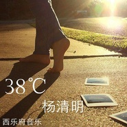

摄氏38度
============================

|  |  |
| :--: | :-- |
| [ 摄氏38度](https://emumo.xiami.com/album/1621812562) | **艺人**: [杨清明](../index.md) **语种**: 国语 **唱片公司**: 独立发行 **发行时间**: 2015年01月21日 **专辑类别**: 录音室专辑 **专辑风格**:  **播放数**: 3056 **收藏数**: 0 **评论数**: 0  |

## 简介

有没有一个人，他曾经是你的唯一，但有一瞬间又让你感到未曾相识、心灰意冷；空气燥热，心却冰冷；《摄氏38度》由实力制作人小敏亲自操刀，曲风细腻，清新中带着一丝伤感，是一首值得细品的佳作。 

## 曲目

## 评论

|  |  |  |  |
| :-- | :-- | :-- | :-- |
