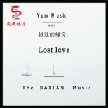
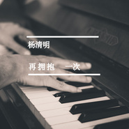
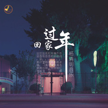
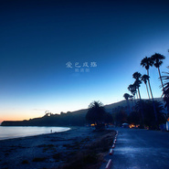
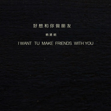
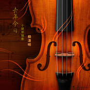
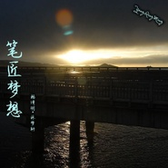
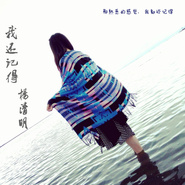
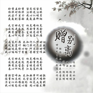
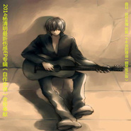

杨清明
============================

|  |  |
| :--: | :-- |
| [ 杨清明](https://i.xiami.com/yangqingming) | **地区**: China 中国大陆 **风格**: 国语流行 Mandarin Pop, 流行 Pop, 摇滚 Rock & Roll, 独立摇滚 Indie Rock **播放数**: 1735978 **粉丝数**: 84 **评论数**: 11  |

## 档案

姓名：杨清明 
性别：男 
别名：小明 
国籍：中国 
语言：普通话 
出生地：遵义 
生日：11.19 
星座：天蝎 
身高：170cm 
体重：55kg 
杨清明，乐坛新晋年轻的音乐人，制作人，生于1986年11月19日。经过多年的学习，于2010年推出第一支自己的原创单曲《宝贝别哭》，从第一支单曲一直到至今，这位年轻的音乐人已经创作了几十多首原创音乐作品，其中代表作品《一顾终年》《有爱就有家》《一杯旧咖啡》《不是不想家》等。

## 专辑

| 名称 | 语种 | 唱片公司 | 发行时间 | 专辑类别 | 专辑风格 |
| :--: | :-- | :-- | :-- | :-- | :-- |
| [ 等我话俾你听](./albums/2105505645.md) | 粤语 | 独立发行 | 2019年11月24日 | 录音室专辑 | 粤语流行 Cantopop |
| [ 后来](./albums/2105161861.md) | 国语 |  | 2019年08月20日 | EP, 单曲 | 爵士流行 Jazz Pop |
| [ 离别苦](./albums/2105103044.md) | 国语 |  | 2019年08月08日 | 录音室专辑 | 民谣流行 Folk Pop |
| [ 我们的故事](./albums/2104938520.md) | 国语 |  | 2019年06月11日 | 录音室专辑 | 民谣流行 Folk Pop |
| [ 下一站](./albums/2104552994.md) | 国语 |  | 2019年01月29日 | 录音室专辑 | 民谣流行 Folk Pop |
| [ 我们终于陌生了](./albums/2104184280.md) | 国语 |  | 2018年11月07日 | 录音室专辑 | 流行 Pop, 国语流行 Mandarin Pop |
| [ 如果我们还有下辈子](./albums/2104122802.md) | 国语 | HIFIVE | 2018年10月19日 | 录音室专辑 | 流行 Pop |
| [ 没有你以后](./albums/2103976008.md) | 国语 | 风云娱乐集团 | 2018年09月04日 | EP, 单曲 | 流行 Pop |
| [ 错过的缘分](./albums/2103905689.md) | 国语 | 风云娱乐集团 | 2018年08月07日 | EP, 单曲 | 流行 Pop |
| [ 偏方](./albums/2103764043.md) | 国语 | 独立发行 | 2018年06月01日 | 录音室专辑 | 流行 Pop |
| [ 江湖](./albums/2103716767.md) | 国语 | 独立发行 | 2018年05月23日 | 录音室专辑 | 中国风 China-Wave |
| [ 最幸福的伤口](./albums/2103702492.md) | 国语 | 独立发行 | 2018年05月05日 | 录音室专辑 | 摇滚 Rock & Roll |
| [ 中国爱](./albums/2103678239.md) | 国语 | 独立发行 | 2018年04月12日 | 录音室专辑 | 流行 Pop |
| [ 做个无情的人最好](./albums/2103660466.md) | 国语 | 独立发行 | 2018年04月03日 | 录音室专辑 | 流行 Pop |
| [ 别来无恙](./albums/2103471937.md) | 国语 | 独立发行 | 2018年01月07日 | EP, 单曲 | 流行 Pop |
| [ 祭奠你我的曾经](./albums/2102768254.md) | 国语 | 独立发行 | 2017年06月19日 | EP, 单曲 | 流行 Pop |
| [ 向天鹅甘南县向天歌畜牧服务有限公司（企业歌曲）](./albums/2102765969.md) | 国语 | 独立发行 | 2017年06月15日 | 录音室专辑 | 摇滚 Rock & Roll |
| [ 再拥抱一次](./albums/2102749169.md) | 国语 | 独立发行 | 2017年05月16日 | 录音室专辑 | 流行 Pop, 国语流行 Mandarin Pop |
| [ 亲恩浩荡](./albums/2102746643.md) | 粤语 | 独立发行 | 2017年05月14日 | 录音室专辑 | 摇滚 Rock & Roll |
| [ 如果当初没有认识你](./albums/2102729329.md) | 国语 | 独立发行 | 2017年04月10日 | 录音室专辑 | 流行 Pop |
| [ 细听泪雨](./albums/2102705207.md) | 国语 | 独立发行 | 2017年03月07日 | EP, 单曲 | 流行 Pop |
| [ 回家过年](./albums/2102677350.md) | 国语 | 独立发行 | 2017年01月09日 | EP, 单曲 | 流行 Pop |
| [ 我用酒精洗刷了心](./albums/2102665108.md) | 国语 | 独立发行 | 2016年12月16日 | 录音室专辑 | 浩室舞曲 House |
| [ 如果你的心回不来](./albums/2102657288.md) | 国语 | 独立发行 | 2016年11月29日 | EP, 单曲 |  |
| [ 爱已成殇](./albums/2102644173.md) | 国语 |  | 2016年11月07日 | EP, 单曲 |  |
| [ 物是人非](./albums/2102404039.md) | 粤语 |  | 2016年10月03日 | EP, 单曲 | 流行 Pop |
| [ 好想和你做朋友](./albums/2100388884.md) | 国语 | 独立发行 | 2016年09月11日 | EP, 单曲 | 流行 Pop |
| [ 一个人的远行](./albums/2100378920.md) | 国语 | 独立发行 | 2016年08月15日 | EP, 单曲 | 摇滚 Rock & Roll |
| [ 矢志不渝](./albums/2100368382.md) | 国语 | 独立发行 | 2016年07月18日 | EP, 单曲 | 流行 Pop |
| [ 失忆的木偶－舞曲嗨版](./albums/2100365402.md) | 国语 | 独立发行 | 2016年07月11日 | EP, 单曲 | 电子 Electronic |
| [ 还要多久才能忘记你新歌加精选专辑](./albums/2100357469.md) | 国语 | 独立发行 | 2016年06月23日 | 录音室专辑 |  |
| [ 故事的结局](./albums/2100356120.md) | 国语 | 独立发行 | 2016年06月19日 | 录音室专辑 | 流行 Pop |
| [ 失心疯](./albums/2100355632.md) | 国语 | 独立发行 | 2016年06月17日 | EP, 单曲 | 国语流行 Mandarin Pop |
| [ 爱在回忆中想你去年今日（小提琴独奏版）](./albums/2100354193.md) | 国语 | 独立发行 | 2016年06月14日 | EP, 单曲 | 国语流行 Mandarin Pop |
| [ 一切随缘一切随缘](./albums/2100348084.md) | 国语 | 独立发行 | 2016年05月31日 | EP, 单曲 | 国语流行 Mandarin Pop |
| [ 欢乐颂送给某人的歌](./albums/2100336358.md) | 国语 | 独立发行 | 2016年05月14日 | EP, 单曲 | 国语流行 Mandarin Pop |
| [ 这就是我们万顺达人万顺达集团企业歌曲](./albums/2100335546.md) | 国语 | 独立发行 | 2016年05月12日 | EP, 单曲 | 流行摇滚 Pop Rock |
| [ 别问我何求](./albums/2100325364.md) | 国语 | 独立发行 | 2016年04月29日 | EP, 单曲 | 国语流行 Mandarin Pop |
| [ 有种你就站出来有感于顺丰小哥被打而创作](./albums/2100317528.md) | 国语 | 独立发行 | 2016年04月20日 | EP, 单曲 | 流行摇滚 Pop Rock |
| [ 跟他走吧纪念日](./albums/2100311010.md) | 国语 | 独立发行 | 2016年04月11日 | EP, 单曲 | 国语流行 Mandarin Pop |
| [ 失忆的木偶](./albums/2100301398.md) | 国语 | 独立发行 | 2016年03月28日 | EP, 单曲 | 国语流行 Mandarin Pop |
| [ 后知后觉](./albums/2100284508.md) | 国语 | 独立发行 | 2016年03月01日 | EP, 单曲 |  |
| [ 圣洁之恋](./albums/2100268144.md) | 国语 | 独立发行 | 2016年01月29日 | EP, 单曲 |  |
| [ 笔匠梦想](./albums/2100263376.md) | 国语 | 独立发行 | 2016年01月20日 | EP, 单曲 |  |
| [ 有爱就有家](./albums/2100258564.md) | 国语 | 独立发行 | 2016年01月12日 | EP, 单曲 |  |
| [ 幸福海浙江围海集团之歌](./albums/2100254920.md) | 国语 | 独立发行 | 2016年01月05日 | EP, 单曲 |  |
| [ 我还记得](./albums/2100248938.md) | 国语 | 独立发行 | 2015年12月21日 | EP, 单曲 | 国语流行 Mandarin Pop |
| [ 有你的海（抢听版）](./albums/2100243294.md) | 国语 | 独立发行 | 2015年12月02日 | EP, 单曲 | 国语流行 Mandarin Pop |
| [ 最棒的兄弟最棒的兄弟](./albums/2100241940.md) | 国语 | 独立发行 | 2015年11月26日 | EP, 单曲 |  |
| [ 一杯旧咖啡](./albums/2100202294.md) | 国语 | 独立发行 | 2015年09月18日 | EP, 单曲 |  |
| [ 赠别离](./albums/1133296908.md) | 国语 | 独立发行 | 2015年06月03日 | EP, 单曲 |  |
| [ 某某](./albums/431494214.md) | 国语 | 独立发行 | 2015年05月13日 | EP, 单曲 |  |
| [ 失声无泪（粤）](./albums/1330363323.md) | 粤语 | 独立发行 | 2015年04月30日 | EP, 单曲 | 粤语流行 Cantopop |
| [ 我爱你，没有什么理由](./albums/729745336.md) | 国语 | 独立发行 | 2015年04月23日 | EP, 单曲 |  |
| [ 去年今日](./albums/1128971900.md) | 国语 | 独立发行 | 2015年04月14日 | 录音室专辑 |  |
| [ 习惯有你](./albums/1328478339.md) | 国语 | 独立发行 | 2015年04月08日 | 录音室专辑 | 国语流行 Mandarin Pop |
| [ 不想让你等太久](./albums/728025423.md) | 国语 | 独立发行 | 2015年04月03日 | EP, 单曲 | 电音流行 Electropop |
| [ 如果你爱上了他](./albums/1626474254.md) | 国语 | 独立发行 | 2015年03月16日 | EP, 单曲 |  |
| [ 画地为牢](./albums/1825262379.md) | 国语 | 独立发行 | 2015年03月02日 | 录音室专辑 |  |
| [ 都是我不对](./albums/2022370018.md) | 国语 | 独立发行 | 2015年01月28日 | 录音室专辑 | 国语流行 Mandarin Pop |
| [ 摄氏38度](./albums/1621812562.md) | 国语 | 独立发行 | 2015年01月21日 | 录音室专辑 |  |
| [ 不是不爱](./albums/1921061875.md) | 国语 | 独立发行 | 2015年01月12日 | 录音室专辑 |  |
| [ 不是不想家](./albums/1220599721.md) | 国语 | 独立发行 | 2015年01月07日 | 录音室专辑 |  |
| [ 寂寞是你给的痛](./albums/818614878.md) | 国语 | 独立发行 | 2014年12月15日 | 录音室专辑 | 流行 Pop |
| [ 难道爱上你是我的不对](./albums/18019623.md) | 国语 | 独立发行 | 2014年12月08日 | 录音室专辑 |  |
| [ 当我死去的那一天](./albums/1517419154.md) | 国语 | 独立发行 | 2014年12月01日 | 录音室专辑 |  |
| [ 红妆女](./albums/1415596290.md) | 国语 | 独立发行 | 2014年11月10日 | 录音室专辑 | 国语流行 Mandarin Pop |
| [ 梦想开始的地方](./albums/1914822501.md) | 国语 | 独立发行 | 2014年11月01日 | 录音室专辑 |  |
| [ 午夜的街口](./albums/1214553388.md) | 国语 | 独立发行 | 2014年10月29日 | 录音室专辑 |  |
| [ 忧郁的少年](./albums/1013520972.md) | 国语 | 独立发行 | 2014年10月17日 | 录音室专辑 | 流行摇滚 Pop Rock, 国语流行 Mandarin Pop |
| [ 忘记2014](./albums/413248930.md) | 国语 | 独立发行 | 2014年10月14日 | 录音室专辑 |  |
| [ 恋缘恋缘](./albums/1807809157.md) | 国语 | 独立发行 | 2014年08月12日 | EP, 单曲 | 国语流行 Mandarin Pop |
| [ 曾经拥有](./albums/1003692386.md) | 粤语 | 独立发行 | 2014年06月25日 | EP, 单曲 | 国语流行 Mandarin Pop |
| [ 爱无罪](./albums/303174089.md) | 国语 | 独立发行 | 2014年06月19日 | EP, 单曲 |  |
| [ 北漂之梦](./albums/1902369232.md) | 国语 | 独立发行 | 2014年06月10日 | EP, 单曲 | 摇滚 Rock & Roll |
| [ 自作多情](./albums/501180267.md) | 国语 | 独立发行 | 2014年05月27日 | EP, 单曲 |  |
| [ 一顾终年一顾终年](./albums/198509609.md) | 国语 | 独立发行 | 2014年04月26日 | EP, 单曲 |  |
| [ 九州天下 杨清明](./albums/1596233648.md) | 国语 | 独立发行 | 2014年04月01日 | EP, 单曲 |  |
| [ 给我一个不哭的理由给我一个不哭的理由](./albums/193323957.md) | 国语 | 独立发行 | 2014年02月25日 | EP, 单曲 | 国语流行 Mandarin Pop |
| [ 杨清明2014全新精选EP大碟 原谅我无声的离开新歌+精选](./albums/1490467187.md) | 国语 | 个人发行 | 2014年01月23日 | 录音室专辑 |  |
| [ 把爱带回家把爱带回家](./albums/1890316081.md) | 国语 | 独立发行 | 2014年01月21日 | EP, 单曲 | 国语流行 Mandarin Pop |
| [ 没有爱过你](./albums/88106413.md) | 国语 | 独立发行 | 2013年11月27日 | EP, 单曲 | 国语流行 Mandarin Pop |
| [ 九州天下](./albums/1487972127.md) | 国语 | 独立发行 | 2013年11月25日 | EP, 单曲 |  |
| [ 愿用一生承受](./albums/1187791254.md) | 国语 | 独立发行 | 2013年06月30日 | 精选集 |  |
| [ 闯荡](./albums/529314.md) | 国语 | 鑫辉文化 | 2012年07月19日 | EP, 单曲 |  |
| [ 爱情悲剧](./albums/520157.md) | 国语 | 志航文化 | 2012年06月18日 | 录音室专辑 | 流行 Pop |

## 评论

|  |  |  |
| :-- | :-- | :-- |
|  [虾米用户](https://emumo.xiami.com/u/358104299) 悲观的唯心存在现实解构虚... 2019-07-14 05:01 赞(0) 踩(0) | 
12764
 |
|  [虾米用户](https://emumo.xiami.com/u/284448342)  2017-07-02 09:58 赞(0) 踩(0) | 
粤语发音好差！
 |
|  [虾米用户](https://emumo.xiami.com/u/302888042) 如果我说爱我没有如果，真... 2017-06-08 20:10 赞(1) 踩(0) | 
杨大大加油
 |
|  [虾米用户](https://emumo.xiami.com/u/302888042) 如果我说爱我没有如果，真... 2017-06-08 20:09 赞(1) 踩(0) | 
好听
 |
|  [虾米用户](https://emumo.xiami.com/u/280797944)   2017-05-15 00:21 赞(0) 踩(0) | 
我觉得不错。。。。。
 |
|  [虾米用户](https://emumo.xiami.com/u/283196720)  2017-04-14 18:46 赞(2) 踩(0) | 
音乐大神，加油哦 
 |
|  [虾米用户](https://emumo.xiami.com/u/243187919)   2017-01-21 02:48 赞(1) 踩(0) | 
加油哦
 |
|  [虾米用户](https://emumo.xiami.com/u/24871539) 网易云ID一碗素 2015-05-07 13:09 赞(0) 踩(0) | 

 |
| ⇒ |  [虾米用户](https://emumo.xiami.com/u/168199196)  2016-09-12 17:03 赞(0) 踩(0) | 

 |
|  [虾米用户](https://emumo.xiami.com/u/36781158)  2015-02-21 10:09 赞(0) 踩(0) | 
啦啦啦啦^o^
 |
|  [虾米用户](https://emumo.xiami.com/u/9061677) 好好做音乐，好好学习！ 2013-12-25 19:40 赞(4) 踩(0) | 
我刚入驻了虾米音乐人，欢迎大家来我的个人主页，收听我的最新音乐
 |
