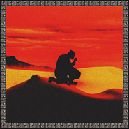

Ringos Desert
============================

|  |  |
| :--: | :-- |
| [ Ringos Desert](https://emumo.xiami.com/album/2103993207) | **艺人**: [ZHU](../index.md) **语种**: 英语 **唱片公司**: Mind of a Genius **发行时间**: 2018年09月07日 **专辑类别**: 录音室专辑 **专辑风格**: 电子 Electronic **播放数**: 227357 **收藏数**: 640 **评论数**: 100  |

## 简介

## 曲目

## 评论

|  |  |  |  |
| :-- | :-- | :-- | :-- |
|  [虾米用户](https://emumo.xiami.com/u/20629359) 我在自杀的路上 2020-08-18 00:54 赞(0) 踩(0) | 
100
 |
|  [虾米用户](https://emumo.xiami.com/u/308652751) 嗜乐如命之自由灵魂网易云... 2020-03-17 14:39 赞(0) 踩(0) | 
惊艳 
 |
|  [虾米用户](https://emumo.xiami.com/u/311176439) 专辑无时不刻都在更新，请... 2020-02-18 16:49 赞(0) 踩(0) | 
平生里最好听的专辑，没有之一
 |
|  [虾米用户](https://emumo.xiami.com/u/125449774) 嘻嘻 2019-10-23 15:44 赞(0) 踩(0) | 
爱了，嘻嘻嘻嘻
 |
|  [虾米用户](https://emumo.xiami.com/u/343572451)  2019-09-24 10:14 赞(1) 踩(0) | 
擅长渲染翻腾挣扎中的欲望。
 |
|  [虾米用户](https://emumo.xiami.com/u/405846105) 越美丽的，越不想碰 2019-08-19 08:49 赞(0) 踩(0) | 
邱比都来了
 |
|  [虾米用户](https://emumo.xiami.com/u/49443018) like attract... 2019-08-04 05:38 赞(0) 踩(0) | 

 |
|  [虾米用户](https://emumo.xiami.com/u/419203074)  2019-08-01 10:05 赞(0) 踩(0) | 
前奏太好听了，内容更奇幻
 |
|  [虾米用户](https://emumo.xiami.com/u/2050162) 彼岸 2019-07-18 08:36 赞(0) 踩(0) | 
为什么我想到的是大话西游
 |
|  [虾米用户](https://emumo.xiami.com/u/6935949) 我已经想好写什么了，你帮... 2019-07-03 13:43 赞(0) 踩(0) | 
不错的一专
 |
|  [虾米用户](https://emumo.xiami.com/u/192690051) 深海里永远看不通 2019-06-28 17:45 赞(0) 踩(0) | 

 |
|  [虾米用户](https://emumo.xiami.com/u/32218878) 再见虾虾仔们vx：xxx... 2019-06-20 08:44 赞(1) 踩(0) | 
高产
 |
|  [虾米用户](https://emumo.xiami.com/u/350379979)  2019-06-17 22:47 赞(0) 踩(0) | 
歌很有新意识
 |
|  [虾米用户](https://emumo.xiami.com/u/421013723) 森 2019-03-13 18:58 赞(1) 踩(0) | 
71017
 |
|  [虾米用户](https://emumo.xiami.com/u/460880) 有声读物 2019-02-18 16:36 赞(0) 踩(0) | 

 |
|  [虾米用户](https://emumo.xiami.com/u/221984665) ♡(•ི̛ᴗ•̛)ྀ 2019-02-07 22:21 赞(0) 踩(0) | 
♡
 |
|  [虾米用户](https://emumo.xiami.com/u/339191478)   2018-10-21 16:37 赞(0) 踩(0) | 

 |
|  [虾米用户](https://emumo.xiami.com/u/22444238) 邱比已搬移至网易云音乐  2018-10-21 15:10 赞(15) 踩(0) | 
Get
 |
|  [虾米用户](https://emumo.xiami.com/u/2770315)  2018-10-14 20:59 赞(0) 踩(0) | 
忘了给我推送？这张不赖哦
 |
|  [虾米用户](https://emumo.xiami.com/u/379982168)  2018-10-07 14:36 赞(0) 踩(0) | 
太喜欢了
 |
|  [虾米用户](https://emumo.xiami.com/u/33354835)   2018-09-26 12:21 赞(4) 踩(0) | 
Diss大篷车马戏团，你懂个屁
 |
| ⇒ |  [虾米用户](https://emumo.xiami.com/u/401329882)  2018-09-29 09:08 赞(0) 踩(0) | 
说得好
 |
|  [虾米用户](https://emumo.xiami.com/u/4372646) 可爱又迷人的正派角色IG... 2018-09-22 19:36 赞(0) 踩(0) | 
#
 |
|  [虾米用户](https://emumo.xiami.com/u/2831090) 同学请问你有猫饼吗? 2018-09-20 13:17 赞(3) 踩(0) | 
我觉得&amp;hellip;可能有些人没有听清楚这张专辑的核心，就觉得和以前的风格一样。确实，ZHU还是以前的ZHU，他的核心没有变。但是在这一张专辑的主题融合度非常高也非常明确。他把西部牛仔风格，印度，阿拉伯，巴比伦，沙漠荒原和浪子的元素都融合在一起，去组成了这张具有特色，有别于他以前歌曲特质的专辑。核心仍然是ZHU，没有变，变的是概念主题和表达方式。这样制作的专辑才有意义~
 |
| ⇒ |  [虾米用户](https://emumo.xiami.com/u/2831090) 同学请问你有猫饼吗? 2018-09-20 13:20 赞(0) 踩(0) | 
还有就是~zhu应该是直男~因为这张专辑的内容切入点很男性视角，歌曲核心的地方都挺man的。哈哈哈哈
 |
|  [虾米用户](https://emumo.xiami.com/u/276515467) 虾停了我也废了…… 2018-09-19 16:42 赞(0) 踩(0) | 
&amp;diams;️
 |
|  [虾米用户](https://emumo.xiami.com/u/21880854) 救われる 2018-09-17 13:20 赞(0) 踩(0) | 
<a href="https://soundcloud.com/zhu/sets/ringos-desert-1" target="_blank" rel="nofollow noreferrer noopener">https://soundcloud.com/zhu/sets/ringos-desert-1</a>
 |
|  [虾米用户](https://emumo.xiami.com/u/9432543) 希望自己有个万花筒 所有... 2018-09-13 04:35 赞(0) 踩(0) | 
牛逼
 |
|  [虾米用户](https://emumo.xiami.com/u/17009023)   2018-09-12 21:31 赞(0) 踩(0) | 
牛逼 一贯的高水准
 |
|  [虾米用户](https://emumo.xiami.com/u/9464517) 我还没想好要写什么... 2018-09-12 21:27 赞(0) 踩(0) | 
～
 |
|  [虾米用户](https://emumo.xiami.com/u/49443018) like attract... 2018-09-12 05:19 赞(0) 踩(0) | 
❣
 |
|  [虾米用户](https://emumo.xiami.com/u/6094197)  2018-09-12 03:33 赞(1) 踩(0) | 
zhu歌威武
 |
|  [虾米用户](https://emumo.xiami.com/u/33552517) 偏好、 2018-09-12 00:17 赞(0) 踩(0) | 
〰️
 |
|  [虾米用户](https://emumo.xiami.com/u/358712265)  2018-09-10 14:18 赞(0) 踩(0) | 
emmmmm
 |
|  [虾米用户](https://emumo.xiami.com/u/33354835)   2018-09-10 11:46 赞(0) 踩(0) | 
老公我来啦，24号华盛顿echostage 等你     
 |
| ⇒ |  [虾米用户](https://emumo.xiami.com/u/346561071)  2018-09-11 06:12 赞(0) 踩(0) | 
我也在找五号芝加哥一起的 
 |
|  [虾米用户](https://emumo.xiami.com/u/46431004)   2018-09-10 11:39 赞(2) 踩(0) | 
池子微博来报道
 |
| ⇒ |  [虾米用户](https://emumo.xiami.com/u/1290399)   2018-09-10 15:01 赞(0) 踩(0) | 
+1 池子音乐品味不错呢
 |
| ⇒ |  [虾米用户](https://emumo.xiami.com/u/358712265)  2018-09-10 19:55 赞(0) 踩(0) | 
emmmmm
 |
|  [虾米用户](https://emumo.xiami.com/u/235560938) 我还没想好要写什么... 2018-09-09 21:27 赞(0) 踩(0) | 
Majid Jordan, Tame Impala.两个梦寐以求的合体。
 |
|  [虾米用户](https://emumo.xiami.com/u/313826785)   2018-09-09 21:24 赞(0) 踩(0) | 
精品！
 |
|  [虾米用户](https://emumo.xiami.com/u/45809141)          2 0... 2018-09-09 15:18 赞(0) 踩(0) | 
阿 哈 阿 哈 哈 哈 这是一段铿锵有力的兴奋
 |
|  [虾米用户](https://emumo.xiami.com/u/8811330) 竟然被你找到了 2018-09-09 10:09 赞(1) 踩(0) | 
这是真实存在的吗 妈妈
 |
|  [虾米用户](https://emumo.xiami.com/u/13515187) always a str... 2018-09-08 21:10 赞(0) 踩(0) | 
cover是女人体
 |
|  [虾米用户](https://emumo.xiami.com/u/200687899) It’s complic... 2018-09-08 12:42 赞(0) 踩(0) | 
.....终于出了
 |
|  [虾米用户](https://emumo.xiami.com/u/18412060) v15175288880 2018-09-08 12:40 赞(0) 踩(0) | 
⠀⠀
 |
|  [虾米用户](https://emumo.xiami.com/u/1320669) ツ 2018-09-08 12:04 赞(0) 踩(0) | 
0.0
 |
|  [虾米用户](https://emumo.xiami.com/u/46787921) 看什么 2018-09-08 10:35 赞(0) 踩(0) | 
这张砖超棒，听歌还送了一个小天使给我，感恩虾米 
 |
|  [虾米用户](https://emumo.xiami.com/u/40208599) 我很聪明什么也没留下 2018-09-08 08:55 赞(0) 踩(0) | 
|
 |
|  [虾米用户](https://emumo.xiami.com/u/11726177)   2018-09-08 05:28 赞(11) 踩(0) | 
这张专辑整体像12年左右的曲风 不复古也不新 不尴不尬 整体有些陈词滥调。 放在前几年可能是很不错的一专，放在现在&amp;hellip;
 |
| ⇒ |  [虾米用户](https://emumo.xiami.com/u/41691475) 九九九九 2018-09-14 00:22 赞(0) 踩(0) | 
你最后的三个点我还以为没讲完，一直在找&amp;ldquo; 查看全文&amp;rdquo;按键在哪里&amp;hellip;
 |
| ⇒ |  [虾米用户](https://emumo.xiami.com/u/11726177)   2018-09-14 00:24 赞(0) 踩(0) | 
<q><b>老听说：</b></q>
 |
| ⇒ |  [虾米用户](https://emumo.xiami.com/u/401329882)  2018-09-29 09:15 赞(0) 踩(0) | 
你的耳朵是被太多耳屎堵住了吗？不知道你想表达什么，看看你写的东西有一句在调上吗？zhu的歌一直都没有追随潮流，他也没有跟随大多数电子音乐人的风格去创作。现在流行学猫叫所以滚去抖音听学猫叫行吗？不要歌没听几遍就出来写乐评！
 |
| ⇒ |  [虾米用户](https://emumo.xiami.com/u/33193208) One record a... 2018-11-18 20:30 赞(0) 踩(0) | 
The thing is that opinions are like asshole, everybody got one!
 |
| ⇒ |  [虾米用户](https://emumo.xiami.com/u/326745567) SHOW ME YOUR... 2019-12-30 13:30 赞(0) 踩(0) | 
<q><b>Yeefee说：</b></q>
 |
|  [虾米用户](https://emumo.xiami.com/u/346561071)  2018-09-08 05:23 赞(0) 踩(0) | 
十月五号芝加哥的有一起吗 
 |
|  [虾米用户](https://emumo.xiami.com/u/1303705) 现在基本活在spotif... 2018-09-07 23:10 赞(0) 踩(0) | 
nb
 |
|  [虾米用户](https://emumo.xiami.com/u/330228112)  2018-09-07 22:54 赞(0) 踩(0) | 
舒服
 |
|  [虾米用户](https://emumo.xiami.com/u/45253273) I seem to be... 2018-09-07 21:10 赞(0) 踩(0) | 
来啦&amp;hearts;️
 |
|  [虾米用户](https://emumo.xiami.com/u/276515467) 虾停了我也废了…… 2018-09-07 21:03 赞(0) 踩(0) | 

 |
|  [虾米用户](https://emumo.xiami.com/u/47269312) 我还没想好要写什么... 2018-09-07 20:58 赞(0) 踩(0) | 
嘻嘻
 |
|  [虾米用户](https://emumo.xiami.com/u/33783803) SY 2018-09-07 20:33 赞(0) 踩(0) | 
❤️
 |
|  [虾米用户](https://emumo.xiami.com/u/34118847) 自我实现 2018-09-07 20:26 赞(0) 踩(0) | 
原来今天刚发的专辑
 |
|  [虾米用户](https://emumo.xiami.com/u/1967227) 虾米可以不走吗。 2018-09-07 19:43 赞(0) 踩(0) | 
太他妈好听了这专！！！！
 |
|  [虾米用户](https://emumo.xiami.com/u/8497548) 看不见的盲肠炎 2018-09-07 19:22 赞(0) 踩(0) | 
//
 |
|  [虾米用户](https://emumo.xiami.com/u/27315765) 满腹都是世俗太想跳出平庸 2018-09-07 18:44 赞(0) 踩(0) | 
♡
 |
|  [虾米用户](https://emumo.xiami.com/u/26463112) 爱好是上网冲浪 2018-09-07 17:43 赞(0) 踩(0) | 
卧槽太好听了
 |
|  [虾米用户](https://emumo.xiami.com/u/10417095) 听客 2018-09-07 17:19 赞(0) 踩(0) | 
M
 |
|  [虾米用户](https://emumo.xiami.com/u/669738) 是我啊 2018-09-07 16:55 赞(0) 踩(0) | 
new cover
 |
|  [虾米用户](https://emumo.xiami.com/u/5650394)   2018-09-07 16:40 赞(0) 踩(0) | 
终于有了！！！
 |
|  [虾米用户](https://emumo.xiami.com/u/84571136) 唯有音乐不离不弃 2018-09-07 16:06 赞(0) 踩(0) | 
听
 |
|  [虾米用户](https://emumo.xiami.com/u/374254061) 我还没想好要写什么... 2018-09-07 16:02 赞(0) 踩(0) | 
期待已久❤️
 |
|  [虾米用户](https://emumo.xiami.com/u/4341982) 没有海的浪人  流亡他方... 2018-09-07 15:58 赞(0) 踩(0) | 
别撤没用的，全都download来慢慢品，随便喝点
 |
|  [虾米用户](https://emumo.xiami.com/u/374254061) 我还没想好要写什么... 2018-09-07 15:50 赞(0) 踩(0) | 

 |
|  [虾米用户](https://emumo.xiami.com/u/2761419) 镜中之花，水影倒月. 2018-09-07 15:49 赞(0) 踩(0) | 

 |
|  [虾米用户](https://emumo.xiami.com/u/21926598) peace ☮ 2018-09-07 15:47 赞(0) 踩(0) | 
..
 |
|  [虾米用户](https://emumo.xiami.com/u/242022847) 你当独立且自由。  2018-09-07 15:43 赞(0) 踩(0) | 

 |
|  [虾米用户](https://emumo.xiami.com/u/42936819)   2018-09-07 15:37 赞(0) 踩(0) | 
❤
 |
|  [虾米用户](https://emumo.xiami.com/u/10170789) 最後一天 网易：Gimm... 2018-09-07 15:30 赞(0) 踩(0) | 

 |
|  [虾米用户](https://emumo.xiami.com/u/1967227) 虾米可以不走吗。 2018-09-07 15:29 赞(0) 踩(0) | 
先码
 |
|  [虾米用户](https://emumo.xiami.com/u/6548494) shhhhhh 2018-09-07 15:24 赞(0) 踩(0) | 
✔
 |
|  [虾米用户](https://emumo.xiami.com/u/15437387) 一满足 2018-09-07 15:19 赞(0) 踩(0) | 
fff
 |
|  [虾米用户](https://emumo.xiami.com/u/12177420) People alway... 2018-09-07 15:15 赞(0) 踩(0) | 

 |
|  [虾米用户](https://emumo.xiami.com/u/52463999) 我还没想好要写什么... 2018-09-07 15:12 赞(0) 踩(0) | 
diao
 |
|  [虾米用户](https://emumo.xiami.com/u/43805130) 网易:SIonsoNOk... 2018-09-07 15:12 赞(1) 踩(0) | 
Ⅰ
 |
|  [虾米用户](https://emumo.xiami.com/u/49721130) 迷失在罗马痛苦的荒野。 2018-09-07 15:11 赞(0) 踩(0) | 
跳
 |
|  [虾米用户](https://emumo.xiami.com/u/318461445) 我不知道我要怎么和你解释... 2018-09-07 15:10 赞(0) 踩(0) | 
Chill
 |
|  [虾米用户](https://emumo.xiami.com/u/212457105) 漫步云端 2018-09-07 15:08 赞(0) 踩(0) | 
  
 |
|  [虾米用户](https://emumo.xiami.com/u/324879742)   2018-09-07 15:08 赞(1) 踩(0) | 
。
 |
|  [虾米用户](https://emumo.xiami.com/u/114631718) Long way to ... 2018-09-07 15:07 赞(0) 踩(0) | 

 |
|  [虾米用户](https://emumo.xiami.com/u/2961074) 听两首歌 2018-09-07 15:07 赞(0) 踩(0) | 
前排
 |
|  [虾米用户](https://emumo.xiami.com/u/10008325) wechat：nocas... 2018-09-07 15:06 赞(0) 踩(0) | 

 |
|  [虾米用户](https://emumo.xiami.com/u/18236235) 我还没想好要写什么... 2018-09-07 15:06 赞(0) 踩(0) | 

 |
|  [虾米用户](https://emumo.xiami.com/u/24144013)   2018-09-07 15:06 赞(0) 踩(0) | 
来了
 |
|  [虾米用户](https://emumo.xiami.com/u/187870589) 捕鱼达人 2018-09-07 15:06 赞(0) 踩(0) | 
快
 |
|  [虾米用户](https://emumo.xiami.com/u/22534652) 我还没想好要写什么... 2018-09-07 15:06 赞(0) 踩(0) | 
np
 |
|  [虾米用户](https://emumo.xiami.com/u/31501246) weibo:RocheM... 2018-09-07 15:06 赞(0) 踩(0) | 
?!?
 |
|  [虾米用户](https://emumo.xiami.com/u/5604492) ‪‪♬✧訂閱號：Morn... 2018-09-07 15:06 赞(0) 踩(0) | 

 |
|  [虾米用户](https://emumo.xiami.com/u/48898343) 生命已经过期 2018-09-07 15:06 赞(0) 踩(0) | 

 |
|  [虾米用户](https://emumo.xiami.com/u/38847730) 我还没想好要写什么... 2018-09-07 15:05 赞(1) 踩(0) | 
damn
 |
