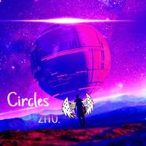
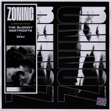
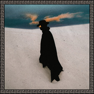
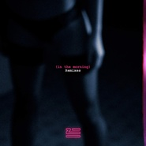

ZHU
============================

|  |  |
| :--: | :-- |
| [ ZHU](https://i.xiami.com/zhumusic) | **播放数**: 15128274 **粉丝数**: 13509 **评论数**: 445 **地区**: United States of America 美国 **风格**: 电子 Electronic  |

## 档案

小档案 
外   文   名   Steven Zhu 
别        名   Zhu 
国        籍   美国 
出生日期   1989  年 
职        业   电子歌手 
代表作品   《  Faded  》，《  Cocaine Model  》，《  Stay Closer  》，《  Superfriends  》 
音乐风格   电子乐·浩室 
活跃日期   2014  年初 
艺人资料 
Zhu  （  Steven Zhu  ）是一名美国籍电子歌手，  Zhu  的《  Faded  》在第五十七届格莱美上获最佳舞蹈专辑奖提名。 
单曲 
THE NIGHTDAY  （  2014  ） 
Faded (The Remixes)  （  2014  ） 
Automatic  （  2015  ） 
As Crazy As It Is  （  2015  ） 
Testarossa Music  （  2015  ） 
Hold Up, Wait a Minute  （  2015  ） 
Modern Conversation  （  2015  ） 
Working for It  （  2015  ） 
Genesis Series  （  2015  ） 
Automatic (Remixes)  （  2015  ） 
In the Morning  （  2016  ） 
Generationwhy  （  2016  ） 
In The Morning (Matroda Remix)  （  2016  ） 
Hometown Girl  （  2016  ） 
专辑 
Generationwhy  （  2016.7  ） 
Life and career 
Steven Zhu(born 1989), known professionally as Zhu , is a Chinese American electronic musician, record producer, and singer who has been active since the beginning of 2014, signed to Mind of a Genius Records. Until mid-2014 Zhu remained anonymous, asking to be judged by his music alone. His debut album Generationwhy was released on 29 July 2016 via Mind of a Genius / Columbia Records. 
Describing the current music climate as "very black and white", Zhu's manager Jake Udell acknowledged that race played a role in Zhu's initial choice to release his music anonymously, saying: "Some of us don't even know the limitations of our own prejudice. Rather than put those limitations to the test, we've created an engaging way for fans to focus on the music rather than who's behind it." 
Zhu's first track, "Moves Like Ms Jackson", a mashup of several songs by Outkast, was released anonymously in February 2014 and was positively received by blogs and reviewers covering electronic music. Other tracks appeared on the music streaming site Soundcloud throughout February and March, followed by an EP titled ‘The Nightday’ in April 2014, which earned a number 1 play of the week on Triple J. The first single from the EP, titled "Faded", was popularized by Pete Tong as the Essential New Tune on his radio show BBC Radio 1. "Faded" was released in March 2014. 
"Faded" quickly climbed the global charts, peaking at number 3 in Australia and the UK, and number 12 on the US Dance/Electronic chart. "Faded" was certified platinum in Australia in 2014. As "Faded" was nominated for a Grammy, Zhu stated in an interview that "the project (Zhu) is all about art, and we try to make it about the songs and the response." On 15 May 2015, Zhu appeared on Pete Tong's BBC Radio 1 'After Hours' show and contributed a 40-minute DJ mix, mostly consisting of unreleased remixes, and also announced the Nightday Collection clothing line. 
In 2015, Zhu released his collaborative EP, Genesis Series. The EP received critical acclaim for its diverse sounds and diverse range of talent. "Working for It", the lead collaboration with Skrillex and THEY, reached the top 40 and was certified Platinum in Australia, and also charted on the US Dance/Electronic chart. 
In 2016, the single "In the Morning" was released via Columbia Records. After his Neon City Tour, he announced that his debut album, Generationwhy, would be released on 29 July 2016 and that "In the Morning" was the first single from the album. On 13 June 2016, Zhu released the title track, "Generationwhy", as the second single from his upcoming album. He first premiered the record at Coachella 2016 during his closing set in the Sahara Tent. Zhu's Coachella performance drew comparisons with Daft Punk.

## 专辑

| 名称 | 语种 | 唱片公司 | 发行时间 | 专辑类别 | 专辑风格 |
| :--: | :-- | :-- | :-- | :-- | :-- |
| [ I Admit It (NGHTMRE Remix)](./albums/5022168270.md) | 英语 | Astralwerks | 2020年12月11日 | EP, 单曲 | 流行舞曲 Dance-Pop |
| [ I Admit It](./albums/5021871738.md) | 英语 | Astralwerks | 2020年11月06日 | EP, 单曲 | 流行舞曲 Dance-Pop |
| [ Risky Business](./albums/5021443238.md) | 英语 | Astralwerks | 2020年09月11日 | EP, 单曲 | 流行舞曲 Dance-Pop |
| [ DesireSingle Edit](./albums/5021092901.md) | 英语 | Domino Recording Co | 2020年07月17日 | EP, 单曲 |  |
| [ ONLY](./albums/5020627835.md) | 英语 | 环球唱片 | 2020年05月15日 | 录音室专辑 |  |
| [ Circles （Synthwave Type Beat）](./albums/5022427086.md) | 纯音乐 |  | 2020年05月13日 | 录音室专辑 |  |
| [ Zoning](./albums/2105691854.md) | 英语 | Merlin Records | 2019年09月06日 | EP, 单曲 | 电子 Electronic |
| [ Man’s First Inhibition](./albums/2105778658.md) | 英语 | Ultra Records | 2019年08月23日 | EP, 单曲 |  |
| [ Faded (Obrió Faded Mix)](./albums/5021996529.md) | 其他 | Panorama55 Recordings | 2019年01月22日 | 录音室专辑 | 电子 Electronic |
| [ Mi Rumba](./albums/2105774374.md) | 英语 | Ultra Records | 2019年01月18日 | EP, 单曲 |  |
| [ Ringos Desert](./albums/2103993207.md) | 英语 | Mind of a Genius | 2018年09月07日 | 录音室专辑 | 电子 Electronic |
| [ Coming Home](./albums/2103906853.md) | 英语 | Mind of a Genius | 2018年08月10日 | EP, 单曲 | 电子 Electronic |
| [ My Life (Remixes)](./albums/2103907548.md) | 英语 | Mind of a Genius | 2018年07月20日 | EP, 单曲 | 电子 Electronic |
| [ My Life (Kyle Watson Remix)](./albums/2103769783.md) | 英语 | Mind of a Genius | 2018年06月29日 | EP, 单曲 |  |
| [ Ringos Desert, Pt. 1](./albums/2103696704.md) | 英语 | Mind of a Genius | 2018年04月25日 | EP, 单曲 |  |
| [ My Life](./albums/2103583691.md) | 英语 | Mind of a Genius | 2018年03月05日 | EP, 单曲 | 电子 Electronic |
| [ Jet, The Doberman](./albums/2103528609.md) | 英语 | Self-Released | 2018年02月13日 | EP, 单曲 |  |
| [ Waters of Monaco](./albums/2102876299.md) | 国语 | 看见音乐 (上海) | 2017年10月20日 | EP, 单曲 |  |
| [ Ringo's Desert](./albums/2102815668.md) | 英语 | Mind of a Genius | 2017年08月18日 | EP, 单曲 | 浩室舞曲 House |
| [ Intoxicate](./albums/2102741643.md) | 英语 | Mind of a Genius | 2017年05月03日 | EP, 单曲 |  |
| [ Nightcrawler](./albums/2102712299.md) | 英语 | Mind of a Genius | 2017年03月15日 | EP, 单曲 | 深浩室舞曲 Deep House |
| [ Bad And Boujee (ZHU Remix)](./albums/2102697946.md) | 英语 | Self-Released | 2017年02月22日 | EP, 单曲 |  |
| [ Hometown Girl](./albums/2102816396.md) | 法语 | Because Music | 2017年01月06日 | EP, 单曲 |  |
| [ Generationwhy (Leon Lour Remix)](./albums/2102658285.md) | 英语 | 看见音乐 (上海) | 2016年11月18日 | EP, 单曲 |  |
| [ Generationwhy (Big Wild Remix)](./albums/2102816394.md) | 英语 | Columbia Records | 2016年11月18日 | EP, 单曲 |  |
| [ Generationwhy (Louis Futon Remix)](./albums/2102816395.md) | 英语 | Columbia Records | 2016年11月11日 | EP, 单曲 |  |
| [ In The Morning (Remixes)](./albums/2100383175.md) | 英语 | Mind of a Genius | 2016年08月26日 | EP, 单曲 |  |
| [ Generationwhy](./albums/2100357955.md) | 英语 | Mind of a Genius | 2016年07月29日 | 录音室专辑 | 独立电子乐 Indietronica |
| [ Hometown Girl](./albums/2100370931.md) | 英语 | Mind of a Genius | 2016年07月22日 | EP, 单曲 |  |
| [ In The Morning (Matroda Remix)](./albums/2100356150.md) | 英语 | Self-Released | 2016年06月16日 | EP, 单曲 |  |
| [ Generationwhy](./albums/2100353443.md) | 英语 | Mind of a Genius | 2016年06月10日 | EP, 单曲 |  |
| [ In the Morning](./albums/2100310418.md) | 英语 | Mind of a Genius | 2016年04月11日 | EP, 单曲 |  |
| [ In the Morning](./albums/2100281824.md) | 英语 | Mind of a Genius | 2016年02月26日 | EP, 单曲 |  |
| [ Automatic (Remixes)](./albums/2100246776.md) | 英语 | Mind of a Genius | 2015年11月27日 | EP, 单曲 |  |
| [ Genesis Series](./albums/2100233582.md) | 英语 | Mind of a Genius | 2015年11月06日 | EP, 单曲 |  |
| [ Working for It](./albums/2100225996.md) | 英语 | Mind of a Genius | 2015年10月23日 | EP, 单曲 |  |
| [ Modern Conversation](./albums/2100220660.md) | 英语 | Mind of a Genius | 2015年10月16日 | EP, 单曲 |  |
| [ Hold Up, Wait a Minute](./albums/2100214662.md) | 英语 | Mind of a Genius | 2015年10月09日 | EP, 单曲 |  |
| [ Testarossa Music](./albums/2100211656.md) | 英语 | Mind of a Genius | 2015年10月02日 | EP, 单曲 |  |
| [ As Crazy As It Is](./albums/2100207238.md) | 英语 | Mind of a Genius | 2015年09月25日 | EP, 单曲 |  |
| [ Automatic](./albums/2100185932.md) | 英语 | Mind of a Genius | 2015年09月16日 | EP, 单曲 |  |
| [ Faded (The Remixes)](./albums/309728238.md) | 英语 | Spinnin' Remixes | 2014年09月01日 | EP, 单曲 |  |
| [ Faded (The Remixes)](./albums/805069623.md) | 英语 | Mind of a Genius | 2014年06月29日 | EP, 单曲 |  |
| [ THE NIGHTDAY](./albums/1497458081.md) | 英语 | Mind of a Genius | 2014年04月20日 | EP, 单曲 | 深浩室舞曲 Deep House |
| [ Can't Be Stopped (Remixes)](./albums/5020878299.md) | 其他 | 418 Music | 2013年07月30日 | 录音室专辑 | 浩室舞曲 House |
| [ Faded 2.0](./albums/2105893742.md) | 英语 | Help Is Comin | 不详 | EP, 单曲 | 欧美流行 Western Pop |

## 评论

|  |  |  |  |
| :-- | :-- | :-- | :-- |
|  [虾米用户](https://emumo.xiami.com/u/354493224) 吮指原味鸡全年用户。 2020-10-09 09:03 赞(0) 踩(0) | 
睡不好觉就会吐
 |
|  [虾米用户](https://emumo.xiami.com/u/425865359)  2020-08-11 14:12 赞(0) 踩(0) | 
Touch it
 |
|  [虾米用户](https://emumo.xiami.com/u/43443614) 微信M7-Bonnie，... 2020-07-29 17:31 赞(0) 踩(0) | 
（￢㉨￢）
 |
|  [虾米用户](https://emumo.xiami.com/u/358104299) 悲观的唯心存在现实解构虚... 2020-07-12 10:09 赞(1) 踩(0) | 
41529
 |
|  [虾米用户](https://emumo.xiami.com/u/84571136) 唯有音乐不离不弃 2020-05-15 02:19 赞(0) 踩(0) | 
ZHU &amp;amp; Tinash&amp;eacute; &amp;ndash; ONLY
 |
|  [虾米用户](https://emumo.xiami.com/u/308652751) 嗜乐如命之自由灵魂 2020-05-05 22:12 赞(1) 踩(0) | 
的作品几乎首首都爱 ，对于我这双挑剔的也是没谁了
 |
|  [虾米用户](https://emumo.xiami.com/u/347786240)  2020-04-19 09:26 赞(0) 踩(0) | 
，
 |
|  [虾米用户](https://emumo.xiami.com/u/330900828) 高舉一面五星紅旗在蝦米！ 2020-03-22 18:31 赞(0) 踩(0) | 
柒上
 |
|  [虾米用户](https://emumo.xiami.com/u/50625743) SO ROSÉ SO C... 2020-02-05 02:19 赞(0) 踩(0) | 
mark
 |
|  [虾米用户](https://emumo.xiami.com/u/303122364) 没有人会一直在你身边 2020-01-13 12:46 赞(1) 踩(0) | 
2020年的演出行程谁有？
 |
|  [虾米用户](https://emumo.xiami.com/u/400715332) 留白 2019-10-27 09:35 赞(0) 踩(0) | 
来一个  
 |
|  [虾米用户](https://emumo.xiami.com/u/11812536) keep calm an... 2019-08-24 16:08 赞(0) 踩(0) | 
唉，都是姓Zhu的，人家都跟gorillaz合作了
 |
|  [虾米用户](https://emumo.xiami.com/u/335167244) 突然爱上电音的老家伙 2019-08-18 15:12 赞(0) 踩(0) | 
知吾猪
 |
|  [虾米用户](https://emumo.xiami.com/u/223845151) _(:* ｣∠)_ 2019-07-31 20:50 赞(0) 踩(0) | 
!
 |
|  [虾米用户](https://emumo.xiami.com/u/426985496)  2019-07-20 10:59 赞(0) 踩(0) | 
失恋了一直听
 |
|  [虾米用户](https://emumo.xiami.com/u/212809691)  2019-07-19 20:11 赞(0) 踩(0) | 
棒棒，继续加油
 |
|  [虾米用户](https://emumo.xiami.com/u/281462959) 時間珍貴，但總有些人，有... 2019-07-09 10:46 赞(1) 踩(0) | 
ZHU给我一个机会，让我更多的了解了解你
 |
|  [虾米用户](https://emumo.xiami.com/u/650489) 陪伴我从高中、大学、到工... 2019-06-25 20:02 赞(0) 踩(0) | 
这么给力的DJ歌手，太低调了。。。
 |
|  [虾米用户](https://emumo.xiami.com/u/309256043) 一起听歌吧… 2019-05-11 19:05 赞(0) 踩(0) | 

 |
|  [虾米用户](https://emumo.xiami.com/u/685483) 我还没想好要写什么... 2019-05-07 17:54 赞(0) 踩(0) | 
Amazing production value. An artist to watch for sure.
 |
|  [虾米用户](https://emumo.xiami.com/u/302019615)  2019-05-05 18:45 赞(0) 踩(0) | 
NB
 |
|  [虾米用户](https://emumo.xiami.com/u/401541389) 专注听歌 2019-04-29 18:15 赞(0) 踩(0) | 
只为在虾米多看你两眼
 |
|  [虾米用户](https://emumo.xiami.com/u/688413)   2019-04-29 17:38 赞(1) 踩(0) | 
什么时候来魔都啊 能在虾米看到音乐人的演出行程就好了
 |
|  [虾米用户](https://emumo.xiami.com/u/401541389) 专注听歌 2019-03-27 15:26 赞(0) 踩(0) | 
只为在虾米多看你两眼！！！！
 |
|  [虾米用户](https://emumo.xiami.com/u/358104299) 悲观的唯心存在现实解构虚... 2019-03-12 20:27 赞(0) 踩(0) | 
10256
 |
|  [虾米用户](https://emumo.xiami.com/u/17146554) weibo：@L1RRO... 2019-03-02 11:21 赞(0) 踩(0) | 
你好
 |
|  [虾米用户](https://emumo.xiami.com/u/9049307) 你捧着书，背靠着树，阳光... 2019-02-11 14:02 赞(0) 踩(0) | 
这嗓音还是nice的，少年吸du人员的声音。
 |
|  [虾米用户](https://emumo.xiami.com/u/18475688) 容忍与自由——胡适 2019-02-01 18:01 赞(1) 踩(0) | 
这个人太有才华了，我太喜欢了。
 |
|  [虾米用户](https://emumo.xiami.com/u/33078523) 我还没想好要写什么... 2019-01-31 22:37 赞(0) 踩(0) | 
啊不知道还有没有机会上海再相见
 |
|  [虾米用户](https://emumo.xiami.com/u/1154949) 我想在虾米找个男朋友啊 2019-01-26 13:51 赞(0) 踩(0) | 

 |
|  [虾米用户](https://emumo.xiami.com/u/250797487)  2018-12-31 07:46 赞(2) 踩(0) | 
好喜欢
 |
|  [虾米用户](https://emumo.xiami.com/u/100724066) 风里笑着，风里追，感激天... 2018-12-29 06:30 赞(2) 踩(0) | 
好听 好听 好听
 |
|  [虾米用户](https://emumo.xiami.com/u/35101183)   2018-11-27 13:22 赞(2) 踩(0) | 
请问有群吗- -
 |
|  [虾米用户](https://emumo.xiami.com/u/19902863) 虾米不要关 2018-11-26 12:54 赞(3) 踩(0) | 
Best show in EDC Zhuhai 2018！
 |
|  [虾米用户](https://emumo.xiami.com/u/57381000) 酒叙 2018-10-23 14:55 赞(2) 踩(0) | 
Any chance tour in Australia? Looking forward!!!
 |
|  [虾米用户](https://emumo.xiami.com/u/361037631)  2018-10-06 18:37 赞(2) 踩(0) | 
******
 |
|  [虾米用户](https://emumo.xiami.com/u/1303705) 现在基本活在spotif... 2018-10-04 13:47 赞(4) 踩(0) | 
刚去完多伦多的现场，耳朵有点不太好用了
 |
| ⇒ |  [虾米用户](https://emumo.xiami.com/u/11738636) 不羁的疯 2020-03-08 17:17 赞(0) 踩(0) | 
我也去了
 |
|  [虾米用户](https://emumo.xiami.com/u/339191478)   2018-10-04 13:43 赞(2) 踩(0) | 
❤
 |
|  [虾米用户](https://emumo.xiami.com/u/3428058) 我还没想好要写什么... 2018-10-04 02:07 赞(1) 踩(0) | 
今晚多伦多有人一起吗QAQ
 |
|  [虾米用户](https://emumo.xiami.com/u/1303705) 现在基本活在spotif... 2018-09-18 04:38 赞(6) 踩(0) | 
听了五年，明白了一个很花时间精力才可以懂得的道理 &amp;mdash; ZHU真的可能是天才
 |
|  [虾米用户](https://emumo.xiami.com/u/21880854) 救われる 2018-09-17 13:17 赞(1) 踩(0) | 
蕩漾
 |
|  [虾米用户](https://emumo.xiami.com/u/850811) 分手道别'不说再见 2018-08-06 11:20 赞(3) 踩(0) | 
居然是杭州裔，之前一直以为他是个黑人，口音太屌
 |
| ⇒ |  [虾米用户](https://emumo.xiami.com/u/5520413) music 2018-12-14 13:02 赞(0) 踩(0) | 
祝子皓？哈哈哈，这就不是一个人。
 |
|  [虾米用户](https://emumo.xiami.com/u/324879742)   2018-07-26 20:34 赞(3) 踩(0) | 
。
 |
|  [虾米用户](https://emumo.xiami.com/u/298141443) Depresser.El... 2018-07-26 18:45 赞(2) 踩(0) | 
这个。。。可以算deep house了吧
 |
|  [虾米用户](https://emumo.xiami.com/u/265154265) “希望大幸运术也能让我拥... 2018-06-28 13:20 赞(2) 踩(0) | 
猪！ 
 |
|  [虾米用户](https://emumo.xiami.com/u/374254061) 我还没想好要写什么... 2018-06-01 01:09 赞(3) 踩(0) | 
Zhu跟QQ音乐一点都不搭
 |
|  [虾米用户](https://emumo.xiami.com/u/374254061) 我还没想好要写什么... 2018-06-01 01:06 赞(3) 踩(0) | 
自从Zhu签约腾讯那个厂牌后，我只能再下载个QQ音乐
 |
|  [虾米用户](https://emumo.xiami.com/u/362471148)  2018-05-22 20:20 赞(1) 踩(0) | 
pig
 |
|  [虾米用户](https://emumo.xiami.com/u/9577833) 我想好要写什么了 2018-05-21 21:37 赞(1) 踩(0) | 
大兄弟你能告诉我为什么都下架了   
 |
|  [虾米用户](https://emumo.xiami.com/u/2246028) 本无常  2018-05-19 18:06 赞(2) 踩(0) | 
刚在摩登sky听完&amp;hellip;
 |
|  [虾米用户](https://emumo.xiami.com/u/351702778) 我还没想好要写什么... 2018-05-13 13:44 赞(1) 踩(0) | 
Meet you in Shanghai
 |
|  [虾米用户](https://emumo.xiami.com/u/13901273)  2018-05-10 13:43 赞(1) 踩(0) | 
在。上海的我还不去买票吗？
 |
|  [虾米用户](https://emumo.xiami.com/u/15829923)  2018-05-04 16:52 赞(1) 踩(0) | 
长什么样呢
 |
|  [虾米用户](https://emumo.xiami.com/u/1303705) 现在基本活在spotif... 2018-04-27 03:41 赞(1) 踩(0) | 
<a href="https://soundcloud.com/zhu/sets/ringos-desert-pt-1" target="_blank" rel="nofollow noreferrer noopener">https://soundcloud.com/zhu/sets/ringos-desert-pt-1</a>
 |
|  [虾米用户](https://emumo.xiami.com/u/1303705) 现在基本活在spotif... 2018-04-27 03:38 赞(3) 踩(0) | 
就想问一下  10月3号多伦多的有木有！！！！！
 |
| ⇒ |  [虾米用户](https://emumo.xiami.com/u/1734239) Curiosity ma... 2018-09-25 10:42 赞(0) 踩(0) | 
在考虑！！！
 |
|  [虾米用户](https://emumo.xiami.com/u/1967227) ǝnbısnɯ 2018-04-26 21:59 赞(1) 踩(0) | 
为什么qq独家了 
 |
|  [虾米用户](https://emumo.xiami.com/u/15829923)  2018-04-17 11:52 赞(1) 踩(0) | 
非常喜欢 zhu 的音乐
 |
|  [虾米用户](https://emumo.xiami.com/u/1669981) 我还没想好要写什么... 2018-04-16 21:29 赞(1) 踩(0) | 
期待更多作品 
 |
|  [虾米用户](https://emumo.xiami.com/u/61334028)  2018-04-15 09:03 赞(1) 踩(0) | 
爱你爱你
 |
|  [虾米用户](https://emumo.xiami.com/u/11173645) 我还没想好要写什么... 2018-04-10 15:58 赞(1) 踩(0) | 
居然是个老外给我推荐的这位。。。。
 |
| ⇒ |  [虾米用户](https://emumo.xiami.com/u/340384926) 我还没想好要写什么... 2018-06-21 12:30 赞(0) 踩(0) | 
一个法籍华裔男孩子推荐我的Zhu 
 |
| ⇒ |  [虾米用户](https://emumo.xiami.com/u/11173645) 我还没想好要写什么... 2018-06-21 12:31 赞(0) 踩(0) | 
<q><b>呆说：</b></q>
 |
| ⇒ |  [虾米用户](https://emumo.xiami.com/u/340384926) 我还没想好要写什么... 2018-06-21 12:33 赞(0) 踩(0) | 
哈哈哈 
 |
|  [虾米用户](https://emumo.xiami.com/u/28325632)  2018-04-06 20:16 赞(1) 踩(0) | 
Hope one day you could collaborate with KINJAZ to make MV. I'm sure that would be awesome :)
 |
|  [虾米用户](https://emumo.xiami.com/u/33354835)   2018-04-06 13:03 赞(1) 踩(0) | 
我老公这么吊，你们这些凡人不懂欣赏
 |
|  [虾米用户](https://emumo.xiami.com/u/316099275) 你是我心里挥之不去的彩虹 2018-04-02 11:11 赞(1) 踩(0) | 
相逢恨晚
 |
|  [虾米用户](https://emumo.xiami.com/u/7779210) 。 2018-03-27 20:52 赞(1) 踩(0) | 
5.18上海见
 |
| ⇒ |  [虾米用户](https://emumo.xiami.com/u/382749)   2018-03-30 15:49 赞(0) 踩(0) | 
在哪里买票呀
 |
| ⇒ |  [虾米用户](https://emumo.xiami.com/u/7779210) 。 2018-03-30 15:51 赞(0) 踩(0) | 
<q><b>whosssy说：</b></q>
 |
|  [虾米用户](https://emumo.xiami.com/u/347443394) Light 2018-03-13 15:32 赞(0) 踩(0) | 
上班听，激发创意灵感
 |
|  [虾米用户](https://emumo.xiami.com/u/260517335) 鸡 2018-03-04 21:49 赞(0) 踩(0) | 
Zhu&amp;amp;Tame Impala
 |
|  [虾米用户](https://emumo.xiami.com/u/244748965)  2018-02-14 09:34 赞(0) 踩(0) | 
猪
 |
|  [虾米用户](https://emumo.xiami.com/u/853523)  2018-02-08 13:52 赞(0) 踩(0) | 
春哥新专辑有和他合作
 |
|  [虾米用户](https://emumo.xiami.com/u/55552179) 没有电影和音乐的话该怎么... 2018-02-04 14:01 赞(0) 踩(0) | 
&amp;Ouml;
 |
|  [虾米用户](https://emumo.xiami.com/u/1128529)  2018-01-25 00:24 赞(0) 踩(0) | 
起名叫zhu。。。肯定是故意的
 |
| ⇒ |  [虾米用户](https://emumo.xiami.com/u/2763594)  2018-01-26 15:46 赞(0) 踩(0) | 
是华裔
 |
| ⇒ |  [虾米用户](https://emumo.xiami.com/u/2574272) 好好学习吧 2018-04-21 21:34 赞(0) 踩(0) | 
华裔，姓朱
 |
|  [虾米用户](https://emumo.xiami.com/u/6529747) 我还没想好要写什么... 2018-01-24 11:59 赞(0) 踩(0) | 
哈～～无意中发现一位有中国血统的美国音乐人～～加油！！！争取在国际上得奖哈～～
 |
|  [虾米用户](https://emumo.xiami.com/u/89590132)   2018-01-17 11:54 赞(0) 踩(0) | 
  
 |
|  [虾米用户](https://emumo.xiami.com/u/340166256) 我还没想好要写什么... 2018-01-17 00:28 赞(0) 踩(0) | 
太酷了
 |
|  [虾米用户](https://emumo.xiami.com/u/291932979)   2018-01-11 02:41 赞(0) 踩(0) | 
音乐真TM好
 |
|  [虾米用户](https://emumo.xiami.com/u/75198594) 没人能在我的BGM里面战... 2017-12-19 22:38 赞(1) 踩(0) | 
愛你 
 |
|  [虾米用户](https://emumo.xiami.com/u/13555511) 听蛙 2017-12-10 01:05 赞(0) 踩(0) | 
♀
 |
|  [虾米用户](https://emumo.xiami.com/u/46872694) 躲在耳机里的窝囊废 2017-12-09 23:04 赞(0) 踩(0) | 
很久以前断断续续收藏过好几首 都超喜欢的那种 后来才知道都是一个人的歌 神奇的事情
 |
|  [虾米用户](https://emumo.xiami.com/u/1410907) 不疯魔，不成活！ 2017-12-07 10:32 赞(1) 踩(0) | 
非常喜欢你和春春在专辑《流行》中的合作，决定过来关注你了~喜欢你的曲子
 |
|  [虾米用户](https://emumo.xiami.com/u/6548494) shhhhhh 2017-12-06 12:10 赞(0) 踩(0) | 
补留
 |
|  [虾米用户](https://emumo.xiami.com/u/7515269)  2017-11-08 10:37 赞(0) 踩(0) | 
入教入教 超好听！但是为什么都没人去微博关注他
 |
|  [虾米用户](https://emumo.xiami.com/u/82406246) WhereverUAre... 2017-10-30 22:29 赞(0) 踩(0) | 
这些歌都好不错   
 |
|  [虾米用户](https://emumo.xiami.com/u/4881922) born to die 2017-10-30 22:11 赞(3) 踩(0) | 
超爱你在ADIDAS和ANGELABABY拍的拍的那支广告，夹克背后的logo一露，就燃了
 |
|  [虾米用户](https://emumo.xiami.com/u/120109350) 我还没想好要写什么... 2017-10-29 21:42 赞(0) 踩(0) | 
ZHU，美籍华裔！
 |
|  [虾米用户](https://emumo.xiami.com/u/85165792) COMING 2017-10-27 17:32 赞(0) 踩(0) | 
.
 |
|  [虾米用户](https://emumo.xiami.com/u/27490798) 我还没想好要写什么... 2017-10-24 22:19 赞(0) 踩(0) | 
被MV吓来了
 |
|  [虾米用户](https://emumo.xiami.com/u/125606890) 健康的生活！ 2017-10-12 18:32 赞(0) 踩(0) | 
歌曲，好骚，真棒！   
 |
|  [虾米用户](https://emumo.xiami.com/u/4722121)  2017-09-21 14:21 赞(0) 踩(0) | 
Hey ZHU, you are RED!
 |
|  [虾米用户](https://emumo.xiami.com/u/55881258) 今日任公子 2017-08-29 11:58 赞(2) 踩(0) | 
越来越喜欢你了
 |
|  [虾米用户](https://emumo.xiami.com/u/50710259)  2017-08-29 11:47 赞(0) 踩(0) | 
徐锦江！！！
 |
|  [虾米用户](https://emumo.xiami.com/u/6652575) mbz2006 2017-08-28 10:30 赞(0) 踩(0) | 
ok
 |
|  [虾米用户](https://emumo.xiami.com/u/36572778) 我还没想好要写什么... 2017-08-26 00:31 赞(2) 踩(0) | 
真的牛穴!
 |
|  [虾米用户](https://emumo.xiami.com/u/2433636) 肚子 2017-08-21 07:01 赞(0) 踩(0) | 
Welcome!! I really like your music. It accompanied me through whole period of eassy when i feel so hard and tird. ❤️
 |
|  [虾米用户](https://emumo.xiami.com/u/46758368)   2017-08-20 11:30 赞(0) 踩(0) | 

 |
|  [虾米用户](https://emumo.xiami.com/u/49086786) 我还没想好要写什么... 2017-08-20 05:06 赞(1) 踩(0) | 
现场超嗨！
 |
|  [虾米用户](https://emumo.xiami.com/u/4032390) 向上看 2017-08-20 00:55 赞(33) 踩(0) | 
这家伙的思维方式 的确不一般 还好躲过了 中国的教育
 |
|  [虾米用户](https://emumo.xiami.com/u/309906774)  2017-08-19 22:05 赞(0) 踩(0) | 
超燃
 |
|  [虾米用户](https://emumo.xiami.com/u/3784549)  2017-08-18 23:23 赞(0) 踩(0) | 
明天见 
 |
|  [虾米用户](https://emumo.xiami.com/u/54546226)   2017-08-18 21:52 赞(0) 踩(0) | 
20170818
 |
|  [虾米用户](https://emumo.xiami.com/u/84571136) 唯有音乐不离不弃 2017-08-18 17:56 赞(0) 踩(0) | 
ZHU &amp;ndash; Stardustexhalemarrakechdreams
 |
|  [虾米用户](https://emumo.xiami.com/u/1418202)  江山共老 2017-08-18 13:01 赞(0) 踩(0) | 
，
 |
|  [虾米用户](https://emumo.xiami.com/u/319885364)  2017-08-17 19:59 赞(188) 踩(0) | 
我刚入驻了虾米音乐人，欢迎大家来我的个人主页，收听我的最新音乐
 |
| ⇒ |  [虾米用户](https://emumo.xiami.com/u/2418238) weibo: @尤米口 2017-08-18 01:42 赞(0) 踩(0) | 
(ᵒ̴̶̷̤⌔ᵒ̴̶̷̤.)
 |
| ⇒ |  [虾米用户](https://emumo.xiami.com/u/22444238) 邱比官方虾米 2017-08-18 11:03 赞(0) 踩(0) | 
get.
 |
| ⇒ |  [虾米用户](https://emumo.xiami.com/u/124292352)   2017-08-18 17:15 赞(0) 踩(0) | 
真的假的？
 |
| ⇒ |  [虾米用户](https://emumo.xiami.com/u/10417095) 听客 2017-08-18 23:04 赞(0) 踩(0) | 
Welcome on board !
 |
| ⇒ |  [虾米用户](https://emumo.xiami.com/u/52700803) 我爱虾米❤️ 2017-08-19 18:15 赞(0) 踩(0) | 
激动~比心
 |
| ⇒ |  [虾米用户](https://emumo.xiami.com/u/52700803) 我爱虾米❤️ 2017-08-19 18:18 赞(0) 踩(0) | 
被圈粉了~~
 |
| ⇒ |  [虾米用户](https://emumo.xiami.com/u/159516870) 童言无忌，年龄吹去。 2017-08-28 23:10 赞(0) 踩(0) | 
 
 |
| ⇒ |  [虾米用户](https://emumo.xiami.com/u/263006968)   2017-08-31 23:25 赞(0) 踩(0) | 
希望你能来深圳或者香港演出
 |
| ⇒ |  [虾米用户](https://emumo.xiami.com/u/227057678) 林宥嘉的小迷妹呐 2017-09-02 22:32 赞(0) 踩(0) | 
太好听了
 |
| ⇒ |  [虾米用户](https://emumo.xiami.com/u/38921601) 可爱又迷人的反派角色 2017-09-26 18:21 赞(0) 踩(0) | 
好哒好哒
 |
| ⇒ |  [虾米用户](https://emumo.xiami.com/u/47902661) 虾米体验很不好，很少用虾... 2017-10-24 02:04 赞(0) 踩(0) | 
我艹   ，竟然入住虾米了
 |
| ⇒ |  [虾米用户](https://emumo.xiami.com/u/2984776)   2017-12-07 14:44 赞(0) 踩(0) | 
来
 |
| ⇒ |  [虾米用户](https://emumo.xiami.com/u/33354835)   2017-12-15 17:33 赞(0) 踩(0) | 
我家猪猪最棒
 |
| ⇒ |  [虾米用户](https://emumo.xiami.com/u/95680) 伤风而来 败俗而去 2018-01-14 17:53 赞(0) 踩(0) | 
红糖girl你好 
 |
| ⇒ |  [虾米用户](https://emumo.xiami.com/u/28121031)   2018-01-18 14:47 赞(0) 踩(0) | 
厉害了！一直在hit fm听到你的歌曲。加油！
 |
| ⇒ |  [虾米用户](https://emumo.xiami.com/u/575435) 简单 新鲜 没梦 2018-01-26 23:32 赞(0) 踩(0) | 
不知道在你的曲子下干了多少坏事[带墨镜笑]
 |
| ⇒ |  [虾米用户](https://emumo.xiami.com/u/46886165)   2018-03-09 21:52 赞(0) 踩(0) | 
真想见见你
 |
| ⇒ |  [虾米用户](https://emumo.xiami.com/u/84895252)  2018-03-20 19:32 赞(0) 踩(0) | 
牛气 
 |
| ⇒ |  [虾米用户](https://emumo.xiami.com/u/335536616)  2018-08-06 16:48 赞(0) 踩(0) | 
おvfvfbvrmvんvfvっっっff
 |
| ⇒ |  [虾米用户](https://emumo.xiami.com/u/312069008) 新年好呀(●°u°●)​... 2019-07-16 08:13 赞(0) 踩(0) | 
哎呦喂
 |
| ⇒ |  [虾米用户](https://emumo.xiami.com/u/416571321)  2019-09-13 19:51 赞(0) 踩(0) | 
好音乐一听难忘
 |
| ⇒ |  [虾米用户](https://emumo.xiami.com/u/4592709) 神爱世人 2020-03-03 20:33 赞(0) 踩(0) | 
请问有实体专卖吗?
 |
|  [虾米用户](https://emumo.xiami.com/u/281608616)   2017-08-17 19:48 赞(0) 踩(0) | 
8.19 live@Arkham
 |
|  [虾米用户](https://emumo.xiami.com/u/12871742) 我还没想好要写什么... 2017-08-15 16:00 赞(1) 踩(0) | 
出8.19arkham 预售两张 咸鱼转 需要私聊
 |
|  [虾米用户](https://emumo.xiami.com/u/11120849) 这家伙很蠢什么也没留下.... 2017-08-10 11:21 赞(7) 踩(0) | 
这美国佬，不清真啊
 |
|  [虾米用户](https://emumo.xiami.com/u/39929848) X 2017-07-27 10:02 赞(3) 踩(0) | 
819见 
 |
| ⇒ |  [虾米用户](https://emumo.xiami.com/u/7774835) 我还没想好要写什么... 2017-08-03 11:06 赞(0) 踩(0) | 
819见
 |
|  [虾米用户](https://emumo.xiami.com/u/33798304) 我还没想好要写什么... 2017-07-14 08:54 赞(4) 踩(0) | 
8.19 @Arkham Shanghai
 |
|  [虾米用户](https://emumo.xiami.com/u/39968630) Harder,bette... 2017-07-06 08:11 赞(2) 踩(0) | 
要来Arkham了！期待
 |
| ⇒ |  [虾米用户](https://emumo.xiami.com/u/12871742) 我还没想好要写什么... 2017-07-06 19:51 赞(0) 踩(0) | 
几时？公告没看有宣传啊
 |
| ⇒ |  [虾米用户](https://emumo.xiami.com/u/19471540) 难眠之欲 hūxi 2017-07-14 19:53 赞(0) 踩(0) | 
<q><b>ohiyomm说：</b></q>
 |
|  [虾米用户](https://emumo.xiami.com/u/303338560) :( 2017-06-26 08:06 赞(1) 踩(0) | 
又会DJ，还唱功好。大家可以check out 他的 Instagram! #强烈推荐
 |
| ⇒ |  [虾米用户](https://emumo.xiami.com/u/2206166) 我还没想好要写什么... 2017-08-01 15:57 赞(0) 踩(0) | 
求ins 账号
 |
| ⇒ |  [虾米用户](https://emumo.xiami.com/u/303338560) :( 2017-08-09 14:57 赞(0) 踩(0) | 
就是zhu。他有一些blacklizt club 的 post. 特别high的一个warehouse party 是 21 &amp;amp; up. First one in New York. Invites only.
 |
|  [虾米用户](https://emumo.xiami.com/u/977238) 热爱音乐每一天 2017-06-19 18:52 赞(0) 踩(0) | 
厉害的
 |
|  [虾米用户](https://emumo.xiami.com/u/268984) byebye my lo... 2017-06-03 07:42 赞(0) 踩(0) | 
挺牛逼啊。
 |
|  [虾米用户](https://emumo.xiami.com/u/20637231) 琴棋书画，酱醋油茶 2017-05-30 00:54 赞(0) 踩(0) | 
超级无敌爱
 |
|  [虾米用户](https://emumo.xiami.com/u/35275661)  2017-05-30 00:32 赞(0) 踩(0) | 
居然是华人。。。
 |
|  [虾米用户](https://emumo.xiami.com/u/8402567) 再见 2017-05-28 14:57 赞(0) 踩(0) | 
哪里了解演出信息
 |
|  [虾米用户](https://emumo.xiami.com/u/12766015) 新古典是摄人心魄的毒药…... 2017-05-28 11:39 赞(0) 踩(0) | 
deep
 |
|  [虾米用户](https://emumo.xiami.com/u/16396509)  2017-05-27 15:30 赞(0) 踩(0) | 
他是中国哪里人谁知道啊
 |
| ⇒ |  [虾米用户](https://emumo.xiami.com/u/104287342) 怎么说，毕竟是百年难得 2017-05-27 22:48 赞(0) 踩(0) | 
杭州
 |
| ⇒ |  [虾米用户](https://emumo.xiami.com/u/3313085)  2017-06-04 15:57 赞(0) 踩(0) | 
美籍华人
 |
| ⇒ |  [虾米用户](https://emumo.xiami.com/u/250770694)  2017-06-08 15:18 赞(0) 踩(0) | 
<q><b>simplyme说：</b></q>
 |
|  [虾米用户](https://emumo.xiami.com/u/291454814) 捶打我天然的沉默，切割我... 2017-05-26 23:49 赞(0) 踩(0) | 
不了解不懂
 |
|  [虾米用户](https://emumo.xiami.com/u/206758094) 滚回去听歌 2017-05-25 23:09 赞(25) 踩(0) | 
ZHU没上虾米首页爱上他的请诚实举手 
 |
|  [虾米用户](https://emumo.xiami.com/u/206758094) 滚回去听歌 2017-05-25 23:06 赞(12) 踩(0) | 
杭州人厉害了，，怕是能吃美国人哟 
 |
|  [虾米用户](https://emumo.xiami.com/u/31501246) weibo:RocheM... 2017-05-25 15:02 赞(0) 踩(0) | 
杭州人
 |
|  [虾米用户](https://emumo.xiami.com/u/5216625) 不随地吐痰 2017-05-25 13:44 赞(2) 踩(0) | 
House是个人最不喜欢的音乐风格 但ZHU的却是个例外
 |
|  [虾米用户](https://emumo.xiami.com/u/40046181) 黑抒情 白摇滚 2017-05-25 07:22 赞(1) 踩(0) | 
美籍华人 
 |
|  [虾米用户](https://emumo.xiami.com/u/3668290)  2017-05-17 07:51 赞(1) 踩(0) | 
音乐最爱
 |
|  [虾米用户](https://emumo.xiami.com/u/255971582) 我还没想好要写什么... 2017-05-14 15:28 赞(2) 踩(0) | 
zhu哥哥 我现在知道我为什么起的名字是单曲循环
 |
| ⇒ |  [虾米用户](https://emumo.xiami.com/u/266487606) 我命由我不由天，天欲灭我... 2017-07-24 00:46 赞(0) 踩(0) | 
是吗？ 
 |
|  [虾米用户](https://emumo.xiami.com/u/1281535) 妈妈一起飞吧 2017-05-03 23:43 赞(1) 踩(0) | 
同年同姓
 |
|  [虾米用户](https://emumo.xiami.com/u/120109350) 我还没想好要写什么... 2017-04-29 13:27 赞(0) 踩(0) | 
他到底是中国的还是美国的？
 |
| ⇒ |  [虾米用户](https://emumo.xiami.com/u/19122308) 疲倦。 2017-05-01 08:50 赞(0) 踩(0) | 
美籍华裔
 |
| ⇒ |  [虾米用户](https://emumo.xiami.com/u/253259303) 愿时光与你一直静好 2017-05-02 19:06 赞(0) 踩(0) | 
<q><b>_DisappearME说：</b></q>
 |
|  [虾米用户](https://emumo.xiami.com/u/102966194) lange Zeit，m... 2017-04-27 01:25 赞(0) 踩(0) | 
美籍啊 
 |
|  [虾米用户](https://emumo.xiami.com/u/478527) 好想跟衣服在洗衣机里滚 2017-04-27 00:35 赞(2) 踩(0) | 
寻光计划观光团到此一游
 |
|  [虾米用户](https://emumo.xiami.com/u/36571834) 本来无一物 我要到處惹尘... 2017-04-26 19:17 赞(0) 踩(0) | 
5770
 |
|  [虾米用户](https://emumo.xiami.com/u/245304136) 永远爱您 2017-04-26 12:46 赞(0) 踩(0) | 
哇
 |
|  [虾米用户](https://emumo.xiami.com/u/4334438) 贫穷而倔强 2017-04-26 11:02 赞(0) 踩(0) | 
原来是国人 
 |
|  [虾米用户](https://emumo.xiami.com/u/2523233) 太热 2017-04-26 08:57 赞(1) 踩(0) | 
「虾米音乐寻光计划Ⅱ评审团」
 |
|  [虾米用户](https://emumo.xiami.com/u/11649585) 杂食动物 2017-04-19 15:40 赞(1) 踩(0) | 
骚zhu
 |
|  [虾米用户](https://emumo.xiami.com/u/34809432)   2017-04-14 06:05 赞(1) 踩(0) | 
前两天才去ZHU的现场！！！嗨爆了！！大爱！！
 |
| ⇒ |  [虾米用户](https://emumo.xiami.com/u/114631718) Long way to ... 2017-05-14 12:03 赞(0) 踩(0) | 
在哪？ 
 |
| ⇒ |  [虾米用户](https://emumo.xiami.com/u/114631718) Long way to ... 2017-05-14 12:04 赞(0) 踩(0) | 
中国他也来吗？
 |
| ⇒ |  [虾米用户](https://emumo.xiami.com/u/34809432)   2017-05-19 15:29 赞(0) 踩(0) | 
<q><b>Chenhui说：</b></q>
 |
| ⇒ |  [虾米用户](https://emumo.xiami.com/u/52700803) 我爱虾米❤️ 2017-07-26 19:39 赞(0) 踩(0) | 
看见真人了吗？
 |
| ⇒ |  [虾米用户](https://emumo.xiami.com/u/34809432)   2017-07-29 01:30 赞(0) 踩(0) | 
<q><b>Shetler说：</b></q>
 |
| ⇒ |  [虾米用户](https://emumo.xiami.com/u/7774835) 我还没想好要写什么... 2017-08-03 11:07 赞(0) 踩(0) | 
<q><b>Chenhui说：</b></q>
 |
| ⇒ |  [虾米用户](https://emumo.xiami.com/u/114631718) Long way to ... 2017-08-09 16:03 赞(0) 踩(0) | 
<q><b>方芳说：</b></q>
 |
| ⇒ |  [虾米用户](https://emumo.xiami.com/u/7774835) 我还没想好要写什么... 2017-08-09 16:03 赞(0) 踩(0) | 
<q><b>Chenhui说：</b></q>
 |
| ⇒ |  [虾米用户](https://emumo.xiami.com/u/114631718) Long way to ... 2017-08-09 16:04 赞(0) 踩(0) | 
<q><b>方芳说：</b></q>
 |
| ⇒ |  [虾米用户](https://emumo.xiami.com/u/7774835) 我还没想好要写什么... 2017-08-09 17:08 赞(0) 踩(0) | 
<q><b>Chenhui说：</b></q>
 |
| ⇒ |  [虾米用户](https://emumo.xiami.com/u/114631718) Long way to ... 2017-08-09 19:16 赞(0) 踩(0) | 
<q><b>方芳说：</b></q>
 |
|  [虾米用户](https://emumo.xiami.com/u/125310158) ✨ 2017-04-09 23:49 赞(0) 踩(0) | 
啊
 |
|  [虾米用户](https://emumo.xiami.com/u/1794887) 谢谢虾米，谢谢你们，我在... 2017-04-08 17:58 赞(10) 踩(0) | 
zhu姓朱 老家是杭州的 小时候移民出去的
 |
| ⇒ |  [虾米用户](https://emumo.xiami.com/u/66) 六楼后座 2017-04-26 10:24 赞(0) 踩(0) | 
这是真相么
 |
| ⇒ |  [虾米用户](https://emumo.xiami.com/u/1794887) 谢谢虾米，谢谢你们，我在... 2017-04-28 00:10 赞(0) 踩(0) | 
<q><b>evillions说：</b></q>
 |
| ⇒ |  [虾米用户](https://emumo.xiami.com/u/66) 六楼后座 2017-04-28 09:16 赞(0) 踩(0) | 
<q><b>LEONWILL说：</b></q>
 |
| ⇒ |  [虾米用户](https://emumo.xiami.com/u/1078090)   2017-10-07 19:00 赞(0) 踩(0) | 
那他会说中文吗
 |
|  [虾米用户](https://emumo.xiami.com/u/11893543) と·む 2017-03-15 01:10 赞(1) 踩(0) | 
⛓
 |
|  [虾米用户](https://emumo.xiami.com/u/156056836) 我还没想好要写什么... 2017-03-08 14:22 赞(0) 踩(0) | 
嘤嘤嘤！！
 |
|  [虾米用户](https://emumo.xiami.com/u/28529835) wechat：13306... 2017-03-02 20:54 赞(1) 踩(0) | 
希望有朝一日可以在成都看到你演出 不 只要是在国内我都来
 |
| ⇒ |  [虾米用户](https://emumo.xiami.com/u/5962092) 我默不作声地将自己葬在水... 2017-10-12 02:52 赞(0) 踩(0) | 
ID+SVIP的标
 |
|  [虾米用户](https://emumo.xiami.com/u/15284244) bye bye, goo... 2017-02-24 20:42 赞(3) 踩(0) | 
SoundMasters - Artists Sounds Vol.1里面有Cocaine Model的工程文件，拿好粗滚不谢。
 |
|  [虾米用户](https://emumo.xiami.com/u/1959541) 听音乐很幸福 2017-02-23 08:04 赞(1) 踩(0) | 
啊！！zhu哥哥，能否来成都玩玩呀！    
 |
|  [虾米用户](https://emumo.xiami.com/u/54686131) 要听更多喜欢的歌~~~ 2017-02-22 18:29 赞(0) 踩(0) | 
~~~
 |
|  [虾米用户](https://emumo.xiami.com/u/6081586) 不停止休息的耳膜  聋掉... 2017-02-21 10:34 赞(0) 踩(0) | 
飞
 |
|  [虾米用户](https://emumo.xiami.com/u/6649213) 绕地一周 2017-02-13 15:35 赞(1) 踩(0) | 
只能起飞···
 |
|  [虾米用户](https://emumo.xiami.com/u/46758368)   2017-02-06 22:17 赞(0) 踩(0) | 

 |
|  [虾米用户](https://emumo.xiami.com/u/264283064) bye  2017-01-30 21:45 赞(1) 踩(0) | 
△
 |
|  [虾米用户](https://emumo.xiami.com/u/20004733) soojong 2017-01-30 01:30 赞(0) 踩(0) | 
你的名字真好
 |
|  [虾米用户](https://emumo.xiami.com/u/20004733) soojong 2017-01-30 01:30 赞(0) 踩(0) | 
清晨
 |
|  [虾米用户](https://emumo.xiami.com/u/54537050) 我还没想好要写什么... 2017-01-18 23:08 赞(0) 踩(0) | 
☁
 |
|  [虾米用户](https://emumo.xiami.com/u/1547923) Live is life 2017-01-18 15:33 赞(0) 踩(0) | 
[带墨镜笑]
 |
|  [虾米用户](https://emumo.xiami.com/u/8070377) 爱雾瑞性维欧腐漏 2017-01-14 09:46 赞(1) 踩(0) | 
还是喜欢红糖狗Uo･ｪ･oU
 |
|  [虾米用户](https://emumo.xiami.com/u/8070377) 爱雾瑞性维欧腐漏 2017-01-14 09:40 赞(0) 踩(0) | 
red zhu
 |
|  [虾米用户](https://emumo.xiami.com/u/19694431)  2017-01-12 13:48 赞(3) 踩(0) | 
这头猪不红，天理难容
 |
|  [虾米用户](https://emumo.xiami.com/u/9564557) Vintage Styl... 2017-01-07 09:29 赞(0) 踩(0) | 
这节奏听着就很玄幻
 |
|  [虾米用户](https://emumo.xiami.com/u/11522618) 暂无签名~ 2017-01-02 20:57 赞(0) 踩(0) | 
  
 |
|  [虾米用户](https://emumo.xiami.com/u/8439010) 音乐一天不听都恼火 2016-12-23 12:51 赞(0) 踩(0) | 
应该是华裔 不错的音乐人
 |
|  [虾米用户](https://emumo.xiami.com/u/45834616) Affectionate... 2016-12-08 02:01 赞(0) 踩(0) | 

 |
|  [虾米用户](https://emumo.xiami.com/u/49632094) 我还没想好要写什么... 2016-12-04 17:58 赞(0) 踩(0) | 
动感
 |
|  [虾米用户](https://emumo.xiami.com/u/45298985) Wechat:dqx19... 2016-12-01 13:34 赞(0) 踩(0) | 
+
 |
|  [虾米用户](https://emumo.xiami.com/u/99168462) 再见虾米 2016-11-27 14:37 赞(0) 踩(0) | 
❤️
 |
|  [虾米用户](https://emumo.xiami.com/u/639586)  2016-11-20 14:59 赞(0) 踩(0) | 
喜欢
 |
|  [虾米用户](https://emumo.xiami.com/u/50842293) 我还没想好要写什么... 2016-11-14 16:03 赞(0) 踩(0) | 
粉了
 |
|  [虾米用户](https://emumo.xiami.com/u/84571136) 唯有音乐不离不弃 2016-11-14 06:30 赞(0) 踩(0) | 
ZHU – Generationwhy (Louis Futon Remix)
 |
|  [虾米用户](https://emumo.xiami.com/u/3607930) 一条红色的鱼，一只黑色的... 2016-11-13 21:39 赞(0) 踩(0) | 

 |
| ⇒ |  [虾米用户](https://emumo.xiami.com/u/84571136) 唯有音乐不离不弃 2016-11-14 06:30 赞(0) 踩(0) | 
ZHU – Generationwhy (Louis Futon Remix)
 |
|  [虾米用户](https://emumo.xiami.com/u/1171396) 以前办不到的事情，未来也... 2016-11-09 22:32 赞(0) 踩(0) | 
0,0
 |
|  [虾米用户](https://emumo.xiami.com/u/85170248) 爱老陈 2016-11-07 20:09 赞(0) 踩(0) | 
爽酷
 |
|  [虾米用户](https://emumo.xiami.com/u/98299328)   2016-11-01 19:06 赞(0) 踩(0) | 
红糖
 |
|  [虾米用户](https://emumo.xiami.com/u/33552517) 偏好、 2016-10-19 20:37 赞(0) 踩(0) | 
  
 |
|  [虾米用户](https://emumo.xiami.com/u/1192824) （づ￣3￣）づ╭❤～ 2016-10-10 20:48 赞(0) 踩(0) | 
已洗脑，每首都深得我心
 |
|  [虾米用户](https://emumo.xiami.com/u/9327494) http://www.x... 2016-10-05 22:35 赞(0) 踩(0) | 
love
 |
|  [虾米用户](https://emumo.xiami.com/u/6965583) 人體穿刺師° 2016-09-18 17:18 赞(0) 踩(0) | 
好
 |
|  [虾米用户](https://emumo.xiami.com/u/40727682) 后会有期 2016-09-03 22:20 赞(1) 踩(0) | 

 |
|  [虾米用户](https://emumo.xiami.com/u/23534686) o 2016-09-02 11:46 赞(0) 踩(0) | 
猪
 |
|  [虾米用户](https://emumo.xiami.com/u/3442087) Dust To Dust 2016-08-27 08:03 赞(0) 踩(0) | 
m
 |
|  [虾米用户](https://emumo.xiami.com/u/36678155)   2016-08-22 15:56 赞(1) 踩(0) | 
可以，遇到可以跟disclosure比的了
 |
|  [虾米用户](https://emumo.xiami.com/u/49265597) 我还没想好要写什么... 2016-08-18 18:33 赞(0) 踩(0) | 

 |
|  [虾米用户](https://emumo.xiami.com/u/43547593) ♡ 2016-08-10 17:43 赞(0) 踩(0) | 
⅋
 |
|  [虾米用户](https://emumo.xiami.com/u/30617820) 窝列大窝列大哟 2016-08-04 15:25 赞(0) 踩(0) | 
23333333
 |
|  [虾米用户](https://emumo.xiami.com/u/9841315)  2016-08-04 15:12 赞(3) 踩(0) | 
在APPLE MUSIC推荐上知道了这个歌手，感觉很正啊。这算是迷幻风格吗？另外ZHU在英文读起来应该是和 SU 同音吧？
 |
| ⇒ |  [虾米用户](https://emumo.xiami.com/u/4971212)  2016-08-21 15:47 赞(0) 踩(0) | 
deep house
 |
|  [虾米用户](https://emumo.xiami.com/u/47255487) 夜色最温柔 2016-08-04 10:35 赞(1) 踩(0) | 
呼
 |
|  [虾米用户](https://emumo.xiami.com/u/681153) 我还没想好要写什么... 2016-08-03 13:36 赞(0) 踩(0) | 
明明注定要听这张砖
 |
|  [虾米用户](https://emumo.xiami.com/u/19064549) fuck the res... 2016-08-02 21:31 赞(0) 踩(0) | 
这个是什么风格
 |
|  [虾米用户](https://emumo.xiami.com/u/85148548)  2016-08-02 18:49 赞(0) 踩(0) | 
来晚了
 |
|  [虾米用户](https://emumo.xiami.com/u/46107336) 音乐是抒发情绪最有效途径 2016-08-02 13:21 赞(0) 踩(0) | 
嗓音迷人
 |
|  [虾米用户](https://emumo.xiami.com/u/39817479)   2016-08-02 07:58 赞(1) 踩(0) | 
骚猪
 |
| ⇒ |  [虾米用户](https://emumo.xiami.com/u/27315765) 满腹都是世俗太想跳出平庸 2016-08-03 10:20 赞(0) 踩(0) | 
很好  骚猪
 |
|  [虾米用户](https://emumo.xiami.com/u/22444238) 邱比官方虾米 2016-08-01 20:19 赞(25) 踩(0) | 
get.
 |
| ⇒ |  [虾米用户](https://emumo.xiami.com/u/3713514) 明天我会在哪只鞋子里？ 2016-08-02 02:36 赞(0) 踩(0) | 
去吧！宝贝球！（您得到了一只邱比）
 |
|  [虾米用户](https://emumo.xiami.com/u/15169) 意料之外才是人生 2016-08-01 19:50 赞(0) 踩(0) | 
迷…鼓点放假～
 |
|  [虾米用户](https://emumo.xiami.com/u/9513422) 虾米歌单迁徙到网易☁️:... 2016-08-01 16:16 赞(0) 踩(0) | 
Back again
 |
|  [虾米用户](https://emumo.xiami.com/u/13154723) 脾气不太好 2016-08-01 00:54 赞(0) 踩(0) | 
///
 |
|  [虾米用户](https://emumo.xiami.com/u/207469314)  2016-07-31 22:21 赞(0) 踩(0) | 
我能不能说他声音难听阿 working for it 调挺好，就是听不下去他那掉腰子声
 |
|  [虾米用户](https://emumo.xiami.com/u/36514939) 她留着超酷的短发 网易云... 2016-07-30 21:23 赞(0) 踩(0) | 
⚙
 |
|  [虾米用户](https://emumo.xiami.com/u/50426891)       拿走我的耳朵... 2016-07-29 19:00 赞(0) 踩(0) | 
珠  帮
 |
|  [虾米用户](https://emumo.xiami.com/u/36851215) 独立万岁 2016-07-27 06:48 赞(0) 踩(0) | 
猪挺可爱的阿
 |
|  [虾米用户](https://emumo.xiami.com/u/75627220) 僕らも世界にひとつだけの... 2016-07-25 15:44 赞(0) 踩(0) | 
姓和歌手名一样233 作品也很喜欢:)
 |
|  [虾米用户](https://emumo.xiami.com/u/49298164) 我还没想好要写什么... 2016-07-13 21:45 赞(0) 踩(0) | 

 |
|  [虾米用户](https://emumo.xiami.com/u/52056952) 人生即是到來、相遇、陪伴... 2016-07-13 12:30 赞(0) 踩(0) | 

 |
|  [虾米用户](https://emumo.xiami.com/u/3496847) 夢醒了，所以心碎了。 2016-06-25 18:37 赞(0) 踩(0) | 
大师鉴定完毕补起来补起来补起来~~混音+嗓音风格都是菜！！！
 |
|  [虾米用户](https://emumo.xiami.com/u/84571136) 唯有音乐不离不弃 2016-06-24 00:53 赞(0) 踩(0) | 
<a href="https://itunes.apple.com/nz/album/generationwhy/id1125546735?uo=8&amp;at=1001l8sn" target="_blank" rel="nofollow noreferrer noopener">https://itunes.apple.com/nz/album/generationwhy/id1125546735?uo=8&amp;at=1001l8sn</a><a href="http://emumo.xiami.com/u/36057872" target="_blank" rel="nofollow" name_card="36057872">@扎扎~</a>
 |
|  [虾米用户](https://emumo.xiami.com/u/36419251) I'm married ... 2016-06-19 09:51 赞(0) 踩(0) | 
[文字cool]
 |
|  [虾米用户](https://emumo.xiami.com/u/84571136) 唯有音乐不离不弃 2016-06-18 01:45 赞(0) 踩(0) | 
ZHU – In The Morning (Matroda Remix)<a href="https://soundcloud.com/matrodamusic/zhu-in-the-morning-matroda-remix" target="_blank" rel="nofollow noreferrer noopener">https://soundcloud.com/matrodamusic/zhu-in-the-morning-matroda-remix</a><a href="http://emumo.xiami.com/u/10462912" target="_blank" rel="nofollow" name_card="10462912">@♤♠♥♡</a> <a href="http://emumo.xiami.com/u/36057872" target="_blank" rel="nofollow" name_card="36057872">@扎扎~</a>
 |
|  [虾米用户](https://emumo.xiami.com/u/34976727)   2016-06-13 22:33 赞(0) 踩(0) | 
好  好好好好好 过好
 |
|  [虾米用户](https://emumo.xiami.com/u/22881143) ㅤㅤㅤㅤ 2016-06-13 20:42 赞(1) 踩(0) | 
补
 |
|  [虾米用户](https://emumo.xiami.com/u/188706679) . 2016-06-11 12:21 赞(0) 踩(0) | 

 |
|  [虾米用户](https://emumo.xiami.com/u/54537050) 我还没想好要写什么... 2016-06-07 20:33 赞(0) 踩(0) | 
❣
 |
|  [虾米用户](https://emumo.xiami.com/u/55484586) don't stop r... 2016-05-22 15:24 赞(0) 踩(0) | 
zhuzhu 
 |
|  [虾米用户](https://emumo.xiami.com/u/9028760) 豆瓣见 spotify ... 2016-05-22 14:56 赞(2) 踩(0) | 
⚗
 |
|  [虾米用户](https://emumo.xiami.com/u/9062060) 此生没拿一个亿来爱虾米是... 2016-05-10 17:08 赞(0) 踩(0) | 
。
 |
|  [虾米用户](https://emumo.xiami.com/u/5526289) 开心小甜豆 2016-05-06 09:40 赞(0) 踩(0) | 
：
 |
|  [虾米用户](https://emumo.xiami.com/u/84571136) 唯有音乐不离不弃 2016-04-29 12:29 赞(0) 踩(0) | 
AlunaGeorge – My Blood (feat. ZHU)
 |
|  [虾米用户](https://emumo.xiami.com/u/54537050) 我还没想好要写什么... 2016-04-29 03:23 赞(0) 踩(0) | 
五月见 
 |
|  [虾米用户](https://emumo.xiami.com/u/55137249)  2016-04-28 09:02 赞(0) 踩(0) | 
-
 |
|  [虾米用户](https://emumo.xiami.com/u/50303469)   2016-04-23 19:06 赞(0) 踩(0) | 
Memeda
 |
|  [虾米用户](https://emumo.xiami.com/u/50540849) 喜欢猫吗 2016-04-19 15:02 赞(0) 踩(0) | 
爱你
 |
|  [虾米用户](https://emumo.xiami.com/u/45621221) 卸载状态。 2016-04-06 12:17 赞(0) 踩(0) | 
=
 |
|  [虾米用户](https://emumo.xiami.com/u/33568380) Excuse me? 2016-04-06 08:22 赞(0) 踩(0) | 
封面
 |
|  [虾米用户](https://emumo.xiami.com/u/28471727) 在音乐里找寻自我…… 2016-04-05 01:04 赞(0) 踩(0) | 
  
 |
|  [虾米用户](https://emumo.xiami.com/u/23925035) 基本弃用了 2016-03-23 03:48 赞(0) 踩(0) | 
.
 |
|  [虾米用户](https://emumo.xiami.com/u/497815) 听歌，也听你 2016-03-17 20:12 赞(0) 踩(0) | 
猪，你好
 |
|  [虾米用户](https://emumo.xiami.com/u/18584625) 单念dàn ：拜托 ） 2016-03-17 09:31 赞(0) 踩(0) | 
▽
 |
|  [虾米用户](https://emumo.xiami.com/u/48052239) ● 2016-03-16 19:16 赞(0) 踩(0) | 
又出新歌了，我爱你ZHU！每一首都对味！！！！
 |
|  [虾米用户](https://emumo.xiami.com/u/54537050) 我还没想好要写什么... 2016-03-13 00:33 赞(0) 踩(0) | 
hi
 |
|  [虾米用户](https://emumo.xiami.com/u/9985802) HELLo! welCU... 2016-03-11 20:22 赞(0) 踩(0) | 
长得像yenk
 |
|  [虾米用户](https://emumo.xiami.com/u/1017022)  2016-03-08 00:01 赞(0) 踩(0) | 
太低调
 |
|  [虾米用户](https://emumo.xiami.com/u/722837) 886 2016-03-02 16:13 赞(0) 踩(0) | 
zhu会唱歌，我天
 |
|  [虾米用户](https://emumo.xiami.com/u/31689003)  2016-02-27 22:46 赞(0) 踩(0) | 
迴向。
 |
|  [虾米用户](https://emumo.xiami.com/u/35704658) 克己复礼 2016-02-25 09:15 赞(0) 踩(0) | 
欢喜。
 |
|  [虾米用户](https://emumo.xiami.com/u/7133174) 我还没想好要写什么... 2016-02-18 21:50 赞(1) 踩(0) | 
华裔？
 |
|  [虾米用户](https://emumo.xiami.com/u/16575191) 美术生拯救世界 2016-02-16 16:35 赞(1) 踩(0) | 
好想知道他长啥样
 |
|  [虾米用户](https://emumo.xiami.com/u/84571136) 唯有音乐不离不弃 2016-02-13 19:43 赞(3) 踩(0) | 
ZHU, Skrillex &amp;amp; THEY. – Working for It (Nomero Remix)
 |
|  [虾米用户](https://emumo.xiami.com/u/15729291)   2016-02-12 22:37 赞(0) 踩(0) | 
。
 |
|  [虾米用户](https://emumo.xiami.com/u/13704947) 豆瓣见：无悲渊。 2016-02-11 23:50 赞(2) 踩(0) | 
Faded成名天下知。
 |
|  [虾米用户](https://emumo.xiami.com/u/9028760) 豆瓣见 spotify ... 2016-02-09 02:17 赞(1) 踩(0) | 
☄
 |
|  [虾米用户](https://emumo.xiami.com/u/45485152) Wubba lubba ... 2016-01-19 18:58 赞(2) 踩(0) | 
只为在虾米中多看你一眼
 |
|  [虾米用户](https://emumo.xiami.com/u/50033816) 谢谢各位虾米的朋友，我的... 2016-01-13 20:58 赞(0) 踩(0) | 
hi
 |
|  [虾米用户](https://emumo.xiami.com/u/28529835) wechat：13306... 2016-01-11 23:41 赞(7) 踩(0) | 
zhu 你会回国吗 好想感受你现场 你是毒
 |
|  [虾米用户](https://emumo.xiami.com/u/44858319) 永远是我最爱的虾米 2016-01-11 19:32 赞(1) 踩(0) | 
///
 |
|  [虾米用户](https://emumo.xiami.com/u/52536056) (◉ω◉υ)⁼³₌₃悄咪... 2016-01-09 19:43 赞(0) 踩(0) | 
吸吸∠( ᐛ 」∠)＿
 |
|  [虾米用户](https://emumo.xiami.com/u/47501164)   2015-12-31 15:36 赞(0) 踩(0) | 
猪猪～～
 |
|  [虾米用户](https://emumo.xiami.com/u/52127742) 呼。啦啦啦，啦啦啦， 2015-12-27 13:55 赞(0) 踩(0) | 

 |
|  [虾米用户](https://emumo.xiami.com/u/10944859) ‏‏‏‏‏‏‏‏ 2015-12-27 05:35 赞(1) 踩(0) | 

 |
|  [虾米用户](https://emumo.xiami.com/u/7807195) 现在好像啥都听了 2015-12-26 11:15 赞(0) 踩(0) | 
zhu？
 |
|  [虾米用户](https://emumo.xiami.com/u/12521327) Mein Herz Br... 2015-12-19 22:26 赞(0) 踩(0) | 
很久以前刷榜发现的
 |
|  [虾米用户](https://emumo.xiami.com/u/6215042) 欢迎关注同名音乐公众号 2015-12-08 09:46 赞(1) 踩(0) | 
朱
 |
|  [虾米用户](https://emumo.xiami.com/u/16396509)  2015-11-25 10:23 赞(1) 踩(0) | 
⚫️
 |
|  [虾米用户](https://emumo.xiami.com/u/12632484) QUIET BLUE 2015-11-25 00:26 赞(0) 踩(0) | 
咦~猪
 |
|  [虾米用户](https://emumo.xiami.com/u/50869110) IG：77richiee... 2015-11-22 12:25 赞(0) 踩(0) | 
#
 |
|  [虾米用户](https://emumo.xiami.com/u/7994519) +++++ 2015-11-20 19:10 赞(1) 踩(0) | 
补留
 |
|  [虾米用户](https://emumo.xiami.com/u/1272247) 我的目光 蒸发成云 再下... 2015-11-16 11:57 赞(2) 踩(0) | 
校友！赞！
 |
|  [虾米用户](https://emumo.xiami.com/u/37324783)  2015-11-16 01:57 赞(0) 踩(0) | 
好喜欢
 |
|  [虾米用户](https://emumo.xiami.com/u/240547)  2015-11-14 13:33 赞(0) 踩(0) | 
对心
 |
|  [虾米用户](https://emumo.xiami.com/u/36925830) 我还没想好要写什么... 2015-11-14 01:11 赞(1) 踩(0) | 
发现ZHU的新作品<a href="http://www.tudou.com/programs/view/AaDAF0lKzhQ/?url_type=1&amp;amp;object_type=&amp;amp;pos=1" target="_blank" rel="nofollow noreferrer noopener">http://www.tudou.com/programs/view/AaDAF0lKzhQ/?url_type=1&amp;amp;object_type=&amp;amp;pos=1</a> 
 |
|  [虾米用户](https://emumo.xiami.com/u/9055059) 前卫电子技术死 2015-11-12 22:58 赞(0) 踩(0) | 
yooooooooo
 |
|  [虾米用户](https://emumo.xiami.com/u/17542132) 給我更多旳愛擁抱我吻我 ... 2015-11-11 14:41 赞(0) 踩(0) | 
⬛️
 |
| ⇒ |  [虾米用户](https://emumo.xiami.com/u/28689439) 你要把正事用在脑子上 2015-11-30 16:08 赞(0) 踩(0) | 
catch u
 |
|  [虾米用户](https://emumo.xiami.com/u/42100089) 能安静听个歌就很好 2015-11-07 21:38 赞(0) 踩(0) | 

 |
|  [虾米用户](https://emumo.xiami.com/u/8008943) 洞悉混乱 2015-11-07 16:28 赞(0) 踩(0) | 
就是这个味！！！
 |
|  [虾米用户](https://emumo.xiami.com/u/19040766) 人生没有回头路 2015-11-04 17:06 赞(0) 踩(0) | 
猪 
 |
|  [虾米用户](https://emumo.xiami.com/u/13287565) Change girl~ 2015-11-02 16:22 赞(0) 踩(0) | 
留爪
 |
|  [虾米用户](https://emumo.xiami.com/u/37119530) Ballislife X... 2015-11-02 05:46 赞(0) 踩(0) | 
听他的歌，直接听井去了
 |
|  [虾米用户](https://emumo.xiami.com/u/16396509)  2015-10-29 09:37 赞(1) 踩(0) | 
⚫
 |
|  [虾米用户](https://emumo.xiami.com/u/15477519) 爱  是生命的和弦，而不... 2015-10-28 21:06 赞(0) 踩(0) | 
好赞...
 |
|  [虾米用户](https://emumo.xiami.com/u/2181660) 嗔痴 2015-10-19 19:25 赞(0) 踩(0) | 
合味[ZHU]
 |
|  [虾米用户](https://emumo.xiami.com/u/991341) 微信：jeans_rob... 2015-10-18 13:13 赞(130) 踩(0) | 
zhu是歌手，zhu是歌手，zhu是歌手，重要的事说三遍！不要总觉得dj的歌都是别的歌手唱的，很多dj唱歌都不错的好吗！歌曲里面那个吸了毒似的销魂嗓音就是他本人的声音，他和纯制作不唱歌的制作人还是有区别的。
 |
| ⇒ |  [虾米用户](https://emumo.xiami.com/u/52056952) 人生即是到來、相遇、陪伴... 2016-07-13 12:31 赞(0) 踩(0) | 
猪猪猪
 |
| ⇒ |  [虾米用户](https://emumo.xiami.com/u/48211350) 已弃虾米，勿扰 2016-07-22 15:08 赞(0) 踩(0) | 
<q><b>lk ルビー说：</b></q>
 |
| ⇒ |  [虾米用户](https://emumo.xiami.com/u/184088192) 节奏至上。 2017-06-20 23:42 赞(0) 踩(0) | 
比如说烟鬼
 |
| ⇒ |  [虾米用户](https://emumo.xiami.com/u/9495594)  2018-06-10 20:05 赞(0) 踩(0) | 
<q><b>Moon 说：</b></q>
 |
| ⇒ |  [虾米用户](https://emumo.xiami.com/u/335536616)  2018-08-06 16:39 赞(0) 踩(0) | 
っgtr
 |
| ⇒ |  [虾米用户](https://emumo.xiami.com/u/335536616)  2018-08-06 17:08 赞(0) 踩(0) | 
yあぜrっっvrえcm  おrfgxっb
 |
|  [虾米用户](https://emumo.xiami.com/u/2763753) The best is ... 2015-10-18 12:00 赞(0) 踩(0) | 
不错呢～
 |
|  [虾米用户](https://emumo.xiami.com/u/39273979) 。 2015-10-18 10:06 赞(2) 踩(0) | 
你们谁还更了解zhu啊？谁有他的详细资料？真的太喜欢〜〜〜〜〜〜
 |
|  [虾米用户](https://emumo.xiami.com/u/42661055) ✨ 2015-10-16 12:17 赞(0) 踩(0) | 
☆
 |
|  [虾米用户](https://emumo.xiami.com/u/9160503)  2015-10-13 13:16 赞(0) 踩(0) | 
czcz
 |
|  [虾米用户](https://emumo.xiami.com/u/39396393) 我还没想好要写什么... 2015-10-10 23:15 赞(0) 踩(0) | 

 |
|  [虾米用户](https://emumo.xiami.com/u/691880) BGM on! 2015-10-09 17:29 赞(0) 踩(0) | 
Generation Why
 |
|  [虾米用户](https://emumo.xiami.com/u/38801880)   2015-10-09 10:54 赞(0) 踩(0) | 
^_^
 |
|  [虾米用户](https://emumo.xiami.com/u/21490449) inside no.9也... 2015-10-07 23:31 赞(39) 踩(0) | 
厚厚 zhu的百度词条是我写的 
 |
| ⇒ |  [虾米用户](https://emumo.xiami.com/u/478527) 好想跟衣服在洗衣机里滚 2017-04-27 00:38 赞(0) 踩(0) | 
腻害的
 |
|  [虾米用户](https://emumo.xiami.com/u/16087954)   2015-10-06 09:49 赞(0) 踩(0) | 
煮
 |
|  [虾米用户](https://emumo.xiami.com/u/22456876) 失眠是因为睡前戴上了耳机 2015-10-04 03:01 赞(1) 踩(0) | 
维持 2
 |
|  [虾米用户](https://emumo.xiami.com/u/28529835) wechat：13306... 2015-09-25 10:47 赞(2) 踩(0) | 
明明可以靠脸吃饭 却又那么才华横溢
 |
|  [虾米用户](https://emumo.xiami.com/u/37098145) 这个家伙太蠢了不会留下什... 2015-09-24 00:01 赞(1) 踩(0) | 
你是ZHU吗？
 |
|  [虾米用户](https://emumo.xiami.com/u/39057609) 0x1d12er 2015-09-21 02:36 赞(0) 踩(0) | 
w
 |
|  [虾米用户](https://emumo.xiami.com/u/12031809) Zhu.  2015-09-10 20:49 赞(0) 踩(0) | 
虽然很低产
 |
|  [虾米用户](https://emumo.xiami.com/u/3872487) 家穷人丑 1米39 2015-09-01 13:16 赞(0) 踩(0) | 
猪
 |
|  [虾米用户](https://emumo.xiami.com/u/8802649)  2015-08-31 11:26 赞(0) 踩(0) | 
救命！ZHU的新单太好听了吧！迷の带感！啊啊啊啊啊！
 |
|  [虾米用户](https://emumo.xiami.com/u/17910787) LOOP 2015-08-29 13:08 赞(2) 踩(0) | 
他是华裔 他就姓Zhu (朱)
 |
| ⇒ |  [虾米用户](https://emumo.xiami.com/u/20862728) 柯男 2015-09-01 19:33 赞(0) 踩(0) | 
你姓啥(ฅ´ω`ฅ)
 |
| ⇒ |  [虾米用户](https://emumo.xiami.com/u/17910787) LOOP 2015-09-02 09:43 赞(0) 踩(0) | 
<q><b>Josh Ko说：</b></q>
 |
|  [虾米用户](https://emumo.xiami.com/u/763459) (๑•̀ㅁ•́ฅ)嗷呜 2015-08-17 11:39 赞(0) 踩(0) | 
SW，又骚又灵！
 |
|  [虾米用户](https://emumo.xiami.com/u/7797443) / / 2015-08-12 23:18 赞(0) 踩(0) | 
wow
 |
|  [虾米用户](https://emumo.xiami.com/u/9487632) 一场伟大的失眠 2015-08-08 18:25 赞(0) 踩(0) | 
来复习
 |
|  [虾米用户](https://emumo.xiami.com/u/29063511) dear boy 2015-07-20 19:56 赞(0) 踩(0) | 
Lorde？？
 |
|  [虾米用户](https://emumo.xiami.com/u/45075389) 心若是海，浪便是爱 2015-07-19 13:32 赞(0) 踩(0) | 
求新钻
 |
|  [虾米用户](https://emumo.xiami.com/u/45015627) 民谣与爵士不能舍弃 2015-07-19 12:26 赞(0) 踩(0) | 
喜欢这种简练的cover 
 |
|  [虾米用户](https://emumo.xiami.com/u/52285341)   2015-07-13 07:45 赞(0) 踩(0) | 

 |
|  [虾米用户](https://emumo.xiami.com/u/162612) 美丽的怪胎头脑比身体性感 2015-07-13 06:15 赞(0) 踩(0) | 
因为太电~
 |
|  [虾米用户](https://emumo.xiami.com/u/38640339) 我想好写什么了…… 2015-07-10 23:21 赞(1) 踩(0) | 

 |
|  [虾米用户](https://emumo.xiami.com/u/44562205) 00 2015-07-04 20:31 赞(0) 踩(0) | 
醉了醉了
 |
|  [虾米用户](https://emumo.xiami.com/u/42879874) born to lost 2015-06-28 23:07 赞(1) 踩(0) | 
✘
 |
|  [虾米用户](https://emumo.xiami.com/u/42933487) 一枚来自兰州的巨蟹。 2015-06-22 01:25 赞(97) 踩(0) | 
他肯定不懂中文。。哈哈哈哈哈哈，笑死了
 |
| ⇒ |  [虾米用户](https://emumo.xiami.com/u/13126894) 我还没想好要写什么... 2016-05-18 14:10 赞(0) 踩(0) | 
他懂的
 |
| ⇒ |  [虾米用户](https://emumo.xiami.com/u/4971212)  2016-08-21 15:49 赞(0) 踩(0) | 
他就是华裔。ZHU是他的姓
 |
| ⇒ |  [虾米用户](https://emumo.xiami.com/u/10500464)   2017-02-01 10:23 赞(0) 踩(0) | 
他是美国华人，没准就是姓“祝”啊
 |
| ⇒ |  [虾米用户](https://emumo.xiami.com/u/47902661) 虾米体验很不好，很少用虾... 2017-03-04 05:22 赞(0) 踩(0) | 
<q><b>yizgi说：</b></q>
 |
| ⇒ |  [虾米用户](https://emumo.xiami.com/u/10500464)   2017-03-05 12:30 赞(0) 踩(0) | 
<q><b>冲凉房舞王说：</b></q>
 |
| ⇒ |  [虾米用户](https://emumo.xiami.com/u/8682841)  2017-10-10 10:39 赞(0) 踩(0) | 
他的中文很好，交流无障碍。
 |
| ⇒ |  [虾米用户](https://emumo.xiami.com/u/233494352) put your han... 2020-03-05 10:10 赞(0) 踩(0) | 
美裔华人会中文是很正常的
 |
|  [虾米用户](https://emumo.xiami.com/u/16511667) Official：【集物... 2015-06-18 11:57 赞(0) 踩(0) | 
This is an inspiration music.
 |
|  [虾米用户](https://emumo.xiami.com/u/43940948) ＂这个家伙很聪明什么都没... 2015-06-10 18:56 赞(0) 踩(0) | 
保证他没接触中文
 |
|  [虾米用户](https://emumo.xiami.com/u/46128112) 一个假泰国人  2015-06-09 15:21 赞(1) 踩(0) | 

 |
|  [虾米用户](https://emumo.xiami.com/u/106630) 我还没想好要写什么... 2015-06-07 16:25 赞(0) 踩(0) | 
Off the ground ！！来吧~~渗透到你的小宇宙~~所产生的所有裂变我们概不负责哇哇哇~！
 |
|  [虾米用户](https://emumo.xiami.com/u/10120936) gluttonnygan... 2015-06-07 12:53 赞(0) 踩(0) | 
天哪
 |
|  [虾米用户](https://emumo.xiami.com/u/43241795)   2015-06-06 23:36 赞(0) 踩(0) | 
猪
 |
|  [虾米用户](https://emumo.xiami.com/u/32995189) Joy 2015-06-06 00:01 赞(0) 踩(0) | 
这人名字谁能解释一下吗
 |
|  [虾米用户](https://emumo.xiami.com/u/46000343) ... 2015-06-04 08:53 赞(0) 踩(0) | 
♥
 |
|  [虾米用户](https://emumo.xiami.com/u/11253182) 我还没想好要写什么... 2015-05-22 00:18 赞(0) 踩(0) | 
hi
 |
|  [虾米用户](https://emumo.xiami.com/u/42695089) vb：吴浣甜甜 2015-05-21 02:19 赞(0) 踩(0) | 
。
 |
|  [虾米用户](https://emumo.xiami.com/u/12260543) Without Musi... 2015-05-08 12:31 赞(0) 踩(0) | 
:)
 |
|  [虾米用户](https://emumo.xiami.com/u/20862728) 柯男 2015-05-05 16:13 赞(0) 踩(0) | 
♪(*^^)o∀*∀o(^^*)♪
 |
|  [虾米用户](https://emumo.xiami.com/u/35714790)  2015-05-04 23:55 赞(1) 踩(0) | 
   
 |
|  [虾米用户](https://emumo.xiami.com/u/47330940) 已转战网易! 2015-04-16 21:04 赞(0) 踩(0) | 
猪
 |
|  [虾米用户](https://emumo.xiami.com/u/2165528)   2015-04-14 14:32 赞(0) 踩(0) | 
cocanie model
 |
|  [虾米用户](https://emumo.xiami.com/u/35097192)  2015-04-13 01:01 赞(0) 踩(0) | 
走心的音乐。超赞。
 |
|  [虾米用户](https://emumo.xiami.com/u/48303257)  2015-04-03 22:31 赞(0) 踩(0) | 
没想到虾米还有这个艺人的专辑！太赞了！
 |
|  [虾米用户](https://emumo.xiami.com/u/4752480) Just One 2015-04-01 23:46 赞(1) 踩(0) | 
我在等他的新专辑DJ.ZHU拜托快出吧
 |
|  [虾米用户](https://emumo.xiami.com/u/10813478) 黑白分明该杀就杀 2015-03-22 11:48 赞(1) 踩(0) | 
☞
 |
|  [虾米用户](https://emumo.xiami.com/u/6500137)  2015-03-15 21:29 赞(0) 踩(0) | 
√
 |
|  [虾米用户](https://emumo.xiami.com/u/45982193) NYC*Music Or... 2015-03-01 18:53 赞(0) 踩(0) | 
赞阿
 |
|  [虾米用户](https://emumo.xiami.com/u/4881922) born to die 2015-02-26 16:02 赞(0) 踩(0) | 
少年，玩心么？
 |
|  [虾米用户](https://emumo.xiami.com/u/6279065)   2015-02-26 14:04 赞(0) 踩(0) | 
第二首洗脑好久 LOL
 |
|  [虾米用户](https://emumo.xiami.com/u/11685537) i am Fuckin ... 2015-02-24 09:59 赞(0) 踩(0) | 
；）
 |
|  [虾米用户](https://emumo.xiami.com/u/1507513) 介绍一下你自己 2015-02-13 14:47 赞(0) 踩(0) | 
！
 |
|  [虾米用户](https://emumo.xiami.com/u/23739365) Life in Swit... 2015-02-12 14:02 赞(0) 踩(0) | 
mmmmm
 |
|  [虾米用户](https://emumo.xiami.com/u/20010220) 热爱音乐，享受生活 2015-01-22 23:20 赞(0) 踩(0) | 
赞
 |
|  [虾米用户](https://emumo.xiami.com/u/40375044) 高雅的音乐，要用心去感受 2015-01-22 13:03 赞(1) 踩(0) | 
(ˉ(∞)ˉ)
 |
|  [虾米用户](https://emumo.xiami.com/u/1376276) 我的世界是音乐 2015-01-17 15:28 赞(1) 踩(0) | 
其实第二首更好听。。咩哈哈
 |
|  [虾米用户](https://emumo.xiami.com/u/10355681)  2015-01-16 13:10 赞(0) 踩(0) | 
非常喜欢
 |
|  [虾米用户](https://emumo.xiami.com/u/1895303) 我还没想好要写什么... 2015-01-16 11:34 赞(0) 踩(0) | 
nice
 |
|  [虾米用户](https://emumo.xiami.com/u/8336870) No more nice... 2015-01-12 00:15 赞(0) 踩(0) | 
这也太好听了吧
 |
|  [虾米用户](https://emumo.xiami.com/u/36537308) 重的都留在這 2015-01-08 22:09 赞(0) 踩(0) | 
专辑封面很显眼额
 |
|  [虾米用户](https://emumo.xiami.com/u/37423384) . 2014-12-27 21:34 赞(0) 踩(0) | 
。。。
 |
|  [虾米用户](https://emumo.xiami.com/u/10336073)  2014-12-22 11:11 赞(44) 踩(0) | 
被cocaine model洗脑了
 |
| ⇒ |  [虾米用户](https://emumo.xiami.com/u/37119530) Ballislife X... 2015-11-02 05:45 赞(0) 踩(0) | 
确实太好听了
 |
| ⇒ |  [虾米用户](https://emumo.xiami.com/u/16651272) sign #seize ... 2016-08-26 13:18 赞(0) 踩(0) | 
总觉得自己在逛商场哈哈哈哈
 |
|  [虾米用户](https://emumo.xiami.com/u/2345710) in live 2014-12-15 18:41 赞(0) 踩(0) | 
deep house
 |
|  [虾米用户](https://emumo.xiami.com/u/24123398) // 2014-12-10 14:56 赞(0) 踩(0) | 
～
 |
|  [虾米用户](https://emumo.xiami.com/u/14632147)  2014-12-10 11:17 赞(0) 踩(0) | 
喜欢这类歌
 |
|  [虾米用户](https://emumo.xiami.com/u/1320669) ツ 2014-12-09 18:42 赞(0) 踩(0) | 
0.0
 |
|  [虾米用户](https://emumo.xiami.com/u/9320764) 吃饭时要开心 2014-11-19 23:14 赞(0) 踩(0) | 
！
 |
|  [虾米用户](https://emumo.xiami.com/u/38589361) 超级兵吃掉了你的脑子 2014-11-18 14:48 赞(0) 踩(0) | 
faded
 |
|  [虾米用户](https://emumo.xiami.com/u/4767443) I swear I li... 2014-11-18 13:19 赞(0) 踩(0) | 
赞
 |
|  [虾米用户](https://emumo.xiami.com/u/39968630) Harder,bette... 2014-11-09 15:40 赞(0) 踩(0) | 
咻
 |
|  [虾米用户](https://emumo.xiami.com/u/1546618)  2014-10-24 14:50 赞(0) 踩(0) | 
Baby I m wasted..好听醉了
 |
|  [虾米用户](https://emumo.xiami.com/u/3639702) 重型音乐 2014-10-24 09:37 赞(0) 踩(0) | 
Deep house
 |
|  [虾米用户](https://emumo.xiami.com/u/42770823)  2014-10-19 23:50 赞(0) 踩(0) | 
至少我认为这是我今年一年听到最棒的音乐
 |
|  [虾米用户](https://emumo.xiami.com/u/1025492) Come over me 2014-10-18 00:38 赞(0) 踩(0) | 
11/22纽约布鲁克林ZHU神秘表演入场券一张～
 |
|  [虾米用户](https://emumo.xiami.com/u/163906) WHYSOSERIOUS 2014-10-02 14:16 赞(0) 踩(0) | 
Babe~ I&amp;#039;m wasted
 |
|  [虾米用户](https://emumo.xiami.com/u/30685178) 我还没想好要写什么... 2014-09-06 19:11 赞(0) 踩(0) | 
Cool~€
 |
|  [虾米用户](https://emumo.xiami.com/u/33814853)   2014-09-05 09:01 赞(0) 踩(0) | 
哇奥
 |
|  [虾米用户](https://emumo.xiami.com/u/21801236)  2014-09-03 18:06 赞(0) 踩(0) | 
新专
 |
|  [虾米用户](https://emumo.xiami.com/u/39962346) 暂无签名~ 2014-09-01 22:13 赞(0) 踩(0) | 
#deephouse#
 |
|  [虾米用户](https://emumo.xiami.com/u/21801236)  2014-08-26 12:09 赞(0) 踩(0) | 
真的吊
 |
| ⇒ |  [虾米用户](https://emumo.xiami.com/u/6842948) 我还没想好要写什么... 2014-09-01 01:12 赞(0) 踩(0) | 
封面感觉像Avicii
 |
|  [虾米用户](https://emumo.xiami.com/u/286260)  2014-08-23 19:41 赞(0) 踩(0) | 
猪
 |
|  [虾米用户](https://emumo.xiami.com/u/1247234) Silhouette。 2014-08-15 19:34 赞(0) 踩(0) | 
m
 |
|  [虾米用户](https://emumo.xiami.com/u/39396393) 我还没想好要写什么... 2014-08-15 12:58 赞(0) 踩(0) | 
nive
 |
| ⇒ |  [虾米用户](https://emumo.xiami.com/u/39396393) 我还没想好要写什么... 2014-08-15 12:59 赞(0) 踩(0) | 
。。。。
 |
|  [虾米用户](https://emumo.xiami.com/u/395365)   2014-08-15 01:38 赞(0) 踩(0) | 
ele
 |
|  [虾米用户](https://emumo.xiami.com/u/11842621)  2014-08-14 07:28 赞(0) 踩(0) | 
朱。。。。。
 |
|  [虾米用户](https://emumo.xiami.com/u/2735827)  2014-08-13 13:41 赞(0) 踩(0) | 
猪
 |
|  [虾米用户](https://emumo.xiami.com/u/27044083) 直到看见平凡，才是唯一的... 2014-08-07 21:31 赞(0) 踩(0) | 
猪也是挺帅
 |
|  [虾米用户](https://emumo.xiami.com/u/15971735) 我要很嗨很嗨的DJ 2014-08-07 16:12 赞(0) 踩(0) | 
好棒
 |
|  [虾米用户](https://emumo.xiami.com/u/5428258) spotify id. ... 2014-08-04 17:38 赞(0) 踩(0) | 
&amp;lt;3
 |
|  [虾米用户](https://emumo.xiami.com/u/1545453)  2014-06-17 09:58 赞(1) 踩(0) | 
是个华裔吗
 |
| ⇒ |  [虾米用户](https://emumo.xiami.com/u/2964833)  2014-08-07 22:07 赞(0) 踩(0) | 
应该是 last fm 有一张专辑封面 是亚洲人脸
 |
| ⇒ |  [虾米用户](https://emumo.xiami.com/u/2964833)  2014-08-07 22:09 赞(0) 踩(0) | 
Some journalists and bloggers[2][3] have suggested that the musician behind Zhu is Steven Zhu, a remix artist signed to No Ego Records,[4] however this has not been confirmed either by Zhu or by No Ego Records. 很神秘。。。
 |
| ⇒ |  [虾米用户](https://emumo.xiami.com/u/2964833)  2014-08-07 22:50 赞(0) 踩(0) | 
Steven Chu 好像是朱棣文 美国能源部部长。。。
 |
|  [虾米用户](https://emumo.xiami.com/u/680657)  2014-05-26 16:13 赞(0) 踩(0) | 
虾米上终于有了~~
 |
|  [虾米用户](https://emumo.xiami.com/u/10417095) 听客 2014-05-08 18:51 赞(0) 踩(0) | 
mua~
 |
|  [虾米用户](https://emumo.xiami.com/u/5123454)  2014-04-30 01:24 赞(0) 踩(0) | 
Faded好听得合不拢腿
 |
| ⇒ |  [虾米用户](https://emumo.xiami.com/u/13430213) n 55!w I 2014-09-20 18:25 赞(0) 踩(0) | 
嗯，太赞了
 |
|  [虾米用户](https://emumo.xiami.com/u/997435) ☮ 2014-04-28 15:39 赞(0) 踩(0) | 
猪~
 |
