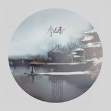

奉君书
============================

|  |  |
| :--: | :-- |
| [ 奉君书](https://emumo.xiami.com/album/1216557282) | **艺人**: [冬子](../index.md) **语种**: 国语 **唱片公司**: 独立发行 **发行时间**: 2014年11月21日 **专辑类别**: EP, 单曲 **专辑风格**: 摇滚 Rock & Roll, 国语流行 Mandarin Pop, 中国风 China-Wave **播放数**: 16355 **收藏数**: 5 **评论数**: 0  |

## 简介

 

奉君书SQ品质。
 

 

## 曲目

## 评论

|  |  |  |  |
| :-- | :-- | :-- | :-- |
