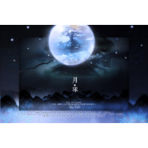

月琢古剑奇谭2群像
============================

|  |  |
| :--: | :-- |
| [ 月琢古剑奇谭2群像](https://emumo.xiami.com/album/1529789230) | **艺人**: [冬子](../index.md) **语种**: 国语 **唱片公司**: 独立发行 **发行时间**: 2015年04月23日 **专辑类别**: EP, 单曲 **专辑风格**: 同人音乐 DouJin, 国语流行 Mandarin Pop, 中国风 China-Wave **播放数**: 482187 **收藏数**: 42 **评论数**: 5  |

## 简介

 
 

PV：<a href="http://www.bilibili.com/video/av2231703/" target="_blank" rel="nofollow noreferrer noopener">http://www.bilibili.com/video/av2231703/</a>
 

 
 

策划：甘乐&amp;狐溟諾
 

作词：姜敷/三日月/琴中镜/庭前风/泠紫雪/林淮/息十二
 

作曲：IRiS七叶
 

编曲：灰原穷
 

演唱：齐栾/IRiS七叶/意意/清弄/梦岚/HITA/小千/冬子/奇然/吾恩/横颜/蛙蛙
 

和声：小吴太太
 

念白： 夏夷则-cv19、阿阮-石困困、乐无异-阿册、闻人羽-风镜、沧溟-蓦浅浅
 

乐器演奏：弹棉花的花哥（二胡）、水玥兒（笛&amp;南萧）
 

分轨&amp;混音：CuTTleFiSh
 

剧情后期：唐昕zenia
 

绘图：醉林霜
 

海报：青海草原
 

 
 

齐栾：
 

人间徒走笔 夜来月起
 

沉思间 喧寂一如甘饴
 

IRiS七叶：
 

此身缚蝶与 皆为梦呓
 

浮尘湮 天地随沧海宴息
 

【词：姜敷】
 

小千：
 

负万千罪愆 步入沉寂
 

一步一止夜色凄
 

冬子：
 

路长而歧 执伞而立
 

待雨过天晴人间花期
 

永夜终尽 举目晨曦
 

【词：三日月】
 

意意：
 

知君应许归期 往昔如白驹
 

奇然：
 

曾盼岁月停驻须臾
 

奇然＆意意：
 

斗转星移 一生伉俪
 

路途漫漫 唯愿执手相依
 

【词：琴中镜】
 

 
 

齐栾＆IRiS七叶＆意意：
 

以今生错步 跋涉累世孑然归途
 

饮百味沉浮 何惧红尘罢离辜
 

小千＆冬子＆奇然：
 

纷纭风雪皆负 唯相思彻骨
 

千山路 命数枯荣终领悟
 

【词：庭前风】
 

 
 

夏夷则：
 

想来这人世间，总是离别多于相聚，失意多于欢欣……
 

但是，现在我有师尊，有能托付生死的朋友，有想保护的人……
 

阿阮 ：
 

至少，等到下一次分别的时候，我不想再后悔……不想，再这么难过。
 

 
 

吾恩：
 

踏命途坎坷 唯解孤客
 

谁凭剑拥雪一蓑
 

清弄：
 

浮生萍聚 难测分合
 

闻笛枕烟波 鸾语成歌
 

朝暮花落 归于山河
 

【词：泠紫雪】
 

横颜君：
 

偏以深情来涉这无情烟波
 

梦岚：
 

危茫局中 渡君一诺&nbsp;
 

横颜君＆梦岚：
 

百年何惧 白首顷刻
 

谁堪一搏 如此温柔胆色
 

 
 

清弄＆梦岚＆HITA：
 

纵天意苍茫 允我此生倾身相护
 

挽隔世惊鸿 魂梦中长此凝伫
 

吾恩＆横颜＆蛙蛙：
 

世间万种起伏 描风流眉目
 

再回眸 潋滟山水应如初
 

【词：林淮】
 

 
 

乐无异：
 

我自己的路，只能我自己走；我看重的人，只能用自己的手去保护。
 

闻人羽：
 

既然我是天罡，那就必须保护好我的同伴——我们天罡，就是为此而存在的，这是我的责任和荣耀。
 

 
 

蛙蛙：
 

天罡出星河 身堕婆娑
 

蛙蛙＆HITA：
 

梦中千山纵巍峨
 

HITA：
 

红颜随百草 莫待东风摧折
 

蛙蛙＆HITA：
 

邀战一回合
 

 
 

女声：
 

若永夜无轮回 终将葬送于尘埃
 

不必回头看 硙硙旧城蔓青苔
 

男声：
 

只不悔问一声 故人何时来
 

何时来 破开那重重暮霭
 

【词：息十二】
 

 
 

沧溟：
 

但愿此去能化归烟云浮尘……逍遥天地，再无拘束……
 

 

## 曲目

## 评论

|  |  |  |  |
| :-- | :-- | :-- | :-- |
|  [虾米用户](https://emumo.xiami.com/u/45536002)  2019-04-23 22:16 赞(0) 踩(0) | 
很好听，尤其是最后合唱部分。
 |
|  [虾米用户](https://emumo.xiami.com/u/354893403)  2019-02-25 20:15 赞(0) 踩(0) | 
差强吾意
 |
|  [虾米用户](https://emumo.xiami.com/u/12699714)   2015-07-23 12:39 赞(0) 踩(0) | 
女生配音出彩，听到泪目了
 |
|  [虾米用户](https://emumo.xiami.com/u/49025905) 我曾是你最心爱的玩具。 ... 2015-04-23 19:55 赞(0) 踩(0) | 
冬爷威武！ 
 |
|  [虾米用户](https://emumo.xiami.com/u/44883471) 暂无签名~ 2015-04-23 19:51 赞(0) 踩(0) | 
好听好听好听QwQ
 |
